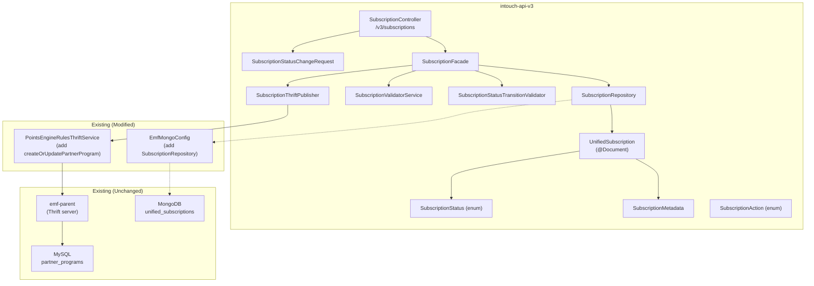
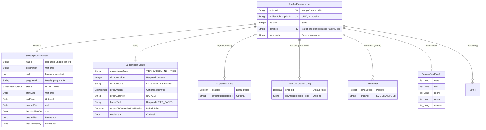
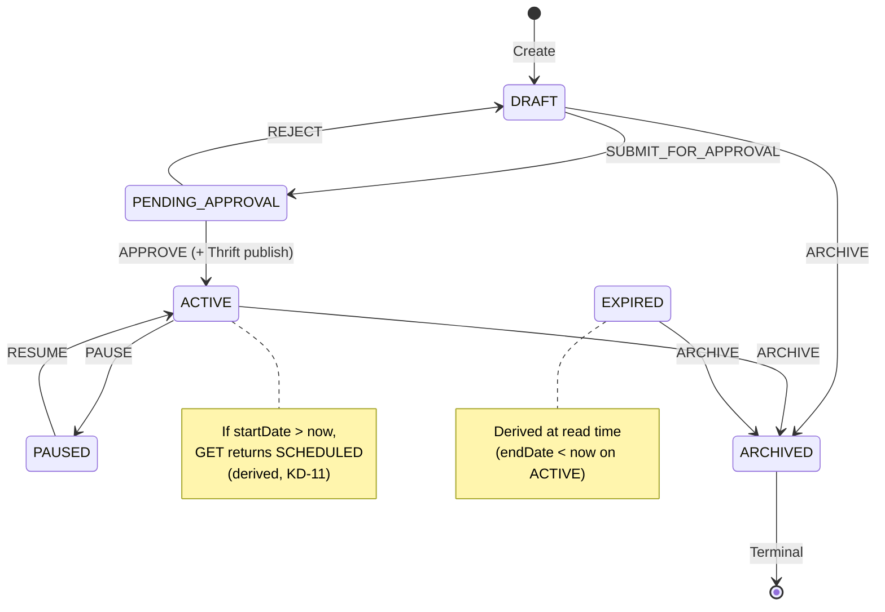
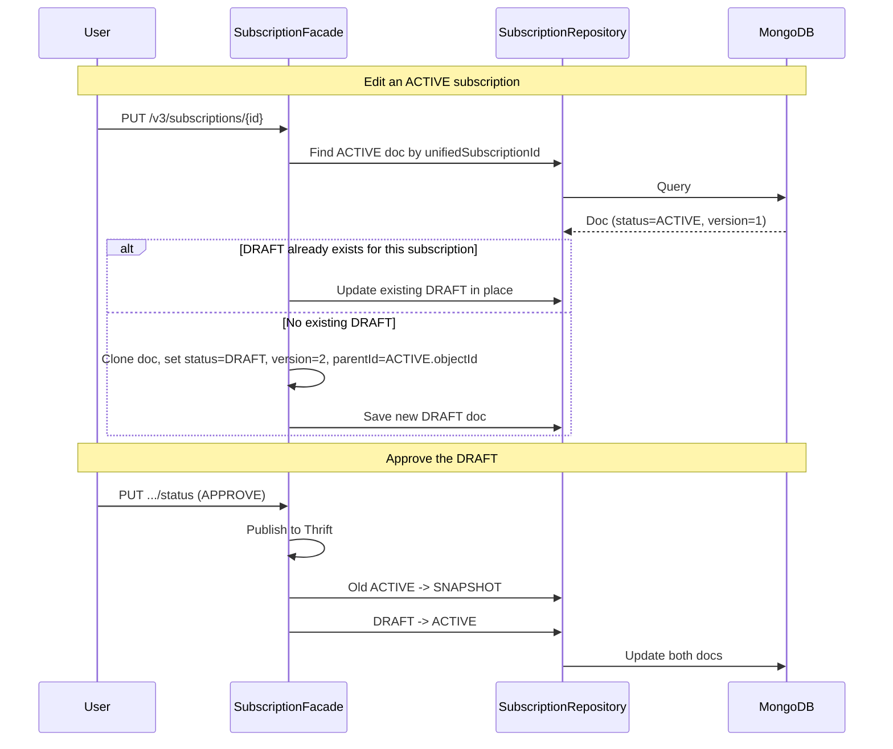
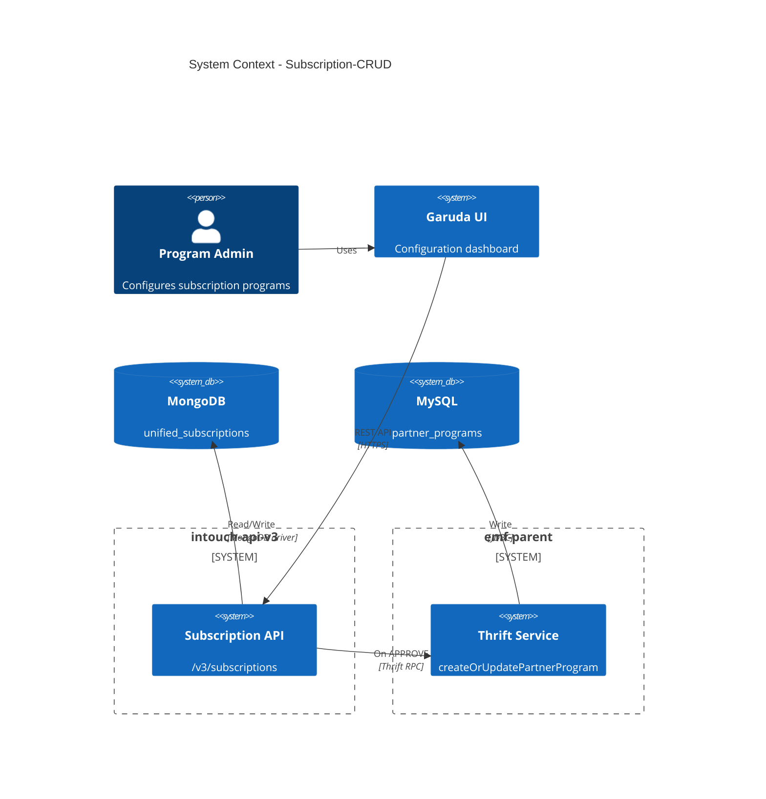

# Architecture Design -- Subscription-CRUD

> Phase: 6 (HLD -- Architect)
> Feature: Subscription Programs Configuration (E3)
> Ticket: aidlc-demo-v2
> Date: 2026-04-09

---

## 1. Current State Summary

### What exists
- **UnifiedPromotion** in intouch-api-v3: Full CRUD + lifecycle + maker-checker for promotions, stored in MongoDB (`unified_promotions` collection), with Thrift publish to emf-parent on approval.
- **PartnerProgram** in emf-parent: MySQL entity written via `createOrUpdatePartnerProgram` Thrift method. Has name, type (EXTERNAL/SUPPLEMENTARY), tier config, membership cycle, expiry, and is_active flag.
- **RequestManagementFacade**: Generic EntityType router for status changes. Currently only routes PROMOTION.
- **EmfMongoConfig**: Multi-tenant MongoDB routing via EmfMongoTenantResolver. Routes UnifiedPromotionRepository to emfMongoTemplate.
- **StatusTransitionValidator**: Promotion-specific state transitions using EnumMap.
- **PointsEngineRulesThriftService**: Thrift client for emf-parent. Has promotion methods but NO partner program methods.

### What does not exist
- No REST APIs for subscription/partner program management in intouch-api-v3
- No subscription document in MongoDB
- No subscription lifecycle state machine
- No maker-checker workflow for subscriptions
- No Thrift client method for `createOrUpdatePartnerProgram` in intouch-api-v3

---

## 2. Pattern Options Considered

| Pattern | What it solves | Fit with codebase | Tradeoffs | Recommended? |
|---------|---------------|-------------------|-----------|--------------|
| **A. Clone-and-Adapt (UnifiedPromotion)** | Full subscription lifecycle via own package mirroring promotion architecture | **HIGH** -- identical pattern already proven | Gain: fastest, lowest risk, zero learning curve. Cost: some structural duplication. | **Yes** |
| **B. Generic Entity Framework** | Extract shared base classes for promotions and subscriptions | **LOW** -- requires risky refactoring of working promotion code | Gain: less duplication. Cost: high risk, 2-3x time, no business value. | No |
| **C. Separate Microservice** | Isolate subscription as new service | **LOW** -- massive infrastructure overhead | Gain: isolation. Cost: new Thrift IDL, deployment pipeline, DevOps. | No |

**Chosen**: Pattern A (Clone-and-Adapt). Rationale: KD-07 explicitly chose the UnifiedPromotion pattern. The codebase has one proven way to do document-based lifecycle management with maker-checker -- follow it exactly. Refactoring to shared abstractions (Pattern B) is a valid future optimization once both entities are stable.

---

## 3. Problem Statement

Build a subscription program management API surface in intouch-api-v3 that enables creating, configuring, and managing the lifecycle of subscription programs through REST endpoints, with maker-checker approval workflows and benefit ID linking. On approval, publish the subscription to MySQL via Thrift.

---

## 4. Scope

### In Scope
- Subscription CRUD (create, read, list, update, delete DRAFT)
- 6-state lifecycle with validated transitions + 1 derived state
- Maker-checker versioning (edit-of-active creates pending version)
- Benefit ID linking (dummy objects, no validation)
- Thrift publish on ACTIVE transition (`createOrUpdatePartnerProgram`)
- Reminder and custom field config storage (no triggering)
- Approvals listing

### Out of Scope
- Enrollment operations (KD-16: stays on existing v2 paths)
- Reminder triggering / custom field enforcement
- SCHEDULED->ACTIVE / ACTIVE->EXPIRED automatic transitions
- Real benefit validation (deferred to E2/E4 run)
- ExtendedField.EntityType addition (deferred -- price in MongoDB doc)

---

## 5. Proposed Modules / Components

### 5.1 Component Map



### 5.2 Component Responsibilities

| Component | Responsibility |
|-----------|---------------|
| **SubscriptionController** | REST endpoints at `/v3/subscriptions`. Extracts auth context. Delegates to facade. |
| **SubscriptionFacade** | Business logic: CRUD, status transitions, maker-checker versioning, Thrift publish coordination. |
| **SubscriptionRepository** | MongoRepository interface for UnifiedSubscription. @Query methods for org-scoped lookups. |
| **SubscriptionStatusTransitionValidator** | EnumMap<SubscriptionStatus, Set<SubscriptionAction>> for valid transitions. |
| **SubscriptionValidatorService** | Name uniqueness per org. Field constraint validation. |
| **SubscriptionThriftPublisher** | Maps UnifiedSubscription to PartnerProgramInfo Thrift struct. Calls PointsEngineRulesThriftService. |
| **UnifiedSubscription** | @Document(collection="unified_subscriptions") MongoDB entity. |
| **SubscriptionMetadata** | Nested metadata POJO: name, description, orgId, programId, status, dates, createdBy. |
| **SubscriptionStatus** | Enum: DRAFT, PENDING_APPROVAL, ACTIVE, PAUSED, EXPIRED, ARCHIVED. |
| **SubscriptionAction** | Enum: SUBMIT_FOR_APPROVAL, APPROVE, REJECT, PAUSE, RESUME, ARCHIVE. |
| **SubscriptionStatusChangeRequest** | DTO with "action" field (not "promotionStatus"). |

---

## 6. Dependencies Between Modules

- SubscriptionController -> SubscriptionFacade (1:1 delegation)
- SubscriptionFacade -> SubscriptionRepository (MongoDB persistence)
- SubscriptionFacade -> SubscriptionStatusTransitionValidator (transition guard)
- SubscriptionFacade -> SubscriptionValidatorService (field validation)
- SubscriptionFacade -> SubscriptionThriftPublisher (on APPROVE only)
- SubscriptionThriftPublisher -> PointsEngineRulesThriftService (Thrift client)
- SubscriptionRepository -> EmfMongoConfig (routes to emfMongoTemplate)
- No circular dependencies. All arrows flow downward.

---

## 7. API Design

### 7.1 Endpoint Summary

| Method | Path | Description | Status Required |
|--------|------|-------------|-----------------|
| POST | `/v3/subscriptions` | Create subscription | - |
| GET | `/v3/subscriptions/{unifiedSubscriptionId}` | Get by ID | Query param: status |
| GET | `/v3/subscriptions` | List (paginated, filtered) | Query params: programId, status, page, size |
| PUT | `/v3/subscriptions/{unifiedSubscriptionId}` | Update subscription | - |
| DELETE | `/v3/subscriptions/{unifiedSubscriptionId}` | Delete DRAFT | - |
| PUT | `/v3/subscriptions/{unifiedSubscriptionId}/status` | Change status | Body: action |
| POST | `/v3/subscriptions/{unifiedSubscriptionId}/benefits` | Link benefits | Body: benefitIds |
| GET | `/v3/subscriptions/{unifiedSubscriptionId}/benefits` | List benefits | - |
| DELETE | `/v3/subscriptions/{unifiedSubscriptionId}/benefits` | Unlink benefits | Body: benefitIds |
| GET | `/v3/subscriptions/approvals` | List pending approvals | - |

### 7.2 Status Change API

**Endpoint**: `PUT /v3/subscriptions/{unifiedSubscriptionId}/status`

**Why a separate controller instead of RequestManagementFacade routing**:
- RequestManagementController returns `ResponseEntity<ResponseWrapper<UnifiedPromotion>>` -- hardcoded return type
- Changing it to a generic type would break existing promotion API backward compatibility
- Subscription needs its own DTO (SubscriptionStatusChangeRequest with "action" field instead of "promotionStatus")
- Cleaner separation: subscription is self-contained in its own package

**Request body**:
```json
{
  "action": "APPROVE",
  "reason": "Reviewed and approved"
}
```

### 7.3 Response Format

All endpoints return `ResponseEntity<ResponseWrapper<UnifiedSubscription>>` following the existing pattern.

Error responses follow the existing structured format:
```json
{
  "data": null,
  "errors": [{"field": "name", "error": "REQUIRED", "message": "Subscription name is required"}],
  "warnings": null
}
```

---

## 8. Data Model

### 8.1 UnifiedSubscription MongoDB Document



### 8.2 Document Structure (JSON)

```json
{
  "objectId": "auto-generated-mongo-id",
  "unifiedSubscriptionId": "a1b2c3d4e5f6...",
  "metadata": {
    "name": "Gold Subscription",
    "description": "Premium membership with tier benefits",
    "orgId": 100458,
    "programId": "469",
    "status": "DRAFT",
    "startDate": "2026-05-01T00:00:00Z",
    "endDate": "2027-05-01T00:00:00Z",
    "createdOn": "2026-04-09T10:00:00Z",
    "lastModifiedOn": "2026-04-09T10:00:00Z",
    "createdBy": 12345,
    "lastModifiedBy": 12345
  },
  "subscriptionType": "TIER_BASED",
  "duration": {"value": 12, "unit": "MONTHS"},
  "price": {"amount": 99.99, "currency": "USD"},
  "linkedTierId": "tier-gold-001",
  "restrictToOneActivePerMember": false,
  "expiryDate": "2027-05-01T00:00:00Z",
  "migrateOnExpiry": {"enabled": false, "targetSubscriptionId": null},
  "tierDowngradeOnExit": {"enabled": false, "downgradeTargetTierId": null},
  "benefitIds": ["benefit-001", "benefit-002"],
  "reminders": [
    {"daysBefore": 30, "channel": "EMAIL"},
    {"daysBefore": 7, "channel": "SMS"}
  ],
  "customFields": {
    "meta": [101, 102],
    "link": [103],
    "delink": [],
    "pause": [],
    "resume": []
  },
  "parentId": null,
  "version": 1,
  "comments": null,
  "partnerProgramId": null
}
```

### 8.3 Thrift Field Mapping (on APPROVE)

| UnifiedSubscription field | PartnerProgramInfo field | Notes |
|--------------------------|-------------------------|-------|
| metadata.name | partnerProgramName | Required |
| metadata.description | description | Optional |
| subscriptionType == TIER_BASED | isTierBased = true | Boolean |
| (tier slab config if TIER_BASED) | partnerProgramTiers | Optional list |
| (derived from pricing) | programToPartnerProgramPointsRatio | Default 1.0 if no pricing |
| unifiedSubscriptionId | partnerProgramUniqueIdentifier | Unique ID |
| "SUPPLEMENTARY" | partnerProgramType | All v3 subscriptions are SUPPLEMENTARY |
| duration | partnerProgramMembershipCycle | {cycleType, cycleValue} |
| tierDowngradeOnExit.enabled | isSyncWithLoyaltyTierOnDowngrade | Boolean |
| expiryDate | expiryDate | Unix timestamp (i64) |
| true | updatedViaNewUI | Signals v3 origin |
| partnerProgramId (from prev call) | partnerProgramId | 0 for create, >0 for update |

---

## 9. Lifecycle State Machine

### 9.1 Stored States (6)



### 9.2 Transition Table

| Current Status | Action | Target Status | Side Effect |
|---------------|--------|---------------|-------------|
| DRAFT | SUBMIT_FOR_APPROVAL | PENDING_APPROVAL | - |
| PENDING_APPROVAL | APPROVE | ACTIVE | Thrift `createOrUpdatePartnerProgram` |
| PENDING_APPROVAL | REJECT | DRAFT | Comment stored |
| ACTIVE | PAUSE | PAUSED | - (enrollment blocking is client-side) |
| PAUSED | RESUME | ACTIVE | - |
| DRAFT | ARCHIVE | ARCHIVED | Terminal |
| ACTIVE | ARCHIVE | ARCHIVED | Terminal |
| EXPIRED | ARCHIVE | ARCHIVED | Terminal |
| ARCHIVED | (none) | - | Terminal state |

### 9.3 Derived Statuses (at read time, not stored)

| Stored Status | Condition | Effective Status |
|--------------|-----------|-----------------|
| ACTIVE | startDate > now | SCHEDULED |
| ACTIVE | endDate < now | EXPIRED |
| ACTIVE | startDate <= now <= endDate | ACTIVE (no change) |

### 9.4 Maker-Checker Versioning



---

## 10. Business Rules and Validation

### 10.1 Create Validation
- `metadata.name`: Required, non-blank, max 255 chars, unique per org (across DRAFT/ACTIVE/PAUSED/PENDING_APPROVAL)
- `duration.value`: Required, positive integer
- `duration.unit`: Required, one of DAYS/MONTHS/YEARS
- `subscriptionType`: Required, one of TIER_BASED/NON_TIER
- `linkedTierId`: Required if TIER_BASED, must be null if NON_TIER
- `price.amount`: Optional. If provided, must be >= 0
- `price.currency`: Required if price.amount provided
- `reminders`: Max 5 entries. Each: daysBefore > 0, channel in (SMS/EMAIL/PUSH)
- `benefitIds`: Optional array. No validation against benefits service (dummy objects per KD-08)

### 10.2 Status Transition Rules
- Only valid transitions per the EnumMap (Section 9.2)
- Invalid transitions return 400 with allowed transitions list
- APPROVE triggers Thrift publish (blocking -- must succeed or APPROVE fails)
- REJECT stores comment in `comments` field

### 10.3 Update Rules
- DRAFT: update in place
- ACTIVE / PAUSED: create versioned DRAFT (version N+1, parentId -> ACTIVE)
- PENDING_APPROVAL / EXPIRED / ARCHIVED: 400 "Cannot update in status X"
- If DRAFT already exists for ACTIVE subscription: update existing DRAFT

### 10.4 Delete Rules
- Only DRAFT without parentId can be deleted
- Non-DRAFT returns 400 "Only DRAFT subscriptions can be deleted"

### 10.5 Tenant Isolation
- All queries include orgId filter (from auth context, never from user input)
- MongoDB queries: `{'metadata.orgId': orgId, ...}`
- Cross-org access returns 404 (not 403 -- no information leakage)

---

## 11. Architecture Decision Records (ADRs)

### ADR-1: Separate SubscriptionController (not RequestManagementFacade)

**Context**: RequestManagementController routes status changes via EntityType enum. Could add SUBSCRIPTION to EntityType and route through it.

**Decision**: Create a separate SubscriptionController with its own status change endpoint.

**Rationale**:
- RequestManagementController returns `ResponseEntity<ResponseWrapper<UnifiedPromotion>>` -- cannot generalize without breaking backward compatibility
- StatusChangeRequest DTO has "promotionStatus" field with promotion-specific @Pattern regex
- Subscription is self-contained: CRUD + lifecycle + benefits in one controller
- Follows the principle of each entity owning its full API surface

**Consequences**: 
- (+) No changes to existing promotion code
- (+) Subscription package is independently deployable/testable
- (-) EntityType enum does not include SUBSCRIPTION (but it's not needed since we don't route through RequestManagementFacade)

### ADR-2: MongoDB-First with Thrift Write-Back (KD-07)

**Context**: Subscriptions need lifecycle management, maker-checker, and rich config. Existing MySQL partner_programs table has only basic fields and no lifecycle states.

**Decision**: All subscription config and lifecycle in MongoDB. MySQL written only on APPROVE via existing Thrift method.

**Rationale**: See KD-07. Proven pattern from UnifiedPromotion. Zero MySQL schema changes.

**Consequences**:
- (+) Rich document model, flexible schema, maker-checker versioning
- (+) Zero Flyway migrations
- (-) Data split: MongoDB is source of truth for config, MySQL is source of truth for enrollment
- (-) Must keep name consistent between MongoDB and MySQL (unique constraint)

### ADR-3: SCHEDULED as Derived Status (KD-11)

**Context**: BRD requires 7 states including SCHEDULED. Options: store it or derive it.

**Decision**: Store ACTIVE in MongoDB. At read time, if startDate > now, return SCHEDULED.

**Rationale**: Follows UnifiedPromotion UPCOMING pattern. Avoids scheduled job infrastructure.

**Consequences**:
- (+) No background jobs needed
- (+) Consistent with promotion pattern
- (-) Status change queries must account for derived status (e.g., "list SCHEDULED" = find ACTIVE where startDate > now)
- (-) EXPIRED is also derived (endDate < now on ACTIVE) -- same approach

### ADR-4: Benefits as FK References Only (KD-08)

**Context**: Subscriptions need benefit linking. Benefits are a future entity (E2/E4).

**Decision**: Store `benefitIds: ["id1", "id2"]` in the subscription document. No validation, no embedded snapshots.

**Rationale**: See KD-08. Clean separation. Benefits are a cross-cutting entity, not a subscription sub-entity.

### ADR-5: Enrollment Out of Scope (KD-16)

**Context**: Original PRD included enrollment operations (enroll, unenroll, update, list).

**Decision**: v3 only calls `createOrUpdatePartnerProgram` on ACTIVE transition. Enrollment stays on existing v2 paths.

**Rationale**: See KD-16. Do not touch enrollment Thrift logic. Significant scope reduction.

---

## 12. Implementation Plan

### Phase 1: Foundation (blocking -- everything depends on this)
1. Create `UnifiedSubscription` @Document entity + `SubscriptionMetadata` model
2. Create `SubscriptionStatus` and `SubscriptionAction` enums
3. Create `SubscriptionRepository` interface
4. Modify `EmfMongoConfig` to include SubscriptionRepository in routing
5. Create `SubscriptionValidatorService` (name uniqueness)

### Phase 2: CRUD (depends on Phase 1)
6. Create `SubscriptionFacade` with create, get, list, update, delete methods
7. Create `SubscriptionController` with CRUD endpoints
8. Create `SubscriptionStatusChangeRequest` DTO

### Phase 3: Lifecycle (depends on Phase 2)
9. Create `SubscriptionStatusTransitionValidator`
10. Implement `changeStatus()` in SubscriptionFacade (all transitions)
11. Add status change endpoint to SubscriptionController

### Phase 4: Thrift Publish (depends on Phase 3)
12. Add `createOrUpdatePartnerProgram()` to PointsEngineRulesThriftService
13. Create `SubscriptionThriftPublisher` (maps subscription to PartnerProgramInfo)
14. Wire into APPROVE flow in SubscriptionFacade

### Phase 5: Benefits + Approvals (can parallel with Phase 4)
15. Add benefit linking endpoints (link, list, unlink) to controller/facade
16. Add approvals listing endpoint

### Phase 6: Maker-Checker Versioning (depends on Phase 2)
17. Implement edit-of-active flow (createVersionedSubscription)
18. Implement approve-with-parent flow (old ACTIVE -> SNAPSHOT)

---

## 13. Open Questions

| # | Question | Impact | For Phase |
|---|----------|--------|-----------|
| OQ-A1 | Should PAUSE update partner_programs.is_active in MySQL? Currently no Thrift call on PAUSE. | Enrollment behaviour when subscription is PAUSED | Designer |
| OQ-A2 | Should EXPIRED status trigger any Thrift call? (e.g., set is_active=false in MySQL) | Data consistency between MongoDB and MySQL | Designer |
| OQ-A3 | What programId to use for the Thrift call? Is it always from metadata.programId? | PartnerProgramInfo mapping | Designer |

---

## Diagrams

### System Context



---

*Architecture design complete. Ready for Impact Analysis (Phase 6a) and LLD (Phase 7).*
