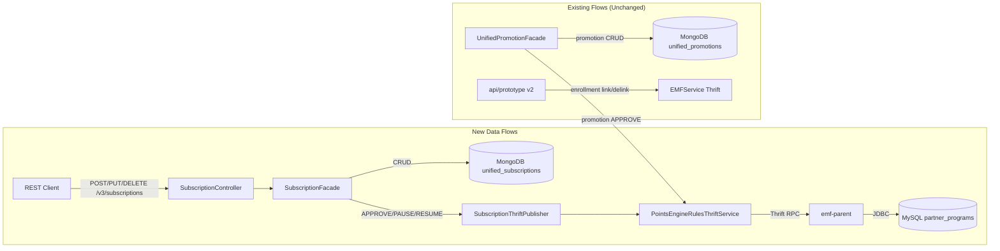

# Impact Analysis -- Subscription-CRUD

> Phase: 6a (Analyst --impact)
> Feature: Subscription Programs Configuration (E3)
> Ticket: aidlc-demo-v2
> Date: 2026-04-09

---

## 1. Change Summary

| Category | Change | Repo | Risk |
|----------|--------|------|------|
| NEW | UnifiedSubscription @Document entity + SubscriptionMetadata + SubscriptionConfig nested models | intouch-api-v3 | Low |
| NEW | SubscriptionRepository (MongoRepository interface) | intouch-api-v3 | Low |
| NEW | SubscriptionFacade (CRUD + lifecycle + benefits + maker-checker) | intouch-api-v3 | Medium |
| NEW | SubscriptionController (10 REST endpoints) | intouch-api-v3 | Low |
| NEW | SubscriptionStatusTransitionValidator (EnumMap-based) | intouch-api-v3 | Low |
| NEW | SubscriptionValidatorService (name uniqueness, programId immutability) | intouch-api-v3 | Medium |
| NEW | SubscriptionThriftPublisher (map to PartnerProgramInfo, call Thrift) | intouch-api-v3 | High |
| NEW | SubscriptionStatus enum (6 states) | intouch-api-v3 | Low |
| NEW | SubscriptionAction enum | intouch-api-v3 | Low |
| NEW | SubscriptionStatusChangeRequest DTO | intouch-api-v3 | Low |
| **MODIFY** | EmfMongoConfig -- add SubscriptionRepository to includeFilters | intouch-api-v3 | **High** |
| **MODIFY** | PointsEngineRulesThriftService -- add createOrUpdatePartnerProgram wrapper | intouch-api-v3 | **High** |

---

## 2. Impact Map

### 2.1 Modules Affected

| Module | Impact Type | Severity | Evidence |
|--------|-----------|----------|----------|
| **EmfMongoConfig** (config) | MODIFY -- add SubscriptionRepository to includeFilters | HIGH | EmfMongoConfig.java:30-33. Both MongoConfig and EmfMongoConfig scan `com.capillary.intouchapiv3` with includeFilters. Wrong routing = wrong database. |
| **EmfMongoConfigTest** (test config) | MODIFY -- add SubscriptionRepository to includeFilters | HIGH | EmfMongoConfigTest.java:27-33. Also has basePackages restricted to promotion package -- must be expanded. |
| **PointsEngineRulesThriftService** (Thrift client) | MODIFY -- add new method | HIGH | 16 existing callers inject this service. Method addition is additive (no signature changes). But test stub must also be updated. |
| **PointsEngineRulesThriftServiceStub** (test) | MODIFY -- override new method | MEDIUM | Stub extends PointsEngineRulesThriftService. If new method not overridden, test attempts real Thrift call -> connection refused -> test failure. |
| **MongoDB (unified_subscriptions collection)** | NEW -- new collection | LOW | New collection, no migration. EmfMongoTenantResolver handles per-org routing. |
| **Existing promotion code** | NOT AFFECTED | NONE | No changes to UnifiedPromotion, UnifiedPromotionFacade, UnifiedPromotionRepository, StatusTransitionValidator, or any promotion class. Confirmed: subscription is a parallel package, not a modification. [C7] |
| **emf-parent** | NOT AFFECTED | NONE | createOrUpdatePartnerProgram already exists at PointsEngineRuleConfigThriftImpl:252. No changes needed. [C7] |
| **thrifts** | NOT AFFECTED | NONE | PartnerProgramInfo struct and createOrUpdatePartnerProgram method already defined. [C7] |
| **cc-stack-crm** | NOT AFFECTED | NONE | partner_programs table schema unchanged. [C7] |
| **api/prototype** | NOT AFFECTED | NONE | ExtendedField.EntityType unchanged in this run. [C6] |

### 2.2 Data Flow Impact

### 2.3 Upstream Callers (who calls the modified code)

| Modified File | Existing Callers | Risk to Existing Callers |
|--------------|-----------------|-------------------------|
| EmfMongoConfig | Spring auto-wires UnifiedPromotionRepository via @EnableMongoRepositories | NONE if includeFilters is additive (adding SubscriptionRepository.class to the array). Spring resolves both. [C6] |
| PointsEngineRulesThriftService | 16 files (UnifiedPromotionFacade, PromotionTransformerImpl, RollbackManager, LimitTransformerImpl, etc.) | NONE -- adding a new method does not change existing method signatures. [C7] |
| PointsEngineRulesThriftServiceStub | Integration tests via @Profile("test") | MUST override new method -- otherwise real Thrift call attempted in test. [C7] |

### 2.4 Downstream Dependencies (what the new code calls)

| New Component | Depends On | Risk |
|--------------|-----------|------|
| SubscriptionRepository | emfMongoTemplate (from EmfMongoConfig) | Must be correctly routed. If not in includeFilters, Spring uses primary mongoTemplate -> wrong DB. |
| SubscriptionThriftPublisher | PointsEngineRulesThriftService | New method must be added to the service. Must handle TException. |
| SubscriptionFacade | SubscriptionRepository, SubscriptionStatusTransitionValidator, SubscriptionValidatorService, SubscriptionThriftPublisher | All new code -- no existing dependency risk. |

---

## 3. Side Effects

### 3.1 Behavioral Side Effects

| Side Effect | Severity | Description | Mitigation |
|-------------|----------|-------------|------------|
| **MongoDB collection auto-creation** | LOW | First save to `unified_subscriptions` auto-creates collection in MongoDB. No explicit schema setup needed. | Expected behaviour. Add index creation for orgId + name + status on startup. |
| **Thrift connection pool sharing** | MEDIUM | SubscriptionThriftPublisher shares the same Thrift client (emf-thrift-service:9199) as promotion operations. Under heavy subscription approval load, promotion Thrift calls could be delayed. | Thrift uses per-call connections (60s timeout verified in PointsEngineRulesThriftService). No persistent pool. Risk is low unless many concurrent APPROVEs. |
| **MySQL partner_programs row creation on APPROVE** | LOW | New rows appear in partner_programs table. Existing queries against this table (enrollment, partner program listing) will include subscription programs. | Expected -- subscriptions ARE partner programs at the MySQL level. is_active flag correctly set. |
| **MySQL name uniqueness edge case (KD-24)** | HIGH | MongoDB validates name uniqueness per programId. MySQL validates per org_id. A name can be valid in MongoDB (different programs) but rejected by MySQL UNIQUE(org_id, name). | SubscriptionValidatorService must check BOTH: (1) per-programId in MongoDB, (2) per-org in PointsEngineRulesThriftService on APPROVE. If Thrift returns name conflict, surface clear error. |

### 3.2 Performance Side Effects

| Area | Risk | Evidence | Mitigation |
|------|------|----------|------------|
| MongoDB query performance on list endpoint | LOW | Paginated with orgId filter. Index on {metadata.orgId, metadata.status} needed. | Create compound indexes at startup. |
| Thrift call latency on APPROVE/PAUSE/RESUME | MEDIUM | Blocking synchronous call. PointsEngineRulesThriftService uses 60s timeout. If emf-parent is slow, subscription status change hangs. | Set appropriate timeout. Implement retry logic for transient failures (G-04.3). |
| No N+1 risk | NONE | All subscription data in a single MongoDB document. No lazy-loaded relationships. | N/A |

### 3.3 Integration Side Effects

| Integration Point | Risk | Description |
|-------------------|------|-------------|
| **api/prototype v2 enrollment** | LOW | After APPROVE, partner_programs row exists in MySQL. Existing enrollment APIs (partnerProgramLinkingEvent) can now enroll members to the subscription. This is the INTENDED behaviour. |
| **Other microservices reading partner_programs** | MEDIUM | Any service that reads partner_programs table will see subscription programs alongside existing programs. If those services filter by type (EXTERNAL/SUPPLEMENTARY) or by updatedViaNewUI, they should handle new entries gracefully. |
| **Reporting / BI** | LOW | partner_programs table gains rows from v3 subscriptions. BI queries must not assume all partner programs came from v2 APIs. |

---

## 4. Security Considerations

### 4.1 Authentication & Authorization

| Check | Status | Evidence |
|-------|--------|----------|
| All endpoints require auth token | **MUST VERIFY** | Depends on Controller annotation. Must use same auth mechanism as existing controllers (e.g., @AuthCheck, Bearer token in header). [C5 -- pattern exists, must be followed] |
| Tenant isolation on all queries | **DESIGN ENFORCED** | orgId from auth context (not user input) applied to every MongoDB query (KD, C-05). Cross-org returns 404. [C6] |
| No PII in subscription data | **PASS** | Subscription is program config (name, duration, price, benefits). No customer PII. [C7] |
| Maker-checker auth | **ACCEPTED RISK** | Backend trusts caller (KD-13). No permission check on APPROVE. This is consistent with existing UnifiedPromotion. [C7] |

### 4.2 Input Validation

| Input | Validation Required | Status |
|-------|-------------------|--------|
| metadata.name | @NotBlank, @Size(max=255), uniqueness check | In design |
| metadata.programId | @NotNull, existence validation at create, immutability check on update | In design (KD-24) |
| duration.value | @Positive | In design |
| subscriptionType | @NotNull, enum validation | In design |
| benefitIds | Array of strings, no validation against benefits service | By design (KD-08) |
| action (status change) | Must match SubscriptionAction enum | In design |

### 4.3 Data Exposure

| Concern | Status | Notes |
|---------|--------|-------|
| Subscription config is not sensitive | PASS | Program names, durations, prices are business config, not customer data |
| benefitIds exposed in response | PASS | IDs only, no benefit metadata |
| partnerProgramId exposed after APPROVE | PASS | MySQL auto-generated ID, not sensitive |
| Thrift call carries orgId | PASS | Server-side, not exposed to client |

---

## 5. GUARDRAILS Compliance Check

| Guardrail | Status | Evidence |
|-----------|--------|----------|
| **G-01 Timezone** (CRITICAL) | **WARN** | startDate/endDate in subscription document. SCHEDULED and EXPIRED are derived by comparing against `now`. Must use `Instant.now()` (UTC), never `LocalDateTime.now()`. Derived status logic must handle timezone-aware comparison if user timezone stored. Architect specifies dates as ISO-8601 UTC -- but derived status comparison needs explicit verification in Designer/Developer. |
| **G-03 Security** (CRITICAL) | **PASS** | No SQL concatenation (MongoDB queries). Auth required on endpoints. Tenant context from token. No secrets in config. |
| **G-04 Performance** (HIGH) | **PASS** | Paginated list endpoint. No N+1 (single document). Thrift timeout configured. |
| **G-05 Data Integrity** (HIGH) | **WARN** | Maker-checker versioning (ACTIVE -> SNAPSHOT swap) must be atomic. If two documents updated in MongoDB and one fails, inconsistent state. Architect does not specify transactional boundary for the swap. EmfMongoConfig provides MongoTransactionManager -- should be used. |
| **G-06 API Design** (HIGH) | **PASS** | Structured error responses. ISO-8601 dates. Paginated listing. Correct HTTP methods. |
| **G-07 Multi-Tenancy** (CRITICAL) | **PASS** | orgId in every query (from auth context). EmfMongoTenantResolver routes to per-org database. Cross-org returns 404. |
| **G-09 Backward Compatibility** (HIGH) | **PASS** | No changes to existing APIs. New endpoints only. partner_programs rows are additive (new rows, not modified existing). |
| **G-10 Concurrency** (HIGH) | **WARN** | Concurrent APPROVE of same subscription (race condition). Two users submit APPROVE simultaneously -- both read PENDING_APPROVAL, both attempt Thrift call. Need optimistic locking or atomic status check-and-set. |
| **G-12 AI-Specific** (CRITICAL) | **PASS** | Following existing patterns (UnifiedPromotion). No new dependencies. Existing error handling patterns. |

---

## 6. Risk Register

| # | Risk | Severity | Likelihood | Impact | Mitigation |
|---|------|----------|-----------|--------|------------|
| R-01 | **EmfMongoConfig routing failure**: SubscriptionRepository not in includeFilters -> routes to wrong MongoDB template -> data written to wrong database | HIGH | LOW (if correctly implemented) | Subscription data in wrong DB, invisible to queries | Explicit includeFilters change + integration test verifying collection exists in correct DB |
| R-02 | **EmfMongoConfigTest not updated**: Test config doesn't include SubscriptionRepository -> integration tests use wrong template | HIGH | MEDIUM | All integration tests silently use wrong DB, pass but don't test real routing | Update basePackages + includeFilters in test config. Add routing verification test. |
| R-03 | **PointsEngineRulesThriftServiceStub missing override**: Test stub doesn't override createOrUpdatePartnerProgram -> test attempts real Thrift connection -> ConnectionRefused | HIGH | HIGH (unless explicitly addressed) | All APPROVE/PAUSE/RESUME integration tests fail | Add stub override returning dummy PartnerProgramInfo |
| R-04 | **MongoDB/MySQL name uniqueness mismatch**: Name unique per programId in MongoDB but per org_id in MySQL -> APPROVE fails with MySQL constraint violation | MEDIUM | MEDIUM (depends on org having multiple programs) | APPROVE returns 500 with SQL exception, poor UX | Pre-validate name org-wide before Thrift call, OR catch MySQL exception and return 409 |
| R-05 | **Thrift call failure on APPROVE**: emf-parent down or slow -> APPROVE hangs or fails | MEDIUM | LOW (infra reliability) | Subscription stuck in PENDING_APPROVAL | Timeout (60s exists), clear error message, retry guidance in response |
| R-06 | **Thrift call failure on PAUSE/RESUME**: Same as R-05 but for lifecycle transitions | MEDIUM | LOW | Subscription status change fails, MongoDB and MySQL out of sync | Same mitigation as R-05. If Thrift fails, do NOT update MongoDB status. |
| R-07 | **Concurrent APPROVE race condition**: Two approvals for same subscription simultaneously | MEDIUM | LOW | Double Thrift call, possible duplicate partner_programs entry | Optimistic locking on MongoDB document (version field check) or atomic findAndModify |
| R-08 | **EXPIRED/MySQL is_active inconsistency**: Subscription expires but MySQL still shows is_active=true | LOW | CERTAIN (by design, KD-23) | Enrollment APIs may allow enrollment to expired subscription | Accepted risk per KD-23. Document for future resolution. |
| R-09 | **Timezone in derived status**: SCHEDULED/EXPIRED comparison uses server time, subscription dates may be in user's timezone | MEDIUM | MEDIUM | Wrong derived status near timezone boundaries | Enforce UTC storage (G-01.1). Compare Instant to Instant. |
| R-10 | **Maker-checker SNAPSHOT swap not atomic**: Update two documents (old ACTIVE -> SNAPSHOT, DRAFT -> ACTIVE) without transaction | MEDIUM | LOW | Partial update: old ACTIVE still active AND new version active simultaneously | Use emfMongoTransactionManager for the swap operation |

---

## 7. Verified vs Assumed Impacts

### Verified (from code reading)

| # | Impact | Evidence | Confidence |
|---|--------|----------|------------|
| V-01 | EmfMongoConfig includeFilters must be changed | EmfMongoConfig.java:30-33, only UnifiedPromotionRepository in array | C7 |
| V-02 | EmfMongoConfigTest basePackages is restricted to promotion package | EmfMongoConfigTest.java:27 -- `com.capillary.intouchapiv3.unified.promotion` | C7 |
| V-03 | PointsEngineRulesThriftService has no partner program methods | Full file read, confirmed no createOrUpdatePartnerProgram | C7 |
| V-04 | PointsEngineRulesThriftServiceStub extends service, must override new methods | PointsEngineRulesThriftServiceStub.java:26 | C7 |
| V-05 | MongoConfig also scans `com.capillary.intouchapiv3` with includeFilters | MongoConfig.java:28-36 | C7 |
| V-06 | 16 existing callers of PointsEngineRulesThriftService -- adding method is safe | grep count across src/main/java | C7 |
| V-07 | emf-parent createOrUpdatePartnerProgram already exists | PointsEngineRuleConfigThriftImpl.java:252 | C7 |
| V-08 | partner_programs UNIQUE(org_id, name) constraint | cc-stack-crm partner_programs.sql:19 | C7 |

### Assumed (need verification in Designer/Developer)

| # | Assumption | Confidence | Verification Needed |
|---|-----------|------------|-------------------|
| A-01 | Auth mechanism for new controller follows same pattern as existing controllers | C5 | Read existing controller auth annotations in Designer phase |
| A-02 | emfMongoTransactionManager can be used for SNAPSHOT swap atomicity | C5 | Verify transaction support on the emfMongoDatabaseFactory bean |
| A-03 | SubscriptionRepository in EmfMongoConfig includeFilters is sufficient for correct routing (no excludeFilter needed in MongoConfig) | C4 | Integration test must verify collection created in correct DB |

---

## 8. Recommendations for Downstream Phases

1. **Designer**: Ensure SubscriptionFacade uses `@Transactional("emfMongoTransactionManager")` for the ACTIVE<->SNAPSHOT swap in maker-checker approval flow.
2. **Designer**: Define error handling for Thrift failures on APPROVE/PAUSE/RESUME -- status must NOT change in MongoDB if Thrift fails.
3. **SDET**: Write a specific integration test for EmfMongoConfig routing -- verify `unified_subscriptions` collection is created in the EMF database, not the primary database.
4. **SDET**: Write a concurrent APPROVE test to verify race condition handling.
5. **Developer**: Add SubscriptionRepository to BOTH EmfMongoConfig.java and EmfMongoConfigTest.java. Update EmfMongoConfigTest basePackages to include subscription package.
6. **Developer**: Override `createOrUpdatePartnerProgram` in PointsEngineRulesThriftServiceStub.
7. **Developer**: Implement org-wide name uniqueness pre-check before Thrift call on APPROVE (in addition to programId-scoped check in MongoDB).

---

*Impact analysis complete. No BLOCKERS identified. 3 HIGH risks (R-01, R-02, R-03) all mitigable with correct implementation. 3 GUARDRAILS WARN items (G-01, G-05, G-10) flagged for Designer/Developer attention.*
