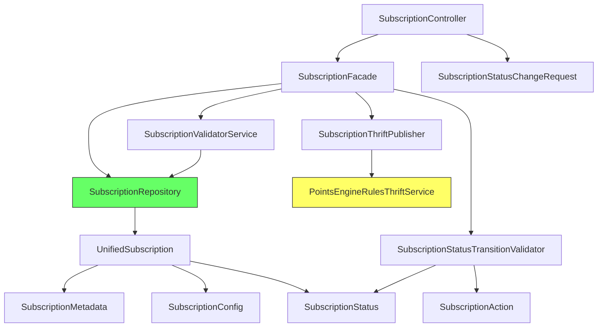
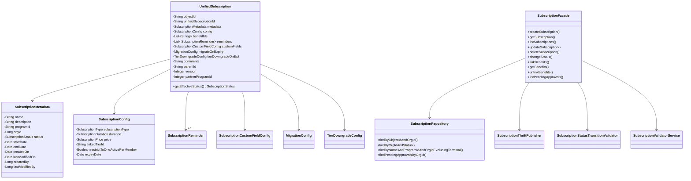

# Low-Level Design -- Subscription-CRUD

> Phase: 7 (LLD -- Designer)
> Feature: Subscription Programs Configuration (E3)
> Ticket: aidlc-demo-v2
> Date: 2026-04-09

---

## 0. Pattern Decisions (Step 0: Codebase Discovery)

### Discovery Summary

All patterns derived from **UnifiedPromotion** in `intouch-api-v3` -- the target module for subscription code. Every design choice below is directly traced to an existing file.

| Pattern | Existing Precedent | Subscription Follows |
|---------|-------------------|---------------------|
| Entity | `UnifiedPromotion.java` -- `@Data @Builder @Document @IgnoreGenerated`, Lombok, `@Id` String objectId | Yes, exact same |
| Repository | `UnifiedPromotionRepository.java` -- `MongoRepository<T, String>`, `@Repository`, `@Query` | Yes |
| Facade | `UnifiedPromotionFacade.java` -- `@Component`, `@Autowired` field injection | Yes |
| Controller | `UnifiedPromotionController.java` -- `@RestController`, constructor injection, `AbstractBaseAuthenticationToken`, `ResponseWrapper` | Yes |
| Status enum | `PromotionStatus.java` -- plain enum, stored values | Yes (different values) |
| Action enum | `PromotionAction.java` -- enum with `fromString()`, `getNormalizedAction()` | Simplified (no normalization needed) |
| Validator | `StatusTransitionValidator.java` -- `@Component`, `EnumMap`, `InvalidInputException` | Yes |
| Metadata | `Metadata.java` -- `@Data @Builder @JsonIgnoreProperties`, `jakarta.validation` | Yes |
| Response | `ResponseWrapper<T>` -- `new ResponseWrapper<>(data, errors, warnings)` | Yes |
| Auth | `AbstractBaseAuthenticationToken` + `IntouchUser` with `getOrgId()`, `getUserId()` | Yes |
| Date handling | `java.util.Date` with `@JsonFormat(pattern = "yyyy-MM-dd'T'HH:mm:ssXXX")` | Yes -- see G-01 note below |
| Exception | `InvalidInputException extends RuntimeException` | Yes |

### G-01 Date Pattern Decision

The existing codebase (`Metadata.java:54-58`) uses `java.util.Date` with `@JsonFormat`, NOT `java.time.Instant`. Per G-12.2 (follow project patterns, not "best practice"), subscription uses `java.util.Date` for consistency. This is a **known deviation from G-01.3** -- flagged for Reviewer, not changed here.

// Driven by G-12.2: Follow project patterns. Existing Metadata.java uses java.util.Date.
// G-01.3 recommends java.time.Instant but codebase consistency takes precedence.

### Dependency Check

All required dependencies already exist in intouch-api-v3 pom.xml (inherited or direct):
- `spring-data-mongodb` -- already in pom (UnifiedPromotionRepository uses it)
- `jakarta.validation-api` -- already in pom (UnifiedPromotion uses it)
- `lombok` -- already in pom
- `jackson-databind` -- already in pom
- No new Maven dependencies needed. [C7]

---

## 1. Package Structure

```
com.capillary.intouchapiv3.unified.subscription/
    UnifiedSubscription.java              (entity - @Document)
    SubscriptionRepository.java           (repository - MongoRepository)
    SubscriptionFacade.java               (business logic - @Component)
    dto/
        SubscriptionStatusChangeRequest.java  (DTO)
    enums/
        SubscriptionStatus.java           (status enum)
        SubscriptionAction.java           (action enum)
    model/
        SubscriptionMetadata.java         (nested model)
        SubscriptionConfig.java           (nested model)
        SubscriptionDuration.java         (nested model)
        SubscriptionPrice.java            (nested model)
        SubscriptionReminder.java         (nested model)
        SubscriptionCustomFieldConfig.java (nested model)
        MigrationConfig.java              (nested model)
        TierDowngradeConfig.java          (nested model)
    validators/
        SubscriptionStatusTransitionValidator.java  (@Component)
        SubscriptionValidatorService.java           (@Component)
    thrift/
        SubscriptionThriftPublisher.java  (@Component)

com.capillary.intouchapiv3.resources/
    SubscriptionController.java           (REST controller - @RestController)
```

**Package rationale**: Mirrors `com.capillary.intouchapiv3.unified.promotion/` exactly (Clone-and-Adapt, KD-18). Controller goes in `resources/` package following `UnifiedPromotionController.java` precedent.

---

## 2. Type Definitions

### 2.1 UnifiedSubscription (Entity)

- **Extends**: none (same as UnifiedPromotion -- no base class)
- **Annotations**: `@Data @Builder @NoArgsConstructor @AllArgsConstructor @Document(collection = "unified_subscriptions") @IgnoreGenerated`
- **Package**: `com.capillary.intouchapiv3.unified.subscription`
- **Discovered from**: `UnifiedPromotion.java:36-42`
- **Imports**: `org.springframework.data.annotation.Id`, `org.springframework.data.mongodb.core.mapping.Document`, `com.capillary.intouchapiv3.annotations.IgnoreGenerated`, `lombok.*`, `com.fasterxml.jackson.annotation.*`, `jakarta.validation.*`

```java
@Data
@Builder
@NoArgsConstructor
@AllArgsConstructor
@Document(collection = "unified_subscriptions")
@IgnoreGenerated
public class UnifiedSubscription {

    @Id
    @JsonProperty("id")
    private String objectId;

    @JsonProperty(access = JsonProperty.Access.READ_ONLY)
    private String unifiedSubscriptionId;  // Immutable UUID, generated on create

    @NotNull(message = "Metadata is required")
    @Valid
    private SubscriptionMetadata metadata;

    @NotNull(message = "Subscription config is required")
    @Valid
    private SubscriptionConfig config;

    @Builder.Default
    private List<String> benefitIds = new ArrayList<>();  // KD-08: FK references only

    @Valid
    @Builder.Default
    private List<SubscriptionReminder> reminders = new ArrayList<>();  // KD-09: max 5

    private SubscriptionCustomFieldConfig customFields;  // KD-09: config only

    private MigrationConfig migrateOnExpiry;

    private TierDowngradeConfig tierDowngradeOnExit;

    @Size(max = 150, message = "Comments cannot exceed 150 characters")
    private String comments;  // Review comment on approve/reject

    private String parentId;  // Maker-checker: points to ACTIVE doc objectId

    @Builder.Default
    private Integer version = 1;  // Increments on edit-of-active

    @JsonProperty(access = JsonProperty.Access.READ_ONLY)
    private Integer partnerProgramId;  // Set after successful Thrift call

    /**
     * Returns the effective status, deriving SCHEDULED and EXPIRED from ACTIVE.
     * Follows UnifiedPromotion.getEffectiveStatus() pattern (KD-11, ADR-3).
     *
     * Stored ACTIVE + startDate > now = SCHEDULED
     * Stored ACTIVE + endDate < now = EXPIRED
     */
    @JsonIgnore
    public SubscriptionStatus getEffectiveStatus() {
        // Implementation by Developer -- signature only here
        return null; // placeholder
    }
}
```

### 2.2 SubscriptionMetadata (Nested Model)

- **Extends**: none
- **Annotations**: `@Data @Builder @NoArgsConstructor @AllArgsConstructor @JsonIgnoreProperties(ignoreUnknown = true)`
- **Package**: `com.capillary.intouchapiv3.unified.subscription.model`
- **Discovered from**: `Metadata.java:30-35`

```java
@Data
@Builder
@NoArgsConstructor
@AllArgsConstructor
@JsonIgnoreProperties(ignoreUnknown = true)
public class SubscriptionMetadata {

    @NotBlank(message = "Name is required")
    @Size(max = 255, message = "Subscription name cannot exceed 255 characters")
    private String name;

    @Size(max = 1000, message = "Description cannot exceed 1000 characters")
    private String description;

    @NotNull(message = "Program ID is required")  // KD-24: mandatory
    @JsonProperty(access = JsonProperty.Access.READ_ONLY)  // Immutable after create
    private String programId;

    private Long orgId;  // Set from auth context, not user input

    private SubscriptionStatus status;  // Default DRAFT on create

    @JsonFormat(pattern = "yyyy-MM-dd'T'HH:mm:ssXXX")
    private Date startDate;  // Optional -- null means "starts immediately on ACTIVE"

    @JsonFormat(pattern = "yyyy-MM-dd'T'HH:mm:ssXXX")
    private Date endDate;  // Optional -- null means "no expiry"

    @JsonFormat(pattern = "yyyy-MM-dd'T'HH:mm:ssXXX")
    @JsonProperty(access = JsonProperty.Access.READ_ONLY)
    private Date createdOn;

    @JsonFormat(pattern = "yyyy-MM-dd'T'HH:mm:ssXXX")
    @JsonProperty(access = JsonProperty.Access.READ_ONLY)
    private Date lastModifiedOn;

    @JsonProperty(access = JsonProperty.Access.READ_ONLY)
    private Long createdBy;

    @JsonProperty(access = JsonProperty.Access.READ_ONLY)
    private Long lastModifiedBy;
}
```

### 2.3 SubscriptionConfig (Nested Model)

```java
@Data
@Builder
@NoArgsConstructor
@AllArgsConstructor
@JsonIgnoreProperties(ignoreUnknown = true)
public class SubscriptionConfig {

    @NotNull(message = "Subscription type is required")
    private SubscriptionType subscriptionType;  // TIER_BASED or NON_TIER

    @NotNull(message = "Duration is required")
    @Valid
    private SubscriptionDuration duration;

    @Valid
    private SubscriptionPrice price;  // Optional, null = free

    private String linkedTierId;  // Required if TIER_BASED, validated in facade

    @Builder.Default
    private Boolean restrictToOneActivePerMember = false;

    @JsonFormat(pattern = "yyyy-MM-dd'T'HH:mm:ssXXX")
    private Date expiryDate;  // Optional partner program expiry

    public enum SubscriptionType {
        TIER_BASED, NON_TIER
    }
}
```

### 2.4 SubscriptionDuration

```java
@Data
@Builder
@NoArgsConstructor
@AllArgsConstructor
public class SubscriptionDuration {

    @NotNull(message = "Duration value is required")
    @Positive(message = "Duration value must be positive")
    private Integer value;

    @NotNull(message = "Duration unit is required")
    private DurationUnit unit;

    public enum DurationUnit {
        DAYS, MONTHS, YEARS
    }
}
```

### 2.5 SubscriptionPrice

```java
@Data
@Builder
@NoArgsConstructor
@AllArgsConstructor
public class SubscriptionPrice {

    @DecimalMin(value = "0.0", message = "Price amount must be >= 0")
    private BigDecimal amount;

    @NotBlank(message = "Currency is required when price is provided")
    private String currency;  // ISO 4217
}
```

### 2.6 SubscriptionReminder

```java
@Data
@Builder
@NoArgsConstructor
@AllArgsConstructor
public class SubscriptionReminder {

    @NotNull
    @Positive(message = "Days before must be positive")
    private Integer daysBefore;

    @NotNull
    private ReminderChannel channel;

    public enum ReminderChannel {
        SMS, EMAIL, PUSH
    }
}
```

### 2.7 SubscriptionCustomFieldConfig

```java
@Data
@Builder
@NoArgsConstructor
@AllArgsConstructor
public class SubscriptionCustomFieldConfig {

    @Builder.Default
    private List<Long> meta = new ArrayList<>();

    @Builder.Default
    private List<Long> link = new ArrayList<>();

    @Builder.Default
    private List<Long> delink = new ArrayList<>();

    @Builder.Default
    private List<Long> pause = new ArrayList<>();

    @Builder.Default
    private List<Long> resume = new ArrayList<>();
}
```

### 2.8 MigrationConfig

```java
@Data
@Builder
@NoArgsConstructor
@AllArgsConstructor
public class MigrationConfig {

    @Builder.Default
    private Boolean enabled = false;

    private String targetSubscriptionId;
}
```

### 2.9 TierDowngradeConfig

```java
@Data
@Builder
@NoArgsConstructor
@AllArgsConstructor
public class TierDowngradeConfig {

    @Builder.Default
    private Boolean enabled = false;

    private String downgradeTargetTierId;
}
```

### 2.10 SubscriptionStatus (Enum)

- **Package**: `com.capillary.intouchapiv3.unified.subscription.enums`
- **Discovered from**: `PromotionStatus.java` (different values for subscription lifecycle)

```java
public enum SubscriptionStatus {
    DRAFT,
    PENDING_APPROVAL,
    ACTIVE,
    PAUSED,
    EXPIRED,      // Derived at read time (ADR-3, KD-11) -- stored only for historical queries
    ARCHIVED,
    SNAPSHOT      // Maker-checker: old ACTIVE version preserved
}
```

### 2.11 SubscriptionAction (Enum)

- **Discovered from**: `PromotionAction.java:10-17`. Simplified -- no normalization needed (KD, subscription actions are 1:1).

```java
public enum SubscriptionAction {
    SUBMIT_FOR_APPROVAL,
    APPROVE,
    REJECT,
    PAUSE,
    RESUME,
    ARCHIVE;

    public static SubscriptionAction fromString(String action) {
        // Implementation: parse + throw InvalidInputException on invalid
        return null; // signature only
    }
}
```

### 2.12 SubscriptionStatusChangeRequest (DTO)

- **Package**: `com.capillary.intouchapiv3.unified.subscription.dto`
- **Discovered from**: Architect ADR-1 (separate DTO, field name "action" not "promotionStatus")

```java
@Data
@NoArgsConstructor
@AllArgsConstructor
public class SubscriptionStatusChangeRequest {

    @NotBlank(message = "Action is required")
    private String action;  // Maps to SubscriptionAction enum

    @Size(max = 150, message = "Reason cannot exceed 150 characters")
    private String reason;  // Optional, stored as comments on reject
}
```

---

## 3. Repository Interface

### 3.1 SubscriptionRepository

- **Extends**: `MongoRepository<UnifiedSubscription, String>`
- **Annotations**: `@Repository`
- **Package**: `com.capillary.intouchapiv3.unified.subscription`
- **Discovered from**: `UnifiedPromotionRepository.java`
- **Note**: Must be added to EmfMongoConfig includeFilters (R-01) AND EmfMongoConfigTest (R-02)

```java
@Repository
public interface SubscriptionRepository extends MongoRepository<UnifiedSubscription, String> {

    // Get by MongoDB objectId and orgId (tenant isolation)
    @Query("{'objectId': ?0, 'metadata.orgId': ?1}")
    Optional<UnifiedSubscription> findByObjectIdAndOrgId(String objectId, Long orgId);

    // Get by business UUID and orgId and status
    @Query("{'unifiedSubscriptionId': ?0, 'metadata.orgId': ?1, 'metadata.status': ?2}")
    List<UnifiedSubscription> findByUnifiedSubscriptionIdAndOrgIdAndStatus(
        String unifiedSubscriptionId, Long orgId, SubscriptionStatus status);

    // Get all editable versions (DRAFT, ACTIVE, PAUSED) by business UUID
    @Query("{'unifiedSubscriptionId': ?0, 'metadata.orgId': ?1, 'metadata.status': { $in: ['DRAFT', 'ACTIVE', 'PAUSED'] }}")
    List<UnifiedSubscription> findAllByUnifiedSubscriptionIdAndOrgIdWithEditableStatuses(
        String unifiedSubscriptionId, Long orgId);

    // Find by objectId, status, and orgId (for status change validation)
    @Query("{'metadata.orgId': ?0, 'objectId': ?1, 'metadata.status': ?2}")
    Optional<UnifiedSubscription> findByObjectIdAndStatusAndOrgId(
        Long orgId, String objectId, SubscriptionStatus status);

    // List by orgId (paginated)
    @Query("{'metadata.orgId': ?0}")
    Page<UnifiedSubscription> findByOrgId(Long orgId, Pageable pageable);

    // List by orgId and status (paginated)
    @Query("{'metadata.orgId': ?0, 'metadata.status': ?1}")
    Page<UnifiedSubscription> findByOrgIdAndStatus(Long orgId, SubscriptionStatus status, Pageable pageable);

    // List by orgId and programId (paginated)
    @Query("{'metadata.orgId': ?0, 'metadata.programId': ?1}")
    Page<UnifiedSubscription> findByOrgIdAndProgramId(Long orgId, String programId, Pageable pageable);

    // List by orgId, programId, and status (paginated)
    @Query("{'metadata.orgId': ?0, 'metadata.programId': ?1, 'metadata.status': ?2}")
    Page<UnifiedSubscription> findByOrgIdAndProgramIdAndStatus(
        Long orgId, String programId, SubscriptionStatus status, Pageable pageable);

    // Name uniqueness check within programId (KD-24)
    @Query("{'metadata.name': ?0, 'metadata.programId': ?1, 'metadata.orgId': ?2, 'metadata.status': { $in: ['DRAFT', 'ACTIVE', 'PAUSED', 'PENDING_APPROVAL'] }}")
    Optional<UnifiedSubscription> findByNameAndProgramIdAndOrgIdExcludingTerminal(
        String name, String programId, Long orgId);

    // Find DRAFT by parent objectId (maker-checker check)
    @Query("{'parentId': ?0, 'metadata.orgId': ?1, 'metadata.status': 'DRAFT'}")
    Optional<UnifiedSubscription> findDraftByParentIdAndOrgId(String parentId, Long orgId);

    // Find pending approvals (list all PENDING_APPROVAL for org)
    @Query("{'metadata.orgId': ?0, 'metadata.status': 'PENDING_APPROVAL'}")
    Page<UnifiedSubscription> findPendingApprovalsByOrgId(Long orgId, Pageable pageable);
}
```

---

## 4. Facade Interface

### 4.1 SubscriptionFacade

- **Annotations**: `@Component`
- **Package**: `com.capillary.intouchapiv3.unified.subscription`
- **Discovered from**: `UnifiedPromotionFacade.java:58` (`@Component`, field injection)
- **Dependencies**: SubscriptionRepository, SubscriptionStatusTransitionValidator, SubscriptionValidatorService, SubscriptionThriftPublisher

```java
@Component
public class SubscriptionFacade {

    @Autowired
    private SubscriptionRepository subscriptionRepository;

    @Autowired
    private SubscriptionStatusTransitionValidator statusTransitionValidator;

    @Autowired
    private SubscriptionValidatorService validatorService;

    @Autowired
    private SubscriptionThriftPublisher thriftPublisher;

    // --- CRUD ---

    /**
     * Create a new subscription in DRAFT status.
     * Generates UUID, sets orgId/createdBy/timestamps from auth context.
     * Validates name uniqueness within programId+orgId (KD-24).
     */
    public UnifiedSubscription createSubscription(Long orgId, UnifiedSubscription subscription,
                                                   HttpServletRequest request);

    /**
     * Get subscription by objectId and orgId.
     * Returns with effective status (SCHEDULED/EXPIRED derived, ADR-3).
     */
    public UnifiedSubscription getSubscription(Long orgId, String objectId);

    /**
     * List subscriptions with optional filters (programId, status).
     * Paginated. SCHEDULED/EXPIRED derived at read time.
     */
    public Page<UnifiedSubscription> listSubscriptions(Long orgId, String programId,
                                                        SubscriptionStatus status,
                                                        Pageable pageable);

    /**
     * Update a subscription.
     * DRAFT: update in place.
     * ACTIVE/PAUSED: create versioned DRAFT (version N+1, parentId -> ACTIVE).
     * PENDING_APPROVAL/EXPIRED/ARCHIVED: 400 error.
     * Enforces programId immutability (KD-24).
     */
    public UnifiedSubscription updateSubscription(Long orgId, String unifiedSubscriptionId,
                                                   UnifiedSubscription subscription,
                                                   HttpServletRequest request);

    /**
     * Delete a DRAFT subscription (only if no parentId).
     * Non-DRAFT: 400 error.
     */
    public void deleteSubscription(Long orgId, String objectId);

    // --- Lifecycle ---

    /**
     * Change subscription status. Validates transition via SubscriptionStatusTransitionValidator.
     * APPROVE: calls SubscriptionThriftPublisher (blocking).
     * PAUSE: calls SubscriptionThriftPublisher with is_active=false (KD-22, blocking).
     * RESUME: calls SubscriptionThriftPublisher with is_active=true (KD-22, blocking).
     * REJECT: stores reason as comments.
     * ARCHIVE: terminal state.
     *
     * Maker-checker on APPROVE of edit-of-active:
     *   old ACTIVE -> SNAPSHOT, DRAFT -> ACTIVE.
     *   Must be transactional (R-10, emfMongoTransactionManager).
     */
    public UnifiedSubscription changeStatus(Long orgId, String objectId,
                                             SubscriptionStatus currentStatus,
                                             SubscriptionStatusChangeRequest request,
                                             HttpServletRequest httpRequest);

    // --- Benefits ---

    /**
     * Link benefit IDs to subscription. Appends to benefitIds array (no duplicates).
     * No validation against benefits service (KD-08, dummy objects).
     */
    public UnifiedSubscription linkBenefits(Long orgId, String objectId, List<String> benefitIds);

    /**
     * Get benefit IDs for subscription.
     */
    public List<String> getBenefits(Long orgId, String objectId);

    /**
     * Unlink benefit IDs from subscription. Removes from benefitIds array.
     */
    public UnifiedSubscription unlinkBenefits(Long orgId, String objectId, List<String> benefitIds);

    // --- Approvals ---

    /**
     * List subscriptions pending approval for the org.
     */
    public Page<UnifiedSubscription> listPendingApprovals(Long orgId, Pageable pageable);
}
```

---

## 5. Controller Interface

### 5.1 SubscriptionController

- **Annotations**: `@RestController @RequestMapping("/v3/subscriptions")`
- **Package**: `com.capillary.intouchapiv3.resources`
- **Discovered from**: `UnifiedPromotionController.java:45-47`
- **Auth pattern**: `AbstractBaseAuthenticationToken token` parameter + `token.getIntouchUser().getOrgId()` / `.getUserId()`

```java
@RestController
@RequestMapping("/v3/subscriptions")
public class SubscriptionController {

    @Autowired
    private SubscriptionFacade subscriptionFacade;

    // POST /v3/subscriptions
    @PostMapping(produces = "application/json")
    public ResponseEntity<ResponseWrapper<UnifiedSubscription>> createSubscription(
        @Valid @RequestBody UnifiedSubscription subscription,
        AbstractBaseAuthenticationToken token,
        HttpServletRequest request);
    // Returns: 201 Created

    // GET /v3/subscriptions/{objectId}
    @GetMapping(value = "/{objectId}", produces = "application/json")
    public ResponseEntity<ResponseWrapper<UnifiedSubscription>> getSubscription(
        @PathVariable String objectId,
        AbstractBaseAuthenticationToken token);
    // Returns: 200 OK or 404

    // GET /v3/subscriptions?programId=X&status=Y&page=0&size=20
    @GetMapping(produces = "application/json")
    public ResponseEntity<ResponseWrapper<Page<UnifiedSubscription>>> listSubscriptions(
        @RequestParam(required = false) String programId,
        @RequestParam(required = false) SubscriptionStatus status,
        @RequestParam(defaultValue = "0") int page,
        @RequestParam(defaultValue = "20") int size,
        AbstractBaseAuthenticationToken token);
    // Returns: 200 OK

    // PUT /v3/subscriptions/{unifiedSubscriptionId}
    @PutMapping(value = "/{unifiedSubscriptionId}", produces = "application/json")
    public ResponseEntity<ResponseWrapper<UnifiedSubscription>> updateSubscription(
        @PathVariable String unifiedSubscriptionId,
        @Valid @RequestBody UnifiedSubscription subscription,
        AbstractBaseAuthenticationToken token,
        HttpServletRequest request);
    // Returns: 200 OK

    // DELETE /v3/subscriptions/{objectId}
    @DeleteMapping(value = "/{objectId}", produces = "application/json")
    public ResponseEntity<ResponseWrapper<Void>> deleteSubscription(
        @PathVariable String objectId,
        AbstractBaseAuthenticationToken token);
    // Returns: 204 No Content or 400

    // PUT /v3/subscriptions/{objectId}/status
    @PutMapping(value = "/{objectId}/status", produces = "application/json")
    public ResponseEntity<ResponseWrapper<UnifiedSubscription>> changeStatus(
        @PathVariable String objectId,
        @RequestParam SubscriptionStatus currentStatus,
        @Valid @RequestBody SubscriptionStatusChangeRequest request,
        AbstractBaseAuthenticationToken token,
        HttpServletRequest httpRequest);
    // Returns: 200 OK or 400

    // POST /v3/subscriptions/{objectId}/benefits
    @PostMapping(value = "/{objectId}/benefits", produces = "application/json")
    public ResponseEntity<ResponseWrapper<UnifiedSubscription>> linkBenefits(
        @PathVariable String objectId,
        @RequestBody List<String> benefitIds,
        AbstractBaseAuthenticationToken token);
    // Returns: 200 OK

    // GET /v3/subscriptions/{objectId}/benefits
    @GetMapping(value = "/{objectId}/benefits", produces = "application/json")
    public ResponseEntity<ResponseWrapper<List<String>>> getBenefits(
        @PathVariable String objectId,
        AbstractBaseAuthenticationToken token);
    // Returns: 200 OK

    // DELETE /v3/subscriptions/{objectId}/benefits
    @DeleteMapping(value = "/{objectId}/benefits", produces = "application/json")
    public ResponseEntity<ResponseWrapper<UnifiedSubscription>> unlinkBenefits(
        @PathVariable String objectId,
        @RequestBody List<String> benefitIds,
        AbstractBaseAuthenticationToken token);
    // Returns: 200 OK

    // GET /v3/subscriptions/approvals?page=0&size=20
    @GetMapping(value = "/approvals", produces = "application/json")
    public ResponseEntity<ResponseWrapper<Page<UnifiedSubscription>>> listPendingApprovals(
        @RequestParam(defaultValue = "0") int page,
        @RequestParam(defaultValue = "20") int size,
        AbstractBaseAuthenticationToken token);
    // Returns: 200 OK
}
```

---

## 6. Validator Interfaces

### 6.1 SubscriptionStatusTransitionValidator

- **Annotations**: `@Component`
- **Package**: `com.capillary.intouchapiv3.unified.subscription.validators`
- **Discovered from**: `StatusTransitionValidator.java:16` (`@Component`, EnumMap pattern)

```java
@Component
public class SubscriptionStatusTransitionValidator {

    // Transition map: per Architect Section 9.2
    // DRAFT -> {SUBMIT_FOR_APPROVAL, ARCHIVE}
    // PENDING_APPROVAL -> {APPROVE, REJECT}
    // ACTIVE -> {PAUSE, ARCHIVE}
    // PAUSED -> {RESUME}
    // EXPIRED -> {ARCHIVE}      (EXPIRED is derived but can be target of ARCHIVE action)
    // ARCHIVED -> {}            (terminal)

    /**
     * Validates transition. Throws InvalidInputException if invalid.
     * Returns the SubscriptionAction on success.
     */
    public SubscriptionAction validateTransition(SubscriptionStatus currentStatus,
                                                  String action);

    public SubscriptionAction validateTransition(SubscriptionStatus currentStatus,
                                                  SubscriptionAction action);
}
```

### 6.2 SubscriptionValidatorService

- **Annotations**: `@Component`
- **Package**: `com.capillary.intouchapiv3.unified.subscription.validators`

```java
@Component
public class SubscriptionValidatorService {

    @Autowired
    private SubscriptionRepository subscriptionRepository;

    /**
     * Validates subscription on create.
     * - Name uniqueness within programId + orgId (KD-24)
     * - linkedTierId required if TIER_BASED, null if NON_TIER
     * - Reminders max 5
     * - Price currency required if amount present
     * Throws InvalidInputException on violation.
     */
    public void validateCreate(UnifiedSubscription subscription, Long orgId);

    /**
     * Validates subscription on update.
     * - programId immutability check (KD-24, C-08)
     * - Name uniqueness if name changed
     * - Same field validations as create
     * Throws InvalidInputException on violation.
     */
    public void validateUpdate(UnifiedSubscription existing, UnifiedSubscription updated, Long orgId);

    /**
     * Validates name uniqueness at org level before Thrift call.
     * MongoDB validates per programId (KD-24), but MySQL UNIQUE is per org_id (R-04).
     * This method checks org-wide to prevent Thrift failure.
     */
    public void validateNameUniquenessOrgWide(String name, Long orgId);
}
```

---

## 7. Thrift Publisher Interface

### 7.1 SubscriptionThriftPublisher

- **Annotations**: `@Component`
- **Package**: `com.capillary.intouchapiv3.unified.subscription.thrift`
- **Depends on**: PointsEngineRulesThriftService (existing, needs new method added)

```java
@Component
public class SubscriptionThriftPublisher {

    @Autowired
    private PointsEngineRulesThriftService thriftService;

    /**
     * Publishes subscription to MySQL via Thrift on APPROVE.
     * Maps UnifiedSubscription to PartnerProgramInfo (Architect Section 8.3).
     * Sets is_active = true.
     * Returns the assigned partnerProgramId from Thrift response.
     * Throws TException wrapped as RuntimeException on failure.
     *
     * @param subscription The subscription being approved
     * @param programId The loyalty program ID (from metadata.programId)
     * @param orgId Organization ID
     * @param userId User performing the action
     * @return partnerProgramId assigned by emf-parent
     */
    public int publishOnApprove(UnifiedSubscription subscription, String programId,
                                 int orgId, int userId);

    /**
     * Updates partner program is_active status via Thrift on PAUSE.
     * Must have partnerProgramId from prior APPROVE (stored on doc).
     * Sets is_active = false (KD-22).
     *
     * @param subscription The subscription being paused (must have partnerProgramId)
     * @param programId The loyalty program ID
     * @param orgId Organization ID
     * @param userId User performing the action
     */
    public void publishOnPause(UnifiedSubscription subscription, String programId,
                                int orgId, int userId);

    /**
     * Updates partner program is_active status via Thrift on RESUME.
     * Sets is_active = true (KD-22).
     *
     * @param subscription The subscription being resumed (must have partnerProgramId)
     * @param programId The loyalty program ID
     * @param orgId Organization ID
     * @param userId User performing the action
     */
    public void publishOnResume(UnifiedSubscription subscription, String programId,
                                 int orgId, int userId);
}
```

---

## 8. Modified Existing Files

### 8.1 PointsEngineRulesThriftService (MODIFY)

- **File**: `com.capillary.intouchapiv3.services.thrift.PointsEngineRulesThriftService`
- **Change**: Add ONE new method (additive, no existing method changes)

```java
// NEW method to add:
/**
 * Creates or updates a partner program via Thrift RPC.
 * Called by SubscriptionThriftPublisher on APPROVE, PAUSE, RESUME.
 *
 * @return PartnerProgramInfo with assigned partnerProgramId
 */
public PartnerProgramInfo createOrUpdatePartnerProgram(
    PartnerProgramInfo partnerProgramInfo,
    int programId, int orgId,
    int lastModifiedBy, long lastModifiedOn,
    String serverReqId) throws TException;
```

### 8.2 PointsEngineRulesThriftServiceStub (MODIFY -- test)

- **File**: `com.capillary.intouchapiv3.services.thrift.PointsEngineRulesThriftServiceStub`
- **Change**: Override `createOrUpdatePartnerProgram` with stub returning dummy data (R-03)

```java
@Override
public PartnerProgramInfo createOrUpdatePartnerProgram(
    PartnerProgramInfo info, int programId, int orgId,
    int lastModifiedBy, long lastModifiedOn,
    String serverReqId) throws TException {
    // Stub: assign random ID, return same info with ID set
}
```

### 8.3 EmfMongoConfig (MODIFY)

- **File**: `com.capillary.intouchapiv3.config.EmfMongoConfig`
- **Change**: Add `SubscriptionRepository.class` to includeFilters array (R-01)

```java
// BEFORE:
classes = {UnifiedPromotionRepository.class}

// AFTER:
classes = {UnifiedPromotionRepository.class, SubscriptionRepository.class}
```

### 8.4 EmfMongoConfigTest (MODIFY)

- **File**: `integrationTests.configuration.EmfMongoConfigTest`
- **Changes**: 
  1. Expand basePackages to include subscription package (R-02)
  2. Add SubscriptionRepository to includeFilters

```java
// BEFORE:
basePackages = {"com.capillary.intouchapiv3.unified.promotion"}
classes = {UnifiedPromotionRepository.class}

// AFTER:
basePackages = {"com.capillary.intouchapiv3.unified.promotion", "com.capillary.intouchapiv3.unified.subscription"}
classes = {UnifiedPromotionRepository.class, SubscriptionRepository.class}
```

---

## 9. Dependency Direction



**No circular dependencies.** All arrows flow downward. SubscriptionRepository depends only on UnifiedSubscription entity (no facade dependency). ThriftPublisher depends on existing PointsEngineRulesThriftService (shared with promotions).

---

## 10. Error Handling

Following existing pattern from `InvalidInputException` (codebase standard):

| Scenario | HTTP Status | Error Code | Error Message |
|----------|------------|------------|---------------|
| Name not unique (programId scope) | 400 | `SUBSCRIPTION.NAME_DUPLICATE` | "Subscription name already exists for this program" |
| Name not unique (org scope, pre-Thrift) | 400 | `SUBSCRIPTION.NAME_CONFLICT_ORG` | "Subscription name conflicts with another program's subscription" |
| Invalid status transition | 400 | `SUBSCRIPTION.INVALID_TRANSITION` | "Allowed transitions: [list]" |
| Not found | 404 | `SUBSCRIPTION.NOT_FOUND` | "Subscription not found" |
| Cannot update in status | 400 | `SUBSCRIPTION.UPDATE_NOT_ALLOWED` | "Cannot update subscription in status X" |
| Cannot delete non-DRAFT | 400 | `SUBSCRIPTION.DELETE_NOT_ALLOWED` | "Only DRAFT subscriptions can be deleted" |
| Thrift publish failed | 500 | `SUBSCRIPTION.PUBLISH_FAILED` | "Failed to publish to partner program service" |
| programId immutable | 400 | `SUBSCRIPTION.PROGRAM_ID_IMMUTABLE` | "Program ID cannot be changed after creation" |
| linkedTierId required | 400 | `SUBSCRIPTION.TIER_ID_REQUIRED` | "Linked tier ID is required for TIER_BASED subscriptions" |
| Reminders exceed max | 400 | `SUBSCRIPTION.REMINDERS_LIMIT` | "Maximum 5 reminders allowed" |

---

## Diagrams

### Class Diagram



---

*LLD complete. 18 types defined. All patterns traced to existing codebase. Ready for QA (Phase 8).*
