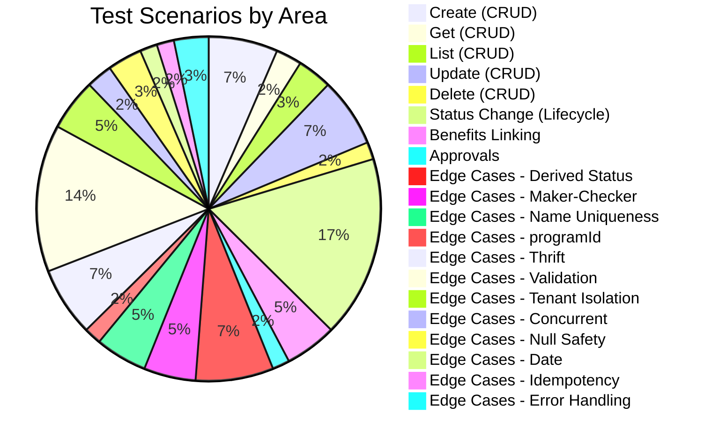
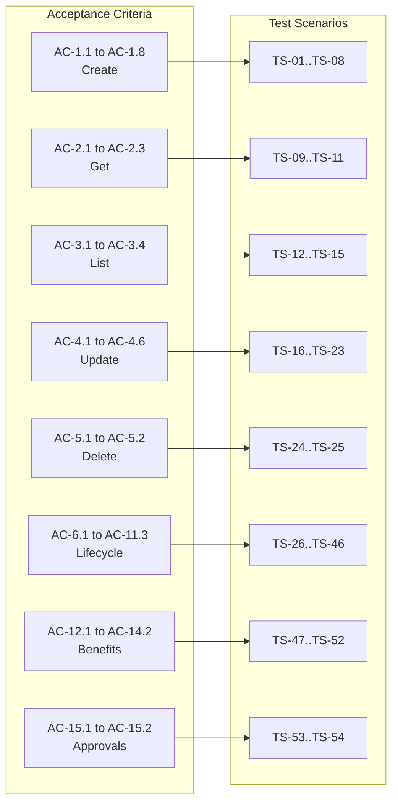

# QA -- Test Scenarios & Edge Cases -- Subscription-CRUD

> Phase: 8 (QA)
> Feature: Subscription Programs Configuration (E3)
> Ticket: aidlc-demo-v2
> Date: 2026-04-10
> Input artifacts: 00-ba.md, 00-prd.md, 01-architect.md, 03-designer.md, session-memory.md, GUARDRAILS.md

---

## 1. Acceptance Criteria Coverage Matrix

Every acceptance criterion from `00-prd.md` is mapped to at least one test scenario.

| AC # | Acceptance Criterion | Test Scenario(s) | Status |
|------|---------------------|-------------------|--------|
| AC-1.1 | POST /v3/subscriptions with valid body returns 201 with generated unifiedSubscriptionId | TS-01, TS-02 | Covered |
| AC-1.2 | POST without name returns 400 structured error | TS-03 | Covered |
| AC-1.3 | POST without duration returns 400 structured error | TS-04 | Covered |
| AC-1.4 | POST with TIER_BASED and no linkedTierId returns 400 | TS-05 | Covered |
| AC-1.5 | POST with NON_TIER and a linkedTierId returns 400 | TS-06 | Covered |
| AC-1.6 | Status defaults to DRAFT | TS-01 | Covered |
| AC-1.7 | unifiedSubscriptionId is a UUID, immutable after creation | TS-01, TS-07 | Covered |
| AC-1.8 | Duplicate name within same org returns 409 CONFLICT | TS-08 | Covered |
| AC-2.1 | GET /v3/subscriptions/{id} returns subscription doc | TS-09 | Covered |
| AC-2.2 | GET with invalid ID returns 404 | TS-10 | Covered |
| AC-2.3 | GET for different org returns 404 (tenant isolation) | TS-11 | Covered |
| AC-3.1 | GET /v3/subscriptions?programId=X returns paginated list | TS-12 | Covered |
| AC-3.2 | GET with status=ACTIVE returns only active subscriptions | TS-13 | Covered |
| AC-3.3 | Pagination via page and size (default page=0, size=20) | TS-14 | Covered |
| AC-3.4 | Results sorted by lastModifiedOn descending | TS-15 | Covered |
| AC-4.1 | PUT on DRAFT updates in place | TS-16 | Covered |
| AC-4.2 | PUT on ACTIVE creates new DRAFT (version N+1, parentId) | TS-17 | Covered |
| AC-4.3 | PUT on PAUSED follows same versioning as ACTIVE | TS-18 | Covered |
| AC-4.4 | PUT on PENDING_APPROVAL/EXPIRED/ARCHIVED returns 400 | TS-19, TS-20, TS-21 | Covered |
| AC-4.5 | ACTIVE subscription remains unchanged until new version approved | TS-22 | Covered |
| AC-4.6 | If DRAFT exists for ACTIVE, PUT updates existing DRAFT | TS-23 | Covered |
| AC-5.1 | DELETE on DRAFT returns 204 | TS-24 | Covered |
| AC-5.2 | DELETE on non-DRAFT returns 400 | TS-25 | Covered |
| AC-6.1 | SUBMIT_FOR_APPROVAL changes DRAFT to PENDING_APPROVAL | TS-26 | Covered |
| AC-6.2 | Submit from non-DRAFT returns 400 with allowed transitions | TS-27 | Covered |
| AC-7.1 | APPROVE on PENDING_APPROVAL transitions to ACTIVE | TS-28 | Covered |
| AC-7.2 | On ACTIVE transition, Thrift createOrUpdatePartnerProgram called | TS-29 | Covered |
| AC-7.3 | If future startDate, status becomes SCHEDULED (derived) | TS-30 | Covered |
| AC-7.4 | APPROVE on non-PENDING_APPROVAL returns 400 | TS-31 | Covered |
| AC-8.1 | REJECT on PENDING_APPROVAL transitions back to DRAFT | TS-32 | Covered |
| AC-8.2 | Review comment stored in comments field | TS-33 | Covered |
| AC-8.3 | REJECT on non-PENDING_APPROVAL returns 400 | TS-34 | Covered |
| AC-9.1 | PAUSE on ACTIVE transitions to PAUSED | TS-35 | Covered |
| AC-9.2 | New enrollments blocked when PAUSED | TS-36 (out of scope -- documented only) | Noted |
| AC-9.3 | Existing enrollments retain benefits | TS-37 (out of scope -- documented only) | Noted |
| AC-9.4 | PAUSE on non-ACTIVE returns 400 | TS-38 | Covered |
| AC-10.1 | RESUME on PAUSED transitions to ACTIVE | TS-39 | Covered |
| AC-10.2 | New enrollments permitted again after RESUME | TS-40 (out of scope -- documented only) | Noted |
| AC-10.3 | RESUME on non-PAUSED returns 400 | TS-41 | Covered |
| AC-11.1 | ARCHIVE from DRAFT, ACTIVE, or EXPIRED to ARCHIVED | TS-42, TS-43, TS-44 | Covered |
| AC-11.2 | ARCHIVED is terminal -- no further transitions | TS-45 | Covered |
| AC-11.3 | Archived subscriptions are read-only | TS-46 | Covered |
| AC-12.1 | POST /benefits adds IDs to benefitIds array | TS-47 | Covered |
| AC-12.2 | Duplicate benefit IDs silently deduplicated | TS-48 | Covered |
| AC-12.3 | No validation against benefits service (dummy IDs) | TS-49 | Covered |
| AC-13.1 | GET /benefits returns benefitIds array | TS-50 | Covered |
| AC-14.1 | DELETE /benefits removes specified IDs | TS-51 | Covered |
| AC-14.2 | Removing non-existent ID is a no-op (idempotent) | TS-52 | Covered |
| AC-15.1 | GET /approvals returns all PENDING_APPROVAL for org | TS-53 | Covered |
| AC-15.2 | Includes parent subscription details for edit-of-active | TS-54 | Covered |

**Notes on AC-9.2, AC-9.3, AC-10.2**: These relate to enrollment behavior which is OUT OF SCOPE per KD-16. The PAUSE/RESUME Thrift calls (setting is_active) are tested in TS-35/TS-39. Enrollment blocking is enforced by EMF, not by this API.

---

## 2. Test Scenarios

### 2.1 Create Subscription (POST /v3/subscriptions)

| ID | Scenario | Expected Outcome | Priority |
|----|----------|-----------------|----------|
| TS-01 | Create valid NON_TIER subscription with all required fields | 201 Created. Response has unifiedSubscriptionId (UUID), status=DRAFT, version=1, orgId from auth, createdOn/lastModifiedOn set, partnerProgramId=null | HIGH |
| TS-02 | Create valid TIER_BASED subscription with linkedTierId | 201 Created. config.subscriptionType=TIER_BASED, config.linkedTierId populated | HIGH |
| TS-03 | Create without name | 400 with field error: {field: "name", error: "REQUIRED"} | HIGH |
| TS-04 | Create without duration (value or unit) | 400 with field error for duration | HIGH |
| TS-05 | Create TIER_BASED without linkedTierId | 400: "Linked tier ID is required for TIER_BASED subscriptions" | HIGH |
| TS-06 | Create NON_TIER with a linkedTierId | 400: linkedTierId must be null for NON_TIER | HIGH |
| TS-07 | Create subscription, then read it -- unifiedSubscriptionId is stable | GET returns same unifiedSubscriptionId as POST response | HIGH |
| TS-08 | Create two subscriptions with same name, same programId, same org | Second POST returns 400/409: "Subscription name already exists for this program" | HIGH |

### 2.2 Get Subscription (GET /v3/subscriptions/{objectId})

| ID | Scenario | Expected Outcome | Priority |
|----|----------|-----------------|----------|
| TS-09 | Get existing subscription by objectId | 200 OK with full subscription document | HIGH |
| TS-10 | Get with non-existent objectId | 404 "Subscription not found" | HIGH |
| TS-11 | Get subscription belonging to different org | 404 (tenant isolation -- not 403) | HIGH |

### 2.3 List Subscriptions (GET /v3/subscriptions)

| ID | Scenario | Expected Outcome | Priority |
|----|----------|-----------------|----------|
| TS-12 | List with programId filter | 200 with only subscriptions matching programId | HIGH |
| TS-13 | List with status=ACTIVE filter | 200 with only ACTIVE subscriptions (stored ACTIVE, not derived SCHEDULED/EXPIRED) | HIGH |
| TS-14 | List with default pagination (page=0, size=20) | 200 with max 20 results, page metadata | MEDIUM |
| TS-15 | List returns results sorted by lastModifiedOn descending | First result has most recent lastModifiedOn | MEDIUM |

### 2.4 Update Subscription (PUT /v3/subscriptions/{unifiedSubscriptionId})

| ID | Scenario | Expected Outcome | Priority |
|----|----------|-----------------|----------|
| TS-16 | Update DRAFT subscription (change name, description) | 200 OK. Name and description updated in place. lastModifiedOn updated. | HIGH |
| TS-17 | Update ACTIVE subscription | 200 OK. New DRAFT document created with version=N+1, parentId=ACTIVE.objectId. ACTIVE remains unchanged. | HIGH |
| TS-18 | Update PAUSED subscription | 200 OK. Same versioning behavior as ACTIVE (new DRAFT created). | HIGH |
| TS-19 | Update PENDING_APPROVAL subscription | 400: "Cannot update subscription in status PENDING_APPROVAL" | HIGH |
| TS-20 | Update EXPIRED (derived) subscription | 400: "Cannot update subscription in status EXPIRED" | HIGH |
| TS-21 | Update ARCHIVED subscription | 400: "Cannot update subscription in status ARCHIVED" | HIGH |
| TS-22 | Update ACTIVE, then GET ACTIVE -- original unchanged | GET with ACTIVE status returns original (pre-update) document | HIGH |
| TS-23 | Update ACTIVE when DRAFT version already exists | 200 OK. Existing DRAFT updated in place (not a new DRAFT). | HIGH |

### 2.5 Delete Subscription (DELETE /v3/subscriptions/{objectId})

| ID | Scenario | Expected Outcome | Priority |
|----|----------|-----------------|----------|
| TS-24 | Delete DRAFT subscription (no parentId) | 204 No Content. Subscription gone from MongoDB. | HIGH |
| TS-25 | Delete ACTIVE subscription | 400: "Only DRAFT subscriptions can be deleted" | HIGH |

### 2.6 Status Changes (PUT /v3/subscriptions/{objectId}/status)

| ID | Scenario | Expected Outcome | Priority |
|----|----------|-----------------|----------|
| TS-26 | DRAFT -> SUBMIT_FOR_APPROVAL | 200 OK. Status changes to PENDING_APPROVAL. | HIGH |
| TS-27 | ACTIVE -> SUBMIT_FOR_APPROVAL (invalid) | 400 with allowed transitions for ACTIVE: [PAUSE, ARCHIVE] | HIGH |
| TS-28 | PENDING_APPROVAL -> APPROVE | 200 OK. Status becomes ACTIVE. Thrift called. partnerProgramId set. | HIGH |
| TS-29 | APPROVE triggers Thrift createOrUpdatePartnerProgram | Thrift stub called with correct PartnerProgramInfo mapping. partnerProgramId returned and stored. | HIGH |
| TS-30 | APPROVE subscription with future startDate | Status stored as ACTIVE. getEffectiveStatus() returns SCHEDULED. GET response shows SCHEDULED. | HIGH |
| TS-31 | APPROVE on DRAFT (invalid) | 400 with allowed transitions for DRAFT: [SUBMIT_FOR_APPROVAL, ARCHIVE] | HIGH |
| TS-32 | PENDING_APPROVAL -> REJECT | 200 OK. Status changes back to DRAFT. | HIGH |
| TS-33 | REJECT with reason -- comment stored | Comments field populated with rejection reason. | HIGH |
| TS-34 | REJECT on ACTIVE (invalid) | 400 with allowed transitions for ACTIVE | HIGH |
| TS-35 | ACTIVE -> PAUSE | 200 OK. Status becomes PAUSED. Thrift called with is_active=false. | HIGH |
| TS-38 | PAUSE on DRAFT (invalid) | 400 with allowed transitions for DRAFT | HIGH |
| TS-39 | PAUSED -> RESUME | 200 OK. Status becomes ACTIVE. Thrift called with is_active=true. | HIGH |
| TS-41 | RESUME on ACTIVE (invalid) | 400 with allowed transitions for ACTIVE | HIGH |
| TS-42 | DRAFT -> ARCHIVE | 200 OK. Status becomes ARCHIVED. | HIGH |
| TS-43 | ACTIVE -> ARCHIVE | 200 OK. Status becomes ARCHIVED. | HIGH |
| TS-44 | EXPIRED (derived) -> ARCHIVE | 200 OK. Status becomes ARCHIVED. | MEDIUM |
| TS-45 | ARCHIVED -> any action | 400 with empty allowed transitions (terminal state). | HIGH |
| TS-46 | Update ARCHIVED subscription | 400: "Cannot update subscription in status ARCHIVED" | HIGH |

### 2.7 Benefits Linking

| ID | Scenario | Expected Outcome | Priority |
|----|----------|-----------------|----------|
| TS-47 | Link benefit IDs to subscription | 200 OK. benefitIds array updated with new IDs appended. | HIGH |
| TS-48 | Link duplicate benefit IDs | Duplicates silently deduplicated. benefitIds has unique entries only. | MEDIUM |
| TS-49 | Link arbitrary string IDs (dummy -- no validation) | 200 OK. Any string accepted as benefit ID. | HIGH |
| TS-50 | Get benefits for subscription | 200 OK. Returns benefitIds array. | HIGH |
| TS-51 | Unlink specific benefit IDs | 200 OK. Specified IDs removed from benefitIds. | HIGH |
| TS-52 | Unlink non-existent benefit ID | 200 OK. No-op. benefitIds unchanged. Idempotent. | MEDIUM |

### 2.8 Approvals

| ID | Scenario | Expected Outcome | Priority |
|----|----------|-----------------|----------|
| TS-53 | List pending approvals for org | 200 OK. Returns all subscriptions with status PENDING_APPROVAL for the auth org. | HIGH |
| TS-54 | Pending approval for edit-of-active includes parent info | Response includes parentId referencing the ACTIVE subscription. | MEDIUM |

---

## 3. Edge Cases

### 3.1 Derived Status (ADR-3, KD-11, KD-19)

| ID | Scenario | Expected Outcome | Priority | ADR |
|----|----------|-----------------|----------|-----|
| EC-01 | ACTIVE subscription with startDate in the future | GET returns effective status SCHEDULED. | HIGH | [ADR-3] |
| EC-02 | ACTIVE subscription with endDate in the past | GET returns effective status EXPIRED. | HIGH | [ADR-3] |
| EC-03 | ACTIVE subscription with startDate in past and endDate in future | GET returns status ACTIVE (no derivation). | HIGH | [ADR-3] |
| EC-04 | ACTIVE subscription with no startDate and no endDate | GET returns status ACTIVE. No derivation. | MEDIUM | [ADR-3] |
| EC-05 | ACTIVE subscription where startDate == now (boundary) | Behavior at the exact boundary -- should return ACTIVE (not SCHEDULED). startDate <= now means "started". | MEDIUM | [ADR-3] |
| EC-06 | ACTIVE subscription where endDate == now (boundary) | Behavior at the exact boundary -- should return ACTIVE or EXPIRED. endDate < now = EXPIRED. endDate == now = still ACTIVE. | MEDIUM | [ADR-3] |
| EC-07 | List with status=SCHEDULED filter | Must translate to query: find ACTIVE where startDate > now. | HIGH | [ADR-3] |
| EC-08 | List with status=EXPIRED filter | Must translate to query: find ACTIVE where endDate < now. | HIGH | [ADR-3] |
| EC-09 | EXPIRED subscription, then ARCHIVE action | ARCHIVE on derived EXPIRED should work. Must handle that stored status is ACTIVE but effective is EXPIRED. | HIGH | [ADR-3] |

### 3.2 Maker-Checker Versioning (ADR-2)

| ID | Scenario | Expected Outcome | Priority | ADR |
|----|----------|-----------------|----------|-----|
| EC-10 | Edit ACTIVE, approve the DRAFT -- old ACTIVE becomes SNAPSHOT | SNAPSHOT status stored. New ACTIVE has version=N+1. | HIGH | [ADR-2] |
| EC-11 | Edit ACTIVE, then reject the DRAFT | DRAFT goes back to DRAFT (stays DRAFT). ACTIVE remains ACTIVE unchanged. | HIGH | [ADR-2] |
| EC-12 | Edit ACTIVE twice without approving first edit | Second edit updates existing DRAFT (no double DRAFT). | HIGH | [ADR-2] |
| EC-13 | Delete a DRAFT that has parentId (was edit-of-active) | Should be deletable? Per design "delete DRAFT only if no parentId" -- DRAFT with parentId means it is a pending version. This should return 400 or be allowed? **See note below.** | HIGH | [ADR-2] |
| EC-14 | Approve edit-of-active: SNAPSHOT doc is read-only | SNAPSHOT subscriptions should not be updatable, deletable, or have status changes. | MEDIUM | [ADR-2] |
| EC-15 | Version number increments correctly across multiple edit cycles | Create (v1) -> ACTIVE -> edit (v2 DRAFT) -> approve (v2 ACTIVE) -> edit (v3 DRAFT) -> approve (v3 ACTIVE). | MEDIUM | [ADR-2] |

**Note on EC-13**: The designer specifies `deleteSubscription` deletes DRAFT only. The PRD AC-5.1 says "DELETE on DRAFT returns 204". The constraint "no parentId" means a pending version of an ACTIVE subscription cannot be deleted -- it should be rejected. This should be confirmed but is consistent with protecting the maker-checker workflow. If user wants to discard a pending edit, they should REJECT it.

### 3.3 Name Uniqueness (KD-24, R-04, C-07, C-10)

| ID | Scenario | Expected Outcome | Priority |
|----|----------|-----------------|----------|
| EC-16 | Same name, same programId, same org -- DRAFT exists | Create returns 400/409 DUPLICATE. | HIGH |
| EC-17 | Same name, different programId, same org | Create succeeds in MongoDB. But pre-Thrift org-wide check on APPROVE may fail. | HIGH |
| EC-18 | Same name, same programId, different org | Create succeeds (different tenant). | MEDIUM |
| EC-19 | Name uniqueness excludes ARCHIVED and SNAPSHOT | Create with name matching only ARCHIVED/SNAPSHOT subscription should succeed. | MEDIUM |
| EC-20 | Pre-Thrift org-wide name uniqueness check | APPROVE fails if another subscription in a different programId has the same name and is in non-terminal status. Error: SUBSCRIPTION.NAME_CONFLICT_ORG | HIGH |
| EC-21 | Rename subscription to match existing name in same programId | Update returns 400 DUPLICATE. | MEDIUM |

### 3.4 programId Immutability (KD-24, C-08)

| ID | Scenario | Expected Outcome | Priority |
|----|----------|-----------------|----------|
| EC-22 | Update DRAFT and change programId | 400: "Program ID cannot be changed after creation" | HIGH |
| EC-23 | Update ACTIVE (creates new DRAFT) -- verify programId carries over unchanged | New DRAFT has same programId as ACTIVE. | HIGH |

### 3.5 Thrift Integration

| ID | Scenario | Expected Outcome | Priority |
|----|----------|-----------------|----------|
| EC-24 | APPROVE -- Thrift call succeeds | partnerProgramId stored on subscription document. Status = ACTIVE. | HIGH |
| EC-25 | APPROVE -- Thrift call fails (TException) | Status rollback: subscription stays PENDING_APPROVAL. Error 500: PUBLISH_FAILED. | HIGH |
| EC-26 | APPROVE edit-of-active -- Thrift call uses partnerProgramId > 0 (update, not create) | PartnerProgramInfo.partnerProgramId set from stored value. is_active=true. | HIGH |
| EC-27 | PAUSE -- Thrift call with is_active=false | Thrift stub verifies is_active=false in PartnerProgramInfo. | HIGH |
| EC-28 | RESUME -- Thrift call with is_active=true | Thrift stub verifies is_active=true in PartnerProgramInfo. | HIGH |
| EC-29 | PAUSE -- Thrift call fails | Status rollback: subscription stays ACTIVE. Error 500. | HIGH |
| EC-30 | RESUME -- Thrift call fails | Status rollback: subscription stays PAUSED. Error 500. | HIGH |
| EC-31 | Thrift field mapping verification | All 12 fields mapped correctly per Architect Section 8.3. updatedViaNewUI=true. partnerProgramType=SUPPLEMENTARY. | HIGH |

### 3.6 Validation Edge Cases

| ID | Scenario | Expected Outcome | Priority |
|----|----------|-----------------|----------|
| EC-32 | Name at exactly 255 characters | Create succeeds. | LOW |
| EC-33 | Name at 256 characters | 400: name exceeds limit. | LOW |
| EC-34 | Description at exactly 1000 characters | Create succeeds. | LOW |
| EC-35 | Reminders: exactly 5 entries | Create succeeds. | MEDIUM |
| EC-36 | Reminders: 6 entries | 400: "Maximum 5 reminders allowed" | MEDIUM |
| EC-37 | Reminders: daysBefore = 0 | 400: must be positive. | LOW |
| EC-38 | Reminders: negative daysBefore | 400: must be positive. | LOW |
| EC-39 | Price: amount = 0.0 | Create succeeds (free subscription). | MEDIUM |
| EC-40 | Price: amount provided, currency missing | 400: currency required when amount present. | MEDIUM |
| EC-41 | Price: currency provided, amount missing | Handled gracefully -- price is optional. | LOW |
| EC-42 | Duration value = 0 | 400: must be positive. | LOW |
| EC-43 | Duration value negative | 400: must be positive. | LOW |
| EC-44 | Comments at exactly 150 characters (on REJECT) | Succeeds. | LOW |
| EC-45 | Comments at 151 characters | 400: comments exceeds limit. | LOW |
| EC-46 | startDate after endDate | Should be caught by validation -- logical inconsistency. | MEDIUM |
| EC-47 | Empty benefitIds array on create | Create succeeds. benefitIds defaults to []. | LOW |
| EC-48 | Null body on POST | 400: request body required. | LOW |

### 3.7 Tenant Isolation (G-07)

| ID | Scenario | Expected Outcome | Priority | Guardrail |
|----|----------|-----------------|----------|-----------|
| EC-49 | All repository queries include orgId from auth context | Verified for all 11 repository @Query methods. | HIGH | [G-07.4] |
| EC-50 | Cross-org GET returns 404 not 403 | No information leakage about other orgs' subscriptions. | HIGH | [G-07.4] |
| EC-51 | Cross-org list returns empty (not other org's data) | List for org A does not show org B's subscriptions. | HIGH | [G-07.4] |
| EC-52 | Cross-org status change returns 404 | Cannot change status of subscription from another org. | HIGH | [G-07.4] |
| EC-53 | Cross-org delete returns 404 | Cannot delete subscription from another org. | HIGH | [G-07.4] |
| EC-54 | Cross-org benefit linking returns 404 | Cannot link benefits to subscription from another org. | HIGH | [G-07.4] |

### 3.8 Concurrent Access (G-10)

| ID | Scenario | Expected Outcome | Priority | Guardrail |
|----|----------|-----------------|----------|-----------|
| EC-55 | Two concurrent APPROVE requests for the same subscription | Only one succeeds. Second gets 400 or conflict. No double Thrift call. (R-07) | HIGH | [G-10] |
| EC-56 | Concurrent update of ACTIVE subscription | Both create a DRAFT? Second update finds existing DRAFT and updates it. No race to double-create. | HIGH | [G-10] |
| EC-57 | Concurrent APPROVE of edit-of-active | SNAPSHOT swap must be atomic. Only one APPROVE succeeds. | HIGH | [G-10] |

### 3.9 Null Safety (G-02)

| ID | Scenario | Expected Outcome | Priority | Guardrail |
|----|----------|-----------------|----------|-----------|
| EC-58 | GET subscription with null config fields (price=null, migrateOnExpiry=null) | Returns document with null optional fields. No NPE. | MEDIUM | [G-02.1] |
| EC-59 | benefitIds is empty list, not null | GET returns [] not null. | MEDIUM | [G-02.1] |
| EC-60 | reminders is empty list, not null | GET returns [] not null. | MEDIUM | [G-02.1] |
| EC-61 | getEffectiveStatus() when metadata.startDate and endDate are both null | Returns stored status. No NPE. | HIGH | [G-02.2] |

### 3.10 Date/Timezone (G-01)

| ID | Scenario | Expected Outcome | Priority | Guardrail |
|----|----------|-----------------|----------|-----------|
| EC-62 | All dates in ISO-8601 with timezone in API responses | createdOn, lastModifiedOn, startDate, endDate all use pattern "yyyy-MM-dd'T'HH:mm:ssXXX" | HIGH | [G-01.6] |
| EC-63 | Known deviation: java.util.Date used instead of java.time.Instant | Documented per KD-26. Tests verify date format compliance, not internal type. | MEDIUM | [G-01.3] |

### 3.11 Idempotency (G-06)

| ID | Scenario | Expected Outcome | Priority | Guardrail |
|----|----------|-----------------|----------|-----------|
| EC-64 | Duplicate POST with same name, same programId | Returns 400/409 DUPLICATE (not 500). Idempotent error response. | HIGH | [G-06.1] |
| EC-65 | Unlink benefit that does not exist | 200 OK. No-op. Idempotent. | MEDIUM | [G-06.1] |

### 3.12 Error Handling

| ID | Scenario | Expected Outcome | Priority |
|----|----------|-----------------|----------|
| EC-66 | All error responses follow ResponseWrapper format | {data: null, errors: [{field, error, message}], warnings: null} | HIGH |
| EC-67 | Thrift failure on APPROVE returns 500 with PUBLISH_FAILED | Not a generic 500. Structured error. | HIGH |
| EC-68 | Invalid SubscriptionAction string in status change body | 400 with meaningful error. | MEDIUM |
| EC-69 | Invalid SubscriptionStatus in query param | 400 with meaningful error. | MEDIUM |

---

## 4. ADR-Driven Test Scenarios

Each architectural decision record has at least one test scenario verifying the chosen approach.

| ADR | What it mandates | Test Scenario(s) |
|-----|-----------------|------------------|
| [ADR-1] Separate SubscriptionController | Own controller at /v3/subscriptions, not RequestManagementFacade routing | TS-01 through TS-54 (all use /v3/subscriptions endpoints). Verify no interaction with RequestManagementController. |
| [ADR-2] MongoDB-First with Thrift Write-Back | Config in MongoDB, MySQL only on APPROVE | TS-28, TS-29, EC-24, EC-25 (Thrift on APPROVE). TS-01 (MongoDB persistence). |
| [ADR-3] SCHEDULED as Derived Status | ACTIVE + startDate > now = SCHEDULED at read time | EC-01, EC-02, EC-03, EC-04, EC-05, EC-06, EC-07, EC-08, EC-09. |
| [ADR-4] Benefits as FK References Only | benefitIds array, no validation | TS-47, TS-48, TS-49, TS-50, TS-51, TS-52. |
| [ADR-5] Enrollment Out of Scope | No enrollment APIs in v3 | Negative: verify no /v3/subscriptions/enroll endpoint exists. |

---

## 5. Risk-Driven Test Scenarios

Every open risk from session-memory.md has a corresponding test scenario.

| Risk | Test Scenario(s) | Status |
|------|------------------|--------|
| R-01: EmfMongoConfig routing -- SubscriptionRepository routes to wrong template | IT: verify SubscriptionRepository reads/writes to emfMongoTemplate (correct DB). Create subscription, verify it is in unified_subscriptions collection via emfMongoTemplate. | Covered by TS-01 (IT) |
| R-02: EmfMongoConfigTest not updated | IT: test infrastructure must scan subscription package. If not, ITs fail to find beans. | Covered by test infrastructure setup |
| R-03: PointsEngineRulesThriftServiceStub missing override | IT: APPROVE test uses stub. If method missing, test throws NoSuchMethod at runtime. | Covered by TS-28, TS-29 (IT) |
| R-04: MongoDB/MySQL name uniqueness mismatch | EC-20: pre-Thrift org-wide check prevents MySQL constraint violation. | Covered |
| R-07: Concurrent APPROVE race condition | EC-55: concurrent APPROVE test. | Covered |
| R-08: EXPIRED/MySQL is_active inconsistency | EC-02: verify EXPIRED is derived, no Thrift call. Accepted risk per KD-23. | Noted |
| R-10: Maker-checker SNAPSHOT swap not atomic | EC-57: concurrent approve of edit-of-active. Verify transaction safety. | Covered |

---

## 6. Existing Tests to Extend or Touch

These existing test files need modification to accommodate the new subscription code.

| File | Change Needed | Reason |
|------|--------------|--------|
| `integrationTests/configuration/EmfMongoConfigTest.java` | Expand basePackages + includeFilters | R-02: subscription repository routing |
| `PointsEngineRulesThriftServiceStub.java` | Add createOrUpdatePartnerProgram override | R-03: APPROVE IT needs stub |
| `AbstractContainerTest.java` | Verify it provides Testcontainers infrastructure for subscription ITs | Subscription ITs need MongoDB, possibly MySQL |

### New Test Files to Create (by SDET)

| File | Layer | Covers |
|------|-------|--------|
| `SubscriptionStatusTransitionValidatorTest.java` | UT | All valid/invalid transitions (TS-26 through TS-45) |
| `SubscriptionValidatorServiceTest.java` | UT | Name uniqueness, programId immutability, field validations (EC-16 through EC-23, EC-32 through EC-48) |
| `SubscriptionThriftPublisherTest.java` | UT | Thrift field mapping, is_active flag per action (EC-24 through EC-31) |
| `SubscriptionFacadeTest.java` | UT | CRUD logic, versioning, status change orchestration, benefits linking |
| `UnifiedSubscriptionTest.java` | UT | getEffectiveStatus() derived status (EC-01 through EC-09, EC-61) |
| `SubscriptionActionTest.java` | UT | fromString() parsing, invalid input handling |
| `SubscriptionControllerTest.java` | IT | Full HTTP round-trip for all 10 endpoints, tenant isolation (EC-49 through EC-54), error responses (EC-66 through EC-69) |

---

## 7. Gaps and Open Items

| # | Gap | Severity | Recommendation |
|---|-----|----------|---------------|
| GAP-01 | startDate after endDate validation not explicitly in Designer interfaces | LOW | Add to SubscriptionValidatorService.validateCreate() -- startDate must be before endDate if both provided |
| GAP-02 | EXPIRED subscription update behavior -- PRD says 400 but EXPIRED is derived from ACTIVE | MEDIUM | SubscriptionFacade.updateSubscription must check effective status, not just stored status. If stored=ACTIVE but effective=EXPIRED, return 400. |
| GAP-03 | Delete DRAFT with parentId -- should it be allowed? | MEDIUM | Recommend: 400 "Cannot delete pending version. Use REJECT instead." Consistent with maker-checker workflow. |
| GAP-04 | ARCHIVE on PAUSED -- not in transition table | LOW | Architect transition table allows ARCHIVE from DRAFT, ACTIVE, EXPIRED but NOT PAUSED. If user pauses and then wants to archive, must RESUME first? This may be an intentional gap or oversight. |
| GAP-05 | SubscriptionStatus.SNAPSHOT not in transition table | LOW | SNAPSHOT is an internal state for maker-checker. No user-facing transitions to/from it. Should be excluded from status change API validation. |
| GAP-06 | Pagination sort order | LOW | PRD AC-3.4 says "sorted by lastModifiedOn descending" but Designer's repository methods use Pageable (no explicit Sort). SDET/Developer must ensure default Sort. |

---

## 8. Constraint-Driven Test Scenarios

| Constraint | Test Scenario |
|-----------|---------------|
| C-05: All queries include orgId | EC-49 through EC-54: tenant isolation suite |
| C-06: APPROVE is blocking Thrift | EC-25: Thrift failure rolls back status |
| C-07: Name uniqueness pre-Thrift | EC-20: org-wide check before APPROVE |
| C-08: programId immutable | EC-22, EC-23 |
| C-09: Signatures only in designer | Developer implements; tests verify behavior |
| C-10: Two-layer name uniqueness | EC-16 (per-programId) + EC-20 (per-org pre-Thrift) |

---

## Diagrams

### Test Scenario Distribution

### Coverage Matrix

---

*QA Phase complete. 54 test scenarios + 69 edge cases = 123 total testable items. 47 acceptance criteria mapped. 5 ADRs covered. 7 risks addressed. 6 gaps identified.*
