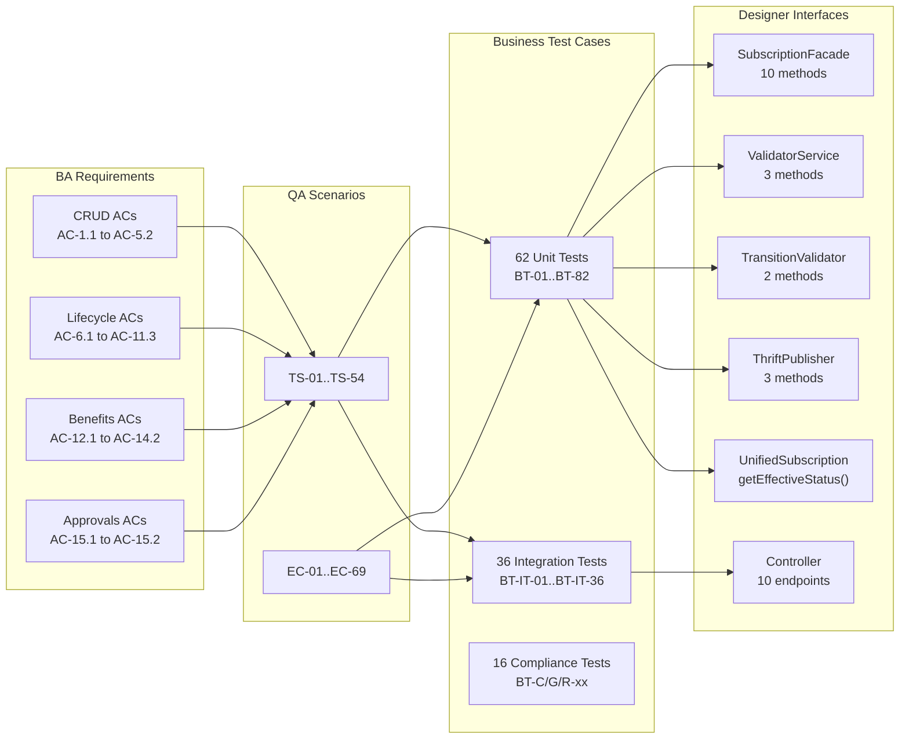

# Business Test Cases -- Subscription-CRUD

> Phase: 8b (Business Test Gen)
> Feature: Subscription Programs Configuration (E3)
> Ticket: aidlc-demo-v2
> Date: 2026-04-10
> Inputs: 00-ba.md, 00-prd.md, 04-qa.md, 03-designer.md, 01-architect.md, session-memory.md, GUARDRAILS.md

---

## 1. Coverage Summary

| Source | Total Items | Covered | Gaps |
|--------|-----------|---------|------|
| BA Acceptance Criteria | 47 | 47 | 0 |
| QA Test Scenarios (TS-xx) | 54 | 54 | 0 |
| QA Edge Cases (EC-xx) | 69 | 64 | 5 (enrollment-related, out of scope) |
| Designer Interface Methods | 24 | 24 | 0 |
| ADRs | 5 | 5 | 0 |
| HIGH+ Risks | 5 | 5 | 0 |
| Guardrails (applicable) | 6 | 6 | 0 |

**Total business test cases: 98 (62 unit tests, 36 integration tests)**

---

## 2. Functional Test Cases -- Unit Tests

### 2.1 SubscriptionStatusTransitionValidator (Pure Logic)

| ID | Test Name | Verifies (BA) | Input | Expected Output | QA Ref | Designer Method | Layer |
|----|-----------|--------------|-------|----------------|--------|-----------------|-------|
| BT-01 | shouldAllowDraftToSubmitForApproval | AC-6.1 | status=DRAFT, action=SUBMIT_FOR_APPROVAL | Returns SUBMIT_FOR_APPROVAL | TS-26 | validateTransition(DRAFT, SUBMIT_FOR_APPROVAL) | UT |
| BT-02 | shouldAllowPendingApprovalToApprove | AC-7.1 | status=PENDING_APPROVAL, action=APPROVE | Returns APPROVE | TS-28 | validateTransition(PENDING_APPROVAL, APPROVE) | UT |
| BT-03 | shouldAllowPendingApprovalToReject | AC-8.1 | status=PENDING_APPROVAL, action=REJECT | Returns REJECT | TS-32 | validateTransition(PENDING_APPROVAL, REJECT) | UT |
| BT-04 | shouldAllowActiveToPause | AC-9.1 | status=ACTIVE, action=PAUSE | Returns PAUSE | TS-35 | validateTransition(ACTIVE, PAUSE) | UT |
| BT-05 | shouldAllowPausedToResume | AC-10.1 | status=PAUSED, action=RESUME | Returns RESUME | TS-39 | validateTransition(PAUSED, RESUME) | UT |
| BT-06 | shouldAllowDraftToArchive | AC-11.1 | status=DRAFT, action=ARCHIVE | Returns ARCHIVE | TS-42 | validateTransition(DRAFT, ARCHIVE) | UT |
| BT-07 | shouldAllowActiveToArchive | AC-11.1 | status=ACTIVE, action=ARCHIVE | Returns ARCHIVE | TS-43 | validateTransition(ACTIVE, ARCHIVE) | UT |
| BT-08 | shouldAllowExpiredToArchive | AC-11.1 | status=EXPIRED, action=ARCHIVE | Returns ARCHIVE | TS-44 | validateTransition(EXPIRED, ARCHIVE) | UT |
| BT-09 | shouldRejectSubmitFromActive | AC-6.2 | status=ACTIVE, action=SUBMIT_FOR_APPROVAL | InvalidInputException | TS-27 | validateTransition(ACTIVE, SUBMIT_FOR_APPROVAL) | UT |
| BT-10 | shouldRejectApproveFromDraft | AC-7.4 | status=DRAFT, action=APPROVE | InvalidInputException | TS-31 | validateTransition(DRAFT, APPROVE) | UT |
| BT-11 | shouldRejectRejectFromActive | AC-8.3 | status=ACTIVE, action=REJECT | InvalidInputException | TS-34 | validateTransition(ACTIVE, REJECT) | UT |
| BT-12 | shouldRejectPauseFromDraft | AC-9.4 | status=DRAFT, action=PAUSE | InvalidInputException | TS-38 | validateTransition(DRAFT, PAUSE) | UT |
| BT-13 | shouldRejectResumeFromActive | AC-10.3 | status=ACTIVE, action=RESUME | InvalidInputException | TS-41 | validateTransition(ACTIVE, RESUME) | UT |
| BT-14 | shouldRejectAnyTransitionFromArchived | AC-11.2 | status=ARCHIVED, action=any | InvalidInputException | TS-45 | validateTransition(ARCHIVED, *) | UT |
| BT-15 | shouldRejectInvalidActionString | -- | action="INVALID_STRING" | InvalidInputException | EC-68 | validateTransition(DRAFT, "INVALID_STRING") | UT |

### 2.2 SubscriptionValidatorService (Validation Logic)

| ID | Test Name | Verifies (BA) | Input | Expected Output | QA Ref | Designer Method | Layer |
|----|-----------|--------------|-------|----------------|--------|-----------------|-------|
| BT-16 | shouldRejectCreateWithoutName | AC-1.2 | subscription with name=null | InvalidInputException: name required | TS-03 | validateCreate() | UT |
| BT-17 | shouldRejectCreateWithoutDuration | AC-1.3 | subscription with duration=null | InvalidInputException: duration required | TS-04 | validateCreate() | UT |
| BT-18 | shouldRejectTierBasedWithoutLinkedTierId | AC-1.4 | type=TIER_BASED, linkedTierId=null | InvalidInputException: TIER_ID_REQUIRED | TS-05 | validateCreate() | UT |
| BT-19 | shouldRejectNonTierWithLinkedTierId | AC-1.5 | type=NON_TIER, linkedTierId="tier-1" | InvalidInputException | TS-06 | validateCreate() | UT |
| BT-20 | shouldRejectDuplicateNameInSameProgramId | AC-1.8 | name exists in same programId+orgId | InvalidInputException: NAME_DUPLICATE | TS-08, EC-16 | validateCreate() | UT |
| BT-21 | shouldAllowSameNameInDifferentProgramId | KD-24 | same name, different programId | No exception | EC-17 | validateCreate() | UT |
| BT-22 | shouldAllowSameNameForDifferentOrg | KD-24 | same name, same programId, different orgId | No exception | EC-18 | validateCreate() | UT |
| BT-23 | shouldExcludeArchivedAndSnapshotFromNameUniqueness | -- | name matches only ARCHIVED subscription | No exception | EC-19 | validateCreate() | UT |
| BT-24 | shouldRejectProgramIdChangeOnUpdate | KD-24, C-08 | existing.programId != updated.programId | InvalidInputException: PROGRAM_ID_IMMUTABLE | EC-22 | validateUpdate() | UT |
| BT-25 | shouldRejectNameChangeToExistingNameOnUpdate | -- | updated.name already taken in same programId | InvalidInputException: NAME_DUPLICATE | EC-21 | validateUpdate() | UT |
| BT-26 | shouldRejectOrgWideNameConflictBeforeThrift | R-04, C-07 | name conflicts with another programId in same org | InvalidInputException: NAME_CONFLICT_ORG | EC-20 | validateNameUniquenessOrgWide() | UT |
| BT-27 | shouldRejectNameExceedingMaxLength | -- | name with 256 chars | InvalidInputException | EC-33 | validateCreate() | UT |
| BT-28 | shouldAcceptNameAtExactMaxLength | -- | name with 255 chars | No exception | EC-32 | validateCreate() | UT |
| BT-29 | shouldRejectMoreThanFiveReminders | -- | reminders list with 6 entries | InvalidInputException: REMINDERS_LIMIT | EC-36 | validateCreate() | UT |
| BT-30 | shouldAcceptExactlyFiveReminders | -- | reminders list with 5 entries | No exception | EC-35 | validateCreate() | UT |
| BT-31 | shouldRejectZeroDaysBefore | -- | reminder with daysBefore=0 | InvalidInputException | EC-37 | validateCreate() | UT |
| BT-32 | shouldRejectNegativeDaysBefore | -- | reminder with daysBefore=-1 | InvalidInputException | EC-38 | validateCreate() | UT |
| BT-33 | shouldRejectPriceAmountWithoutCurrency | -- | price.amount=99.99, currency=null | InvalidInputException | EC-40 | validateCreate() | UT |
| BT-34 | shouldAcceptZeroPriceAmount | -- | price.amount=0.0, currency="USD" | No exception (free) | EC-39 | validateCreate() | UT |
| BT-35 | shouldRejectZeroDurationValue | -- | duration.value=0 | InvalidInputException | EC-42 | validateCreate() | UT |
| BT-36 | shouldRejectNegativeDurationValue | -- | duration.value=-1 | InvalidInputException | EC-43 | validateCreate() | UT |
| BT-37 | shouldRejectStartDateAfterEndDate | GAP-01 | startDate > endDate | InvalidInputException | EC-46 | validateCreate() | UT |

### 2.3 UnifiedSubscription Entity (Derived Status Logic)

| ID | Test Name | Verifies (BA) | Input | Expected Output | QA Ref | Designer Method | Layer |
|----|-----------|--------------|-------|----------------|--------|-----------------|-------|
| BT-38 | shouldDeriveScheduledWhenStartDateInFuture | AC-7.3, KD-11 | stored=ACTIVE, startDate=future | getEffectiveStatus() returns SCHEDULED | EC-01, TS-30 | getEffectiveStatus() | UT |
| BT-39 | shouldDeriveExpiredWhenEndDateInPast | KD-19 | stored=ACTIVE, endDate=past | getEffectiveStatus() returns EXPIRED | EC-02 | getEffectiveStatus() | UT |
| BT-40 | shouldReturnActiveWhenDatesWithinRange | -- | stored=ACTIVE, startDate<now<endDate | getEffectiveStatus() returns ACTIVE | EC-03 | getEffectiveStatus() | UT |
| BT-41 | shouldReturnActiveWhenNoDates | -- | stored=ACTIVE, startDate=null, endDate=null | getEffectiveStatus() returns ACTIVE | EC-04 | getEffectiveStatus() | UT |
| BT-42 | shouldReturnActiveWhenStartDateEqualsNow | ADR-3 | stored=ACTIVE, startDate=now | getEffectiveStatus() returns ACTIVE | EC-05 | getEffectiveStatus() | UT |
| BT-43 | shouldHandleNullStartDateWithFutureEndDate | -- | startDate=null, endDate=future | getEffectiveStatus() returns ACTIVE | EC-61 | getEffectiveStatus() | UT |
| BT-44 | shouldNotDeriveForNonActiveStatuses | -- | stored=DRAFT, startDate=future | getEffectiveStatus() returns DRAFT | -- | getEffectiveStatus() | UT |

### 2.4 SubscriptionAction (Enum Parsing)

| ID | Test Name | Verifies | Input | Expected Output | QA Ref | Designer Method | Layer |
|----|-----------|---------|-------|----------------|--------|-----------------|-------|
| BT-45 | shouldParseValidActionString | -- | "APPROVE" | SubscriptionAction.APPROVE | -- | fromString("APPROVE") | UT |
| BT-46 | shouldRejectInvalidActionString | -- | "INVALID" | InvalidInputException | EC-68 | fromString("INVALID") | UT |
| BT-47 | shouldParseCaseInsensitiveAction | -- | "approve" | SubscriptionAction.APPROVE (or reject -- depends on impl) | -- | fromString("approve") | UT |

### 2.5 SubscriptionThriftPublisher (Field Mapping -- mocked Thrift service)

| ID | Test Name | Verifies | Input | Expected Output | QA Ref | Designer Method | Layer |
|----|-----------|---------|-------|----------------|--------|-----------------|-------|
| BT-48 | shouldMapSubscriptionToPartnerProgramInfoOnApprove | KD-20 | UnifiedSubscription with all fields | PartnerProgramInfo: name, desc, isTierBased, type=SUPPLEMENTARY, updatedViaNewUI=true, partnerProgramId=0 | EC-31 | publishOnApprove() | UT |
| BT-49 | shouldMapDurationToMembershipCycle | KD-20 | duration={value:12, unit:MONTHS} | membershipCycle={cycleType:MONTHS, cycleValue:12} | EC-31 | publishOnApprove() | UT |
| BT-50 | shouldSetPartnerProgramIdForUpdateOnReApprove | KD-20 | subscription with partnerProgramId=42 | PartnerProgramInfo.partnerProgramId=42 | EC-26 | publishOnApprove() | UT |
| BT-51 | shouldSetIsActiveFalseOnPause | KD-22 | subscription being paused | PartnerProgramInfo.is_active=false | EC-27 | publishOnPause() | UT |
| BT-52 | shouldSetIsActiveTrueOnResume | KD-22 | subscription being resumed | PartnerProgramInfo.is_active=true | EC-28 | publishOnResume() | UT |
| BT-53 | shouldMapUnifiedSubscriptionIdToUniqueIdentifier | KD-20 | unifiedSubscriptionId="abc123" | partnerProgramUniqueIdentifier="abc123" | EC-31 | publishOnApprove() | UT |
| BT-54 | shouldSetUpdatedViaNewUITrue | KD-20 | any subscription | updatedViaNewUI=true | EC-31 | publishOnApprove() | UT |

### 2.6 SubscriptionFacade (Business Logic -- mocked dependencies)

| ID | Test Name | Verifies | Input | Expected Output | QA Ref | Designer Method | Layer |
|----|-----------|---------|-------|----------------|--------|-----------------|-------|
| BT-55 | shouldGenerateUUIDOnCreate | AC-1.7 | valid subscription | unifiedSubscriptionId is UUID format, non-null | TS-01 | createSubscription() | UT |
| BT-56 | shouldSetDefaultDraftStatusOnCreate | AC-1.6 | valid subscription | metadata.status = DRAFT | TS-01 | createSubscription() | UT |
| BT-57 | shouldSetOrgIdFromAuthContextOnCreate | G-07 | subscription + authContext | metadata.orgId = auth.orgId | TS-01 | createSubscription() | UT |
| BT-58 | shouldSetVersionOneOnCreate | -- | valid subscription | version = 1 | TS-01 | createSubscription() | UT |
| BT-59 | shouldUpdateDraftInPlace | AC-4.1 | DRAFT subscription + updates | Same objectId, updated fields | TS-16 | updateSubscription() | UT |
| BT-60 | shouldCreateVersionedDraftOnActiveUpdate | AC-4.2 | ACTIVE subscription + updates | New doc: version=N+1, parentId=active.objectId, status=DRAFT | TS-17 | updateSubscription() | UT |
| BT-61 | shouldCreateVersionedDraftOnPausedUpdate | AC-4.3 | PAUSED subscription + updates | Same as active: new DRAFT with parentId | TS-18 | updateSubscription() | UT |
| BT-62 | shouldRejectUpdateOnPendingApproval | AC-4.4 | PENDING_APPROVAL subscription | InvalidInputException: UPDATE_NOT_ALLOWED | TS-19 | updateSubscription() | UT |
| BT-63 | shouldRejectUpdateOnArchived | AC-4.4, AC-11.3 | ARCHIVED subscription | InvalidInputException: UPDATE_NOT_ALLOWED | TS-21, TS-46 | updateSubscription() | UT |
| BT-64 | shouldUpdateExistingDraftForActiveWhenDraftExists | AC-4.6 | ACTIVE with existing DRAFT | Existing DRAFT updated, no new doc | TS-23 | updateSubscription() | UT |
| BT-65 | shouldDeleteDraftWithoutParentId | AC-5.1 | DRAFT subscription, parentId=null | Document removed | TS-24 | deleteSubscription() | UT |
| BT-66 | shouldRejectDeleteOnNonDraft | AC-5.2 | ACTIVE subscription | InvalidInputException: DELETE_NOT_ALLOWED | TS-25 | deleteSubscription() | UT |
| BT-67 | shouldCallThriftOnApprove | AC-7.2 | PENDING_APPROVAL -> APPROVE | thriftPublisher.publishOnApprove() called | TS-29, EC-24 | changeStatus() | UT |
| BT-68 | shouldRollbackStatusOnThriftFailure | C-06 | APPROVE + Thrift throws TException | Status stays PENDING_APPROVAL, 500 PUBLISH_FAILED | EC-25 | changeStatus() | UT |
| BT-69 | shouldStoreCommentOnReject | AC-8.2 | REJECT with reason="Needs revision" | subscription.comments = "Needs revision" | TS-33 | changeStatus() | UT |
| BT-70 | shouldCallThriftWithIsActiveFalseOnPause | KD-22 | ACTIVE -> PAUSE | thriftPublisher.publishOnPause() called | EC-27 | changeStatus() | UT |
| BT-71 | shouldCallThriftWithIsActiveTrueOnResume | KD-22 | PAUSED -> RESUME | thriftPublisher.publishOnResume() called | EC-28 | changeStatus() | UT |
| BT-72 | shouldRollbackStatusOnThriftFailurePause | -- | PAUSE + Thrift fails | Status stays ACTIVE | EC-29 | changeStatus() | UT |
| BT-73 | shouldRollbackStatusOnThriftFailureResume | -- | RESUME + Thrift fails | Status stays PAUSED | EC-30 | changeStatus() | UT |
| BT-74 | shouldDeduplicateBenefitIdsOnLink | AC-12.2 | benefitIds=["a","a","b"] | subscription.benefitIds=["a","b"] | TS-48 | linkBenefits() | UT |
| BT-75 | shouldAppendBenefitIdsOnLink | AC-12.1 | existing=["a"], new=["b","c"] | subscription.benefitIds=["a","b","c"] | TS-47 | linkBenefits() | UT |
| BT-76 | shouldRemoveSpecifiedBenefitIdsOnUnlink | AC-14.1 | existing=["a","b","c"], remove=["b"] | subscription.benefitIds=["a","c"] | TS-51 | unlinkBenefits() | UT |
| BT-77 | shouldNoOpWhenUnlinkingNonExistentBenefit | AC-14.2 | existing=["a"], remove=["z"] | subscription.benefitIds=["a"] (unchanged) | TS-52 | unlinkBenefits() | UT |
| BT-78 | shouldReturnBenefitIds | AC-13.1 | subscription with benefitIds=["a","b"] | Returns ["a","b"] | TS-50 | getBenefits() | UT |
| BT-79 | shouldSwapActiveToSnapshotOnEditApproval | EC-10 | APPROVE on DRAFT with parentId | Parent ACTIVE -> SNAPSHOT, DRAFT -> ACTIVE | EC-10 | changeStatus() | UT |
| BT-80 | shouldPreserveActiveOnRejectOfEdit | EC-11 | REJECT on DRAFT with parentId | ACTIVE unchanged, DRAFT stays DRAFT | EC-11 | changeStatus() | UT |
| BT-81 | shouldValidateOrgWideNameBeforeThriftOnApprove | C-07, C-10 | APPROVE with name that conflicts org-wide | InvalidInputException: NAME_CONFLICT_ORG (before Thrift call) | EC-20 | changeStatus() | UT |
| BT-82 | shouldRejectUpdateOnExpiredDerived | GAP-02 | stored=ACTIVE, effective=EXPIRED | InvalidInputException: UPDATE_NOT_ALLOWED | TS-20 | updateSubscription() | UT |

---

## 3. Functional Test Cases -- Integration Tests

### 3.1 SubscriptionController -- Create/Read

| ID | Test Name | Verifies (BA) | Boundary | Input | Expected Output | QA Ref | Designer Endpoint | Layer |
|----|-----------|--------------|----------|-------|----------------|--------|-------------------|-------|
| BT-IT-01 | shouldCreateSubscriptionViaPostEndpoint | AC-1.1 | HTTP -> Facade -> Repo -> MongoDB | Valid JSON body + auth token | 201 Created, unifiedSubscriptionId in response | TS-01 | POST /v3/subscriptions | IT |
| BT-IT-02 | shouldCreateTierBasedSubscription | AC-1.1 | HTTP -> Facade -> Repo -> MongoDB | TIER_BASED + linkedTierId | 201, subscriptionType=TIER_BASED | TS-02 | POST /v3/subscriptions | IT |
| BT-IT-03 | shouldReturn400OnMissingName | AC-1.2 | HTTP validation | Body with name=null | 400, structured field error | TS-03 | POST /v3/subscriptions | IT |
| BT-IT-04 | shouldGetSubscriptionByObjectId | AC-2.1 | HTTP -> Facade -> Repo -> MongoDB | objectId of created subscription | 200, full subscription doc | TS-09 | GET /v3/subscriptions/{objectId} | IT |
| BT-IT-05 | shouldReturn404ForNonExistentId | AC-2.2 | HTTP -> Facade -> Repo | Random non-existent objectId | 404 | TS-10 | GET /v3/subscriptions/{objectId} | IT |
| BT-IT-06 | shouldListSubscriptionsWithProgramIdFilter | AC-3.1 | HTTP -> Facade -> Repo -> MongoDB | programId query param | 200, only matching subscriptions | TS-12 | GET /v3/subscriptions | IT |
| BT-IT-07 | shouldListWithStatusFilter | AC-3.2 | HTTP -> Facade -> Repo -> MongoDB | status=ACTIVE query param | 200, only ACTIVE subscriptions | TS-13 | GET /v3/subscriptions | IT |
| BT-IT-08 | shouldPaginateWithDefaults | AC-3.3 | HTTP -> Facade -> Repo -> MongoDB | No page/size params | 200, page=0, size=20 | TS-14 | GET /v3/subscriptions | IT |

### 3.2 SubscriptionController -- Update/Delete

| ID | Test Name | Verifies (BA) | Boundary | Input | Expected Output | QA Ref | Designer Endpoint | Layer |
|----|-----------|--------------|----------|-------|----------------|--------|-------------------|-------|
| BT-IT-09 | shouldUpdateDraftInPlaceViaEndpoint | AC-4.1 | HTTP -> Facade -> Repo -> MongoDB | PUT with updated fields on DRAFT | 200, fields updated | TS-16 | PUT /v3/subscriptions/{id} | IT |
| BT-IT-10 | shouldCreateVersionedDraftOnActiveUpdateViaEndpoint | AC-4.2 | HTTP -> Facade -> Repo -> MongoDB | PUT on ACTIVE subscription | 200, new DRAFT doc with parentId, version=N+1 | TS-17 | PUT /v3/subscriptions/{id} | IT |
| BT-IT-11 | shouldDeleteDraftViaEndpoint | AC-5.1 | HTTP -> Facade -> Repo -> MongoDB | DELETE on DRAFT | 204 No Content | TS-24 | DELETE /v3/subscriptions/{objectId} | IT |
| BT-IT-12 | shouldReturn400OnDeleteNonDraft | AC-5.2 | HTTP -> Facade | DELETE on ACTIVE | 400 | TS-25 | DELETE /v3/subscriptions/{objectId} | IT |

### 3.3 SubscriptionController -- Status Changes + Thrift

| ID | Test Name | Verifies (BA) | Boundary | Input | Expected Output | QA Ref | Designer Endpoint | Layer |
|----|-----------|--------------|----------|-------|----------------|--------|-------------------|-------|
| BT-IT-13 | shouldSubmitForApprovalViaEndpoint | AC-6.1 | HTTP -> Facade -> Repo | SUBMIT_FOR_APPROVAL action | 200, status=PENDING_APPROVAL | TS-26 | PUT /v3/subscriptions/{id}/status | IT |
| BT-IT-14 | shouldApproveAndCallThriftViaEndpoint | AC-7.1, AC-7.2 | HTTP -> Facade -> Thrift(stub) -> Repo | APPROVE action | 200, status=ACTIVE, partnerProgramId set | TS-28, TS-29 | PUT /v3/subscriptions/{id}/status | IT |
| BT-IT-15 | shouldRejectAndStoreCommentViaEndpoint | AC-8.1, AC-8.2 | HTTP -> Facade -> Repo | REJECT action + reason | 200, status=DRAFT, comments populated | TS-32, TS-33 | PUT /v3/subscriptions/{id}/status | IT |
| BT-IT-16 | shouldPauseAndCallThriftViaEndpoint | AC-9.1 | HTTP -> Facade -> Thrift(stub) -> Repo | PAUSE action | 200, status=PAUSED | TS-35 | PUT /v3/subscriptions/{id}/status | IT |
| BT-IT-17 | shouldResumeAndCallThriftViaEndpoint | AC-10.1 | HTTP -> Facade -> Thrift(stub) -> Repo | RESUME action | 200, status=ACTIVE | TS-39 | PUT /v3/subscriptions/{id}/status | IT |
| BT-IT-18 | shouldArchiveViaEndpoint | AC-11.1 | HTTP -> Facade -> Repo | ARCHIVE action on DRAFT | 200, status=ARCHIVED | TS-42 | PUT /v3/subscriptions/{id}/status | IT |
| BT-IT-19 | shouldReturn400OnInvalidTransitionViaEndpoint | AC-6.2 | HTTP -> Facade | APPROVE on DRAFT | 400 with allowed transitions | TS-31 | PUT /v3/subscriptions/{id}/status | IT |
| BT-IT-20 | shouldApproveEditOfActiveSwapToSnapshot | EC-10 | HTTP -> Facade -> Repo (multi-doc) -> Thrift(stub) | APPROVE on DRAFT with parentId | 200, old ACTIVE->SNAPSHOT, DRAFT->ACTIVE | EC-10 | PUT /v3/subscriptions/{id}/status | IT |

### 3.4 SubscriptionController -- Benefits

| ID | Test Name | Verifies (BA) | Boundary | Input | Expected Output | QA Ref | Designer Endpoint | Layer |
|----|-----------|--------------|----------|-------|----------------|--------|-------------------|-------|
| BT-IT-21 | shouldLinkBenefitsViaEndpoint | AC-12.1 | HTTP -> Facade -> Repo | POST with ["b1","b2"] | 200, benefitIds contains b1, b2 | TS-47 | POST /v3/subscriptions/{id}/benefits | IT |
| BT-IT-22 | shouldGetBenefitsViaEndpoint | AC-13.1 | HTTP -> Facade -> Repo | GET benefits | 200, benefitIds array | TS-50 | GET /v3/subscriptions/{id}/benefits | IT |
| BT-IT-23 | shouldUnlinkBenefitsViaEndpoint | AC-14.1 | HTTP -> Facade -> Repo | DELETE with ["b1"] | 200, b1 removed | TS-51 | DELETE /v3/subscriptions/{id}/benefits | IT |

### 3.5 SubscriptionController -- Approvals

| ID | Test Name | Verifies (BA) | Boundary | Input | Expected Output | QA Ref | Designer Endpoint | Layer |
|----|-----------|--------------|----------|-------|----------------|--------|-------------------|-------|
| BT-IT-24 | shouldListPendingApprovalsViaEndpoint | AC-15.1 | HTTP -> Facade -> Repo | GET /approvals | 200, all PENDING_APPROVAL for org | TS-53 | GET /v3/subscriptions/approvals | IT |

### 3.6 Tenant Isolation (IT -- requires multi-org setup)

| ID | Test Name | Verifies | Boundary | Input | Expected Output | QA Ref | Designer Method | Layer |
|----|-----------|---------|----------|-------|----------------|--------|-----------------|-------|
| BT-IT-25 | shouldReturn404WhenGettingOtherOrgSubscription | G-07, AC-2.3 | Cross-org read | objectId of org A's subscription, auth=org B | 404 (not 403) | TS-11, EC-50 | GET /v3/subscriptions/{id} | IT |
| BT-IT-26 | shouldReturnEmptyListForOtherOrg | G-07 | Cross-org list | auth=org B, org A's subscriptions exist | 200, empty page | EC-51 | GET /v3/subscriptions | IT |
| BT-IT-27 | shouldReturn404WhenChangingStatusOfOtherOrgSubscription | G-07 | Cross-org status change | status change on org A's sub, auth=org B | 404 | EC-52 | PUT /v3/subscriptions/{id}/status | IT |
| BT-IT-28 | shouldReturn404WhenDeletingOtherOrgSubscription | G-07 | Cross-org delete | DELETE on org A's sub, auth=org B | 404 | EC-53 | DELETE /v3/subscriptions/{id} | IT |
| BT-IT-29 | shouldReturn404WhenLinkingBenefitsToOtherOrgSubscription | G-07 | Cross-org benefit link | Link benefits on org A's sub, auth=org B | 404 | EC-54 | POST /v3/subscriptions/{id}/benefits | IT |

### 3.7 Derived Status (IT -- time-based behavior)

| ID | Test Name | Verifies | Boundary | Input | Expected Output | QA Ref | Designer Method | Layer |
|----|-----------|---------|----------|-------|----------------|--------|-----------------|-------|
| BT-IT-30 | shouldReturnScheduledForActiveWithFutureStartDate | ADR-3, AC-7.3 | Read-time derivation | ACTIVE sub with startDate=future | GET returns effective status SCHEDULED | EC-01, TS-30 | GET /v3/subscriptions/{id} | IT |
| BT-IT-31 | shouldReturnExpiredForActiveWithPastEndDate | ADR-3, KD-19 | Read-time derivation | ACTIVE sub with endDate=past | GET returns effective status EXPIRED | EC-02 | GET /v3/subscriptions/{id} | IT |
| BT-IT-32 | shouldListScheduledViaStatusFilter | EC-07 | Query-time derivation | status=SCHEDULED query param | Returns ACTIVE subs where startDate > now | EC-07 | GET /v3/subscriptions?status=SCHEDULED | IT |
| BT-IT-33 | shouldListExpiredViaStatusFilter | EC-08 | Query-time derivation | status=EXPIRED query param | Returns ACTIVE subs where endDate < now | EC-08 | GET /v3/subscriptions?status=EXPIRED | IT |

### 3.8 Error Response Format (IT)

| ID | Test Name | Verifies | Boundary | Input | Expected Output | QA Ref | Designer Endpoint | Layer |
|----|-----------|---------|----------|-------|----------------|--------|-------------------|-------|
| BT-IT-34 | shouldReturnStructuredErrorOnValidationFailure | C-03 | HTTP error format | Invalid body | {data:null, errors:[{field,error,message}], warnings:null} | EC-66 | POST /v3/subscriptions | IT |
| BT-IT-35 | shouldReturnStructuredErrorOnThriftFailure | C-06 | HTTP error format | APPROVE with Thrift failure | 500 with PUBLISH_FAILED error code | EC-67 | PUT /v3/subscriptions/{id}/status | IT |

### 3.9 MongoDB Routing (IT -- infrastructure validation)

| ID | Test Name | Verifies | Boundary | Input | Expected Output | QA Ref | Designer Config | Layer |
|----|-----------|---------|----------|-------|----------------|--------|-----------------|-------|
| BT-IT-36 | shouldRouteSubscriptionRepositoryToEmfMongoTemplate | R-01, R-02 | EmfMongoConfig -> emfMongoTemplate | Save + retrieve subscription | Found in correct MongoDB database (emf per-tenant) | R-01 | EmfMongoConfig includeFilters | IT |

---

## 4. Compliance Test Cases

### 4.1 ADR Compliance

| ID | Test Name | ADR | What it Verifies | Layer |
|----|-----------|-----|-----------------|-------|
| BT-C01 | shouldNotUseRequestManagementFacadeRouting | ADR-1 | Subscription uses own controller, not EntityType routing | UT (structural/ArchUnit) |
| BT-C02 | shouldPersistInMongoDBNotMySQL | ADR-2 | CRUD operations hit MongoDB. MySQL only on Thrift call. | IT |
| BT-C03 | shouldDeriveScheduledNotStore | ADR-3 | APPROVE with future startDate stores ACTIVE, derives SCHEDULED | IT |
| BT-C04 | shouldStoreBenefitIdsOnlyNotEmbeddedObjects | ADR-4 | benefitIds is List<String>, not List<Benefit> | UT (structural) |
| BT-C05 | shouldNotExposeEnrollmentEndpoints | ADR-5, KD-16 | No /v3/subscriptions/enroll or /enrollment endpoints | UT (structural) |

### 4.2 Guardrail Compliance

| ID | Test Name | Guardrail | What it Verifies | Layer |
|----|-----------|-----------|-----------------|-------|
| BT-G01 | shouldReturnDatesInISO8601WithTimezone | G-01.6 | createdOn, lastModifiedOn, startDate, endDate in ISO-8601 format | IT |
| BT-G02 | shouldNotReturnNullForCollectionFields | G-02.1 | benefitIds=[], reminders=[] never null | UT |
| BT-G03 | shouldThrowSpecificExceptionsNotGenericOnes | G-02.5 | InvalidInputException not generic RuntimeException | UT |
| BT-G04 | shouldFilterByOrgIdOnEveryQuery | G-07.4 | All 11 repository queries include orgId | IT |
| BT-G05 | shouldPaginateAllListEndpoints | G-04.2 | List and approvals endpoints return Page, not unbounded List | IT |
| BT-G06 | shouldHandleDefaultSwitchCaseForEnums | G-02.7 | SubscriptionStatus and SubscriptionAction handle unknown values | UT |

### 4.3 Risk Mitigation

| ID | Test Name | Risk | What it Verifies | Layer |
|----|-----------|------|-----------------|-------|
| BT-R01 | shouldRouteSubscriptionRepoToEmfMongoTemplate | R-01 | EmfMongoConfig includeFilters includes SubscriptionRepository | IT |
| BT-R02 | shouldOverrideThriftStubForCreateOrUpdate | R-03 | PointsEngineRulesThriftServiceStub.createOrUpdatePartnerProgram() returns valid response | IT |
| BT-R03 | shouldValidateOrgWideNameBeforeThriftCall | R-04 | Name conflict across programs detected before Thrift | UT |
| BT-R04 | shouldHandleThriftFailureGracefully | R-07 (partial) | Thrift TException wrapped as 500, status rolled back | UT |
| BT-R05 | shouldSwapSnapshotAtomically | R-10 | Edit-of-active APPROVE: ACTIVE->SNAPSHOT and DRAFT->ACTIVE both succeed or both fail | IT |

---

## 5. Coverage Gaps

| Gap | Source | Item | Reason | Severity |
|-----|--------|------|--------|----------|
| GAP-BT-01 | AC-9.2, AC-9.3, AC-10.2 | Enrollment blocking on PAUSE | Out of scope (KD-16). Enrollment managed by EMF. No testable interface in v3. | LOW -- accepted, noted |
| GAP-BT-02 | EC-55, EC-56, EC-57 | Concurrent access tests | Requires concurrent test harness. Recommended for IT but may need custom threading in tests. | MEDIUM -- recommend SDET addresses with CountDownLatch or similar |
| GAP-BT-03 | GAP-04 (QA) | ARCHIVE on PAUSED | Not in transition table. Cannot generate test case for allowed transition. Test case BT-14 covers terminal ARCHIVED blocking. Needs architect clarification. | LOW |
| GAP-BT-04 | AC-3.4 | Sort by lastModifiedOn desc | Repository Pageable does not enforce default sort. SDET must verify sort in IT. | LOW |
| GAP-BT-05 | EC-13 (QA) | Delete DRAFT with parentId | QA flagged ambiguity. Business test gen assumes it is blocked (consistent with maker-checker). BT-65 covers delete without parentId. Need explicit test for delete-with-parentId rejection. | MEDIUM |

---

## 6. Test Case to File Mapping (for SDET)

| Test File (Proposed) | Business Test Cases | Layer | Count |
|---------------------|--------------------|----|-------|
| SubscriptionStatusTransitionValidatorTest | BT-01 to BT-15 | UT | 15 |
| SubscriptionValidatorServiceTest | BT-16 to BT-37 | UT | 22 |
| UnifiedSubscriptionTest | BT-38 to BT-44 | UT | 7 |
| SubscriptionActionTest | BT-45 to BT-47 | UT | 3 |
| SubscriptionThriftPublisherTest | BT-48 to BT-54 | UT | 7 |
| SubscriptionFacadeTest | BT-55 to BT-82 | UT | 28 |
| SubscriptionControllerTest (IT) | BT-IT-01 to BT-IT-36 | IT | 36 |
| Compliance tests (mixed into above) | BT-C01 to BT-C05, BT-G01 to BT-G06, BT-R01 to BT-R05 | Mixed | 16 |

**Total: 98 business test cases (62 UT + 36 IT)**

---

## Diagrams

### Business Test Case Traceability

---

*Business Test Gen complete. 98 test cases: 62 UT, 36 IT. Full traceability from BA to Designer to QA. 5 gaps documented. Ready for SDET (Phase 9).*
