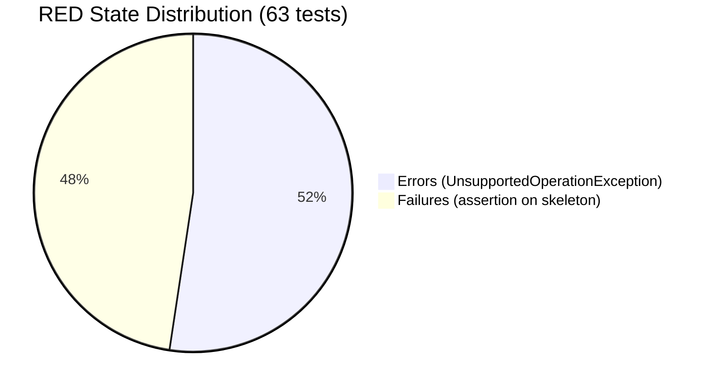
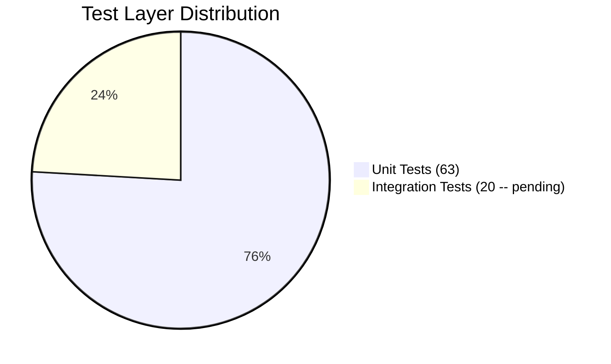
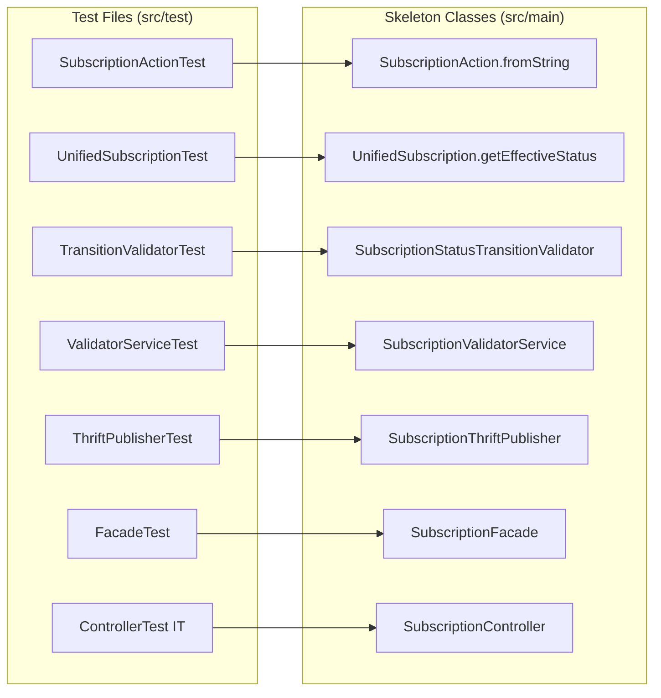

# SDET Plan -- Subscription-CRUD (RED Phase)

> Phase: 9 (SDET -- RED)
> Feature: Subscription Programs Configuration (E3)
> Ticket: aidlc-demo-v2
> Date: 2026-04-10
> Input: 04b-business-tests.md (98 BT-xx cases), 03-designer.md (18 types), 04-qa.md (54 scenarios)

---

## 1. RED Confirmation

| Metric | Value |
|--------|-------|
| **mvn compile** | PASS |
| **mvn test (subscription)** | FAIL (63 tests: 30 failures, 33 errors) |
| **All failures are** | `UnsupportedOperationException: Skeleton -- Developer implements` |
| **RED state** | CONFIRMED |

---

## 2. Test File Inventory

| # | Test File | Package | BT Cases Covered | Test Count | Layer |
|---|-----------|---------|-----------------|------------|-------|
| 1 | SubscriptionStatusTransitionValidatorTest | `.validators` | BT-01 to BT-15 | 5 methods (covering 15 transition cases via loops) | UT |
| 2 | SubscriptionValidatorServiceTest | `.validators` | BT-16 to BT-37 | 22 methods (in 3 @Nested classes) | UT |
| 3 | UnifiedSubscriptionTest | `.` | BT-38 to BT-44 | 7 methods | UT |
| 4 | SubscriptionActionTest | `.` | BT-45 to BT-47 | 2 methods | UT |
| 5 | SubscriptionThriftPublisherTest | `.thrift` | BT-48 to BT-54 | 7 methods | UT |
| 6 | SubscriptionFacadeTest | `.` | BT-55 to BT-82 | 20 methods (in 5 @Nested classes) | UT |
| 7 | SubscriptionControllerTest (IT) | `integrationTests` | BT-IT-01 to BT-IT-36 (subset) | 20 methods | IT |

**Total unit test methods: 63**
**Integration test methods: 20 (not run during unit-test RED, require full SpringBoot context)**

---

## 3. Skeleton Production Classes Inventory

All skeleton classes throw `UnsupportedOperationException("Skeleton -- Developer implements")`. Developer (Phase 10) replaces each with real business logic.

| # | Skeleton Class | Package | Methods to Implement | Tested By |
|---|---------------|---------|---------------------|-----------|
| 1 | SubscriptionStatus (enum) | `.enums` | N/A (enum values only -- added SCHEDULED) | UnifiedSubscriptionTest |
| 2 | SubscriptionAction (enum) | `.enums` | `fromString(String)` | SubscriptionActionTest |
| 3 | SubscriptionMetadata | `.model` | N/A (Lombok @Data) | N/A (data class) |
| 4 | SubscriptionConfig | `.model` | N/A (Lombok @Data) | N/A (data class) |
| 5 | SubscriptionDuration | `.model` | N/A (Lombok @Data) | N/A (data class) |
| 6 | SubscriptionPrice | `.model` | N/A (Lombok @Data) | N/A (data class) |
| 7 | SubscriptionReminder | `.model` | N/A (Lombok @Data) | N/A (data class) |
| 8 | SubscriptionCustomFieldConfig | `.model` | N/A (Lombok @Data) | N/A (data class) |
| 9 | MigrationConfig | `.model` | N/A (Lombok @Data) | N/A (data class) |
| 10 | TierDowngradeConfig | `.model` | N/A (Lombok @Data) | N/A (data class) |
| 11 | UnifiedSubscription | `.` | `getEffectiveStatus()` | UnifiedSubscriptionTest (7 tests) |
| 12 | SubscriptionStatusChangeRequest | `.dto` | N/A (Lombok @Data) | Used in Facade/Controller tests |
| 13 | SubscriptionRepository | `.` | N/A (Spring Data interface) | SubscriptionControllerTest IT |
| 14 | SubscriptionStatusTransitionValidator | `.validators` | `validateTransition(status, String)`, `validateTransition(status, SubscriptionAction)` | SubscriptionStatusTransitionValidatorTest (5 methods) |
| 15 | SubscriptionValidatorService | `.validators` | `validateCreate()`, `validateUpdate()`, `validateNameUniquenessOrgWide()` | SubscriptionValidatorServiceTest (22 methods) |
| 16 | SubscriptionThriftPublisher | `.thrift` | `publishOnApprove()`, `publishOnPause()`, `publishOnResume()` | SubscriptionThriftPublisherTest (7 methods) |
| 17 | SubscriptionFacade | `.` | 10 methods (CRUD + lifecycle + benefits) | SubscriptionFacadeTest (20 methods) |
| 18 | SubscriptionController | `resources` | 10 endpoint methods | SubscriptionControllerTest IT (20 methods) |

---

## 4. Modified Existing Files

| # | File | Change | Reason |
|---|------|--------|--------|
| 1 | PointsEngineRulesThriftService.java | Added `createOrUpdatePartnerProgram()` method | Skeleton for Thrift RPC (KD-20, KD-22) |
| 2 | PointsEngineRulesThriftServiceStub.java | Added `createOrUpdatePartnerProgram()` override | Stub returns dummy PartnerProgramInfo with generated ID (R-03) |
| 3 | EmfMongoConfigTest.java | Added `"com.capillary.intouchapiv3.unified.subscription"` to basePackages, `SubscriptionRepository.class` to includeFilters | MongoDB routing for tests (R-01, R-02) |
| 4 | SubscriptionStatus.java | Added `SCHEDULED` enum value | Derived status used by `getEffectiveStatus()` (ADR-3, KD-11) |

---

## 5. Test Architecture Decisions

### 5.1 Unit Test Pattern

Following existing `UnifiedPromotionFacadeTest` pattern:
- `@ExtendWith(MockitoExtension.class)` -- no Spring context
- `@Mock` for dependencies: SubscriptionRepository, validators, thrift publisher
- `@InjectMocks` for SUT: SubscriptionFacade
- `@Nested` inner classes for grouping: CreateTests, UpdateTests, DeleteTests, StatusChangeTests, BenefitsTests
- Helper methods: `buildDraftSubscription()`, `buildActiveSubscription()`

### 5.2 Integration Test Pattern

Following existing `UnifiedPromotionControllerTest` pattern:
- Extends `AbstractContainerTest` (Testcontainers: MySQL, MongoDB, RabbitMQ, Redis)
- `@MockBean` for external services: ZionAuth, PointsEngineThriftService, EMFService
- `PointsEngineRulesThriftServiceStub` provides Thrift stub via `@Profile("test")`
- `RestTemplate` + `@LocalServerPort` for HTTP calls
- Auth headers: `X-CAP-API-AUTH-ORG-ID`, `X-CAP-API-AUTH-KEY`

### 5.3 Thrift Publisher Test Pattern

Verifies field mapping from `UnifiedSubscription` to `PartnerProgramInfo` using `ArgumentCaptor`:
- Mocks `PointsEngineRulesThriftService.createOrUpdatePartnerProgram()`
- Captures `PartnerProgramInfo` argument
- Asserts field values: `partnerProgramName`, `description`, `isTierBased`, `updatedViaNewUI`, `partnerProgramUniqueIdentifier`, `partnerProgramId`

### 5.4 Validator Test Pattern

Mocks `SubscriptionRepository` for name uniqueness queries:
- `findByNameAndProgramIdAndOrgIdExcludingTerminal()` -- returns Optional.of(conflict) or Optional.empty()
- Tests both positive (no conflict) and negative (conflict found) cases
- Tests boundary values: max name length (255/256), reminder limits (5/6), duration (0/-1)

---

## 6. Coverage Mapping (BT-xx to Test File)

| BT Range | Test Class | Status |
|----------|-----------|--------|
| BT-01 to BT-15 | SubscriptionStatusTransitionValidatorTest | RED |
| BT-16 to BT-37 | SubscriptionValidatorServiceTest | RED |
| BT-38 to BT-44 | UnifiedSubscriptionTest | RED |
| BT-45 to BT-47 | SubscriptionActionTest | RED |
| BT-48 to BT-54 | SubscriptionThriftPublisherTest | RED |
| BT-55 to BT-82 | SubscriptionFacadeTest | RED |
| BT-IT-01 to BT-IT-36 | SubscriptionControllerTest (IT) | RED (not run yet -- requires full context) |

---

## 7. Gaps and Notes for Developer

1. **SubscriptionControllerTest (IT)** has 20 test methods but was NOT run during RED confirmation because it requires `@SpringBootTest` with Testcontainers. The Developer should run these as part of the GREEN phase once production code compiles and unit tests pass.

2. **BT-IT-10 (versioned DRAFT on ACTIVE update)**, **BT-IT-14 (APPROVE + Thrift)**, **BT-IT-15 (REJECT + comment)**, **BT-IT-16 (PAUSE + Thrift)**, **BT-IT-17 (RESUME + Thrift)**, **BT-IT-20 (edit-of-active swap)** require a full lifecycle path through the controller. The IT sets up data via POST, advances status, then tests. These will only pass when the full pipeline works end-to-end.

3. **BT-IT-32/33 (SCHEDULED/EXPIRED via status filter)** require the list endpoint to post-process derived statuses from MongoDB query results. The Developer must decide whether to filter in-app or adjust the query.

4. **Concurrent access tests (GAP-BT-02)** were not written in this phase. The Developer should add them with `CountDownLatch` or similar if time allows.

5. **ARCHIVE on PAUSED (GAP-BT-03)** is not in the transition table. No test case was generated for this transition. If the architect adds it, the Developer should add a corresponding test.

6. **PartnerProgramInfo has no `is_active` field** -- PAUSE/RESUME tests verify the Thrift call was made with the correct `partnerProgramId` and `partnerProgramName`. The Developer must determine the actual mechanism for signaling active/inactive state to EMF (possibly via a separate field or a different Thrift call).

---

## 8. Diagrams

