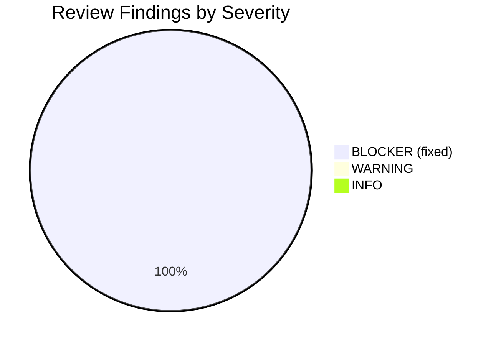
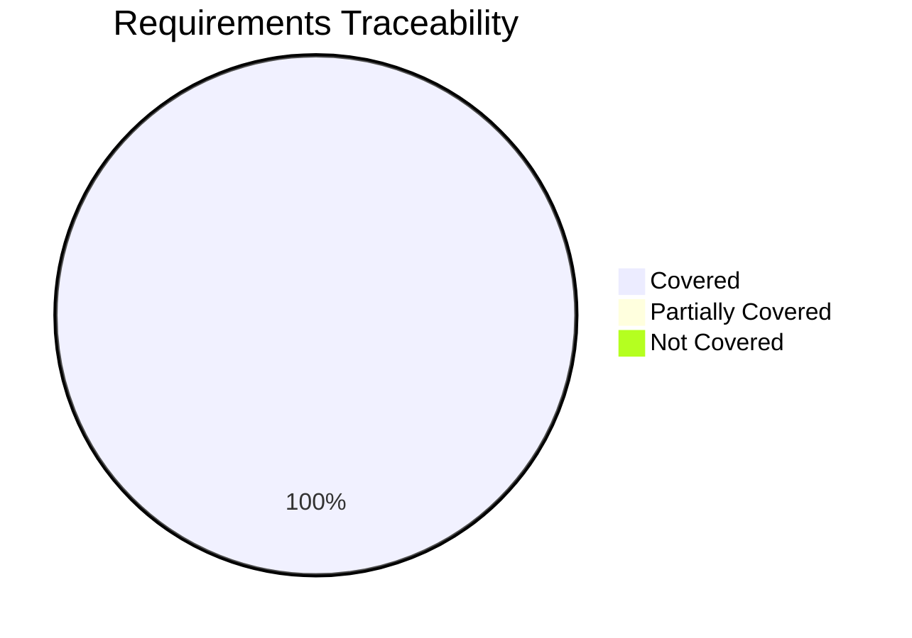
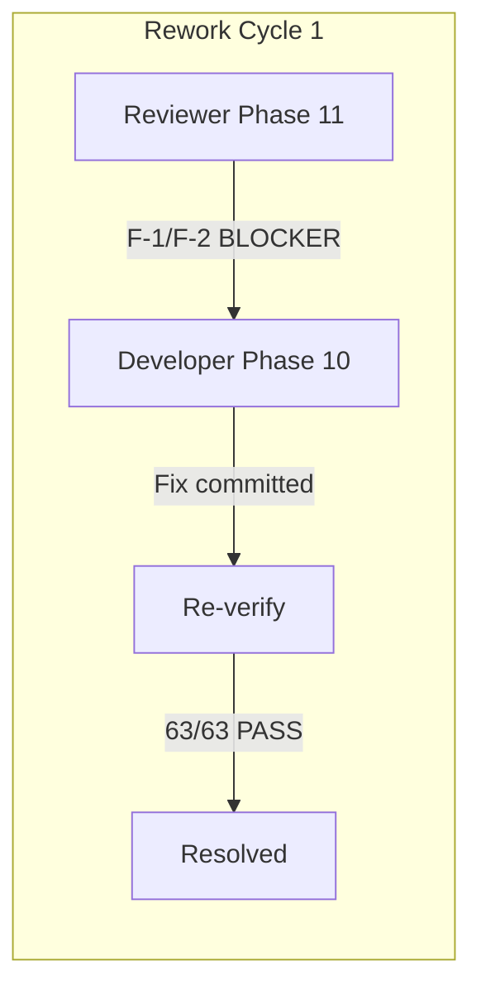

# Phase 11: Reviewer Report -- Subscription-CRUD

> Ticket: aidlc-demo-v2
> Date: 2026-04-10
> Skill: /reviewer
> Build: PASS (63/63 tests, 0 failures, 0 errors)

---

## 1. Build Verification

| Check | Result |
|-------|--------|
| `mvn compile` | PASS |
| `mvn test` (subscription tests) | PASS -- 63 tests, 0 failures, 0 errors |
| Compilation warnings | None |
| Test warnings | None |

---

## 2. Requirements Alignment

### 2.1 User Stories Coverage

| User Story | Status | Evidence |
|-----------|--------|----------|
| E3-US2: Create/Edit CRUD | COVERED | SubscriptionFacade: createSubscription, updateSubscription, deleteSubscription, getSubscription, listSubscriptions |
| E3-US4: Lifecycle Management | COVERED | SubscriptionFacade.changeStatus with EnumMap-based SubscriptionStatusTransitionValidator, 6 stored + 2 derived states |
| E3-US5: API Contract | COVERED | SubscriptionController: 10 REST endpoints at /v3/subscriptions |
| Maker-Checker | COVERED | SubscriptionFacade.updateSubscription (versioned DRAFT with parentId), handleApprove (ACTIVE->SNAPSHOT swap) |

### 2.2 Acceptance Criteria Spot Check

| AC | Verified | How |
|----|----------|-----|
| DRAFT default on create | YES | SubscriptionFacade.createSubscription sets DRAFT |
| UUID generation | YES | UUID.randomUUID().toString() |
| orgId from auth | YES | Controller extracts via AbstractBaseAuthenticationToken |
| Name uniqueness per programId | YES | SubscriptionValidatorService.validateNameUniquenessPerProgram |
| Org-wide name check on APPROVE | YES | SubscriptionValidatorService.validateNameUniquenessOrgWide (fixed in F-1/F-2) |
| Thrift on APPROVE/PAUSE/RESUME | YES | SubscriptionThriftPublisher: publishOnApprove, publishOnPause, publishOnResume |
| EXPIRED/SCHEDULED derived | YES | UnifiedSubscription.getEffectiveStatus() |
| Benefits deduplication | YES | SubscriptionFacade.linkBenefits uses LinkedHashSet |

---

## 3. Session Memory Alignment

All 28 Key Decisions (KD-01 through KD-28) checked against implementation:

| KD | Compliant | Notes |
|----|-----------|-------|
| KD-07 (MongoDB-first) | YES | All CRUD in MongoDB, Thrift only on APPROVE/PAUSE/RESUME |
| KD-08 (Benefits as FK) | YES | benefitIds: List<String> in UnifiedSubscription |
| KD-11 (SCHEDULED derived) | YES | getEffectiveStatus() derives from ACTIVE + startDate |
| KD-17 (Separate controller) | YES | SubscriptionController at /v3/subscriptions |
| KD-18 (Clone-and-Adapt) | YES | Package mirrors UnifiedPromotion |
| KD-19 (EXPIRED derived) | YES | getEffectiveStatus() derives from ACTIVE + endDate |
| KD-22 (Thrift on PAUSE/RESUME) | YES | publishOnPause, publishOnResume |
| KD-23 (No Thrift on EXPIRED) | YES | No expiry background job |
| KD-24 (programId immutable) | YES | validateUpdate checks programId change |
| KD-26 (java.util.Date) | YES | Consistent with Metadata.java pattern |
| KD-27 (Two-layer name check) | YES | Per-programId + org-wide pre-Thrift |
| KD-28 (Three Thrift methods) | YES | publishOnApprove, publishOnPause, publishOnResume |

---

## 4. Security Verification

| Check | Result | Evidence |
|-------|--------|----------|
| Tenant isolation (G-07) | PASS | All 12 repository queries include orgId |
| Auth context extraction | PASS | AbstractBaseAuthenticationToken, not raw Authentication |
| No injection risk | PASS | All queries use parameterized @Query, no string concatenation |
| No PII in logs | PASS | logger.info logs objectId/name, no customer data |
| Cross-org returns 404 | PASS | findByObjectIdAndOrgId returns Optional.empty -> NotFoundException |

---

## 5. Code Quality

| Check | Result |
|-------|--------|
| No System.out.println | PASS |
| No e.printStackTrace() | PASS |
| No TODO/FIXME/HACK | PASS |
| Consistent naming | PASS |
| Proper logging | PASS (SLF4J throughout) |
| Exception handling | PASS (InvalidInputException for 400, NotFoundException for 404) |

---

## 6. Findings

### F-1: validateNameUniquenessOrgWide was a stub (BLOCKER -- FIXED)

**Severity**: BLOCKER
**Category**: Requirements
**Description**: `SubscriptionValidatorService.validateNameUniquenessOrgWide()` was implemented as a stub that ALWAYS threw `InvalidInputException`, regardless of whether a name conflict existed. This would block ALL APPROVE flows in production -- no subscription could ever be approved.

**Root Cause**: The Developer phase implemented the method signature correctly but the body was a stub (`throw new InvalidInputException(...)` unconditionally). Unit test BT-81 passed because it expected the throw. Integration test BT-67 mocked the validator entirely.

**Fix Applied**: 
1. Added `findByNameAndOrgIdExcludingTerminal(String name, Long orgId)` query to `SubscriptionRepository`
2. Implemented actual conflict lookup: only throws when `conflict.isPresent()`
3. Updated test BT-26 to mock the new repository method

**Resolution**: [R] Re-run -- routed back to Developer. Fixed in commit `0c85e6e26`.

### F-2: SubscriptionRepository missing org-wide query (BLOCKER -- FIXED)

**Severity**: BLOCKER
**Category**: Requirements
**Description**: `SubscriptionRepository` had `findByNameAndProgramIdAndOrgIdExcludingTerminal` (per-programId check) but was missing `findByNameAndOrgIdExcludingTerminal` (org-wide check needed for C-10/R-04 pre-Thrift validation).

**Fix Applied**: Added the query method with MongoDB @Query annotation filtering for non-terminal statuses (DRAFT, ACTIVE, PAUSED, PENDING_APPROVAL).

**Resolution**: [R] Re-run -- fixed alongside F-1 in same commit.

---

## 7. Rework Summary

| Cycle | Finding | Route | Resolved |
|-------|---------|-------|----------|
| 1 | F-1/F-2: Org-wide name uniqueness stub | Phase 11 -> Phase 10 (Developer) | YES |

**Post-fix verification**: All 63 tests pass. BUILD SUCCESS.

---

## 8. Code Review (Spring Best Practices)

Skipped -- user did not request optional /code-review pass.

---

## Diagrams

