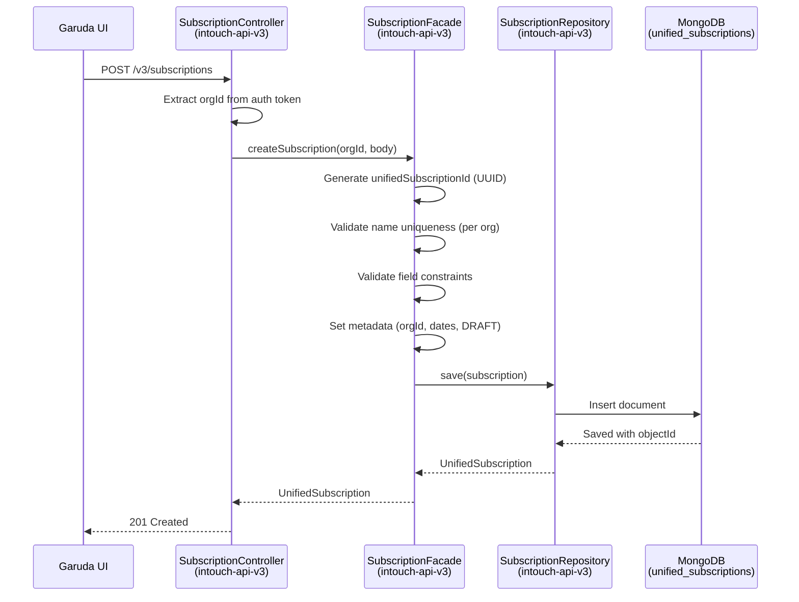
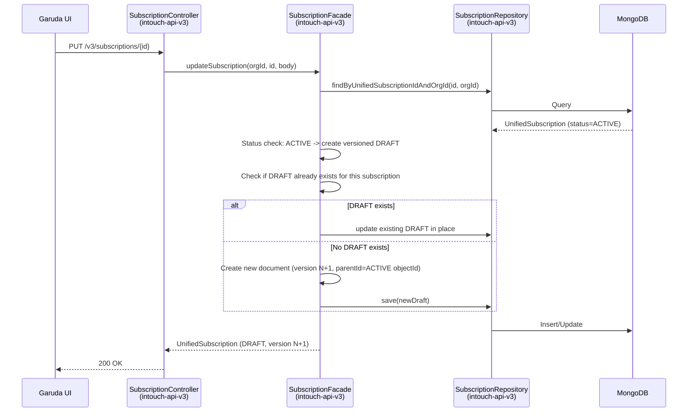
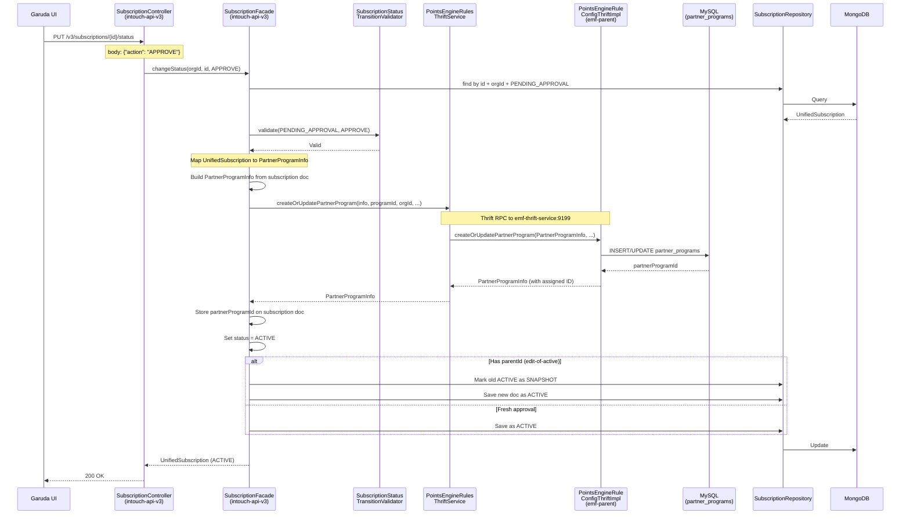
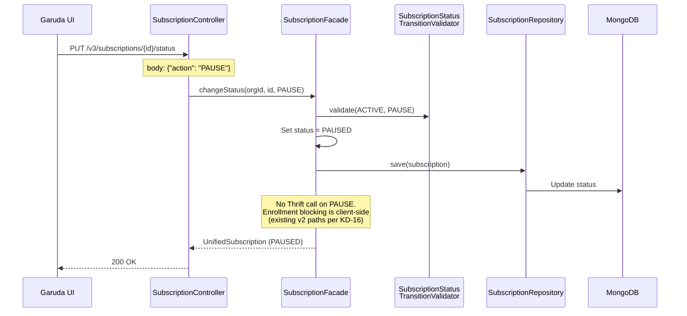
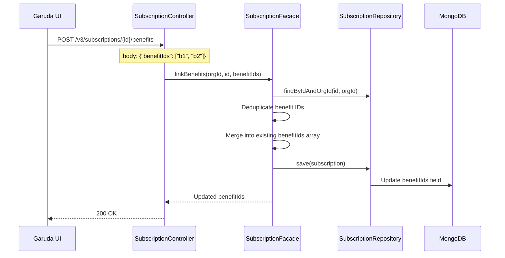
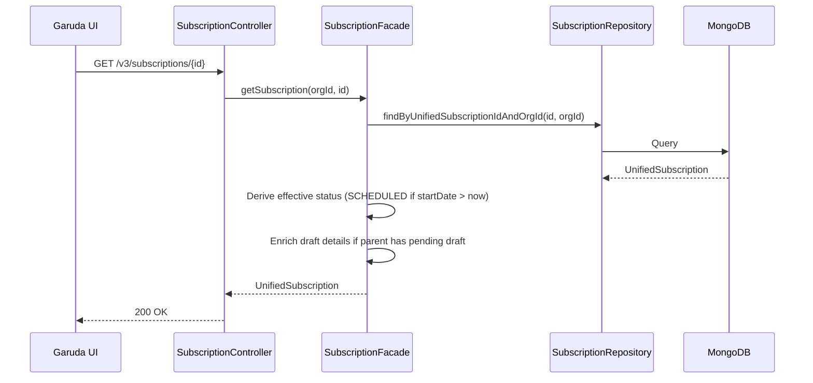
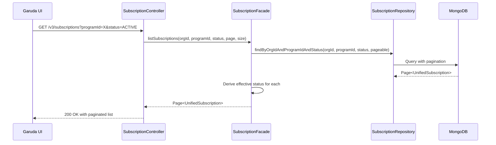

# Cross-Repo Trace -- Subscription-CRUD

> Phase: 5 (Codebase Research + Cross-Repo Tracing)
> Date: 2026-04-09
> Repos: intouch-api-v3, emf-parent, thrifts, api/prototype, cc-stack-crm

---

## Write Paths

### Operation: Create Subscription (DRAFT)

**Repos involved**: intouch-api-v3 only (C7)
**Cross-repo calls**: None

---

### Operation: Update Subscription (Edit of ACTIVE -- Maker-Checker)

**Repos involved**: intouch-api-v3 only (C7)

---

### Operation: Approve Subscription (PENDING_APPROVAL -> ACTIVE)

**Repos involved**: intouch-api-v3 (client) + emf-parent (server, unchanged) (C7)
**Cross-repo call**: PointsEngineRulesThriftService -> emf-thrift-service:9199 -> PointsEngineRuleConfigThriftImpl.createOrUpdatePartnerProgram()

---

### Operation: Pause Subscription (ACTIVE -> PAUSED)

**Repos involved**: intouch-api-v3 only (C7)
**Note**: No Thrift call on PAUSE. The partner_programs.is_active in MySQL stays unchanged. Enrollment blocking is handled by existing v2 enrollment paths checking subscription status.

---

### Operation: Link Benefits

**Repos involved**: intouch-api-v3 only (C7)
**Note**: No validation against benefits service (dummy IDs per KD-08)

---

## Read Paths

### Operation: Get Subscription

**Repos involved**: intouch-api-v3 only (C7)
**Cache**: No cache in read path for subscriptions (follow promotion pattern)

### Operation: List Subscriptions

---

## Per-Repo Change Inventory

| Repo | New Files | Modified Files | Why | Confidence |
|------|-----------|---------------|-----|------------|
| **intouch-api-v3** | ~11 new | 2 modified | Primary repo for all subscription code | C7 |
| **emf-parent** | 0 | 0 | Thrift server -- existing methods sufficient | C7 |
| **thrifts** | 0 | 0 | Thrift IDL -- all structs/methods exist | C7 |
| **api/prototype** | 0 | 0 | Extended field entity type deferred | C6 |
| **cc-stack-crm** | 0 | 0 | No MySQL schema changes (KD-07) | C7 |

### intouch-api-v3 Detailed Change List

**New Files (~11)**:
| # | File | Package | Purpose |
|---|------|---------|---------|
| 1 | UnifiedSubscription.java | unified.subscription | @Document entity for MongoDB |
| 2 | SubscriptionMetadata.java | unified.subscription.model | Nested metadata POJO |
| 3 | SubscriptionStatus.java | unified.subscription.enums | DRAFT, PENDING_APPROVAL, ACTIVE, PAUSED, EXPIRED, ARCHIVED |
| 4 | SubscriptionAction.java | unified.subscription.enums | SUBMIT_FOR_APPROVAL, APPROVE, REJECT, PAUSE, RESUME, ARCHIVE |
| 5 | SubscriptionRepository.java | unified.subscription | MongoRepository interface |
| 6 | SubscriptionFacade.java | unified.subscription | Business logic: CRUD, status changes, Thrift publish |
| 7 | SubscriptionController.java | resources | REST controller: /v3/subscriptions |
| 8 | SubscriptionStatusTransitionValidator.java | validators | EnumMap-based transition validator |
| 9 | SubscriptionValidatorService.java | unified.subscription.validation | Name uniqueness, field validations |
| 10 | SubscriptionStatusChangeRequest.java | unified.subscription.dto | DTO with "action" field (not "promotionStatus") |
| 11 | SubscriptionThriftPublisher.java | unified.subscription | Maps subscription doc to PartnerProgramInfo |

**Modified Files (2)**:
| # | File | Change |
|---|------|--------|
| 1 | EmfMongoConfig.java | Add SubscriptionRepository.class to @EnableMongoRepositories includeFilters |
| 2 | PointsEngineRulesThriftService.java | Add createOrUpdatePartnerProgram() wrapper method |

**Test Files (~5-7 new)**:
| # | File | Type |
|---|------|------|
| 1 | SubscriptionFacadeTest.java | Unit test |
| 2 | SubscriptionStatusTransitionValidatorTest.java | Unit test |
| 3 | SubscriptionValidatorServiceTest.java | Unit test |
| 4 | SubscriptionControllerTest.java | Integration test (extends AbstractContainerTest) |
| 5 | SubscriptionThriftPublisherTest.java | Unit test |

---

## Red Flags

### RF-1: EmfMongoConfig includeFilters is a single-class array
- **Risk**: Adding SubscriptionRepository to includeFilters requires an array of two classes. If misconfigured, one or both repositories may not route to emfMongoTemplate.
- **Mitigation**: Test both repositories in integration test to confirm routing.
- **Confidence**: C6 (straightforward Spring config change, but easy to get wrong)

### RF-2: No Thrift retry/circuit breaker on createOrUpdatePartnerProgram
- **Risk**: The APPROVE flow calls Thrift synchronously. If emf-thrift-service is down, APPROVE fails. The subscription MongoDB doc stays in PENDING_APPROVAL.
- **Mitigation**: This is consistent with how promotion publish works (also no retry). User can re-approve. Log the failure clearly.
- **Confidence**: C5 (acceptable risk -- follows existing pattern)

### RF-3: partner_programs.name UNIQUE per org
- **Risk**: If two subscriptions have the same name and both get APPROVED, the second Thrift call will fail with duplicate name. MongoDB allows same name in different statuses.
- **Mitigation**: SubscriptionValidatorService must enforce name uniqueness within MongoDB BEFORE the Thrift call. Follow UnifiedPromotion's name uniqueness pattern.
- **Confidence**: C6 (must implement validation correctly)

### RF-4: PartnerProgramInfo field mapping
- **Risk**: Mapping UnifiedSubscription fields to PartnerProgramInfo requires careful alignment. Some subscription fields (benefitIds, reminders, customFields) have NO equivalent in PartnerProgramInfo -- they live only in MongoDB.
- **Mitigation**: SubscriptionThriftPublisher maps only the fields that exist in PartnerProgramInfo. MongoDB is the source of truth for subscription config. MySQL/partner_programs is a "thin record" for enrollment to reference.
- **Confidence**: C6 (must verify field alignment during implementation)

---

## Verification Evidence

| Repo | Claim | Evidence | Confidence |
|------|-------|----------|------------|
| emf-parent | 0 modifications | Read PointsEngineRuleConfigThriftImpl.java:252 -- createOrUpdatePartnerProgram exists and is functional | C7 |
| thrifts | 0 modifications | Read pointsengine_rules.thrift:402-417 (PartnerProgramInfo) and line 1269 (method) -- all exist | C7 |
| api/prototype | 0 modifications | Read ExtendedField.java:70-87 -- PARTNER_PROGRAM not present but deferred per KD-06 this run | C6 |
| cc-stack-crm | 0 modifications | Read partner_programs.sql -- no schema changes per KD-07 | C7 |
| intouch-api-v3 | 2 modified | Read EmfMongoConfig.java:32 (only UnifiedPromotionRepository), PointsEngineRulesThriftService.java (no partner program methods) | C7 |

---

*Cross-repo trace complete. All write/read paths mapped. Only intouch-api-v3 has changes.*
