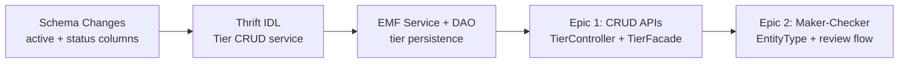

# PRD — Tier CRUD APIs

> Feature: tier-crud
> Ticket: test_branch_v3
> Phase: PRD (Phase 1 — generated from BA)
> Date: 2026-04-06

---

## Epics

### Epic 1: Tier CRUD APIs (E1)
**Confidence**: C5 (75-90%)
**Complexity**: Medium
**Dependencies**: ProgramSlab schema changes, Thrift IDL, TierController in intouch-api-v3

| Story | Description | Confidence | Complexity |
|-------|------------|------------|------------|
| US-1 | List Tiers (GET /tiers) | C6 | Low |
| US-2 | Get Single Tier (GET /tiers/{id}) | C6 | Low |
| US-3 | Create Tier (POST /tiers) | C5 | Medium |
| US-4 | Update Tier (PUT /tiers/{id}) | C5 | Medium |
| US-5 | Soft Delete Tier (DELETE /tiers/{id}) | C4 | Medium |

### Epic 2: Maker-Checker for Tiers (E4-MC)
**Confidence**: C5 (75-90%)
**Complexity**: Medium
**Dependencies**: EntityType enum extension, RequestManagementFacade routing, TierFacade

| Story | Description | Confidence | Complexity |
|-------|------------|------------|------------|
| US-6 | Submit Tier for Approval | C5 | Medium |
| US-7 | Approve / Reject Tier | C5 | Medium |

### Epic Dependency Order

Build order: Schema → Thrift → EMF Service → CRUD Controller → Maker-Checker integration.

---

## API Endpoints

### Tier CRUD

| Method | Path | Purpose | Status |
|--------|------|---------|--------|
| GET | /v3/tiers | List all active tiers for program | New |
| GET | /v3/tiers/{tierId} | Get single tier detail | New |
| POST | /v3/tiers | Create tier (DRAFT) | New |
| PUT | /v3/tiers/{tierId} | Update tier config | New |
| DELETE | /v3/tiers/{tierId} | Soft delete (active=0) | New |

### Maker-Checker (reusing existing infrastructure)

| Method | Path | Purpose | Status |
|--------|------|---------|--------|
| PUT | /v3/requests/TIER/{tierId}/status | Submit for approval / stop | Existing endpoint, new entity type |
| POST | /v3/tiers/{tierId}/review | Approve / reject tier | New (follows promotion pattern) |

---

## Data Model Changes

### Modified Table: `program_slabs`

| Column | Type | Default | Purpose |
|--------|------|---------|---------|
| `active` | TINYINT(1) | 1 | Soft delete flag. 0 = deleted. |
| `status` | VARCHAR(30) | 'ACTIVE' | Tier lifecycle: DRAFT, PENDING_APPROVAL, ACTIVE, STOPPED |

**Migration notes**:
- Existing rows get `active=1` and `status='ACTIVE'` (backward compatible)
- Expand-then-contract: add columns first, backfill, then update code to use them
- No destructive changes in first migration

### New Entities (intouch-api-v3)

| Entity | Type | Purpose |
|--------|------|---------|
| `TierController` | REST Controller | /v3/tiers endpoints |
| `TierFacade` | Facade | Orchestrates Thrift calls, validation, maker-checker |
| `TierRequest` | DTO | Create/update request body |
| `TierResponse` | DTO | Response body with full tier config |
| `TierStatus` | Enum | DRAFT, PENDING_APPROVAL, ACTIVE, STOPPED |
| `TierReviewRequest` | DTO | Approve/reject body (approvalStatus, comment) |

### Modified Entities (intouch-api-v3)

| Entity | Change |
|--------|--------|
| `EntityType` enum | Add `TIER` value |
| `RequestManagementFacade` | Add routing for `TIER` entity type in `changeStatus()` |

### New Entities (emf-parent)

| Entity | Type | Purpose |
|--------|------|---------|
| Thrift IDL (TierCrudService) | Thrift service | CRUD operations exposed over RPC |
| TierCrudServiceImpl | Service | Business logic for tier CRUD |
| TierCrudDao (or reuse existing) | DAO | Persistence layer |

---

## Validation Rules

All validation in API layer — not in frontend. Returns structured field-level errors.

| Field | Rules | Error Code Pattern |
|-------|-------|--------------------|
| name | NotBlank, MaxLength(100) | `TIER_NAME_REQUIRED`, `TIER_NAME_TOO_LONG` |
| eligibilityKpiType | NotNull, must match program's KPI type | `TIER_KPI_TYPE_REQUIRED`, `TIER_KPI_TYPE_MISMATCH` |
| eligibilityThreshold | NotNull, > 0, > previous tier's threshold | `TIER_THRESHOLD_REQUIRED`, `TIER_THRESHOLD_INVALID`, `TIER_THRESHOLD_TOO_LOW` |
| validityPeriod | NotNull, > 0 | `TIER_VALIDITY_REQUIRED`, `TIER_VALIDITY_INVALID` |
| downgradeTarget | Valid tier ID or null (null only for base tier) | `TIER_DOWNGRADE_TARGET_INVALID` |
| description | MaxLength(500) | `TIER_DESCRIPTION_TOO_LONG` |
| color | Valid hex color format | `TIER_COLOR_INVALID` |
| status transitions | Only valid transitions allowed | `TIER_INVALID_STATUS_TRANSITION` |

---

## Non-Functional Requirements

- **Performance**: GET /tiers should respond < 200ms for programs with up to 20 tiers
- **Validation**: All create/update requests validated server-side with field-level errors
- **Backward compatibility**: Existing tier evaluation logic (upgrade/downgrade/renewal) must continue working unchanged
- **Multi-tenancy**: All APIs are org-scoped (tenant filter on all queries)
- **Error format**: Use existing `ResponseWrapper<T>` with `{data, errors[], warnings[]}`

---

## Grooming Questions (for Phase 4 — Blocker Resolution)

These questions surfaced during BA but are not blocking the architectural design:

1. **GQ-1**: Are `dailyDowngradeEnabled` and `retainPoints` per-tier or per-program settings? Affects whether they appear in the tier CRUD API or a separate program-level config endpoint.
2. **GQ-2**: When a tier is soft-deleted, what happens to members currently in that tier? Options: (a) leave in place, re-evaluate at next cycle, (b) force-migrate to downgrade target immediately.
3. **GQ-3**: Should GET /tiers include member count per tier? This requires a cross-service query and may affect performance. Could be deferred to a separate analytics endpoint.
4. **GQ-4**: Should there be a `PATCH /tiers/{tierId}` for partial updates in addition to `PUT` for full replacement? The UnifiedPromotion pattern uses PUT only.

---

## Out of Scope

| Item | Rationale | Future Epic |
|------|-----------|-------------|
| Benefits CRUD | Separate epic (E2) | Benefits as a Product |
| aiRa integration | Separate epic (E3) | aiRa Configuration Layer |
| Simulation / impact preview | Future capability | Tier Intelligence v2 |
| Change log / audit trail | Future capability | Tier Intelligence v2 |
| Comparison matrix UI | Backend-only sprint | Tier Intelligence v2 |
| Tier insertion between existing tiers | Constraint preserved | TBD |
| Member count in GET response | Cross-service complexity | Tier Intelligence v2 |
