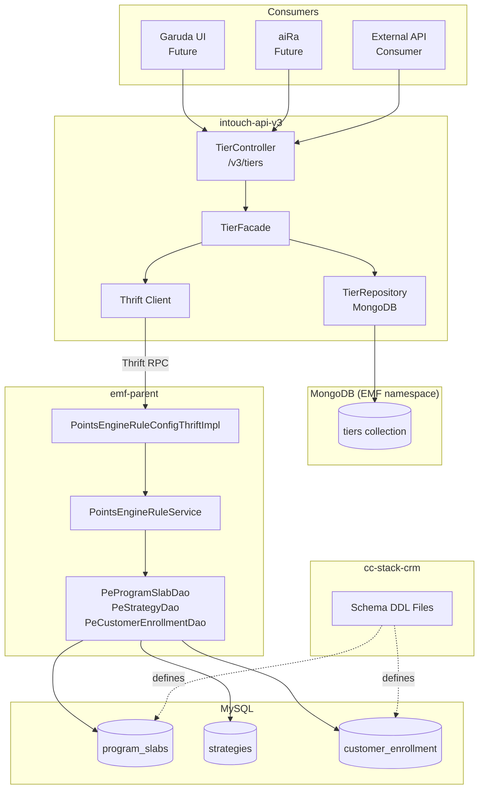
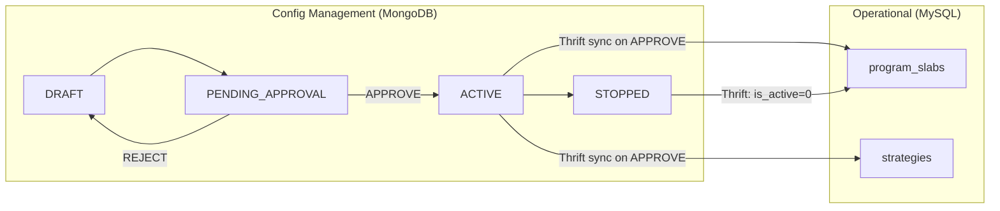
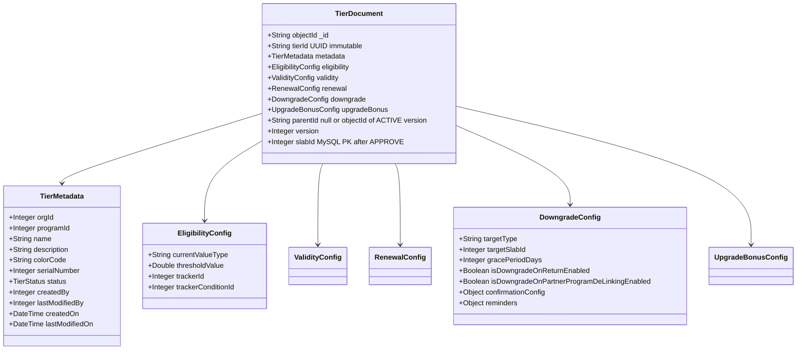
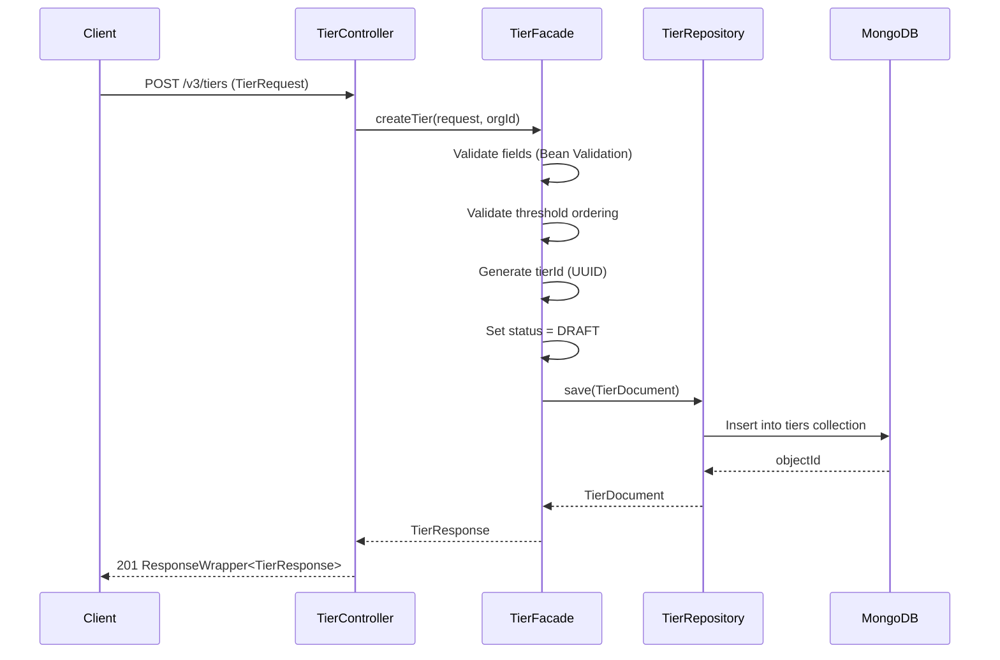
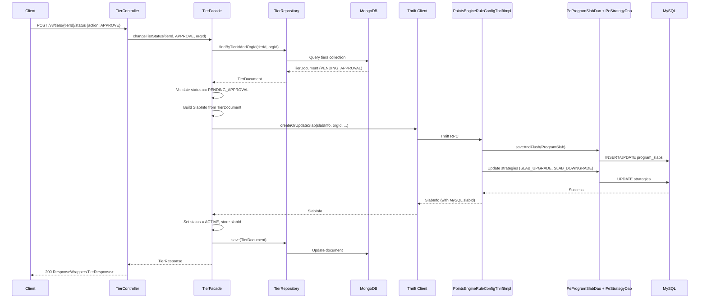
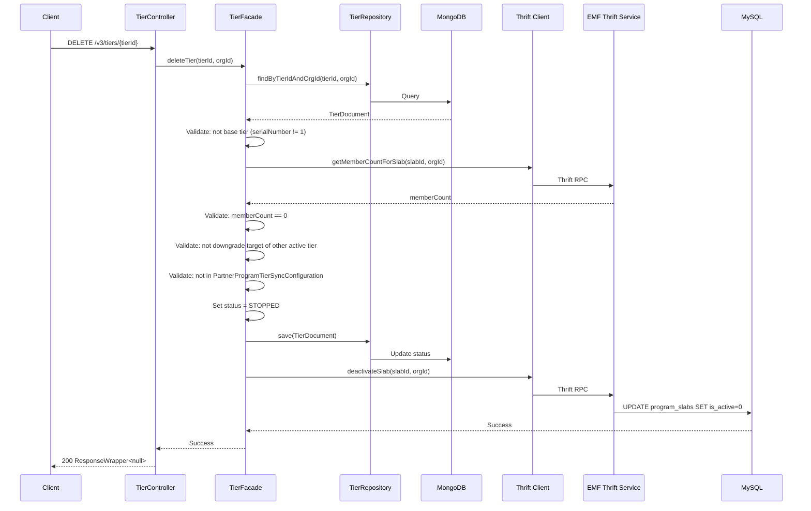
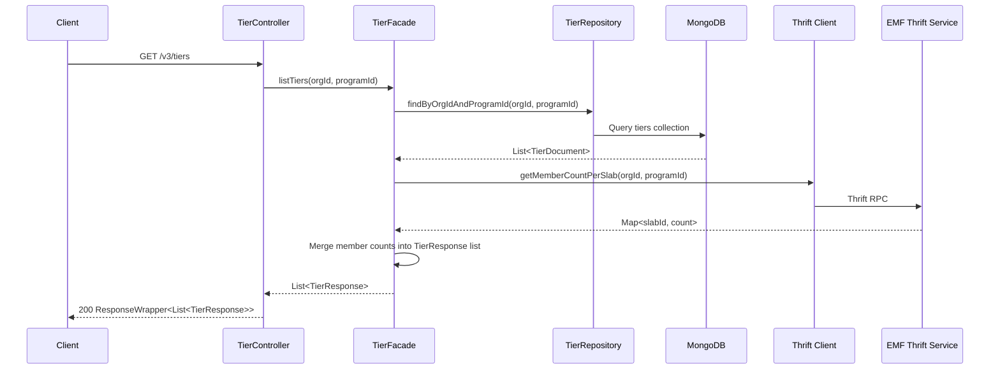

# HLD — Tier CRUD APIs

> Feature: tier-crud
> Ticket: test_branch_v3
> Phase: Architect (Phase 6)
> Date: 2026-04-06

---

## 1. System Context



## 2. Architecture Pattern: MongoDB-First with SQL Sync on Approval

### Why This Pattern

| Concern | Solution |
|---------|----------|
| DRAFT tiers must not affect evaluation engine | DRAFT/PENDING live in MongoDB only. `program_slabs` (MySQL) only has ACTIVE tiers. |
| Need rich document model for tier config | MongoDB document holds full config: thresholds, strategies, downgrade config, renewal — all in one document. |
| Future extensibility (Benefits E2, aiRa E3) | MongoDB document can absorb benefits linkage and aiRa context without schema migrations. |
| Existing evaluation engine untouched | `SlabUpgradeService`, `SlabDowngradeService`, `RenewSlabInstructionImpl` continue reading MySQL unchanged. |
| Follows established pattern | Mirrors `UnifiedPromotion` pattern already proven in production. |

### Data Flow



---

## 3. ADRs (Architecture Decision Records)

### ADR-1: MongoDB-First Architecture
- **Decision**: Store tier configuration in MongoDB (intouch-api-v3). Sync to MySQL (emf-parent) only on APPROVE via Thrift.
- **Context**: DRAFT tiers must not appear in evaluation engine. Need rich document model for future benefits/aiRa integration.
- **Consequences**: Two sources of truth during config lifecycle. MongoDB = authoritative for config state. MySQL = authoritative for operational/evaluation state.
- **Status**: Accepted (Phase 4)

### ADR-2: Separate TierController (No RequestManagementController Modification)
- **Decision**: All tier status changes handled by `TierController` endpoints. Do NOT modify `RequestManagementController` or `EntityType` enum.
- **Context**: `RequestManagementController` returns `ResponseWrapper<UnifiedPromotion>` and takes `PromotionStatus` param. Tightly coupled to promotions.
- **Consequences**: Some code duplication (status change logic). But zero risk to promotion flow.
- **Status**: Accepted (Phase 4, B-1)

### ADR-3: Soft Delete with `is_active` Column
- **Decision**: Add `is_active TINYINT(1) NOT NULL DEFAULT 1` to `program_slabs`. Soft-delete sets to 0.
- **Context**: Existing convention across ~20 tables in the codebase. No Hibernate `@Where` (version compatibility concern).
- **Consequences**: Existing DAO queries in emf-parent must be updated to filter `is_active=1`. Blast radius is manageable since only ACTIVE tiers are in MySQL (DRAFT/PENDING never written).
- **Status**: Accepted (Phase 4, B-2)

### ADR-4: New `TierStatus` Enum (Not Reusing PromotionStatus)
- **Decision**: Create `TierStatus` enum with 4 values: DRAFT, PENDING_APPROVAL, ACTIVE, STOPPED.
- **Context**: `PromotionStatus` has 10 values (PAUSED, SNAPSHOT, LIVE, UPCOMING, etc.) irrelevant to tiers.
- **Status**: Accepted (Phase 4, H-4)

### ADR-5: EMF Thrift Boundary
- **Decision**: intouch-api-v3 ONLY communicates with emf-parent via Thrift endpoints. Never calls internal EMF methods (like `BasicProgramCreator`) directly.
- **Context**: Clean service boundary. EMF owns persistence and strategy creation.
- **Status**: Accepted (Phase 4, H-2)

### ADR-6: Member Count via Cross-Service Query
- **Decision**: GET /tiers includes member count per tier. Queried from `customer_enrollment` table in emf-parent via Thrift.
- **Context**: Requires new DAO method + new index on `customer_enrollment(org_id, program_id, current_slab_id, is_active)`.
- **Status**: Accepted (Phase 4, GQ-3)

---

## 4. API Contract

### 4.1 Tier CRUD Endpoints

#### GET /v3/tiers
```
GET /v3/tiers?includeInactive=false
Authorization: Bearer <token>

Response: ResponseWrapper<List<TierResponse>>
```

#### GET /v3/tiers/{tierId}
```
GET /v3/tiers/{tierId}
Authorization: Bearer <token>

Response: ResponseWrapper<TierResponse>
```

#### POST /v3/tiers
```
POST /v3/tiers
Authorization: Bearer <token>
Content-Type: application/json

Body: TierRequest {
  name: String (required, max 100)
  description: String (optional, max 500)
  colorCode: String (optional, hex)
  serialNumber: Integer (required)
  eligibility: {
    currentValueType: String (required: CURRENT_POINTS|CUMULATIVE_POINTS|CUMULATIVE_PURCHASES|TRACKER_VALUE_BASED)
    thresholdValue: Double (required, > 0)
    trackerId: Integer (optional, required if TRACKER_VALUE_BASED)
    trackerConditionId: Integer (optional)
  }
  validity: {
    periodType: String (required)
    periodValue: Integer (required, > 0)
  }
  renewal: {
    conditions: List<RenewalCondition>
    conditionOperator: String (ANY|ALL|CUSTOM)
    customExpression: String (optional, for CUSTOM)
    extensionType: String (BY_MONTH|BY_VALIDITY_PERIOD|FROM_FIXED_DATE)
  }
  downgrade: {
    targetType: String (SINGLE_BELOW|THRESHOLD_BASED|LOWEST)
    targetSlabId: Integer (optional, for specific target)
    gracePeriodDays: Integer (optional)
    isDowngradeOnReturnEnabled: Boolean (default false)
    isDowngradeOnPartnerProgramDeLinkingEnabled: Boolean (default false)
    confirmationConfig: Object (optional)
  }
  upgradeBonus: {
    points: Integer (optional)
  }
  metadata: String (optional, max 30)
}

Response 201: ResponseWrapper<TierResponse>
Response 400: ResponseWrapper<null> with errors[]: [{code, message}]
```

#### PUT /v3/tiers/{tierId}
```
PUT /v3/tiers/{tierId}
Authorization: Bearer <token>
Body: TierRequest (same as create)

Response 200: ResponseWrapper<TierResponse>
```

#### DELETE /v3/tiers/{tierId}
```
DELETE /v3/tiers/{tierId}
Authorization: Bearer <token>

Validations:
- Cannot delete base tier (serialNumber=1)
- Cannot delete if tier has members (count > 0)
- Cannot delete if tier is downgrade target of another active tier
- Cannot delete if referenced in PartnerProgramTierSyncConfiguration

Response 200: ResponseWrapper<null>
Response 400: ResponseWrapper<null> with validation errors
```

### 4.2 Status Change Endpoint

#### POST /v3/tiers/{tierId}/status
```
POST /v3/tiers/{tierId}/status
Authorization: Bearer <token>

Body: TierStatusRequest {
  action: String (required: SUBMIT_FOR_APPROVAL|APPROVE|REJECT|STOP)
  comment: String (required for REJECT, optional otherwise)
}

Status Transitions:
  SUBMIT_FOR_APPROVAL: DRAFT → PENDING_APPROVAL
  APPROVE: PENDING_APPROVAL → ACTIVE (triggers Thrift sync to MySQL)
  REJECT: PENDING_APPROVAL → DRAFT (comment required)
  STOP: ACTIVE → STOPPED (triggers Thrift: is_active=0 in MySQL)

Response 200: ResponseWrapper<TierResponse>
```

### 4.3 TierResponse DTO

```
TierResponse {
  tierId: String (UUID, immutable)
  objectId: String (MongoDB _id)
  slabId: Integer (MySQL PK, null if DRAFT/PENDING)
  name: String
  description: String
  colorCode: String
  serialNumber: Integer
  status: TierStatus (DRAFT|PENDING_APPROVAL|ACTIVE|STOPPED)
  eligibility: { currentValueType, thresholdValue, trackerId, trackerConditionId }
  validity: { periodType, periodValue }
  renewal: { conditions[], conditionOperator, customExpression, extensionType }
  downgrade: { targetType, targetSlabId, gracePeriodDays, isDowngradeOnReturnEnabled, ... }
  upgradeBonus: { points }
  metadata: String
  memberCount: Long (from customer_enrollment, null if DRAFT/PENDING)
  programId: Integer
  orgId: Integer
  createdOn: DateTime
  lastModifiedOn: DateTime
  createdBy: Integer
  lastModifiedBy: Integer
  version: Integer
  parentId: String (if this is a DRAFT revision of an ACTIVE tier)
}
```

---

## 5. Data Model

### 5.1 MongoDB Document: `tiers` collection



### 5.2 MySQL Schema Change: `program_slabs`

```sql
-- cc-stack-crm: schema/dbmaster/warehouse/program_slabs.sql
-- Add is_active column for soft-delete
ALTER TABLE program_slabs
  ADD COLUMN is_active TINYINT(1) NOT NULL DEFAULT 1
  COMMENT 'Soft-delete flag: 1=active, 0=inactive';
```

### 5.3 MySQL Index Addition: `customer_enrollment`

```sql
-- cc-stack-crm: schema/dbmaster/warehouse/customer_enrollment.sql
-- Required for member count per tier queries
CREATE INDEX idx_ce_slab_count
  ON customer_enrollment (org_id, program_id, current_slab_id, is_active);
```

---

## 6. Implementation Plan

### Build Order

```mermaid
gantt
    title Tier CRUD Implementation Order
    dateFormat X
    axisFormat %s

    section Schema (cc-stack-crm)
    Add is_active to program_slabs DDL    :s1, 0, 1
    Add member count index to customer_enrollment :s2, 0, 1

    section EMF (emf-parent)
    Update ProgramSlab entity (is_active field) :e1, 1, 2
    Update PeProgramSlabDao queries (is_active filter) :e2, 2, 3
    Add member count query to PeCustomerEnrollmentDao :e3, 2, 3
    Add deactivateSlab Thrift method :e4, 3, 4
    Add getMemberCountPerSlab Thrift method :e5, 3, 4

    section intouch-api-v3
    TierDocument MongoDB model :i1, 1, 2
    TierRepository + EmfMongoConfig registration :i2, 2, 3
    TierFacade (CRUD logic) :i3, 3, 5
    TierController (REST endpoints) :i4, 5, 6
    TierFacade (APPROVE + Thrift sync) :i5, 6, 8
    TierFacade (soft-delete + validations) :i6, 8, 9
    DTOs + validation annotations :i7, 3, 4
    TierStatus enum :i8, 1, 2
    Error codes + messages :i9, 3, 4
```



### Step-by-Step

| Step | Task | Repo | Dependencies | Est. Complexity |
|------|------|------|-------------|-----------------|
| 1 | Schema: `is_active` column DDL + member count index | cc-stack-crm | None | Low |
| 2 | Entity: Add `isActive` field to `ProgramSlab.java` | emf-parent | Step 1 | Low |
| 3 | DAO: Update `PeProgramSlabDao` queries with `is_active=1` filter | emf-parent | Step 2 | Medium |
| 4 | DAO: Add `countMembersBySlab()` to `PeCustomerEnrollmentDao` | emf-parent | Step 1 (index) | Low |
| 5 | Thrift: Add `deactivateSlab` method to Thrift service | emf-parent | Step 2 | Medium |
| 6 | Thrift: Add `getMemberCountPerSlab` method | emf-parent | Step 4 | Low |
| 7 | MongoDB: `TierDocument.java` + `TierRepository.java` | intouch-api-v3 | None | Medium |
| 8 | Config: Register TierRepository in `EmfMongoConfig` | intouch-api-v3 | Step 7 | Low |
| 9 | DTOs: `TierRequest`, `TierResponse`, `TierStatusRequest`, `TierReviewRequest` | intouch-api-v3 | None | Medium |
| 10 | Enum: `TierStatus` (DRAFT, PENDING_APPROVAL, ACTIVE, STOPPED) | intouch-api-v3 | None | Low |
| 11 | Validation: Bean Validation annotations + custom validators | intouch-api-v3 | Step 9 | Medium |
| 12 | Error codes: Tier-specific error codes in message properties | intouch-api-v3 | None | Low |
| 13 | Facade: `TierFacade` — create, update, list, get, status change | intouch-api-v3 | Steps 7-12 | High |
| 14 | Facade: APPROVE flow — MongoDB read → SlabInfo build → Thrift call → MongoDB update | intouch-api-v3 | Steps 5-6, 13 | High |
| 15 | Facade: Soft-delete flow — validations (base tier, members, downgrade target, partner sync) → Thrift deactivate | intouch-api-v3 | Steps 5-6, 13 | Medium |
| 16 | Controller: `TierController` — all REST endpoints wired | intouch-api-v3 | Steps 13-15 | Medium |
| 17 | Integration test | Both repos | All steps | Medium |

---

## 7. Sequence Diagrams

### 7.1 Create Tier



### 7.2 Approve Tier (Critical Path)



### 7.3 Soft-Delete Tier



### 7.4 GET /tiers (List)



---

## 8. Per-Repo Change Inventory

### intouch-api-v3 (NEW files: ~14, MODIFIED: ~2)

| File | Type | Purpose |
|------|------|---------|
| `resources/TierController.java` | NEW | REST endpoints |
| `tier/TierFacade.java` | NEW | Business logic orchestration |
| `tier/TierDocument.java` | NEW | MongoDB document model |
| `tier/TierRepository.java` | NEW | MongoDB repository |
| `tier/dto/TierRequest.java` | NEW | Create/update request DTO |
| `tier/dto/TierResponse.java` | NEW | Response DTO |
| `tier/dto/TierStatusRequest.java` | NEW | Status change request |
| `tier/dto/EligibilityConfig.java` | NEW | Nested DTO |
| `tier/dto/ValidityConfig.java` | NEW | Nested DTO |
| `tier/dto/RenewalConfig.java` | NEW | Nested DTO |
| `tier/dto/DowngradeConfig.java` | NEW | Nested DTO |
| `tier/enums/TierStatus.java` | NEW | DRAFT, PENDING_APPROVAL, ACTIVE, STOPPED |
| `tier/enums/TierAction.java` | NEW | SUBMIT_FOR_APPROVAL, APPROVE, REJECT, STOP |
| `tier/validation/TierValidator.java` | NEW | Custom threshold + business validators |
| `EmfMongoConfig.java` | MODIFIED | Add TierRepository to includeFilters |
| `messages_en.properties` (or similar) | MODIFIED | Add TIER error codes |

### emf-parent (MODIFIED: ~4, NEW: ~1-2)

| File | Type | Purpose |
|------|------|---------|
| `ProgramSlab.java` | MODIFIED | Add `isActive` field + mapping |
| `PeProgramSlabDao.java` | MODIFIED | Add `is_active=1` filter to existing queries |
| `PeCustomerEnrollmentDao.java` | MODIFIED | Add `countMembersBySlab()` query |
| `PointsEngineRuleConfigThriftImpl.java` | MODIFIED | Add `deactivateSlab()` + `getMemberCountPerSlab()` methods |
| Migration script (if Flyway exists) | NEW | ALTER TABLE for `is_active` |

### cc-stack-crm (MODIFIED: 2)

| File | Type | Purpose |
|------|------|---------|
| `schema/dbmaster/warehouse/program_slabs.sql` | MODIFIED | Add `is_active` column |
| `schema/dbmaster/warehouse/customer_enrollment.sql` | MODIFIED | Add member count index |

---

## 9. Risks & Mitigations

| Risk | Severity | Mitigation |
|------|----------|------------|
| Thrift IDL not in emf-parent repo (in dependency jar) | HIGH | May need to add new Thrift methods via the IDL in the Thrift repo, then regenerate. Verify with team. |
| MongoDB write succeeds but Thrift fails on APPROVE | HIGH | Implement retry + rollback: if Thrift fails, revert MongoDB status to PENDING_APPROVAL. Log for manual retry. |
| `is_active` column added without updating all existing queries | MEDIUM | Audit all `PeProgramSlabDao` callers. Only 3 queries exist — manageable blast radius since only ACTIVE tiers written to MySQL. |
| `customer_enrollment` index on large table | MEDIUM | Index creation may take time on production. Schedule during off-peak. |
| Two sources of truth (MongoDB + MySQL) diverge | MEDIUM | MongoDB is authoritative for config lifecycle. MySQL is derived on APPROVE. If divergence detected, MongoDB wins — re-sync via Thrift. |
