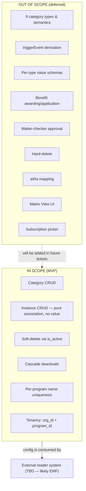
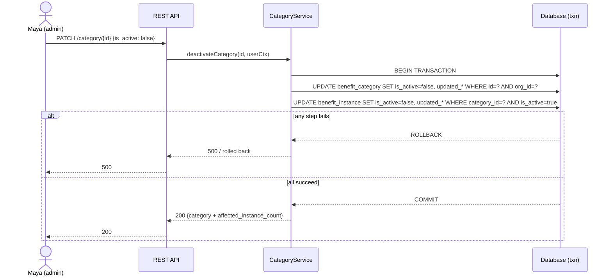

# Business Analysis — Benefit Category CRUD

> **Ticket**: CAP-185145
> **Feature**: Benefit Category CRUD + Benefit Instance linking (MVP)
> **Phase**: 1 (BA Deep-Dive)
> **Date**: 2026-04-18
> **Source BRD**: `Tiers_Benefits_PRD_v3_Full.pdf` (Garuda Loyalty Platform — Tiers & Benefits v3)

---

## 1. Executive Summary

Build a **metadata-grouping service** for loyalty benefit configuration. The feature introduces two new entities — `BenefitCategory` (program-level grouping) and `BenefitInstance` (category-to-tier association) — and exposes CRUD APIs for them.

**Crucial scope narrowing** (via user Q&A, Phase 1):
- The feature is **config-only**. It stores WHICH categories exist and WHICH tiers they apply to. It does **not** implement benefit-awarding logic, trigger-event semantics, or per-type value schemas. An existing system (TBD in Phase 5 research — likely the EMF tier event forest) is expected to consume this config and apply benefits.
- Instances carry **no value payload** — no points, no amount, no voucher template, no JSON config. A `BenefitInstance` is a pure `(category_id, tier_id)` association with lifecycle metadata.
- `categoryType` is an enum column with a **single MVP value** (`BENEFITS`). The 9 category types in BRD §3 (WELCOME_GIFT, EARN_POINTS, etc.) and the §5.3 trigger-mapping table are deferred to a future ticket.
- Maker-checker approval workflow is **descoped** for MVP. All mutations are immediate.
- **Strict coexistence** with the existing emf-parent `Benefits` entity — zero schema changes to legacy, no FK linking, separate packages and tables.

This feature is foundational plumbing. It establishes the data shape and ownership boundary before downstream pieces (trigger semantics, value schemas, maker-checker, aiRa mapping, matrix UI) are added in subsequent tickets.

---

## 2. Scope

### 2.1 In Scope

| Area | Detail |
|------|--------|
| Category CRUD | Create, Read (get + list), Update, Soft-delete (is_active=false) |
| Instance CRUD | Create (link category → tier), Read (get + list), Soft-delete |
| Cascade semantics | Deactivating a category cascades to all child instances in the same transaction |
| Uniqueness | `categoryName` unique per Program (DB constraint + service-layer check) |
| Tenancy | Both new tables carry `org_id` + `program_id`; all reads scoped by caller's org context |
| API layer | REST endpoints via existing intouch-api-v3 gateway conventions (exact path + style TBD in Phase 6) |
| Audit fields | `created_at`, `created_by`, `updated_at`, `updated_by` on all new tables |

### 2.2 Out of Scope (Deferred)

| Area | Reason |
|------|--------|
| 9 distinct category types (WELCOME_GIFT, EARN_POINTS, etc.) | D-06 — single `BENEFITS` type in MVP; multi-type is future work |
| `triggerEvent` field & derivation logic (BRD §5.3 mapping table) | D-07 — not modelled |
| Per-type value schemas / value fields on instances | D-09 — instances carry no value payload |
| Benefit awarding / application logic | D-08 — handled by an external reader system |
| Maker-checker approval workflow (DRAFT → PENDING → ACTIVE) | D-05 — descoped for MVP |
| Hard-delete endpoint | D-13 — soft-delete only |
| aiRa natural-language mapping (BRD §8, AC-BC09) | D-03 — explicitly out |
| Matrix View dashboard (AC-BC10, AC-BC11) | D-03 — explicitly out |
| Subscription benefit picker (AC-BC13) | D-03 — explicitly out |
| Schema changes to legacy `Benefits` table | C-14 — strict coexistence |

### 2.3 BRD Acceptance Criteria Coverage

| AC ID | BRD Title | Status in this feature |
|-------|-----------|-----------------------|
| AC-BC01 | Category created with required fields | **Partially in scope** — reinterpreted: no DRAFT state, no trigger-event derivation. Creation is immediate. |
| AC-BC02 | Category name uniqueness per program | **In scope** — enforced at DB + service layer |
| AC-BC03 | Benefit Instance created and linked | **Partially in scope** — reinterpreted: no value fields, just (category, tier) association |
| AC-BC04 | _(missing in BRD)_ | **Open — OQ-4**: AC numbers 04/05/06 are absent from source BRD; unknown if intentional |
| AC-BC05 | _(missing in BRD)_ | same as AC-BC04 |
| AC-BC06 | _(missing in BRD)_ | same as AC-BC04 |
| AC-BC07 | Maker-Checker category creation | **Descoped** — D-05 |
| AC-BC08 | Maker-Checker instance change | **Descoped** — D-05 |
| AC-BC09 | aiRa mapping | **Out of scope** — D-03 |
| AC-BC10 | Matrix View display | **Out of scope** — D-03 |
| AC-BC11 | Matrix View value rendering | **Out of scope** — D-03 |
| AC-BC12 | Category deactivation cascades to instances | **In scope** — D-14 |
| AC-BC13 | Subscription benefit picker | **Out of scope** — D-03 |

---

## 3. Glossary

| Term | Definition |
|------|------------|
| **Benefit Category** (new) | Program-scoped metadata-grouping entity. Holds name, single categoryType value (`BENEFITS`), tier applicability, isActive flag. No reward values, no trigger semantics. |
| **Benefit Instance** (new) | A pure `(category_id, tier_id)` association row. Marks that a category is configured for a specific tier. Carries isActive + audit metadata only — no value payload. |
| **`categoryType`** | Enum column on BenefitCategory. MVP has one value: `BENEFITS`. Column retained for forward extensibility without schema migration. |
| **`Benefits` (legacy)** | Existing emf-parent entity, promotions-backed, `BenefitsType = {VOUCHER, POINTS}`. Carries actual reward values. **Distinct from the new model — no FK, no coupling.** Remains unchanged by this feature. |
| **Program** | Existing platform concept — a loyalty program belonging to an org. A program contains one or more Tiers. |
| **Tier** | Existing platform concept — a segment within a program (e.g., Silver, Gold). |
| **Tier Applicability** | On a Category: the set of tiers this category is allowed to have instances for. At least one tier required. |
| **Instance lifecycle** | Simple `is_active` boolean. No state machine. No DRAFT / PENDING / APPROVED states. |

---

## 4. User Stories

**Persona**: Maya — Program Manager (admin user configuring loyalty tiers & benefits).

### Epic E1 — Benefit Category Management

| ID | Story | Priority |
|----|-------|----------|
| US-1 | As Maya, I can create a new Benefit Category with a name, tier applicability list, and active flag, so that I can start defining a benefit group for my program. | P0 |
| US-2 | As Maya, I can view a list of all Benefit Categories in my program (optionally filtered by isActive), so that I can see what's been configured. | P0 |
| US-3 | As Maya, I can view the details of a single Benefit Category, so that I can inspect its configuration. | P0 |
| US-4 | As Maya, I can update a Benefit Category's name or tier applicability, so that I can correct errors or adjust scope as my program evolves. | P0 |
| US-5 | As Maya, I can deactivate a Benefit Category (soft-delete), and all its instances are automatically deactivated in the same action, so that I can cleanly remove a benefit group without leaving orphan instances. | P0 |
| US-6 | As Maya, I can reactivate a previously deactivated Category — but its instances stay deactivated until I explicitly reactivate each one, so that I retain control over which tier-level benefits actually resume. | P1 |

### Epic E2 — Benefit Instance Linking

| ID | Story | Priority |
|----|-------|----------|
| US-7 | As Maya, I can create a Benefit Instance by selecting a Category and a Tier (must be in the Category's tierApplicability list), so that I record that this category applies to this specific tier. | P0 |
| US-8 | As Maya, I can view all Benefit Instances for a given Category, so that I can see which tiers have it configured. | P0 |
| US-9 | As Maya, I can deactivate a single Benefit Instance, so that a tier stops being marked as having this category. | P0 |
| US-10 | As Maya, I can reactivate a deactivated Instance (only if its parent Category is currently active), so that I can re-enable a benefit for a tier. | P1 |

---

## 5. Acceptance Criteria (Reinterpreted for MVP)

### AC-BC01' — Category Creation
**Given** an admin user Maya authenticated to a program,
**When** she submits a create-category request with a valid name, tierApplicability list (≥1 tier), and categoryType=BENEFITS,
**Then**
1. A new row is created in `benefit_category` with `is_active=true`, `org_id` and `program_id` set from auth context, `created_at` = now, `created_by` = Maya's ID.
2. The response returns the full category record, including its newly-generated ID.
3. If the name already exists for another active or inactive category in the same program, the request is rejected with HTTP 409 (`category.name.duplicate`).
4. If tierApplicability is empty or contains a tierId that does not belong to this program, the request is rejected with HTTP 400.

> **Note**: Original BRD AC-BC01 required "DRAFT state + correct trigger event derived from categoryType". Both are deferred per D-05 (no maker-checker) and D-07 (no triggerEvent field).

### AC-BC02 — Name Uniqueness
**Given** an existing benefit category named "Welcome Pack" in Program 123,
**When** any user attempts to create another category named "Welcome Pack" in Program 123 (case-insensitive match),
**Then** the request fails with HTTP 409.
**And** the same name IS permitted in a different program.

### AC-BC03' — Instance Creation
**Given** an active BenefitCategory C1 in Program 123 with tierApplicability `[Silver, Gold]`,
**When** Maya creates a BenefitInstance linking C1 to Silver,
**Then**
1. A new row is created in `benefit_instance` with `is_active=true`, `category_id=C1.id`, `tier_id=Silver.id`, `org_id`, `program_id`, audit cols.
2. If an instance for `(C1, Silver)` already exists and is active, the request is rejected with HTTP 409 (`instance.duplicate`).
3. If an instance for `(C1, Silver)` exists but is inactive, the behaviour is a re-activation (update `is_active=true`) — NOT a new row. _[Design question: or return 409 and require explicit PATCH? Phase 6 decides. Default assumption: re-activate.]_
4. If the tier is NOT in C1's tierApplicability list, reject HTTP 400 (`instance.tier.not_applicable`).
5. If C1 is `is_active=false`, reject HTTP 400 (`instance.category.inactive`).

> **Note**: Original BRD AC-BC03 required value-field validation and trigger-event inheritance. Both are deferred per D-09 (no value payload) and D-07 (no triggerEvent).

### AC-BC12 — Category Deactivation Cascade
**Given** an active BenefitCategory C1 with active BenefitInstances I1, I2, I3,
**When** Maya deactivates C1 (PATCH `{is_active: false}`),
**Then**
1. C1.is_active flips to false.
2. I1, I2, I3 all flip to is_active=false in the **same DB transaction**.
3. All four rows receive updated_at = now, updated_by = Maya.
4. If any step fails, the whole transaction rolls back — no partial deactivation is visible.
5. A subsequent reactivation of C1 does NOT auto-reactivate I1/I2/I3. They must be reactivated individually.

---

## 6. Functional Requirements

| FR | Description |
|----|-------------|
| FR-1 | The system SHALL expose REST endpoints for Category CRUD: create, get-by-id, list, patch (name/tierApplicability/is_active), and a dedicated deactivate action (if API design in Phase 6 chooses to split PATCH from deactivate). |
| FR-2 | The system SHALL expose REST endpoints for Instance CRUD: create (category+tier), get-by-id, list (by category or by tier), deactivate. |
| FR-3 | The system SHALL enforce name uniqueness per program at both DB layer (UNIQUE constraint) and service layer (pre-validation for friendlier error). |
| FR-4 | The system SHALL enforce tier applicability: instance.tier_id MUST be in the parent category's tierApplicability at creation time. |
| FR-5 | The system SHALL reject instance creation under an inactive parent category. |
| FR-6 | The system SHALL cascade category deactivation to all child instances in a single transaction. |
| FR-7 | The system SHALL NOT auto-reactivate instances on category reactivation. |
| FR-8 | The system SHALL scope all reads and writes by the authenticated caller's org_id. A user MUST NOT be able to read or modify another org's categories/instances even if they guess an ID. |
| FR-9 | The system SHALL record audit metadata (created_at/by, updated_at/by) on every mutation. |
| FR-10 | The system SHALL persist deactivated records — no hard-delete in MVP. |

---

## 7. Non-Functional Requirements

| NFR | Description |
|-----|-------------|
| NFR-1 (Performance) | Category list API returns within 500ms P95 for a program with up to 200 categories. Instance list within 500ms P95 for up to 1000 instances per program. |
| NFR-2 (Availability) | Inherits platform SLA (Capillary standard; exact target set at Phase 6). |
| NFR-3 (Security) | All endpoints behind existing auth layer. All queries tenant-scoped. No cross-org data leakage possible via ID guessing. |
| NFR-4 (Auditability) | All create / update / deactivate operations record `updated_by` from auth context. |
| NFR-5 (Consistency) | Cascade deactivation is transactional. Either all affected rows flip, or none. |
| NFR-6 (Idempotency) | Re-activating an already-active row is a no-op (returns current state). Deactivating an already-inactive row is a no-op. Matches REST PATCH semantics. |
| NFR-7 (Observability) | All mutations emit a structured log with {op, entity, id, program_id, org_id, user_id}. Metric counters for create/update/deactivate operations. |

---

## 8. Data Model (Business View)

> Physical schema is defined in Phase 7 (Designer). This is the logical shape.

### 8.1 BenefitCategory

| Field | Type | Notes |
|-------|------|-------|
| id | long PK | Auto-generated |
| org_id | long | Tenant scope (from auth context) |
| program_id | long | Feature scope |
| name | string | Unique with (program_id, name); case-insensitive match on write |
| category_type | enum | MVP: `BENEFITS` (single value) |
| tier_applicability | association to Tier | Logical: "which tiers this category is allowed for". Physical representation — JSON column, link table, or array — decided in Phase 7. |
| is_active | boolean | Default true |
| created_at / created_by / updated_at / updated_by | audit | Standard |

### 8.2 BenefitInstance

| Field | Type | Notes |
|-------|------|-------|
| id | long PK | Auto-generated |
| org_id | long | Tenant scope |
| program_id | long | Feature scope |
| category_id | long FK → benefit_category.id | |
| tier_id | long FK → existing Tier table | |
| is_active | boolean | Default true |
| created_at / created_by / updated_at / updated_by | audit | Standard |

**Uniqueness**: Consider UNIQUE (category_id, tier_id) across active+inactive rows — prevents duplicate rows and supports the re-activation flow. Final decision in Phase 7.

### 8.3 What is NOT in the model

- **No `trigger_event` column** (D-07)
- **No value/amount/points/text/voucher_template/json_config columns** on instance (D-09)
- **No lifecycle_state / approval_status column** (D-05)
- **No link to legacy `Benefits` entity** (D-12, C-14)
- **No derived or computed columns** for "effective state based on instance count" (D-04)

---

## 9. Open Questions (Not Blocking Phase 2)

| # | Question | Blocking? | Plan |
|---|----------|-----------|------|
| OQ-4 | BRD numbering skips AC-BC04, AC-BC05, AC-BC06. Intentional gap or content missing? | No | Raise with product during grooming (Phase 4); defer to review. |
| OQ-12 | BRD-internal epic numbering conflict: E2 vs E4. Which Jira epic does CAP-185145 roll up to? | No | Confirm with product; metadata issue only, no engineering impact. |
| OQ-15 | Which existing system CONSUMES this config and actually applies benefits? (EMF tier event forest? peb? a new consumer?) | No for BA — **Yes for Phase 5/6** | Phase 5 codebase research must identify the reader. Drives API schema (they're the consumer) and integration tests. |

---

## 10. Downstream Consumer Hypothesis (for Phase 5 validation)

Given D-08 (benefit awarding is external), the most likely consumer is the **EMF tier event forest** (in emf-parent: `TierRenewedHelper`, `TierUpgradeHelper`). That forest already reacts to tier lifecycle events. Once it knows _"which categories apply to this tier"_ it can decide what to do.

If confirmed in Phase 5:
- API schema should be consumer-friendly for EMF (response shape, field naming conventions matching emf-parent).
- Integration tests should include an emf-parent-originated read-flow test (e.g., simulated tier renewal → query for active categories on that tier).

If not confirmed:
- Escalate as a blocker before Phase 6 — we cannot freeze the API shape without knowing the consumer.

---

## 11. Ready-for-Design Checklist

| Check | Status |
|-------|--------|
| Scope in/out is clear and user-approved | ✅ (D-03, D-05, D-11) |
| Data model shape settled at business level | ✅ (D-06 through D-10, D-12) |
| Lifecycle / state rules settled | ✅ (D-04, D-05, D-13, D-14) |
| Uniqueness & tenancy rules settled | ✅ (D-15, D-16) |
| Coexistence with legacy Benefits settled | ✅ (D-12, C-14) |
| All blocking open questions closed | ✅ |
| Consumer identity confirmed | ⚠️ Phase 5 to resolve — not blocking Phase 2 (Critic / Gap Analysis) |
| ProductEx review incorporated | ✅ (brdQnA.md synthesised into decisions) |

**BA doc status: READY for Phase 2 (Critic + Gap Analysis).**

---

## Diagrams

### Scope boundary (in / out)



### Entity relationship (logical)

```mermaid
erDiagram
    BENEFIT_CATEGORY ||--o{ BENEFIT_INSTANCE : "has many"
    PROGRAM ||--o{ BENEFIT_CATEGORY : "contains"
    PROGRAM ||--o{ TIER : "contains"
    TIER ||--o{ BENEFIT_INSTANCE : "linked by"
    ORG ||--o{ PROGRAM : "owns"

    BENEFIT_CATEGORY {
        long id PK
        long org_id
        long program_id
        string name "unique with program_id"
        enum category_type "BENEFITS only in MVP"
        json_or_linktable tier_applicability
        boolean is_active
        audit audit_cols
    }

    BENEFIT_INSTANCE {
        long id PK
        long org_id
        long program_id
        long category_id FK
        long tier_id FK
        boolean is_active
        audit audit_cols
    }

    BENEFITS_LEGACY {
        note "EXISTING entity in emf-parent — NOT MODIFIED by this feature. Strict coexistence."
    }
```

### Category deactivation cascade



### User journey (Maya — happy path)

```mermaid
flowchart LR
    S([Start]) --> A[Create Category 'Welcome Pack' with tiers Silver, Gold]
    A --> B[List Categories → see 'Welcome Pack']
    B --> C[Create Instance: Welcome Pack → Silver]
    C --> D[Create Instance: Welcome Pack → Gold]
    D --> E[Deactivate Instance: Welcome Pack → Gold]
    E --> F[List Instances: only Silver is active]
    F --> G[Deactivate Category 'Welcome Pack']
    G --> H[All remaining active instances cascade to inactive]
    H --> I[Reactivate Category]
    I --> J[Instances remain inactive — Maya must reactivate each explicitly]
    J --> K([End])
```



---

_End of BA document. See `00-ba-machine.md` for structured metadata and `00-prd.md` for PRD._
