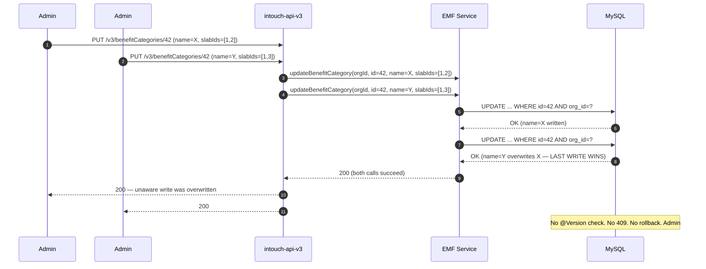
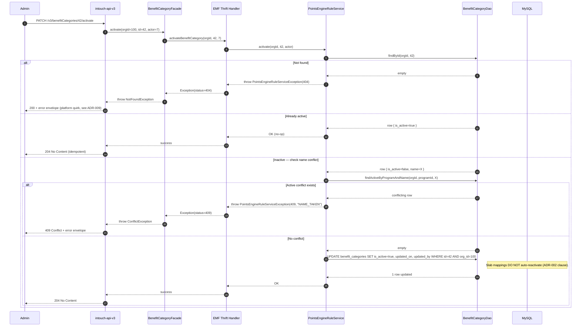
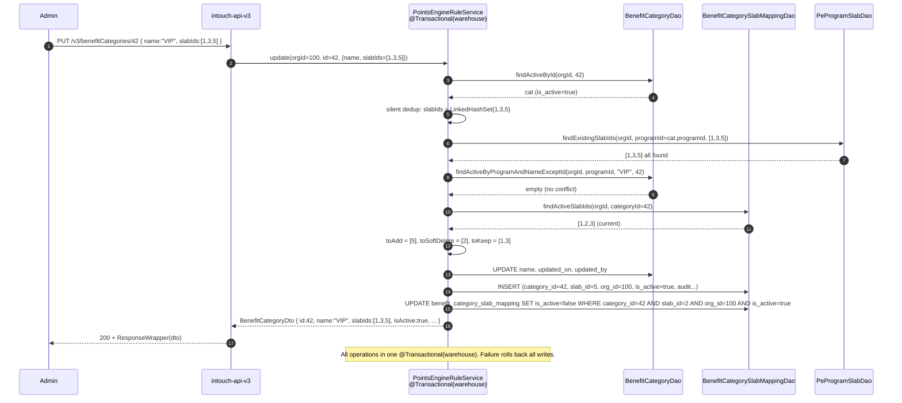
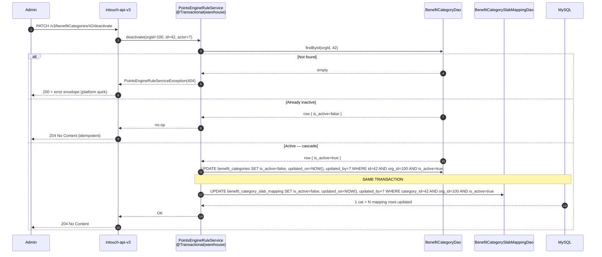
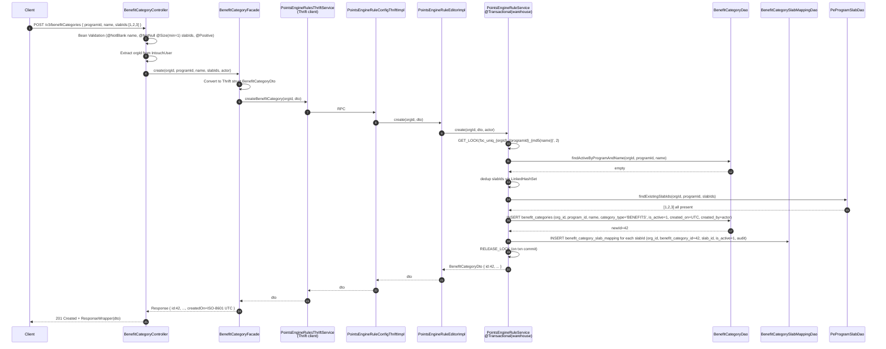
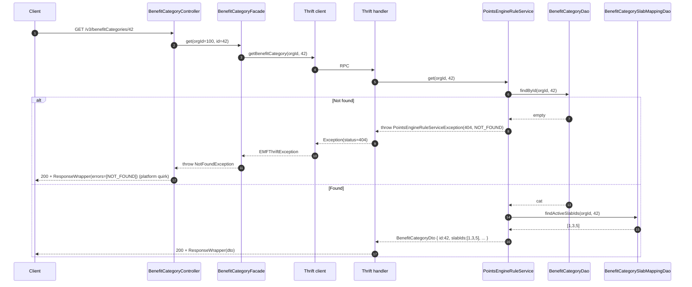
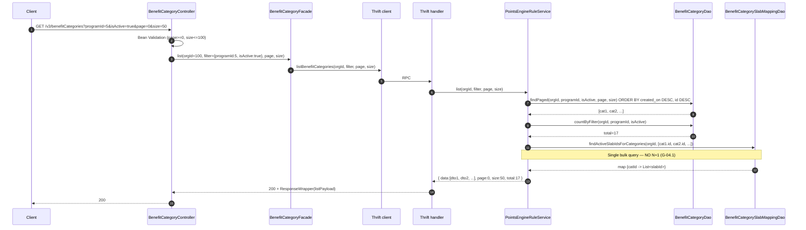
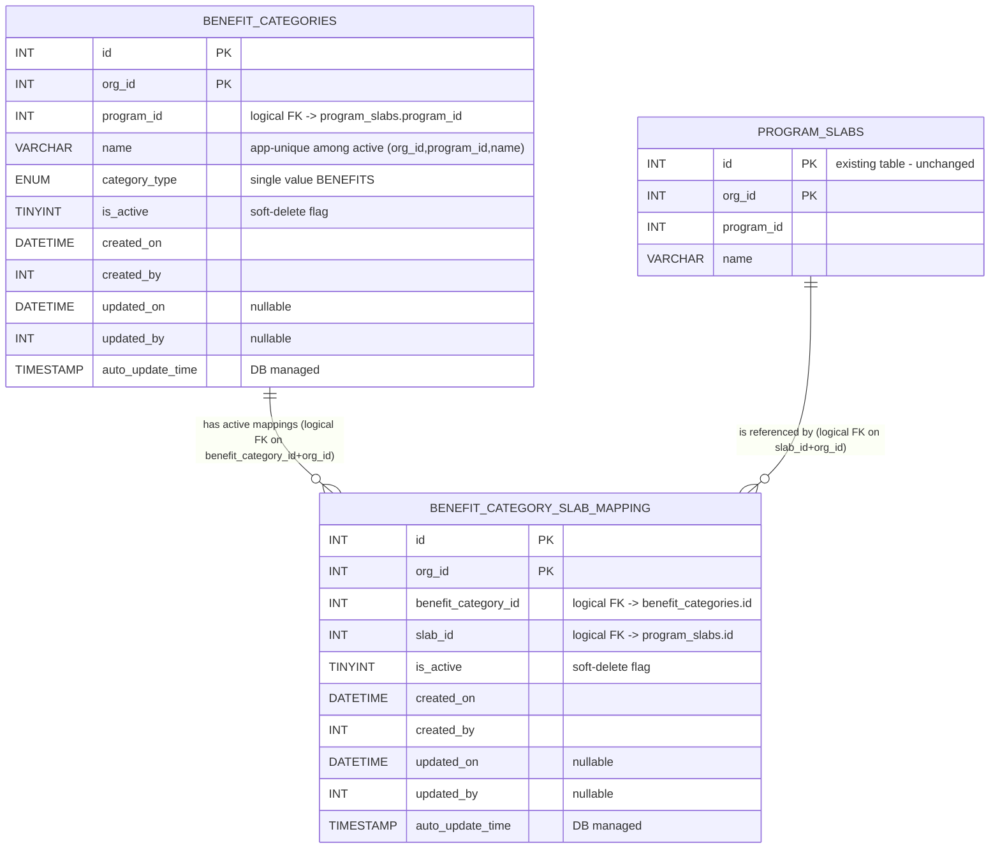

# 01 — Architect (HLD) — Benefit Category CRUD (CAP-185145)

> **Phase**: 6 (HLD) — Architect
> **Ticket**: CAP-185145
> **Date**: 2026-04-18
> **Inputs**: `session-memory.md` (D-01..D-36), `00-ba.md`, `00-prd.md`, `gap-analysis-brd.md`, `cross-repo-trace.md`, `code-analysis-*.md` (4 repos), `.claude/skills/GUARDRAILS.md`, `.claude/CLAUDE.md § Standing ADRs`.
> **Frozen inputs**: D-33, D-34, D-35, D-36 reproduced verbatim as ADR-001..ADR-004 below — not re-debated.

---

## 1. Executive Summary

This feature introduces a **config-only, Program-scoped metadata service** for benefit categories and their applicability to tier slabs. It creates two net-new MySQL tables — `benefit_categories` and `benefit_category_slab_mapping` — owned by `emf-parent`, exposed as CRUD over Thrift via the existing `PointsEngineRuleService`, and fronted by `intouch-api-v3` as a thin REST facade. The new `BenefitCategory` entity coexists strictly with the legacy `Benefits` entity — no FKs, no shared tables, no migration of legacy data (D-12 / C-14).

The shape of the solution is the established 4-layer Capillary pattern: `REST Controller → Facade → Thrift Client → EMF Thrift Handler → Editor → Service (@Transactional) → DAO`. There are five endpoints on `/v3/benefitCategories` (POST, PUT, GET by id, GET list, PATCH `/activate`, PATCH `/deactivate`) mapped to four new methods on the existing `pointsengine-rules` Thrift service plus two struct field additions.

The four frozen ADRs (ADR-001..004) are structurally load-bearing: (a) **ADR-001** removes optimistic locking and simplifies the DTO contract + DDL — every downstream design (Designer, QA, SDET) inherits a "no `@Version`, no `If-Match`" posture; (b) **ADR-002** introduces a dedicated reactivation verb, which re-words D-27 and splits idempotency contracts cleanly; (c) **ADR-003** chooses an embedded-`slabIds` parent DTO with server-side diff-and-apply, meaning the junction table has ZERO REST surface and fan-out is reduced; (d) **ADR-004** mirrors (b) for deactivation with cascade-in-transaction (C-16). The net effect: five REST endpoints, four Thrift methods, one facade, two DAOs, two DDL files, one new exception class — a small, focused cross-repo fan-out where the read path is identical to the write path (D-19).

---

## 2. Frozen ADRs (verbatim — ADR-001..004)

### ADR-001 — No optimistic locking on `BenefitCategory` (from D-33)

**Status**: Accepted (user-decided — pre-HLD commit #1). Frozen.

**Context**. Concurrent admin writes on the same `BenefitCategory` row (e.g., two admins renaming or re-slabbing the category at once) can silently overwrite each other unless the write path carries a version token. The platform-standard guardrail G-10 (concurrency) recommends JPA `@Version` + client-supplied `version` on every update. At the scale declared in D-26 (SMALL — ≤50 categories per program, ≤20 slab-mappings per category, <1 QPS sustained writes, typically one admin editor at a time), the `@Version` infrastructure adds DTO surface + DDL column + client round-trip ceremony for a race window that is functionally unreachable.

**Decision**. No optimistic locking on `BenefitCategory`.
- No `@Version` entity column
- No `version` field in Create/Update request DTO
- No `version BIGINT` column in DDL
- Last-write-wins for all concurrent admin writes on the same row

**Consequences**.
- *Positive*: simpler DTO + DDL + facade contract; no client-side version management; no stale-version 409 path; -1 Thrift field; -1 DB column.
- *Negative*: A second concurrent write silently overwrites the first. No feedback to admin that their view was stale.
- *Accepted risk*: A correctness race exists in principle. At D-26 scale the race window is small and the data it affects is low-harm (config-only, soft-delete available, observable in audit columns).
- *Guardrail posture*: G-10 marked as **accepted deviation**, documented here.
- **Revisit-triggers** (monitor post-GA):
  - Admin-write QPS on `benefit_categories` crosses 10/sec per tenant over a 1-hour window
  - Multi-editor Admin UI ships (simultaneous browser tabs with save actions)
  - Any incident tagged "concurrent-write-conflict" on this surface
  - Migration of this entity to MongoDB (where optimistic concurrency shape differs)

**Flow — Last-Write-Wins Posture (no lock)**



---

### ADR-002 — Reactivation via dedicated `PATCH /v3/benefitCategories/{id}/activate` endpoint (from D-34)

**Status**: Accepted (user-decided — pre-HLD commit #2). Frozen.

**Context**. D-27 originally stated "deactivation is terminal — any mutation on an inactive row returns 409." During rework, US-6 (reactivate a soft-deleted category) was recognised as a P1 admin workflow: mis-deactivations happen, and POST-a-new-row is not an acceptable recovery path when admins want to preserve the original `id` for audit traceability. A dedicated verb avoids bending PUT or PATCH `{is_active: true}` semantics and makes the idempotency + name-conflict contract explicit.

**Decision**. Introduce a dedicated reactivation endpoint:
- **REST**: `PATCH /v3/benefitCategories/{id}/activate`
- **Behaviour**:
  - Flips `is_active=false → true` on the `benefit_categories` row
  - **Does NOT auto-reactivate cascaded slab-mappings** — admin must re-apply `slabIds` via subsequent PUT (or via the create/update DTO's `slabIds` diff-apply)
  - Returns `204 No Content` on success (may alternatively return the category DTO — ADR-006 below pins this to `204` for symmetry with `/deactivate`)
  - Returns `404 Not Found` if category does not exist in the caller's org
  - Returns `409 Conflict` if a DIFFERENT active category in the same program now owns that name (D-28 uniqueness-among-active applies at reactivation)
  - Idempotency on already-active: returns `204 No Content` (no-op) — pinned in ADR-006
- **Thrift IDL**: +1 method `activateBenefitCategory(i32 orgId, i32 categoryId, i32 actorUserId) throws (1: PointsEngineRuleServiceException ex)`.
- **D-27 rewording**: PUT and DELETE on inactive categories still return `409`; **reactivation via the dedicated `PATCH /activate` is the only allowed state-change on an inactive category**. Soft-delete stays terminal for PUT/DELETE; only `/activate` can flip the bit back.

**Consequences**.
- *Positive*: preserves `id` for audit trace; clean idempotency and conflict contracts; symmetric with ADR-004; Thrift method is orgId+id+actor — tiny surface.
- *Negative*: +1 Thrift method; admin must do TWO operations to restore full state (activate, then PUT to re-slab).
- *Accepted risk*: reactivation-name-collision is an observable 409 — admin must rename the conflicting active category first.

**Flow — Reactivation**



---

### ADR-003 — REST surface granularity: `slabIds` embedded in parent DTO; server-side diff-and-apply (from D-35)

**Status**: Accepted (user-decided — pre-HLD commit #3). Frozen.

**Context**. The BenefitCategory ↔ ProgramSlab relationship is a classic many-to-many junction. The REST surface has three shapes to choose from: (a) a separate `/benefitCategorySlabMappings` sub-resource with its own POST/DELETE; (b) `slabIds` embedded in the parent DTO, server diffs desired vs. current state; (c) an explicit `add/remove` command sub-path. Option (b) matches Maya's mental model (a category has a set of applicable tiers — not a set of mapping objects) and eliminates cross-resource consistency headaches at the REST layer.

**Decision**. Embed `slabIds: List<Integer>` in the parent `BenefitCategory` DTO. Server-side `syncSlabMappings(categoryId, newIdSet)` performs the diff-and-apply on every Create and Update. The junction table `benefit_category_slab_mapping` is **not exposed** as a REST sub-resource.

- **Endpoint count on `/v3/benefitCategories`**: **5** (POST, PUT, GET by id, GET list, PATCH `/{id}/activate`, PATCH `/{id}/deactivate`). (6 paths total when counting both PATCH sub-paths.)
- **Validation**:
  - **Layer 1 — Bean Validation on DTO**: `@NotNull @Size(min=1)` on Create; `@NotNull` only on Update (`min=1` enforced at facade). `List<@Positive Integer> slabIds` element constraint.
  - **Layer 2 — Facade**: silent dedup via `LinkedHashSet<>(slabIds)`; cross-check every incoming slabId exists in `program_slabs` for the same `(orgId, programId)`. Any non-existent or wrong-program slabId → HTTP 409 `CROSS_PROGRAM_SLAB` / `UNKNOWN_SLAB`.
- **Diff-and-apply semantics**:
  - `incoming = LinkedHashSet<Integer> slabIds`
  - `current = { m.slabId : m in mappings WHERE categoryId=? AND org_id=? AND is_active=true }`
  - `toAdd = incoming \ current` → INSERT new mapping rows (`is_active=true`, fresh audit columns)
  - `toSoftDelete = current \ incoming` → bulk UPDATE `is_active=false, updated_on=NOW(), updated_by=actor`
  - `toKeep = incoming ∩ current` → no writes
- **Re-add semantics**: re-adding a previously unmapped slabId INSERTs a NEW mapping row (does NOT reactivate the soft-deleted row). Old deactivated rows remain as audit history; only the newest `is_active=true` row per `(category_id, slab_id, org_id)` is authoritative.
- **Cascade-deactivate symmetry** (D-06 / C-16 preserved): on `PATCH /{id}/deactivate`, ALL active mappings for that category soft-delete in the same transaction (single bulk UPDATE). On `PATCH /{id}/activate`, mappings do **not** auto-reactivate.
- **Thrift IDL impact**: +0 mapping-specific methods. `createBenefitCategory` and `updateBenefitCategory` structs gain `list<i32> slabIds`.

**Consequences**.
- *Positive*: Maya-aligned UX; one transactional boundary per write; zero cross-resource consistency risk; smaller cross-repo fan-out (no new controller, no new handler methods, no new Thrift methods beyond ADR-002/004).
- *Negative*: Full `slabIds` on every PUT even for name-only changes (extra bytes on wire); diff-and-apply logic requires a read-before-write inside the txn.
- *Accepted risk* — concurrent re-slab of the same category: no optimistic lock (ADR-001), so the last PUT's `slabIds` wins for the whole set. Logged; not mitigated.

**Flow — Update with Diff-and-Apply**



---

### ADR-004 — Deactivation verb: `PATCH /v3/benefitCategories/{id}/deactivate` with cascade (from D-36)

**Status**: Accepted (user-decided — pre-HLD commit #4). Frozen.

**Context**. Soft-delete semantics (D-13) are not accurately conveyed by `DELETE` — the row survives with `is_active=false`. A `PUT {isActive:false}` bends PUT semantics and is asymmetric with ADR-002's `PATCH /activate`. Admins and downstream consumers benefit from a verb that is unambiguous about what the operation does.

**Decision**. Introduce a dedicated deactivation endpoint:
- **REST**: `PATCH /v3/benefitCategories/{id}/deactivate`
- **Behaviour**:
  - Flips `is_active=true → false` on the category row
  - Cascades to all `is_active=true` `benefit_category_slab_mapping` rows for that category — bulk `UPDATE ... SET is_active=false, updated_on=NOW(), updated_by=actor WHERE category_id=? AND org_id=? AND is_active=true` in the same transaction (D-06 / C-16)
  - Returns `204 No Content` on success
  - Returns `404 Not Found` if category does not exist in the caller's org
  - Idempotency on already-deactivated: returns `204 No Content` (no-op) — pinned in ADR-006
- **Thrift IDL**: +1 method `deactivateBenefitCategory(i32 orgId, i32 categoryId, i32 actorUserId) throws (1: PointsEngineRuleServiceException ex)`.
- **D-27 alignment**: fully preserved — PUT on inactive still returns 409; DELETE verb is not exposed (C-15); reactivation is ADR-002's dedicated verb; deactivation is ADR-004's dedicated verb.
- **Rejected alternatives**:
  - `DELETE /{id}` — misleading for soft-delete; creates "why is the row still there?" bugs downstream.
  - `PUT {isActive:false}` — bends PUT; asymmetric with ADR-002.

**Consequences**.
- *Positive*: explicit verb; symmetric with ADR-002; clear cascade contract; single-txn cascade is safe at D-26 scale (max 20 mappings per category).
- *Negative*: +1 Thrift method; cascade is a bulk UPDATE that locks row-range in the mapping table for the duration of the txn (benign at this scale).
- *Accepted risk*: none identified at D-26 scale.

**Flow — Deactivate with Cascade**



---

## 3. Additional ADRs (ADR-005 onwards)

### ADR-005 — Thrift handler assignment: extend `PointsEngineRuleConfigThriftImpl`

**Context**. The four new Thrift methods (`createBenefitCategory`, `updateBenefitCategory`, `getBenefitCategory`, `listBenefitCategories`, `activateBenefitCategory`, `deactivateBenefitCategory`) need a home in `emf-parent`. Options: (a) add them to the existing `PointsEngineRuleConfigThriftImpl` class (currently ~60 methods), (b) create a new `BenefitCategoryThriftImpl` handler also annotated `@ExposedCall(thriftName = "pointsengine-rules")`.

**Evidence** (C7): `code-analysis-emf-parent.md` §2 — `PointsEngineRuleConfigThriftImpl` is the canonical CRUD template, already implements `PointsEngineRuleService.Iface` which means adding methods to the IDL means adding them to this class regardless. It already has the `BenefitsConfigData` CRUD methods for the legacy `Benefits` entity (`code-analysis-thrift-ifaces.md` lines 692-707, 1276-1282).

**Decision**. Add the 6 new handler methods to the existing `PointsEngineRuleConfigThriftImpl`. No new handler class.

**Consequences**.
- *Positive*: zero new Spring bean, zero new `@ExposedCall` registration, consistent with existing pattern, no `Iface` split.
- *Negative*: class grows from ~60 to ~66 methods; maintainability cost is real but linear.
- *Accepted*: Designer may extract helper classes for complex validation but the Thrift `@Override` handler methods stay on `PointsEngineRuleConfigThriftImpl`.

**Confidence**: C7 — evidence-verified from code-analysis + existing IDL pattern.

---

### ADR-006 — Idempotency response codes for `/activate` and `/deactivate`

**Context**. ADR-002 and ADR-004 leave idempotency response unpinned (204 vs 409) for "activate already-active" and "deactivate already-inactive". Two reasonable choices:

| Option | Already-active activate | Already-inactive deactivate |
|--------|------------------------|------------------------------|
| A | 204 No Content | 204 No Content |
| B | 409 Conflict | 409 Conflict |

**Decision**. Option **A** — `204 No Content` for both idempotency cases.

**Rationale**.
- REST idempotency norm (G-06.1): retried PATCH on a state-transition endpoint that is already in the target state is a no-op, not an error.
- Simplifies admin tooling and UI refresh flows (e.g., admin double-clicks activate → second response is still 204, no red toast).
- Matches the "no harm done" semantic: the row is in the target state; the operation is satisfied.

**Rejected**. Option B would need a new error code class (`ALREADY_ACTIVE`, `ALREADY_INACTIVE`) and admin error-handling for a benign case.

**Consequences**.
- *Positive*: simple, REST-idiomatic, robot-safe on retries.
- *Negative*: caller cannot distinguish "I changed state" vs "it was already so" from the response code alone. If auditability matters, server logs (structured, per G-08.2) carry the distinction.
- *Accepted*: logged residual.

**Confidence**: C6 — reasoned decision; no user vote; reversible if user prefers B.

---

### ADR-007 — Data model: column types, audit pattern, soft-delete, NO `version`

**Context**. Sessions memory pins most fields via D-21..D-30; this ADR consolidates them into a single authoritative schema.

**Decision**. Schemas as follows.

**`benefit_categories`**:

| Column | Type | Null | Default | Notes |
|--------|------|------|---------|-------|
| `id` | `INT(11)` | NO | AUTO_INCREMENT | Part of composite PK (D-30 / `OrgEntityIntegerPKBase`) |
| `org_id` | `INT(11)` | NO | 0 | Part of composite PK; tenant isolation |
| `program_id` | `INT(11)` | NO | — | FK logical → `program_slabs.program_id`; indexed |
| `name` | `VARCHAR(255)` | NO | — | App-level uniqueness among active rows (D-28) |
| `category_type` | `ENUM('BENEFITS')` | NO | 'BENEFITS' | Single MVP value (D-06/D-10) |
| `is_active` | `TINYINT(1)` | NO | 1 | Soft-delete flag |
| `created_on` | `DATETIME` | NO | — | App-set UTC (D-24) |
| `created_by` | `INT(11)` | NO | — | Actor user id (D-30) |
| `updated_on` | `DATETIME` | YES | NULL | App-set UTC; null until first update |
| `updated_by` | `INT(11)` | YES | NULL | Actor user id on last update |
| `auto_update_time` | `TIMESTAMP` | NO | `CURRENT_TIMESTAMP ON UPDATE CURRENT_TIMESTAMP` | DB-managed safety net |

**Indexes**: `PRIMARY KEY (id, org_id)`; `KEY idx_bc_org_program (org_id, program_id)`; `KEY idx_bc_org_program_active (org_id, program_id, is_active)` (supports uniqueness check + list filtering).

**`benefit_category_slab_mapping`**:

| Column | Type | Null | Default | Notes |
|--------|------|------|---------|-------|
| `id` | `INT(11)` | NO | AUTO_INCREMENT | Composite PK |
| `org_id` | `INT(11)` | NO | 0 | Composite PK; tenant isolation |
| `benefit_category_id` | `INT(11)` | NO | — | Logical FK → `benefit_categories.id` (same org_id) |
| `slab_id` | `INT(11)` | NO | — | Logical FK → `program_slabs.id` (same org_id) |
| `is_active` | `TINYINT(1)` | NO | 1 | Soft-delete flag |
| `created_on` | `DATETIME` | NO | — | App-set UTC |
| `created_by` | `INT(11)` | NO | — | Actor user id |
| `updated_on` | `DATETIME` | YES | NULL | App-set UTC |
| `updated_by` | `INT(11)` | YES | NULL | Actor user id |
| `auto_update_time` | `TIMESTAMP` | NO | `CURRENT_TIMESTAMP ON UPDATE CURRENT_TIMESTAMP` | DB-managed safety net |

**Indexes**: `PRIMARY KEY (id, org_id)`; `KEY idx_bcsm_org_cat_active (org_id, benefit_category_id, is_active)` (supports cascade lookup + current-mappings read); `KEY idx_bcsm_org_slab_active (org_id, slab_id, is_active)` (supports "which categories apply to slab X" consumer query — D-21).

**Explicit call-out — NO `version` column on either table** (per ADR-001 / D-33). Last-write-wins.

**No FK declarations at DB level**. Cross-table integrity is enforced at the app layer (cross-check `slab_id` against `program_slabs` in the facade). Platform convention (`benefits.sql`, `program_slabs.sql`, `points_categories.sql` from code-analysis-cc-stack-crm.md) uses logical FKs only — composite PKs (id, org_id) across tables make declared FOREIGN KEYs awkward. Matches platform pattern (G-12.2).

**No DB-level UNIQUE constraint on `(org_id, program_id, name)`** — uniqueness enforced at application layer on active rows only (D-28/C-18'). A partial unique index on `(org_id, program_id, name) WHERE is_active=1` is called out in OQ-42's option (iv) for possible future use if the app-level check proves racy in production. Designer Phase 7 may still consider a MySQL advisory lock (`GET_LOCK`) — see Open Questions.

**Confidence**: C7 — derived from D-21, D-22, D-23 (as amended by D-30), D-28, D-33; cross-referenced against `program_slabs.sql`, `points_categories.sql`, `Benefits.java`.

---

### ADR-008 — Timestamp representation: three-boundary pattern (carry-forward of D-24)

**Context**. G-01 (CRITICAL) mandates UTC timestamps via `java.time`; G-12.2 (CRITICAL) mandates following existing platform patterns. Existing platform uses `java.util.Date` + `@Temporal(TIMESTAMP)` + `DATETIME`. Resolving the tension at a single layer is impossible — every choice violates one guardrail.

**Decision** (D-24 / C-23' carried forward — restated for architect visibility):
- **EMF entity + MySQL**: `java.util.Date` + `@Temporal(TemporalType.TIMESTAMP)` + `DATETIME` column (pattern-match `Benefits`, `ProgramSlab`, `Promotions`). Audit columns written via `new Date()` set explicitly to UTC.
- **Thrift IDL**: `i64 createdOn` / `optional i64 updatedOn` — epoch **milliseconds** (matches `Date.getTime()` and JS convention). Field name: bare `createdOn`/`updatedOn` (pointsengine_rules.thrift convention, NOT the `*InMillis` convention used by `emf.thrift`).
- **REST (intouch-api-v3)**: ISO-8601 UTC strings — `"yyyy-MM-dd'T'HH:mm:ss.SSS'Z'"` — via Jackson `@JsonFormat(pattern="yyyy-MM-dd'T'HH:mm:ss.SSS'Z'", timezone="UTC")` on DTO fields. G-01.6-compliant external contract.

**Conversion ownership**:
- EMF Thrift handler owns `Date ↔ i64`. MUST use explicit UTC TimeZone (`TimeZone.getTimeZone("UTC")` or `Instant`-based conversion): `entity.createdOn.getTime()` is already UTC-millis; construction from millis uses `new Date(millis)`.
- intouch-api-v3 owns `i64 ↔ ISO-8601 UTC string` via Jackson config on `BenefitCategoryResponse` DTO fields.

**Guardrail posture**:
- G-01 (CRITICAL): compliant at external REST contract (G-01.6), violated internally in favour of G-12.2 parity. Multi-TZ integration test required (G-01.7, G-11.7) — Phase 9 SDET scope.
- G-12.2 (CRITICAL): compliant — matches `Benefits.java`, `ProgramSlab.java`.

**Residual risk**: JVM default timezone in production (OQ-38). Mitigation: Designer Phase 7 prescribes forced UTC in all Date/long conversions; SDET Phase 9 tests in UTC + IST + US/Eastern.

**Confidence**: C6 — frozen from Phase 4 D-24; evidence in code-analysis-emf-parent.md §1.

---

### ADR-009 — Error contract and HTTP code mapping

**Context**. The existing intouch-api-v3 exception → HTTP mapping in `TargetGroupErrorAdvice` has no `409 Conflict` handler; `NotFoundException` maps to `200 OK` with an error envelope (platform quirk, OQ-45); all validation errors map to `400`.

**Evidence** (C7): `code-analysis-intouch-api-v3.md` §3 and §6, `TargetGroupErrorAdvice.java`.

**Decision** (D-31 / RF-2 resolved — restated):
- **NEW class** `com.capillary.intouchapiv3.exceptionResources.ConflictException` (or equivalent package per existing convention).
- **NEW `@ExceptionHandler(ConflictException.class)`** in `TargetGroupErrorAdvice` returning `ResponseEntity<ResponseWrapper<String>>` with `HttpStatus.CONFLICT (409)` + populated `ApiError{code, message}`.
- **Thrift boundary contract**: EMF throws `PointsEngineRuleServiceException` with `setStatusCode(409)` for D-27 (PUT/DELETE on inactive), D-28 (active-duplicate POST), and ADR-003 facade-side cross-program `slab_id` rejections, and ADR-002 reactivation-name-collision.
- **Facade `BenefitCategoryFacade`** catches `EMFThriftException` / `PointsEngineRuleServiceException`, checks `statusCode == 409`, rethrows `ConflictException`. Other status codes rethrow as current `NotFoundException`, `InvalidInputException`, etc. per existing patterns.

**HTTP code table** for the 6 endpoints:

| HTTP | When |
|------|------|
| 200 OK | GET by id (success), GET list (success), PUT (success) |
| 201 Created | POST (success) |
| 204 No Content | PATCH /activate (success OR idempotent no-op); PATCH /deactivate (success OR idempotent no-op) |
| 400 Bad Request | Bean Validation failure (@NotNull / @Size / @Pattern), `InvalidInputException` from facade (body parse errors, malformed slabId list) |
| 200 + error body | `NotFoundException` — platform quirk (OQ-45); GET by id not-found returns `200 + ResponseWrapper{data=null, errors=[{code=NOT_FOUND, message=...}]}` per existing `TargetGroupErrorAdvice` pattern; MUST be called out in `/api-handoff` |
| 409 Conflict | `ConflictException`: `NAME_TAKEN_ACTIVE` (D-28 create/update duplicate), `NAME_TAKEN_ON_REACTIVATE` (ADR-002 clause e), `STATE_CONFLICT_INACTIVE` (D-27 PUT on inactive), `CROSS_PROGRAM_SLAB` (ADR-003 slabId not in program), `UNKNOWN_SLAB` (ADR-003 slabId not in program_slabs at all) |
| 500 Internal Server Error | any unmapped `Throwable` — matches existing `TargetGroupErrorAdvice` |

**Error codes** (facade-emitted, surfaced as `ApiError{code, message}`):
- `BC_NAME_REQUIRED` (400) — missing name
- `BC_NAME_LENGTH` (400) — name exceeds VARCHAR(255)
- `BC_SLAB_IDS_REQUIRED` (400) — empty or null on Create
- `BC_NAME_TAKEN_ACTIVE` (409) — active name duplicate in program
- `BC_CROSS_PROGRAM_SLAB` (409) — slabId belongs to a different program
- `BC_UNKNOWN_SLAB` (409) — slabId does not exist for org
- `BC_INACTIVE_WRITE_FORBIDDEN` (409) — PUT/DELETE on is_active=false row
- `BC_NAME_TAKEN_ON_REACTIVATE` (409) — reactivation name collision
- `BC_NOT_FOUND` (200 + error body, platform quirk) — id not found

**Confidence**: C7 — D-31 frozen; codes derived from ADR-001..004 semantics.

---

### ADR-010 — Authorization model

**Context**. OQ-34 / RF-4 open: writes on benefit categories — admin-only, or any authenticated caller? Existing intouch-api-v3 has KeyOnly (GET-only), BasicAndKey (writes), IntegrationsClient (OAuth) auth flows. Only `/v3/admin/authenticate` uses `@PreAuthorize("hasRole('ADMIN_USER')")`.

**Evidence** (C7): `code-analysis-intouch-api-v3.md` §5 auth flows.

**Decision** (C5 — flagged as Q1 in user questions):
- GET endpoints (`GET by id`, `GET list`): accept `KeyOnly` OR `BasicAndKey` auth. Any authenticated client with a valid key/basic token in the caller's org can read — matches platform convention for read endpoints.
- Write endpoints (`POST`, `PUT`, `PATCH /activate`, `PATCH /deactivate`): require `BasicAndKey` auth. **No `@PreAuthorize('ADMIN_USER')`** gate recommended for MVP — matches legacy `/benefits` and `UnifiedPromotionController` patterns. If product requires admin-only writes, the `@PreAuthorize` is a one-line addition per endpoint.
- **Tenant isolation** (G-07.1 / G-07.2): `orgId` extracted from `IntouchUser.getOrgId()` in controller, passed as method arg to facade → Thrift client → `@MDCData(orgId = "#orgId")` on handler → `ShardContext.set(orgId)` ThreadLocal. All DAO queries take `orgId` as an explicit method parameter (platform convention — NO `@Filter`/`@Where`).
- **Cross-tenant IT** (G-07.4): Phase 9 SDET MUST add an integration test that creates a category as org A and asserts a GET as org B returns `NOT_FOUND` (not 200 with the row). C-25 / OQ-34 satisfied.

**Confidence**: C5 — follows platform convention; Q1 escalates to user because "admin-only" is a product decision.

---

### ADR-011 — Pagination strategy on `GET /v3/benefitCategories`

**Context**. G-04.2 mandates bounded list endpoints. D-26 caps at ≤50 categories per program — offset pagination is safe at this scale.

**Decision**.
- Query params: `?programId=...&isActive=true|false|all&page=0&size=50`
- `page`: 0-indexed; default `0`
- `size`: default `50`; max `100` (enforced at controller; exceeding → HTTP 400 `BC_PAGE_SIZE_EXCEEDED`)
- `isActive=all` returns active + inactive; default `active` only
- Response body carries `{data: List<BenefitCategoryResponse>, page, size, total}` inside `ResponseWrapper.data` as a wrapper object.
- Sort: fixed `ORDER BY created_on DESC, id DESC` for deterministic pagination.

**Rejected** — cursor pagination: unnecessary at ≤50 rows per program; introduces complexity without benefit.

**Confidence**: C5 — simple offset fits D-26 envelope; deferred to Phase 7 Designer to finalize wrapper shape.

---

### ADR-012 — Uniqueness-among-active enforcement: app-level + MySQL advisory lock

**Context**. D-28 chose app-level uniqueness (no DB UNIQUE) → OQ-42 flagged the concurrent-POST race. At D-26 scale (<1 QPS writes) the race window is small, but G-10.5 formally requires a mitigation.

**Decision** (C5):
- **Primary enforcement**: Facade-side check — `SELECT 1 FROM benefit_categories WHERE org_id=? AND program_id=? AND name=? AND is_active=true` before INSERT / before UPDATE (exclude self for UPDATE). If non-empty → throw `ConflictException(BC_NAME_TAKEN_ACTIVE)`.
- **Race mitigation**: MySQL advisory lock around the check-then-insert: `SELECT GET_LOCK(CONCAT('bc_uniq_', :orgId, '_', :programId, '_', MD5(:name)), 2)` held until txn end (released by `RELEASE_LOCK` or auto on disconnect). 2-second timeout — exceeding returns 409 `BC_NAME_LOCK_TIMEOUT` (rare; logged).
- **Future fallback**: partial unique index `CREATE UNIQUE INDEX uniq_bc_active ON benefit_categories (org_id, program_id, name) WHERE is_active = 1` — **MySQL does not support partial indexes prior to 8.0.13**; if the Capillary MySQL version is older, this is not an option until upgrade. Designer Phase 7 confirms MySQL version.

**Confidence**: C4 — advisory lock pattern is standard, but OQ-42 default recommendation was this same pattern; user may prefer to accept the race (option iii). Flagged as Q2 in user questions.

**Guardrail posture**: G-10.5 mitigated via advisory lock.

---

### ADR-013 — Deployment sequencing

**Context**. Four repos touched: thrift-ifaces-pointsengine-rules (IDL), emf-parent (handler + service + DAO + DDL), intouch-api-v3 (facade + controller + DTOs), cc-stack-crm (DDL submodule). Wrong release order causes `TApplicationException: unknown method` (RF-1).

**Evidence** (C7): D-32 submodule workflow; `cross-repo-trace.md` §7 / RF-1.

**Decision** (release sequence, strict):

1. **cc-stack-crm** — PR with `benefit_categories.sql` + `benefit_category_slab_mapping.sql`; merge to `master`.
2. **thrift-ifaces-pointsengine-rules** — bump `pom.xml` to `1.84` release, tag `v1.84`; publish to internal Maven repo.
3. **emf-parent**
   a. Bump `.gitmodules` submodule pointer to cc-stack-crm post-merge commit.
   b. Bump `pom.xml` dep `thrift-ifaces-pointsengine-rules:1.84`.
   c. Add entity + DAO + service + handler code.
   d. Deploy to production FIRST.
4. **intouch-api-v3**
   a. Bump `pom.xml` dep `thrift-ifaces-pointsengine-rules:1.84`.
   b. Add `ConflictException`, `BenefitCategoryFacade`, `BenefitCategoryController`, DTOs.
   c. Deploy to production AFTER emf-parent.
5. **Production Aurora DDL application** — Facets Cloud auto-sync vs manual DBA script (OQ-46 / Q-CRM-1 remainder) — Phase 12 Blueprint deployment runbook finalizes.

**Rollback**: each step has a clean rollback (revert commit, redeploy previous version). intouch-api-v3 can be rolled back without affecting emf-parent; emf-parent rollback requires thrift-ifaces downgrade only if the IDL is breaking (no breaking methods in this release — all additions).

**Feature flags**: NOT required — endpoints are purely additive; zero existing endpoint is modified; worst case if deploy is broken, the endpoints simply return errors.

**Confidence**: C7 — standard Capillary deployment order; RF-1 explicit.

---

## 4. System Context Diagram

Shows the end-to-end request path from external Client to MySQL, including tenant context extraction and schema ownership.

```mermaid
flowchart LR
    Client[External Capillary Client<br/>HTTP + Basic/Key/OAuth]
    subgraph IntouchApiV3["intouch-api-v3 (Spring MVC)"]
        REST[BenefitCategoryController<br/>@RestController<br/>/v3/benefitCategories]
        Auth[AuthN Filter<br/>IntouchUser.orgId extracted<br/>from token/cookie]
        Facade[BenefitCategoryFacade]
        ThriftClient[PointsEngineRulesThriftService<br/>RPCService.rpcClient<br/>host=emf-thrift-service<br/>port=9199<br/>timeout=60s]
        Advice[TargetGroupErrorAdvice<br/>+ConflictException->409]
    end
    subgraph EmfParent["emf-parent (Spring + Thrift)"]
        Handler[PointsEngineRuleConfigThriftImpl<br/>@ExposedCall pointsengine-rules<br/>@Trace @MDCData orgId=#orgId]
        Aspect[ExposedCallAspect<br/>ShardContext.set orgId]
        Editor[PointsEngineRuleEditorImpl]
        Service[PointsEngineRuleService<br/>@Transactional warehouse]
        CatDao[BenefitCategoryDao]
        MapDao[BenefitCategorySlabMappingDao]
        SlabDao[PeProgramSlabDao]
    end
    subgraph Data["cc-stack-crm schema / MySQL warehouse"]
        T1[(benefit_categories)]
        T2[(benefit_category_slab_mapping)]
        T3[(program_slabs)]
    end
    ThriftIDL[(thrift-ifaces-pointsengine-rules<br/>pointsengine_rules.thrift v1.84)]

    Client -->|HTTPS /v3/benefitCategories| Auth
    Auth --> REST
    REST --> Facade
    Facade --> ThriftClient
    ThriftClient -->|Thrift binary over 9199| Handler
    Handler --> Aspect
    Aspect --> Editor
    Editor --> Service
    Service --> CatDao
    Service --> MapDao
    Service --> SlabDao
    CatDao --> T1
    MapDao --> T2
    SlabDao --> T3
    Advice -.-> REST
    ThriftIDL -.IDL dep.-> Handler
    ThriftIDL -.IDL dep.-> ThriftClient
```

**Tenant context**: extracted by `AuthN Filter` from request (Basic auth / clientKey / OAuth) into `IntouchUser.orgId`; passed as explicit method arg down to the Thrift call; picked up by `@MDCData(orgId = "#orgId")` on the handler, which sets `ShardContext.set(orgId)` ThreadLocal (G-07.2).

---

## 5. Write Path Sequence Diagrams

### 5.1 Create flow



### 5.2 Update flow (diff-and-apply) — see ADR-003 diagram

(See ADR-003 section above for full sequence.)

### 5.3 Activate flow — see ADR-002 diagram

(See ADR-002 section above for full sequence.)

### 5.4 Deactivate flow (cascade) — see ADR-004 diagram

(See ADR-004 section above for full sequence.)

---

## 6. Read Path Sequence Diagrams

### 6.1 GET by id



### 6.2 GET list (paginated)



---

## 7. Data Model

### 7.1 DDL — `benefit_categories`

```sql
CREATE TABLE `benefit_categories` (
  `id`                INT(11)        NOT NULL AUTO_INCREMENT,
  `org_id`            INT(11)        NOT NULL DEFAULT '0',
  `program_id`        INT(11)        NOT NULL,
  `name`              VARCHAR(255)   NOT NULL,
  `category_type`     ENUM('BENEFITS') NOT NULL DEFAULT 'BENEFITS',
  `is_active`         TINYINT(1)     NOT NULL DEFAULT 1,
  `created_on`        DATETIME       NOT NULL,
  `created_by`        INT(11)        NOT NULL,
  `updated_on`        DATETIME       DEFAULT NULL,
  `updated_by`        INT(11)        DEFAULT NULL,
  `auto_update_time`  TIMESTAMP      NOT NULL DEFAULT CURRENT_TIMESTAMP ON UPDATE CURRENT_TIMESTAMP,
  PRIMARY KEY (`id`, `org_id`),
  KEY `idx_bc_org_program` (`org_id`, `program_id`),
  KEY `idx_bc_org_program_active` (`org_id`, `program_id`, `is_active`)
) ENGINE=InnoDB DEFAULT CHARSET=utf8mb4;
-- NO `version` column (ADR-001).
-- NO DB UNIQUE on (org_id, program_id, name) — app-level (D-28 + ADR-012).
-- No declared FOREIGN KEY — logical FK to program_slabs.id (app enforces + platform convention).
```

### 7.2 DDL — `benefit_category_slab_mapping`

```sql
CREATE TABLE `benefit_category_slab_mapping` (
  `id`                   INT(11)      NOT NULL AUTO_INCREMENT,
  `org_id`               INT(11)      NOT NULL DEFAULT '0',
  `benefit_category_id`  INT(11)      NOT NULL,
  `slab_id`              INT(11)      NOT NULL,
  `is_active`            TINYINT(1)   NOT NULL DEFAULT 1,
  `created_on`           DATETIME     NOT NULL,
  `created_by`           INT(11)      NOT NULL,
  `updated_on`           DATETIME     DEFAULT NULL,
  `updated_by`           INT(11)      DEFAULT NULL,
  `auto_update_time`     TIMESTAMP    NOT NULL DEFAULT CURRENT_TIMESTAMP ON UPDATE CURRENT_TIMESTAMP,
  PRIMARY KEY (`id`, `org_id`),
  KEY `idx_bcsm_org_cat_active` (`org_id`, `benefit_category_id`, `is_active`),
  KEY `idx_bcsm_org_slab_active` (`org_id`, `slab_id`, `is_active`)
) ENGINE=InnoDB DEFAULT CHARSET=utf8mb4;
-- NO `version` column (ADR-001).
-- No declared FOREIGN KEY — logical FK (platform convention).
```

### 7.3 ER Diagram



**Explicit call-outs**:
- NO `version` column on either new table (ADR-001).
- NO declared FOREIGN KEYs — logical FKs only (platform convention, G-12.2).
- NO `tier_applicability` column on `benefit_categories` — junction table is the source of truth (D-21).
- NO `trigger_event` column (D-07).

---

## 8. API Contract Summary Table

Base path: `/v3/benefitCategories`. All requests/responses wrapped in `ResponseWrapper<T>{data, errors, warnings}`.

| # | Method | Path | Request Body | Success Response | Error Codes |
|---|--------|------|--------------|------------------|-------------|
| 1 | POST | `/v3/benefitCategories` | `{programId, name, slabIds:[int]}` | 201 Created + BenefitCategoryResponse | 400 (`BC_NAME_REQUIRED`, `BC_NAME_LENGTH`, `BC_SLAB_IDS_REQUIRED`), 409 (`BC_NAME_TAKEN_ACTIVE`, `BC_CROSS_PROGRAM_SLAB`, `BC_UNKNOWN_SLAB`, `BC_NAME_LOCK_TIMEOUT`), 500 |
| 2 | PUT | `/v3/benefitCategories/{id}` | `{name, slabIds:[int]}` | 200 OK + BenefitCategoryResponse | 400, 409 (`BC_NAME_TAKEN_ACTIVE`, `BC_CROSS_PROGRAM_SLAB`, `BC_UNKNOWN_SLAB`, `BC_INACTIVE_WRITE_FORBIDDEN`), 200+error (`BC_NOT_FOUND`), 500 |
| 3 | GET | `/v3/benefitCategories/{id}` | — | 200 OK + BenefitCategoryResponse | 200+error (`BC_NOT_FOUND` platform quirk), 500 |
| 4 | GET | `/v3/benefitCategories?programId=&isActive=&page=&size=` | — | 200 OK + `{data:[], page, size, total}` | 400 (`BC_PAGE_SIZE_EXCEEDED`), 500 |
| 5 | PATCH | `/v3/benefitCategories/{id}/activate` | — | 204 No Content | 200+error (`BC_NOT_FOUND`), 409 (`BC_NAME_TAKEN_ON_REACTIVATE`), 500 |
| 6 | PATCH | `/v3/benefitCategories/{id}/deactivate` | — | 204 No Content | 200+error (`BC_NOT_FOUND`), 500 |

**DTO: `BenefitCategoryResponse`** (JSON):
```json
{
  "id": 42,
  "orgId": 100,
  "programId": 5,
  "name": "VIP Perks",
  "categoryType": "BENEFITS",
  "slabIds": [1, 3, 5],
  "isActive": true,
  "createdOn": "2026-04-18T10:30:00.000Z",
  "createdBy": 7,
  "updatedOn": "2026-04-18T11:45:00.000Z",
  "updatedBy": 7
}
```

**DTO: `BenefitCategoryRequest` (POST/PUT)**:
```json
{
  "programId": 5,         // POST only; PUT omits (URL path carries id)
  "name": "VIP Perks",
  "slabIds": [1, 3, 5]
}
```

---

## 9. Thrift IDL Delta

Target file: `pointsengine_rules.thrift` in `thrift-ifaces-pointsengine-rules` repo. Version bump `1.83 → 1.84`. All new additions — zero breaking changes (G-09.5 compliant).

**New enum**:
```thrift
enum BenefitCategoryType {
  BENEFITS = 1
}
```

**New structs**:
```thrift
struct BenefitCategoryDto {
  1: optional i32 id,                     // absent on Create, present on responses
  2: required i32 orgId,
  3: required i32 programId,
  4: required string name,
  5: required BenefitCategoryType categoryType = BenefitCategoryType.BENEFITS,
  6: required list<i32> slabIds,
  7: required bool isActive,
  8: required i64 createdOn,              // epoch millis UTC
  9: required i32 createdBy,
  10: optional i64 updatedOn,
  11: optional i32 updatedBy
}

struct BenefitCategoryFilter {
  1: required i32 orgId,
  2: optional i32 programId,
  3: optional bool isActive               // null = active only; true/false explicit
}

struct BenefitCategoryListResponse {
  1: required list<BenefitCategoryDto> data,
  2: required i32 page,
  3: required i32 size,
  4: required i64 total
}
```

**New methods on existing `PointsEngineRuleService`** (add to service block; 4 methods):
```thrift
BenefitCategoryDto createBenefitCategory(
    1: required i32 orgId,
    2: required BenefitCategoryDto dto,
    3: required i32 actorUserId
) throws (1: PointsEngineRuleServiceException ex);

BenefitCategoryDto updateBenefitCategory(
    1: required i32 orgId,
    2: required i32 categoryId,
    3: required BenefitCategoryDto dto,    // name + slabIds only; others ignored
    4: required i32 actorUserId
) throws (1: PointsEngineRuleServiceException ex);

BenefitCategoryDto getBenefitCategory(
    1: required i32 orgId,
    2: required i32 categoryId
) throws (1: PointsEngineRuleServiceException ex);

BenefitCategoryListResponse listBenefitCategories(
    1: required BenefitCategoryFilter filter,
    2: required i32 page,
    3: required i32 size
) throws (1: PointsEngineRuleServiceException ex);

void activateBenefitCategory(
    1: required i32 orgId,
    2: required i32 categoryId,
    3: required i32 actorUserId
) throws (1: PointsEngineRuleServiceException ex);

void deactivateBenefitCategory(
    1: required i32 orgId,
    2: required i32 categoryId,
    3: required i32 actorUserId
) throws (1: PointsEngineRuleServiceException ex);
```

**Method count**: 6 (4 CRUD + 2 state-transition). ADR-003 absorbed mapping CRUD into parent struct → 0 mapping-specific methods. Consistent with the `BenefitsConfigData` CRUD pattern at lines 1276-1282 of the existing IDL.

**Exception reuse**: The existing `PointsEngineRuleServiceException { 1: required string errorMessage; 2: optional i32 statusCode; }` carries HTTP-analogue status codes (400/404/409/500). No new exception struct.

---

## 10. Cross-Repo Change Map

| Repo | New Files | Modified Files | Why |
|------|-----------|----------------|-----|
| **thrift-ifaces-pointsengine-rules** | 0 | 2: `pointsengine_rules.thrift` (structs + 6 methods), `pom.xml` (1.84-SNAPSHOT → 1.84 release) | Single-IDL, single-service repo; add to existing `PointsEngineRuleService` (no new service). |
| **emf-parent** | 6+: `BenefitCategory.java`, `BenefitCategoryPK.java` (inner `@Embeddable`), `BenefitCategorySlabMapping.java`, `BenefitCategorySlabMappingPK.java`, `BenefitCategoryDao.java`, `BenefitCategorySlabMappingDao.java`, plus 2 new DDL snapshots in `integration-test/.../cc-stack-crm/schema/dbmaster/warehouse/` | 3: `PointsEngineRuleConfigThriftImpl.java` (+6 `@Override @Trace @MDCData` handler methods, ADR-005), `PointsEngineRuleEditorImpl.java` (+6 delegation methods), `PointsEngineRuleService.java` (+6 `@Transactional` service methods incl. `syncSlabMappings`, cascade), `pom.xml` (thrift dep bump 1.83 → 1.84), `.gitmodules` pointer bump (D-32) | Owns entity + handler + transactional boundary + cascade logic (C-16). |
| **intouch-api-v3** | 7+: `BenefitCategoryController.java`, `BenefitCategoryFacade.java`, `PointsEngineRuleThriftService.java` (if not extending existing — likely reuse `PointsEngineRulesThriftService`), `BenefitCategoryRequest.java`, `BenefitCategoryResponse.java`, `BenefitCategoryListResponse.java`, `ConflictException.java` (D-31) | 2: `TargetGroupErrorAdvice.java` (add `@ExceptionHandler(ConflictException.class)` → 409), `pom.xml` (thrift dep bump 1.83 → 1.84) | Thin REST facade; `RPCService.rpcClient("emf-thrift-service", 9199, 60000)`; Bean Validation; Jackson UTC ISO-8601. |
| **cc-stack-crm** | 2: `schema/dbmaster/warehouse/benefit_categories.sql`, `schema/dbmaster/warehouse/benefit_category_slab_mapping.sql` | 0 for MVP | DDL home. No Java; no pom.xml; no dispatcher registrations. `org_mirroring_meta` / `cdc_source_table_info` deferred (Q-CRM-1/2). |
| **kalpavriksha** | 0 | 0 | Docs-only repo. |

**Summary**: 4 active repos, 15+ new files, 7 modified files.

---

## 11. Risk Register

| # | Risk | Severity | Likelihood | Mitigation | Owner | Revisit Trigger |
|---|------|----------|------------|------------|-------|-----------------|
| R-01 | Last-write-wins silently loses an admin's edit (ADR-001 / G-10 accepted deviation) | M | L (at D-26 scale) | None — accepted. Audit columns record who last wrote. | Product / Tech Lead | admin QPS >10/sec per tenant; multi-editor Admin UI ships; any "concurrent-write-conflict" incident |
| R-02 | Thrift IDL deployment out of order (`TApplicationException: unknown method`) | CRITICAL | L | ADR-013 strict sequence; release coordination in Phase 12 Blueprint | Release Eng | post each deploy |
| R-03 | App-level name uniqueness check races (OQ-42 / ADR-012) | H (in principle) | L (at D-26 scale) | `GET_LOCK` advisory lock; Phase 9 concurrency test; fallback partial unique index if MySQL >= 8.0.13 | Designer / SDET | post-GA telemetry: any duplicate active row observed |
| R-04 | JVM default TZ in production not UTC → `Date ↔ i64` drifts (OQ-38) | H | M | ADR-008 forces UTC in conversion; Phase 9 multi-TZ IT (UTC + IST + US/Eastern, G-11.7) | Designer / SDET / Ops | Phase 5 ops confirmation of prod TZ |
| R-05 | Cross-tenant leak (G-07.1 by-convention enforcement) | CRITICAL | L (convention-enforced) | ADR-010 explicit `orgId` arg on every DAO method; Phase 9 cross-tenant IT (G-11.8) | Designer / SDET | Any bug tagged "cross-tenant data leak" |
| R-06 | Cascade-deactivate transaction locks mapping rows during bulk UPDATE (ADR-004) | L | L (D-26: max 20 mappings per cat) | Single-shot bulk UPDATE completes in ms at this scale; `@Transactional(warehouse)` rollback on failure | Service layer | Scale exceeds D-26 envelope |
| R-07 | 409 Conflict new path in intouch-api-v3 (new `ConflictException`) integrates cleanly with existing `TargetGroupErrorAdvice` | L | L | Compile-time / test-time verification; follows existing `InvalidInputException` / `NotFoundException` pattern | Designer / Developer | n/a |
| R-08 | `NotFoundException → HTTP 200` platform quirk surprises API consumers (OQ-45) | L | M | Explicit call-out in `/api-handoff` doc; API consumers instructed to check `errors[]` array | API handoff | Product opts to fix platform quirk in a separate ticket |
| R-09 | Production Aurora DDL apply mechanism ambiguous (Q-CRM-1 / A-CRM-4) | M | L | Deferred to Phase 12 Blueprint deployment runbook; dev/IT flow proven via D-32 submodule | Ops / Release Eng | Phase 12 runbook definition |
| R-10 | `BenefitCategory` name collision risk with legacy `Benefits` in code-reading / future refactoring | L | M | Separate package + separate table prefix (`benefit_categories` vs `benefits`); glossary entry in api-handoff | Designer / Reviewer | n/a |
| R-11 | Client-facing naming: `slabIds` exposed in API JSON while BRD says "tier" | L | H | Glossary entry in `/api-handoff` mapping "slab" = "tier" for Client comprehension (D-22) | API handoff | Product requests rename — would be a contract change |
| R-12 | No cache on day 1 (OQ-30 deferred by D-26) | L | L (<10 QPS read) | Add caching only on post-GA telemetry evidence | Ops | Read QPS exceeds 10/sec per tenant |

**Summary**: 2 CRITICAL, 3 HIGH, 4 MEDIUM, 3 LOW.

---

## 12. Open Questions for Phase 7 (Designer)

Decisions deliberately kept out of HLD and passed to Designer:

1. **Q7-01** — Name normalization rules (OQ-43): `trim()` yes/no, case sensitivity for the app-level uniqueness check (`LOWER(name)` vs raw), max length (`VARCHAR(255)` declared above is the upper bound — Designer may choose `120`), empty string vs NULL handling, Unicode NFC normalization for emoji/accents. Platform convention in `benefits.name` or `promotions.name` is the reference.
2. **Q7-02** — Advisory-lock key hashing format: `md5(name)` chosen above because raw `name` could exceed MySQL lock-name length; Designer validates MySQL 5.7/8.0 lock-name limits and picks final format.
3. **Q7-03** — Exact facade class name: `BenefitCategoryFacade` proposed; Designer confirms against existing naming convention (some facades are `*Service`, some `*Facade`).
4. **Q7-04** — Exact controller package path: proposed `com.capillary.intouchapiv3.resources.BenefitCategoryController`; Designer confirms under the existing `/resources` or `/controllers` convention.
5. **Q7-05** — GET list response wrapper shape: pagination fields (`page, size, total`) inside `ResponseWrapper.data` as a wrapper object, OR outside as separate `ResponseWrapper` fields? Pattern-match against existing `MilestoneController` / `TargetGroupController` list endpoints.
6. **Q7-06** — Thrift field naming convention: bare `createdOn` (pointsengine_rules.thrift convention) vs `createdOnInMillis` (emf.thrift convention). Recommendation: bare, since new methods live in pointsengine_rules.thrift.
7. **Q7-07** — Activate-flow response body: ADR-002 defaults to `204 No Content` (ADR-006 pin); if product prefers the updated DTO, Designer can return `200 + dto` — minor contract tweak.
8. **Q7-08** — Cross-tenant IT fixture strategy (G-07.4 / G-11.8): Testcontainers with two orgs pre-seeded, or in-memory H2 with org switching? Follow Phase 9 SDET approach once chosen.
9. **Q7-09** — MySQL version confirmation (ADR-012): is Aurora MySQL ≥ 8.0.13 for partial unique index fallback?
10. **Q7-10** — Exact audit-column write strategy: manual `new Date()` in service code (platform pattern per `PointsEngineRuleService.createOrUpdateSlab` line 3669-3671) vs JPA `@PrePersist`/`@PreUpdate` lifecycle hooks. Platform pattern preferred.

---

## 13. Constraints that Propagate to Phase 7

Non-negotiables Phase 7 MUST honour:

1. **ADR-001 (from D-33)**: NO `@Version` on entity, NO `version` on DTO, NO DDL `version` column. Last-write-wins.
2. **ADR-002 (from D-34)**: Dedicated `PATCH /{id}/activate` endpoint. Does NOT auto-reactivate mappings. 409 on name-collision at reactivation. `activateBenefitCategory` Thrift method.
3. **ADR-003 (from D-35)**: `slabIds: List<Integer>` embedded in parent DTO. Server-side diff-and-apply. NO separate mapping REST resource. 5 endpoints on `/v3/benefitCategories` (6 paths with sub-paths). `list<i32> slabIds` in create/update Thrift structs.
4. **ADR-004 (from D-36)**: Dedicated `PATCH /{id}/deactivate` endpoint. Cascade to mappings in same transaction. `deactivateBenefitCategory` Thrift method.
5. **D-13 / C-15**: NO `DELETE` verb. Removal via PATCH `/deactivate` only.
6. **D-18 / D-19**: READ and WRITE paths go through the same Thrift chain. Transaction boundary in EMF `PointsEngineRuleService @Transactional(warehouse)`.
7. **D-22**: FK column is `slab_id`. Entity class = `BenefitCategory`. Junction entity = `BenefitCategorySlabMapping`.
8. **D-23 (as amended by D-30)**: Audit columns `created_on`, `created_by` (INT), `updated_on` (nullable), `updated_by` (nullable INT), `auto_update_time` (DB-managed). `_on` suffix, INT for actor ids.
9. **D-24 / ADR-008**: Three-boundary timestamp pattern. `Date`+`DATETIME` (EMF), `i64` millis (Thrift), ISO-8601 UTC (REST). Explicit UTC TimeZone in `Date ↔ i64` conversion.
10. **D-26**: Scale envelope SMALL (≤50 cat/prog, ≤20 slab/cat, ≤1000 rows per cascade, <10 QPS read, <1 QPS write).
11. **D-27** (as reworded by ADR-002): PUT on inactive = 409; reactivation via `/activate` ONLY.
12. **D-28 / ADR-012**: App-level uniqueness among active rows + advisory lock mitigation. No DB UNIQUE.
13. **D-30**: `createdBy` / `updatedBy` = INT / `INT(11)` / `i32`.
14. **D-31 / ADR-009**: `ConflictException → 409`; `PointsEngineRuleServiceException.statusCode` is the Thrift-side carrier.
15. **G-07.1 / C-25**: Every DAO method takes `orgId` as an explicit parameter; `ShardContext.set(orgId)` in handler; cross-tenant IT required (Phase 9).
16. **G-04.1**: GET list must use bulk `findActiveSlabIdsForCategories(orgId, List<Integer>)` — NO N+1 on mapping fetch.
17. **G-06.3**: All error responses use the `ResponseWrapper{data, errors, warnings}` envelope (existing platform pattern — do NOT introduce a new envelope).
18. **ADR-013**: Deployment order cc-stack-crm → thrift-ifaces → emf-parent → intouch-api-v3.

---

## 14. Guardrail Compliance Matrix (G-01..G-12)

| ID | Priority | Status | Notes |
|----|----------|--------|-------|
| G-01 | CRITICAL | **partial — compliant at external contract; internal deviation accepted (G-12.2 parity)** | ADR-008 three-boundary pattern. External REST returns ISO-8601 UTC (G-01.6 ✓). Internal `java.util.Date`+`DATETIME` matches platform (G-12.2 ✓). Multi-TZ IT required (G-01.7 / R-04). |
| G-02 | HIGH | compliant | Bean Validation at REST (`@NotBlank`, `@Size`, `@Positive`); facade fails fast with `Objects.requireNonNull`; `ConflictException`/`InvalidInputException` are specific exception types (G-02.5). |
| G-03 | CRITICAL | compliant | Parameterized JPA queries (G-03.1); Bean Validation allow-list on DTO (G-03.2); AuthN via existing `BasicAndKey`/`KeyOnly` flows (G-03.3); no secrets committed (G-03.4); no PII in logs (G-03.5 — orgId + actorUserId only). |
| G-04 | HIGH | compliant | No N+1 (ADR GET list bulk fetch, G-04.1); paginated list (G-04.2, ADR-011); Thrift client timeout 60000ms (G-04.3); DB indexes on every WHERE clause (G-04.4 — ADR-007 idx_bc*, idx_bcsm*); single-txn cascade is bulk UPDATE (G-04.5); no cache day-1 (OQ-30 deferred, G-04.6 n/a). |
| G-05 | HIGH | **partial — G-05.2 accepted deviation** | G-05.1 wrapped in `@Transactional(warehouse)` ✓; **G-05.2 optimistic lock accepted deviation (ADR-001 / R-01)**; G-05.3 DB-level NOT NULL + TINYINT + DATETIME constraints ✓ (UNIQUE at app-level per D-28); G-05.4 migrations additive only (expand — never contract, no existing table touched); G-05.5 soft-delete everywhere ✓. |
| G-06 | HIGH | compliant | G-06.1 POST idempotency handled via app-level uniqueness check (ADR-012) — duplicate POST returns 409; `/activate`/`/deactivate` idempotent 204 (ADR-006); G-06.2 additive API ✓; G-06.3 structured errors via `ResponseWrapper.errors` ✓; G-06.4 correct codes (ADR-009); G-06.5 `/v3/` prefix ✓; G-06.6 ISO-8601 UTC ✓. |
| G-07 | CRITICAL | **mitigated-how** | G-07.1: platform uses convention (no `@Filter`) — mitigated by making `orgId` mandatory method arg on every DAO; cross-tenant IT required (G-07.4 / R-05 / Phase 9 SDET). G-07.2: `ShardContext.set(orgId)` via `@MDCData`. G-07.5: MDC includes `orgId` on every log line (via `@MDCData`). |
| G-08 | HIGH | compliant | G-08.1 SLF4J parameterized logs; G-08.2 MDC-propagated `requestId` + `orgId` via `@MDCData`; G-08.4 ERROR only for surprise states (unexpected exceptions); DEBUG for diff-and-apply details; G-08.6 New Relic via `@Trace(dispatcher=true)`. |
| G-09 | HIGH | compliant | All changes additive (G-09.1 ✓); G-09.5 Thrift structs add fields only, methods only — never remove/rename existing (IDL minor version bump 1.83 → 1.84). |
| G-10 | HIGH | **accepted-deviation (ADR-001) for G-10 (concurrency / optimistic lock); compliant on G-10.5 (advisory lock for uniqueness race)** | R-01 documented; revisit-triggers explicit. G-10.5 honoured via ADR-012 `GET_LOCK`. |
| G-11 | HIGH | compliant (pushed to Phase 8 QA / Phase 9 SDET) | G-11.7 multi-TZ tests; G-11.8 cross-tenant test; G-11.4 idempotency tests on `/activate` + `/deactivate`; G-11.5 concurrent-POST uniqueness test (ADR-012). Testcontainers for IT (G-11.3) per emf-parent IT convention. |
| G-12 | CRITICAL | compliant | G-12.1 all patterns cross-referenced to `code-analysis-*.md` evidence; G-12.2 follows platform `java.util.Date` + `OrgEntityIntegerPKBase` + `@ExposedCall` + `ResponseWrapper` patterns; G-12.3 method calls verified against code-analysis; G-12.4 simplest solution (no Strategy/Factory for 6 endpoints); G-12.5 zero refactor of surrounding code; G-12.6 no security controls disabled; G-12.10 reuses existing exception hierarchy (`InvalidInputException`, `NotFoundException`, new `ConflictException`). |

---

## 15. Summary

Five endpoints, four Thrift methods, two DDL files, one new exception class, one config-only feature. Architecture follows the canonical Capillary 4-layer pattern with zero structural novelty. The four frozen ADRs define the shape; ADR-005..013 fill in the remaining decisions with evidence-backed confidence. Transaction boundary, cascade, diff-and-apply, and idempotency are all pinned. Remaining Phase-7 choices are stylistic/naming — not structural. Ready for Designer.

