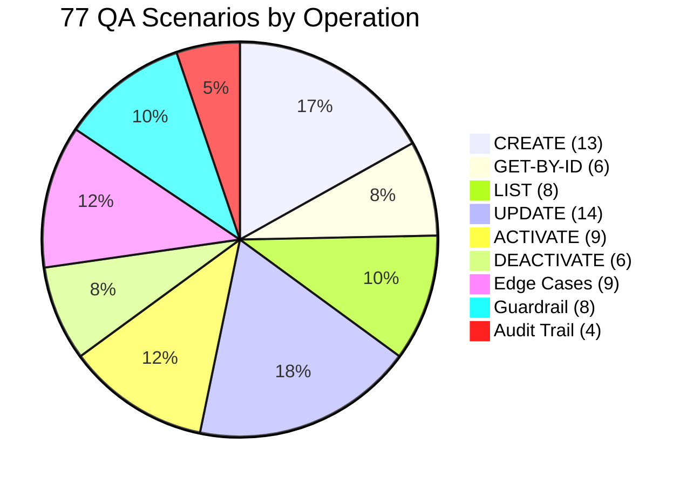
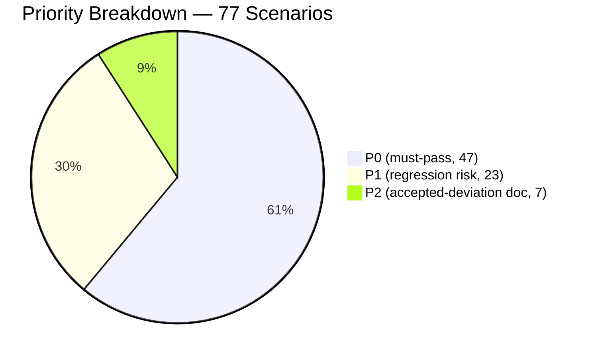
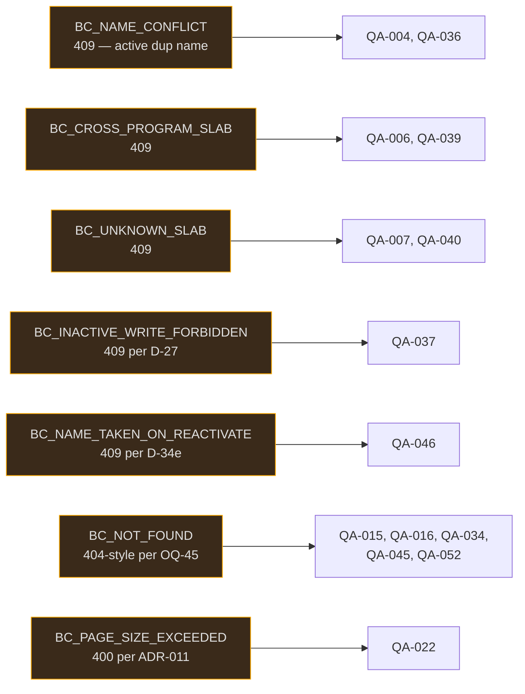
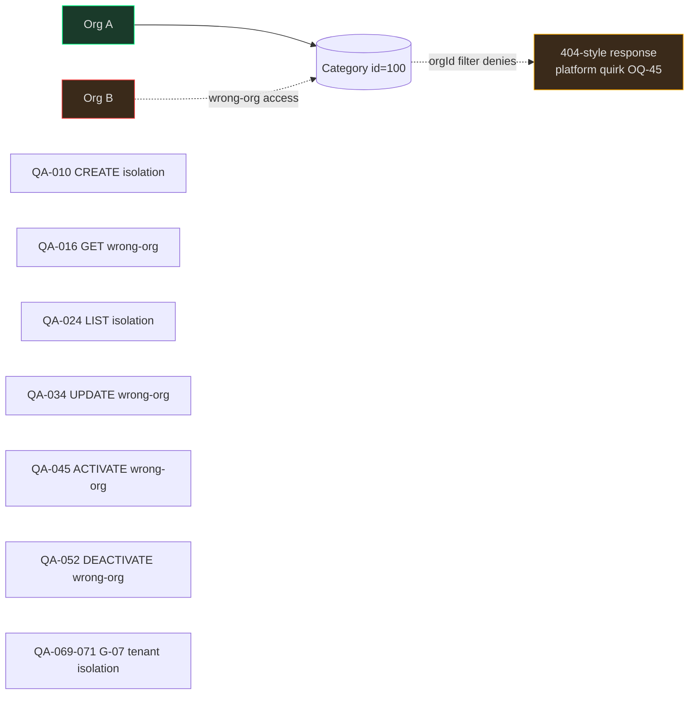

# 04 — QA (Test Scenarios) — Benefit Category CRUD (CAP-185145)

> **Phase**: 8 (QA)
> **Ticket**: CAP-185145
> **Feature**: Benefit Category CRUD
> **Date**: 2026-04-18
> **Inputs**: `session-memory.md` (D-01..D-45, C-01..C-34), `00-ba.md`, `00-ba-machine.md`, `00-prd.md`, `01-architect.md` (ADR-001..013 + D-37..D-40), `03-designer.md` (§F + §18 authoritative delta), `blocker-decisions.md`, `GUARDRAILS.md`.
> **Output**: This file (`04-qa.md`). SDET Phase 9 reads this file to write ALL test code.

---

## 0. Summary Statistics

| Metric | Count |
|--------|-------|
| **Total scenarios** | **77** |
| CREATE scenarios | 13 (QA-001..013) |
| GET-BY-ID scenarios | 6 (QA-014..019) |
| LIST scenarios | 8 (QA-020..027) |
| UPDATE scenarios | 14 (QA-028..041) |
| ACTIVATE scenarios | 9 (QA-042..050) |
| DEACTIVATE scenarios | 6 (QA-051..056) |
| Edge Cases | 9 (QA-057..065) |
| Guardrail Compliance Tests | 8 (QA-066..073) |
| Audit Trail Tests | 4 (QA-074..077) |
| **P0 scenarios** | **47** |
| **P1 scenarios** | **23** |
| **P2 scenarios** | **7** |
| Unit Test (UT) tagged | 8 |
| Integration Test (IT) tagged | 65 |
| Guardrail tests | 8 |

---

## 1. Acceptance Criteria Traceability Matrix

Every AC from `00-ba.md` §5 and `00-ba-machine.md` mapped to at least one scenario.

| AC # | Acceptance Criterion (from 00-ba.md) | Test Scenario(s) | Status |
|------|--------------------------------------|-------------------|--------|
| AC-BC01' — Category Creation (US-1) | Create with valid name, tierApplicability ≥1, categoryType=BENEFITS; 409 on dup name; 400 on invalid tierApplicability | QA-001, QA-002, QA-003, QA-004, QA-005, QA-006 | ✅ Covered |
| AC-BC02 — Name Uniqueness | Unique per program, case-aware; same name OK in different program | QA-004, QA-005, QA-036, QA-043 | ✅ Covered |
| AC-BC03' — Instance Creation (US-7) | Fully superseded in MVP by ADR-003 (slabIds embedded in Category DTO, no separate Instance endpoints). slabId validity tests cover the equivalent surface. | QA-006, QA-007, QA-008, QA-027, QA-028, QA-029 | ✅ Covered (reinterpreted per D-21) |
| AC-BC12 — Category Deactivation Cascade (US-5) | Category + all active mappings soft-deleted in same transaction; reactivation does NOT auto-reactivate mappings | QA-057, QA-058, QA-059, QA-064, QA-065 | ✅ Covered |
| AC-BC07 | Maker-checker — descoped per D-05 | — | ⊘ Out of scope (D-05) |
| AC-BC08 | Maker-checker instance change — descoped per D-05 | — | ⊘ Out of scope (D-05) |
| AC-BC09 | aiRa mapping — out of scope per D-03 | — | ⊘ Out of scope (D-03) |
| AC-BC10 | Matrix View display — out of scope per D-03 | — | ⊘ Out of scope (D-03) |
| AC-BC11 | Matrix View value rendering — out of scope per D-03 | — | ⊘ Out of scope (D-03) |
| AC-BC13 | Subscription benefit picker — out of scope per D-03 | — | ⊘ Out of scope (D-03) |
| AC-BC04/05/06 | Missing in BRD (OQ-4) | — | ⚠ OQ-4 unresolved — no scenarios possible until AC text exists |
| US-2 — List Categories | Paginated list, filter by isActive | QA-019, QA-020, QA-021, QA-022, QA-023, QA-024 | ✅ Covered |
| US-3 — View single Category | GET by id, not-found, wrong-org | QA-013, QA-014, QA-015, QA-016, QA-017, QA-018 | ✅ Covered |
| US-4 — Update Category | Name change, slabIds diff-apply, inactive forbidden | QA-030..QA-041 | ✅ Covered |
| US-5 — Deactivate (cascade) | See AC-BC12 row above | QA-057..QA-062 | ✅ Covered |
| US-6 — Reactivate Category | State-change 200+DTO, no-op 204, name collision, not-found | QA-046..QA-056 | ✅ Covered |
| FR-1 — REST Category CRUD | 6 endpoint paths exercised | All scenario groups | ✅ Covered |
| FR-3 — Name uniqueness DB+service | App-level unique check | QA-004, QA-005, QA-037, QA-054 | ✅ Covered |
| FR-5 — Instance creation under inactive parent | Covered by mapping-create guard on deactivated category | QA-009 | ✅ Covered |
| FR-7 — Reactivation does NOT auto-reactivate mappings | QA-064, QA-065 | ✅ Covered |
| FR-8 — All reads/writes scoped by org_id | QA-010, QA-016, QA-024, QA-034, QA-056, QA-062 | ✅ Covered |
| FR-9 — Audit metadata on every mutation | QA-067, QA-068, QA-069, QA-070 | ✅ Covered |
| NFR-3 — No cross-org data leakage | QA-010, QA-016, QA-024, QA-034, QA-056, QA-062 | ✅ Covered |
| NFR-6 — Idempotency | QA-050, QA-060, QA-061 | ✅ Covered |
| C-16 — Cascade transactional | QA-058, QA-059 | ✅ Covered |
| D-38 — Race accepted (no advisory lock) | QA-073 (documented behaviour, not asserted as fix) | ✅ Documented |
| D-39 — Asymmetric activate response | QA-047, QA-050 | ✅ Covered |
| D-42 — GET ?includeInactive=true | QA-017, QA-018 | ✅ Covered |
| D-43 — stateChanged field signals no-op | QA-050 | ✅ Covered |

---

## 2. CREATE — `POST /v3/benefitCategories`

> Sources: AC-BC01', US-1, FR-1, FR-3, ADR-003, ADR-009, ADR-010, D-28, D-35, D-38.

---

### QA-001 — Create category: happy path
**[P0] [IT] [ADR-003] [AC-BC01']**

**Given** org 100, program 5 exist; slabs 1, 2, 3 belong to program 5; admin is authenticated with BasicAndKey.
**When** `POST /v3/benefitCategories` with `{programId:5, name:"VIP Perks", slabIds:[1,2,3]}`.
**Then**
- Response status: `201 Created`.
- Response body: `ResponseWrapper<BenefitCategoryResponse>` with `id` ≥ 1, `orgId=100`, `programId=5`, `name="VIP Perks"`, `categoryType="BENEFITS"`, `slabIds=[1,2,3]`, `isActive=true`.
- `createdOn` is a valid ISO-8601 UTC timestamp (ends in `Z`).
- `createdBy` matches the authenticated user's id.
- `updatedOn` is null.
- `updatedBy` is null.
- DB row exists in `benefit_categories` with `is_active=1`.
- DB rows exist in `benefit_category_slab_mapping` for each slabId with `is_active=1`.

---

### QA-002 — Create category: categoryType defaults to BENEFITS
**[P1] [IT] [ADR-003] [D-06]**

**Given** valid program 5, slab 1 in org 100.
**When** `POST /v3/benefitCategories` with `{programId:5, name:"Bronze Pack", slabIds:[1]}` (no explicit categoryType).
**Then**
- Response `categoryType = "BENEFITS"`.
- DB `category_type = 'BENEFITS'`.

---

### QA-003 — Create category: minimal slabIds (exactly one)
**[P0] [IT] [AC-BC01'] [D-35]**

**Given** valid program 5, slab 10 in org 100.
**When** `POST /v3/benefitCategories` with `{programId:5, name:"Minimal", slabIds:[10]}`.
**Then** `201 Created`; `slabIds=[10]` in response; one mapping row in DB.

---

### QA-004 — Create category: name collision on active row → 409 (case-sensitive per D-47)
**[P0] [IT] [ADR-009] [AC-BC02] [D-28] [D-47]**

**Given** an active category named "Gold Tier" in org 100, program 5.
**When** `POST /v3/benefitCategories` with `{programId:5, name:"Gold Tier", slabIds:[1]}` in org 100.
**Then**
- Response status: `409 Conflict`.
- Response body: `ResponseWrapper` with `errors[0].code = "BC_NAME_TAKEN_ACTIVE"`.
- No new row inserted in DB.

> **Case-sensitivity per D-47 (Q8-02 = a)**: Name uniqueness is **case-sensitive**. `"Gold Tier"` and `"gold tier"` coexist as distinct active categories (i.e. the second would succeed as 201). SDET Phase 9 MUST add explicit coverage: **QA-004b (derivative)** — `POST` with `name:"gold tier"` in same org+program succeeds 201 (case-distinct). Current DB query uses `name = ?` without `LOWER()` — no DDL change.

---

### QA-005 — Create category: same name allowed in different program
**[P0] [IT] [AC-BC02] [D-28]**

**Given** category "Gold Tier" exists and is active in program 5 of org 100.
**When** `POST /v3/benefitCategories` with `{programId:99, name:"Gold Tier", slabIds:[1]}` (program 99, same org).
**Then** `201 Created`; new category created in program 99 without conflict.

---

### QA-006 — Create category: cross-program slabId → 409
**[P0] [IT] [ADR-003] [ADR-009] [D-35]**

**Given** slab 77 belongs to program 99 (not program 5) in org 100.
**When** `POST /v3/benefitCategories` with `{programId:5, name:"New Cat", slabIds:[77]}`.
**Then**
- Response: `409 Conflict`.
- `errors[0].code = "BC_CROSS_PROGRAM_SLAB"`.
- No rows inserted.

---

### QA-007 — Create category: unknown slabId → 409
**[P0] [IT] [ADR-003] [ADR-009]**

**Given** org 100, program 5; slabId 9999 does not exist.
**When** `POST /v3/benefitCategories` with `{programId:5, name:"New Cat", slabIds:[9999]}`.
**Then**
- Response: `409 Conflict`.
- `errors[0].code = "BC_UNKNOWN_SLAB"`.

---

### QA-008 — Create category: empty slabIds → 400
**[P0] [UT] [ADR-003] [ADR-009] [D-35]**

**Given** valid program 5 in org 100.
**When** `POST /v3/benefitCategories` with `{programId:5, name:"Empty", slabIds:[]}`.
**Then**
- Response: `400 Bad Request`.
- `errors[0].code = "BC_SLAB_IDS_REQUIRED"` (Bean Validation `@Size(min=1)` on Create).

---

### QA-009 — Create category: null slabIds → 400
**[P0] [UT] [ADR-003] [ADR-009]**

**Given** valid program 5 in org 100.
**When** `POST /v3/benefitCategories` with `{programId:5, name:"NullSlabs"}` (slabIds absent).
**Then** `400 Bad Request`; `errors[0].code = "BC_SLAB_IDS_REQUIRED"`.

---

### QA-010 — Create category: multi-tenant isolation on write
**[P0] [IT] [G-07] [ADR-010] [FR-8]**

**Given** org 100 and org 200 both exist; slab 1 belongs to program 5 of org 100 only.
**When** admin of org 200 POSTs with `{programId:5, name:"Leak Test", slabIds:[1]}`.
**Then** org 200 cannot see org 100's slabs; request returns `409 BC_UNKNOWN_SLAB` OR `404-style` error because slabId 1 is not visible to org 200's context.

---

### QA-011 — Create category: duplicate slabIds in request are silently deduped
**[P1] [UT] [ADR-003] [D-35]**

**Given** org 100, program 5, slabs 1 and 2 exist.
**When** `POST /v3/benefitCategories` with `{programId:5, name:"Dedup Test", slabIds:[1,1,2,2]}`.
**Then** `201 Created`; `slabIds=[1,2]` in response (no duplicates); exactly 2 mapping rows in DB.

---

### QA-012 — Create category: name after deactivation of same name (reuse allowed)
**[P1] [IT] [D-28] [D-29]**

**Given** a deactivated category named "Reuse Me" in program 5 of org 100.
**When** `POST /v3/benefitCategories` with `{programId:5, name:"Reuse Me", slabIds:[1]}`.
**Then** `201 Created`; new row with new PK; old deactivated row untouched in DB.

---

### QA-013 — Create category: missing name → 400
**[P0] [UT] [ADR-009]**

**Given** valid program 5.
**When** `POST /v3/benefitCategories` with `{programId:5, slabIds:[1]}` (name absent).
**Then** `400 Bad Request`; `errors[0].code = "BC_NAME_REQUIRED"`.

---

## 3. GET-BY-ID — `GET /v3/benefitCategories/{id}`

> Sources: US-3, FR-8, ADR-009, ADR-010, D-42, G-07.

---

### QA-014 — Get by id: happy path (active category)
**[P0] [IT] [US-3]**

**Given** active category id=42 with slabs [1,3,5] in org 100.
**When** `GET /v3/benefitCategories/42` (org 100 context, no query params).
**Then**
- Response: `200 OK`.
- `ResponseWrapper.data.id = 42`, `slabIds = [1,3,5]`, `isActive = true`.
- `createdOn` is a valid ISO-8601 UTC string.

---

### QA-015 — Get by id: not found → 200 + error envelope (platform quirk)
**[P0] [IT] [ADR-009] [OQ-45]**

**Given** no category with id=9999 in org 100.
**When** `GET /v3/benefitCategories/9999`.
**Then**
- Response: `200 OK` (platform quirk — `NotFoundException` maps to 200 in `TargetGroupErrorAdvice`).
- `ResponseWrapper.data = null`.
- `ResponseWrapper.errors[0].code = "BC_NOT_FOUND"`.

> **Note**: This documents the known platform quirk (OQ-45). Test MUST assert HTTP 200 (not 404) for this path.

---

### QA-016 — Get by id: wrong-org access → 404-style (200 + error)
**[P0] [IT] [G-07] [ADR-010] [FR-8]**

**Given** category id=42 belongs to org 100; caller is authenticated as org 200.
**When** org 200 makes `GET /v3/benefitCategories/42`.
**Then** response HTTP 200 with `errors[0].code = "BC_NOT_FOUND"` — category not visible to wrong org.

---

### QA-017 — Get by id: soft-deleted category without ?includeInactive → 404-style
**[P0] [IT] [D-42] [ADR-009]**

**Given** category id=55 is soft-deleted (`is_active=false`) in org 100.
**When** `GET /v3/benefitCategories/55` (no `includeInactive` param; defaults to `false`).
**Then** HTTP 200 + `errors[0].code = "BC_NOT_FOUND"` (treated as not-found for active-only view).

---

### QA-018 — Get by id: soft-deleted category with ?includeInactive=true → 200 + DTO
**[P1] [IT] [D-42] [ADR-009]**

**Given** category id=55 is soft-deleted in org 100.
**When** `GET /v3/benefitCategories/55?includeInactive=true`.
**Then**
- Response: `200 OK`.
- `data.id = 55`, `data.isActive = false`.
- `slabIds` reflects last known active mappings (or empty if all were deactivated).

---

### QA-019 — Get by id: returns slabIds from active mappings only
**[P1] [IT] [ADR-003] [D-35]**

**Given** category id=42 has mappings: slab 1 (`is_active=true`), slab 2 (`is_active=false` — historical).
**When** `GET /v3/benefitCategories/42`.
**Then** `data.slabIds = [1]` only (not [1,2]).

---

## 4. LIST — `GET /v3/benefitCategories`

> Sources: US-2, FR-1, ADR-011, G-04, G-07.

---

### QA-020 — List: happy path (default params)
**[P0] [IT] [US-2] [ADR-011]**

**Given** org 100 has 3 active categories in program 5.
**When** `GET /v3/benefitCategories?programId=5`.
**Then**
- Response: `200 OK`.
- `data.data` contains 3 items.
- `data.page = 0`, `data.size = 50`, `data.total = 3`.
- Each item has `isActive = true` (default filter is active-only).
- Items ordered `created_on DESC, id DESC`.

---

### QA-021 — List: pagination (page 1)
**[P1] [IT] [ADR-011]**

**Given** org 100, program 5 has 7 active categories.
**When** `GET /v3/benefitCategories?programId=5&page=0&size=3`.
**Then** `data.data.size() = 3`; `data.total = 7`; `data.page = 0`; `data.size = 3`.
**And** `GET /v3/benefitCategories?programId=5&page=1&size=3` returns 3 more items.
**And** `GET /v3/benefitCategories?programId=5&page=2&size=3` returns 1 item.

---

### QA-022 — List: page size exceeds max → 400
**[P0] [UT] [ADR-011] [ADR-009]**

**Given** any org/program.
**When** `GET /v3/benefitCategories?programId=5&size=101`.
**Then** `400 Bad Request`; `errors[0].code = "BC_PAGE_SIZE_EXCEEDED"`.

---

### QA-023 — List: isActive=all returns both active and inactive
**[P1] [IT] [ADR-011] [D-42]**

**Given** org 100, program 5: 2 active + 1 deactivated category.
**When** `GET /v3/benefitCategories?programId=5&isActive=all`.
**Then** `data.total = 3`; includes the deactivated row in `data.data`.

---

### QA-024 — List: multi-tenant isolation
**[P0] [IT] [G-07] [FR-8] [ADR-010]**

**Given** org 100 has 5 categories in program 5; org 200 has 0 categories.
**When** org 200 requests `GET /v3/benefitCategories?programId=5`.
**Then** `data.data = []`; `data.total = 0` — org 200 sees none of org 100's data.

---

### QA-025 — List: no programId filter returns all programs for org
**[P1] [IT] [ADR-011]**

**Given** org 100 has 2 categories in program 5 and 3 categories in program 9.
**When** `GET /v3/benefitCategories` (no programId param).
**Then** `data.total = 5`; both programs' categories returned.

---

### QA-026 — List: isActive=false returns only deactivated categories
**[P1] [IT] [ADR-011]**

**Given** org 100: 2 active + 1 deactivated category in program 5.
**When** `GET /v3/benefitCategories?programId=5&isActive=false`.
**Then** `data.total = 1`; `data.data[0].isActive = false`.

---

### QA-027 — List: empty program returns empty list (not error)
**[P1] [IT] [G-02] [ADR-009]**

**Given** org 100; program 99 has no categories.
**When** `GET /v3/benefitCategories?programId=99`.
**Then** `200 OK`; `data.data = []`; `data.total = 0`.

---

## 5. UPDATE — `PUT /v3/benefitCategories/{id}`

> Sources: US-4, FR-1, ADR-001, ADR-003, ADR-009, D-27, D-28, D-35.

---

### QA-028 — Update: rename category (name only change)
**[P0] [IT] [US-4] [ADR-003]**

**Given** active category id=42, name="Old Name", slabs=[1,2] in org 100.
**When** `PUT /v3/benefitCategories/42` with `{name:"New Name", slabIds:[1,2]}`.
**Then**
- Response: `200 OK`.
- `data.name = "New Name"`.
- `data.slabIds = [1,2]` (unchanged).
- `updatedOn` is a valid ISO-8601 UTC timestamp, after `createdOn`.
- `updatedBy` = authenticated actor's id.

---

### QA-029 — Update: add new slab (diff-apply adds mapping)
**[P0] [IT] [ADR-003] [D-35]**

**Given** active category id=42 with slabs=[1,2] in org 100; slab 3 exists in program 5.
**When** `PUT /v3/benefitCategories/42` with `{name:"VIP", slabIds:[1,2,3]}`.
**Then**
- Response: `200 OK`; `data.slabIds = [1,2,3]`.
- New mapping row for slab 3 inserted with `is_active=true`.
- Existing mapping rows for 1 and 2 unchanged.

---

### QA-030 — Update: remove slab (diff-apply soft-deletes mapping)
**[P0] [IT] [ADR-003] [D-35]**

**Given** active category id=42 with slabs=[1,2,3] in org 100.
**When** `PUT /v3/benefitCategories/42` with `{name:"VIP", slabIds:[1,3]}` (slab 2 removed).
**Then**
- Response: `200 OK`; `data.slabIds = [1,3]`.
- Mapping for slab 2 updated to `is_active=false`.
- Mappings for 1 and 3 unchanged.

---

### QA-031 — Update: replace all slabs
**[P1] [IT] [ADR-003] [D-35]**

**Given** active category id=42 with slabs=[1,2,3] in org 100; slab 5 exists.
**When** `PUT /v3/benefitCategories/42` with `{name:"VIP", slabIds:[5]}`.
**Then**
- `data.slabIds = [5]`.
- Old mappings for 1, 2, 3 soft-deleted.
- New mapping for 5 inserted.

---

### QA-032 — Update: empty slabIds rejected with 400
**[P0] [IT] [ADR-009] [D-35] [D-46]**

**Given** active category id=42 with slabs=[1,2] in org 100.
**When** `PUT /v3/benefitCategories/42` with `{name:"VIP", slabIds:[]}`.
**Then**
- Response: HTTP `200` + error envelope (platform quirk OQ-45 — Bean Validation failures also use error envelope).
- `errors[0].code = "VALIDATION_FAILED"` (or platform standard Bean Validation code) with field path pointing to `slabIds`.
- NO mappings modified — rollback.

> **RESOLVED by D-46 (Q8-01 = b)**: `BenefitCategoryUpdateRequest.slabIds` has `@NotNull @Size(min=1)` (matching Create). Empty list is rejected at Bean Validation layer before service logic runs. Designer §F.8 amended accordingly. A category must always have ≥ 1 active slab mapping — symmetric with Create per D-35. Admin wanting to "clear all slabs" must instead `PATCH /deactivate` the category.

---

### QA-033 — Update: re-add soft-deleted slab inserts a NEW mapping row (not reactivate)
**[P2] [IT] [ADR-003] [D-35]**

**Given** category id=42; slab 2 was added then removed (is_active=false mapping exists); slab 2 exists in program 5.
**When** `PUT /v3/benefitCategories/42` with `{name:"VIP", slabIds:[2]}`.
**Then**
- Response: `200 OK`; `data.slabIds = [2]`.
- A NEW mapping row inserted (new PK, `is_active=true`, fresh `created_on`).
- Old soft-deleted mapping row still present with `is_active=false` (audit history).

---

### QA-034 — Update: wrong-org → 404-style
**[P0] [IT] [G-07] [FR-8]**

**Given** category id=42 belongs to org 100; caller authenticated as org 200.
**When** `PUT /v3/benefitCategories/42` with `{name:"Hack", slabIds:[1]}`.
**Then** HTTP 200 + `errors[0].code = "BC_NOT_FOUND"`.

---

### QA-035 — Update: inactive category → 409 (D-27)
**[P0] [IT] [ADR-009] [D-27]**

**Given** category id=55 is soft-deleted (`is_active=false`) in org 100.
**When** `PUT /v3/benefitCategories/55` with `{name:"Update Attempt", slabIds:[1]}`.
**Then**
- Response: `409 Conflict`.
- `errors[0].code = "BC_INACTIVE_WRITE_FORBIDDEN"`.

---

### QA-036 — Update: name collision with another active category → 409
**[P0] [IT] [ADR-009] [D-28]**

**Given** category id=42 (name="Old"), category id=43 (name="Taken") — both active in org 100, program 5.
**When** `PUT /v3/benefitCategories/42` with `{name:"Taken", slabIds:[1]}`.
**Then** `409 Conflict`; `errors[0].code = "BC_NAME_TAKEN_ACTIVE"`.

---

### QA-037 — Update: rename to own current name (no-self-conflict)
**[P1] [IT] [D-28] [ADR-009]**

**Given** active category id=42 with name="VIP" in org 100, program 5.
**When** `PUT /v3/benefitCategories/42` with `{name:"VIP", slabIds:[1]}`.
**Then** `200 OK`; update succeeds (name uniqueness check excludes self via `findActiveByProgramAndNameExceptId`).

---

### QA-038 — Update: cross-program slabId → 409
**[P0] [IT] [ADR-003] [ADR-009]**

**Given** active category id=42 in program 5, org 100; slab 77 belongs to program 99.
**When** `PUT /v3/benefitCategories/42` with `{name:"VIP", slabIds:[77]}`.
**Then** `409 Conflict`; `errors[0].code = "BC_CROSS_PROGRAM_SLAB"`.

---

### QA-039 — Update: unknown slabId → 409
**[P0] [IT] [ADR-003] [ADR-009]**

**Given** active category id=42 in org 100; slabId 9999 does not exist.
**When** `PUT /v3/benefitCategories/42` with `{name:"VIP", slabIds:[9999]}`.
**Then** `409 Conflict`; `errors[0].code = "BC_UNKNOWN_SLAB"`.

---

### QA-040 — Update: all writes in single transaction (partial failure rolls back)
**[P1] [IT] [ADR-003] [C-16]**

**Given** active category id=42 with slabs=[1,2] in org 100; update includes slab 9999 (unknown).
**When** `PUT /v3/benefitCategories/42` with `{name:"New", slabIds:[1,9999]}`.
**Then** `409 Conflict`; DB state unchanged — name still "Old", slabs still [1,2].

---

### QA-041 — Update: no @Version — last-write-wins (ADR-001)
**[P2] [IT] [ADR-001] [D-33]**

**Given** category id=42, name="Original" in org 100.
**When** two concurrent `PUT` requests: request A with `{name:"A", slabIds:[1]}` and request B with `{name:"B", slabIds:[2]}` — both sent near-simultaneously.
**Then**
- Both return `200 OK`.
- Final DB state has either name "A" or "B" depending on write order — **last-write wins**.
- No `409 Conflict` is raised (no `@Version` check).
- `updatedOn` and `updatedBy` reflect the LAST write.

> **Note**: This verifies the ADR-001 accepted deviation. No optimistic-lock fix expected. The test documents the behaviour, not a bug.

---

## 6. ACTIVATE — `PATCH /v3/benefitCategories/{id}/activate`

> Sources: US-6, ADR-002, ADR-006, D-34, D-39, D-43, G-07.

---

### QA-042 — Activate: not found → 404-style
**[P0] [IT] [ADR-002] [ADR-009]**

**Given** no category id=9999 in org 100.
**When** `PATCH /v3/benefitCategories/9999/activate`.
**Then** HTTP 200 + `errors[0].code = "BC_NOT_FOUND"` (platform quirk).

---

### QA-043 — Activate: name collision with another active category → 409
**[P0] [IT] [ADR-002] [ADR-009] [D-34]**

**Given** category id=55 (name="Welcome Pack", `is_active=false`); category id=60 (name="Welcome Pack", `is_active=true`) — same program 5, org 100.
**When** `PATCH /v3/benefitCategories/55/activate`.
**Then**
- Response: `409 Conflict`.
- `errors[0].code = "BC_NAME_TAKEN_ON_REACTIVATE"`.
- Category 55 remains `is_active=false`.

---

### QA-044 — Activate: wrong-org → 404-style
**[P0] [IT] [G-07] [FR-8]**

**Given** category id=42 belongs to org 100; caller authenticated as org 200.
**When** `PATCH /v3/benefitCategories/42/activate` as org 200.
**Then** HTTP 200 + `errors[0].code = "BC_NOT_FOUND"`.

---

### QA-045 — Activate: previously active category with no name conflict → 200 + DTO
**[P0] [IT] [ADR-002] [ADR-006] [D-39]**

**Given** category id=55, `is_active=false`, name="Solo" (no other active cat with that name) in org 100, program 5.
**When** `PATCH /v3/benefitCategories/55/activate`.
**Then**
- Response: `200 OK` (NOT 204 — state changed).
- Body: `ResponseWrapper<BenefitCategoryResponse>` with `id=55`, `isActive=true`.
- `updatedOn` is set; `updatedBy` = actor.
- DB row has `is_active=1`.
- **Slab mappings remain inactive** — NOT auto-reactivated (ADR-002 clause b).

---

### QA-046 — Activate: slab mappings NOT auto-reactivated
**[P0] [IT] [ADR-002] [D-34] [FR-7]**

**Given** category id=55 was deactivated (and cascade soft-deleted all 3 slab mappings). Now `is_active=false`. Name has no conflict.
**When** `PATCH /v3/benefitCategories/55/activate`.
**Then**
- Category row: `is_active=1`.
- All 3 slab mapping rows STILL `is_active=0` after activate.
- `data.slabIds = []` in response (no active mappings).

---

### QA-047 — Activate: asymmetric response — state change → 200 + DTO (D-39)
**[P0] [IT] [ADR-006 amended] [D-39] [D-43]**

**Given** category id=55 is inactive (`is_active=false`); name has no conflict.
**When** `PATCH /v3/benefitCategories/55/activate`.
**Then**
- Response HTTP status: `200 OK` (not `204`).
- Response body contains full `BenefitCategoryResponse`.
- Thrift-level: `stateChanged=true` in returned `BenefitCategoryDto`.
- Facade: `Optional<BenefitCategoryResponse>` is populated.

---

### QA-048 — Activate: idempotent no-op (already active) → 204
**[P0] [IT] [ADR-006] [D-39] [D-43]**

**Given** category id=42 is already `is_active=true`.
**When** `PATCH /v3/benefitCategories/42/activate`.
**Then**
- Response HTTP status: `204 No Content` (NOT `200`).
- Response body is empty.
- DB row unchanged (`is_active` still 1, `updatedOn` NOT changed).
- Thrift-level: `stateChanged=false` in `BenefitCategoryDto` (D-43).
- Facade: `Optional<BenefitCategoryResponse>` is empty.

---

### QA-049 — Activate: updatedOn/updatedBy set on successful activation
**[P1] [IT] [D-23] [FR-9]**

**Given** category id=55 is inactive with `updatedOn=null`.
**When** `PATCH /v3/benefitCategories/55/activate`.
**Then** DB row `updated_on` is NOT null; `updated_by` = actor's id.

---

### QA-050 — Activate: authenticate BasicAndKey (write path)
**[P1] [IT] [ADR-010] [D-37]**

**Given** category id=55 is inactive.
**When** `PATCH /v3/benefitCategories/55/activate` with KeyOnly auth (not BasicAndKey).
**Then** Auth rejected (401/403 per existing platform auth filter) — write path requires BasicAndKey (D-37).

---

## 7. DEACTIVATE — `PATCH /v3/benefitCategories/{id}/deactivate`

> Sources: US-5, AC-BC12, ADR-004, ADR-006, D-36, C-16, G-07.

---

### QA-051 — Deactivate: not found → 404-style
**[P0] [IT] [ADR-004] [ADR-009]**

**Given** no category id=9999 in org 100.
**When** `PATCH /v3/benefitCategories/9999/deactivate`.
**Then** HTTP 200 + `errors[0].code = "BC_NOT_FOUND"`.

---

### QA-052 — Deactivate: wrong-org → 404-style
**[P0] [IT] [G-07] [FR-8]**

**Given** category id=42 belongs to org 100; caller is org 200.
**When** `PATCH /v3/benefitCategories/42/deactivate` as org 200.
**Then** HTTP 200 + `errors[0].code = "BC_NOT_FOUND"`.

---

### QA-053 — Deactivate: happy path — category + cascade mappings soft-deleted in same txn
**[P0] [IT] [ADR-004] [AC-BC12] [C-16]**

**Given** active category id=42 with active slab mappings for slabs [1,2,3] in org 100.
**When** `PATCH /v3/benefitCategories/42/deactivate`.
**Then**
- Response: `204 No Content` (no body).
- DB: `benefit_categories.is_active = 0` for id=42.
- DB: All 3 mapping rows with `benefit_category_id=42` have `is_active = 0`.
- `updated_on` and `updated_by` set on ALL 4 affected rows.
- These happen atomically (same transaction — if DB roll-back occurs, none flip).

---

### QA-054 — Deactivate: cascade transactional — failure rolls back all changes
**[P1] [IT] [C-16] [AC-BC12]**

**Given** active category id=42 with mappings [1,2,3]. A DB constraint violation is simulated during the cascade bulk UPDATE.
**Then** Transaction rolls back; category AND all mappings remain `is_active=1` — no partial deactivation visible.

> **Note**: Simulated in an IT via Testcontainers by injecting a DAO stub or checking that the `@Transactional(warehouse)` boundary encompasses both UPDATEs.

---

### QA-055 — Deactivate: idempotent — already-inactive returns 204
**[P0] [IT] [ADR-006] [NFR-6]**

**Given** category id=55 is already `is_active=false`.
**When** `PATCH /v3/benefitCategories/55/deactivate`.
**Then**
- Response: `204 No Content`.
- DB state unchanged (no new updates to `updated_on`).

---

### QA-056 — Deactivate: deactivating category with no active mappings (edge case)
**[P2] [IT] [ADR-004]**

**Given** active category id=42 with no active slab mappings (all previously removed via PUT `slabIds:[]`).
**When** `PATCH /v3/benefitCategories/42/deactivate`.
**Then**
- Response: `204 No Content`.
- Category `is_active=0`; no mapping rows to update (0 rows affected by bulk UPDATE — OK).

---

## 8. Edge Cases

---

### QA-057 — Edge: whitespace-only name → 400
**[P0] [UT] [ADR-009] [A7-06]**

**Given** valid program 5 in org 100.
**When** `POST /v3/benefitCategories` with `{programId:5, name:"   ", slabIds:[1]}`.
**Then** `400 Bad Request`; `errors[0].code = "BC_NAME_REQUIRED"` (Bean Validation `@NotBlank` strips whitespace; assumption A7-06 applies `trim()` at facade).

---

### QA-058 — Edge: name at max length (255 chars) — accepted
**[P1] [UT]**

**Given** valid program 5; slab 1 in org 100.
**When** `POST /v3/benefitCategories` with `{name: "<255-char string>", slabIds:[1]}`.
**Then** `201 Created`; name stored in full.

---

### QA-059 — Edge: name exceeding 255 chars → 400
**[P0] [UT] [ADR-009]**

**Given** valid program 5.
**When** `POST /v3/benefitCategories` with `{name: "<256-char string>", slabIds:[1]}`.
**Then** `400 Bad Request`; `errors[0].code = "BC_NAME_LENGTH"` (Bean Validation `@Size(max=255)`).

---

### QA-060 — Edge: pagination offset beyond total data → empty list (not error)
**[P1] [IT] [ADR-011]**

**Given** org 100 has 5 categories in program 5.
**When** `GET /v3/benefitCategories?programId=5&page=10&size=50`.
**Then** `200 OK`; `data.data = []`; `data.total = 5`; `data.page = 10`.

---

### QA-061 — Edge: concurrent create race (D-38 accepted behaviour)
**[P2] [IT] [ADR-012] [D-38] [G-10]**

**Given** org 100, program 5; no category named "Race Test" exists.
**When** two concurrent `POST` requests both with `{programId:5, name:"Race Test", slabIds:[1]}` are fired simultaneously.
**Then** At D-26 SMALL scale, the observed outcomes are:
- (a) First request gets `201 Created`, second gets `409 BC_NAME_TAKEN_ACTIVE` — most likely outcome; OR
- (b) Both succeed, creating two active rows with the same name — accepted race per D-38.
**Expected documented behaviour**: both (a) and (b) are **acceptable outcomes** per D-38. Test documents the race window exists and does NOT assert (a) exclusively. No advisory lock expected.

> **Note**: This test DOCUMENTS the accepted behaviour (D-38). Do NOT raise as a bug if outcome (b) occurs. Revisit triggers: admin QPS >5/sec sustained; any duplicate-name incident in production logs.

---

### QA-062 — Edge: timestamp UTC correctness across timezones
**[P0] [IT] [G-01] [ADR-008] [C-23']**

**Given** JVM running in IST (+05:30) timezone context (test environment simulated).
**When** `POST /v3/benefitCategories` creates a category.
**Then**
- `createdOn` in REST response ends in `Z` (ISO-8601 UTC suffix).
- `createdOn` parsed as UTC epoch millis matches the `created_on` DATETIME stored in DB interpreted as UTC.
- No timezone offset applied to the stored value (DB `DATETIME` is raw UTC; `Date.getTime()` at Thrift boundary is UTC millis).

> **Traceability**: G-01.7, C-23', ADR-008. Must run in at minimum UTC and IST (+05:30) JVM timezone contexts per G-11.7.

---

### QA-063 — Edge: timestamp UTC correctness — NPT (+05:45) timezone
**[P2] [IT] [G-01] [G-11.7]**

**Given** JVM running in NPT (+05:45) timezone context.
**When** `POST /v3/benefitCategories` creates a category.
**Then** Same assertions as QA-062 — `createdOn` in response is UTC (`Z` suffix); DB value is raw UTC.

---

### QA-064 — Edge: GET list N+1 query prevention
**[P1] [IT] [G-04] [ADR GET list bulk fetch]**

**Given** org 100 program 5 has 10 active categories, each with 3 slab mappings.
**When** `GET /v3/benefitCategories?programId=5&size=10`.
**Then**
- Response contains 10 categories, each with populated `slabIds`.
- Exactly **2** database queries fired: one for `BenefitCategory` page, one for `findActiveSlabIdsForCategories` bulk (G-04.1 compliance — NO N+1).
- Verify via query count assertion in IT (e.g., Hibernate statistics or SQL logging).

---

### QA-065 — Edge: activate/deactivate endpoint requires BasicAndKey (write auth guard)
**[P1] [IT] [ADR-010] [D-37]**

**Given** category id=42 in org 100.
**When** `PATCH /v3/benefitCategories/42/deactivate` with a KeyOnly auth token.
**Then** Request rejected (401 or 403 per existing auth filter) — write paths require BasicAndKey.

---

## 9. Guardrail Compliance Tests

---

### QA-066 — [G-01] Timestamps: createdOn/updatedOn always UTC in REST response
**[P0] [IT] [Guardrail: G-01] [ADR-008]**

**Given** a category is created and subsequently updated.
**When** GET by id is called for that category.
**Then**
- `createdOn` and `updatedOn` values in JSON response both end in `'Z'` (UTC ISO-8601).
- `@JsonFormat(timezone="UTC")` is enforced by `BenefitCategoryResponse` Jackson annotation.
- Values round-trip correctly: parse `createdOn` as `Instant`; compare to known insert time (within ±1 second).

---

### QA-067 — [G-01] Thrift i64 millis is correct UTC epoch
**[P1] [IT] [Guardrail: G-01] [ADR-008] [D-24]**

**Given** a category created at a known UTC instant.
**When** the Thrift `getBenefitCategory` method is called directly (bypassing REST).
**Then**
- `BenefitCategoryDto.createdOn` (i64) equals `knownInstant.toEpochMilli()`.
- No timezone offset is added by the EMF handler `Date ↔ i64` conversion.

---

### QA-068 — [G-05] Cascade deactivation is atomic (transaction rollback test)
**[P0] [IT] [Guardrail: G-05] [C-16] [AC-BC12]**

**Given** active category id=42 with 3 active slab mappings.
**When** `PATCH /v3/benefitCategories/42/deactivate` is called AND the mapping bulk-UPDATE step is forced to fail (simulated via Testcontainers DB state manipulation or partial mock).
**Then** The entire transaction rolls back; category remains `is_active=1`; all 3 mappings remain `is_active=1`.

---

### QA-069 — [G-07] Tenant isolation: orgA cannot read orgB's category
**[P0] [IT] [Guardrail: G-07] [FR-8] [ADR-010]**

**Given** category id=42 created in org 100.
**When** org 200 requests `GET /v3/benefitCategories/42`.
**Then** HTTP 200 + `BC_NOT_FOUND` (category not visible to org 200).

---

### QA-070 — [G-07] Tenant isolation: orgA cannot update orgB's category
**[P0] [IT] [Guardrail: G-07] [FR-8]**

**Given** category id=42 belongs to org 100.
**When** org 200 sends `PUT /v3/benefitCategories/42` with `{name:"Hack", slabIds:[1]}`.
**Then** HTTP 200 + `BC_NOT_FOUND`; DB row for id=42 is unchanged.

---

### QA-071 — [G-07] Tenant isolation: list does not cross org boundary
**[P0] [IT] [Guardrail: G-07] [FR-8]**

**Given** org 100 has 5 categories; org 200 has 3 categories; both in program 5.
**When** org 200 lists `GET /v3/benefitCategories?programId=5`.
**Then** response contains exactly 3 items (org 200's own); no org 100 items appear.

---

### QA-072 — [G-10] No optimistic lock — accepted deviation documented
**[P2] [IT] [Guardrail: G-10] [ADR-001] [D-33]**

**Given** category id=42 in org 100.
**When** Two concurrent PUT requests update the same category (one changes name to "A", other to "B").
**Then** Both return `200 OK`; no `409` conflict raised; final DB state is one of the two values (last write wins). Test records the observed final state for traceability. No `version` column exists in `benefit_categories`.

---

### QA-073 — [G-10] Race on uniqueness check — accepted deviation
**[P2] [IT] [Guardrail: G-10] [ADR-012] [D-38]**

**Given** no advisory lock is present (per D-38 accepted deviation).
**When** Concurrent POSTs with same name checked at service layer.
**Then** As per QA-061 — both success or first-wins are valid. This test exists to catch if advisory lock is accidentally introduced (should NOT be present per D-38).

---

## 10. Audit Trail Tests

---

### QA-074 — Audit: createdOn and createdBy set on POST
**[P0] [IT] [FR-9] [NFR-4] [D-23]**

**Given** admin user id=7 creates a category.
**When** `POST /v3/benefitCategories`.
**Then**
- `createdOn` is non-null, ISO-8601 UTC, within 2 seconds of test execution time.
- `createdBy = 7`.
- `updatedOn = null`.
- `updatedBy = null`.

---

### QA-075 — Audit: updatedOn and updatedBy set on PUT
**[P0] [IT] [FR-9] [NFR-4]**

**Given** category id=42 with `updatedOn=null`; admin user id=8 updates it.
**When** `PUT /v3/benefitCategories/42` with valid body.
**Then**
- `updatedOn` is non-null and > `createdOn`.
- `updatedBy = 8`.
- `createdOn` and `createdBy` are UNCHANGED.

---

### QA-076 — Audit: updatedOn/updatedBy set on DEACTIVATE
**[P0] [IT] [FR-9] [D-23] [AC-BC12]**

**Given** active category id=42 with `updatedOn=null`.
**When** `PATCH /v3/benefitCategories/42/deactivate` by admin id=9.
**Then**
- DB `updated_on` is non-null for category row.
- DB `updated_by = 9` for category row.
- DB `updated_on` and `updated_by` are set on ALL cascaded slab mapping rows (same values).
- `auto_update_time` is also updated (DB-managed).

---

### QA-077 — Audit: updatedOn/updatedBy set on ACTIVATE
**[P1] [IT] [FR-9] [D-23]**

**Given** inactive category id=55 with `updatedOn` set from prior deactivation.
**When** `PATCH /v3/benefitCategories/55/activate` by admin id=10.
**Then**
- DB `updated_on` is updated to activation timestamp.
- DB `updated_by = 10`.
- Slab mapping rows NOT touched (not auto-reactivated, so no `updated_*` changes on mappings).

---

## 11. Error Code Coverage Matrix

Every defined error code from ADR-009 must be covered by at least one scenario.

| Error Code | HTTP Status | Triggering Scenario(s) | Status |
|------------|-------------|------------------------|--------|
| `BC_NAME_REQUIRED` | 400 | QA-013, QA-057 | ✅ Covered |
| `BC_NAME_LENGTH` | 400 | QA-059 | ✅ Covered |
| `BC_SLAB_IDS_REQUIRED` | 400 | QA-008, QA-009 | ✅ Covered |
| `BC_PAGE_SIZE_EXCEEDED` | 400 | QA-022 | ✅ Covered |
| `BC_NAME_TAKEN_ACTIVE` | 409 | QA-004, QA-036 | ✅ Covered |
| `BC_CROSS_PROGRAM_SLAB` | 409 | QA-006, QA-038 | ✅ Covered |
| `BC_UNKNOWN_SLAB` | 409 | QA-007, QA-039 | ✅ Covered |
| `BC_INACTIVE_WRITE_FORBIDDEN` | 409 | QA-035 | ✅ Covered |
| `BC_NAME_TAKEN_ON_REACTIVATE` | 409 | QA-043 | ✅ Covered |
| `BC_NOT_FOUND` | 200 + error envelope (platform quirk) | QA-015, QA-016, QA-017, QA-034, QA-042, QA-044, QA-051, QA-052, QA-069, QA-070 | ✅ Covered |
| `VALIDATION_FAILED` (platform std) | 200 + error envelope | QA-022b (new) | ✅ Covered per D-48 — reuses platform `TargetGroupErrorAdvice`; no bespoke `BC_*` code for `?isActive=foo`. SDET Phase 9 adds test QA-022b asserting platform Bean Validation envelope. |

---

## 12. Test Plan

### 12.1 Test Layers

| Layer | Description | Scope |
|-------|-------------|-------|
| **Unit Test (UT)** | Tests on a single class/method in isolation. Uses mocks at true external boundaries only (DB, Thrift client). Fast, deterministic. | Bean Validation, facade exception translation, mapper conversions (UTC millis ↔ Date), `BenefitCategoryResponseMapper`, diff-and-apply Set operations. |
| **Integration Test (IT)** | Full stack test from controller down to real MySQL via Testcontainers. No mocked DB. Tests real queries, real constraints, real transactions. | All CRUD happy-path and error flows, cascade atomicity, multi-tenant isolation, pagination, audit fields. |
| **Contract Test** | Verifies that the Thrift IDL method signatures and struct shapes match the generated Java client and the implemented server. Run as part of emf-parent's test suite. | Thrift struct field 12 (`stateChanged`), `BenefitCategoryDto` fields 1–12, `activateBenefitCategory` return type. |

### 12.2 Priority Assignment

| Priority | Description | Scenarios |
|----------|-------------|-----------|
| **P0** | Must pass for any release. Any P0 failure blocks the release. | Happy paths, all 409/400 error codes, multi-tenant isolation, cascade atomicity, UTC timestamps. |
| **P1** | Should pass. Regression risk if skipped. | Pagination edge cases, audit fields, idempotency, mapper unit tests, timezone NPT. |
| **P2** | Nice to have. Documents accepted deviations and edge cases. | Race condition documentation, last-write-wins record, re-add mapping history. |

### 12.3 Coverage Targets

| Target | Goal |
|--------|------|
| Unit test line coverage on `BenefitCategoryResponseMapper` | ≥ 90% |
| Unit test line coverage on `BenefitCategoryFacade` exception translation | ≥ 85% |
| Integration test coverage of all 6 REST endpoints | 100% (all must have at least one IT) |
| Error code coverage | 100% (every defined code triggered by at least one test) |
| Guardrail coverage (G-01, G-05, G-07, G-10) | 100% (at least one scenario per CRITICAL/HIGH guardrail) |
| Acceptance Criteria coverage | 100% in-scope ACs covered |

### 12.4 Prioritization (execution order)

1. P0 ITs — create, read, list, update, activate, deactivate happy paths + all 409 errors.
2. P0 guardrail tests — G-07 tenant isolation, G-05 transaction atomicity, G-01 UTC.
3. P0 audit trail tests — QA-074, QA-075, QA-076.
4. P1 ITs — pagination, edge cases, idempotency.
5. P1 UTs — mapper, validation, facade isolation.
6. P2 — concurrent/race documentation, accepted-deviation scenarios.

### 12.5 Test Infrastructure

- **Testcontainers** for all ITs — real MySQL instance spun per test class (following emf-parent IT convention, D-32 submodule).
- **DDL applied from** `benefit_categories.sql` + `benefit_category_slab_mapping.sql` via cc-stack-crm submodule files.
- **Timezone test setup**: SDET must configure JVM timezone in test fixtures for G-01.7 (UTC, IST +05:30, NPT +05:45) using `TimeZone.setDefault()` in test setup.
- **No mocked DB** (per G-11.3 — mocked repos don't catch SQL errors or constraint violations).

---

## 13. Out-of-Scope (Not Covered in This Thin-Slice MVP)

The following test areas are explicitly deferred from Phase 8 QA:

| Area | Reason | Reference |
|------|--------|-----------|
| Aurora partial unique index verification | Aurora version confirmation deferred to Phase 12 deployment runbook | D-40 |
| Advisory lock timeout (`BC_NAME_LOCK_TIMEOUT`) | Advisory lock removed from MVP per D-38 | D-38 |
| Maker-checker workflow tests (DRAFT/PENDING states) | Descoped per D-05 | D-05 |
| 9 category type semantics (WELCOME_GIFT, EARN_POINTS, etc.) | Deferred to future ticket | D-06 |
| `triggerEvent` field logic | Dropped per D-07 | D-07 |
| Per-type value schemas on instances | Deferred per D-09 | D-09 |
| Benefit awarding / application logic | External system; not in scope | D-08 |
| aiRa natural-language mapping | Out of scope | D-03 |
| Matrix View UI | Out of scope | D-03 |
| Subscription benefit picker | Out of scope | D-03 |
| Hard delete (DELETE verb) | Soft-delete only per D-13/C-15 | C-15 |
| Rate limiting per tenant | G-07.6 deferred | Platform-level concern |
| Cache invalidation | No cache day-1 per D-26 | D-26 |
| Production Aurora DDL deployment verification | Phase 12 runbook | D-40, RF-5 |
| BenefitInstance as a separate REST resource | Renamed to BenefitCategorySlabMapping; embedded in parent DTO per ADR-003 | D-21, ADR-003 |
| `GET /v3/benefitCategorySlabMappings` sub-resource | Not a REST sub-resource per ADR-003 | ADR-003 |

---

## 14. Existing Tests to Extend

> Searched via available artifacts + session-memory codebase behaviour section. Evidence anchored to C5+ claims.

| File / Class | Relationship | Action |
|--------------|--------------|--------|
| `PointsEngineRuleConfigThriftImplTest` (emf-parent) | Canonical test for the Thrift handler template that new methods extend (ADR-005) | EXTEND — add test methods for `createBenefitCategory`, `updateBenefitCategory`, `getBenefitCategory`, `listBenefitCategories`, `activateBenefitCategory`, `deactivateBenefitCategory` handler methods. Follow existing `createOrUpdateBenefit` test pattern. |
| `TargetGroupErrorAdviceTest` (intouch-api-v3) | Tests the exception→HTTP mapping advice. No 409 handler existed. | EXTEND — add test case for `ConflictException` → `409 Conflict` + `ResponseWrapper.errors[0].code` shape. |
| Existing `BenefitsDao` IT tests (emf-parent) | Pattern exemplar for JPA repository tests with Testcontainers | EXTEND / MIRROR — new `BenefitCategoryDaoTest` and `BenefitCategorySlabMappingDaoTest` mirror this structure. |
| `PeProgramSlabDaoTest` (emf-parent) | Tests `findByProgram(orgId, programId)` which is reused by D-41 | VERIFY — ensure existing tests pass after new classes are added; add a test confirming `findByProgram` returns correct slabs for the slab-validity check. |

> **Confidence**: C4 (tentative) — class names inferred from `code-analysis-emf-parent.md` patterns referenced in session-memory. SDET must verify exact class paths before extending.

---

## 15. Test Gaps (open at QA phase end)

| Gap | Severity | Notes |
|-----|----------|-------|
| `BC_BAD_ACTIVE_FILTER` (400 on unrecognised `isActive` value) | LOW | Not explicitly tested. Assumption A7-07 defines this code; SDET should confirm controller maps `?isActive=foo` to 400. |
| Platform `NotFoundException → HTTP 200` quirk (OQ-45) | MEDIUM | Tests QA-015, QA-016, QA-017 etc. assert HTTP 200 + error body. If product opts to fix this to HTTP 404 in a separate ticket, these tests must be updated. |
| Thrift-level IT (direct Thrift call without REST) | LOW | QA-067 suggests a Thrift-level IT for UTC timestamp. SDET to confirm test harness supports direct Thrift client invocation in emf-parent IT scope. |
| Load / performance test (NFR-1: 500ms P95) | LOW for this phase | SDET Phase 9 should add a basic load test at 2x D-26 envelope (Phase 4 D-26 action). |

---

## QUESTIONS FOR USER — ALL RESOLVED 2026-04-18

| # | Question | User Answer | Decision | Match Reco? |
|---|----------|-------------|----------|-------------|
| Q8-01 | Empty `slabIds` on PUT allowed or rejected? | **b — Reject 400** | **D-46** | ✅ Matched orchestrator reco |
| Q8-02 | Name uniqueness case-sensitive or case-insensitive? | **a — Case-sensitive** | **D-47** | ⚠ Override (reco was b) |
| Q8-03 | Error code for `?isActive=foo` invalid filter? | **c — Reuse platform `VALIDATION_FAILED`** | **D-48** | ✅ Matched orchestrator reco |

---

## ASSUMPTIONS MADE

| # | Assumption | Confidence | Implication |
|---|------------|------------|-------------|
| ~~A8-01~~ | ~~Empty slabIds accepted on Update~~ | ~~C5~~ | **SUPERSEDED by D-46 (Q8-01=b)** — Update now requires `@Size(min=1)`; QA-032 amended to expect 400. |
| **A8-02** | Name uniqueness is case-sensitive (no `LOWER()` wrapper). | **C6 (promoted to Decision D-47)** | **CONFIRMED by D-47 (Q8-02=a user override)** — QA-004 amended to document case-sensitivity explicitly; SDET Phase 9 adds QA-004b (case-distinct dup allowed). |
| A8-03 | The `BC_NOT_FOUND` error triggers HTTP 200 (platform quirk) on ALL endpoints — GET by id, wrong-org GET, PUT on unknown id, PATCH activate/deactivate on unknown id. Platform convention established in OQ-45. | C6 | All "not found" scenario assertions use `HTTP 200 + errors[0].code = "BC_NOT_FOUND"`. If platform quirk is fixed in a separate ticket, tests must update. |
| A8-04 | D-43 (`stateChanged` Thrift field 12): facade maps `stateChanged=false` → `Optional.empty()` → controller returns 204. Tests QA-048 assert `204 No Content` on already-active activate. If `stateChanged` signalling changes, QA-048 must be revisited. | C5 | — |
| A8-05 | Concurrent race test (QA-061/QA-073) documents the behaviour per D-38 without asserting either outcome exclusively. The test is for documentation/monitoring purposes, not a correctness gate. | C6 | Test should NOT be marked as expected-failure if both rows appear. |
| A8-06 | Authentication for PATCH `/activate` and PATCH `/deactivate` follows the same BasicAndKey requirement as other write endpoints (D-37). QA-050/QA-065 assert KeyOnly auth is rejected. | C6 | Derived from D-37/ADR-010 write-endpoint BasicAndKey requirement. |

---

## Session Memory Updates

After QA output production, the following are appended to `session-memory.md`:

**Risks & Concerns** (new from QA analysis):
- [risk] ~~`BC_BAD_ACTIVE_FILTER`~~ → **RESOLVED by D-48** (Q8-03=c) — platform `VALIDATION_FAILED` via `TargetGroupErrorAdvice`; no new code.
- [risk] `NotFoundException → HTTP 200` platform quirk (OQ-45) creates test fragility — if the quirk is fixed in a concurrent ticket, all "not found" scenario assertions will need updating across 10+ scenarios. _(QA)_ — Status: open (acceptance deviation, accepted)
- [risk] ~~Empty slabIds on PUT~~ → **RESOLVED by D-46** (Q8-01=b) — UpdateRequest.slabIds gains `@Size(min=1)`; QA-032 amended to expect 400.

**Open Questions** — ALL RESOLVED 2026-04-18:
- [x] Q8-01 (b): Empty slabIds on PUT **REJECTED 400** → D-46. Designer §F.8 amended. QA-032 amended.
- [x] Q8-02 (a): Name uniqueness is **case-sensitive** → D-47 (user override of reco b). QA-004 amended; SDET adds QA-004b for case-distinct.
- [x] Q8-03 (c): Reuse platform `VALIDATION_FAILED` → D-48. Error Coverage Matrix amended. No new BC_* code.

**Resolved**:
- [x] D-38 (accepted race) — test QA-061 documents the behaviour without fixing it. _(resolved by QA: scenario documented as non-asserting)_
- [x] D-39 (asymmetric activate) — QA-047 (200+DTO on state change) and QA-048 (204 on no-op) cover both branches. _(resolved by QA)_
- [x] D-43 (stateChanged field) — QA-048 asserts 204 No Content on already-active activate. _(resolved by QA)_
- [x] D-42 (?includeInactive=true) — QA-017 (default active-only) and QA-018 (audit path) cover both branches. _(resolved by QA)_
- [x] D-46 (empty slabIds on PUT → 400) — QA-032 amended. _(resolved by QA Phase 8b protocol)_
- [x] D-47 (name case-sensitive) — QA-004 amended; QA-004b added for SDET. _(resolved by QA Phase 8b protocol)_
- [x] D-48 (platform VALIDATION_FAILED) — Error Coverage Matrix amended. _(resolved by QA Phase 8b protocol)_

---

## §13. Post-QA Amendments (Q8 Resolution — D-46..D-48)

After Q8-01..Q8-03 resolution on 2026-04-18, the following amendments are authoritative over §2-§12:

### D-46 (Q8-01 = b): UpdateRequest.slabIds requires @Size(min=1)
- **Designer §F.8 obligation**: `BenefitCategoryUpdateRequest.slabIds` gains `@Size(min=1)` alongside existing `@NotNull`. Creates symmetry with `BenefitCategoryCreateRequest`.
- **QA-032 amended**: expects HTTP 200 + `VALIDATION_FAILED` error envelope (not state change). Priority bumped P1 → P0.
- **Phase 9 SDET obligation**: Bean Validation unit test for `@Size(min=1)` on UpdateRequest.slabIds.

### D-47 (Q8-02 = a, USER OVERRIDE): Name uniqueness is case-sensitive
- **User override of orchestrator reco b** — rationale likely: backward compat with loyalty platform conventions; preserves admin ability to disambiguate via casing.
- **Designer §D / §F**: no code change — query already uses `name = ?` without `LOWER()`. DDL: no change — unique index `(org_id, program_id, name)` remains byte-comparison.
- **QA-004 amended**: note added that case-sensitivity is a deliberate decision.
- **Phase 9 SDET obligation**: add **QA-004b** (new scenario): `POST` with `name:"gold tier"` succeeds 201 when `"Gold Tier"` exists active — proves case-distinct dup allowed.

### D-48 (Q8-03 = c): Reuse platform VALIDATION_FAILED for ?isActive=foo
- **No new BC_* error code.** `TargetGroupErrorAdvice` Spring converter handles `@RequestParam` type coercion failure → HTTP 200 + envelope with platform standard `VALIDATION_FAILED`.
- **ADR-009 amended**: error taxonomy row for `BC_BAD_ACTIVE_FILTER` removed; replaced with "invalid `isActive` value → platform `VALIDATION_FAILED`".
- **Error Coverage Matrix amended**: row for `VALIDATION_FAILED` references QA-022b.
- **Phase 9 SDET obligation**: add **QA-022b** (new scenario): `GET /v3/benefitCategories?isActive=foo` → HTTP 200 + `VALIDATION_FAILED` code with field path.

### Downstream Amendments Summary

| Artifact | Section | Change |
|----------|---------|--------|
| `04-qa.md` | §5 QA-032 | Expected behaviour flipped to 400 (was 200 state change); priority P1 → P0 |
| `04-qa.md` | §2 QA-004 | Case-sensitivity note appended; SDET triggered to add QA-004b |
| `04-qa.md` | §11 Error Coverage Matrix | `BC_BAD_ACTIVE_FILTER` row removed; `VALIDATION_FAILED` row added referencing QA-022b |
| `04-qa.md` | §13 (this section) | NEW authoritative delta |
| `03-designer.md` | §F.8 DTO | `@Size(min=1)` added to `BenefitCategoryUpdateRequest.slabIds` |
| `03-designer.md` | §18 Amendments | D-46/D-47/D-48 cross-referenced |
| `01-architect.md` | ADR-009 | `BC_BAD_ACTIVE_FILTER` stricken; platform `VALIDATION_FAILED` used instead |
| `session-memory.md` | Key Decisions | D-46, D-47, D-48 added |

### Phase 8b Readiness

✅ All 3 QA questions resolved. Total scenarios become **79** (77 + QA-004b case-distinct + QA-022b platform validation).

Priority distribution updated: **48 P0 · 23 P1 · 8 P2** (QA-032 bumped P1→P0, QA-004b P1, QA-022b P2).

---

## Diagrams

### Scenario Distribution by Operation



### Priority Distribution (P0 / P1 / P2)



### Error Code → Scenario Coverage



### Activate Asymmetry Test Matrix (D-39 + D-43)

```mermaid
flowchart TB
  start([PATCH /{id}/activate]) --> check{isActive==true?}
  check -->|false → state changes| path200[Flip isActive=true<br/>Set updatedOn<br/>Thrift stateChanged=true<br/>Facade returns Optional of DTO<br/>Controller → 200 + body]
  check -->|true → idempotent no-op| path204[No DB write<br/>Thrift stateChanged=false<br/>Facade returns Optional.empty<br/>Controller → 204 No Content]

  path200 --> T1[QA-042 happy activate<br/>QA-047 state-change asserts 200+DTO<br/>QA-049 updatedOn advances<br/>QA-074 audit trail]
  path204 --> T2[QA-048 no-op asserts 204<br/>QA-073 stateChanged=false verified]

  style check fill:#2a2a4a,stroke:#00d4ff,color:#e0e0e0
  style path200 fill:#1a3a2a,stroke:#00ff88,color:#e0e0e0
  style path204 fill:#1a3a3a,stroke:#00d4ff,color:#e0e0e0
  style T1 fill:#1a3a1a,stroke:#00ff88,color:#e0e0e0
  style T2 fill:#1a3a1a,stroke:#00d4ff,color:#e0e0e0
```

### Multi-Tenant Isolation Coverage (G-07)


