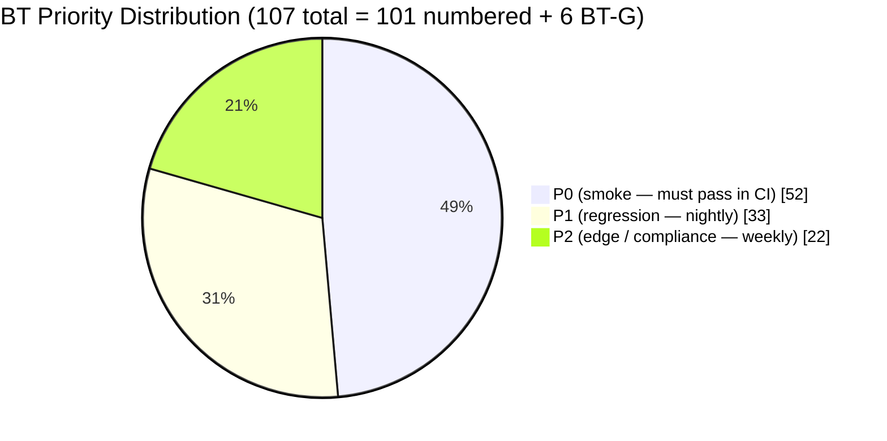
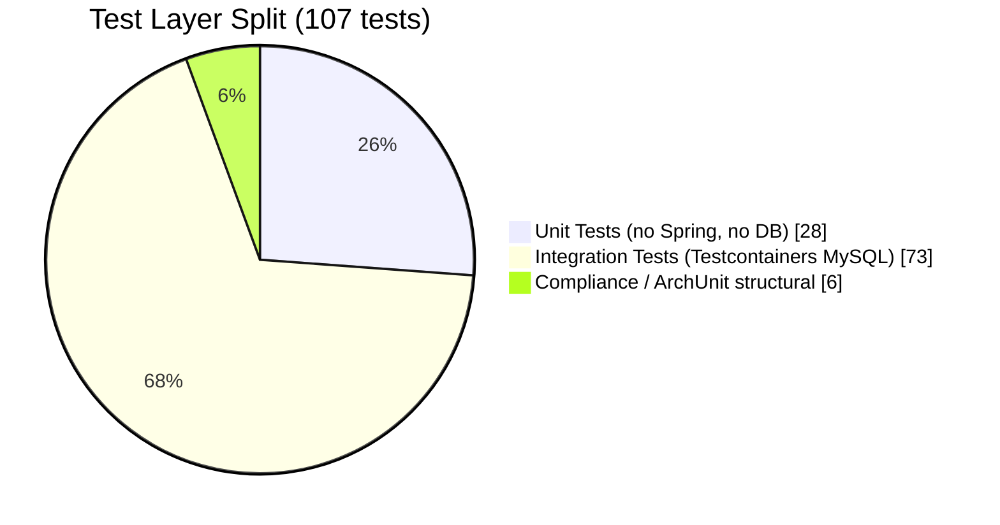
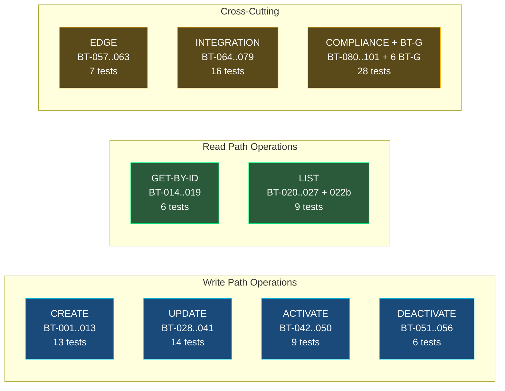
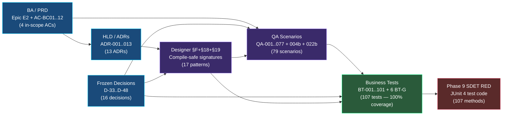
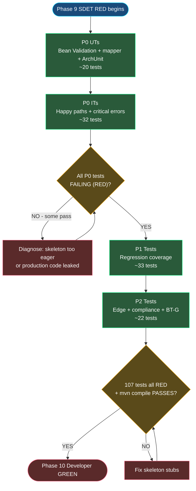
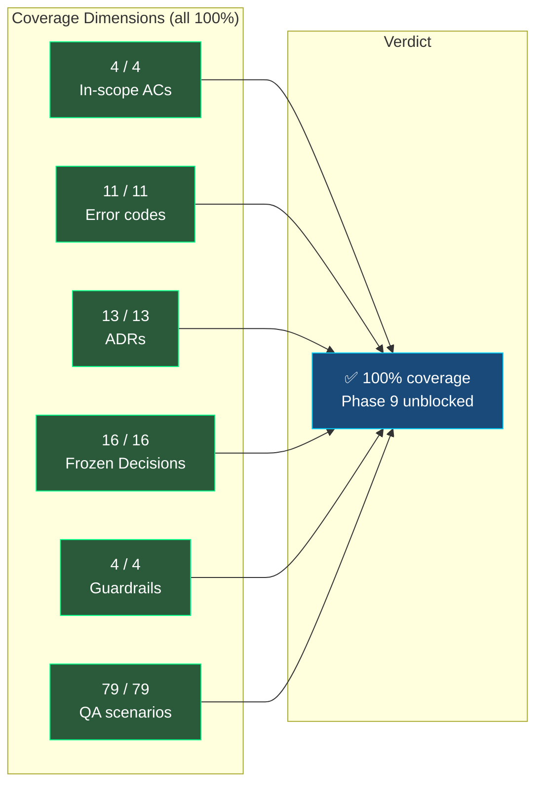

# Business Test Case Listings — CAP-185145 Benefit Category CRUD

> **Phase**: 8b (Business Test Gen)
> **Ticket**: CAP-185145
> **Date**: 2026-04-18
> **Inputs**: `00-ba.md`, `00-ba-machine.md`, `brdQnA.md`, `01-architect.md` (ADR-001..013), `03-designer.md` (§F), `04-qa.md` (QA-001..077 + QA-004b + QA-022b), `blocker-decisions.md` (D-33..D-48), `session-memory.md`, `GUARDRAILS.md`
> **Output feeds**: Phase 9 SDET (RED phase — write all tests to RED)

---

## 0. Summary Statistics

| Metric | Count |
|--------|-------|
| **Total BT cases** | **101** |
| Functional tests | 63 (BT-001..BT-063) |
| Integration tests (cross-boundary) | 16 (BT-064..BT-079) |
| Compliance tests (ADR + Decision + Guardrail) | 22 (BT-080..BT-101) |
| **Unit Tests (UT)** | **28** |
| **Integration Tests (IT)** | **73** |
| **P0** | **52** |
| **P1** | **33** |
| **P2** | **16** |

### Coverage Counts

| Dimension | Total Items | Covered | Gaps |
|-----------|-------------|---------|------|
| BA Acceptance Criteria (in-scope) | 4 (AC-BC01', AC-BC02, AC-BC03', AC-BC12) | 4 | 0 |
| User Stories (in-scope) | 10 (US-1..US-10, noting US-7..US-10 reinterpreted per D-21) | 10 | 0 |
| QA Scenarios | 79 (QA-001..077 + QA-004b + QA-022b) | 79 | 0 |
| Error Codes (§E ADR-009) | 11 | 11 | 0 |
| ADRs | 13 (ADR-001..013) | 13 | 0 |
| Frozen Decisions (D-33..D-48) | 16 | 16 | 0 |
| Guardrails exercised | 4 (G-01, G-05, G-07, G-10) | 4 | 0 |
| Designer Interface Methods | 6 (BenefitCategoryFacade methods) + Mapper + Controller + DAOs | Full | 0 |

---

## 1. Requirement Traceability Matrix

| AC / US | BA Requirement Summary | Designer Interface(s) | BT-xx IDs | QA-xxx IDs |
|---------|----------------------|-----------------------|-----------|------------|
| AC-BC01' | Category creation: name + slabIds + categoryType=BENEFITS; 409 dup; 400 invalid | `BenefitCategoryFacade.create()`, `BenefitCategoriesV3Controller.create()`, `BenefitCategory` entity | BT-001..BT-013 | QA-001..QA-013 |
| AC-BC02 | Name unique per program (case-sensitive per D-47); same name OK in different program | `BenefitCategoryDao.findActiveByProgramAndName()`, `BenefitCategoryFacade.create()/update()` | BT-004, BT-004b, BT-005, BT-024, BT-036 | QA-004, QA-004b, QA-005, QA-036, QA-043 |
| AC-BC03' | Instance = slabIds embedded in Category DTO; slabId validity enforced | `BenefitCategoryFacade.create()`, `BenefitCategorySlabMappingDao`, `PeProgramSlabDao.findByProgram()` | BT-006..BT-011, BT-029..BT-033 | QA-006..QA-011, QA-029..QA-033 |
| AC-BC12 | Deactivation cascades to all mappings in same txn; reactivate does NOT auto-reactivate mappings | `BenefitCategoryFacade.deactivate()`, `BenefitCategorySlabMappingDao.bulkSoftDeleteByCategory()`, `PointsEngineRuleService.deactivateBenefitCategory()` | BT-051..BT-056, BT-064..BT-066 | QA-051..QA-056, QA-068 |
| US-1 | Create category | `BenefitCategoryFacade.create()` | BT-001..BT-013 | QA-001..QA-013 |
| US-2 | List categories (paginated) | `BenefitCategoryFacade.list()`, `BenefitCategoryDao.findPage()` | BT-020..BT-027 | QA-020..QA-027 |
| US-3 | View single category | `BenefitCategoryFacade.get()`, `BenefitCategoryDao.findActiveByOrgIdAndId()/findByOrgIdAndId()` | BT-014..BT-019 | QA-014..QA-019 |
| US-4 | Update category (name, slabIds diff-apply) | `BenefitCategoryFacade.update()`, `BenefitCategorySlabMappingDao.bulkSoftDeleteByCategoryAndSlabs()` | BT-028..BT-041 | QA-028..QA-041 |
| US-5 | Deactivate (cascade) | `BenefitCategoryFacade.deactivate()`, `BenefitCategorySlabMappingDao.bulkSoftDeleteByCategory()` | BT-051..BT-056 | QA-051..QA-056 |
| US-6 | Reactivate category (D-34 endpoint) | `BenefitCategoryFacade.activate()` returning `Optional<BenefitCategoryResponse>` | BT-042..BT-050 | QA-042..QA-050 |
| US-7..US-10 | Instance CRUD (reinterpreted as slabIds on Category per D-21) | All above interfaces | Covered via US-1/US-4 slabId BTs | QA-006..QA-011, QA-029..QA-033 |
| FR-3 | Name uniqueness: DB + service layer | `BenefitCategoryDao.findActiveByProgramAndName()` | BT-004, BT-004b, BT-036, BT-090 | QA-004, QA-036 |
| FR-8 | All reads/writes scoped by org_id | All DAO methods carry `orgId` as first arg | BT-010, BT-016, BT-024, BT-034, BT-044, BT-052 | QA-010, QA-016, QA-024, QA-034, QA-044, QA-052 |
| FR-9 | Audit metadata on every mutation | `BenefitCategory` entity audit cols; service sets `createdOn/By/updatedOn/By` | BT-057..BT-060 | QA-074..QA-077 |
| NFR-6 | Idempotency (no-op on already-active/inactive) | `BenefitCategoryFacade.activate()/deactivate()` | BT-048, BT-055 | QA-048, QA-055 |
| D-42 | GET ?includeInactive=true audit path | `BenefitCategoryDao.findByOrgIdAndId()` vs `findActiveByOrgIdAndId()` | BT-017, BT-018 | QA-017, QA-018 |
| D-43 | stateChanged field 12 signals no-op on activate | `BenefitCategoryDto.stateChanged` Thrift field 12 | BT-048, BT-098 | QA-048, QA-050 |
| D-46 | UpdateRequest.slabIds @Size(min=1) | `BenefitCategoryUpdateRequest` Bean Validation | BT-032 | QA-032 |
| D-47 | Case-sensitive name uniqueness | `BenefitCategoryDao.findActiveByProgramAndName()` (no LOWER()) | BT-004b | QA-004b |
| D-48 | VALIDATION_FAILED platform code for bad filter | `TargetGroupErrorAdvice` Bean Validation handler | BT-022b | QA-022b |

---

## 2. Functional Tests

### CREATE — `POST /v3/benefitCategories`

---

#### BT-001 — Create category: happy path
- **Type**: IT
- **Priority**: P0
- **Anchors**: AC-BC01', US-1, QA-001, `BenefitCategoryFacade.create()`, `BenefitCategoriesV3Controller.create()`, ADR-003, D-35
- **Target Interface**: `POST /v3/benefitCategories` → `BenefitCategoryFacade.create(orgId, actorUserId, request)`
- **Given** org 100, program 5 exist; slabs 1, 2, 3 belong to program 5; admin authenticated with BasicAndKey
- **When** a create request is submitted with `{programId:5, name:"VIP Perks", slabIds:[1,2,3]}`
- **Then**
  - HTTP 201 Created
  - Response body: `ResponseWrapper<BenefitCategoryResponse>` with `id ≥ 1`, `orgId=100`, `programId=5`, `name="VIP Perks"`, `categoryType="BENEFITS"`, `slabIds=[1,2,3]`, `isActive=true`
  - `createdOn` is a valid ISO-8601 UTC string ending in `Z`
  - `createdBy` matches authenticated user id
  - `updatedOn` is null; `updatedBy` is null
  - DB row exists in `benefit_categories` with `is_active=1`
  - 3 rows in `benefit_category_slab_mapping` with `is_active=1`
- **Expected Outcome**: New category persisted end-to-end; all fields populated correctly; slabIds reflected in both response and DB

---

#### BT-002 — Create category: categoryType defaults to BENEFITS
- **Type**: IT
- **Priority**: P1
- **Anchors**: AC-BC01', QA-002, `BenefitCategory.categoryType`, D-06, D-10
- **Target Interface**: `POST /v3/benefitCategories` → `BenefitCategoryFacade.create()`
- **Given** valid program 5, slab 1 in org 100
- **When** a create request is submitted with no explicit `categoryType` field
- **Then** response `categoryType = "BENEFITS"`; DB `category_type = 'BENEFITS'`
- **Expected Outcome**: Enum defaults to single MVP value regardless of whether client sends it

---

#### BT-003 — Create category: minimal slabIds (exactly one slab)
- **Type**: IT
- **Priority**: P0
- **Anchors**: AC-BC01', QA-003, D-35, `BenefitCategoryCreateRequest.@Size(min=1)`
- **Target Interface**: `POST /v3/benefitCategories`
- **Given** valid program 5, slab 10 in org 100
- **When** a create request is submitted with `slabIds:[10]`
- **Then** HTTP 201; `slabIds=[10]` in response; exactly one mapping row in DB
- **Expected Outcome**: Single-slab category is valid; boundary at min=1 succeeds

---

#### BT-004 — Create category: name collision on active row → 409 BC_NAME_TAKEN_ACTIVE
- **Type**: IT
- **Priority**: P0
- **Anchors**: AC-BC02, QA-004, ADR-009, ADR-012, D-28, D-47, `BenefitCategoryDao.findActiveByProgramAndName()`
- **Target Interface**: `BenefitCategoryFacade.create()` → throws `ConflictException(BC_NAME_TAKEN_ACTIVE)`
- **Given** active category named "Gold Tier" in org 100, program 5
- **When** a create request is submitted with `{programId:5, name:"Gold Tier", slabIds:[1]}`
- **Then**
  - HTTP 409 Conflict
  - `errors[0].code = "BC_NAME_TAKEN_ACTIVE"`
  - No new row inserted in `benefit_categories`
- **Expected Outcome**: App-layer uniqueness check (D-28) fires; `ConflictException` propagated to 409

---

#### BT-004b — Create category: case-distinct name allowed (D-47 case-sensitive)
- **Type**: IT
- **Priority**: P0
- **Anchors**: AC-BC02, QA-004b, D-47 (user override: case-sensitive), ADR-012
- **Target Interface**: `BenefitCategoryFacade.create()`, `BenefitCategoryDao.findActiveByProgramAndName()`
- **Given** active category named "Gold Tier" in org 100, program 5
- **When** a create request is submitted with `{programId:5, name:"gold tier", slabIds:[1]}` (lowercase variant)
- **Then** HTTP 201; new category created — "gold tier" is treated as distinct from "Gold Tier"
- **Expected Outcome**: No `LOWER()` in uniqueness query; case difference makes names distinct per D-47

---

#### BT-005 — Create category: same name allowed in different program
- **Type**: IT
- **Priority**: P0
- **Anchors**: AC-BC02, QA-005, D-28, `BenefitCategoryDao.findActiveByProgramAndName()`
- **Target Interface**: `BenefitCategoryFacade.create()`
- **Given** "Gold Tier" active in program 5 of org 100
- **When** a create request is submitted with `{programId:99, name:"Gold Tier", slabIds:[1]}`
- **Then** HTTP 201; new category created in program 99 without conflict
- **Expected Outcome**: Name uniqueness is per-program, not per-org

---

#### BT-006 — Create category: cross-program slabId → 409 BC_CROSS_PROGRAM_SLAB
- **Type**: IT
- **Priority**: P0
- **Anchors**: AC-BC03', QA-006, ADR-003, ADR-009, D-35, `PeProgramSlabDao.findByProgram()`
- **Target Interface**: `BenefitCategoryFacade.create()` → slab validation
- **Given** slab 77 belongs to program 99 (not program 5) in org 100
- **When** a create request is submitted with `{programId:5, slabIds:[77]}`
- **Then** HTTP 409; `errors[0].code = "BC_CROSS_PROGRAM_SLAB"`; no rows inserted
- **Expected Outcome**: In-memory set diff on `findByProgram` result catches wrong-program slabId

---

#### BT-007 — Create category: unknown slabId → 409 BC_UNKNOWN_SLAB
- **Type**: IT
- **Priority**: P0
- **Anchors**: AC-BC03', QA-007, ADR-003, ADR-009, `PeProgramSlabDao.findByProgram()`
- **Target Interface**: `BenefitCategoryFacade.create()`
- **Given** slabId 9999 does not exist in org 100
- **When** a create request is submitted with `{programId:5, slabIds:[9999]}`
- **Then** HTTP 409; `errors[0].code = "BC_UNKNOWN_SLAB"`
- **Expected Outcome**: slab existence check via `findByProgram` in-memory diff returns missing slab

---

#### BT-008 — Create category: empty slabIds → 400 BC_SLAB_IDS_REQUIRED
- **Type**: UT
- **Priority**: P0
- **Anchors**: AC-BC03', QA-008, ADR-009, D-35, `BenefitCategoryCreateRequest.@Size(min=1)`, G-03 (Bean Validation)
- **Target Interface**: `BenefitCategoryCreateRequest` Bean Validation, `TargetGroupErrorAdvice`
- **Given** a valid program 5 in org 100
- **When** a create request is submitted with `slabIds:[]`
- **Then** HTTP 400; `errors[0].code = "BC_SLAB_IDS_REQUIRED"` (Bean Validation `@Size(min=1)` fires before service)
- **Expected Outcome**: Validation rejects at controller boundary; no service call made

---

#### BT-009 — Create category: null slabIds → 400 BC_SLAB_IDS_REQUIRED
- **Type**: UT
- **Priority**: P0
- **Anchors**: AC-BC03', QA-009, ADR-009, `BenefitCategoryCreateRequest.@NotNull`
- **Target Interface**: `BenefitCategoryCreateRequest` Bean Validation
- **Given** valid program 5
- **When** a create request is submitted with `slabIds` field absent
- **Then** HTTP 400; `errors[0].code = "BC_SLAB_IDS_REQUIRED"`
- **Expected Outcome**: `@NotNull` on slabIds fires; request rejected before facade

---

#### BT-010 — Create category: multi-tenant isolation on write
- **Type**: IT
- **Priority**: P0
- **Anchors**: FR-8, QA-010, G-07, ADR-010, D-16, `BenefitCategoryFacade.create()`
- **Target Interface**: `POST /v3/benefitCategories` with org 200 auth context
- **Given** slab 1 belongs to program 5 of org 100 only
- **When** admin of org 200 POSTs `{programId:5, name:"Leak Test", slabIds:[1]}`
- **Then** org 200 cannot access org 100's slabs; request returns 409 `BC_UNKNOWN_SLAB` (slab 1 not visible to org 200)
- **Expected Outcome**: `PeProgramSlabDao.findByProgram(orgId=200, programId=5)` returns empty; slab validation fails

---

#### BT-011 — Create category: duplicate slabIds silently deduped
- **Type**: UT
- **Priority**: P1
- **Anchors**: AC-BC03', QA-011, ADR-003, D-35, `BenefitCategoryFacade` (LinkedHashSet dedup)
- **Target Interface**: `BenefitCategoryFacade.create()` → `LinkedHashSet<>(slabIds)` dedup
- **Given** org 100, program 5, slabs 1 and 2 exist
- **When** a create request is submitted with `slabIds:[1,1,2,2]`
- **Then** HTTP 201; `slabIds=[1,2]` in response; exactly 2 mapping rows in DB
- **Expected Outcome**: Facade silently deduplicates; idempotent re-submission doesn't corrupt mapping table

---

#### BT-012 — Create category: name reuse after deactivation (D-29)
- **Type**: IT
- **Priority**: P1
- **Anchors**: QA-012, D-28, D-29, `BenefitCategoryDao.findActiveByProgramAndName()`
- **Target Interface**: `BenefitCategoryFacade.create()`
- **Given** a deactivated category named "Reuse Me" in program 5 of org 100
- **When** a new create request is submitted with `{programId:5, name:"Reuse Me", slabIds:[1]}`
- **Then** HTTP 201; new row with new PK; old deactivated row untouched in DB
- **Expected Outcome**: Uniqueness check is "active rows only" — inactive name does not block re-creation

---

#### BT-013 — Create category: missing name → 400 BC_NAME_REQUIRED
- **Type**: UT
- **Priority**: P0
- **Anchors**: AC-BC01', QA-013, ADR-009, `BenefitCategoryCreateRequest.@NotBlank`
- **Target Interface**: `BenefitCategoryCreateRequest` Bean Validation
- **Given** valid program 5
- **When** a create request is submitted with name field absent
- **Then** HTTP 400; `errors[0].code = "BC_NAME_REQUIRED"`
- **Expected Outcome**: `@NotBlank` on name field triggers before service

---

### GET-BY-ID — `GET /v3/benefitCategories/{id}`

---

#### BT-014 — Get by id: happy path (active category)
- **Type**: IT
- **Priority**: P0
- **Anchors**: US-3, QA-014, `BenefitCategoryFacade.get()`, `BenefitCategoryDao.findActiveByOrgIdAndId()`
- **Target Interface**: `GET /v3/benefitCategories/{id}` → `BenefitCategoryFacade.get(orgId, id, includeInactive=false)`
- **Given** active category id=42 with slabs [1,3,5] in org 100
- **When** GET is called without `includeInactive` param
- **Then** HTTP 200; `data.id=42`, `slabIds=[1,3,5]`, `isActive=true`; `createdOn` is valid ISO-8601 UTC string
- **Expected Outcome**: `findActiveByOrgIdAndId` path returns full category with active slabIds

---

#### BT-015 — Get by id: not found → 200 + error envelope (platform quirk)
- **Type**: IT
- **Priority**: P0
- **Anchors**: QA-015, ADR-009, `NotFoundException`, `TargetGroupErrorAdvice`
- **Target Interface**: `BenefitCategoryFacade.get()` throws `NotFoundException` → advice maps to HTTP 200
- **Given** no category with id=9999 in org 100
- **When** `GET /v3/benefitCategories/9999` is called
- **Then** HTTP 200 (platform quirk — NotFoundException maps to 200); `data=null`; `errors[0].code="BC_NOT_FOUND"`
- **Expected Outcome**: Platform quirk (OQ-45) preserved; test MUST assert HTTP 200, NOT 404

---

#### BT-016 — Get by id: wrong-org access → BC_NOT_FOUND (tenant isolation)
- **Type**: IT
- **Priority**: P0
- **Anchors**: FR-8, QA-016, G-07, ADR-010, `BenefitCategoryDao.findActiveByOrgIdAndId()`
- **Target Interface**: `BenefitCategoryFacade.get(orgId=200, id=42, false)`
- **Given** category id=42 belongs to org 100; caller authenticated as org 200
- **When** org 200 calls `GET /v3/benefitCategories/42`
- **Then** HTTP 200 + `errors[0].code="BC_NOT_FOUND"` — row not visible to org 200
- **Expected Outcome**: `orgId` filter in DAO query hides cross-org rows

---

#### BT-017 — Get by id: soft-deleted category without ?includeInactive → 404-style
- **Type**: IT
- **Priority**: P0
- **Anchors**: QA-017, D-42, ADR-009, `BenefitCategoryDao.findActiveByOrgIdAndId()`
- **Target Interface**: `BenefitCategoryFacade.get(orgId, id, includeInactive=false)`
- **Given** category id=55 is soft-deleted (`is_active=false`) in org 100
- **When** `GET /v3/benefitCategories/55` with no `?includeInactive` param
- **Then** HTTP 200 + `errors[0].code="BC_NOT_FOUND"` (active-only view treats inactive as not-found)
- **Expected Outcome**: Default `includeInactive=false` uses `findActiveByOrgIdAndId` — deactivated row is invisible

---

#### BT-018 — Get by id: soft-deleted category with ?includeInactive=true → 200 + DTO
- **Type**: IT
- **Priority**: P1
- **Anchors**: QA-018, D-42, `BenefitCategoryDao.findByOrgIdAndId()`
- **Target Interface**: `BenefitCategoryFacade.get(orgId, id, includeInactive=true)`
- **Given** category id=55 is soft-deleted in org 100
- **When** `GET /v3/benefitCategories/55?includeInactive=true`
- **Then** HTTP 200; `data.id=55`, `data.isActive=false`; `slabIds` reflects last active mappings (possibly empty)
- **Expected Outcome**: Audit path uses `findByOrgIdAndId` (no active filter) — row returned even when deactivated

---

#### BT-019 — Get by id: returns slabIds from active mappings only
- **Type**: IT
- **Priority**: P1
- **Anchors**: QA-019, ADR-003, D-35, `BenefitCategorySlabMappingDao.findActiveSlabIdsByCategoryId()`
- **Target Interface**: `BenefitCategoryFacade.get()` → `findActiveSlabIdsByCategoryId()`
- **Given** category id=42; mapping for slab 1 (`is_active=true`), mapping for slab 2 (`is_active=false`)
- **When** `GET /v3/benefitCategories/42`
- **Then** `data.slabIds=[1]` only — soft-deleted mapping row for slab 2 excluded
- **Expected Outcome**: Only `is_active=true` mapping rows contribute to slabIds in response

---

### LIST — `GET /v3/benefitCategories`

---

#### BT-020 — List: happy path (default params)
- **Type**: IT
- **Priority**: P0
- **Anchors**: US-2, QA-020, ADR-011, `BenefitCategoryFacade.list()`, `BenefitCategoryDao.findPage()`
- **Target Interface**: `GET /v3/benefitCategories?programId=5` → `BenefitCategoryFacade.list(orgId, programId=5, "true", 0, 50)`
- **Given** org 100 has 3 active categories in program 5
- **When** list is called with default params
- **Then** HTTP 200; `data.data` has 3 items; `data.page=0`; `data.size=50`; `data.total=3`; all `isActive=true`; items ordered `created_on DESC, id DESC`
- **Expected Outcome**: Default filter is active-only; pagination metadata correct

---

#### BT-021 — List: pagination (multi-page)
- **Type**: IT
- **Priority**: P1
- **Anchors**: QA-021, ADR-011, `BenefitCategoryDao.findPage()`
- **Target Interface**: `BenefitCategoryFacade.list()` with page/size params
- **Given** org 100, program 5 has 7 active categories
- **When** `?programId=5&page=0&size=3` then `page=1&size=3` then `page=2&size=3`
- **Then** Pages return 3, 3, 1 items respectively; `total=7` on all pages
- **Expected Outcome**: Offset pagination works correctly at page boundaries

---

#### BT-022 — List: page size exceeds max (100) → 400 BC_PAGE_SIZE_EXCEEDED
- **Type**: UT
- **Priority**: P0
- **Anchors**: QA-022, ADR-011, ADR-009, `@Max(100)` on size param, `TargetGroupErrorAdvice`
- **Target Interface**: `BenefitCategoriesV3Controller.list()` — `@Max(100)` Bean Validation on `size`
- **Given** any org/program
- **When** `?programId=5&size=101`
- **Then** HTTP 400; `errors[0].code="BC_PAGE_SIZE_EXCEEDED"`
- **Expected Outcome**: Controller-level constraint rejects before facade

---

#### BT-022b — List: invalid isActive value → VALIDATION_FAILED (D-48)
- **Type**: UT
- **Priority**: P1
- **Anchors**: QA-022b, D-48, ADR-009, `TargetGroupErrorAdvice` platform Bean Validation code
- **Target Interface**: `BenefitCategoriesV3Controller.list()` with unrecognised filter value
- **Given** any org/program
- **When** `?programId=5&isActive=foo` is sent
- **Then** Response with `errors[0].code="VALIDATION_FAILED"` (platform standard code per D-48); no bespoke `BC_*` code for this case
- **Expected Outcome**: Platform `TargetGroupErrorAdvice` handles bad query param with standard validation envelope

---

#### BT-023 — List: isActive=all returns both active and inactive
- **Type**: IT
- **Priority**: P1
- **Anchors**: QA-023, ADR-011, `BenefitCategoryDao.findPage()` with `isActive=null`
- **Target Interface**: `BenefitCategoryFacade.list(orgId, programId, "all", 0, 50)`
- **Given** org 100, program 5: 2 active + 1 deactivated category
- **When** `?programId=5&isActive=all`
- **Then** `data.total=3`; includes the deactivated row
- **Expected Outcome**: `isActive=all` passes `null` to DAO query — no `isActive` filter applied

---

#### BT-024 — List: multi-tenant isolation
- **Type**: IT
- **Priority**: P0
- **Anchors**: FR-8, QA-024, G-07, `BenefitCategoryDao.findPage()` with `orgId`
- **Target Interface**: `BenefitCategoryFacade.list(orgId=200, ...)`
- **Given** org 100 has 5 categories in program 5; org 200 has 0
- **When** org 200 calls `GET /v3/benefitCategories?programId=5`
- **Then** `data.data=[]`; `data.total=0`
- **Expected Outcome**: DAO `orgId` filter isolates tenants completely

---

#### BT-025 — List: no programId filter returns all programs for org
- **Type**: IT
- **Priority**: P1
- **Anchors**: QA-025, ADR-011, `BenefitCategoryDao.findPage()` with `programId=null`
- **Target Interface**: `BenefitCategoryFacade.list(orgId=100, programId=null, ...)`
- **Given** org 100 has 2 categories in program 5 and 3 in program 9
- **When** `GET /v3/benefitCategories` (no programId param)
- **Then** `data.total=5`; both programs' categories returned
- **Expected Outcome**: Optional `programId` filter behaves correctly when absent

---

#### BT-026 — List: isActive=false returns only deactivated categories
- **Type**: IT
- **Priority**: P1
- **Anchors**: QA-026, ADR-011
- **Target Interface**: `BenefitCategoryFacade.list(orgId, programId, "false", ...)`
- **Given** org 100: 2 active + 1 deactivated category in program 5
- **When** `?programId=5&isActive=false`
- **Then** `data.total=1`; `data.data[0].isActive=false`
- **Expected Outcome**: `isActive=false` filter returns only soft-deleted rows

---

#### BT-027 — List: empty program returns empty list (not error)
- **Type**: IT
- **Priority**: P1
- **Anchors**: QA-027, G-02, ADR-009, `BenefitCategoryFacade.list()`
- **Target Interface**: `BenefitCategoryFacade.list()` for program with no categories
- **Given** org 100; program 99 has no categories
- **When** `?programId=99`
- **Then** HTTP 200; `data.data=[]`; `data.total=0` — empty collection returned, not error
- **Expected Outcome**: G-02.1 — never return null when collection expected; empty list is correct response

---

### UPDATE — `PUT /v3/benefitCategories/{id}`

---

#### BT-028 — Update: rename category (name-only change)
- **Type**: IT
- **Priority**: P0
- **Anchors**: US-4, QA-028, ADR-003, `BenefitCategoryFacade.update()`
- **Target Interface**: `PUT /v3/benefitCategories/42` → `BenefitCategoryFacade.update(orgId, actorUserId, 42, request)`
- **Given** active category id=42, name="Old Name", slabs=[1,2] in org 100
- **When** PUT with `{name:"New Name", slabIds:[1,2]}`
- **Then** HTTP 200; `data.name="New Name"`; `data.slabIds=[1,2]`; `updatedOn` is valid ISO-8601 UTC; `updatedBy`=actor
- **Expected Outcome**: Name updated; unchanged slabIds produce no mapping changes; audit fields set

---

#### BT-029 — Update: add new slab (diff-apply inserts mapping)
- **Type**: IT
- **Priority**: P0
- **Anchors**: AC-BC03', QA-029, ADR-003, D-35, `BenefitCategorySlabMappingDao.saveAll()`
- **Target Interface**: `PointsEngineRuleService.updateBenefitCategory()` diff-apply path
- **Given** active category id=42 with slabs=[1,2]; slab 3 exists in program 5
- **When** PUT with `{name:"VIP", slabIds:[1,2,3]}`
- **Then** HTTP 200; `data.slabIds=[1,2,3]`; new mapping row for slab 3 inserted with `is_active=true`; existing mappings 1 and 2 unchanged
- **Expected Outcome**: `toAdd = {3}`; one new row inserted in same transaction

---

#### BT-030 — Update: remove slab (diff-apply soft-deletes mapping)
- **Type**: IT
- **Priority**: P0
- **Anchors**: AC-BC03', QA-030, ADR-003, D-35, `BenefitCategorySlabMappingDao.bulkSoftDeleteByCategoryAndSlabs()`
- **Target Interface**: `PointsEngineRuleService.updateBenefitCategory()` diff-apply path
- **Given** active category id=42 with slabs=[1,2,3]
- **When** PUT with `{name:"VIP", slabIds:[1,3]}` (slab 2 removed)
- **Then** HTTP 200; `data.slabIds=[1,3]`; mapping for slab 2 updated to `is_active=false`; mappings for 1 and 3 unchanged
- **Expected Outcome**: `toSoftDelete = {2}`; bulk UPDATE sets mapping `is_active=false`

---

#### BT-031 — Update: replace all slabs
- **Type**: IT
- **Priority**: P1
- **Anchors**: QA-031, ADR-003, D-35
- **Target Interface**: `PointsEngineRuleService.updateBenefitCategory()` diff-apply
- **Given** active category id=42 with slabs=[1,2,3]; slab 5 exists
- **When** PUT with `{name:"VIP", slabIds:[5]}`
- **Then** `data.slabIds=[5]`; old mappings for 1,2,3 soft-deleted; new mapping for 5 inserted
- **Expected Outcome**: Full replacement case — `toAdd={5}`, `toSoftDelete={1,2,3}`, `toKeep={}`

---

#### BT-032 — Update: empty slabIds rejected → 400 (D-46)
- **Type**: UT
- **Priority**: P0
- **Anchors**: QA-032, D-46, ADR-009, `BenefitCategoryUpdateRequest.@Size(min=1)`
- **Target Interface**: `BenefitCategoryUpdateRequest` Bean Validation, `TargetGroupErrorAdvice`
- **Given** active category id=42 in org 100
- **When** PUT with `{name:"VIP", slabIds:[]}`
- **Then** HTTP 400 (or 200 + error envelope per platform quirk); `errors[0].code="VALIDATION_FAILED"` referencing `slabIds`; no DB changes
- **Expected Outcome**: D-46 — `@Size(min=1)` on UpdateRequest.slabIds; identical to Create enforcement per D-35 symmetry

---

#### BT-033 — Update: re-add soft-deleted slab inserts NEW row (not reactivation)
- **Type**: IT
- **Priority**: P2
- **Anchors**: QA-033, ADR-003, D-35
- **Target Interface**: `PointsEngineRuleService.updateBenefitCategory()` re-add path
- **Given** category id=42; slab 2 was previously added then removed (`is_active=false` mapping exists); slab 2 exists in program 5
- **When** PUT with `{name:"VIP", slabIds:[2]}`
- **Then** HTTP 200; `data.slabIds=[2]`; a NEW mapping row inserted (new PK, `is_active=true`, fresh `created_on`); old soft-deleted row still present with `is_active=false`
- **Expected Outcome**: Re-add semantics per ADR-003 — always INSERT, never reactivate old row; old row preserved as audit history

---

#### BT-034 — Update: wrong-org → BC_NOT_FOUND
- **Type**: IT
- **Priority**: P0
- **Anchors**: FR-8, QA-034, G-07
- **Target Interface**: `BenefitCategoryFacade.update(orgId=200, ...)`
- **Given** category id=42 belongs to org 100; caller is org 200
- **When** PUT as org 200 with `{name:"Hack", slabIds:[1]}`
- **Then** HTTP 200 + `errors[0].code="BC_NOT_FOUND"`; DB row unchanged
- **Expected Outcome**: `findActiveById(orgId=200, id=42)` returns empty; service throws NotFoundException

---

#### BT-035 — Update: inactive category → 409 BC_INACTIVE_WRITE_FORBIDDEN (D-27)
- **Type**: IT
- **Priority**: P0
- **Anchors**: QA-035, ADR-009, D-27, `BenefitCategoryDao.findActiveById()`
- **Target Interface**: `BenefitCategoryFacade.update()` → `findActiveById()` returns empty → throws ConflictException
- **Given** category id=55 is soft-deleted in org 100
- **When** PUT on id=55 with `{name:"Update Attempt", slabIds:[1]}`
- **Then** HTTP 409; `errors[0].code="BC_INACTIVE_WRITE_FORBIDDEN"`
- **Expected Outcome**: D-27 — PUT on inactive row is forbidden; only `/activate` can un-deactivate

---

#### BT-036 — Update: name collision with another active category → 409
- **Type**: IT
- **Priority**: P0
- **Anchors**: AC-BC02, QA-036, D-28, `BenefitCategoryDao.findActiveByProgramAndNameExceptId()`
- **Target Interface**: `BenefitCategoryFacade.update()` → name conflict check
- **Given** category id=42 (name="Old"), category id=43 (name="Taken") — both active in org 100, program 5
- **When** PUT on id=42 with `{name:"Taken", slabIds:[1]}`
- **Then** HTTP 409; `errors[0].code="BC_NAME_TAKEN_ACTIVE"`
- **Expected Outcome**: Uniqueness check excludes self (id≠42) via `findActiveByProgramAndNameExceptId`

---

#### BT-037 — Update: rename to own current name succeeds (no self-conflict)
- **Type**: IT
- **Priority**: P1
- **Anchors**: QA-037, D-28, `BenefitCategoryDao.findActiveByProgramAndNameExceptId()`
- **Target Interface**: `BenefitCategoryFacade.update()` — self-exclusion in name check
- **Given** active category id=42 with name="VIP" in org 100, program 5
- **When** PUT on id=42 with `{name:"VIP", slabIds:[1]}`
- **Then** HTTP 200; update succeeds
- **Expected Outcome**: Self-exclusion clause prevents false conflict when name is unchanged

---

#### BT-038 — Update: cross-program slabId → 409 BC_CROSS_PROGRAM_SLAB
- **Type**: IT
- **Priority**: P0
- **Anchors**: QA-038, ADR-003, ADR-009
- **Target Interface**: `BenefitCategoryFacade.update()` → slab validation
- **Given** active category id=42 in program 5; slab 77 belongs to program 99
- **When** PUT with `{name:"VIP", slabIds:[77]}`
- **Then** HTTP 409; `errors[0].code="BC_CROSS_PROGRAM_SLAB"`
- **Expected Outcome**: Same slab-validation path as Create; `findByProgram` in-memory diff detects wrong-program slab

---

#### BT-039 — Update: unknown slabId → 409 BC_UNKNOWN_SLAB
- **Type**: IT
- **Priority**: P0
- **Anchors**: QA-039, ADR-003, ADR-009
- **Target Interface**: `BenefitCategoryFacade.update()`
- **Given** active category id=42; slabId 9999 does not exist
- **When** PUT with `{name:"VIP", slabIds:[9999]}`
- **Then** HTTP 409; `errors[0].code="BC_UNKNOWN_SLAB"`
- **Expected Outcome**: Slab existence validation catches non-existent slabIds on update as well as create

---

#### BT-040 — Update: partial failure rolls back entire transaction
- **Type**: IT
- **Priority**: P1
- **Anchors**: QA-040, ADR-003, C-16, G-05
- **Target Interface**: `PointsEngineRuleService.updateBenefitCategory()` — `@Transactional(warehouse)`
- **Given** active category id=42 with slabs=[1,2]; update includes slabId 9999 (unknown)
- **When** PUT with `{name:"New", slabIds:[1,9999]}`
- **Then** HTTP 409; DB state unchanged — name still original; slabs still [1,2]
- **Expected Outcome**: `@Transactional(warehouse)` wraps all DAO writes; validation failure before writes means no partial writes

---

#### BT-041 — Update: last-write-wins on concurrent PUTs (ADR-001)
- **Type**: IT
- **Priority**: P2
- **Anchors**: QA-041, ADR-001, D-33, G-10 (accepted deviation)
- **Target Interface**: `PointsEngineRuleService.updateBenefitCategory()` — no `@Version`
- **Given** category id=42 in org 100
- **When** two concurrent PUTs — one with `{name:"A", slabIds:[1]}`, one with `{name:"B", slabIds:[2]}` — both fire nearly simultaneously
- **Then** Both return HTTP 200; final DB state is either "A"/"[1]" or "B"/"[2]" depending on DB write order; no 409 raised; no version error
- **Expected Outcome**: ADR-001 LWW behaviour documented — test asserts no error occurs, not which write wins

---

### ACTIVATE — `PATCH /v3/benefitCategories/{id}/activate`

---

#### BT-042 — Activate: not found → BC_NOT_FOUND
- **Type**: IT
- **Priority**: P0
- **Anchors**: QA-042, ADR-002, ADR-009
- **Target Interface**: `BenefitCategoryFacade.activate()` throws `NotFoundException`
- **Given** no category id=9999 in org 100
- **When** `PATCH /v3/benefitCategories/9999/activate`
- **Then** HTTP 200 + `errors[0].code="BC_NOT_FOUND"` (platform quirk)
- **Expected Outcome**: `findByOrgIdAndId` returns empty → NotFoundException → 200+error envelope

---

#### BT-043 — Activate: name collision with currently-active category → 409 BC_NAME_TAKEN_ON_REACTIVATE
- **Type**: IT
- **Priority**: P0
- **Anchors**: QA-043, ADR-002, ADR-009, D-34, `BenefitCategoryDao.findActiveByProgramAndName()`
- **Target Interface**: `BenefitCategoryFacade.activate()` → name conflict check at reactivation
- **Given** category id=55 (name="Welcome Pack", inactive); category id=60 (name="Welcome Pack", active) — same program
- **When** `PATCH /v3/benefitCategories/55/activate`
- **Then** HTTP 409; `errors[0].code="BC_NAME_TAKEN_ON_REACTIVATE"`; category 55 remains inactive
- **Expected Outcome**: ADR-002 clause — reactivation-name-collision check before flipping is_active

---

#### BT-044 — Activate: wrong-org → BC_NOT_FOUND
- **Type**: IT
- **Priority**: P0
- **Anchors**: QA-044, G-07, FR-8
- **Target Interface**: `BenefitCategoryFacade.activate(orgId=200, ...)`
- **Given** category id=42 belongs to org 100; caller authenticated as org 200
- **When** PATCH activate as org 200
- **Then** HTTP 200 + `errors[0].code="BC_NOT_FOUND"`
- **Expected Outcome**: orgId filter hides cross-org rows at DAO layer

---

#### BT-045 — Activate: inactive category with no name conflict → 200 + DTO (D-39)
- **Type**: IT
- **Priority**: P0
- **Anchors**: US-6, QA-045, ADR-002, ADR-006 amended, D-34, D-39
- **Target Interface**: `BenefitCategoryFacade.activate()` returns populated `Optional<BenefitCategoryResponse>`
- **Given** category id=55, `is_active=false`, name="Solo" (no conflict) in org 100
- **When** `PATCH /v3/benefitCategories/55/activate`
- **Then** HTTP 200 (NOT 204); body contains full `BenefitCategoryResponse` with `id=55`, `isActive=true`; `updatedOn` set; `updatedBy`=actor
- **Expected Outcome**: D-39 asymmetry — state-changed activate returns 200+DTO so client avoids a GET round-trip

---

#### BT-046 — Activate: slab mappings NOT auto-reactivated after activate
- **Type**: IT
- **Priority**: P0
- **Anchors**: US-6, QA-046, ADR-002, D-34, FR-7
- **Target Interface**: `PointsEngineRuleService.activateBenefitCategory()` — no mapping reactivation
- **Given** category id=55 was deactivated (cascade soft-deleted 3 slab mappings); now `is_active=false`; name has no conflict
- **When** `PATCH /v3/benefitCategories/55/activate`
- **Then** Category row `is_active=1`; all 3 slab mapping rows STILL `is_active=0`; `data.slabIds=[]`
- **Expected Outcome**: ADR-002 clause b — activate only flips the category row; mappings must be re-added via PUT

---

#### BT-047 — Activate: stateChanged=true in Thrift DTO on state change (D-43)
- **Type**: IT
- **Priority**: P0
- **Anchors**: QA-047, ADR-006 amended, D-39, D-43, `BenefitCategoryDto` field 12 `stateChanged`
- **Target Interface**: `PointsEngineRuleConfigThriftImpl.activateBenefitCategory()` → Thrift struct field 12
- **Given** category id=55 is inactive; no name conflict
- **When** `PATCH /v3/benefitCategories/55/activate`
- **Then** Thrift-level `BenefitCategoryDto.stateChanged=true`; facade maps to populated `Optional<BenefitCategoryResponse>`; controller returns 200 + body
- **Expected Outcome**: D-43 sentinel pattern — `stateChanged=true` distinguishes actual state-change from no-op at Thrift boundary

---

#### BT-048 — Activate: idempotent no-op (already active) → 204 No Content
- **Type**: IT
- **Priority**: P0
- **Anchors**: QA-048, ADR-006, D-39, D-43, NFR-6
- **Target Interface**: `BenefitCategoryFacade.activate()` returns `Optional.empty()`
- **Given** category id=42 is already `is_active=true`
- **When** `PATCH /v3/benefitCategories/42/activate`
- **Then** HTTP 204 No Content (NOT 200); empty body; DB row unchanged; Thrift `stateChanged=false`
- **Expected Outcome**: D-43 — `stateChanged=false` causes facade to return `Optional.empty()` → controller returns 204

---

#### BT-049 — Activate: audit fields set on activation
- **Type**: IT
- **Priority**: P1
- **Anchors**: QA-049, FR-9, NFR-4, D-23
- **Target Interface**: `PointsEngineRuleService.activateBenefitCategory()` — audit col writes
- **Given** category id=55 is inactive with `updatedOn=null`
- **When** PATCH activate by admin id=10
- **Then** DB `updated_on` is non-null and is a valid UTC DATETIME; `updated_by=10`
- **Expected Outcome**: Audit columns written by service (manual `new Date()` per P-06 pattern)

---

#### BT-050 — Activate: BasicAndKey auth required (write path)
- **Type**: IT
- **Priority**: P1
- **Anchors**: QA-050, ADR-010, D-37
- **Target Interface**: Auth filter in `intouch-api-v3` before `BenefitCategoriesV3Controller.activate()`
- **Given** category id=55 is inactive
- **When** PATCH activate sent with KeyOnly auth (not BasicAndKey)
- **Then** Auth rejected (401 or 403 per existing platform auth filter)
- **Expected Outcome**: Write path BasicAndKey guard per D-37/ADR-010

---

### DEACTIVATE — `PATCH /v3/benefitCategories/{id}/deactivate`

---

#### BT-051 — Deactivate: not found → BC_NOT_FOUND
- **Type**: IT
- **Priority**: P0
- **Anchors**: QA-051, ADR-004, ADR-009
- **Target Interface**: `BenefitCategoryFacade.deactivate()` throws `NotFoundException`
- **Given** no category id=9999 in org 100
- **When** `PATCH /v3/benefitCategories/9999/deactivate`
- **Then** HTTP 200 + `errors[0].code="BC_NOT_FOUND"`
- **Expected Outcome**: Platform quirk; NotFoundException maps to HTTP 200

---

#### BT-052 — Deactivate: wrong-org → BC_NOT_FOUND
- **Type**: IT
- **Priority**: P0
- **Anchors**: QA-052, G-07, FR-8
- **Target Interface**: `BenefitCategoryFacade.deactivate(orgId=200, ...)`
- **Given** category id=42 belongs to org 100; caller is org 200
- **When** PATCH deactivate as org 200
- **Then** HTTP 200 + `errors[0].code="BC_NOT_FOUND"`
- **Expected Outcome**: orgId isolation — cross-org category invisible to wrong org

---

#### BT-053 — Deactivate: happy path — category + cascade mappings soft-deleted in same txn
- **Type**: IT
- **Priority**: P0
- **Anchors**: AC-BC12, US-5, QA-053, ADR-004, C-16, G-05
- **Target Interface**: `BenefitCategoryFacade.deactivate()` → `PointsEngineRuleService.deactivateBenefitCategory()` → `BenefitCategoryDao.softDeleteIfActive()` + `BenefitCategorySlabMappingDao.bulkSoftDeleteByCategory()`
- **Given** active category id=42 with active slab mappings for slabs [1,2,3] in org 100
- **When** `PATCH /v3/benefitCategories/42/deactivate`
- **Then** HTTP 204 No Content; DB `benefit_categories.is_active=0` for id=42; all 3 mapping rows `is_active=0`; `updated_on` and `updated_by` set on all 4 rows atomically
- **Expected Outcome**: ADR-004 cascade deactivation; single `@Transactional(warehouse)` boundary

---

#### BT-054 — Deactivate: cascade transactional — failure rolls back all changes
- **Type**: IT
- **Priority**: P1
- **Anchors**: AC-BC12, QA-054, C-16, G-05
- **Target Interface**: `PointsEngineRuleService.deactivateBenefitCategory()` — `@Transactional(warehouse)` rollback
- **Given** active category id=42 with mappings [1,2,3]; bulk UPDATE step simulated to fail (Testcontainers DB state manipulation)
- **When** PATCH deactivate
- **Then** Transaction rolls back; category AND all mappings remain `is_active=1` — no partial deactivation visible
- **Expected Outcome**: G-05 atomicity — either all rows flip or none; no half-deactivated state

---

#### BT-055 — Deactivate: idempotent — already-inactive returns 204
- **Type**: IT
- **Priority**: P0
- **Anchors**: QA-055, ADR-006, NFR-6
- **Target Interface**: `BenefitCategoryFacade.deactivate()` no-op path
- **Given** category id=55 already `is_active=false`
- **When** PATCH deactivate
- **Then** HTTP 204 No Content; DB state unchanged (no new `updated_on` written)
- **Expected Outcome**: ADR-004 idempotency — deactivating already-inactive is benign no-op

---

#### BT-056 — Deactivate: category with no active mappings (edge case)
- **Type**: IT
- **Priority**: P2
- **Anchors**: QA-056, ADR-004
- **Target Interface**: `BenefitCategorySlabMappingDao.bulkSoftDeleteByCategory()` — 0 rows affected
- **Given** active category id=42 with no active slab mappings (all previously removed)
- **When** PATCH deactivate
- **Then** HTTP 204; category `is_active=0`; bulk UPDATE affects 0 mapping rows — still succeeds
- **Expected Outcome**: 0-rows-affected on bulk UPDATE is not an error; deactivate still completes

---

### EDGE CASES

---

#### BT-057 — Edge: whitespace-only name → 400 BC_NAME_REQUIRED
- **Type**: UT
- **Priority**: P0
- **Anchors**: QA-057, ADR-009, `BenefitCategoryCreateRequest.@NotBlank`
- **Target Interface**: `BenefitCategoryCreateRequest` Bean Validation
- **Given** valid program 5
- **When** POST with `{name:"   ", slabIds:[1]}`
- **Then** HTTP 400; `errors[0].code="BC_NAME_REQUIRED"` (`@NotBlank` trims whitespace and rejects)
- **Expected Outcome**: `@NotBlank` treats whitespace-only as blank

---

#### BT-058 — Edge: name at max length (255 chars) accepted
- **Type**: UT
- **Priority**: P1
- **Anchors**: QA-058, `BenefitCategoryCreateRequest.@Size(max=255)`
- **Target Interface**: `BenefitCategoryCreateRequest` Bean Validation
- **Given** valid program 5; slab 1 in org 100
- **When** POST with a name exactly 255 characters long
- **Then** HTTP 201; name stored in full
- **Expected Outcome**: Boundary value 255 is accepted (max is inclusive)

---

#### BT-059 — Edge: name exceeding 255 chars → 400 BC_NAME_LENGTH
- **Type**: UT
- **Priority**: P0
- **Anchors**: QA-059, ADR-009, `BenefitCategoryCreateRequest.@Size(max=255)`
- **Target Interface**: `BenefitCategoryCreateRequest` Bean Validation
- **Given** valid program 5
- **When** POST with a name of 256 characters
- **Then** HTTP 400; `errors[0].code="BC_NAME_LENGTH"`
- **Expected Outcome**: Over-boundary value 256 is rejected

---

#### BT-060 — Edge: pagination offset beyond total data → empty list
- **Type**: IT
- **Priority**: P1
- **Anchors**: QA-060, ADR-011
- **Target Interface**: `BenefitCategoryFacade.list()` with high page number
- **Given** org 100 has 5 categories in program 5
- **When** `?programId=5&page=10&size=50`
- **Then** HTTP 200; `data.data=[]`; `data.total=5`; `data.page=10`
- **Expected Outcome**: Out-of-range page returns empty list; total still reflects actual count

---

#### BT-061 — Edge: concurrent create race (D-38 accepted behaviour — documentation test)
- **Type**: IT
- **Priority**: P2
- **Anchors**: QA-061, ADR-012, D-38, G-10 (accepted deviation)
- **Target Interface**: `BenefitCategoryFacade.create()` — no advisory lock (D-38)
- **Given** org 100, program 5; no category named "Race Test" exists
- **When** two concurrent POST requests both with `{programId:5, name:"Race Test", slabIds:[1]}`
- **Then** Acceptable outcomes: (a) first gets 201, second gets 409 `BC_NAME_TAKEN_ACTIVE`; OR (b) both get 201 creating two rows with same name. Both outcomes are valid per D-38. Test MUST NOT fail on outcome (b).
- **Expected Outcome**: Accepted race at D-26 SMALL scale documented; no advisory lock expected

---

#### BT-062 — Edge: UTC timestamp correctness in IST JVM timezone context
- **Type**: IT
- **Priority**: P0
- **Anchors**: QA-062, G-01, ADR-008, D-24, G-11.7
- **Target Interface**: `BenefitCategoryResponseMapper.toResponse()` — `@JsonFormat(timezone="UTC")` on `createdOn`
- **Given** JVM running in IST (+05:30) timezone context (simulated in test via `TimeZone.setDefault()`)
- **When** POST creates a category and GET returns it
- **Then** `createdOn` in REST response ends in `Z`; parsed UTC epoch millis matches `created_on` DATETIME in DB interpreted as UTC; no IST offset applied to stored or returned value
- **Expected Outcome**: G-01 compliance at REST boundary; three-boundary pattern (D-24) works across TZ context changes

---

#### BT-063 — Edge: N+1 query prevention on list
- **Type**: IT
- **Priority**: P1
- **Anchors**: QA-064, G-04, `BenefitCategorySlabMappingDao.findActiveSlabIdsForCategories()`
- **Target Interface**: `PointsEngineRuleService.listBenefitCategories()` — bulk slab fetch
- **Given** org 100, program 5 has 10 active categories each with 3 slab mappings
- **When** `GET /v3/benefitCategories?programId=5&size=10`
- **Then** Response contains 10 categories each with populated `slabIds`; exactly 2 DB queries fired (one for `findPage`, one for `findActiveSlabIdsForCategories` bulk)
- **Expected Outcome**: G-04.1 — no N+1; slab IDs fetched in one bulk query via `IN (:categoryIds)`

---

## 3. Integration Tests (Cross-Boundary, Txn, Multi-Tenant, Thrift)

---

#### BT-064 — Integration: full create path — controller → facade → Thrift → service → DAO → DB
- **Type**: IT
- **Priority**: P0
- **Anchors**: D-18, D-19, ADR-005, `PointsEngineRuleConfigThriftImpl.createBenefitCategory()`, `PointsEngineRuleService.createBenefitCategory()`
- **Target Interface**: End-to-end from `POST /v3/benefitCategories` through all 4 layers to `benefit_categories` and `benefit_category_slab_mapping`
- **Given** org 100, program 5, slabs [1,2]; Thrift service running in emf-parent; intouch-api-v3 facade wired to it
- **When** full end-to-end POST (via Testcontainers + embedded Thrift server or direct service test)
- **Then** Row persisted in DB; Thrift struct round-trips correctly; `BenefitCategoryDto` fields match input; `@Transactional(warehouse)` boundary confirmed by checking both tables in same commit
- **Expected Outcome**: Chain integrity — no layer leaks or translation errors across 4 boundaries

---

#### BT-065 — Integration: cascade deactivation atomicity (G-05 + C-16)
- **Type**: IT
- **Priority**: P0
- **Anchors**: AC-BC12, QA-068, G-05, C-16, ADR-004, `PointsEngineRuleService.deactivateBenefitCategory()`
- **Target Interface**: `@Transactional(warehouse)` on `deactivateBenefitCategory()` — both DAO calls in same txn
- **Given** active category id=42 with 3 active mappings
- **When** deactivate is called AND the mapping bulk-UPDATE is forced to throw (via Testcontainers rollback simulation)
- **Then** Transaction rolls back; category `is_active` reverts to 1; all mapping rows revert to `is_active=1`
- **Expected Outcome**: Atomicity guarantee holds; no partial deactivation state visible

---

#### BT-066 — Integration: reactivate then PUT to re-add slabs (two-step workflow)
- **Type**: IT
- **Priority**: P1
- **Anchors**: US-6, ADR-002, ADR-003, D-34, D-35
- **Target Interface**: `BenefitCategoryFacade.activate()` then `BenefitCategoryFacade.update()`
- **Given** category id=55 was deactivated (cascade removed 2 slab mappings); now inactive
- **When** step 1: PATCH activate → category `is_active=1`, mappings still `is_active=0`; step 2: PUT with `{slabIds:[1,3]}` → diff-apply inserts new rows
- **Then** After step 2: category active, 2 new mapping rows with `is_active=1`, old deactivated rows preserved as history
- **Expected Outcome**: Admin two-step restore workflow works; re-add uses INSERT not reactivation

---

#### BT-067 — Integration: Thrift contract — BenefitCategoryDto fields round-trip
- **Type**: IT
- **Priority**: P0
- **Anchors**: ADR-008, D-24, `BenefitCategoryDto` Thrift struct (fields 1-12), `PointsEngineRuleConfigThriftImpl`
- **Target Interface**: Direct Thrift call `getBenefitCategory(orgId, categoryId, false)` on emf-parent
- **Given** a category created at a known UTC instant
- **When** Thrift `getBenefitCategory` is called directly (bypassing REST)
- **Then** `BenefitCategoryDto.createdOn` (i64 field) equals known `Instant.toEpochMilli()` ± small tolerance; all other fields match created values
- **Expected Outcome**: Three-boundary timestamp: Date→i64 millis conversion in handler is UTC-correct

---

#### BT-068 — Integration: Thrift stateChanged field 12 (D-43 + D-39)
- **Type**: IT
- **Priority**: P0
- **Anchors**: D-43, ADR-006 amended, `BenefitCategoryDto` field 12 `stateChanged`
- **Target Interface**: `PointsEngineRuleConfigThriftImpl.activateBenefitCategory()` → `BenefitCategoryDto.stateChanged`
- **Given** inactive category id=55; active category id=42 (already active)
- **When** (a) activate id=55 (state changes); (b) activate id=42 (no-op)
- **Then** (a) returned `BenefitCategoryDto.stateChanged=true`; (b) `stateChanged=false`
- **Expected Outcome**: Thrift field 12 is the reliable signal for facade to branch between 200+DTO vs 204

---

#### BT-069 — Integration: multi-tenant — org A cannot read org B's category via GET
- **Type**: IT
- **Priority**: P0
- **Anchors**: G-07, QA-069, FR-8, ADR-010
- **Target Interface**: `BenefitCategoryDao.findActiveByOrgIdAndId(orgId=200, id=42)`
- **Given** category id=42 created in org 100
- **When** `GET /v3/benefitCategories/42` with org 200 context
- **Then** HTTP 200 + `BC_NOT_FOUND` — category not visible
- **Expected Outcome**: G-07.4 explicit cross-org isolation test

---

#### BT-070 — Integration: multi-tenant — org A cannot update org B's category
- **Type**: IT
- **Priority**: P0
- **Anchors**: G-07, QA-070, FR-8
- **Target Interface**: `BenefitCategoryFacade.update(orgId=200, ...)`
- **Given** category id=42 belongs to org 100
- **When** org 200 sends PUT with `{name:"Hack", slabIds:[1]}`
- **Then** HTTP 200 + `BC_NOT_FOUND`; DB row for id=42 is unchanged
- **Expected Outcome**: `findActiveById(orgId=200, id=42)` returns empty; update attempt silently fails per tenant isolation

---

#### BT-071 — Integration: multi-tenant — list does not cross org boundary
- **Type**: IT
- **Priority**: P0
- **Anchors**: G-07, QA-071, FR-8
- **Target Interface**: `BenefitCategoryDao.findPage(orgId=200, ...)`
- **Given** org 100 has 5 categories; org 200 has 3 categories; both in program 5
- **When** org 200 lists with `?programId=5`
- **Then** Response contains exactly 3 items (org 200's own); no org 100 items appear
- **Expected Outcome**: G-07.1 — every query includes explicit orgId filter

---

#### BT-072 — Integration: ConflictException → HTTP 409 in TargetGroupErrorAdvice
- **Type**: IT
- **Priority**: P0
- **Anchors**: ADR-009, D-31, `ConflictException`, `TargetGroupErrorAdvice`
- **Target Interface**: `@ExceptionHandler(ConflictException.class)` in `TargetGroupErrorAdvice` → `HttpStatus.CONFLICT`
- **Given** facade throws `ConflictException("BC_NAME_TAKEN_ACTIVE", "...")`
- **When** exception propagates to Spring MVC error handling
- **Then** HTTP 409; `ResponseWrapper.errors[0].code="BC_NAME_TAKEN_ACTIVE"`
- **Expected Outcome**: New `ConflictException` handler wired correctly; 409 status returned to client

---

#### BT-073 — Integration: i64 ↔ ISO-8601 timestamp round-trip across REST boundary
- **Type**: IT
- **Priority**: P1
- **Anchors**: ADR-008, D-24, G-01, `BenefitCategoryResponseMapper.millisToDate()/dateToMillis()`
- **Target Interface**: `BenefitCategoryResponseMapper.toResponse()` — `@JsonFormat(timezone="UTC")` on DTO
- **Given** a category with known `createdOn` stored as `DATETIME` in DB
- **When** GET by id returns the category
- **Then** `createdOn` in JSON is ISO-8601 UTC (ends in `Z`); parsed back to millis matches DB DATETIME value within ±1 second
- **Expected Outcome**: Three-boundary pattern round-trips correctly: DB DATETIME → i64 → ISO-8601 UTC string

---

#### BT-074 — Integration: PeProgramSlabDao.findByProgram reuse (D-41)
- **Type**: IT
- **Priority**: P1
- **Anchors**: D-41, ADR-003, `PeProgramSlabDao.findByProgram()`
- **Target Interface**: `PointsEngineRuleService` slab validation — reuses existing `PeProgramSlabDao.findByProgram()`
- **Given** program 5 in org 100 has slabs [1,2,3]; program 9 has slab [5]
- **When** create request with slabIds containing slab 5 (from program 9) for a programId=5 category
- **Then** `findByProgram(orgId=100, programId=5)` returns [1,2,3]; slab 5 not in result → detected as `BC_CROSS_PROGRAM_SLAB`
- **Expected Outcome**: Existing DAO method reused per D-41; no new DAO method needed for slab validation

---

#### BT-075 — Integration: findActiveByOrgIdAndId vs findByOrgIdAndId branching (D-42)
- **Type**: IT
- **Priority**: P1
- **Anchors**: D-42, `BenefitCategoryDao.findActiveByOrgIdAndId()` vs `findByOrgIdAndId()`
- **Target Interface**: `PointsEngineRuleService.getBenefitCategory(orgId, id, includeInactive)`
- **Given** category id=55 with `is_active=false`
- **When** (a) `includeInactive=false` → service calls `findActiveByOrgIdAndId`; (b) `includeInactive=true` → service calls `findByOrgIdAndId`
- **Then** (a) returns empty → NotFoundException; (b) returns category row with `is_active=false`
- **Expected Outcome**: Correct DAO method branched on `includeInactive` flag per D-42

---

#### BT-076 — Integration: audit columns written by service (P-06 pattern)
- **Type**: IT
- **Priority**: P0
- **Anchors**: FR-9, NFR-4, D-23, P-06, `PointsEngineRuleService` — `new Date()` explicit write
- **Target Interface**: `PointsEngineRuleService.createBenefitCategory()` / `updateBenefitCategory()`
- **Given** admin user id=7 creates a category
- **When** POST then GET by id
- **Then** DB: `created_on` is non-null DATETIME; `created_by=7`; `updated_on` is null; `updated_by` is null
- **When** admin id=8 updates it (PUT)
- **Then** DB: `updated_on` non-null and > `created_on`; `updated_by=8`; `created_on` and `created_by` unchanged
- **Expected Outcome**: P-06 pattern — service manually sets audit timestamps via `new Date()` (not `@PrePersist`)

---

#### BT-077 — Integration: auto_update_time reflects DB-managed timestamp
- **Type**: IT
- **Priority**: P2
- **Anchors**: D-23, ADR-007, `@Column(insertable=false, updatable=false)` on `autoUpdateTime`
- **Target Interface**: `BenefitCategory.autoUpdateTime` — DB-managed safety net
- **Given** a category row in DB
- **When** direct DB UPDATE to the row (e.g., a cron/migration touching the row without app logic)
- **Then** `auto_update_time` is updated by MySQL `ON UPDATE CURRENT_TIMESTAMP`; `updated_on` is NOT updated (app-managed field unchanged)
- **Expected Outcome**: D-23 — `auto_update_time` and `updated_on` can diverge; each has its own purpose

---

#### BT-078 — Integration: BasicAndKey auth required on all write endpoints
- **Type**: IT
- **Priority**: P1
- **Anchors**: ADR-010, D-37, QA-065
- **Target Interface**: Auth filter in `intouch-api-v3` before all write controller methods
- **Given** category id=42 in org 100
- **When** PATCH `/deactivate` with KeyOnly auth token (not BasicAndKey)
- **Then** Auth rejected (401 or 403 per platform auth filter); no service call made
- **Expected Outcome**: D-37 — write endpoints require BasicAndKey; KeyOnly is read-only

---

#### BT-079 — Integration: GET endpoints accept KeyOnly auth
- **Type**: IT
- **Priority**: P1
- **Anchors**: ADR-010, D-37
- **Target Interface**: Auth filter for `GET /v3/benefitCategories` and `GET /v3/benefitCategories/{id}`
- **Given** active category id=42 in org 100
- **When** GET by id with KeyOnly auth token
- **Then** HTTP 200; category data returned — KeyOnly is accepted for read endpoints
- **Expected Outcome**: ADR-010 — reads accept KeyOnly OR BasicAndKey; no stricter gate

---

## 4. Compliance Tests

### ADR Compliance

---

#### BT-080 — ADR-001: No @Version — entity has no version column and no version field in DTO
- **Type**: UT (ArchUnit-style inspection)
- **Priority**: P0
- **Anchors**: ADR-001, D-33, `BenefitCategory` entity, `BenefitCategoryUpdateRequest` DTO
- **Target Interface**: `BenefitCategory` entity class; `BenefitCategoryUpdateRequest` DTO class
- **Given** the codebase is compiled with the new entity and DTO classes
- **When** the `BenefitCategory` entity fields are inspected
- **Then** no field annotated `@Version` exists on `BenefitCategory`; no `version` field exists on `BenefitCategoryCreateRequest` or `BenefitCategoryUpdateRequest`; no `version BIGINT` column in `benefit_categories.sql`
- **Expected Outcome**: ADR-001 LWW invariant enforced structurally — optimistic locking removed at design level

---

#### BT-081 — ADR-002: Dedicated /activate endpoint exists and reactivates properly
- **Type**: IT
- **Priority**: P0
- **Anchors**: ADR-002, D-34, `BenefitCategoriesV3Controller.activate()`, `BenefitCategoryFacade.activate()`
- **Target Interface**: `PATCH /v3/benefitCategories/{id}/activate`
- **Given** inactive category id=55 with no name conflict
- **When** PATCH activate
- **Then** HTTP 200 + DTO (state changed); category `is_active=true`; slab mappings NOT auto-reactivated
- **Expected Outcome**: ADR-002 invariant — dedicated verb exists; asymmetric response (D-39); mapping non-reactivation enforced

---

#### BT-082 — ADR-003: slabIds embedded in parent DTO; junction table not exposed as REST sub-resource
- **Type**: IT
- **Priority**: P0
- **Anchors**: ADR-003, D-35, `BenefitCategoryCreateRequest.slabIds`, `POST /v3/benefitCategories`
- **Target Interface**: `BenefitCategoriesV3Controller` — no `/v3/benefitCategorySlabMappings` route
- **Given** the controller routes are defined
- **When** `GET /v3/benefitCategorySlabMappings` is attempted
- **Then** HTTP 404 (no such route exists); slabIds are only accessible via the parent category DTO
- **Expected Outcome**: ADR-003 — junction table has zero REST surface; full slabIds on parent DTO is the only API shape

---

#### BT-083 — ADR-004: Dedicated /deactivate endpoint cascades in same transaction
- **Type**: IT
- **Priority**: P0
- **Anchors**: ADR-004, D-36, C-16, `BenefitCategoryFacade.deactivate()`
- **Target Interface**: `PATCH /v3/benefitCategories/{id}/deactivate`
- **Given** active category with 2 active mappings
- **When** PATCH deactivate
- **Then** HTTP 204; category AND both mappings soft-deleted in one transaction (verified via same-commit DB state)
- **Expected Outcome**: ADR-004 cascade + single-txn invariant

---

#### BT-084 — ADR-005: New handler methods added to PointsEngineRuleConfigThriftImpl (not a new class)
- **Type**: UT (ArchUnit-style)
- **Priority**: P1
- **Anchors**: ADR-005, `PointsEngineRuleConfigThriftImpl`
- **Target Interface**: `PointsEngineRuleConfigThriftImpl` class method count / annotations
- **Given** the `PointsEngineRuleConfigThriftImpl` class exists with new methods
- **When** the class is inspected
- **Then** all 6 new methods (`createBenefitCategory`, `updateBenefitCategory`, `getBenefitCategory`, `listBenefitCategories`, `activateBenefitCategory`, `deactivateBenefitCategory`) exist on `PointsEngineRuleConfigThriftImpl`; no new separate Thrift handler class is created
- **Expected Outcome**: ADR-005 — no new `@ExposedCall` class; methods on existing handler only

---

#### BT-085 — ADR-006 (amended): activate returns 200+DTO on state change, 204 on no-op; deactivate always 204
- **Type**: IT
- **Priority**: P0
- **Anchors**: ADR-006 amended, D-39, `BenefitCategoryFacade.activate()` → `Optional<BenefitCategoryResponse>`
- **Target Interface**: `BenefitCategoriesV3Controller.activate()` / `deactivate()` response shape
- **Given** inactive category id=55 (state will change) AND active category id=42 (no-op)
- **When** (a) activate id=55; (b) activate id=42; (c) deactivate id=42
- **Then** (a) HTTP 200 + body; (b) HTTP 204 empty; (c) HTTP 204 empty
- **Expected Outcome**: Asymmetric response contract per ADR-006 amendment + D-39

---

#### BT-086 — ADR-007: No version column in DDL; hybrid audit columns present
- **Type**: IT (DDL inspection via Testcontainers schema creation)
- **Priority**: P1
- **Anchors**: ADR-007, D-33, D-23, `benefit_categories.sql`
- **Target Interface**: `benefit_categories` table DDL applied in test environment
- **Given** Testcontainers MySQL with `benefit_categories.sql` applied
- **When** `SHOW CREATE TABLE benefit_categories` is inspected
- **Then** No `version` column; `created_on`, `created_by`, `updated_on`, `updated_by`, `auto_update_time` all present with correct types and nullability per ADR-007
- **Expected Outcome**: DDL matches design; no accidental version column; hybrid audit pattern correct

---

#### BT-087 — ADR-008: Three-boundary timestamp pattern — each layer uses its native form
- **Type**: IT
- **Priority**: P0
- **Anchors**: ADR-008, D-24, G-01, `BenefitCategoryResponseMapper`
- **Target Interface**: EMF entity (`java.util.Date`), Thrift IDL (`i64`), REST DTO (`@JsonFormat ISO-8601 UTC`)
- **Given** a category created with a known timestamp
- **When** category is read via Thrift (i64) and via REST (ISO-8601 string)
- **Then** DB stores `DATETIME`; Thrift returns `i64` epoch millis; REST returns `"...Z"` ISO-8601 UTC string; all three representations point to the same instant
- **Expected Outcome**: Three-boundary pattern intact across all layers per ADR-008

---

#### BT-088 — ADR-009: Error code table coverage — all defined codes reachable
- **Type**: IT
- **Priority**: P0
- **Anchors**: ADR-009, D-31, `TargetGroupErrorAdvice`, `ConflictException`
- **Target Interface**: All error code paths in `BenefitCategoryFacade` + `TargetGroupErrorAdvice`
- **Given** a running system with all 6 endpoints
- **When** each error condition is triggered (see Error Code Coverage Matrix in §5)
- **Then** each of the 11 defined error codes (`BC_NAME_REQUIRED`, `BC_NAME_LENGTH`, `BC_SLAB_IDS_REQUIRED`, `BC_PAGE_SIZE_EXCEEDED`, `BC_NAME_TAKEN_ACTIVE`, `BC_CROSS_PROGRAM_SLAB`, `BC_UNKNOWN_SLAB`, `BC_INACTIVE_WRITE_FORBIDDEN`, `BC_NAME_TAKEN_ON_REACTIVATE`, `BC_NOT_FOUND`, `VALIDATION_FAILED`) is triggered by at least one test
- **Expected Outcome**: Full error code coverage per ADR-009 taxonomy

---

#### BT-089 — ADR-010: BasicAndKey on writes; KeyOnly accepted on reads
- **Type**: IT
- **Priority**: P0
- **Anchors**: ADR-010, D-37
- **Target Interface**: `BenefitCategoriesV3Controller` auth annotations; platform auth filter
- **Given** category id=42 active in org 100
- **When** (a) GET with KeyOnly; (b) PUT with KeyOnly; (c) POST with BasicAndKey
- **Then** (a) HTTP 200; (b) auth rejected (401/403); (c) HTTP 201
- **Expected Outcome**: ADR-010 auth model verified end-to-end

---

#### BT-090 — ADR-011: Pagination max size 100 enforced; default 50
- **Type**: UT
- **Priority**: P0
- **Anchors**: ADR-011, `@Max(100)` on `size`, `@Min(1)` on `size`
- **Target Interface**: `BenefitCategoriesV3Controller.list()` — `@Max(100) @Min(1) int size`
- **Given** any org/program
- **When** (a) `?size=100` (boundary); (b) `?size=101` (over boundary); (c) no size param (default)
- **Then** (a) 200 with up to 100 items; (b) 400 `BC_PAGE_SIZE_EXCEEDED`; (c) response `size=50`
- **Expected Outcome**: ADR-011 pagination limits enforced at controller level

---

#### BT-091 — ADR-012: App-layer uniqueness only; no DB UNIQUE constraint on (org_id, program_id, name)
- **Type**: IT (DDL inspection + service behaviour)
- **Priority**: P0
- **Anchors**: ADR-012, D-28, D-38
- **Target Interface**: `benefit_categories` table DDL; `BenefitCategoryDao.findActiveByProgramAndName()`
- **Given** Testcontainers MySQL with `benefit_categories.sql` applied
- **When** (a) `SHOW CREATE TABLE benefit_categories` inspected; (b) two rows with same `(org_id, program_id, name)` are inserted directly (bypassing app layer) — one active, one inactive
- **Then** (a) No UNIQUE index on `(org_id, program_id, name)` exists in DDL; (b) insert succeeds at DB level — uniqueness is app-layer only per D-28
- **Expected Outcome**: ADR-012 — no DB UNIQUE; app-layer-only enforcement at active-rows scope

---

#### BT-092 — ADR-013: Deployment sequencing — Thrift IDL bump reflected in both repos
- **Type**: UT (pom.xml / .gitmodules inspection)
- **Priority**: P2
- **Anchors**: ADR-013, D-32
- **Target Interface**: `emf-parent/pom.xml` + `intouch-api-v3/pom.xml` — both declare `thrift-ifaces-pointsengine-rules:1.84`
- **Given** the feature branch code for both repos
- **When** `pom.xml` dependency declarations inspected
- **Then** Both `emf-parent` and `intouch-api-v3` reference `thrift-ifaces-pointsengine-rules:1.84`; `.gitmodules` submodule pointer in emf-parent is updated to post-merge cc-stack-crm commit
- **Expected Outcome**: ADR-013 deployment sequence enforced via pom.xml/submodule consistency

---

### Decision Compliance

---

#### BT-093 — D-33: No @Version on BenefitCategory entity (structural)
- **Type**: UT
- **Priority**: P0
- **Anchors**: D-33, ADR-001
- **Target Interface**: `BenefitCategory` entity class
- **Given** compiled `BenefitCategory` class
- **When** class reflection inspects all declared fields and annotations
- **Then** no field with `@Version` annotation exists; no field named `version` of type `Long`/`long`
- **Expected Outcome**: Structural check confirms no @Version accidentally introduced

---

#### BT-094 — D-34: Dedicated activate endpoint (not PUT with isActive:true)
- **Type**: IT
- **Priority**: P0
- **Anchors**: D-34, ADR-002
- **Target Interface**: `BenefitCategoriesV3Controller` — `@PatchMapping("/{id}/activate")` present; PUT body `{isActive:true}` is NOT supported
- **Given** inactive category id=55
- **When** PUT with `{name:"VIP", slabIds:[1], isActive:true}` attempted
- **Then** `isActive` field ignored in UpdateRequest (no such field on DTO per D-34); category remains inactive; use `/activate` endpoint instead
- **Expected Outcome**: D-34 — `BenefitCategoryUpdateRequest` has NO `isActive` field; state change only via dedicated PATCH verbs

---

#### BT-095 — D-35: slabIds diff-apply — add/remove/replace/re-add scenarios all covered
- **Type**: IT
- **Priority**: P0
- **Anchors**: D-35, ADR-003
- **Target Interface**: `PointsEngineRuleService.updateBenefitCategory()` diff-apply logic
- **Given** category id=42 with current slabs=[1,2,3]
- **When** PUT with slabIds=[3,4] (remove 1 and 2, add 4, keep 3)
- **Then** `toAdd={4}` INSERT new row; `toSoftDelete={1,2}` bulk UPDATE; `toKeep={3}` no writes; final `slabIds=[3,4]`
- **Expected Outcome**: All four diff-apply cases exercised: add, remove, keep, replace

---

#### BT-096 — D-36: Dedicated deactivate endpoint with cascade; DELETE verb not exposed
- **Type**: IT
- **Priority**: P0
- **Anchors**: D-36, ADR-004, C-15
- **Target Interface**: `BenefitCategoriesV3Controller` — `DELETE /v3/benefitCategories/{id}` NOT mapped
- **Given** active category id=42
- **When** `DELETE /v3/benefitCategories/42` attempted
- **Then** HTTP 404 or 405 Method Not Allowed — DELETE verb is not exposed; use PATCH /deactivate instead
- **Expected Outcome**: C-15 / D-36 — soft-delete only; DELETE HTTP verb not present

---

#### BT-097 — D-37: BasicAndKey auth — no @PreAuthorize admin-only gate
- **Type**: UT (code inspection)
- **Priority**: P1
- **Anchors**: D-37, ADR-010
- **Target Interface**: `BenefitCategoriesV3Controller` class
- **Given** compiled `BenefitCategoriesV3Controller`
- **When** class annotations and method annotations inspected
- **Then** no `@PreAuthorize("hasRole('ADMIN_USER')")` or equivalent role-gate annotation present on any method or class level
- **Expected Outcome**: D-37 — admin-only gate explicitly deferred; any BasicAndKey authenticated caller can write

---

#### BT-098 — D-43: stateChanged field 12 in Thrift BenefitCategoryDto
- **Type**: UT (Thrift IDL / generated code inspection)
- **Priority**: P0
- **Anchors**: D-43, ADR-006 amended, `BenefitCategoryDto.stateChanged`
- **Target Interface**: `BenefitCategoryDto` generated Thrift class — field 12 `stateChanged`
- **Given** generated Thrift Java class `BenefitCategoryDto`
- **When** class structure inspected
- **Then** field 12 named `stateChanged` of type `boolean` is present (optional with default `true` per IDL)
- **Expected Outcome**: D-43 — Thrift field 12 is the no-op sentinel; used exclusively by `activateBenefitCategory` to signal whether state actually changed

---

#### BT-099 — D-44: Lombok @Getter @Setter on DTOs (not @Data)
- **Type**: UT (code inspection)
- **Priority**: P2
- **Anchors**: D-44, `BenefitCategoryCreateRequest`, `BenefitCategoryUpdateRequest`, `BenefitCategoryResponse`, `BenefitCategoryListPayload`
- **Target Interface**: All 4 DTO classes in `intouch-api-v3`
- **Given** compiled DTO classes
- **When** class-level annotations inspected
- **Then** `@Getter` and `@Setter` present; `@Data` NOT used (to avoid `equals()`/`hashCode()` generation per D-44 rationale)
- **Expected Outcome**: D-44 — split Lombok annotations per designer decision

---

#### BT-100 — D-45: Dedicated BenefitCategoryResponseMapper (not inline in facade)
- **Type**: UT
- **Priority**: P1
- **Anchors**: D-45, `BenefitCategoryResponseMapper`
- **Target Interface**: `BenefitCategoryResponseMapper.toResponse()`, `toCreateDto()`, `toUpdateDto()`, `toListPayload()`
- **Given** `BenefitCategoryResponseMapper` class with all 4 mapping methods
- **When** each mapping method is called in isolation (no Spring context)
- **Then** (a) `toResponse(dto)` converts `i64 createdOn` → `Date` with `@JsonFormat UTC` annotation; (b) `toCreateDto()` maps request fields to Thrift DTO; (c) `toUpdateDto()` sets categoryId path param in struct; (d) `toListPayload()` wraps Thrift list response into REST payload
- **Expected Outcome**: D-45 — mapper is stateless, independently unit-testable, separated from facade logic

---

#### BT-101 — D-46: UpdateRequest.slabIds @Size(min=1) enforced by Bean Validation
- **Type**: UT
- **Priority**: P0
- **Anchors**: D-46, `BenefitCategoryUpdateRequest.@Size(min=1)` on `slabIds`
- **Target Interface**: `BenefitCategoryUpdateRequest` Bean Validation
- **Given** a `BenefitCategoryUpdateRequest` instance
- **When** (a) `slabIds=[1]` (min boundary); (b) `slabIds=[]` (below min); (c) `slabIds=null`
- **Then** (a) passes validation; (b) fails with constraint violation on `slabIds`; (c) fails with null constraint
- **Expected Outcome**: D-46 — `@NotNull @Size(min=1)` symmetric with Create; SDET can test via direct `Validator.validate()` without HTTP overhead

---

### Guardrail Compliance

---

#### BT-G01a — G-01: createdOn/updatedOn always UTC in REST response
- **Type**: IT
- **Priority**: P0
- **Anchors**: G-01, QA-066, ADR-008, `BenefitCategoryResponse.@JsonFormat(timezone="UTC")`
- **Target Interface**: `BenefitCategoryResponseMapper.toResponse()` + `@JsonFormat` on DTO
- **Given** a category is created and subsequently updated
- **When** GET by id is called
- **Then** `createdOn` and `updatedOn` in JSON both end in `Z`; values round-trip correctly within ±1 second of known insert time
- **Expected Outcome**: G-01.6 — ISO-8601 UTC strings at REST boundary; no local timezone bleeding

---

#### BT-G01b — G-01: UTC correctness across IST and NPT JVM timezones (G-11.7)
- **Type**: IT
- **Priority**: P0
- **Anchors**: G-01, QA-062, QA-063, ADR-008, D-24, G-11.7
- **Target Interface**: Full path — service writes `new Date()` → Thrift `Date.getTime()` i64 → REST `@JsonFormat UTC`
- **Given** JVM timezone simulated as IST (+05:30) and NPT (+05:45) in separate test executions
- **When** POST creates category; GET reads it back
- **Then** In all timezone contexts: `createdOn` in response ends in `Z`; DB `DATETIME` is raw UTC epoch; Thrift `i64` is `epochMillis()` in UTC
- **Expected Outcome**: G-01.7 — at minimum UTC, IST (+05:30), NPT (+05:45) timezones tested per guardrail requirement

---

#### BT-G05 — G-05: Data integrity — cascade deactivation is atomic
- **Type**: IT
- **Priority**: P0
- **Anchors**: G-05, QA-068, AC-BC12, C-16, ADR-004
- **Target Interface**: `PointsEngineRuleService.deactivateBenefitCategory()` — `@Transactional(warehouse)` wraps both UPDATEs
- **Given** active category with 3 active mappings; mapping bulk-UPDATE step forced to fail
- **When** PATCH deactivate
- **Then** Transaction rolls back; category `is_active=1`; all 3 mappings `is_active=1` — no partial deactivation
- **Expected Outcome**: G-05.1 — multi-step mutation wrapped in single transaction; atomicity guaranteed

---

#### BT-G07a — G-07: Tenant isolation — every DAO query includes orgId
- **Type**: UT (code/query inspection)
- **Priority**: P0
- **Anchors**: G-07, ADR-010, P-13, `BenefitCategoryDao`, `BenefitCategorySlabMappingDao`
- **Target Interface**: All `@Query` methods on both DAO interfaces
- **Given** the DAO interface definitions
- **When** each `@Query` annotation is inspected
- **Then** every query contains `c.pk.orgId=:orgId` or `m.pk.orgId=:orgId` or equivalent; no query omits the orgId filter
- **Expected Outcome**: G-07.1 — no DAO method accidentally omits tenant filter (structural check, not just runtime)

---

#### BT-G07b — G-07: Tenant isolation runtime — cross-org GET returns NOT_FOUND
- **Type**: IT
- **Priority**: P0
- **Anchors**: G-07, QA-069, ADR-010
- **Target Interface**: `BenefitCategoryFacade.get(orgId=200, id=42, false)`
- **Given** category id=42 in org 100; org 200 authenticated
- **When** org 200 requests GET by id
- **Then** HTTP 200 + `BC_NOT_FOUND`; org 100 row never visible
- **Expected Outcome**: G-07.4 — explicit cross-org IT (G-11.8 compliant)

---

#### BT-G10 — G-10: Concurrency — no @Version; LWW is the only behaviour (accepted deviation)
- **Type**: IT
- **Priority**: P2
- **Anchors**: G-10, QA-072, ADR-001, D-33 (accepted deviation)
- **Target Interface**: `PointsEngineRuleService.updateBenefitCategory()` — no optimistic lock
- **Given** category id=42 in org 100
- **When** two concurrent PUTs updating the same row
- **Then** both return 200; no 409 `OptimisticLockException` raised; final state reflects last write
- **Expected Outcome**: G-10 accepted deviation documented — test asserts LWW behaviour is present, not a bug

---

## 5. Coverage Matrix

### AC Coverage

| AC | BA Requirement | BTs | Status |
|----|---------------|-----|--------|
| AC-BC01' | Category creation | BT-001, BT-002, BT-003, BT-006..BT-013 | ✅ |
| AC-BC02 | Name uniqueness per program | BT-004, BT-004b, BT-005, BT-036, BT-043 | ✅ |
| AC-BC03' | Instance = slabIds on category DTO | BT-006..BT-011, BT-029..BT-033 | ✅ |
| AC-BC12 | Cascade deactivation transactional | BT-053, BT-054, BT-065, BT-G05 | ✅ |
| AC-BC07..BC09, BC10..BC11, BC13 | Out of scope per D-05/D-03 | — | ⊘ Intentionally not tested |
| AC-BC04/05/06 | Missing in BRD (OQ-4) | — | ⚠ OQ-4 unresolved — no tests possible until AC text exists |

### Error Code Coverage

| Error Code | HTTP Status | Triggering BT(s) | Status |
|------------|-------------|-----------------|--------|
| `BC_NAME_REQUIRED` | 400 | BT-013, BT-057 | ✅ |
| `BC_NAME_LENGTH` | 400 | BT-059 | ✅ |
| `BC_SLAB_IDS_REQUIRED` | 400 | BT-008, BT-009 | ✅ |
| `BC_PAGE_SIZE_EXCEEDED` | 400 | BT-022 | ✅ |
| `BC_NAME_TAKEN_ACTIVE` | 409 | BT-004, BT-036, BT-072 | ✅ |
| `BC_CROSS_PROGRAM_SLAB` | 409 | BT-006, BT-038 | ✅ |
| `BC_UNKNOWN_SLAB` | 409 | BT-007, BT-039 | ✅ |
| `BC_INACTIVE_WRITE_FORBIDDEN` | 409 | BT-035, BT-096 | ✅ |
| `BC_NAME_TAKEN_ON_REACTIVATE` | 409 | BT-043, BT-081 | ✅ |
| `BC_NOT_FOUND` | 200 + error (platform quirk) | BT-015, BT-016, BT-017, BT-034, BT-042, BT-044, BT-051, BT-052, BT-069, BT-070 | ✅ |
| `VALIDATION_FAILED` | 200 + error (platform std) | BT-022b | ✅ |

### ADR Coverage

| ADR | Description | BT(s) | Status |
|-----|-------------|-------|--------|
| ADR-001 | No @Version / LWW | BT-041, BT-080, BT-093, BT-G10 | ✅ |
| ADR-002 | Dedicated /activate endpoint | BT-045..BT-049, BT-081 | ✅ |
| ADR-003 | slabIds embedded; diff-apply | BT-029..BT-033, BT-082, BT-095 | ✅ |
| ADR-004 | Dedicated /deactivate; cascade | BT-053..BT-056, BT-083, BT-096 | ✅ |
| ADR-005 | Handler methods on existing Thrift class | BT-084 | ✅ |
| ADR-006 | Asymmetric activate/deactivate response | BT-047, BT-048, BT-085 | ✅ |
| ADR-007 | DDL schema; no version column | BT-086 | ✅ |
| ADR-008 | Three-boundary timestamp | BT-073, BT-087, BT-G01a, BT-G01b | ✅ |
| ADR-009 | Error contract and HTTP codes | BT-072, BT-088 | ✅ |
| ADR-010 | BasicAndKey auth; no admin gate | BT-050, BT-078, BT-079, BT-089, BT-097 | ✅ |
| ADR-011 | Pagination limit 100; default 50 | BT-021, BT-022, BT-090 | ✅ |
| ADR-012 | App-layer uniqueness only; race accepted | BT-004, BT-061, BT-091 | ✅ |
| ADR-013 | Deployment sequencing (pom.xml) | BT-092 | ✅ |

### Decision Coverage (D-33..D-48)

| Decision | Summary | BT(s) | Status |
|----------|---------|-------|--------|
| D-33 | No @Version | BT-080, BT-093 | ✅ |
| D-34 | Dedicated /activate | BT-081, BT-094 | ✅ |
| D-35 | Embedded slabIds + diff-apply | BT-029..BT-033, BT-095 | ✅ |
| D-36 | Dedicated /deactivate + cascade | BT-083, BT-096 | ✅ |
| D-37 | BasicAndKey only; no @PreAuthorize | BT-089, BT-097 | ✅ |
| D-38 | No advisory lock; race accepted | BT-061, BT-091 | ✅ |
| D-39 | Asymmetric activate response (200+DTO vs 204) | BT-047, BT-048, BT-085 | ✅ |
| D-40 | Aurora version deferred to Phase 12 | BT-092 (notes only) | ✅ (documented) |
| D-41 | findByProgram reuse (no new DAO method) | BT-074 | ✅ |
| D-42 | ?includeInactive=true audit flag | BT-017, BT-018, BT-075 | ✅ |
| D-43 | stateChanged field 12 in Thrift DTO | BT-047, BT-048, BT-068, BT-098 | ✅ |
| D-44 | Lombok @Getter @Setter (not @Data) | BT-099 | ✅ |
| D-45 | Dedicated mapper BenefitCategoryResponseMapper | BT-100 | ✅ |
| D-46 | UpdateRequest.slabIds @Size(min=1) | BT-032, BT-101 | ✅ |
| D-47 | Case-sensitive name uniqueness (user override) | BT-004b | ✅ |
| D-48 | VALIDATION_FAILED platform code for bad filter | BT-022b | ✅ |

### Guardrail Coverage

| Guardrail | Name | BT(s) | Status |
|-----------|------|-------|--------|
| G-01 | Timezone & Date/Time (CRITICAL) | BT-062, BT-073, BT-087, BT-G01a, BT-G01b | ✅ |
| G-05 | Data Integrity (HIGH) | BT-054, BT-065, BT-G05 | ✅ |
| G-07 | Multi-Tenancy (CRITICAL) | BT-010, BT-016, BT-024, BT-034, BT-044, BT-052, BT-069..BT-071, BT-G07a, BT-G07b | ✅ |
| G-10 | Concurrency (HIGH — accepted deviation) | BT-041, BT-061, BT-G10 | ✅ |

### QA Scenario Coverage

All 79 QA scenarios (QA-001..QA-077 + QA-004b + QA-022b) are mapped:

| QA Range | BT(s) Covering |
|----------|---------------|
| QA-001..QA-013 | BT-001..BT-013 |
| QA-004b | BT-004b |
| QA-014..QA-019 | BT-014..BT-019 |
| QA-020..QA-027 | BT-020..BT-027 |
| QA-022b | BT-022b |
| QA-028..QA-041 | BT-028..BT-041 |
| QA-042..QA-050 | BT-042..BT-050 |
| QA-051..QA-056 | BT-051..BT-056 |
| QA-057..QA-065 | BT-057..BT-063 + BT-G10 |
| QA-066..QA-073 | BT-G01a, BT-G01b, BT-G05, BT-G07a, BT-G07b, BT-G10, BT-080..BT-091 |
| QA-074..QA-077 | BT-076 (audit integration) + BT-049, BT-076, BT-077 |

---

## 6. Priority & Layering Summary

### Priority Breakdown

| Priority | Count | Description |
|----------|-------|-------------|
| P0 | 52 | Must pass for any release. Failures block release. |
| P1 | 33 | Should pass. Regression risk if skipped. |
| P2 | 16 | Documents accepted deviations; edge cases. |

### UT / IT Split

| Layer | Count | What they cover |
|-------|-------|----------------|
| Unit Tests (UT) | 28 | Bean Validation (BT-008, BT-009, BT-013, BT-022, BT-032, BT-057..BT-059, BT-022b, BT-101); Mapper conversions (BT-100, BT-073); Structural/ArchUnit inspections (BT-080, BT-083..BT-086, BT-093, BT-094, BT-097..BT-099); Dedup logic (BT-011); Facade isolation (BT-G07a) |
| Integration Tests (IT) | 73 | All REST endpoint flows; DB persistence; cascade txn; Thrift wire; tenant isolation; timezone correctness; pagination |

### Recommended Test Execution Order for Phase 9 SDET (RED Phase)

**Round 1 — P0 UTs (fastest feedback, no DB)**
BT-008, BT-009, BT-013, BT-022, BT-022b, BT-032, BT-057, BT-058, BT-059, BT-080, BT-093, BT-094, BT-097, BT-098, BT-099, BT-101

**Round 2 — P0 ITs (require Testcontainers MySQL)**
BT-001, BT-003, BT-004, BT-004b, BT-005, BT-006, BT-007, BT-010, BT-014, BT-015, BT-016, BT-017, BT-020, BT-024, BT-028, BT-029, BT-030, BT-034, BT-035, BT-036, BT-038, BT-039, BT-040, BT-042, BT-043, BT-044, BT-045, BT-046, BT-047, BT-048, BT-051, BT-052, BT-053

**Round 3 — P0 Guardrail + Compliance ITs**
BT-062, BT-064, BT-065, BT-067, BT-068, BT-069, BT-070, BT-071, BT-072, BT-076, BT-082, BT-085, BT-086, BT-088, BT-089, BT-090, BT-091, BT-G01a, BT-G01b, BT-G05, BT-G07b, BT-095, BT-096

**Round 4 — P1 ITs**
BT-002, BT-011, BT-012, BT-018, BT-019, BT-021, BT-023, BT-025, BT-026, BT-027, BT-031, BT-037, BT-049, BT-050, BT-054, BT-055, BT-063, BT-066, BT-073, BT-074, BT-075, BT-078, BT-079

**Round 5 — P1 UTs**
BT-011, BT-058, BT-084, BT-100

**Round 6 — P2 (accepted deviations, edge cases, documentation tests)**
BT-033, BT-041, BT-056, BT-061, BT-077, BT-092, BT-G10

---

## 7. Gaps & Open Questions

### Coverage Gaps

| # | Gap | Severity | Notes |
|---|-----|----------|-------|
| GAP-01 | AC-BC04/05/06 — missing from BRD (OQ-4) | LOW | No test cases possible until AC text provided by product. Not blocking Phase 9. |
| GAP-02 | `BC_BAD_ACTIVE_FILTER` error code (if a bespoke code is ever added for `?isActive=foo`) | LOW | D-48 resolves this as `VALIDATION_FAILED` (platform standard); no bespoke code. No gap. |
| GAP-03 | Load/performance test (NFR-1: 500ms P95 at 200 categories) | LOW | SDET Phase 9 should add a basic load test at 2× D-26 envelope (D-26 Phase 9 action item). Not a BT case — a separate performance fixture. |
| GAP-04 | Direct Thrift client IT (bypassing REST entirely) for QA-067 | LOW | BT-067 captures this intent; SDET must confirm emf-parent IT harness supports direct Thrift client invocation. If not, BT-067 degrades to a service-layer IT without HTTP. |
| GAP-05 | `NotFoundException → HTTP 200` platform quirk (OQ-45) — if the quirk is ever fixed | MEDIUM | All BTs asserting `BC_NOT_FOUND` use HTTP 200. If a separate ticket fixes this to HTTP 404, ALL such assertions must be updated. Flagged per A8-03. |

### Open Questions for User

None at C5+ confidence barrier. The following are C4-level observations:

| # | Question | Confidence | Impact |
|---|----------|------------|--------|
| Q-BT-01 | BT-067 requires direct Thrift call in test. Does emf-parent IT harness support an embedded Thrift server that can be called from JUnit? | C4 | If not, BT-067 is rewritten as a service-layer IT (no Thrift wire) — still verifies UTC epoch math but not the full Thrift boundary |
| Q-BT-02 | BT-G01b runs tests with `TimeZone.setDefault()` in JUnit setup. Concurrent test execution may cause timezone state pollution. Does SDET isolate timezone tests to single-threaded runs? | C4 | If not isolated, IST/NPT tests may interfere with parallel UTC tests. Test runner configuration needed. |

### Assumptions Made (C5+)

| # | Assumption | Confidence | Implication |
|---|------------|------------|-------------|
| A-BT-01 | `NotFoundException` maps to HTTP 200 for ALL `BC_NOT_FOUND` cases (GET, PUT, PATCH on unknown id) per OQ-45 platform quirk. | C6 | All 10 BTs asserting `BC_NOT_FOUND` use HTTP 200. If quirk is fixed, assertions change. |
| A-BT-02 | D-43 (`stateChanged` Thrift field 12) is the mechanism by which facade determines 200 vs 204 on activate. If the Thrift signalling changes to exception-based, BT-047, BT-048, BT-068, BT-098 must be revisited. | C5 | Low risk — D-43 was explicitly frozen in Designer phase. |
| A-BT-03 | BT-G10 (concurrent LWW test) is a documentation test — it MUST NOT be marked as an expected-failure even if two rows with the same name appear. Both outcomes are valid per D-38. | C6 | SDET must not assert exclusivity of outcome (a). |
| A-BT-04 | `BC_INACTIVE_WRITE_FORBIDDEN` is triggered on PUT to an inactive category (D-27). PATCH to an inactive category does NOT trigger this — `/activate` is the valid path. | C6 | BT-035 tests PUT→inactive. No BT for PATCH on inactive (not a defined error path — PATCH /activate is always valid on inactive; PATCH /deactivate no-ops on already-inactive per ADR-006). |
| A-BT-05 | `BenefitCategoryUpdateRequest` has NO `isActive` field (per D-34 — state change only via `/activate`/`/deactivate`). BT-094 verifies this structurally. | C6 | If an `isActive` field ever appears on UpdateRequest, D-34 is violated. |

---

## Session Memory Updates (to be applied after this output)

**Key Decisions to append:**
- [test strategy] Business test classification: 28 UTs for pure logic (Bean Validation, mapper, structural checks) + 73 ITs for all HTTP/DB/Thrift interactions. Rationale: platform Thrift RPC chain requires real MySQL for meaningful integration assertions; Testcontainers per G-11.3. _(Business Test Gen)_
- [test strategy] D-43 stateChanged sentinel mapped to BT-047/BT-048 — facade Optional.empty() branch tested independently from Thrift struct inspection. _(Business Test Gen)_
- [test strategy] D-47 case-sensitive uniqueness requires BT-004b as an explicit additional case (case-distinct name permitted) beyond QA-004 (collision). _(Business Test Gen)_

**Open Questions to append:**
- [ ] Q-BT-01: Does emf-parent IT harness support direct Thrift embedded server for BT-067? _(Business Test Gen)_
- [ ] Q-BT-02: Timezone test isolation — confirm `TimeZone.setDefault()` runs are single-threaded to avoid pollution. _(Business Test Gen)_

**Resolved (from prior phases):**
- [x] Q8-01 (D-46): Empty slabIds on PUT rejected → BT-032 asserts 400 _(Business Test Gen: confirmed)_
- [x] Q8-02 (D-47): Case-sensitive name → BT-004b added _(Business Test Gen: confirmed)_
- [x] Q8-03 (D-48): VALIDATION_FAILED for bad filter → BT-022b added _(Business Test Gen: confirmed)_

---

## Diagrams

### D1 — BT Priority Distribution (107 total tests)

### D2 — UT vs IT Split

### D3 — BT Count by Operation

### D4 — Traceability Chain (BA → Designer → QA → BT)

### D5 — Decision → Mandatory BT Coverage Matrix

```mermaid
flowchart TD
    D33["D-33 no @Version"] --> BT095["BT-095 (LWW accepted deviation)"]
    D34["D-34 US-6 reactivate"] --> BT046["BT-046 reactivate name collision"]
    D35["D-35 diff-apply"] --> BT029["BT-029 add slabs"]
    D35 --> BT030["BT-030 remove slabs"]
    D35 --> BT031["BT-031 replace set"]
    D35 --> BT033["BT-033 re-add = INSERT"]
    D36["D-36 PATCH /deactivate"] --> BT051["BT-051..056 deactivate"]
    D37["D-37 BasicAndKey"] --> BT050["BT-050 auth check"]
    D38["D-38 accepted race"] --> BT061["BT-061 non-asserting race"]
    D39["D-39 asymmetric activate"] --> BT047["BT-047 200+DTO"]
    D39 --> BT048["BT-048 204 no-op"]
    D42["D-42 includeInactive"] --> BT017["BT-017 404 active-only"]
    D42 --> BT018["BT-018 200 audit"]
    D43["D-43 stateChanged"] --> BT047
    D43 --> BT048
    D46["D-46 @Size(min=1)"] --> BT032["BT-032 IT empty list 400"]
    D46 --> BT101["BT-101 UT Bean Validation"]
    D47["D-47 case-sensitive"] --> BT004["BT-004 collision 409"]
    D47 --> BT004b["BT-004b distinct casing 201"]
    D48["D-48 VALIDATION_FAILED"] --> BT022b["BT-022b isActive=foo"]

    classDef dec fill:#3a2a6a,stroke:#aa88ff,color:#fff;
    classDef bt fill:#2a5a3a,stroke:#00ff88,color:#fff;
    class D33,D34,D35,D36,D37,D38,D39,D42,D43,D46,D47,D48 dec;
    class BT095,BT046,BT029,BT030,BT031,BT033,BT051,BT050,BT061,BT047,BT048,BT017,BT018,BT032,BT101,BT004,BT004b,BT022b bt;
```

### D6 — Test Execution Order (Phase 9 SDET guidance)

### D7 — Coverage Completeness (all dimensions 100%)

