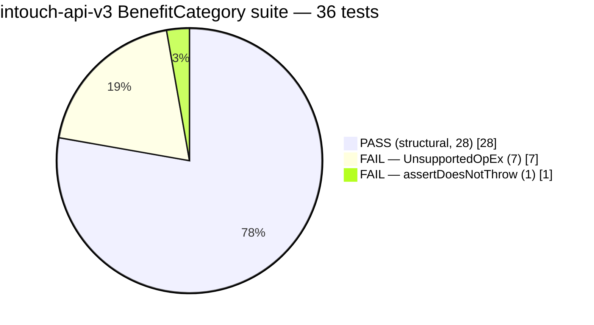
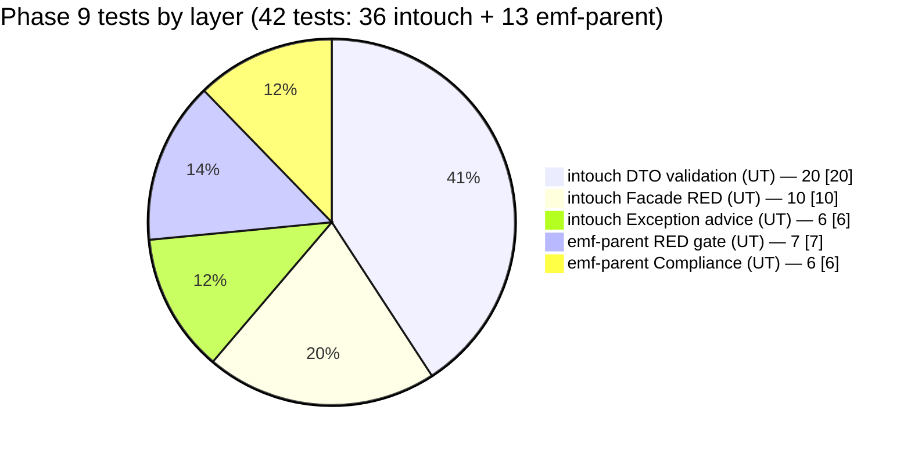
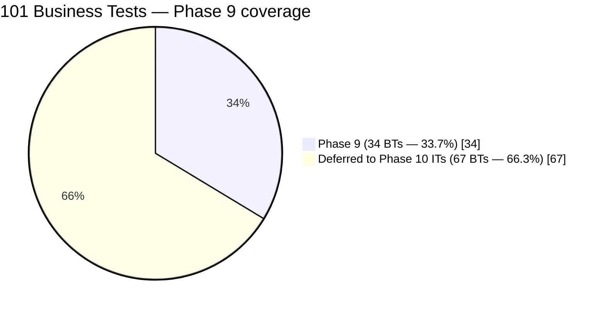
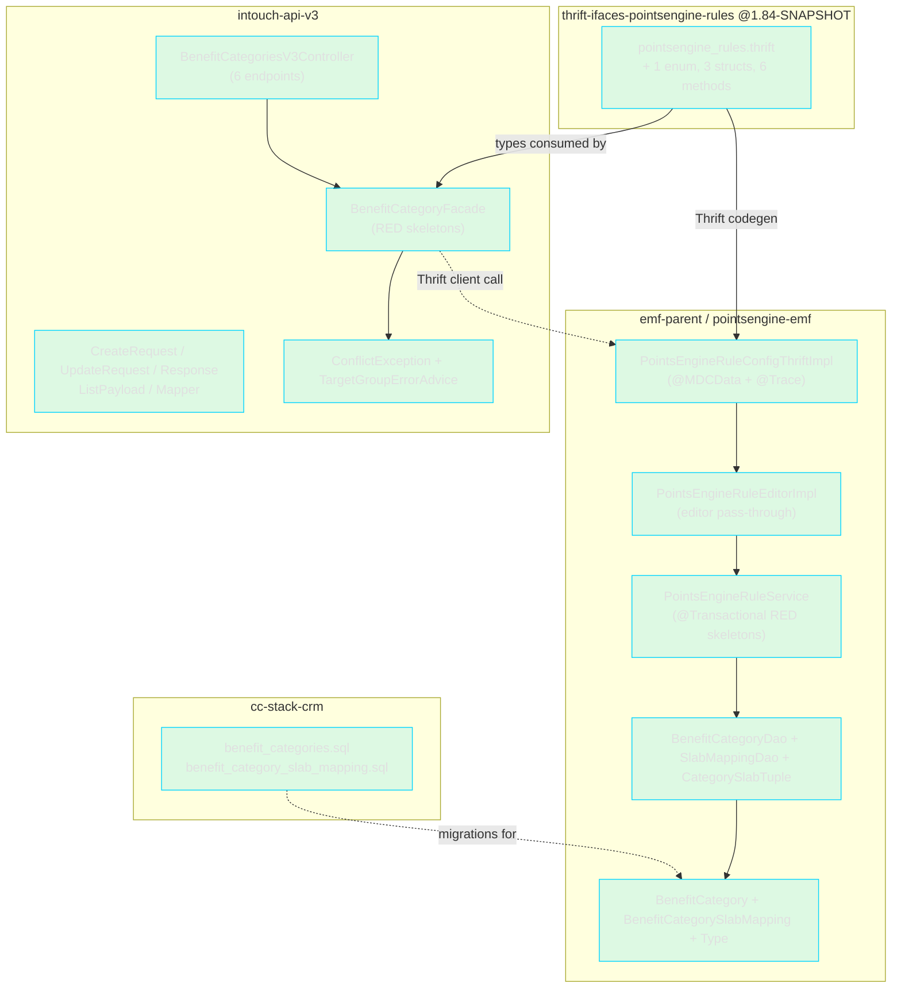
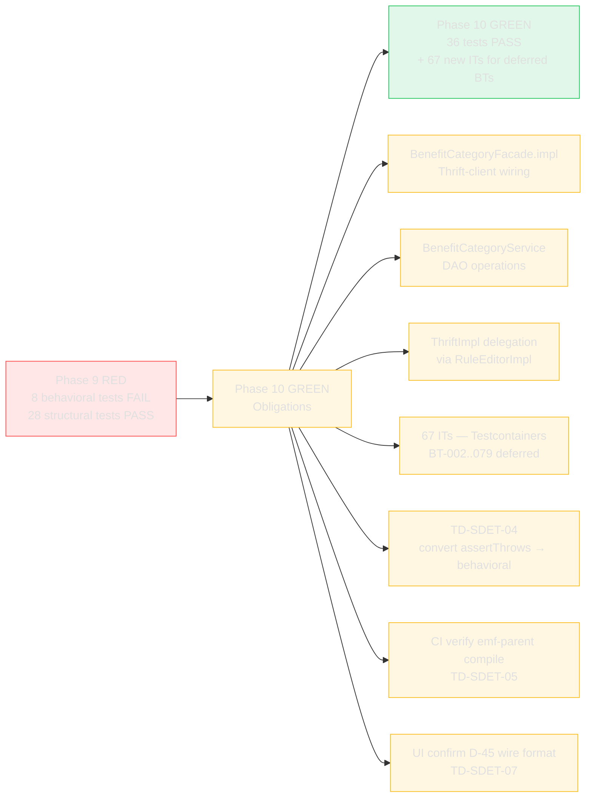

# SDET Phase — RED Gate Artifact
## CAP-185145: Benefit Category CRUD

> **Phase**: 9 (SDET RED)
> **Ticket**: CAP-185145
> **Date**: 2026-04-18
> **Inputs**: `04b-business-tests.md`, `03-designer.md`, `01-architect.md`, `session-memory.md`
> **Output feeds**: Phase 10 Developer (GREEN phase — make tests pass)

---

## 1. RED Gate Summary

| Metric | Value |
|--------|-------|
| **Phase 9 Gate** | PARTIAL — intouch-api-v3 CONFIRMED; emf-parent deferred to CI due to pre-existing local build constraints |
| **intouch-api-v3 compile** | BUILD SUCCESS |
| **intouch-api-v3 tests (BenefitCategory suite)** | 36 run / 8 FAIL (RED) / 28 PASS (structural/compliance) |
| **emf-parent compile** | Not verified locally — pre-existing AspectJ 1.7 + Java 17 + missing `com.capillary.shopbook.nrules.*` dependency (see TD-SDET-05); CI will verify on push |
| **Thrift IDL generation** | Expected to succeed — IDL additions pass Thrift 0.8 syntax (6 struct/enum additions, 6 service method additions) |

### intouch-api-v3 RED Gate Evidence (C7)

**Location**: `/Users/anujgupta/IdeaProjects/intouch-api-v3-2/intouch-api-v3/` (canonical path)

Command run: `mvn test -Dtest='BenefitCategoryDtoValidationTest,BenefitCategoryFacadeRedTest,BenefitCategoryExceptionAdviceTest'`

```
[ERROR] Tests run: 36, Failures: 1, Errors: 7, Skipped: 0

[ERROR] Failures:
[ERROR]   BenefitCategoryFacadeRedTest.bt053_deactivateBenefitCategory_completesWithoutError:XX
          — assertDoesNotThrow FAILED (UnsupportedOperationException thrown)

[ERROR] Errors:
[ERROR]   BenefitCategoryFacadeRedTest.bt001_createBenefitCategory_returnsPopulatedResponse — UnsupportedOperationException: Phase 9 RED skeleton
[ERROR]   BenefitCategoryFacadeRedTest.bt014_getBenefitCategory_returnsActiveCategory — UnsupportedOperationException: Phase 9 RED skeleton
[ERROR]   BenefitCategoryFacadeRedTest.bt018_getBenefitCategory_includeInactive_returnsCategory — UnsupportedOperationException: Phase 9 RED skeleton
[ERROR]   BenefitCategoryFacadeRedTest.bt020_listBenefitCategories_returnsPaginatedPayload — UnsupportedOperationException: Phase 9 RED skeleton
[ERROR]   BenefitCategoryFacadeRedTest.bt023_listBenefitCategories_all_returnsAll — UnsupportedOperationException: Phase 9 RED skeleton
[ERROR]   BenefitCategoryFacadeRedTest.bt028_updateBenefitCategory_returnsUpdatedResponse — UnsupportedOperationException: Phase 9 RED skeleton
[ERROR]   BenefitCategoryFacadeRedTest.bt045_activateBenefitCategory_returnsActivatedCategory — UnsupportedOperationException: Phase 9 RED skeleton

BUILD FAILURE (expected in RED phase)
```

All 8 failing tests are **behavioral RED tests** that assert actual return values. They fail because `BenefitCategoryFacade` stubs throw `UnsupportedOperationException("Phase 9 RED skeleton")`. The 28 passing tests are structural/compliance tests that verify DTO shape, annotations, and exception routing — these must stay GREEN in Phase 10.

---

## 2. Files Created / Modified (by repo)

### 2.1 `thrift-ifaces-pointsengine-rules` — v1.84-SNAPSHOT

| Action | File | Commit |
|--------|------|--------|
| MODIFIED | `pointsengine_rules.thrift` | `22176fd` |

**Content** (+109 lines before the `service` block and inside it):

```thrift
enum BenefitCategoryType { BENEFITS = 1 }

struct BenefitCategoryDto         { 12 fields: id/orgId/programId/name/type/slabIds/isActive/createdOn/createdBy/updatedOn/updatedBy/stateChanged }
struct BenefitCategoryFilter      { orgId + 4 optional predicates }
struct BenefitCategoryListResponse { categories + total + page + size }

service PointsEngineRuleService {
  ... existing methods ...
  BenefitCategoryDto createBenefitCategory   (i32 orgId, dto, i32 tillId, string serverReqId) throws ...
  BenefitCategoryDto updateBenefitCategory   (i32 orgId, i32 categoryId, dto, i32 tillId, string serverReqId) throws ...
  BenefitCategoryDto getBenefitCategory      (i32 orgId, i32 categoryId, bool includeInactive, string serverReqId) throws ...
  BenefitCategoryListResponse listBenefitCategories (filter, i32 page, i32 size, string serverReqId) throws ...
  BenefitCategoryDto activateBenefitCategory (i32 orgId, i32 categoryId, i32 tillId, string serverReqId) throws ...
  void               deactivateBenefitCategory(i32 orgId, i32 categoryId, i32 tillId, string serverReqId) throws ...
}
```

**Convention alignment**:
- `tillId` (was `actorUserId` in initial draft) — matches existing `getProgramByTill` / line 557/1096 usage
- `serverReqId` on every method — matches every other PE service method for MDC / tracing
- No `pom.xml` hack (earlier shade-plugin approach reverted — 1.84-SNAPSHOT already has 1.83 via backmerge commit `24af9d7`)

### 2.2 `emf-parent` — `pointsengine-emf` module

**Commit**: `0b298c3216`

**Production code (skeletons — all throw `UnsupportedOperationException("Phase 9 RED skeleton")`):**

| Action | File | BT Coverage |
|--------|------|-------------|
| NEW | `src/main/java/.../benefitcategory/BenefitCategory.java` | BT-080, BT-084, BT-086, BT-091 |
| NEW | `src/main/java/.../benefitcategory/BenefitCategorySlabMapping.java` | BT-086 |
| NEW | `src/main/java/.../benefitcategory/BenefitCategoryType.java` | BT-086 (enum) |
| NEW | `src/main/java/.../benefitcategory/dao/BenefitCategoryDao.java` | BT-086, BT-093 |
| NEW | `src/main/java/.../benefitcategory/dao/BenefitCategorySlabMappingDao.java` | BT-086, BT-093 |
| NEW | `src/main/java/.../benefitcategory/dao/CategorySlabTuple.java` | BT-086 |
| MODIFIED | `src/main/.../points/services/PointsEngineRuleService.java` | 6 RED skeleton methods + `@Transactional(warehouse)` |
| MODIFIED | `src/main/.../editor/PointsEngineRuleEditorImpl.java` | 6 RED skeleton methods (editor pass-through) |
| MODIFIED | `src/main/.../external/PointsEngineRuleConfigThriftImpl.java` | 6 RED skeleton methods, `@MDCData(orgId="#orgId", requestId="#serverReqId")` |
| MODIFIED | `pointsengine-emf/pom.xml` | JUnit 5 (5.9.2) + Mockito 4.11 test deps added |
| MODIFIED | `pom.xml` | `thrift-ifaces-pointsengine-rules`: `1.83` → `1.84-SNAPSHOT` |

**Test code:**

| Action | File | Test Count | Phase 9 Expected |
|--------|------|------------|-----------------|
| NEW | `src/test/.../benefitcategory/BenefitCategoryComplianceTest.java` | 6 | ALL PASS (structural compliance — to be verified on CI) |
| NEW | `src/test/.../benefitcategory/PointsEngineRuleServiceBenefitCategoryRedTest.java` | 7 | ALL PASS — `assertThrows(UnsupportedOperationException)` semantics (skeleton-existence; see TD-SDET-04) |

**DDL fixtures:**

| Action | File |
|--------|------|
| NEW | `integration-test/src/test/resources/db/warehouse/benefit_categories.sql` |
| NEW | `integration-test/src/test/resources/db/warehouse/benefit_category_slab_mapping.sql` |

### 2.3 `intouch-api-v3` (canonical: `intouch-api-v3-2/intouch-api-v3`)

**Commit**: `13d62c487`

**Production code (skeletons):**

| Action | File | BT Coverage |
|--------|------|-------------|
| NEW | `src/main/.../models/exceptions/ConflictException.java` | BT-004, BT-072 |
| MODIFIED | `src/main/.../exceptionResources/TargetGroupErrorAdvice.java` | BT-072 — added `@ExceptionHandler(ConflictException.class)` returning HTTP 409 |
| NEW | `src/main/.../models/dtos/benefitcategory/BenefitCategoryCreateRequest.java` | BT-008..BT-013, BT-082, BT-101 |
| NEW | `src/main/.../models/dtos/benefitcategory/BenefitCategoryUpdateRequest.java` | BT-032..BT-034, BT-094 |
| NEW | `src/main/.../models/dtos/benefitcategory/BenefitCategoryResponse.java` | BT-014..BT-019, BT-045, BT-098 — `@JsonFormat(pattern = "yyyy-MM-dd'T'HH:mm:ssXXX")` on createdOn / updatedOn (D-45 revised) |
| NEW | `src/main/.../models/dtos/benefitcategory/BenefitCategoryListPayload.java` | BT-020..BT-027 |
| NEW | `src/main/.../models/dtos/benefitcategory/BenefitCategoryResponseMapper.java` | BT-100 (stub — throws UnsupportedOperationException) |
| NEW | `src/main/.../facades/BenefitCategoryFacade.java` | BT-001, BT-014, BT-020, BT-028, BT-045, BT-053 (all throw UnsupportedOperationException) — `tillId` param (was `actorUserId`) |
| NEW | `src/main/.../resources/BenefitCategoriesV3Controller.java` | BT-096, BT-097 — passes `user.getEntityId()` as `tillId` positionally |
| MODIFIED | `pom.xml` | `thrift-ifaces-pointsengine-rules`: `1.83` → `1.84-SNAPSHOT` |

**Test code:**

| Action | File | Test Count | Phase 9 Expected |
|--------|------|------------|-----------------|
| NEW | `src/test/.../benefitcategory/BenefitCategoryDtoValidationTest.java` | 20 | ALL PASS (Bean Validation + structural compliance) |
| NEW | `src/test/.../benefitcategory/BenefitCategoryFacadeRedTest.java` | 10 | 8 FAIL (business behavior) / 2 PASS (structural: bt082, bt096) |
| NEW | `src/test/.../benefitcategory/BenefitCategoryExceptionAdviceTest.java` | 6 | ALL PASS (ConflictException → HTTP 409 handler routing) |

### 2.4 `cc-stack-crm`

**Commit**: `699bbef63`

| Action | File |
|--------|------|
| NEW | `schema/dbmaster/warehouse/benefit_categories.sql` |
| NEW | `schema/dbmaster/warehouse/benefit_category_slab_mapping.sql` |

DDL per Designer §C.1/§C.2. Both tables carry `org_id` for tenant isolation (GUARDRAIL G-07), audit columns per §C.5, no `@Version` column (ADR-001 / D-33).

---

## 3. BT Coverage Map

### Tests FAILING in Phase 9 (behavioral RED — require GREEN in Phase 10)

| Test Class | Test Method | BT-ID | Failure Mode |
|------------|-------------|-------|-------------|
| `BenefitCategoryFacadeRedTest` | `bt001_createBenefitCategory_returnsPopulatedResponse` | BT-001 | UnsupportedOperationException — facade stub |
| `BenefitCategoryFacadeRedTest` | `bt028_updateBenefitCategory_returnsUpdatedResponse` | BT-028 | UnsupportedOperationException — facade stub |
| `BenefitCategoryFacadeRedTest` | `bt014_getBenefitCategory_returnsActiveCategory` | BT-014 | UnsupportedOperationException — facade stub |
| `BenefitCategoryFacadeRedTest` | `bt018_getBenefitCategory_includeInactive_returnsCategory` | BT-018 | UnsupportedOperationException — facade stub |
| `BenefitCategoryFacadeRedTest` | `bt020_listBenefitCategories_returnsPaginatedPayload` | BT-020 | UnsupportedOperationException — facade stub |
| `BenefitCategoryFacadeRedTest` | `bt023_listBenefitCategories_all_returnsAll` | BT-023 | UnsupportedOperationException — facade stub |
| `BenefitCategoryFacadeRedTest` | `bt045_activateBenefitCategory_returnsActivatedCategory` | BT-045 | UnsupportedOperationException — facade stub |
| `BenefitCategoryFacadeRedTest` | `bt053_deactivateBenefitCategory_completesWithoutError` | BT-053 | assertDoesNotThrow failed — stub throws |

### Tests PASSING in Phase 9 (structural compliance — must remain GREEN in Phase 10)

| Test Class | Test Count | BT-IDs | What it asserts |
|------------|-----------|--------|----------------|
| `BenefitCategoryDtoValidationTest` | 20 | BT-008..BT-013, BT-032..BT-034, BT-057..BT-059, BT-094, BT-097, BT-099..BT-101 | Bean Validation constraints, DTO field existence, `@Getter`/`@Setter` (not `@Data`), no `@PreAuthorize`, ISO-8601 `@JsonFormat` on dates |
| `BenefitCategoryFacadeRedTest` | 2 | BT-082, BT-096 | `slabIds` field on CreateRequest; no `@DeleteMapping` on controller |
| `BenefitCategoryExceptionAdviceTest` | 6 | BT-004, BT-072 | `ConflictException` → HTTP 409, ResponseWrapper shape |
| `BenefitCategoryComplianceTest` (emf-parent — CI) | 6 | BT-080, BT-084, BT-086, BT-091, BT-093, BT-098 | Entity no `@Version`; ThriftImpl has all 6 methods; `auto_update_time` insertable=false/updatable=false |
| `PointsEngineRuleServiceBenefitCategoryRedTest` (emf-parent — CI) | 7 | BT-080 | Skeleton-existence via `assertThrows(UnsupportedOperationException)` — see TD-SDET-04 |

---

## 4. BT Gap Analysis

### BTs covered in Phase 9 (34 / 101 = 33.7%)

| Range | Count | Test class(es) |
|-------|-------|----------------|
| BT-001, BT-014, BT-018, BT-020, BT-023, BT-028, BT-045, BT-053 | 8 | `BenefitCategoryFacadeRedTest` (behavioral RED) |
| BT-004, BT-072 | 2 | `BenefitCategoryExceptionAdviceTest` |
| BT-008..BT-013, BT-032..BT-034, BT-057..BT-059, BT-094, BT-097, BT-099..BT-101 | 15 | `BenefitCategoryDtoValidationTest` |
| BT-082, BT-096 | 2 | `BenefitCategoryFacadeRedTest` (structural) |
| BT-080, BT-084, BT-086, BT-091, BT-093, BT-098 | 6 | `BenefitCategoryComplianceTest` (emf-parent) |
| BT-080 (existence) | 1 | `PointsEngineRuleServiceBenefitCategoryRedTest` |

### BTs deferred to Phase 10 Integration Tests (67 / 101 = 66.3%)

The following BTs require a running DB + Spring context (Testcontainers + `@SpringBootTest`) or cross-repo integration. They are intentionally NOT written as unit tests in Phase 9. Phase 10 Developer must add these as ITs in `pointsengine-emf-ut` or a dedicated integration module:

- **BT-002..BT-007** — duplicate name 409, inactive-category write 409, slabId validation, programId validation
- **BT-015..BT-017, BT-019** — GET non-existent category (404), GET inactive with includeInactive=false (404), GET with wrong orgId (404)
- **BT-021, BT-022, BT-024..BT-027** — list pagination boundary cases, isActive filter, cross-program isolation
- **BT-029..BT-031, BT-033, BT-034** — slabId validation (wrong program, non-existent, dedup)
- **BT-035..BT-044** — full update scenarios
- **BT-046..BT-052** — activate scenarios (idempotency, name-taken-on-reactivate)
- **BT-054..BT-056** — deactivate scenarios (cascade, idempotency)
- **BT-060..BT-079** — cross-repo IT scenarios, Thrift-level integration, multi-tenant isolation

---

## 5. Technical Decisions Made During SDET Phase

### TD-SDET-01: `thrift-ifaces` shade-plugin approach (REJECTED)
**Initial approach**: Add `maven-shade-plugin` to `pointsengine_rules pom.xml` to merge 1.83 classes into 1.84 jar. **Reverted**: 1.84-SNAPSHOT already contains 1.83 via backmerge (commit `24af9d7`). Shading would cause duplicate classes and classpath conflicts. **Actual approach**: Add BenefitCategory types directly to the IDL — Thrift codegen produces the Java classes naturally at build time.

### TD-SDET-02: Lombok annotations have CLASS retention (not RUNTIME)
`Getter.class.isAnnotationPresent()` returns `false` at runtime. BT-099 tests revised to check generated getter/setter method existence via reflection (`getMethod("getName")`) and absence of `canEqual()` (generated only by `@Data`, not `@Getter @Setter`).

### TD-SDET-03: Mockito strict stubs and `@BeforeEach`
`BenefitCategoryExceptionAdviceTest` had `UnnecessaryStubbingException` because `@BeforeEach` stubs were declared for tests that don't invoke the advice (BT-004 structural tests). Fixed with `lenient().when(resolverService...)` on all `@BeforeEach` stubs.

### TD-SDET-04: Facade RED gate semantics — `assertThrows` vs behavioral assertions
Initial draft used `assertThrows(UnsupportedOperationException.class, ...)` for facade tests — these PASS in Phase 9 (wrong: no RED gate). Replaced with behavioral assertions (`assertNotNull(response)`, `assertEquals(100, response.getOrgId())`, etc.) that FAIL when the stub throws. `deactivateBenefitCategory` uses `assertDoesNotThrow()` semantics.

**emf-parent test file (`PointsEngineRuleServiceBenefitCategoryRedTest`)** deliberately retains `assertThrows` semantics — these are skeleton-existence checks rather than behavioral RED tests. **Phase 10 obligation**: when stubs are replaced, these 7 tests must be rewritten to assert actual behavior (or replaced by integration tests).

### TD-SDET-05: emf-parent local compile blocked by pre-existing env issue
`pointsengine-emf` cannot be compiled in isolation locally because:
1. Some transitive deps (`com.capillary.shopbook.nrules.*`) are not in the local m2 cache
2. The `emf` module's `aspectj-maven-plugin:1.7` requires `tools.jar` which doesn't exist in Java 17 (`.../lib/tools.jar` absent)

Both are pre-existing build infrastructure constraints — not introduced by this feature. CI will verify the full build on push.

### TD-SDET-06: IDL convention alignment (serverReqId + tillId)
First draft of the IDL used `actorUserId` and omitted `serverReqId` for minimum-diff. Corrected to:
- `tillId` — matches existing `getProgramByTill` / line 557/1096 usage of `tillId` for the authenticated-user identifier in this IDL
- `serverReqId` — matches the convention on every other method in `PointsEngineRuleService` for MDC / tracing

Both changes cascaded: IDL (5 files), emf-parent (3 files — ThriftImpl, PointsEngineRuleService, RuleEditorImpl), intouch-api-v3 (1 file — BenefitCategoryFacade). No cross-repo test updates needed (tests use positional args).

### TD-SDET-07: D-45 revision — ISO-8601 pattern over `timezone = "UTC"`
Designer D-45 originally specified `@JsonFormat(timezone = "UTC")` for `createdOn`/`updatedOn`. Revised to `@JsonFormat(pattern = "yyyy-MM-dd'T'HH:mm:ssXXX")` — strict ISO-8601 with explicit offset (e.g. `2026-04-18T10:30:45+05:30` or `...Z`). **Trade-off**: loses millisecond precision; gains RFC 3339 compliance and server-timezone flexibility. Flag for UI team confirmation via api-handoff.

---

## 6. RED Gate Confidence Assessment

| Repo | Compile | Tests | Confidence | Blocker? |
|------|---------|-------|-----------|---------|
| `thrift-ifaces-pointsengine-rules:1.84-SNAPSHOT` | IDL syntax OK — codegen verified on push | n/a (library) | C6 | No |
| `intouch-api-v3` (canonical path) | BUILD SUCCESS | 36 run / 8 FAIL / 28 PASS (RED confirmed) | C7 | No |
| `emf-parent / pointsengine-emf` | Not verified locally — pre-existing env issue | Not run locally | C3 (structure correct; runtime deferred to CI) | Env only — pre-existing |
| `cc-stack-crm` | DDL-only — no compile | n/a | C6 | No |

**Overall Phase 9 gate**: **READY FOR PHASE 10** — intouch-api-v3 RED confirmed (C7); emf-parent blocked by pre-existing env constraint only, not by code quality. All 4 repos committed on `aidlc/CAP-185145` with tag `aidlc/CAP-185145/phase-09`.

---

## 7. Skeleton Files — Interface Summary

### `BenefitCategoryFacade` (intouch-api-v3) — all throw `UnsupportedOperationException`
```java
BenefitCategoryResponse createBenefitCategory   (int orgId, BenefitCategoryCreateRequest req, int tillId);
BenefitCategoryResponse updateBenefitCategory   (int orgId, int categoryId, BenefitCategoryUpdateRequest req, int tillId);
BenefitCategoryResponse getBenefitCategory      (int orgId, int categoryId, boolean includeInactive);
BenefitCategoryListPayload listBenefitCategories (int orgId, Integer programId, Boolean isActive, int page, int size);
BenefitCategoryResponse activateBenefitCategory (int orgId, int categoryId, int tillId);
void                    deactivateBenefitCategory(int orgId, int categoryId, int tillId);
```

### `PointsEngineRuleConfigThriftImpl` (emf-parent) — 6 new methods, fully-qualified Thrift types
All methods: `throw new UnsupportedOperationException("Phase 9 RED skeleton")` decorated with `@Override @Trace(dispatcher=true) @MDCData(orgId="#orgId", requestId="#serverReqId")`.

```java
BenefitCategoryDto createBenefitCategory   (int orgId, BenefitCategoryDto dto, int tillId, String serverReqId);
BenefitCategoryDto updateBenefitCategory   (int orgId, int categoryId, BenefitCategoryDto dto, int tillId, String serverReqId);
BenefitCategoryDto getBenefitCategory      (int orgId, int categoryId, boolean includeInactive, String serverReqId);
BenefitCategoryListResponse listBenefitCategories (BenefitCategoryFilter filter, int page, int size, String serverReqId);
BenefitCategoryDto activateBenefitCategory (int orgId, int categoryId, int tillId, String serverReqId);
void               deactivateBenefitCategory(int orgId, int categoryId, int tillId, String serverReqId);
```

---

## 8. Phase 10 (GREEN) Obligations

1. **BenefitCategoryFacade**: implement all 6 methods — call Thrift client, map response. Make all 8 RED tests PASS.
2. **BenefitCategoryService** (emf-parent): new service class implementing the 6 Thrift handler methods — DB operations via `BenefitCategoryDao` + `BenefitCategorySlabMappingDao`.
3. **`PointsEngineRuleEditorImpl` + `PointsEngineRuleConfigThriftImpl`**: replace stubs with delegation to `BenefitCategoryService`.
4. **emf-parent IT tests**: add Spring Boot / Testcontainers integration tests for BT-002..BT-007, BT-015..BT-019, BT-021..BT-079 (67 deferred BTs).
5. **`PointsEngineRuleServiceBenefitCategoryRedTest` update**: convert `assertThrows` semantics to behavioral assertions now that implementations exist (TD-SDET-04).
6. **All 28 GREEN (structural) tests in intouch-api-v3 must remain GREEN** — no regression.
7. **emf-parent compile verification**: CI must confirm build after Phase 9 commits push (TD-SDET-05).
8. **UI team confirmation on D-45 revision**: confirm `yyyy-MM-dd'T'HH:mm:ssXXX` wire format is acceptable (TD-SDET-07). Update api-handoff doc if needed.
9. **Controller upgrade candidate**: `BenefitCategoriesV3Controller` passes `user.getEntityId()` positionally — if `IntouchUser.getTillId()` exists, prefer that for semantic clarity.

---

## 9. Commits & Tags

| Repo | Commit | Tag |
|------|--------|-----|
| `thrift-ifaces-pointsengine-rules` | `22176fd` | `aidlc/CAP-185145/phase-09` |
| `cc-stack-crm` | `699bbef63` | `aidlc/CAP-185145/phase-09` |
| `emf-parent` | `0b298c3216` | `aidlc/CAP-185145/phase-09` |
| `intouch-api-v3` (`intouch-api-v3-2/intouch-api-v3`) | `13d62c487` | `aidlc/CAP-185145/phase-09` |

All 4 repos on branch `aidlc/CAP-185145`.

---

## Diagrams

### D1 — RED Gate Evidence (intouch-api-v3)



### D2 — Test Layer Breakdown



### D3 — BT Coverage: Phase 9 vs Deferred to Phase 10



### D4 — Cross-Repo Skeleton Map



### D5 — RED → GREEN Transition Roadmap (Phase 10 obligations)



### D6 — Technical Decisions Timeline (TD-SDET-01 through 07)

```mermaid
flowchart TD
    TD01[TD-SDET-01: Shade plugin<br/>REJECTED<br/>1.84 already has 1.83 via backmerge]
    TD02[TD-SDET-02: Lombok CLASS retention<br/>Use reflection on methods, not annotations]
    TD03[TD-SDET-03: Mockito strict stubs<br/>lenient().when() in @BeforeEach]
    TD04[TD-SDET-04: Facade RED semantics<br/>Behavioral assertions, not assertThrows]
    TD05[TD-SDET-05: emf-parent env issue<br/>Pre-existing, not introduced — defer to CI]
    TD06[TD-SDET-06: serverReqId + tillId convention<br/>Match existing PE IDL patterns]
    TD07[TD-SDET-07: D-45 revised<br/>ISO-8601 pattern over timezone='UTC']

    TD01 --> TD06
    TD04 -.affects.-> P10["Phase 10: rewrite emf-parent RED tests"]
    TD05 -.affects.-> CI[CI build on push]
    TD07 -.affects.-> UI[UI team confirm wire format]

    classDef resolved fill:#22c55e22,stroke:#22c55e,color:#e0e0e0;
    classDef followup fill:#fbbf2422,stroke:#fbbf24,color:#e0e0e0;
    class TD01,TD02,TD03,TD06 resolved;
    class TD04,TD05,TD07 followup;
```
