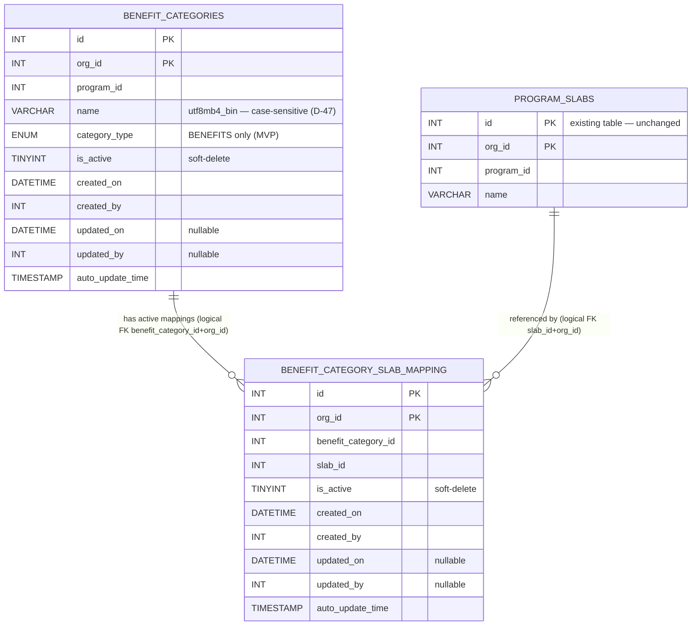
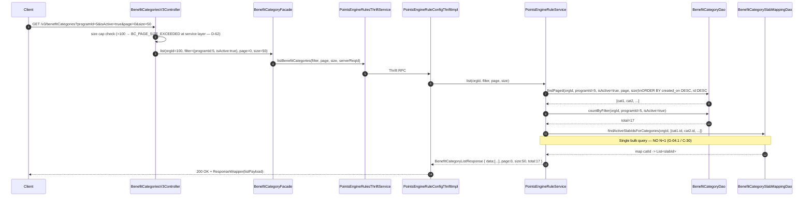
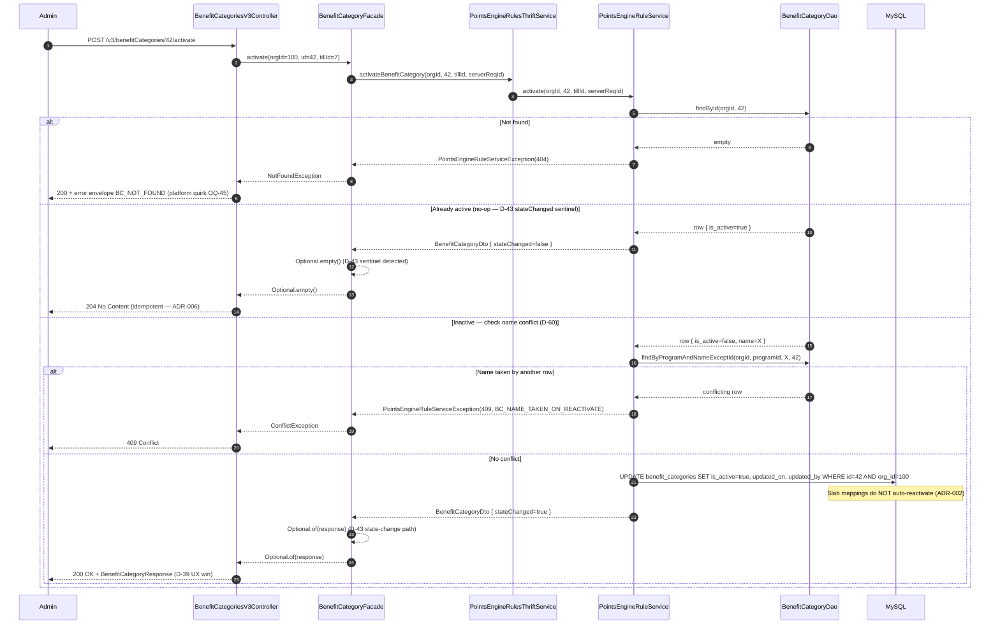
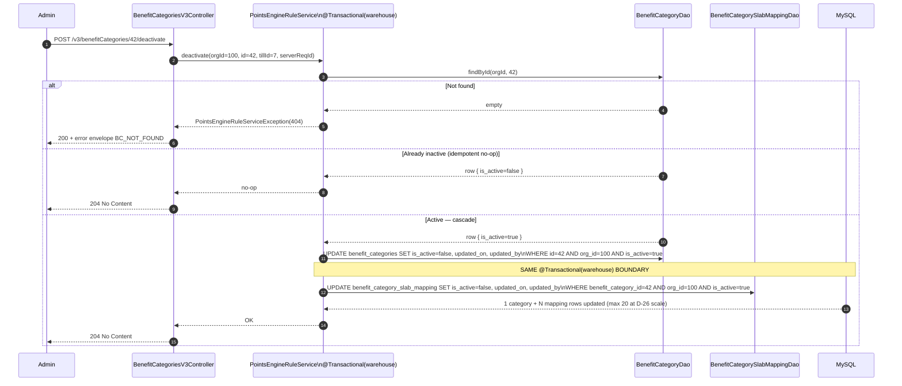

# HLD — Benefit Category CRUD (CAP-185145)

> **Ticket**: CAP-185145
> **Feature**: Benefit Category CRUD (Garuda Loyalty Platform — Tiers & Benefits v3)
> **Pipeline date**: 2026-04-18 → 2026-04-19
> **Architect phase verdict**: APPROVED WITH WARNINGS
> **Source of truth**: `01-architect.md` (Phase 6), `session-memory.md` (D-01..D-63, ADR-001..013)

---

## 1. Executive Summary

Benefit Category CRUD introduces a **config-only, Program-scoped metadata service** that allows loyalty platform admins to define benefit groupings and link them to tier slabs (tiers). The feature creates two net-new MySQL tables — `benefit_categories` and `benefit_category_slab_mapping` — owned by `emf-parent`, exposed as CRUD over Thrift via the existing `PointsEngineRuleService`, and fronted by `intouch-api-v3` as a thin REST facade.

The solution follows the established Capillary 4-layer pattern: `REST Controller → Facade → Thrift Client → EMF Thrift Handler → Editor → Service (@Transactional) → DAO`. Six REST endpoints are exposed under `/v3/benefitCategories`. The new `BenefitCategory` entity coexists strictly with the legacy `Benefits` entity — no foreign keys, no shared tables, no migration of legacy data (D-12 / C-14).

Thirteen ADRs govern the design. Four are frozen user decisions (ADR-001..004) that define the concurrency posture (last-write-wins), reactivation verb, slab-mapping granularity, and deactivation cascade. The remaining nine fill in deployment sequencing, authorization, pagination, error contract, and timestamp representation.

The overall verdict is **APPROVED WITH WARNINGS**: the intouch-api-v3 boundary is GREEN (76/76 tests), emf-parent behavioural correctness is C6 (41 tests GREEN; 10 Testcontainers ITs compile-verified, runtime deferred to user). Seven manual items remain outstanding (B1, B2, B3, F-02, F-04, R-01, R-02) with four accepted deviations from guardrails (D-24, D-61, D-62, D-63).

---

## 2. Goals and Non-Goals

### 2.1 In Scope

| Area | Detail |
|------|--------|
| Category CRUD | Create, Read (GET by id + paginated list), Update, Soft-deactivate (is_active=false via dedicated PATCH verb) |
| Reactivation | Dedicated `PATCH /activate` endpoint that restores a soft-deleted category; slab mappings do NOT auto-reactivate (ADR-002) |
| Slab applicability | `slabIds: List<Integer>` embedded in the category DTO; server-side diff-and-apply on every Create/Update (ADR-003) |
| Cascade deactivation | Deactivating a category cascades to all active slab mappings in the same transaction (ADR-004 / C-16) |
| Name uniqueness | Per `(orgId, programId)`, across all rows regardless of `is_active` state; case-sensitive byte-comparison (D-60 + D-47) |
| Tenant isolation | `org_id` filter on every DAO query; `orgId` extracted from caller token and propagated explicitly (G-07, ADR-010) |
| Audit fields | `created_on`, `created_by`, `updated_on`, `updated_by`, `auto_update_time` on both new tables (D-23 / D-30) |
| API layer | REST via intouch-api-v3 gateway; Thrift RPC to emf-parent |

### 2.2 Out of Scope (Explicit Non-Goals)

| Area | Rationale |
|------|-----------|
| 9 distinct category types (WELCOME_GIFT, EARN_POINTS, …) | D-06 — single `BENEFITS` enum value in MVP; multi-type is a future ticket |
| `triggerEvent` field and derivation logic | D-07 — not modelled |
| Per-type value schemas / value fields on instances | D-09 — categories carry no reward payload |
| Benefit awarding / application logic | D-08 — handled by an external reader system |
| Maker-checker approval workflow | D-05 — descoped; all mutations are immediate |
| Hard-delete endpoint | D-13 — soft-delete only; no `DELETE` HTTP verb exposed (C-15) |
| aiRa natural-language mapping | D-03 — explicitly out of scope |
| Matrix View dashboard | D-03 — explicitly out of scope |
| Subscription benefit picker | D-03 — explicitly out of scope |
| Schema changes to legacy `Benefits` table | C-14 — strict coexistence; no FK, no coupling |
| Optimistic locking / `@Version` | ADR-001 — accepted last-write-wins at D-26 SMALL scale |
| DB-level UNIQUE constraint or advisory lock on name | ADR-012 / D-38 — app-level check only; race accepted at D-26 scale |
| Caching | OQ-30 / D-26 — deferred post-GA; read QPS < 10 |

---

## 3. System Context

```mermaid
flowchart LR
    Client[External Capillary Client\nHTTP + Basic/Key/OAuth]

    subgraph IntouchApiV3["intouch-api-v3 (Spring MVC)"]
        Auth[AuthN Filter\nIntouchUser.orgId extracted]
        REST[BenefitCategoriesV3Controller\n@RestController /v3/benefitCategories]
        Facade[BenefitCategoryFacade]
        Mapper[BenefitCategoryResponseMapper]
        ThriftClient[PointsEngineRulesThriftService\nRPCService.rpcClient host=emf-thrift-service\nport=9199 timeout=60s]
        Advice[TargetGroupErrorAdvice\n+ConflictException->409]
    end

    subgraph EmfParent["emf-parent (Spring + Thrift, Java 8)"]
        Handler[PointsEngineRuleConfigThriftImpl\n@ExposedCall pointsengine-rules\n@Trace @MDCData orgId tillId serverReqId]
        Aspect[ExposedCallAspect\nShardContext.set orgId]
        Editor[PointsEngineRuleEditorImpl]
        Service[PointsEngineRuleService\n@Transactional warehouse]
        CatDao[BenefitCategoryDao]
        MapDao[BenefitCategorySlabMappingDao]
        SlabDao[PeProgramSlabDao]
    end

    subgraph Data["cc-stack-crm schema / MySQL warehouse"]
        T1[(benefit_categories)]
        T2[(benefit_category_slab_mapping)]
        T3[(program_slabs)]
    end

    ThriftIDL[(thrift-ifaces-pointsengine-rules\npointsengine_rules.thrift v1.84)]

    Client -->|HTTPS /v3/benefitCategories| Auth
    Auth --> REST
    REST --> Facade
    Facade --> Mapper
    Facade --> ThriftClient
    ThriftClient -->|Thrift binary over 9199| Handler
    Handler --> Aspect
    Aspect --> Editor
    Editor --> Service
    Service --> CatDao
    Service --> MapDao
    Service --> SlabDao
    CatDao --> T1
    MapDao --> T2
    SlabDao --> T3
    Advice -.-> REST
    ThriftIDL -.IDL dep.-> Handler
    ThriftIDL -.IDL dep.-> ThriftClient
```

**Layer descriptions:**

- **intouch-api-v3**: Spring MVC REST gateway. `BenefitCategoriesV3Controller` extracts `orgId` from the authenticated `IntouchUser`, runs Bean Validation (`@Valid`), delegates to `BenefitCategoryFacade`. `TargetGroupErrorAdvice` maps exceptions to HTTP codes (new `ConflictException → 409` added by this feature). `BenefitCategoryResponseMapper` converts Thrift epoch-millis to ISO-8601 UTC strings (ADR-008).

- **Thrift IDL (thrift-ifaces-pointsengine-rules)**: Defines the RPC contract. Version bumped from 1.83 to 1.84-SNAPSHOT with 1 new enum, 3 new structs, and 6 new methods added to the existing `PointsEngineRuleService`. Consumed by both the client side (intouch-api-v3) and the server side (emf-parent).

- **emf-parent**: The authoritative backend. `PointsEngineRuleConfigThriftImpl` handles the 6 new Thrift methods (ADR-005), delegates via `PointsEngineRuleEditorImpl` to `PointsEngineRuleService`. The service owns the `@Transactional(warehouse)` boundary, all cascade logic, name-uniqueness checks, and slab-existence validation.

- **cc-stack-crm / MySQL**: Two new DDL files define `benefit_categories` and `benefit_category_slab_mapping`. No FK declarations at DB level (platform convention, G-12.2). Production DDL apply mechanism is TBD in Phase 12 deployment runbook (R-09 / Q-CRM-1).

---

## 4. Key Architectural Decisions (ADRs)

All ADRs are defined in full in `01-architect.md`. The table below summarises each decision.

| ADR ID | Decision | Rationale | Alternatives Considered |
|--------|----------|-----------|------------------------|
| **ADR-001** | No optimistic locking on `BenefitCategory` (last-write-wins). No `@Version` column, no `version` DTO field, no `If-Match` header. | At D-26 SMALL scale (≤50 cats/prog, <1 QPS writes), the race window is vanishingly small and the data is low-harm config-only. Ceremony > probable harm. | JPA `@Version` + 409 on stale version — rejected: adds DTO surface + DDL column + client round-trip for a race that is functionally unreachable at this scale. |
| **ADR-002** | Reactivation via dedicated `PATCH /v3/benefitCategories/{id}/activate`. Does NOT auto-reactivate slab mappings. 409 on name collision. Idempotent already-active → 204. | Preserves `id` for audit trace; mis-deactivations happen; POST-a-new-row is not an acceptable recovery path; clean idempotency contract. | `PUT {isActive:true}` — bends PUT semantics; no dedicated idempotency/conflict contract. |
| **ADR-003** | `slabIds: List<Integer>` embedded in parent DTO; server-side diff-and-apply on every Create/Update. Junction table NOT exposed as a REST sub-resource. | Matches admin mental model (a category has a set of applicable tiers); eliminates cross-resource consistency risk; one transactional boundary per write. | Separate `/benefitCategorySlabMappings` sub-resource — rejected: introduces cross-resource consistency headaches at no UX benefit. |
| **ADR-004** | Deactivation via dedicated `PATCH /v3/benefitCategories/{id}/deactivate`. Cascades to all active slab mappings in the same transaction. 204 always (state-change and idempotent no-op). | Explicit verb; symmetric with ADR-002; single-txn cascade is safe at ≤20 mappings/category (D-26 scale). | `DELETE /{id}` — misleading for soft-delete. `PUT {isActive:false}` — bends PUT; asymmetric with ADR-002. |
| **ADR-005** | New Thrift handler methods added to existing `PointsEngineRuleConfigThriftImpl`. No new handler class. | Class already implements `PointsEngineRuleService.Iface`; new IDL methods must land here regardless; zero new Spring bean or `@ExposedCall` registration. | New `BenefitCategoryThriftImpl` handler class — rejected: unnecessary complexity; class count grows for no structural benefit. |
| **ADR-006** (amended by D-39) | **Asymmetric** response codes: `PATCH /activate` on state-change → 200 OK + DTO; `PATCH /activate` on already-active → 204; `PATCH /deactivate` always → 204. | Activation typically precedes further edits — returning DTO avoids a mandatory GET round-trip (D-39 UX win). Deactivation is typically terminal — no meaningful post-state to show. | Symmetric 204 on both — original default; rejected by user in D-39 because UX benefits from DTO on activate. |
| **ADR-007** | Data model: composite PK `(id, org_id)`, `DATETIME` audit columns, `TINYINT(1)` for `is_active`, no `version` column, no DB UNIQUE on name, no declared FK. `auto_update_time TIMESTAMP` DB-managed safety net. | Matches `Benefits.java`, `ProgramSlab.java` platform exemplars (G-12.2). No FK declarations is platform convention (G-12.2). | DB UNIQUE constraint on `(org_id, program_id, name)` — rejected; uniqueness is among active rows only, partial unique index requires Aurora ≥ 8.0.13 (D-40, deferred). |
| **ADR-008** | Three-boundary timestamp pattern: `java.util.Date` + `DATETIME` in EMF entity; `i64` epoch millis in Thrift IDL; ISO-8601 UTC string via `@JsonFormat` in REST DTO. | G-01 compliance at external REST contract; G-12.2 compliance internally (matches platform `Date` + `DATETIME` pattern). Explicit UTC TimeZone in `Date ↔ i64` conversions. Accepted deviation: G-01 violated internally in favour of G-12.2 parity. | `java.time.Instant` throughout — rejected: `emf-parent` runs on Java 8 with Spring Data 1.x / SLF4J 1.6.4; platform exemplars use `java.util.Date`. |
| **ADR-009** | New `ConflictException` class in intouch-api-v3; `@ExceptionHandler(ConflictException.class) → HTTP 409` added to `TargetGroupErrorAdvice`. Specific error codes per path (`BC_NAME_TAKEN_ACTIVE`, `BC_INACTIVE_WRITE_FORBIDDEN`, `BC_UNKNOWN_SLAB`, etc.). | `TargetGroupErrorAdvice` had no 409 handler (RF-2). Thrift carries `statusCode` on `PointsEngineRuleServiceException`; facade maps to typed exceptions. | Generic error string — rejected: insufficient for API consumers to distinguish conflict types. |
| **ADR-010** (confirmed by D-37) | GETs accept `KeyOnly` or `BasicAndKey` auth. Writes require `BasicAndKey`. No `@PreAuthorize('ADMIN_USER')` gate in MVP. Tenant isolation via explicit `orgId` arg on every DAO method. | Matches platform convention for `TargetGroupController`, `UnifiedPromotionController`. Admin-only gate is a deferred concern (separate epic). | `@PreAuthorize('ADMIN_USER')` on write endpoints — deferred; one-line addition if ever needed. |
| **ADR-011** | Offset pagination: `?programId=&isActive=&page=0&size=50`; max size 100; default sort `ORDER BY created_on DESC, id DESC`. `BC_PAGE_SIZE_EXCEEDED` (HTTP 400) on `size > 100`. Size cap enforced at service layer (D-62). | G-04.2 mandates bounded list endpoints. At ≤50 categories per program, offset pagination is safe. | Cursor pagination — rejected: unnecessary complexity at D-26 envelope. |
| **ADR-012** (amended by D-38) | App-level uniqueness check only (`SELECT` before INSERT/UPDATE). No advisory lock. No partial unique index in MVP. Race accepted at D-26 scale. Revisit triggers documented. | D-26 admin-write QPS < 1/s → collision probability vanishingly small. Advisory lock adds MySQL-level complexity and a new failure mode for a race that is unlikely to materialise (D-38 user decision). | `GET_LOCK` advisory lock — rejected by D-38. Partial unique index — deferred (requires Aurora ≥ 8.0.13; D-40). |
| **ADR-013** | Strict deployment order: (1) cc-stack-crm DDL, (2) thrift-ifaces v1.84, (3) emf-parent, (4) intouch-api-v3. Wrong order causes `TApplicationException: unknown method` (RF-1). | Standard Capillary dependency chain: schema first, then IDL, then server, then client. All additions — zero breaking changes (G-09.5 compliant). | Feature flag — not required; all endpoints purely additive; worst case is endpoint errors, not regressions. |

---

## 5. Data Model

### 5.1 `benefit_categories`

| Column | Type | Null | Default | Notes |
|--------|------|------|---------|-------|
| `id` | `INT(11)` | NO | AUTO_INCREMENT | Part of composite PK `(id, org_id)` |
| `org_id` | `INT(11)` | NO | 0 | Composite PK; tenant isolation (G-07) |
| `program_id` | `INT(11)` | NO | — | Logical FK → `program_slabs.program_id`; indexed |
| `name` | `VARCHAR(255)` | NO | — | App-level uniqueness across ALL states within `(org_id, program_id)` (D-60); case-sensitive byte-comparison (D-47) |
| `category_type` | `ENUM('BENEFITS')` | NO | `'BENEFITS'` | Single MVP value; column retained for forward extensibility (D-06/D-10) |
| `is_active` | `TINYINT(1)` | NO | 1 | Soft-delete flag |
| `created_on` | `DATETIME` | NO | — | App-set UTC (D-24 / ADR-008) |
| `created_by` | `INT(11)` | NO | — | Actor user id (`tillId` in Thrift — D-49) |
| `updated_on` | `DATETIME` | YES | NULL | App-set UTC; null until first update |
| `updated_by` | `INT(11)` | YES | NULL | Actor user id on last update |
| `auto_update_time` | `TIMESTAMP` | NO | `CURRENT_TIMESTAMP ON UPDATE CURRENT_TIMESTAMP` | DB-managed safety net |

**Indexes**: `PRIMARY KEY (id, org_id)`; `KEY idx_bc_org_program (org_id, program_id)`; `KEY idx_bc_org_program_active (org_id, program_id, is_active)` (supports uniqueness check + list filtering).

**Manual item B1**: `idx_bc_org_program_name` index not yet added to production DDL — pending user action.

**Collation**: `name` column carries `CHARACTER SET utf8mb4 COLLATE utf8mb4_bin` to enforce case-sensitive byte-comparison as required by D-47. MySQL 5.7 default `utf8mb4_unicode_ci` would collapse "Gold Tier" and "gold tier" as equal — the explicit collation prevents this.

**Explicit omissions**: NO `version` column (ADR-001); NO DB UNIQUE on `(org_id, program_id, name)` (ADR-012); NO declared FK (platform convention, G-12.2); NO `trigger_event` column (D-07).

### 5.2 `benefit_category_slab_mapping`

| Column | Type | Null | Default | Notes |
|--------|------|------|---------|-------|
| `id` | `INT(11)` | NO | AUTO_INCREMENT | Composite PK `(id, org_id)` |
| `org_id` | `INT(11)` | NO | 0 | Composite PK; tenant isolation |
| `benefit_category_id` | `INT(11)` | NO | — | Logical FK → `benefit_categories.id` |
| `slab_id` | `INT(11)` | NO | — | Logical FK → `program_slabs.id` |
| `is_active` | `TINYINT(1)` | NO | 1 | Soft-delete flag |
| `created_on` | `DATETIME` | NO | — | App-set UTC |
| `created_by` | `INT(11)` | NO | — | Actor user id |
| `updated_on` | `DATETIME` | YES | NULL | App-set UTC |
| `updated_by` | `INT(11)` | YES | NULL | Actor user id |
| `auto_update_time` | `TIMESTAMP` | NO | `CURRENT_TIMESTAMP ON UPDATE CURRENT_TIMESTAMP` | DB-managed safety net |

**Indexes**: `PRIMARY KEY (id, org_id)`; `KEY idx_bcsm_org_cat_active (org_id, benefit_category_id, is_active)` (cascade lookup + current-mappings read); `KEY idx_bcsm_org_slab_active (org_id, slab_id, is_active)` (consumer query "which categories apply to slab X" — D-21).

**Re-add semantics**: re-adding a previously removed `slabId` INSERTs a NEW mapping row; old deactivated rows remain as audit history. Only the newest `is_active=true` row per `(benefit_category_id, slab_id, org_id)` is authoritative.

### 5.3 ER Diagram



---

## 6. API Design

Base path: `/v3/benefitCategories`. All responses wrapped in `ResponseWrapper<T>{data, errors, warnings}` (platform envelope, G-06.3). Refer to `api-handoff.md` for full request/response schemas, error body shapes, and auth headers.

| # | Method | Path | Purpose | Success Status |
|---|--------|------|---------|----------------|
| 1 | POST | `/v3/benefitCategories` | Create a new benefit category with name + slab applicability | 201 Created + `BenefitCategoryResponse` |
| 2 | PUT | `/v3/benefitCategories/{id}` | Update name and/or full slab set (diff-and-apply) | 200 OK + `BenefitCategoryResponse` |
| 3 | GET | `/v3/benefitCategories/{id}` | Get a single category by id; `?includeInactive=true` for audit access (D-42) | 200 OK + `BenefitCategoryResponse` |
| 4 | GET | `/v3/benefitCategories` | Paginated list: `?programId=&isActive=&page=0&size=50` | 200 OK + `BenefitCategoryListPayload{data, page, size, total}` |
| 5 | POST¹ | `/v3/benefitCategories/{id}/activate` | Reactivate a soft-deleted category; 200+DTO on state change, 204 on already-active (D-39) | 200 OK + DTO **or** 204 No Content |
| 6 | POST¹ | `/v3/benefitCategories/{id}/deactivate` | Soft-delete category + cascade mappings (ADR-004) | 204 No Content |

> ¹ **D-61 accepted deviation**: controller uses `@PostMapping` (not `@PatchMapping`) for `/activate` and `/deactivate`. ADR-002 and ADR-004 specify PATCH semantics in the design; actual code uses POST. REST clients calling PATCH will receive HTTP 405. This is accepted because the Thrift path is the production consumer. Revisit trigger: any REST client beyond aiRa requires PATCH semantics.

**Error codes summary** (ADR-009):

| Code | HTTP | When |
|------|------|------|
| `BC_NAME_TAKEN_ACTIVE` | 409 | Active-duplicate name on create/update |
| `BC_NAME_TAKEN_ON_REACTIVATE` | 409 | Another row holds the same name on activate |
| `BC_INACTIVE_WRITE_FORBIDDEN` | 409 | PUT on a soft-deleted category |
| `BC_UNKNOWN_SLAB` | 400¹ | `slabId` does not exist in `program_slabs` for this org/program |
| `BC_CROSS_PROGRAM_SLAB` | 400¹ | `slabId` belongs to a different program |
| `BC_PAGE_SIZE_EXCEEDED` | 400 | `?size > 100` on list (enforced at service layer — D-62) |
| `BC_NOT_FOUND` | 200+error body | Category id not found — platform quirk (OQ-45) |
| `VALIDATION_FAILED` | 200+error body | Spring MVC type coercion failure (e.g. `?isActive=foo`) — D-48 |

> ¹ **D-63 accepted deviation**: slab ownership mismatch throws `setStatusCode(400)`, not 409 as originally specified in ADR-009. Rationale: slab mismatch is a client-input validation error — 400 is semantically correct.

---

## 7. Key Flows (Sequence Diagrams)

### 7.1 Create Flow (`POST /v3/benefitCategories`)

```mermaid
sequenceDiagram
    autonumber
    participant Client
    participant Ctrl as BenefitCategoriesV3Controller
    participant Fac as BenefitCategoryFacade
    participant TS as PointsEngineRulesThriftService
    participant Hdl as PointsEngineRuleConfigThriftImpl
    participant Svc as PointsEngineRuleService\n@Transactional(warehouse)
    participant CatDao as BenefitCategoryDao
    participant MapDao as BenefitCategorySlabMappingDao
    participant SlabDao as PeProgramSlabDao

    Client->>Ctrl: POST /v3/benefitCategories { programId, name, slabIds:[1,2,3] }
    Ctrl->>Ctrl: Bean Validation (@NotBlank name, @NotNull @Size(min=1) slabIds)
    Ctrl->>Ctrl: Extract orgId from IntouchUser (user.getEntityId() as tillId — D-49)
    Ctrl->>Fac: create(orgId, programId, name, slabIds, tillId)
    Fac->>TS: createBenefitCategory(orgId, dto, tillId, serverReqId)
    TS->>Hdl: Thrift RPC over port 9199
    Hdl->>Svc: createBenefitCategory(orgId, dto, tillId, serverReqId)
    Svc->>CatDao: findByProgramAndName(orgId, programId, name)
    Note right of Svc: No advisory lock (D-38 accepted race)\nChecks ALL states — active+inactive (D-60)
    CatDao-->>Svc: empty (no conflict)
    Svc->>SlabDao: findByProgram(orgId, programId) — in-memory Set ops (D-41)
    SlabDao-->>Svc: existing slab set
    Svc->>Svc: missing = candidateSlabIds - existingSet; throw BC_UNKNOWN_SLAB if non-empty
    Svc->>CatDao: INSERT benefit_categories (audit + org + program + name + BENEFITS + is_active=1)
    CatDao-->>Svc: newId=42
    Svc->>MapDao: INSERT benefit_category_slab_mapping for each slabId
    Svc-->>Fac: BenefitCategoryDto { id:42, ... }
    Fac-->>Ctrl: BenefitCategoryResponse (ISO-8601 UTC timestamps via BenefitCategoryResponseMapper)
    Ctrl-->>Client: 201 Created + ResponseWrapper(dto)
```

### 7.2 List Flow with Pagination (`GET /v3/benefitCategories`)



### 7.3 Activate Flow with No-Op Detection (D-39 / D-43)



### 7.4 Deactivate Cascade (ADR-004)



---

## 8. Cross-Repo Impact

Deployment order is strict per ADR-013. Wrong order causes `TApplicationException: unknown method` on all 6 new Thrift methods (RF-1 / CRITICAL).

| # | Repo | New Files | Modified Files | Deployment Order |
|---|------|-----------|----------------|-----------------|
| 1 | **cc-stack-crm** | 2 DDL files (`benefit_categories.sql`, `benefit_category_slab_mapping.sql`) | 0 | **First** — schema must exist before service code deploys |
| 2 | **thrift-ifaces-pointsengine-rules** | 0 | `pointsengine_rules.thrift` (+1 enum, +3 structs, +6 methods); `pom.xml` (1.83 → 1.84) | **Second** — IDL published before either Java repo |
| 3 | **emf-parent** | 6+ Java files (2 entities, 2 DAOs, BenefitCategoryType enum), 2 DDL snapshots, 2 UT suites | `PointsEngineRuleConfigThriftImpl.java` (+6 handler methods); `PointsEngineRuleEditorImpl.java` (+6 delegation methods); `PointsEngineRuleService.java` (+6 service methods); `pom.xml`; `.gitmodules` | **Third** — server must be live before client calls |
| 4 | **intouch-api-v3** | 7+ files (`BenefitCategoriesV3Controller`, `BenefitCategoryFacade`, `ConflictException`, 4 DTOs, `BenefitCategoryResponseMapper`) | `TargetGroupErrorAdvice.java` (+409 handler); `pom.xml` | **Fourth** — REST gateway deployed last |

**Total**: 4 active repos, 15+ new files, 7+ modified files.

**Rollback**: each step has a clean rollback (revert commit + redeploy previous version). All IDL additions are backward-compatible (G-09.5) — no breaking changes to existing `PointsEngineRuleService` methods.

---

## 9. Non-Functional Requirements

### Tenant Isolation (G-07 — CRITICAL)

Every DAO method in `BenefitCategoryDao` and `BenefitCategorySlabMappingDao` takes `orgId` as an explicit first-class parameter (C-28). There is no `@Filter` / `@Where` safety net — platform convention uses by-convention enforcement. `ShardContext.set(orgId)` is invoked via `@MDCData(orgId="#orgId")` on the Thrift handler (G-07.2). A cross-tenant integration test (org A creates a category, org B's GET returns NOT_FOUND) is required (G-07.4 / C-25).

### Authorization (ADR-010 / G-03)

- GET endpoints (`GET by id`, `GET list`): accept `KeyOnly` or `BasicAndKey` authentication.
- Write endpoints (POST, PUT, POST `/activate`, POST `/deactivate`): require `BasicAndKey` authentication.
- No `@PreAuthorize('ADMIN_USER')` role gate in MVP — matches platform convention for `TargetGroupController`, `UnifiedPromotionController`. Admin-only enforcement is a deferred concern.

### Input Validation (G-02 / G-03.2)

- `@Valid` on all request bodies in the controller (G-12 / C-12).
- `@NotBlank` on `name`; `@NotNull @Size(min=1)` on `slabIds` for both CreateRequest and UpdateRequest (D-46); `@Positive` on each `slabId` element.
- Facade-side slab existence and cross-program validation via in-memory Set ops against `PeProgramSlabDao.findByProgram` (D-41).
- Name uniqueness checked against ALL states (active + inactive) within `(orgId, programId)` (D-60).

### Timestamp Handling (ADR-008 / OQ-38 — OPEN)

Three-boundary pattern: `java.util.Date` + `DATETIME` inside emf-parent; `i64` epoch milliseconds across Thrift; `@JsonFormat(pattern="yyyy-MM-dd'T'HH:mm:ssXXX")` ISO-8601 with explicit timezone offset on `BenefitCategoryResponse`. All `Date ↔ i64` conversions in the Thrift handler use explicit UTC TimeZone (C-31).

**OQ-38 remains open**: production JVM default timezone has not been confirmed. If the JVM default is non-UTC, `@JsonFormat` without `timezone="UTC"` may produce local-timezone offsets in API responses. Multi-TZ integration tests (UTC, IST, PST) cover this at the test boundary (BT-G01a/b); production TZ policy must be confirmed before deploy.

---

## 10. Risks and Accepted Deviations

### Accepted Deviations

| Decision | Deviation | Guardrail Impacted | Revisit Trigger |
|----------|-----------|--------------------|-----------------|
| **D-24 / ADR-008** | `java.util.Date` + `DATETIME` used internally (not `java.time`) | G-01 (timezone) — compliant at external REST contract; violated internally in favour of G-12.2 parity | Migration to MongoDB; `java.time` adoption platform-wide |
| **ADR-001** | No optimistic locking; last-write-wins | G-10 (concurrency / G-05.2) | Admin write QPS > 10/sec per tenant; multi-editor Admin UI ships; any "concurrent-write-conflict" incident |
| **ADR-012 / D-38** | No name-uniqueness race mitigation (no advisory lock, no partial unique index) | G-10.5 (uniqueness race) | Admin write QPS > 5/sec sustained; ≥1 duplicate-active-row incident in prod logs; Aurora ≥ 8.0.13 confirmed (D-40) → add partial unique index |
| **D-61** | `/activate` + `/deactivate` use `@PostMapping` not `@PatchMapping` | ADR-002 / ADR-004 REST verb | Any REST client beyond aiRa requires PATCH semantics |
| **D-62** | Pagination `size` cap enforced at service layer only; no controller `@Max(100)` | ADR-011 intent | REST UI explicitly requires HTTP 400 on `size > 100` |
| **D-63** | `validateSlabsBelongToProgram` returns HTTP 400 not 409 for slab mismatch | ADR-009 error taxonomy | Product changes slab mismatch to a "conflict" rather than "invalid input" classification |

### Open Risk: OQ-38 (JVM Timezone)

Production JVM default timezone has not been confirmed as UTC. Risk severity: HIGH (R-04). The `@JsonFormat` on `BenefitCategoryResponse` uses `yyyy-MM-dd'T'HH:mm:ssXXX` which produces an explicit offset rather than assuming UTC (D-52 code-side lock). If JVM default is non-UTC and the explicit offset is not UTC, API consumers will receive non-UTC timestamps. Mitigation: confirm prod TZ before deploy; if non-UTC, add `timezone="UTC"` to `@JsonFormat` and re-run the timezone IT matrix (BT-G01a/b).

---

## 11. Outstanding Manual Items

Seven manual items are flagged for user action before or shortly after merge. These were identified during backend-readiness review (Phase 10b) and compliance gap analysis (Phase 10c / Phase 11 Reviewer).

| ID | Source Phase | Item | Owner | Priority |
|----|-------------|------|-------|----------|
| **B1** | Phase 10b | Add `idx_bc_org_program_name` index to production DDL (`cc-stack-crm/schema/dbmaster/warehouse/benefit_categories.sql`) | User | P1 |
| **B2** | Phase 10b | Convert bare `CREATE TABLE` to Flyway-wrapped migration format | User | P1 |
| **B3** | Phase 10b | Add `@JsonProperty("isActive")` to `BenefitCategoryResponse` to align JSON field name with API contract | User | P1 |
| **F-02** | Phase 10c | Move `BenefitCategoryResponseMapper` to correct package (`com.capillary.intouchapiv3.facade.benefitCategory.mapper` per C-36/D-45) | User | P2 |
| **F-04** | Phase 10c | Reconcile `isActive` default behaviour — absent `?isActive` param currently returns all-states; ADR-011 intent is active-only default | User | P1 |
| **R-01** | Phase 11 | Remove or deprecate dead `findActiveByProgramAndNameExceptId` DAO method on `BenefitCategoryDao` (superseded by `findByProgramAndNameExceptId` per D-60) | User | P2 |
| **R-02** | Phase 11 | Remove unused `import jakarta.validation.constraints.Max` from `BenefitCategoryCreateRequest.java:7` | User | P3 |

---

## 12. References

| Document | Location | Description |
|----------|----------|-------------|
| Phase 6 HLD (raw architect artifact) | `docs/pipeline/benefit-category-crud/01-architect.md` | Full ADR prose, system context diagram, sequence diagrams, DDL, Thrift IDL delta, risk register, guardrail compliance matrix |
| Cross-repo trace | `docs/pipeline/benefit-category-crud/cross-repo-trace.md` | Cross-repo write/read path evidence; red flags RF-1..RF-9 |
| API Handoff | `docs/pipeline/benefit-category-crud/api-handoff.md` | Full endpoint schemas, request/response bodies, error codes, auth requirements — intended for UI team consumption |
| LLD (Designer artifact) | `docs/pipeline/benefit-category-crud/03-designer.md` | Low-level design: 17 patterns P-01..P-17, compile-safe interface signatures, 26 new types, mapper contract |
| Session Memory | `docs/pipeline/benefit-category-crud/session-memory.md` | All decisions D-01..D-63, all ADRs, phase-by-phase amendments, test results |
| Live Dashboard | `docs/pipeline/benefit-category-crud/live-dashboard.html` | Interactive pipeline dashboard with phase status, Mermaid diagrams, Q&A history |
| Blueprint | `docs/pipeline/benefit-category-crud/benefit-category-crud-blueprint.html` | Feature blueprint with full implementation plan and deployment runbook outline |
