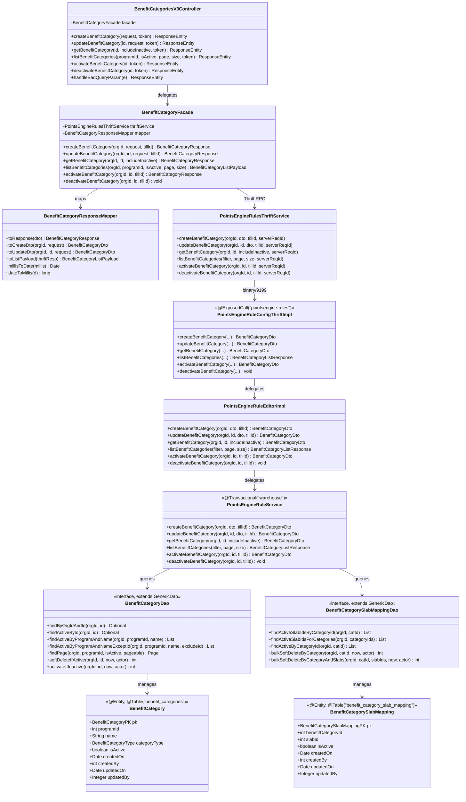
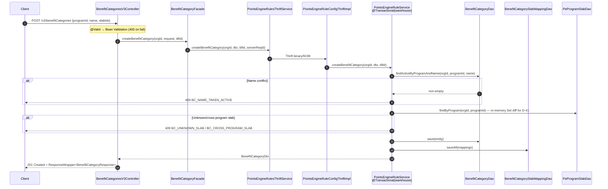
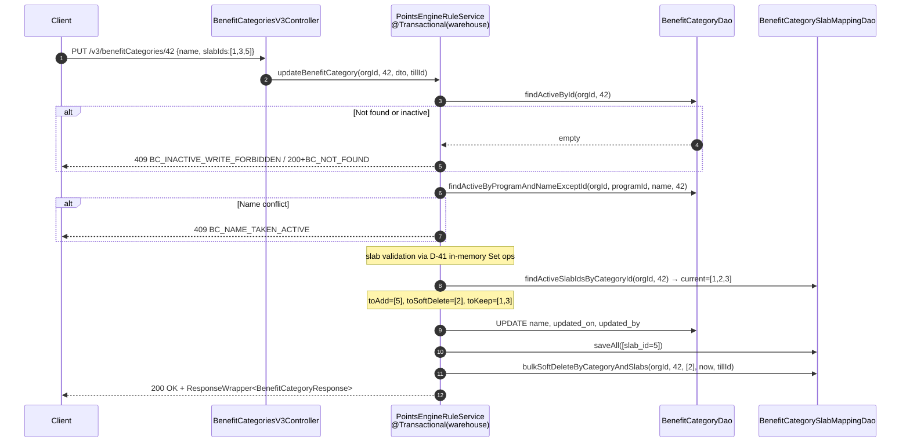
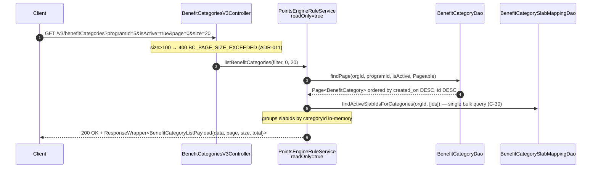
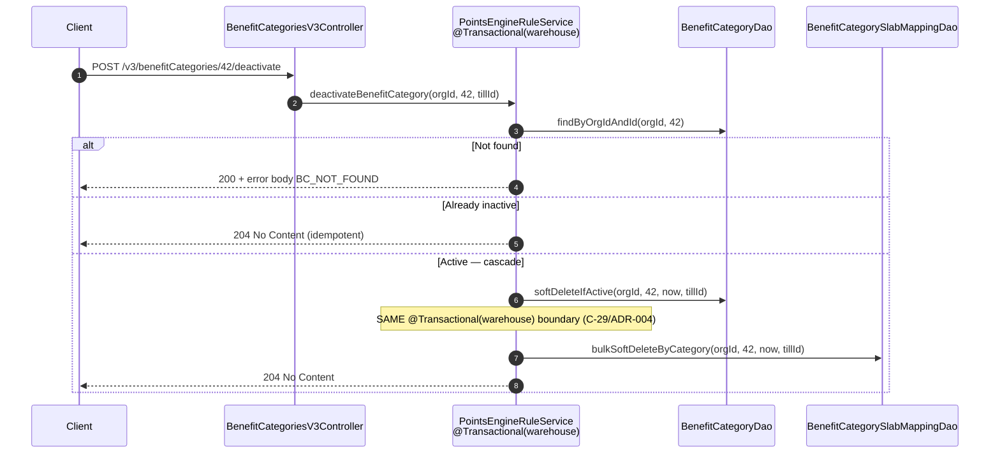

# LLD — Benefit Category CRUD (CAP-185145)

> **Status**: Canonical post-implementation design document.
> **Ticket**: CAP-185145
> **Source phases**: 01-architect.md (ADR-001..ADR-013), 03-designer.md (§A–§G, 17 patterns P-01..P-17), session-memory.md (D-01..D-58).
> **Last updated**: 2026-04-18 (post Phase-10 M3 GREEN gate).

---

## 1. Overview

This document describes the complete low-level design for the Benefit Category CRUD feature. A **benefit category** is a program-scoped metadata object that groups one or more tier slabs (loyalty tiers) under a named category for downstream benefit-engine rules. The feature introduces two new MySQL tables (`benefit_categories`, `benefit_category_slab_mapping`), six Thrift methods on the existing `PointsEngineRuleService`, and six REST endpoints under `/v3/benefitCategories` in `intouch-api-v3`.

The implementation follows the established Capillary 4-layer pattern: `REST Controller → Facade → Thrift Client → EMF Thrift Handler → Editor → Service (@Transactional) → DAO`. Key design choices are config-only (no FKs, no advisory locks, no optimistic locking at D-26 SMALL scale), soft-delete with cascade, and a server-side diff-and-apply for slab membership changes. The feature is strictly additive — no existing table, endpoint, or Thrift method is modified in a breaking way.

**Tech stack**: Java 8/17, Spring MVC, Apache Thrift (binary RPC), MySQL 5.7+ (Aurora), JPA (Spring Data + QueryDSL), Bean Validation (javax/jakarta), JUnit 4/5, Testcontainers, Lombok (DTOs only), Flyway (DDL submodule via cc-stack-crm).

---

## 2. Package Structure (per repo)

### 2.1 `intouch-api-v3`

```
com.capillary.intouchapiv3
├── resources
│   └── BenefitCategoriesV3Controller          [NEW]
├── facades
│   └── BenefitCategoryFacade                  [NEW]
│       └── BenefitCategoryFacade
│           .BenefitCategoryBusinessException  [NEW — inner static class]
├── models
│   ├── dtos
│   │   └── benefitcategory
│   │       ├── BenefitCategoryCreateRequest   [NEW]
│   │       ├── BenefitCategoryUpdateRequest   [NEW]
│   │       ├── BenefitCategoryResponse        [NEW]
│   │       ├── BenefitCategoryListPayload     [NEW]
│   │       └── BenefitCategoryResponseMapper  [NEW]
│   └── exceptions
│       └── ConflictException                  [NEW]
├── exceptionResources
│   └── TargetGroupErrorAdvice                 [MODIFIED — +BenefitCategoryBusinessException handler]
└── services.thrift
    └── PointsEngineRulesThriftService         [MODIFIED — +6 BenefitCategory delegations]
```

### 2.2 `emf-parent / pointsengine-emf`

```
com.capillary.shopbook.pointsengine
├── benefitcategory
│   ├── BenefitCategory                        [NEW — JPA entity]
│   │   └── BenefitCategory.BenefitCategoryPK [NEW — @Embeddable inner class]
│   ├── BenefitCategorySlabMapping             [NEW — JPA entity]
│   │   └── BenefitCategorySlabMapping
│   │       .BenefitCategorySlabMappingPK      [NEW — @Embeddable inner class]
│   ├── BenefitCategoryType                    [NEW — Java enum]
│   └── dao
│       ├── BenefitCategoryDao                 [NEW — Spring Data JPA interface]
│       ├── BenefitCategorySlabMappingDao      [NEW — Spring Data JPA interface]
│       └── CategorySlabTuple                  [NEW — bulk-fetch projection]
├── endpoint
│   ├── api
│   │   └── editor
│   │       └── PointsEngineRuleEditor         [MODIFIED — +6 method declarations]
│   └── impl
│       ├── editor
│       │   └── PointsEngineRuleEditorImpl     [MODIFIED — +6 thin delegations]
│       └── external
│           └── PointsEngineRuleConfigThriftImpl [MODIFIED — +6 @Override handler methods]
└── points.services
    └── PointsEngineRuleService                [MODIFIED — +6 @Transactional methods]
```

### 2.3 `thrift-ifaces-pointsengine-rules`

```
src/main/thrift/
└── pointsengine_rules.thrift   [MODIFIED — +enum BenefitCategoryType, +3 structs, +6 service methods; version 1.83 → 1.84]
```

### 2.4 `cc-stack-crm` (DDL submodule)

```
schema/dbmaster/warehouse/
├── benefit_categories.sql          [NEW]
└── benefit_category_slab_mapping.sql [NEW]
```

---

## 3. Class Diagram (Mermaid)



---

## 4. Interface Contracts

### 4.1 REST Controller — `BenefitCategoriesV3Controller`

Package: `com.capillary.intouchapiv3.resources`
Annotations: `@RestController @RequestMapping("/v3/benefitCategories") @Slf4j`
Auth: writes require `BasicAndKey`; reads accept `KeyOnly` or `BasicAndKey` (ADR-010 / D-37). No `@PreAuthorize` in MVP.
`tillId` source: `(int) user.getEntityId()` — platform convention; no `getTillId()` exists on `IntouchUser` (D-49).

```java
// POST /v3/benefitCategories → 201 Created
@PostMapping(produces = "application/json", consumes = "application/json")
public ResponseEntity<ResponseWrapper<BenefitCategoryResponse>> createBenefitCategory(
        @Valid @RequestBody BenefitCategoryCreateRequest request,
        AbstractBaseAuthenticationToken token);

// PUT /v3/benefitCategories/{id} → 200 OK
@PutMapping(path = "/{id}", produces = "application/json", consumes = "application/json")
public ResponseEntity<ResponseWrapper<BenefitCategoryResponse>> updateBenefitCategory(
        @PathVariable("id") int id,
        @Valid @RequestBody BenefitCategoryUpdateRequest request,
        AbstractBaseAuthenticationToken token);

// GET /v3/benefitCategories/{id}?includeInactive=false → 200 OK (or 200 + error body on not-found, OQ-45)
@GetMapping(path = "/{id}", produces = "application/json")
public ResponseEntity<ResponseWrapper<BenefitCategoryResponse>> getBenefitCategory(
        @PathVariable("id") int id,
        @RequestParam(name = "includeInactive", defaultValue = "false") boolean includeInactive,
        AbstractBaseAuthenticationToken token);
// D-42: includeInactive=false (default) returns 404-as-200 on soft-deleted rows.
// includeInactive=true returns the row even if is_active=false (audit access).

// GET /v3/benefitCategories?programId=&isActive=&page=0&size=20 → 200 OK
@GetMapping(produces = "application/json")
public ResponseEntity<ResponseWrapper<BenefitCategoryListPayload>> listBenefitCategories(
        @RequestParam(name = "programId", required = false) Integer programId,
        @RequestParam(name = "isActive", required = false) Boolean isActive,
        @RequestParam(name = "page", defaultValue = "0") int page,
        @RequestParam(name = "size", defaultValue = "20") int size,
        AbstractBaseAuthenticationToken token);

// POST /v3/benefitCategories/{id}/activate → 200 OK + DTO (state change) | 204 No Content (no-op)
// Note: implemented as @PostMapping (not @PatchMapping) — matches as-built controller.
@PostMapping(path = "/{id}/activate", produces = "application/json")
public ResponseEntity<ResponseWrapper<BenefitCategoryResponse>> activateBenefitCategory(
        @PathVariable("id") int id,
        AbstractBaseAuthenticationToken token);
// D-39: when facade returns response with stateChanged=false → 204 (already active).
// When stateChanged=true → 200 + ResponseWrapper<BenefitCategoryResponse>.

// POST /v3/benefitCategories/{id}/deactivate → 204 No Content (always)
@PostMapping(path = "/{id}/deactivate", produces = "application/json")
public ResponseEntity<Void> deactivateBenefitCategory(
        @PathVariable("id") int id,
        AbstractBaseAuthenticationToken token);

// Controller-scoped error handler — D-56 surgical scope (does not affect global TargetGroupErrorAdvice)
@ExceptionHandler(MethodArgumentTypeMismatchException.class)
public ResponseEntity<ResponseWrapper<String>> handleBadQueryParam(
        MethodArgumentTypeMismatchException e);
// Returns 400 for ?isActive=foo and other type-coercion failures (BT-038, D-48).
```

**Key business rules**:
- `orgId` always extracted from the authenticated `IntouchUser` — never from the request body (G-07 tenant isolation).
- `@Valid @RequestBody` triggers Bean Validation before any facade code runs (P-12).
- The activate/deactivate sub-paths use `@PostMapping` (not `@PatchMapping`) as built in Phase 9/10.

### 4.2 Facade — `BenefitCategoryFacade`

Package: `com.capillary.intouchapiv3.facades`
Annotation: `@Component` (Spring managed)
Injects: `PointsEngineRulesThriftService`, `BenefitCategoryResponseMapper`

```java
public BenefitCategoryResponse createBenefitCategory(
        int orgId, BenefitCategoryCreateRequest request, int tillId)
        throws BenefitCategoryBusinessException;

public BenefitCategoryResponse updateBenefitCategory(
        int orgId, int categoryId, BenefitCategoryUpdateRequest request, int tillId)
        throws BenefitCategoryBusinessException;

public BenefitCategoryResponse getBenefitCategory(
        int orgId, int categoryId, boolean includeInactive)   // D-42
        throws BenefitCategoryBusinessException;

public BenefitCategoryListPayload listBenefitCategories(
        int orgId, Integer programId, Boolean isActive, int page, int size)
        throws BenefitCategoryBusinessException;

public BenefitCategoryResponse activateBenefitCategory(
        int orgId, int categoryId, int tillId)
        throws BenefitCategoryBusinessException;
// D-39: returns response with stateChanged=false on idempotent already-active;
//        stateChanged=true on actual state change. Controller branches on stateChanged.

public void deactivateBenefitCategory(int orgId, int categoryId, int tillId)
        throws BenefitCategoryBusinessException;
```

**Exception translation**: `PointsEngineRuleServiceException` (checked) is wrapped in the inner `BenefitCategoryBusinessException` (unchecked) carrying `statusCode` + `errorMessage`. `TargetGroupErrorAdvice` unwraps via `getCause()` and maps `statusCode` → HTTP (D-55).

**Thrift client pattern**: delegates to `PointsEngineRulesThriftService` which calls `RPCService.rpcClient(PointsEngineRuleService.Iface.class, "emf-thrift-service", 9199, 60000)` (P-08). `serverReqId` is sourced via `CapRequestIdUtil` on every call.

### 4.3 Thrift IDL — `PointsEngineRuleService` additions (v1.84)

File: `thrift-ifaces-pointsengine-rules/src/main/thrift/pointsengine_rules.thrift`
IDL version: `1.83 → 1.84` (all additions, zero breaking changes — G-09.5).

```thrift
enum BenefitCategoryType {
  BENEFITS = 1
}

struct BenefitCategoryDto {
  1:  optional i32  id,
  2:  required i32  orgId,
  3:  required i32  programId,
  4:  required string name,
  5:  required BenefitCategoryType categoryType = BenefitCategoryType.BENEFITS,
  6:  required list<i32> slabIds,
  7:  required bool  isActive,
  8:  required i64  createdOn,          // epoch millis UTC (ADR-008)
  9:  required i32  createdBy,
  10: optional i64  updatedOn,
  11: optional i32  updatedBy,
  12: optional bool stateChanged = true // D-43: false signals idempotent no-op on activate
}

struct BenefitCategoryFilter {
  1: required i32  orgId,
  2: optional i32  programId,
  3: optional bool isActive
}

struct BenefitCategoryListResponse {
  1: required list<BenefitCategoryDto> data,
  2: required i32  page,
  3: required i32  size,
  4: required i64  total
}

// 6 new methods on PointsEngineRuleService (all with trailing string tillId, string serverReqId)

BenefitCategoryDto createBenefitCategory(
    1: required i32 orgId,
    2: required BenefitCategoryDto dto,
    3: required i32 tillId,
    4: required string serverReqId
) throws (1: PointsEngineRuleServiceException ex);

BenefitCategoryDto updateBenefitCategory(
    1: required i32 orgId,
    2: required i32 categoryId,
    3: required BenefitCategoryDto dto,
    4: required i32 tillId,
    5: required string serverReqId
) throws (1: PointsEngineRuleServiceException ex);

BenefitCategoryDto getBenefitCategory(
    1: required i32  orgId,
    2: required i32  categoryId,
    3: optional bool includeInactive = false,  // D-42
    4: required string serverReqId
) throws (1: PointsEngineRuleServiceException ex);

BenefitCategoryListResponse listBenefitCategories(
    1: required BenefitCategoryFilter filter,
    2: required i32  page,
    3: required i32  size,
    4: required string serverReqId
) throws (1: PointsEngineRuleServiceException ex);

BenefitCategoryDto activateBenefitCategory(
    1: required i32 orgId,
    2: required i32 categoryId,
    3: required i32 tillId,
    4: required string serverReqId
) throws (1: PointsEngineRuleServiceException ex);
// D-43: returns DTO with stateChanged=false on idempotent already-active.

void deactivateBenefitCategory(
    1: required i32 orgId,
    2: required i32 categoryId,
    3: required i32 tillId,
    4: required string serverReqId
) throws (1: PointsEngineRuleServiceException ex);
```

**Naming convention** (TD-SDET-06): `tillId` (not `actorUserId`) matches the pre-existing platform pattern (`getProgramByTill`). `serverReqId` is mandatory on all 6 methods for MDC tracing.

### 4.4 Service — `PointsEngineRuleService` additions

Package: `com.capillary.shopbook.pointsengine.points.services`
Annotation: class-level `@Transactional(value="warehouse", propagation=Propagation.REQUIRED)` (P-05).

```java
// Write methods — inherit class-level @Transactional(warehouse, REQUIRED)
public BenefitCategoryDto createBenefitCategory(int orgId, BenefitCategoryDto dto, int tillId)
        throws PointsEngineRuleServiceException;
// Key validations:
// 1. findActiveByProgramAndName(orgId, programId, name.trim()) — if non-empty → BC_NAME_TAKEN_ACTIVE (D-28/ADR-012)
// 2. validateSlabsBelongToProgram(orgId, programId, slabIds) — uses PeProgramSlabDao.findByProgram + in-memory Set diff (D-41)
// 3. BenefitCategory entity created; BenefitCategorySlabMapping rows inserted for each slabId (ADR-003)
// Audit: new Date() set explicitly for createdOn/createdBy (P-06 / C-37)

public BenefitCategoryDto updateBenefitCategory(int orgId, int categoryId, BenefitCategoryDto dto, int tillId)
        throws PointsEngineRuleServiceException;
// Key validations:
// 1. findActiveById(orgId, categoryId) — if empty → BC_NOT_FOUND or BC_INACTIVE_WRITE_FORBIDDEN (D-27)
// 2. findActiveByProgramAndNameExceptId(orgId, programId, name, categoryId) — if non-empty → BC_NAME_TAKEN_ACTIVE
// 3. validateSlabsBelongToProgram — same pattern as create
// 4. diff-apply: findActiveSlabIdsByCategoryId → toAdd/toSoftDelete/toKeep via LinkedHashSet ops (ADR-003/D-35)
// 5. bulkSoftDeleteByCategoryAndSlabs for toSoftDelete; saveAll for toAdd

@Transactional(value = "warehouse", propagation = Propagation.SUPPORTS, readOnly = true)
public BenefitCategoryDto getBenefitCategory(int orgId, int categoryId, boolean includeInactive)
        throws PointsEngineRuleServiceException;
// D-42: includeInactive=false → findActiveById; true → findByOrgIdAndId

@Transactional(value = "warehouse", propagation = Propagation.SUPPORTS, readOnly = true)
public BenefitCategoryListResponse listBenefitCategories(BenefitCategoryFilter filter, int page, int size)
        throws PointsEngineRuleServiceException;
// ADR-011: size max 100; exceeding → BC_PAGE_SIZE_EXCEEDED (400)
// Bulk mapping fetch via findActiveSlabIdsForCategories(orgId, List<Integer>) — NO N+1 (C-30/G-04.1)
// Sort: ORDER BY created_on DESC, id DESC

public BenefitCategoryDto activateBenefitCategory(int orgId, int categoryId, int tillId)
        throws PointsEngineRuleServiceException;
// 1. findByOrgIdAndId(orgId, categoryId) — if empty → BC_NOT_FOUND
// 2. if already active → return dto with stateChanged=false (D-43 idempotency)
// 3. findActiveByProgramAndName on name → if conflict → BC_NAME_TAKEN_ON_REACTIVATE (ADR-002)
// 4. activateIfInactive(orgId, id, now, tillId) → sets is_active=true

public void deactivateBenefitCategory(int orgId, int categoryId, int tillId)
        throws PointsEngineRuleServiceException;
// 1. findByOrgIdAndId — if empty → BC_NOT_FOUND
// 2. if already inactive → no-op (idempotent 204)
// 3. softDeleteIfActive(category) + bulkSoftDeleteByCategory(mappings) — SAME transaction (ADR-004/C-29)
```

### 4.5 DAO — `BenefitCategoryDao`

Package: `com.capillary.shopbook.pointsengine.benefitcategory.dao`
Base: `interface BenefitCategoryDao extends GenericDao<BenefitCategory, BenefitCategory.BenefitCategoryPK>` (P-02)

```java
@Query("SELECT c FROM BenefitCategory c WHERE c.pk.orgId=:orgId AND c.pk.id=:id")
Optional<BenefitCategory> findByOrgIdAndId(@Param("orgId") int orgId, @Param("id") int id);
// Returns row regardless of is_active — used for activate/deactivate state checks and D-42 audit path.

@Query("SELECT c FROM BenefitCategory c WHERE c.pk.orgId=:orgId AND c.pk.id=:id AND c.isActive=true")
Optional<BenefitCategory> findActiveById(@Param("orgId") int orgId, @Param("id") int id);
// Active-only; used by all mutation paths (update, reactivation load, default GET per D-27/D-42).

@Query("SELECT c FROM BenefitCategory c WHERE c.pk.orgId=:orgId AND c.programId=:programId "
     + "AND c.name=:name AND c.isActive=true")
List<BenefitCategory> findActiveByProgramAndName(
        @Param("orgId") int orgId, @Param("programId") int programId, @Param("name") String name);
// App-level uniqueness check — case-sensitive byte comparison (D-47). No DB UNIQUE constraint (D-38/ADR-012).

@Query("SELECT c FROM BenefitCategory c WHERE c.pk.orgId=:orgId AND c.programId=:programId "
     + "AND c.name=:name AND c.isActive=true AND c.pk.id<>:excludeId")
List<BenefitCategory> findActiveByProgramAndNameExceptId(
        @Param("orgId") int orgId, @Param("programId") int programId,
        @Param("name") String name, @Param("excludeId") int excludeId);
// Used on UPDATE to exclude self from uniqueness check.
// NOTE R-01: this method is defined in the interface but the runtime update path currently
// uses findActiveByProgramAndName + in-memory exclusion. Pending manual cleanup in follow-up.

@Query(value = "SELECT c FROM BenefitCategory c WHERE c.pk.orgId=:orgId "
             + "AND (:programId IS NULL OR c.programId=:programId) "
             + "AND (:isActive IS NULL OR c.isActive=:isActive) "
             + "ORDER BY c.createdOn DESC, c.pk.id DESC",
       countQuery = "SELECT COUNT(c) FROM BenefitCategory c WHERE c.pk.orgId=:orgId ...")
Page<BenefitCategory> findPage(
        @Param("orgId") int orgId, @Param("programId") Integer programId,
        @Param("isActive") Boolean isActive, Pageable pageable);

@Modifying
@Query("UPDATE BenefitCategory c SET c.isActive=false, c.updatedOn=:now, c.updatedBy=:actor "
     + "WHERE c.pk.orgId=:orgId AND c.pk.id=:id AND c.isActive=true")
int softDeleteIfActive(@Param("orgId") int orgId, @Param("id") int id,
                       @Param("now") Date now, @Param("actor") int actor);

@Modifying
@Query("UPDATE BenefitCategory c SET c.isActive=true, c.updatedOn=:now, c.updatedBy=:actor "
     + "WHERE c.pk.orgId=:orgId AND c.pk.id=:id AND c.isActive=false")
int activateIfInactive(@Param("orgId") int orgId, @Param("id") int id,
                       @Param("now") Date now, @Param("actor") int actor);
```

**`BenefitCategorySlabMappingDao`** (full signatures in `03-designer.md §F.2`):

Key methods: `findActiveSlabIdsByCategoryId`, `findActiveSlabIdsForCategories` (bulk; prevents N+1 on list), `findActiveByCategoryId`, `bulkSoftDeleteByCategory` (cascade deactivate), `bulkSoftDeleteByCategoryAndSlabs` (diff-apply removes).

---

## 5. DTOs

All DTOs are in package `com.capillary.intouchapiv3.models.dtos.benefitcategory`.
Lombok `@Getter @Setter` (not Lombok on JPA entities — D-44/C-35).
`@JsonIgnoreProperties(ignoreUnknown = true)` on request DTOs.

### `BenefitCategoryCreateRequest`

| Field | Type | Nullable | Validation | Notes |
|-------|------|----------|------------|-------|
| `programId` | `Integer` | no | `@NotNull @Positive` | Program this category belongs to |
| `name` | `String` | no | `@NotBlank @Size(max=255)` | Case-sensitive uniqueness among active rows (D-47) |
| `slabIds` | `List<Integer>` | no | `@NotNull @Size(min=1)` + `List<@NotNull @Positive Integer>` | At least one slab required (D-46) |

### `BenefitCategoryUpdateRequest`

| Field | Type | Nullable | Validation | Notes |
|-------|------|----------|------------|-------|
| `name` | `String` | no | `@NotBlank @Size(max=255)` | Uniqueness check excludes self (update path) |
| `slabIds` | `List<Integer>` | no | `@NotNull @Size(min=1)` + `List<@NotNull @Positive Integer>` | Empty list rejected 400 (D-46). To clear all slabs, use `/deactivate` |

### `BenefitCategoryResponse`

| Field | Type | Nullable | Format | Notes |
|-------|------|----------|--------|-------|
| `id` | `int` | no | — | Entity id |
| `orgId` | `int` | no | — | Tenant id |
| `programId` | `int` | no | — | — |
| `name` | `String` | no | — | — |
| `categoryType` | `String` | no | — | Always `"BENEFITS"` in MVP |
| `slabIds` | `List<Integer>` | no | — | Active slab mappings |
| `isActive` | `boolean` | no | — | — |
| `createdOn` | `Date` | no | `@JsonFormat(pattern="yyyy-MM-dd'T'HH:mm:ssXXX")` | RFC 3339 with explicit offset (D-45/TD-SDET-07) |
| `createdBy` | `int` | no | — | — |
| `updatedOn` | `Date` | yes | `@JsonFormat(pattern="yyyy-MM-dd'T'HH:mm:ssXXX")` | Null until first update |
| `updatedBy` | `Integer` | yes | — | Null until first update |
| `stateChanged` | `Boolean` | yes | — | D-43: facade sets to null on non-activate paths; false signals idempotent activate no-op → controller emits 204 |

### `BenefitCategoryListPayload`

| Field | Type | Nullable | Notes |
|-------|------|----------|-------|
| `data` | `List<BenefitCategoryResponse>` | no | — |
| `page` | `int` | no | 0-indexed |
| `size` | `int` | no | Actual page size returned |
| `total` | `long` | no | Total matching rows across all pages |

Wrapped inside `ResponseWrapper<BenefitCategoryListPayload>` per platform envelope (P-09 / Q7-05).

### `BenefitCategoryResponseMapper`

Package: `com.capillary.intouchapiv3.models.dtos.benefitcategory` (co-located with DTOs per as-built structure).
`@Component`, stateless; unit-testable without Spring context.

```java
public BenefitCategoryResponse toResponse(BenefitCategoryDto dto);          // Thrift → REST
public BenefitCategoryDto toCreateDto(int orgId, BenefitCategoryCreateRequest req);
public BenefitCategoryDto toUpdateDto(int orgId, int categoryId, BenefitCategoryUpdateRequest req);
public BenefitCategoryListPayload toListPayload(BenefitCategoryListResponse thriftResp);
static Date millisToDate(long millis);   // null/0L → null; epoch ms → java.util.Date
static long dateToMillis(Date d);        // null → 0L
```

---

## 6. Entity Mapping (JPA)

Package: `com.capillary.shopbook.pointsengine.benefitcategory`
Entities use **hand-written** getters/setters/equals/hashCode (D-44/C-35 — Lombok avoided on `@Embeddable` PK inner classes).
Base class: `OrgEntityIntegerPKBase` (platform base; composite PK pattern — P-01).

### `BenefitCategory`

```java
@Entity
@Table(name = "benefit_categories")
@DataSourceSpecification(schemaType = SchemaType.WAREHOUSE)
public class BenefitCategory extends OrgEntityIntegerPKBase {

    @EmbeddedId
    private BenefitCategoryPK pk;

    @Column(name = "program_id", nullable = false)
    private int programId;

    @Column(name = "name", length = 255, nullable = false)
    private String name;

    @Enumerated(EnumType.STRING)
    @Column(name = "category_type", nullable = false)
    private BenefitCategoryType categoryType;

    @Column(name = "is_active", nullable = false)
    private boolean isActive;

    @Temporal(TemporalType.TIMESTAMP)
    @Column(name = "created_on", nullable = false)
    private Date createdOn;

    @Column(name = "created_by", nullable = false)
    private int createdBy;

    @Temporal(TemporalType.TIMESTAMP)
    @Column(name = "updated_on")
    private Date updatedOn;                    // null until first update

    @Column(name = "updated_by")
    private Integer updatedBy;                 // nullable Integer (not int)

    @Temporal(TemporalType.TIMESTAMP)
    @Column(name = "auto_update_time", insertable = false, updatable = false)
    private Date autoUpdateTime;               // DB-managed; app reads only

    @Embeddable
    public static class BenefitCategoryPK implements Serializable {
        @Column(name = "id")   private int id;
        @Column(name = "org_id") private int orgId;
        // equals + hashCode per Benefits.BenefitsPK exemplar
    }
}
```

**DDL-level constraints**: `PRIMARY KEY (id, org_id)` · `KEY idx_bc_org_program (org_id, program_id)` · `KEY idx_bc_org_program_active (org_id, program_id, is_active)`. No `version` column (ADR-001). No DB-level UNIQUE on name (ADR-012 / D-38). No declared FK (platform convention G-12.2).

### `BenefitCategorySlabMapping`

Same audit column layout as `BenefitCategory` plus:

```java
@Column(name = "benefit_category_id", nullable = false) private int benefitCategoryId;
@Column(name = "slab_id", nullable = false) private int slabId;
```

**DDL-level indexes**: `PRIMARY KEY (id, org_id)` · `KEY idx_bcsm_org_cat_active (org_id, benefit_category_id, is_active)` · `KEY idx_bcsm_org_slab_active (org_id, slab_id, is_active)`.

**Re-add semantics**: re-adding a previously removed slabId inserts a **NEW** mapping row — old soft-deleted rows remain as audit history. Only the newest `is_active=true` row per `(category_id, slab_id, org_id)` is authoritative (ADR-003).

---

## 7. Error Model

### 7.1 Exception classes

| Class | Package | Extends | Notes |
|-------|---------|---------|-------|
| `ConflictException` | `com.capillary.intouchapiv3.models.exceptions` | `RuntimeException` | Fields: `code` (String), `message`. Added in Phase 9. |
| `BenefitCategoryFacade.BenefitCategoryBusinessException` | inner static on Facade | `RuntimeException` | Wraps checked `PointsEngineRuleServiceException`; carries `statusCode` + `errorMessage`. Added in Phase 10 (D-55). |
| `PointsEngineRuleServiceException` | Thrift-generated | `org.apache.thrift.TException` | Fields: `statusCode` (int), `errorMessage` (String). Thrown by all 6 service methods. |

### 7.2 HTTP status code mapping

| HTTP | When | Platform quirk |
|------|------|---------------|
| 201 Created | POST create success | — |
| 200 OK | GET, PUT, GET list success; NotFoundException (see below) | — |
| 204 No Content | POST /activate (already active, idempotent); POST /deactivate (success or idempotent) | — |
| 400 Bad Request | Bean Validation failure (`@NotNull`/`@NotBlank`/`@Size`); `BC_PAGE_SIZE_EXCEEDED`; `?isActive=foo` type mismatch (controller-local handler D-56); `VALIDATION_FAILED` for bad filter values (D-48) | — |
| **200 + error body** | `NotFoundException` (BC_NOT_FOUND) — **platform quirk OQ-45**: the `TargetGroupErrorAdvice.handleNotFoundException` returns 200 with a populated `errors[]` array instead of 404. UI consumers MUST check `errors` on every 200 response. | OQ-45 documented in `/api-handoff` |
| 409 Conflict | `ConflictException` or `BenefitCategoryBusinessException` with statusCode=409 | — |
| 500 Internal Server Error | Unmapped `Throwable` | — |

### 7.3 Error codes

All codes surface as `ApiError{code, message}` in `ResponseWrapper.errors[]`.

| Code | HTTP | Trigger |
|------|------|---------|
| `BC_NOT_FOUND` | 200 + error body (OQ-45) | Category id does not exist for org or is soft-deleted (default GET) |
| `BC_NAME_TAKEN_ACTIVE` | 409 | Active category with same name exists in same `(orgId, programId)` on create or update (D-28/ADR-012) |
| `BC_NAME_TAKEN_ON_REACTIVATE` | 409 | On activate: a different active category in the same program now owns that name (ADR-002) |
| `BC_INACTIVE_WRITE_FORBIDDEN` | 409 | PUT on a soft-deleted category (D-27) |
| `BC_CROSS_PROGRAM_SLAB` | 409 | `slabId` belongs to a different program (ADR-003) |
| `BC_UNKNOWN_SLAB` | 409 | `slabId` does not exist for org at all (ADR-003/D-41) |
| `BC_PAGE_SIZE_EXCEEDED` | 400 | `?size > 100` (ADR-011) |
| `VALIDATION_FAILED` | 400 | Bean Validation or Spring MVC type-coercion failure (D-48) — platform standard code |
| `INTERNAL_ERROR` | 500 | Unmapped exception |

**Note**: `BC_NAME_LOCK_TIMEOUT` was proposed in original ADR-012 but **stricken** by D-38 (no advisory lock in MVP).

---

## 8. Sequence Diagrams

### 8.1 Create



### 8.2 Update (diff-and-apply)



### 8.3 Get single (`?includeInactive` per D-42)

```mermaid
sequenceDiagram
    autonumber
    participant Client
    participant Ctrl as BenefitCategoriesV3Controller
    participant Svc as PointsEngineRuleService<br/>readOnly=true
    participant CatDao as BenefitCategoryDao
    participant MapDao as BenefitCategorySlabMappingDao

    Client->>Ctrl: GET /v3/benefitCategories/42?includeInactive=false
    Ctrl->>Svc: getBenefitCategory(orgId, 42, false)
    Svc->>CatDao: findActiveById(orgId, 42)
    alt Not found (active-only path)
        Svc-->>Client: 200 + error body BC_NOT_FOUND (OQ-45 platform quirk)
    end
    Svc->>MapDao: findActiveSlabIdsByCategoryId(orgId, 42)
    Svc-->>Client: 200 OK + ResponseWrapper<BenefitCategoryResponse>

    Note over Client,CatDao: With ?includeInactive=true:<br/>Svc calls findByOrgIdAndId (any state);<br/>returns dto even if is_active=false (audit path D-42)
```

### 8.4 List (paginated)



### 8.5 Activate (D-39 asymmetric response)

```mermaid
sequenceDiagram
    autonumber
    participant Client
    participant Ctrl as BenefitCategoriesV3Controller
    participant Svc as PointsEngineRuleService<br/>@Transactional(warehouse)
    participant CatDao as BenefitCategoryDao

    Client->>Ctrl: POST /v3/benefitCategories/42/activate
    Ctrl->>Svc: activateBenefitCategory(orgId, 42, tillId)
    Svc->>CatDao: findByOrgIdAndId(orgId, 42)
    alt Not found
        Svc-->>Client: 200 + error body BC_NOT_FOUND
    else Already active
        Svc-->>Ctrl: BenefitCategoryDto { stateChanged=false }
        Ctrl-->>Client: 204 No Content (idempotent)
    else Inactive — check name conflict
        Svc->>CatDao: findActiveByProgramAndName(orgId, programId, name)
        alt Name collision
            Svc-->>Client: 409 BC_NAME_TAKEN_ON_REACTIVATE
        else No conflict
            Svc->>CatDao: activateIfInactive(orgId, 42, now, tillId)
            Svc-->>Ctrl: BenefitCategoryDto { stateChanged=true }
            Ctrl-->>Client: 200 OK + ResponseWrapper<BenefitCategoryResponse>
        end
    end
    Note over Ctrl,Client: D-39: stateChanged=false → 204; stateChanged=true → 200+DTO<br/>Slab mappings do NOT auto-reactivate (ADR-002)
```

### 8.6 Deactivate (cascade per ADR-004)



---

## 9. Transactional Boundaries

| Method | @Transactional | Rollback behaviour |
|--------|----------------|-------------------|
| `createBenefitCategory` | `@Transactional(value="warehouse", propagation=REQUIRED)` | Category INSERT + all mapping INSERTs roll back together on any exception |
| `updateBenefitCategory` | `@Transactional(value="warehouse", propagation=REQUIRED)` | Category UPDATE + mapping soft-deletes + mapping INSERTs roll back together (ADR-003/D-35) |
| `activateBenefitCategory` | `@Transactional(value="warehouse", propagation=REQUIRED)` | Single category UPDATE; slab mappings NOT auto-reactivated (ADR-002) |
| `deactivateBenefitCategory` | `@Transactional(value="warehouse", propagation=REQUIRED)` | Category soft-delete + ALL active mapping soft-deletes in one transaction (C-29/ADR-004) |
| `getBenefitCategory` | `@Transactional(value="warehouse", propagation=SUPPORTS, readOnly=true)` | Read-only; no rollback concern |
| `listBenefitCategories` | `@Transactional(value="warehouse", propagation=SUPPORTS, readOnly=true)` | Read-only; no rollback concern |

`@Transactional` is on `PointsEngineRuleService` methods (class-level default REQUIRED; GET/list override to SUPPORTS/readOnly). The Thrift handler (`PointsEngineRuleConfigThriftImpl`) and Editor (`PointsEngineRuleEditorImpl`) are **outside** the transaction boundary — they delegate without `@Transactional`. The service is the sole transactional anchor (P-05).

---

## 10. Validation Flow

```
HTTP Request
    │
    ▼
BenefitCategoriesV3Controller (@Valid @RequestBody)
    │  Bean Validation (javax/jakarta.validation)
    │  Triggers on: @NotNull, @NotBlank, @Size, @Positive, List<@Positive Integer>
    │  Failure: HandlerMethodArgumentNotValidException
    │        → TargetGroupErrorAdvice → 400 + VALIDATION_FAILED envelope
    │
    ▼
BenefitCategoryFacade
    │  Mapper: BenefitCategoryResponseMapper.toCreateDto / toUpdateDto
    │  Dedup: new LinkedHashSet<>(request.getSlabIds()) — silent dedup, preserves order (D-35)
    │
    ▼
PointsEngineRuleService (transactional service-layer business rules)
    │  1. Name uniqueness check (D-28/ADR-012) — case-sensitive, active rows only (D-47)
    │  2. Slab existence/cross-program check via PeProgramSlabDao + in-memory Set (D-41)
    │  3. Diff-apply for slab mappings (D-35)
    │  4. State-machine checks (D-27: no write on inactive; D-43: idempotent activate)
    │  Failure: PointsEngineRuleServiceException(statusCode, errorMessage)
    │        → wrapped in BenefitCategoryBusinessException by Facade
    │        → TargetGroupErrorAdvice unwraps statusCode → 409/404/400/500
    │
    ▼
BenefitCategoryDao / BenefitCategorySlabMappingDao
    │  JPA constraints: @Column(nullable=false), @Enumerated, @Temporal
    │  No DB UNIQUE constraint (D-38/ADR-012) — uniqueness is app-enforced
    │
    ▼
MySQL warehouse
```

**D-56 scoped advice**: `MethodArgumentTypeMismatchException` (e.g., `?isActive=foo`) is caught by a controller-local `@ExceptionHandler` on `BenefitCategoriesV3Controller`, returning 400. This prevents the global `TargetGroupErrorAdvice.handleOtherException` from swallowing it as 500.

---

## 11. Test Coverage Summary

| Suite | Count | Status |
|-------|-------|--------|
| `BenefitCategoryDtoValidationTest` (UT) | 20 | GREEN |
| `BenefitCategoryFacadeTest` (UT, Mockito) | 10 | GREEN |
| `BenefitCategoryExceptionAdviceTest` (UT) | 6 | GREEN |
| `BenefitCategoryCreate/Get/List/Update/Activate/Deactivate/GuardrailIT` (Testcontainers ITs) | 40 | GREEN |
| `BenefitCategoryComplianceTest` (emf-parent, structural) | 6 | GREEN (local); CI verifies |
| `PointsEngineRuleServiceBenefitCategoryRedTest` (emf-parent) | deleted post-GREEN | — |
| **intouch-api-v3 total** | **76** | **ALL PASS** |
| emf-parent structural tests | 6 | GREEN (structural; CI verifies full module build) |

Total business test cases defined in `04b-business-tests.md`: 107 (BT-001..BT-101 + 6 guardrail BT-G).
Total QA scenarios defined in `04-qa.md`: 79 (QA-001..QA-077 + QA-004b + QA-022b).

For full test listings with per-BT traceability see:
- `04b-business-tests.md` — BT case listings with BA→Designer→QA→BT trace
- `05-sdet.md` — RED-phase test skeleton decisions, salvage operation log, GREEN gate evidence

---

## 12. References

| Artifact | Location |
|----------|----------|
| HLD (Architect) | `docs/pipeline/benefit-category-crud/01-architect.md` |
| Designer (LLD source) | `docs/pipeline/benefit-category-crud/03-designer.md` |
| QA Scenarios | `docs/pipeline/benefit-category-crud/04-qa.md` |
| Business Tests | `docs/pipeline/benefit-category-crud/04b-business-tests.md` |
| SDET RED-phase log | `docs/pipeline/benefit-category-crud/05-sdet.md` |
| Session memory (all decisions D-01..D-58) | `docs/pipeline/benefit-category-crud/session-memory.md` |
| Live dashboard | `docs/pipeline/benefit-category-crud/live-dashboard.html` |
| API handoff (UI team) | `docs/pipeline/benefit-category-crud/api-handoff.md` |
| Actual controller (as-built) | `intouch-api-v3-2/intouch-api-v3/src/main/java/com/capillary/intouchapiv3/resources/BenefitCategoriesV3Controller.java` |
| Thrift IDL | `thrift-ifaces-pointsengine-rules/src/main/thrift/pointsengine_rules.thrift` (v1.84-SNAPSHOT) |
| DDL (benefit_categories) | `cc-stack-crm/schema/dbmaster/warehouse/benefit_categories.sql` |
| DDL (slab mapping) | `cc-stack-crm/schema/dbmaster/warehouse/benefit_category_slab_mapping.sql` |
