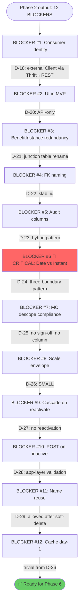
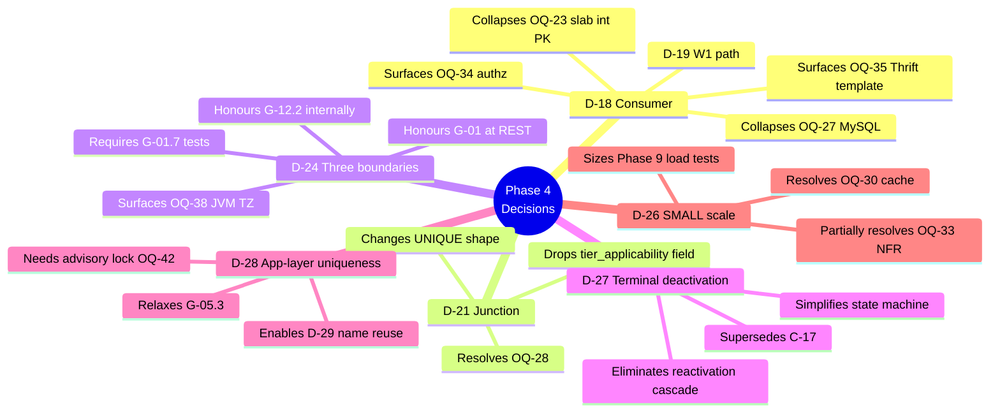
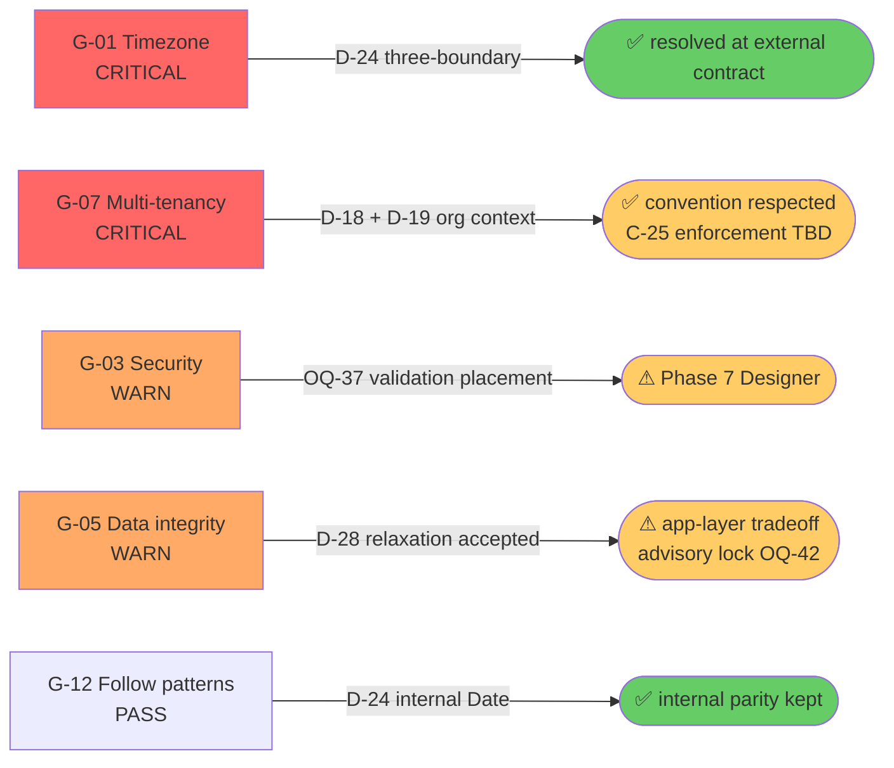

# Blocker Decisions — Benefit Category CRUD

> **Phase**: 4 (Grooming + Blocker Resolution)
> **Ticket**: CAP-185145
> **Generated**: 2026-04-18
> **Source**: Phase 2 Critic (18 contradictions) + Phase 2 Gap Analyser (10 verified claims, 11 gaps, 5 guardrail concerns) + ProductEx parallel review + Phase 1 BA open questions
> **Consolidation**: 12 BLOCKERS identified after severity-ranking; all resolved through user dialogue with evidence trail

---

## Executive Summary

| # | Blocker (OQ) | Title | Decision Ref | Status |
|---|--------------|-------|--------------|--------|
| 1 | OQ-16 | Consumer identity | D-18, D-19 | ✅ resolved |
| 2 | OQ-17 | Internal plumbing vs public API, UI in MVP | D-20 | ✅ resolved |
| 3 | OQ-19 | BenefitInstance redundancy with tier_applicability | D-21 | ✅ resolved |
| 4 | OQ-24 | Naming: tier_id vs slab_id + entity collision | D-22 | ✅ resolved |
| 5 | OQ-25 | Audit column pattern (created_at vs created_on) | D-23 | ✅ resolved |
| 6 | OQ-26 🔴 | Timestamps: java.util.Date vs Instant (G-01 vs G-12.2) | D-24 | ✅ resolved |
| 7 | OQ-18 | Maker-checker descope compliance sign-off | D-25 | ✅ resolved |
| 8 | OQ-20 | Scale envelope (NFR numbers, cascade size, QPS) | D-26 | ✅ resolved |
| 9 | OQ-21 | Cascade asymmetry on reactivation | D-27 | ✅ resolved |
| 10 | OQ-22 | POST on existing-but-inactive (cat, slab) | D-28 | ✅ resolved |
| 11 | OQ-29 | Name reuse after soft-delete | D-28, D-29 | ✅ resolved |
| 12 | OQ-30 | Cache day-1 or defer | D-26 (trivial) | ✅ resolved |

**Net**: 12 of 12 blockers resolved. 14 new decisions recorded (D-18 → D-29 + OQ-30 trivial resolution + OQ-15 implicit resolution). 6 new HIGH/LOW open questions surfaced for Phase 5/7 actions, none blocking Phase 6.

---

## Decision Ledger

### D-18 — Consumer identity (BLOCKER #1, OQ-16)
**Question**: Who reads BenefitCategory/BenefitInstance config and applies benefits? BA hypothesis was "EMF tier event forest" at C3 confidence. Phase 2 Gap Analyser contradicted — grep returned 0 EMF consumers.

**Options**: (a) pause until product names it, (b) internal registry only, (c) 2-day spike, (d) name it now, (e) other

**User answer**: "Other — Client will consume this flow, Thrift will written in EMF and expose through intouch-api-v3"

**Decision**: Consumer = **external Capillary Client**. Delivery chain: `Client → intouch-api-v3 (REST) → EMF (Thrift RPC) → MySQL`. EMF owns handler + persistence. intouch-api-v3 is thin REST facade over new Thrift service.

**Evidence**: User-asserted product knowledge; consistent with existing `SlabInfo` Thrift + `Benefits` MySQL patterns.

**Principle 2 check**: Irreversible design decision (consumer contract shape) — now at C5+ → proceed.

---

### D-19 — W1 read/write path (BLOCKER #1 follow-up, OQ-16)
**Question**: Do reads and writes share the same chain?

**Options**: (W1) same chain both ways, (W2) reads via Thrift + writes via admin channel, (W3) writes inside EMF only + reads via Thrift→REST

**User answer**: W1

**Decision**: ALL CRUD through the chain. EMF owns the entire transactional boundary. Cascade deactivation (D-14) happens inside EMF Thrift handler. REST layer = request-translator + auth-context-injector only.

---

### D-20 — API-only MVP (BLOCKER #2, OQ-17)
**Question**: Ship as internal plumbing, or public API? If public, admin UI in MVP?

**Options**: (a) full admin UI, (b) API-only + Postman, (c) API + minimal admin tool, (d) other

**User answer**: d → "we will have API-only MVP"

**Decision**: Public Client-facing API. No admin UI in this ticket. Admin writes via Postman/internal tooling. Phase 3 remains skipped. `/api-handoff` doc produced post-Phase 7 as frozen contract for follow-up UI ticket.

---

### D-21 — Rename BenefitInstance → junction table (BLOCKER #3, OQ-19 + OQ-28)
**Question**: Post-D-09, BenefitInstance is (category_id, tier_id, is_active) — semantically redundant with tier_applicability. Drop BenefitInstance? Drop tier_applicability? Keep both with cascade?

**User answer**: "rename benefitInstance table to benefit_category_slab_mapping"

**Decision**: 
- Entity: `BenefitCategorySlabMapping`
- Table: `benefit_category_slab_mapping`
- Explicitly a **junction table** between `benefit_categories` and `program_slabs`
- `tier_applicability` field REMOVED from `benefit_categories` — junction table IS the source of truth
- Consumer query "which categories apply to slab X?" via indexed junction lookup

**Also resolves OQ-28** (junction vs JSON column) in the same stroke.

---

### D-22 — FK column name (BLOCKER #4, OQ-24)
**Question**: Repo-consistent `slab_id` or public-facing `tier_id`? Entity naming collision with legacy `Benefits`?

**User answer**: "slab_id not tier_id"

**Decision**:
- FK = `slab_id` (matches `program_slabs` table + `SlabInfo` Thrift + `ProgramSlab` entity)
- Client-facing REST JSON contains `slab_id` — glossary in `/api-handoff` maps "slab" → "tier" for Client comprehension
- Entity = `BenefitCategory` (retained). Collision with legacy `Benefits` mitigated by C-14 (separate tables) + D-12 (strict coexistence) + separate package

---

### D-23 — Audit column pattern (BLOCKER #5, OQ-25)
**Question**: New 4-column pattern (created_at, created_by, updated_at, updated_by) or match existing (created_on, created_by, last_updated_by, auto_update_time)?

**User answer**: "benefit_categories table will also have created_by, created_on, updated_by, updated_on, auto_update_time"

**Decision**: **HYBRID** pattern on both `benefit_categories` and `benefit_category_slab_mapping`:
- `created_on` (platform `_on` suffix, NOT `_at`)
- `created_by`
- `updated_on` (new to platform — no existing table has this explicit column)
- `updated_by` (new — platform has `last_updated_by` on `promotions` only)
- `auto_update_time TIMESTAMP ON UPDATE CURRENT_TIMESTAMP` (platform safety net)

**Rationale for hybrid**: `auto_update_time` is DB-managed (physical touch timestamp); `updated_on` is app-managed (logical change timestamp). They intentionally coexist and may differ when cron/migrations touch rows without business changes.

---

### D-24 — Three-boundary timestamp pattern (BLOCKER #6 🔴, OQ-26)
**Question**: G-01 (require Instant + UTC) vs G-12.2 (follow existing java.util.Date + DATETIME pattern) — direct conflict for new tables.

**User answer**: "In Thrift: i64, intouch-api-v3: ISO date format, emf: SQL date format"

**Decision**: Each layer uses its native form with explicit conversion at two boundaries:

| Layer | Type | Why |
|-------|------|-----|
| EMF entity + MySQL | `java.util.Date` + `@Temporal(TIMESTAMP)` + `DATETIME` | G-12.2 internal parity with Benefits, ProgramSlab, Promotions |
| Thrift IDL | `i64` (epoch **milliseconds**) | Language-neutral wire; matches `Date.getTime()` + JS convention |
| REST (intouch-api-v3) | ISO-8601 UTC string | G-01-compliant external Client contract |

**Conversion ownership**:
1. EMF Thrift handler: `Date ↔ i64 millis` — MUST use `Calendar.getInstance(TimeZone.getTimeZone("UTC"))` explicitly
2. intouch-api-v3 REST: `i64 ↔ ISO-8601` via Jackson config (pin `yyyy-MM-dd'T'HH:mm:ss.SSS'Z'`)

**Residual risks** (OQ-38 through OQ-41):
- OQ-38 (HIGH): JVM default TZ in production must be verified by Phase 5
- OQ-39 (LOW): i64 unit defaulted to milliseconds
- OQ-40 (LOW): ISO-8601 format pin
- OQ-41 (LOW): Thrift field naming (`createdOn` vs `createdOnMillis`)

**Phase 6 Architect action**: Produce explicit ADR for three-boundary pattern.
**Phase 9 SDET action**: Multi-timezone tests per G-01.7 (UTC + IST JVM TZ).

---

### D-25 — Maker-checker descope compliance (BLOCKER #7, OQ-18)
**Question**: Product/compliance sign-off needed for MC descope? Reserve `lifecycle_state` column defensively?

**User answer**: a — No sign-off, no reserved column

**Decision**: Ship without `lifecycle_state`. Accept future migration cost if MC returns (add column + backfill to `ACTIVE` + branch CRUD paths). C5 confidence no customer contract currently mandates MC at benefit-category level (promotion-level MC handled by `UnifiedPromotion`).

---

### D-26 — SMALL scale envelope (BLOCKER #8, OQ-20; trivially resolves OQ-30)
**Question**: What scale envelope drives NFR, cascade sizing, indexing, cache, replica decisions?

**User answer**: a — SMALL

**Decision** (assumptions, not commitments):

| Dimension | Value |
|-----------|-------|
| Categories per program | ≤50 |
| Slab-mappings per category | ≤20 |
| Cascade worst case (single txn) | ≤1000 rows |
| Read QPS sustained | <10 |
| Write QPS sustained | <1 |
| Client reads | **primary** (no replica) |

**Consequential simplifications**:
- Single-txn cascade safe
- No cache day-1 (**trivially resolves OQ-30**)
- No CQRS-lite
- Standard JPA indexes sufficient
- NFR-1 500ms P95 likely comfortable — Phase 5 to baseline vs legacy `/benefits` list

**Phase 9 SDET action**: Load test at 2x envelope for headroom verification.

---

### D-27 — Deactivation is terminal (BLOCKER #9, OQ-21)
**Question**: Cascade on reactivation — same, different, or smart?

**User answer**: e → e1: "No reactivation at all in MVP"

**Decision**: Deactivation is ONE-WAY. Once `is_active` flips to false on category OR mapping, it stays false forever. To restore: admin POSTs a new category/mapping.

**API consequence**: PATCH `{is_active: true}` on any deactivated row returns **409 Conflict** (terminal state). Only `{is_active: false}` is a valid is_active PATCH.

**Supersedes C-17** (which discussed reactivation-cascade semantics — now moot).

---

### D-28 — App-level uniqueness (BLOCKERS #10 + #11, OQ-22 + OQ-29)
**Question**: How to handle POST-collision on (cat, slab) or (program, name) given D-27's terminal-deactivation?

**User answer**: "e5: don't make uniqueness at DB level, handle in the validation, once category deactivated (is_active→false) treat as soft-delete, user can able to make same name category if they want"

**Decision**: No DB UNIQUE constraints on business keys. Service-layer validates on POST, scoped to **active rows only**:
- `benefit_categories`: reject 409 iff ACTIVE row exists with `(program_id, name, org_id)`
- `benefit_category_slab_mapping`: reject 409 iff ACTIVE row exists with `(category_id, slab_id, org_id)`
- Inactive rows accumulate as history, invisible to uniqueness checks
- Admin can re-POST with same name / same (cat, slab) after deactivation → new row, new PK

**Trade-off flagged**: Classic check-then-insert race. At D-26 SMALL scale (<1 QPS writes), probability negligible. Formally recorded as **OQ-42** with Phase 7 Designer recommendation: **MySQL advisory lock** `GET_LOCK('benefit_category_{program_id}_{name_hash}')` — deterministic, low overhead, no schema change.

**GUARDRAILS tension**: G-05.3 "constraints at DB level" deliberately relaxed. Phase 6 ADR must document: "At SMALL scale, app-layer validation is acceptable; DB UNIQUE would conflict with D-28's soft-delete reuse semantics without partial-index complexity."

**Supersedes C-18** (DB UNIQUE). **Amends D-15** (per-Program still holds but scoped to active rows).

---

### D-29 — Name reuse after soft-delete (BLOCKER #11, OQ-29)
**Decision**: Admin can create a new category with a name matching a previously-deactivated category within the same program. Deactivated row stays as history. New row has new PK and clean audit trail.

---

## Residual Open Questions (Non-blocking for Phase 6)

These were surfaced during Phase 4 but do NOT block the architecture phase. They have Phase 5/7/9 owners.

| # | Title | Severity | Owner |
|---|-------|----------|-------|
| OQ-4 | BRD AC-BC04/05/06 numbering gap | LOW | Product follow-up |
| OQ-12 | Jira epic mapping (E2 vs E4) | LOW | Product follow-up |
| OQ-32 | Chase AC-BC04/05/06 content | LOW | Product follow-up |
| OQ-33 | NFR-1 500ms P95 baseline check | LOW | Phase 5 |
| OQ-34 | Authz at Client boundary (Client writes?) | HIGH | Phase 6 Architect |
| OQ-35 | Existing EMF Thrift handler template | HIGH | Phase 5 research |
| OQ-36 | Error envelope Thrift ↔ REST mapping | MEDIUM | Phase 7 Designer |
| OQ-37 | Validation layer placement | MEDIUM | Phase 7 Designer |
| OQ-38 | JVM default TZ in production | HIGH | Phase 5 ops-config check |
| OQ-39 | i64 timestamp unit (ms defaulted) | LOW | Phase 7 confirms |
| OQ-40 | ISO-8601 format pin | LOW | Phase 7 confirms |
| OQ-41 | Thrift field naming convention | LOW | Phase 5/7 |
| OQ-42 | Race-condition mitigation on app-level UNIQUE | HIGH-principle / LOW-scale | Phase 7 Designer |
| OQ-43 | String normalization (length, trim, case, Unicode) | LOW | Phase 7 Designer |

---

## Principle 2 Check — Ready for Phase 6

Every irreversible design decision required for Phase 6 (HLD/Architect) is at C5+ confidence with evidence:

- **Consumer contract shape (C6)**: D-18 — RPC over Thrift with typed structs; intouch-api-v3 REST facade; MySQL persistence.
- **Data model (C6)**: D-21, D-22, D-23 — `benefit_categories` + junction table with slab_id + hybrid audit cols; no tier_applicability column.
- **Timestamp strategy (C6)**: D-24 — three-boundary pattern with explicit conversions.
- **Lifecycle semantics (C6)**: D-27 — terminal deactivation; no reactivation.
- **Uniqueness enforcement (C5)**: D-28 — app-layer, active-rows-only, race mitigation via advisory lock deferred to Phase 7.
- **Scale envelope (C5)**: D-26 — SMALL assumptions with 2x test headroom; post-launch telemetry to refine.
- **Compliance (C5)**: D-25 — no MC in MVP; accept future migration cost.

**Verdict**: Proceed to Phase 5 (Codebase Research + Cross-Repo Tracing).

---

## Diagrams

### Blocker Resolution Flow

### Decision → Downstream Impact

### Guardrail Resolution

