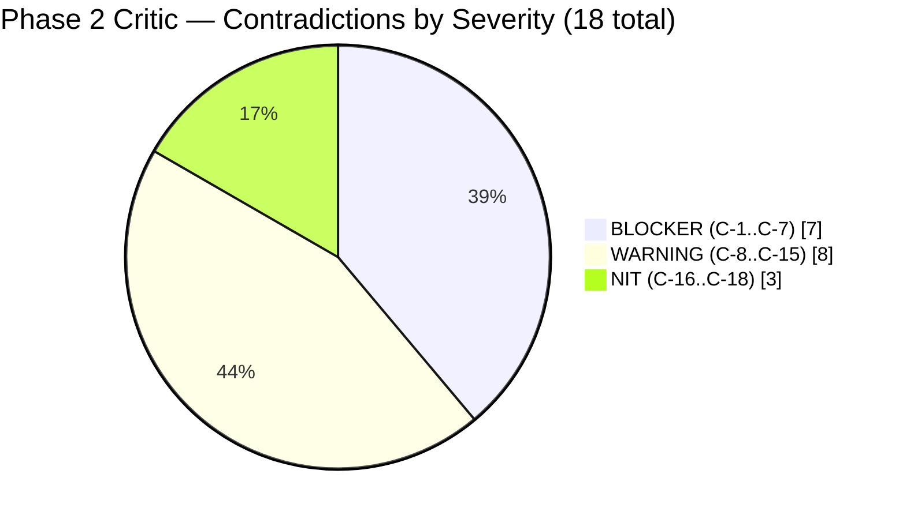
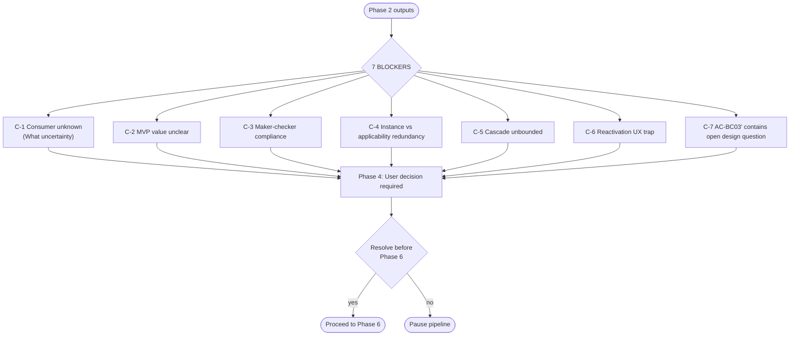

# Critic — Contradictions & Challenges for Phase 1 Output

> **Ticket**: CAP-185145
> **Phase**: 2 (Critic)
> **Method**: Adversarial review using principles.md C1–C7 scale + 5-Question Doubt Resolver + pre-mortem
> **Reviewer**: Critic skill (Phase 8 — Adversarial Self-Questioning, institutionalised)
> **Date**: 2026-04-18

---

## Summary

- **Total contradictions found**: 18
- **BLOCKERS** (must resolve before Phase 6): 7 — C-1, C-2, C-3, C-4, C-5, C-6, C-7
- **WARNINGS** (should address, may proceed): 8 — C-8, C-9, C-10, C-11, C-12, C-13, C-14, C-15
- **NITS** (nice-to-have clarifications): 3 — C-16, C-17, C-18

### Top 3 most important findings

1. **The entire feature rests on a C3 hypothesis with no consumer identified.** D-08 delegates ALL benefit application to "an external system," D-09 strips instances of value payload, and D-11 defers trigger mapping. If Phase 5 fails to identify a consumer, or the consumer needs fields we didn't model, we ship dead config. The "iterate later" fallback is C2 at best — loyalty platform APIs, once exposed to program managers, do not iterate cheaply. This is the `What` uncertainty (Principle 7) dressed up as `How` — and `What` uncertainty must be escalated to the human before design, not deferred to Phase 5. (See C-1.)

2. **The MVP has been hollowed out to the point where deliverable value is unclear.** With single-value `categoryType` (D-06), no trigger mapping (D-07), no value payload (D-09), and no maker-checker (D-05), a `BenefitInstance` is literally `(category_id, tier_id, is_active)` with audit columns. This duplicates `BenefitCategory.tier_applicability`. Why are these two entities? The BA does not justify the semantic distinction — it treats them as two things because the BRD did. (See C-2 and C-4.)

3. **Descoping maker-checker (D-05) is presented as a simple resourcing choice, but it is a compliance/policy change.** The BRD §5 explicitly requires `DRAFT → PENDING_APPROVAL → ACTIVE` for benefit configuration. On a production loyalty platform serving multiple orgs, a program manager creating a benefit category that downstream systems will consume is the definition of a change that needs a four-eyes control. The BA contains zero evidence that compliance, operations, or product-legal has signed off on "immediate mutation in MVP." "Add it back later" ignores that customer orgs already have configured expectations around approval flows (see ProductEx note on existing maker-checker scaffolding in intouch-api-v3). (See C-3.)

---

## Contradictions

### C-1: Consumer identity is unknown and this is treated as deferrable — [BLOCKER]

**Source**: BA §10 "Downstream Consumer Hypothesis", OQ-15, session-memory.md D-08, PRD §9 DEP-1, 00-ba-machine.md codebase_verification_targets["EMF tier event forest" with C3]
**Claim**: "The most likely consumer is the EMF tier event forest … If not confirmed: Escalate as a blocker before Phase 6 — we cannot freeze the API shape without knowing the consumer." (BA §10). OQ-15 is marked `blocking: false` for Phase 2 and `blocking: phase-6` for later.
**Challenge**: This is a **"What" uncertainty masquerading as a "How" uncertainty** (violates Principle 7). The API shape, field names, response envelopes, caching contract, idempotency rules, and error codes are ALL consumer-driven. Treating "which system consumes this" as a Phase 5 research chore is wrong ordering — it is a product-design question that should precede BA completion. The BA itself says "exact shape driven by consumer needs" (PRD §4) — yet it also proposes acceptance criteria (AC-BC01', AC-BC03', AC-BC12) and data model shapes in §8 as if the consumer constraints were known.
**Evidence needed**:
- Primary: a written commitment from product/engineering that names the consumer system(s) by component name (EMF tier event forest / peb / a new service).
- Secondary: reading the candidate consumers' code to verify they currently lack equivalent config, AND to confirm they accept the data shape we're proposing.
- Disconfirming: grep `emf-parent` for any existing read path that already looks up "categories per tier". If that exists, this entire feature may be duplicative.
**Pre-mortem**:
1. Phase 5 finds NO existing consumer. Feature ships dead config nobody reads. Orgs onboard, waste time configuring categories that have no effect, file tickets. Likelihood: [C3]. Mitigation: identify the consumer NOW, not Phase 5.
2. Phase 5 identifies a consumer but the consumer needs a `hint` or `discriminator` field we didn't model. API v1 ships without it. v2 requires schema migration and UI re-work. Likelihood: [C3]. Mitigation: design with the consumer's interface author in the room.
3. Phase 5 identifies the wrong consumer because we tried to fit the hypothesis. Actual consumer is a new service neither named nor scoped. Likelihood: [C2]. Mitigation: ask product to confirm, in writing, which Jira ticket ships the consumer.
**Original confidence**: "likely EMF tier event forest" — BA states [C3]. Correct rating.
**Calibrated confidence**: [C3] for EMF as consumer. But the **action** of proceeding to Phase 6 on a C3 consumer hypothesis is a **C4-or-higher-required decision** (Principle 2: irreversible + moderate confidence = pause). This is mis-sequenced.
**Recommendation**: Escalate to user BEFORE Phase 6. Options:
- (a) Pause pipeline until product names the consumer.
- (b) Change scope: split this ticket into (i) "design consumer-agnostic write-side CRUD" and (ii) "expose read API when consumer is named".
- (c) Spike: 2-day investigation in `emf-parent` to verify or refute the EMF tier event forest hypothesis. Result determines whether Phase 6 proceeds.

### C-2: MVP delivers no independent product value — [BLOCKER]

**Source**: D-06 (single `BENEFITS` enum), D-07 (no triggerEvent), D-08 (no awarding logic), D-09 (no value payload), D-11 (trigger mapping deferred), PRD §11 (FU-1 through FU-3 = the actual feature).
**Claim**: BA §1 describes the feature as "foundational plumbing … establishes the data shape and ownership boundary before downstream pieces are added in subsequent tickets."
**Challenge**: Steelman the opposing view: "A `BenefitCategory` with `categoryType=BENEFITS` (only value), no trigger, no value, and `BenefitInstance = (category_id, tier_id, is_active)` is a **tuple with a name**. It delivers zero end-user observable behaviour. It is not an MVP — it is a stub release. The BRD's value proposition ('benefits become a first-class product') is NOT delivered by this ticket; it is deferred to FU-1, FU-2, FU-3." The PRD's own Success Metrics §6 confirm this: "MVP delivery — All P0 stories shipped to prod" is an output metric, not an outcome. "Adoption — ≥N categories created per org" has a TBD target. "Consumer integration — Consumer system successfully reads config in first integration test" is listed but the consumer is not even identified (see C-1). There is no outcome metric that the business could point at and say "this is why we shipped."
**Evidence needed**: A statement from product owner confirming that (i) the user understands this MVP ships no end-user-visible loyalty behaviour, and (ii) there is appetite to ship three more tickets (FU-1 + FU-2 + FU-3 at minimum) before the feature is usable. Without (ii), this MVP is orphan code.
**Pre-mortem**:
1. FU-1 / FU-2 / FU-3 get deprioritised post-MVP. This ticket sits in prod unused for 6+ months. Eventually someone wants to re-scope and finds the v1 data shape doesn't match what the real feature needs. Likelihood: [C3]. Mitigation: ship as a private/flagged API only; do not onboard admin users.
2. Product changes its mind on the benefit model (closed enum vs open; per-type value vs generic JSON; etc.) after MVP ships and tables are in prod. Schema migration becomes lock-the-world work. Likelihood: [C3]. Mitigation: make all tables internal / private until FU-1 lands.
3. The UI team (from v0.app — DEP-4) builds against the v1 API, then has to rework when FU-1/2/3 land. Likelihood: [C4]. Mitigation: do not onboard UI until the data model is feature-complete.
**Original confidence**: Implicit C5 ("foundational plumbing"). Uncalibrated.
**Calibrated confidence**: [C3] that this MVP delivers independent value. The BA has not produced evidence that a (category, tier) tuple with no semantics is useful to anyone.
**Recommendation**: Ask product + engineering leadership: "Is it acceptable to ship CAP-185145 purely as internal plumbing (not user-visible, not UI-exposed, not integrated with the loyalty engine) until FU-1/2/3 land?" If yes, mark this as a plumbing release and drop the UI dependency (DEP-4). If no, rescope to include at minimum one functional category type end-to-end (FU-1 partial + FU-2 partial).

### C-3: Descoping maker-checker is a compliance/policy decision, not a resourcing call — [BLOCKER]

**Source**: D-05, BA §2.2, PRD §3 (non-goal 5), AC-BC01' "Creation is immediate."
**Claim**: "Maker-checker approval workflow is DESCOPED for MVP. All mutations are immediate." (BA §1, D-05). User answer to Q3 was "4 → A".
**Challenge**: The BRD §5 (brd-raw.md:1676–1679) states maker-checker is required:
> "All benefit instance configuration changes follow the DRAFT → PENDING_APPROVAL → ACTIVE state machine. Category creation (new categoryType) requires approval before instances can be created."

ProductEx confirmed (brdQnA.md line 28) that existing intouch-api-v3 already has maker-checker scaffolding for subscription programs, so the descope is not about missing infrastructure — it is about skipping a control that exists. On a production loyalty platform serving multiple customer orgs, "any admin can immediately create a config that downstream systems read and act on" has audit, compliance, and change-management implications:
- For some customer orgs, SOX-equivalent / PCI-equivalent controls may require four-eyes on changes that affect benefits (even if benefits are config-only, they determine member-facing entitlements once FU-1/2/3 land).
- Rolling back "someone changed tier applicability at 3am and everyone's instances cascade-deactivated" has no checker record.
- Re-introducing maker-checker later is NOT a pure additive change. Once an API shape is live without `lifecycle_state`, adding it requires either (a) breaking change, (b) a second endpoint, or (c) an abstraction on top. The "iterate later" fallback is not free.

The BA offers no evidence that compliance, operations, customer success, or any customer org has agreed "we will accept an admin console without maker-checker on benefit config, even temporarily."
**Evidence needed**:
- Product / compliance sign-off document for "no maker-checker in MVP."
- List of customer orgs affected and whether any of them have a contractual requirement for maker-checker on benefit config.
- Rollback plan for "oops, a customer org required maker-checker — how do we add it without breaking the admin UI?"
**Pre-mortem**:
1. One large customer org hits the MVP, discovers no maker-checker, escalates. Product has to hot-patch a fake approval workflow. Likelihood: [C3]. Mitigation: confirm customer orgs are bucketed into "maker-checker optional" tier before release.
2. An admin mis-configures and causes cascade deactivation of 1000+ instances at scale. No checker record. Audit cannot reconstruct intent. Likelihood: [C3]. Mitigation: at minimum, preserve a detailed audit log including `prev_state` → `new_state` diffs (the BA's NFR-4/NFR-7 are too thin for this).
3. Adding maker-checker in FU-4 becomes a breaking change because the initial API shape didn't reserve a `state` field. Likelihood: [C4]. Mitigation: add a nullable `lifecycle_state` column from day 1, even if unused, to keep the future-expansion door open (violates D-05's spirit but is pragmatic).
**Original confidence**: Implicit C5 ("descoped for MVP"). Driven by user answer, not evidence.
**Calibrated confidence**: [C2] that this descope is safe. No compliance evidence. No customer-org signal. No cost-of-reversal analysis.
**Recommendation**: Escalate. The user chose "4 → A" in 15 seconds. This is a multi-month-of-engineering-debt decision. At minimum, (i) verify with product ownership that descoping maker-checker is approved at the compliance level, and (ii) design the schema with a nullable `lifecycle_state` column today so FU-4 is not a breaking change.

### C-4: `BenefitInstance` is semantically redundant with `BenefitCategory.tier_applicability` — [BLOCKER]

**Source**: 00-ba.md §8.1 tier_applicability, §8.2 BenefitInstance; D-09; AC-BC03'; the "Design question" aside on AC-BC03' clause 3 (BA §5 "Phase 6 decides").
**Claim**: `BenefitCategory` has `tier_applicability` (which tiers this category is allowed for). `BenefitInstance` is `(category_id, tier_id, is_active)` — marks that a category is configured for a specific tier. FR-4 requires `instance.tier_id MUST be in parent category's tierApplicability`.
**Challenge**: Steelman the critic: "What is the semantic difference between 'tier X is in category C's applicability' and 'instance (C, X) exists and is active'? If both mean 'this category applies to this tier,' you have two tables storing the same fact with no additional information." Consider the four states:

| `tier_applicability` includes X | instance (C, X) exists & active | Meaning |
|---|---|---|
| no | no | Category does not apply to tier X — consistent |
| yes | no | Tier X is "allowed" but no instance — what does this mean? |
| yes | yes | Category applies to tier X — consistent |
| no | yes | Instance exists for disallowed tier — inconsistent (FR-4 forbids) |

The middle-row ambiguity is the crux. In the **original BRD**, the instance was meaningful because it carried the value (voucher amount, points, etc.) — so "tier applicable but no instance" meant "admin intends this tier to have this benefit but hasn't configured the value yet" (BRD §5 line 1674: "a category with no instances is considered Inactive"). **With D-09 (no value payload), the instance carries nothing additional.** So "tier applicable but no instance" has no information content. Either:
- (a) The new design is redundant and one of the two should be removed.
- (b) `tier_applicability` and "instance exists & active" are two levels of a lifecycle (applicability = declaration of intent; instance = actual activation), but this is not documented in the BA.
- (c) The instance is a placeholder for future value fields (FU-3) — in which case ship `tier_applicability` only in MVP, not both.

The BA does not address this. It inherits the two-entity shape from the BRD without examining whether both still make sense post-descope.
**Evidence needed**: A clear statement from product of WHY both the category's `tier_applicability` list and the `BenefitInstance` row need to exist in MVP. If the answer is "future value fields go on the instance," then MVP should have ONE list (either applicability or instances, not both) and add the other later.
**Pre-mortem**:
1. UI gets confused: does deactivating an instance also remove the tier from `tier_applicability`? Per FR-4 + AC-BC03' no — but a tier can then be in applicability with no active instance, which per FR-4 means a user can re-create an instance for it. Lifecycle of the same relationship in two places. Likelihood: [C5]. Mitigation: pick one. See recommendation.
2. Data drift: `tier_applicability` updates but instance for a now-removed tier already exists and is active. Orphan instance semantics. (The BA hand-waves re-activation as "Phase 6 decides" for clause 3 of AC-BC03'.) Likelihood: [C4]. Mitigation: add FR-N "updating tier_applicability cascades to instances" — or don't have both.
3. Developers can't explain the difference in code review. Bugs in service layer that set applicability without creating instance, or vice versa. Likelihood: [C5].
**Original confidence**: Implied C5 in the BA. No evidence given.
**Calibrated confidence**: [C2] that the two-entity design is coherent in the MVP shape. [C5] confidence that ONE of the two is redundant post-D-09.
**Recommendation**: Pick one:
- **Option A** (simpler, fewer tables, ship faster): keep only `BenefitCategory` with `tier_applicability`. Drop `BenefitInstance` entirely for MVP. Re-introduce it in FU-3 when it carries value payload. Reduces cascade complexity (C-5 below), reduces API surface, matches the fact that D-09 gave the instance nothing to carry.
- **Option B** (preserves forward shape): keep both but document the lifecycle explicitly. `tier_applicability` = "admin declares intent, tier is in consideration." `BenefitInstance (active)` = "admin has activated this tier-category binding — consumer should read this instance." Make FR-4 bidirectional: modifying `tier_applicability` to remove a tier cascade-deactivates that tier's instance. This makes them not redundant but linked.

Do NOT proceed to Phase 6 with the current ambiguous shape.

### C-5: Cascade transaction is unbounded — no scale limit stated — [BLOCKER]

**Source**: D-14, AC-BC12, FR-6, NFR-5, BA §8 diagram showing `UPDATE benefit_instance … WHERE category_id=?`.
**Claim**: "When a category's is_active flips to false, all child instances' is_active flip to false in the same DB transaction." (D-14, AC-BC12).
**Challenge**: What if a category has 10,000 instances? 100,000? The BA §7 NFR-1 says "Instance list within 500ms P95 for up to 1000 instances per program" — implying up to ~1000 is the design envelope. But the cascade is defined without a ceiling. In MySQL InnoDB:
- Row-level locks scale with rows touched. 10K locks held for the transaction duration.
- Replication lag on a single-statement cascade could delay reads across replicas for seconds.
- If one replica lags, and the consumer system (C-1) reads from the replica, it sees a partially-cascaded state — violating NFR-5 (consistency).
- What if a concurrent admin tries to reactivate an instance **mid-cascade**? The UPDATE statement holds the lock, so they queue. But the BA doesn't say anything about optimistic/pessimistic locking, or a retry policy, or deadlock handling.

No row-count cap. No batch size. No "if instance count > N, reject deactivation and require admin to deactivate instances first" escape hatch.
**Evidence needed**:
- Expected production instance-per-category distribution (p50, p95, p99 sizes).
- MySQL replication topology (sync vs async, lag SLA).
- Test for concurrent deactivate-reactivate race conditions.
- Lock escalation behaviour for large single-transaction updates.
**Pre-mortem**:
1. Category with 50K instances is deactivated. Transaction holds locks for 30+ seconds. Other admins doing unrelated work are blocked. Replication lag triggers monitoring alerts. Likelihood: [C3]. Mitigation: add instance-count guard (e.g., reject cascade if >5000, require chunked approach).
2. Admin deactivates at 3pm, UI shows success. Consumer (replica-backed) still sees 10K active instances for 4 seconds. During that window, a member-facing event fires and awards a benefit from the now-"deactivated" category. Likelihood: [C3]. Mitigation: specify consistency model — is the consumer allowed to read from replicas?
3. Admin reactivates category at 3:05pm expecting instances to come back. Per D-14, they don't. Admin is confused, files a ticket saying "your feature is broken." Likelihood: [C5]. Mitigation: UX must explicitly tell admin "reactivating category does not reactivate instances" at the moment of deactivation — not just as help-text.
**Original confidence**: Implicit C5 (in FR-6, NFR-5). Uncalibrated.
**Calibrated confidence**: [C3] that single-transaction cascade scales to production sizes. Missing scale evidence.
**Recommendation**: Before Phase 6, (a) product must provide expected instance-per-category distribution, (b) architecture must either cap cascade size or batch it, (c) consistency model wrt replicas must be explicit (consumer reads primary? or reads replica with eventual consistency?).

### C-6: Reactivation asymmetry is a UX trap — [BLOCKER]

**Source**: D-14 (reactivation does not cascade), AC-BC12 clause 5, US-6, US-10.
**Claim**: "A subsequent reactivation of C1 does NOT auto-reactivate I1/I2/I3. They must be reactivated individually."
**Challenge**: Consider Maya's UX:
- 3:00pm: Maya deactivates "Welcome Pack" category. All 50 instances cascade-deactivate. UI shows "Welcome Pack: INACTIVE, 50 instances deactivated."
- 3:05pm: Maya realises she clicked the wrong thing. She reactivates "Welcome Pack."
- Result: Category is active, 50 instances remain inactive. **There is no "undo" — just a new problem of 50 individual reactivations.**

This is classic asymmetric-action UI debt. The BA defends this with "prevents accidental re-enablement" (C-17 in session-memory). But that assumes the 3:00pm deactivation was *intentional*. If it wasn't, reactivation should reverse the deactivation — not leave a partial state.

The user answered "B1" for Q6 in 5 seconds. There is no evidence this asymmetry was examined against concrete user-journey tradeoffs. It also conflicts with AC-BC12's own audit trail: if the deactivation record shows "category + 50 instances deactivated at 3pm by Maya," and the reactivation record shows only "category reactivated at 3:05pm by Maya" — the audit trail invites the reader to assume instances are also back. They aren't.

Alternative designs not considered:
- (a) Reactivation cascades too (symmetric). Simple; matches user intuition; risk of accidental reactivation.
- (b) Reactivation offers the admin a choice: "reactivate this category only, or reactivate + all previously-cascaded instances?" Preserves control, avoids surprise. The BA does not propose this.
- (c) Time-window: if reactivation happens within N minutes of cascade-deactivation, instances come back automatically ("undo"). After N minutes, admin must reactivate individually.
**Evidence needed**: User research, product design review, or at minimum a written argument for why option (b) was rejected.
**Pre-mortem**:
1. Maya misclicks and deactivates a category. Instances silently die. Members stop receiving benefits. Members complain. Takes days to diagnose. Likelihood: [C4]. Mitigation: option (b) — present choice at reactivation time.
2. Support tickets pile up complaining "I reactivated my category and my benefits didn't come back." Likelihood: [C5]. Mitigation: UX must *prominently* warn at deactivation AND at reactivation.
3. An admin intentionally reactivates with the expectation of instances returning (because the BRD doesn't warn them). They start re-creating instances manually — creating duplicates (UNIQUE constraint on (category_id, tier_id) may block or may trigger the "reactivate existing inactive" path from AC-BC03' clause 3). Likelihood: [C3].
**Original confidence**: Implicit C5 ("prevents accidental re-enablement"). Not evidence-backed.
**Calibrated confidence**: [C3] that this is the right design. Alternative (b) is materially better and was not considered.
**Recommendation**: Replace D-14's reactivation policy with: "At reactivation time, present the admin with a choice: (i) reactivate category only, (ii) reactivate category AND all instances that were cascade-deactivated within the last 24 hours. Default = (i)." This preserves safety AND restores undo. Or: get explicit product approval of the current asymmetry with a written justification.

### C-7: The BenefitInstance duplicate-active-row re-activation rule is undefined and the BA punts to Phase 6 — [BLOCKER]

**Source**: AC-BC03' clause 3 — literally: `_[Design question: or return 409 and require explicit PATCH? Phase 6 decides. Default assumption: re-activate.]_`
**Claim**: "If an instance for (C1, Silver) exists but is inactive, the behaviour is a re-activation (update is_active=true) — NOT a new row."
**Challenge**: An acceptance criterion is not allowed to contain an open design question. This is an AC that isn't one. Per Rule 4 (Clarifying Questions), this should have been resolved with the user before Phase 1 completion, not deferred. Also — this decision has wider implications than a Phase 6 design call:
- It affects **data modelling**: UNIQUE (category_id, tier_id) vs UNIQUE on active rows only (partial index) vs no constraint.
- It affects **audit**: if reactivation updates the existing row, the original created_at/created_by is preserved but the semantics of `created_at` changes — is it "originally created" or "first existence"?
- It affects **idempotency**: NFR-6 says "Deactivating an already-inactive row is a no-op." But then reactivating via "create call" is NOT a no-op — it flips state. Subtle.
- It affects the API contract exposed to the consumer (C-1). If the consumer caches instance IDs, a POST that re-uses an old ID violates REST POST semantics.
**Evidence needed**: User decision + impact on data model.
**Pre-mortem**:
1. Developer implements "POST = insert new row" at Phase 10, missing the note. UNIQUE constraint fails at runtime. Bug in production. Likelihood: [C4]. Mitigation: resolve now, not Phase 6.
2. Phase 6 picks "return 409 and require PATCH." UI team (DEP-4) has already designed around the POST-reactivates flow. Rework. Likelihood: [C3].
**Original confidence**: Explicit "default assumption." So [C3] at best.
**Calibrated confidence**: [C3].
**Recommendation**: Decide now: POST is idempotent and reactivates (matches REST pragma); or POST on duplicate returns 409 + Location header pointing to the existing row; the admin must PATCH to reactivate. Either is defensible; the BA must pick one.

### C-8: CF-01 / BE-01 (UUID vs int PK) was decided by default, not discussion — [WARNING]

**Source**: 00-ba-machine.md entities ("`id: long, role: pk`"), ProductEx brdQnA.md CF-01 and BE-01 (marked HIGH severity, status: **open**).
**Claim**: BA chose `long PK` implicitly for both new entities.
**Challenge**: ProductEx flagged BE-01 as a **blocking question** — "must be resolved before schema migration is written." The BA silently chose `long` (matching existing int-PK platform pattern). This is a reasonable default, BUT:
- The BRD explicitly specifies `String (UUID)` (brd-raw.md:1414).
- Choosing `long` means the BRD field-shape is wrong and the API contract needs re-negotiation with UI team.
- Composite keys with `org_id` (the existing pattern — C6 per ProductEx) would mean `long id` alone is not a PK — it's `(org_id, id)`. The BA doesn't clarify this.
- Session-memory.md says "Existing Benefits entity uses int PK + org_id composite." Has the BA actually verified whether new entity PKs should be composite or standalone?
**Evidence needed**: Look at `Benefits.java` @EmbeddedId / BenefitsPK pattern. If new entities should also use composite keys, the data model in BA §8 is wrong. If they should use standalone `id`, the BA is right but the deviation from platform convention needs an ADR.
**Pre-mortem**:
1. Phase 7 designer reads the BA, writes entity with `@Id Long id`. Phase 6 architect realises composite-key pattern is needed for tenancy consistency. Rework. Likelihood: [C3]. Mitigation: resolve PK shape before Phase 6.
2. Thrift IDL types downstream expect `i64` but new entity is `varchar(36)` UUID. Mismatch. Likelihood: [C2] (only if someone flips to UUID).
**Original confidence**: Implicit C5 for `long`. Not justified.
**Calibrated confidence**: [C4] for `long` PK (matches platform). [C2] for standalone (non-composite) — the existing pattern is composite and BA hasn't justified the deviation.
**Recommendation**: Add an ADR seed in BA §8 stating: "id PK choice: `long` standalone (not composite with org_id). Deviation from existing Benefits pattern. Rationale: org_id is a scope column, not part of identity, since a BenefitCategory is uniquely identified by its id globally. To be ratified in Phase 6." And explicitly close BE-01 / CF-01 before Phase 6.

### C-9: Name uniqueness rule has unspecified edge cases — [WARNING]

**Source**: AC-BC02, BA §8.1 ("case-insensitive match on write"), FR-3, C-18.
**Claim**: "Same name permitted in different program." "categoryName unique per program (program_id, name)." "Case-insensitive match."
**Challenge**: The following edge cases are NOT addressed:
- **Trailing/leading whitespace**: is "Welcome Pack" == "Welcome Pack " (trailing space)? Most platform conventions trim; the BA doesn't say.
- **Unicode normalization**: is "Café" (composed) == "Café" (decomposed)? Different byte sequences, visually identical.
- **NULL / empty string**: is "" a valid name? Is NULL? The DB UNIQUE constraint treats NULL as "not equal to NULL" in MySQL.
- **Max length**: not specified. `VARCHAR(255)`? `VARCHAR(100)`? This needs to match UI input limits.
- **Case-insensitive collation**: to enforce case-insensitive uniqueness at DB level in MySQL requires either `utf8mb4_general_ci` collation on the column (default CI), or a computed lowercased column with UNIQUE. Service-layer pre-check alone is racy.
- **Inactive row conflict**: AC-BC02 says "any user attempts to create another category named 'Welcome Pack'" — if an INACTIVE category with that name exists, does this still 409? The BA says yes: "already exists for another active or inactive category in the same program" (AC-BC01' clause 3). That's arguably wrong — if a category was deactivated, the name should be reusable. Or is reuse forbidden because of ID history confusion? Not discussed.
**Evidence needed**: Read existing platform conventions for name-trim, case-handling. Decide inactive-conflict behaviour.
**Pre-mortem**:
1. QA files bug: "I deactivated 'Welcome Pack', tried to create a new 'Welcome Pack', got 409. Is this intended?" Likelihood: [C5]. Mitigation: resolve in AC-BC02 text explicitly.
2. Two admins race-create "Welcome Pack" at the same microsecond. Service-layer check both pass. DB UNIQUE catches one. Error message is ugly. Likelihood: [C2].
3. Name with trailing whitespace bypasses "Welcome Pack" uniqueness. "Welcome Pack " and "Welcome Pack" coexist. UI shows them as duplicates. Likelihood: [C3].
**Original confidence**: Implicit C5. Too high for unspecified edge cases.
**Calibrated confidence**: [C4] for the general rule; [C2] for completeness.
**Recommendation**: In AC-BC02, add: max length = 100 chars, trimmed on write, case-insensitive at DB (collation) level, inactive rows BLOCK new creation of same name (or explicitly allow — pick one with rationale), empty and NULL are both rejected with HTTP 400.

### C-10: `tier_applicability` physical representation is unresolved and affects queryability — [WARNING]

**Source**: BA §8.1 ("Physical representation — JSON column, link table, or array — decided in Phase 7"), ProductEx BE-04 (marked open).
**Claim**: Defer to Phase 7.
**Challenge**: This is the single most impactful data-modelling decision in the feature, and it drives:
- **Consumer read patterns (C-1)**: Can the consumer efficiently query "which categories apply to tier X?" If JSON column, requires JSON_CONTAINS (slow, not indexed). If junction table, requires a join but is fast.
- **Migration cost for tier_applicability updates**: JSON requires read-modify-write. Junction requires INSERT/DELETE.
- **Cascade behaviour**: the BA diagram shows `UPDATE benefit_instance … WHERE category_id=?`. That's the instance side. But updating `tier_applicability` to remove a tier also has cascade implications on instances (see C-4) — cheaper with junction.
- **NFR-1**: "Category list P95 <500ms" depends heavily on whether lists JOIN the applicability list.

Deferring this to Phase 7 is fine for table design details, but the BA should have at least pre-emptively flagged: "this choice has consumer API implications; Phase 6 must pick BEFORE Phase 7."
**Evidence needed**: Read `pointsengine-emf` for existing tier-array storage patterns. Look at `PartnerProgramTierSyncConfiguration` for precedent.
**Pre-mortem**:
1. Phase 7 picks JSON. Phase 5 reveals consumer queries by tier frequently. Performance requires a reverse index. Rework. Likelihood: [C3].
**Calibrated confidence**: [C3] for deferral being safe.
**Recommendation**: In Phase 6 (architect), make the `tier_applicability` storage choice BEFORE Phase 7 starts, using consumer query patterns from Phase 5 as input. Do not let Phase 7 design this in isolation.

### C-11: Cross-org data leak risk is asserted without enforcement detail — [WARNING]

**Source**: FR-8, NFR-3, D-16, C-19.
**Claim**: "A user MUST NOT be able to read or modify another org's categories/instances even if they guess an ID." "All reads/writes scoped by auth context org_id."
**Challenge**: The BA states the requirement but does not say WHERE it is enforced:
- At the HTTP layer (middleware injecting WHERE org_id = :authCtx)?
- At the service layer (every method takes orgCtx and filters)?
- At the DAO / repository layer (org_id in every query)?
- Via row-level security in MySQL (unlikely for Capillary stack)?

The difference matters because:
- Middleware-only is fragile — any service method that does a direct query bypasses it.
- DAO-only is fragile — any service that forgets to pass orgCtx bypasses it.
- Belt-and-braces (service + DAO) is robust but verbose.

Existing Capillary pattern isn't cited. The session-memory notes "Capillary platform pattern uses org_id on core tables" at C6 — but pattern-of-storage is different from pattern-of-enforcement. No evidence that the BA has verified the existing enforcement pattern.
**Evidence needed**: Grep for how other Capillary entities (Benefits, PartnerProgramTierSyncConfiguration) enforce org_id in queries. Is there a @Filter / @Where / aspect / common DAO base class pattern?
**Pre-mortem**:
1. Developer writes a new DAO method and forgets org_id. Cross-org read passes. Security bug in prod. Likelihood: [C4] (new devs commonly miss this). Mitigation: enforce via ORM-level Hibernate @Filter or a mandatory query parameter on a base repository.
2. Admin in org A guesses id=1 and GETs /categories/1. It returns org B's category. Likelihood: [C4]. Mitigation: every ID-based endpoint MUST re-check org_id from auth context.
**Calibrated confidence**: [C3] that the assertion is actually enforceable without a named pattern.
**Recommendation**: Before Phase 6, identify (and cite code) the existing Capillary tenancy-enforcement pattern. Add an NFR: "All new DAO methods MUST include org_id in WHERE clause; verified by integration test at Phase 9 that explicitly attempts cross-org access."

### C-12: "No FK from new entities to legacy Benefits" + naming collision = maintainability risk — [WARNING]

**Source**: D-12, C-14, BA §3 Glossary, OQ-11 / DT-01.
**Claim**: "Strict coexistence with legacy Benefits entity. Glossary in BA doc will spell out the distinction."
**Challenge**: Both entities are called "Benefit". Both are tier/program-scoped. Both have `is_active`. Both have audit columns. Code readers / SQL writers / UI copywriters / support team will routinely confuse them. The glossary is a documentation mitigation — not a code-level one.

Worse: "no FK, no column, no shared code" ALSO means:
- No way to mark in the legacy `Benefits` table "this benefit belongs to the new category C" — which is what BE-05 asks about. If Phase 5 confirms legacy `Benefits` is being superseded but not migrated, the two systems coexist forever with no linkage.
- If a field matures in legacy Benefits (e.g., `expiry_policy`), and admins want it on new categories too, we must duplicate the field. No shared code.
- "Unification (if ever) is a future epic" (D-12) — this is a polite way of saying "never."
**Evidence needed**: A proposed naming convention for the new entities that is NOT "Benefit" (e.g., `BenefitConfig`, `LoyaltyCategory`, `BenefitGroup`, `ProgramBenefitCategory`). Ship that, migrate later.
**Pre-mortem**:
1. Developer imports `com.capillary.Benefits` thinking they got the new one. Legacy code. Bug. Likelihood: [C4]. Mitigation: rename the new entity to be unambiguous.
2. SQL query `SELECT * FROM benefits` accidentally hits legacy table. Support ticket triaged to wrong team. Likelihood: [C3].
3. PR reviewer waives "Benefit vs Benefit" confusion because "glossary explains it." 6 months later a new hire inherits both entities and can't distinguish. Likelihood: [C5].
**Calibrated confidence**: [C3] that glossary-only mitigation is sufficient.
**Recommendation**: Propose a different name (e.g., `BenefitCategory` is okay if the class is clearly distinct from `Benefits`, but table name should NOT be `benefits_*`; use `loyalty_benefit_category` or similar). Decide in Phase 6.

### C-13: ProductEx BE-05 (promotion_id on legacy) is dismissed as "moot" but the dismissal isn't justified — [WARNING]

**Source**: ProductEx BE-05 (HIGH severity, blocking), session-memory.md D-12, D-08.
**Claim**: ProductEx asked: "Will new Benefit Instances require a backing promotion?" Implicit BA answer: No (D-09 = no value payload; D-08 = awarding is external; D-12 = no link to legacy). ProductEx's flag is treated as resolved.
**Challenge**: The existing `benefits` table has `promotion_id NOT NULL`. All existing member-facing benefit awards (VOUCHER/POINTS) route through promotions. If the new BenefitCategory/BenefitInstance is consumed by a reader that eventually needs to issue a voucher or award points, that reader will need to either (a) create a promotion on the fly (non-trivial), or (b) bypass promotions entirely (a new pathway). Neither is currently modelled.

By saying "awarding is external" (D-08) the BA has handed off this problem to an unnamed system (C-1). That unnamed system will need to either create promotions, or bypass them — either decision is a bigger architectural change than the BA has accounted for.
**Evidence needed**: Identify the consumer (C-1), then verify whether that consumer currently uses promotions to issue rewards, and whether it can issue without them.
**Calibrated confidence**: [C2] that BE-05 is genuinely resolved by D-08/D-09/D-12.
**Recommendation**: Keep BE-05 as open, not resolved. Revisit in Phase 5 after consumer is identified.

### C-14: Missing AC-BC04 / AC-BC05 / AC-BC06 are noted but not chased — [WARNING]

**Source**: OQ-4, BA §2.3, PRD §7.
**Claim**: "BRD numbering skips AC-BC04, AC-BC05, AC-BC06. Intentional gap or content missing?" — marked non-blocking, "defer to review."
**Challenge**: A gap in acceptance criteria numbering is always evidence of one of: (a) editorial mistake (harmless), (b) content was in a prior BRD version and is now silently missing (dangerous), (c) the product owner knew about it and skipped it on purpose (fine, but should be confirmed).

Treating this as "non-blocking" assumes (a) without evidence. If it is (b), we are missing 3 acceptance criteria. In a loyalty platform, 3 acceptance criteria is significant coverage.
**Evidence needed**: 5-minute email to Surabhi Geetey (BRD author): "Are AC-BC04/05/06 intentional gaps or missing content?"
**Pre-mortem**:
1. Mid-Phase 10 someone finds an older BRD draft with AC-BC04 = "Category shows creation history audit log for the last 90 days." Suddenly we have a missed requirement.
2. Customer UAT at Phase 2-rollout: "What happened to AC-BC05? That was the one about permission groups."
**Calibrated confidence**: [C3] that there's nothing missing. Not a fact.
**Recommendation**: Actually chase OQ-4. Don't defer "for later." The cost is a 5-minute email.

### C-15: NFR-1 performance numbers are asserted without baseline — [WARNING]

**Source**: NFR-1: "Category list API returns within 500ms P95 for a program with up to 200 categories. Instance list within 500ms P95 for up to 1000 instances per program."
**Claim**: 500ms P95, up to 200 / 1000 rows.
**Challenge**: These numbers have no evidence behind them. Are they realistic? Are they conservative? Are they consistent with other Capillary APIs (e.g., `/benefits` list)?
- 500ms for 200 rows is ample (~2.5ms/row). Conservative.
- 500ms for 1000 rows is plausible (0.5ms/row) but sensitive to query plan, join complexity, serialization cost.
- "200 categories per program" — is that a business ceiling or a performance ceiling? If it's a business ceiling, what happens when someone has 201? If it's a performance ceiling, what happens when Phase 5 reveals a program with 5000 categories?
**Evidence needed**: Look at existing API SLAs in Capillary (e.g., `benefitsListAPI`). Align.
**Pre-mortem**:
1. QA tests with 10,000 instances and fails. Blame falls on NFR. Likelihood: [C3]. Mitigation: pick realistic numbers based on actual business data.
**Calibrated confidence**: [C3] that 500ms is right.
**Recommendation**: Replace NFR-1 numbers with "matches existing `/benefits` list endpoint SLA (value TBD in Phase 6 from platform-standard)." OR provide evidence for 500ms.

### C-16: PRD §3 mixes "out of scope" with "out of domain" — [NIT]

**Source**: PRD §3 Non-Goals.
**Claim**: "Benefit awarding / application logic" is listed as a non-goal. So is "Matrix View UI", "Subscription picker", etc.
**Challenge**: These are three different things:
- "Benefit awarding logic" is a capability this feature explicitly does not own, full stop (out of domain).
- "9 category types' semantics" is in-domain but deferred to FU-1 (out of scope for MVP).
- "aiRa mapping" is cross-cutting, owned by a separate team (out of scope of this feature forever).

Lumping them together obscures what is temporary-descoped vs architecturally-excluded-forever. Future engineers reading this will be confused about which ones will ever be revisited.
**Recommendation**: Split PRD §3 into "Out of Domain (never)" and "Out of Scope for MVP (planned in FU-*)."

### C-17: Success metric "0 orphaned instances" is measured by a cron we haven't designed — [NIT]

**Source**: PRD §6 row "Data integrity" / "Cron audit query + observability."
**Claim**: 0 orphaned instances.
**Challenge**: We don't have a cron. We haven't designed the audit query. How will success actually be validated? This is a metric we can't currently measure.
**Recommendation**: Either design the cron + audit query as part of this ticket (Phase 7 deliverable), or change the metric to a real-time constraint ("instance table CHECK constraint + service-layer test") that we can verify.

### C-18: "Consumer System" persona entry is fictional — [NIT]

**Source**: PRD §4 table row "Consumer System (TBD)" / session-memory 00-prd-machine.md personas.
**Claim**: Treats the unknown consumer as a persona.
**Challenge**: A persona with the notation "(TBD)" is a placeholder, not a persona. This is acceptable for early BA work but misleading in a PRD that is about to be signed off. A PRD should not have fictional personas. Either name the consumer, or remove the persona and move the concern to Dependencies.
**Recommendation**: Cosmetic — move to Dependencies or remove until consumer is named (C-1).

---

## QUESTIONS FOR USER (before Phase 4 blocker resolution)

These are the questions that MUST be answered before proceeding to Phase 6. Some are "What" uncertainties (Principle 7) that require human input.

1. **C-1 / OQ-15**: Which backend system will consume this config? Can you name the component (EMF tier event forest? peb? a new service?). If unknown, do we pause the pipeline, OR reduce scope to "internal config registry only, no public read API" until the consumer is named?

2. **C-2**: Is it acceptable to ship CAP-185145 purely as internal plumbing (not user-visible, not UI-exposed, not integrated with the loyalty engine) until FU-1/2/3 land? If no, we need to reintroduce at least one category type end-to-end into MVP.

3. **C-3**: Has compliance / product-legal / customer-success signed off on descoping maker-checker in MVP? Is there any customer org that contractually requires maker-checker? Are we comfortable shipping a `lifecycle_state` column as nullable on day 1 to avoid a breaking change when FU-4 lands?

4. **C-4**: Pick one: (a) drop `BenefitInstance` entirely in MVP and use only `tier_applicability` (re-introduce Instance in FU-3 when it carries value), OR (b) keep both but make `tier_applicability` updates cascade to instances (and document the lifecycle). Which?

5. **C-5**: What is the expected p95 / p99 instances-per-category count in production? Is there a ceiling we can bake into a cascade-guard? Do consumers read from replicas (matters for consistency after cascade)?

6. **C-6**: At reactivation of a category, do you want (a) no cascade (current design — accidental loss of 50 instances if deactivation was a misclick), (b) cascade (matches user intuition), or (c) admin-choice at reactivation time? The current design is (a). Recommend (c).

7. **C-7 (AC-BC03' clause 3)**: POST for an existing-but-inactive (category, tier) pair — does it (i) reactivate the row and return 200, or (ii) return 409 and require explicit PATCH? Pick one now.

8. **C-8 / CF-01 / BE-01**: PK choice — confirm `long` standalone (not composite with org_id). This deviates from existing Benefits `(org_id, id)` composite. Do you want an ADR seed?

9. **C-9**: Name rules — max length, trim behaviour, case sensitivity at DB level, and whether inactive-same-name blocks new creation (or frees the name).

10. **C-12**: Should new tables/entities use the name "BenefitCategory" (collision risk with legacy Benefits), or a less ambiguous name (e.g., `LoyaltyBenefitCategory`, `BenefitConfig`)?

11. **C-14 / OQ-4**: Can you send a 2-line email to Surabhi Geetey confirming AC-BC04/05/06 are intentional gaps? Cost: 5 minutes; avoids a rediscovery later.

---

## ASSUMPTIONS MADE (verify or override)

Things I assumed while critiquing — please verify or override:

1. **Assumed** customer orgs do NOT have hard-coded contractual requirements for maker-checker. If any do, C-3 escalates from WARNING to hard BLOCKER.
2. **Assumed** the existing `intouch-api-v3` maker-checker scaffolding is documented and reusable (per ProductEx's line 28). Not independently verified.
3. **Assumed** MySQL is InnoDB with typical Capillary async-replica topology. Replica lag concerns in C-5 depend on this.
4. **Assumed** `Benefits` legacy entity does in fact use `@EmbeddedId BenefitsPK` with composite `(org_id, int_id)` — per ProductEx at C6; not independently verified in this review.
5. **Assumed** UI will be built by a separate team reading the API contract (per DEP-4). If UI is in-repo, the C-12 naming-collision risk goes up, not down.
6. **Assumed** "reactivation does not cascade" (D-14) was driven by user snap-answer "B1" without hours of product consideration. If there is deeper product research behind B1, C-6 downgrades from BLOCKER to WARNING.
7. **Assumed** the v2 BRD has not been superseded by a v3 with updated AC numbering. If a v3 exists, OQ-4 / C-14 may be already answered.
8. **Assumed** the user genuinely wants an adversarial review and not a validation of choices. If this critique is perceived as overstepping, please tell me and I'll calibrate scope for future phases.

---

_End of Critic output. This document is input to Phase 4 (Blocker Resolution) and Phase 3 (User Review). Do not proceed to Phase 6 until BLOCKERS C-1 through C-7 are resolved or explicitly acknowledged as accepted risk._

---

## Diagrams

### Findings Distribution by Severity



### Confidence Calibration — BA's Implicit Confidence vs Critic's Calibrated Score

```mermaid
flowchart LR
    subgraph BA["BA Original (implicit)"]
        BA1[Consumer = EMF C3]
        BA2[MVP delivers value C5]
        BA3[Descope maker-checker C5]
        BA4[Two-entity design C5]
        BA5[Cascade in single txn C5]
        BA6[Reactivation asymmetry C5]
        BA7[long PK C5]
    end
    subgraph CR["Critic Calibrated"]
        CR1[C3 — action requires C4+]
        CR2[C3 — no outcome metric]
        CR3[C2 — no compliance evidence]
        CR4[C2 — semantic redundancy]
        CR5[C3 — no scale cap]
        CR6[C3 — option (c) not considered]
        CR7[C4 match / C2 vs composite]
    end
    BA1 -->|⬇| CR1
    BA2 -->|⬇| CR2
    BA3 -->|⬇⬇⬇| CR3
    BA4 -->|⬇⬇⬇| CR4
    BA5 -->|⬇⬇| CR5
    BA6 -->|⬇⬇| CR6
    BA7 -->|⬇⬇⬇| CR7
```

### Blockers → Resolution Path (for Phase 4)



