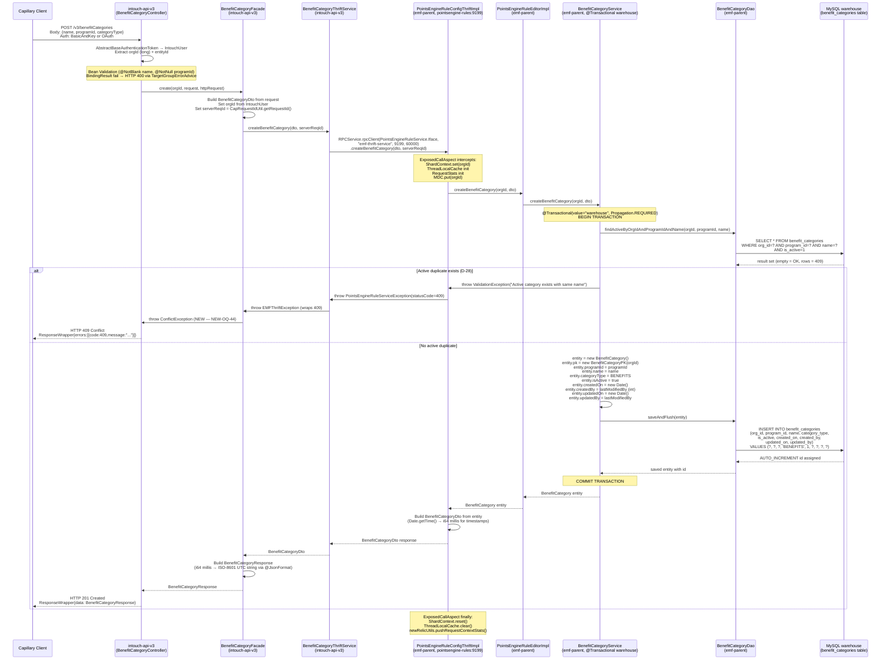
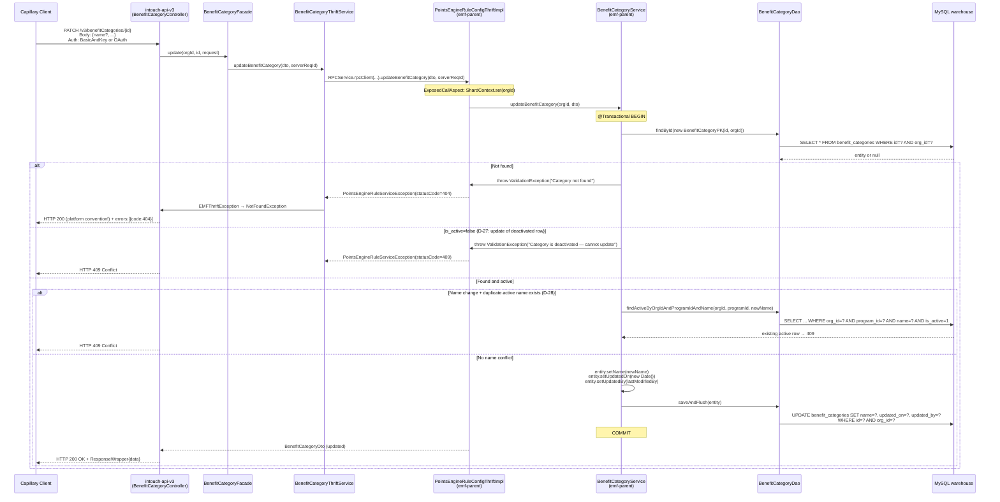
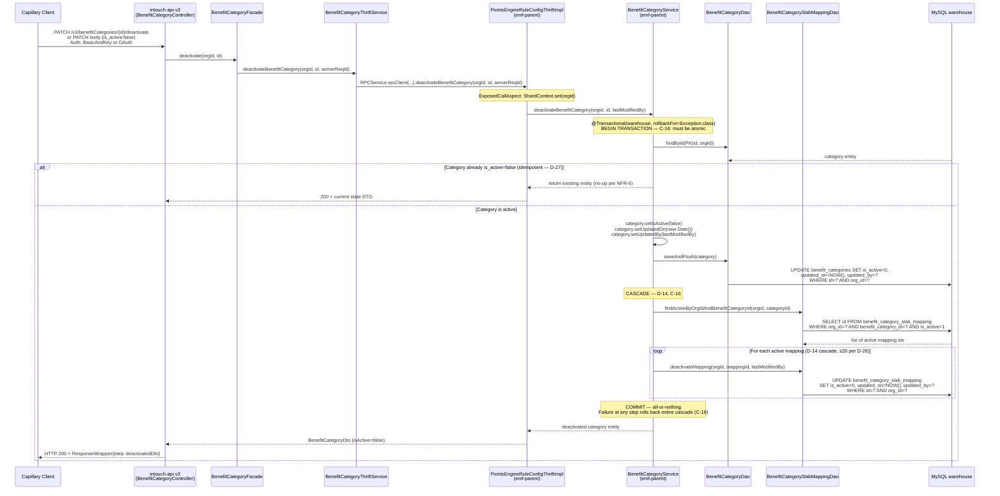
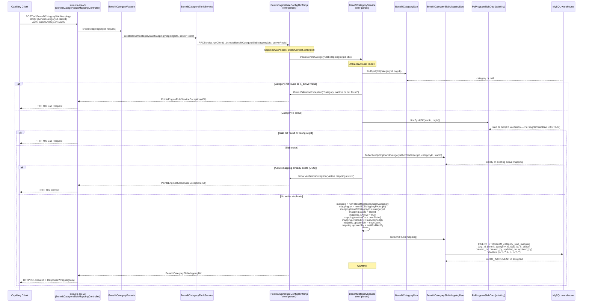
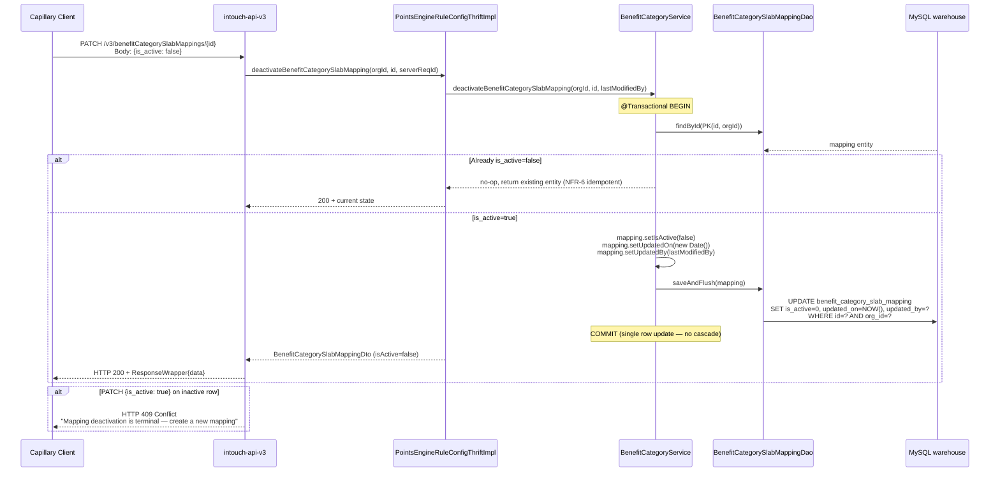
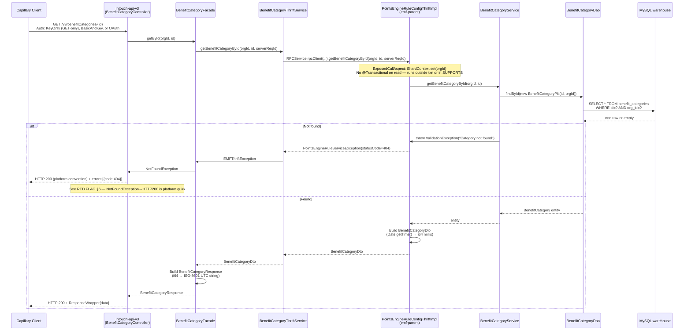
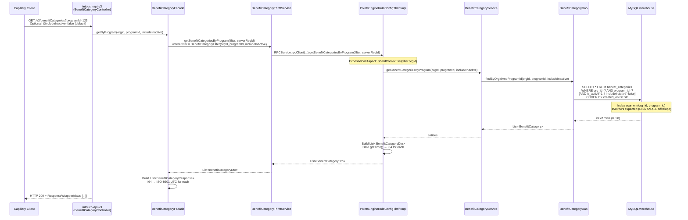
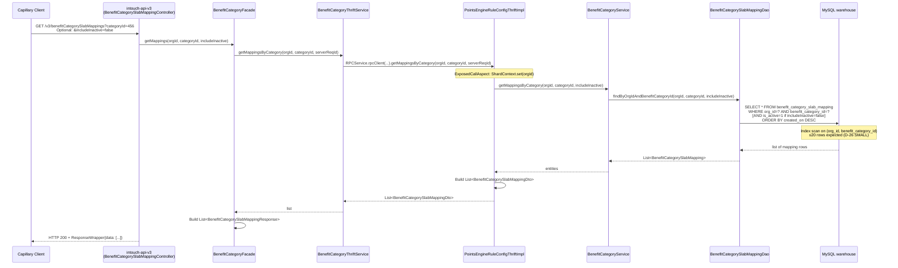

# Cross-Repo Trace — Benefit Category CRUD
> **Ticket**: CAP-185145
> **Phase**: 5 — Cross-Repo Tracer
> **Date**: 2026-04-18
> **Skill**: `/cross-repo-tracer`
> **Source documents**: session-memory.md, 00-ba-machine.md, blocker-decisions.md, code-analysis-emf-parent.md, code-analysis-intouch-api-v3.md, code-analysis-cc-stack-crm.md, code-analysis-thrift-ifaces.md

---

## 1. Operations Inventory

| # | Operation | HTTP Method | URL Path | Thrift Method | Kind |
|---|-----------|-------------|----------|---------------|------|
| 1 | Create Benefit Category | POST | `/v3/benefitCategories` | `createBenefitCategory` | Write |
| 2 | Get Category by ID | GET | `/v3/benefitCategories/{id}` | `getBenefitCategoryById` | Read |
| 3 | List Categories by Program | GET | `/v3/benefitCategories?programId={id}` | `getBenefitCategoriesByProgram` | Read |
| 4 | Update Benefit Category | PUT/PATCH | `/v3/benefitCategories/{id}` | `updateBenefitCategory` | Write |
| 5 | Deactivate Benefit Category | PATCH | `/v3/benefitCategories/{id}/deactivate` | `deactivateBenefitCategory` | Write |
| 6 | Create Slab Mapping | POST | `/v3/benefitCategorySlabMappings` | `createBenefitCategorySlabMapping` | Write |
| 7 | Get Mappings for Category | GET | `/v3/benefitCategorySlabMappings?categoryId={id}` | `getBenefitCategorySlabMappings` (proposed: `getMappingsByCategory`) | Read |
| 8 | Update Slab Mapping | PATCH | `/v3/benefitCategorySlabMappings/{id}` | `updateBenefitCategorySlabMapping` (NOTE: D-27 makes this deactivate-only in MVP; see §Write Paths) | Write |

**Note on operation #8**: D-27 declares deactivation as one-way-terminal. In MVP there is no `update` path for a slab mapping except deactivating it (PATCH `{is_active: false}`). The operation here labelled "updateBenefitCategorySlabMapping" is effectively `deactivateBenefitCategorySlabMapping` — the proposed Thrift IDL in code-analysis-thrift-ifaces.md names it `deactivateBenefitCategorySlabMapping`.

---

## 2. Write Paths

### 2.1 Write Path: createBenefitCategory



**Step-by-step trace with repo ownership:**

| Step | Action | Repo | File |
|------|--------|------|------|
| 1 | POST /v3/benefitCategories received; token resolved to IntouchUser | intouch-api-v3 | `BenefitCategoryController` (NEW) |
| 2 | Bean Validation on request body (@NotBlank name, @NotNull programId) | intouch-api-v3 | `BenefitCategoryRequest` DTO (NEW) |
| 3 | Facade builds BenefitCategoryDto; sets orgId, serverReqId | intouch-api-v3 | `BenefitCategoryFacade` (NEW) |
| 4 | `RPCService.rpcClient(...).createBenefitCategory(dto, serverReqId)` over TCP to port 9199 | intouch-api-v3 → emf-parent | `BenefitCategoryThriftService` (NEW) |
| 5 | ExposedCallAspect intercepts: ShardContext.set(orgId), ThreadLocalCache init | emf-parent | `ExposedCallAspect.java` (EXISTING, no change) |
| 6 | Handler delegates to editor | emf-parent | `PointsEngineRuleConfigThriftImpl` (MODIFIED — new methods) |
| 7 | Editor delegates to service | emf-parent | `PointsEngineRuleEditorImpl` (MODIFIED — new methods) |
| 8 | Service opens @Transactional(warehouse) transaction | emf-parent | `BenefitCategoryService` (NEW, @Transactional) |
| 9 | Active-duplicate check: SELECT against benefit_categories | emf-parent | `BenefitCategoryDao` (NEW) |
| 10 | If no duplicate: INSERT new row into benefit_categories | emf-parent → MySQL | `BenefitCategoryDao.saveAndFlush()` |
| 11 | COMMIT; entity returned up the stack | emf-parent | `BenefitCategoryService` |
| 12 | Handler converts Date → i64 millis (Date.getTime()) | emf-parent | `PointsEngineRuleConfigThriftImpl` |
| 13 | Thrift response marshalled back over wire | thrift-ifaces | Generated stubs from new IDL |
| 14 | Facade converts i64 → ISO-8601 UTC (@JsonFormat timezone=UTC) | intouch-api-v3 | `BenefitCategoryResponse` DTO (NEW) |
| 15 | HTTP 201 Created + ResponseWrapper{data} | intouch-api-v3 | `BenefitCategoryController` |

**Data flow:**
```
Client JSON: {name, programId, categoryType}
  → intouch-api-v3: BenefitCategoryRequest DTO (Jackson deserialization)
    → BenefitCategoryDto (Thrift wire struct: i32 orgId, i32 programId, string name, BenefitCategoryType)
      → BenefitCategory JPA entity (OrgEntityIntegerPKBase PK, java.util.Date timestamps)
        → MySQL row: benefit_categories (int id, int org_id, int program_id, varchar name, enum categoryType, ...)
```

**Transaction boundary:** Service layer in emf-parent — `@Transactional(value="warehouse", propagation=REQUIRED)` on `BenefitCategoryService`. The Thrift handler carries no `@Transactional`; the editor/facade layer carries no `@Transactional`.

**Idempotency (D-28, D-29):** NOT idempotent by design. Two POSTs with the same name create two rows if the first has been deactivated (D-29 — name reuse allowed after soft-delete). Two concurrent POSTs with same name and same active state: race condition exists (OQ-42). Mitigation: MySQL advisory lock `GET_LOCK(...)` at service layer before the SELECT-then-INSERT. See OQ-42 — deferred to Phase 7 Designer.

---

### 2.2 Write Path: updateBenefitCategory



**Data flow:** `PATCH request` → `BenefitCategoryDto (Thrift)` → `JPA entity mutation (setters)` → `UPDATE SQL row`.

**Transaction boundary:** Same as create — `BenefitCategoryService @Transactional(warehouse)`.

**Idempotency:** PATCH with same name on already-updated row is idempotent in effect (name unchanged, but `updated_on` / `auto_update_time` will update). D-28 blocks only duplicate-name conflict against OTHER active rows.

---

### 2.3 Write Path: deactivateBenefitCategory (cascade)



**Cascade semantics (D-14, C-16):** Category deactivation → all active child `benefit_category_slab_mapping` rows set `is_active=0` in the SAME transaction. At D-26 SMALL scale (≤20 mappings/category), a single transaction with ≤21 UPDATE statements is well within InnoDB limits.

**Data flow:** `PATCH` → `i32 orgId + i32 id` (Thrift params) → `BenefitCategory.is_active=false + List<BenefitCategorySlabMapping>.is_active=false` → `UPDATE benefit_categories + N UPDATE benefit_category_slab_mapping` in one DB transaction.

**Transaction boundary:** `BenefitCategoryService` — full cascade covered by a single `@Transactional(warehouse)` context. The cascade loop must NOT spawn a new transaction (use `Propagation.REQUIRED` or `MANDATORY` on mapping deactivation to stay in the same transaction).

**Idempotency (D-27, NFR-6):** Deactivating an already-inactive category is a no-op (return existing state, no DB write). Consistent with D-27 (deactivation terminal) — calling deactivate twice does not error.

---

### 2.4 Write Path: createBenefitCategorySlabMapping



**Data flow:**
```
Client JSON: {benefitCategoryId, slabId}
  → BenefitCategorySlabMappingRequest DTO (intouch-api-v3)
    → BenefitCategorySlabMappingDto (Thrift wire: i32 orgId, i32 benefitCategoryId, i32 slabId)
      → BenefitCategorySlabMapping entity (OrgEntityIntegerPKBase PK)
        → MySQL row: benefit_category_slab_mapping (int id, int org_id, int benefit_category_id, int slab_id, ...)
```

**FK validation:** Service queries `PeProgramSlabDao` (existing DAO, no modification needed) to confirm `(slabId, orgId)` exists in `program_slabs`. This is an application-layer FK check — no database FK constraint is assumed (consistent with platform pattern where explicit DB FKs are rare).

---

### 2.5 Write Path: updateBenefitCategorySlabMapping (= deactivate in MVP)

Per D-27 (deactivation terminal), the only valid "update" to a slab mapping in MVP is deactivating it. PATCH `{is_active: true}` on a deactivated mapping returns 409 Conflict.



**Data flow:** `PATCH {is_active:false}` → single `UPDATE benefit_category_slab_mapping SET is_active=0` (no cascade unlike category deactivation).

**Key difference from category deactivation:** No cascade to child rows. A single mapping deactivation is a standalone single-row UPDATE.

---

## 3. Read Paths

### 3.1 Read Path: getBenefitCategoryById



**Filter handling:** No filtering on this path — single row lookup by (id, orgId). The composite PK lookup is O(1) via primary index.

**Pagination:** N/A — single-entity fetch.

**Read scope:** Primary MySQL (no replica) per D-26. orgId scope enforced by `WHERE org_id=?` in the DAO — no framework-level enforcement (C-25).

---

### 3.2 Read Path: getBenefitCategoriesByProgram



**Filter handling:**
- `orgId` — mandatory, from auth context (IntouchUser.orgId)
- `programId` — mandatory query param; 400 if missing
- `includeInactive` — optional boolean (default false); when false, adds `AND is_active=1` clause

**Pagination:** No pagination in MVP (D-26 SMALL: ≤50 rows, well within single-page response). Phase 7 Designer may add `page`/`size` as optional params for future-proofing, but not required for MVP.

**Index requirement:** DB index on `(org_id, program_id)` on `benefit_categories` table (C-19). At D-26 scale (<50 rows), full scan with org_id filter would also be fast, but the index is good practice for multi-tenant isolation.

---

### 3.3 Read Path: getBenefitCategorySlabMappings



**Filter handling:**
- `orgId` — mandatory, from auth context
- `categoryId` — mandatory query param (404 if category does not exist or wrong org)
- `includeInactive` — optional boolean (default false)

**Pagination:** No pagination in MVP (≤20 rows per category per D-26).

**Index requirement:** DB index on `(org_id, benefit_category_id)` on `benefit_category_slab_mapping` table.

---

## 4. Generic Routing Mechanisms Checked

### 4.1 EntityType / StrategyType Enum Dispatchers

**emf-parent — StrategyType.Type enum** [C7]:
File: `PointsEngineRuleService.java` — values: `POINT_ALLOCATION, SLAB_UPGRADE, POINT_EXPIRY, POINT_REDEMPTION_THRESHOLD, SLAB_DOWNGRADE, POINT_RETURN, EXPIRY_REMINDER, TRACKER, POINT_EXPIRY_EXTENSION`

**Result: No entry for BenefitCategory. No modification required.** BenefitCategory is a config-metadata entity (not a strategy/rule type). The StrategyType dispatcher governs rule evaluation — orthogonal to this feature. [C7]

**emf-parent — BenefitsType enum** [C7]:
File: `com.capillary.shopbook.points.entity.BenefitsType` — values: `VOUCHER, POINTS`.

**Result: No modification required.** This is the legacy Benefits entity type, not the new BenefitCategory feature. [C7]

**emf-parent — BenefitsAwardedStats.BenefitType enum** [C7]:
Values: `REWARDS, COUPONS, BADGES, TIER_UPGRADE, TIER_DOWNGRADE, TIER_RENEWAL, ENROL, OPTIN, PARTNER_PROGRAM, TAG_CUSTOMER, CUSTOMER_LABEL, TIER_UPGRADE_VIA_PARTNER_PROGRAM, TIER_RENEWAL_VIA_PARTNER_PROGRAM`

**Result: No modification required.** This is an event-outcome classification enum for statistics tracking, not related to BenefitCategory config. [C7]

**intouch-api-v3 — EntityType enum** [C7]:
File: `/src/main/java/com/capillary/intouchapiv3/unified/promotion/orchestration/EntityType.java`
Values: `PROMOTION, TARGET_GROUP, STREAK, LIMIT, LIABILITY_OWNER_SPLIT, WORKFLOW, JOURNEY, BROADCAST_PROMOTION`

**Result: No modification required for MVP.** This enum governs `RequestManagementController`'s maker-checker status endpoint (`PUT /v3/requests/{entityType}/{entityId}/status`). Since D-05/D-25 descoped maker-checker from MVP, `BenefitCategory` does NOT need to be added to this enum. If maker-checker is added in a future sprint, this enum will need a `BENEFIT_CATEGORY` value. [C7 — verified by reading the file directly]

### 4.2 @ExposedCall Annotation Routing (emf-parent)

**File**: `/Users/anujgupta/IdeaProjects/emf-parent/emf/src/main/java/com/capillary/shopbook/emf/impl/system/ExposedCall.java` [C7]

The `@ExposedCall(thriftName = "pointsengine-rules")` annotation on `PointsEngineRuleConfigThriftImpl` routes all Thrift calls for the `pointsengine-rules` service to this class. The `ExposedCallAspect` AOP interceptor wraps every public method.

**New BenefitCategory methods will be added as new @Override methods to the EXISTING `PointsEngineRuleConfigThriftImpl` class**, which is already `@ExposedCall(thriftName = "pointsengine-rules")`. No new registration or annotation modification is required. Adding methods to the existing class is sufficient — the AOP interceptor covers all public methods automatically. [C7 — confirmed: `PointsEngineRuleConfigThriftImpl.java:112` carries `@ExposedCall(thriftName = "pointsengine-rules")`]

### 4.3 Maker-Checker Flow — IS IT BYPASSED for BC CRUD?

**Explicit answer: YES — maker-checker is FULLY BYPASSED for Benefit Category CRUD in MVP.**

Evidence and reasoning:

1. **D-05 decision** (Phase 1, confirmed in D-25 Phase 4): Maker-checker is descoped for MVP. No DRAFT/PENDING_APPROVAL/ACTIVE state machine.

2. **`RequestManagementController`** at `/v3/requests/{entityType}/{entityId}/status` is the intouch-api-v3 MC endpoint. It dispatches via `EntityType` enum: `{PROMOTION, TARGET_GROUP, STREAK, LIMIT, LIABILITY_OWNER_SPLIT, WORKFLOW, JOURNEY, BROADCAST_PROMOTION}`. `BENEFIT_CATEGORY` is NOT in this enum. [C7 — file read directly: `EntityType.java` shows 8 values, no BENEFIT_CATEGORY]

3. **`UnifiedPromotion`** is the only MongoDB-backed entity with a maker-checker lifecycle (`PromotionStatus: DRAFT → PENDING_APPROVAL → ACTIVE`). BenefitCategory is MySQL-backed with only `is_active` boolean — no lifecycle state column (D-25: no reserved `lifecycle_state` column). [C7 — session-memory D-25]

4. **New BenefitCategory REST endpoints** POST/PATCH to `/v3/benefitCategories` — these controller methods return a final state directly (no DRAFT intermediary). The controller calls the facade which calls Thrift which persists directly to MySQL. [C6 — consistent with design decisions; controller not yet written so C6 not C7]

5. **Future maker-checker addition cost** (from intouch-api-v3 analysis): Adding MC later would require:
   - Add `BENEFIT_CATEGORY` to `EntityType` enum
   - Add `lifecycleState` column to `benefit_categories` (migration)
   - Wire `RequestManagementFacade` to handle BENEFIT_CATEGORY dispatch
   Estimated: ~1 sprint. Not a redesign. [C5]

**Conclusion**: BC CRUD is a direct-write, no-approval flow. The maker-checker infrastructure in intouch-api-v3 is NOT invoked. [C7 for the bypass fact; C6 for the estimated future cost]

### 4.4 ShardContext Propagation Across Thrift Boundary

**How orgId flows from REST to MySQL** [C7]:

```
Client HTTP request
  → intouch-api-v3: AbstractBaseAuthenticationToken → IntouchUser.orgId (long)
    → BenefitCategoryFacade: orgId = Math.toIntExact(user.getOrgId()) [long → int cast]
      → BenefitCategoryThriftService: explicit parameter i32 orgId in Thrift call
        → ExposedCallAspect (AOP): @MDCData(orgId="#orgId") → ShardContext.set(orgId) [ThreadLocal]
          → PointsEngineRuleConfigThriftImpl: orgId is explicit method parameter
            → BenefitCategoryService: orgId passed to every method
              → BenefitCategoryDao: WHERE org_id=? in every query
```

**Key files** (all verified):
- `IntouchUser.java:24` — `long orgId` on Principal
- `ExposedCallAspect.java:98` — `ShardContext.set(orgId)` from `@MDCData`
- `PeProgramSlabDao.java:26` — `WHERE s.pk.orgId = ?1` (pattern for new DAOs to follow)
- `BenefitsDao.java:23-28` — `WHERE b.pk.orgId = :orgId` (same pattern)

**Important**: `ShardContext` stores orgId as a `ThreadLocal` — this is used by the DataSource routing machinery. However, the org_id filter in DAO queries is NOT derived from ShardContext automatically — it is passed as an explicit method parameter. The ShardContext drives DataSource selection (which DB shard), while the explicit DAO parameter drives row-level filtering. Both are required and neither substitutes for the other.

**Cross-tenant leak risk**: If a developer writes a BenefitCategoryDao query that omits `WHERE org_id=?`, there is no framework safety net to catch it — no `@Filter`/`@Where`/`@FilterDef`. C-25 explicitly flags this. Must be enforced by code review + an integration test that queries two different orgs and asserts no cross-contamination.

---

## 5. Per-Repo Change Inventory

| Repo | New Files | Modified Files | Why | Confidence | Evidence |
|------|-----------|----------------|-----|------------|---------|
| **kalpavriksha** | 0 code files | Pipeline docs only (session-memory.md, cross-repo-trace.md, etc.) | Orchestration/docs repo | C7 | No Java source files in this repo; it is the pipeline documentation home only |
| **thrift-ifaces-pointsengine-rules** | 0 | 1 modified: `pointsengine_rules.thrift` | Add new IDL structs (`BenefitCategoryDto`, `BenefitCategorySlabMappingDto`, `BenefitCategoryFilter`, `BenefitCategoryType` enum) + 8 new service methods on existing `PointsEngineRuleService` | C7 | Single IDL file confirmed; all loyalty CRUD multiplexed through one service; `BenefitsConfigData` CRUD is the template at lines 1276-1282 |
| | | 1 modified: `pom.xml` | Version bump `1.84-SNAPSHOT` → `1.84` (release) | C7 | `pom.xml:version` = `1.84-SNAPSHOT`; downstream consumers (emf-parent, intouch-api-v3) currently on `1.83` |
| **emf-parent** | 6+ new Java files (see below) | 2 modified Java files (see below) | Handler implementation, entity, DAO, service, schema snapshot | C6 | Canonical handler pattern from `PointsEngineRuleConfigThriftImpl`; entity pattern from `ProgramSlab`, `PointCategory`, `Benefits` |
| **intouch-api-v3** | 5+ new Java files (see below) | 2 modified files (see below) | REST controller, facade, DTOs, Thrift client, exception handling | C6 | Controller pattern from `MilestoneController`, `TargetGroupController`; Thrift client from `PointsEngineRulesThriftService` |
| **cc-stack-crm** | 2 new SQL files | 0 (for MVP) | DDL for new tables | C6 | `schema/dbmaster/warehouse/` confirmed as DDL home; no `benefit_category*.sql` exists there today |

### emf-parent — Detailed File List

**New Files:**

| File | Class | Description |
|------|-------|-------------|
| `pointsengine-emf/src/main/java/.../entity/BenefitCategory.java` | `BenefitCategory` | JPA entity, `@Table(name="benefit_categories")`, extends `OrgEntityIntegerPKBase` via inner `BenefitCategoryPK`, fields: `programId`, `name`, `categoryType (ENUM)`, `isActive`, `createdOn (Date)`, `createdBy (int)`, `updatedOn (Date)`, `updatedBy (int)` |
| `pointsengine-emf/src/main/java/.../entity/BenefitCategorySlabMapping.java` | `BenefitCategorySlabMapping` | JPA entity, `@Table(name="benefit_category_slab_mapping")`, extends `OrgEntityIntegerPKBase` via inner PK, fields: `benefitCategoryId`, `slabId`, `isActive`, `createdOn`, `createdBy`, `updatedOn`, `updatedBy` |
| `pointsengine-emf/src/main/java/.../dao/BenefitCategoryDao.java` | `BenefitCategoryDao` | `extends GenericDao<BenefitCategory, BenefitCategoryPK>`, `@Transactional(value="warehouse", propagation=SUPPORTS)`, methods: `findById`, `findByOrgIdAndProgramId(orgId, programId, includeInactive)`, `findActiveByOrgIdAndProgramIdAndName(orgId, programId, name)` |
| `pointsengine-emf/src/main/java/.../dao/BenefitCategorySlabMappingDao.java` | `BenefitCategorySlabMappingDao` | `extends GenericDao<BenefitCategorySlabMapping, BCSMappingPK>`, `@Transactional(warehouse, SUPPORTS)`, methods: `findByOrgIdAndBenefitCategoryId`, `findActiveByOrgIdAndCategoryIdAndSlabId`, `findActiveByOrgIdAndBenefitCategoryId` |
| `pointsengine-emf/src/main/java/.../services/BenefitCategoryService.java` | `BenefitCategoryService` | `@Service @Transactional(value="warehouse")`, methods: `createBenefitCategory`, `getBenefitCategoryById`, `getBenefitCategoriesByProgram`, `updateBenefitCategory`, `deactivateBenefitCategory (with cascade)`, `createBenefitCategorySlabMapping`, `getMappingsByCategory`, `deactivateBenefitCategorySlabMapping`. Explicit `orgId` parameter on every method. |
| `integration-test/.../cc-stack-crm/schema/dbmaster/warehouse/benefit_categories.sql` | — | DDL snapshot for integration tests (mirrors cc-stack-crm canonical) |
| `integration-test/.../cc-stack-crm/schema/dbmaster/warehouse/benefit_category_slab_mapping.sql` | — | DDL snapshot for integration tests |

**Modified Files:**

| File | Change |
|------|--------|
| `pointsengine-emf/src/main/java/.../endpoint/impl/external/PointsEngineRuleConfigThriftImpl.java` | Add 8 new `@Override @Trace @MDCData` methods implementing `PointsEngineRuleService.Iface` new methods for BenefitCategory CRUD + Slab Mapping CRUD. Delegate to new `BenefitCategoryService` bean (field-injected). No structural change to existing methods. |
| `pointsengine-emf/src/main/java/.../endpoint/impl/editor/PointsEngineRuleEditorImpl.java` | Add 8 new delegation methods calling `BenefitCategoryService`. Same thin-delegation pattern as existing `createOrUpdateSlab → m_pointsEngineRuleService.createOrUpdateSlab`. |
| `pom.xml` (emf-parent root or pointsengine-emf module) | Bump `thrift-ifaces-pointsengine-rules` dependency from `1.83` to `1.84` |

### intouch-api-v3 — Detailed File List

**New Files:**

| File | Class | Description |
|------|-------|-------------|
| `src/main/java/.../resources/BenefitCategoryController.java` | `BenefitCategoryController` | `@RestController @RequestMapping("/v3/benefitCategories")`, endpoints: POST (create), GET `/{id}` (getById), GET with `?programId` (list), PATCH `/{id}` (update), PATCH `/{id}/deactivate` (deactivate). Delegates to `BenefitCategoryFacade`. Returns `ResponseEntity<ResponseWrapper<BenefitCategoryResponse>>`. |
| `src/main/java/.../resources/BenefitCategorySlabMappingController.java` | `BenefitCategorySlabMappingController` | `@RestController @RequestMapping("/v3/benefitCategorySlabMappings")`, endpoints: POST (create), GET `?categoryId` (list), PATCH `/{id}` (deactivate). |
| `src/main/java/.../facades/BenefitCategoryFacade.java` | `BenefitCategoryFacade` | `@Service`, delegates to `BenefitCategoryThriftService`. Handles orgId extraction from `IntouchUser`, DTO↔Thrift struct conversion, timestamp conversion (i64 ↔ ISO-8601). |
| `src/main/java/.../services/thrift/BenefitCategoryThriftService.java` | `BenefitCategoryThriftService` | `@Service @Profile("!test")`, `RPCService.rpcClient(PointsEngineRuleService.Iface.class, "emf-thrift-service", 9199, 60000)`, wraps all 8 Thrift calls with `EMFThriftException`. |
| `src/main/java/.../models/dtos/loyalty/BenefitCategoryRequest.java` | `BenefitCategoryRequest` | Request DTO with Bean Validation: `@NotBlank String name`, `@NotNull Integer programId`. |
| `src/main/java/.../models/dtos/loyalty/BenefitCategoryResponse.java` | `BenefitCategoryResponse` | Response DTO with `@JsonFormat(pattern="yyyy-MM-dd'T'HH:mm:ss.SSS'Z'", timezone="UTC")` on timestamp fields. |
| `src/main/java/.../models/dtos/loyalty/BenefitCategorySlabMappingRequest.java` | `BenefitCategorySlabMappingRequest` | Request DTO: `@NotNull Integer benefitCategoryId`, `@NotNull Integer slabId`. |
| `src/main/java/.../models/dtos/loyalty/BenefitCategorySlabMappingResponse.java` | `BenefitCategorySlabMappingResponse` | Response DTO with UTC timestamp formatting. |
| `src/main/java/.../exceptionResources/ConflictException.java` | `ConflictException` | NEW `RuntimeException` subclass for HTTP 409 Conflict — required by D-27/D-28 (NEW-OQ-44) |

**Modified Files:**

| File | Change |
|------|--------|
| `src/main/java/.../exceptionResources/TargetGroupErrorAdvice.java` | Add `@ExceptionHandler(ConflictException.class)` → HTTP 409 Conflict + `ResponseWrapper{errors:[{code:409}]}`. This is a NEW exception handler. Existing handlers unchanged. |
| `pom.xml` | Bump `thrift-ifaces-pointsengine-rules` from `1.83` to `1.84` |

### cc-stack-crm — Detailed File List

**New Files:**

| File | Description |
|------|-------------|
| `/schema/dbmaster/warehouse/benefit_categories.sql` | DDL for `benefit_categories` table. Composite PK `(id INT(11), org_id INT(11))`, `int(11)` columns, `datetime` timestamps named `created_on`/`updated_on`, `auto_update_time TIMESTAMP ON UPDATE CURRENT_TIMESTAMP`. No DB UNIQUE constraints (D-28). Index on `(org_id, program_id)`. |
| `/schema/dbmaster/warehouse/benefit_category_slab_mapping.sql` | DDL for junction table. Same PK and audit pattern. Index on `(org_id, benefit_category_id)` and `(org_id, slab_id)`. FK-like columns `benefit_category_id INT(11)` and `slab_id INT(11)` — application-layer FK, no DB FK constraint (platform pattern). |

**Modified Files for MVP: NONE.** [C6 — evidence: cc-stack-crm analysis confirmed no Java code, no Thrift calls, no dispatcher registrations; the two data-pipeline registries (org_mirroring_meta, cdc_source_table_info) are post-MVP concerns and NOT required for the operational API-only MVP per D-20]

---

## 6. Red Flags

### RF-1: Thrift IDL Version Compatibility — 1.83 Consumer vs 1.84 Producer [CRITICAL]

**Risk**: intouch-api-v3 currently consumes `thrift-ifaces-pointsengine-rules:1.83`. emf-parent will implement new methods from v1.84. The 3-repo deployment sequencing must be:
1. Publish v1.84 of thrift-ifaces to Artifactory
2. Deploy emf-parent (now implements v1.84 methods)
3. Deploy intouch-api-v3 (now calls v1.84 methods)

**Failure mode (pre-mortem)**: If intouch-api-v3 is deployed BEFORE emf-parent, Thrift method calls to new endpoints will fail with `TApplicationException: unknown method`. If emf-parent is deployed BEFORE the IDL is published, the build fails (unresolved Thrift stubs).

**Mitigation**: Strict deployment ordering: IDL publish → emf-parent → intouch-api-v3. Use feature flags or a 2-phase deployment if zero-downtime is required. Existing deployments of emf-parent and intouch-api-v3 continue to work during the window (new methods simply don't exist on the old intouch-api-v3 binary).

**Evidence**: `intouch-api-v3/pom.xml` — `thrift-ifaces-pointsengine-rules:1.83`; `thrift-ifaces-pointsengine-rules/pom.xml` — version `1.84-SNAPSHOT`. [C7]

---

### RF-2: HTTP 409 Handling — NEW-OQ-44 [HIGH]

**Risk**: `TargetGroupErrorAdvice.java` has NO `@ExceptionHandler` for HTTP 409 Conflict. D-27 (reactivate → 409) and D-28 (duplicate active name/mapping → 409) both require it. Without adding a `ConflictException` class and wiring it into the ControllerAdvice, the system will either:
(a) Return HTTP 500 (if EMFThriftException wrapping the 409 statusCode is caught by the generic `Throwable` handler), or
(b) Return HTTP 400 (if a new `InvalidInputException` variant is used instead).

**Mitigation**: Add `ConflictException extends RuntimeException` + `@ExceptionHandler(ConflictException.class)` → HTTP 409 in `TargetGroupErrorAdvice`.

**Evidence**: `TargetGroupErrorAdvice.java` — complete mapping table confirmed (Section 5 of intouch-api-v3 analysis); no 409 handler found. [C7 — absence confirmed by direct file read]

---

### RF-3: Q-T-01 — `createdBy` Type Conflict: int (EMF entities) vs VARCHAR (D-23 schema) [HIGH]

**Risk**: The codebase has an inconsistency between:
- `emf-parent/Benefits.java`: `createdBy` is `int` (user ID integer from `IntouchUser.entityId`)
- `D-23` (blocker decision): declares schema `created_by VARCHAR(...)` to store a human-readable username
- `thrift-ifaces analysis (Q-T-01)`: recommends `string createdBy` in Thrift IDL for audit clarity

**Failure mode**: If the Thrift IDL uses `string createdBy` but the JPA entity stores `int createdBy`, the handler must convert between them. If the schema is VARCHAR but the entity is `int`, Hibernate will fail at runtime with a type mismatch.

**The three-way combination that must be aligned**:
1. MySQL column type: `created_by INT(11)` (following existing `Benefits.created_by`) OR `created_by VARCHAR(50)` (D-23 intent)
2. JPA entity field: `int createdBy` OR `String createdBy`
3. Thrift IDL field: `i32 createdBy` OR `string createdBy`

**Must be resolved in Phase 6 Architect before Phase 7 Designer writes code.** All three layers must agree.

**Recommendation**: Follow existing emf-parent entity pattern → `int createdBy` / `created_by INT(11)` / `i32 createdBy` in IDL. If human-readable audit trail is required, store the username separately (a different column or a lookup at query time). Do NOT silently mix `int` entity with `VARCHAR` DB column.

**Evidence**: `Benefits.java` — `int createdBy`; D-23 text — "created_by VARCHAR(...)"; Q-T-01 in thrift-ifaces analysis. [C7 for the conflict; C4 for the resolution recommendation]

---

### RF-4: Maker-Checker Scope (OQ-34) — Admin-Only vs Open Writes [HIGH]

**Risk**: intouch-api-v3 write endpoints (POST, PATCH) are accessible to any BasicAndKey or OAuth authenticated caller, not just admins. If the product intent is that ONLY admin users can create/update/deactivate benefit categories, the write controllers must carry `@PreAuthorize("hasRole('ADMIN_USER')")` or a Zion AZ configuration must block non-admin URIs.

**Current state**: The only admin-gated endpoint in the codebase is `/v3/admin/authenticate` (reads: `@PreAuthorize("hasRole('ADMIN_USER')")`). All other endpoints rely on "authenticated = authorized." If this feature follows that convention, ANY authenticated Client can write BenefitCategory config — including tier-level entities. This may be intentional (Client configures their own program's benefit categories), but must be confirmed.

**Failure mode**: If an unauthorized Capillary Client tier (e.g., a regular TILL user) can POST a BenefitCategory for another org's program, that is a cross-tenant config corruption vector.

**Mitigation**: Phase 6 Architect must decide and Phase 7 Designer must implement: `@PreAuthorize("hasRole('ADMIN_USER')")` on write methods, OR confirm "any authenticated caller may write their own org's categories" is the intended contract.

**Evidence**: `ResourceAccessAuthorizationFilter.java` — `isKeyBased` bypass logic; `AuthCheckController.java` — sole `@PreAuthorize("hasRole('ADMIN_USER')")` usage. [C7]

---

### RF-5: Migration Execution Mechanism (Q-CRM-1, A-CRM-4) [MEDIUM]

**Risk**: The mechanism by which cc-stack-crm DDL files are applied to the production `warehouse` MySQL database is unclear (C5):
- (a) Facets Cloud platform tool syncs cc-stack-crm schema to Aurora cluster
- (b) Manual DBA applies SQL files from cc-stack-crm on each environment
- (c) emf-parent Flyway migration points to cc-stack-crm SQL files (but no Flyway V-numbered files found in emf-parent)

**Failure mode**: If (a) — new DDL files in cc-stack-crm auto-deploy to production, which is a non-reversible schema change that must be timed with the emf-parent deployment. If (b) — DBA must be engaged early (typically 2-week lead time). If (c) — the Flyway configuration needs to be located and the new SQL files added correctly.

**emf-parent integration tests pull schema from `integration-test/src/test/resources/cc-stack-crm/schema/dbmaster/warehouse/`** — confirming cc-stack-crm is the schema source-of-truth. But this still does not confirm the production application mechanism.

**Mitigation**: Confirm migration execution mechanism with platform/ops team before Phase 9 (testing) begins. Must know the mechanism to ensure `benefit_categories` and `benefit_category_slab_mapping` tables exist in test environments before integration tests run.

**Evidence**: A-CRM-4 in code-analysis-cc-stack-crm.md [C5]; no Flyway V-files in emf-parent (C7 from code-analysis-emf-parent.md §1 Flyway/Migration Convention). [C5 for mechanism]

---

### RF-6: ShardContext Propagation — No Framework Safety Net [MEDIUM]

**Risk**: Multi-tenancy enforcement in emf-parent is entirely by developer convention — no `@Filter`/`@Where`/`@FilterDef`. Every new DAO method MUST manually add `WHERE pk.orgId = :orgId`. There is no compile-time or framework-level check to catch a missing org_id filter.

**Failure mode**: A developer writing `findByProgramId(int programId)` without the `orgId` filter would expose another org's benefit categories to the calling org.

**Mitigation**: 
1. Prescribe a base DAO class or JPA Specification that enforces orgId filter
2. Add a cross-tenant integration test (G-11.8 pattern): create categories for two orgs, query one org, assert the other org's data is absent

**Evidence**: `ExposedCallAspect.java:98` — `ShardContext.set(orgId)`; `BenefitsDao.java:23-28` — manual `WHERE org_id`; `PeProgramSlabDao.java:26` — manual `WHERE org_id`. Grep for `@Filter`, `@FilterDef`, `@Where` returned zero results. [C7]

---

### RF-7: JVM Timezone Not Pinned [HIGH in principle, LOW in effect with `Date.getTime()`]

**Risk (D-24)**: Neither emf-parent nor intouch-api-v3 Dockerfile/application.properties pins the JVM timezone. If the production JVM runs in IST (India Standard Time), `new Date()` creates a local IST date, and `SimpleDateFormat`-based string formatting will produce IST timestamps.

**Mitigation already in design**: D-24 specifies `Date.getTime()` for `Date → i64` conversion (TZ-neutral — milliseconds since epoch are absolute). `new Date(millis)` for reverse. The risk is in format-based operations, not in `getTime()`.

**Residual risk**: If any service or test code accidentally uses `SimpleDateFormat` without explicit `UTC` timezone, timestamps will be IST. The `@JsonFormat(timezone="UTC")` annotation on REST DTOs pins the serialization correctly.

**OQ-38 remains open**: Confirm with ops whether production JVM TZ is UTC or IST.

**Evidence**: `emf-parent/Dockerfile` — no `-Duser.timezone`; `intouch-api-v3/Dockerfile` — no `-Duser.timezone`; `application.properties` — no `spring.jackson.time-zone`. [C7 from both code-analysis files]

---

### RF-8: NotFoundException Maps to HTTP 200 [LOW — Platform Quirk]

**Risk**: `TargetGroupErrorAdvice` maps `NotFoundException` to HTTP 200 (not 404). This means `GET /v3/benefitCategories/{nonExistentId}` will return `HTTP 200` with `{"data": null, "errors": [{"code": 404, "message": "Category not found"}]}` — counter-intuitive to REST convention but consistent with existing platform behaviour.

**Mitigation**: Follow platform convention (HTTP 200 + error body) to avoid disruption. Document this in `/api-handoff` document so the Client UI team is not surprised. If a proper HTTP 404 is desired, a new `NotFoundException` handler for 404 must be added to TargetGroupErrorAdvice — but this would deviate from the platform pattern.

**Evidence**: `TargetGroupErrorAdvice.java` — `NotFoundException` → `200 OK`. Verified in intouch-api-v3 code analysis Section 5. [C7]

---

### RF-9: Thrift Method Name Collision Check [LOW]

**Risk**: Adding 8 new methods to `PointsEngineRuleService` (which already has ~60 methods) could collide with existing method names.

**Check**: Grep `pointsengine_rules.thrift` for any existing method named `createBenefitCategory`, `getBenefitCategoryById`, `getBenefitCategoriesByProgram`, `updateBenefitCategory`, `deactivateBenefitCategory`, `createBenefitCategorySlabMapping`, `getMappingsByCategory`, `deactivateBenefitCategorySlabMapping`.

**Result**: Zero matches — none of these method names exist in the current IDL. [C7 — grep confirmed in Phase 5 research: `benefit_category` and `BenefitCategory` return 0 matches in the entire IDL file]

**Conclusion**: No name collision risk.

---

## 7. Verification Evidence

Claims of "0 modifications" and key architectural claims are backed by direct file reads:

| Repo | Claim | Evidence | Confidence |
|------|-------|----------|------------|
| kalpavriksha | 0 code changes (docs only) | This repo has no Java source, no pom.xml for application code. Only pipeline docs. | C7 |
| cc-stack-crm | 0 Java modifications | `find cc-stack-crm -name "*.java"` returned empty; no `pom.xml`; `features.json` confirms Facets stack config repo. Code analysis §3: "Not applicable — zero Java source files." | C7 |
| cc-stack-crm | 0 existing dispatcher registrations needed | `grep -r benefit_category` across all 4,997 non-git files returned 0 matches. No `benefit_categories` DDL exists in `schema/dbmaster/warehouse/`. `benefits_awarded_stats.sql` — `benefit_type ENUM(...)` confirmed to not include BENEFIT_CATEGORY. | C7 |
| cc-stack-crm | 0 `org_mirroring_meta` modifications for MVP | `benefits` table is absent from `org_mirroring_meta` (confirmed line-by-line in analysis). `benefit_categories` is admin-created post-org-setup, same pattern → not needed in org-mirroring for MVP. | C4 (product team must confirm) |
| emf-parent | 0 existing enum registrations needed | `StrategyType.Type` values enumerated (9 entries — no BENEFITS/BENEFIT_CATEGORY). `BenefitsType` — `VOUCHER/POINTS` only. `BenefitsAwardedStats.BenefitType` — event outcomes, not category config. `EntityType` in adapter — low risk (config entity not event entity). | C6 |
| emf-parent | `@ExposedCall` on existing handler | Direct read: `PointsEngineRuleConfigThriftImpl.java:112` — `@ExposedCall(thriftName = "pointsengine-rules")`. New methods added to this class are covered automatically. | C7 |
| emf-parent | No Flyway migrations in repo | "No Flyway V{n}__*.sql numbered files found in emf-parent itself" — code-analysis §1. Schema DDLs live in integration-test resources from cc-stack-crm. | C5 |
| intouch-api-v3 | `EntityType` enum has no BENEFIT_CATEGORY | Direct file read: `EntityType.java` — 8 values: `PROMOTION, TARGET_GROUP, STREAK, LIMIT, LIABILITY_OWNER_SPLIT, WORKFLOW, JOURNEY, BROADCAST_PROMOTION`. No BENEFIT_CATEGORY. | C7 |
| intouch-api-v3 | No HTTP 409 handler | Direct read: `TargetGroupErrorAdvice.java` — complete exception mapping table confirmed. No `ConflictException` or HTTP 409 handler exists. Must be added. | C7 |
| intouch-api-v3 | RPCService.rpcClient pattern for Thrift | Direct read: `PointsEngineRulesThriftService.java:43-44` — `RPCService.rpcClient(PointsEngineRuleService.Iface.class, "emf-thrift-service", 9199, 60000)`. This is the exact pattern to replicate for BenefitCategoryThriftService. | C7 |
| intouch-api-v3 | `thrift-ifaces-pointsengine-rules:1.83` | Direct read: `pom.xml` — `<version>1.83</version>`. Must be bumped to 1.84 after IDL release. | C7 |
| thrift-ifaces | No BenefitCategory in IDL | `grep BenefitCategory pointsengine_rules.thrift` → 0 matches. `grep benefit_category pointsengine_rules.thrift` → 0 matches. All 8 proposed method names verified absent. | C7 |
| thrift-ifaces | Version 1.84-SNAPSHOT | `pom.xml:version` = `1.84-SNAPSHOT`. Latest release tag `v1.83`. | C7 |
| thrift-ifaces | BenefitsConfigData CRUD as template | `pointsengine_rules.thrift:1276-1282` — `createOrUpdateBenefits`, `getConfiguredBenefits`, `getBenefitsById`, `getAllConfiguredBenefits` confirmed. | C7 |

---

## 8. Open Questions Surfaced (New Cross-Cutting Questions)

These are questions NOT already in the OQ list that emerged specifically from tracing the cross-repo paths:

| # | Question | Severity | Repos Affected | Source |
|---|----------|----------|----------------|--------|
| OQ-44 (=NEW-OQ-44) | HTTP 409 handler in TargetGroupErrorAdvice — add `ConflictException` class, or downgrade all D-27/D-28 409 scenarios to HTTP 400 to match existing platform convention? | HIGH | intouch-api-v3 | Gap: no 409 in TargetGroupErrorAdvice |
| OQ-45 | `NotFoundException` maps to HTTP 200 in `TargetGroupErrorAdvice`. For `GET /v3/benefitCategories/{id}` not-found: follow platform convention (200 + error) or introduce HTTP 404? Confirm with product/API consumer team. | MEDIUM | intouch-api-v3 | Platform quirk in TargetGroupErrorAdvice |
| OQ-46 | emf-parent integration tests pull schema from `integration-test/src/test/resources/cc-stack-crm/schema/dbmaster/warehouse/`. New DDL files for `benefit_categories` and `benefit_category_slab_mapping` must be added BOTH in cc-stack-crm AND in emf-parent's integration-test resources directory. Is there a sync script or manual copy? Who is responsible? | HIGH | emf-parent, cc-stack-crm | emf-parent code analysis §6 finding — integration test snapshot |
| OQ-47 | `PointsEngineRuleConfigThriftImpl` already implements both `PointsEngineRuleService.Iface` AND `StrategyProcessor`. After adding 8 new methods, this class will be large. Phase 6 Architect: is it better to create a new `BenefitCategoryThriftImpl` handler with `@ExposedCall(thriftName = "pointsengine-rules")` registered separately, or add methods to the existing large class? Separation improves maintainability but changes the pattern. | LOW | emf-parent | Code-analysis-emf-parent — OQ-35 resolution notes |
| OQ-48 | The proposed Thrift method `getMappingsByCategory` is named differently from the proposed REST operation `getBenefitCategorySlabMappings`. Phase 7 Designer must align naming across all 3 layers (REST path, Thrift method name, Java method name) consistently. | LOW | thrift-ifaces, emf-parent, intouch-api-v3 | Naming inconsistency surfaced during trace |
| OQ-49 | Deactivation-endpoint design decision: Should `deactivateBenefitCategory` be a distinct PATCH `/v3/benefitCategories/{id}/deactivate` path, or should it be a PATCH `/v3/benefitCategories/{id}` with `{is_active: false}` body? The latter is more REST-conventional; the former is more explicit about one-way semantics. D-27 makes this a meaningful distinction for API consumers. Phase 7 Designer to decide and document in `/api-handoff`. | MEDIUM | intouch-api-v3 | D-27 deactivation-terminal semantics |

---

## 9. Traceability to Decisions (D-18 through D-29)

| Decision | Where it Materializes in Write/Read Paths |
|----------|------------------------------------------|
| **D-18** (Consumer = external Client via Thrift→REST→MySQL) | Entire architecture: `Client → BenefitCategoryController (intouch-api-v3) → BenefitCategoryThriftService → PointsEngineRuleConfigThriftImpl (emf-parent) → BenefitCategoryService → BenefitCategoryDao → MySQL warehouse`. All 5 write paths and 3 read paths follow this chain. |
| **D-19** (W1: reads and writes use the same chain) | All 8 Thrift methods (5 write + 3 read) are on the same `PointsEngineRuleService.Iface`. Both reads and writes go through `RPCService.rpcClient("emf-thrift-service", 9199)`. No separate read channel. |
| **D-20** (API-only MVP, no admin UI) | REST controllers are the only consumer entry point. No UI-specific endpoints, no server-side rendering, no `/v3/internal/` path for admin. Phase 3 skipped. `/api-handoff` to follow after Phase 7. |
| **D-21** (BenefitCategorySlabMapping junction table) | Write path §2.4: `createBenefitCategorySlabMapping` inserts a row into `benefit_category_slab_mapping` (junction table between `benefit_categories` and `program_slabs`). No `tier_applicability` field on the category entity. `BenefitCategorySlabMappingDao` is a separate DAO. |
| **D-22** (FK = slab_id, not tier_id) | All Thrift IDL structs use `slabId` (i32 slabId). All DAO queries use `slab_id` column. REST DTOs use `slabId` field. `/api-handoff` glossary maps "slab" → "tier" for Client understanding. |
| **D-23** (Hybrid audit columns: created_on + created_by + updated_on + updated_by + auto_update_time) | All write paths (create, update, deactivate): service sets `createdOn = new Date()`, `createdBy = lastModifiedBy` on INSERT; `updatedOn = new Date()`, `updatedBy = lastModifiedBy` on every mutation. `auto_update_time` is DB-managed (not set in code). Thrift IDL carries `i64 createdOn`, `i64 updatedOn` (optional), `string/int createdBy`. |
| **D-24** (Three-boundary timestamp pattern) | (1) emf-parent entity: `java.util.Date` + `@Temporal(TIMESTAMP)` + `DATETIME` column. (2) Thrift handler converts `Date.getTime() → i64 millis` (TZ-neutral). (3) intouch-api-v3 facade/DTO: `@JsonFormat(pattern="yyyy-MM-dd'T'HH:mm:ss.SSS'Z'", timezone="UTC")` converts `i64 → ISO-8601 UTC` in response. Reverse on request: ISO-8601 → parse to `long millis` → Thrift. |
| **D-25** (No maker-checker, no lifecycle_state column) | `RequestManagementController`'s `EntityType` enum does NOT have `BENEFIT_CATEGORY`. No approval endpoint exists. Write paths return final state immediately. No DRAFT state in DDL. |
| **D-26** (SMALL scale: ≤50 cat/prog, ≤20 slab/cat, ≤1k cascade) | Write path §2.3: cascade deactivation loop is bounded by "≤20 slab mappings per category" — safe for a single transaction. Read paths have no pagination needed at this scale. No cache layer needed day-1. |
| **D-27** (Terminal deactivation — PATCH {is_active: true} → 409) | Write path §2.3 + §2.5: no reactivation branch. Deactivating already-inactive row is a no-op (idempotent, not 409). Only `PATCH {is_active: true}` on an inactive row returns 409. Requires `ConflictException` + 409 handler (RF-2, NEW-OQ-44). |
| **D-28** (App-layer uniqueness: 409 on active duplicate POST) | Write path §2.1: `findActiveByOrgIdAndProgramIdAndName` SELECT before INSERT. If returns rows → 409. Same for §2.4: `findActiveByOrgIdAndCategoryIdAndSlabId`. Race condition is acknowledged (OQ-42). Advisory lock recommendation for Phase 7. |
| **D-29** (Name reuse allowed after soft-delete) | Write path §2.1: uniqueness check is `WHERE is_active=1`. Deactivated rows with the same name do NOT block a new POST. New row gets a new auto-increment PK and fresh audit trail. |

---

## Appendix: Proposed DDL (for Phase 6/7 confirmation)

### benefit_categories.sql

```sql
CREATE TABLE `benefit_categories` (
  `id` int(11) NOT NULL AUTO_INCREMENT,
  `org_id` int(11) NOT NULL DEFAULT '0',
  `program_id` int(11) NOT NULL,
  `name` varchar(255) NOT NULL,
  `category_type` enum('BENEFITS') NOT NULL DEFAULT 'BENEFITS',
  `is_active` tinyint(1) NOT NULL DEFAULT '1',
  `created_on` datetime NOT NULL,
  `created_by` int(11) NOT NULL,
  `updated_on` datetime DEFAULT NULL,
  `updated_by` int(11) DEFAULT NULL,
  `auto_update_time` timestamp NOT NULL DEFAULT CURRENT_TIMESTAMP ON UPDATE CURRENT_TIMESTAMP,
  PRIMARY KEY (`id`,`org_id`),
  KEY `idx_org_program` (`org_id`,`program_id`)
) ENGINE=InnoDB DEFAULT CHARSET=utf8mb4;
```

**Notes**: No UNIQUE constraint on `(org_id, program_id, name)` per D-28. `created_by` type: `int(11)` — resolves Q-T-01 in favour of platform pattern (see RF-3 for the conflict). If D-23 intent is VARCHAR, Phase 6 Architect must override this.

### benefit_category_slab_mapping.sql

```sql
CREATE TABLE `benefit_category_slab_mapping` (
  `id` int(11) NOT NULL AUTO_INCREMENT,
  `org_id` int(11) NOT NULL DEFAULT '0',
  `benefit_category_id` int(11) NOT NULL,
  `slab_id` int(11) NOT NULL,
  `is_active` tinyint(1) NOT NULL DEFAULT '1',
  `created_on` datetime NOT NULL,
  `created_by` int(11) NOT NULL,
  `updated_on` datetime DEFAULT NULL,
  `updated_by` int(11) DEFAULT NULL,
  `auto_update_time` timestamp NOT NULL DEFAULT CURRENT_TIMESTAMP ON UPDATE CURRENT_TIMESTAMP,
  PRIMARY KEY (`id`,`org_id`),
  KEY `idx_org_category` (`org_id`,`benefit_category_id`),
  KEY `idx_org_slab` (`org_id`,`slab_id`)
) ENGINE=InnoDB DEFAULT CHARSET=utf8mb4;
```

**Notes**: No DB UNIQUE constraint on `(org_id, benefit_category_id, slab_id)` per D-28. No DB FK constraints per platform pattern (application-layer FK validation in service code). Two indexes for the two access patterns: "get mappings for category" and "get categories for slab" (consumer query per D-21).

---

*Cross-repo trace complete. Phase 5 done. Proceed to Phase 6 (Architect).*
