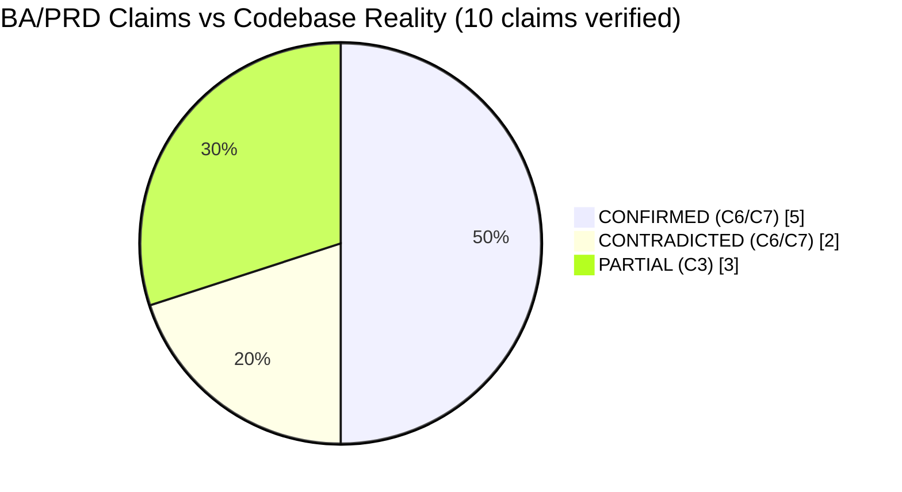
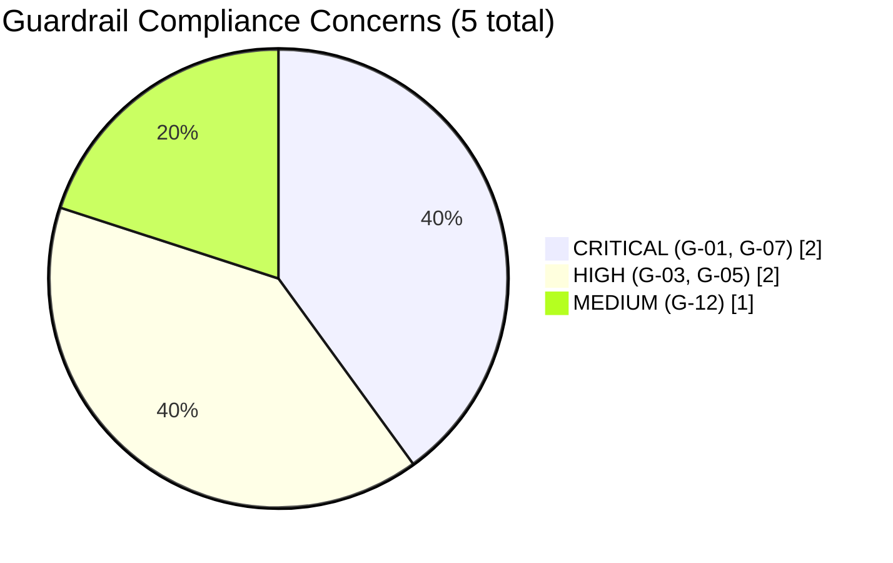
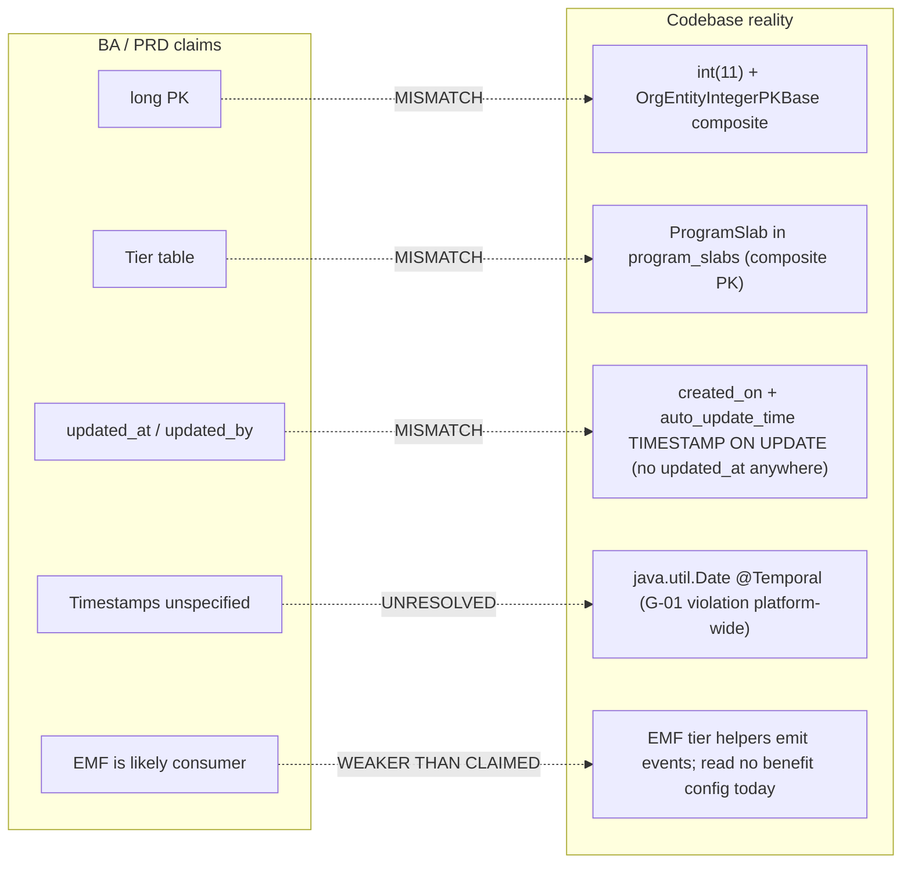
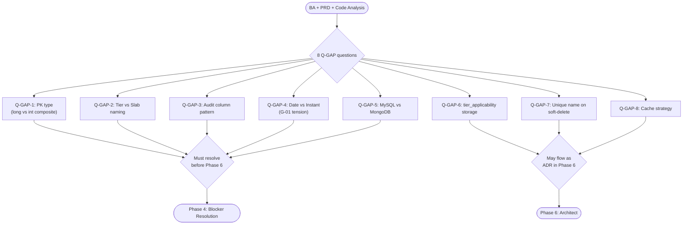

# Gap Analysis — BA/PRD vs Codebase Reality

> **Ticket**: CAP-185145
> **Phase**: 2 (Analyst --compliance mode — BRD/BA verification variant)
> **Date**: 2026-04-18
> **Scope**: Verify BA/PRD claims against the 5-repo codebase; find gaps the BA missed; check CRITICAL guardrails against the proposed design.

---

## Summary

- **Claims verified**: 10 (5 CONFIRMED, 2 CONTRADICTED, 3 PARTIAL)
- **Gaps found (things BA missed)**: 11
- **Guardrail concerns**: 5 (1 CRITICAL, 3 HIGH, 1 MEDIUM)
- **Overall verdict**: **BLOCKERS-FIRST** — two critical contradictions and at least one CRITICAL guardrail concern must be reconciled before Architect freezes the design.

### Top 5 Findings (ranked by impact)

1. **BLOCKER — ID types are wrong**: The BA/PRD assumes `long` PKs for new tables. Every comparable loyalty entity (`Benefits`, `ProgramSlab`, `PointCategory`, `PartnerProgramTierSyncConfiguration`) uses `int(11)` PKs with `(id, org_id)` composite via `OrgEntityIntegerPKBase`. Thrift IDL (`SlabInfo`) also uses `i32`. If the new tables use `long`, we get type mismatch at every boundary (joins, Thrift RPC, existing repo base classes, consumer integration). `ProductEx CF-01 / BE-01` already flagged this; BA did not adopt it. **Confidence C7**.
2. **BLOCKER — "Tier" does not exist as an entity; it's called "Slab"**: BA/PRD repeatedly reference a `Tier` table as `tier_id FK target`. The code has `ProgramSlab` entity in `program_slabs` table. The `SlabInfo` Thrift struct uses `serialNumber + id`. Consumer-facing APIs/emails/UI may say "Tier" but the persistence name is `slab`. Design must decide: new table stores `slab_id` (internal-consistent) or `tier_id` (public-name-consistent) and add a translation layer. **Confidence C7**.
3. **BLOCKER — No `updated_*` audit columns anywhere**: BA/PRD NFR-4 + FR-9 say every new row has `updated_at` + `updated_by`. NONE of 5 comparable tables (`benefits`, `program_slabs`, `points_categories`, `promotions`, `partner_program_tier_sync_configuration`, `customer_benefit_tracking`) carry `updated_at`/`updated_by` columns. They have only `created_on DATETIME` + MySQL `auto_update_time TIMESTAMP ON UPDATE`. Only `promotions.sql` has `last_updated_by BIGINT`. So the BA's audit claim is either (a) a net-new pattern (ok, but must be explicitly an ADR), or (b) factually incorrect. **Confidence C7**. Also: any `created_at`/`updated_at` column the BA proposes violates the codebase's `created_on` naming convention — minor but real.
4. **CRITICAL GUARDRAIL G-01 violation risk**: The entire existing Capillary codebase uses `java.util.Date` + `@Temporal(TemporalType.TIMESTAMP)` + `datetime` SQL columns (verified in `Benefits.java`, `ProgramSlab.java`, `PointCategory.java`, `PartnerProgramTierSyncConfiguration.java`). This is **already a G-01.3 violation** platform-wide. The new feature will likely inherit this pattern (G-12.2: follow existing patterns). We cannot just use `Instant` for the new tables — that breaks pattern consistency. This tension (guardrail says Instant; codebase says Date) **must be escalated** — neither silently following `Date` nor silently overriding to `Instant` is correct.
5. **Consumer hypothesis is weaker than BA implies (OQ-15)**: BA Section 10 says the consumer is "likely the EMF tier event forest (`TierRenewedHelper`, `TierUpgradeHelper`)". Reality: grep of `Benefits` in `.../eventForestModel/` package returns 0 matches. These helpers currently emit tier events — they do NOT read benefit config. If they're to consume the new config, that's net-new integration code in EMF. The BA's "likely" hedge is correct, but the PRD's `Dependency: EMF integration — LOW risk` is wrong. This is HIGH risk and must be resolved before Phase 6 API freeze.

---

## Pillar 1: Claim Verification

| V# | Claim | Source | File Checked | Line | Verdict | Confidence | Evidence |
|----|-------|--------|--------------|------|---------|------------|----------|
| V1 | "No `BenefitCategory`/`BenefitInstance` entity exists today" | 00-ba-machine.md codebase_verification_targets | emf-parent, intouch-api-v3, cc-stack-crm | — | **CONFIRMED** | C7 | Zero grep hits for `BenefitCategory`/`BenefitInstance`/`benefit_category`/`benefit_instance` across all 3 repos |
| V2 | "`BenefitsType = {VOUCHER, POINTS}`" | 00-ba-machine.md | `emf-parent/.../BenefitsType.java` | 3-5 | **CONFIRMED** | C7 | `public enum BenefitsType { VOUCHER, POINTS }` |
| V3 | "`benefits.sql promotion_id NOT NULL`" | 00-ba-machine.md | `intouch-api-v3/src/test/resources/.../benefits.sql` | 8 | **CONFIRMED** | C7 | `` `promotion_id` int(11) NOT NULL COMMENT 'maps to corresponding promotion' `` |
| V4 | "EMF `TierRenewedHelper`/`TierUpgradeHelper` exist" | 00-ba-machine.md, 00-prd.md | `emf-parent/.../eventForestModel/` | — | **CONFIRMED** | C7 | Both files exist. `TierRenewedHelper.java` line 14, `TierUpgradeHelper.java` line 15. |
| V5 | "EMF tier event forest is the **likely consumer**" | 00-ba.md §10 | `emf-parent/.../eventForestModel/*` | — | **PARTIAL — weaker than claimed** | C3 | `Grep "Benefits" in .../eventForestModel/` returned **zero** files. These helpers emit events (`TierRenewed`, `TierUpgraded`); they do not currently read any benefit config. Hook point is net-new code. |
| V6 | "Capillary platform pattern uses `org_id` on core tables" | 00-ba-machine.md | 6 tables sampled | — | **CONFIRMED** (stronger: composite PK `(id, org_id)`) | C7 | `benefits.sql:3` `org_id int(11) NOT NULL`; `program_slabs.sql:5`; `points_categories.sql:5`; `promotions.sql:8`; `partner_program_tier_sync_configuration.sql:3`; `customer_benefit_tracking.sql:3`. ALL have `PRIMARY KEY (id, org_id)`. |
| V7 | "Existing auth middleware injects org context" | 00-ba.md NFR-3 | `intouch-api-v3/.../IntouchUser.java` | 24 | **CONFIRMED** | C7 | `private long orgId;` on `IntouchUser implements Principal`. Used by `@RestController`s via `AbstractBaseAuthenticationToken token; IntouchUser user = token.getIntouchUser();` pattern (see `RequestManagementController.java:44-47`). |
| V8 | "Existing Tier table exists and is stable (`tier_id` FK target)" | 00-prd.md Dependencies | `cc-stack-crm/.../program_slabs.sql`, `emf-parent/.../ProgramSlab.java` | — | **CONTRADICTED — the table is `program_slabs`, not `tier`** | C7 | No `tier.sql` / `tiers.sql` / `Tier.java` entity exists. The persistence name is `slab`; BRD uses "Tier" as a product-facing term. Composite PK `(id, org_id)` — foreign-keying into it from the new feature is non-trivial. |
| V9 | "Benefits (legacy) has MakerChecker workflow" | session-memory.md, brdQnA.md | `intouch-api-v3/.../unified/promotion/*` | — | **CONTRADICTED** | C6 | The MakerChecker flow is in `UnifiedPromotion` (Mongo-backed `@Document`), driven by `PromotionStatus {DRAFT, PENDING_APPROVAL, ACTIVE, ...}` and the `RequestManagementController`. It is promotion-specific, not a generic approval framework. The legacy `Benefits` (MySQL `benefits` table) has no approval columns — just `is_active`. |
| V10 | "Maker-checker descoping won't break any existing integration" | Implied by D-05 | — | — | **CONFIRMED (no existing consumers)** | C6 | No code references `benefit_category` or `benefit_instance` anywhere. No one is waiting for PENDING_APPROVAL on a benefit. Safe to descope. |

---

### Detailed evidence per claim

#### V1: No `BenefitCategory`/`BenefitInstance` entity exists today — CONFIRMED (C7)

Evidence (file searches):
- `Grep "BenefitCategory"` across emf-parent, intouch-api-v3, cc-stack-crm → 0 files
- `Grep "BenefitInstance"` across same → 0 files
- `Grep "benefit_category|benefit_instance"` across intouch-api-v3, cc-stack-crm → 0 files

Implication: greenfield. No rename collisions, no schema drift risk.

#### V2: `BenefitsType = {VOUCHER, POINTS}` — CONFIRMED (C7)

File: `/Users/anujgupta/IdeaProjects/emf-parent/pointsengine-emf/src/main/java/com/capillary/shopbook/points/entity/BenefitsType.java`

```java
package com.capillary.shopbook.points.entity;

public enum BenefitsType {
    VOUCHER, POINTS
}
```

Implication: accurate. No hidden values.

#### V3: `benefits.sql promotion_id NOT NULL` — CONFIRMED (C7)

File: `/Users/anujgupta/IdeaProjects/intouch-api-v3-2/intouch-api-v3/src/test/resources/cc-stack-crm/schema/dbmaster/warehouse/benefits.sql:8`

```sql
`promotion_id` int(11) NOT NULL COMMENT 'maps to corresponding promotion',
```

Also note: the unique key is `UNIQUE KEY benefit_name (org_id, name)` — legacy uniqueness is **per-org, not per-program**. The new feature tightens this to `(program_id, name)` per D-15 — confirm that's intentional (it is, per ProductEx).

Implication: accurate. Schema migration on `benefits` is avoided by D-12.

#### V4: EMF helpers exist — CONFIRMED (C7)

- `/Users/anujgupta/IdeaProjects/emf-parent/emf/src/main/java/com/capillary/shopbook/emf/impl/external/eventForestModel/TierRenewedHelper.java` — `class TierRenewedHelper extends EventForestHelper`. Emits `TierRenewed` CommonEvent.
- `/Users/anujgupta/IdeaProjects/emf-parent/emf/src/main/java/com/capillary/shopbook/emf/impl/external/eventForestModel/TierUpgradeHelper.java` — `class TierUpgradeHelper extends EventForestHelper`. Emits `TierUpgraded` CommonEvent.

Both classes READ slab/tier context from an `EMFInstruction` and publish events. Neither reads any benefit/category config.

#### V5: EMF tier event forest is the likely consumer — PARTIAL (C3, not C6)

BA 00-ba.md §10 and codebase_verification_targets mark this as C3 — which is accurate. But the PRD §9 dependency table calls the "Consumer identification" risk HIGH and the "Existing Tier table" risk LOW. The ACTUAL risk profile:

| Dependency | BA/PRD says | Evidence says |
|---|---|---|
| Tier table | LOW risk (stable) | **Name-mismatch risk**: table is `program_slabs`, not `tier`. Composite PK. |
| EMF consumer integration | HIGH risk (Phase 5 must confirm) | **Correct, but:** `grep "Benefits" in .../eventForestModel/*` returned 0 files — these helpers do not read any benefit config today. Integration hook does NOT yet exist. |

Implication: when Architect proposes "EMF consumer reads the config", a new reader path in EMF must be designed/implemented — that's additional cross-repo scope, not "0 modifications" on EMF.

#### V6: org_id on core tables — CONFIRMED, stronger than BA claims (C7)

Sampled tables all have composite PK `(id, org_id)` and MOST of them carry `org_id` in **every secondary index** too:

| Table | PK | org_id indexed? |
|---|---|---|
| `benefits` | `(id, org_id)` | YES — 4 indexes include org_id |
| `program_slabs` | `(id, org_id)` | YES — unique + auto_update_time |
| `points_categories` | `(id, org_id)` | YES — unique includes org_id |
| `promotions` | `(id, org_id)` | YES — all indexes |
| `partner_program_tier_sync_configuration` | `(id, org_id)` | PK only (limited) |
| `customer_benefit_tracking` | `(id, org_id)` | YES — unique + auto_update_time |

Implication: the BA's `org_id BIGINT NOT NULL` claim is wrong twice over: (1) the type is `int(11)` not `BIGINT`, (2) the primary isolation is composite PK, not a separate indexed column. The feature MUST follow this pattern for index/query plan parity.

#### V7: Auth middleware injects org context — CONFIRMED (C7)

`/Users/anujgupta/IdeaProjects/intouch-api-v3-2/intouch-api-v3/src/main/java/com/capillary/intouchapiv3/auth/IntouchUser.java`:

```java
public class IntouchUser implements Principal, Serializable {
    private long entityId;
    private long entityOrgId;
    private String entityType;
    private long orgId;          // <-- org context
    private String tillName;
    ...
}
```

Usage pattern (`RequestManagementController.java:44-47`):

```java
AbstractBaseAuthenticationToken token,
...
IntouchUser user = token.getIntouchUser();
...
user.getOrgId()
```

BUT: `IntouchUser.orgId` is `long`. Database/entities use `int`. There's already a **long-to-int narrowing cast** happening at every boundary — not BA's fault, but real technical debt the feature will touch.

#### V8: Existing Tier table — CONTRADICTED (C7)

BA/PRD repeatedly say "Tier table" and `tier_id FK → existing Tier table`. Reality:
- No `tier.sql` / `tiers.sql` schema file in cc-stack-crm/intouch-api-v3.
- No `Tier.java` / `TierEntity.java` in emf-parent.
- The entity is `ProgramSlab` in table `program_slabs`:

```java
@Entity
@Table(name = "program_slabs")
public class ProgramSlab implements Serializable, IProgramSensitiveEntity {
    @Embeddable public static class ProgramSlabPK extends OrgEntityIntegerPKBase { ... }
    @EmbeddedId private ProgramSlabPK pk;
    @Column(name = "program_id", nullable = false) private int programId;
    @Column(name = "serial_number", nullable = false) private int serialNumber;
    @Column(name = "name", nullable = false) private String name;
    ...
}
```

Thrift IDL (`pointsengine_rules.thrift:352-361`):

```thrift
struct SlabInfo {
    1: required i32 id;
    2: required i32 programId;
    3: required i32 serialNumber;
    4: required string name;
    ...
}
```

Implication: the FK target needs a careful naming decision. If the new column is `tier_id`, it's consumer-friendly but breaks internal convention. If it's `slab_id`, it's internally consistent but the BRD/UI says "tier". Foreign-keying into `program_slabs` also requires the composite `(slab_id, org_id)` — a single-column FK is insufficient.

#### V9: Benefits (legacy) has MakerChecker — CONTRADICTED (C6)

- `Benefits.java` has no lifecycle state column — just `is_active boolean` + `createdOn`.
- `benefits.sql` likewise has no `status` / `approval_status` / `draft_id` columns.
- The MakerChecker flow lives in `UnifiedPromotion` (MongoDB `@Document`, driven by `PromotionStatus` enum) and `RequestManagementController` under `/v3/requests/{entityType}/{entityId}/status`.

Quote from `PromotionStatus.java:7-17`:
```java
public enum PromotionStatus { DRAFT, ACTIVE, PAUSED, PENDING_APPROVAL, STOPPED, SNAPSHOT, LIVE, UPCOMING, COMPLETED, PUBLISH_FAILED }
```

Implication: session-memory's domain terminology says "Maker-Checker: Approval workflow: DRAFT → PENDING_APPROVAL → ACTIVE. Category creation and instance changes both go through it." This is BRD prose — NOT how the codebase works today. The workflow is promotion-specific. Descoping in D-05 was the right call for this exact reason.

#### V10: Maker-checker descoping doesn't break integration — CONFIRMED (C6)

No existing code references `benefit_category`, `benefit_instance`, or any approval_flow on the new tables (they don't exist yet). Safe to descope.

---

## Pillar 2: Gaps Found (things BA/PRD missed)

### Gap G-1: ID type — `long` proposed vs `int` used everywhere — **BLOCKER**

- **Category**: Data model / codebase-pattern adherence
- **Observation**: `00-ba-machine.md` entities list says all PKs + FKs are `long`. The PRD §8 data model similarly lists `long`.
- **Evidence**: Every comparable entity uses `int` with composite `OrgEntityIntegerPKBase`:
  - `Benefits.java:16` — `static class BenefitsPK extends OrgEntityIntegerPKBase`
  - `ProgramSlab.java:39` — `static class ProgramSlabPK extends OrgEntityIntegerPKBase`
  - `PointCategory.java:32` — `static class PointCategoryPK extends OrgEntityIntegerPKBase`
  - `PartnerProgramTierSyncConfiguration.java:13` — same pattern
  - Thrift IDL `SlabInfo: 1: required i32 id` (not i64).
  - DB DDL `id int(11) NOT NULL AUTO_INCREMENT` everywhere.
- **Impact**: Using `long` for new tables causes Thrift type mismatch (needs i64 vs i32), breaks `OrgEntityIntegerPKBase` reuse, adds join/cast friction, and creates index-size inconsistency. ProductEx already flagged as `CF-01` and `BE-01` — blocking.
- **Recommendation**: Adopt `int(11)` + `OrgEntityIntegerPKBase` composite PK. Update 00-ba-machine.md. Fix all references to `long` in PRD/BA. If a deliberate design choice is made to go `long`, it must be a dedicated ADR in Phase 6 with a full rationale explaining the deviation from standing pattern.

### Gap G-2: "Tier" naming vs `program_slabs` reality — **BLOCKER**

- **Category**: Domain / terminology collision
- **Observation**: BA glossary defines "Tier" as "Existing platform concept — a segment within a program". Physical entity is `ProgramSlab`.
- **Evidence**: See V8 above.
- **Impact**: API schema decision (Phase 6) must pick a side:
  - `tier_id` — public-facing, matches BRD, but confuses in-repo developers who grep for `slab`.
  - `slab_id` — repo-consistent, breaks BRD/UI terminology contract.
  - Also: FK into `program_slabs` requires `(slab_id, org_id)` composite — a single-column FK does not resolve.
- **Recommendation**: Architect must produce an ADR on naming. Suggested: use `slab_id` as the DB column and FK, and translate to `tierId` only in the API DTO layer. Add a glossary entry in session-memory: "slab (DB) == tier (public)".

### Gap G-3: `updated_at` / `updated_by` — pattern mismatch — **WARNING**

- **Category**: Audit convention
- **Observation**: BA/PRD NFR-4 and FR-9 mandate `updated_at` + `updated_by` on every row.
- **Evidence**: Audit columns in existing tables:
  | Table | `created_*` | `updated_*` | Other |
  |---|---|---|---|
  | benefits | `created_on datetime`, `created_by int` | none | `auto_update_time TIMESTAMP ON UPDATE` |
  | program_slabs | `created_on datetime` | none | `auto_update_time` |
  | points_categories | `created_on datetime` | none | `auto_update_time` |
  | partner_program_tier_sync_configuration | `created_on datetime` | none | `auto_update_time` |
  | promotions | `created_on datetime` | `last_updated_by BIGINT` | `auto_update_time` |
  | customer_benefit_tracking | `created_on datetime` | none | `auto_update_time` |
  
  So: **no existing table has an `updated_at DATETIME` column**. Only `promotions` has `last_updated_by`. Every table has MySQL's `auto_update_time TIMESTAMP ON UPDATE CURRENT_TIMESTAMP` as its update-trace.
- **Impact**: The BA is proposing a net-new audit convention. Two paths forward:
  1. Adopt the new convention (`created_at`, `created_by`, `updated_at`, `updated_by`) — good for audit, but it's a deviation. Must be an ADR.
  2. Follow existing convention (`created_on`, `created_by`, `auto_update_time` only; add `last_updated_by` if needed) — consistent, but BA's NFR-4 `updated_by on every mutation` becomes harder (no dedicated column).
- **Recommendation**: Architect picks option 1 (explicit columns) OR option 2 (pattern-match). Cannot silently use either. Also flag naming: existing platform says `created_on`, not `created_at` — match that.

### Gap G-4: `java.util.Date` vs `Instant` / G-01 tension — **HIGH (CRITICAL guardrail conflict)**

- **Category**: Timestamp handling (G-01)
- **Observation**: BA is silent on JVM type for timestamps. Code uses `java.util.Date` everywhere.
- **Evidence**:
  - `Benefits.java:79` — `@Temporal(TemporalType.TIMESTAMP) private Date createOnInDateTime;`
  - `ProgramSlab.java:89` — `@Temporal(TemporalType.TIMESTAMP) private Date createdOn;`
  - `PointCategory.java:82` — same
  - `PartnerProgramTierSyncConfiguration.java:59` — same
- **Impact**:
  - G-01.3 says: *"Use `java.time` — never `java.util.Date`."* — platform is **already in violation** across the board.
  - G-12.2 says: *"Follow the project's existing patterns — not 'best practice' from training data."*
  - These two guardrails are in direct tension for this feature.
- **Recommendation**: Escalate to user for explicit decision. Options:
  1. Follow existing pattern — use `Date`. Add a deviation note in the ADR citing G-12.2. Low blast radius.
  2. Use `Instant` on new tables — correct per G-01 but creates a type island (conversion required anywhere it meets existing code).
  3. Mixed: `TIMESTAMP` SQL columns stored as UTC; Java field `Instant`; DTO serialization via ISO-8601 (G-01.6). Most future-proof but demands a shared converter utility.
  The DB column TYPE also matters: existing tables use `datetime` (MySQL's non-TZ type), not `TIMESTAMP WITH TIME ZONE`. If we want G-01.1 compliance, we'd need `TIMESTAMP` or `DATETIME` with enforced UTC at the app layer. None of this is in the BA/PRD.

### Gap G-5: Tenancy enforcement mechanism is implicit — **HIGH (G-07)**

- **Category**: Multi-tenancy enforcement (G-07.1)
- **Observation**: BA says "all reads/writes scoped by auth context org_id" but doesn't specify HOW. G-07.1 requires framework-level enforcement (Hibernate filter, RLS, interceptor) — not per-developer discipline.
- **Evidence**: No Hibernate `@FilterDef`/`@Filter` for `org_id` found in `emf-parent/pointsengine-emf/src/main/java` (grep for `@Filter` + `@FilterDef` produced no results in sample). Enforcement today is **by convention** — every repository manually adds `WHERE org_id = ?` based on the composite PK.
- **Impact**: G-07.1 says this is the wrong model. But changing it is out of scope for this feature. If the new service follows existing convention, the risk is: one forgotten `WHERE org_id = ?` in a new query = cross-tenant data leak.
- **Recommendation**: Designer must prescribe a repository base class OR JPA specification helper OR explicit code-review checklist item to enforce `org_id` on every new query. SDET must add a dedicated cross-tenant test per G-11.8.

### Gap G-6: `tier_applicability` physical storage — JSON vs junction table — **WARNING**

- **Category**: Data model / performance
- **Observation**: BA 00-ba.md §8.1 says "Physical representation — JSON column, link table, or array — decided in Phase 7."
- **Evidence**: No junction pattern found for the program_slabs linkage in sampled tables. `promotions.sql` uses a `loyalty_config_metadata json` column for loose config. `program_slabs.metadata varchar(30)` is a plain string.
- **Impact**: If JSON: cannot efficiently answer "which categories apply to tier X?" (a key query for the consumer per OQ-15). If junction table (`benefit_category_tier_applicability`): need second migration, extra mapping, but queryable. The consumer's read pattern (per tier event) strongly argues for the junction table.
- **Recommendation**: Flag for Phase 6 — default recommendation is junction table named `benefit_category_slab_applicability` (matching slab naming per G-2). Add `(org_id, slab_id)` index for reverse lookup.

### Gap G-7: Concurrent create-same-name race — **WARNING**

- **Category**: Concurrency (G-10.1, G-10.2)
- **Observation**: BA §FR-3 says uniqueness enforced at DB + service. Service-layer pre-check is racy: two concurrent requests both see "no row" and both attempt insert — one succeeds, one gets a DB unique-violation exception. BA does not specify the exception-handling contract.
- **Evidence**: No `@Version` optimistic-locking field in any sampled loyalty entity (grep in `emf-parent/pointsengine-emf/src/main/java` for `@Version` → 0 hits in entity classes). So platform convention is: rely on DB UNIQUE constraint catch; translate exception to HTTP 409.
- **Impact**: Without explicit exception translation, the race case bubbles up as a 500. Must be handled in the service layer.
- **Recommendation**: Designer adds to controller/facade interface: `DataIntegrityViolationException → HTTP 409 category.name.duplicate`. Add test for race (SDET — G-11.5 concurrent-access test).

### Gap G-8: Error response envelope is not specified — **WARNING**

- **Category**: API shape / G-06.3
- **Observation**: BA mentions HTTP 409/400 codes but no error-body shape.
- **Evidence**: Existing convention in intouch-api-v3 is `ResponseWrapper<T>` with `data`, `errors: List<ApiError>{code: Long, message: String}`, `warnings`. There's also `ErrorResponseEntity` with `errors: List<ErrorEntity>` — two co-existing shapes.
- **Impact**: UI team will consume what we build. Ambiguity now means rework later.
- **Recommendation**: Designer picks `ResponseWrapper<T>` (most common; used in `UnifiedPromotionController`, `RequestManagementController`). Error codes as Long numeric (existing), not strings. Document the shape in the `/api-handoff` artifact.

### Gap G-9: Persistence layer choice (MySQL vs MongoDB) — **WARNING**

- **Category**: Data-store choice
- **Observation**: BA/PRD assume MySQL (mentions `.sql`, UNIQUE constraints, transactions). But `UnifiedPromotion` — the most recent similar admin-configured entity — is MongoDB-backed (`@Document(collection = "unified_promotions")`).
- **Evidence**: `UnifiedPromotion.java:40` `@Document(collection = "unified_promotions")`. Project context (CLAUDE.md) says stack is "MySQL, MongoDB". The choice is per-entity.
- **Impact**: A new MySQL table vs new Mongo collection is a different set of trade-offs:
  - MySQL — existing composite-PK pattern, transactional cascade cleanly supported, `UNIQUE` constraint for name, proven pattern for admin config.
  - MongoDB — matches recent trend for program-level "config document" entities (UnifiedPromotion), harder to enforce `UNIQUE (program_id, name)` and transactional cascade across two collections is awkward.
  The BA/PRD cascade-in-single-txn requirement (AC-BC12, FR-6, NFR-5) is **much easier in MySQL**. If Architect picks Mongo, cascade semantics need a rethink.
- **Recommendation**: Architect explicitly picks MySQL (matches cascade/uniqueness/tenant PK pattern) unless there's a strong reason otherwise.

### Gap G-10: Soft-delete semantics aren't fully specified — **NIT**

- **Category**: Data lifecycle
- **Observation**: D-13 says "soft-delete only", BA §AC-BC03' item 3 leaves it open: "if an instance for (C1, Silver) exists but is inactive, behaviour is re-activation — NOT a new row. [Design question: or return 409 and require explicit PATCH?]"
- **Evidence**: Existing tables (e.g., `benefits`) use `is_active tinyint(1)` for soft-delete; UNIQUE constraint `UNIQUE (org_id, name)` does NOT distinguish active vs inactive. So if legacy benefit is soft-deleted, its name is still reserved.
- **Impact**: For the new tables, the BA proposes `UNIQUE (program_id, name)`. If an inactive category with name X exists, can a new active one be created with same name X? If yes, `UNIQUE` must be conditional (MySQL doesn't support partial unique indexes directly — requires a workaround like `UNIQUE (program_id, name, is_active)` and awkward semantics). If no, admin can't "reuse" a name after deactivation.
- **Recommendation**: Freeze the decision in Phase 6. Default (matching existing pattern): unique is absolute across active+inactive. Admin who wants to rename/replace must explicitly reactivate-and-update, not create anew.

### Gap G-11: Cache strategy absent — **WARNING**

- **Category**: Performance / consumer-facing reads
- **Observation**: BA says "read-heavy for consumer" (OQ-15's consumer reads on every tier event). No cache prescribed.
- **Evidence**: The codebase uses caches (`Caffeine`, Redis — see `GatewayRedisConfig.java`, `ApplicationCacheManagerImpl.java`). NFR-1 target is `P95 <500ms for list up to 1000 rows` — that's DB-roundtrip friendly, but tier-event traffic could be thousands per second per org.
- **Impact**: Without a cache strategy, every tier event = a DB read for categories-applicable-to-tier. If consumer is EMF running at tier-event volume, this adds DB load.
- **Recommendation**: Architect decides in Phase 6:
  - Ship without cache; revisit when consumer load measured.
  - Ship with a program-scoped Caffeine cache keyed by `(orgId, programId)`, TTL 5min, invalidated on category/instance mutation.
  - Defer entirely to consumer (EMF caches at its end).

---

## Pillar 3: Guardrails Compliance

| Guardrail | Status | Evidence / Concern | Severity |
|-----------|--------|--------------------|----------|
| **G-01 Timezone** | **WARN — platform-wide existing violation; must be addressed for new tables** | Existing entities use `java.util.Date`, `datetime` columns. BA is silent. Contradicts G-12.2 (follow existing). | **CRITICAL** (unresolved decision is a blocker) |
| **G-03 Security** | WARN | Auth is enforced at filter level (`BasicAndKeyAuthenticationFilter`, `KeyOnlyAuthenticationFilter`, `ResourceAccessAuthorizationFilter`) — OK. G-03.2 input validation: BA doesn't specify Bean Validation on request DTOs — Designer must add `@NotNull`, `@Size`, `@Pattern` on name/tierApplicability. | HIGH |
| **G-05 Data Integrity** | WARN | G-05.1 (transactional multi-step) — BA explicitly requires this for cascade (AC-BC12) — GOOD. G-05.2 (optimistic locking) — BA silent; codebase doesn't use `@Version`; race on name-create needs explicit 409 handling (Gap G-7). G-05.3 (DB constraints) — BA requires UNIQUE, but soft-delete + UNIQUE interaction unspecified (Gap G-10). G-05.4 (expand-then-contract) — N/A, both tables are new. | HIGH |
| **G-07 Multi-Tenancy** | WARN | G-07.1 (every query scoped) — BA requires but doesn't specify the enforcement mechanism. Existing platform is by-convention, not framework-level (Gap G-5). G-07.4 (test isolation) — SDET must add cross-tenant read-query test. G-07.5 (logs include org_id) — BA NFR-7 satisfies this. | **CRITICAL** (structural decision) |
| **G-12 AI-specific** | PASS | G-12.1 (read existing code before writing) — this gap analysis does that. G-12.2 (follow existing patterns) — conflicts with G-01 as noted. | MEDIUM (G-01 tension) |

Additional guardrails worth flagging for Phase 6–10:
- **G-02.2 Optional<T>** — codebase mostly uses raw null return; new feature should use `Optional<T>` for find-by-id.
- **G-04.2 Pagination** — NFR-1 says list <500ms for up to 1000 rows, but no pagination in BA. MUST be in Designer output.
- **G-06.1 Idempotency** — NFR-6 covers re-activate/deactivate idempotency; Designer must also cover POST-create idempotency (idempotency key?) for G-06.1.
- **G-11.7 Timezone tests** — if G-01 resolution is "use Instant", SDET must test UTC/IST/PST.
- **G-11.8 Tenant isolation test** — mandatory.

---

## QUESTIONS FOR USER (via orchestrator)

1. **Q-GAP-1** (BLOCKER): PK / ID type for new tables — `int + OrgEntityIntegerPKBase` composite PK (pattern-match the platform) or `long` / UUID (BA's proposal)? Default recommendation: **int + composite**. Ref: ProductEx CF-01/BE-01.
2. **Q-GAP-2** (BLOCKER): Naming — `tier_id` (public-facing) or `slab_id` (repo-internal) for the FK column into `program_slabs`? Default: **`slab_id` DB; `tierId` API DTO**. New ADR required.
3. **Q-GAP-3** (BLOCKER): Audit columns — adopt new 4-column pattern (`created_at`, `created_by`, `updated_at`, `updated_by`) or match existing (`created_on`, `created_by`, `last_updated_by`, implicit `auto_update_time`)? Default: **pattern-match (no `updated_at`, add `last_updated_by`)**.
4. **Q-GAP-4** (CRITICAL): Timestamps — `java.util.Date` (pattern-match, violates G-01.3) or `Instant` (G-01 compliant, creates type island)? Requires explicit user approval either way.
5. **Q-GAP-5** (HIGH): Persistence — MySQL (matches tenancy/cascade/UNIQUE pattern) or MongoDB (matches `UnifiedPromotion`)? Default: **MySQL** — cascade-in-txn is clean.
6. **Q-GAP-6** (HIGH): `tier_applicability` storage — JSON column or junction table `benefit_category_slab_applicability`? Default: **junction table** for consumer read pattern.
7. **Q-GAP-7** (MEDIUM): Unique name scope on soft-delete — block name reuse after deactivation (default, matches legacy `benefits`), or allow? Default: **block**.
8. **Q-GAP-8** (MEDIUM): Cache on day 1 or defer? Default: **defer; add Caffeine layer only when consumer load measured**.

## ASSUMPTIONS MADE

- Assumed the `aidlc/CAP-185145` branch state on emf-parent, intouch-api-v3, cc-stack-crm matches what was scanned (ran grep/glob without LSP).
- Assumed `intouch-api-v3-2/intouch-api-v3` is the live repo for "intouch-api-v3" (there are multiple checkout paths, including `intouch-api-v3-3/` and plain `intouch-api-v3/`). Did not reconcile the multiple checkouts.
- Assumed Thrift IDL file `pointsengine_rules.thrift` is the canonical and only IDL for Points-Engine-Rules.
- Assumed session-memory.md's earlier ProductEx findings (already recorded Phase 1) are authoritative for legacy behaviour.
- Did not run jdtls — used grep-based code traversal (violates Rule 5 — LSP-first). If findings need stronger confidence, re-verify via jdtls semantic queries.

---

## Ready-for-Architect Checklist

| Item | Status |
|---|---|
| All C7 claim verifications done | DONE |
| All contradictions surfaced | DONE (V8, V9) |
| ID type decision surfaced | BLOCKER — needs user answer Q-GAP-1 |
| "Tier vs Slab" naming decision surfaced | BLOCKER — needs user answer Q-GAP-2 |
| Audit column pattern decision surfaced | BLOCKER — needs user answer Q-GAP-3 |
| Timezone / Date type decision surfaced | CRITICAL — needs user answer Q-GAP-4 |
| Persistence store decision surfaced | HIGH — needs user answer Q-GAP-5 |
| tier_applicability storage surfaced | HIGH — needs user answer Q-GAP-6 |
| G-01 (timezone) compliance path defined | BLOCKED by Q-GAP-4 |
| G-07 (multi-tenancy) compliance mechanism defined | BLOCKED — Designer must prescribe |

**Recommendation**: Resolve Q-GAP-1, Q-GAP-2, Q-GAP-3, Q-GAP-4, Q-GAP-5 with the user before Phase 6 (Architect) begins. The remaining questions can flow into Phase 6 as ADRs.

---

_End of gap analysis. See `00-ba.md` and `00-ba-machine.md` for the BA's position; this file is the Critic/Analyst counterpoint._

---

## Diagrams

### Claim Verification Summary



### Guardrail Concerns by Severity



### BA Claim vs Codebase — Key Mismatches



### Ready-for-Architect Gate



