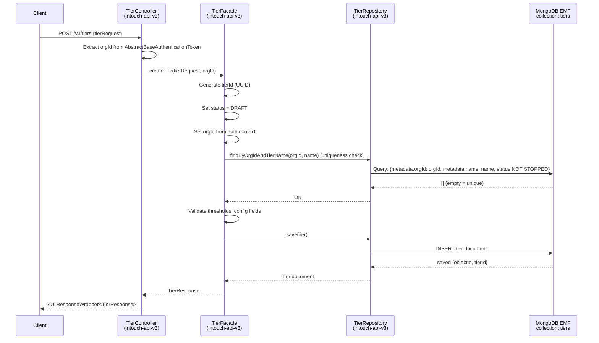
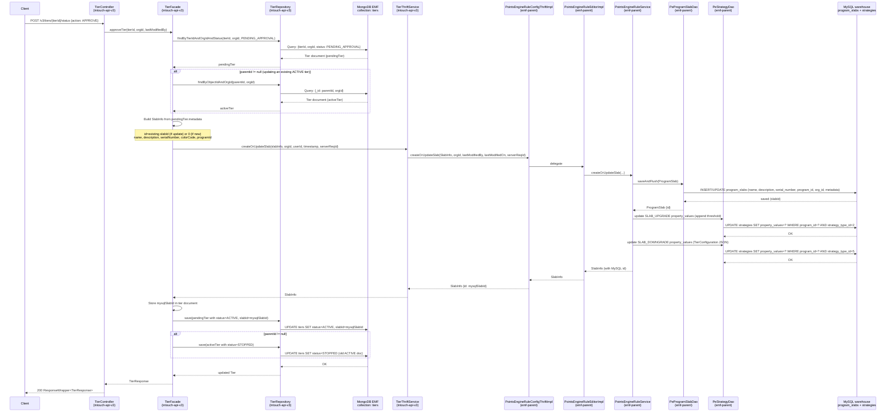
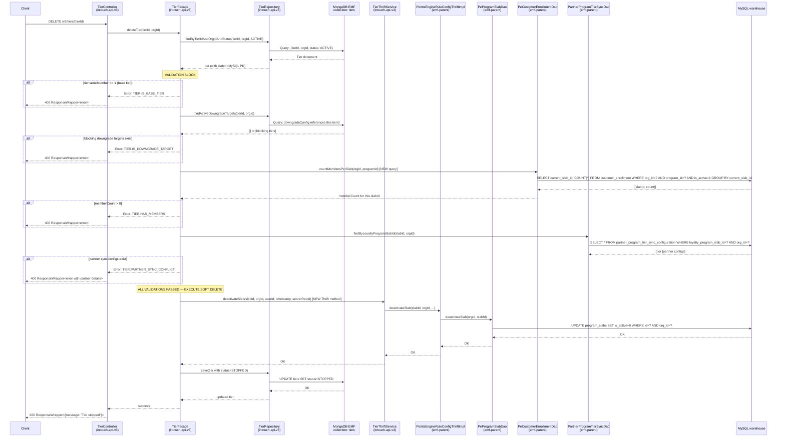
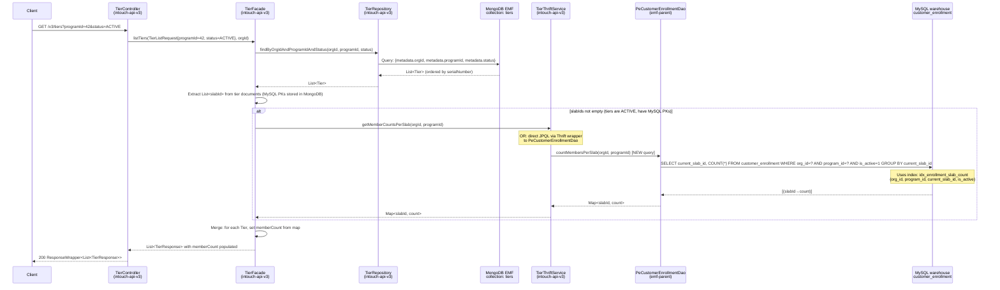

# Cross-Repo Trace: Tier CRUD Feature

**Feature**: tier-crud
**Date**: 2026-04-06
**Analyst**: Feature-Pipeline Agent
**Architecture**: MongoDB-first (like UnifiedPromotion). CRUD → MongoDB. APPROVE → Thrift → MySQL.

---

## Confidence Levels Used

| Level | Meaning |
|-------|---------|
| C6 | High Confidence — direct code evidence found in analysis files |
| C5 | Confident — strong inference from patterns, minor gap |
| C4 | Probable — inferred from analogous pattern, verify before coding |
| C3 | Tentative — gap in code evidence, must confirm |

---

## 1. Write Paths

### 1.1 CREATE Tier (`POST /v3/tiers`)

**Status created**: `DRAFT` in MongoDB only. No MySQL write.

| Step | Component | Repo | Detail | Confidence |
|------|-----------|------|--------|------------|
| 1 | HTTP POST `/v3/tiers` | intouch-api-v3 | `TierController.createTier(@Valid @RequestBody TierRequest, AbstractBaseAuthenticationToken token)` — new file in `com.capillary.intouchapiv3.resources` | C6 — all controllers live in `resources/` per code-analysis-intouch-api-v3.md §6.1 |
| 2 | TierFacade.createTier() | intouch-api-v3 | Generate `tierId` (UUID, immutable), set `status=DRAFT`, set `orgId` from auth token, validate `tierName` uniqueness (via `TierRepository` query), save document | C6 — mirrors `UnifiedPromotionFacade.createUnifiedPromotion()` steps exactly per code-analysis-intouch-api-v3.md §1.2 |
| 3 | MongoDB write | intouch-api-v3 | `TierRepository.save(tier)` → `emfMongoTemplate` → EMF Mongo shard (`db=emf`, collection=`tiers`) | C6 — TierRepository must use `emfMongoTemplate` per code-analysis-intouch-api-v3.md §2.2, same as UnifiedPromotionRepository |
| 4 | Thrift call | — | **NONE** — DRAFT writes MongoDB only. Thrift not called until APPROVE. | C6 — "Thrift is called only on APPROVE" per code-analysis-intouch-api-v3.md §1 insight #5 |
| 5 | MySQL write | — | **NONE** | C6 — blocker-decisions.md B-2+B-3: "DRAFT/PENDING tiers live ONLY in MongoDB" |

**MongoDB document fields written**:
- `tierId` (UUID, generated, immutable)
- `objectId` (`_id`, MongoDB auto-generated)
- `metadata.orgId`, `metadata.name`, `metadata.status = DRAFT`
- `metadata.serialNumber`, `metadata.description`, `metadata.colorCode`
- Threshold config: `upgradeThresholdValues`, `upgradeCurrentValueType`
- Downgrade config: `TierConfiguration` fields (downgradeEnabled, slabConfigs, periodConfig, conditions)
- Renewal config: periodConfig, shouldExtendPoints
- Program-level flags: `dailyDowngradeEnabled`, `retainPoints` (session-memory GQ-1)

---

### 1.2 UPDATE Tier (`PUT /v3/tiers/{tierId}`)

**Status**: Updates the `DRAFT` document in MongoDB. If ACTIVE, creates a new versioned DRAFT with `parentId`.

| Step | Component | Repo | Detail | Confidence |
|------|-----------|------|--------|------------|
| 1 | HTTP PUT `/v3/tiers/{tierId}` | intouch-api-v3 | `TierController.updateTier(tierId, @Valid @RequestBody TierRequest, token)` | C6 — PUT only, no PATCH per blocker-decisions.md GQ-4 |
| 2 | TierFacade.updateTier() | intouch-api-v3 | Find existing DRAFT or ACTIVE by `tierId + orgId`. If DRAFT → update in place. If ACTIVE → create new DRAFT with `parentId = existing.objectId`, `version = existing.version + 1`. Validate threshold ordering: `tier[n-1].threshold < new_threshold < tier[n+1].threshold` | C6 — blocker-decisions.md H-1 for threshold validation; C6 — code-analysis-intouch-api-v3.md §1.2 UPDATE flow for version pattern |
| 3 | MongoDB write | intouch-api-v3 | `TierRepository.save(tier)` — either in-place update or new DRAFT document | C6 — same emfMongoTemplate pattern |
| 4 | Thrift call | — | **NONE** — MongoDB-only until APPROVE | C6 |
| 5 | MySQL write | — | **NONE** | C6 |

---

### 1.3 SUBMIT FOR APPROVAL (`POST /v3/tiers/{tierId}/status` with `PENDING_APPROVAL`)

**Status**: DRAFT → PENDING_APPROVAL. MongoDB update only.

| Step | Component | Repo | Detail | Confidence |
|------|-----------|------|--------|------------|
| 1 | HTTP POST `/v3/tiers/{tierId}/status` | intouch-api-v3 | `TierController.changeTierStatus(tierId, @RequestBody TierStatusRequest, token)` | C6 — blocker-decisions.md B-1: separate endpoint, do NOT touch RequestManagementController |
| 2 | TierFacade.changeTierStatus() | intouch-api-v3 | Validate current status is `DRAFT`. Validate status transition is allowed. Set `status = PENDING_APPROVAL`. | C5 — mirrors `UnifiedPromotionFacade.changePromotionStatus()` via RequestManagementFacade per code-analysis-intouch-api-v3.md §1.2 |
| 3 | MongoDB write | intouch-api-v3 | `TierRepository.save(tier)` — status field updated | C6 |
| 4 | Thrift call | — | **NONE** | C6 |
| 5 | MySQL write | — | **NONE** | C6 |

---

### 1.4 APPROVE Tier (`POST /v3/tiers/{tierId}/status` with `APPROVE`)

**This is the most complex write path.** MongoDB read + status update + Thrift call + MySQL writes.

| Step | Component | Repo | Detail | Confidence |
|------|-----------|------|--------|------------|
| 1 | HTTP POST `/v3/tiers/{tierId}/status` | intouch-api-v3 | `TierController.changeTierStatus(tierId, @RequestBody TierStatusRequest{action=APPROVE}, token)` | C6 |
| 2 | TierFacade.approveTier() | intouch-api-v3 | Find PENDING_APPROVAL document by `tierId + orgId`. If `parentId != null` (update of ACTIVE tier): also load ACTIVE doc. Build `SlabInfo` from MongoDB document fields. Determine if this is new slab or update. | C6 — code-analysis-intouch-api-v3.md §1.2 APPROVE flow; C5 for the SlabInfo construction step |
| 3 | MongoDB write (pre-Thrift) | intouch-api-v3 | If `parentId != null`: mark existing ACTIVE doc as `STOPPED` (or add SNAPSHOT status variant). Will be transitioned after successful Thrift call. | C4 — inferred from UnifiedPromotion APPROVE flow where ACTIVE→SNAPSHOT happens; exact ordering TBD |
| 4 | Thrift call → EMF | intouch-api-v3 → emf-parent | `PointsEngineRulesThriftService.createOrUpdateSlab(SlabInfo slabInfo, int orgId, int lastModifiedBy, long lastModifiedOn, String serverReqId)` | C6 — code-analysis-emf-parent.md §3 confirms `createOrUpdateSlab` as the correct method; code-analysis-intouch-api-v3.md §3.3 confirms the service class |
| 5 | Thrift impl receives call | emf-parent | `PointsEngineRuleConfigThriftImpl.createOrUpdateSlab()` — file: `pointsengine-emf/src/main/java/com/capillary/shopbook/pointsengine/endpoint/impl/external/PointsEngineRuleConfigThriftImpl.java` | C6 — code-analysis-emf-parent.md §3: "PointsEngineRuleConfigThriftImpl is the boundary" |
| 6 | Service delegation | emf-parent | `PointsEngineRuleConfigThriftImpl` → `PointsEngineRuleEditorImpl` → `PointsEngineRuleService` (core service layer) | C6 — code-analysis-emf-parent.md §3 delegation chain |
| 7 | DAO write: program_slabs | emf-parent | `PeProgramSlabDao.saveAndFlush(ProgramSlab)` — writes/updates row in `program_slabs` MySQL table with: `name`, `description`, `serial_number`, `program_id`, `org_id`, `metadata` (colorCode as JSON) | C6 — code-analysis-emf-parent.md §1 ProgramSlab entity; §3 `getSlabThrift()` mapping method at line 2178 |
| 8 | Strategy writes | emf-parent | `createOrUpdateSlab` auto-extends strategies for new slabs (per code-analysis-emf-parent.md §3 insight #4). SLAB_UPGRADE `property_values` updated with new threshold CSV. SLAB_DOWNGRADE `property_values` updated with `TierConfiguration` JSON blob. Writes to `strategies` table. | C6 — code-analysis-emf-parent.md §2 strategy system; C5 for threshold CSV append behavior per assumption A3 |
| 9 | MongoDB write (post-Thrift) | intouch-api-v3 | Mark tier document `status = ACTIVE`. Store returned `slabId` (MySQL PK) in MongoDB doc for future reference. If parentId scenario: old ACTIVE doc finalized. | C5 — inferred from promotion pattern; ACTIVE status transition confirmed by session-memory |
| 10 | MySQL tables written | emf-parent | `program_slabs` (PK: id+org_id), `strategies` (SLAB_UPGRADE + SLAB_DOWNGRADE rows), `ruleset_info`, `rule_info` (for upgrade/downgrade/renewal rulesets) | C5 for ruleset tables — code-analysis-emf-parent.md §2 confirms ruleset creation via `BasicProgramCreator`; whether `createOrUpdateSlab` handles rulesets is C4 — needs confirmation |

**Thrift method signature** (C6 — from code-analysis-emf-parent.md §3):
```
SlabInfo createOrUpdateSlab(
    SlabInfo slabInfo,
    int orgId,
    int lastModifiedBy,
    long lastModifiedOn,
    String serverReqId
)
```

**SlabInfo fields sent** (C6 for listed fields, from code-analysis-emf-parent.md §8):
- `id`: 0 for new, existing MySQL id for update
- `programId`: loyalty program ID
- `name`: tier name from MongoDB doc
- `description`: tier description from MongoDB doc
- `serialNumber`: tier rank from MongoDB doc
- `colorCode`: from MongoDB doc metadata
- `updatedViaNewUI`: `true` (new UI path)

---

### 1.5 REJECT Tier (`POST /v3/tiers/{tierId}/status` with `REJECT`)

**Status**: PENDING_APPROVAL → DRAFT. MongoDB-only update.

| Step | Component | Repo | Detail | Confidence |
|------|-----------|------|--------|------------|
| 1 | HTTP POST `/v3/tiers/{tierId}/status` | intouch-api-v3 | Same endpoint as Submit/Approve | C6 |
| 2 | TierFacade | intouch-api-v3 | Find PENDING_APPROVAL doc. Set `status = DRAFT`. Save. | C6 — code-analysis-intouch-api-v3.md §1.2: "If REJECT → status set back to DRAFT" |
| 3 | MongoDB write | intouch-api-v3 | `TierRepository.save(tier)` | C6 |
| 4 | Thrift call | — | **NONE** | C6 |
| 5 | MySQL write | — | **NONE** | C6 |

---

### 1.6 STOP / Soft-Delete Tier (`DELETE /v3/tiers/{tierId}`)

**Status**: Sets `is_active=0` in `program_slabs` (MySQL). Updates MongoDB doc `status=STOPPED`.

Validation must run BEFORE any write (blocker-decisions.md GQ-2, H-3, session-memory constraints):
1. Cannot delete base tier (serialNumber=1)
2. Cannot delete if tier is downgrade target of any other active tier
3. Cannot delete if `customer_enrollment.current_slab_id = this tier's MySQL id` and `is_active=1` (has active members)
4. Cannot delete if referenced in `partner_program_tier_sync_configuration.loyalty_program_slab_id`

| Step | Component | Repo | Detail | Confidence |
|------|-----------|------|--------|------------|
| 1 | HTTP DELETE `/v3/tiers/{tierId}` | intouch-api-v3 | `TierController.deleteTier(tierId, token)` | C6 |
| 2 | TierFacade.deleteTier() | intouch-api-v3 | Find ACTIVE tier in MongoDB by `tierId + orgId`. Retrieve MySQL slab id from MongoDB doc. Run validations (member count, partner sync, downgrade target check, base tier check). | C6 for validations — blocker-decisions.md H-3, GQ-2, session-memory constraints |
| 3 | Member count validation | intouch-api-v3 / emf-parent | Query `customer_enrollment` WHERE `current_slab_id = slabId AND is_active = 1`. If count > 0: return error. **New query needed** — no `countMembersPerSlab` exists today. | C6 — code-analysis-emf-parent.md §6: "No member-count-per-slab DAO query exists"; code-analysis-cc-stack-crm.md §3: `current_slab_id` on `customer_enrollment` confirmed |
| 4 | Partner sync check | intouch-api-v3 / emf-parent | Query `partner_program_tier_sync_configuration` WHERE `loyalty_program_slab_id = slabId`. If rows exist: return error with partner program details. | C6 — code-analysis-emf-parent.md §7; blocker-decisions.md H-3 |
| 5 | Thrift call for soft-delete | intouch-api-v3 → emf-parent | `PointsEngineRulesThriftService` call to deactivate slab. **Note: No `deleteSlab` Thrift method exists today** — new Thrift method needed. | C5 — code-analysis-emf-parent.md §8 assumption A5: "No deleteSlab Thrift method exists in the current codebase" |
| 6 | MySQL soft-delete | emf-parent | `UPDATE program_slabs SET is_active=0 WHERE id=? AND org_id=?` | C6 — blocker-decisions.md B-2+B-3: "Soft-delete sets active=0 in program_slabs" |
| 7 | MongoDB write | intouch-api-v3 | Set `tier.metadata.status = STOPPED`. `TierRepository.save(tier)`. | C6 — session-memory: status lifecycle includes STOPPED |
| 8 | MySQL tables written | emf-parent | `program_slabs.is_active = 0` — column does NOT exist yet, requires migration | C6 — code-analysis-cc-stack-crm.md §1: "No active/is_active/status column currently" |

**CRITICAL GAP**: `program_slabs` does not have `is_active` column. Migration required before this path can work. Evidence: code-analysis-cc-stack-crm.md §1 DDL shows no such column.

**CRITICAL GAP**: No `deleteSlab` Thrift method in `PointsEngineRuleConfigThriftImpl`. A new Thrift method must be added in emf-parent. Evidence: code-analysis-emf-parent.md assumption A5 (C5).

---

### 1.7 STOP Program Tier (programmatic STOP, distinct from user-initiated DELETE)

Same path as soft-delete in terms of MySQL. The distinction is trigger source (API vs internal event). Not a separate HTTP endpoint — covered by DELETE.

---

## 2. Read Paths

### 2.1 List Tiers (`GET /v3/tiers`)

| Step | Component | Repo | Detail | Confidence |
|------|-----------|------|--------|------------|
| 1 | HTTP GET `/v3/tiers?programId=&status=` | intouch-api-v3 | `TierController.listTiers(@ModelAttribute TierListRequest, token)` | C6 |
| 2 | TierFacade.listTiers() | intouch-api-v3 | Build query from filters. Default: return ACTIVE + DRAFT. Query MongoDB `tiers` collection. | C5 — mirrors UnifiedPromotionFacade list pattern |
| 3 | MongoDB read | intouch-api-v3 | `TierRepository.findByOrgIdAndFilters(orgId, status, programId)` — custom JPQL against `emfMongoTemplate` | C6 — code-analysis-intouch-api-v3.md §1.4 repository pattern |
| 4 | MySQL read (member count) | emf-parent (via Thrift) OR direct | `SELECT current_slab_id, COUNT(*) FROM customer_enrollment WHERE org_id=? AND program_id=? AND is_active=1 GROUP BY current_slab_id` — new query needed. **Decision point: Thrift vs direct DB read from intouch-api-v3.** | C6 that query is needed; C3 on WHERE the query runs — emf-parent §6 confirms no such query exists, architectural decision needed |
| 5 | Response assembly | intouch-api-v3 | Merge MongoDB docs + member count map into `TierResponse` list. | C5 |
| 6 | MySQL tables read | emf-parent | `customer_enrollment` (via member count query) | C6 |

**Collections/Tables**:
- MongoDB: `tiers` (db=`emf`, EMF Mongo shard)
- MySQL: `customer_enrollment` (for member count per tier)

**Index concern**: `customer_enrollment` has no index on `(org_id, program_id, current_slab_id)`. Recommended index: `(org_id, program_id, current_slab_id, is_active)` — per code-analysis-cc-stack-crm.md §3.

---

### 2.2 Get Single Tier (`GET /v3/tiers/{tierId}`)

| Step | Component | Repo | Detail | Confidence |
|------|-----------|------|--------|------------|
| 1 | HTTP GET `/v3/tiers/{tierId}?status=ACTIVE` | intouch-api-v3 | `TierController.getTier(tierId, @RequestParam status, token)` | C6 |
| 2 | TierFacade.getTier() | intouch-api-v3 | `TierRepository.findByTierIdAndOrgIdAndStatus(tierId, orgId, status)` | C6 — mirrors `findByUnifiedPromotionIdAndOrgIdAndStatus()` per code-analysis-intouch-api-v3.md §1.4 |
| 3 | MongoDB read | intouch-api-v3 | Single document read from `tiers` collection by `tierId + orgId + status` | C6 |
| 4 | MySQL read (member count) | Same as list path — query `customer_enrollment` for this specific `current_slab_id` | C6 |
| 5 | Response | intouch-api-v3 | `ResponseWrapper<TierResponse>` | C6 |

**Collections/Tables**:
- MongoDB: `tiers` (EMF Mongo)
- MySQL: `customer_enrollment`

---

### 2.3 Member Count Per Tier (embedded in GET /tiers responses)

This is not a standalone HTTP endpoint but a sub-query embedded in both List and Get Single paths.

| Query | Table | Index Available? | Evidence |
|-------|-------|-----------------|---------|
| `SELECT current_slab_id, COUNT(*) FROM customer_enrollment WHERE org_id=? AND program_id=? AND is_active=1 GROUP BY current_slab_id` | `customer_enrollment` | NO — no index on `(org_id, program_id, current_slab_id)` | code-analysis-cc-stack-crm.md §3: "There is NO index on (org_id, current_slab_id) or (org_id, program_id, current_slab_id)" |

**Action required**: New index `idx_enrollment_slab_count (org_id, program_id, current_slab_id, is_active)` on `customer_enrollment`. This must be added in cc-stack-crm DDL AND as a migration script.

---

## 3. Per-Repo Change Inventory

### 3.1 intouch-api-v3

#### NEW Files Needed

| File | Proposed Path | Why |
|------|---------------|-----|
| `TierController.java` | `src/main/java/com/capillary/intouchapiv3/resources/TierController.java` | REST controller for `/v3/tiers/**`. All controllers live in `resources/` per code-analysis-intouch-api-v3.md §6.1 |
| `TierFacade.java` | `src/main/java/com/capillary/intouchapiv3/tier/TierFacade.java` | Business logic for all tier operations. Feature-package pattern per code-analysis-intouch-api-v3.md §6.2 Option A |
| `Tier.java` | `src/main/java/com/capillary/intouchapiv3/tier/Tier.java` | MongoDB document model `@Document(collection = "tiers")`. Contains `tierId` (immutable), `objectId` (@Id), `TierMetadata`, `parentId`, `version` |
| `TierMetadata.java` | `src/main/java/com/capillary/intouchapiv3/tier/model/TierMetadata.java` | Sub-document: `orgId`, `name`, `description`, `status (TierStatus)`, `serialNumber`, `colorCode`, `programId`, timestamps |
| `TierUpgradeConfig.java` | `src/main/java/com/capillary/intouchapiv3/tier/model/TierUpgradeConfig.java` | Upgrade threshold config sub-document: `currentValueType`, `thresholdValues` (CSV string) |
| `TierDowngradeConfig.java` | `src/main/java/com/capillary/intouchapiv3/tier/model/TierDowngradeConfig.java` | Downgrade config sub-document: mirrors `TierConfiguration` DTO fields from emf-parent |
| `TierStatus.java` | `src/main/java/com/capillary/intouchapiv3/tier/enums/TierStatus.java` | Enum: `DRAFT, PENDING_APPROVAL, ACTIVE, STOPPED`. Separate from `PromotionStatus` per blocker-decisions.md H-4 |
| `TierRepository.java` | `src/main/java/com/capillary/intouchapiv3/tier/TierRepository.java` | `extends MongoRepository<Tier, String>` + custom interface. Must be added to `EmfMongoConfig` include filters |
| `TierRepositoryImpl.java` | `src/main/java/com/capillary/intouchapiv3/tier/TierRepositoryImpl.java` | Custom queries + `@PostConstruct` index creation on EMF Mongo. Mirrors `UnifiedPromotionRepositoryImpl` |
| `TierRequest.java` | `src/main/java/com/capillary/intouchapiv3/tier/dto/TierRequest.java` | Create/Update request DTO with `@Valid` annotations |
| `TierResponse.java` | `src/main/java/com/capillary/intouchapiv3/tier/dto/TierResponse.java` | Response DTO including `memberCount` field |
| `TierListRequest.java` | `src/main/java/com/capillary/intouchapiv3/tier/dto/TierListRequest.java` | `@ModelAttribute` for list query params: `programId`, `status`, pagination |
| `TierStatusRequest.java` | `src/main/java/com/capillary/intouchapiv3/tier/dto/TierStatusRequest.java` | Body for `POST /v3/tiers/{tierId}/status`: `action` (TierStatusAction enum), `comment` |
| `TierValidatorService.java` | `src/main/java/com/capillary/intouchapiv3/tier/TierValidatorService.java` | Custom business validation: name uniqueness, threshold ordering, soft-delete preconditions, base-tier guard |
| `TierThriftService.java` | `src/main/java/com/capillary/intouchapiv3/tier/TierThriftService.java` | Thin wrapper around `PointsEngineRulesThriftService` for tier-specific Thrift calls (`createOrUpdateSlab`, future `deleteSlab`). Follows same pattern as `PointsEngineRulesThriftService` per code-analysis-intouch-api-v3.md §3.1 |

#### MODIFIED Files Needed

| File | Path | Change | Why |
|------|------|--------|-----|
| `EmfMongoConfig.java` | `src/main/java/com/capillary/intouchapiv3/config/EmfMongoConfig.java` | Add `TierRepository.class` to `includeFilters` in `@EnableMongoRepositories` | Without this, `TierRepository` uses the primary (wrong) `mongoTemplate`. Evidence: code-analysis-intouch-api-v3.md §2.2 and §6.5: "TierRepository MUST be added to EmfMongoConfig.includeFilters" |
| `target_loyalty.properties` (or new `tier.properties`) | `src/main/resources/i18n/errors/` | Add tier-specific error codes: `TIER.NOT_FOUND`, `TIER.INVALID_STATUS_TRANSITION`, `TIER.HAS_MEMBERS`, `TIER.IS_BASE_TIER`, `TIER.PARTNER_SYNC_CONFLICT`, `TIER.NAME_DUPLICATE`, `TIER.THRESHOLD_ORDER_VIOLATION` | Error code pattern requires properties file entries per code-analysis-intouch-api-v3.md §4.3 |

**Note on `MessageResolverService`**: If a new `TIER` namespace is chosen over reusing `TARGET_LOYALTY`, `MessageResolverService.fileNameMap` must also be modified. This is a one-line map entry addition. Decision on namespace pending (open question from code-analysis-intouch-api-v3.md §4.3).

---

### 3.2 emf-parent

#### NEW Files Needed

| File | Proposed Path | Why |
|------|---------------|-----|
| Flyway migration: `V<next>__add_is_active_to_program_slabs.sql` | `pointsengine-emf/src/main/resources/db/migration/` (or wherever Flyway scripts live — needs verification) | `ALTER TABLE program_slabs ADD COLUMN is_active tinyint(1) NOT NULL DEFAULT 1`. Column confirmed absent by code-analysis-cc-stack-crm.md §1. Per session-memory: "No Flyway — schema managed via SQL DDL files in cc-stack-crm" — this note is contradictory; migration location must be confirmed |
| Flyway migration: `V<next+1>__add_idx_enrollment_slab_count.sql` | same location | `ALTER TABLE customer_enrollment ADD KEY idx_enrollment_slab_count (org_id, program_id, current_slab_id, is_active)` — required for member count query performance. No such index exists per code-analysis-cc-stack-crm.md §3 |

#### MODIFIED Files Needed

| File | Path | Change | Why |
|------|------|--------|-----|
| `PointsEngineRuleConfigThriftImpl.java` | `pointsengine-emf/src/main/java/com/capillary/shopbook/pointsengine/endpoint/impl/external/PointsEngineRuleConfigThriftImpl.java` | Add `deactivateSlab(int slabId, int orgId, int lastModifiedBy, long lastModifiedOn, String serverReqId)` method body implementing soft-delete (sets `is_active=0` on `ProgramSlab`) | No `deleteSlab` method exists today per code-analysis-emf-parent.md assumption A5 (C5). Soft-delete requires a new Thrift-exposed method |
| `ProgramSlab.java` | `pointsengine-emf/src/main/java/com/capillary/shopbook/points/entity/ProgramSlab.java` | Add `isActive` field: `@Column(name = "is_active") private boolean isActive = true;` | `program_slabs.is_active` column being added; JPA entity must reflect new column per code-analysis-emf-parent.md §1 entity definition |
| `PeProgramSlabDao.java` | `pointsengine-emf/src/main/java/com/capillary/shopbook/points/dao/PeProgramSlabDao.java` | Add soft-delete method: `void deactivateSlab(int orgId, int slabId)` (UPDATE query). Existing queries do NOT filter by `is_active` — need to add filtered overloads or verify existing `findByProgram` will need `AND is_active=1` after migration | Evidence: code-analysis-emf-parent.md §1 PeProgramSlabDao methods — none filter on `is_active` because the column does not exist yet |
| `PeCustomerEnrollmentDao.java` | `pointsengine-emf/src/main/java/com/capillary/shopbook/points/dao/PeCustomerEnrollmentDao.java` | Add member-count-per-slab query: `List<Object[]> countMembersPerSlab(int orgId, int programId)` returning `[current_slab_id, count]` pairs | No such query exists today per code-analysis-emf-parent.md §6: "No member-count-per-slab DAO query exists" (C6 evidence) |
| Thrift IDL (if owned in this repo) | `emf-all/scripts/` or dependency repo | Add `deactivateSlab` to `PointsEngineRuleService.Iface` IDL. **Note**: the IDL is in a separate Thrift repo per code-analysis-emf-parent.md §3: "PointsEngineRuleService Thrift IDL is NOT present in this repo" | New Thrift method must be defined in IDL before implementation |

**Why emf-parent needs modifications — evidence summary**:
- `ProgramSlab` entity has no `isActive` field (C6): code-analysis-emf-parent.md §1 entity field table — `isActive` absent.
- `PeProgramSlabDao` has no soft-delete or member-count queries (C6): code-analysis-emf-parent.md §1 and §6.
- No `deleteSlab`/`deactivateSlab` Thrift method (C5): code-analysis-emf-parent.md §3 and assumption A5.

---

### 3.3 cc-stack-crm

#### MODIFIED Files Needed

| File | Path | Change | Why |
|------|------|--------|-----|
| `program_slabs.sql` | `schema/dbmaster/warehouse/program_slabs.sql` | Add column: `` `is_active` tinyint(1) NOT NULL DEFAULT 1 COMMENT 'Soft-delete flag: 1=active, 0=inactive' `` after `metadata` column | Baseline DDL must be updated per code-analysis-cc-stack-crm.md §6. Absence confirmed: §1 DDL shows no such column |
| `customer_enrollment.sql` | `schema/dbmaster/warehouse/customer_enrollment.sql` | Add index: `KEY idx_enrollment_slab_count (org_id, program_id, current_slab_id, is_active)` | No such index exists per code-analysis-cc-stack-crm.md §3. Required for efficient member-count-per-slab query: "RECOMMENDED INDEX for member count" |

**Why cc-stack-crm is a real change — "0 modifications" claim is NOT valid**:
- `program_slabs.sql` lacks `is_active` column entirely: code-analysis-cc-stack-crm.md §1 DDL reproduced verbatim — column is absent (C7 — direct DDL text).
- `customer_enrollment.sql` lacks the `(org_id, program_id, current_slab_id)` index: code-analysis-cc-stack-crm.md §3: "There is NO index on `(org_id, current_slab_id)` or `(org_id, program_id, current_slab_id)`" (C6).
- Both changes are required for the feature to function correctly and performantly.

---

## 4. Mermaid Sequence Diagrams

### 4.1 Create Tier Flow (`POST /v3/tiers`)



---

### 4.2 Approve Tier Flow (`POST /v3/tiers/{tierId}/status` action=APPROVE)

This is the most complex path: MongoDB read + status update + Thrift call + MySQL writes.



---

### 4.3 Soft-Delete (STOP) Tier Flow (`DELETE /v3/tiers/{tierId}`)



---

### 4.4 GET /tiers Flow (List Tiers)



---

## 5. Gap Summary

The following gaps are confirmed by code evidence and must be resolved before implementation:

| Gap | Evidence Source | Confidence | Blocking? |
|-----|----------------|------------|-----------|
| `program_slabs` has no `is_active` column | code-analysis-cc-stack-crm.md §1 DDL reproduced verbatim | C7 | YES — soft-delete and APPROVE writes both need it |
| No `deactivateSlab`/`deleteSlab` Thrift method in `PointsEngineRuleConfigThriftImpl` | code-analysis-emf-parent.md §3 method table + assumption A5 | C5 | YES — soft-delete path broken without it |
| No member-count-per-slab query in `PeCustomerEnrollmentDao` | code-analysis-emf-parent.md §6: "No member-count-per-slab DAO query exists" | C6 | YES — GET /tiers memberCount + soft-delete pre-check both need it |
| No index on `customer_enrollment(org_id, program_id, current_slab_id)` | code-analysis-cc-stack-crm.md §3 | C6 | Partial — count query will work but will be slow at scale without index |
| `TierRepository` not yet in `EmfMongoConfig.includeFilters` | code-analysis-intouch-api-v3.md §2.2 + §6.5 | C6 | YES — without this, TierRepository routes to wrong MongoDB |
| No error codes for tier domain in properties files | code-analysis-intouch-api-v3.md §4.3 | C6 | YES — validation error responses need error codes |
| `PointsEngineRuleService.Iface` IDL not in this repo | code-analysis-emf-parent.md §3: "IDL is NOT present in this repo" | C6 | YES — IDL must be updated to add `deactivateSlab` before it can be implemented |
| Thrift method for creating slab + strategies: `createOrUpdateSlab` auto-extends strategies, but threshold CSV update behavior on APPROVE is C4 | code-analysis-emf-parent.md assumption A3 | C4 | Partial — needs integration test to verify threshold CSV is correctly updated for new slab |

---

## 6. Repo-Level Change Count

| Repo | New Files | Modified Files | "0 modifications" claim valid? |
|------|-----------|----------------|-------------------------------|
| intouch-api-v3 | ~14 | 2 (`EmfMongoConfig`, error properties) | N/A |
| emf-parent | 1–2 (Flyway migrations) | 4 (`PointsEngineRuleConfigThriftImpl`, `ProgramSlab`, `PeProgramSlabDao`, `PeCustomerEnrollmentDao`) | **NO** — 4 confirmed modifications needed per code evidence |
| cc-stack-crm | 0 | 2 (`program_slabs.sql`, `customer_enrollment.sql`) | **NO** — both changes backed by C6/C7 evidence from DDL inspection |

---

*Generated by cross-repo-tracer. All claims are backed by evidence cited from code-analysis files. Unsupported "0 modifications" claims are explicitly rejected above with codebase evidence.*
