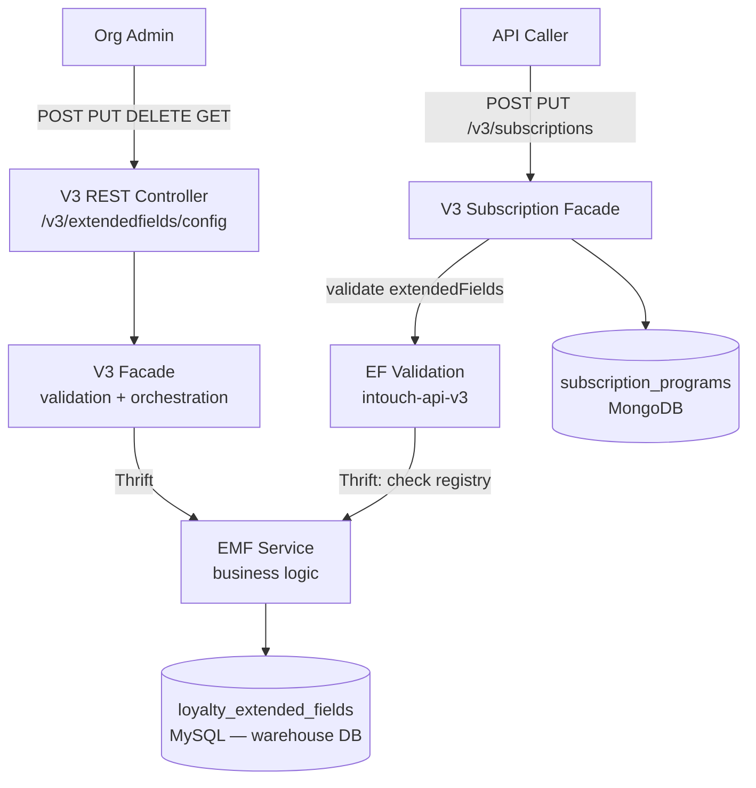
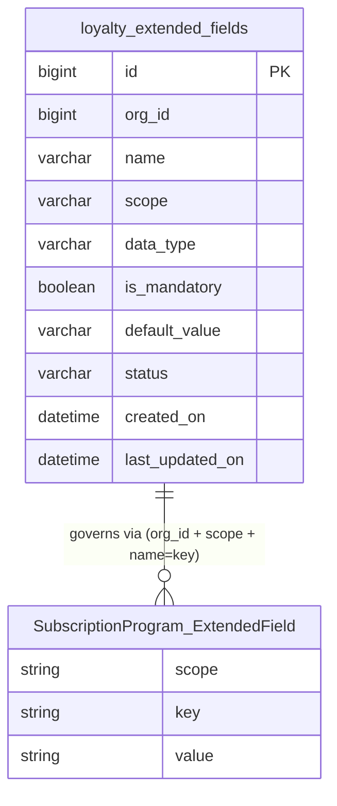

# Business Analysis — Loyalty Extended Fields CRUD
> Feature: Loyalty Extended Fields CRUD
> Ticket: loyaltyExtendedFields (Jira: CAP-183124)
> Phase: BA + PRD (Phase 1)
> Date: 2026-04-22

---

## Current Behaviour

The platform already has extended fields for customer, transaction, and lineitem entity types — managed via the CDP team's `extended_fields` table in the meta DB. The loyalty team has **no ownership** of that table.

In the subscription module (intouch-api-v3), a preliminary `SubscriptionProgram.ExtendedField` model exists in MongoDB (`subscription_programs` collection) with fields: `type` (currently mis-named as `ExtendedFieldType` with wrong values `CUSTOMER_EXTENDED_FIELD`/`TXN_EXTENDED_FIELD`), `key`, `value`. This model was implemented (tests BT-EF-01 to BT-EF-06 exist) but **has no CRUD APIs, no business logic, and no validation framework**.

There is no loyalty-owned registry that defines which custom fields are allowed per org and scope. Any extended field values passed into subscription programs are currently persisted without validation.

---

## Problem Statement

1. **No loyalty-owned EF registry** — the loyalty team cannot define or govern custom field metadata independently of CDP.
2. **No validation** — callers can pass arbitrary `key`/`value` pairs in `extendedFields` on subscription programs; nothing checks them against a registry.
3. **Wrong model** — `ExtendedFieldType` enum (`CUSTOMER_EXTENDED_FIELD`, `TXN_EXTENDED_FIELD`) misrepresents the concept; the field is actually a `scope` discriminator.
4. **No CRUD APIs** — org admins have no self-serve mechanism to configure custom fields for their subscription programs.

---

## Goals

1. Create a loyalty-owned extended field config registry (`loyalty_extended_fields` MySQL table in `warehouse` DB).
2. Expose CRUD APIs so org admins can define, update, deactivate, and list custom field definitions per scope.
3. Implement a validation framework: when a subscription program is created or updated with `extendedFields`, validate each entry against the registry.
4. Fix the `SubscriptionProgram.ExtendedField` model — rename `type` → `scope`, replace wrong enum with correct scope values.

---

## Scope

### In Scope — Sprint 1–3

| # | Item | Repos |
|---|------|-------|
| 1 | `loyalty_extended_fields` MySQL table (CREATE TABLE) | cc-stack-crm (`schema/dbmaster/warehouse/`) |
| 2 | EF Config CRUD APIs: `POST`, `PUT`, `DELETE`, `GET /v3/extendedfields/config` | intouch-api-v3 (REST + Facade) |
| 3 | Thrift service + structs for EF Config CRUD in `EMFService` | thrift-ifaces-emf |
| 4 | EMF service layer + DAO for `loyalty_extended_fields` | emf-parent |
| 5 | EF Validation Framework — validate `extendedFields` on subscription create/update | intouch-api-v3 + emf-parent |
| 6 | Rename `ExtendedFieldType` → `scope` field; correct scope values (SUBSCRIPTION_META) | intouch-api-v3 |
| 7 | Org-level config: max EF count per org | emf-parent / V3 |
| 8 | Scope: **SUBSCRIPTION_META only** — fields on the subscription program definition | all |

### Out of Scope / Deferred

| Item | Status | Reason |
|------|--------|--------|
| `SUBSCRIPTION_LINK` scope | Deferred — separate task | Requires new MongoDB collection at customer level |
| `SUBSCRIPTION_DELINK` scope | Deferred — separate task | Same as above |
| `PROMOTION`, `BENEFIT`, `BADGE` scopes | Future sprint | Not yet defined |
| MongoDB generic `extended_field_values` collection | Deferred | Not needed while values are embedded in SubscriptionProgram |
| EF Values APIs (`/v3/extendedfields/values/{entity_id}`) | Deferred | Values stored embedded in SubscriptionProgram MongoDB doc |
| Audit Log integration | Deferred | No confirmed consumer use case |
| Event Notification (EN) enrichment | Descoped | Removed from release |
| Reporting / dimensional modelling | Deferred | Out of current release |

---

## User Stories

### Epic 1 — EF Config Registry (CRUD)

**EF-US-01** — Create EF Definition
> As an org admin, I want to define a new custom extended field (name, data type, scope, mandatory flag, default value) for scope `SUBSCRIPTION_META`, so that subscription programs in my org can carry that custom attribute.

Acceptance Criteria:
- `POST /v3/extendedfields/config` creates a row in `loyalty_extended_fields` for the caller's org
- Uniqueness: `(org_id, scope, name)` — duplicate returns `409 CONFLICT`
- `scope` must be a valid allowed value; invalid scope returns `400`
- `data_type` must be one of: `STRING`, `NUMBER`, `BOOLEAN`, `DATE`; invalid returns `400`
- `status` defaults to `ACTIVE`
- `created_on` and `last_updated_on` populated automatically (UTC)
- Returns the created EF config with its `id`

**EF-US-02** — Update EF Definition (including soft-delete)
> As an org admin, I want to update an existing EF definition or deactivate it via a single PUT endpoint.

Acceptance Criteria:
- `PUT /v3/extendedfields/config/{id}` updates the matching row for the caller's org
- Only `name` (String) and `is_active` (boolean) are mutable — **D-23, D-25** (overrides original BA assumption that name was immutable)
- `scope`, `data_type`, `is_mandatory`, `default_value` are immutable after creation — attempt to change returns `400`
- Name change: re-validates uniqueness `(org_id, scope, new_name)`; `409` if conflict
- `is_active=false` performs soft-delete (no separate DELETE endpoint) — **D-24**
- `is_active=false` on already-inactive field returns `200` (idempotent)
- Non-existent `id` or wrong `org_id` → `404 NOT FOUND`
- `last_updated_on` updated on every successful PUT (UTC)

**EF-US-03** — List EF Definitions
> As an org admin, I want to list all extended field definitions for my org, filterable by scope and active status, so that I can see what is configured.

Acceptance Criteria:
- `GET /v3/extendedfields/config` returns all EF configs for the caller's `org_id`
- Supports query params: `?scope=SUBSCRIPTION_META`, `?includeInactive=false`
- By default returns only active (`is_active=1`) records; `includeInactive=true` returns all
- Returns paginated response (page + size params) per G-04.2
- Empty result returns `200` with empty list (not `404`)

---

### Epic 2 — EF Validation on Subscription Programs

**EF-US-05** — Validate EF values on Subscription Create
> As a developer integrating with the subscription API, I want the system to validate extended fields on `POST /v3/subscriptions` so that invalid field names, wrong data types, or missing mandatory fields are rejected with a clear error.

Acceptance Criteria:
- When `extendedFields` is provided on subscription create, for each entry:
  - `scope` must be `SUBSCRIPTION_META` (for now)
  - `key` must match an `ACTIVE` EF definition in `loyalty_extended_fields` for `(org_id, scope)` → else `400`
  - `value` data type must match the registered `data_type` → else `400`
- All mandatory `ACTIVE` EF definitions for `(org_id, SUBSCRIPTION_META)` must be present → else `400`
- If `extendedFields` is `null` or omitted AND mandatory fields exist → `400`
- Valid `extendedFields` → persisted in MongoDB `subscription_programs.extendedFields`

**EF-US-06** — Validate EF values on Subscription Update
> As a developer, I want EF validation to also apply on `PUT /v3/subscriptions/{id}` so that updates remain consistent with the registry.

Acceptance Criteria:
- Same validation rules as EF-US-05 when `extendedFields` is provided
- If `extendedFields` is `null` on PUT → **preserve existing values** (existing null-guard behaviour, R-33 from prior subscription work)
- If `extendedFields` is an empty list `[]` → clear all EF values (explicit intent to remove)

---

### Epic 3 — Model Correction

**EF-US-07** — Remove `ExtendedFieldType` and correct `SubscriptionProgram.ExtendedField` model
> As a developer, I want the wrong `ExtendedFieldType` enum and `type` field removed, and `SubscriptionProgram.ExtendedField` corrected to `{efId: Long, key: String, value: String}`.

Acceptance Criteria:
- `ExtendedFieldType` enum (`CUSTOMER_EXTENDED_FIELD`, `TXN_EXTENDED_FIELD`) is deleted — **D-27**
- `SubscriptionProgram.ExtendedField.type` field is deleted (not renamed) — scope always SUBSCRIPTION_META, validated server-side — **D-27**
- `SubscriptionProgram.ExtendedField.key` (String) is **kept** — stores the field name (e.g. "gender") — **D-28**
- `SubscriptionProgram.ExtendedField.efId` (Long) is **added** — FK to `loyalty_extended_fields.id` — **D-28**
- Final model: `{efId: Long, key: String, value: String}` — no `@Field` annotation needed (no rename)
- Tests BT-EF-01 to BT-EF-06 updated to use `efId`-based model; remove all `ExtendedFieldType` references
- No other callers of `ExtendedFieldType` broken (3 confirmed usages only — all in scope of this story)
- No MongoDB migration needed — existing documents with `{type, key, value}` deserialize with `efId=null`, `key`/`value` preserved

---

## Constraints

| Constraint | Source |
|-----------|--------|
| `loyalty_extended_fields` lives in `warehouse` DB, owned by loyalty team | Architecture decision |
| `scope` column is `VARCHAR` (not MySQL ENUM) — future scope values will grow too large for DB ENUM | Design decision |
| Application-level scope validation enforces allowed values (enum-like, extensible) | Design decision |
| Only `SUBSCRIPTION_META` scope in scope for Sprint 1-3 | User decision |
| V3 → EMF communication via Thrift (new methods in `EMFService`) | Architecture decision |
| EMF owns warehouse DAO; V3 has no direct warehouse DB access | Architecture constraint (verified) |
| cc-stack-crm schema: CREATE TABLE only, no ALTER/Flyway — PR merge deploys | Project convention (C7) |
| Soft deletes only (`status = INACTIVE`) — no physical row deletion | G-05.5, BRD |
| Uniqueness: `(org_id, scope, name)` at DB + service layer | BRD, G-05.3 |
| All timestamps in UTC | G-01.1 |
| All queries must include `org_id` filter | G-07.1 |
| Mandatory fields must be validated at V3 boundary | G-03.2 |

---

## Assumptions

| # | Assumption |
|---|-----------|
| A-01 | `status` column will use `ACTIVE`/`INACTIVE` VARCHAR per BRD, not `is_active tinyint` from cc-stack-crm convention — Architect to confirm |
| A-02 | Org-level config (max EF count per org) — stored in existing `program_config_key_values` or a lightweight config entry; Architect to decide |
| A-03 | `value` is always stored as `String` in MongoDB; data type validation is application-level only (same pattern as existing `ExtendedFieldsData` in Thrift) |
| A-04 | `SUBSCRIPTION_META` is the only scope value validated at application level for Sprint 1-3; other values return `400` |
| A-05 | `DELETE` is idempotent — deleting an already-INACTIVE field returns success (not 409); Architect to confirm |
| A-06 | Existing `SubscriptionProgram.extendedFields` MongoDB field name stays as `extendedFields` — only the Java field `type` is renamed to `scope`; the JSON key is updated to `scope` |

---

## Open Questions

| # | Question | Owner | Phase |
|---|----------|-------|-------|
| OQ-01 | `status` column type: VARCHAR(`ACTIVE`/`INACTIVE`) per BRD vs `is_active tinyint` per cc-stack-crm convention? | Architect | Phase 6 |
| OQ-02 | Org-level max EF count: where stored? Separate table or `program_config_key_values`? | Architect | Phase 6 |
| OQ-03 | Error response format for validation failures: structured `{code, message, field}` or existing V3 error envelope? | Designer | Phase 7 |
| OQ-04 | DELETE idempotency: return `200` or `409` when field is already INACTIVE? | Architect | Phase 6 |

---

## Diagrams

