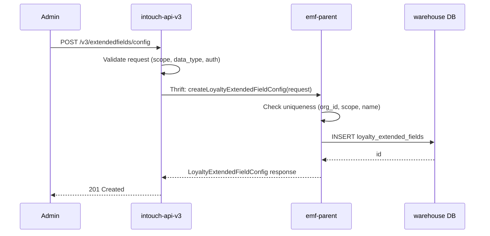
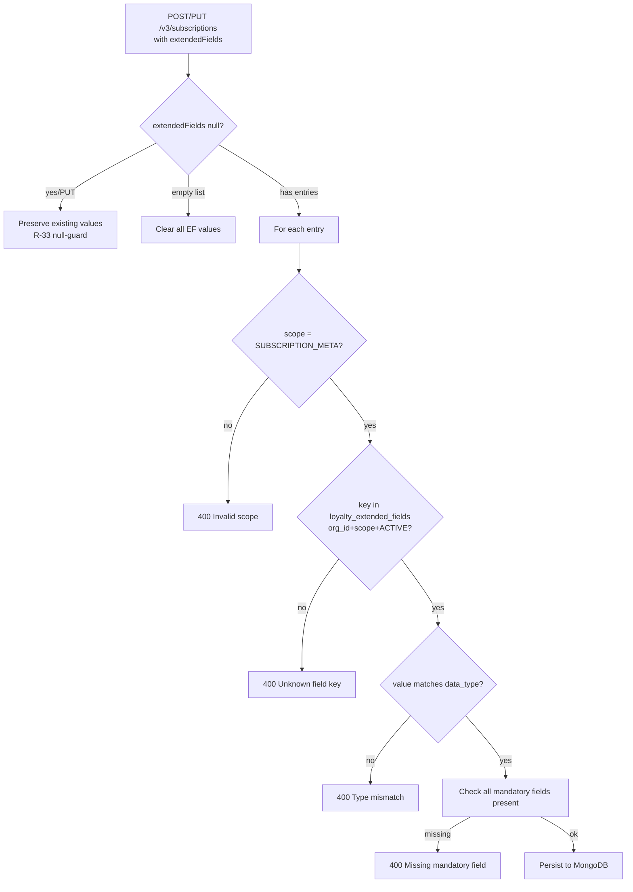

# Product Requirements Document — Loyalty Extended Fields CRUD
> Feature: Loyalty Extended Fields CRUD
> Ticket: loyaltyExtendedFields (Jira: CAP-183124)
> Date: 2026-04-22
> Status: Draft

---

## Executive Summary

Build a loyalty-team-owned extended fields registry and validation framework for subscription programs. Org admins can define custom attributes (name, data type, scope, mandatory flag) via self-serve CRUD APIs. When subscription programs are created or updated, provided extended field values are validated against the registry. Also fixes a pre-existing model error in the subscription module.

---

## Epics & User Stories

### Epic 1 — EF Config Registry CRUD
**Confidence: [C6]** | Well-defined table schema, standard CRUD, patterns exist in codebase.

| Story | Description | Acceptance Criteria | Complexity |
|-------|-------------|---------------------|-----------|
| EF-US-01 | Create EF definition | POST /v3/extendedfields/config; validates scope, data_type, uniqueness; returns created config with id | Medium |
| EF-US-02 | Update EF definition | PUT /v3/extendedfields/config/{id}; name/scope/data_type immutable; 404 on wrong org/id | Small |
| EF-US-03 | Deactivate EF definition | DELETE /v3/extendedfields/config/{id}; soft-delete (status=INACTIVE); 404 on wrong org/id | Small |
| EF-US-04 | List EF definitions | GET /v3/extendedfields/config?scope=&status=; paginated; empty=200 | Small |

**Architecture diagram:**


---

### Epic 2 — EF Validation on Subscription Programs
**Confidence: [C5]** | Validation rules clear; integration with existing subscription flow needs Architect to confirm hook point.

| Story | Description | Acceptance Criteria | Complexity |
|-------|-------------|---------------------|-----------|
| EF-US-05 | Validate EF on subscription create | Every extendedFields entry validated against registry; mandatory fields enforced; 400 on failure | Medium |
| EF-US-06 | Validate EF on subscription update | Same validation when extendedFields provided; null preserves existing (R-33); empty list clears | Medium |

**Validation flow:**


---

### Epic 3 — Model Correction
**Confidence: [C7]** | Straightforward rename; wrong enum confirmed, tests confirmed.

| Story | Description | Acceptance Criteria | Complexity |
|-------|-------------|---------------------|-----------|
| EF-US-07 | Remove ExtendedFieldType enum; rename type→scope | ExtendedFieldType.java deleted; SubscriptionProgram.ExtendedField.scope: String; tests BT-EF-01–06 updated | Small |

---

## API Contracts

### EF Config Endpoints

#### POST /v3/extendedfields/config
```
Request:
{
  "name": "renewal_discount_pct",
  "scope": "SUBSCRIPTION_META",
  "data_type": "NUMBER",          // STRING | NUMBER | BOOLEAN | DATE | ENUM
  "is_mandatory": false,
  "default_value": "0",
  "enum_values": null             // Required (non-empty) when data_type=ENUM; null otherwise
}

// ENUM example:
{
  "name": "plan_tier",
  "scope": "SUBSCRIPTION_META",
  "data_type": "ENUM",
  "is_mandatory": true,
  "enum_values": ["GOLD", "SILVER", "PLATINUM"]
}

Response 201:
{
  "id": 1001,
  "org_id": 100,
  "name": "renewal_discount_pct",
  "scope": "SUBSCRIPTION_META",
  "data_type": "NUMBER",
  "is_mandatory": false,
  "default_value": "0",
  "enum_values": null,
  "is_active": true,
  "created_on": "2026-04-22T10:00:00Z",
  "last_updated_on": "2026-04-22T10:00:00Z"
}

Error 400: invalid scope or data_type
Error 400: data_type=ENUM but enum_values null or empty
Error 409: (org_id, scope, name) already exists
```

#### PUT /v3/extendedfields/config/{id}
```
Request (only mutable fields):
{
  "is_mandatory": true,
  "default_value": "10",
  "enum_values": ["GOLD", "SILVER", "PLATINUM", "DIAMOND"]   // updatable for ENUM type
}

Response 200: updated LoyaltyExtendedFieldConfig
Error 400: attempt to mutate immutable fields (name, scope, data_type)
Error 404: id not found for caller's org_id
```

#### DELETE /v3/extendedfields/config/{id}
```
Response 200/204: { "id": 1001, "is_active": false }
                  (idempotent — same response if already inactive)
Error 404: id never existed for caller's org_id
```

#### GET /v3/extendedfields/config
```
Query params: scope=SUBSCRIPTION_META, includeInactive=false, page=0, size=20

Response 200:
{
  "content": [ { ...LoyaltyExtendedFieldConfig... } ],
  "page": 0,
  "size": 20,
  "totalElements": 5,
  "totalPages": 1
}
```

---

## Data Model

### New Table: `loyalty_extended_fields` (warehouse DB)

```sql
CREATE TABLE `loyalty_extended_fields` (
  `id`               BIGINT        NOT NULL AUTO_INCREMENT,
  `org_id`           BIGINT        NOT NULL,
  `name`             VARCHAR(100)  NOT NULL,
  `scope`            VARCHAR(50)   NOT NULL,
  `data_type`        VARCHAR(30)   NOT NULL,
  `is_mandatory`     TINYINT(1)    NOT NULL DEFAULT 0,
  `default_value`    VARCHAR(255)  NULL,
  `enum_values`      VARCHAR(1000) NULL,   -- JSON array of allowed values when data_type=ENUM; storage TBD by Architect (D-21)
  `is_active`        TINYINT(1)    NOT NULL DEFAULT 1,
  `created_on`       DATETIME      NOT NULL,
  `last_updated_on`  DATETIME      NOT NULL,
  PRIMARY KEY (`id`),
  UNIQUE KEY `uq_org_scope_name` (`org_id`, `scope`, `name`),
  KEY `idx_org_scope_active` (`org_id`, `scope`, `is_active`)
);
```

> **D-14**: `is_active TINYINT(1)` replaces the original `status VARCHAR(20)` — aligns with cc-stack-crm convention.
> **D-21 OPEN**: `enum_values` column shown above is one option. Architect may choose a child table `loyalty_extended_field_enum_values (id, field_id, enum_value)` instead.

### Modified: `SubscriptionProgram.ExtendedField` (MongoDB — `subscription_programs`)

| Field | Before | After |
|-------|--------|-------|
| `type` (ExtendedFieldType) | CUSTOMER_EXTENDED_FIELD \| TXN_EXTENDED_FIELD | **Removed** |
| `scope` (String) | N/A | SUBSCRIPTION_META |
| `key` (String) | unchanged | unchanged |
| `value` (String) | unchanged | unchanged |

---

## New Thrift Structs & Service Methods

**File**: `thrift-ifaces-emf/emf.thrift`

```thrift
struct LoyaltyExtendedFieldConfig {
    1: required i64 id
    2: required i64 orgId
    3: required string name
    4: required string scope
    5: required string dataType          // STRING | NUMBER | BOOLEAN | DATE | ENUM
    6: required bool isMandatory
    7: optional string defaultValue
    8: optional list<string> enumValues  // populated when dataType=ENUM
    9: required bool isActive
    10: required string createdOn
    11: required string lastUpdatedOn
}

struct CreateLoyaltyExtendedFieldRequest {
    1: required i64 orgId
    2: required string name
    3: required string scope
    4: required string dataType
    5: required bool isMandatory
    6: optional string defaultValue
    7: optional list<string> enumValues  // required when dataType=ENUM
}

struct UpdateLoyaltyExtendedFieldRequest {
    1: required i64 id
    2: required i64 orgId
    3: optional bool isMandatory
    4: optional string defaultValue
    5: optional list<string> enumValues  // updatable for ENUM type fields
}

struct LoyaltyExtendedFieldListResponse {
    1: required list<LoyaltyExtendedFieldConfig> configs
    2: required i32 totalElements
    3: required i32 page
    4: required i32 size
}

// New methods in EMFService:
LoyaltyExtendedFieldConfig createLoyaltyExtendedFieldConfig(1: CreateLoyaltyExtendedFieldRequest request) throws (1: EMFException ex)
LoyaltyExtendedFieldConfig updateLoyaltyExtendedFieldConfig(1: UpdateLoyaltyExtendedFieldRequest request) throws (1: EMFException ex)
LoyaltyExtendedFieldConfig deleteLoyaltyExtendedFieldConfig(1: i64 id, 2: i64 orgId) throws (1: EMFException ex)
LoyaltyExtendedFieldListResponse getLoyaltyExtendedFieldConfigs(1: i64 orgId, 2: optional string scope, 3: bool includeInactive, 4: i32 page, 5: i32 size) throws (1: EMFException ex)
```

---

## Non-Functional Requirements

| Category | Requirement |
|----------|------------|
| Performance | List API paginated (max 100 per page); Validation caching deferred — implement based on actual usage data |
| Security | All endpoints require org-level authentication; org_id from auth context, never from request body (G-07) |
| Tenancy | Every DB query must include `org_id` filter (G-07.1) |
| Null safety | Empty list returned when no EF configs found; never null (G-02.1) |
| Timestamps | All timestamps stored and returned in UTC ISO-8601 (G-01.1, G-01.6) |
| Error format | Structured error response: `{ "code": "EF_VALIDATION_001", "message": "...", "field": "key" }` |
| Backward compat | New Thrift fields must be `optional` for backward compatibility (G-09.5) |

---

## Grooming Questions — RESOLVED

| # | Question | Resolution |
|---|----------|------------|
| GQ-01 | `status` column type? | **`is_active TINYINT(1) DEFAULT 1`** — cc-stack-crm convention. No `status` VARCHAR column. |
| GQ-02 | Org-level max EF count storage? | **`program_config_key_values`** table. Default value = **10**. |
| GQ-03 | DELETE idempotency? | **Idempotent**: ACTIVE→INACTIVE = 200/204; already-INACTIVE = 200/204; never existed = 404. |
| GQ-04 | Validation caching? | **Deferred** — integrate caching based on actual usage data. No caching in Sprint 1-3. |
| GQ-05 | Deactivated EF impact on existing values? | **No impact** — existing subscription program values preserved. New events only validate against active fields. |

## New Open Questions (Post-GQ-05)

| # | Question | Classification |
|---|----------|----------------|
| OQ-06 | ENUM allowed values storage: `enum_values VARCHAR(1000)` column on `loyalty_extended_fields` (JSON array) OR separate child table `loyalty_extended_field_enum_values(id, field_id, enum_value)`? | ARCHITECT |

---

## Out of Scope

- `SUBSCRIPTION_LINK` and `SUBSCRIPTION_DELINK` scopes (separate future task — new MongoDB collection at customer level)
- `PROMOTION`, `BENEFIT`, `BADGE` scopes
- Generic `/v3/extendedfields/values/{entity_id}` APIs (deferred)
- MongoDB `extended_field_values` standalone collection (deferred)
- Audit Log active integration (deferred — no confirmed consumer)
- Event Notification enrichment (descoped)
- Reporting / dimensional modelling (deferred)
