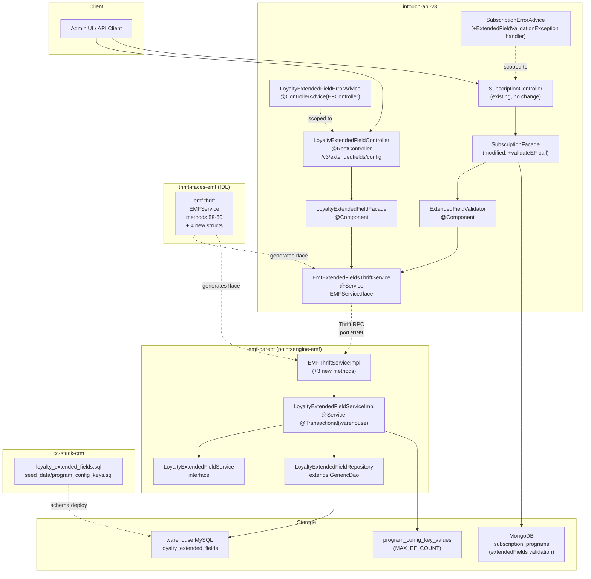

# High-Level Design — Loyalty Extended Fields CRUD
> Feature: Loyalty Extended Fields CRUD
> Ticket: CAP-183124
> Phase: 6 (Architect)
> Date: 2026-04-22
> Status: Complete

---

## STEP 2: Open Question Resolutions

### OQ-1: `SubscriptionProgram.ExtendedField` Model — Final Design

**Evidence**: `SubscriptionProgram.java:295-301` (read directly):
```java
public static class ExtendedField {
    @NotNull
    private ExtendedFieldType type;
    @NotBlank
    private String key;         // field name e.g. "gender"
    private String value;       // field value e.g. "Male"
}
```

**User correction (2026-04-22)**: The earlier assumption that `key` would be replaced by `id` was wrong. `key` has semantic value — it stores the extended field's name (e.g. "gender") which is meaningful for display and trace. `efId` (Long) is added as the FK to `loyalty_extended_fields.id` for authoritative validation.

**Resolution**: Final model after correction:
```java
public static class ExtendedField {
    private Long efId;          // NEW — FK to loyalty_extended_fields.id (D-28)
    private String key;         // KEPT — field name e.g. "gender"
    private String value;       // KEPT — field value e.g. "Male"
    // type: ExtendedFieldType  DELETED (D-27)
}
```
No `@Field` annotation needed — `key` is not renamed. `efId` is purely additive. Old MongoDB documents `{type, key, value}` deserialize with `efId=null`, `key`/`value` preserved — no migration needed.

**Confidence**: C7 — model confirmed directly by user.

---

### OQ-2: `ProgramConfigKey` Seed Data

**Evidence**: `seed_data/dbmaster/warehouse/program_config_keys.sql` contains `REPLACE INTO program_config_keys` with 47 entries (IDs 1-47). Pattern: explicit numeric IDs, `value_type`, `default_value`, `label`, `added_by=0`, `added_on=datetime`, `is_valid=1`.

No Java seed runner exists — the pattern is exclusively SQL `REPLACE INTO` in the `seed_data/dbmaster/warehouse/` directory. These seed files are version-controlled alongside schema files and are applied during environment bootstrap.

**Resolution**: Add a new file `seed_data/dbmaster/warehouse/program_config_keys.sql` entry (or append to the existing file) with:
```sql
REPLACE INTO `program_config_keys` (`id`, `name`, `value_type`, `default_value`, `label`, `added_by`, `added_on`, `is_valid`) VALUES
(48, 'MAX_EF_COUNT_PER_PROGRAM', 'NUMERIC', '10', 'Max Extended Fields Per Program', 0, '2026-04-22 00:00:00', 1);
```
ID=48 (next after 47). Place in `cc-stack-crm/seed_data/dbmaster/warehouse/program_config_keys.sql`.

**Confidence**: C7 — seed file read directly, pattern fully confirmed.

---

### OQ-3: `DATETIME` vs `TIMESTAMP` Convention

**Evidence**: Direct file reads confirm:
- `custom_fields.sql`: `created_on datetime NOT NULL` + `auto_update_time timestamp NOT NULL DEFAULT CURRENT_TIMESTAMP ON UPDATE CURRENT_TIMESTAMP`
- `partner_programs.sql`: `created_on datetime NOT NULL` + `auto_update_time timestamp NOT NULL DEFAULT CURRENT_TIMESTAMP`
- `supplementary_membership_cycle_details.sql`: `created_on DATETIME NOT NULL` + `auto_update_time timestamp NOT NULL`
- `program_config_key_values.sql`: `updated_on datetime NOT NULL`

**Pattern**: cc-stack-crm convention is `created_on DATETIME` (human-readable, application-set) + `auto_update_time TIMESTAMP` (MySQL auto-managed).

D-26 intentionally deviates from this convention by using `TIMESTAMP` for both `created_on` and `updated_on` in `loyalty_extended_fields`. The rationale is G-01.1 (UTC storage) — `DATETIME` is timezone-naive while `TIMESTAMP` is UTC-stored and DST-safe.

**Resolution**: Keep D-26. The `loyalty_extended_fields` table uses `TIMESTAMP` for both `created_on` and `updated_on`. This is an intentional deviation from older cc-stack-crm tables that predates G-01 guardrail. The column is also renamed from the legacy `auto_update_time` pattern to `updated_on` (cleaner naming, consistent with the PRD API response field name `updated_on`).

**Confidence**: C7 — both files read directly; deviation from convention is intentional per D-26.

---

### OQ-4 (R-CT-01): `OrgEntityIntegerPKBase` vs BIGINT

**Evidence**: Direct search confirms both `OrgEntityIntegerPKBase` and `OrgEntityLongPKBase` exist in `com.capillary.commons.data` package:
- `OrgEntityIntegerPKBase`: used by `ProgramConfigKeyValue`, `HistoricalPoints`, `VoucherRedeemed`, `CardSeriesProgramMapping`, `LiabilitySplitRatio` — tables with `int(11)` ids
- `OrgEntityLongPKBase`: used by `PointsAwarded`, `PointsRedemptionSummary`, `ActionPointsDetail`, `CappingFilterMapping` — tables with `BIGINT` ids

`OrgEntityLongPKBase` constructor: `PointsRedemptionSummaryPK(final long id, final int orgId)` — the `id` is `long` but `orgId` is still `int`.

**Resolution**: `LoyaltyExtendedFieldPK` extends `OrgEntityLongPKBase` (not `OrgEntityIntegerPKBase`). This correctly handles `BIGINT` for `id`. However, `orgId` remains `int` in the base class constructor — the schema has `org_id BIGINT`, but the platform convention is `int orgId` in JPA entities (evidenced across all entities). Use `Long orgId` as the Java field type in the entity, casting to `int` only for `OrgEntityLongPKBase` constructor calls. Alternatively (preferred): define `LoyaltyExtendedFieldPK` as a standalone `@Embeddable` without extending either base class, using `Long id` and `Long orgId` directly. This avoids the `int`-cast issue entirely.

**ADR-02**: Create a standalone `@Embeddable` PK class with `Long id` + `Long orgId` directly. Do NOT extend `OrgEntityLongPKBase` to avoid `int` orgId mismatch.

**Confidence**: C7 — both base classes verified by reading actual entity files.

---

### OQ-5 (R-CT-03): V3 Thrift Client Interface Strategy

**Evidence**: Direct file reads confirm:
- `PointsEngineRulesThriftService.java` uses `PointsEngineRuleService.Iface.class` (from `pointsengine_rules.thrift`) — handles partner program and points engine operations
- `EmfPromotionThriftService.java` uses `EMFService.Iface.class` (from `emf.thrift`) — handles promotion issue/earn events
- Both use `RPCService.rpcClient(IfaceClass, "emf-thrift-service", 9199, 60000)` — same host/port
- V3 already has the `EMFService.Iface.class` pattern established in `EmfPromotionThriftService`

**Resolution**: Create a new `EmfExtendedFieldsThriftService.java` in V3's `services/thrift/` package that uses `EMFService.Iface.class` (from emf.thrift) — same pattern as `EmfPromotionThriftService`. Do NOT add EF methods to `PointsEngineRulesThriftService` (wrong interface). The new service will call methods #58, #59, #60 on `EMFService.Iface`.

**Confidence**: C7 — `EmfPromotionThriftService` read directly; `EMFService.Iface.class` already in V3.

---

### OQ-6: `SubscriptionErrorAdvice` Scope

**Evidence**: `SubscriptionErrorAdvice.java:26`:
```java
@ControllerAdvice(assignableTypes = {SubscriptionController.class, SubscriptionReviewController.class})
```
Scoped only to SubscriptionController and SubscriptionReviewController. Does NOT handle `EMFException` (the Thrift-generated type) — only handles `EMFThriftException` (the V3 wrapper).

**Resolution**: 
- EF Config errors (400/404/409 from `EMFService`) need a new `LoyaltyExtendedFieldErrorAdvice` scoped to `LoyaltyExtendedFieldController.class` (per D-31).
- EF Validation errors from `ExtendedFieldValidator` (called within `SubscriptionFacade`) will surface as `ExtendedFieldValidationException` (a new RuntimeException). This must be handled in `SubscriptionErrorAdvice` (add a new `@ExceptionHandler` entry) since the exception is thrown from within the subscription controller's request path.
- Do NOT extend `SubscriptionErrorAdvice` scope — instead, add a targeted handler for `ExtendedFieldValidationException` to the existing `SubscriptionErrorAdvice`.

**Confidence**: C7 — `SubscriptionErrorAdvice.java` read directly; exact `@ControllerAdvice` annotation confirmed.

---

### OQ-7: `getLoyaltyExtendedFieldConfigs` Thrift `orgId` field

**Evidence**: Existing EMFService `get*` methods:
- `getAllGenericEvents(1: i64 orgId, ...)` — no `required` qualifier
- `getCustomerLoyaltyEvents(1: i64 orgId, ...)` — no `required` qualifier

Thrift IDL convention: when a field has no qualifier in a service method signature, it is implicitly `optional` for primitives. However, `required` in service method params provides documentation and generates proper Java code.

**Resolution**: Use `required` on `orgId` in Thrift method signatures to enforce documentation and prevent zero-default bypass. Add service-layer validation in EMF: `if (orgId <= 0) throw EMFException(EF_INVALID_ORG, 400)` as second line of defense (R-CT-05 mitigation).

**Confidence**: C6 — pattern read from existing emf.thrift methods; decision is architectural.

---

### OQ-8: `getById` Thrift Method

**Evidence**: EF Validation (R-01) requires looking up each submitted EF `id` to verify it is active and belongs to the correct (org, program). The current `getLoyaltyExtendedFieldConfigs` returns a paginated list. For validation of N submitted EF ids, this requires either N calls to a hypothetical `getById` or 1 call to `getLoyaltyExtendedFieldConfigs` to fetch all active configs and do in-memory matching.

Fetching all active configs per (orgId, programId) is viable: org admins define at most `MAX_EF_COUNT_PER_PROGRAM=10` active EF configs per program. A single list call (page=0, size=100) fetches all configs in one Thrift call, then EF validation iterates in memory.

**Resolution**: No separate `getById` method needed. Use `getLoyaltyExtendedFieldConfigs(orgId, programId, scope=null, includeInactive=false, page=0, size=MAX)` once per subscription validation request to load all active configs, then validate in memory. This is 1 Thrift call per subscription create/update (not N calls). Per D-17, caching this result is deferred.

**Confidence**: C6 — max EF count confirmed as 10 (D-15); single-call pattern is correct given the small result set.

---

### OQ-9: `forkDraft` / `duplicateSubscription` EF Handling

**Evidence**: `SubscriptionFacade.java:343`:
```java
.extendedFields(active.getExtendedFields() != null ? active.getExtendedFields() : List.of())
```
`SubscriptionFacade.java:385`:
```java
.extendedFields(source.getExtendedFields() != null ? source.getExtendedFields() : List.of())
```
Both operations perform a shallow copy of the `extendedFields` list (copy List reference, shallow copy of each `ExtendedField` object). No validation is fired during fork/duplicate.

**Resolution**: Fork/duplicate copies EF ids **as-is** without re-validation. Rationale:
1. EF ids are stable foreign keys (PKs of `loyalty_extended_fields`) — they do not change.
2. A deactivated EF id in a forked draft will only be caught when the DRAFT is submitted for approval (or when the subscriber runs PUT/POST on the subscription).
3. Re-validating EF on fork/duplicate would be surprising UX and would block legitimate forks of subscriptions that reference now-deactivated fields.
4. The DRAFT lifecycle already handles stale state gracefully.

**Confidence**: C6 — code read directly; decision is architectural.

---

### OQ-10: `EMFException` Status Code Mapping

**Evidence**: `ExceptionCodes.java` read directly. Existing domain-specific codes cluster in the 4xxx-7xxx range:
- 4001-4103: points/partner program errors
- 5001: evaluation logs
- 6001-6005: promotion/customer events  
- 7000-7007: tier/slab errors

The `getHttpStatusCode()` method uses ranges to return 400 or 500.

**Resolution**: Define new EF exception codes in the 8xxx range:

| Java Constant | Value | HTTP Status | Scenario |
|---|---|---|---|
| `EF_CONFIG_NOT_FOUND` | 8001 | 404 | EF config id not found for (id, orgId) |
| `EF_CONFIG_DUPLICATE_NAME` | 8002 | 409 | Name uniqueness violation (D-30) |
| `EF_CONFIG_IMMUTABLE_UPDATE` | 8003 | 400 | Attempt to update immutable field (scope, data_type, etc.) |
| `EF_CONFIG_INVALID_SCOPE` | 8004 | 400 | Scope not in allowed values |
| `EF_CONFIG_INVALID_DATA_TYPE` | 8005 | 400 | data_type not in STRING/NUMBER/BOOLEAN/DATE |
| `EF_VALIDATION_UNKNOWN_ID` | 8006 | 400 | EF id not found or inactive for (orgId, programId) |
| `EF_VALIDATION_TYPE_MISMATCH` | 8007 | 400 | Value doesn't match data_type |
| `EF_VALIDATION_MISSING_MANDATORY` | 8008 | 400 | Required EF config not present in submitted list |
| `EF_CONFIG_MAX_COUNT_EXCEEDED` | 8009 | 400 | org+program EF count >= MAX_EF_COUNT_PER_PROGRAM |
| `EF_CONFIG_INVALID_ORG` | 8010 | 400 | orgId <= 0 in Thrift request |

The `ExceptionCodes.getHttpStatusCode()` method must be updated to include `8001-8009` in the `badRequestErrors` set except 8001 (→ 500 by default, override needed). However, since V3's `LoyaltyExtendedFieldErrorAdvice` directly reads the `EMFException.statusCode` and maps it, the `ExceptionCodes` HTTP mapping is not strictly required for this feature.

**Confidence**: C7 for code range (no 8xxx codes exist); C6 for HTTP mapping approach.

---

## 1. Current State Summary

### thrift-ifaces-emf
- `emf.thrift` has 57 methods in `EMFService`
- Existing `ExtendedFieldsData` struct (for event data) is unrelated to EF Config
- No CRUD methods for loyalty EF configs exist
- New structs and methods 58-60 must be added

### cc-stack-crm
- No `loyalty_*.sql` files exist — greenfield
- New table `loyalty_extended_fields` must be created
- Seed data for `MAX_EF_COUNT_PER_PROGRAM` key must be added to `seed_data/dbmaster/warehouse/program_config_keys.sql`
- Convention: `DATETIME` for `created_on` (existing tables); D-26 intentionally uses `TIMESTAMP` for UTC compliance

### emf-parent (pointsengine-emf module)
- Pattern: `@EmbeddedId` composite PK entities with `OrgEntityLongPKBase` for BIGINT ids
- `EMFThriftServiceImpl` implements `EMFService.Iface` — new methods 58-60 go here
- `ProgramConfigKey` (id=48) and `ProgramConfigKeyValue` infrastructure already in place for MAX_EF_COUNT
- `@DataSourceSpecification(WAREHOUSE)` + `@Transactional("warehouse")` patterns established
- No existing LoyaltyExtendedField* classes — all new

### intouch-api-v3
- `SubscriptionProgram.ExtendedField`: currently `{type: ExtendedFieldType, key: String, value: String}` — must become `{efId: Long, key: String, value: String}` — `type` deleted, `key` kept, `efId` added as FK (D-27, D-28)
- `ExtendedFieldType` enum: must be deleted
- `SubscriptionFacade`: 4 usages of `extendedFields` (lines 102, 289, 343, 385) — lines 102 and 289 need EF validation hook
- `PointsEngineRulesThriftService` uses `PointsEngineRuleService.Iface` — WRONG for new EF methods
- `EmfPromotionThriftService` uses `EMFService.Iface` — CORRECT pattern for new `EmfExtendedFieldsThriftService`
- `SubscriptionErrorAdvice` scoped to `{SubscriptionController, SubscriptionReviewController}` — needs `ExtendedFieldValidationException` handler added
- No EF Config CRUD classes exist — all new

### Key Gaps
1. No MySQL table for EF config storage
2. No Thrift methods for EF config CRUD
3. No V3 REST endpoints for EF config management
4. No EF validation in subscription create/update flow
5. `SubscriptionProgram.ExtendedField` model is incorrect (wrong field names/types)
6. `ExtendedFieldType` enum is semantically wrong and must be deleted

---

## 2. Architecture Overview



### Data Flow: EF Config CRUD (V3 → EMF → MySQL)

1. Admin sends `POST /v3/extendedfields/config` with `{program_id, name, scope, data_type, is_mandatory, default_value}`
2. `LoyaltyExtendedFieldController` extracts `orgId` from auth token (G-07.1, never from body)
3. Controller delegates to `LoyaltyExtendedFieldFacade`
4. Facade builds `CreateLoyaltyExtendedFieldRequest` (orgId from auth, remaining fields from request body)
5. Facade calls `EmfExtendedFieldsThriftService.createLoyaltyExtendedFieldConfig(request)` → Thrift RPC to EMF port 9199
6. `EMFThriftServiceImpl.createLoyaltyExtendedFieldConfig()` delegates to `LoyaltyExtendedFieldServiceImpl`
7. Service checks MAX_EF_COUNT via `program_config_key_values`; checks name uniqueness via DAO; saves entity
8. `loyalty_extended_fields` row inserted; BIGINT auto-increment id returned
9. Response flows back: EMF → Thrift → V3 → HTTP 201 with `LoyaltyExtendedFieldConfig` response DTO

### Data Flow: EF Validation (V3 Subscription → EMF → MySQL → MongoDB)

1. Client sends `POST /v3/subscriptions` with `{programId, ..., extendedFields: [{efId:1001, key:"gender", value:"Male"}]}`
2. `SubscriptionController` delegates to `SubscriptionFacade.createSubscription()`
3. `SubscriptionFacade` calls `ExtendedFieldValidator.validate(orgId, programId, extendedFields)` before MongoDB save
4. `ExtendedFieldValidator` calls `EmfExtendedFieldsThriftService.getLoyaltyExtendedFieldConfigs(orgId, programId, null, false, 0, 100)` to fetch all active configs in one call
5. Validator performs in-memory: R-01 (efId exists in active configs), R-02 (data_type match), R-03 (mandatory fields present)
6. On failure: throws `ExtendedFieldValidationException` → caught by `SubscriptionErrorAdvice` → HTTP 400
7. On success: subscription proceeds to MongoDB save with `extendedFields: [{efId: Long, key: String, value: String}]`

---

## 3. Module Design

### 3a. thrift-ifaces-emf Changes

**File**: `/Users/baljeetsingh/IdeaProjects/thrifts/thrift-ifaces-emf/emf.thrift`

#### New Structs (add after existing struct definitions, before `service EMFService`)

```thrift
struct LoyaltyExtendedFieldConfig {
    1: required i64 id
    2: required i64 orgId
    3: required i64 programId
    4: required string name
    5: required string scope
    6: required string dataType
    7: required bool isMandatory
    8: optional string defaultValue
    9: required bool isActive
    10: required string createdOn      // UTC ISO-8601 string
    11: required string updatedOn      // UTC ISO-8601 string
    12: optional string updatedBy
}
```

**Field rationale**:
- Fields 1-7, 9-11: `required` — these are always present on a well-formed config row; will never be null
- Fields 8 (`defaultValue`) and 12 (`updatedBy`): `optional` — nullable by schema design
- `createdOn`/`updatedOn` as strings (ISO-8601) — avoids Thrift `i64`-as-timestamp ambiguity; easy serialization

```thrift
struct CreateLoyaltyExtendedFieldRequest {
    1: required i64 orgId
    2: required i64 programId
    3: required string name
    4: required string scope
    5: required string dataType
    6: required bool isMandatory
    7: optional string defaultValue
    8: optional string createdBy
}
```

**Field rationale**:
- `orgId` is required in the request struct (populated by V3 from auth context, never from HTTP body — D-26, G-07.1). Making it required in Thrift documents this contract explicitly.
- `defaultValue` and `createdBy`: optional — not required for creation

```thrift
struct UpdateLoyaltyExtendedFieldRequest {
    1: required i64 id
    2: required i64 orgId
    3: optional string name
    4: optional bool isActive
    5: optional string updatedBy
}
```

**Field rationale**:
- `id` and `orgId`: required — needed for lookup/auth; can never be null in a valid update
- `name`, `isActive`, `updatedBy`: optional — update is partial; not all fields need to change

```thrift
struct LoyaltyExtendedFieldListResponse {
    1: required list<LoyaltyExtendedFieldConfig> configs
    2: required i32 totalElements
    3: required i32 page
    4: required i32 size
}
```

**Field rationale**: All `required` — always populated (empty list is still a valid list, not absent).

#### New Service Methods (add after method #57 `bulkEMFEvent`)

```thrift
// Method 58
LoyaltyExtendedFieldConfig createLoyaltyExtendedFieldConfig(
    1: required CreateLoyaltyExtendedFieldRequest request
) throws (1: EMFException ex);

// Method 59
LoyaltyExtendedFieldConfig updateLoyaltyExtendedFieldConfig(
    1: required UpdateLoyaltyExtendedFieldRequest request
) throws (1: EMFException ex);

// Method 60
LoyaltyExtendedFieldListResponse getLoyaltyExtendedFieldConfigs(
    1: required i64 orgId,
    2: required i64 programId,
    3: optional string scope,
    4: required bool includeInactive,
    5: required i32 page,
    6: required i32 size
) throws (1: EMFException ex);
```

**Method signature rationale for #60**: `orgId` and `programId` are marked `required` per OQ-7 resolution — prevents zero-default bypass (R-CT-05 mitigation). `scope` is `optional` — allows fetching all scopes at once for EF validation. `includeInactive`, `page`, `size` are `required` — callers must always specify these explicitly (no ambiguous defaults).

---

### 3b. cc-stack-crm — `loyalty_extended_fields.sql`

**File**: `/Users/baljeetsingh/IdeaProjects/cc-stack-crm/schema/dbmaster/warehouse/loyalty_extended_fields.sql`

```sql
CREATE TABLE `loyalty_extended_fields` (
  `id`               BIGINT        NOT NULL AUTO_INCREMENT,
  `org_id`           BIGINT        NOT NULL,
  `program_id`       BIGINT        NOT NULL,
  `name`             VARCHAR(100)  COLLATE utf8mb4_unicode_ci NOT NULL,
  `scope`            VARCHAR(50)   COLLATE utf8mb4_unicode_ci NOT NULL,
  `data_type`        VARCHAR(30)   COLLATE utf8mb4_unicode_ci NOT NULL,
  `is_mandatory`     TINYINT(1)    NOT NULL DEFAULT 0,
  `default_value`    VARCHAR(255)  COLLATE utf8mb4_unicode_ci NULL,
  `is_active`        TINYINT(1)    NOT NULL DEFAULT 1,
  `created_on`       TIMESTAMP     NOT NULL DEFAULT CURRENT_TIMESTAMP,
  `updated_on`       TIMESTAMP     NOT NULL DEFAULT CURRENT_TIMESTAMP ON UPDATE CURRENT_TIMESTAMP,
  `updated_by`       VARCHAR(100)  COLLATE utf8mb4_unicode_ci NULL,
  PRIMARY KEY (`id`),
  UNIQUE KEY `uq_org_prog_scope_name` (`org_id`, `program_id`, `scope`, `name`),
  KEY `idx_org_prog_scope_active` (`org_id`, `program_id`, `scope`, `is_active`)
);
```

**Decision traceability**:
- `BIGINT` for `id`, `org_id`, `program_id` — loyalty EF ids stored as `Long` in Java (D-28); future-proof for large org/program ids (ADR-02)
- `TIMESTAMP` for `created_on`/`updated_on` — D-26, G-01.1 (UTC-aware); intentional deviation from `custom_fields.sql` pattern (ADR-07)
- `is_active TINYINT(1) NOT NULL DEFAULT 1` — D-14, cc-stack-crm convention (no nullable)
- `scope VARCHAR(50)` not DB ENUM — D-09 note: future scopes deferred; application enforces allowed values
- `PRIMARY KEY (id)` — single-column PK (no composite PK in schema); org isolation enforced by application + UNIQUE KEY
- `UNIQUE KEY uq_org_prog_scope_name (org_id, program_id, scope, name)` — D-30: names permanently unique regardless of `is_active`
- `KEY idx_org_prog_scope_active (org_id, program_id, scope, is_active)` — covers common list query (G-04.4)
- `updated_by VARCHAR(100)` stores `tillName` (username string); deviates from `program_config_key_values.updated_by int(11)` (ADR confirmed: R-CT-06 resolution — string is more portable and human-readable for audit)
- `COLLATE utf8mb4_unicode_ci` on string columns — matches cc-stack-crm convention (verified from `custom_fields.sql` and `partner_programs.sql`)

**Seed data file**: `/Users/baljeetsingh/IdeaProjects/cc-stack-crm/seed_data/dbmaster/warehouse/program_config_keys.sql`

Add entry for `MAX_EF_COUNT_PER_PROGRAM`:
- id=48, name=`MAX_EF_COUNT_PER_PROGRAM`, value_type=`NUMERIC`, default_value=`10`, label=`Max Extended Fields Per Program`, added_by=0, added_on=`2026-04-22 00:00:00`, is_valid=1

---

### 3c. emf-parent — pointsengine-emf Module

#### New Classes

**`LoyaltyExtendedFieldPK`**
- Package: `com.capillary.shopbook.points.entity`
- Responsibility: Standalone `@Embeddable` composite primary key for `loyalty_extended_fields` with `Long id` and `Long orgId`; does NOT extend `OrgEntityLongPKBase` to avoid `int` orgId mismatch (ADR-02)
- Key methods: `getId()`, `getOrgId()`, constructors, `equals()`, `hashCode()`, `toString()`
- Analogous to: `ProgramConfigKeyValue.ProgramConfigKeyValuePK` but standalone (not extending base class)

**`LoyaltyExtendedField`**
- Package: `com.capillary.shopbook.points.entity`
- Responsibility: JPA entity mapping to `loyalty_extended_fields` table in warehouse DB; holds all config metadata for one EF definition
- Key method names: `getPk()`, `getOrgId()` (delegates to pk), `getId()` (delegates to pk), `getProgramId()`, `getName()`, `getScope()`, `getDataType()`, `isMandatory()`, `getDefaultValue()`, `isActive()`, `getCreatedOn()`, `getUpdatedOn()`, `getUpdatedBy()`; builder methods via `LoyaltyExtendedField.builder()`
- Analogous to: `ProgramConfigKeyValue.java` (composite PK, builder, warehouse entity)

**`LoyaltyExtendedFieldRepository`**
- Package: `com.capillary.shopbook.points.dao`
- Responsibility: Spring Data JPA repository for `LoyaltyExtendedField`; provides JPQL query methods for all EF lookup patterns needed by service layer
- Key method names:
  - `findByOrgIdAndProgramIdAndScopeAndName` — uniqueness check for create + rename
  - `findByIdAndOrgId` — single-record fetch for update; enforces multi-tenancy
  - `findByOrgIdAndProgramId` — list all (no scope filter)
  - `findByOrgIdAndProgramIdAndScope` — list by scope
  - `findByOrgIdAndProgramIdAndIsActive` — list with active filter
  - `findByOrgIdAndProgramIdAndScopeAndIsActive` — full filter for EF validation fetch
  - `countByOrgIdAndProgramId` — MAX_EF_COUNT check
- Analogous to: `ProgramConfigKeyValueDao.java` + `HistoricalPointsDao.java` (pagination, multi-filter)
- Transaction: `@Transactional(value = "warehouse", propagation = Propagation.SUPPORTS)`

**`LoyaltyExtendedFieldService`**
- Package: `com.capillary.shopbook.points.services`
- Responsibility: Service interface declaring CRUD + validation contract for EF configs; dependency-injection point for `EMFThriftServiceImpl`
- Key method names: `create`, `update`, `list`, `validateExtendedFieldValues`

**`LoyaltyExtendedFieldServiceImpl`**
- Package: `com.capillary.shopbook.points.services`
- Responsibility: Business logic implementation — MAX_EF_COUNT check, name uniqueness, immutability guard, data_type validation for EF values, soft-delete; maps JPA entities to/from Thrift structs
- Key method names:
  - `create(CreateLoyaltyExtendedFieldRequest)` → check count limit → check name uniqueness → save entity → return `LoyaltyExtendedFieldConfig` struct
  - `update(UpdateLoyaltyExtendedFieldRequest)` → fetch by (id, orgId) → 404 if missing → immutability guard → optional name uniqueness check → save → return struct
  - `list(orgId, programId, scope, includeInactive, page, size)` → dynamic query → paginate → map to `LoyaltyExtendedFieldListResponse`
  - `validateExtendedFieldValues(orgId, programId, List<{efId, key, value}>)` → fetch all active configs → R-01/R-02/R-03 validation → return void or throw `EMFException`
  - `toThriftStruct(LoyaltyExtendedField)` → map entity fields to `LoyaltyExtendedFieldConfig` Thrift struct
- Analogous to: `BulkRedemptionService.java` (service layer, transaction, validation)
- Annotations: `@Service`, `@Transactional(value = "warehouse", propagation = Propagation.REQUIRED)`, `@DataSourceSpecification(schemaType = SchemaType.WAREHOUSE)`

#### Existing Files to Modify

**`EMFThriftServiceImpl`**
- File: `emf/src/main/java/com/capillary/shopbook/emf/impl/external/EMFThriftServiceImpl.java`
- Change: Add 3 new method implementations for `EMFService.Iface` methods #58, #59, #60
- Inject: `@Autowired private LoyaltyExtendedFieldService loyaltyExtendedFieldService`
- New method names: `createLoyaltyExtendedFieldConfig`, `updateLoyaltyExtendedFieldConfig`, `getLoyaltyExtendedFieldConfigs`
- Pattern: `@Trace(dispatcher=true)` + `@MDCData` + try/catch wrapping `LoyaltyExtendedFieldService` call → wrap exceptions as `EMFException(statusCode, errorMessage, replayErrorCode)` using `getEMFException()` from `EMFThriftAdapter`

**`ExceptionCodes`**
- File: `emf/src/main/java/com/capillary/shopbook/emf/api/exception/ExceptionCodes.java`
- Change: Add new constants `EF_CONFIG_NOT_FOUND=8001` through `EF_CONFIG_INVALID_ORG=8010`; update `badRequestErrors` set to include 8002-8010 (all except 8001 which maps to 404)

---

### 3d. intouch-api-v3 — New EF Config API

#### New Classes

**`LoyaltyExtendedFieldController`**
- Package: `com.capillary.intouchapiv3.unified.subscription.extendedfields`
- Responsibility: REST controller exposing POST/PUT/GET endpoints for EF config management; extracts orgId from auth token; validates request; delegates to facade
- Key method names: `createExtendedField` (POST), `updateExtendedField` (PUT `/{id}`), `listExtendedFields` (GET)
- Analogous to: `SubscriptionController.java`

**`LoyaltyExtendedFieldFacade`**
- Package: `com.capillary.intouchapiv3.unified.subscription.extendedfields`
- Responsibility: Orchestrates EF config operations — builds Thrift request structs from REST DTOs, calls `EmfExtendedFieldsThriftService`, maps Thrift responses to REST response DTOs
- Key method names: `createExtendedField(orgId, request, updatedBy)`, `updateExtendedField(orgId, id, updateRequest, updatedBy)`, `listExtendedFields(orgId, programId, scope, includeInactive, page, size)`
- Analogous to: `SubscriptionFacade.java` (orchestration pattern, no MongoDB here)

**`CreateExtendedFieldRequest`**
- Package: `com.capillary.intouchapiv3.unified.subscription.extendedfields`
- Responsibility: Request DTO for POST; carries `program_id`, `name`, `scope`, `data_type`, `is_mandatory`, `default_value`; Bean Validation annotations (`@NotBlank`, `@NotNull`)

**`UpdateExtendedFieldRequest`**
- Package: `com.capillary.intouchapiv3.unified.subscription.extendedfields`
- Responsibility: Request DTO for PUT; carries only mutable fields: `name` (optional String), `is_active` (optional Boolean); no scope/data_type/is_mandatory/default_value per D-23

**`ExtendedFieldConfigResponse`**
- Package: `com.capillary.intouchapiv3.unified.subscription.extendedfields`
- Responsibility: Response DTO mirroring `LoyaltyExtendedFieldConfig` Thrift struct; all fields present; `created_on`/`updated_on` in ISO-8601 UTC

**`ExtendedFieldsPageResponse`**
- Package: `com.capillary.intouchapiv3.unified.subscription.extendedfields`
- Responsibility: Paginated response wrapper containing `content: List<ExtendedFieldConfigResponse>`, `page`, `size`, `totalElements`, `totalPages`

**`EmfExtendedFieldsThriftService`**
- Package: `com.capillary.intouchapiv3.services.thrift`
- Responsibility: Thrift client wrapper for EMFService methods #58-60; uses `EMFService.Iface.class` (same as `EmfPromotionThriftService`); wraps exceptions as `EMFThriftException`
- Key method names: `createLoyaltyExtendedFieldConfig`, `updateLoyaltyExtendedFieldConfig`, `getLoyaltyExtendedFieldConfigs`
- Analogous to: `EmfPromotionThriftService.java` — same pattern, different service methods

**`LoyaltyExtendedFieldErrorAdvice`**
- Package: `com.capillary.intouchapiv3.unified.subscription.extendedfields`
- Responsibility: `@ControllerAdvice(assignableTypes = LoyaltyExtendedFieldController.class)` — maps `EMFThriftException` with specific EF error codes (8001-8010) to HTTP 400/404/409; maps general `EMFThriftException` to 500
- Key method names: `handleEMFThriftException`, `handleNotFound` (404 for EF_CONFIG_NOT_FOUND), `handleConflict` (409 for EF_CONFIG_DUPLICATE_NAME), `handleBadRequest` (400 for all other 8xxx codes)
- Analogous to: `SubscriptionErrorAdvice.java`

**`ExtendedFieldValidator`**
- Package: `com.capillary.intouchapiv3.unified.subscription.extendedfields`
- Responsibility: Stateless `@Component` that validates a list of `SubscriptionProgram.ExtendedField` instances against active EF configs fetched from EMF; implements R-01, R-02, R-03 validation rules; throws `ExtendedFieldValidationException` on failure
- Key method names: `validate(orgId, programId, List<ExtendedField>)`, `checkDataType(LoyaltyExtendedFieldConfig, String value)`, `checkMandatoryFieldsPresent(List<LoyaltyExtendedFieldConfig> mandatoryConfigs, Set<Long> submittedIds)`

**`ExtendedFieldValidationException`**
- Package: `com.capillary.intouchapiv3.unified.subscription.extendedfields`
- Responsibility: `extends RuntimeException` — carries validation error code (EF_VAL_001/002/003), human-readable message, and optional field path (e.g. `extendedFields[0].id`); caught by `SubscriptionErrorAdvice`

#### Existing Files to Modify

**`SubscriptionProgram.java`**
- Remove `import com.capillary.intouchapiv3.unified.subscription.enums.ExtendedFieldType`
- Modify `ExtendedField` nested static class:
  - Delete `@NotNull private ExtendedFieldType type;`
  - Keep `private String key;` — no change (stores field name, e.g. "gender")
  - Add `private Long efId;` — new FK field to `loyalty_extended_fields.id`
  - Retain `private String value;`

**`SubscriptionFacade.java`**
- Inject `@Autowired private ExtendedFieldValidator extendedFieldValidator`
- Line 102 (`createSubscription`): After null-guard for extendedFields, before MongoDB builder call — add: `if (!subscriptionProgram.getExtendedFields().isEmpty()) { extendedFieldValidator.validate(orgId, programId, subscriptionProgram.getExtendedFields()); }`
- Line 289 (`updateSubscription`): Inside the `if (request.getExtendedFields() != null)` block — add validation call before `existing.setExtendedFields()`
- Lines 343, 385 (forkDraft, duplicate): No change — copy EF ids as-is per OQ-9 resolution

**`SubscriptionErrorAdvice.java`**
- Add new `@ExceptionHandler(ExtendedFieldValidationException.class)` method returning appropriate 400 response with structured error body `{code, message, field}`

**`SubscriptionExtendedFieldsTest.java`** (BT-EF-01 through BT-EF-06)
- Replace all `CUSTOMER_EXTENDED_FIELD`/`TXN_EXTENDED_FIELD` enum references — delete `type` field from all test builders
- Add `efId: Long` to test data builders (use seeded `loyalty_extended_fields.id` values)
- Keep `key: String` in test builders (e.g. `.key("gender")`)
- Remove scope assertions per D-27 (scope not stored in document)

#### Files to Delete

- `enums/ExtendedFieldType.java` — per D-27; 3 total usages, all in scope

---

## 4. EF Validation Framework Design

### Trigger
EF validation is triggered in `SubscriptionFacade` on two paths:
1. `createSubscription()` — fires when `extendedFields` is non-null and non-empty
2. `updateSubscription()` — fires when `extendedFields` is non-null (regardless of empty/non-empty)

Null `extendedFields` on create: preserved as `[]` (existing null-guard at line 102). An empty `extendedFields` on create with mandatory fields defined → validate mandatory fields are present (which they are not) → 400.

### Validation Sequence (pseudocode)

```
FUNCTION validate(orgId, programId, List<{efId, key, value}> submittedEFs):

  // Step 1: Fetch all active EF configs for this (org, program) in one Thrift call
  configs = emfThriftService.getLoyaltyExtendedFieldConfigs(
      orgId, programId, scope=null, includeInactive=false, page=0, size=100)
  
  configMap = {config.id → config}  // in-memory index for O(1) lookup by efId
  
  // Step 2: R-01 — each submitted efId must exist and be active
  FOR EACH ef IN submittedEFs:
    IF ef.efId NOT IN configMap:
      THROW ExtendedFieldValidationException(
          code="EF_VALIDATION_001",
          message="Unknown or inactive extended field id: {ef.efId}",
          field="extendedFields[{index}].efId")
    
    // Step 3: R-02 — value must match data_type
    config = configMap[ef.efId]
    IF NOT matchesDataType(config.dataType, ef.value):
      THROW ExtendedFieldValidationException(
          code="EF_VALIDATION_002",
          message="Value '{ef.value}' does not match expected type {config.dataType} for field {config.name}",
          field="extendedFields[{index}].value")
  
  // Step 4: R-03 — all mandatory fields must be present
  mandatoryConfigs = configMap.values() WHERE isMandatory=true
  submittedEfIds = SET(ef.efId FOR ef IN submittedEFs)
  FOR EACH mandatoryConfig IN mandatoryConfigs:
    IF mandatoryConfig.id NOT IN submittedEfIds:
      THROW ExtendedFieldValidationException(
          code="EF_VALIDATION_003",
          message="Missing mandatory extended field: {mandatoryConfig.name} (id: {mandatoryConfig.id})",
          field="extendedFields")
  
  RETURN  // all validations passed

FUNCTION matchesDataType(dataType, value):
  SWITCH dataType:
    "STRING":  RETURN true (any string)
    "NUMBER":  RETURN value can be parsed as BigDecimal
    "BOOLEAN": RETURN value is "true" or "false" (case-insensitive)
    "DATE":    RETURN value matches ISO-8601 date pattern (yyyy-MM-dd)
    DEFAULT:   RETURN false  // unknown type fails safe
```

### Fail Mode: Eager (Fail-Fast)

**Decision**: Fail on the first validation error encountered (not collect-all). Rationale per ADR-05: simplest implementation, consistent with existing subscription validation behavior (other subscription validations are fail-fast), and the max EF count is 10 — even collect-all would return at most 10 errors, which doesn't justify the additional complexity.

**Race condition (C-4 risk)**: If an EF config is deactivated while a subscription create is mid-flight:
- The config snapshot was fetched at Step 1 and includes the now-deactivated config
- Validation uses the snapshot — the subscription will succeed (fail-open on race)
- This is acceptable: the deactivation window is small, and failing a subscription create due to an admin action the subscriber didn't control would be surprising
- **Decision**: Fail-open on race (use snapshot). Document as known behavior.

### Caching Design (Deferred per D-17)

When caching is added, it MUST fit between Step 1 and Step 2:
- Cache key: `(orgId, programId)` → `List<LoyaltyExtendedFieldConfig>`
- Cache invalidation: on create, update (any field change including is_active), via TTL
- TTL: 5 minutes maximum (prevents stale mandatory field enforcement)
- Cache library: Caffeine (existing pattern — `ApiCacheRegions` in V3)
- Cache location: `EmfExtendedFieldsThriftService` (via `@Cacheable`) or in `ExtendedFieldValidator`

---

## 5. ProgramConfigKey Seed Strategy

**Key**: `MAX_EF_COUNT_PER_PROGRAM`
**Default value**: `10` (D-15)
**Value type**: `NUMERIC`

**Location**: `/Users/baljeetsingh/IdeaProjects/cc-stack-crm/seed_data/dbmaster/warehouse/program_config_keys.sql`

**Why seed_data not schema**: The `program_config_keys` table schema file is in `schema/dbmaster/warehouse/program_config_keys.sql` (DDL only). The seed_data file at `seed_data/dbmaster/warehouse/program_config_keys.sql` contains all existing rows (IDs 1-47) as `REPLACE INTO` statements. This is the established project pattern for global reference data that must exist in all environments.

**Entry to add** (ID=48, next available):
```sql
(48, 'MAX_EF_COUNT_PER_PROGRAM', 'NUMERIC', '10', 'Max Extended Fields Per Program', 0, '2026-04-22 00:00:00', 1)
```

**Usage in EMF**: `LoyaltyExtendedFieldServiceImpl.create()` queries `program_config_key_values` for `(orgId, programId, keyId=48)` to get the org-level max. If no override exists for the org/program pair, the `default_value='10'` from `program_config_keys` is used. This follows the existing pattern in `ProgramConfigKeyValueValidatorImpl` which uses `m_infoLookupService.getAllValidProgramConfigKeys()`.

**Deployment**: The seed_data file is applied during environment bootstrap by the cc-stack-crm deployment pipeline. The schema PR (CREATE TABLE) and seed PR can be in the same commit since they are independent operations.

---

## 6. Architecture Decision Records

### ADR-01: Thrift `required` vs `optional` Fields Strategy

**Status**: Accepted

**Context**: G-09.5 states new Thrift fields should be `optional` for backward compatibility (old clients won't break on new fields). However, `LoyaltyExtendedFieldConfig` is a new struct with no existing consumers. Risk C-1 was raised about using `required` fields.

**Decision**: Use `required` for response struct fields that will always be present on a well-formed EF config row (id, orgId, programId, name, scope, dataType, isMandatory, isActive, createdOn, updatedOn). Use `optional` for nullable fields (defaultValue, updatedBy, createdBy). Use `required` for request struct mandatory parameters (orgId, programId, name, scope, dataType, isMandatory in Create; id, orgId in Update).

**Alternatives considered**:
- All `optional`: Reduces backward-compat risk but generates nullable getters in Java, requiring null-checks everywhere. Since this is a new struct with no existing consumers, the risk is theoretical.
- All `required`: More defensive, but blocks adding nullable fields later without a schema version.

**Consequences**: If a field must be added to an existing struct later, it MUST be `optional` (per G-09.5). New required fields can only be added to new struct versions. This is acceptable for the current scope.

**Related guardrail**: G-09.5

---

### ADR-02: Custom PK Class for BIGINT org_id

**Status**: Accepted

**Context**: `loyalty_extended_fields` uses `BIGINT` for both `id` and `org_id`. The existing `OrgEntityIntegerPKBase` uses `int orgId` — a type mismatch. `OrgEntityLongPKBase` exists (`com.capillary.commons.data.OrgEntityLongPKBase`) but its constructor takes `(long id, int orgId)` — `orgId` is still `int`. R-CT-01 identified this risk.

**Decision**: Create `LoyaltyExtendedFieldPK` as a standalone `@Embeddable` class with `Long id` and `Long orgId` directly — does NOT extend either base class. This avoids the `int` orgId type mismatch entirely.

**Alternatives considered**:
- Extend `OrgEntityLongPKBase`: Still has `int orgId` in constructor; would require cast from Long → int with potential overflow for large org IDs
- Use `int` for orgId in schema (align with convention): Rejected — D-26 decision uses `BIGINT` for future-proofing; the schema is authoritative

**Consequences**: Cannot reuse base class utilities (if any). Since this is a new class with no base class coupling, this is a clean design. Manual `equals()`, `hashCode()`, and `Serializable` implementation required.

**Related guardrail**: G-05.3 (schema constraints)

---

### ADR-03: `SubscriptionProgram.ExtendedField` Model — `efId` Added, `key` Kept

**Status**: Accepted (supersedes earlier `@Field("key")` assumption — corrected 2026-04-22)

**Context**: The initial design assumed `key: String` would be replaced by `id: Long` (rename). User clarified that `key` carries semantic meaning — it is the field name (e.g. "gender") and should be stored alongside the value for display and trace. The FK to `loyalty_extended_fields.id` is therefore a new additive field (`efId`), not a rename.

**Decision**: Final `SubscriptionProgram.ExtendedField` model:
```
{
  efId:  Long    // NEW — FK to loyalty_extended_fields.id; used for validation
  key:   String  // KEPT — field name e.g. "gender"; display and traceability
  value: String  // KEPT — field value e.g. "Male"
  // type: ExtendedFieldType DELETED (D-27)
}
```
No `@Field` annotation needed — `key` stays as `key` with no rename. `efId` is a new field added to the MongoDB document. No migration required.

**Alternatives considered**:
- Replace `key` with `id` (original assumption): Rejected — `key` has display and traceability value; id alone is opaque
- Keep `type` field and rename to `scope`: Rejected — scope is always `SUBSCRIPTION_META` for subscription programs; storing it per-document is redundant

**Consequences**:
- Old documents `{type, key, value}` deserialize with `efId=null` (new field) — no crash, no data loss
- `key` continues to be stored and readable for admin display without extra joins
- Validation path uses `efId` exclusively (O(1) lookup in configMap); `key` is informational

**Related guardrail**: G-09.1 (backward-compatible schema changes — additive only)

---

### ADR-04: Thrift Client Strategy in V3

**Status**: Accepted

**Context**: R-CT-03 identified that `PointsEngineRulesThriftService` (the subscription team's main Thrift client) uses `PointsEngineRuleService.Iface.class` (from `pointsengine_rules.thrift`) — a different interface from `EMFService.Iface.class` (from `emf.thrift`). The new EF methods #58-60 are in `EMFService`. A separate `EmfPromotionThriftService` already uses `EMFService.Iface.class` successfully.

**Decision**: Create a new `EmfExtendedFieldsThriftService` in `services/thrift/` following the `EmfPromotionThriftService` pattern: uses `EMFService.Iface.class`, same host (`emf-thrift-service`) and port (9199). Do NOT add EF methods to `PointsEngineRulesThriftService`.

**Alternatives considered**:
- Extend `PointsEngineRulesThriftService`: Would require switching its interface from `PointsEngineRuleService.Iface` to `EMFService.Iface` — breaking change for 20+ existing methods
- Add EF methods to `EmfPromotionThriftService`: Separation of concerns violation; promotion service should not contain EF config methods

**Consequences**: V3 gains a third EMF-side Thrift client (`EmfExtendedFieldsThriftService`). This is consistent with the pattern (one service class per logical domain). The service is `@Profile("!test")` to allow mocking in tests.

---

### ADR-05: EF Validation — Eager Fail-Fast vs Collect-All-Errors

**Status**: Accepted

**Context**: When a subscription is submitted with multiple EF values, some of which may be invalid, the API can either fail on the first error or collect all errors before responding.

**Decision**: Eager fail-fast. Throw `ExtendedFieldValidationException` on the first validation failure encountered during R-01 → R-02 loop, then the R-03 mandatory check.

**Alternatives considered**:
- Collect all errors: Returns a list of all validation failures in one response. Better UX for multi-error debugging. Adds complexity to `ExtendedFieldValidationException` (List of errors vs single error).
- Collect R-01/R-02 errors per field, then fail on R-03 separately: Middle ground. Still complex.

**Consequences**: Clients must correct and resubmit multiple times if multiple EF values are invalid. Given the max EF count is 10 and this is an admin-facing operation (subscription programs are configured by admins, not created at high frequency), the UX tradeoff is acceptable. Fail-fast is simpler to implement and debug.

---

### ADR-06: ErrorAdvice Strategy — New vs Extend Existing

**Status**: Accepted

**Context**: OQ-6 established that `SubscriptionErrorAdvice` is scoped to `{SubscriptionController, SubscriptionReviewController}`. Two error handling concerns exist: (a) EF Config CRUD errors from `LoyaltyExtendedFieldController`, (b) EF Validation errors from `ExtendedFieldValidator` called within `SubscriptionFacade`.

**Decision**:
- For EF Config errors: Create a new `LoyaltyExtendedFieldErrorAdvice` scoped to `LoyaltyExtendedFieldController.class`
- For EF Validation errors: Add `@ExceptionHandler(ExtendedFieldValidationException.class)` to the existing `SubscriptionErrorAdvice` (since the exception surfaces from within SubscriptionController's request handling path)

**Alternatives considered**:
- Single global advice: Risks interfering with `TargetGroupErrorAdvice` (which has a catch-all `Throwable` handler); non-deterministic advisor selection
- New advice for both EF concerns: `LoyaltyExtendedFieldErrorAdvice` scoped to both controllers — not feasible since EF validation exceptions are thrown inside subscription controller's path, not EF controller's path

**Consequences**: Two separate advice registrations. `SubscriptionErrorAdvice` gains one new handler. This follows the principle of scoped advisors (same reasoning as the existing `assignableTypes` scope).

---

### ADR-07: TIMESTAMP vs DATETIME for `loyalty_extended_fields` Audit Columns

**Status**: Accepted

**Context**: cc-stack-crm convention (confirmed by reading `custom_fields.sql`, `partner_programs.sql`, `supplementary_membership_cycle_details.sql`) is `created_on DATETIME` + `auto_update_time TIMESTAMP`. D-26 specified `TIMESTAMP` for both columns, deviating from convention.

**Decision**: Keep D-26. Use `TIMESTAMP` for both `created_on` and `updated_on`. Rename the auto-update column from `auto_update_time` to `updated_on` (cleaner, consistent with API response field name).

**Rationale**: `TIMESTAMP` is UTC-stored; `DATETIME` is timezone-naive (stores the literal time without timezone context). G-01.1 requires UTC storage. The loyalty EF table is new, with no migration concerns. The column rename (`auto_update_time` → `updated_on`) aligns with the Thrift struct field name `updatedOn` and REST API response field `updated_on`.

**Alternatives considered**:
- Follow convention (`created_on DATETIME` + `auto_update_time TIMESTAMP`): Maintains consistency but introduces timezone ambiguity for `created_on`; violates G-01.1
- Both DATETIME: Violates G-01.1 entirely

**Consequences**: The column naming convention for this table differs from older cc-stack-crm tables. This deviation is intentional and documented. Future loyalty-team tables should follow this newer pattern.

**Related guardrail**: G-01.1

---

### ADR-08: `getById` Thrift Method — Needed or Not

**Status**: Accepted

**Context**: OQ-8 asked whether a dedicated `getLoyaltyExtendedFieldById(orgId, id)` Thrift method #61 is needed for EF validation. Without it, EF validation makes one `getLoyaltyExtendedFieldConfigs` call to fetch all active configs and validates in memory.

**Decision**: No separate `getById` method. The single `getLoyaltyExtendedFieldConfigs(orgId, programId, null, false, 0, 100)` call fetches all active configs for an (org, program) pair. With a max of 10 EF configs per program (D-15), in-memory validation is O(N) where N≤10 — negligible overhead.

**Alternatives considered**:
- Add `getLoyaltyExtendedFieldById`: One additional Thrift method; one DB query per submitted EF id (up to N=10 round trips vs 1 round trip for the list approach). The list approach is strictly more efficient.
- Dedicated bulk lookup method: `getLoyaltyExtendedFieldConfigsByIds(orgId, List<Long> ids)`: Better for sparse validation (only look up submitted ids). But adds Thrift method complexity. Deferred per D-17 (caching deferred; caching the full list is simpler to cache than sparse lookup by ids).

**Consequences**: If MAX_EF_COUNT_PER_PROGRAM is raised significantly in the future (e.g., 100+), the in-memory approach may need revisiting. Document this assumption.

---

## 7. Security & Multi-Tenancy Design

Per G-03 and G-07.

### orgId Extraction (G-07.1)

- `orgId` is ALWAYS extracted from the auth token: `token.getIntouchUser().getOrgId()`
- `orgId` is NEVER accepted from:
  - HTTP request body (not a field in `CreateExtendedFieldRequest`)
  - HTTP path parameters
  - HTTP query parameters
- `orgId` is passed by V3 to EMF via `CreateLoyaltyExtendedFieldRequest.orgId` and `UpdateLoyaltyExtendedFieldRequest.orgId` fields — server-populated, not client-supplied

### programId Handling (D-29)

- On Create (POST): `program_id` comes from request body (`CreateExtendedFieldRequest.program_id`)
- On Update (PUT `/{id}`): `program_id` is NOT in the request body; it is read from the existing DB record (immutable after creation — D-23). The service reads the current `programId` from the persisted entity and uses it for all uniqueness checks.
- On GET: `program_id` is a required query parameter

### Every DB Query Includes org_id (G-07)

- All `LoyaltyExtendedFieldRepository` query methods include `orgId` as a parameter
- The `findByIdAndOrgId(id, orgId)` method is the entry point for all update/fetch-by-id operations — 404 if `org_id` doesn't match (prevents cross-org access)
- All list queries: `WHERE org_id=? AND program_id=? [AND scope=?] [AND is_active=?]`
- The DB UNIQUE KEY `uq_org_prog_scope_name (org_id, program_id, scope, name)` is the final layer of uniqueness enforcement

### orgId in Thrift Structs

- `CreateLoyaltyExtendedFieldRequest.orgId`: populated by V3 (never by client); required field in Thrift struct for documentation and validation
- `UpdateLoyaltyExtendedFieldRequest.orgId`: populated by V3; required
- `getLoyaltyExtendedFieldConfigs.orgId`: required in method signature; EMF validates `orgId > 0` before executing query (R-CT-05 mitigation)

### updated_by Audit Trail

- `updated_by VARCHAR(100)` stores `user.getTillName()` (username string from auth token)
- Passed through V3 → `CreateLoyaltyExtendedFieldRequest.createdBy` / `UpdateLoyaltyExtendedFieldRequest.updatedBy`

---

## 8. Error Design

### Error Code Definitions

New constants to add in `ExceptionCodes.java`:

| Constant | Value | HTTP Status | Trigger |
|---|---|---|---|
| `EF_CONFIG_NOT_FOUND` | 8001 | 404 | `findByIdAndOrgId` returns empty |
| `EF_CONFIG_DUPLICATE_NAME` | 8002 | 409 | Name uniqueness check fails (D-30) |
| `EF_CONFIG_IMMUTABLE_UPDATE` | 8003 | 400 | Client attempts to update scope/data_type/is_mandatory/default_value/program_id |
| `EF_CONFIG_INVALID_SCOPE` | 8004 | 400 | `scope` not in `SUBSCRIPTION_META` (current release) |
| `EF_CONFIG_INVALID_DATA_TYPE` | 8005 | 400 | `data_type` not in `STRING/NUMBER/BOOLEAN/DATE` |
| `EF_VALIDATION_UNKNOWN_ID` | 8006 | 400 | EF id not found or inactive in (orgId, programId) configs |
| `EF_VALIDATION_TYPE_MISMATCH` | 8007 | 400 | Value doesn't match declared data_type |
| `EF_VALIDATION_MISSING_MANDATORY` | 8008 | 400 | Mandatory EF config id absent from submitted list |
| `EF_CONFIG_MAX_COUNT_EXCEEDED` | 8009 | 400 | Active EF count >= MAX_EF_COUNT_PER_PROGRAM |
| `EF_CONFIG_INVALID_ORG` | 8010 | 400 | orgId <= 0 in Thrift request |

### HTTP Error Response Format

All EF errors use the existing `ResponseWrapper.ApiError` envelope (consistent with `SubscriptionErrorAdvice` pattern):

```json
{
  "status": {
    "success": false,
    "code": 400,
    "message": "EF_VALIDATION_UNKNOWN_ID"
  },
  "response": null,
  "errors": [
    {
      "code": "EF_VALIDATION_001",
      "message": "Unknown or inactive extended field id: 1001. Verify the id exists and is active for this program.",
      "field": "extendedFields[0].id"
    }
  ]
}
```

### Error Code → HTTP Status Mapping in V3

`LoyaltyExtendedFieldErrorAdvice` reads `EMFThriftException.getMessage()` or, if available, the embedded `EMFException.statusCode` to determine HTTP status:

| EMF statusCode | HTTP Status | V3 Error Code |
|---|---|---|
| 8001 | 404 Not Found | EF_CONFIG_NOT_FOUND |
| 8002 | 409 Conflict | EF_CONFIG_DUPLICATE_NAME |
| 8003 | 400 Bad Request | EF_CONFIG_IMMUTABLE_UPDATE |
| 8004 | 400 Bad Request | EF_CONFIG_INVALID_SCOPE |
| 8005 | 400 Bad Request | EF_CONFIG_INVALID_DATA_TYPE |
| 8006 | 400 Bad Request | EF_VALIDATION_UNKNOWN_ID → V3 code: EF_VALIDATION_001 |
| 8007 | 400 Bad Request | EF_VALIDATION_TYPE_MISMATCH → V3 code: EF_VALIDATION_002 |
| 8008 | 400 Bad Request | EF_VALIDATION_MISSING_MANDATORY → V3 code: EF_VALIDATION_003 |
| 8009 | 400 Bad Request | EF_CONFIG_MAX_COUNT_EXCEEDED |
| 8010 | 400 Bad Request | EF_CONFIG_INVALID_ORG |
| other | 500 Internal Server Error | EF_SYSTEM_ERROR |

Note: `ExtendedFieldValidationException` (from `ExtendedFieldValidator` in V3) maps directly to HTTP 400 in `SubscriptionErrorAdvice` without going through EMF error code lookup — it carries the error code and field path directly.

---

## 9. Risks & Mitigations

### R-CT-01: OrgEntityIntegerPKBase int/BIGINT mismatch

**Severity**: HIGH | **Status**: RESOLVED by ADR-02
**Mitigation**: `LoyaltyExtendedFieldPK` is a standalone `@Embeddable` with `Long id` and `Long orgId` — no base class inheritance.

---

### R-CT-02: fork/duplicate copies potentially-stale EF ids

**Severity**: MEDIUM | **Status**: ACCEPTED (no re-validation on fork/duplicate)
**Mitigation**: EF ids are stable PKs — a deactivated EF id is not invalid data, it is simply an EF that can no longer accept new values. If a forked/duplicated subscription is submitted for approval with a deactivated EF id, the subscription APPROVAL triggers a PUT (which fires validation). At that point, the stale id will be caught. Document as known behavior. If this is unacceptable, add validation on fork/duplicate in a follow-up story.

---

### R-CT-03: Thrift client interface mismatch in V3

**Severity**: HIGH | **Status**: RESOLVED by ADR-04
**Mitigation**: New `EmfExtendedFieldsThriftService` uses `EMFService.Iface.class` (confirmed working in `EmfPromotionThriftService`). Does not touch `PointsEngineRulesThriftService`.

---

### R-CT-04: Thrift latency in subscription write path

**Severity**: MEDIUM | **Status**: PARTIALLY MITIGATED
**Mitigation**: Short-circuit: EF validation is skipped entirely when `extendedFields` is null (most subscription creates/updates). When EF validation fires, it is one Thrift call (not N calls). Caching deferred per D-17 — add based on measured latency data.

---

### R-CT-05: Multi-tenancy bypass via orgId=0 in Thrift

**Severity**: HIGH | **Status**: MITIGATED
**Mitigation**: `getLoyaltyExtendedFieldConfigs` method signature uses `required i64 orgId`. EMF service validates `orgId > 0` at entry. DB UNIQUE KEY and service-layer queries always include `org_id` filter.

---

### R-CT-06: `updated_by` type inconsistency (VARCHAR vs int)

**Severity**: LOW | **Status**: ACCEPTED
**Decision**: Use `VARCHAR(100)` for `updated_by` in `loyalty_extended_fields` (stores `tillName` string). Differs from `program_config_key_values.updated_by int(11)` (stores entityId int). This is a new table — using VARCHAR for audit usernames is more portable, human-readable, and does not require numeric entity ID lookups for audit trails.

---

### R-NEW-01: Deployment Order Constraint (M-07)

**Severity**: HIGH | **Status**: DOCUMENTED
**Required deployment order**:
1. cc-stack-crm PR merged → `loyalty_extended_fields` table created; `program_config_keys` seed updated with id=48
2. emf-parent deployed → new Thrift methods #58-60 registered on port 9199
3. intouch-api-v3 deployed → REST endpoints go live, EF validation active

**Intermediate state risk**: After V3 deploy, if emf-parent is rolled back, all `POST /v3/extendedfields/config` calls will fail with 500 (Thrift method not found). V3's EF controller should be behind a feature flag or deployed last. Document in deployment runbook.

---

### R-NEW-02: Mandatory EF Backward Compatibility (H-8)

**Severity**: HIGH | **Status**: RISK ACCEPTED, DEFERRED TO FOLLOW-UP
If an org admin creates a mandatory EF config after subscriptions exist, ALL subsequent subscription creates/updates by callers who don't submit EF values will receive 400. This is a breaking change for existing callers. Resolution: add a grace period story (e.g., "mandatory" fields enforce only when at least one EF is submitted; or add a flag `enforceOnExistingSubscriptions`). This is scoped to Sprint 2+.

---

### R-NEW-03: `extendedFields: []` Silent Destructive Clear (H-11)

**Severity**: HIGH | **Status**: NEEDS PRODUCT SIGN-OFF
Submitting `extendedFields: []` on PUT clears all EF values from the subscription. This is distinct from omitting the field (which preserves existing values). Without explicit product sign-off and documentation in the API contract, callers may accidentally clear all EF data. Add a warning in the API documentation and QA test (BT-EF PUT with empty list).

---

## 10. Open Questions Remaining After Architect Phase

All 10 Open Questions from Phase 5 (OQ-1 through OQ-10) have been resolved in this architect phase. The following questions require human input or follow-up before implementation:

### BLOCKER-01: Feature Flag for V3 EF Config Endpoints

The deployment order risk (R-NEW-01) requires a rollback strategy. Options:
1. Feature flag on `LoyaltyExtendedFieldController` (disable endpoints if EMF not yet deployed)
2. Circuit breaker on `EmfExtendedFieldsThriftService`
3. Accept failure (500 on EF calls) as tolerable during deploy window

**Needs human decision** on which option is acceptable for production deployment.

### BLOCKER-02: Mandatory EF Grace Period for Existing Subscriptions (H-8)

If an org creates a mandatory EF config, all existing subscription callers who don't submit EF values will receive 400. This is a breaking change. Is a grace period story required before releasing mandatory EF support, or is the 400 acceptable for this release?

**Needs product decision** before QA phase.

### INFO-01: `updated_by` VARCHAR vs int — confirm with DBA

The `updated_by VARCHAR(100)` choice deviates from older cc-stack-crm tables that use `int(11)` for `updated_by`. Confirm with the cc-stack-crm DBA team that VARCHAR is acceptable for new tables.

---

*Produced by Architect (Phase 6) — CAP-183124 / loyaltyExtendedFields — 2026-04-22*
