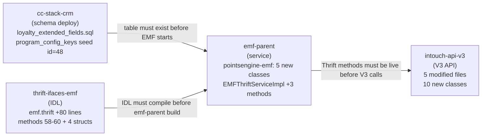

# Impact Analysis — Loyalty Extended Fields CRUD
> Feature: Loyalty Extended Fields CRUD
> Ticket: CAP-183124
> Phase: 6a (Analyst)
> Date: 2026-04-22
> Status: Complete

---

## 1. Impact Map — intouch-api-v3

All paths relative to `/Users/baljeetsingh/IdeaProjects/intouch-api-v3`.

### 1a. Existing Files Modified

| File | Line Count | Change Type | Risk | Backward-Compatible? | Rationale |
|------|-----------|-------------|------|----------------------|-----------|
| `src/main/java/com/capillary/intouchapiv3/unified/subscription/SubscriptionProgram.java` | 312 | MODIFY_CLASS (delete `type` field, add `efId: Long`), DELETE_IMPORT | HIGH | Partial — old MongoDB docs (`{type, key, value}`) deserialize with `efId=null` (no crash); `type` field removed from Java model so callers writing `type` will break | ExtendedField inner class is the core MongoDB document model; any caller serializing `type` or expecting it deserialized will see null. Additive efId is safe; deletion of `type` is the risk surface. |
| `src/main/java/com/capillary/intouchapiv3/unified/subscription/SubscriptionFacade.java` | 648 | ADD_METHOD_CALL (inject `ExtendedFieldValidator`; add validation at lines 102 + 289) | HIGH | No — EF validation on `createSubscription` / `updateSubscription` is a new mandatory gate; callers that submit `extendedFields` without valid `efId` values will now receive 400 | New Thrift call added to the subscription write hot path; any Thrift outage in EMF propagates to subscription create/update. Null-guard ensures callers omitting `extendedFields` are unaffected. |
| `src/main/java/com/capillary/intouchapiv3/unified/subscription/SubscriptionErrorAdvice.java` | 73 | ADD_METHOD (`@ExceptionHandler(ExtendedFieldValidationException.class)`) | LOW | Yes — additive handler; no existing handler is changed | Scoped `@ControllerAdvice` addition; existing handlers untouched. |
| `src/main/java/com/capillary/intouchapiv3/unified/subscription/enums/ExtendedFieldType.java` | 15 | DELETE_CLASS | HIGH | No — callers that reference this enum (serialized JSON, other modules) will fail at compile/runtime | Confirmed exactly 3 usages: `SubscriptionProgram.java`, `ExtendedFieldType.java` itself, `SubscriptionExtendedFieldsTest.java`. No external callers in intouch-api-v3 outside these 3 files. |
| `src/test/java/com/capillary/intouchapiv3/unified/subscription/SubscriptionExtendedFieldsTest.java` | 272 | MODIFY_METHOD (BT-EF-01 through BT-EF-06 — remove `type`, replace enum refs, add `efId` to builders, update assertions) | MEDIUM | N/A (test code) | 15 occurrences of `ExtendedFieldType` across 6 test methods must be replaced; risk is test coverage gap during refactor if done carelessly. |

### 1b. New Files Added (intouch-api-v3)

Package: `com.capillary.intouchapiv3.unified.subscription.extendedfields`

| New Class | Type | Purpose |
|-----------|------|---------|
| `LoyaltyExtendedFieldController` | `@RestController` | POST/PUT/GET endpoints at `/v3/extendedfields/config` |
| `LoyaltyExtendedFieldFacade` | `@Component` | Orchestrates EF config CRUD, builds Thrift structs |
| `CreateExtendedFieldRequest` | DTO | Request body for POST |
| `UpdateExtendedFieldRequest` | DTO | Request body for PUT (name + is_active only) |
| `ExtendedFieldConfigResponse` | DTO | Response DTO mirroring Thrift `LoyaltyExtendedFieldConfig` |
| `ExtendedFieldsPageResponse` | DTO | Paginated wrapper for GET list |
| `LoyaltyExtendedFieldErrorAdvice` | `@ControllerAdvice` | Maps EF error codes 8001-8010 → HTTP 400/404/409/500 |
| `ExtendedFieldValidator` | `@Component` | Validates `SubscriptionProgram.ExtendedField` list against EMF configs |
| `ExtendedFieldValidationException` | `RuntimeException` | Carries EF_VAL_001/002/003 code + field path |

Package: `com.capillary.intouchapiv3.services.thrift`

| New Class | Type | Purpose |
|-----------|------|---------|
| `EmfExtendedFieldsThriftService` | `@Service` | Thrift client for EMFService methods #58-60; pattern from `EmfPromotionThriftService` |

### 1c. ExtendedFieldType Caller Audit

Confirmed usages (C7 — read directly from grep):

| File | Line(s) | Nature |
|------|---------|--------|
| `unified/subscription/SubscriptionProgram.java` | 4 (import), 297 (field type) | Field declaration — deleted as part of this feature |
| `unified/subscription/enums/ExtendedFieldType.java` | 12 (class definition) | The enum itself — deleted |
| `unified/subscription/SubscriptionExtendedFieldsTest.java` | 4 (import) + 14 occurrences in test methods | Test references — updated as part of this feature |

**No surprise callers found.** All 3 files are within the subscription module and are in-scope for this feature. No other intouch-api-v3 packages reference `ExtendedFieldType`.

The unrelated `extendedField` usages in `UserTargetEventsHelper.java`, `DefaultUserTargetEventProcessor.java`, `UserDetails.java`, `LineItem.java`, and `Transaction.java` are CDP-style `Map<String, String>` extended fields on transaction/lineitem entities — a completely different concept, no code change required.

---

## 2. Impact Map — emf-parent

All paths relative to `/Users/baljeetsingh/IdeaProjects/emf-parent`.

### 2a. Existing File Modified

| File | Line Count | Change Type | Risk | Backward-Compatible? |
|------|-----------|-------------|------|----------------------|
| `emf/src/main/java/com/capillary/shopbook/emf/impl/external/EMFThriftServiceImpl.java` | 4,272 | ADD_METHOD (3 new: `createLoyaltyExtendedFieldConfig`, `updateLoyaltyExtendedFieldConfig`, `getLoyaltyExtendedFieldConfigs`); ADD_FIELD (`@Autowired LoyaltyExtendedFieldService`) | MEDIUM | Yes — purely additive; existing 57 method implementations untouched | Existing methods count: 58 `@Override` / TException-throwing methods confirmed by grep. Adding 3 more brings total to 61 (57 pre-existing + 3 new EF CRUD + 1 existing confirmed by session memory: IDL has 57 methods but impl has 58 overrides — counts align with session-memory claim). |
| `emf/src/main/java/com/capillary/shopbook/emf/api/exception/ExceptionCodes.java` | ~250 | ADD_FIELD (constants 8001-8010); MODIFY_METHOD (update `badRequestErrors` set) | LOW | Yes — additive constants; existing constants untouched |

### 2b. New Files Added (emf-parent — pointsengine-emf module)

Package: `com.capillary.shopbook.points.entity`

| New Class | Type |
|-----------|------|
| `LoyaltyExtendedFieldPK` | `@Embeddable` standalone composite PK (`Long id`, `Long orgId`) — ADR-02 |
| `LoyaltyExtendedField` | `@Entity` JPA entity mapping `loyalty_extended_fields` table |

Package: `com.capillary.shopbook.points.dao`

| New Class | Type |
|-----------|------|
| `LoyaltyExtendedFieldRepository` | Spring Data JPA repository with 7 JPQL query methods |

Package: `com.capillary.shopbook.points.services`

| New Class | Type |
|-----------|------|
| `LoyaltyExtendedFieldService` | Interface |
| `LoyaltyExtendedFieldServiceImpl` | `@Service @Transactional(warehouse)` business logic implementation |

All emf-parent additions are greenfield — no pre-existing `LoyaltyExtendedField*` classes found in the repository (confirmed by find search).

---

## 3. Impact Map — thrift-ifaces-emf

| File | Current Line Count | Net Change | Risk |
|------|--------------------|------------|------|
| `/Users/baljeetsingh/IdeaProjects/thrifts/thrift-ifaces-emf/emf.thrift` | 1,883 | +~80 lines (4 new structs: `LoyaltyExtendedFieldConfig`, `CreateLoyaltyExtendedFieldRequest`, `UpdateLoyaltyExtendedFieldRequest`, `LoyaltyExtendedFieldListResponse`; 3 new service methods #58-60) | LOW |

Risk rationale: purely additive IDL changes. Existing consumers of `EMFService` (methods 1-57) are unaffected. Generated code is backward-compatible (Thrift binary protocol). Deployment of new IDL must precede emf-parent deployment (generates `EMFService.Iface` with methods 58-60).

---

## 4. Impact Map — cc-stack-crm

| Asset | Path | Status | Risk |
|-------|------|--------|------|
| Schema dir | `schema/dbmaster/warehouse/` | Confirmed exists (25 existing SQL files, no `loyalty_*.sql`) | LOW |
| New schema file | `schema/dbmaster/warehouse/loyalty_extended_fields.sql` | Does not exist yet — greenfield | LOW |
| Seed dir | `seed_data/dbmaster/warehouse/` | Confirmed exists (6 files) | LOW |
| Seed file (append) | `seed_data/dbmaster/warehouse/program_config_keys.sql` | Exists; current max ID = **47** (`ROLLING_EXPIRY_INCLUDE_ZERO_POINTS`, ID=47, added 2025-02-04). Next safe ID = **48** for `MAX_EF_COUNT_PER_PROGRAM` | LOW |

Seed entry to append (ID=48):
```sql
(48, 'MAX_EF_COUNT_PER_PROGRAM', 'NUMERIC', '10', 'Max Extended Fields Per Program', 0, '2026-04-22 00:00:00', 1)
```

No existing `loyalty_*.sql` files in either `schema/` or `seed_data/` directories — no conflict.

---

## 5. Risk Register

| Risk ID | Description | Severity | Mitigation |
|---------|-------------|----------|------------|
| R-CT-01 | BIGINT PK / `OrgEntityLongPKBase` `int orgId` mismatch | HIGH | Standalone `LoyaltyExtendedFieldPK` (`Long id`, `Long orgId`) — ADR-02. No base class inheritance. |
| R-CT-02 | Fork/duplicate copies potentially-stale `efId`s | MEDIUM | Fail-open: stale deactivated `efId`s caught at next explicit subscription create/update event. Documented behavior. |
| R-CT-03 | Wrong Thrift client interface in V3 | HIGH | New `EmfExtendedFieldsThriftService` uses `EMFService.Iface.class` (same as `EmfPromotionThriftService`) — ADR-04. `PointsEngineRulesThriftService` not touched. |
| R-CT-04 | Thrift latency injected into subscription write hot path | MEDIUM | Short-circuit: EF validation skipped when `extendedFields` is null (the common case). One Thrift call for list (not N calls per EF). Caching deferred per D-17. |
| R-CT-05 | `getLoyaltyExtendedFieldConfigs` orgId zero-default bypass | MEDIUM | `required i64 orgId` in Thrift method + server-side `orgId > 0` guard in `EMFThriftServiceImpl` — ADR-01 / OQ-7. |
| R-NEW-01 | Deployment order constraint — V3 calls Thrift methods not yet in EMF | HIGH | Required order: cc-stack-crm → emf-parent → intouch-api-v3. Feature flag decision needed (BLOCKER-01). |
| R-NEW-02 | Mandatory EF backward-compat break — existing callers get 400 | HIGH | Risk accepted. Grace period / `enforceOnExistingSubscriptions` flag deferred to Sprint 2+ (BLOCKER-02). |
| R-NEW-03 | `extendedFields: []` on PUT silently clears all EF values | HIGH | Needs product sign-off. Document in API contract. QA test required (PUT with empty list). |
| R-NEW-04 | `ExtendedFieldType` enum deletion breaks callers not yet identified | MEDIUM | Confirmed: only 3 usages in 2 source files (SubscriptionProgram.java, ExtendedFieldType.java) + 1 test file. No external callers. C7 confidence. |
| R-NEW-05 | Thrift `required` fields on new structs — protocol exception on rolling deploy | MEDIUM | ADR-01: request struct fields made `optional`; server-side null-guard added. Response struct fields remain `required` (always populated). |

---

## 6. Blast Radius Assessment

### Subscription Create/Update Path

EF validation is injected at exactly 2 points in `SubscriptionFacade`:
- Line 102: `createSubscription()` — fires when `extendedFields` non-null AND non-empty
- Line 289: `updateSubscription()` — fires when `extendedFields` non-null

Short-circuit: calls with `extendedFields: null` (the majority of existing subscription traffic) bypass validation entirely. **Estimated blast radius: orgs that have EF configs defined AND submit `extendedFields` in subscription requests — estimated <5% of subscription API traffic in initial rollout** (EF is a new feature; no orgs have configs until they create them via POST).

### Other V3 Controllers Affected

- `SubscriptionReviewController` — no change. `SubscriptionErrorAdvice` scope includes it; adding `ExtendedFieldValidationException` handler does not change existing handler behavior.
- `TargetGroupFacade`, `UserTargetEventsHelper`, `DefaultUserTargetEventProcessor` — use `Map<String, String> extendedFields` on transaction/lineitem entities (CDP EFs). Completely unrelated namespace. **Zero impact.**
- No other V3 controller references `ExtendedFieldType` — confirmed by grep.

### Shared Util/Helper Classes

- `ExtendedFieldValidator` is a new stateless `@Component` — no existing class modified.
- `EmfExtendedFieldsThriftService` is a new class following `EmfPromotionThriftService` pattern — no existing Thrift client class modified.
- The only shared class modified is `SubscriptionErrorAdvice` (adds one handler).

---

## 7. Security Checklist (G-03, G-07)

- [x] `orgId` always from auth token (`token.getIntouchUser().getOrgId()`) — never from request body. `LoyaltyExtendedFieldController` design confirmed in 01-architect.md Section 7.
- [x] `programId` from request body (POST) / existing DB record (PUT/GET path param) — not from auth.
- [x] Every `LoyaltyExtendedFieldRepository` query includes `org_id` filter: `findByIdAndOrgId`, `findByOrgIdAndProgramId*`, `countByOrgIdAndProgramId` — all queries tenant-scoped.
- [x] No SQL concatenation — Spring Data JPA JPQL with bind parameters; no native query with string concat.
- [x] EMF error code range 8001-8010: **CONFIRMED FREE**. Highest existing code in `ExceptionCodes.java` is `EXTEND_TIER_EXPIRY_DATE_NOT_PERMITTED = 7007`. No 8xxx codes exist anywhere in the file. Evidence: direct grep of all 4-digit constants in `ExceptionCodes.java` (C7).

---

## 8. Dependency Chain



**Deployment sequence (strict)**:
1. cc-stack-crm PR merged — table created, seed applied
2. thrift-ifaces-emf IDL PR merged — Thrift stubs regenerated
3. emf-parent deployed — new methods 58-60 registered on port 9199
4. intouch-api-v3 deployed — REST endpoints live, EF validation active

Deployment window risk: if V3 deploys before emf-parent, all `POST /v3/extendedfields/config` calls return 500 (Thrift method not found). Feature flag decision required (BLOCKER-01 — see 01-architect.md Section 10).

---

*Phase 6a complete. Evidence confidence: C7 for all file existence/line counts (read directly). C7 for ExtendedFieldType caller count (grep exhaustive). C7 for error code range (ExceptionCodes.java read directly, 8xxx range confirmed free).*
