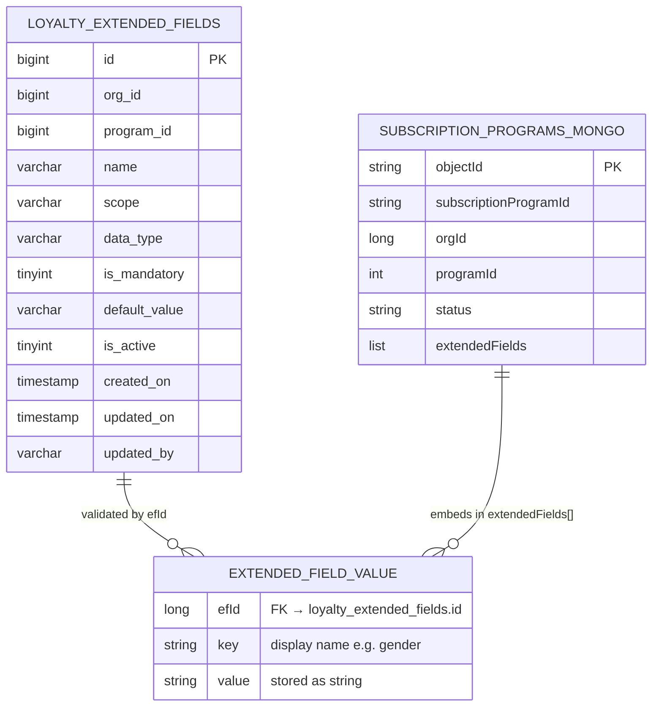
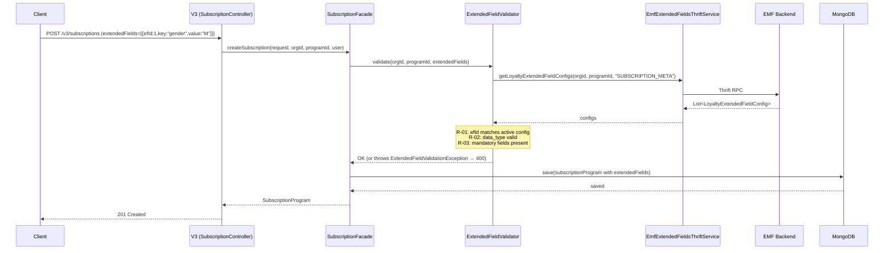

# API Handoff — Loyalty Extended Fields CRUD
> Feature: CAP-183124 — Loyalty Extended Fields CRUD  
> Branch: `aidlc/loyaltyExtendedFields`  
> Date: 2026-04-23  
> Status: **GREEN — all tests pass, ready for UI/integration**

---

## Architecture Overview

```mermaid
graph TD
    subgraph "intouch-api-v3 (V3 REST Layer)"
        C1[LoyaltyExtendedFieldController\nPOST /v3/extendedfields/config\nPUT  /v3/extendedfields/config/{id}\nGET  /v3/extendedfields/config]
        C2[SubscriptionController\nPOST /v3/subscriptions\nPUT  /v3/subscriptions/{id}]
        F1[LoyaltyExtendedFieldFacade]
        F2[SubscriptionFacade]
        V[ExtendedFieldValidator]
        T1[EmfExtendedFieldsThriftService\nRPC → emf-thrift-service:9199]
    end

    subgraph "emf-parent (EMF Backend)"
        TS[EMFThriftServiceImpl\nmethods 58-60]
        SVC[LoyaltyExtendedFieldServiceImpl]
        DAO[LoyaltyExtendedFieldRepository\nJPA → warehouse DB]
    end

    subgraph "Storage"
        MYSQL[(MySQL warehouse DB\nloyalty_extended_fields)]
        MONGO[(MongoDB\nsubscription_programs\n.extendedFields)]
    end

    C1 --> F1 --> T1 --> TS --> SVC --> DAO --> MYSQL
    C2 --> F2 --> MONGO
    F2 --> V --> T1

    style MYSQL fill:#f5f5f5,stroke:#999
    style MONGO fill:#f0f8ff,stroke:#69b
```

---

## Data Model: Extended Fields ↔ Subscription Programs



---

## EF Lifecycle Flow



---

## extendedFields Semantics on Subscription UPDATE (Option B)

> **Important:** Behaviour for `extendedFields` on `PUT /v3/subscriptions/{id}` is **Option B** — adopted 2026-04-23.

| `extendedFields` in request | Behaviour |
|-----------------------------|-----------|
| `null` (field absent from JSON) | **No change** to MongoDB EF data — existing values preserved |
| `[]` (empty array) | **Clear all EF values** — MongoDB `extendedFields` set to empty list. R-03 (mandatory check) is **skipped** for empty list. Use this to deliberately wipe EF data. |
| `[{efId, key, value}, ...]` | **Validate + save** — full validation (R-01 unknown efId, R-02 type mismatch, R-03 mandatory absent) then replace MongoDB EF data |

---

## API Endpoints

### POST /v3/extendedfields/config

**Create a new EF config for a program.**

- **Auth**: Bearer token (orgId extracted server-side — never send in body)
- **HTTP Status**: 201 Created

**Request body:**
```json
{
  "programId": 5001,
  "name": "tier_label",
  "scope": "SUBSCRIPTION_META",
  "dataType": "STRING",
  "isMandatory": false,
  "defaultValue": null
}
```

| Field | Type | Required | Notes |
|-------|------|----------|-------|
| `programId` | Long | ✅ | FK to partner programs |
| `name` | String | ✅ | Unique per (orgId, programId, scope). Max 100 chars. |
| `scope` | String | ✅ | Allowed: `SUBSCRIPTION_META` (only scope in v1) |
| `dataType` | String | ✅ | Allowed: `STRING`, `NUMBER`, `BOOLEAN`, `DATE` |
| `isMandatory` | boolean | ❌ | Default `false` |
| `defaultValue` | String | ❌ | Optional default; null = no default |

**Response (201):**
```json
{
  "id": 1,
  "orgId": 100,
  "programId": 5001,
  "name": "tier_label",
  "scope": "SUBSCRIPTION_META",
  "dataType": "STRING",
  "isMandatory": false,
  "defaultValue": null,
  "isActive": true,
  "createdOn": "2026-04-23T10:30:00Z",
  "updatedOn": "2026-04-23T10:30:00Z",
  "updatedBy": "till-user-1"
}
```

**Error responses:**

| Status | Code | Condition |
|--------|------|-----------|
| 400 | `EF_CONFIG_INVALID_SCOPE` | scope not in allowed set |
| 400 | `EF_CONFIG_INVALID_DATA_TYPE` | dataType not STRING/NUMBER/BOOLEAN/DATE |
| 400 | `EF_CONFIG_MAX_COUNT_EXCEEDED` | active EF count ≥ org limit (default 10) |
| 400 | `EF_CONFIG_INVALID_ORG` | orgId ≤ 0 or missing |
| 409 | `EF_CONFIG_DUPLICATE_NAME` | name already exists for (orgId, programId, scope) |

---

### PUT /v3/extendedfields/config/{id}

**Update EF config name and/or active status (soft-delete).**

- **Auth**: Bearer token
- **HTTP Status**: 200 OK
- **Idempotent**: YES — repeated calls with same payload return 200

**Path params:**
- `id` (Long): EF config ID from GET/POST response

**Request body:**
```json
{
  "name": "loyalty_tier",
  "isActive": false
}
```

| Field | Type | Required | Notes |
|-------|------|----------|-------|
| `name` | String | ❌ | If null, name unchanged. Max 100 chars. |
| `isActive` | Boolean | ❌ | `false` = soft-delete. Idempotent. If null, isActive unchanged. |

**Immutable fields** (cannot be changed after creation): `scope`, `dataType`, `isMandatory`, `defaultValue`, `programId`.

**Response (200):** Same shape as POST 201 response.

**Error responses:**

| Status | Code | Condition |
|--------|------|-----------|
| 400 | `EF_CONFIG_IMMUTABLE_UPDATE` | Attempt to change immutable field |
| 404 | `EF_CONFIG_NOT_FOUND` | id not found for this orgId |
| 409 | `EF_CONFIG_DUPLICATE_NAME` | rename conflicts with existing active name |

---

### GET /v3/extendedfields/config

**List EF configs for a program (paginated).**

- **Auth**: Bearer token
- **HTTP Status**: 200 OK

**Query params:**

| Param | Type | Required | Default | Notes |
|-------|------|----------|---------|-------|
| `programId` | Long | ✅ | — | Filter by program |
| `scope` | String | ❌ | null (all) | Filter by scope |
| `includeInactive` | boolean | ❌ | `false` | Include is_active=false rows |
| `page` | int | ❌ | `0` | 0-indexed |
| `size` | int | ❌ | `20` | Page size |

**Response (200):**
```json
{
  "content": [
    {
      "id": 1,
      "orgId": 100,
      "programId": 5001,
      "name": "tier_label",
      "scope": "SUBSCRIPTION_META",
      "dataType": "STRING",
      "isMandatory": false,
      "defaultValue": null,
      "isActive": true,
      "createdOn": "2026-04-23T10:30:00Z",
      "updatedOn": "2026-04-23T10:30:00Z",
      "updatedBy": "till-user-1"
    }
  ],
  "totalElements": 1,
  "page": 0,
  "size": 20
}
```

> `content` is always an array — never null. Empty org returns `{ "content": [], "totalElements": 0, ... }`.

---

## EF Validation on Subscription Programs

When creating or updating a subscription program with `extendedFields`, the following rules fire:

| Rule | ID | Description | Error |
|------|----|-------------|-------|
| Unknown EF | R-01 | `efId` not found in active EF configs for `(orgId, programId, SUBSCRIPTION_META)` | 400 — field path in error |
| Type mismatch | R-02 | `value` cannot be coerced to declared `dataType` | 400 — field path in error |
| Mandatory absent | R-03 | Active mandatory EF config has no matching entry in submitted list | 400 — field name in error |

**Validation is skipped** when:
- `extendedFields` is `null` on UPDATE (Option B — no-op)
- `extendedFields` is `[]` on UPDATE (Option B — clear signal, R-03 skipped)
- `programId` is null on the subscription (no EF configs possible)

**Error response shape** (400):
```json
{
  "code": "EF_VALIDATION_UNKNOWN_FIELD",
  "message": "Unknown extended field id: 999. Not an active EF config for this program.",
  "field": "extendedFields[0].efId"
}
```

---

## Error Code Reference

| Code (string) | HTTP | Source | Description |
|---------------|------|--------|-------------|
| `EF_CONFIG_NOT_FOUND` | 404 | EFThriftException 8001 | EF config id not found for org |
| `EF_CONFIG_DUPLICATE_NAME` | 409 | EFThriftException 8002 | Name already exists for (org, program, scope) |
| `EF_CONFIG_IMMUTABLE_UPDATE` | 400 | EFThriftException 8003 | Attempt to update immutable field |
| `EF_CONFIG_INVALID_SCOPE` | 400 | EFThriftException 8004 | Scope not in allowed set |
| `EF_CONFIG_INVALID_DATA_TYPE` | 400 | EFThriftException 8005 | dataType not STRING/NUMBER/BOOLEAN/DATE |
| `EF_CONFIG_MAX_COUNT_EXCEEDED` | 400 | EFThriftException 8009 | Active EF count ≥ limit |
| `EF_CONFIG_INVALID_ORG` | 400 | EFThriftException 8010 | orgId ≤ 0 |
| `EF_VALIDATION_UNKNOWN_FIELD` | 400 | ExtendedFieldValidationException | R-01 violation |
| `EF_VALIDATION_TYPE_MISMATCH` | 400 | ExtendedFieldValidationException | R-02 violation |
| `EF_VALIDATION_MANDATORY_MISSING` | 400 | ExtendedFieldValidationException | R-03 violation |

---

## Deployment Notes

- **Deployment order**: EMF (`emf-parent`) must deploy **before** V3 (`intouch-api-v3`). New Thrift methods 58–60 must be live before V3 calls them.
- **Schema**: `loyalty_extended_fields` table created on PR merge to cc-stack-crm (CREATE TABLE convention — no Flyway).
- **Backwards compatibility**: `SubscriptionProgram.ExtendedField` model change (`efId` added, `type` removed) is backward-safe — old MongoDB docs deserialize with `efId=null`.
- **No MongoDB migration needed**: Legacy `{type, key, value}` documents remain valid.
