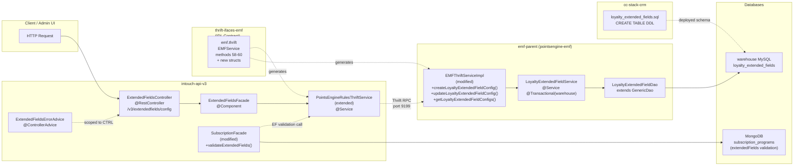
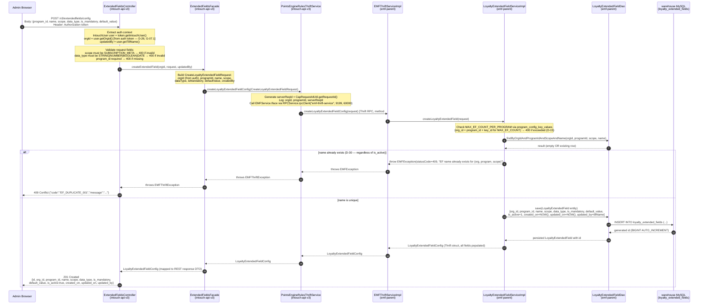
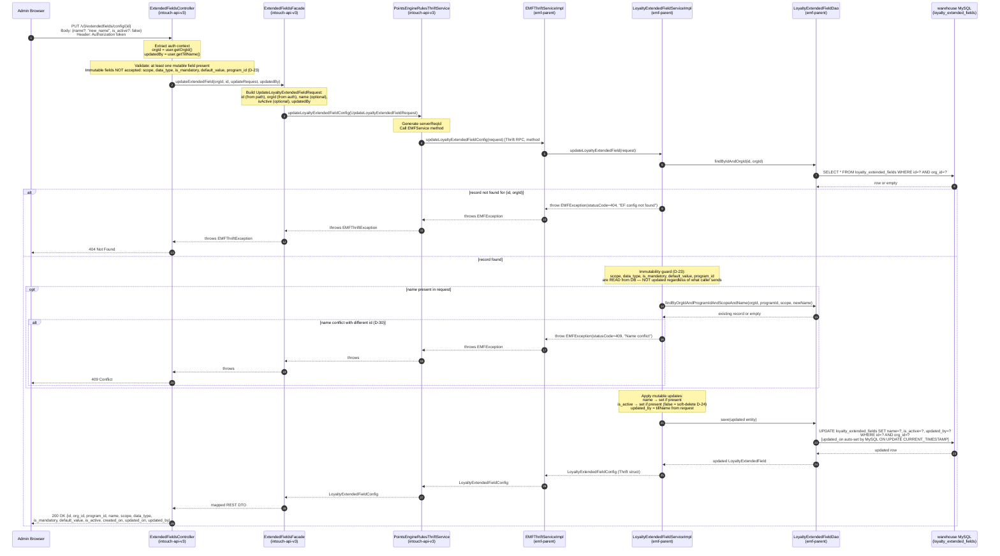
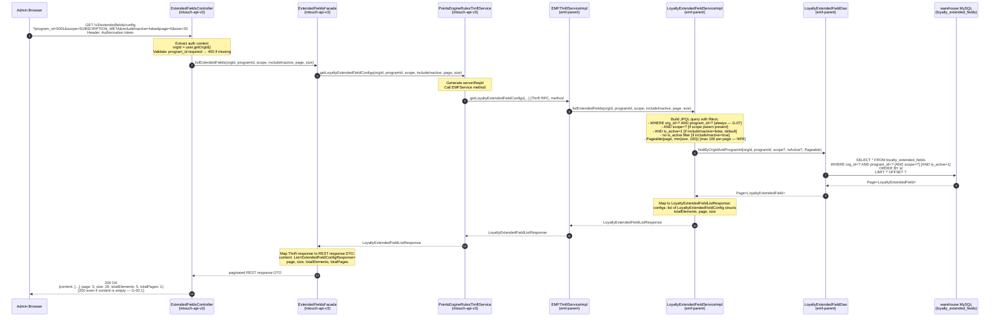
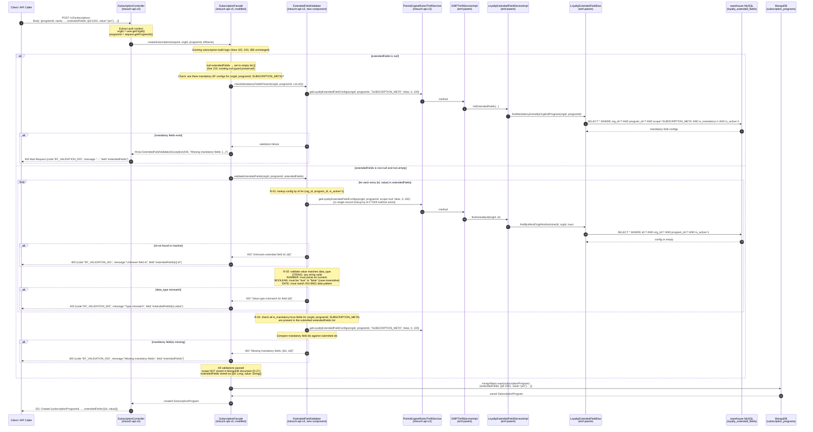

# Cross-Repo Trace — Loyalty Extended Fields CRUD
> Feature: Loyalty Extended Fields CRUD
> Jira: CAP-183124
> Ticket: loyaltyExtendedFields
> Phase: 5 (Cross-Repo Tracer)
> Date: 2026-04-22
> Status: Complete

---

## 1. Scope Summary

### Feature Overview
Build a loyalty-team-owned extended fields registry and validation framework scoped to subscription programs. Org admins define custom attributes (name, data type, mandatory flag) per program via self-serve CRUD APIs. When subscription programs are created or updated, provided extended field values are validated against the registry. This feature also fixes a pre-existing model error in the subscription module (`ExtendedFieldType` enum deletion + `key→id` replacement in `SubscriptionProgram.ExtendedField`).

**Current release scope**: `SUBSCRIPTION_META` only. `SUBSCRIPTION_LINK` and `SUBSCRIPTION_DELINK` are deferred.

### Repositories Involved

| # | Repo | Role | Branch |
|---|------|------|--------|
| 1 | `thrift-ifaces-emf` | IDL definitions — new Thrift structs + EMFService methods | `aidlc/loyaltyExtendedFields` |
| 2 | `cc-stack-crm` | MySQL schema — `loyalty_extended_fields` table DDL | `aidlc/loyaltyExtendedFields` |
| 3 | `emf-parent` | Backend — JPA entity, DAO, service, Thrift impl (module: `pointsengine-emf`) | `aidlc/loyaltyExtendedFields` |
| 4 | `intouch-api-v3` | REST API gateway — controller, facade, Thrift client, error advice | `aidlc/loyaltyExtendedFields` |

### Scope Boundary
- **In scope**: `loyalty_extended_fields` MySQL CRUD (`cc-stack-crm` + `emf-parent`), EF Config REST APIs (`intouch-api-v3`), EF validation on `POST/PUT /v3/subscriptions`, `SubscriptionProgram.ExtendedField` model correction, `ExtendedFieldType` enum deletion.
- **Out of scope**: `SUBSCRIPTION_LINK`/`SUBSCRIPTION_DELINK` scopes, MongoDB `extended_field_values` collection, Audit Log, Event Notification enrichment, generic `/v3/extendedfields/values/{entity_id}` APIs.

---

## 2. Call-Chain Overview



**Key architectural constraints**:
- `intouch-api-v3` has NO direct warehouse DB access — all warehouse reads/writes go via Thrift to `emf-parent` (confirmed by `warehouse-database.properties` in emf-parent only).
- `orgId` flows from auth token in V3, is passed in Thrift request structs to EMF — never from request body (G-07.1, D-26).
- Deployment order: `cc-stack-crm` schema merged first → `emf-parent` deployed second → `intouch-api-v3` deployed last (risk M-07).

---

## 3. Write Path: POST /v3/extendedfields/config (Create EF Config)



**Key implementation notes**:
- `orgId` is NEVER in the HTTP request body — always extracted from `token.getIntouchUser().getOrgId()`.
- `programId` comes from the request body (as in `SubscriptionController.createSubscription()` pattern).
- The Thrift method is `createLoyaltyExtendedFieldConfig` — method #58 in `EMFService`.
- `updated_on` is auto-managed by MySQL (`ON UPDATE CURRENT_TIMESTAMP`) — not set by application layer on create.
- `updated_by` = `user.getTillName()` (tillName = username from auth token).
- Uniqueness check applies regardless of `is_active` (D-30) — 409 for any collision, active or inactive.
- MAX_EF_COUNT check uses `program_config_key_values` with key name `MAX_EF_COUNT_PER_PROGRAM` (exact key name TBD — Architect to confirm, C-6 risk).

---

## 4. Write Path: PUT /v3/extendedfields/config/{id} (Update / Soft-delete EF Config)



**Key implementation notes**:
- PUT handles BOTH rename (`name` change) and soft-delete (`is_active=false`) — no separate DELETE endpoint (D-24).
- Soft-delete is idempotent: `is_active=false` on an already-inactive record returns 200 (D-16).
- `scope`, `data_type`, `is_mandatory`, `default_value`, `program_id` are IMMUTABLE after creation (D-23) — the service reads these from DB and ignores any client-supplied values for these fields.
- Name uniqueness is re-validated on rename against `(org_id, program_id, scope)` regardless of `is_active` (D-30).
- Deactivating an EF config does NOT affect existing `subscription_programs` MongoDB documents (D-18); new writes validate against active fields only.

---

## 5. Read Path: GET /v3/extendedfields/config (List EF Configs)



**Key implementation notes**:
- `program_id` is REQUIRED as a query param (D-29) — 400 if missing.
- Default: `includeInactive=false` — only `is_active=1` records returned.
- Empty result returns 200 with `content: []` (never null — G-02.1).
- Max page size enforced at service layer: `min(size, 100)`.
- Multi-tenancy: every query filters by `org_id` AND `program_id` (G-07, D-29).
- The `idx_org_prog_scope_active (org_id, program_id, scope, is_active)` index covers the most common query pattern.

---

## 6. Write Path: POST /v3/subscriptions with extendedFields (EF Validation)



**Key implementation notes**:
- `scope` is NOT stored in each MongoDB `ExtendedField` document (D-27) — scope is always `SUBSCRIPTION_META` for subscription programs, validated server-side.
- `ExtendedField` model after correction: `{id: Long, value: String}` only — `type` field deleted, `key` replaced with `id` (D-27, D-28).
- Validation hook point: `SubscriptionFacade.createSubscription()` delegates to `ExtendedFieldValidator` before `mongoRepo.save()`.
- `ExtendedFieldType.java` is deleted; `SubscriptionProgram.ExtendedField.type` field is removed (EF-US-07, D-27).
- Tests BT-EF-01 through BT-EF-06 must be updated to use id-based model and `SUBSCRIPTION_META` scope (D-11, D-13).
- Risk C-4: EF deactivated mid-validation window → fail-closed or fail-open not yet defined (Architect to resolve).

---

## 7. Write Path: PUT /v3/subscriptions/{id} with extendedFields (EF Validation Update)

```mermaid
sequenceDiagram
    autonumber
    participant Browser as Client / API Caller
    participant CTRL as SubscriptionController<br/>(intouch-api-v3)
    participant SUB_FAC as SubscriptionFacade<br/>(intouch-api-v3, modified)
    participant EF_VAL as ExtendedFieldValidator<br/>(intouch-api-v3, new)
    participant TC as PointsEngineRulesThriftService<br/>(intouch-api-v3)
    participant TIMPL as EMFThriftServiceImpl<br/>(emf-parent)
    participant DAO as LoyaltyExtendedFieldDao<br/>(emf-parent)
    participant DB as warehouse MySQL<br/>(loyalty_extended_fields)
    participant MONGO as MongoDB<br/>(subscription_programs)

    Browser->>CTRL: PUT /v3/subscriptions/{subscriptionProgramId}<br/>Body A: {name: "new name"}         [no extendedFields key]<br/>Body B: {extendedFields: []}       [explicit empty list]<br/>Body C: {extendedFields: [{id:1001, value:"new_val"}]}

    Note over CTRL: Extract auth context<br/>orgId = user.getOrgId()

    CTRL->>SUB_FAC: updateSubscription(request, orgId, subscriptionProgramId, tillName)

    SUB_FAC->>MONGO: findBySubscriptionProgramIdAndOrgIdAndStatus(id, orgId, DRAFT/ACTIVE)
    MONGO-->>SUB_FAC: existing SubscriptionProgram

    alt Body A: extendedFields is null (key absent from request)
        Note over SUB_FAC: R-33 null-guard (line 289 in SubscriptionFacade):<br/>if (request.getExtendedFields() != null) existing.setExtendedFields(...);<br/>→ null means PRESERVE EXISTING — no validation fired, no change to extendedFields
        Note over SUB_FAC: Skip EF validation entirely
    else Body B: extendedFields is empty list []
        Note over SUB_FAC: Empty list = CLEAR all EF values (destructive — H-11 risk, needs product sign-off)<br/>existing.setExtendedFields(List.of())
        Note over SUB_FAC: R-03 does NOT apply when extendedFields is empty list []<br/>(spec: mandatory check skipped for explicit clear)
        Note over SUB_FAC: No validation fired for empty list
    else Body C: extendedFields is non-null non-empty list
        SUB_FAC->>EF_VAL: validateExtendedFields(orgId, programId, extendedFields)

        Note over EF_VAL: Same validation as POST path (Section 6):<br/>R-01: each id must exist and be active for (orgId, programId)<br/>R-02: value must match data_type<br/>R-03: all mandatory fields must be present

        loop for each {id, value} in extendedFields
            EF_VAL->>TC: lookup config by id for (orgId, programId, is_active=1)
            TC->>TIMPL: EMFService method #60
            TIMPL->>DAO: findByIdAndOrgIdAndIsActive(id, orgId, true)
            DAO->>DB: SELECT * WHERE id=? AND org_id=? AND program_id=? AND is_active=1
            DB-->>DAO: config or empty

            alt id not found or inactive
                EF_VAL-->>SUB_FAC: 400 "Unknown field id: {id}"
                SUB_FAC-->>Browser: 400 {code:"EF_VALIDATION_001"}
            end

            alt data_type mismatch
                EF_VAL-->>SUB_FAC: 400 "Type mismatch"
                SUB_FAC-->>Browser: 400 {code:"EF_VALIDATION_002"}
            end
        end

        Note over EF_VAL: Check all mandatory fields present in submitted list
        alt mandatory field missing
            EF_VAL-->>SUB_FAC: 400 "Missing mandatory field"
            SUB_FAC-->>Browser: 400 {code:"EF_VALIDATION_003"}
        end

        Note over SUB_FAC: Validation passed — replace extendedFields
        Note over SUB_FAC: existing.setExtendedFields(request.getExtendedFields())
    end

    SUB_FAC->>MONGO: save(existing subscription with updated extendedFields)
    MONGO-->>SUB_FAC: saved SubscriptionProgram
    SUB_FAC-->>CTRL: updated SubscriptionProgram
    CTRL-->>Browser: 200 OK {subscriptionProgramId, ..., extendedFields:[...]}
```

**Key implementation notes**:
- The `null` vs `empty list` distinction is critical (R-33): null = preserve, `[]` = clear (H-11 risk).
- The existing `SubscriptionFacade.updateSubscription()` null-guard at line 289 already handles `null` correctly — only the `else` branch (non-null) needs the new EF validation call.
- Validation rules are identical to POST path (R-01, R-02, R-03) when `extendedFields` is non-null and non-empty.
- R-03 (mandatory fields check) does NOT fire when `extendedFields` is `[]` (explicit clear is allowed even when mandatory fields are defined).
- The approval workflow state machine (DRAFT/ACTIVE) applies normally; EF validation fires before MongoDB save regardless of subscription status.

---

## 8. Per-Repo Change Inventory

### 8a. thrift-ifaces-emf

**File to modify**: `/Users/baljeetsingh/IdeaProjects/thrifts/thrift-ifaces-emf/emf.thrift`

**New structs to add** (after existing struct definitions, before `service EMFService`):

```thrift
struct LoyaltyExtendedFieldConfig {
    1: required i64 id
    2: required i64 orgId
    3: required i64 programId
    4: required string name
    5: required string scope
    6: required string dataType        // STRING | NUMBER | BOOLEAN | DATE
    7: required bool isMandatory
    8: optional string defaultValue
    9: required bool isActive
    10: required string createdOn      // UTC ISO-8601
    11: required string updatedOn      // UTC ISO-8601
    12: optional string updatedBy
}

struct CreateLoyaltyExtendedFieldRequest {
    1: required i64 orgId             // populated from auth context by V3 (D-26)
    2: required i64 programId
    3: required string name
    4: required string scope
    5: required string dataType
    6: required bool isMandatory
    7: optional string defaultValue
    8: optional string createdBy
}

struct UpdateLoyaltyExtendedFieldRequest {
    1: required i64 id
    2: required i64 orgId             // populated from auth context by V3 (D-26)
    3: optional string name           // display rename only; uniqueness re-validated (D-25, D-30)
    4: optional bool isActive         // false = soft-delete (D-24)
    5: optional string updatedBy
}

struct LoyaltyExtendedFieldListResponse {
    1: required list<LoyaltyExtendedFieldConfig> configs
    2: required i32 totalElements
    3: required i32 page
    4: required i32 size
}
```

**New methods to add** to `service EMFService` (after current method #57 `bulkEMFEvent`):

```thrift
// Method 58
LoyaltyExtendedFieldConfig createLoyaltyExtendedFieldConfig(
    1: CreateLoyaltyExtendedFieldRequest request
) throws (1: EMFException ex);

// Method 59
LoyaltyExtendedFieldConfig updateLoyaltyExtendedFieldConfig(
    1: UpdateLoyaltyExtendedFieldRequest request
) throws (1: EMFException ex);

// Method 60
LoyaltyExtendedFieldListResponse getLoyaltyExtendedFieldConfigs(
    1: i64 orgId,
    2: required i64 programId,
    3: optional string scope,
    4: bool includeInactive,
    5: i32 page,
    6: i32 size
) throws (1: EMFException ex);
```

**No-change files**: `bin/emf.thrift` (compiled output — regenerated from source).

**Note**: Risk C-1 (Thrift `required` fields) — Architect must decide whether response struct fields should be `optional` per G-09.5 backward-compat rule. PRD has them as `required`; this may break old clients if new fields are added later.

---

### 8b. cc-stack-crm

**New file to create**: `schema/dbmaster/warehouse/loyalty_extended_fields.sql`

```sql
CREATE TABLE `loyalty_extended_fields` (
  `id`               BIGINT        NOT NULL AUTO_INCREMENT,
  `org_id`           BIGINT        NOT NULL,
  `program_id`       BIGINT        NOT NULL,
  `name`             VARCHAR(100)  NOT NULL,
  `scope`            VARCHAR(50)   NOT NULL,
  `data_type`        VARCHAR(30)   NOT NULL,
  `is_mandatory`     TINYINT(1)    NOT NULL DEFAULT 0,
  `default_value`    VARCHAR(255)  NULL,
  `is_active`        TINYINT(1)    NOT NULL DEFAULT 1,
  `created_on`       TIMESTAMP     NOT NULL DEFAULT CURRENT_TIMESTAMP,
  `updated_on`       TIMESTAMP     NOT NULL DEFAULT CURRENT_TIMESTAMP ON UPDATE CURRENT_TIMESTAMP,
  `updated_by`       VARCHAR(100)  NULL,
  PRIMARY KEY (`id`),
  UNIQUE KEY `uq_org_prog_scope_name` (`org_id`, `program_id`, `scope`, `name`),
  KEY `idx_org_prog_scope_active` (`org_id`, `program_id`, `scope`, `is_active`)
);
```

**Decision traceability**:
- `BIGINT` for `id` (not `int(11)`) — loyalty EF ids stored as `Long` in Java (vs. `int` for older tables).
- `TIMESTAMP` (not `DATETIME`) for `created_on`/`updated_on` — D-26. Note: `custom_fields.sql` uses `datetime` for `created_on` — this is an intentional deviation per D-26. (Open question OQ-schema-convention.)
- `is_active TINYINT(1) NOT NULL DEFAULT 1` — D-14 (cc-stack-crm convention).
- `scope VARCHAR(50)` (not DB ENUM) — future scope values deferred; application enforces allowed values.
- `UNIQUE KEY uq_org_prog_scope_name (org_id, program_id, scope, name)` — D-30: uniqueness enforced regardless of `is_active`.
- No `loyalty_*.sql` files exist in warehouse schema today — this is the first loyalty-owned warehouse table.
- No Flyway, no ALTER TABLE — convention: CREATE TABLE file only, PR merge deploys schema (D-06).

**Existing files to reference** (pattern source, not to modify):
- `custom_fields.sql` — composite PK, `is_active`, `auto_update_time` pattern
- `program_config_key_values.sql` — `program_id`, `org_id`, `is_valid` pattern
- `program_config_keys.sql` — global key registry (no `org_id`)

**No-change files**: all 117 existing `.sql` files in `schema/dbmaster/warehouse/`.

---

### 8c. emf-parent

**Module**: `pointsengine-emf`
**Root package**: `com.capillary.shopbook.points`

#### New files to create

| File | Package | Purpose |
|------|---------|---------|
| `LoyaltyExtendedField.java` | `...points.entity` | JPA entity for `loyalty_extended_fields` table |
| `LoyaltyExtendedFieldPK.java` | `...points.entity` | `@Embeddable` composite PK `(id, orgId)` extending `OrgEntityIntegerPKBase` |
| `LoyaltyExtendedFieldDao.java` | `...points.dao` | DAO interface: `extends GenericDao<LoyaltyExtendedField, LoyaltyExtendedFieldPK>`, `@Transactional(warehouse, SUPPORTS)` |
| `LoyaltyExtendedFieldDaoImpl.java` | `...points.dao` | Optional: custom JPQL implementations if GenericDao insufficient for pagination + multi-filter queries |
| `LoyaltyExtendedFieldService.java` | `...points.services` | Service interface: CRUD + validation contracts |
| `LoyaltyExtendedFieldServiceImpl.java` | `...points.services` | `@Service`, `@Transactional(warehouse, REQUIRED)`, `@DataSourceSpecification(WAREHOUSE)` |

**LoyaltyExtendedField entity details**:
- `@EmbeddedId private LoyaltyExtendedFieldPK pk` (id: Long, orgId: Long) — consistent with `ProgramConfigKeyValue` pattern
- `@Basic @Column(name = "program_id")` private Long programId
- `@Basic @Column(name = "name")` private String name
- `@Basic @Column(name = "scope")` private String scope
- `@Basic @Column(name = "data_type")` private String dataType
- `@Basic @Column(name = "is_mandatory")` private boolean isMandatory
- `@Basic @Column(name = "default_value")` private String defaultValue
- `@Basic @Column(name = "is_active")` private boolean isActive
- `@Basic @Column(name = "created_on") @Temporal(TIMESTAMP)` private Date createdOn
- `@Basic @Column(name = "updated_on") @Temporal(TIMESTAMP)` private Date updatedOn
- `@Basic @Column(name = "updated_by")` private String updatedBy
- Include `@Builder` pattern (like `ProgramConfigKeyValue` builder at lines 184-260)

**LoyaltyExtendedFieldDao query methods needed**:
- `findByOrgIdAndProgramIdAndScopeAndName(orgId, programId, scope, name)` — uniqueness check
- `findByIdAndOrgId(id, orgId)` — single record fetch for PUT
- `findByOrgIdAndProgramId(orgId, programId, Pageable)` — list (no scope filter)
- `findByOrgIdAndProgramIdAndScope(orgId, programId, scope, Pageable)` — list with scope filter
- `findByOrgIdAndProgramIdAndIsActive(orgId, programId, isActive, Pageable)` — includeInactive=false default
- `findByOrgIdAndProgramIdAndScopeAndIsActive(orgId, programId, scope, isActive, Pageable)` — full filter
- `countByOrgIdAndProgramId(orgId, programId)` — MAX_EF_COUNT check

**LoyaltyExtendedFieldServiceImpl responsibilities**:
- `create`: MAX_EF_COUNT check → uniqueness check → save
- `update`: fetch by (id, orgId) → 404 if not found → immutability guard → name uniqueness if renaming → save
- `list`: build dynamic query from filters → paginate → map to Thrift structs
- `validateExtendedFieldValues(orgId, programId, List<{id, value}>)`: bulk lookup + data_type check + mandatory check (used by subscription flow)

#### Existing files to modify

| File | Change |
|------|--------|
| `EMFThriftServiceImpl.java` (`emf` module, `com.capillary.shopbook.emf.impl.external`) | Add 3 new methods implementing `Iface`: `createLoyaltyExtendedFieldConfig()`, `updateLoyaltyExtendedFieldConfig()`, `getLoyaltyExtendedFieldConfigs()`. Inject `LoyaltyExtendedFieldService`. Follow `@Trace` + `@MDCData` pattern. Wrap exceptions as `EMFException(statusCode, errorMessage, replayErrorCode)`. |

**Spring config** (if needed): `LoyaltyExtendedFieldService` and `LoyaltyExtendedFieldDao` will be auto-scanned if `pointsengine-emf` is already under component scan. Verify `@ComponentScan` or `@EntityScan` paths include new package.

**No-change files**: All existing entities (`ProgramConfigKeyValue`, `ProgramConfigKey`, etc.), existing services, existing DAOs, existing event handler methods in `EMFThriftServiceImpl`.

---

### 8d. intouch-api-v3

**Base package**: `com.capillary.intouchapiv3.unified.subscription`
**New sub-package**: `...subscription.extendedfields`

#### New files to create

| File | Package | Purpose |
|------|---------|---------|
| `ExtendedFieldsController.java` | `...subscription.extendedfields` | `@RestController`, `@RequestMapping("/v3/extendedfields/config")` — POST, PUT, GET handlers |
| `ExtendedFieldsFacade.java` | `...subscription.extendedfields` | `@Component` — delegates to `PointsEngineRulesThriftService` (extended); maps Thrift ↔ REST DTOs |
| `ExtendedFieldConfigRequest.java` | `...subscription.extendedfields` | Request DTO for POST: `{program_id, name, scope, data_type, is_mandatory, default_value}` |
| `UpdateExtendedFieldRequest.java` | `...subscription.extendedfields` | Request DTO for PUT: `{name?, is_active?}` (mutable fields only) |
| `ExtendedFieldConfigResponse.java` | `...subscription.extendedfields` | Response DTO: mirrors `LoyaltyExtendedFieldConfig` Thrift struct |
| `ExtendedFieldsPageResponse.java` | `...subscription.extendedfields` | Paginated response wrapper: `{content, page, size, totalElements, totalPages}` |
| `ExtendedFieldsErrorAdvice.java` | `...subscription.extendedfields` | `@ControllerAdvice(assignableTypes = ExtendedFieldsController.class)` — maps EMFException codes → HTTP statuses (D-31) |
| `ExtendedFieldValidator.java` | `...subscription.extendedfields` | `@Component` — validates `List<ExtendedField>` against active EF configs (R-01, R-02, R-03) |
| `ExtendedFieldValidationException.java` | `...subscription.extendedfields` | `extends RuntimeException` — carries validation error code + message + field |

#### Existing files to modify

| File | Specific change |
|------|----------------|
| `SubscriptionProgram.java` | Modify `ExtendedField` nested static class: remove `type: ExtendedFieldType` field, rename `key: String` → `id: Long`; add `@Field("key")` annotation on `id` field if backward-compat needed for existing MongoDB docs (open question OQ-field-annotation) |
| `SubscriptionFacade.java` (lines 102, 289) | Line 102: add EF validation call after null-guard for `createSubscription()`; Line 289: add EF validation call in `updateSubscription()` when `extendedFields != null`. Inject `ExtendedFieldValidator`. |
| `PointsEngineRulesThriftService.java` | Add 3 new public methods: `createLoyaltyExtendedFieldConfig(CreateLoyaltyExtendedFieldRequest)`, `updateLoyaltyExtendedFieldConfig(UpdateLoyaltyExtendedFieldRequest)`, `getLoyaltyExtendedFieldConfigs(orgId, programId, scope, includeInactive, page, size)`. Follow existing Thrift call pattern with `CapRequestIdUtil.getRequestId()`, logger, `EMFThriftException` wrapping. |
| `SubscriptionErrorAdvice.java` | Add handler for `ExtendedFieldValidationException` → 400 with structured error response `{code, message, field}`. |

#### Files to delete

| File | Reason |
|------|--------|
| `enums/ExtendedFieldType.java` | D-27: `type` field deleted from `SubscriptionProgram.ExtendedField`; enum has only 3 usages (all in scope for this feature) |

#### Existing tests to update

| Test file | Required changes |
|-----------|-----------------|
| `SubscriptionExtendedFieldsTest.java` (BT-EF-01 to BT-EF-06) | Replace `CUSTOMER_EXTENDED_FIELD`/`TXN_EXTENDED_FIELD` enum refs with `id: Long` and `value: String`; remove `type` field from test data; update test data to use `{id: 1001L, value: "..."}` model; remove scope field assertions (D-27, D-28) |

**No-change files**: `SubscriptionController.java`, `SubscriptionReviewController.java`, `SubscriptionProgramRepository.java`, `SubscriptionApprovalHandler.java`, `SubscriptionPublishService.java` (EF fields not in partner program Thrift publish path — ADR-19 confirmed: `extendedFields` is MongoDB-only).

---

## 9. Cross-Cutting Concerns

### Authentication & OrgId Sourcing (G-07.1)
- `orgId` flows exclusively through the auth token: `token.getIntouchUser().getOrgId()`.
- V3 controller extracts `orgId` and passes it to facade, which passes it in the Thrift request struct.
- EMF service receives `orgId` as part of `CreateLoyaltyExtendedFieldRequest.orgId` or `UpdateLoyaltyExtendedFieldRequest.orgId`.
- `orgId` is NEVER accepted from HTTP request body, path params, or query params.
- `updated_by` / `created_by` = `user.getTillName()` (username string from auth).

### Multi-Tenancy (G-07)
- Every `loyalty_extended_fields` query in DAO includes `org_id` AND `program_id` filters.
- The `idx_org_prog_scope_active` index supports the most common query: `(org_id, program_id, scope, is_active)`.
- Cross-org access guard in `update`: `findByIdAndOrgId(id, orgId)` — 404 if `org_id` doesn't match (prevents org A reading/updating org B's configs).
- MongoDB `subscription_programs` queries retain existing `orgId` scoping via `SubscriptionProgramRepository`.

### Error Handling (D-31)
EMFException `statusCode` → HTTP status mapping:

| EMFException statusCode | HTTP Status | Scenario |
|------------------------|-------------|---------|
| 400 | 400 Bad Request | Validation failures (invalid scope, data_type, mandatory fields) |
| 404 | 404 Not Found | EF config id not found for caller's org |
| 409 | 409 Conflict | Name uniqueness violation (D-30) |
| 429 | 400 Bad Request | MAX_EF_COUNT exceeded |
| 500 | 500 Internal Server Error | Unexpected EMF error |

`ExtendedFieldsErrorAdvice` is scoped to `ExtendedFieldsController.class` only (following `SubscriptionErrorAdvice` pattern — avoids non-deterministic global advisor selection).

### Timestamps (D-26)
- All audit timestamps in `loyalty_extended_fields`: `TIMESTAMP` (UTC-aware) — not `DATETIME`.
- `created_on`: set by MySQL `DEFAULT CURRENT_TIMESTAMP` — application does NOT set this.
- `updated_on`: auto-managed by MySQL `ON UPDATE CURRENT_TIMESTAMP`.
- Thrift response fields `createdOn`/`updatedOn`: serialized as UTC ISO-8601 strings.
- Note: `custom_fields.sql` uses `datetime NOT NULL` for `created_on` — the `loyalty_extended_fields` table intentionally deviates to `TIMESTAMP` per D-26.

### Soft-Delete Semantics (D-14, D-24, D-30)
- Deactivation: `is_active=0` via PUT — no physical DELETE.
- Idempotent: setting `is_active=false` on already-inactive record returns 200.
- Uniqueness (`uq_org_prog_scope_name`) enforced at DB level regardless of `is_active` — names are permanently unique per `(org_id, program_id, scope)` (D-30).
- Deactivated configs: NOT returned in default list queries (`includeInactive=false`); returned only with `includeInactive=true` (D-20).
- Existing subscription program values referencing a deactivated EF config are NOT affected (D-18).
- New subscription create/update with a deactivated EF id → 400 (R-01: `is_active=1` required).

### Deployment Order (risk M-07)
1. `cc-stack-crm` PR merged → `loyalty_extended_fields` table created in warehouse DB.
2. `emf-parent` deployed → new Thrift methods become available on port 9199.
3. `intouch-api-v3` deployed → REST endpoints go live.

Intermediate state: after V3 deploy but before EMF deploy would cause 500 on EF config calls. Architect must define rollback / feature-flag strategy.

---

## 10. Open Questions for Architect Phase

| # | Question | Owner | Impact |
|---|----------|-------|--------|
| OQ-A01 | `@Field("key")` annotation strategy for `SubscriptionProgram.ExtendedField.id` rename: Java field named `id`, MongoDB key stays `"key"` (old documents) vs. MongoDB key updated to `"id"` (requires migration). No migration was the D-27/D-28 intent — confirm `@Field("key")` on `id: Long` is sufficient. _(Cross-Repo Tracer — risk C-2/C-3)_ | Architect | MongoDB backward compat |
| OQ-A02 | `ProgramConfigKey` seed data: How and where is the `MAX_EF_COUNT_PER_PROGRAM` key record inserted into `program_config_keys` table? Options: (a) manual DBA script, (b) data migration file in cc-stack-crm, (c) application init seed. Key has no `org_id` (global table). _(Cross-Repo Tracer — risk C-6)_ | Architect | MAX_EF_COUNT enforcement |
| OQ-A03 | Schema timestamp convention: `custom_fields.sql` uses `created_on DATETIME NOT NULL`; D-26 specifies `TIMESTAMP`. The `loyalty_extended_fields.sql` DDL in PRD uses `TIMESTAMP`. Confirm this deviation from the `custom_fields.sql` pattern is intentional and does not violate a newer cc-stack-crm convention. | Architect | Schema consistency |
| OQ-A04 | Race condition handling (C-4): EF config deactivated WHILE a subscription create/update is mid-flight validation. Should the validation be fail-closed (reject if any EF deactivates mid-request) or fail-open (proceed with snapshot taken at validation start)? | Architect | Validation consistency |
| OQ-A05 | Thrift `required` vs `optional` (C-1): `LoyaltyExtendedFieldConfig` response struct has `required` for all non-nullable fields. G-09.5 says new Thrift fields must be `optional` for backward compat. Architect to decide: adopt `optional` for all new struct fields, or accept `required` risk for fields that will never be null. | Architect | Thrift backward compat |
| OQ-A06 | EMFException `statusCode` for MAX_EF_COUNT exceeded: use `429` (rate-limit style) or `400` (validation)? Define the full EMFException statusCode → HTTP status mapping table. _(D-31)_ | Architect | Error handling |
| OQ-A07 | `LoyaltyExtendedFieldPK`: should `orgId` be `Long` (BIGINT in schema) or `int` (consistent with `OrgEntityIntegerPKBase` which uses `int`)? The schema uses `BIGINT` for `org_id` but `OrgEntityIntegerPKBase` is `int`-based. _(May require custom PK class.)_ | Architect | Entity design |
| OQ-A08 | Single `getLoyaltyExtendedFieldConfigs` Thrift method for both list and single-record lookup (by id for EF validation), OR add a dedicated `getLoyaltyExtendedFieldConfigById(orgId, id)` method #61? Current design requires fetching the full page to validate a single id. | Architect | Performance / API design |
| OQ-A09 | `SubscriptionErrorAdvice` scope change: currently `assignableTypes = {SubscriptionController.class, SubscriptionReviewController.class}`. Should `ExtendedFieldValidationException` be handled in `SubscriptionErrorAdvice` (adding it to the scope) or in a new `ExtendedFieldsErrorAdvice` wired to `SubscriptionController`? | Architect | Error advice wiring |
| OQ-A10 | Error response format for EF validation failures: `{code: "EF_VALIDATION_001", message: "...", field: "..."}` — does this fit the existing V3 `ResponseWrapper.ApiError` envelope or does it require a new error response shape? _(OQ-03 in prd-machine — Designer phase)_ | Designer (Phase 7) | API contract |

---

## 11. Risk Register (Phase 5 Findings)

New risks discovered during trace not previously in session-memory.md:

| # | Risk | Severity | Finding |
|---|------|----------|---------|
| R-CT-01 | `OrgEntityIntegerPKBase` is `int`-based but schema uses `BIGINT` for `org_id` and `id`. If `LoyaltyExtendedFieldPK` extends `OrgEntityIntegerPKBase`, there will be a type mismatch — `Long` ids truncated to `int`. A custom PK class may be required. | HIGH | Cross-repo type mismatch between cc-stack-crm schema (`BIGINT`) and emf-parent JPA base class (`int`). |
| R-CT-02 | `SubscriptionFacade` has 4 usages of `extendedFields` (lines 102, 289, 343, 385). Lines 343 (`editActiveSubscription`/forkDraft) and 385 (`duplicateSubscription`) copy EF values from an existing subscription — they copy `{id: Long, value: String}` structs without re-validating against current active EF configs. A copied subscription may contain ids for now-deactivated EF configs. | MEDIUM | EF validation not fired on fork/duplicate — Architect must decide if re-validation is needed. |
| R-CT-03 | `PointsEngineRulesThriftService` uses `EMFService.Iface` (from `PointsEngineRuleService`) via `RPCService.rpcClient`. The new EF config methods (#58-60) are added to `EMFService` in `emf.thrift`. Verify the existing `PointsEngineRulesThriftService` in V3 uses `EMFService.Iface` (not a different service interface like `PointsEngineRuleService.Iface`). The code-analysis shows `PointsEngineRuleService.Iface.class` — this may be a different generated class name. Architect must confirm the Thrift client interface class matches the `EMFService` in emf.thrift. | HIGH | Thrift client/server interface mismatch risk — V3 may need a new Thrift client specifically for EMFService. |
| R-CT-04 | `ExtendedFieldValidator` will make Thrift calls (to lookup active EF configs) inside `SubscriptionFacade.createSubscription()` and `updateSubscription()`, which are already transactional MongoDB operations. If the Thrift call adds significant latency (warehouse DB query) to every subscription create/update, this degrades the subscription write path even when no `extendedFields` are provided. Suggest: short-circuit if `extendedFields` is null or empty. | MEDIUM | Performance risk on subscription write path. |
| R-CT-05 | The `getLoyaltyExtendedFieldConfigs` Thrift method signature has `1: i64 orgId` without `required`. If a caller passes `orgId=0` (default Thrift long), the service will query with `org_id=0` — a multi-tenancy bypass. The method signature should use `required` or the service layer must validate `orgId > 0`. | HIGH | Multi-tenancy bypass risk in Thrift method. |
| R-CT-06 | `updated_by VARCHAR(100)` in `loyalty_extended_fields.sql` stores `tillName` (a username string). `program_config_key_values.updated_by` is `int(11)` (stores a numeric `entityId`). These are inconsistent audit patterns. Architect should confirm whether `updated_by` should store the numeric `entityId` (int) or `tillName` (string), and update schema accordingly. | LOW | Audit field type inconsistency. |

---

*Cross-Repo Trace produced by Cross-Repo Tracer (Phase 5) — CAP-183124 / loyaltyExtendedFields*
*Ready for Architect phase (Phase 6). See Section 10 for open questions requiring architectural decisions.*
