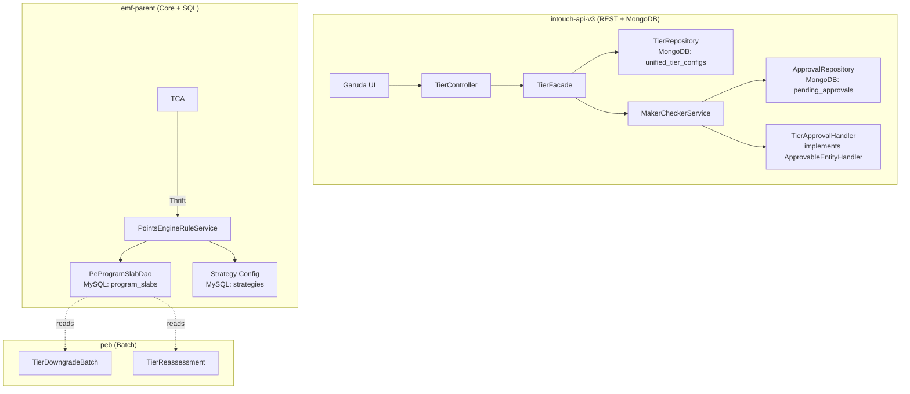

# Product Requirements Document -- Tiers CRUD

> Feature: Tiers CRUD + Generic Maker-Checker Framework
> Ticket: raidlc/ai_tier
> Date: 2026-04-11
> Last rework: Rework #6a (2026-04-22) — contract rename, envelope flatten, write-narrow/read-wide asymmetric contract, sentinel hygiene. Scope: intouch-api-v3 wire only. See delta log at end of this file.
> Confidence: C5-C6 (well-defined scope, verified codebase patterns, 8 decisions locked + Q1-Q26 Rework #6a Q-locks)

---

## Epics

### Epic 1: Tier CRUD APIs (Confidence: C6)

The core tier management APIs -- listing, creation, editing, and deletion. All APIs are self-reliant with validation in the API layer, not the UI. Follows the dual-storage pattern (MongoDB for drafts, SQL for live) established by unified promotions.

**Dependency**: Requires Epic 2 (Maker-Checker Framework) for approval flow. Can be built in parallel -- tier CRUD uses MC interfaces, MC framework provides implementations.

#### E1-US1: Tier Listing with Comparison Matrix

**As** a loyalty program manager, **I want** to retrieve all tiers in my program with full configuration in a comparable format.

| # | Acceptance Criterion |
|---|---------------------|
| AC-1 | `GET /v3/tiers?programId={id}` returns all tiers for a program ordered by serialNumber |
| AC-2 | Each tier includes: basic details (name, description, color, status, memberCount). Duration column dropped per Rework #5. |
| AC-3 **[UPDATED — Rework #6a Q3/Q24]** | Each tier includes: eligibility (threshold per-tier; `kpiType`/`upgradeType`/`trackerId`/`additionalCriteria[]`/`expressionRelation` hoisted read-wide from program-level engine state per AC-13), membership duration, upgrade schedule. `nudges` NOT included (Rework #5). |
| AC-4 **[UPDATED — Rework #6a Q3/Q26]** | Each tier includes: `renewal` block (**renamed from `downgrade`** — Q3). Fields: `renewal.criteriaType` (B1a: always `"Same as eligibility"`); `renewal.downgradeTo` (renamed from `downgrade.target` — Figma-matching); `renewal.conditions[]`; `renewal.expressionRelation` (null/empty). `nudges` NOT included. |
| AC-5 **[OBSOLETE — Rework #6a Q3]** | ~~Each tier includes: downgrade config (downgradeTo, downgradeSchedule, expiryReminders)~~ — `downgrade` block renamed to `renewal` (see AC-4). Schedule/reminders engine-internal, not on v3 wire (6b-scoped advanced-settings). |
| AC-6 **[OBSOLETE — Rework #5]** | ~~Each tier includes: linked benefits summary~~ — `benefitIds`/benefit details dropped from tier schema per Rework #5. |
| AC-7 | Response includes KPI summary: totalTiers, activeTiers, scheduledTiers, totalMembers |
| AC-8 | Per-tier memberCount is cached (refreshed every 5-15 min), not a live query |
| AC-9 | Supports status filter: `?status=ACTIVE,DRAFT,PENDING_APPROVAL`. Deleted tiers excluded by default (unless `?includeDeleted=true`) |
| AC-10 **[UPDATED — Rework #5/#6a]** | LIVE tier state sourced from SQL `program_slabs` via read-only SQL→DTO converter; DRAFT/PENDING_APPROVAL sourced from Mongo `UnifiedTierConfig` |
| AC-11 | Returns 200 with empty array if program has no tiers |
| AC-12 | Returns 400 if programId missing; 404 if program not found |
| AC-13 **[NEW — Rework #6a Q1/Q2/Q4]** | `GET /v3/tiers/{tierId}` returns a **flattened envelope**: tier-specific fields at root + `status: "LIVE"` discriminator + `pendingDraft: {...} \| null` sub-block reserved at root (forward-compat dual-block). List endpoint returns an array of the same flattened envelope shape. |
| AC-14 **[NEW — Rework #6a Q24/Q20; amended by Phase 4 C-8 Option A]** | GET hoists program-level fields read-wide onto the flattened envelope: `eligibility.kpiType`, `eligibility.upgradeType`, `eligibility.trackerId`, `eligibility.trackerConditionId`, `eligibility.additionalCriteria[]`, `eligibility.expressionRelation`, `reevaluateOnReturn`, `dailyEnabled`, `retainPoints`, `isDowngradeOnPartnerProgramDeLinkingEnabled`. **`validity.periodType` + `validity.periodValue` are NOT hoisted** — they are per-slab in engine storage (`TierDowngradeSlabConfig.periodConfig`) and surface per-tier on the flat envelope. Enables UI to paint wizard + advanced-settings from one call. |
| AC-15 **[NEW — Rework #6a Q7]** | For SLAB_UPGRADE-type tiers, `validity.startDate` is NEVER returned on the wire. |
| AC-16 **[NEW — Rework #6a Q8]** | For FIXED-type validity tiers, computed end-date derived from existing `startDate + periodValue` is surfaced on read. No new storage field. |
| AC-17 **[NEW — Rework #6a Q9]** | GET filters out conditions where `value == "-1"` (string-match) from both `eligibility.conditions[]` and `renewal.conditions[]`. |

**Estimated complexity**: Medium. Aggregation logic across MongoDB + cached stats.

#### E1-US2: Tier Creation

**As** a loyalty program manager, **I want** to create a new tier with full configuration.

| # | Acceptance Criterion |
|---|---------------------|
| AC-1 | `POST /v3/tiers` creates a new tier |
| AC-2 **[UPDATED — Rework #6a Q24]** | Required: `programId`, `name`, `eligibility.threshold` (non-first tier). `eligibilityCriteriaType` REMOVED from required (moved to program-level advanced-settings per Q24 — rejected on per-tier write per AC-11). |
| AC-3 **[UPDATED — Rework #6a Q3/Q7/Q22/Q24/Q26]** | Accepted per-tier wire fields (Figma wizard scope, Q20): `name`, `description`, `color`, `programId`, `parentId`, `eligibility.threshold`, `validity.periodType`, `validity.periodValue`, `validity.startDate` (FIXED-type only — rejected for SLAB_UPGRADE per AC-14), `renewal.downgradeTo`, `renewal.criteriaType` (B1a: must equal `"Same as eligibility"` when set), `renewal.conditions[]`. No `nudges`, no `benefitIds`, no nested `advancedSettings`. |
| AC-4 | Validates: name unique within program, threshold > previous tier's threshold |
| AC-5 | Auto-assigns serialNumber = max(existing) + 1 |
| AC-6 | MC enabled: saves to MongoDB as DRAFT, returns status=DRAFT |
| AC-7 | MC disabled: saves to MongoDB AND syncs to SQL via Thrift, returns status=ACTIVE |
| AC-8 **[UPDATED — Phase 4 Q-OP-1/Q-OP-2]** | Returns field-level validation errors (400), not 500. Error codes **9011-9020** cover Rework #6a Q-lock rejects (legacy band 9001-9010 reserved for Rework #4 validator). See AC-11/12/13/14/15/16/17/18 for per-reject code assignments. |
| AC-9 **[UPDATED — Rework #5]** | MongoDB document uses hoisted root-level fields (no `basicDetails`/`metadata` wrappers); `tierUniqueId` auto-generated. |
| AC-10 | Returns the created tier document with generated IDs |
| AC-11 **[NEW — Rework #6a Q24 (subsumes Q17); Phase 4 Q-OP-1]** | POST/PUT **rejects** Class A program-level boolean fields with 400 InvalidInputException (error code **9011**): `reevaluateOnReturn`, `dailyEnabled`, `retainPoints`, `isDowngradeOnPartnerProgramDeLinkingEnabled`. Error message: *"`<field>` is a program-level setting; use `PUT /api_gateway/loyalty/v1/programs/{programId}/advanced-settings`. Omit from tier payload."* |
| AC-12 **[NEW — Rework #6a Q24 (subsumes Q18); amended by Phase 4 C-8 Option A; Phase 4 Q-OP-1]** | POST/PUT **rejects** Class B program-level **eligibility** fields with 400 InvalidInputException (error code **9012**): `kpiType`, `upgradeType`, `trackerId`, `trackerConditionId`, `additionalCriteria[]`, `expressionRelation`. Captures multi-tracker defensive reject per Q5c. **Validity fields are per-tier — NOT rejected.** |
| AC-13 **[NEW — Rework #6a Q9; Phase 4 Q-OP-1]** | POST/PUT **rejects** any `eligibility.conditions[].value == "-1"` or `renewal.conditions[].value == "-1"` (string-match) with 400 InvalidInputException (error code **9015**). Read/write lockstep with AC-17 of US-1. |
| AC-14 **[NEW — Rework #6a Q7; Phase 4 Q-OP-1]** | POST/PUT **rejects** `validity.startDate` for SLAB_UPGRADE-type tiers with 400 (error code **9016**). Engine is event-driven for SLAB_UPGRADE. |
| AC-15 **[NEW — Rework #6a Q22; Phase 4 Q-OP-1]** | POST/PUT **rejects** a nested `advancedSettings` envelope with 400 (write-narrow boundary; error code **9014**). |
| AC-16 **[NEW — Rework #6a Q11/Q3; Phase 4 Q-OP-1]** | POST/PUT **rejects** the legacy `downgrade` field with 400 InvalidInputException (unknown field; error code **9013**). Hard flip, no back-compat window. Only `renewal` is accepted. |
| AC-17 **[NEW — Rework #6a Q26; Phase 4 Q-OP-1]** | `renewal.criteriaType` must equal `"Same as eligibility"` when set (B1a lock); any other value rejected 400 (error code **9017**). `renewal.expressionRelation` and `renewal.conditions[]` must be null/empty (non-empty rejected 400, error code **9017**). Null or omitted `renewal` auto-filled to the B1a default by `TierRenewalNormalizer` before persistence. |
| AC-18 **[NEW — Phase 4 Q-OP-2]** | When `validity.periodType` is a FIXED-family value (`FIXED`, `FIXED_CUSTOMER_REGISTRATION`, `FIXED_LAST_UPGRADE`), POST MUST include `validity.periodValue` (non-null, positive integer). Missing/null/non-positive → 400 InvalidInputException (error code **9018**). For SLAB_UPGRADE-family values, `periodValue` is optional (engine is event-driven). |

**Estimated complexity**: Medium-High. Dual-storage write path, conditional MC flow.

#### E1-US3: Tier Editing (Versioned)

**As** a loyalty program manager, **I want** to edit a tier's configuration with version control.

| # | Acceptance Criterion |
|---|---------------------|
| AC-1 | `PUT /v3/tiers/{tierId}` updates a tier |
| AC-2 | Editing DRAFT: updates MongoDB document in place |
| AC-3 **[UPDATED — Rework #5]** | Editing a LIVE tier via new UI: creates NEW Mongo DRAFT document; LIVE SQL row stays visible. `slabId` on DRAFT = `program_slabs.id` of LIVE tier. |
| AC-4 | Editing PENDING_APPROVAL: updates pending document in place |
| AC-5 | serialNumber is NOT editable |
| AC-6 **[UPDATED — Phase 4 Q-OP-1/Q-OP-2]** | Returns validation errors on invalid changes. Error codes **9011-9020** cover Rework #6a Q-lock rejects (legacy band 9001-9010 reserved for Rework #4 validator). See AC-10..AC-14 + AC-16 for per-reject code assignments. |
| AC-7 **[UPDATED — Rework #5]** | On approval of versioned edit: Mongo DRAFT → SNAPSHOT (audit); SQL `program_slabs` row updated in place. SQL is the LIVE source; SNAPSHOT is audit-only. |
| AC-8 | LIVE SQL row stays live until new version is approved |
| AC-9 | Only one pending draft (DRAFT or PENDING_APPROVAL) per tier at a time (Rework #5 — partial unique index) |
| AC-10 **[NEW — Rework #6a Q3/Q11; Phase 4 Q-OP-1]** | PUT **rejects** the legacy `downgrade` field with 400 (hard flip; error code **9013**). Only `renewal` is accepted. |
| AC-11 **[NEW — Rework #6a Q24 (subsumes Q17); Phase 4 Q-OP-1]** | PUT **rejects** Class A program-level boolean fields with 400 (same list as US-2 AC-11; error code **9011**). |
| AC-12 **[NEW — Rework #6a Q24 (subsumes Q18); amended by Phase 4 C-8 Option A; Phase 4 Q-OP-1]** | PUT **rejects** Class B program-level **eligibility** fields with 400 (same list as US-2 AC-12; error code **9012**). Validity fields are per-tier — NOT rejected. |
| AC-13 **[NEW — Rework #6a Q9; Phase 4 Q-OP-1]** | PUT **rejects** any `eligibility.conditions[].value == "-1"` or `renewal.conditions[].value == "-1"` with 400 (error code **9015**). |
| AC-14 **[NEW — Rework #6a Q22; Phase 4 Q-OP-1]** | PUT **rejects** nested `advancedSettings` envelope with 400 (write-narrow boundary; error code **9014**). |
| AC-15 **[UPDATED — Rework #6a Q3/Q24]** | Editable fields via PUT (partial update, all optional): `name`, `description`, `color`, `eligibility.threshold`, `validity.periodType`, `validity.periodValue`, `validity.startDate` (FIXED-type only), `renewal.downgradeTo`, `renewal.criteriaType`, `renewal.conditions[]`. |
| AC-16 **[NEW — Phase 4 Q-OP-2]** | If PUT payload sets `validity.periodType` to a FIXED-family value (`FIXED`, `FIXED_CUSTOMER_REGISTRATION`, `FIXED_LAST_UPGRADE`), the effective post-merge state MUST have `validity.periodValue` present + non-null + positive integer. Missing/null/non-positive → 400 InvalidInputException (error code **9018**). Exact merge semantics (payload-only vs payload-plus-stored-doc) deferred to Designer (Phase 7). |

**Estimated complexity**: High. Versioning logic, parent-child document management.

#### E1-US4: Tier Deletion (DRAFT Only — Soft-Delete to DELETED)

**As** a loyalty program manager, **I want** to delete a DRAFT tier I no longer need.

| # | Acceptance Criterion |
|---|---------------------|
| AC-1 | `DELETE /v3/tiers/{tierId}` soft-deletes a DRAFT tier (sets status to DELETED) |
| AC-2 | Returns 409 Conflict if tier is not in DRAFT status ("Only DRAFT tiers can be deleted") |
| AC-3 | Returns 409 Conflict if tier is ACTIVE or PENDING_APPROVAL ("Tier retirement not supported in this version") |
| AC-4 | No maker-checker flow — DRAFT tiers are pre-approval, deletion is immediate |
| AC-5 | Deleted tiers excluded from default listing (unless `?includeDeleted=true`) |
| AC-6 | No member reassessment needed — DRAFT tiers have no members |
| AC-7 | Audit trail preserved: DELETED document stays in MongoDB |

**Business Rules:** Only DRAFT tiers can be deleted. No PAUSED or STOPPED states. Tier retirement deferred to future epic. Tier reordering NOT supported (serialNumber immutable).

**Estimated complexity**: Low. Simple status guard + status update.

---

### Epic 2: Generic Maker-Checker Framework (Confidence: C5)

A shared, extensible approval workflow framework. Entity-agnostic by design -- tiers are the first consumer. Benefits, subscriptions, and other entities plug in via the ApprovableEntityHandler strategy interface.

**Dependency**: None -- can be built first (Layer 1 in registry decomposition).

#### E2-US5: Submit for Approval

**As** a program manager, **I want** to submit config changes for approval.

| # | Acceptance Criterion |
|---|---------------------|
| AC-1 | `POST /v3/tiers/{tierId}/submit` accepts tier changes for approval |
| AC-2 | Generic framework works for TIER, BENEFIT, SUBSCRIPTION (via entityType enum) |
| AC-3 | Creates approval request in MongoDB |
| AC-4 | Changes entity status to PENDING_APPROVAL |
| AC-5 | Records requestedBy, timestamp, change summary |
| AC-6 | Notification hook interface (implementable per entity type) |
| AC-7 | Returns the approval request with changeId |

#### E2-US6: Approve/Reject

**As** a platform admin, **I want** to approve or reject pending changes.

| # | Acceptance Criterion |
|---|---------------------|
| AC-1 | `POST /v3/tiers/{tierId}/approve` approves tier changes |
| AC-2 | `POST /v3/tiers/{tierId}/approvals` rejects (comment required) |
| AC-3 | Approve: calls TierApprovalHandler to sync MongoDB -> SQL via Thrift |
| AC-4 | TierApprovalHandler: syncs MongoDB -> SQL via Thrift on approve |
| AC-5 | Reject: reverts entity status PENDING_APPROVAL -> DRAFT |
| AC-6 | Records reviewedBy, timestamp, comment, decision |
| AC-7 | `GET /v3/tiers/{tierId}/approvals` lists approval history for tier |
| AC-8 | `GET /v3/approvals` lists ALL pending approvals (cross-entity) |

#### E2-US7: Maker-Checker Toggle

**As** a platform admin, **I want** to enable/disable MC per program and entity type.

| # | Acceptance Criterion |
|---|---------------------|
| AC-1 | `isMakerCheckerEnabled(orgId, programId, entityType)` lookup |
| AC-2 | Config stored in org-level settings (MongoDB or SQL org_config) |
| AC-3 | When disabled: Create -> ACTIVE, Edit -> immediate apply |
| AC-4 | When enabled: Create -> DRAFT, Edit -> DRAFT (versioned if editing ACTIVE) |
| AC-5 | Toggling does not affect entities already in a state |

---

## Architecture Overview (High-Level)

## API Endpoints Summary

| Method | Path | Purpose | MC Interaction |
|--------|------|---------|----------------|
| GET | `/v3/tiers?programId={id}` | List all tiers — flattened envelope per tier (Rework #6a) | None (read-only) |
| GET | `/v3/tiers/{tierId}` | Get single tier — flattened envelope + read-wide program-level hoist (Rework #6a Q1/Q2/Q4/Q24) | None (read-only) |
| POST | `/v3/tiers` | Create tier — strict write-narrow body (Rework #6a Q24) | DRAFT or ACTIVE (based on MC toggle) |
| PUT | `/v3/tiers/{tierId}` | Edit tier — same write-narrow body rules as POST (Rework #6a Q24) | Versioned DRAFT or immediate (based on MC toggle) |
| DELETE | `/v3/tiers/{tierId}` | Delete DRAFT tier (→ DELETED) | Immediate — no MC (DRAFT only, 409 if not DRAFT) |
| POST | `/v3/tiers/{tierId}/submit` | Submit tier changes for approval | Creates approval request |
| POST | `/v3/tiers/{tierId}/approve` | Approve pending tier changes | Triggers TierApprovalHandler |
| POST | `/v3/tiers/{tierId}/approvals` | Reject pending tier changes | Reverts to DRAFT |
| GET | `/v3/approvals` | List pending approvals | Query approval collection |

**Deferred to Rework #6b (separate cycle)**:
| Method | Path | Purpose | Notes |
|--------|------|---------|-------|
| GET / PUT / DELETE | `/api_gateway/loyalty/v1/programs/{programId}/advanced-settings` | Program-level settings singleton: Class A booleans, program-level eligibility, program-level validity | nginx/api_gateway → pointsengine-emf/ProgramsApi.java direct; no intouch-api-v3 wrapping, no MC, no Thrift IDL change (Q14, Q23) |

## Data Model Changes

### SQL (Flyway migration)
~~- **ALTER TABLE `program_slabs`**: ADD COLUMN `status` VARCHAR(32) NOT NULL DEFAULT 'ACTIVE'~~
~~- **Index**: ADD INDEX `idx_program_slabs_status` ON `program_slabs` (`org_id`, `program_id`, `status`)~~
**Rework #3**: No SQL schema changes needed. SQL only contains ACTIVE tiers (synced via Thrift on approval). ProgramSlab status column, findActiveByProgram(), and Flyway migration removed from scope.

### MongoDB (new collections)
- **`unified_tier_configs`**: Full tier configuration documents. Fields: orgId, programId, tierId, unifiedTierId, status, parentId, version, basicDetails{}, eligibilityCriteria{}, renewalConfig{}, downgradeConfig{}, benefits[], memberStats{}, metadata{}, createdBy, createdAt, updatedAt
- **`pending_approvals`**: Generic framework pending approvals. Fields: orgId, programId, entityType, entityId, changeType (CREATE/UPDATE/DELETE), payload, status (PENDING/APPROVED/REJECTED), requestedBy, reviewedBy, comment, createdAt, reviewedAt

## Non-Functional Requirements

- **Performance**: Tier listing API should respond in <500ms for programs with up to 20 tiers
- **Consistency**: On MC approval, MongoDB and SQL must be consistent. Use transactional write or compensating action on failure.
- **Backward compatibility**: Existing Thrift callers that read ProgramSlab must not break. ~~The new `status` column defaults to ACTIVE for all existing rows.~~ No SQL changes (Rework #3).
- **Multi-tenancy**: All queries scoped by orgId (existing pattern).
- **Idempotency**: POST /v3/tiers should be idempotent on retry (use unifiedTierId for dedup).

## Grooming Questions (for Phase 4 -- Blocker Resolution)

These are NOT asked during BA. They are surfaced to the pod during Phase 4.

1. **GQ-1**: Should the tier listing API support pagination, or is the full list always returned? (Programs typically have 3-7 tiers, but edge cases may have 20+)
2. **GQ-2**: When MC is toggled ON for a program that already has tiers, should existing ACTIVE tiers be mirrored to MongoDB automatically? Or only new changes go through MC?
3. **GQ-3**: For the versioned edit flow -- if a DRAFT already exists for an ACTIVE tier and the user tries to edit again, should it update the existing DRAFT or error?
4. **GQ-4**: Benefits linkage in the listing -- should the API return full benefit config or just references (benefitId, name, value)?
5. **GQ-5**: Notification on submit -- should we build a real notification (email/in-platform) or is a hook interface sufficient for this pipeline run?
6. **GQ-6**: For the generic MC framework -- should the PendingChange store a full payload snapshot or a diff (old vs new)?

## Out of Scope (Explicit)

| Feature | Rationale |
|---------|-----------|
| Tier Retirement (ACTIVE → STOPPED) | No PAUSED or STOPPED states. Stopping ACTIVE tiers deferred to future epic. |
| Tier Reordering | serialNumber is immutable and auto-assigned. No API to reorder tiers. |
| E1-US5: Change Log | Architecture supports it. Audit trail framework (Anuj) will provide. |
| E1-US6: Simulation Mode | Requires member distribution forecasting. Deferred to Layer 3. |
| E2: Benefits CRUD | Separate epic (Baljeet). Will consume MC framework. |
| E3: aiRa Layer | Separate epic. MongoDB field names chosen for AI compatibility. |
| Approval Queue UI | Framework built, dedicated queue view deferred. |
| Real-time member counts | Using cached counts (refreshed every 5-15 min). |
| Mobile/responsive layout | Desktop-first per BRD. |
| Advanced-settings endpoint (Rework #6b) | `GET\|PUT\|DELETE /api_gateway/loyalty/v1/programs/{programId}/advanced-settings` deferred to separate 6b cycle per Q14/Q23. 6a only enforces the per-tier write reject for program-level fields. |
| Engine repo changes (Rework #6a Q13) | 6a is wire-layer only in intouch-api-v3. No emf-parent, peb, or Thrift IDL changes. |

---

## Rework Delta — Cycle 6a (2026-04-22)

**Trigger**: Manual (Mode 5 full cascade, target phase = 1)
**Q-locks applied**: Q1-Q26 (Q15 superseded by Q23; Q17/Q18/Q21/Q25 subsumed by Q24) + FU-01 CANCELLED
**Scope**: intouch-api-v3 wire layer only (Q13)
**Severity**: MODERATE

### Triage Summary (per-epic AC counts)

| Epic / US | AC CONFIRMED | AC UPDATE | AC OBSOLETE | AC NEW |
|---|---|---|---|---|
| E1-US1 (Listing) | 7 (AC-1, AC-2, AC-7, AC-8, AC-9, AC-11, AC-12) | 3 (AC-3, AC-4, AC-10) | 2 (AC-5, AC-6) | 5 (AC-13..AC-17) |
| E1-US2 (Creation) | 6 (AC-1, AC-4..AC-7, AC-10) | 3 (AC-2, AC-3, AC-8, AC-9) | 0 | 7 (AC-11..AC-17) |
| E1-US3 (Editing) | 5 (AC-1, AC-2, AC-4, AC-5, AC-8, AC-9) | 4 (AC-3, AC-6, AC-7, AC-15) | 0 | 5 (AC-10..AC-14) |
| E1-US4 (Deletion) | 7 (all) | 0 | 0 | 0 |
| Epic 2 (MC Framework) — US-5/US-6/US-7 | All | 0 | 0 | 0 |

### Q-lock → AC Mapping

| Q-lock | Acceptance Criteria |
|---|---|
| Q1 | US-1 AC-13 (envelope flatten) |
| Q2 | US-1 AC-13 (live.* hoisted to root) |
| Q3 | US-1 AC-4 (renewal rename), US-2 AC-3 (field scope), US-2 AC-16 (hard-flip), US-3 AC-10, US-3 AC-15 |
| Q4 | US-1 AC-13 (pendingDraft reserved at root) |
| Q5c | US-2 AC-12 (multi-tracker defensive reject — subsumed by Q24) |
| Q7 | US-1 AC-15, US-2 AC-14 |
| Q8 | US-1 AC-16 |
| Q9 | US-1 AC-17, US-2 AC-13, US-3 AC-13 |
| Q10a/Q10b | OUT OF SCOPE 6a — deferred to 6b |
| Q10c | US-2 AC-3, US-3 AC-15 (per-tier renewal.conditions[]/downgradeTo/criteriaType STAY per-tier) |
| Q11 | US-2 AC-16, US-3 AC-10 |
| Q12 | Operational (cascade) — no AC |
| Q13 | Invariant (scope) — no AC |
| Q14 | Out-of-scope table entry |
| Q16 | US-2 AC-3 (POST accepts per-tier validity.periodType), US-3 AC-15 (PUT accepts per-tier validity.periodType) — remapped per C-8 Option A (validity is per-tier, not hoisted) |
| Q17 | US-2 AC-11, US-3 AC-11 (SUBSUMED by Q24 — kept for grep traceability) |
| Q18 | US-2 AC-12, US-3 AC-12 (SUBSUMED by Q24 — kept for grep traceability) |
| Q20 | US-1 AC-14, US-2 AC-3 (Figma wizard scope) |
| Q22 | US-2 AC-15, US-3 AC-14 |
| Q23 | Out-of-scope table entry |
| Q24 | US-1 AC-14 (read-wide hoist), US-2 AC-11/AC-12 (write reject), US-3 AC-11/AC-12 |
| Q26 | US-1 AC-4, US-2 AC-17 |
| FU-01 CANCELLED | No AC needed — engine capability exists; wire plumbing in 6b |

### Forward Cascade Payload (for Phase 2 Critic)

| Item | Classification | Description |
|---|---|---|
| US-1 AC-3 | CHANGED | Per-tier READ eligibility narrowed to threshold + read-wide hoist |
| US-1 AC-4 | CHANGED | `downgrade` block renamed to `renewal`; `downgrade.target` → `renewal.downgradeTo` |
| US-1 AC-5 | REMOVED | Downgrade block AC obsolete (replaced by AC-4) |
| US-1 AC-6 | REMOVED | Benefits summary removed (Rework #5) |
| US-1 AC-10 | CLARIFIED | LIVE from SQL; DRAFT/PENDING from Mongo (Rework #5/#6a) |
| US-1 AC-13 | ADDED | Flattened envelope (GET) |
| US-1 AC-14 | ADDED | Read-wide program-level hoist |
| US-1 AC-15 | ADDED | SLAB_UPGRADE `validity.startDate` dropped |
| US-1 AC-16 | ADDED | FIXED duration computed |
| US-1 AC-17 | ADDED | `-1` sentinel filter on read |
| US-2 AC-2 | CHANGED | Required-field list narrowed |
| US-2 AC-3 | CHANGED | Per-tier POST body narrowed to Figma wizard scope |
| US-2 AC-8 | CHANGED | Error codes rebanded to **9011-9020** (Rework #6a); legacy 9001-9010 reserved for Rework #4 (Phase 4 Q-OP-1) |
| US-2 AC-9 | CLARIFIED | Hoisted root-level Mongo doc (Rework #5) |
| US-2 AC-11 | ADDED | Class A reject |
| US-2 AC-12 | ADDED | Class B reject |
| US-2 AC-13 | ADDED | `-1` reject on write |
| US-2 AC-14 | ADDED | SLAB_UPGRADE `validity.startDate` reject |
| US-2 AC-15 | ADDED | Nested `advancedSettings` reject |
| US-2 AC-16 | ADDED | Legacy `downgrade` field hard-flip reject |
| US-2 AC-17 | ADDED | `renewal.criteriaType` B1a lock + doc rename |
| US-2 AC-18 | ADDED | Conditional duration required for FIXED-family `periodType` (error code 9018 — Phase 4 Q-OP-2) |
| US-3 AC-3 | CHANGED | LIVE-tier edit via new UI creates new Mongo DRAFT (Rework #5) |
| US-3 AC-6 | CHANGED | Error codes rebanded to **9011-9020** (Rework #6a); legacy 9001-9010 reserved for Rework #4 (Phase 4 Q-OP-1) |
| US-3 AC-7 | CHANGED | Approval transitions Mongo → SNAPSHOT; SQL updated in place (Rework #5) |
| US-3 AC-10..AC-14 | ADDED | Parity set of write-reject ACs on PUT |
| US-3 AC-15 | CHANGED | Editable fields narrowed + renames applied |
| US-3 AC-16 | ADDED | PUT-side parity for conditional duration — FIXED-family post-merge state requires `periodValue` (error code 9018 — Phase 4 Q-OP-2) |

### FU-01 Cancellation Note

Multi-tracker eligibility migration (original FU-01 scope: migrate scalar `currentValueType`/`trackerId` → list + Flyway backfill) is **CANCELLED** (2026-04-22). Engine already supports multi-tracker composition via `additionalUpgradeCriteriaList` (`pointsengine-emf/.../ThresholdBasedSlabUpgradeStrategyImpl.java:51,229-239`). `peb` is the same engine layer (not a separate repo requiring migration). Wire plumbing for this field folds into Rework #6b under Q24's read-wide contract. 6a's defensive reject on per-tier wire (Q5c → US-2 AC-12 / US-3 AC-12) stands unchanged.
