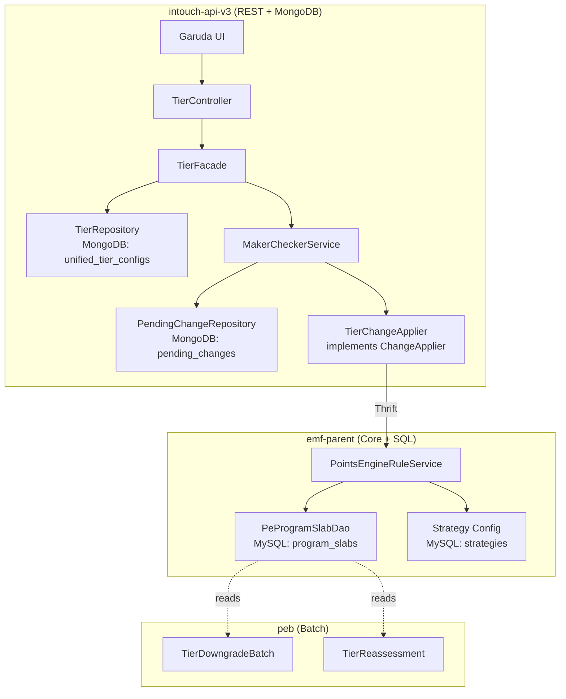

# Product Requirements Document -- Tiers CRUD

> Feature: Tiers CRUD + Generic Maker-Checker Framework
> Ticket: raidlc/ai_tier
> Date: 2026-04-11
> Confidence: C5-C6 (well-defined scope, verified codebase patterns, 8 decisions locked)

---

## Epics

### Epic 1: Tier CRUD APIs (Confidence: C6)

The core tier management APIs -- listing, creation, editing, and deletion. All APIs are self-reliant with validation in the API layer, not the UI. Follows the dual-storage pattern (MongoDB for drafts, SQL for live) established by unified promotions.

**Dependency**: Requires Epic 2 (Maker-Checker Framework) for approval flow. Can be built in parallel -- tier CRUD uses MC interfaces, MC framework provides implementations.

#### E1-US1: Tier Listing with Comparison Matrix

**As** a loyalty program manager, **I want** to retrieve all tiers in my program with full configuration in a comparable format.

| # | Acceptance Criterion |
|---|---------------------|
| AC-1 | `GET /v3/tiers?programId={id}` returns all tiers for a program ordered by serialNumber |
| AC-2 | Each tier includes: basic details (name, description, color, status, duration, memberCount) |
| AC-3 | Each tier includes: eligibility criteria (criteriaType, activities with AND/OR, membershipDuration, upgradeSchedule, nudges) |
| AC-4 | Each tier includes: renewal config (renewalCriteriaType, renewalCondition, renewalSchedule, nudges) |
| AC-5 | Each tier includes: downgrade config (downgradeTo, downgradeSchedule, expiryReminders) |
| AC-6 | Each tier includes: linked benefits summary (benefitName, value per tier) |
| AC-7 | Response includes KPI summary: totalTiers, activeTiers, scheduledTiers, totalMembers |
| AC-8 | Per-tier memberCount is cached (refreshed every 5-15 min), not a live query |
| AC-9 | Supports status filter: `?status=ACTIVE,DRAFT,PENDING_APPROVAL,STOPPED` |
| AC-10 | Draft/Pending tiers sourced from MongoDB; Active tiers sourced from MongoDB mirror |
| AC-11 | Returns 200 with empty array if program has no tiers |
| AC-12 | Returns 400 if programId missing; 404 if program not found |

**Estimated complexity**: Medium. Aggregation logic across MongoDB + cached stats.

#### E1-US2: Tier Creation

**As** a loyalty program manager, **I want** to create a new tier with full configuration.

| # | Acceptance Criterion |
|---|---------------------|
| AC-1 | `POST /v3/tiers` creates a new tier |
| AC-2 | Required: name, programId, eligibilityCriteriaType, eligibilityThreshold |
| AC-3 | Optional: description, color, upgradeSchedule, membershipDuration, renewalConfig, downgradeConfig, nudges |
| AC-4 | Validates: name unique within program, threshold > previous tier's threshold |
| AC-5 | Auto-assigns serialNumber = max(existing) + 1 |
| AC-6 | MC enabled: saves to MongoDB as DRAFT, returns status=DRAFT |
| AC-7 | MC disabled: saves to MongoDB AND syncs to SQL via Thrift, returns status=ACTIVE |
| AC-8 | Returns field-level validation errors (400), not 500 |
| AC-9 | MongoDB document uses UI field names for AI simulation compatibility |
| AC-10 | Returns the created tier document with generated IDs |

**Estimated complexity**: Medium-High. Dual-storage write path, conditional MC flow.

#### E1-US3: Tier Editing (Versioned)

**As** a loyalty program manager, **I want** to edit a tier's configuration with version control.

| # | Acceptance Criterion |
|---|---------------------|
| AC-1 | `PUT /v3/tiers/{tierId}` updates a tier |
| AC-2 | Editing DRAFT: updates MongoDB document in place |
| AC-3 | Editing ACTIVE: creates NEW DRAFT document with parentId -> ACTIVE document |
| AC-4 | Editing PENDING_APPROVAL: updates pending document in place |
| AC-5 | serialNumber is NOT editable |
| AC-6 | Returns validation errors on invalid changes |
| AC-7 | On approval of versioned edit: new doc -> ACTIVE, old doc -> SNAPSHOT |
| AC-8 | ACTIVE version stays live until new version is approved |
| AC-9 | Only one pending draft per ACTIVE tier at a time |

**Estimated complexity**: High. Versioning logic, parent-child document management.

#### E1-US4: Tier Deletion (Soft-Delete)

**As** a loyalty program manager, **I want** to deactivate a tier.

| # | Acceptance Criterion |
|---|---------------------|
| AC-1 | `DELETE /v3/tiers/{tierId}` soft-deletes (sets status to STOPPED) |
| AC-2 | MC enabled: creates PendingChange, requires approval to stop |
| AC-3 | MC disabled: immediately sets status to STOPPED |
| AC-4 | Cannot stop base tier (serialNumber=1) if members assigned to it |
| AC-5 | Stopped tiers excluded from default listing (unless ?includeInactive=true) |
| AC-6 | On stop: members in that tier flagged for reassessment |
| AC-7 | On approval sync: sets SQL status to STOPPED, triggers PEB tier reassessment |

**Estimated complexity**: Medium. Conditional validation + downstream triggering.

---

### Epic 2: Generic Maker-Checker Framework (Confidence: C5)

A shared, extensible approval workflow framework. Entity-agnostic by design -- tiers are the first consumer. Benefits, subscriptions, and other entities plug in via the ChangeApplier strategy interface.

**Dependency**: None -- can be built first (Layer 1 in registry decomposition).

#### E2-US5: Submit for Approval

**As** a program manager, **I want** to submit config changes for approval.

| # | Acceptance Criterion |
|---|---------------------|
| AC-1 | `POST /v3/maker-checker/submit` accepts entityType, entityId, payload |
| AC-2 | Generic: works for TIER, BENEFIT, SUBSCRIPTION (via entityType enum) |
| AC-3 | Creates PendingChange document in MongoDB |
| AC-4 | Changes entity status to PENDING_APPROVAL |
| AC-5 | Records requestedBy, timestamp, change summary |
| AC-6 | Notification hook interface (implementable per entity type) |
| AC-7 | Returns the PendingChange document with changeId |

#### E2-US6: Approve/Reject

**As** a platform admin, **I want** to approve or reject pending changes.

| # | Acceptance Criterion |
|---|---------------------|
| AC-1 | `POST /v3/maker-checker/{changeId}/approve` approves |
| AC-2 | `POST /v3/maker-checker/{changeId}/reject` rejects (comment required) |
| AC-3 | Approve: calls ChangeApplier.apply(payload) for the entity type |
| AC-4 | TierChangeApplier: syncs MongoDB -> SQL via Thrift on approve |
| AC-5 | Reject: reverts entity status PENDING_APPROVAL -> DRAFT |
| AC-6 | Records reviewedBy, timestamp, comment, decision |
| AC-7 | `GET /v3/maker-checker/pending?entityType=TIER` lists pending changes |
| AC-8 | `GET /v3/maker-checker/pending` lists ALL pending changes (cross-entity) |

#### E2-US7: Maker-Checker Toggle

**As** a platform admin, **I want** to enable/disable MC per program and entity type.

| # | Acceptance Criterion |
|---|---------------------|
| AC-1 | `isMakerCheckerEnabled(orgId, programId, entityType)` lookup |
| AC-2 | Config stored in org-level settings (MongoDB or SQL org_config) |
| AC-3 | When disabled: Create -> ACTIVE, Edit -> immediate apply |
| AC-4 | When enabled: Create -> DRAFT, Edit -> DRAFT (versioned if editing ACTIVE) |
| AC-5 | Toggling does not affect entities already in a state |

---

## Architecture Overview (High-Level)

## API Endpoints Summary

| Method | Path | Purpose | MC Interaction |
|--------|------|---------|----------------|
| GET | `/v3/tiers?programId={id}` | List all tiers with full config | None (read-only) |
| POST | `/v3/tiers` | Create tier | DRAFT or ACTIVE (based on MC toggle) |
| PUT | `/v3/tiers/{tierId}` | Edit tier | Versioned DRAFT or immediate (based on MC toggle) |
| DELETE | `/v3/tiers/{tierId}` | Soft-delete tier | PendingChange or immediate (based on MC toggle) |
| POST | `/v3/maker-checker/submit` | Submit change for approval | Creates PendingChange |
| POST | `/v3/maker-checker/{changeId}/approve` | Approve pending change | Triggers ChangeApplier |
| POST | `/v3/maker-checker/{changeId}/reject` | Reject pending change | Reverts to DRAFT |
| GET | `/v3/maker-checker/pending` | List pending changes | Query PendingChange collection |

## Data Model Changes

### SQL (Flyway migration)
- **ALTER TABLE `program_slabs`**: ADD COLUMN `status` VARCHAR(32) NOT NULL DEFAULT 'ACTIVE'
- **Index**: ADD INDEX `idx_program_slabs_status` ON `program_slabs` (`org_id`, `program_id`, `status`)

### MongoDB (new collections)
- **`unified_tier_configs`**: Full tier configuration documents. Fields: orgId, programId, tierId, unifiedTierId, status, parentId, version, basicDetails{}, eligibilityCriteria{}, renewalConfig{}, downgradeConfig{}, benefits[], memberStats{}, metadata{}, createdBy, createdAt, updatedAt
- **`pending_changes`**: Generic MC pending changes. Fields: orgId, programId, entityType, entityId, changeType (CREATE/UPDATE/DELETE), payload, status (PENDING/APPROVED/REJECTED), requestedBy, reviewedBy, comment, createdAt, reviewedAt

## Non-Functional Requirements

- **Performance**: Tier listing API should respond in <500ms for programs with up to 20 tiers
- **Consistency**: On MC approval, MongoDB and SQL must be consistent. Use transactional write or compensating action on failure.
- **Backward compatibility**: Existing Thrift callers that read ProgramSlab must not break. The new `status` column defaults to ACTIVE for all existing rows.
- **Multi-tenancy**: All queries scoped by orgId (existing pattern).
- **Idempotency**: POST /v3/tiers should be idempotent on retry (use unifiedTierId for dedup).

## Grooming Questions (for Phase 4 -- Blocker Resolution)

These are NOT asked during BA. They are surfaced to the pod during Phase 4.

1. **GQ-1**: Should the tier listing API support pagination, or is the full list always returned? (Programs typically have 3-7 tiers, but edge cases may have 20+)
2. **GQ-2**: When MC is toggled ON for a program that already has tiers, should existing ACTIVE tiers be mirrored to MongoDB automatically? Or only new changes go through MC?
3. **GQ-3**: For the versioned edit flow -- if a DRAFT already exists for an ACTIVE tier and the user tries to edit again, should it update the existing DRAFT or error?
4. **GQ-4**: Benefits linkage in the listing -- should the API return full benefit config or just references (benefitId, name, value)?
5. **GQ-5**: Notification on submit -- should we build a real notification (email/in-platform) or is a hook interface sufficient for this pipeline run?
6. **GQ-6**: For the generic MC framework -- should the PendingChange store a full payload snapshot or a diff (old vs new)?

## Out of Scope (Explicit)

| Feature | Rationale |
|---------|-----------|
| E1-US5: Change Log | Architecture supports it. Audit trail framework (Anuj) will provide. |
| E1-US6: Simulation Mode | Requires member distribution forecasting. Deferred to Layer 3. |
| E2: Benefits CRUD | Separate epic (Baljeet). Will consume MC framework. |
| E3: aiRa Layer | Separate epic. MongoDB field names chosen for AI compatibility. |
| Approval Queue UI | Framework built, dedicated queue view deferred. |
| Real-time member counts | Using cached counts (refreshed every 5-15 min). |
| Mobile/responsive layout | Desktop-first per BRD. |
