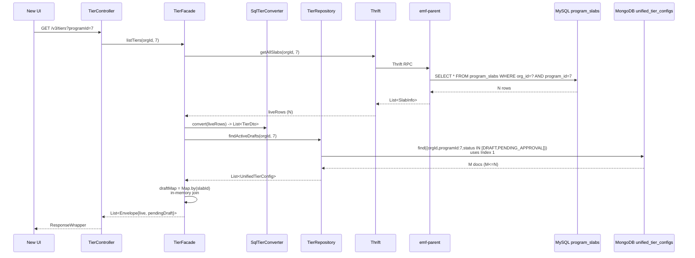
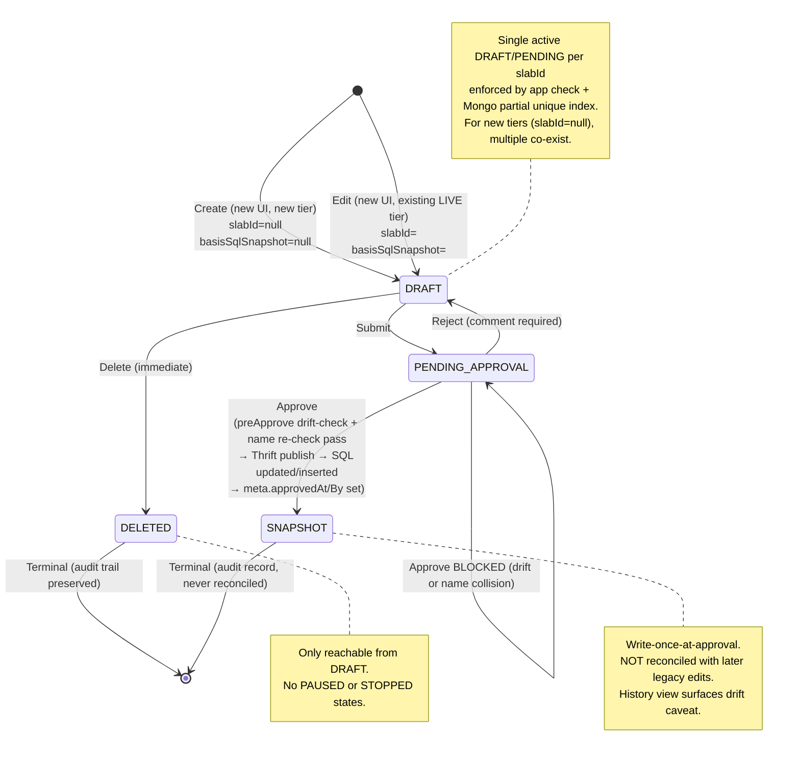

# Architecture -- Tiers CRUD + Generic Maker-Checker Framework

> Phase 6: HLD
> Feature: Tiers CRUD
> Ticket: raidlc/ai_tier
> Date: 2026-04-11 (last major update: Rework #5, 2026-04-17)
> Confidence: C6 (verified patterns, 29 decisions locked + 19 Rework #5 decisions, production payload analyzed)
> Rework trail: Rework #3 (no SQL status column) → Rework #5 (unified read surface, dual write paths, schema cleanup). See `rework-5-scope.md`.

---

## 1. Current State Summary

### What Exists
- **ProgramSlab** entity (MySQL `program_slabs`): minimal -- id, orgId, programId, serialNumber, name, description, metadata JSON, createdOn. No status, no inline config.
- **Strategy** entities (MySQL `strategies`): 9 types storing tier behavior as JSON `propertyValues`. Key types: SLAB_UPGRADE(2) stores upgrade thresholds as CSV, SLAB_DOWNGRADE(5) stores TierConfiguration JSON with per-slab downgrade/renewal configs.
- **Thrift service** (`pointsengine_rules.thrift`): `createSlabAndUpdateStrategies`, `getAllSlabs`, `createOrUpdateSlab` methods exist. Called via `PointsEngineRulesThriftService` in intouch-api-v3.
- **UnifiedPromotion** pattern in intouch-api-v3: MongoDB draft storage, versioned editing (parentId), StatusTransitionValidator, EntityOrchestrator, @Lockable distributed lock, ResponseWrapper envelope.
- **Zero tier REST APIs** exist in intouch-api-v3. All tier operations go through internal Thrift calls.

### What We're Building
New tier CRUD REST APIs in intouch-api-v3, following the UnifiedPromotion pattern (MongoDB draft + SQL live), with a generic maker-checker framework that tiers are the first consumer of.

### Rework #5 Context (added 2026-04-17)
The legacy tier edit/create endpoints in intouch-api-v3 (pre-dating this feature) continue to exist and continue to write directly to SQL without MC. The new `/v3/tiers` APIs coexist with them. The key design change from Rework #5:

- **Unified read surface**: `/v3/tiers` GETs return all tiers — legacy SQL-origin AND new-UI-origin — via a read-only SQL→DTO converter for legacy data (no backfill into Mongo).
- **Dual write paths, single MC scope**: MC applies if-and-only-if the write originated from the new UI. Old UI writes are MC-free.
- **SQL as LIVE source of truth**: For every LIVE read, SQL is the sole source. Mongo holds in-flight (DRAFT/PENDING_APPROVAL) and audit-only (SNAPSHOT) docs.
- **Drift detection**: DRAFTs capture `meta.basisSqlSnapshot` at creation. `preApprove` re-reads SQL and blocks on drift.
- **Envelope response**: GETs return `{ live: ..., pendingDraft: ... | null }` per tier. Single round-trip.
- **SNAPSHOTs are audit-only**: Write-once-at-approval. Never reconciled with later legacy edits. UI surfaces a caveat on drift.

---

## 2. Pattern Evaluation

| Pattern | Fit | Tradeoff | Decision |
|---------|-----|----------|----------|
| Dual-storage (MongoDB + SQL) | HIGH (existing UnifiedPromotion) | Sync complexity vs draft isolation | Adopted (D-10) |
| Strategy pattern (ChangeApplier) | HIGH (existing EntityOrchestrator) | Interface overhead vs extensibility | Adopted (D-12) |
| Versioned documents (parentId) | HIGH (existing UnifiedPromotion) | Doc proliferation vs rollback safety | Adopted (D-13) |
| Expand-then-contract migration | HIGH (GUARDRAILS G-05.4) | Two-phase vs zero regression | Adopted (D-18) |
| Spring Data MongoRepository + Custom | HIGH (existing pattern) | Limitations on complex queries vs consistency | Adopted |
| Cron-based member count cache | MEDIUM | 10-min staleness vs simplicity | Adopted (D-29) |
| **Read-only SQL→DTO converter** (Rework #5) | HIGH | Extra code path vs zero migration risk | Adopted (KD-09) |
| **Envelope response shape** (Rework #5) | HIGH | Response size vs single round-trip | Adopted (KD-11) |
| **Basis SQL snapshot + drift check** (Rework #5) | HIGH | Extra storage + read vs silent overwrite | Adopted (KD-12) |
| **Mongo partial unique index** (Rework #5) | HIGH | Index maintenance vs race-safety | Adopted (KD-14) |
| **Dual write paths** (Rework #5) | HIGH | Two code paths vs legacy regression | Adopted (KD-10) — old UI direct-SQL, new UI MC path |

---

## 3. System Architecture

**Dual write paths (Rework #5):** Old UI writes continue via legacy direct-SQL endpoints (left path, MC-free). New UI writes go through the MC pipeline (right path, Mongo DRAFT → MC → Thrift → SQL). GETs on `/v3/tiers` merge both sources via the SQL→DTO converter + Mongo pendingDraft join.

```mermaid
graph TB
    subgraph "UIs"
        OLD_UI[Old UI<br/>Garuda legacy]
        NEW_UI[New UI<br/>Garuda new tier screens]
    end

    subgraph "intouch-api-v3 — Legacy path (pre-existing, unchanged)"
        LEGACY[Legacy tier endpoints<br/>direct SQL write<br/>NO MC, NO Mongo]
    end

    subgraph "intouch-api-v3 — New path (this pipeline)"
        TC[TierController<br/>/v3/tiers GET POST PUT DELETE]
        TRC[TierReviewController<br/>/v3/tiers/{tierId}/submit<br/>/v3/tiers/{tierId}/approve<br/>/v3/tiers/{tierId}/reject]
        TF[TierFacade<br/>createDraft / editDraft<br/>submitForApproval<br/>handleApproval<br/>listTiers / getTier]
        SCONV[SqlTierConverter<br/>read-only<br/>SQL program_slabs -> DTO]
        TR[TierRepository<br/>MongoDB<br/>partial unique index]
        TVS[TierValidationService<br/>name uniqueness 3 layers<br/>parentId LIVE check<br/>single-active-DRAFT check]
        MCS[MakerCheckerService&lt;T&gt;<br/>Generic Baljeet]
        TAH["TierApprovalHandler<br/>implements ApprovableEntityHandler<br/>preApprove: drift check + name re-check<br/>publish: Thrift<br/>postApprove: Mongo -> SNAPSHOT"]
        PERTS[PointsEngineRules<br/>ThriftService]
    end

    subgraph "makechecker/ (Baljeet - Generic)"
        MCS_impl["MakerCheckerService&lt;T&gt;<br/>SAGA<br/>preApprove -> publish -> postApprove<br/>onPublishFailure rollback"]
        AEH["ApprovableEntityHandler&lt;T&gt;<br/>validateForSubmission<br/>preApprove drift-check<br/>publish Thrift<br/>postApprove SNAPSHOT<br/>onPublishFailure / postReject"]
    end

    subgraph "MongoDB (EMF Cluster)"
        UTC[("unified_tier_configs<br/>implements ApprovableEntity<br/>status: DRAFT / PENDING_APPROVAL / SNAPSHOT<br/>meta.basisSqlSnapshot<br/>INDEX 1: orgId,programId,status<br/>INDEX 2 PARTIAL UNIQUE: orgId,programId,slabId<br/>where status IN DRAFT,PENDING_APPROVAL")]
    end

    subgraph "emf-parent (Thrift: port 9199)"
        PERS[PointsEngineRuleService]
        PSD[PeProgramSlabDao]
        SD[StrategyDao]
        ILS[InfoLookupService]
    end

    subgraph "MySQL — SINGLE SOURCE OF TRUTH for LIVE"
        PS[("program_slabs<br/>+ updatedBy, approvedBy, approvedAt<br/>UNIQUE program_id,name")]
        ST[(strategies)]
        CE[(customer_enrollment)]
    end

    subgraph "peb (unchanged)"
        TDB[TierDowngradeBatch]
        TRS[TierReassessment]
    end

    OLD_UI -->|REST legacy| LEGACY
    LEGACY -->|direct write<br/>sets updatedBy only| PS

    NEW_UI -->|REST /v3/tiers| TC
    NEW_UI -->|REST /v3/tiers/.../submit<br/>/approve /reject| TRC
    TC --> TF
    TRC --> TF
    TF -->|LIVE reads| SCONV
    SCONV -->|Thrift getAllSlabs| PERTS
    TF -->|DRAFT/PENDING reads<br/>+ writes| TR
    TF --> TVS
    TF --> MCS
    MCS --> MCS_impl
    MCS_impl --> TAH
    MCS_impl --> TR
    TAH --> AEH
    TAH -->|drift-check re-read SQL| PERTS
    TAH -->|publish write SQL| PERTS
    TR --> UTC
    PERTS -->|Thrift RPC| PERS
    PERS --> PSD
    PERS --> SD
    PERS --> ILS
    PSD --> PS
    SD --> ST
    TDB -.->|reads| PS
    TRS -.->|reads| PS
    ILS -.->|reads| CE
```

### Envelope read flow (list or detail GET on `/v3/tiers`)



**Two DB hits per list page.** LIVE always from SQL. Mongo read bound to DRAFT/PENDING only. No N+1.

---

## 4. Module Breakdown

### 4.1 Tier Module (intouch-api-v3)

| Component | Responsibility |
|-----------|---------------|
| `TierController` | REST endpoints: GET /v3/tiers, POST, PUT, DELETE. Auth via AbstractBaseAuthenticationToken. **Returns envelope `{live, pendingDraft}` per tier (Rework #5).** |
| `TierReviewController` | REST endpoints: POST /v3/tiers/{tierId}/submit, POST /v3/tiers/{tierId}/approve, POST /v3/tiers/{tierId}/reject, GET /v3/tiers/approvals. |
| `TierFacade` | Business logic: createDraft, editDraft, submitForApproval, handleApproval, listTiers (envelope assembly), getTier (envelope). Orchestrates SQL→DTO converter + Mongo draft join. Captures `meta.basisSqlSnapshot` at DRAFT creation. |
| `SqlTierConverter` | **NEW (Rework #5).** Read-only converter that reshapes SQL `program_slabs` + strategies into the new response DTO. Used only on GETs — no write path uses it. |
| `UnifiedTierConfig` | MongoDB @Document. Implements `ApprovableEntity`. **Rework #5**: `basicDetails`/`metadata` hoisted to root; `nudges`, `benefitIds`, `updatedViaNewUI`, `basicDetails.startDate/endDate` dropped; `unifiedTierId` → `tierUniqueId`; `metadata.sqlSlabId` → root-level `slabId`; `meta.basisSqlSnapshot` added. |
| `TierRepository` | Spring Data MongoRepository + custom impl for sharded access. **Rework #5**: two compound indexes (see §5.3). Partial unique index on `(orgId, programId, slabId)` where `status IN [DRAFT, PENDING_APPROVAL]` enforces single-active-draft per tier. |
| `TierValidationService` | Field-level validation: name uniqueness (3 layers — Rework #5), threshold ordering, required fields, parentId LIVE check, single-active-draft pre-check. |
| `TierApprovalHandler` | Implements `ApprovableEntityHandler<UnifiedTierConfig>`. **Rework #5**: `preApprove` re-reads current SQL state and compares against `meta.basisSqlSnapshot` — blocks on any drift with a clear user-facing message. Also re-checks name uniqueness at approval time. `publish` calls Thrift `createSlabAndUpdateStrategies` to write SQL. `postApprove` transitions Mongo doc to SNAPSHOT with `meta.approvedAt`/`meta.approvedBy`. |
| `TierStatus` | Enum: DRAFT, PENDING_APPROVAL, ACTIVE, DELETED, SNAPSHOT. No PAUSED or STOPPED (Rework #2). **Rework #5 clarifies**: ACTIVE is emitted on the read side (as the `live` envelope field derived from SQL). The Mongo doc itself transitions directly PENDING_APPROVAL → SNAPSHOT on approval — an ACTIVE Mongo doc is rare/ephemeral in practice and never read as LIVE state. |

### 4.2 Maker-Checker Module (makechecker/ -- Baljeet's Generic Package, Pre-Existing)

| Component | Responsibility |
|-----------|---------------|
| `MakerCheckerService<T>` | Generic state machine: submitForApproval(entity, handler, save), approve(entity, comment, reviewedBy, handler, save), reject(entity, comment, reviewedBy, handler, save). Implements SAGA pattern in approve(). |
| `ApprovableEntity` | Interface: getStatus(), setStatus(Object), getVersion(), setVersion(Long), transitionToPending(), transitionToRejected(String). |
| `ApprovableEntityHandler<T>` | Strategy interface: validateForSubmission(T), preApprove(T), publish(T) -> PublishResult, postApprove(T, result), onPublishFailure(T, error), postReject(T, comment). |
| `PublishResult` | Return type from publish(): contains version, external IDs, or other confirmation data. |

### 4.3 emf-parent Changes

> **Rework #3**: ProgramSlab status field, findActiveByProgram() REMOVED.
> **Rework #5**: SQL `program_slabs` gets three audit columns. Flyway migration IS needed (details in `01b-migrator.md`).

| Component | Change |
|-----------|--------|
| ~~`ProgramSlab` status field~~ | NOT NEEDED (Rework #3) |
| ~~`PeProgramSlabDao.findActiveByProgram()`~~ | NOT NEEDED (Rework #3) |
| `ProgramSlab` entity | **Rework #5**: Add `updatedBy`, `approvedBy`, `approvedAt` fields. `createdBy` explicitly NOT added. |
| `PeProgramSlabDao` | **Rework #5**: No new query methods. Existing queries are backward-compatible (new columns are nullable). Legacy write path sets `updatedBy` only (approvedBy/approvedAt untouched = NULL). MC-push path sets all three. |
| `PointsEngineRulesThriftService` | Add wrapper methods for `createSlabAndUpdateStrategies`, `getAllSlabs`, `createOrUpdateSlab`. **Rework #5**: `createSlabAndUpdateStrategies` signature extended to carry `updatedBy`, `approvedBy`, `approvedAt`. Thrift IDL field additions are optional-typed for backward compatibility (G-05 / Thrift optional-fields-only rule). |
| **Flyway migration (Rework #5)** | `ALTER TABLE program_slabs ADD COLUMN updatedBy VARCHAR(255) NULL, ADD COLUMN approvedBy VARCHAR(255) NULL, ADD COLUMN approvedAt DATETIME NULL;` — see `01b-migrator.md` for details. |

---

## 5. MongoDB Document Schema

### 5.1 UnifiedTierConfig (post-Rework #5)

```json
{
  "_id": "ObjectId",
  "tierUniqueId": "string (ex unifiedTierId — format: ut-<programId>-<seq>, e.g. ut-977-004). Immutable, survives versions.",
  "slabId": "int | null (ex metadata.sqlSlabId — = program_slabs.id after MC approval; null while new-tier is still DRAFT/PENDING_APPROVAL with no SQL row)",
  "orgId": "long",
  "programId": "int",
  "status": "DRAFT | PENDING_APPROVAL | SNAPSHOT | DELETED",
  "parentId": "int | null (parent tier's slabId — FK to program_slabs.id. Must reference a LIVE tier. A DRAFT cannot be a parent.)",
  "version": "int (auto-increment per tierUniqueId)",

  "_comment_hoisted_basicDetails": "Rework #5: basicDetails wrapper removed; fields at root",
  "name": "string",
  "description": "string",
  "color": "string (#hex)",
  "serialNumber": "int (auto-assigned, immutable — set on MC approval from SQL)",

  "_comment_dropped_basicDetails_validity": "Rework #5: basicDetails.startDate / basicDetails.endDate DROPPED (UI Duration column removed). The program-level validity.startDate/endDate still exists below.",

  "eligibility": {
    "kpiType": "string (PURCHASE, VISITS, POINTS, TRACKER, etc.)",
    "threshold": "number | null",
    "upgradeType": "string (IMMEDIATE, SCHEDULED, etc.)",
    "expressionRelation": "string | null (AND, OR)",
    "conditions": [
      {
        "type": "string (PURCHASE, VISITS, POINTS, TRACKER)",
        "value": "string",
        "trackerName": "string | null"
      }
    ]
  },

  "validity": {
    "_comment": "Program-level validity window — DIFFERENT semantic from the dropped basicDetails.startDate/endDate",
    "periodType": "string (FIXED, ROLLING, etc.)",
    "periodValue": "int | null",
    "startDate": "date | null",
    "endDate": "date | null",
    "renewal": {
      "criteriaType": "string (SAME_AS_ELIGIBILITY, CUSTOM, etc.)",
      "expressionRelation": "string | null (AND, OR)",
      "conditions": "[same model as eligibility.conditions]",
      "schedule": "string | null"
    }
  },

  "downgrade": {
    "target": "string (PREVIOUS, LOWEST, SPECIFIC, etc.)",
    "reevaluateOnReturn": "boolean",
    "dailyEnabled": "boolean",
    "conditions": "[same model as eligibility.conditions]"
  },

  "_comment_dropped_nudges": "Rework #5: `nudges` field DROPPED. Standalone Nudges entity (sibling) with its own endpoints is untouched.",
  "_comment_dropped_benefitIds": "Rework #5: `benefitIds` DROPPED. Tiers have no knowledge of benefits; Benefits epic owns the tier<->benefit link.",

  "memberStats": {
    "_comment": "Populated by member-count cache cron. Not part of MC snapshot.",
    "memberCount": "int (cached)",
    "lastRefreshed": "date"
  },

  "engineConfig": {
    "_comment": "Hidden engine configs preserved for round-trip fidelity",
    "retainPoints": "boolean",
    "isDowngradeOnReturnEnabled": "boolean",
    "isDowngradeOnPartnerProgramExpiryEnabled": "boolean",
    "isAdvanceSetting": "boolean",
    "addDefaultCommunication": "boolean",
    "slabUpgradeMode": "string (EAGER | DYNAMIC | LAZY) -- program-level upgrade mode",
    "periodConfig": {
      "type": "FIXED | SLAB_UPGRADE | SLAB_UPGRADE_CYCLIC | FIXED_CUSTOMER_REGISTRATION",
      "value": "int",
      "unit": "NUM_MONTHS",
      "startDate": "date | null",
      "computationWindowStartValue": "int | null",
      "computationWindowEndValue": "int | null",
      "minimumDuration": "int"
    },
    "downgradeEngineConfig": {
      "_comment": "Engine-level downgrade settings not surfaced in UI downgradeConfig",
      "isActive": "boolean",
      "conditionAlways": "boolean",
      "conditionValues": {
        "purchase": "string",
        "numVisits": "string",
        "points": "string",
        "trackerCount": "[int]"
      },
      "renewalOrderString": "string"
    },
    "expressionRelation": "[[int]] | null",
    "customExpression": "string | null",
    "isFixedTypeWithoutYear": "boolean",
    "renewalWindowType": "string",
    "notificationConfig": {
      "_comment": "Per-channel notification config — in-tier notifications only. NOT the same as the standalone Nudges entity.",
      "sms": { "template": "string", "senderId": "string", "domain": "string" },
      "email": { "subject": "string", "body": "string", "templateId": "long", "senderId": "string" },
      "weChat": { "template": "string", "originalId": "string", "brandId": "string" },
      "mobilePush": { "androidBlob": "string", "iosBlob": "string", "accountId": "string" }
    }
  },

  "_comment_hoisted_metadata": "Rework #5: metadata wrapper removed. Fields hoisted to root (below). updatedViaNewUI DROPPED. createdBy NOT carried (not added to SQL either).",
  "createdAt": "date",
  "updatedBy": "string",
  "updatedAt": "date",
  "comments": "string | null (MC approval/rejection comment)",

  "meta": {
    "_comment": "Approval + drift-detection metadata. Distinct from the now-dropped `metadata` wrapper.",
    "basisSqlSnapshot": {
      "_comment": "Rework #5: Captured at DRAFT creation on an edit of a LIVE tier. Snapshot of SQL fields governed by MC. `null` for new-tier DRAFTs. Used by TierApprovalHandler.preApprove for drift detection.",
      "slabFields": {
        "name": "string",
        "description": "string",
        "colorCode": "string",
        "serialNumber": "int"
      },
      "strategyFields": {
        "upgradeThreshold": "string",
        "downgradeConfig": "object (serialized TierConfiguration slice for this slab)"
      },
      "capturedAt": "date"
    },
    "approvedAt": "date | null (set on MC approval — postApprove)",
    "approvedBy": "string | null (set on MC approval)"
  }
}
```

### 5.2 Status Lifecycle on UnifiedTierConfig (post-Rework #5)

Status lives on the entity itself (no separate `PendingChange` collection). Transitions:

- **Create new tier** (via new UI): insert with `status = DRAFT`, `slabId = null`, `basisSqlSnapshot = null`.
- **Edit LIVE tier** (via new UI): insert a new doc with `status = DRAFT`, `slabId = <existing program_slabs.id>`, `basisSqlSnapshot = <current SQL snapshot>`. The LIVE SQL row is unchanged.
- `transitionToPending()`: DRAFT → PENDING_APPROVAL (called by `MakerCheckerService.submitForApproval`).
- `transitionToRejected(comment)`: PENDING_APPROVAL → DRAFT, stores comment.
- **Approve** (via `MakerCheckerService.approve` → SAGA):
  1. `preApprove`: drift check (basisSqlSnapshot vs current SQL) + name re-check. Block on drift/collision.
  2. `publish`: Thrift → SQL write (updates existing row for edit; inserts for new tier, sets slabId). Sets `updatedBy`/`approvedBy`/`approvedAt` on SQL row.
  3. `postApprove`: **Rework #5**: Mongo doc transitions PENDING_APPROVAL → **SNAPSHOT** (audit-only). Sets `meta.approvedAt` / `meta.approvedBy`. The doc is NEVER read as LIVE state — it is purely audit.
  4. `onPublishFailure`: Mongo stays PENDING_APPROVAL (SAGA rollback on external failure); rethrow exception.
- **Delete DRAFT**: `status = DELETED`. Terminal. Only reachable from DRAFT.

**Note on ACTIVE status on Mongo docs (Rework #5 clarification):** The enum retains `ACTIVE` for backward compatibility, but the Mongo doc rarely holds this state. On approval, the doc goes directly PENDING_APPROVAL → SNAPSHOT. The `live` field in every API response envelope is derived from SQL via `SqlTierConverter` — not from a Mongo ACTIVE doc. If any Mongo doc does carry ACTIVE status (e.g. from legacy data paths), it is NOT read by the listing/detail endpoints; those endpoints only query `status IN [DRAFT, PENDING_APPROVAL]` in Mongo.

### 5.3 Indexes (Rework #5)

```
Index 1:  { orgId: 1, programId: 1, status: 1 }
          - Covers: list with status filter, approval queue, history view by status

Index 2:  { orgId: 1, programId: 1, slabId: 1 } PARTIAL UNIQUE
          partialFilterExpression: { status: { $in: ["DRAFT", "PENDING_APPROVAL"] } }
          - Covers: "does tier X have a pending change?" per-row lookup on list
          - Enforces: at most one DRAFT/PENDING_APPROVAL per (orgId, programId, slabId)
          - For new tiers with slabId=null: MongoDB treats null values as non-conflicting — multiple concurrent new-tier DRAFTs coexist (each gets its own slabId on MC approval)
```

Default `_id` index also used for direct approval/reject actions.

---

## 6. API Design

### 6.1 Tier CRUD (new UI — Rework #5)

| Method | Path | Purpose | Auth | MC Behavior |
|--------|------|---------|------|-------------|
| GET | `/v3/tiers?programId={id}&status={filter}&includeDeleted={bool}` | List tiers (envelope per tier: `{live, pendingDraft}`). Includes legacy SQL-origin tiers. | IntouchUser | Read-only — SQL for live + Mongo for pendingDraft |
| GET | `/v3/tiers/{slabId}` | Get single tier (envelope `{live, pendingDraft}`). `slabId` = `program_slabs.id`. | IntouchUser | Read-only |
| POST | `/v3/tiers` | Create tier via MC path (new-tier DRAFT). Name collision rejected at Layer 1. | IntouchUser | Creates as DRAFT (slabId=null). MC required. |
| PUT | `/v3/tiers/{slabId}` | Edit LIVE tier — creates a new Mongo DRAFT with `basisSqlSnapshot` captured. Blocked if another active DRAFT/PENDING exists for this slabId. | IntouchUser | Creates new DRAFT doc. MC required. |
| DELETE | `/v3/tiers/{tierDocId}` | Delete DRAFT tier (→ DELETED). No MC. 409 if not DRAFT. | IntouchUser | DRAFT only. |

### 6.2 Tier Approval

| Method | Path | Purpose | Auth | Body |
|--------|------|---------|------|------|
| POST | `/v3/tiers/{tierDocId}/submit` | Submit DRAFT → PENDING_APPROVAL | IntouchUser | `{}` |
| POST | `/v3/tiers/{tierDocId}/approve` | Approve: preApprove drift-check → publish Thrift → postApprove SNAPSHOT. Blocked on drift or name collision. | IntouchUser (approver) | `{ "comment": "..." }` |
| POST | `/v3/tiers/{tierDocId}/reject` | Reject: PENDING_APPROVAL → DRAFT, comment required | IntouchUser (approver) | `{ "comment": "Required reason" }` |
| GET | `/v3/tiers/approvals?programId={id}` | List pending approval tiers (org-wide or program-scoped) | IntouchUser | N/A |

### 6.3 Old UI — Legacy Endpoints (unchanged — Rework #5)

The old UI continues to use its existing (pre-Rework) tier create/edit/list endpoints. These:
- Write directly to SQL `program_slabs` + strategies via the existing Thrift methods.
- Never touch Mongo `unified_tier_configs`.
- Are never gated by MC.
- Set `updatedBy` on the SQL row; leave `approvedBy`/`approvedAt` NULL (Rework #5 audit columns).

The SQL `UNIQUE(program_id, name)` constraint is the final backstop for cross-UI name collisions.

### 6.4 Response Envelope

All responses use `ResponseWrapper<T>`:
```json
{
  "data": { ... },
  "errors": [ { "code": 123, "message": "..." } ],
  "warnings": [ { "message": "..." } ]
}
```

**GET tier response shape (Rework #5 — envelope):**
```json
{
  "data": {
    "live": {
      "slabId": 42,
      "name": "Gold",
      "description": "...",
      "serialNumber": 2,
      "status": "ACTIVE",
      "updatedBy": "alice",
      "approvedBy": "bob",
      "approvedAt": "2026-04-15T10:00:00Z",
      "...": "other fields from SQL via SqlTierConverter"
    },
    "pendingDraft": null
    /* OR, if a DRAFT/PENDING_APPROVAL exists for this slabId: */
    /*
    "pendingDraft": {
      "_id": "<mongoId>",
      "status": "PENDING_APPROVAL",
      "updatedBy": "alice",
      "updatedAt": "2026-04-16T14:00:00Z",
      "proposedChanges": { ... full UnifiedTierConfig minus audit internals ... },
      "meta": { "approvedAt": null, "approvedBy": null }
    }
    */
  }
}
```

**List GET response shape:** array of envelopes, one per LIVE SQL row.

---

## 7. TierApprovalHandler Design (Rework #5)

### 7.0 preApprove — Drift Check + Name Re-check (Rework #5)

```
TierApprovalHandler.preApprove(UnifiedTierConfig doc):

  1. Name collision re-check (Layer 2):
     - Load SQL program_slabs WHERE org_id=? AND program_id=? AND name=?
     - If a row exists with id != doc.slabId (or any row exists for new-tier drafts where slabId=null):
         throw ApprovalBlockedException(
           "Name '<X>' no longer available — conflicts with existing tier. Rename or cancel this DRAFT.")

  2. Drift check (ONLY for edits of LIVE tiers — doc.slabId != null):
     - currentSql = Thrift.getSlab(orgId, programId, slabId)    // single-slab read via getAllSlabs
     - basis     = doc.meta.basisSqlSnapshot
     - if basis == null:
         // new-tier DRAFT — no basis to check, proceed
         return
     - drifted = compareConservative(currentSql, basis)
         // conservative: any difference in slabFields or strategyFields counts as drift
     - if drifted:
         throw ApprovalBlockedException(
           "This DRAFT is based on a state that no longer matches the live tier.
            SQL changed since this DRAFT was created — <fieldDiff>.
            Cancel or recreate this DRAFT to proceed.")

  3. All checks pass — return. publish() will now proceed.
```

### 7.1 CREATE Flow (new tier — Rework #5 adjusted)

```
TierApprovalHandler.publish(UnifiedTierConfig doc):
  // Precondition: preApprove already ran — name unique, no drift (or basis == null for new tier).

  1. Fetch current strategies: getAllConfiguredStrategies(programId, orgId)

  2. Build SlabInfo:
     name, description, colorCode, serialNumber (= max(existing)+1),
     updatedBy = doc.updatedBy,
     approvedBy = reviewer userId (from MC context),
     approvedAt = now
     // NOTE: updatedViaNewUI field is DROPPED per Rework #5.

  3. Build SLAB_UPGRADE StrategyInfo (type 2):
     - Read current threshold_values CSV
     - Append new tier's threshold at end
     - Preserve current_value_type, expression_relation

  4. Build SLAB_DOWNGRADE StrategyInfo (type 5):
     - Parse current TierConfiguration JSON
     - Add new slab entry to slabs[] array
     - Set shouldDowngrade, downgradeTarget, periodConfig, conditions

  5. Call Thrift: createSlabAndUpdateStrategies(
       programId, orgId, slabInfo,
       [upgradeStrategy, downgradeStrategy],
       updatedBy, approvedBy, approvedAt, serverReqId)

     Execution order (verified from code):
     a. Updates SLAB_UPGRADE strategy (new threshold)
     b. Updates SLAB_DOWNGRADE strategy (new slab entry)
     c. Creates ProgramSlab record (with audit columns populated — Rework #5)
     d. updateStrategiesForNewSlab() auto-extends
        POINT_ALLOCATION + POINT_EXPIRY CSVs

  6. Return PublishResult with sqlSlabId (from Thrift response)

  // postApprove:
  // - doc.slabId = result.slabId
  // - doc.meta.approvedAt = now
  // - doc.meta.approvedBy = reviewer
  // - doc.status = SNAPSHOT  (Rework #5: no ACTIVE intermediate)
```

### 7.2 UPDATE Flow (edit of LIVE tier — Rework #5)

```
TierApprovalHandler.publish(UnifiedTierConfig draft):
  // Precondition: preApprove ran — drift check passed (basisSqlSnapshot matches current SQL).
  // draft.slabId points to the LIVE program_slabs.id. No parentId concept needed — SQL IS the parent.

  1. Use draft.slabId to identify the SQL row to update.

  2. Build SlabInfo with changes (name, description, color, serialNumber unchanged):
     - updatedBy = draft.updatedBy
     - approvedBy = reviewer userId
     - approvedAt = now

  3. If eligibility (upgrade threshold) changed:
     - Fetch SLAB_UPGRADE strategy
     - Replace threshold at CSV position (serialNumber - 2)
     - Build updated StrategyInfo

  4. If downgrade config changed:
     - Fetch SLAB_DOWNGRADE strategy (TierConfiguration JSON)
     - Find slab entry by slabNumber, update it
     - Build updated StrategyInfo

  5. Call createSlabAndUpdateStrategies with SlabInfo + modified strategies
     (The Thrift method handles both CREATE (new slab) and UPDATE (by slabId) in one atomic call.)

  6. Return PublishResult (slabId unchanged for edits)

  // postApprove (Rework #5):
  // - draft.meta.approvedAt = now
  // - draft.meta.approvedBy = reviewer
  // - draft.status = SNAPSHOT                         // The approved doc becomes audit-only
  // - Any prior SNAPSHOT for this slabId is NOT altered — they accumulate as history.
  // - The LIVE state is now the updated SQL row; it is read via SqlTierConverter on GETs.
```

**Note on versioning (Rework #5 simplification):** The earlier design had "old doc → SNAPSHOT, new doc → ACTIVE" per versioned edit. Post-Rework #5: there is no "ACTIVE Mongo doc" for LIVE state — SQL is always LIVE. The newly approved draft goes straight to SNAPSHOT as an audit record. Multiple SNAPSHOT docs accumulate per tier over time, each tagged with its `meta.approvedAt` / `meta.approvedBy`.

### 7.3 DELETE (DRAFT Only → DELETED) Flow

```
TierFacade.deleteTier(tierId):
  1. Load UnifiedTierConfig from MongoDB
  
  2. Guard: if status != DRAFT → 409 Conflict
     "Only DRAFT tiers can be deleted"
     (ACTIVE/PENDING_APPROVAL → 409 "Tier retirement not supported in this version")
  
  3. Set status to DELETED in MongoDB doc
     (soft-delete — document stays for audit trail)
  
  4. No Thrift call needed — DRAFT tiers have no SQL record
  
  5. No member reassessment — DRAFT tiers have no members
  
  NOTE: This does NOT go through TierApprovalHandler or MC.
  DRAFT deletion is a simple MongoDB status update.
  Tier retirement (stopping ACTIVE tiers) is deferred to a future epic.
```

### 7.4 MakerCheckerService SAGA Pattern (Approval — Rework #5)

```
MakerCheckerService<T>.approve(tierConfig, comment, reviewedBy, handler, save):
  1. Call handler.preApprove(tierConfig)
     — Rework #5: drift check (basisSqlSnapshot vs current SQL) + name re-check.
     — Throws ApprovalBlockedException on drift OR name collision.
     — Approver sees a clear user-facing message. Mongo doc stays PENDING_APPROVAL.

  2. Call handler.publish(tierConfig) — THRIFT CALL (external, may fail)
     Returns PublishResult

  3. On success: Call handler.postApprove(tierConfig, result)
     - Rework #5: status = SNAPSHOT (audit-only). No ACTIVE intermediate.
     - Set meta.approvedAt, meta.approvedBy.
     - For new-tier creates: set slabId = result.slabId.
     - Call save callback (tierRepository.save)

  4. On failure (Thrift exception, SQL UNIQUE violation, etc.):
     - Call handler.onPublishFailure(tierConfig, exception)
     - Rethrow exception (SAGA rollback)
     - tierConfig stays PENDING_APPROVAL in MongoDB
     - Approver sees error — SQL UNIQUE(program_id, name) collision is translated into a well-formed 409
```

---

## 8. Status State Machine (Rework #5)

The state machine below describes Mongo `UnifiedTierConfig.status`. **Note that LIVE state is not a Mongo status — LIVE tier state lives in SQL `program_slabs` and is derived on read via `SqlTierConverter`. The Mongo `status` enum is for draft lifecycle and audit.**



**Legacy (old UI) write path is NOT shown** in this state machine because it does not interact with Mongo — it writes directly to SQL `program_slabs` with `updatedBy` set, leaving the Mongo doc (if any) undisturbed. Rework #5 explicitly supports this: when old UI edits a tier that has a pending new-UI DRAFT, the SQL UPDATE succeeds and the drift is caught by `preApprove` when the approver tries to approve.

---

## 9. Architecture Decision Records (ADRs)

### ADR-01: Dual-Storage (MongoDB + SQL)
**Decision**: Tier configurations stored in MongoDB during draft lifecycle, synced to SQL on approval.
**Context**: The existing engine (emf-parent, peb) reads from SQL. The new UI/API needs draft/approval workflows.
**Alternatives**: (a) SQL-only with draft table (tight coupling), (b) MongoDB-only (breaks engine), (c) CQRS with event sourcing (over-engineering).
**Rationale**: Follows UnifiedPromotion pattern. MongoDB provides flexible document storage for rich config. SQL provides the stable, indexed storage the engine needs. Sync is explicit via Thrift on approval.
**Per**: Decision D-10, verified against UnifiedPromotion.java.

### ADR-02: Generic Maker-Checker Framework (Baljeet's makechecker/ Package)
**Decision**: Use Baljeet's pre-existing generic `makechecker/` package (ApprovableEntity + ApprovableEntityHandler). TierApprovalHandler implements the handler interface.
**Context**: Tiers need approval workflow. Benefits, subscriptions will need it later. Baljeet built the reusable framework.
**Alternatives**: (a) Tier-specific MC (faster, inconsistent), (b) Copy UnifiedPromotion MC pattern (outdated).
**Rationale**: Baljeet's package is battle-tested and extensible. No PendingChange collection — status lives on the entity itself. SAGA pattern in MakerCheckerService.approve() handles Thrift publish failures gracefully.
**Per**: Decision D-12, team coordination with Baljeet on makechecker/ ownership.

### ~~ADR-03: Expand-Then-Contract Migration~~ — NOT NEEDED (Rework #3)
~~**Decision**: Add `status` column to `program_slabs` with DEFAULT 'ACTIVE'. Add new `findActiveByProgram()` DAO method. Do NOT modify existing `findByProgram()`.~~
~~**Context**: PeProgramSlabDao used in 7+ services. Modifying existing queries risks regression in core engine.~~
~~**Alternatives**: (a) Modify all existing queries (high blast radius), (b) Database view (added complexity).~~
~~**Rationale**: Zero regression risk. Existing engine callers see all slabs (correct for serial number ordering). New APIs use the filtered method. Per GUARDRAILS G-05.4.~~
~~**Per**: Decision D-18, Critic C-3.~~
**Rework #3**: ADR-03 removed from scope. SQL `program_slabs` only contains ACTIVE tiers (synced via Thrift on approval). No ACTIVE tier can be deleted (DRAFT-only deletion in MongoDB). SlabInfo Thrift has no status field. Therefore: no status column, no findActiveByProgram(), no Flyway migration, zero emf-parent entity/DAO changes. Deferred to future tier retirement epic.

### ADR-04: Versioned Edits with parentId
**Decision**: Editing an ACTIVE tier creates a new DRAFT document with parentId pointing to the ACTIVE. ACTIVE stays live until new version approved.
**Context**: Tier config changes are high-risk. Need rollback capability and zero-downtime editing.
**Alternatives**: (a) In-place edit with MC (no rollback), (b) Immediate snapshot (downtime gap during approval).
**Rationale**: Zero downtime. Full version history. Consistent with UnifiedPromotion pattern.
**Per**: Decision D-13, D-24 (Flow A confirmed).

### ADR-05: Existing Thrift Methods (No IDL Change)
**Decision**: Use existing `createSlabAndUpdateStrategies`, `getAllSlabs`, `createOrUpdateSlab` from `pointsengine_rules.thrift`. TierApprovalHandler calls these via `PointsEngineRulesThriftService` wrappers.
**Context**: Phase 2 Critic flagged missing Thrift methods (C-1). Phase 5 research found they already exist in a different Thrift file.
**Alternatives**: (a) New Thrift method (unnecessary), (b) Direct DB access (breaks service boundary), (c) REST endpoint on emf-parent (inconsistent).
**Rationale**: Methods exist. Only need Java wrappers in PointsEngineRulesThriftService. Lowest scope, lowest risk.
**Per**: Phase 5 critical finding, revised C-1. TierApprovalHandler.publish() invokes these via wrappers.

### ~~ADR-06: New Programs Only~~ — REVERSED (Rework #5)
~~**Decision**: The new tier CRUD system (MongoDB draft -> SQL live) applies to new programs only. Existing programs continue using the current system.~~

**Rework #5 reversal (ADR-06R):** The new `/v3/tiers` APIs serve **ALL tiers** — both legacy SQL-origin tiers and new-UI-origin tiers, across all programs (old and new).

**Mechanism**:
- Legacy tiers surface through a **read-only SQL→DTO converter** (`SqlTierConverter`) on GETs. No backfill, no bootstrap migration into Mongo.
- Writes follow the **dual-path rule** (see ADR-08R): old UI → legacy direct-SQL (no MC), new UI → Mongo DRAFT → MC → Thrift → SQL.
- Both UIs see both types of tiers on reads. Both UIs can edit tiers of either origin.

**Rationale**: Single UI experience. No backfill migration risk (reads are stateless). Preserves backward compatibility with all legacy data.

**Per**: Rework #5 KD-09 (user decision, 2026-04-17). Replaces D-23.

### ADR-08R: Dual Write Paths, Single MC Scope (Rework #5 — NEW)
**Decision**: Maker-checker applies **if-and-only-if** the write originated from the **new UI**. The legacy direct-SQL write path (old UI) continues to exist and is never gated by MC.

**Write-path matrix:**
| Write Origin | Target Tier | Write Path | MC? | Mongo? |
|---|---|---|---|---|
| Old UI | Legacy SQL-only | Legacy direct-SQL | No | No |
| Old UI | New-UI-origin (has SNAPSHOT history) | Legacy direct-SQL | No | No (SNAPSHOT not reconciled) |
| New UI | Legacy SQL-only | Mongo DRAFT (basis from SQL) → MC → Thrift → SQL | Yes | Yes |
| New UI | New-UI-origin | Mongo DRAFT → MC → Thrift → SQL | Yes | Yes |

**Context**: Legacy endpoints have existed for years; migrating all callers to the new MC-gated path is out of scope and high-risk.

**Alternatives**: (a) Force MC on all writes (breaks legacy clients), (b) Retire legacy endpoints (out of scope for this pipeline), (c) Mirror legacy writes into Mongo (complex, error-prone, no clear value).

**Rationale**: MC is a new-UI feature. Legacy path preserved untouched.

**Per**: Rework #5 KD-10.

### ADR-09R: Envelope Response Shape (Rework #5 — NEW)
**Decision**: `/v3/tiers` GETs return `{ live: ..., pendingDraft: ... | null }` per tier. `live` always sourced from SQL; `pendingDraft` from Mongo filtered by `status IN [DRAFT, PENDING_APPROVAL]`.

**Alternatives**: (a) Separate endpoints for live vs pending (more round-trips, more client logic), (b) Return only `live` with a `hasPendingDraft` flag (extra round-trip to fetch draft details).

**Rationale**: Single round-trip for approval review (highest-value screen). Bounded scale (~50 tiers/program, ≤1 active DRAFT per tier) keeps payload small. Two DB hits per list page, no N+1.

**Per**: Rework #5 KD-11.

### ADR-10R: Drift Detection Before Approval (Rework #5 — NEW)
**Decision**: Every Mongo DRAFT captures `meta.basisSqlSnapshot` at creation. `TierApprovalHandler.preApprove` re-reads current SQL state and compares against the basis; any drift blocks approval with a clear user-facing message.

**Drift policy**: Conservative — any difference in SQL slab or strategy fields counts as drift. Revisit if operational friction emerges.

**Alternatives**: (a) Silent overwrite (data loss risk when old UI edits mid-MC), (b) Auto-rebase on current SQL (surprising UX, can change what approver is approving), (c) Merge diff (complex, error-prone).

**Rationale**: Makes MC a meaningful gate even when concurrent legacy writes exist. "Cancel or recreate" is explicit and auditable.

**Per**: Rework #5 KD-12.

### ADR-11R: SNAPSHOT Audit-Only Semantics (Rework #5 — NEW)
**Decision**: Mongo SNAPSHOT docs are write-once-at-approval audit records. They carry `meta.approvedAt` and `meta.approvedBy`. They are NEVER reconciled with later legacy edits. The new-UI history view surfaces a caveat when SQL `updated_at` > latest SNAPSHOT's `approvedAt`.

**Alternatives**: (a) Keep SNAPSHOT in sync with SQL (requires listening to legacy writes — high complexity, cross-cutting concern), (b) Reconcile on read (read-time inconsistency, complex algorithm), (c) Auto-invalidate SNAPSHOTs on legacy edit (loses audit trail).

**Rationale**: SNAPSHOT is an audit record of "what was approved", not a mirror of current state. Current state lives in SQL. UI reconciles visually via a label. Cheap to implement, clear to reason about.

**Per**: Rework #5 KD-13.

### ADR-12R: Single Active DRAFT per Tier (Rework #5 — NEW)
**Decision**: At most one DRAFT or PENDING_APPROVAL document exists per `(orgId, programId, slabId)`. Enforced by:
1. App-level pre-check in `TierFacade.createDraft` / `editDraft` — returns friendly business error on collision.
2. Mongo partial unique index on `(orgId, programId, slabId)` where `status IN [DRAFT, PENDING_APPROVAL]` — catches races.

For new-tier DRAFTs (`slabId=null`), MongoDB's unique index treats null as non-conflicting — multiple concurrent new-tier DRAFTs coexist, each getting its own `slabId` on MC approval.

**Rationale**: Prevents concurrent conflicting DRAFTs. App check provides good UX; DB index is the race-safe backstop. Reuses the Q-3c Index 2 fields.

**Per**: Rework #5 KD-14.

### ADR-13R: Name Collision Defense — 3 Layers (Rework #5 — NEW)
**Decision**: Name uniqueness is defended in three layers:
1. **At DRAFT creation** (`TierValidationService`): check against `(SQL program_slabs for program)` ∪ `(active Mongo DRAFTs for program)`. Reject early.
2. **At approval time** (`TierApprovalHandler.preApprove`): re-check against current SQL. Block with user-facing message if a collision appeared (e.g., via old UI legacy create).
3. **SQL UNIQUE(program_id, name)** on `program_slabs`: final backstop. If Thrift INSERT still fails, SAGA rolls back and surfaces a well-formed error.

**Alternatives**: (a) App-only check (race-unsafe), (b) DB-only check (bad UX — user sees cryptic constraint violation).

**Rationale**: Good UX + race-safety. Mutually reinforcing defenses.

**Per**: Rework #5 KD-15.

### ADR-14R: SQL program_slabs Audit Columns (Rework #5 — NEW)
**Decision**: `program_slabs` gains three columns via Flyway: `updatedBy`, `approvedBy`, `approvedAt`. `createdBy` is explicitly NOT added (per user instruction).

- Legacy write path sets only `updatedBy` (leaves `approvedBy`/`approvedAt` as-is → NULL for rows never touched by MC).
- MC push path sets all three.

**Alternatives**: (a) Add all 4 (createdBy, updatedBy, approvedBy, approvedAt) — rejected per user, (b) Add only updatedBy (loses approval audit), (c) No audit columns (loses traceability entirely).

**Rationale**: Minimal audit enrichment; backward-compatible (all nullable); supports both legacy and MC flows without forcing legacy backfill.

**Per**: Rework #5 KD-18 (explicit user decision).

### ADR-15R: Schema Cleanup + Renames (Rework #5 — NEW)
**Decision**: 
- Hoist `basicDetails` + `metadata` fields to root of `UnifiedTierConfig` (remove both wrappers).
- Drop `nudges`, `benefitIds`, `updatedViaNewUI`, `basicDetails.startDate`, `basicDetails.endDate`.
- Rename `unifiedTierId` → `tierUniqueId` (pure rename; same format).
- Rename `metadata.sqlSlabId` → root-level `slabId`.

**Rationale**: Reduce schema noise; align with UI intent. Tiers have no knowledge of benefits (Benefits epic owns link). Nudges is a sibling entity. Shorter, clearer names.

**Per**: Rework #5 KD-16 + KD-17.

### ADR-16R: parentId = SQL slabId, Must Be LIVE (Rework #5 — NEW)
**Decision**: `UnifiedTierConfig.parentId` references the parent tier's `program_slabs.id` (not a Mongo doc id). The parent MUST be LIVE — a DRAFT tier cannot be a parent.

**Validation**: Enforced at DRAFT creation/edit in `TierValidationService`:
- Parent row must exist in `program_slabs` with same `orgId`/`programId`.
- Self-reference rejected.
- Cycle prevention flagged for LLD (Designer's call whether to enforce strictly).

**Alternatives**: (a) parentId = Mongo doc id (cross-store correlation, doesn't work for legacy parents), (b) parentId = tierUniqueId (string FK, indirection).

**Rationale**: Works uniformly for legacy and new-UI-origin parents. No cross-store correlation. Parent data reads straight from SQL.

**Per**: Rework #5 KD-19 / Q-6.

### ADR-07: TierApprovalHandler Uses Single Atomic Thrift Call
**Decision**: `createSlabAndUpdateStrategies` is called as a single atomic operation, passing SlabInfo + [SLAB_UPGRADE, SLAB_DOWNGRADE] strategies. Points strategies (allocation, redemption, expiry) are NOT passed -- the engine auto-extends them.
**Context**: Creating a slab requires both the slab record and strategy updates. Splitting into multiple calls creates inconsistency windows.
**Alternatives**: (a) Multiple separate Thrift calls (inconsistency risk), (b) Transaction across calls (not supported in Thrift).
**Rationale**: The existing method handles atomicity. Verified execution order: update strategies first, create slab second (which triggers CSV extension internally). All in one transaction.
**Per**: Phase 5 deep dive, Flow 1 validation.

---

## 10. Implementation Plan (Completed)

### Layer 1: Generic Maker-Checker Framework (makechecker/ - Baljeet's Package)
- COMPLETED: Pre-existing in Baljeet's package
- `ApprovableEntity` interface (getStatus, setStatus, getVersion, setVersion, transitionToPending, transitionToRejected)
- `ApprovableEntityHandler<T>` interface (validateForSubmission, preApprove, publish, postApprove, onPublishFailure, postReject)
- `MakerCheckerService<T>` (submitForApproval, approve with SAGA, reject)
- Status transitions managed on entity itself (no PendingChange collection)

### Layer 2: Tier CRUD (intouch-api-v3)
- COMPLETED: All tier-specific implementation
1. `TierStatus` enum: DRAFT, PENDING_APPROVAL, ACTIVE, DELETED, SNAPSHOT
2. `UnifiedTierConfig` MongoDB @Document implementing `ApprovableEntity`
3. `TierRepository` + `TierRepositoryImpl` (sharded MongoDB)
4. `TierValidationService`
5. `TierFacade` -- submitForApproval(), handleApproval(), creation, editing, deletion logic
6. `TierController` -- GET/POST/PUT/DELETE endpoints
7. `TierReviewController` -- POST /v3/tiers/{tierId}/submit, POST /v3/tiers/{tierId}/approve, GET /v3/tiers/approvals
8. `TierApprovalHandler` implements `ApprovableEntityHandler<UnifiedTierConfig>` -- MongoDB -> Thrift conversion (Section 7)

### Layer 3: emf-parent Changes (Rework #5 — additive)
- `ProgramSlab` entity: add `updatedBy`, `approvedBy`, `approvedAt` fields (nullable). `createdBy` NOT added.
- `PointsEngineRulesThriftService`: wrapper methods for slab Thrift calls (already exist); signature enriched with optional audit fields.
- **Flyway migration**: `ALTER TABLE program_slabs ADD COLUMN updatedBy VARCHAR(255) NULL, ADD COLUMN approvedBy VARCHAR(255) NULL, ADD COLUMN approvedAt DATETIME NULL;` — details in `01b-migrator.md`.
- Backward-compatible: legacy code paths continue to work (new columns NULL for rows never touched by MC).

### Layer 4: Integration + Cache (Completed)
- COMPLETED: Member count cache job (cron every 10 min)
- COMPLETED: End-to-end testing: create tier -> submit -> approve -> verify SQL

---

## 11. Risks & Mitigations

| Risk | Severity | Mitigation |
|------|----------|-----------|
| R1: CSV index off-by-one | HIGH | Unit test with 3,4,5+ slabs. serialNumber-2 = CSV index. |
| R2: Downgrade strategy monolith | MEDIUM | @Lockable on TierApprovalHandler methods. |
| R3: Strategy ID preservation | MEDIUM | Always fetch existing strategy ID before update. |
| R4: CSV positions on soft-delete | LOW | Never remove positions. Document in code comments. |
| R5: Legacy API in separate service | LOW | Listing reads SQL via Thrift converter + Mongo (Rework #5 — unified surface). |
| **R6: Drift false-positive rate (Rework #5)** | MEDIUM | Conservative drift policy may reject approvals on unrelated field changes. Mitigation: surface clear message to approver with field-level diff; allow easy "recreate DRAFT". Revisit policy if friction emerges. |
| **R7: SNAPSHOT proliferation (Rework #5)** | LOW | SNAPSHOT docs accumulate per tier over time. Mitigation: retention/purging deferred to future; bounded in practice (few edits per tier per quarter). |
| **R8: SNAPSHOT drift vs SQL (Rework #5)** | LOW | Mongo SNAPSHOT not reconciled with later legacy SQL edits. UI history view surfaces caveat label when detected. Accept as design choice. |
| **R9: Cross-UI name race (Rework #5)** | MEDIUM | 3-layer defense: app check at DRAFT creation + re-check at approval + SQL UNIQUE. Catches old-UI vs new-UI race. |
| **R10: SQL audit column backfill on legacy rows (Rework #5)** | LOW | Columns are nullable. Legacy pre-rework rows have NULL updatedBy/approvedBy/approvedAt — expected. No backfill needed. |
| **R11: New-tier DRAFT partial unique index edge case (Rework #5)** | LOW | MongoDB treats null `slabId` as non-conflicting, so multiple new-tier DRAFTs can coexist. This is correct (each gets its own slabId on approval). Documented in §5.3. |
| **R12: Stale `basisSqlSnapshot` for long-lived DRAFTs (Rework #5)** | MEDIUM | DRAFTs can sit for days. A legacy edit during that time will cause drift-block on approval. Mitigation: clear "recreate DRAFT" path in UX; consider TTL on DRAFTs in a future rework. |

---

## 12. Done Criteria (Rework #5 — updated)

- [x] `GET /v3/tiers?programId={id}` returns **ALL tiers** (legacy SQL-origin + new-UI-origin) as envelope `{live, pendingDraft}` per tier (Rework #5)
- [x] `GET /v3/tiers/{slabId}` returns single-tier envelope `{live, pendingDraft}` (Rework #5)
- [x] `SqlTierConverter` implemented — read-only; not used on any write path (Rework #5)
- [x] `POST /v3/tiers` creates a new-tier DRAFT (slabId=null). Name collision rejected at Layer 1. (Rework #5)
- [x] `PUT /v3/tiers/{slabId}` creates a new DRAFT with `meta.basisSqlSnapshot` captured from current SQL. Blocked if another active DRAFT exists (partial unique index). (Rework #5)
- [x] `DELETE /v3/tiers/{tierDocId}` deletes DRAFT tier (→ DELETED). 409 if not DRAFT.
- [x] `POST /v3/tiers/{tierDocId}/submit` — DRAFT → PENDING_APPROVAL (idempotent for same doc)
- [x] `POST /v3/tiers/{tierDocId}/approve` — full SAGA: preApprove drift-check + name re-check → publish Thrift → postApprove SNAPSHOT. Block with clear message on drift/collision. (Rework #5)
- [x] `POST /v3/tiers/{tierDocId}/reject` — PENDING_APPROVAL → DRAFT, comment required
- [x] `GET /v3/tiers/approvals?programId={id}` — list pending approval tiers
- [x] Old UI legacy endpoints untouched — continue to write directly to SQL, set `updatedBy` only, no MC (Rework #5)
- [x] Generic MC framework: Baljeet's `makechecker/` package (ApprovableEntity + ApprovableEntityHandler + SAGA)
- [x] MC toggle per-program + per-entity-type applies to new-UI writes only (Rework #5)
- [x] TierApprovalHandler syncs MongoDB → SQL via Thrift with drift check in `preApprove` (Rework #5)
- [x] **Flyway migration applied**: `ALTER TABLE program_slabs ADD updatedBy, approvedBy, approvedAt` (Rework #5)
- [x] `program_slabs.createdBy` explicitly NOT added (Rework #5 user decision)
- [x] Thrift `createSlabAndUpdateStrategies` extended with optional `updatedBy`/`approvedBy`/`approvedAt` fields (backward-compatible via optional-typed additions)
- [x] `UnifiedTierConfig` schema: `basicDetails` + `metadata` hoisted to root; `nudges`, `benefitIds`, `updatedViaNewUI`, `basicDetails.startDate/endDate` dropped; `unifiedTierId` → `tierUniqueId`; `metadata.sqlSlabId` → root `slabId` (Rework #5)
- [x] `meta.basisSqlSnapshot` captured at DRAFT creation for LIVE-tier edits (Rework #5)
- [x] Mongo Index 1 `(orgId, programId, status)` + Index 2 PARTIAL UNIQUE `(orgId, programId, slabId)` where `status IN [DRAFT, PENDING_APPROVAL]` (Rework #5)
- [x] Name collision: 3-layer defense (app at DRAFT creation, re-check at approval, SQL UNIQUE backstop) (Rework #5)
- [x] Single active DRAFT/PENDING_APPROVAL per tier enforced app-level + DB partial unique (Rework #5)
- [x] `parentId` = parent's `program_slabs.id`; parent must be LIVE; self-reference rejected (Rework #5)
- [x] All tests pass (unit + integration) — including new BTs for dual-path, drift, envelope, single-active-draft, name collision
- [x] serialNumber immutability enforced (400 on change attempt)
- [x] Member count cache refreshes every 10 min
- [x] Deleted old makerchecker/ package (17 files)
- [x] Removed MakerCheckerController, MakerCheckerFacade, MakerCheckerServiceImpl, PendingChange collection, ChangeApplier interface
- [x] ~~PartnerProgramSlab block validation~~ Deferred to future tier retirement epic (Rework #2)
