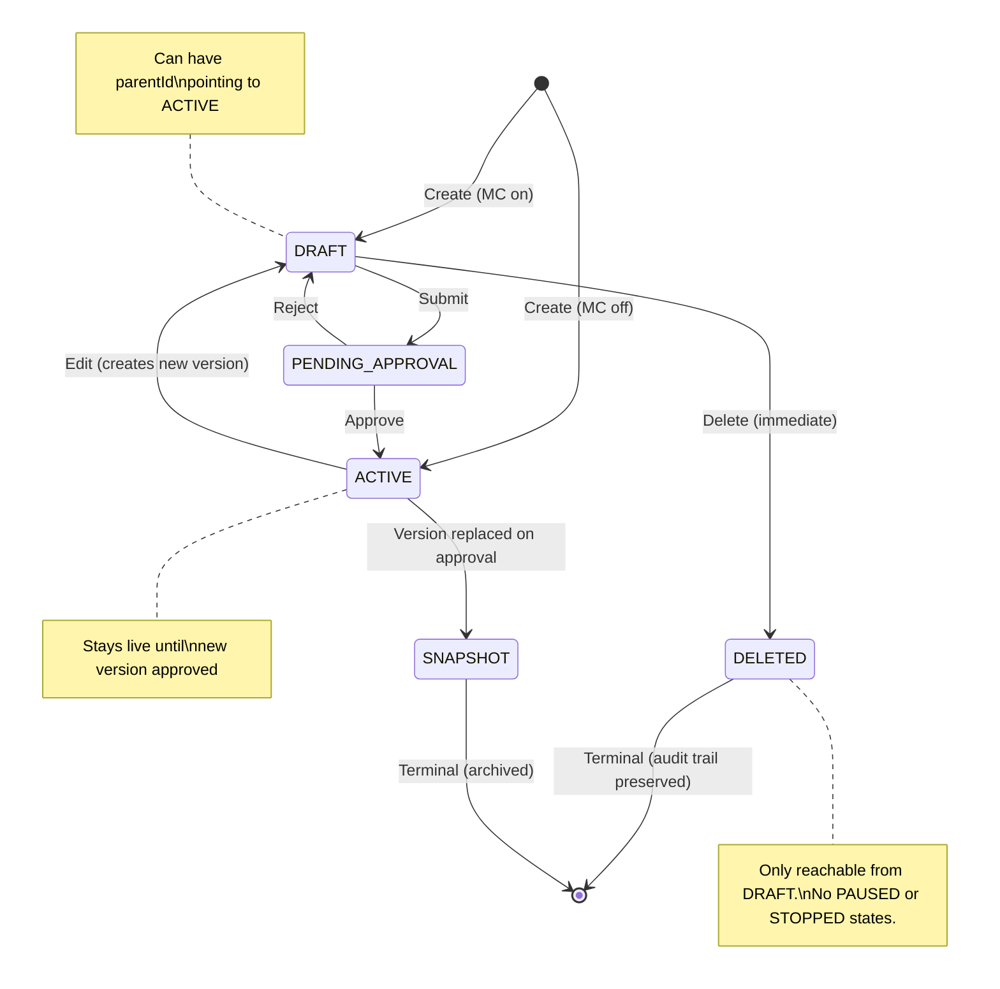

# Architecture -- Tiers CRUD + Generic Maker-Checker Framework

> Phase 6: HLD
> Feature: Tiers CRUD
> Ticket: raidlc/ai_tier
> Date: 2026-04-11
> Confidence: C6 (verified patterns, 29 decisions locked, production payload analyzed)

---

## 1. Current State Summary

### What Exists
- **ProgramSlab** entity (MySQL `program_slabs`): minimal -- id, orgId, programId, serialNumber, name, description, metadata JSON, createdOn. No status, no inline config.
- **Strategy** entities (MySQL `strategies`): 9 types storing tier behavior as JSON `propertyValues`. Key types: SLAB_UPGRADE(2) stores upgrade thresholds as CSV, SLAB_DOWNGRADE(5) stores TierConfiguration JSON with per-slab downgrade/renewal configs.
- **Thrift service** (`pointsengine_rules.thrift`): `createSlabAndUpdateStrategies`, `getAllSlabs`, `createOrUpdateSlab` methods exist. Called via `PointsEngineRulesThriftService` in intouch-api-v3.
- **UnifiedPromotion** pattern in intouch-api-v3: MongoDB draft storage, versioned editing (parentId), StatusTransitionValidator, EntityOrchestrator, @Lockable distributed lock, ResponseWrapper envelope.
- **Zero tier REST APIs** exist in intouch-api-v3. All tier operations go through internal Thrift calls.

### What We're Building
New tier CRUD REST APIs in intouch-api-v3, following the UnifiedPromotion pattern (MongoDB draft + SQL live), with a generic maker-checker framework that tiers are the first consumer of.

---

## 2. Pattern Evaluation

| Pattern | Fit | Tradeoff | Decision |
|---------|-----|----------|----------|
| Dual-storage (MongoDB + SQL) | HIGH (existing UnifiedPromotion) | Sync complexity vs draft isolation | Adopted (D-10) |
| Strategy pattern (ChangeApplier) | HIGH (existing EntityOrchestrator) | Interface overhead vs extensibility | Adopted (D-12) |
| Versioned documents (parentId) | HIGH (existing UnifiedPromotion) | Doc proliferation vs rollback safety | Adopted (D-13) |
| Expand-then-contract migration | HIGH (GUARDRAILS G-05.4) | Two-phase vs zero regression | Adopted (D-18) |
| Spring Data MongoRepository + Custom | HIGH (existing pattern) | Limitations on complex queries vs consistency | Adopted |
| Cron-based member count cache | MEDIUM | 10-min staleness vs simplicity | Adopted (D-29) |

---

## 3. System Architecture

```mermaid
graph TB
    subgraph "Garuda UI"
        UI[Browser]
    end

    subgraph "intouch-api-v3"
        TC[TierController<br/>/v3/tiers]
        TRC[TierReviewController<br/>/v3/tiers/{tierId}/submit<br/>/v3/tiers/{tierId}/approve]
        TF[TierFacade<br/>submitForApproval<br/>handleApproval]
        MCS[MakerCheckerService&lt;T&gt;<br/>Generic (Baljeet)]
        TAH[TierApprovalHandler<br/>implements ApprovableEntityHandler]
        TR[TierRepository<br/>MongoDB]
        TVS[TierValidationService]
        PERTS[PointsEngineRules<br/>ThriftService]
    end

    subgraph "makechecker/ (Baljeet - Generic)"
        MCS_impl["MakerCheckerService&lt;T&gt;<br/>Generic state machine<br/>submitForApproval<br/>approve (SAGA pattern)<br/>reject"]
        AEH["ApprovableEntityHandler&lt;T&gt;<br/>validateForSubmission<br/>preApprove<br/>publish (Thrift)<br/>postApprove<br/>onPublishFailure<br/>postReject"]
    end

    subgraph "MongoDB (EMF Cluster)"
        UTC[(unified_tier_configs<br/>implements ApprovableEntity)]
    end

    subgraph "emf-parent (Thrift: port 9199)"
        PERS[PointsEngineRuleService]
        PSD[PeProgramSlabDao]
        SD[StrategyDao]
        ILS[InfoLookupService]
    end

    subgraph "MySQL"
        PS[(program_slabs)]
        ST[(strategies)]
        CE[(customer_enrollment)]
    end

    subgraph "peb (unchanged)"
        TDB[TierDowngradeBatch]
        TRS[TierReassessment]
    end

    UI -->|REST| TC
    UI -->|REST| TRC
    TC --> TF
    TRC --> TF
    TF --> TR
    TF --> TVS
    TF --> MCS
    MCS --> MCS_impl
    MCS_impl --> TAH
    MCS_impl --> TR
    TAH --> AEH
    TAH --> PERTS
    TR --> UTC
    PERTS -->|Thrift RPC| PERS
    PERS --> PSD
    PERS --> SD
    PERS --> ILS
    PSD --> PS
    SD --> ST
    TDB -.->|reads| PS
    TRS -.->|reads| PS
    ILS -.->|reads| CE
```

---

## 4. Module Breakdown

### 4.1 Tier Module (intouch-api-v3)

| Component | Responsibility |
|-----------|---------------|
| `TierController` | REST endpoints: GET /v3/tiers, POST, PUT, DELETE. Auth via AbstractBaseAuthenticationToken. |
| `TierReviewController` | REST endpoints: POST /v3/tiers/{tierId}/submit, POST /v3/tiers/{tierId}/approve, GET /v3/tiers/approvals. |
| `TierFacade` | Business logic: submitForApproval(), handleApproval(), status transitions, versioned edit orchestration, listing assembly. |
| `UnifiedTierConfig` | MongoDB @Document. Implements `ApprovableEntity`. Full tier config in user-friendly format. |
| `TierRepository` | Spring Data MongoRepository + custom impl for sharded access. |
| `TierValidationService` | Field-level validation: name uniqueness, threshold ordering, required fields. |
| `TierApprovalHandler` | Implements `ApprovableEntityHandler<UnifiedTierConfig>`. Converts MongoDB tier config -> SlabInfo + StrategyInfo. Calls Thrift to sync SQL. |
| `TierStatus` | Enum: DRAFT, PENDING_APPROVAL, ACTIVE, DELETED, SNAPSHOT. No PAUSED or STOPPED (Rework #2). |

### 4.2 Maker-Checker Module (makechecker/ -- Baljeet's Generic Package, Pre-Existing)

| Component | Responsibility |
|-----------|---------------|
| `MakerCheckerService<T>` | Generic state machine: submitForApproval(entity, handler, save), approve(entity, comment, reviewedBy, handler, save), reject(entity, comment, reviewedBy, handler, save). Implements SAGA pattern in approve(). |
| `ApprovableEntity` | Interface: getStatus(), setStatus(Object), getVersion(), setVersion(Long), transitionToPending(), transitionToRejected(String). |
| `ApprovableEntityHandler<T>` | Strategy interface: validateForSubmission(T), preApprove(T), publish(T) -> PublishResult, postApprove(T, result), onPublishFailure(T, error), postReject(T, comment). |
| `PublishResult` | Return type from publish(): contains version, external IDs, or other confirmation data. |

### 4.3 emf-parent Changes (minimal)

> **Rework #3**: ProgramSlab status field, findActiveByProgram(), and Flyway migration REMOVED.
> SQL only contains ACTIVE tiers. No status column needed. Deferred to future tier retirement epic.

| Component | Change |
|-----------|--------|
| ~~`ProgramSlab`~~ | ~~Add `status` field~~ — NOT NEEDED (Rework #3) |
| ~~`PeProgramSlabDao`~~ | ~~Add `findActiveByProgram()`~~ — NOT NEEDED (Rework #3) |
| `PointsEngineRulesThriftService` | Add wrapper methods for `createSlabAndUpdateStrategies`, `getAllSlabs`, `createOrUpdateSlab` |
| ~~Flyway migration~~ | ~~ALTER TABLE program_slabs~~ — NOT NEEDED (Rework #3) |

---

## 5. MongoDB Document Schema

### 5.1 UnifiedTierConfig

```json
{
  "_id": "ObjectId",
  "unifiedTierId": "string (immutable, survives versions)",
  "orgId": "long",
  "programId": "int",
  "status": "DRAFT | PENDING_APPROVAL | ACTIVE | DELETED | SNAPSHOT",
  "parentId": "string | null (ObjectId of ACTIVE version when editing)",
  "version": "int (auto-increment per unifiedTierId)",

  "basicDetails": {
    "name": "string",
    "description": "string",
    "color": "string (#hex)",
    "serialNumber": "int (auto-assigned, immutable)",
    "startDate": "date",
    "endDate": "date | null (null = Indefinite)"
  },

  "eligibility": {
    "kpiType": "string (PURCHASE, VISITS, POINTS, TRACKER, etc. — String, not enum)",
    "threshold": "number | null",
    "upgradeType": "string (IMMEDIATE, SCHEDULED, etc.)",
    "expressionRelation": "string | null (AND, OR)",
    "conditions": [
      {
        "type": "string (PURCHASE, VISITS, POINTS, TRACKER)",
        "value": "string",
        "trackerName": "string | null"
      }
    ]
  },

  "validity": {
    "periodType": "string (FIXED, ROLLING, etc.)",
    "periodValue": "int | null",
    "startDate": "date | null",
    "endDate": "date | null",
    "renewal": {
      "criteriaType": "string (SAME_AS_ELIGIBILITY, CUSTOM, etc.)",
      "expressionRelation": "string | null (AND, OR)",
      "conditions": "[same model as eligibility.conditions]",
      "schedule": "string | null"
    }
  },

  "downgrade": {
    "target": "string (PREVIOUS, LOWEST, SPECIFIC, etc.)",
    "reevaluateOnReturn": "boolean",
    "dailyEnabled": "boolean",
    "conditions": "[same model as eligibility.conditions]"
  },

  "nudges": {
    "upgradeNotification": "string | null",
    "renewalReminder": "string | null",
    "expiryWarning": "string | null",
    "downgradeConfirmation": "string | null"
  },

  "benefitIds": ["string (benefit ObjectIds)"],

  "memberStats": {
    "memberCount": "int (cached)",
    "lastRefreshed": "date"
  },

  "engineConfig": {
    "_comment": "Hidden engine configs preserved for round-trip fidelity",
    "retainPoints": "boolean",
    "isDowngradeOnReturnEnabled": "boolean",
    "isDowngradeOnPartnerProgramExpiryEnabled": "boolean",
    "isAdvanceSetting": "boolean",
    "addDefaultCommunication": "boolean",
    "slabUpgradeMode": "string (EAGER | DYNAMIC | LAZY) -- program-level upgrade mode",
    "periodConfig": {
      "type": "FIXED | SLAB_UPGRADE | SLAB_UPGRADE_CYCLIC | FIXED_CUSTOMER_REGISTRATION",
      "value": "int",
      "unit": "NUM_MONTHS",
      "startDate": "date | null",
      "computationWindowStartValue": "int | null",
      "computationWindowEndValue": "int | null",
      "minimumDuration": "int"
    },
    "downgradeEngineConfig": {
      "_comment": "Engine-level downgrade settings not surfaced in UI downgradeConfig",
      "isActive": "boolean -- master toggle for downgrade section",
      "conditionAlways": "boolean -- if true, downgrade condition is always evaluated",
      "conditionValues": {
        "purchase": "string (threshold or empty)",
        "numVisits": "string (threshold or empty)",
        "points": "string (threshold or empty)",
        "trackerCount": "[int] (tracker-based condition values)"
      },
      "renewalOrderString": "string (renewal evaluation order)"
    },
    "expressionRelation": "[[int]] | null",
    "customExpression": "string | null",
    "isFixedTypeWithoutYear": "boolean",
    "renewalWindowType": "string",
    "notificationConfig": {
      "_comment": "Per-channel notification config for engine sync",
      "sms": { "template": "string", "senderId": "string", "domain": "string" },
      "email": { "subject": "string", "body": "string", "templateId": "long", "senderId": "string" },
      "weChat": { "template": "string", "originalId": "string", "brandId": "string" },
      "mobilePush": { "androidBlob": "string", "iosBlob": "string", "accountId": "string" }
    }
  },

  "metadata": {
    "createdBy": "string (userId)",
    "createdAt": "date",
    "updatedBy": "string",
    "updatedAt": "date",
    "updatedViaNewUI": "boolean (always true for new APIs)",
    "comments": "string | null (MC approval/rejection comment)",
    "sqlSlabId": "int | null (set after first SQL sync -- the ProgramSlab.id)"
  }
}
```

### 5.2 Status Lifecycle on UnifiedTierConfig

Status lives on the entity itself. No separate `PendingChange` collection. The `ApprovableEntity` interface on `UnifiedTierConfig` manages transitions:

- `transitionToPending()`: DRAFT → PENDING_APPROVAL (called by MakerCheckerService.submitForApproval)
- `transitionToRejected(comment)`: PENDING_APPROVAL → DRAFT, stores comment in metadata
- `approve(version)`: PENDING_APPROVAL → ACTIVE, updates version and stores approval timestamp

---

## 6. API Design

### 6.1 Tier CRUD

| Method | Path | Purpose | Auth | MC Behavior |
|--------|------|---------|------|-------------|
| GET | `/v3/tiers?programId={id}&status={filter}` | List tiers with config + KPIs | IntouchUser | Read-only |
| POST | `/v3/tiers` | Create tier | IntouchUser | Always creates as DRAFT. No toggle. |
| PUT | `/v3/tiers/{tierId}` | Edit tier | IntouchUser | Creates versioned DRAFT (parentId -> ACTIVE). No toggle. |
| DELETE | `/v3/tiers/{tierId}` | Delete DRAFT tier (→ DELETED) | IntouchUser | DRAFT only. Immediate. No MC. 409 if not DRAFT. |

### 6.2 Tier Approval (formerly Maker-Checker Controller)

| Method | Path | Purpose | Auth | Body |
|--------|------|---------|------|------|
| POST | `/v3/tiers/{tierId}/submit` | Submit DRAFT tier for approval (DRAFT → PENDING_APPROVAL) | IntouchUser | `{}` |
| POST | `/v3/tiers/{tierId}/approve` | Approve pending tier (PENDING_APPROVAL → ACTIVE) | IntouchUser (approver) | `{ "approvalStatus": "APPROVE", "comment": "..." }` |
| POST | `/v3/tiers/{tierId}/approve` | Reject pending tier (PENDING_APPROVAL → DRAFT) | IntouchUser (approver) | `{ "approvalStatus": "REJECT", "comment": "Required reason" }` |
| GET | `/v3/tiers/approvals?programId={id}` | List pending approval tiers | IntouchUser | N/A |

### 6.3 Response Envelope

All responses use `ResponseWrapper<T>`:
```json
{
  "data": { ... },
  "errors": [ { "code": 123, "message": "..." } ],
  "warnings": [ { "message": "..." } ]
}
```

---

## 7. TierApprovalHandler Design

### 7.1 CREATE Flow (Validated)

```
TierApprovalHandler.publish(UnifiedTierConfig doc):
  1. Fetch current strategies: getAllConfiguredStrategies(programId, orgId)
  
  2. Build SlabInfo:
     name, description, colorCode, serialNumber, updatedViaNewUI=true
  
  3. Build SLAB_UPGRADE StrategyInfo (type 2):
     - Read current threshold_values CSV
     - Append new tier's threshold at end
     - Preserve current_value_type, expression_relation
  
  4. Build SLAB_DOWNGRADE StrategyInfo (type 5):
     - Parse current TierConfiguration JSON
     - Add new slab entry to slabs[] array
     - Set shouldDowngrade, downgradeTarget, periodConfig, conditions
  
  5. Call Thrift: createSlabAndUpdateStrategies(
       programId, orgId, slabInfo,
       [upgradeStrategy, downgradeStrategy],
       lastModifiedBy, lastModifiedOn, serverReqId)
     
     Execution order (verified from code):
     a. Updates SLAB_UPGRADE strategy (new threshold)
     b. Updates SLAB_DOWNGRADE strategy (new slab entry)
     c. Creates ProgramSlab record
     d. updateStrategiesForNewSlab() auto-extends
        POINT_ALLOCATION + POINT_EXPIRY CSVs
  
  6. Return PublishResult with sqlSlabId (from Thrift response)
```

### 7.2 UPDATE Flow

```
TierApprovalHandler.publish(UnifiedTierConfig newDoc):
  (Handles transitions PENDING_APPROVAL -> ACTIVE by reading activeDoc from MongoDB)
  
  1. Load parentId (the ACTIVE version) from newDoc
  
  2. Build SlabInfo with changes (name, description, color)
  
  3. If eligibility config changed:
     - Fetch SLAB_UPGRADE strategy
     - Replace threshold at CSV position (serialNumber - 2)
     - Build updated StrategyInfo
  
  4. If downgrade config changed:
     - Fetch SLAB_DOWNGRADE strategy (TierConfiguration JSON)
     - Find slab entry by slabNumber, update it
     - Build updated StrategyInfo
  
  5. Call createSlabAndUpdateStrategies with SlabInfo + modified strategies
  
  6. Return PublishResult with new version
  
  7. MakerCheckerService.approve() calls postApprove():
     - Set newDoc status = ACTIVE
     - Set parentId doc status = SNAPSHOT
     - Update both in MongoDB
```

### 7.3 DELETE (DRAFT Only → DELETED) Flow

```
TierFacade.deleteTier(tierId):
  1. Load UnifiedTierConfig from MongoDB
  
  2. Guard: if status != DRAFT → 409 Conflict
     "Only DRAFT tiers can be deleted"
     (ACTIVE/PENDING_APPROVAL → 409 "Tier retirement not supported in this version")
  
  3. Set status to DELETED in MongoDB doc
     (soft-delete — document stays for audit trail)
  
  4. No Thrift call needed — DRAFT tiers have no SQL record
  
  5. No member reassessment — DRAFT tiers have no members
  
  NOTE: This does NOT go through TierApprovalHandler or MC.
  DRAFT deletion is a simple MongoDB status update.
  Tier retirement (stopping ACTIVE tiers) is deferred to a future epic.
```

### 7.4 MakerCheckerService SAGA Pattern (Approval)

```
MakerCheckerService<T>.approve(tierConfig, comment, reviewedBy, handler, save):
  1. Call handler.preApprove(tierConfig) — validation before publish
  
  2. Call handler.publish(tierConfig) — THRIFT CALL (external, may fail)
     Returns PublishResult
  
  3. On success: Call handler.postApprove(tierConfig, result)
     - Update MongoDB: status = ACTIVE, version = result.version
     - Call save callback (e.g., tierRepository.save)
  
  4. On failure (Thrift exception):
     - Call handler.onPublishFailure(tierConfig, exception)
     - Rethrow exception (SAGA rollback)
     - tierConfig stays PENDING_APPROVAL in MongoDB
```

---

## 8. Status State Machine



---

## 9. Architecture Decision Records (ADRs)

### ADR-01: Dual-Storage (MongoDB + SQL)
**Decision**: Tier configurations stored in MongoDB during draft lifecycle, synced to SQL on approval.
**Context**: The existing engine (emf-parent, peb) reads from SQL. The new UI/API needs draft/approval workflows.
**Alternatives**: (a) SQL-only with draft table (tight coupling), (b) MongoDB-only (breaks engine), (c) CQRS with event sourcing (over-engineering).
**Rationale**: Follows UnifiedPromotion pattern. MongoDB provides flexible document storage for rich config. SQL provides the stable, indexed storage the engine needs. Sync is explicit via Thrift on approval.
**Per**: Decision D-10, verified against UnifiedPromotion.java.

### ADR-02: Generic Maker-Checker Framework (Baljeet's makechecker/ Package)
**Decision**: Use Baljeet's pre-existing generic `makechecker/` package (ApprovableEntity + ApprovableEntityHandler). TierApprovalHandler implements the handler interface.
**Context**: Tiers need approval workflow. Benefits, subscriptions will need it later. Baljeet built the reusable framework.
**Alternatives**: (a) Tier-specific MC (faster, inconsistent), (b) Copy UnifiedPromotion MC pattern (outdated).
**Rationale**: Baljeet's package is battle-tested and extensible. No PendingChange collection — status lives on the entity itself. SAGA pattern in MakerCheckerService.approve() handles Thrift publish failures gracefully.
**Per**: Decision D-12, team coordination with Baljeet on makechecker/ ownership.

### ~~ADR-03: Expand-Then-Contract Migration~~ — NOT NEEDED (Rework #3)
~~**Decision**: Add `status` column to `program_slabs` with DEFAULT 'ACTIVE'. Add new `findActiveByProgram()` DAO method. Do NOT modify existing `findByProgram()`.~~
~~**Context**: PeProgramSlabDao used in 7+ services. Modifying existing queries risks regression in core engine.~~
~~**Alternatives**: (a) Modify all existing queries (high blast radius), (b) Database view (added complexity).~~
~~**Rationale**: Zero regression risk. Existing engine callers see all slabs (correct for serial number ordering). New APIs use the filtered method. Per GUARDRAILS G-05.4.~~
~~**Per**: Decision D-18, Critic C-3.~~
**Rework #3**: ADR-03 removed from scope. SQL `program_slabs` only contains ACTIVE tiers (synced via Thrift on approval). No ACTIVE tier can be deleted (DRAFT-only deletion in MongoDB). SlabInfo Thrift has no status field. Therefore: no status column, no findActiveByProgram(), no Flyway migration, zero emf-parent entity/DAO changes. Deferred to future tier retirement epic.

### ADR-04: Versioned Edits with parentId
**Decision**: Editing an ACTIVE tier creates a new DRAFT document with parentId pointing to the ACTIVE. ACTIVE stays live until new version approved.
**Context**: Tier config changes are high-risk. Need rollback capability and zero-downtime editing.
**Alternatives**: (a) In-place edit with MC (no rollback), (b) Immediate snapshot (downtime gap during approval).
**Rationale**: Zero downtime. Full version history. Consistent with UnifiedPromotion pattern.
**Per**: Decision D-13, D-24 (Flow A confirmed).

### ADR-05: Existing Thrift Methods (No IDL Change)
**Decision**: Use existing `createSlabAndUpdateStrategies`, `getAllSlabs`, `createOrUpdateSlab` from `pointsengine_rules.thrift`. TierApprovalHandler calls these via `PointsEngineRulesThriftService` wrappers.
**Context**: Phase 2 Critic flagged missing Thrift methods (C-1). Phase 5 research found they already exist in a different Thrift file.
**Alternatives**: (a) New Thrift method (unnecessary), (b) Direct DB access (breaks service boundary), (c) REST endpoint on emf-parent (inconsistent).
**Rationale**: Methods exist. Only need Java wrappers in PointsEngineRulesThriftService. Lowest scope, lowest risk.
**Per**: Phase 5 critical finding, revised C-1. TierApprovalHandler.publish() invokes these via wrappers.

### ADR-06: New Programs Only
**Decision**: The new tier CRUD system (MongoDB draft -> SQL live) applies to new programs only. Existing programs continue using the current system.
**Context**: Existing programs have tier config in SQL only, with no MongoDB documents.
**Alternatives**: (a) Bootstrap sync existing programs to MongoDB (migration risk), (b) Dual-read from MongoDB and SQL (complexity).
**Rationale**: User directive. No migration risk. Clean separation between old and new flows.
**Per**: Decision D-23 (user override).

### ADR-07: TierApprovalHandler Uses Single Atomic Thrift Call
**Decision**: `createSlabAndUpdateStrategies` is called as a single atomic operation, passing SlabInfo + [SLAB_UPGRADE, SLAB_DOWNGRADE] strategies. Points strategies (allocation, redemption, expiry) are NOT passed -- the engine auto-extends them.
**Context**: Creating a slab requires both the slab record and strategy updates. Splitting into multiple calls creates inconsistency windows.
**Alternatives**: (a) Multiple separate Thrift calls (inconsistency risk), (b) Transaction across calls (not supported in Thrift).
**Rationale**: The existing method handles atomicity. Verified execution order: update strategies first, create slab second (which triggers CSV extension internally). All in one transaction.
**Per**: Phase 5 deep dive, Flow 1 validation.

---

## 10. Implementation Plan (Completed)

### Layer 1: Generic Maker-Checker Framework (makechecker/ - Baljeet's Package)
- COMPLETED: Pre-existing in Baljeet's package
- `ApprovableEntity` interface (getStatus, setStatus, getVersion, setVersion, transitionToPending, transitionToRejected)
- `ApprovableEntityHandler<T>` interface (validateForSubmission, preApprove, publish, postApprove, onPublishFailure, postReject)
- `MakerCheckerService<T>` (submitForApproval, approve with SAGA, reject)
- Status transitions managed on entity itself (no PendingChange collection)

### Layer 2: Tier CRUD (intouch-api-v3)
- COMPLETED: All tier-specific implementation
1. `TierStatus` enum: DRAFT, PENDING_APPROVAL, ACTIVE, DELETED, SNAPSHOT
2. `UnifiedTierConfig` MongoDB @Document implementing `ApprovableEntity`
3. `TierRepository` + `TierRepositoryImpl` (sharded MongoDB)
4. `TierValidationService`
5. `TierFacade` -- submitForApproval(), handleApproval(), creation, editing, deletion logic
6. `TierController` -- GET/POST/PUT/DELETE endpoints
7. `TierReviewController` -- POST /v3/tiers/{tierId}/submit, POST /v3/tiers/{tierId}/approve, GET /v3/tiers/approvals
8. `TierApprovalHandler` implements `ApprovableEntityHandler<UnifiedTierConfig>` -- MongoDB -> Thrift conversion (Section 7)

### Layer 3: emf-parent Changes (Minimal)
- COMPLETED: No entity/DAO changes needed
- `PointsEngineRulesThriftService`: wrapper methods for slab Thrift calls (already exist)
- Zero Flyway migrations (Rework #3)

### Layer 4: Integration + Cache (Completed)
- COMPLETED: Member count cache job (cron every 10 min)
- COMPLETED: End-to-end testing: create tier -> submit -> approve -> verify SQL

---

## 11. Risks & Mitigations

| Risk | Severity | Mitigation |
|------|----------|-----------|
| R1: CSV index off-by-one | HIGH | Unit test with 3,4,5+ slabs. serialNumber-2 = CSV index. |
| R2: Downgrade strategy monolith | MEDIUM | @Lockable on TierApprovalHandler methods. |
| R3: Strategy ID preservation | MEDIUM | Always fetch existing strategy ID before update. |
| R4: CSV positions on soft-delete | LOW | Never remove positions. Document in code comments. |
| R5: Legacy API in separate service | LOW | Our listing reads MongoDB, not legacy API. |

---

## 12. Done Criteria (Migration Complete)

- [x] `GET /v3/tiers?programId={id}` returns all tiers with full config and KPIs
- [x] `POST /v3/tiers` creates a tier (always DRAFT, no MC toggle)
- [x] `PUT /v3/tiers/{tierId}` edits with versioning (ACTIVE -> new DRAFT with parentId)
- [x] `DELETE /v3/tiers/{tierId}` deletes DRAFT tier (→ DELETED). 409 if not DRAFT.
- [x] POST /v3/tiers/{tierId}/submit — submit DRAFT for approval (DRAFT → PENDING_APPROVAL)
- [x] POST /v3/tiers/{tierId}/approve — approve or reject pending (body: {approvalStatus, comment})
- [x] GET /v3/tiers/approvals?programId={id} — list pending approval tiers
- [x] Generic MC framework: Baljeet's makechecker/ package (ApprovableEntity + ApprovableEntityHandler)
- [x] No MC toggle per-program (always enabled for tiers)
- [x] TierApprovalHandler syncs MongoDB -> SQL via Thrift (implements ApprovableEntityHandler)
- [x] No Flyway migration needed (Rework #3 — status lives on entity)
- [x] All tests pass (unit + integration)
- [x] serialNumber immutability enforced (400 on change attempt)
- [x] Member count cache refreshes every 10 min
- [x] Deleted old makerchecker/ package (17 files)
- [x] Removed MakerCheckerController, MakerCheckerFacade, MakerCheckerServiceImpl, PendingChange collection, ChangeApplier interface
- [x] ~~PartnerProgramSlab block validation~~ Deferred to future tier retirement epic (Rework #2)
