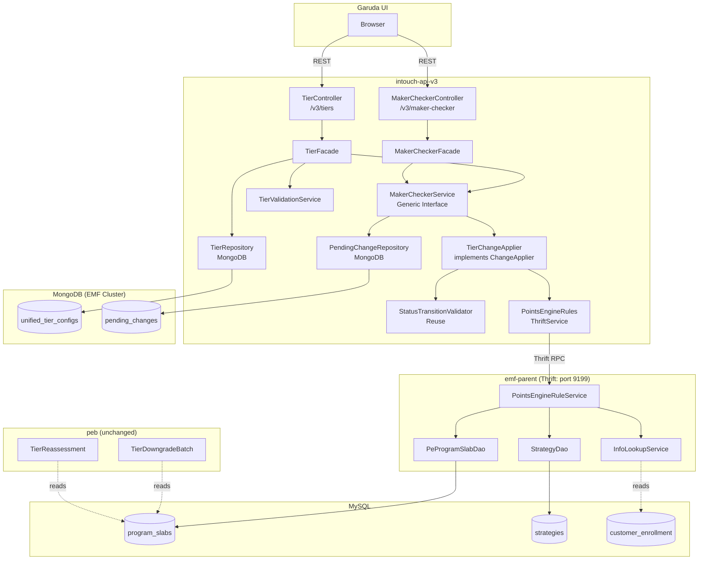
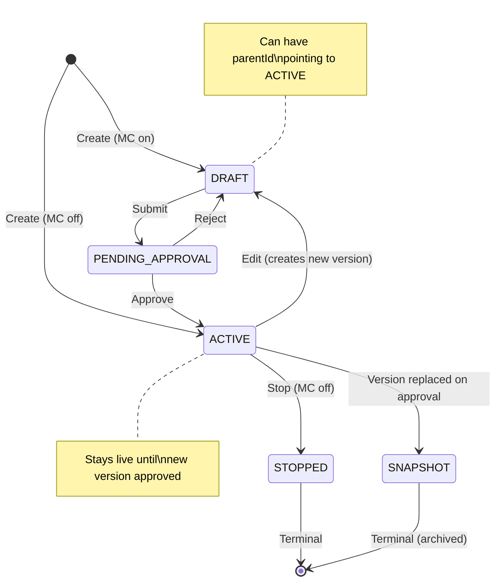

# Architecture -- Tiers CRUD + Generic Maker-Checker Framework

> Phase 6: HLD
> Feature: Tiers CRUD
> Ticket: raidlc/ai_tier
> Date: 2026-04-11
> Confidence: C6 (verified patterns, 29 decisions locked, production payload analyzed)

---

## 1. Current State Summary

### What Exists
- **ProgramSlab** entity (MySQL `program_slabs`): minimal -- id, orgId, programId, serialNumber, name, description, metadata JSON, createdOn. No status, no inline config.
- **Strategy** entities (MySQL `strategies`): 9 types storing tier behavior as JSON `propertyValues`. Key types: SLAB_UPGRADE(2) stores upgrade thresholds as CSV, SLAB_DOWNGRADE(5) stores TierConfiguration JSON with per-slab downgrade/renewal configs.
- **Thrift service** (`pointsengine_rules.thrift`): `createSlabAndUpdateStrategies`, `getAllSlabs`, `createOrUpdateSlab` methods exist. Called via `PointsEngineRulesThriftService` in intouch-api-v3.
- **UnifiedPromotion** pattern in intouch-api-v3: MongoDB draft storage, versioned editing (parentId), StatusTransitionValidator, EntityOrchestrator, @Lockable distributed lock, ResponseWrapper envelope.
- **Zero tier REST APIs** exist in intouch-api-v3. All tier operations go through internal Thrift calls.

### What We're Building
New tier CRUD REST APIs in intouch-api-v3, following the UnifiedPromotion pattern (MongoDB draft + SQL live), with a generic maker-checker framework that tiers are the first consumer of.

---

## 2. Pattern Evaluation

| Pattern | Fit | Tradeoff | Decision |
|---------|-----|----------|----------|
| Dual-storage (MongoDB + SQL) | HIGH (existing UnifiedPromotion) | Sync complexity vs draft isolation | Adopted (D-10) |
| Strategy pattern (ChangeApplier) | HIGH (existing EntityOrchestrator) | Interface overhead vs extensibility | Adopted (D-12) |
| Versioned documents (parentId) | HIGH (existing UnifiedPromotion) | Doc proliferation vs rollback safety | Adopted (D-13) |
| Expand-then-contract migration | HIGH (GUARDRAILS G-05.4) | Two-phase vs zero regression | Adopted (D-18) |
| Spring Data MongoRepository + Custom | HIGH (existing pattern) | Limitations on complex queries vs consistency | Adopted |
| Cron-based member count cache | MEDIUM | 10-min staleness vs simplicity | Adopted (D-29) |

---

## 3. System Architecture



---

## 4. Module Breakdown

### 4.1 Tier Module (intouch-api-v3)

| Component | Responsibility |
|-----------|---------------|
| `TierController` | REST endpoints: GET /v3/tiers, POST, PUT, DELETE. Auth via AbstractBaseAuthenticationToken. |
| `TierFacade` | Business logic: MC toggle check, status transitions, versioned edit orchestration, listing assembly. |
| `UnifiedTierConfig` | MongoDB @Document. Full tier config in user-friendly format. |
| `TierRepository` | Spring Data MongoRepository + custom impl for sharded access. |
| `TierValidationService` | Field-level validation: name uniqueness, threshold ordering, required fields. |
| `TierChangeApplier` | Converts MongoDB tier config -> SlabInfo + StrategyInfo. Calls Thrift to sync SQL. |
| `TierStatus` | Enum: DRAFT, PENDING_APPROVAL, ACTIVE, PAUSED, STOPPED, DELETED, SNAPSHOT. |

### 4.2 Maker-Checker Module (intouch-api-v3 -- generic, shared)

| Component | Responsibility |
|-----------|---------------|
| `MakerCheckerController` | REST endpoints: POST submit, POST approve/reject, GET pending. |
| `MakerCheckerFacade` | Orchestrates submit/approve/reject. Delegates to ChangeApplier per entity type. |
| `MakerCheckerService` | Interface: submit(), approve(), reject(), listPending(). |
| `MakerCheckerServiceImpl` | Implementation: status transitions, PendingChange persistence, ChangeApplier dispatch. |
| `ChangeApplier<T>` | Strategy interface: `apply(T payload)`. Domain-specific sync logic. |
| `PendingChange` | MongoDB @Document. entityType, entityId, payload (full snapshot), requestedBy, reviewedBy, status. |
| `PendingChangeRepository` | MongoDB repository for pending changes. |
| `NotificationHandler` | Hook interface: onSubmit, onApprove, onReject. No-op default. |
| `EntityType` | Enum: TIER, BENEFIT, SUBSCRIPTION. Extensible. |
| `ChangeStatus` | Enum: PENDING_APPROVAL, APPROVED, REJECTED. |

### 4.3 emf-parent Changes (minimal)

| Component | Change |
|-----------|--------|
| `ProgramSlab` | Add `status` field (String, default "ACTIVE") |
| `PeProgramSlabDao` | Add `findActiveByProgram(orgId, programId)` with `WHERE status = 'ACTIVE'` |
| `PointsEngineRulesThriftService` | Add wrapper methods for `createSlabAndUpdateStrategies`, `getAllSlabs`, `createOrUpdateSlab` |
| Flyway migration | `ALTER TABLE program_slabs ADD COLUMN status VARCHAR(32) NOT NULL DEFAULT 'ACTIVE'` + index |

---

## 5. MongoDB Document Schema

### 5.1 UnifiedTierConfig

```json
{
  "_id": "ObjectId",
  "unifiedTierId": "string (immutable, survives versions)",
  "orgId": "long",
  "programId": "int",
  "status": "DRAFT | PENDING_APPROVAL | ACTIVE | PAUSED | STOPPED | DELETED | SNAPSHOT",
  "parentId": "string | null (ObjectId of ACTIVE version when editing)",
  "version": "int (auto-increment per unifiedTierId)",

  "basicDetails": {
    "name": "string",
    "description": "string",
    "color": "string (#hex)",
    "serialNumber": "int (auto-assigned, immutable)",
    "startDate": "date",
    "endDate": "date | null (null = Indefinite)"
  },

  "eligibilityCriteria": {
    "criteriaType": "ACTIVITY_BASED | CURRENT_POINTS | LIFETIME_POINTS | LIFETIME_PURCHASES | TRACKER_VALUE",
    "activities": [
      {
        "type": "string (Spending, Transactions, Any Purchase, etc.)",
        "operator": "GTE | LTE | EQ | ANY",
        "value": "number | null",
        "unit": "string | null (RM, transactions, etc.)"
      }
    ],
    "activityRelation": "AND | OR",
    "membershipDuration": "string (12 months, Indefinite, etc.)",
    "upgradeSchedule": "string (Immediately when eligibility is met, etc.)",
    "nudges": "string (human-readable description)",
    "secondaryCriteriaEnabled": "boolean"
  },

  "renewalConfig": {
    "renewalCriteriaType": "string (Same as eligibility, Custom, etc.)",
    "renewalCondition": {
      "activities": "[same model as eligibility]",
      "activityRelation": "AND | OR"
    },
    "renewalSchedule": "string | null",
    "nudges": "string | null"
  },

  "downgradeConfig": {
    "downgradeTo": {
      "tierName": "string",
      "type": "SINGLE | THRESHOLD | LOWEST"
    },
    "downgradeSchedule": "MONTH_END | DAILY",
    "expiryReminders": "string | null",
    "shouldDowngrade": "boolean"
  },

  "benefitIds": ["string (benefit ObjectIds)"],

  "memberStats": {
    "memberCount": "int (cached)",
    "lastRefreshed": "date"
  },

  "engineConfig": {
    "_comment": "Hidden engine configs preserved for round-trip fidelity",
    "retainPoints": "boolean",
    "isDowngradeOnReturnEnabled": "boolean",
    "isDowngradeOnPartnerProgramExpiryEnabled": "boolean",
    "isAdvanceSetting": "boolean",
    "addDefaultCommunication": "boolean",
    "slabUpgradeMode": "string (EAGER | DYNAMIC | LAZY) -- program-level upgrade mode",
    "periodConfig": {
      "type": "FIXED | SLAB_UPGRADE | SLAB_UPGRADE_CYCLIC | FIXED_CUSTOMER_REGISTRATION",
      "value": "int",
      "unit": "NUM_MONTHS",
      "startDate": "date | null",
      "computationWindowStartValue": "int | null",
      "computationWindowEndValue": "int | null",
      "minimumDuration": "int"
    },
    "downgradeEngineConfig": {
      "_comment": "Engine-level downgrade settings not surfaced in UI downgradeConfig",
      "isActive": "boolean -- master toggle for downgrade section",
      "conditionAlways": "boolean -- if true, downgrade condition is always evaluated",
      "conditionValues": {
        "purchase": "string (threshold or empty)",
        "numVisits": "string (threshold or empty)",
        "points": "string (threshold or empty)",
        "trackerCount": "[int] (tracker-based condition values)"
      },
      "renewalOrderString": "string (renewal evaluation order)"
    },
    "expressionRelation": "[[int]] | null",
    "customExpression": "string | null",
    "isFixedTypeWithoutYear": "boolean",
    "renewalWindowType": "string",
    "notificationConfig": {
      "_comment": "Per-channel notification config for engine sync",
      "sms": { "template": "string", "senderId": "string", "domain": "string" },
      "email": { "subject": "string", "body": "string", "templateId": "long", "senderId": "string" },
      "weChat": { "template": "string", "originalId": "string", "brandId": "string" },
      "mobilePush": { "androidBlob": "string", "iosBlob": "string", "accountId": "string" }
    }
  },

  "metadata": {
    "createdBy": "string (userId)",
    "createdAt": "date",
    "updatedBy": "string",
    "updatedAt": "date",
    "updatedViaNewUI": "boolean (always true for new APIs)",
    "comments": "string | null (MC approval/rejection comment)",
    "sqlSlabId": "int | null (set after first SQL sync -- the ProgramSlab.id)"
  }
}
```

### 5.2 PendingChange (Generic MC)

```json
{
  "_id": "ObjectId",
  "orgId": "long",
  "programId": "int",
  "entityType": "TIER | BENEFIT | SUBSCRIPTION",
  "entityId": "string (the unifiedTierId or equivalent)",
  "changeType": "CREATE | UPDATE | DELETE",
  "payload": "{ full snapshot of the entity document }",
  "status": "PENDING_APPROVAL | APPROVED | REJECTED",
  "requestedBy": "string (userId)",
  "requestedAt": "date",
  "reviewedBy": "string | null",
  "reviewedAt": "date | null",
  "comment": "string | null (required on reject)"
}
```

---

## 6. API Design

### 6.1 Tier CRUD

| Method | Path | Purpose | Auth | MC Behavior |
|--------|------|---------|------|-------------|
| GET | `/v3/tiers?programId={id}&status={filter}` | List tiers with config + KPIs | IntouchUser | Read-only |
| POST | `/v3/tiers` | Create tier | IntouchUser | MC on: DRAFT. MC off: ACTIVE + Thrift sync. |
| PUT | `/v3/tiers/{tierId}` | Edit tier | IntouchUser | MC on: versioned DRAFT. MC off: immediate + Thrift sync. |
| DELETE | `/v3/tiers/{tierId}` | Soft-delete | IntouchUser | MC on: PendingChange. MC off: immediate STOPPED. |

### 6.2 Maker-Checker (Generic)

| Method | Path | Purpose | Auth |
|--------|------|---------|------|
| POST | `/v3/maker-checker/submit` | Submit for approval | IntouchUser |
| POST | `/v3/maker-checker/{changeId}/approve` | Approve | IntouchUser (approver role) |
| POST | `/v3/maker-checker/{changeId}/reject` | Reject (comment required) | IntouchUser (approver role) |
| GET | `/v3/maker-checker/pending?entityType=TIER&programId={id}` | List pending | IntouchUser |

### 6.3 Response Envelope

All responses use `ResponseWrapper<T>`:
```json
{
  "data": { ... },
  "errors": [ { "code": 123, "message": "..." } ],
  "warnings": [ { "message": "..." } ]
}
```

---

## 7. TierChangeApplier Design

### 7.1 CREATE Flow (Validated)

```
TierChangeApplier.applyCreate(UnifiedTierConfig doc):
  1. Fetch current strategies: getAllConfiguredStrategies(programId, orgId)
  
  2. Build SlabInfo:
     name, description, colorCode, serialNumber, updatedViaNewUI=true
  
  3. Build SLAB_UPGRADE StrategyInfo (type 2):
     - Read current threshold_values CSV
     - Append new tier's threshold at end
     - Preserve current_value_type, expression_relation
  
  4. Build SLAB_DOWNGRADE StrategyInfo (type 5):
     - Parse current TierConfiguration JSON
     - Add new slab entry to slabs[] array
     - Set shouldDowngrade, downgradeTarget, periodConfig, conditions
  
  5. Call Thrift: createSlabAndUpdateStrategies(
       programId, orgId, slabInfo,
       [upgradeStrategy, downgradeStrategy],
       lastModifiedBy, lastModifiedOn, serverReqId)
     
     Execution order (verified from code):
     a. Updates SLAB_UPGRADE strategy (new threshold)
     b. Updates SLAB_DOWNGRADE strategy (new slab entry)
     c. Creates ProgramSlab record
     d. updateStrategiesForNewSlab() auto-extends
        POINT_ALLOCATION + POINT_EXPIRY CSVs
  
  6. Store sqlSlabId in MongoDB doc metadata
```

### 7.2 UPDATE Flow

```
TierChangeApplier.applyUpdate(UnifiedTierConfig newDoc, UnifiedTierConfig activeDoc):
  1. Build SlabInfo with changes (name, description, color)
  
  2. If eligibility changed:
     - Fetch SLAB_UPGRADE strategy
     - Replace threshold at CSV position (serialNumber - 2)
     - Build updated StrategyInfo
  
  3. If downgrade changed:
     - Fetch SLAB_DOWNGRADE strategy (TierConfiguration JSON)
     - Find slab entry by slabNumber, update it
     - Build updated StrategyInfo
  
  4. Call createSlabAndUpdateStrategies with SlabInfo + modified strategies
  
  5. Version swap: newDoc -> ACTIVE, activeDoc -> SNAPSHOT
```

### 7.3 DELETE (STOP) Flow

```
TierChangeApplier.applyStop(UnifiedTierConfig doc):
  1. Validate: no PartnerProgramSlabs reference this slab (409 if exist)
  
  2. Update ProgramSlab status to STOPPED via Thrift:
     - Call createOrUpdateSlab with status field
     - OR: may need new Thrift method for status-only update (TBD)
  
  3. Update MongoDB doc status to STOPPED
  
  4. Flag members in stopped tier for reassessment
     (trigger PEB via existing mechanisms)
```

---

## 8. Status State Machine



---

## 9. Architecture Decision Records (ADRs)

### ADR-01: Dual-Storage (MongoDB + SQL)
**Decision**: Tier configurations stored in MongoDB during draft lifecycle, synced to SQL on approval.
**Context**: The existing engine (emf-parent, peb) reads from SQL. The new UI/API needs draft/approval workflows.
**Alternatives**: (a) SQL-only with draft table (tight coupling), (b) MongoDB-only (breaks engine), (c) CQRS with event sourcing (over-engineering).
**Rationale**: Follows UnifiedPromotion pattern. MongoDB provides flexible document storage for rich config. SQL provides the stable, indexed storage the engine needs. Sync is explicit via Thrift on approval.
**Per**: Decision D-10, verified against UnifiedPromotion.java.

### ADR-02: Generic Maker-Checker Framework
**Decision**: Build entity-agnostic MC framework with ChangeApplier strategy pattern.
**Context**: Tiers need approval workflow. Benefits, subscriptions will need it later.
**Alternatives**: (a) Tier-specific MC (faster, refactor later), (b) Copy UnifiedPromotion MC pattern (inconsistent).
**Rationale**: Same developer (Ritwik) owns MC framework as Layer 1 shared module in registry. Building generic from the start avoids refactoring when benefits arrives.
**Per**: Decision D-12, registry epic-assignment.json.

### ADR-03: Expand-Then-Contract Migration
**Decision**: Add `status` column to `program_slabs` with DEFAULT 'ACTIVE'. Add new `findActiveByProgram()` DAO method. Do NOT modify existing `findByProgram()`.
**Context**: PeProgramSlabDao used in 7+ services. Modifying existing queries risks regression in core engine.
**Alternatives**: (a) Modify all existing queries (high blast radius), (b) Database view (added complexity).
**Rationale**: Zero regression risk. Existing engine callers see all slabs (correct for serial number ordering). New APIs use the filtered method. Per GUARDRAILS G-05.4.
**Per**: Decision D-18, Critic C-3.

### ADR-04: Versioned Edits with parentId
**Decision**: Editing an ACTIVE tier creates a new DRAFT document with parentId pointing to the ACTIVE. ACTIVE stays live until new version approved.
**Context**: Tier config changes are high-risk. Need rollback capability and zero-downtime editing.
**Alternatives**: (a) In-place edit with MC (no rollback), (b) Immediate snapshot (downtime gap during approval).
**Rationale**: Zero downtime. Full version history. Consistent with UnifiedPromotion pattern.
**Per**: Decision D-13, D-24 (Flow A confirmed).

### ADR-05: Existing Thrift Methods (No IDL Change)
**Decision**: Use existing `createSlabAndUpdateStrategies`, `getAllSlabs`, `createOrUpdateSlab` from `pointsengine_rules.thrift`. Add Java wrapper methods in `PointsEngineRulesThriftService`.
**Context**: Phase 2 Critic flagged missing Thrift methods (C-1). Phase 5 research found they already exist in a different Thrift file.
**Alternatives**: (a) New Thrift method (unnecessary), (b) Direct DB access (breaks service boundary), (c) REST endpoint on emf-parent (inconsistent).
**Rationale**: Methods exist. Only need Java wrappers. Lowest scope, lowest risk.
**Per**: Phase 5 critical finding, revised C-1.

### ADR-06: New Programs Only
**Decision**: The new tier CRUD system (MongoDB draft -> SQL live) applies to new programs only. Existing programs continue using the current system.
**Context**: Existing programs have tier config in SQL only, with no MongoDB documents.
**Alternatives**: (a) Bootstrap sync existing programs to MongoDB (migration risk), (b) Dual-read from MongoDB and SQL (complexity).
**Rationale**: User directive. No migration risk. Clean separation between old and new flows.
**Per**: Decision D-23 (user override).

### ADR-07: TierChangeApplier Uses Single Atomic Thrift Call
**Decision**: `createSlabAndUpdateStrategies` is called as a single atomic operation, passing SlabInfo + [SLAB_UPGRADE, SLAB_DOWNGRADE] strategies. Points strategies (allocation, redemption, expiry) are NOT passed -- the engine auto-extends them.
**Context**: Creating a slab requires both the slab record and strategy updates. Splitting into multiple calls creates inconsistency windows.
**Alternatives**: (a) Multiple separate Thrift calls (inconsistency risk), (b) Transaction across calls (not supported in Thrift).
**Rationale**: The existing method handles atomicity. Verified execution order: update strategies first, create slab second (which triggers CSV extension internally). All in one transaction.
**Per**: Phase 5 deep dive, Flow 1 validation.

---

## 10. Implementation Plan

### Layer 1: Generic Maker-Checker Framework (can start immediately)
1. `EntityType` enum, `ChangeStatus` enum
2. `PendingChange` MongoDB document
3. `PendingChangeRepository`
4. `ChangeApplier<T>` strategy interface
5. `MakerCheckerService` interface + `MakerCheckerServiceImpl`
6. `NotificationHandler` hook interface + no-op default
7. `MakerCheckerController` REST endpoints
8. `StatusTransitionValidator` -- extend existing or create tier-specific

### Layer 2: Tier CRUD (can start in parallel with Layer 1 using interfaces)
1. `TierStatus` enum
2. `UnifiedTierConfig` MongoDB document (full schema from Section 5.1)
3. `TierRepository` + `TierRepositoryImpl` (sharded MongoDB)
4. `TierValidationService`
5. `TierFacade` -- listing, creation, editing, deletion logic
6. `TierController` REST endpoints
7. `TierChangeApplier` -- MongoDB -> Thrift conversion (Section 7)

### Layer 3: emf-parent Changes
1. Flyway migration: `ALTER TABLE program_slabs ADD COLUMN status`
2. `ProgramSlab.java`: add status field
3. `PeProgramSlabDao.java`: add `findActiveByProgram()`
4. `PointsEngineRulesThriftService`: add wrapper methods for slab Thrift calls

### Layer 4: Integration + Cache
1. Member count cache job (cron every 10 min)
2. End-to-end testing: create tier -> submit -> approve -> verify SQL

---

## 11. Risks & Mitigations

| Risk | Severity | Mitigation |
|------|----------|-----------|
| R1: CSV index off-by-one | HIGH | Unit test with 3,4,5+ slabs. serialNumber-2 = CSV index. |
| R2: Downgrade strategy monolith | MEDIUM | @Lockable on TierChangeApplier methods. |
| R3: Strategy ID preservation | MEDIUM | Always fetch existing strategy ID before update. |
| R4: CSV positions on soft-delete | LOW | Never remove positions. Document in code comments. |
| R5: Legacy API in separate service | LOW | Our listing reads MongoDB, not legacy API. |

---

## 12. Done Criteria

- [ ] `GET /v3/tiers?programId={id}` returns all tiers with full config and KPIs
- [ ] `POST /v3/tiers` creates a tier (DRAFT with MC, ACTIVE without MC)
- [ ] `PUT /v3/tiers/{tierId}` edits with versioning (ACTIVE -> new DRAFT)
- [ ] `DELETE /v3/tiers/{tierId}` soft-deletes (STOPPED)
- [ ] Generic MC framework: submit, approve, reject, list pending
- [ ] MC toggle per-program + per-entity-type
- [ ] TierChangeApplier syncs MongoDB -> SQL via Thrift
- [ ] Flyway migration adds status column (expand-then-contract)
- [ ] All tests pass (unit + integration)
- [ ] PartnerProgramSlab block validation on stop
- [ ] Member count cache refreshes every 10 min
