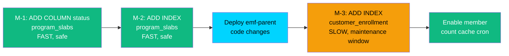

# ~~Migration Planning -- Tiers CRUD~~ NOT NEEDED (Rework #3)

> Phase 6b: Schema migration analysis
> Date: 2026-04-11
> Source: 01-architect.md (ADR-03), 02-analyst.md (R4)
>
> **Rework #3 (2026-04-16)**: M-1 (status column) and M-2 (status index) REMOVED from scope.
> SQL only contains ACTIVE tiers (synced via Thrift on approval). No ACTIVE tier can be deleted.
> No PAUSED/STOPPED states exist. SlabInfo Thrift has no status field. Every row in program_slabs
> is always active. Deferred to future tier retirement epic.
> M-3 (customer_enrollment index) may still be needed for member count cache — evaluate when implementing.

---

## Migration Tool

**Finding**: emf-parent does NOT use Flyway or Liquibase. No migration framework was found in pom.xml. Schema changes are likely applied via manual SQL scripts through the deployment pipeline or JPA auto-DDL.

**Recommendation**: Create SQL migration scripts as standalone `.sql` files in a new `scripts/migrations/` directory within the pipeline artifacts. Document the execution order and provide rollback scripts. The team applies these manually during deployment.

---

## Migration Inventory

| # | Table | Change | Type | Risk | Priority |
|---|-------|--------|------|------|----------|
| M-1 | program_slabs | ADD COLUMN status | ALTER TABLE | LOW (expand-only, default value) | P0 -- required before any tier CRUD code |
| M-2 | program_slabs | ADD INDEX on (org_id, program_id, status) | CREATE INDEX | LOW (additive, covers new queries) | P0 -- required for findActiveByProgram() |
| M-3 | customer_enrollment | ADD INDEX on (org_id, program_id, current_slab_id, is_active) | CREATE INDEX | MEDIUM (large table, index build time) | P1 -- required for member count cache |

---

## M-1: Add status column to program_slabs

### Forward Migration

```sql
-- M-1: Add status column to program_slabs
-- Expand-then-contract: Phase 1 (expand only)
-- Per ADR-03: existing rows default to 'ACTIVE', existing queries unchanged
-- Per GUARDRAILS G-05.4: backward-compatible, no column rename or removal

ALTER TABLE program_slabs 
ADD COLUMN status VARCHAR(32) NOT NULL DEFAULT 'ACTIVE';
```

### Backward Compatible?
YES. All existing rows get `status = 'ACTIVE'`. Existing queries that do not reference the `status` column continue to work identically. The JPA entity's `findByProgram()` JPQL query `SELECT s FROM ProgramSlab s WHERE s.pk.orgId = ?1 AND s.program.pk.id = ?2` does not filter by status, so it returns the same results as before.

### Rollback

```sql
-- M-1 Rollback: Remove status column
-- CAUTION: Only safe if no code is using the status column yet
ALTER TABLE program_slabs DROP COLUMN status;
```

### Risk Assessment
- **Data loss on rollback**: None. The `status` column only contains default values ('ACTIVE') until the new tier CRUD APIs start writing other values (DRAFT, DELETED, etc.).
- **Table lock duration**: `ALTER TABLE ADD COLUMN` with a DEFAULT value is typically fast in MySQL 8.0+ (instant DDL). In MySQL 5.7, it may require a table copy for large tables.
- **Table size check**: `program_slabs` is a small table (typically 3-10 rows per program, total rows in the low thousands across all orgs). ALTER is safe.

---

## M-2: Add index on program_slabs (org_id, program_id, status)

### Forward Migration

```sql
-- M-2: Add index for findActiveByProgram() queries
-- Covers: SELECT ... WHERE org_id = ? AND program_id = ? AND status = 'ACTIVE'
-- Also useful for: listing tiers by status filter

CREATE INDEX idx_program_slabs_org_program_status 
ON program_slabs (org_id, program_id, status);
```

### Backward Compatible?
YES. Adding an index is purely additive. Does not change query behavior, only improves performance.

### Rollback

```sql
-- M-2 Rollback: Remove index
DROP INDEX idx_program_slabs_org_program_status ON program_slabs;
```

### Risk Assessment
- **Index build time**: Very fast. `program_slabs` is a small table.
- **Write overhead**: Negligible. Slab creation is rare (new tiers added infrequently).

---

## M-3: Add index on customer_enrollment (member count cache)

### Forward Migration

```sql
-- M-3: Covering index for member count cache refresh query
-- Covers: SELECT current_slab_id, COUNT(*) 
--         FROM customer_enrollment 
--         WHERE org_id = ? AND program_id = ? AND is_active = true 
--         GROUP BY current_slab_id
-- 
-- WARNING: customer_enrollment is a LARGE table (millions of rows)
-- Index build may take significant time. Run during maintenance window.

CREATE INDEX idx_ce_org_program_slab_active 
ON customer_enrollment (org_id, program_id, current_slab_id, is_active);
```

### Backward Compatible?
YES. Additive index only. Existing queries benefit from or ignore the index.

### Rollback

```sql
-- M-3 Rollback: Remove index
DROP INDEX idx_ce_org_program_slab_active ON customer_enrollment;
```

### Risk Assessment
- **Index build time**: MEDIUM-HIGH. `customer_enrollment` is a large, frequently-written table. Index creation on millions of rows may take minutes to hours depending on table size and hardware. **Use `ALGORITHM=INPLACE, LOCK=NONE` on MySQL 5.7+ to avoid blocking writes.**
- **Disk space**: The index adds storage proportional to the number of rows. For millions of rows, this could be hundreds of MB.
- **Write overhead**: LOW-MEDIUM. Every INSERT/UPDATE on customer_enrollment that touches these columns will also update the index. Given the table is already heavily indexed (current_slab_id has a FK), the marginal overhead is acceptable.

### Recommended Execution

```sql
-- For MySQL 5.7+ (online DDL):
ALTER TABLE customer_enrollment 
ADD INDEX idx_ce_org_program_slab_active (org_id, program_id, current_slab_id, is_active),
ALGORITHM=INPLACE, LOCK=NONE;
```

This allows the index to be built without blocking concurrent reads or writes.

---

## Execution Order



**Execution sequence:**
1. **M-1 + M-2**: Run together before code deployment. Both are fast and safe on the small `program_slabs` table. Takes seconds.
2. **Deploy emf-parent code**: Deploy the ProgramSlab + status field and findActiveByProgram() DAO method. Code is backward-compatible with or without the status column (DEFAULT 'ACTIVE' ensures consistency).
3. **M-3**: Run during maintenance window or off-peak hours. This is the only migration with significant duration due to `customer_enrollment` table size.
4. **Enable cache cron**: Start the member count refresh job only after M-3 index is in place (otherwise the GROUP BY query would be a full table scan).

---

## Estimated Duration

| Migration | Table Size | Duration Estimate | Downtime? |
|-----------|-----------|-------------------|-----------|
| M-1 | Small (~1K rows) | < 1 second | No |
| M-2 | Small (~1K rows) | < 1 second | No |
| M-3 | Large (~10M+ rows) | 5-30 minutes (online DDL) | No (ALGORITHM=INPLACE) |

---

## Idempotency

All migrations are idempotent if wrapped with existence checks:

```sql
-- Idempotent M-1
SET @col_exists = (SELECT COUNT(*) FROM INFORMATION_SCHEMA.COLUMNS 
    WHERE TABLE_NAME = 'program_slabs' AND COLUMN_NAME = 'status');
SET @sql = IF(@col_exists = 0, 
    'ALTER TABLE program_slabs ADD COLUMN status VARCHAR(32) NOT NULL DEFAULT ''ACTIVE''',
    'SELECT ''Column already exists''');
PREPARE stmt FROM @sql;
EXECUTE stmt;
DEALLOCATE PREPARE stmt;
```

---

## Summary

- **3 migrations** planned (2 fast + 1 requires maintenance window)
- **All backward-compatible** (expand-only, additive indexes)
- **All have rollback scripts** (DROP COLUMN, DROP INDEX)
- **Execution order**: M-1,M-2 -> Deploy code -> M-3 -> Enable cache
- **No data migration needed** (existing rows default to ACTIVE)
- **emf-parent has no Flyway/Liquibase** -- scripts are standalone SQL applied via deployment pipeline
