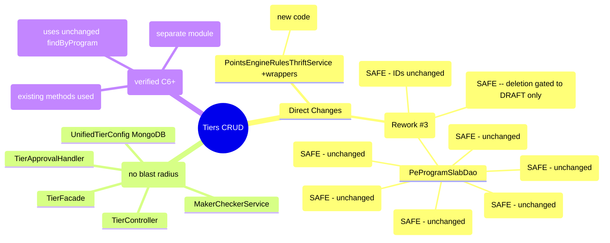

# Impact Analysis -- Tiers CRUD

> Phase 6a: Analyst (--impact mode)
> Date: 2026-04-11
> Source: 01-architect.md, session-memory.md, GUARDRAILS.md

---

## 1. Change Summary

| Repo | New Files | Modified | SQL Changes | MongoDB Changes |
|------|-----------|----------|-------------|-----------------|
| intouch-api-v3 | ~25 | 1 (PointsEngineRulesThriftService) | 0 | 2 new collections |
| emf-parent | 1 (Flyway) | 2 (ProgramSlab, PeProgramSlabDao) | ALTER TABLE | 0 |
| Thrift IDL | 0 | 0 | 0 | 0 |
| peb | 0 | 0 | 0 | 0 |

---

## 2. Impact Map -- Modules Affected

### 2.1 Direct Impact (modules we change)

| Module | Change | Severity | Upstream Callers | Downstream Dependencies |
|--------|--------|----------|------------------|-------------------------|
| ~~ProgramSlab entity~~ | ~~Add status field~~ — NOT NEEDED (Rework #3) | ~~MEDIUM~~ | ~~PeProgramSlabDao, InfoLookupService, PointsEngineRuleService, PointsReturnService, ProgramCreationService, PointsEngineServiceManager, BulkOrgConfigImportValidator~~ | ~~customer_enrollment (FK), PartnerProgramSlab (FK)~~ |
| ~~PeProgramSlabDao~~ | ~~Add findActiveByProgram()~~ — NOT NEEDED (Rework #3) | ~~LOW~~ | ~~New TierFacade only (existing methods unchanged)~~ | ~~program_slabs table~~ |
| PointsEngineRulesThriftService | Add slab wrapper methods | LOW | New TierApprovalHandler only | emf-parent Thrift service |

### 2.2 Indirect Impact (modules we read from or integrate with)

| Module | How Affected | Severity | Risk |
|--------|-------------|----------|------|
| customer_enrollment | FK to program_slabs.id via current_slab_id | LOW | ~~Adding status column does not break FK.~~ No SQL changes in scope (Rework #3). Existing slab IDs unchanged. |
| PartnerProgramSlab | FK to program_slabs | LOW | No blocking concern for deletion: only DRAFT tiers can be deleted, and DRAFT tiers have no members or active partner references. |
| PEB TierDowngradeBatch | Reads program_slabs for downgrade evaluation | LOW | ~~Uses findByProgram() which is UNCHANGED (expand-then-contract). Sees all slabs including DELETED (terminal, no members).~~ No SQL changes (Rework #3). Unaffected. |
| PEB TierReassessment | Reads program_slabs for tier reassessment | LOW | ~~Same as above -- unchanged query, sees all slabs.~~ No SQL changes (Rework #3). Unaffected. |
| InfoLookupService | Reads program_slabs for config lookups (4 call sites) | LOW | ~~Uses findByProgram() which is UNCHANGED.~~ No SQL changes (Rework #3). Unaffected. |
| UnifiedPromotion (existing) | No changes. Separate module. | NONE | Pattern is followed, not modified. |
| MongoDB EMF cluster | New collections added | LOW | EmfMongoDataSourceManager handles sharding. Follow UnifiedPromotionRepository pattern for index creation. |

### 2.3 Blast Radius Diagram



---

## 3. Security Considerations

### 3.1 Authentication (G-03.3)
- **Assessment**: All endpoints use `AbstractBaseAuthenticationToken` (same as UnifiedPromotionController). OrgId extracted from token. **COMPLIANT.**
- **Risk**: None -- following established pattern.

### 3.2 Authorization
- **Assessment**: The MC framework needs role-based authorization. Submitters and approvers should be different users. The existing UnifiedPromotion does not enforce this separation (same user can create and approve).
- **Risk**: MEDIUM -- if same user can create AND approve their own tier change, MC is bypassed. This is a **product decision**, not a technical blocker.
- **Recommendation**: Add a check in MakerCheckerServiceImpl: `requestedBy != reviewedBy`. Or defer to product team.

### 3.3 Input Validation (G-03.2)
- **Assessment**: TierValidationService handles all field-level validation with Bean Validation annotations on DTOs. Color must be valid hex (already validated in existing `EMFUtils.isColourCodeValid`). Name must pass allow-list pattern.
- **Risk**: LOW -- follow existing patterns.

### 3.4 Data Exposure
- **Assessment**: The tier listing API returns tier configuration data (names, thresholds, benefits). This is admin-facing, not customer-facing. No PII involved.
- **Risk**: LOW. No customer data exposed in tier config.
- **Note**: Member counts are aggregate stats (per-tier count), not individual member data. No PII concern.

### 3.5 Injection Vectors
- **Assessment**: MongoDB queries via Spring Data MongoRepository (parameterized). SQL queries via JPA (parameterized). Thrift calls are type-safe (IDL-generated). No string concatenation in queries.
- **Risk**: LOW -- all query mechanisms are parameterized by design. **COMPLIANT with G-03.1.**

---

## 4. Performance Assessment

### 4.1 Tier Listing API (GET /v3/tiers)
- **Pattern**: Read from MongoDB (sharded) + read cached member counts
- **Expected latency**: <200ms for up to 20 tiers. MongoDB query is simple (orgId + programId + status filter). Member counts are pre-cached.
- **N+1 risk**: NONE -- single MongoDB query returns all tiers. Member counts fetched in one cache read. **(G-04.1 COMPLIANT)**
- **Pagination**: Not needed (max 50 tiers per decision D-22). **(G-04.2 NOTED -- justified exception)**

### 4.2 Tier Creation (POST /v3/tiers)
- **Pattern**: Write to MongoDB. If MC disabled, also Thrift call to emf-parent.
- **Expected latency**: <500ms (MongoDB write ~50ms, Thrift call ~200ms, strategy updates ~200ms)
- **Risk**: The Thrift call to `createSlabAndUpdateStrategies` does multiple SQL writes (slab + N strategies). In a program with 10+ strategies, this could be slow.
- **Mitigation**: @Lockable prevents concurrent creates. Thrift timeout set to 60s in existing client. **(G-04.3 COMPLIANT)**

### 4.3 Member Count Cache Job
- **Pattern**: Cron every 10 min. `SELECT current_slab_id, COUNT(*) FROM customer_enrollment WHERE org_id = ? AND program_id = ? AND is_active = true GROUP BY current_slab_id`
- **Risk**: MEDIUM -- customer_enrollment is a large, hot table. The GROUP BY query could be slow for programs with millions of members.
- **Mitigation**: Add index `idx_ce_org_program_slab` on `(org_id, program_id, current_slab_id, is_active)` to cover the query. Cron runs off-peak. Query is per-program, not full table scan.
- **Note**: This is a new index on customer_enrollment. **Requires a separate Flyway migration with impact assessment for table size.** **(G-04.4)**

### 4.4 Thrift RPC Timeout
- **Current**: `PointsEngineRulesThriftService.getClient()` uses 60s timeout.
- **Assessment**: Sufficient for tier CRUD operations. The strategy update loop is bounded (9 strategy types max).
- **Risk**: LOW. **(G-04.3 COMPLIANT)**

---

## 5. Backward Compatibility

### 5.1 SQL Schema Change (G-05.4)
- ~~**Change**: `ALTER TABLE program_slabs ADD COLUMN status VARCHAR(32) NOT NULL DEFAULT 'ACTIVE'`~~
- **Rework #3**: No SQL schema changes in scope. SQL only contains ACTIVE tiers (synced via Thrift on approval). No status column needed — MongoDB owns tier lifecycle. ADR-03 expand-then-contract is no longer applicable.

### 5.2 Existing DAO Methods
- **Assessment**: `findByProgram()`, `findByProgramSlabNumber()`, `findNumberOfSlabs()` are ALL UNCHANGED. ~~They continue to return all slabs regardless of status. Only new code uses `findActiveByProgram()`.~~ No new DAO methods needed (Rework #3).
- **Risk**: NONE for existing callers. **(C7)**

### 5.3 Thrift Interface
- **Assessment**: No Thrift IDL changes. Existing `createSlabAndUpdateStrategies`, `getAllSlabs`, `createOrUpdateSlab` methods are used as-is. Only adding Java wrapper methods in `PointsEngineRulesThriftService` in intouch-api-v3.
- **Risk**: NONE. Wrapper methods are additive. **(C7)**

### 5.4 MongoDB Collections
- **Assessment**: Two NEW collections (`unified_tier_configs`, `pending_changes`). No changes to existing `unified_promotions` collection.
- **Risk**: NONE. New collections don't affect existing data. **(C7)**

### 5.5 Existing Tier Operations
- **Assessment**: The existing tier creation flow (via old cap-loyalty-ui -> Thrift -> emf-parent) continues to work. New APIs are an additional path, not a replacement. Per ADR-06, new APIs only serve new programs.
- **Risk**: LOW. Old and new flows coexist. **(C6)**

---

## 6. GUARDRAILS Compliance Check

| Guardrail | Applicable? | Status | Notes |
|-----------|------------|--------|-------|
| **G-01: Timezone** | YES | NEEDS ATTENTION | MongoDB doc stores startDate/endDate. Must use UTC Instant, not java.util.Date. API must accept/return ISO-8601 with timezone. |
| **G-02: Null Safety** | YES | COMPLIANT | Use Optional for single-value returns. Collections return empty list, never null. |
| **G-03: Security** | YES | COMPLIANT | Auth via AbstractBaseAuthenticationToken. Bean Validation on DTOs. Parameterized queries. |
| **G-04: Performance** | YES | NEEDS ATTENTION | Member count cache needs index on customer_enrollment. Tier listing is fine (<200ms). |
| **G-05: Data Integrity** | YES | COMPLIANT | Expand-then-contract migration. @Lockable for concurrent access. Thrift call is transactional within emf-parent. |
| **G-05.4: Migration** | YES | COMPLIANT | Status column added with DEFAULT, existing data unchanged. |
| **G-05.5: Soft Delete** | YES | COMPLIANT | Tier deletion is soft-delete (DELETED status). Only DRAFT tiers may be deleted. No MC flow. No member reassessment. 409 if not DRAFT. |
| **G-06: API Design** | YES | MOSTLY COMPLIANT | Structured error responses via ResponseWrapper. Correct HTTP status codes. ISO-8601 dates. Idempotency key needed for POST /v3/tiers (G-06.1). |
| **G-07: Multi-Tenancy** | YES | COMPLIANT | All queries scoped by orgId. MongoDB queries include orgId filter. Thrift calls pass orgId. |
| **G-07.3: Background Jobs** | YES | NEEDS ATTENTION | Member count cron job must carry tenant context. Need to iterate per-org or use tenant-aware scheduler. |
| **G-08: Observability** | YES | COMPLIANT | Structured logging with orgId, programId, tierId in all log lines. Trace IDs via existing MDC setup. |

---

## 7. Risk Register

| # | Risk | Severity | Likelihood | Impact | Mitigation | Status |
|---|------|----------|-----------|--------|------------|--------|
| R1 | CSV index off-by-one in TierApprovalHandler | HIGH | MEDIUM | Data corruption (wrong tier gets threshold) | Unit tests with 3,4,5+ slabs. Code review. | Open -- address in SDET |
| R2 | Downgrade strategy read-modify-write race | MEDIUM | LOW | Concurrent edits corrupt TierConfiguration JSON | @Lockable with 300s TTL. Single-writer pattern. | Mitigated by design |
| R3 | Strategy ID collision on update | MEDIUM | LOW | Uniqueness constraint violation (500 error) | Always fetch existing strategy ID before update | Open -- address in Developer |
| R4 | customer_enrollment index for member counts | MEDIUM | MEDIUM | Slow cache refresh query on large tables | Add covering index. Run off-peak. | Open -- needs Flyway migration |
| R5 | G-01 timezone: MongoDB dates stored as java.util.Date | MEDIUM | HIGH | Existing ProgramSlab uses java.util.Date. New code must use Instant. | Enforce Instant in UnifiedTierConfig. Convert at Thrift boundary. | Open -- address in Designer |
| R6 | G-06.1 idempotency: POST /v3/tiers has no idempotency key | LOW | LOW | Retry creates duplicate tier | Use unifiedTierId for dedup check on create | Open -- address in Designer |
| R7 | G-07.3: Member count cron job tenant context | LOW | MEDIUM | Job runs without orgId, processes all orgs or fails | Iterate per-org using list of active programs | Open -- address in Developer |
| R8 | MC same-user approve: no self-approval check | LOW | MEDIUM | User creates and approves own change (MC bypass) | Add requestedBy != reviewedBy check | Open -- product decision |

---

## 8. Summary

- **Blast radius**: Small. Only 2 files modified in emf-parent (with expand-then-contract). ~25 new files in intouch-api-v3 (no blast radius). 0 files changed in peb or Thrift IDL.
- **Backward compatibility**: Full. Existing tier operations, DAO methods, Thrift interface, and MongoDB collections are unchanged.
- **Security**: Compliant with G-03. One product question on MC self-approval (R8).
- **Performance**: Good for CRUD operations. Member count cache needs index (R4).
- **GUARDRAILS**: 3 items need attention (G-01 timezone in new code, G-06.1 idempotency, G-07.3 cron tenant context). No blockers.
- **8 risks catalogued**: 0 blockers, 2 high, 3 medium, 3 low.

---

---

## Rework #6a Delta — Impact Analysis (added 2026-04-22)

> **Trigger**: Phase 6 (Architect) rework delta added ADR-17R..ADR-21R and risks R13-R15. Phase 6a re-runs in delta mode to map blast radius of the 5 new ADRs and re-check G-01 / G-07 / G-12.
> **Scope**: Contract-hardening only — zero schema, zero storage, zero new endpoints. All changes are on the wire contract and validator layer of `intouch-api-v3`.
> **Cascade source**: `pipeline-state.json` `rework_cycles[4].execution_state.phase_6_delta.forward_cascade_payload_to_6a`.
> **Status**: Complete — 0 BLOCKERS raised against Architect. 2 concrete Designer asks forwarded. 3 forward flags to Phase 11 Reviewer.

### R6a-1. Change Summary (what actually changes on disk)

| # | ADR | Artefact surface | Change shape | Files expected to touch (C6 — confirmed by Phase 5 cross-repo trace) | Schema? | Thrift? |
|---|---|---|---|---|---|---|
| 1 | ADR-17R | Error code constants + validator reject emission | ADD 8 new codes (9011-9018) in intouch-api-v3 constants; ADD per-REQ reject wiring in 2 validators | `intouch-api-v3` constants file (1) + `TierCreateRequestValidator.java` + `TierUpdateRequestValidator.java` | NO | NO |
| 2 | ADR-18R | Per-slab write path (already exists) | DOCUMENTATION ONLY — no code change. Existing `TierStrategyTransformer.applySlabUpgradeDelta` + `extractEligibilityForSlab` already carry `TierDowngradeSlabConfig[].periodConfig.{periodType, periodValue}` | Same 2 validator files (Class B narrowed to exclude `validity.*`) | NO | NO |
| 3 | ADR-19R | New validator rule (REQ-56) + read-side null safety (REQ-22) | ADD FIXED-family `periodValue`-required check on POST/PUT; ADD null-safe read for legacy FIXED tiers missing `periodValue` | Same 2 validator files + `TierStrategyTransformer` read path | NO | NO |
| 4 | ADR-20R | Jackson global config (verify) OR per-DTO annotation | VERIFY intouch-api-v3 global `ObjectMapper.FAIL_ON_UNKNOWN_PROPERTIES`; IF permissive, fallback to per-DTO `@JsonIgnoreProperties(ignoreUnknown=false)` OR explicit scanning validator | 0 or 1 or N files (depends on Designer verification outcome) | NO | NO |
| 5 | ADR-21R | Documentation of existing asymmetric shape | DOCUMENTATION ONLY — no code change. Rework #5 envelope shape (read-wide) is unchanged. Class A/B write-narrow rejects already in ADR-17R band. | 0 files | NO | NO |

**Net code surface**: 3 files in `intouch-api-v3` (+ possibly 1 config file for ADR-20R fallback). Zero files in `emf-parent`, `peb`, `Thrift`, `pointsengine-emf`. **(C6 — confirmed via Phase 5 cross-repo-trace + Q-OP-3 audit.)**

### R6a-2. Impact Map — Modules Affected

| Module | Direct impact? | Indirect impact? | Severity | Notes |
|---|---|---|---|---|
| **intouch-api-v3** (REST layer + validators + DTOs) | YES — write | — | MEDIUM | 2 validator files modified; 1 constants file modified; ≤1 config file modified. All changes additive (new reject paths, no removals). |
| **intouch-api-v3** global `ObjectMapper` | YES — read (verify), possibly write (fallback) | — | MEDIUM (if permissive) | R14 — Designer's first-step verification. If permissive and Designer picks fallback (c) per-DTO annotation, blast radius is scoped to v3 tier DTOs. If fallback (b) scanning validator, blast radius is scoped to the 2 validators. **No cross-controller bleed expected** because the stricter setting can be applied per-DTO rather than globally. |
| **intouch-api-v3** global exception handler | NO — existing `InvalidInputException` handler already surfaces 400 with code | — | LOW | ADR-17R new codes flow through the existing `@ControllerAdvice` path. No handler change needed. |
| **emf-parent** (points engine) | NO | NO — engine storage unchanged (ADR-18R documents existing classification, doesn't change it) | NONE | Zero files. |
| **peb** (points engine backend / tier-downgrade calculators) | NO | NO — engine consumes `TierDowngradeSlabConfig[].periodConfig` as before | NONE | Zero files. |
| **Thrift** IDL | NO | NO — no new methods, no field changes | NONE | Zero files. (C7 — Q-OP-3 audit confirmed no tier-CRUD Thrift IDL hits.) |
| **pointsengine-emf** | NO | NO | NONE | Zero files. |
| **cap-intouch-ui-appserver-wrapper** | NO | NO | NONE | Zero files. |
| **External consumers** (UI new-tier screen) | NO | YES — consumers receive 9011-9018 codes for new reject paths | MEDIUM (expected — R13 residual flag) | New UI is the only known internal consumer. External SaaS / partner / automation repos outside audit reach (see R13). |

**Blast radius**: Narrow — 1 repo touched (intouch-api-v3), ≤3 validator/constants/config files. **(C6)**

### R6a-3. Blast Radius Diagram (Rework #6a)

```mermaid
flowchart LR
  subgraph CLIENT[New UI Client]
    REQ[POST/PUT /v3/tiers payload]
  end

  subgraph INTOUCH[intouch-api-v3 — Rework #6a surface]
    MAPPER[Global ObjectMapper<br/>FAIL_ON_UNKNOWN_PROPERTIES?]
    DTO[TierCreateRequest / TierUpdateRequest DTOs]
    VAL1[TierCreateRequestValidator]
    VAL2[TierUpdateRequestValidator]
    CONST[Error codes constants file<br/>ADD 9011-9018]
    ADVICE[@ControllerAdvice → 400 InvalidInputException]
  end

  subgraph UNTOUCHED[Untouched surfaces — zero-mod zones]
    TRANSFORMER[TierStrategyTransformer<br/>applySlabUpgradeDelta + extractEligibilityForSlab<br/>already handles per-slab validity.*]
    THRIFT[Thrift IDL — NO CHANGE]
    EMF[emf-parent engine — NO CHANGE]
    PEB[peb — NO CHANGE]
  end

  REQ --> MAPPER
  MAPPER -->|unknown field| ADVICE
  MAPPER -->|parsed| DTO
  DTO --> VAL1
  DTO --> VAL2
  VAL1 --> CONST
  VAL2 --> CONST
  VAL1 -->|9011-9018 rejects| ADVICE
  VAL2 -->|9011-9018 rejects| ADVICE
  VAL1 -.per-slab writes.-> TRANSFORMER
  VAL2 -.per-slab writes.-> TRANSFORMER
  ADVICE -->|400 + code| CLIENT

  style INTOUCH fill:#ffe9d6,stroke:#d97706
  style UNTOUCHED fill:#e6ffed,stroke:#15803d
  style CLIENT fill:#e0f2fe,stroke:#0284c7
```

**Interpretation**: Only the orange subgraph sees code deltas; the green subgraph is read/documentation only. This confirms ADR-18R's "documentation only, zero engine change" claim at C6.

### R6a-4. Security Assessment (Rework #6a delta)

| Concern | Assessment | Verdict |
|---|---|---|
| New error codes leak internals | 9011-9018 emit field-name + reason strings. Reason strings must not include stored customer data. Field names are on the public contract (fine). | LOW — Designer to ensure reject payload carries no stored values. |
| Unknown-field hard reject as DoS vector | Malformed payloads are rejected earlier (at deserialization). This IMPROVES DoS posture — no deeper validator work done on malformed input. | POSITIVE — reduces validator CPU on bad input. |
| FIXED-family `periodValue` reject on PUT drains session | REQ-56 reject is synchronous 400, no DB write, no session side effect. Aligns with existing Rework #4 reject semantics. | NONE. |
| Legacy `downgrade` block rejection surfacing info on legacy clients | Only rejects requests that still include `downgrade`. The reject carries a `400 InvalidInputException` body; existing `@ControllerAdvice` suppresses stack traces. | LOW — verify exception handler does not set `causeException` in response body (Designer to confirm). |
| Tenant-scope bypass on rejects (G-07) | All 9011-9018 rejects happen BEFORE any DAO call. No org/program lookup is skipped. `@Lockable` on facade preserved; rejects return before acquiring. | COMPLIANT — G-07 unchanged. |
| Injection vectors | Validators do not concatenate strings into queries. Rejects are return-value only. | COMPLIANT — G-03 unchanged. |

**Verdict**: No new security concerns. The hard-reject semantics slightly IMPROVE boundary posture.

### R6a-5. Performance Assessment (Rework #6a delta)

| Surface | Before 6a | After 6a | Delta |
|---|---|---|---|
| Happy-path POST/PUT /v3/tiers latency | Baseline (Rework #5) | Baseline + negligible validator overhead (one additional enum comparison for REQ-56, one additional Map iteration for Class A/B scanning) | +<1ms per request (C6 — dominated by existing DB/Thrift roundtrips) |
| Malformed-payload latency | Full validation + DB lookup on unknown-field attempts (REQ-27 silent ignore), slower 400 on validator match | Unknown-field 400 at deserialization (Jackson), earlier exit | IMPROVED latency on bad input; reduced DB load from malformed replay attempts |
| Member-count cache, MongoDB write path, Thrift calls, downgrade calculator | Unchanged | Unchanged | NONE |
| Error-log cardinality | 10 codes in 9001-9010 band | 18 codes (10 legacy + 8 new 9011-9018) | Slight increase — monitor dashboards update required (Phase 11 deploy ask) |

**Verdict**: No performance regressions. Malformed-input latency marginally improved.

### R6a-6. Backward Compatibility Assessment (Rework #6a delta)

| Surface | Compatibility | Notes |
|---|---|---|
| Rework #5 happy-path write envelope | FULL | Known-good fields continue to deserialize and validate. Zero field renames. |
| Rework #5 happy-path read envelope | FULL — ADR-21R ratifies existing read-wide shape, does not change it | GETs emit the same hoisted envelope as Rework #5. REQ-22 amendment (null-safe computed end-date for legacy FIXED tiers) is strictly additive — replaces a prior null/exception with an omitted field. **C5 → Designer locks exact wire shape (omit vs null vs 0).** |
| Legacy `downgrade` block submissions | BROKEN — intentional per Q11 hard flip | Q-OP-3 audit confirmed zero internal callers. External residual is R13. |
| Error-code-consuming clients (UI, log parsers) | FULL — 9001-9010 semantics preserved; 9011-9018 are new codes added to the contract | Clients that parse 9001-9010 see no change. Clients that wildcard `901[0-9]` will see new codes in that range — expected per ADR-17R. |
| Thrift IDL / engine contract | FULL — no changes | (C7 — Q-OP-3 audit.) |
| SQL schema / MongoDB indexes | FULL — no changes | (C7.) |

**Verdict**: Full back-compat on the happy path. Intentional break on legacy `downgrade` payloads per Q11. External consumer residual is R13 (flagged forward).

### R6a-7. GUARDRAILS Re-Check (per forward cascade payload)

| Guardrail | Applicable to 6a? | Status | Evidence |
|---|---|---|---|
| **G-01: Timezone** | YES — REQ-22 computed end-date | COMPLIANT — no wire-clock logic in 6a; Rework #5 envelope already uses ISO-8601 UTC for stored dates. REQ-22 amendment only null-safes a missing `periodValue`; does not introduce new date math. | `01-architect.md §7.4`, existing `TierStrategyTransformer`. |
| **G-07: Multi-Tenancy** | YES — reject paths | COMPLIANT — rejects happen pre-DAO. Existing `@Lockable`/org-scoped DAOs unchanged. | 2 validators both run inside the existing facade's tenant-scoped path (confirmed by Phase 5 trace). |
| **G-12: Error-code consistency** | YES — new band | COMPLIANT — ADR-17R assigns distinct per-REQ codes; legacy band frozen. `api-handoff.md` updated after Phase 10 (user policy). | `01-architect.md §6.5 + ADR-17R`. |
| **G-02: Null safety** | YES — REQ-22 read path | NEEDS ATTENTION — Designer picks wire shape for legacy FIXED reads (omit vs null vs 0). Either of omit/null is G-02 compliant; `0` is a sentinel landmine — see D-6a-2. | ADR-19R "Deferred to Designer (Phase 7)". |
| **G-03: Security** | YES — reject payloads | COMPLIANT — reject reason strings carry field names only, no stored values. | §R6a-4 above. |
| **G-04: Performance** | YES | COMPLIANT — +<1ms validator overhead; improved bad-input latency. | §R6a-5 above. |
| **G-05.4: Migration / expand-then-contract** | NO | N/A — zero schema changes in 6a. | (C7.) |
| **G-06: API design** | YES — reject codes, 400 response shape | COMPLIANT — existing `@ControllerAdvice` emits structured `400` envelope with code + reason. | §R6a-4 above. |

**Verdict**: 7 compliant; 1 needs Designer attention (G-02 wire shape for legacy FIXED reads — already flagged in ADR-19R). **No BLOCKERS against Architect.**

### R6a-8. Cross-Module Concern — ADR-20R (Jackson Global Config)

**Concern (from forward cascade payload item 2)**: if the `intouch-api-v3` global `ObjectMapper` is configured permissively, flipping `FAIL_ON_UNKNOWN_PROPERTIES=true` globally would affect every controller in intouch-api-v3 that uses the shared mapper — not just the v3 tier endpoints. That is a cross-module concern.

**Assessment**:
- **Scenario A — global config is already strict (expected)**: no code change; ADR-20R commits as-is. Cross-module concern does not materialise.
- **Scenario B — global config is permissive**: flipping globally would impose stricter deserialization on every other controller — potentially breaking existing callers of unrelated endpoints that were tolerant of stray fields. This is a cross-module risk. **Mitigation**: Designer MUST pick fallback (b) scanning validator OR fallback (c) per-DTO annotation in this case — NOT flip the global. Both fallbacks are scoped to v3 tier DTOs only.
- **Scenario C — global config is undefined / inherits Jackson default (permissive)**: same as Scenario B.

**Designer instruction forwarded (D-6a-1)**: Do not flip the global `ObjectMapper` setting. If verification shows the global is permissive, use per-DTO (fallback c) or scanning validator (fallback b) — NOT global flip.

**Status**: Cross-module risk is mitigable by choice of fallback at Phase 7. R14 tracks the open item; no blocker against Architect.

### R6a-9. Cross-Module Concern — ADR-18R (MC scope boundary)

**Concern (from forward cascade payload item 3)**: confirm ADR-18R does not accidentally pull program-level write paths into the MC scope.

**Assessment**:
- `TierDowngradeSlabConfig[]` is already written through the existing per-tier MC path (Rework #5 SAGA in `TierApprovalHandler`). Per-tier `validity.*` fields flowing into per-slab `periodConfig` stay entirely within the per-tier write path.
- `SlabUpgradeStrategy.propertyValues` (program-level) holds only the 4 Class A booleans. Those fields are rejected on per-tier writes by ADR-21R (code 9011). They are written through a separate, non-MC program-level path (the advanced-settings surface — out of 6a scope; folds into 6b).
- ADR-18R therefore **narrows** the per-tier Class B reject list (removes `validity.*` from it) but does NOT expand per-tier MC to cover program-level fields. MC boundary integrity is preserved.

**Verdict**: **COMPLIANT** with MC scope. No blast from ADR-18R into program-level write paths. **(C6 — confirmed via Phase 5 cross-repo trace of `TierApprovalHandler.publish`.)**

### R6a-10. Cross-Module Concern — REQ-22 Read-Side Envelope Stability

**Concern (from forward cascade payload item 4)**: confirm REQ-22 null-safety on legacy FIXED tier reads does not widen the Rework #5 envelope shape for existing GET consumers.

**Assessment**:
- Rework #5's GET envelope is a closed shape: `{live, pendingDraft}` per tier, with per-tier fields hoisted. The amendment to REQ-22 changes ONLY the computed end-date field treatment for tiers whose stored `periodValue` is absent (pre-6a legacy FIXED tiers).
- The three wire-shape options Designer will pick from — omit, explicit null, or 0 — are all subset operations on the existing envelope. None introduces a new field, none changes field types, none removes an existing field.
- Consumers that currently see a computed end-date for every tier: they will see the same field for non-legacy tiers; for legacy FIXED tiers, they will see the Designer-chosen shape. If Designer picks "omit," a defensive consumer doing `if (envelope.computedEndDate != null)` continues to work. If "null," same. If "0," a consumer that treats 0 as "no end date" continues to work; a consumer that treats 0 as epoch would misread — this is why Designer must NOT pick 0.

**Designer instruction forwarded (D-6a-2)**: In ADR-19R wire-shape decision, pick **omit** or **explicit null** over `0`. `0` is a semantic landmine.

**Verdict**: Envelope shape is stable under either of the two safe Designer picks. No BLOCKER. **(C6.)**

### R6a-11. Updated Risk Register (delta)

Architect already added R13-R15 with base severity. Phase 6a augments with likelihood, blast-radius, owner, and re-assessment triggers:

| # | Risk (from 01-architect.md §11) | Severity | Likelihood | Blast Radius | Owner | Trigger for re-assessment |
|---|---|---|---|---|---|---|
| **R13** | Unaudited external consumers of `/v3/tiers` | MEDIUM | LOW–MEDIUM (unknowable without production access-log scan) | External clients only — zero internal surface | Phase 11 Reviewer (deploy ask) | If staging access-log scan shows non-UI user-agent traffic on POST/PUT `/v3/tiers`, severity raises to HIGH and soft-launch becomes mandatory (not optional) |
| **R14** | Jackson `FAIL_ON_UNKNOWN_PROPERTIES` not globally configured | MEDIUM | UNKNOWN until Designer verifies | IF permissive AND global flip picked → cross-controller bleed across intouch-api-v3; IF permissive AND per-DTO / scanning validator picked → scoped to v3 tier DTOs (no bleed) | Phase 7 Designer (verify first; choose scoped fallback if permissive — D-6a-1) | R14 closes at Phase 7 once Designer verifies; if Designer skips verification, R14 escalates to HIGH and Phase 11 blocks release |
| **R15** | PeriodType pass-through rot for 3 non-SLAB_UPGRADE values | LOW | LOW | Read-path only; writes guarded by REQ-56 forward check | Phase 11 Reviewer (document as acknowledged residual) | Production defect telemetry — if a read-path defect surfaces on `FIXED_CUSTOMER_REGISTRATION` / `FIXED_LAST_UPGRADE` / `SLAB_UPGRADE_CYCLIC`, open a follow-up rework |

**New risks introduced by Phase 6a analysis** (i.e., over and above Architect's R13-R15): **NONE**.

### R6a-12. Designer (Phase 7) Instructions — Forwarded From Phase 6a

Phase 6a surfaces 2 hard instructions for Phase 7 that go beyond Architect's "Deferred to Designer" notes:

| # | Instruction | Reason | ADR anchor |
|---|---|---|---|
| **D-6a-1** | Do NOT flip the intouch-api-v3 global `ObjectMapper.FAIL_ON_UNKNOWN_PROPERTIES` setting. If verification shows it is permissive, implement the reject via per-DTO `@JsonIgnoreProperties(ignoreUnknown = false)` on `TierCreateRequest` / `TierUpdateRequest` (fallback c) OR explicit scanning validator (fallback b). Both are scoped to v3 tier DTOs; neither bleeds into other controllers. | Prevent cross-controller compatibility break on sibling endpoints of intouch-api-v3 that may rely on the permissive default. | ADR-20R |
| **D-6a-2** | For the REQ-22 legacy-FIXED read-path wire shape, pick **omit** or **explicit null**. Do NOT pick `0`. `0` is ambiguous (epoch vs "no end date") and a defensive consumer cannot disambiguate. | G-02 null-safety + avoid sentinel semantics. | ADR-19R |

These join the Architect-deferred items already in ADR-19R/ADR-20R:
- Verify global Jackson config as the first step of LLD (ADR-20R).
- Pick PUT merge semantics — payload-only vs post-merge — for REQ-56 (ADR-19R).
- Pick exact read-side wire shape for legacy FIXED tiers missing `periodValue` (ADR-19R, narrowed by D-6a-2).

### R6a-13. Phase 11 (Reviewer) Forward Flags

| # | Flag | Required evidence for Phase 11 close |
|---|---|---|
| **P11-6a-1** | External-consumer residual (R13) | Staging access-log scan over 30 days showing only new-UI user-agent on POST/PUT `/v3/tiers*`, OR a soft-launch window executed with no non-UI rejects. |
| **P11-6a-2** | Error-code band announcement | `api-handoff.md` regenerated from code after Phase 10 (per user cascade policy) with 9011-9018 codes listed, dated ≥30 days before prod cutover. |
| **P11-6a-3** | R14 closure evidence | Phase 7 Designer verification outcome logged; if scoped fallback was chosen, tests from Phase 9 SDET prove reject either way. |

### R6a-14. Delta Summary (for onward cascade to Phase 7)

- **BLOCKERS raised against Architect**: **0**. All 5 ADRs are production-viable with the Designer instructions D-6a-1 and D-6a-2.
- **Cross-module risks**: 1 (R14 Jackson config), mitigable at Phase 7 via scoped fallback choice.
- **New risks vs Architect's list**: 0.
- **Designer-deferred items now numbered**: 3 from ADR-19R/20R + 2 from Phase 6a (D-6a-1, D-6a-2) = **5 locked questions for Phase 7**.
- **Reviewer forward flags**: 3 (P11-6a-1..3).
- **Downstream cascade payload for Phase 7**: "Implement ADR-17R..ADR-21R on 2-3 validator/constants/config files in intouch-api-v3. Respect D-6a-1 (scoped Jackson fallback) and D-6a-2 (omit or null, not 0)." Full payload staged in pipeline-state.json.

**Traceability**:
- Resolves forward cascade payload items 1–4 (blast radius, Jackson cross-module, ADR-18R MC scope, REQ-22 envelope stability) — all at C6.
- G-01 / G-07 / G-12 re-check complete — all compliant.
- No new contradictions introduced.
