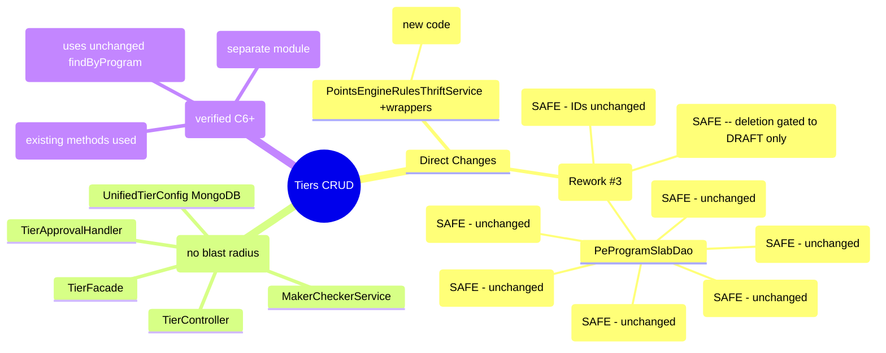

# Impact Analysis -- Tiers CRUD

> Phase 6a: Analyst (--impact mode)
> Date: 2026-04-11
> Source: 01-architect.md, session-memory.md, GUARDRAILS.md

---

## 1. Change Summary

| Repo | New Files | Modified | SQL Changes | MongoDB Changes |
|------|-----------|----------|-------------|-----------------|
| intouch-api-v3 | ~25 | 1 (PointsEngineRulesThriftService) | 0 | 2 new collections |
| emf-parent | 1 (Flyway) | 2 (ProgramSlab, PeProgramSlabDao) | ALTER TABLE | 0 |
| Thrift IDL | 0 | 0 | 0 | 0 |
| peb | 0 | 0 | 0 | 0 |

---

## 2. Impact Map -- Modules Affected

### 2.1 Direct Impact (modules we change)

| Module | Change | Severity | Upstream Callers | Downstream Dependencies |
|--------|--------|----------|------------------|-------------------------|
| ~~ProgramSlab entity~~ | ~~Add status field~~ — NOT NEEDED (Rework #3) | ~~MEDIUM~~ | ~~PeProgramSlabDao, InfoLookupService, PointsEngineRuleService, PointsReturnService, ProgramCreationService, PointsEngineServiceManager, BulkOrgConfigImportValidator~~ | ~~customer_enrollment (FK), PartnerProgramSlab (FK)~~ |
| ~~PeProgramSlabDao~~ | ~~Add findActiveByProgram()~~ — NOT NEEDED (Rework #3) | ~~LOW~~ | ~~New TierFacade only (existing methods unchanged)~~ | ~~program_slabs table~~ |
| PointsEngineRulesThriftService | Add slab wrapper methods | LOW | New TierApprovalHandler only | emf-parent Thrift service |

### 2.2 Indirect Impact (modules we read from or integrate with)

| Module | How Affected | Severity | Risk |
|--------|-------------|----------|------|
| customer_enrollment | FK to program_slabs.id via current_slab_id | LOW | ~~Adding status column does not break FK.~~ No SQL changes in scope (Rework #3). Existing slab IDs unchanged. |
| PartnerProgramSlab | FK to program_slabs | LOW | No blocking concern for deletion: only DRAFT tiers can be deleted, and DRAFT tiers have no members or active partner references. |
| PEB TierDowngradeBatch | Reads program_slabs for downgrade evaluation | LOW | ~~Uses findByProgram() which is UNCHANGED (expand-then-contract). Sees all slabs including DELETED (terminal, no members).~~ No SQL changes (Rework #3). Unaffected. |
| PEB TierReassessment | Reads program_slabs for tier reassessment | LOW | ~~Same as above -- unchanged query, sees all slabs.~~ No SQL changes (Rework #3). Unaffected. |
| InfoLookupService | Reads program_slabs for config lookups (4 call sites) | LOW | ~~Uses findByProgram() which is UNCHANGED.~~ No SQL changes (Rework #3). Unaffected. |
| UnifiedPromotion (existing) | No changes. Separate module. | NONE | Pattern is followed, not modified. |
| MongoDB EMF cluster | New collections added | LOW | EmfMongoDataSourceManager handles sharding. Follow UnifiedPromotionRepository pattern for index creation. |

### 2.3 Blast Radius Diagram

---

## 3. Security Considerations

### 3.1 Authentication (G-03.3)
- **Assessment**: All endpoints use `AbstractBaseAuthenticationToken` (same as UnifiedPromotionController). OrgId extracted from token. **COMPLIANT.**
- **Risk**: None -- following established pattern.

### 3.2 Authorization
- **Assessment**: The MC framework needs role-based authorization. Submitters and approvers should be different users. The existing UnifiedPromotion does not enforce this separation (same user can create and approve).
- **Risk**: MEDIUM -- if same user can create AND approve their own tier change, MC is bypassed. This is a **product decision**, not a technical blocker.
- **Recommendation**: Add a check in MakerCheckerServiceImpl: `requestedBy != reviewedBy`. Or defer to product team.

### 3.3 Input Validation (G-03.2)
- **Assessment**: TierValidationService handles all field-level validation with Bean Validation annotations on DTOs. Color must be valid hex (already validated in existing `EMFUtils.isColourCodeValid`). Name must pass allow-list pattern.
- **Risk**: LOW -- follow existing patterns.

### 3.4 Data Exposure
- **Assessment**: The tier listing API returns tier configuration data (names, thresholds, benefits). This is admin-facing, not customer-facing. No PII involved.
- **Risk**: LOW. No customer data exposed in tier config.
- **Note**: Member counts are aggregate stats (per-tier count), not individual member data. No PII concern.

### 3.5 Injection Vectors
- **Assessment**: MongoDB queries via Spring Data MongoRepository (parameterized). SQL queries via JPA (parameterized). Thrift calls are type-safe (IDL-generated). No string concatenation in queries.
- **Risk**: LOW -- all query mechanisms are parameterized by design. **COMPLIANT with G-03.1.**

---

## 4. Performance Assessment

### 4.1 Tier Listing API (GET /v3/tiers)
- **Pattern**: Read from MongoDB (sharded) + read cached member counts
- **Expected latency**: <200ms for up to 20 tiers. MongoDB query is simple (orgId + programId + status filter). Member counts are pre-cached.
- **N+1 risk**: NONE -- single MongoDB query returns all tiers. Member counts fetched in one cache read. **(G-04.1 COMPLIANT)**
- **Pagination**: Not needed (max 50 tiers per decision D-22). **(G-04.2 NOTED -- justified exception)**

### 4.2 Tier Creation (POST /v3/tiers)
- **Pattern**: Write to MongoDB. If MC disabled, also Thrift call to emf-parent.
- **Expected latency**: <500ms (MongoDB write ~50ms, Thrift call ~200ms, strategy updates ~200ms)
- **Risk**: The Thrift call to `createSlabAndUpdateStrategies` does multiple SQL writes (slab + N strategies). In a program with 10+ strategies, this could be slow.
- **Mitigation**: @Lockable prevents concurrent creates. Thrift timeout set to 60s in existing client. **(G-04.3 COMPLIANT)**

### 4.3 Member Count Cache Job
- **Pattern**: Cron every 10 min. `SELECT current_slab_id, COUNT(*) FROM customer_enrollment WHERE org_id = ? AND program_id = ? AND is_active = true GROUP BY current_slab_id`
- **Risk**: MEDIUM -- customer_enrollment is a large, hot table. The GROUP BY query could be slow for programs with millions of members.
- **Mitigation**: Add index `idx_ce_org_program_slab` on `(org_id, program_id, current_slab_id, is_active)` to cover the query. Cron runs off-peak. Query is per-program, not full table scan.
- **Note**: This is a new index on customer_enrollment. **Requires a separate Flyway migration with impact assessment for table size.** **(G-04.4)**

### 4.4 Thrift RPC Timeout
- **Current**: `PointsEngineRulesThriftService.getClient()` uses 60s timeout.
- **Assessment**: Sufficient for tier CRUD operations. The strategy update loop is bounded (9 strategy types max).
- **Risk**: LOW. **(G-04.3 COMPLIANT)**

---

## 5. Backward Compatibility

### 5.1 SQL Schema Change (G-05.4)
- ~~**Change**: `ALTER TABLE program_slabs ADD COLUMN status VARCHAR(32) NOT NULL DEFAULT 'ACTIVE'`~~
- **Rework #3**: No SQL schema changes in scope. SQL only contains ACTIVE tiers (synced via Thrift on approval). No status column needed — MongoDB owns tier lifecycle. ADR-03 expand-then-contract is no longer applicable.

### 5.2 Existing DAO Methods
- **Assessment**: `findByProgram()`, `findByProgramSlabNumber()`, `findNumberOfSlabs()` are ALL UNCHANGED. ~~They continue to return all slabs regardless of status. Only new code uses `findActiveByProgram()`.~~ No new DAO methods needed (Rework #3).
- **Risk**: NONE for existing callers. **(C7)**

### 5.3 Thrift Interface
- **Assessment**: No Thrift IDL changes. Existing `createSlabAndUpdateStrategies`, `getAllSlabs`, `createOrUpdateSlab` methods are used as-is. Only adding Java wrapper methods in `PointsEngineRulesThriftService` in intouch-api-v3.
- **Risk**: NONE. Wrapper methods are additive. **(C7)**

### 5.4 MongoDB Collections
- **Assessment**: Two NEW collections (`unified_tier_configs`, `pending_changes`). No changes to existing `unified_promotions` collection.
- **Risk**: NONE. New collections don't affect existing data. **(C7)**

### 5.5 Existing Tier Operations
- **Assessment**: The existing tier creation flow (via old cap-loyalty-ui -> Thrift -> emf-parent) continues to work. New APIs are an additional path, not a replacement. Per ADR-06, new APIs only serve new programs.
- **Risk**: LOW. Old and new flows coexist. **(C6)**

---

## 6. GUARDRAILS Compliance Check

| Guardrail | Applicable? | Status | Notes |
|-----------|------------|--------|-------|
| **G-01: Timezone** | YES | NEEDS ATTENTION | MongoDB doc stores startDate/endDate. Must use UTC Instant, not java.util.Date. API must accept/return ISO-8601 with timezone. |
| **G-02: Null Safety** | YES | COMPLIANT | Use Optional for single-value returns. Collections return empty list, never null. |
| **G-03: Security** | YES | COMPLIANT | Auth via AbstractBaseAuthenticationToken. Bean Validation on DTOs. Parameterized queries. |
| **G-04: Performance** | YES | NEEDS ATTENTION | Member count cache needs index on customer_enrollment. Tier listing is fine (<200ms). |
| **G-05: Data Integrity** | YES | COMPLIANT | Expand-then-contract migration. @Lockable for concurrent access. Thrift call is transactional within emf-parent. |
| **G-05.4: Migration** | YES | COMPLIANT | Status column added with DEFAULT, existing data unchanged. |
| **G-05.5: Soft Delete** | YES | COMPLIANT | Tier deletion is soft-delete (DELETED status). Only DRAFT tiers may be deleted. No MC flow. No member reassessment. 409 if not DRAFT. |
| **G-06: API Design** | YES | MOSTLY COMPLIANT | Structured error responses via ResponseWrapper. Correct HTTP status codes. ISO-8601 dates. Idempotency key needed for POST /v3/tiers (G-06.1). |
| **G-07: Multi-Tenancy** | YES | COMPLIANT | All queries scoped by orgId. MongoDB queries include orgId filter. Thrift calls pass orgId. |
| **G-07.3: Background Jobs** | YES | NEEDS ATTENTION | Member count cron job must carry tenant context. Need to iterate per-org or use tenant-aware scheduler. |
| **G-08: Observability** | YES | COMPLIANT | Structured logging with orgId, programId, tierId in all log lines. Trace IDs via existing MDC setup. |

---

## 7. Risk Register

| # | Risk | Severity | Likelihood | Impact | Mitigation | Status |
|---|------|----------|-----------|--------|------------|--------|
| R1 | CSV index off-by-one in TierApprovalHandler | HIGH | MEDIUM | Data corruption (wrong tier gets threshold) | Unit tests with 3,4,5+ slabs. Code review. | Open -- address in SDET |
| R2 | Downgrade strategy read-modify-write race | MEDIUM | LOW | Concurrent edits corrupt TierConfiguration JSON | @Lockable with 300s TTL. Single-writer pattern. | Mitigated by design |
| R3 | Strategy ID collision on update | MEDIUM | LOW | Uniqueness constraint violation (500 error) | Always fetch existing strategy ID before update | Open -- address in Developer |
| R4 | customer_enrollment index for member counts | MEDIUM | MEDIUM | Slow cache refresh query on large tables | Add covering index. Run off-peak. | Open -- needs Flyway migration |
| R5 | G-01 timezone: MongoDB dates stored as java.util.Date | MEDIUM | HIGH | Existing ProgramSlab uses java.util.Date. New code must use Instant. | Enforce Instant in UnifiedTierConfig. Convert at Thrift boundary. | Open -- address in Designer |
| R6 | G-06.1 idempotency: POST /v3/tiers has no idempotency key | LOW | LOW | Retry creates duplicate tier | Use unifiedTierId for dedup check on create | Open -- address in Designer |
| R7 | G-07.3: Member count cron job tenant context | LOW | MEDIUM | Job runs without orgId, processes all orgs or fails | Iterate per-org using list of active programs | Open -- address in Developer |
| R8 | MC same-user approve: no self-approval check | LOW | MEDIUM | User creates and approves own change (MC bypass) | Add requestedBy != reviewedBy check | Open -- product decision |

---

## 8. Summary

- **Blast radius**: Small. Only 2 files modified in emf-parent (with expand-then-contract). ~25 new files in intouch-api-v3 (no blast radius). 0 files changed in peb or Thrift IDL.
- **Backward compatibility**: Full. Existing tier operations, DAO methods, Thrift interface, and MongoDB collections are unchanged.
- **Security**: Compliant with G-03. One product question on MC self-approval (R8).
- **Performance**: Good for CRUD operations. Member count cache needs index (R4).
- **GUARDRAILS**: 3 items need attention (G-01 timezone in new code, G-06.1 idempotency, G-07.3 cron tenant context). No blockers.
- **8 risks catalogued**: 0 blockers, 2 high, 3 medium, 3 low.
