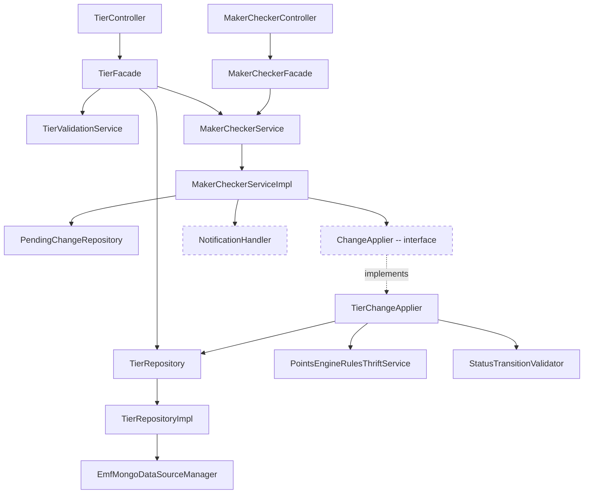

# Low-Level Design -- Tiers CRUD + Generic Maker-Checker

> Phase 7: LLD (Designer)
> Date: 2026-04-11
> Source: 01-architect.md, code-analysis-intouch-api-v3.md

---

## 1. Package Structure

```
com.capillary.intouchapiv3/
  resources/
    TierController.java                    -- REST endpoints for /v3/tiers
    MakerCheckerController.java            -- REST endpoints for /v3/maker-checker
  tier/
    UnifiedTierConfig.java                 -- MongoDB @Document
    TierFacade.java                        -- Business logic orchestrator
    TierRepository.java                    -- MongoRepository interface
    TierRepositoryCustom.java              -- Custom query interface
    TierRepositoryImpl.java                -- Sharded MongoDB implementation
    TierChangeApplier.java                 -- ChangeApplier impl (MongoDB -> Thrift -> SQL)
    TierValidationService.java             -- Field-level validation
    dto/
      TierCreateRequest.java               -- POST request body
      TierUpdateRequest.java               -- PUT request body
      TierListResponse.java                -- GET response wrapper
      KpiSummary.java                      -- KPI stats in listing response
    model/
      BasicDetails.java                    -- name, desc, color, serial, startDate, endDate
      TierEligibilityConfig.java           -- kpiType (String), threshold, upgradeType, conditions
      TierCondition.java                   -- type (String), value, trackerName
      TierValidityConfig.java              -- periodType (String), periodValue, startDate, endDate, renewal
      TierRenewalConfig.java               -- criteriaType (String), expressionRelation, conditions, schedule
      TierDowngradeConfig.java             -- target (String), reevaluateOnReturn, dailyEnabled, conditions
      TierNudgesConfig.java                -- upgradeNotification, renewalReminder, expiryWarning, downgradeConfirmation
      MemberStats.java                     -- cached member count
      EngineConfig.java                    -- hidden engine configs for round-trip
      TierMetadata.java                    -- created/updated by, sqlSlabId
    enums/
      TierStatus.java                      -- DRAFT, PENDING_APPROVAL, ACTIVE, DELETED, SNAPSHOT
  makerchecker/
    MakerCheckerService.java               -- Generic interface
    MakerCheckerServiceImpl.java           -- Implementation
    MakerCheckerFacade.java                -- Request orchestration
    ChangeApplier.java                     -- Strategy interface
    PendingChange.java                     -- MongoDB @Document
    PendingChangeRepository.java           -- MongoRepository
    NotificationHandler.java               -- Hook interface
    NoOpNotificationHandler.java           -- Default no-op impl
    dto/
      SubmitChangeRequest.java
      ApprovalRequest.java
      RejectionRequest.java
    enums/
      EntityType.java                      -- TIER, BENEFIT, SUBSCRIPTION
      ChangeType.java                      -- CREATE, UPDATE, DELETE
      ChangeStatus.java                    -- PENDING_APPROVAL, APPROVED, REJECTED
```

---

## 2. Key Interface Contracts

### 2.1 ChangeApplier (Generic Strategy)

```java
package com.capillary.intouchapiv3.makerchecker;

/**
 * Strategy interface for domain-specific change application on MC approval.
 * Each entity type (TIER, BENEFIT, etc.) provides its own implementation.
 *
 * @param <T> The entity document type (e.g., UnifiedTierConfig)
 */
public interface ChangeApplier<T> {

    /**
     * Apply a pending change (sync to backend on approval).
     * Called by MakerCheckerService when a PendingChange is approved.
     *
     * @param change The approved PendingChange document
     * @param orgId Organization ID from auth context
     * @return The updated entity after backend sync
     * @throws ServiceException if sync fails (triggers rollback)
     */
    T apply(PendingChange change, long orgId);

    /**
     * Revert a change on rejection (cleanup if needed).
     * Default: no-op (most rejections just change status).
     */
    default void revert(PendingChange change, long orgId) {}

    /**
     * Entity type this applier handles.
     */
    EntityType getEntityType();
}
```

### 2.2 MakerCheckerService

```java
package com.capillary.intouchapiv3.makerchecker;

import java.util.List;

public interface MakerCheckerService {

    PendingChange submit(long orgId, EntityType entityType, String entityId,
                         ChangeType changeType, Object payload, String requestedBy);

    PendingChange approve(long orgId, String changeId, String reviewedBy, String comment);

    PendingChange reject(long orgId, String changeId, String reviewedBy, String comment);

    List<PendingChange> listPending(long orgId, EntityType entityType, Integer programId);

    boolean isMakerCheckerEnabled(long orgId, int programId, EntityType entityType);
}
```

### 2.3 TierFacade

```java
package com.capillary.intouchapiv3.tier;

@Component
public class TierFacade {

    // Dependencies (all @Autowired)
    private TierRepository tierRepository;
    private TierValidationService validationService;
    private MakerCheckerService makerCheckerService;
    private TierChangeApplier tierChangeApplier;
    private StatusTransitionValidator statusTransitionValidator;

    /** List all tiers for a program with KPI summary and member stats */
    public TierListResponse listTiers(long orgId, int programId, List<TierStatus> statusFilter);

    /** Create a new tier. MC enabled: DRAFT. MC disabled: ACTIVE + sync. */
    public UnifiedTierConfig createTier(long orgId, TierCreateRequest request, String userId);

    /** Edit a tier. DRAFT: in-place. ACTIVE: versioned (new DRAFT with parentId). */
    public UnifiedTierConfig updateTier(long orgId, String tierId, TierUpdateRequest request, String userId);

    /** Delete a DRAFT tier (set DELETED). DRAFT only — 409 if not DRAFT. No MC flow. */
    public void deleteTier(long orgId, String tierId, String userId);
}
```

### 2.4 TierChangeApplier

```java
package com.capillary.intouchapiv3.tier;

@Component
@Slf4j
public class TierChangeApplier implements ChangeApplier<UnifiedTierConfig> {

    private PointsEngineRulesThriftService thriftService;
    private TierRepository tierRepository;

    @Override
    public EntityType getEntityType() { return EntityType.TIER; }

    /**
     * Sync tier from MongoDB to SQL via Thrift.
     * Uses @Lockable to prevent concurrent syncs for same program.
     */
    @Lockable(key = "'lock_tier_sync_' + #orgId + '_' + #change.programId", ttl = 300000, acquireTime = 5000)
    @Override
    public UnifiedTierConfig apply(PendingChange change, long orgId) {
        // 1. Deserialize payload to UnifiedTierConfig
        // 2. Build SlabInfo from basicDetails
        // 3. Fetch current strategies, build SLAB_UPGRADE + SLAB_DOWNGRADE StrategyInfos
        // 4. Call createSlabAndUpdateStrategies (single atomic Thrift call)
        // 5. Update MongoDB doc: status -> ACTIVE, store sqlSlabId
        // 6. If versioned edit: old ACTIVE doc -> SNAPSHOT
    }
}
```

### 2.5 NotificationHandler (Hook)

```java
package com.capillary.intouchapiv3.makerchecker;

public interface NotificationHandler {
    void onSubmit(PendingChange change);
    void onApprove(PendingChange change);
    void onReject(PendingChange change);
}

// Default no-op implementation
@Component
@ConditionalOnMissingBean(NotificationHandler.class)
public class NoOpNotificationHandler implements NotificationHandler {
    public void onSubmit(PendingChange change) {}
    public void onApprove(PendingChange change) {}
    public void onReject(PendingChange change) {}
}
```

---

## 3. MongoDB Document Classes

### 3.1 UnifiedTierConfig

```java
@Data @Builder @NoArgsConstructor @AllArgsConstructor
@Document(collection = "unified_tier_configs")
public class UnifiedTierConfig {
    @Id
    private String objectId;

    @JsonProperty(access = JsonProperty.Access.READ_ONLY)
    private String unifiedTierId;      // immutable across versions

    @NotNull private Long orgId;
    @NotNull private Integer programId;
    @NotNull private TierStatus status;

    private String parentId;            // ObjectId of ACTIVE when editing
    private Integer version;

    @Valid @NotNull private BasicDetails basicDetails;
    @Valid private TierEligibilityConfig eligibility;
    @Valid private TierValidityConfig validity;
    @Valid private TierDowngradeConfig downgrade;
    @Valid private TierNudgesConfig nudges;

    private List<String> benefitIds;
    private MemberStats memberStats;
    private EngineConfig engineConfig;
    private TierMetadata metadata;
}
```

### 3.2 PendingChange

```java
@Data @Builder @NoArgsConstructor @AllArgsConstructor
@Document(collection = "pending_changes")
public class PendingChange {
    @Id
    private String objectId;

    @NotNull private Long orgId;
    private Integer programId;
    @NotNull private EntityType entityType;
    @NotNull private String entityId;
    @NotNull private ChangeType changeType;

    private Object payload;             // full snapshot (serialized entity)
    @NotNull private ChangeStatus status;

    @NotNull private String requestedBy;
    @NotNull private Instant requestedAt;
    private String reviewedBy;
    private Instant reviewedAt;

    @Size(max = 500)
    private String comment;             // required on reject
}
```

---

## 4. Enum Definitions

```java
public enum TierStatus {
    DRAFT, PENDING_APPROVAL, ACTIVE, DELETED, SNAPSHOT  // No PAUSED or STOPPED (Rework #2)
}

public enum EntityType {
    TIER, BENEFIT, SUBSCRIPTION
}

public enum ChangeType {
    CREATE, UPDATE, DELETE
}

public enum ChangeStatus {
    PENDING_APPROVAL, APPROVED, REJECTED
}

// NOTE (Rework #4 — engine realignment): CriteriaType, ActivityRelation,
// DowngradeSchedule, DowngradeTargetType enums REMOVED.
// Replaced by String fields in TierEligibilityConfig, TierDowngradeConfig, etc.
// to match the prototype pattern (flexible for UI, validated at request level).
```

---

## 5. Status Transition Rules

```java
// Extend or reuse StatusTransitionValidator
// Rework #2: Removed PAUSED, STOPPED, PAUSE, RESUME, STOP actions
private static final Map<TierStatus, Set<TierAction>> VALID_TRANSITIONS = Map.of(
    TierStatus.DRAFT,              Set.of(TierAction.SUBMIT_FOR_APPROVAL, TierAction.DELETE),
    TierStatus.PENDING_APPROVAL,   Set.of(TierAction.APPROVE, TierAction.REJECT),
    TierStatus.ACTIVE,             Set.of(TierAction.EDIT),  // No STOP or PAUSE — tier retirement deferred
    TierStatus.SNAPSHOT,           Set.of(),  // terminal (archived)
    TierStatus.DELETED,            Set.of()   // terminal (DRAFT soft-delete, audit trail preserved)
);
```

---

## 6. Thrift Wrapper Methods (add to PointsEngineRulesThriftService)

```java
// New methods to add:

public SlabInfo createSlabAndUpdateStrategies(int programId, int orgId,
        SlabInfo slabInfo, List<StrategyInfo> strategyInfos,
        int lastModifiedBy, long lastModifiedOn) throws Exception {
    String serverReqId = CapRequestIdUtil.getRequestId();
    return getClient().createSlabAndUpdateStrategies(
            programId, orgId, slabInfo, strategyInfos,
            lastModifiedBy, lastModifiedOn, serverReqId);
}

public List<SlabInfo> getAllSlabs(int programId, int orgId) throws Exception {
    String serverReqId = CapRequestIdUtil.getRequestId();
    return getClient().getAllSlabs(programId, orgId, serverReqId);
}

public SlabInfo createOrUpdateSlab(SlabInfo slabInfo, int orgId,
        int lastModifiedBy, long lastModifiedOn) throws Exception {
    String serverReqId = CapRequestIdUtil.getRequestId();
    return getClient().createOrUpdateSlab(
            slabInfo, orgId, lastModifiedBy, lastModifiedOn, serverReqId);
}
```

---

## 7. emf-parent Changes

> **Rework #3**: ProgramSlab status field and findActiveByProgram() REMOVED from scope.
> Rationale: SQL only contains ACTIVE tiers (synced via Thrift on approval). No ACTIVE tier
> can be deleted (DRAFT-only deletion). No PAUSED/STOPPED states exist. Therefore every row
> in program_slabs is always active — a status column has zero use.
> SlabInfo Thrift struct also has no status field.
> Deferred to future tier retirement epic when ACTIVE tier stopping is implemented.

**No changes to ProgramSlab.java or PeProgramSlabDao.java in current scope.**

---

## 8. Dependency Graph


