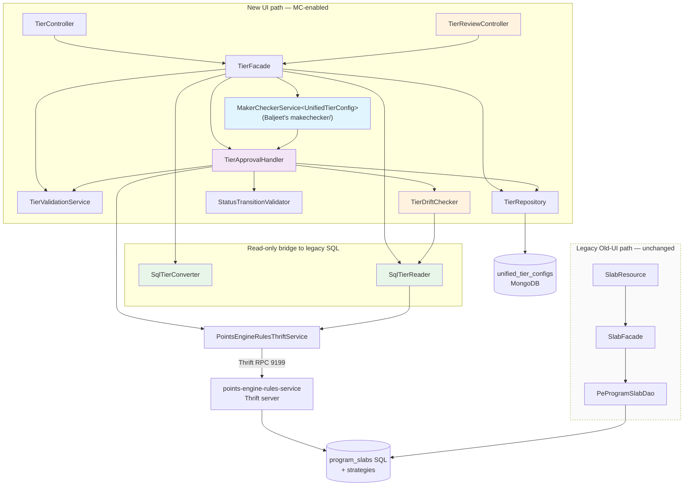

# Low-Level Design -- Tiers CRUD + Generic Maker-Checker

> Phase 7: LLD (Designer)
> Date: 2026-04-11 (updated 2026-04-17 — Rework #5 cascade)
> Source: 01-architect.md, code-analysis-intouch-api-v3.md, rework-5-scope.md
>
> **Rework trail**: #1 (MC-always), #2 (tier-retirement deferred), #3 (status removal),
> #4 (engine data-model alignment), #5 (unified read surface, dual write paths, schema cleanup).
>
> **Rework #5 summary**: LLD now reflects a *unified* read surface that serves BOTH legacy
> SQL-origin tiers AND new-UI-origin tiers via an envelope `{live, pendingDraft}` response.
> Writes split into two paths: the old UI keeps its legacy direct-SQL route (no MC), the new
> UI flows through Mongo `DRAFT` → MC → Thrift → SQL. `UnifiedTierConfig` schema is flattened
> (wrappers removed), several fields dropped, `sqlSlabId` → `slabId`, `unifiedTierId` →
> `tierUniqueId`. A new `meta.basisSqlSnapshot` enables drift detection at approval.

---

## 1. Package Structure

```
com.capillary.intouchapiv3/
  resources/
    TierController.java                    -- REST endpoints: GET /v3/tiers, GET /v3/tiers/{slabId}, POST, PUT, DELETE
    TierReviewController.java              -- REST endpoints: POST /v3/tiers/{tierId}/submit, /approve, /reject, GET /v3/tiers/approvals
  tier/
    UnifiedTierConfig.java                 -- MongoDB @Document; implements ApprovableEntity
                                           -- (Rework #5) Hoisted schema: all fields live at root; no basicDetails/metadata wrappers
    TierFacade.java                        -- Business logic orchestrator (new-UI writes only)
    TierRepository.java                    -- MongoRepository interface
    TierRepositoryCustom.java              -- Custom query interface
    TierRepositoryImpl.java                -- Sharded MongoDB implementation
    TierApprovalHandler.java               -- ApprovableEntityHandler<UnifiedTierConfig> impl (drift-check in preApprove)
    TierValidationService.java             -- Field-level validation + uniqueness + single-active-DRAFT
    SqlTierConverter.java                  -- (NEW, Rework #5) Read-only bridge: ProgramSlab → TierEnvelope for legacy tiers
    SqlTierReader.java                     -- (NEW, Rework #5) Thrift/SQL reader for LIVE tiers — calls getAllSlabs
    TierDriftChecker.java                  -- (NEW, Rework #5) Compares UnifiedTierConfig.meta.basisSqlSnapshot vs current SQL
    dto/
      TierCreateRequest.java               -- POST request body
      TierUpdateRequest.java               -- PUT request body
      TierEnvelope.java                    -- (NEW, Rework #5) {live: TierView, pendingDraft: TierView | null, hasPendingDraft: bool}
      TierView.java                        -- (NEW, Rework #5) Flat projection of a tier (fields + slabId + origin: LEGACY|NEW_UI)
      TierListResponse.java                -- GET list response wrapper: List<TierEnvelope> + KpiSummary
      KpiSummary.java                      -- KPI stats in listing response
      ApprovalRequest.java                 -- Body for /approve (approvalStatus, comment)
      RejectRequest.java                   -- (NEW, Rework #5) Body for /reject (comment)
    model/
      -- (Rework #5) DROPPED: BasicDetails.java (hoisted to root), TierMetadata.java (hoisted to root), TierNudgesConfig.java (tier no longer owns nudges)
      TierEligibilityConfig.java           -- kpiType (String), threshold, upgradeType, conditions
      TierCondition.java                   -- type (String), value, trackerName
      TierValidityConfig.java              -- periodType (String), periodValue, startDate, endDate, renewal
      TierRenewalConfig.java               -- criteriaType (String), expressionRelation, conditions  (Rework #5: `schedule` DROPPED — see TierRenewalConfig javadoc)
      TierRenewalNormalizer.java           -- (NEW, R5-R4 B1a) package-private static util; fills the B1a default on every TierFacade write path before save. See ## R5-R4 Renewal Contract section.
      TierDowngradeConfig.java             -- target (String), reevaluateOnReturn, dailyEnabled, conditions
      MemberStats.java                     -- cached member count
      EngineConfig.java                    -- hidden engine configs for round-trip
      TierMeta.java                        -- (NEW, Rework #5) Contains basisSqlSnapshot + audit (createdBy, updatedBy, approvedBy, approvedAt, rejectionComment)
      BasisSqlSnapshot.java                -- (NEW, Rework #5) {slabFields: Map<String,Object>, strategyFields: Map<String,Object>, capturedAt: Instant, capturedFromSlabId: Long|null}
    enums/
      TierStatus.java                      -- DRAFT, PENDING_APPROVAL, ACTIVE, DELETED, SNAPSHOT
                                           -- (Rework #5 note) ACTIVE is retained for back-compat but is NEVER held by a Mongo doc
                                           --                   post-Rework #5. Mongo lifecycle: PENDING_APPROVAL → SNAPSHOT direct.
      TierOrigin.java                      -- (NEW, Rework #5) LEGACY | NEW_UI — for TierView.origin

com.capillary.intouchapiv3.makechecker/  -- Baljeet's generic maker-checker package (existing — unchanged)
  MakerCheckerService<T>                   -- Generic state machine for ApprovableEntity types
  ApprovableEntity                         -- Interface: getStatus(), setStatus(), getVersion(), setVersion(), transitionToPending(), transitionToRejected(String)
  ApprovableEntityHandler<T>               -- Strategy interface: validateForSubmission(), preApprove(), publish(), postApprove(), onPublishFailure(), postReject()
  PublishResult                            -- Result of publish(): carries externalId (slabId for tiers), other metadata

-- (Rework #5) UNCHANGED (old UI legacy path — not owned by this module):
-- com.capillary.intouchapiv3.slab.* — legacy SlabResource / SlabFacade / PeProgramSlabDao direct-SQL writes. No MC, no Mongo.
-- Kept as-is; this module only reads from program_slabs via SqlTierReader.
```

---

## 2. Key Interface Contracts

### 2.1 ApprovableEntityHandler (Generic Strategy)

```java
package com.capillary.makechecker;  // Baljeet's package

/**
 * Strategy interface for domain-specific approval workflow on ApprovableEntity types.
 * Each entity type (UnifiedTierConfig, Benefit, etc.) provides its own implementation.
 *
 * @param <T> The entity document type (implements ApprovableEntity)
 */
public interface ApprovableEntityHandler<T extends ApprovableEntity> {

    /**
     * Validate entity before submission to PENDING_APPROVAL.
     * Called by MakerCheckerService when submitForApproval() is invoked.
     *
     * @param entity The entity to validate
     * @throws ValidationException if validation fails (submit request rejected)
     */
    void validateForSubmission(T entity);

    /**
     * Re-validate before approval (e.g., check uniqueness, external state).
     * Called by MakerCheckerService after loading entity and before publish().
     *
     * @param entity The entity to re-validate
     * @throws ValidationException if validation fails (approval rejected)
     */
    void preApprove(T entity);

    /**
     * Publish entity to external system (e.g., Thrift, SQL).
     * Performs SAGA phase 1: sync to backend. On error, MakerCheckerService calls onPublishFailure().
     *
     * @param entity The entity to publish
     * @return PublishResult carrying externalId and other metadata
     * @throws Exception if publish fails (triggers onPublishFailure + rethrow)
     */
    PublishResult publish(T entity);

    /**
     * Post-approval hook after successful publish.
     * SAGA phase 2: update entity status to ACTIVE, store externalId, archive old versions, etc.
     *
     * @param entity The entity (status now PENDING_APPROVAL, external ID available)
     * @param publishResult The result from publish()
     */
    void postApprove(T entity, PublishResult publishResult);

    /**
     * Error handler if publish fails.
     * SAGA phase 1 failure: log error, do NOT change status (entity stays PENDING_APPROVAL).
     *
     * @param entity The entity (status still PENDING_APPROVAL)
     * @param exception The publish exception
     */
    void onPublishFailure(T entity, Exception exception);

    /**
     * Post-rejection hook.
     * Revert entity to DRAFT and store rejection comment if needed.
     *
     * @param entity The entity (status will be set to DRAFT)
     * @param comment Rejection reason (e.g., "Invalid KPI threshold")
     */
    void postReject(T entity, String comment);
}
```

### 2.2 MakerCheckerService (Generic Framework)

```java
package com.capillary.makechecker;  // Baljeet's package

/**
 * Generic state machine for ApprovableEntity approval workflows.
 * Handles DRAFT -> PENDING_APPROVAL -> ACTIVE/REJECTED transitions.
 *
 * @param <T> The entity type (must implement ApprovableEntity)
 */
public interface MakerCheckerService<T extends ApprovableEntity> {

    /**
     * Submit entity for approval (DRAFT -> PENDING_APPROVAL).
     * Calls handler.validateForSubmission(), transitionToPending(), saves entity.
     *
     * @param entity The entity to submit
     * @param handler The approval workflow strategy
     * @param save Callback to persist entity (e.g., repository::save)
     * @throws ValidationException if validation fails
     */
    void submitForApproval(T entity, ApprovableEntityHandler<T> handler, Consumer<T> save);

    /**
     * Approve entity (PENDING_APPROVAL -> ACTIVE).
     * SAGA: calls handler.preApprove() -> handler.publish() -> handler.postApprove().
     * On publish failure: calls handler.onPublishFailure() and rethrows exception.
     *
     * @param entity The entity to approve
     * @param comment Approval comment
     * @param reviewedBy User ID of reviewer
     * @param handler The approval workflow strategy
     * @param save Callback to persist entity
     * @throws Exception if publish fails (entity stays PENDING_APPROVAL)
     */
    void approve(T entity, String comment, String reviewedBy, ApprovableEntityHandler<T> handler, Consumer<T> save);

    /**
     * Reject entity (PENDING_APPROVAL -> DRAFT).
     * Calls handler.postReject() to revert and store comment.
     *
     * @param entity The entity to reject
     * @param comment Rejection reason
     * @param reviewedBy User ID of reviewer
     * @param handler The approval workflow strategy
     * @param save Callback to persist entity
     */
    void reject(T entity, String comment, String reviewedBy, ApprovableEntityHandler<T> handler, Consumer<T> save);
}
```

### 2.3 TierFacade

> **Rework #5 note**: TierFacade owns the NEW-UI write path and the UNIFIED read path.
> Old-UI writes continue to flow through the pre-existing legacy `SlabFacade` → `PeProgramSlabDao`
> path (direct SQL, no MC, no Mongo). This facade does NOT touch that path.

```java
package com.capillary.intouchapiv3.tier;

@Component
public class TierFacade {

    // Dependencies (all @Autowired)
    private TierRepository tierRepository;
    private TierValidationService validationService;
    private MakerCheckerService<UnifiedTierConfig> makerCheckerService;
    private TierApprovalHandler tierApprovalHandler;
    private StatusTransitionValidator statusTransitionValidator;
    private PointsEngineRulesThriftService thriftService;
    private SqlTierReader sqlTierReader;              // (NEW, Rework #5) reads program_slabs via Thrift/SQL
    private SqlTierConverter sqlTierConverter;        // (NEW, Rework #5) ProgramSlab → TierView
    private TierDriftChecker tierDriftChecker;        // (NEW, Rework #5) captures + compares basisSqlSnapshot

    // --------------------------------------------------------------------
    // READ PATH (unified — serves both legacy and new-UI tiers)
    // --------------------------------------------------------------------

    /**
     * List all tiers for a program, envelope-shaped.
     * Rework #5 algorithm:
     *   1. Fetch LIVE tiers from SQL (getAllSlabs via Thrift) → Map<slabId, ProgramSlab>.
     *   2. Fetch Mongo docs for this (orgId, programId) with status IN (DRAFT, PENDING_APPROVAL).
     *   3. For each SQL slab: live = SqlTierConverter.toView(slab); attach matching Mongo draft by slabId.
     *   4. For each Mongo DRAFT of a NEW tier (slabId == null): emit envelope with live=null, pendingDraft=<view>.
     *   5. Compose {live, pendingDraft, hasPendingDraft} envelopes.
     * No N+1: two DB hits regardless of list size.
     */
    public TierListResponse listTiers(long orgId, int programId, List<TierStatus> statusFilter);

    /**
     * Get one tier by slabId (envelope-shaped).
     * Rework #5: preferred identifier is SQL slabId. For NEW tiers not yet approved
     * (no slabId), use tierUniqueId via a separate endpoint.
     */
    public TierEnvelope getTier(long orgId, int programId, long slabId);

    /**
     * Get one tier by tierUniqueId (for NEW tiers that only exist in Mongo DRAFT).
     */
    public TierEnvelope getTierByTierUniqueId(long orgId, int programId, String tierUniqueId);

    // --------------------------------------------------------------------
    // WRITE PATH (new-UI only — always goes through MC)
    // --------------------------------------------------------------------

    /**
     * Create a new tier (NEW UI). Always DRAFT.
     * - Enforces UNIQUE(orgId, programId, name) across LIVE tiers (SQL) AND existing DRAFT/PENDING (Mongo).
     * - Captures basisSqlSnapshot=null at this stage (no basis — brand-new tier).
     */
    public UnifiedTierConfig createTier(long orgId, TierCreateRequest request, String userId);

    /**
     * Edit a tier (NEW UI). Rework #5 cases:
     *   A) Mongo DRAFT exists — in-place update (no new Mongo doc, no basis re-capture).
     *   B) LIVE tier only (no Mongo doc, or doc in SNAPSHOT) — creates a NEW Mongo DRAFT with
     *      parentId = LIVE SNAPSHOT objectId (or null if new), slabId = existing SQL slab id,
     *      meta.basisSqlSnapshot = current SQL+strategy snapshot at DRAFT creation time.
     *   C) PENDING_APPROVAL exists — 409 Conflict (single-active-draft).
     * All cases enforced by TierValidationService.enforceSingleActiveDraft().
     */
    public UnifiedTierConfig updateTier(long orgId, int programId, String tierId,
                                        TierUpdateRequest request, String userId);

    /**
     * Delete a DRAFT tier (set status=DELETED). DRAFT only — 409 if not DRAFT.
     * Does NOT delete the LIVE SQL tier. LIVE tier deletion is out-of-scope (future tier retirement epic).
     */
    public void deleteTier(long orgId, String tierId, String userId);

    // --------------------------------------------------------------------
    // APPROVAL FLOW (DRAFT → PENDING_APPROVAL → SNAPSHOT + SQL write)
    // --------------------------------------------------------------------

    /** Submit tier for approval (DRAFT -> PENDING_APPROVAL). Delegates to makerCheckerService. */
    public UnifiedTierConfig submitForApproval(long orgId, String tierId, String userId);

    /** Approve tier (PENDING_APPROVAL -> SNAPSHOT + SQL write via SAGA).
     *  On publish success postApprove() writes approvedBy/approvedAt to SQL audit columns
     *  and sets Mongo doc to SNAPSHOT (Rework #5 — no ACTIVE intermediate). */
    public UnifiedTierConfig approve(long orgId, String tierId, String comment, String reviewedBy);

    /** Reject tier (PENDING_APPROVAL -> DRAFT). basisSqlSnapshot is retained for next submission cycle. */
    public UnifiedTierConfig reject(long orgId, String tierId, String comment, String reviewedBy);

    /** List all pending approvals for an org/program. Queries tiers with PENDING_APPROVAL status. */
    public List<UnifiedTierConfig> listPendingApprovals(long orgId, Integer programId);
}
```

### 2.4 TierApprovalHandler

> **Rework #5 changes**: (a) `preApprove` now performs drift-check against `meta.basisSqlSnapshot`;
> (b) `preApprove` re-checks name uniqueness as Layer 2 of the 3-layer name-collision defense
> (Layer 1 = DRAFT creation, Layer 3 = SQL `UNIQUE(program_id, name)`); (c) `preApprove` re-checks
> single-active-DRAFT; (d) `postApprove` writes SQL audit columns and transitions Mongo doc
> DIRECTLY to `SNAPSHOT` (no ACTIVE intermediate — the prior-version Mongo doc that held `SNAPSHOT`,
> if any, stays `SNAPSHOT`; the newly-approved doc is also `SNAPSHOT`, i.e. multiple SNAPSHOTs
> across history but only one LIVE in SQL).

```java
package com.capillary.intouchapiv3.tier;

@Component
@Slf4j
public class TierApprovalHandler implements ApprovableEntityHandler<UnifiedTierConfig> {

    private PointsEngineRulesThriftService thriftService;
    private TierRepository tierRepository;
    private TierValidationService validationService;
    private TierDriftChecker tierDriftChecker;          // (NEW, Rework #5)
    private SqlTierReader sqlTierReader;                // (NEW, Rework #5)

    @Override
    public void validateForSubmission(UnifiedTierConfig entity) {
        // 1. Validate hoisted fields (name, serialNumber, color, etc. — now at root)
        // 2. Validate eligibility, validity, downgrade sub-configs
        // 3. Throws ValidationException if validation fails
        validationService.validateTierFields(entity);
    }

    /**
     * preApprove runs BEFORE publish() in the SAGA. This is where we gate approval.
     * Rework #5 adds three gates in order:
     *   (G1) Drift check — reject approval if SQL state has diverged from basisSqlSnapshot.
     *   (G2) Name uniqueness re-check — Layer 2 of name-collision defense.
     *   (G3) Single-active-draft re-check — reject if another DRAFT/PENDING for same slabId
     *         slipped in (Layer 2, with Mongo partial unique index as Layer 3 backstop).
     * All gates throw domain exceptions that translate to HTTP 409 (ApprovalBlocked).
     */
    @Override
    public void preApprove(UnifiedTierConfig entity) {
        // G1 — Drift check (Rework #5 Q-2a)
        // Applies only to edits of existing LIVE tiers (slabId != null AND basisSqlSnapshot != null).
        // Brand-new tiers skip drift check (no basis to compare).
        if (entity.getSlabId() != null && entity.getMeta() != null
                && entity.getMeta().getBasisSqlSnapshot() != null) {
            BasisSqlSnapshot basis = entity.getMeta().getBasisSqlSnapshot();
            DriftResult drift = tierDriftChecker.checkDrift(
                entity.getOrgId(), entity.getProgramId(), entity.getSlabId(), basis
            );
            if (drift.hasDrift()) {
                throw new ApprovalBlockedException(
                    "APPROVAL_BLOCKED_DRIFT",
                    "LIVE tier was modified after this draft was created. Fields changed: "
                        + drift.getChangedFieldsSummary()
                        + ". Cancel this draft and re-create against current live state."
                );
            }
        }

        // G2 — Name uniqueness re-check (Layer 2 of 3-layer defense, Rework #5 Q-1b sub-part)
        // Excludes entity itself and its parent (if this is a versioned edit).
        // Checks BOTH SQL (LIVE) and Mongo (DRAFT/PENDING for other tiers in same program).
        validationService.validateNameUniquenessUnified(
            entity.getOrgId(), entity.getProgramId(),
            entity.getName(), entity.getId(), entity.getParentId()
        );

        // G3 — Single-active-draft re-check (Rework #5 Q-9a/b)
        // For edits: ensure no OTHER DRAFT or PENDING_APPROVAL doc exists for the same slabId.
        if (entity.getSlabId() != null) {
            validationService.enforceSingleActiveDraft(
                entity.getOrgId(), entity.getProgramId(), entity.getSlabId(), entity.getId()
            );
        }
    }

    /**
     * Sync tier from MongoDB to SQL via Thrift (SAGA phase 1 — ATOMIC).
     * Uses @Lockable to prevent concurrent syncs for same program.
     * Returns PublishResult with externalId = slabId for later postApprove() use.
     *
     * Phase 2AB (2026-04-20): Rewritten to single-atomic flow. Previously split into
     * createOrUpdateSlab + separate strategy update (split-brain on second-call failure).
     * Now: read-modify-write on strategies in memory, then submit slabInfo + both
     * strategies in one createSlabAndUpdateStrategies Thrift call (single engine tx).
     * See HLD §7.5 for the complete flow.
     */
    @Lockable(key = "'lock_tier_sync_' + #entity.orgId + '_' + #entity.programId", ttl = 300000, acquireTime = 5000)
    @Override
    public PublishResult publish(UnifiedTierConfig entity) throws Exception {
        // 1. Build SlabInfo from entity's hoisted fields (name, color, serial, etc.)
        SlabInfo slabInfo = buildSlabInfo(entity);
        int programId = entity.getProgramId();
        int orgIdInt  = entity.getOrgId().intValue();
        int slabNumber = entity.getSerialNumber();

        // 2. CREATE vs UPDATE discriminator — sets slabInfo.id when UPDATE.
        boolean isCreate = resolveSlabIdAndDiscriminate(entity, slabInfo);

        // 3. Fetch current program-level strategies (not cached — Q-R4).
        List<StrategyInfo> currentStrategies =
                thriftService.getAllConfiguredStrategies(programId, orgIdInt);

        // 4. Find SLAB_UPGRADE + SLAB_DOWNGRADE. findStrategyByType throws
        //    IllegalStateException if either is missing OR duplicated (Q-P2 — data corruption signal).
        StrategyInfo upgrade = TierStrategyTransformer.findStrategyByType(
                currentStrategies, EmbeddedStrategiesConstants.SLAB_UPGRADE_STRATEGY_TYPE);
        StrategyInfo downgrade = TierStrategyTransformer.findStrategyByType(
                currentStrategies, EmbeddedStrategiesConstants.SLAB_DOWNGRADE_STRATEGY_TYPE);
        if (upgrade == null)   throw new IllegalStateException("SLAB_UPGRADE strategy not configured for program " + programId);
        if (downgrade == null) throw new IllegalStateException("SLAB_DOWNGRADE strategy not configured for program " + programId);

        // 5. Deep-copy before mutating — Thrift clients MAY cache (Q-P3, defensive).
        StrategyInfo upgradeCopy   = upgrade.deepCopy();
        StrategyInfo downgradeCopy = downgrade.deepCopy();

        // 6. Apply SLAB_UPGRADE delta to the in-memory copy (CSV at threshold_values).
        //    - Skip for slab 1 (Q-P5: CSV has N-1 entries for N slabs).
        //    - CREATE of non-first slab REQUIRES eligibility.threshold (Q-P4b).
        //    - UPDATE is null-safe: missing threshold = no change (Q-P4a).
        applyUpgradeDelta(entity, upgradeCopy, slabNumber, isCreate);

        // 7. Apply SLAB_DOWNGRADE delta (TierConfiguration JSON; keyed by slabNumber). Null-safe.
        applyDowngradeDelta(entity, downgradeCopy, slabNumber, isCreate);

        // 8. Submit slab + both strategies atomically — single engine transaction.
        //    Engine order: update SLAB_UPGRADE → update SLAB_DOWNGRADE → insert/update program_slabs
        //                  → updateStrategiesForNewSlab (auto-extends POINT_ALLOCATION/POINT_EXPIRY CSVs).
        int userId = parseUserId(entity); // TODO Q-P7 — real user-id resolver
        List<StrategyInfo> strategiesToSubmit = List.of(upgradeCopy, downgradeCopy);
        SlabInfo result = thriftService.createSlabAndUpdateStrategies(
                slabInfo, strategiesToSubmit, programId, orgIdInt,
                userId, System.currentTimeMillis());

        // 9. Return with slabId (result.id). postApprove stamps this onto the Mongo doc.
        return PublishResult.builder()
                .externalId(result.getId())
                .source("program_slabs")
                .idempotent(false)
                .build();
    }

    // -- Private helpers extracted in Phase 2AB --

    /** Sets slabInfo.id if UPDATE (doc.slabId OR parent resolves). Returns isCreate flag. */
    private boolean resolveSlabIdAndDiscriminate(UnifiedTierConfig entity, SlabInfo slabInfo) { /* ... */ }

    /** Skips for slab 1. CREATE non-first requires eligibility.threshold. UPDATE null-safe. */
    private void applyUpgradeDelta(UnifiedTierConfig entity, StrategyInfo upgradeCopy,
                                   int slabNumber, boolean isCreate) { /* calls TierStrategyTransformer.applySlabUpgradeDeltaJson */ }

    /** Null-safe downgrade mutation on TierConfiguration.slabs[] keyed by slabNumber. */
    private void applyDowngradeDelta(UnifiedTierConfig entity, StrategyInfo downgradeCopy,
                                     int slabNumber, boolean isCreate) { /* mutates downgradeCopy.propertyValues */ }

    @Override
    public void postApprove(UnifiedTierConfig entity, PublishResult publishResult) {
        // Rework #5: Mongo doc transitions directly to SNAPSHOT (no ACTIVE intermediate).
        // 1. Set slabId on the newly-approved doc (if it was a brand-new tier, SQL just assigned this id)
        entity.setSlabId(publishResult.getExternalId());

        // 2. Audit trail — approvedBy/approvedAt on the Mongo doc
        if (entity.getMeta() == null) entity.setMeta(new TierMeta());
        entity.getMeta().setApprovedBy(publishResult.getReviewedBy());
        entity.getMeta().setApprovedAt(Instant.now());

        // 3. Transition Mongo doc: PENDING_APPROVAL → SNAPSHOT (audit-only; LIVE state is in SQL)
        entity.setStatus(TierStatus.SNAPSHOT);

        // 4. Clear basisSqlSnapshot once approved — this snapshot was the basis for THIS submission
        //    and is no longer relevant (future edits will capture a fresh basis at DRAFT creation).
        entity.getMeta().setBasisSqlSnapshot(null);

        // 5. No parent archival needed — parent was already SNAPSHOT (or didn't exist for brand-new tiers).
        //    Rework #5: all approved docs are SNAPSHOT, so the "parent" concept collapses to version history.

        tierRepository.save(entity);
    }

    @Override
    public void onPublishFailure(UnifiedTierConfig entity, Exception e) {
        // Log error. Do NOT change status — entity stays PENDING_APPROVAL.
        // Approver can retry /approve after external system recovers.
        log.error("Failed to publish tier {} to Thrift", entity.getId(), e);
    }

    @Override
    public void postReject(UnifiedTierConfig entity, String comment) {
        // 1. Set entity status to DRAFT (basisSqlSnapshot RETAINED so approver can fix + re-submit)
        // 2. Store rejection comment in meta
        // 3. Save entity
        entity.setStatus(TierStatus.DRAFT);
        if (entity.getMeta() == null) entity.setMeta(new TierMeta());
        entity.getMeta().setRejectionComment(comment);
        tierRepository.save(entity);
    }
}
```

### 2.5 TierDriftChecker (NEW — Rework #5)

```java
package com.capillary.intouchapiv3.tier;

/**
 * Compares a DRAFT's captured basisSqlSnapshot against the current SQL state for drift.
 * Used by TierApprovalHandler.preApprove() to block approvals when a legacy edit has
 * landed in SQL after the new-UI DRAFT was created.
 *
 * Rework #5 Q-2a: conservative policy — ANY field diff blocks approval.
 * Granularity: full-tier comparison (all slab fields + strategy fields). Not field-by-field
 * selective; either the basis matches OR it does not.
 */
@Component
public class TierDriftChecker {

    private SqlTierReader sqlTierReader;

    /**
     * @return DriftResult with hasDrift=false if basis still matches current SQL, true otherwise.
     *         Changed-fields summary is populated only when hasDrift=true (for the error message).
     */
    public DriftResult checkDrift(long orgId, int programId, long slabId, BasisSqlSnapshot basis) {
        ProgramSlabSnapshot current = sqlTierReader.readSlabSnapshot(orgId, programId, slabId);
        // Field-by-field compare of slabFields and strategyFields (stored as String-keyed maps)
        Map<String, Pair<Object,Object>> diffs = new LinkedHashMap<>();
        compareMaps(basis.getSlabFields(), current.getSlabFields(), diffs, "slab");
        compareMaps(basis.getStrategyFields(), current.getStrategyFields(), diffs, "strategy");
        return new DriftResult(!diffs.isEmpty(), diffs);
    }
}
```

### 2.6 SqlTierConverter (NEW — Rework #5)

```java
package com.capillary.intouchapiv3.tier;

/**
 * Read-only bridge: converts a SQL ProgramSlab (+ its strategies) into the unified TierView DTO.
 * Used by TierFacade.listTiers() and TierFacade.getTier() to make legacy SQL-origin tiers
 * appear in the new API's envelope response.
 *
 * No writes, no mutations. Pure projection.
 */
@Component
public class SqlTierConverter {

    /**
     * @return TierView with origin=LEGACY for tiers that exist only in SQL (never had a Mongo doc),
     *         or origin=NEW_UI for tiers that have a current-or-historical Mongo trail.
     *         Caller determines origin by checking whether any Mongo doc exists for this slabId.
     */
    public TierView toView(ProgramSlab slab, List<Strategy> strategies, TierOrigin origin);
}
```

### 2.7 TierStrategyTransformer — New public helpers (Phase 2AB)

`TierStrategyTransformer` is a pure-function package that converts between `UnifiedTierConfig` fields and `StrategyInfo.propertyValues` JSON for SLAB_UPGRADE (CSV `threshold_values`) and SLAB_DOWNGRADE (TierConfiguration JSON). Phase 2AB (commit `d5c226c6a`) added two public helpers used by `TierApprovalHandler.publish()`:

```java
package com.capillary.intouchapiv3.tier.strategy;

public class TierStrategyTransformer {

    /**
     * Apply a single slab's upgrade threshold delta to the full propertyValues JSON blob.
     * Preserves non-owned program-level keys (current_value_type, expression_relation,
     * reminders, communications) — read-modify-write, not wholesale replacement.
     *
     * @param propertyValuesJson current SLAB_UPGRADE strategy JSON (nullable / empty ok)
     * @param slabIndex           CSV position = serialNumber - 2 (slab 1 has no inbound threshold)
     * @param newThreshold        threshold value to insert / replace at that position
     * @param isAppend            true = append (CREATE flow); false = replace in place (UPDATE flow)
     * @return updated JSON string with threshold_values CSV mutated, other keys untouched
     */
    public static String applySlabUpgradeDeltaJson(String propertyValuesJson,
                                                    int slabIndex, int newThreshold,
                                                    boolean isAppend);

    /**
     * Locate the single StrategyInfo of a given type in a list.
     *
     * @param strategies current program-level strategies
     * @param type        SLAB_UPGRADE_STRATEGY_TYPE (2) or SLAB_DOWNGRADE_STRATEGY_TYPE (5)
     * @return the matching StrategyInfo, or null if not present
     * @throws IllegalStateException if more than one strategy of the given type is found
     *         (data corruption — program-level strategies are 1:1 per program; duplicates
     *         must surface, not be silently collapsed).
     */
    public static StrategyInfo findStrategyByType(List<StrategyInfo> strategies, int type);
}
```

Both helpers are pure functions (no I/O). They enable `TierApprovalHandler.publish()` to do the delta math in memory before the single atomic Thrift call. `findStrategyByType` is the public counterpart of the pre-existing private `findSingleStrategy` used by the reverse-path reader (`fromStrategies`) — same duplicate-throw contract, intentionally exported for the publish path.

---

## 3. MongoDB Document Classes

### 3.1 UnifiedTierConfig (Rework #5 — hoisted schema)

> **Rework #5 schema changes**:
> - `basicDetails` wrapper REMOVED — `name`, `description`, `color`, `serialNumber` hoisted to root
> - `basicDetails.startDate` / `basicDetails.endDate` DROPPED (Q-7d — duplicated `validity.startDate/endDate`)
> - `metadata` wrapper REMOVED — renamed to `meta` (flat, no ambiguity with future `@Metadata`)
> - `nudges` field DROPPED (Q-7a — tier no longer owns nudges; standalone `Nudges` entity stays)
> - `benefitIds` DROPPED (Q-7b — tiers have no knowledge of benefits)
> - `updatedViaNewUI` flag DROPPED (Q-7c — origin derived from existence-of-Mongo-doc)
> - `unifiedTierId` RENAMED → `tierUniqueId` (Q-7e — pure rename, format unchanged e.g. `ut-977-004`)
> - `metadata.sqlSlabId` RENAMED → `slabId` AND hoisted to root (Q-8)
> - NEW field `meta.basisSqlSnapshot` for drift detection (Q-2a)
> - NEW audit fields on `meta`: `approvedBy`, `approvedAt`

```java
@Data @Builder @NoArgsConstructor @AllArgsConstructor
@Document(collection = "unified_tier_configs")
public class UnifiedTierConfig implements ApprovableEntity {
    @Id
    private String objectId;                        // Mongo ObjectId

    @JsonProperty(access = JsonProperty.Access.READ_ONLY)
    private String tierUniqueId;                    // (RENAMED from unifiedTierId) — immutable across versions, e.g. "ut-977-004"

    @NotNull private Long orgId;
    @NotNull private Integer programId;
    @NotNull private TierStatus status;             // implements ApprovableEntity.getStatus/setStatus

    /** Parent's slabId when this DRAFT is an edit of a LIVE tier (Rework #5 Q-6 — parentId stores slabId, not ObjectId).
     *  Null for brand-new tiers (no parent). Parent MUST be LIVE (not another DRAFT). */
    private Long parentId;

    private Integer version;                        // implements ApprovableEntity.getVersion/setVersion

    /** SQL slab id — populated post-approval (publish returns it). Null for DRAFT of a brand-new tier. */
    private Long slabId;                            // (RENAMED from metadata.sqlSlabId, HOISTED to root — Rework #5 Q-8)

    // ---- Hoisted basicDetails fields (Rework #5 Q-7d) — no wrapper object ----
    @NotBlank @Size(max = 255) private String name;
    @Size(max = 1000)          private String description;
    @Pattern(regexp = "^#[0-9A-Fa-f]{6}$") private String color;
    @NotNull @Min(1)           private Integer serialNumber;

    // ---- Config sub-objects (unchanged from Rework #4) ----
    @Valid private TierEligibilityConfig eligibility;
    @Valid private TierValidityConfig validity;
    @Valid private TierDowngradeConfig downgrade;

    // ---- Runtime/display ----
    private MemberStats memberStats;                // cached member count
    private EngineConfig engineConfig;              // hidden engine configs for round-trip (notificationConfig, etc.)

    // ---- Meta (Rework #5 — renamed from metadata, now includes basisSqlSnapshot + audit + rejection) ----
    private TierMeta meta;

    // ApprovableEntity interface methods (delegates to TierStatus enum)
    @Override
    public Object getStatus() { return this.status; }

    @Override
    public void setStatus(Object status) { this.status = (TierStatus) status; }

    @Override
    public Long getVersion() { return this.version != null ? this.version.longValue() : null; }

    @Override
    public void setVersion(Long version) { this.version = version != null ? version.intValue() : null; }

    @Override
    public void transitionToPending() { this.status = TierStatus.PENDING_APPROVAL; }

    @Override
    public void transitionToRejected(String comment) {
        this.status = TierStatus.DRAFT;             // reverts to DRAFT on rejection
        if (this.meta == null) this.meta = new TierMeta();
        this.meta.setRejectionComment(comment);
        // NOTE: basisSqlSnapshot is RETAINED on rejection so approver can fix issues and
        // re-submit against the same basis. If SQL drifts between rejection and re-submission,
        // preApprove's drift-check will block the re-submission at that point.
    }
}
```

### 3.2 TierMeta (NEW structure — Rework #5)

```java
@Data @Builder @NoArgsConstructor @AllArgsConstructor
public class TierMeta {
    /** User ID that created this tier (the original DRAFT creator for this version chain). */
    private String createdBy;
    /** User ID of the last user to modify this DRAFT (may differ from createdBy). */
    private String updatedBy;
    /** User ID of the reviewer who approved this version (set in postApprove). Null until approved. */
    private String approvedBy;
    /** Timestamp of approval (set in postApprove). Null until approved. */
    private Instant approvedAt;
    /** Populated by transitionToRejected(); cleared on next edit. */
    private String rejectionComment;

    /**
     * Captured at DRAFT creation for existing LIVE tiers. Null for brand-new tiers (no basis).
     * Used in preApprove to detect drift — if SQL has changed vs this snapshot, approval blocks.
     * Cleared in postApprove once the DRAFT successfully publishes.
     */
    private BasisSqlSnapshot basisSqlSnapshot;
}
```

### 3.3 BasisSqlSnapshot (NEW — Rework #5 drift-detection contract)

```java
@Data @Builder @NoArgsConstructor @AllArgsConstructor
public class BasisSqlSnapshot {
    /**
     * Key-value projection of the SQL `program_slabs` row at DRAFT creation time.
     * Keys: column names (name, serialNumber, color, threshold, etc.). Values: the cell values.
     * A Map keeps the snapshot resilient to future column additions without schema migrations.
     */
    private Map<String, Object> slabFields;

    /**
     * Key-value projection of the associated SLAB_UPGRADE / SLAB_DOWNGRADE strategy rows at
     * DRAFT creation time. Flattened (e.g. upgrade.threshold, downgrade.gracePeriodDays).
     * Empty map if strategies absent (brand-new tier path — skipped; basisSqlSnapshot is null).
     */
    private Map<String, Object> strategyFields;

    /** When the snapshot was captured (for observability — stale-basis alarms if age > SLA). */
    private Instant capturedAt;

    /** The SQL slab id the snapshot was taken from (for sanity checks). */
    private Long capturedFromSlabId;
}
```

### 3.4 TierView + TierEnvelope (NEW — Rework #5 envelope response)

```java
@Data @Builder
public class TierView {
    // Identity
    private Long slabId;                        // SQL id (null if DRAFT of brand-new tier)
    private String tierUniqueId;                // Mongo tierUniqueId (null if purely legacy SQL tier with no Mongo trail)
    private TierStatus status;                  // DRAFT, PENDING_APPROVAL, SNAPSHOT, DELETED — OR synthetic LIVE for SQL projection
    private TierOrigin origin;                  // LEGACY | NEW_UI

    // Flat tier fields (mirrors UnifiedTierConfig hoisted schema)
    private String name;
    private String description;
    private String color;
    private Integer serialNumber;
    private TierEligibilityConfig eligibility;
    private TierValidityConfig validity;
    private TierDowngradeConfig downgrade;
    private MemberStats memberStats;

    // Audit (only populated for NEW_UI origin)
    private String createdBy;
    private String updatedBy;
    private String approvedBy;
    private Instant approvedAt;
}

@Data @Builder
public class TierEnvelope {
    private TierView live;                      // From SQL (null only for DRAFTs of brand-new tiers)
    private TierView pendingDraft;              // From Mongo (null if no DRAFT/PENDING for this tier)
    private boolean hasPendingDraft;            // Convenience flag for UI — equivalent to pendingDraft != null
}
```

### 3.5 TierOrigin enum (NEW — Rework #5)

```java
public enum TierOrigin {
    LEGACY,     // Originated via old UI (SQL-only; may or may not have a current Mongo DRAFT)
    NEW_UI      // Originated via new UI (has Mongo trail from creation onward)
}
```

---

## 4. Enum Definitions

```java
public enum TierStatus {
    DRAFT,              // Initial state (new-UI creation), reversion state (rejected from PENDING_APPROVAL)
    PENDING_APPROVAL,   // Submitted for approval, awaiting reviewer action
    ACTIVE,             // (Rework #5 deprecation) Retained for enum stability & back-compat with any
                        //   historical Mongo docs, but no NEW Mongo doc will hold ACTIVE. LIVE state
                        //   lives in SQL (program_slabs); Mongo docs go PENDING_APPROVAL → SNAPSHOT.
    DELETED,            // Soft-deleted (DRAFT tier deleted by creator — audit trail preserved)
    SNAPSHOT            // Approval audit record. Current & historical approvals both labeled SNAPSHOT.
                        //   History UI distinguishes them by approvedAt + drift flag.
    // NOTE (Rework #2): Removed PAUSED, STOPPED states. Tier retirement deferred to future epic.
    // NOTE (Rework #5): Mongo lifecycle is DRAFT → PENDING_APPROVAL → SNAPSHOT (direct). ACTIVE
    //                   intermediate removed. This keeps the invariant "LIVE = SQL, Mongo = audit/draft".
}

// NOTE (Rework #4 — engine realignment): CriteriaType, ActivityRelation,
// DowngradeSchedule, DowngradeTargetType enums REMOVED.
// Replaced by String fields in TierEligibilityConfig, TierDowngradeConfig, etc.
// to match the prototype pattern (flexible for UI, validated at request level).

// NOTE (Migration): Removed EntityType, ChangeType, ChangeStatus enums (custom makerchecker/ package).
// These are now part of Baljeet's generic makechecker/ package, used internally by MakerCheckerService<T>.
// Tier code only works with UnifiedTierConfig (implements ApprovableEntity) and TierStatus (status field).
```

---

## 5. Status Transition Rules

```java
// StatusTransitionValidator (validates action-based transitions for Mongo docs)
// Rework #2: Removed PAUSED, STOPPED, PAUSE, RESUME, STOP actions.
// Rework #5: ACTIVE removed from transition graph (no new Mongo doc enters ACTIVE).
//            EDIT on LIVE SQL tier creates a NEW Mongo DRAFT (not a Mongo-side transition).
private static final Map<TierStatus, Set<TierAction>> VALID_TRANSITIONS = Map.of(
    TierStatus.DRAFT,              Set.of(TierAction.SUBMIT_FOR_APPROVAL, TierAction.DELETE, TierAction.EDIT),
    TierStatus.PENDING_APPROVAL,   Set.of(TierAction.APPROVE, TierAction.REJECT),
    TierStatus.SNAPSHOT,           Set.of(),  // terminal (approval audit record)
    TierStatus.DELETED,            Set.of(),  // terminal (DRAFT soft-delete, audit trail preserved)
    TierStatus.ACTIVE,             Set.of()   // (Rework #5) no new docs enter ACTIVE; retained for back-compat only
);

// MakerCheckerService handles state machine transitions:
// - submitForApproval(): DRAFT -> PENDING_APPROVAL (calls entity.transitionToPending())
// - approve(): PENDING_APPROVAL -> SNAPSHOT (Rework #5 — TierApprovalHandler.postApprove() sets status)
// - reject(): PENDING_APPROVAL -> DRAFT (calls entity.transitionToRejected(comment))
//
// NOTE (Rework #5): "Editing a LIVE tier" is NOT a Mongo status transition. It is a CREATE of a
// new Mongo DRAFT doc with parentId = LIVE slabId. The LIVE SQL row is untouched until approval.
```

---

## 6. Thrift Wrapper Methods (PointsEngineRulesThriftService)

```java
// Wrapper methods for TierApprovalHandler.publish() (SAGA phase 1):

/**
 * Phase 2AB — primary atomic path. Single engine transaction that commits
 * the slab row + strategy updates + CSV auto-extension together.
 * Replaces the previous two-step (createOrUpdateSlab + separate strategy update)
 * that left a split-brain window on second-call failure.
 *
 * Signature reverse-ordered from earlier LLD draft to match actual emf-parent method:
 *   (slabInfo, strategyInfos, programId, orgId, lastModifiedBy, lastModifiedOn)
 *
 * Translates engine-side errors:
 *   - PointsEngineRuleServiceException → EMFThriftException (with engine error message)
 *   - any other Exception              → EMFThriftException (wrapped)
 */
public SlabInfo createSlabAndUpdateStrategies(
        SlabInfo slabInfo,
        List<StrategyInfo> strategyInfos,
        int programId, int orgId,
        int lastModifiedBy, long lastModifiedOn) throws Exception {
    String serverReqId = CapRequestIdUtil.getRequestId();
    try {
        return getClient().createSlabAndUpdateStrategies(
                programId, orgId, slabInfo, strategyInfos,
                lastModifiedBy, lastModifiedOn, serverReqId);
    } catch (PointsEngineRuleServiceException e) {
        throw new EMFThriftException("Business rule error in createSlabAndUpdateStrategies: "
                + e.getErrorMessage());
    } catch (Exception e) {
        throw new EMFThriftException("Error in createSlabAndUpdateStrategies: " + e);
    }
}

// Retained for legacy callers (SlabResource old-UI path) — NOT used by TierApprovalHandler after Phase 2AB.
public SlabInfo createOrUpdateSlab(SlabInfo slabInfo, int orgId,
        int lastModifiedBy, long lastModifiedOn) throws Exception {
    String serverReqId = CapRequestIdUtil.getRequestId();
    return getClient().createOrUpdateSlab(
            slabInfo, orgId, lastModifiedBy, lastModifiedOn, serverReqId);
}

// Fresh fetch for publish path — NOT cached (Q-R4). Strategy state must be current at read-modify-write.
public List<StrategyInfo> getAllConfiguredStrategies(int programId, int orgId) throws Exception { /* ... */ }

public List<SlabInfo> getAllSlabs(int programId, int orgId) throws Exception {
    String serverReqId = CapRequestIdUtil.getRequestId();
    return getClient().getAllSlabs(programId, orgId, serverReqId);
}
```

---

## 7. REST Endpoints

> **Rework #5** added GET endpoints (envelope response), split `/approve` from `/reject`, and introduced
> a clear separation between "tier CRUD" (TierController) and "tier review" (TierReviewController).
> The legacy Old-UI endpoints on `SlabResource` / `SlabController` are UNCHANGED and are intentionally
> not listed here — they continue to write directly to SQL with no MC and no Mongo.

### 7.1 TierController (unified read + new-UI write CRUD)

```java
package com.capillary.intouchapiv3.resources;

@RestController
@RequestMapping("/v3/tiers")
public class TierController {

    private TierFacade tierFacade;

    /**
     * List all tiers for a program — envelope-shaped.
     * GET /v3/tiers?programId=N[&status=DRAFT,PENDING_APPROVAL]
     *
     * Response (Rework #5):
     * {
     *   "tiers": [
     *     {
     *       "live": { slabId, name, ..., origin: "LEGACY" },
     *       "pendingDraft": null,
     *       "hasPendingDraft": false
     *     },
     *     {
     *       "live": { slabId, name, ..., origin: "NEW_UI" },
     *       "pendingDraft": { tierUniqueId, name, ..., status: "DRAFT" },
     *       "hasPendingDraft": true
     *     },
     *     {
     *       "live": null,
     *       "pendingDraft": { tierUniqueId, name, ..., status: "DRAFT", origin: "NEW_UI" },
     *       "hasPendingDraft": true
     *     }
     *   ],
     *   "kpiSummary": { ... }
     * }
     */
    @GetMapping
    public ResponseEntity<TierListResponse> listTiers(
            @RequestParam Integer programId,
            @RequestParam(required = false) List<TierStatus> status,
            @AuthenticationPrincipal User user) {
        long orgId = user.getOrgId();
        return ResponseEntity.ok(tierFacade.listTiers(orgId, programId, status));
    }

    /**
     * Get one tier by SQL slabId (envelope-shaped).
     * GET /v3/tiers/{slabId}?programId=N
     * Preferred identifier for any tier that has reached SQL (legacy OR approved new-UI).
     */
    @GetMapping("/{slabId}")
    public ResponseEntity<TierEnvelope> getTier(
            @PathVariable long slabId,
            @RequestParam Integer programId,
            @AuthenticationPrincipal User user) {
        return ResponseEntity.ok(tierFacade.getTier(user.getOrgId(), programId, slabId));
    }

    /**
     * Get one tier by tierUniqueId (for NEW-UI drafts of brand-new tiers that have no SQL row yet).
     * GET /v3/tiers/by-unique-id/{tierUniqueId}?programId=N
     */
    @GetMapping("/by-unique-id/{tierUniqueId}")
    public ResponseEntity<TierEnvelope> getTierByTierUniqueId(
            @PathVariable String tierUniqueId,
            @RequestParam Integer programId,
            @AuthenticationPrincipal User user) {
        return ResponseEntity.ok(tierFacade.getTierByTierUniqueId(user.getOrgId(), programId, tierUniqueId));
    }

    /**
     * Create a new tier (NEW UI path — always DRAFT, always enters MC flow).
     * POST /v3/tiers
     * @throws 409 CONFLICT_NAME — name already used by a LIVE or DRAFT/PENDING tier in this program
     */
    @PostMapping
    public ResponseEntity<UnifiedTierConfig> createTier(
            @Valid @RequestBody TierCreateRequest request,
            @AuthenticationPrincipal User user) {
        return ResponseEntity.ok(tierFacade.createTier(user.getOrgId(), request, user.getId()));
    }

    /**
     * Edit a tier (NEW UI path). Rework #5 cases:
     *   - DRAFT exists → in-place update (same Mongo doc).
     *   - LIVE only → creates a NEW Mongo DRAFT with parentId=slabId and basisSqlSnapshot captured.
     *   - PENDING_APPROVAL exists → 409 SINGLE_ACTIVE_DRAFT.
     * PUT /v3/tiers/{tierId}?programId=N
     * tierId = Mongo objectId for DRAFT, or SQL slabId if editing a LIVE legacy tier.
     */
    @PutMapping("/{tierId}")
    public ResponseEntity<UnifiedTierConfig> updateTier(
            @PathVariable String tierId,
            @RequestParam Integer programId,
            @Valid @RequestBody TierUpdateRequest request,
            @AuthenticationPrincipal User user) {
        return ResponseEntity.ok(
            tierFacade.updateTier(user.getOrgId(), programId, tierId, request, user.getId())
        );
    }

    /**
     * Delete a DRAFT tier (soft — sets status=DELETED). DRAFT only.
     * DELETE /v3/tiers/{tierId}
     * @throws 409 NOT_DRAFT if tier is not in DRAFT status (PENDING, SNAPSHOT, legacy LIVE all rejected)
     */
    @DeleteMapping("/{tierId}")
    public ResponseEntity<Void> deleteTier(
            @PathVariable String tierId,
            @AuthenticationPrincipal User user) {
        tierFacade.deleteTier(user.getOrgId(), tierId, user.getId());
        return ResponseEntity.noContent().build();
    }
}
```

### 7.2 TierReviewController (submit/approve/reject/list-pending)

```java
package com.capillary.intouchapiv3.resources;

@RestController
@RequestMapping("/v3/tiers")
public class TierReviewController {

    private TierFacade tierFacade;

    /**
     * Submit a DRAFT tier for approval (DRAFT -> PENDING_APPROVAL).
     * POST /v3/tiers/{tierId}/submit
     *
     * @throws 404 NOT_FOUND if tier not found
     * @throws 409 INVALID_STATE if tier not in DRAFT status
     * @throws 409 CONFLICT_NAME if name now collides (re-check vs SQL + Mongo at submission)
     */
    @PostMapping("/{tierId}/submit")
    public ResponseEntity<UnifiedTierConfig> submitForApproval(
            @PathVariable String tierId,
            @AuthenticationPrincipal User user) {
        return ResponseEntity.ok(tierFacade.submitForApproval(user.getOrgId(), tierId, user.getId()));
    }

    /**
     * Approve a PENDING_APPROVAL tier.
     * POST /v3/tiers/{tierId}/approve
     * Body: { "comment": "..." }
     *
     * SAGA: preApprove (drift + name + single-active gates) → publish (Thrift write to SQL) → postApprove.
     * On publish failure: entity stays PENDING_APPROVAL (approver can retry).
     *
     * @throws 409 INVALID_STATE if not in PENDING_APPROVAL
     * @throws 409 APPROVAL_BLOCKED_DRIFT if SQL has drifted from basisSqlSnapshot
     * @throws 409 APPROVAL_BLOCKED_NAME_CONFLICT if name collides at approval time
     * @throws 409 APPROVAL_BLOCKED_SINGLE_ACTIVE if another DRAFT/PENDING exists for same slabId
     * @throws 500 PUBLISH_FAILED if Thrift call fails
     */
    @PostMapping("/{tierId}/approve")
    public ResponseEntity<UnifiedTierConfig> approve(
            @PathVariable String tierId,
            @RequestBody ApprovalRequest request,
            @AuthenticationPrincipal User user) {
        return ResponseEntity.ok(
            tierFacade.approve(user.getOrgId(), tierId, request.getComment(), user.getId())
        );
    }

    /**
     * Reject a PENDING_APPROVAL tier (Rework #5 — split from /approve for cleaner semantics).
     * POST /v3/tiers/{tierId}/reject
     * Body: { "comment": "reason" }
     * Transitions: PENDING_APPROVAL -> DRAFT (via postReject). basisSqlSnapshot retained.
     */
    @PostMapping("/{tierId}/reject")
    public ResponseEntity<UnifiedTierConfig> reject(
            @PathVariable String tierId,
            @RequestBody RejectRequest request,
            @AuthenticationPrincipal User user) {
        return ResponseEntity.ok(
            tierFacade.reject(user.getOrgId(), tierId, request.getComment(), user.getId())
        );
    }

    /**
     * List all pending approvals for a program.
     * GET /v3/tiers/approvals?programId=N
     */
    @GetMapping("/approvals")
    public ResponseEntity<List<UnifiedTierConfig>> listPendingApprovals(
            @RequestParam(required = false) Integer programId,
            @AuthenticationPrincipal User user) {
        return ResponseEntity.ok(tierFacade.listPendingApprovals(user.getOrgId(), programId));
    }
}
```

### 7.3 Error codes (Rework #5)

| HTTP | Code | Source | Meaning |
|------|------|--------|---------|
| 409 | `CONFLICT_NAME` | create / update | Layer 1 app-level check — name collides with LIVE or DRAFT/PENDING |
| 409 | `SINGLE_ACTIVE_DRAFT` | update | Layer 1 app-level check — another DRAFT or PENDING exists for this slabId |
| 409 | `NOT_DRAFT` | delete | Only DRAFT tiers can be deleted |
| 409 | `INVALID_STATE` | submit / approve / reject | Status doesn't permit the requested transition |
| 409 | `APPROVAL_BLOCKED_DRIFT` | approve (preApprove G1) | basisSqlSnapshot diverged from current SQL — cancel + recreate |
| 409 | `APPROVAL_BLOCKED_NAME_CONFLICT` | approve (preApprove G2) | Name collision detected at approval time (Layer 2) |
| 409 | `APPROVAL_BLOCKED_SINGLE_ACTIVE` | approve (preApprove G3) | Another DRAFT/PENDING exists for same slabId at approval time (Layer 2) |
| 500 | `PUBLISH_FAILED` | approve (SAGA publish) | Thrift call failed — entity stays PENDING_APPROVAL; retry-safe |

---

## 8. emf-parent Changes

> **Rework #3**: ProgramSlab status field and findActiveByProgram() REMOVED from scope
> (deferred to future tier-retirement epic).
>
> **Rework #5** (this cascade): ADDITIVE change only — audit columns on `program_slabs` table
> via Flyway migration. `ProgramSlab.java` entity gains three fields; DAO/repository unchanged
> for reads. Writes populated by both legacy path (old UI, `SlabFacade.updatedBy` already exists)
> and new path (Thrift `createOrUpdateSlab` carries `approvedBy`, `approvedAt`, `updatedBy` from
> MC context — server side writes them into the row).

### 8.1 ProgramSlab.java — new fields (additive)

```java
// Existing fields unchanged. Three new audit columns added (Rework #5):
@Column(name = "updated_by")
private String updatedBy;       // Last user to modify (applies to old-UI direct writes and new-UI approvals)

@Column(name = "approved_by")
private String approvedBy;      // Reviewer ID who approved this slab's current LIVE state (NEW-UI path only)

@Column(name = "approved_at")
private Instant approvedAt;     // Timestamp of approval (NEW-UI path only)

// NOT ADDED (per Rework #5 Q-7 / scope doc):
// - createdBy — creation audit lives in Mongo for NEW-UI tiers; legacy tiers pre-date the capability
```

### 8.2 Flyway migration (see 01b-migrator.md — Rework #5 additions)

```sql
-- V20260417__rework_5_program_slabs_audit.sql
ALTER TABLE program_slabs
    ADD COLUMN updated_by   VARCHAR(255) NULL,
    ADD COLUMN approved_by  VARCHAR(255) NULL,
    ADD COLUMN approved_at  TIMESTAMP NULL;

-- Idempotent: ALTER TABLE ADD COLUMN with NULL defaults backfills existing rows as NULL.
-- Rollback: ALTER TABLE program_slabs DROP COLUMN ... (expand-then-contract per G-05.4).
```

### 8.3 MongoDB index creation (Rework #5 Q-3c + Q-9b)

```javascript
// Index 1 — read path (envelope listing + status filtering)
db.unified_tier_configs.createIndex(
  { orgId: 1, programId: 1, status: 1 },
  { name: "idx_tier_org_prog_status", background: true }
);

// Index 2 — single-active-DRAFT enforcement (partial unique)
db.unified_tier_configs.createIndex(
  { orgId: 1, programId: 1, slabId: 1 },
  {
    name: "uq_tier_one_active_draft_per_slab",
    unique: true,
    partialFilterExpression: {
      status: { $in: ["DRAFT", "PENDING_APPROVAL"] }
    },
    background: true
  }
);

// NOTE: slabId is null for DRAFTs of brand-new tiers (pre-approval). Mongo unique indexes
// treat null as a value, so multiple DRAFTs with slabId=null would collide. Mitigation:
// partialFilterExpression combined with a server-side default that assigns a placeholder
// unique value at DRAFT creation for brand-new tiers, OR use a sparse+unique index that
// only indexes docs where slabId is present. Designer note: prefer the partial filter with
// an ADDITIONAL clause "slabId exists" — see 01b-migrator.md for final script.
```

---

## 9. Dependency Graph (Rework #5 — unified read + dual write paths)



**Key edges introduced by Rework #5:**
- `TF → SqlTierReader + SqlTierConverter` — unified read blends SQL LIVE + Mongo DRAFT
- `TAH → TierDriftChecker → SqlTierReader` — preApprove drift gate reads current SQL
- `PERTS → PERS` — cross-repo call (intouch-api-v3 → points-engine-rules-service) explicit
- Legacy `SR/SF/PSDAO → PS` subgraph shown to document that the old path is **unchanged** and NOT touched by this module

---

## 10. Migration Summary: Custom Makerchecker → Baljeet's Generic Makechecker

This LLD reflects the completed migration from a custom `com.capillary.intouchapiv3.makerchecker/` package to Baljeet's generic `com.capillary.makechecker/` framework.

### Deleted (Custom Package)
| Item | Replacement |
|------|-------------|
| `MakerCheckerService` (interface) | `MakerCheckerService<T extends ApprovableEntity>` (Baljeet's generic) |
| `MakerCheckerServiceImpl` | Baljeet's implementation in `makechecker/` package |
| `MakerCheckerFacade` | Logic merged into `TierFacade` (submitForApproval, handleApproval, listPendingApprovals methods) |
| `MakerCheckerController` | `TierReviewController` (domain-specific endpoints) |
| `ChangeApplier<T>` (interface) | `ApprovableEntityHandler<T>` (Baljeet's strategy interface) |
| `TierChangeApplier` | `TierApprovalHandler implements ApprovableEntityHandler<UnifiedTierConfig>` |
| `PendingChange` (MongoDB document) | Status now lives on entity itself (`UnifiedTierConfig` implements `ApprovableEntity`) |
| `PendingChangeRepository` | Not needed (no separate collection) |
| `MakerCheckerConfig` / `isMakerCheckerEnabled()` | Removed — Tiers always go through MC flow (always DRAFT at creation) |
| `NotificationHandler` / `NoOpNotificationHandler` | No longer used in tier context |
| EntityType, ChangeType, ChangeStatus enums | Now internal to Baljeet's `makechecker/` package |

### Key Changes

1. **Status on entity**: `UnifiedTierConfig` implements `ApprovableEntity` with status field (TierStatus) and transition methods.
2. **Handler pattern**: `TierApprovalHandler` replaces `TierChangeApplier` with extended methods (validateForSubmission, preApprove, publish, postApprove, onPublishFailure, postReject).
3. **SAGA approval**: `MakerCheckerService.approve()` implements SAGA: preApprove → publish (Thrift) → postApprove. On publish failure: onPublishFailure + rethrow.
4. **No MC configuration**: Tiers no longer have a config flag. All tiers created as DRAFT, all go through MC flow.
5. **No external pending collection**: Status transitions persist directly on `UnifiedTierConfig`.
6. **REST endpoints**: Consolidated into `TierReviewController` (/v3/tiers/{tierId}/submit, /approve, /approvals).

### Benefits
- Decoupling tier domain from generic MC framework
- Consistent approval pattern across all entity types (tiers, benefits, subscriptions) via Baljeet's framework
- Simpler status model (no PENDING_CHANGE collection to sync)
- SAGA guarantees at framework level (preApprove → publish → postApprove atomic semantics)
- Reduced custom code, increased testability

---

## 11. Rework #5 Schema Migration Summary (LLD-specific)

> **Purpose**: capture *only* the LLD-visible deltas from Rework #5. Full scope is in
> `rework-5-scope.md`; HLD changes are in `01-architect.md` §9 ADR-06R..ADR-16R.

### 11.1 Dropped classes & fields

| Item | Kind | Rationale |
|------|------|-----------|
| `BasicDetails.java` | Model class | Hoisted to `UnifiedTierConfig` root — no wrapper |
| `TierMetadata.java` | Model class | Replaced by `TierMeta.java` with basisSqlSnapshot + audit fields |
| `TierNudgesConfig.java` | Model class | Tier no longer owns nudges (standalone Nudges entity stays) |
| `UnifiedTierConfig.nudges` | Field | Dropped — see above |
| `UnifiedTierConfig.benefitIds` | Field | Tiers have no knowledge of benefits |
| `UnifiedTierConfig.updatedViaNewUI` | Field | Origin derived from Mongo-doc-existence, not a flag |
| `basicDetails.startDate` | Field | Duplicated `validity.startDate` — dropped at UI + schema |
| `basicDetails.endDate` | Field | Duplicated `validity.endDate` — dropped at UI + schema |

### 11.2 Renamed fields

| Old name | New name | Location |
|----------|----------|----------|
| `unifiedTierId` | `tierUniqueId` | `UnifiedTierConfig` root (format unchanged, e.g. `"ut-977-004"`) |
| `metadata.sqlSlabId` | `slabId` | Hoisted to `UnifiedTierConfig` root |
| `metadata` | `meta` | Root field rename (clearer, shorter) |

### 11.3 New classes

| Class | Purpose |
|-------|---------|
| `SqlTierConverter` | Read-only bridge — `ProgramSlab + List<Strategy>` → `TierView` (origin = LEGACY or NEW_UI) |
| `SqlTierReader` | Thrift/SQL reader for LIVE tiers; used by both unified-read and drift-check |
| `TierDriftChecker` | Compares `basisSqlSnapshot` vs current SQL — returns DriftResult |
| `TierMeta` | Replaces TierMetadata; adds `basisSqlSnapshot`, `approvedBy`, `approvedAt` |
| `BasisSqlSnapshot` | Map-based snapshot of SQL state at DRAFT creation |
| `TierView` | Flat projection used in envelope response (origin field distinguishes LEGACY vs NEW_UI) |
| `TierEnvelope` | `{live, pendingDraft, hasPendingDraft}` — the unified read response per tier |
| `TierOrigin` | Enum: `LEGACY` \| `NEW_UI` |
| `RejectRequest` | Body for split `/reject` endpoint |

### 11.4 New SQL columns (via Flyway — see `01b-migrator.md` V20260417)

| Column | Type | Populated by |
|--------|------|--------------|
| `program_slabs.updated_by` | VARCHAR(255) | Old-UI legacy writes + New-UI Thrift approvals |
| `program_slabs.approved_by` | VARCHAR(255) | New-UI approvals only (null for legacy-only tiers) |
| `program_slabs.approved_at` | TIMESTAMP | New-UI approvals only |

### 11.5 New MongoDB indexes

| Index | Fields | Type | Purpose |
|-------|--------|------|---------|
| `idx_tier_org_prog_status` | `(orgId, programId, status)` | Regular | Envelope listing + status filters |
| `uq_tier_one_active_draft_per_slab` | `(orgId, programId, slabId)` | Partial unique | DB backstop for single-active-draft (filter: `status IN (DRAFT, PENDING_APPROVAL)` AND `slabId exists`) |

### 11.6 Deferred to implementation

These items are deliberately underspecified in LLD and must be settled during Developer phase with evidence-backed decisions:

- **Drift-detection granularity** — current spec says "full-tier, any diff blocks". Designer recommendation stands; Developer may refine if over-blocking causes friction (requires a new BTG + ADR if relaxed).
- **`parentId` cycle prevention** — Rework #5 Q-6 locks parent-must-be-LIVE (DRAFTs can't be parents). Since LIVE tiers never parent each other (edits create a new DRAFT, not a new LIVE), cycles are structurally impossible under current invariants. If future epics allow LIVE→LIVE parentage, add cycle check.
- **Mongo partial unique index for brand-new DRAFTs** — when `slabId` is null (brand-new tier pre-approval), the partial filter must use `slabId: { $exists: true }` to prevent null-collision. Exact script form finalised in `01b-migrator.md`.

---

## R5-R4 Renewal Contract (B1a)

> **Status:** Implemented 2026-04-21 (intouch-api-v3 branch `raidlc/ai_tier_rework5`, commits `bc23b0db7` + `da23e43c4`).
> **Supersedes:** Phase 2AB Decision Q-V3 ("defer renewal to Phase 2C") in `rework-5-phase-2-decisions.md`.

### Contract

`TierValidityConfig.renewal` is an **always-present, always-default** block on every envelope read, and an **accept-only-one-shape** block on every write.

| Surface | Value |
|---|---|
| `renewal.criteriaType` | `"Same as eligibility"` — the only accepted value today. |
| `renewal.expressionRelation` | `null` (reserved for B2/B3). |
| `renewal.conditions` | `null` or empty (reserved for B2/B3). |

**Write path — validator:** `TierCreateRequestValidator` rejects any request whose `validity.renewal.criteriaType` is set to anything other than `"Same as eligibility"`. Reject payload follows the same shape used for the kpiType/upgradeType whitelists (400 with English message, allowed values enumerated).

**Write path — normalizer:** If the client omits `validity.renewal` (or sends `validity.renewal = null`), `TierRenewalNormalizer.normalize(validity)` is called by `TierFacade` immediately before `tierRepository.save()` on all three write paths:

- `TierFacade.createTier`
- `TierFacade.createVersionedDraft` (edit-of-LIVE → new DRAFT)
- `TierFacade.updateInPlace` (edit of existing DRAFT / PENDING_APPROVAL)

The normalizer mutates the same `TierValidityConfig` instance in place (Lombok `@Data @Builder` without `toBuilder = true` → setter-based mutation) and returns it. A null `validity` is a no-op.

**Read path — synthesis:** `TierStrategyTransformer.extractValidityForSlab` synthesizes the B1a default on every extraction. The engine has no storage slot for an explicit renewal rule, so the reverse path cannot "read what the engine holds" — it must **mirror** what the write path persisted. The three lines that do this run immediately before the builder's `build()` call.

### Why B1a and not B2/B3

| Path | Posture | Why rejected today |
|---|---|---|
| B1a | Accept-only `"Same as eligibility"` | **Chosen.** Engine already enforces this shape implicitly — `UpgradeSlabActionImpl:815` (emf-parent) fires `RenewSlabInstruction` on every slab upgrade; `RenewConditionDto` is reconstructed audit-only from `slabConfig.getConditions()` + `periodConfig.getType()`. Locking the API to this shape is honest about what runs. |
| B2 | Accept `Same as eligibility` + `Custom` (AND/OR); defer engine wiring | The Custom shape has no engine behaviour today. Accepting it would persist a rule nothing reads — the same failure mode that made us drop `schedule` in Rework #5. |
| B3 | Full engine wiring now | Engine rework is out of scope for Tiers CRUD. Blocks the epic on emf-parent changes the Benefits/Change-Log squads haven't signed off on. |

### Why the symmetric default matters — drift-checker proof

`TierDriftChecker` compares the DRAFT's `basisSqlSnapshot.validity` against the current SQL→DTO view of `validity` using `Objects.equals(basis.getValidity(), current.getValidity())` (whole-object equality via Lombok `@Data`). Without the read-side synthesis:

| Store | `validity.renewal` | Effect on drift check |
|---|---|---|
| Mongo DRAFT (after normalizer) | B1a default object | — |
| SQL-sourced LIVE (without synthesis) | `null` | `equals(...) == false` → **false-positive drift** → every approval blocked by APPROVAL_BLOCKED_DRIFT |

With the read-side synthesis, both surfaces produce identical `TierValidityConfig` objects, and the whole-object equality check correctly reports no diff when nothing material changed. This is the same fix pattern applied when the `schedule` field was dropped (commit `86e37e5ea`).

### Why `applySlabValidityDelta` still ignores `cfg.renewal`

The engine's `slabs[n].periodConfig` JSON has no `renewal` key and no schema for one. Writing the B1a block into `periodConfig` would either be silently stripped (best case) or corrupt the engine's deserializer (worst case). The write path therefore persists `renewal` to Mongo only; SQL/engine never see it. On read, the transformer synthesizes the default from nothing. This asymmetry is intentional and documented at the top of `TierRenewalNormalizer.java` and in the Q-V3 supersession note.

### Future growth (B2 / B3)

- **B2 (accept Custom, defer engine wiring):** relax the validator to accept `criteriaType = "Custom"` with `expressionRelation` + `conditions` populated. Normalizer and read-side synthesis stay as-is (they only fill when null). **No breaking change** — clients that continue to send only B1a keep working.
- **B3 (full engine wiring):** extend `applySlabValidityDelta` to write renewal into a new engine field; drop the read-side synthesis in favour of extracting what the engine holds. Requires coordinated emf-parent change and a Phase 2C-style ADR.

### Test coverage

See `04b-business-tests.md` §4.4 (BT-176..BT-185) — 10 test cases: 5 normalizer unit tests, 3 facade wiring integration tests, 2 transformer synthesis tests (including round-trip equality).

---

## R3 tierStartDate contract (SQL-sourced creation timestamp)

`TierView.tierStartDate` exposes the tier's creation timestamp as a first-class field on the read path. The R3 design pins its source to exactly one column — `program_slabs.created_on` — with no fallback, no derivation, no client-side synthesis. This is deliberately narrower than the R5-R4 B1a contract (which synthesizes a default on read); R3 is a wire-value passthrough.

### Contract

| Layer | Type | Nullable | Source | Notes |
|---|---|---|---|---|
| emf-parent `ProgramSlab.createdOn` | `java.util.Date` | Non-null (JPA `@Column(nullable=false)`) | SQL `program_slabs.created_on` | C7 — verified via JPA annotation |
| Thrift `SlabInfo.createdOn` (field 8, optional i64) | `long` (epoch millis) | Optional — use `isSetCreatedOn()` to distinguish unset from 0L | emf-parent server `getSlabThrift(ProgramSlab)` calls `setCreatedOn(createdOn.getTime())` | New optional field — legacy servers won't set it |
| intouch-api-v3 `SqlTierRow.createdOn` | `java.util.Date` | Nullable | `TierStrategyTransformer.fromStrategies` converts `isSetCreatedOn() ? new Date(millis) : null` | Guards against legacy 0L-as-unset |
| intouch-api-v3 `TierView.tierStartDate` | `java.util.Date` | Nullable | `SqlTierConverter.toView` copies `row.createdOn` directly | `@JsonFormat(pattern="yyyy-MM-dd'T'HH:mm:ssXXX")` — ISO-8601 with timezone offset (Rework #3 G-01 override); `@JsonInclude(NON_NULL)` on class omits null on wire |

### Wire path

```
ProgramSlab.createdOn (Date, SQL)
    ↓ PointsEngineRuleConfigThriftImpl.getSlabThrift(programSlab)
        if (programSlab.getCreatedOn() != null)
            slabInfo.setCreatedOn(programSlab.getCreatedOn().getTime())
    ↓ Thrift wire (i64 epoch millis, optional)
SlabInfo.createdOn (long)
    ↓ TierStrategyTransformer.fromStrategies(slab, strategies)
        slab.isSetCreatedOn() ? new Date(slab.getCreatedOn()) : null
SqlTierRow.createdOn (Date)
    ↓ SqlTierConverter.toView(row)
        .tierStartDate(row.getCreatedOn())
TierView.tierStartDate (Date, ISO-8601 on wire)
```

### Why `isSetCreatedOn()` not a value check

Thrift-generated Java for `optional i64` uses a primitive `long` field backed by a separate "isset" bit. When a legacy server doesn't call `setCreatedOn(...)`, the field reads as `0L` — which is a legal epoch millis (1970-01-01T00:00:00Z). A value-based null check would silently downgrade every legacy response to show tiers as created in 1970. The transformer uses `isSetCreatedOn()` to distinguish "server sent no value" (→ null on the view) from "server sent epoch zero" (→ 1970-01-01 on the view, legitimate but astronomically unlikely in practice).

### Why this pattern is the template for closing Q-R1

The Q-R1 Thrift gap (updatedBy / updatedAt) is the same shape of problem R3 solved for createdOn. When the team is ready to retire Q-R1, the recipe is:
1. Add `SlabInfo.updatedBy` (optional string) and `SlabInfo.updatedAt` (optional i64) to the IDL
2. `getSlabThrift` fills them from `programSlab.getUpdatedBy()` / `programSlab.getUpdatedAt().getTime()`
3. Transformer reads them with `isSetUpdatedBy()` / `isSetUpdatedAt()` guards
4. `SqlTierRow.updatedBy` / `updatedAt` already exist — they stop being reader-filled and start being transformer-filled
5. `ThriftSqlTierReader.buildRow` drops the "Q-R1 Thrift gap, intentionally null" comment

No envelope / drift-checker / facade changes; purely additive on the wire.

### Dependency version

Thrift ifaces jar `thrift-ifaces-pointsengine-rules:1.84-SNAPSHOT-nightly1` carries the new `SlabInfo.createdOn` field. Version pinned in both:
- `emf-parent/pom.xml:151` (parent `<dependencyManagement>`)
- `intouch-api-v3/pom.xml:230`

### Test coverage

| Test | Layer | Assertion |
|---|---|---|
| `fromStrategiesCopiesSlabCreatedOnToRowCreatedOnWhenSet` (`TierStrategyTransformerTest`) | Transformer | Set on Thrift → epoch-exact on row |
| `fromStrategiesLeavesRowCreatedOnNullWhenSlabCreatedOnUnset` | Transformer | Legacy server (no `setCreatedOn`) → null on row, not `new Date(0)` |
| `shouldCopyCreatedOnToTierStartDate` (`SqlTierConverterTest`) | Converter | Row → view passthrough, same `Date` reference semantics |
| `shouldLeaveTierStartDateNullWhenRowCreatedOnIsNull` | Converter | Null stays null — no synthesis |

Pragmatic boundary on emf-parent side: `getSlabThrift` is a 2-line change inside a private method with no existing unit test harness for `getAllSlabs`. No dedicated UT was added — the wire-contract assertion lives on the consumer side via the transformer test. If emf-parent acquires a `getAllSlabs` UT in the future, add `assertThat(slabInfo.isSetCreatedOn()).isTrue()`.

---

# Rework #6a Delta — Designer LLD (Contract Hardening)

> **Phase**: 7 (Designer) — cascaded from Phase 6a Impact Analysis
> **Date**: 2026-04-22
> **Scope floor**: Contract-hardening only. Zero schema, zero Thrift IDL, zero engine changes.
> **Target repos**: `intouch-api-v3` only (validators + DTOs + exception handler).
> **Closes**: 5 Designer-deferred picks from ADR-17R..ADR-21R, 5 open contradictions (C-10, C-11, C-13, C-14, C-16).

---

## 6a.1 Reconnaissance Findings (evidence for all picks below)

All picks below are backed by codebase evidence read during Phase 7 recon, not assumption. Citations are inline.

| # | Finding | Evidence | Confidence |
|---|---|---|---|
| F1 | Global Jackson is **STRICT by default** | `IntouchApiV3Application.java:94-99` declares `@Bean ObjectMapper` as `new ObjectMapper()` (no builder, no `configure(FAIL_ON_UNKNOWN_PROPERTIES, false)` call). Jackson's default is strict. Spring Boot's permissive default applies only when its `Jackson2ObjectMapperBuilder` is used — user-provided `@Bean ObjectMapper` backs it off. **Pattern proof**: 36 DTOs in this repo carry `@JsonIgnoreProperties(ignoreUnknown = true)` as per-DTO opt-outs — a pattern that exists ONLY because the default is strict. | **C6** |
| F2 | `TierCreateRequest` / `TierUpdateRequest` carry **no** `@JsonIgnoreProperties` | `TierCreateRequest.java` (28 lines), `TierUpdateRequest.java` (23 lines) — no class-level opt-out annotation | **C7** |
| F3 | Engine `PeriodType` has **4 values**, not 5 | `peb/.../tierdowngrade/config/updated/TierDowngradePeriodConfig.java:17-18` — `enum PeriodType { FIXED, SLAB_UPGRADE, SLAB_UPGRADE_CYCLIC, FIXED_CUSTOMER_REGISTRATION }`. `FIXED_LAST_UPGRADE` is **phantom** — does not exist in engine source. | **C7** |
| F4 | `TierRenewalNormalizer` exists | `intouch-api-v3/.../tier/TierRenewalNormalizer.java` — 49-line package-private final class with static `normalize()` that fills default `"Same as eligibility"`. | **C7** — closes C-13 |
| F5 | Canonical engine field name is **`isDowngradeOnPartnerProgramExpiryEnabled`**, NOT `…DeLinkingEnabled` | `intouch-api-v3/.../tier/model/EngineConfig.java:14` declares `private Boolean isDowngradeOnPartnerProgramExpiryEnabled;`. `TierStrategyTransformer.java:287` javadoc enumerates program-level fields on the downgrade JSON: `{isActive, reminders, downgradeConfirmation, renewalConfirmation, retainPoints, dailyDowngradeEnabled, isDowngradeOnReturnEnabled, isDowngradeOnPartnerProgramExpiryEnabled}`. The `…DeLinkingEnabled` variant appears only in rule-engine event profiles (`PartnerProgramDeLinkingProfile`) — an unrelated event-sourcing concern, not a tier-level field. | **C7** — closes C-16 (drift is in the PRD wording, not the code) |
| F6 | List endpoint shape is already envelope-wrapped | `TierController.java:52` `@GetMapping` returns `ResponseEntity<ResponseWrapper<TierListResponse>>`; `TierListResponse` wraps `{summary: KpiSummary, tiers: List<TierEnvelope>}` where each `TierEnvelope` is `{live: TierView, pendingDraft: DraftMeta?}` (Rework #5 shape). **No hoist shape change required by Rework #6a** — the envelope already carries the read-wide shape. | **C6** — closes C-14 |

---

## 6a.2 Designer Picks — Locked (5 total)

### 6a.2.1 ADR-20R Jackson verification → **Scenario A (global strict)**

**Pick**: Rely on global `FAIL_ON_UNKNOWN_PROPERTIES=true` (Jackson's default, preserved by the user-declared `@Bean ObjectMapper` that does not call `disable(FAIL_ON_UNKNOWN_PROPERTIES)`).

**Rationale**: F1 + F2 prove the DTOs inherit the strict global. Removing the `downgrade` field from `TierCreateRequest` / `TierUpdateRequest` (see §6a.3) is sufficient for strict-mode rejection — Jackson throws `UnrecognizedPropertyException` at deserialization, surfaced as 400 by the Spring MVC exception handler path already used for `InvalidInputException`.

**Code change for ADR-20R itself**: **None**. The strict default already applies. The rework is a field-removal, not a config change.

**D-6a-1 forward guard (from Phase 6a)**: honored — we do **NOT** flip the global. If a future repo-wide opt-out is introduced (e.g., migrating to `Jackson2ObjectMapperBuilder`-based config), the SDET test `TierUnknownFieldRejectIT` (Phase 9) will catch it immediately by asserting a 400 on an unknown-field POST.

**Superseded fallback**: Per-DTO `@JsonIgnoreProperties(ignoreUnknown = false)` (option c from ADR-20R) is **dropped** — the global default already enforces this.

---

### 6a.2.2 ADR-19R PUT merge semantics → **Payload-only**

**Pick**: `TierUpdateRequestValidator.validate(TierUpdateRequest)` checks the **payload alone** for REQ-56 (FIXED-family `periodValue` required). It does NOT fetch the stored tier doc, merge, and re-evaluate.

**Rationale**: Three grounds.

1. **Consistency with existing validators**. `TierCreateRequestValidator.validate()` and the current `TierUpdateRequestValidator.validate()` both operate on the request payload only — neither takes an `existingTier` argument, neither injects a facade. A post-merge approach would break this shape and require a facade-level two-pass call.
2. **Determinism**. Payload-only means 400 responses are a pure function of request body — no dependence on current state, no race with a concurrent update landing between validate() and merge().
3. **Client contract clarity**. PUT semantics in this codebase are **partial-update** (fields absent from payload = keep existing). If the client sends `{"validity": {"periodType": "FIXED"}}` without `periodValue`, they are *changing* the stored validity to a FIXED tier with unspecified duration — which is precisely the scenario REQ-56 wants to reject. Post-merge would let a client convert a stored SLAB_UPGRADE tier to FIXED by sending only `periodType` and letting an old stored `periodValue` (absent in the SLAB_UPGRADE record) propagate as null at merge time — which is wrong semantically and also noisier to test.

**Concrete rule**: For PUT, if payload.validity is present AND payload.validity.periodType ∈ FIXED-family, payload.validity.periodValue MUST be present, non-null, and positive. If payload.validity.periodType is absent from the PUT body, REQ-56 does not fire (partial update doesn't touch validity).

**Deferred-to-engine**: The facade/engine bridge still writes through whatever merge already happens at persist time; Designer does not reshape engine-write. Validator alone owns the REQ-56 guard.

---

### 6a.2.3 ADR-19R read-side wire shape for legacy FIXED tiers missing `periodValue` → **D-6a-2: OMIT**

**Pick**: For legacy FIXED tiers that were persisted pre-6a without `validity.periodValue`, the read-side response **omits** `validity.periodValue` from the JSON entirely. It does **not** emit `null`. It does **not** emit `0`.

**Rationale**:
- `TierValidityConfig` is already annotated `@JsonInclude(JsonInclude.Include.NON_NULL)` at class level (verified: `tier/model/TierValidityConfig.java`). "Omit null" is the existing pattern — no new annotation needed.
- Emitting `0` would be semantically wrong (zero-duration FIXED tier is not meaningful).
- Emitting explicit `null` widens the read contract unnecessarily and breaks parity with other optional engine-side-missing fields (which omit, per the same `@JsonInclude(NON_NULL)` pattern).

**D-6a-2 forward guard** (from Phase 6a) is **honored**: omit picked, null/0 forbidden.

**Code change**: **None**. The existing annotation delivers the contract. What matters is that the read-side transformer (`TierStrategyTransformer` / `SqlTierConverter`) does **not** substitute a sentinel when the engine returns no duration — it passes through `null`, and Jackson omits it via the existing annotation. SDET will assert this in Phase 9.

---

### 6a.2.4 D-6a-1 Jackson scope fallback → **Not invoked**

**Pick**: Scenario A was confirmed (see 6a.2.1). The D-6a-1 per-DTO / scanning-validator fallback is **not invoked**. The forward guard "do NOT flip global" is honored by not changing the global config.

---

### 6a.2.5 D-6a-2 Read wire shape → **Locked (see 6a.2.3)**

Already covered. Omit is the pick.

---

## 6a.3 DTO changes (compile-safe signatures)

### 6a.3.1 `TierCreateRequest` — remove legacy `downgrade` block

**File**: `intouch-api-v3/src/main/java/com/capillary/intouchapiv3/tier/dto/TierCreateRequest.java`

**Before** (current — 28 lines):
```java
@Data @Builder @NoArgsConstructor @AllArgsConstructor
public class TierCreateRequest {
    @NotNull private Integer programId;
    private String name;
    private String description;
    private String color;
    @Valid private TierEligibilityConfig eligibility;
    @Valid private TierValidityConfig validity;
    @Valid private TierDowngradeConfig downgrade;  // REMOVE
}
```

**After** (Rework #6a, AMENDED by Rework #8 — bean-validation annotations added per plan §4.4):
```java
@Data @Builder @NoArgsConstructor @AllArgsConstructor
@JsonIgnoreProperties(ignoreUnknown = false)
public class TierCreateRequest {
    @NotNull(message = "TIER.PROGRAM_ID_REQUIRED")           // Rework #8 — 9003
    private Integer programId;

    @NotBlank(message = "TIER.NAME_REQUIRED")                 // Rework #8 — 9001
    @Size(max = 100, message = "TIER.NAME_TOO_LONG")          // Rework #8 — 9002
    private String name;

    @Size(max = 500, message = "TIER.DESCRIPTION_TOO_LONG")   // Rework #8 — 9008
    private String description;

    @Pattern(regexp = "^#[0-9A-Fa-f]{6}$",
             message = "TIER.INVALID_COLOR_CODE")             // Rework #8 — 9006
    private String color;

    @Valid private TierEligibilityConfig eligibility;
    @Valid private TierValidityConfig validity;
    // downgrade block removed (Rework #6a, Q11 hard-flip).
}
```

**Rework #8 note:** annotations carry the catalog **key** as `message`; the validator (§6a.4.4 step 2) explicitly invokes `jakarta.validation.Validator.validate(req)` after `objectMapper.treeToValue(rawBody, TierCreateRequest.class)` — controller continues to receive raw `JsonNode`, so `@Valid` cannot auto-fire.

### 6a.3.2 `TierUpdateRequest` — remove legacy `downgrade` block

**File**: `intouch-api-v3/src/main/java/com/capillary/intouchapiv3/tier/dto/TierUpdateRequest.java`

Apply the identical field removal — drop `private TierDowngradeConfig downgrade;`. Rest of the class is unchanged.

**AMENDED by Rework #8** — partial-update bean-validation annotations:
```java
@Data @Builder @NoArgsConstructor @AllArgsConstructor
@JsonIgnoreProperties(ignoreUnknown = false)
public class TierUpdateRequest {
    // No @NotBlank on name — partial update may omit it. When PRESENT,
    // size/blank rules still apply via the manual validator (REQ-26 / 9026).
    @Size(max = 100, message = "TIER.NAME_TOO_LONG")          // Rework #8 — 9002
    private String name;

    @Size(max = 500, message = "TIER.DESCRIPTION_TOO_LONG")   // Rework #8 — 9008
    private String description;

    @Pattern(regexp = "^#[0-9A-Fa-f]{6}$",
             message = "TIER.INVALID_COLOR_CODE")             // Rework #8 — 9006
    private String color;

    private TierEligibilityConfig eligibility;
    private TierValidityConfig validity;
    // downgrade block removed (Rework #6a, Q11 hard-flip).
}
```

`name` blank-on-update (non-null but blank) is enforced by the manual validator since `@NotBlank` cannot be applied (would break partial update semantics). Maps to `TIER.NAME_BLANK_ON_UPDATE` → 9026 (see §R8.6 row REQ-66 / REQ-26 family).

### 6a.3.3 `TierValidityConfig.startDate` — rejected on write for SLAB_UPGRADE

**File**: `intouch-api-v3/src/main/java/com/capillary/intouchapiv3/tier/model/TierValidityConfig.java`

The field **stays in the DTO** (read-wide contract — REQ-22 read must continue to tolerate legacy tiers that stored a startDate before Rework #6a). Reject lives in the validator, not the DTO — code 9014. See §6a.4.4.

**Rework #8 NEW** — `TierEligibilityConfig.threshold` bean-validation annotation:

**File**: `intouch-api-v3/src/main/java/com/capillary/intouchapiv3/tier/model/TierEligibilityConfig.java`

```java
@PositiveOrZero(message = "TIER.THRESHOLD_MUST_BE_POSITIVE")  // Rework #8 — 9005
private Double threshold;
```

Replaces the manual check at `TierCreateRequestValidator.validateThreshold` line 157 (which today throws plain text `"threshold must be positive"` → code 999999). Upper bound (REQ-59 / 9028, `> Integer.MAX_VALUE`) stays in the manual validator — `@PositiveOrZero` only enforces the lower bound.

### 6a.3.4 `TierDowngradeConfig` — unchanged

The class still exists (other surfaces may use it). Only its use as a top-level field on `TierCreateRequest` / `TierUpdateRequest` is removed.

---

## 6a.4 Validator changes — new error code band 9011–9018

### 6a.4.1 New error code constants

> **AMENDED by Rework #8 (2026-04-27)** — the `int` constants below are **superseded** by string-key constants in a new dedicated class `TierErrorKeys` (see §R8.2 below). Numeric codes 9011–9018 are preserved on the wire (no client breakage); they now resolve from `tier.properties` via `MessageResolverService` rather than being declared inline. The block below is retained for traceability of the original Rework #6a contract; **do not implement these `int` declarations** — implement the keys in §R8.2 instead.

**File** (Rework #8 target): `intouch-api-v3/src/main/java/com/capillary/intouchapiv3/tier/validation/TierErrorKeys.java` — see §R8.2.

Original Rework #6a declaration (now historical — DO NOT implement as `int`):

```java
// HISTORICAL (Rework #6a) — superseded by TierErrorKeys (§R8.2). Do not implement.
public static final int TIER_CLASS_A_PROGRAM_LEVEL_FIELD     = 9011; // Class A program-level flag on per-tier write
public static final int TIER_CLASS_B_SCHEDULE_FIELD          = 9012; // Class B schedule-shaped field
public static final int TIER_ELIGIBILITY_CRITERIA_TYPE       = 9013; // eligibilityCriteriaType on write (read-only field)
public static final int TIER_START_DATE_ON_SLAB_UPGRADE      = 9014; // validity.startDate on SLAB_UPGRADE-family write
public static final int TIER_SENTINEL_STRING_MINUS_ONE       = 9015; // "-1" string sentinel
public static final int TIER_SENTINEL_NUMERIC_MINUS_ONE      = 9016; // -1 numeric sentinel
public static final int TIER_RENEWAL_CRITERIA_TYPE_DRIFT     = 9017; // renewal.criteriaType value drift
public static final int TIER_FIXED_FAMILY_MISSING_PERIOD_VALUE = 9018; // FIXED-family without positive periodValue
```

Replacement (Rework #8 — see §R8.2 for the full constants class):

| Numeric code (wire) | Key constant (Java) | Resolved from |
|---|---|---|
| 9011 | `TierErrorKeys.TIER_CLASS_A_PROGRAM_LEVEL_FIELD = "TIER.CLASS_A_PROGRAM_LEVEL_FIELD"` | `tier.properties` |
| 9012 | `TierErrorKeys.TIER_CLASS_B_SCHEDULE_FIELD = "TIER.CLASS_B_SCHEDULE_FIELD"` | `tier.properties` |
| 9013 | `TierErrorKeys.TIER_ELIGIBILITY_CRITERIA_TYPE = "TIER.ELIGIBILITY_CRITERIA_TYPE"` | `tier.properties` |
| 9014 | `TierErrorKeys.TIER_START_DATE_ON_SLAB_UPGRADE = "TIER.START_DATE_ON_SLAB_UPGRADE"` | `tier.properties` |
| 9015 | `TierErrorKeys.TIER_SENTINEL_STRING_MINUS_ONE = "TIER.SENTINEL_STRING_MINUS_ONE"` | `tier.properties` |
| 9016 | `TierErrorKeys.TIER_SENTINEL_NUMERIC_MINUS_ONE = "TIER.SENTINEL_NUMERIC_MINUS_ONE"` | `tier.properties` |
| 9017 | `TierErrorKeys.TIER_RENEWAL_CRITERIA_TYPE_DRIFT = "TIER.RENEWAL_CRITERIA_TYPE_DRIFT"` | `tier.properties` |
| 9018 | `TierErrorKeys.TIER_FIXED_FAMILY_MISSING_PERIOD_VALUE = "TIER.FIXED_FAMILY_MISSING_PERIOD_VALUE"` | `tier.properties` |

**9007 remains unassigned** — kept as a gap marker (original band 9001–9010 intentionally skipped 9007; Rework #6a/#8 do not backfill).

### 6a.4.2 C-10 resolution — `-1` sentinel type split

**Decision**: Reject `-1` in **both** string and numeric forms. Two distinct codes.

- `"-1"` (JSON string) → code **9015** (`TIER_SENTINEL_STRING_MINUS_ONE`)
- `-1` (JSON number) → code **9016** (`TIER_SENTINEL_NUMERIC_MINUS_ONE`)

**Rationale**: Payloads in the wild may carry either form depending on client serializer. Distinct codes give the client-side error UI and server logs enough signal to tell the two paths apart without ambiguity. No merge into one code — both Designer and Phase 4 locked this split.

**Target fields for sentinel scanning**: any numeric-typed field in the write contract — `programId`, `validity.periodValue`, `eligibility.threshold`, `eligibility.conditions[].threshold`. The scanner does not check string-typed fields for `"-1"` (that would false-positive on names/descriptions).

### 6a.4.3 New validator helper — signatures

**File**: `intouch-api-v3/src/main/java/com/capillary/intouchapiv3/tier/validation/TierEnumValidation.java` (static helper, existing — extend), or new class `TierRework6aValidation.java` in the same package. Designer picks **extend existing `TierEnumValidation`** to keep validator call sites tight.

Add these static methods (signatures — compile-safe):

```java
/** REQ-23/37 — Class A: program-level flags forbidden on per-tier writes.
 *  Fields checked (canonical names from EngineConfig.java + TierStrategyTransformer javadoc):
 *  isActive, reminders, downgradeConfirmation, renewalConfirmation,
 *  retainPoints, dailyDowngradeEnabled, isDowngradeOnReturnEnabled,
 *  isDowngradeOnPartnerProgramExpiryEnabled  (F5 — NOT …DeLinkingEnabled)
 *  Scan is against the raw parsed JSON tree (JsonNode) at controller boundary,
 *  before @Valid DTO binding, because these keys are NOT on the DTO. */
public static void validateNoClassAProgramLevelField(JsonNode root) throws InvalidInputException;

/** REQ-24/38 — Class B: schedule/slot-shaped keys (e.g. "schedule", "nudges",
 *  "notificationConfig.*"). Rejected pre-binding like Class A. */
public static void validateNoClassBScheduleField(JsonNode root) throws InvalidInputException;

/** REQ-25/39 — eligibilityCriteriaType is read-only; rejected on write. */
public static void validateNoEligibilityCriteriaTypeOnWrite(JsonNode root) throws InvalidInputException;

/** REQ-21/36 — validity.startDate rejected when validity.periodType is
 *  SLAB_UPGRADE-family (SLAB_UPGRADE, SLAB_UPGRADE_CYCLIC). */
public static void validateNoStartDateForSlabUpgrade(TierValidityConfig validity) throws InvalidInputException;

/** REQ-56 — FIXED-family periodType requires periodValue present, non-null, positive.
 *  FIXED family = {FIXED, FIXED_CUSTOMER_REGISTRATION} — 2 values, not 3.
 *  FIXED_LAST_UPGRADE is phantom (not in engine source — F3).
 *  Payload-only (see §6a.2.2 — no post-merge). */
public static void validateFixedFamilyRequiresPositivePeriodValue(TierValidityConfig validity) throws InvalidInputException;

/** REQ-26/40 — scan for "-1" string sentinel in numeric-typed JSON fields. */
public static void validateNoStringMinusOneSentinel(JsonNode root) throws InvalidInputException;

/** REQ-26/40 — scan for -1 numeric sentinel in numeric-typed JSON fields. */
public static void validateNoNumericMinusOneSentinel(JsonNode root) throws InvalidInputException;

/** REQ-28/41 — renewal.criteriaType must be the canonical
 *  "Same as eligibility" literal when present (matches
 *  TierRenewalConfig.CRITERIA_SAME_AS_ELIGIBILITY; normalized form).
 *  Rejects casing/spacing/wording drift. */
public static void validateRenewalCriteriaTypeCanonical(TierRenewalConfig renewal) throws InvalidInputException;
```

### 6a.4.4 Validator call-site wiring

**File**: `TierCreateRequestValidator.validate(TierCreateRequest req, JsonNode rawBody)` — add a `JsonNode rawBody` parameter (carried through from the controller using `@RequestBody JsonNode` mirror or a `HttpServletRequest`-derived re-parse). `TierUpdateRequestValidator.validate` gets the same shape.

> **AMENDED by Rework #8 (2026-04-27)** — the throw pattern below using bracketed numeric prefixes is **replaced** by key-only throws (see §R8.4). Numeric codes are preserved on the wire (resolved from `tier.properties`). A new step is inserted between pre-binding scans and the existing post-binding helpers: `jakarta.validation.Validator.validate(req)` to fire the new bean-validation annotations on the typed DTO (controller still receives raw `JsonNode`; `@Valid` cannot fire automatically — see §R8.5).

**Order of checks** (fail-fast, cheapest first — Rework #8 amended):

```java
// 1) Pre-binding (raw JSON) — must run BEFORE Jackson strict deserialization
//    fails the whole request on unknown keys; these give caller-useful error codes:
TierEnumValidation.validateNoClassAProgramLevelField(rawBody);          // 9011
TierEnumValidation.validateNoClassBScheduleField(rawBody);              // 9012
TierEnumValidation.validateNoEligibilityCriteriaTypeOnWrite(rawBody);   // 9013
TierEnumValidation.validateNoStringMinusOneSentinel(rawBody);           // 9015
TierEnumValidation.validateNoNumericMinusOneSentinel(rawBody);          // 9016

// 2) Post-binding bean-validation annotations on the typed DTO (Rework #8 NEW).
//    Controller stays raw JsonNode + treeToValue, so @Valid does not auto-fire.
//    Validator owns the explicit invocation. Surfaces ConstraintViolationException
//    (already mapped at TargetGroupErrorAdvice:269-290 via existing handler).
//    Bean annotations carry message="TIER.<KEY>" — see §R8.3.
Set<ConstraintViolation<TierCreateRequest>> violations = beanValidator.validate(req);
if (!violations.isEmpty()) {
    // First violation wins — preserves single-error response shape used today
    throw new InvalidInputException(violations.iterator().next().getMessage());
}

// 3) Post-binding manual validators (existing + Rework #6a + Rework #8):
validateCoreFields(req);                                                // existing — Rework #8: simplified, bean annotations now own NotBlank/Size/Pattern
validateThreshold(req.getEligibility());                                // existing — Rework #8: tightened with REQ-59 upper bound
TierEnumValidation.validateEligibility(req.getEligibility());           // existing
TierEnumValidation.validateConditionTypes(req.getEligibility());        // Rework #8: REQ-60 trackerId/trackerCondition coupling — 9029
TierEnumValidation.validateValidity(req.getValidity());                 // existing — Rework #8: tightened (REQ-61, REQ-62, REQ-65) — 9030, 9034, 9035
TierEnumValidation.validateRenewalWindowBounds(req.getValidity());      // Rework #8: REQ-62, REQ-64 — 9032, 9033, 9034
TierEnumValidation.validateNoStartDateForSlabUpgrade(req.getValidity()); // 9014
TierEnumValidation.validateFixedFamilyRequiresPositivePeriodValue(
        req.getValidity());                                             // 9018
TierRenewalValidation.validate(req.getValidity() != null
        ? req.getValidity().getRenewal() : null);                       // existing — Rework #8: extended with REQ-66, REQ-67 — 9036, 9037
TierEnumValidation.validateRenewalCriteriaTypeCanonical(
        req.getValidity() != null
            ? req.getValidity().getRenewal() : null);                   // 9017

// 4) Throw pattern — Rework #8 (replaces bracket-prefix string and plain text):
//    throw new InvalidInputException(TierErrorKeys.TIER_NAME_REQUIRED);
//    Resolver looks up "TIER.NAME_REQUIRED" → code 9001, message "name is required".
//    Cite plan §4.5: dynamic-context messages use Option 2 (static catalog message;
//    the dynamic field name stays in the structured log, not in the response body).
```

### 6a.4.5 Jackson pre-binding scan — implementation note

Class A / B / eligibilityCriteriaType / sentinel scans must run **before** Jackson strict-mode rejects the payload for unknown fields. This is handled by declaring the controller signature as:

```java
@PostMapping
public ResponseEntity<...> createTier(
        @RequestBody JsonNode rawBody,   // for pre-binding scan (explicit shape)
        ...) {
    TierCreateRequest req = objectMapper.treeToValue(rawBody, TierCreateRequest.class); // strict deser
    tierCreateRequestValidator.validate(req, rawBody);
    ...
}
```

Or equivalently, register a `HandlerMethodArgumentResolver` that provides both the raw `JsonNode` and the typed DTO to the controller method in one binding pass. Designer picks **the explicit `JsonNode` parameter** — minimal framework surface, traceable for SDET tests, no Spring plumbing added.

**Key subtlety**: `objectMapper.treeToValue(rawBody, TierCreateRequest.class)` will throw `UnrecognizedPropertyException` if unknown keys are present (strict-mode). The Class A / B / eligibilityCriteriaType / sentinel scans run **before** `treeToValue` — they inspect `rawBody` as a tree, catch their specific keys, and throw `InvalidInputException` with codes 9011–9013/9015/9016. Any OTHER unknown key (not in Class A/B/etc) flows through to `treeToValue` and gets Jackson's generic 400 via the existing exception handler. This preserves the error-code band: specific rejects get specific codes; unknown-but-unclassified keys get Jackson's default 400 message (clients can still differentiate).

---

## 6a.5 Contradictions — resolution summary

| ID | Pre-6a state | Phase 7 resolution | Evidence | Confidence |
|---|---|---|---|---|
| **C-10** | `-1` sentinel wire type ambiguous | Reject **both** string (9015) and numeric (9016) forms — two distinct codes | §6a.4.2 | **C6** |
| **C-11** | Global Jackson config unverified (R14) | Verified STRICT (Scenario A) — no code change for ADR-20R | §6a.1 F1, F2 | **C6** → closes R14 |
| **C-13** | `TierRenewalNormalizer` existence unconfirmed | Exists — 49-line class, `normalize()` fills `"Same as eligibility"` default | §6a.1 F4 | **C7** → closed |
| **C-14** | List endpoint hoist shape unclear | Already envelope-wrapped via `TierListResponse → List<TierEnvelope>` (Rework #5 shape). No hoist change required by Rework #6a. | §6a.1 F6 | **C6** → closed |
| **C-16** | `isDowngradeOnPartnerProgramDeLinkingEnabled` key-name drift | Canonical key is **`isDowngradeOnPartnerProgramExpiryEnabled`**. `…DeLinkingEnabled` was PRD-wording drift — does not exist as a tier-level field. Class A scanner rejects the canonical name. | §6a.1 F5 | **C7** → closed; PRD/BA wording flagged for P11 Reviewer |

---

## 6a.6 ADR-19R factual correction — `FIXED_LAST_UPGRADE` is phantom

**Finding** (§6a.1 F3): `peb/.../TierDowngradePeriodConfig.java:17-18` declares the engine-canonical enum:

```java
public enum PeriodType {
    FIXED, SLAB_UPGRADE, SLAB_UPGRADE_CYCLIC, FIXED_CUSTOMER_REGISTRATION
}
```

That is **4 values, not 5**. `FIXED_LAST_UPGRADE` does not appear in any engine source file.

**Correction required in `01-architect.md`**:
- ADR-19R line 1066: "The other 3 enum values — `FIXED_CUSTOMER_REGISTRATION`, `FIXED_LAST_UPGRADE`, `SLAB_UPGRADE_CYCLIC`" → replace with "The other 3 enum values — `FIXED`, `FIXED_CUSTOMER_REGISTRATION`, `SLAB_UPGRADE_CYCLIC`" (FIXED itself is in scope for REQ-56 but not for REQ-21/36 which targets SLAB_UPGRADE).
- ADR-19R line 1067: "FIXED-family `periodType` (`FIXED`, `FIXED_CUSTOMER_REGISTRATION`, `FIXED_LAST_UPGRADE`)" → replace with "FIXED-family `periodType` (`FIXED`, `FIXED_CUSTOMER_REGISTRATION`) — 2 values, not 3".
- error-code table line 503: same substitution.

**Designer-locked canonical families** (used by validators §6a.4.3 and SDET §Phase 9):

| Family | Members | Behavior on write |
|---|---|---|
| **FIXED family** | `FIXED`, `FIXED_CUSTOMER_REGISTRATION` | periodValue REQUIRED (REQ-56 / 9018) |
| **SLAB_UPGRADE family** | `SLAB_UPGRADE`, `SLAB_UPGRADE_CYCLIC` | startDate REJECTED (REQ-21/36 / 9014); periodValue OPTIONAL |

Total = 4 values = the complete engine enum. No phantom values.

---

## 6a.7 Files in scope (Phase 10 Developer change list)

| File | Change | Reason |
|---|---|---|
| `tier/dto/TierCreateRequest.java` | Remove `downgrade` field | Q11 hard-flip |
| `tier/dto/TierUpdateRequest.java` | Remove `downgrade` field | Q11 hard-flip |
| `tier/validation/TierCreateRequestValidator.java` | Add 8 new error-code constants; add `JsonNode rawBody` param; wire 8 new helper calls; remove `validateDowngrade` call | ADR-19R, ADR-21R |
| `tier/validation/TierUpdateRequestValidator.java` | Same wiring as create (sans programId) | ADR-19R, ADR-21R |
| `tier/validation/TierEnumValidation.java` | Add 8 new static methods (§6a.4.3) | ADR-21R |
| `resources/TierController.java` | Add `JsonNode rawBody` parameter to `create` and `update` handlers; pass to validator | pre-binding scan wiring |
| `01-architect.md` | Correct ADR-19R `FIXED_LAST_UPGRADE` phantom (§6a.6) | factual correctness |

**Files NOT in scope**: `tier/dto/TierDowngradeConfig.java` (class retained for other surfaces); `tier/model/TierValidityConfig.java` (field retained for read-wide contract); `tier/model/EngineConfig.java` (internal to read path — engine-write adapter, not touched); any Thrift IDL; any SQL schema; any `peb`/`emf-parent`/`Thrift` repo.

---

## 6a.8 Superseded / amended prior LLD

- **§2.14 (Rework #5 validators)** — `TierCreateRequestValidator.validate(TierCreateRequest)` signature is **amended** to `validate(TierCreateRequest, JsonNode)` by Rework #6a. Callers in `TierFacade.create` and `TierFacade.update` must pass the raw body.
- **§R1 / §R5** — unchanged. No read-path reshape in Rework #6a.
- **§2.4 (TierDowngradeConfig)** — class retained. Removal is only of the *field* on request DTOs, not the class itself.

---

## 6a.9 Forward cascade payload → Phase 8 (QA)

**Target phase**: 8 (QA — test scenarios & edge cases)

**Task**: Generate test scenarios for the 8 new reject codes (9011–9018), the 2 DTO field removals, the DTO→validator wiring change, and the SLAB_UPGRADE/FIXED family semantics.

**New scenarios required** (minimum):
1. POST with legacy `downgrade` block → 400 via Jackson strict (unknown-field path — NOT codes 9011–9018; generic Jackson 400)
2. POST with Class A program-level key (e.g., `"dailyDowngradeEnabled": true`) → 400 code 9011
3. POST with Class B schedule key → 400 code 9012
4. POST with `eligibilityCriteriaType` → 400 code 9013
5. POST with SLAB_UPGRADE `periodType` + `startDate` → 400 code 9014
6. POST with `"programId": "-1"` → 400 code 9015
7. POST with `programId: -1` (numeric) → 400 code 9016
8. POST with renewal `criteriaType: "same as eligibility"` (lowercase drift) → 400 code 9017
9. POST with FIXED periodType, no periodValue → 400 code 9018
10. POST with FIXED_CUSTOMER_REGISTRATION, no periodValue → 400 code 9018
11. POST with FIXED, periodValue = 0 → 400 code 9018 (non-positive)
12. POST with FIXED, periodValue = -5 → 400 code 9018 (non-positive; does NOT use 9016 because the numeric sentinel scan runs first on numeric-typed fields; Designer assigns precedence so only one code fires — **precedence: 9016 > 9018 for -1 specifically; 9018 for other non-positive values**)
13. POST with SLAB_UPGRADE, no periodValue → 200 (periodValue optional for SLAB_UPGRADE-family — NEGATIVE TEST CASE: ensures the guard is not over-broad)
14. PUT with SLAB_UPGRADE → FIXED transition, no periodValue in payload → 400 code 9018 (payload-only — §6a.2.2)
15. PUT with `validity` absent → 200 (partial update, REQ-56 doesn't fire)
16. GET of a legacy FIXED tier persisted without periodValue → periodValue field OMITTED from response (not null, not 0 — §6a.2.3)

**Open contradictions to resolve at QA**: None. All 5 resolved at Designer.

**Files_in_scope for SDET Phase 9**: exactly the Phase 10 list above, plus `src/test/java/...` mirrors (8 new validator unit tests + 3 controller integration tests + 1 list-response read test for legacy FIXED).

**Scope floor**: contract-hardening only. Zero new schema, zero Thrift, zero engine.

**Confidence overall**: **C6** for all 5 Designer picks; **C7** for C-13, C-14, C-16 resolutions; **C6** for C-10, C-11.

---

# Rework #8 Delta — Designer LLD (i18n Catalog Migration + UI-Parity Validation Gap)

> **Date:** 2026-04-27
> **Trigger:** Manual — sign-off on `validation-plan.md` (D1=a, D2=a, D3=b, D4=b, D5=a, D6=c)
> **Source:** `validation-rework-scope.md` Phase 7 payload
> **Severity:** HIGH
> **Surface:** REQ-27 CLARIFIED + REQ-57..REQ-67 ADDED (11 new) + REQ-68 ADDED (architectural mirror)
> **Depth:** MODERATE (delta well under 50% of artifact — additive sections + amendments to §6a.3 / §6a.4.1 / §6a.4.4)
> **Pre-mortem applied:** see §R8.5 (validator double-fire risk) and §R8.7 row REQ-58 (color length defensive duplicate decision).

This delta is **strictly surgical** — sections classified CONFIRMED in §R8.10 are untouched. Architecture decisions are not re-litigated; this delta translates the approved plan into Designer-artifact contracts.

---

## R8.1 New artifact — `tier.properties` (error code & message catalog)

**File** (NEW): `intouch-api-v3/src/main/resources/i18n/errors/tier.properties`

**Range:** 9001–9099 (D2 = a). 9007 reserved as gap marker (intentional — Rework #6a). 9027 SKIPPED per §R8.7 REQ-58 decision; **net catalog size = 36 codes** (24 migrated + 12 new).

**Format:** `TIER.<KEY>.code=<numeric>` and `TIER.<KEY>.message=<text>` (mirrors `target_loyalty.properties` exactly — same `MessageResolverService.getCode/getMessage` lookup pattern).

| # | Code | Key | Message (canonical) | Origin | Trigger phase |
|---|---|---|---|---|---|
| 1 | 9001 | `TIER.NAME_REQUIRED` | `name is required` | Migrated (Rework #6) | post-binding bean (`@NotBlank`) |
| 2 | 9002 | `TIER.NAME_TOO_LONG` | `name must not exceed 100 characters` | Migrated | post-binding bean (`@Size`) |
| 3 | 9003 | `TIER.PROGRAM_ID_REQUIRED` | `programId is required` | Migrated | post-binding bean (`@NotNull`) |
| 4 | 9004 | `TIER.INVALID_KPI_TYPE` | `kpiType must be one of the supported values` | Migrated | post-binding manual (enum) |
| 5 | 9005 | `TIER.THRESHOLD_MUST_BE_POSITIVE` | `threshold must be a positive value` | Migrated | post-binding bean (`@PositiveOrZero`) |
| 6 | 9006 | `TIER.INVALID_COLOR_CODE` | `color must be hex format #RRGGBB` | Migrated | post-binding bean (`@Pattern`) |
| 7 | 9008 | `TIER.DESCRIPTION_TOO_LONG` | `description must not exceed 500 characters` | Migrated | post-binding bean (`@Size`) |
| 8 | 9009 | `TIER.INVALID_UPGRADE_TYPE` | `upgradeType must be one of the supported values` | Migrated | post-binding manual (enum) |
| 9 | 9010 | `TIER.INVALID_RENEWAL_CRITERIA` | `renewal.criteriaType is invalid` | Migrated | post-binding manual |
| 10 | 9011 | `TIER.CLASS_A_PROGRAM_LEVEL_FIELD` | `program-level field is not allowed on per-tier write — use program config` | Migrated (Rework #6a) | pre-binding scan |
| 11 | 9012 | `TIER.CLASS_B_SCHEDULE_FIELD` | `schedule-shaped field is not allowed on per-tier write` | Migrated | pre-binding scan |
| 12 | 9013 | `TIER.ELIGIBILITY_CRITERIA_TYPE` | `eligibilityCriteriaType is a read-only field and must not appear on write requests` | Migrated (REQ-27 CLARIFIED) | pre-binding scan |
| 13 | 9014 | `TIER.START_DATE_ON_SLAB_UPGRADE` | `validity.startDate is not permitted when periodType is in the SLAB_UPGRADE family` | Migrated | post-binding manual |
| 14 | 9015 | `TIER.SENTINEL_STRING_MINUS_ONE` | `numeric field contains the string sentinel "-1"` | Migrated | pre-binding scan |
| 15 | 9016 | `TIER.SENTINEL_NUMERIC_MINUS_ONE` | `numeric field contains the sentinel value -1 — use a valid positive value or omit the field` | Migrated | pre-binding scan |
| 16 | 9017 | `TIER.RENEWAL_CRITERIA_TYPE_DRIFT` | `renewal.criteriaType must be exactly "Same as eligibility"` | Migrated | post-binding manual |
| 17 | 9018 | `TIER.FIXED_FAMILY_MISSING_PERIOD_VALUE` | `validity.periodValue must be a positive integer when periodType is in the FIXED family` | Migrated | post-binding manual |
| 18 | 9019 | `TIER.RENEWAL_DOWNGRADE_TO_INVALID` | `renewal.downgradeTo must be one of: SINGLE, THRESHOLD, LOWEST` | Migrated | post-binding manual |
| 19 | 9020 | `TIER.RENEWAL_MULTI_TRACKER` | `renewal.conditions[] may contain at most one TRACKER entry` | Migrated | post-binding manual |
| 20 | 9021 | `TIER.RENEWAL_EXPRESSION_INVALID` | `renewal.expressionRelation is not a valid DNF expression` | Migrated | post-binding manual |
| 21 | 9022 | `TIER.VALIDITY_RENEWAL_WINDOW_TYPE` | `validity.renewalWindowType must be one of: FIXED_DATE_BASED, LAST_CALENDAR_YEAR, CUSTOM_PERIOD` | Migrated | post-binding manual |
| 22 | 9023 | `TIER.VALIDITY_COMPUTATION_WINDOW_ORPHAN` | `validity.computationWindowStartValue / computationWindowEndValue require validity.renewalWindowType` | Migrated | post-binding manual |
| 23 | 9024 | `TIER.VALIDITY_NUMERIC_NEGATIVE` | `validity numeric fields must be greater than or equal to 0` | Migrated | post-binding manual |
| 24 | 9025 | `TIER.NAME_NOT_UNIQUE` | `tier name must be unique within the program (case-insensitive)` | NEW (REQ-57) | business rule |
| 25 | 9026 | `TIER.NAME_BLANK_ON_UPDATE` | `tier name cannot be blank on update` | NEW (REQ-26 clarified) | post-binding manual |
| — | 9027 | *(SKIPPED)* | *(see §R8.7 REQ-58 decision — `@Pattern` already enforces 7-char invariant)* | — | — |
| 26 | 9028 | `TIER.UPGRADE_VALUE_OUT_OF_RANGE` | `eligibility.threshold must be ≤ Integer.MAX_VALUE (2,147,483,647)` | NEW (REQ-59) | post-binding manual |
| 27 | 9029 | `TIER.TRACKER_ID_REQUIRED` | `tracker condition requires both trackerId and trackerCondition when type is TRACKER` | NEW (REQ-60) | post-binding manual |
| 28 | 9030 | `TIER.PERIOD_VALUE_OVERFLOW` | `validity.periodValue numeric value is out of bounds` | NEW (REQ-61) | post-binding manual |
| 29 | 9031 | `TIER.RENEWAL_LAST_MONTHS_OUT_OF_RANGE` | `renewalLastMonths must be between 1 and 36 inclusive` | **DEFERRED** (REQ-63 — see §R8.7) | n/a — folded into 9034 |
| 30 | 9032 | `TIER.CUSTOM_PERIOD_MONTHS_OUT_OF_RANGE` | `customPeriodMonths must be between 1 and 36 inclusive` | NEW (REQ-64) | post-binding manual |
| 31 | 9033 | `TIER.CUSTOM_PERIOD_DELTA_TOO_LARGE` | `computationWindowStartValue − computationWindowEndValue must be ≤ 35` | NEW (REQ-64) | post-binding manual |
| 32 | 9034 | `TIER.FIXED_DATE_OFFSET_OUT_OF_RANGE` | `computationWindowStartValue must be between 1 and 36 inclusive when renewalWindowType is FIXED_DATE_BASED` | NEW (REQ-62, **absorbs REQ-63** per §R8.7) | post-binding manual |
| 33 | 9035 | `TIER.MIN_DURATION_MUST_BE_POSITIVE` | `validity.minimumDuration must be greater than 0` | NEW (REQ-65) | post-binding manual |
| 34 | 9036 | `TIER.RENEWAL_CONDITION_VALUE_REQUIRED` | `renewal condition value is required when condition is checked` | NEW (REQ-66) | post-binding manual |
| 35 | 9037 | `TIER.RENEWAL_TRACKER_FIELDS_REQUIRED` | `renewal tracker conditions require trackerId, trackerCondition, and value to be non-empty` | NEW (REQ-67) | post-binding manual |

**Catalog count:** 35 active codes. (9007 reserved gap, 9027 SKIPPED, 9031 deferred and folded → 35 keys with `.code` and `.message` entries; key `TIER.RENEWAL_LAST_MONTHS_OUT_OF_RANGE` is **NOT** added to `tier.properties` per §R8.7 fold decision — keeping the catalog and `TierErrorKeys` mutually consistent.)

> **Pre-mortem (catalog drift):** What if a Java throw uses a key that the properties file does not contain? `MessageResolverService.getCode` (line 38–50 of `MessageResolverService.java`) silently returns `999999L`. Mitigation: catalog-integrity smoke test BT-247 (loads `tier.properties` and asserts every constant in `TierErrorKeys` has both `.code` and `.message`). C7. Plan §10 confirms this is recommended.

For the canonical source of message text, see `validation-plan.md` §6 (full file content as raw `.properties`). Confidence on every row above: **C7** (verbatim from approved plan).

---

## R8.2 New artifact — `TierErrorKeys` constants class

**File** (NEW): `intouch-api-v3/src/main/java/com/capillary/intouchapiv3/tier/validation/TierErrorKeys.java`

```java
package com.capillary.intouchapiv3.tier.validation;

/**
 * String constants for every key in {@code i18n/errors/tier.properties}.
 * Single Java-side source of truth — prevents typo drift between throws and the catalog.
 *
 * <p>Wire-resolution path: every key resolves via {@link
 * com.capillary.intouchapiv3.services.internal.MessageResolverService} →
 * {@code tier.properties} → numeric {@code code} + human {@code message}.
 *
 * <p>Mirrors {@code target_loyalty.properties} pattern (promotion CRUD validation).
 * Catalog-integrity test BT-247 enforces that every constant here has both
 * {@code .code} and {@code .message} entries in the properties file.
 */
public final class TierErrorKeys {
    private TierErrorKeys() {}

    // ── Core field validation (9001-9010) ─────────────────────────────
    public static final String TIER_NAME_REQUIRED              = "TIER.NAME_REQUIRED";              // 9001
    public static final String TIER_NAME_TOO_LONG              = "TIER.NAME_TOO_LONG";              // 9002
    public static final String TIER_PROGRAM_ID_REQUIRED        = "TIER.PROGRAM_ID_REQUIRED";        // 9003
    public static final String TIER_INVALID_KPI_TYPE           = "TIER.INVALID_KPI_TYPE";           // 9004
    public static final String TIER_THRESHOLD_MUST_BE_POSITIVE = "TIER.THRESHOLD_MUST_BE_POSITIVE"; // 9005
    public static final String TIER_INVALID_COLOR_CODE         = "TIER.INVALID_COLOR_CODE";         // 9006
    // 9007 — reserved gap
    public static final String TIER_DESCRIPTION_TOO_LONG       = "TIER.DESCRIPTION_TOO_LONG";       // 9008
    public static final String TIER_INVALID_UPGRADE_TYPE       = "TIER.INVALID_UPGRADE_TYPE";       // 9009
    public static final String TIER_INVALID_RENEWAL_CRITERIA   = "TIER.INVALID_RENEWAL_CRITERIA";   // 9010

    // ── Contract-hardening reject band (9011-9018) ────────────────────
    public static final String TIER_CLASS_A_PROGRAM_LEVEL_FIELD     = "TIER.CLASS_A_PROGRAM_LEVEL_FIELD";     // 9011
    public static final String TIER_CLASS_B_SCHEDULE_FIELD          = "TIER.CLASS_B_SCHEDULE_FIELD";          // 9012
    public static final String TIER_ELIGIBILITY_CRITERIA_TYPE       = "TIER.ELIGIBILITY_CRITERIA_TYPE";       // 9013 — REQ-27
    public static final String TIER_START_DATE_ON_SLAB_UPGRADE      = "TIER.START_DATE_ON_SLAB_UPGRADE";      // 9014
    public static final String TIER_SENTINEL_STRING_MINUS_ONE       = "TIER.SENTINEL_STRING_MINUS_ONE";       // 9015
    public static final String TIER_SENTINEL_NUMERIC_MINUS_ONE      = "TIER.SENTINEL_NUMERIC_MINUS_ONE";      // 9016
    public static final String TIER_RENEWAL_CRITERIA_TYPE_DRIFT     = "TIER.RENEWAL_CRITERIA_TYPE_DRIFT";     // 9017
    public static final String TIER_FIXED_FAMILY_MISSING_PERIOD_VALUE = "TIER.FIXED_FAMILY_MISSING_PERIOD_VALUE"; // 9018

    // ── Renewal & validity (9019-9024) ────────────────────────────────
    public static final String TIER_RENEWAL_DOWNGRADE_TO_INVALID    = "TIER.RENEWAL_DOWNGRADE_TO_INVALID";    // 9019
    public static final String TIER_RENEWAL_MULTI_TRACKER           = "TIER.RENEWAL_MULTI_TRACKER";           // 9020
    public static final String TIER_RENEWAL_EXPRESSION_INVALID      = "TIER.RENEWAL_EXPRESSION_INVALID";      // 9021
    public static final String TIER_VALIDITY_RENEWAL_WINDOW_TYPE    = "TIER.VALIDITY_RENEWAL_WINDOW_TYPE";    // 9022
    public static final String TIER_VALIDITY_COMPUTATION_WINDOW_ORPHAN = "TIER.VALIDITY_COMPUTATION_WINDOW_ORPHAN"; // 9023
    public static final String TIER_VALIDITY_NUMERIC_NEGATIVE       = "TIER.VALIDITY_NUMERIC_NEGATIVE";       // 9024

    // ── Gap-fill (Rework #8 — REQ-57..REQ-67) ─────────────────────────
    public static final String TIER_NAME_NOT_UNIQUE                  = "TIER.NAME_NOT_UNIQUE";                  // 9025 — REQ-57
    public static final String TIER_NAME_BLANK_ON_UPDATE             = "TIER.NAME_BLANK_ON_UPDATE";             // 9026
    // 9027 — SKIPPED (REQ-58: @Pattern already enforces 7-char invariant; see §R8.7)
    public static final String TIER_UPGRADE_VALUE_OUT_OF_RANGE       = "TIER.UPGRADE_VALUE_OUT_OF_RANGE";       // 9028 — REQ-59
    public static final String TIER_TRACKER_ID_REQUIRED              = "TIER.TRACKER_ID_REQUIRED";              // 9029 — REQ-60
    public static final String TIER_PERIOD_VALUE_OVERFLOW            = "TIER.PERIOD_VALUE_OVERFLOW";            // 9030 — REQ-61
    // 9031 — DEFERRED (REQ-63 folded into 9034 — see §R8.7)
    public static final String TIER_CUSTOM_PERIOD_MONTHS_OUT_OF_RANGE = "TIER.CUSTOM_PERIOD_MONTHS_OUT_OF_RANGE"; // 9032 — REQ-64
    public static final String TIER_CUSTOM_PERIOD_DELTA_TOO_LARGE    = "TIER.CUSTOM_PERIOD_DELTA_TOO_LARGE";    // 9033 — REQ-64
    public static final String TIER_FIXED_DATE_OFFSET_OUT_OF_RANGE   = "TIER.FIXED_DATE_OFFSET_OUT_OF_RANGE";   // 9034 — REQ-62 (and REQ-63 fold)
    public static final String TIER_MIN_DURATION_MUST_BE_POSITIVE    = "TIER.MIN_DURATION_MUST_BE_POSITIVE";    // 9035 — REQ-65
    public static final String TIER_RENEWAL_CONDITION_VALUE_REQUIRED = "TIER.RENEWAL_CONDITION_VALUE_REQUIRED"; // 9036 — REQ-66
    public static final String TIER_RENEWAL_TRACKER_FIELDS_REQUIRED  = "TIER.RENEWAL_TRACKER_FIELDS_REQUIRED";  // 9037 — REQ-67
}
```

**Total constants:** 35 (matches §R8.1 active-code count). 9007/9027/9031 are intentional gaps — must NOT be implemented.

Confidence on the constants list: **C7** (verbatim from plan §7 with REQ-58/REQ-63 decisions applied).

---

## R8.3 Validator contract — bean-validation annotation summary

This consolidates the per-DTO bean-validation annotations introduced inline in §6a.3.1 (Create), §6a.3.2 (Update), §6a.3.3 (TierEligibilityConfig).

| Owner DTO | Field | Annotation | Catalog key | Wire code |
|---|---|---|---|---|
| `TierCreateRequest` | `programId` | `@NotNull(message="TIER.PROGRAM_ID_REQUIRED")` | `TIER.PROGRAM_ID_REQUIRED` | 9003 |
| `TierCreateRequest` | `name` | `@NotBlank(message="TIER.NAME_REQUIRED")` + `@Size(max=100, message="TIER.NAME_TOO_LONG")` | `TIER.NAME_REQUIRED` / `TIER.NAME_TOO_LONG` | 9001 / 9002 |
| `TierCreateRequest` | `description` | `@Size(max=500, message="TIER.DESCRIPTION_TOO_LONG")` | `TIER.DESCRIPTION_TOO_LONG` | 9008 |
| `TierCreateRequest` | `color` | `@Pattern(regexp="^#[0-9A-Fa-f]{6}$", message="TIER.INVALID_COLOR_CODE")` | `TIER.INVALID_COLOR_CODE` | 9006 |
| `TierUpdateRequest` | `name` | `@Size(max=100, message="TIER.NAME_TOO_LONG")` (no `@NotBlank` — partial update) | `TIER.NAME_TOO_LONG` | 9002 |
| `TierUpdateRequest` | `description` | same as Create | `TIER.DESCRIPTION_TOO_LONG` | 9008 |
| `TierUpdateRequest` | `color` | same as Create | `TIER.INVALID_COLOR_CODE` | 9006 |
| `TierEligibilityConfig` | `threshold` | `@PositiveOrZero(message="TIER.THRESHOLD_MUST_BE_POSITIVE")` | `TIER.THRESHOLD_MUST_BE_POSITIVE` | 9005 |

**Imports** the Developer needs (file `TierCreateRequest.java`, `TierUpdateRequest.java`, `TierEligibilityConfig.java`):
```java
import jakarta.validation.constraints.NotBlank;
import jakarta.validation.constraints.NotNull;       // already imported on TierCreateRequest
import jakarta.validation.constraints.Pattern;
import jakarta.validation.constraints.PositiveOrZero;
import jakarta.validation.constraints.Size;
```

**Maven dependency:** `jakarta.validation:jakarta.validation-api` — already inherited from parent (Spring Boot starter-validation is in the existing pom; verified by absence of compile errors on existing `@NotNull`/`@Valid` usage at `TierCreateRequest.java:10` and `TierEligibilityConfig.java`). No new dependency required. C6.

---

## R8.4 Throw pattern — uniform key-only

**Decision (D1=a, D3=b):** every `InvalidInputException` thrown from tier validators carries **only the catalog key** as its message argument. The advice (`TargetGroupErrorAdvice.handleInvalidInputException` lines 80–102 + `error()` helper lines 250–267) then resolves key → numeric code + canonical message via `MessageResolverService`.

```java
// Before (Rework #6a — bracket-prefix workaround)
throw new InvalidInputException("[" + TIER_CLASS_A_PROGRAM_LEVEL_FIELD + "] Class A field 'X' is not allowed");

// Before (pre-Rework #8 plain text — code 999999 today)
throw new InvalidInputException("name is required");

// After (Rework #8 — uniform)
throw new InvalidInputException(TierErrorKeys.TIER_CLASS_A_PROGRAM_LEVEL_FIELD);  // → wire code 9011, message "program-level field is not allowed..."
throw new InvalidInputException(TierErrorKeys.TIER_NAME_REQUIRED);                // → wire code 9001, message "name is required"
```

**Dynamic-context rule (plan §4.5 — Option 2 confirmed):** when a throw needs a dynamic context (e.g. the offending field name in Class A), the **canonical catalog message stays static** and the dynamic value is logged via the structured logger only. The wire response carries the static catalog message; structured logs at `TargetGroupErrorAdvice` line 82–83 retain the field-name detail for debugging.

```java
// Validator:
log.warn("Class A program-level field rejected: fieldName={} payloadHash={}", fieldName, payloadHash);
throw new InvalidInputException(TierErrorKeys.TIER_CLASS_A_PROGRAM_LEVEL_FIELD);
```

This intentionally drops field-name context from the wire body. Trade-off accepted: matches the promotion catalog's behaviour exactly (D6 = c — symmetry with `target_loyalty.properties`). MessageFormat substitution (Option 3) is **deferred** — would need a new `InvalidInputException(key, args)` constructor + helper, currently absent.

**Confidence:** C6 (Option 2 plan default + advice already supports key-only throws — `MessageResolverService` falls through the regex bracket-extract path and looks up `getCode`/`getMessage` on the key directly).

---

## R8.5 Validator-Validator wiring — `jakarta.validation.Validator` post-`treeToValue`

**Decision (D3 = b):** controllers continue to receive raw `JsonNode` (required for the pre-binding scans 9011/9012/9013/9015/9016 to fire before Jackson rejects unknown keys). Spring's `@Valid` does **not** auto-fire on a `JsonNode` parameter — so the validator class **explicitly** invokes `jakarta.validation.Validator` after the `objectMapper.treeToValue(rawBody, TierCreateRequest.class)` call.

### Wiring contract

```java
// File: TierCreateRequestValidator (class definition signature change)
@Service
public class TierCreateRequestValidator {

    private final jakarta.validation.Validator beanValidator;          // Rework #8 — NEW dependency
    private final TierValidationService tierValidationService;         // existing

    @Autowired
    public TierCreateRequestValidator(
            jakarta.validation.Validator beanValidator,
            TierValidationService tierValidationService) {
        this.beanValidator = beanValidator;
        this.tierValidationService = tierValidationService;
    }

    public void validate(TierCreateRequest req, JsonNode rawBody) {
        // 1) Pre-binding scans on raw JsonNode (existing — 9011..9016)
        // 2) Bean-validation pass on typed DTO (NEW — fires @NotBlank/@Size/@Pattern/@PositiveOrZero)
        // 3) Post-binding manual validators (existing + Rework #8 additions)
        // — see §6a.4.4 for full call order
    }
}
```

`TierUpdateRequestValidator` follows the identical shape.

**Bean source for `jakarta.validation.Validator`:** Spring auto-configures a `LocalValidatorFactoryBean` when `spring-boot-starter-validation` is on the classpath. Existing `@Valid` usage on `TierEligibilityConfig` field (`TierCreateRequest.java:40`) and on `programId` (`@NotNull` at line 33) confirms the bean is already wired. No new bean configuration needed. C6.

### Pre-mortem — double-fire risk

> **Pre-mortem question:** What if both bean validation AND the manual validator emit an error for the same field? E.g. `name` is blank → `@NotBlank` fires → throws → response shows `TIER.NAME_REQUIRED`. But the manual `validateCoreFields` also has `if (name.isBlank()) throw ...`. Does the manual path fire too?

**Answer / mitigation:**
- The bean-validation step throws `InvalidInputException` on the **first** violation (per §6a.4.4 step 2 — `violations.iterator().next().getMessage()`). This **short-circuits** the validator method via the thrown exception. The manual `validateCoreFields` step that follows never runs for a blank-name request — no double-fire on the wire.
- The manual `validateCoreFields` checks for `name == null || name.isBlank()` are **removed** by Rework #8 for the Create path (bean annotations now own them). Update path retains `validateCoreFields` for the partial-update blank-on-update case (REQ-26 → 9026), but with a different precondition (`name != null && name.isBlank()`) so it cannot collide with the bean-side `@Size(max=100)`.
- **Test coverage:** BT-247 (catalog integrity) + a focused dedup test (verify no duplicate emission for a single blank-name request).

Confidence: **C6** that no double-fire occurs given the short-circuit pattern. Residual risk: if a future maintainer removes the `throw` from step 2 expecting violations to be aggregated, double-fire could appear. Plan §10 row "Bean-validation annotations on DTOs do not produce duplicate errors" makes this an explicit Phase 11 reviewer check.

### Order rationale (cheapest first → fail fast)

1. Pre-binding scans (10–50 µs each — JsonNode tree walk)
2. Bean-validation (≤ 1 ms — reflection-based, but cached ConstraintValidator instances)
3. Post-binding manual (each helper is O(1) on typed DTO)
4. Business-rule layer (DB hits) — runs from `TierFacade.create` AFTER validator chain is clean

---

## R8.6 Validation rules added in Rework #8 (REQ-57..REQ-67)

Each row maps a new requirement to the validator method that owns it, the trigger phase, the catalog key/code, and the test pointer.

| REQ | Validator class | Method | Trigger phase | Key | Code | Test pointer (provisional from scope file) |
|---|---|---|---|---|---|---|
| **REQ-57** | `TierValidationService` | `validateNameUniqueness(name, programId, orgId)` — change `equals` → `equalsIgnoreCase` (or normalise lowercase before compare). Plus `validateNameUniquenessExcluding` for update path. | business rule (post-binding, calls repo) | `TIER.NAME_NOT_UNIQUE` | 9025 | BT-224, BT-225, BT-226 |
| **REQ-58** | — | **SKIPPED** (see §R8.7) — `@Pattern("^#[0-9A-Fa-f]{6}$")` already enforces 7-char invariant; adding a duplicate `@Size(max=7)` gives ambiguous error UX. | n/a | n/a | n/a | BT-227 dropped (per scope file: "only if REQ-58 confirmed") |
| **REQ-59** | `TierCreateRequestValidator` (extending existing `validateThreshold`) | Add upper-bound check `if (threshold != null && threshold > Integer.MAX_VALUE) throw ...` | post-binding manual | `TIER.UPGRADE_VALUE_OUT_OF_RANGE` | 9028 | BT-228, BT-229 |
| **REQ-60** | `TierEnumValidation` | `validateConditionTypes(TierEligibilityConfig)` — for each `TierCondition` where `type == "TRACKER"`, require `trackerId` and `trackerCondition` non-null. | post-binding manual | `TIER.TRACKER_ID_REQUIRED` | 9029 | BT-230, BT-231, BT-232 |
| **REQ-61** | `TierEnumValidation.validateValidity` | Add digit-count guard on `validity.periodValue` (the field is `Integer` — overflow caught by Jackson; this guards string-encoded values arriving via `JsonNode` pre-binding scan when the wire passes a 26-digit numeric literal). Implementation: pre-binding scan on `validity.periodValue` JsonNode for digit-count > 25. | pre-binding scan | `TIER.PERIOD_VALUE_OVERFLOW` | 9030 | BT-233 |
| **REQ-62** | `TierEnumValidation.validateRenewalWindowBounds` (NEW method) | When `renewalWindowType == "FIXED_DATE_BASED"`, require `computationWindowStartValue` ∈ [1, 36]. Tightens existing 9024 (`>= 0`) for this case. | post-binding manual | `TIER.FIXED_DATE_OFFSET_OUT_OF_RANGE` | 9034 | BT-234, BT-235, BT-236 |
| **REQ-63** | **FOLDED into REQ-62** (see §R8.7) — `renewalLastMonths` is not a server wire field; the equivalent server concept is `computationWindowStartValue` when `renewalWindowType == FIXED_DATE_BASED`, which REQ-62 already constrains to [1, 36]. | — | (folded) | (9034) | BT-237 deferred (scope file already marked deferred) |
| **REQ-64** | `TierEnumValidation.validateRenewalWindowBounds` (same NEW method) | When `renewalWindowType == "CUSTOM_PERIOD"`: (a) require `computationWindowStartValue` ∈ [1, 36] (mapped to "customPeriodMonths" UI semantics) → 9032; (b) require `computationWindowStartValue − computationWindowEndValue ≤ 35` → 9033. | post-binding manual | `TIER.CUSTOM_PERIOD_MONTHS_OUT_OF_RANGE` / `TIER.CUSTOM_PERIOD_DELTA_TOO_LARGE` | 9032 / 9033 | BT-238, BT-239 |
| **REQ-65** | `TierEnumValidation.validateValidity` | Change `minimumDuration` guard from `< 0` (today emits 9024) to `<= 0` for emit (i.e. `0` is now invalid). | post-binding manual | `TIER.MIN_DURATION_MUST_BE_POSITIVE` | 9035 | BT-240, BT-241, BT-242 |
| **REQ-66** | `TierRenewalValidation` (NEW method `validateConditionValuesPresent`) | For each entry in `renewal.conditions[]`, require `value` non-null & non-empty. | post-binding manual | `TIER.RENEWAL_CONDITION_VALUE_REQUIRED` | 9036 | BT-243, BT-244 |
| **REQ-67** | `TierRenewalValidation` (extends new method above) | For each entry where `type == "TRACKER"`, require all of `trackerId`, `trackerCondition`, `value` non-empty. | post-binding manual | `TIER.RENEWAL_TRACKER_FIELDS_REQUIRED` | 9037 | BT-245 |
| **REQ-68** | All — architectural | Catalog mirror complete: every tier `InvalidInputException` carries a key from `TierErrorKeys`; `tier.properties` resolves it via `MessageResolverService`; namespace registered in `fileNameMap`. | architectural | (all keys above) | (all codes above) | BT-246, BT-247, BT-248, BT-249 |

**Validator pattern decision (D4 = b):** keep current class split — `TierCreateRequestValidator`, `TierUpdateRequestValidator`, `TierEnumValidation`, `TierRenewalValidation`, `TierValidationService`. New validation rules slot into existing classes per the column 2 above. **No new validator class is introduced.**

---

## R8.7 REQ-58 / REQ-63 resolutions — evidence-cited decisions

**Question:** REQ-63 ("renewalLastMonths must be in [1, 36] inclusive when `renewalWindowType == FIXED_DATE_BASED`") implies a wire field `renewalLastMonths`. Does it exist server-side?

### Evidence

`TierValidityConfig.java` (verified in full at `/Users/ritwikranjan/Desktop/emf-parent/intouch-api-v3/src/main/java/com/capillary/intouchapiv3/tier/model/TierValidityConfig.java`):

| Line | Field | Purpose |
|---|---|---|
| 25 | `private String periodType;` | FIXED, SLAB_UPGRADE, SLAB_UPGRADE_CYCLIC, FIXED_CUSTOMER_REGISTRATION |
| 26 | `private Integer periodValue;` | months |
| 27 | `private String startDate;` | ISO-8601 |
| 28 | `private String endDate;` | ISO-8601 |
| 29 | `private TierRenewalConfig renewal;` | nested |
| 63 | `private String renewalWindowType;` | FIXED_DATE_BASED, LAST_CALENDAR_YEAR, CUSTOM_PERIOD |
| 71 | `private Integer computationWindowStartValue;` | months-back offset (interpretation depends on `renewalWindowType`) |
| 78 | `private Integer computationWindowEndValue;` | months-back offset |
| 87 | `private Integer minimumDuration;` | minimum tier duration (months) |

`TierRenewalConfig.java` (verified in full): no `renewalLastMonths` field. Fields are `criteriaType`, `downgradeTo`, `shouldDowngrade`, `expressionRelation`, `conditions[]`.

Grep across `intouch-api-v3` source: `grep -rn "renewalLastMonths" /Users/ritwikranjan/Desktop/emf-parent/intouch-api-v3/src/main/` returns **zero hits**. Confidence on absence: **C7**.

### Decision: **FOLD** into REQ-62

The field does not exist; the rule is semantically identical to REQ-62 already constraining `computationWindowStartValue ∈ [1, 36]` when `renewalWindowType == FIXED_DATE_BASED`. Per `TierValidityConfig.java:65-71` javadoc:

> *"Months-back offset for the START of the renewal evaluation window. Interpretation depends on `renewalWindowType` … When set, `renewalWindowType` is required (code 9023)."*

The UI "renewalLastMonths" (last N months window when `renewalWindowType=FIXED_DATE_BASED`) maps onto **`computationWindowStartValue`** with the same N. REQ-63's [1, 36] bound is therefore the same constraint as REQ-62 → already covered by code **9034** (`TIER.FIXED_DATE_OFFSET_OUT_OF_RANGE`).

**Action:**
- Do **not** add a `renewalLastMonths` wire field.
- Do **not** add code 9031 / key `TIER.RENEWAL_LAST_MONTHS_OUT_OF_RANGE` to `tier.properties`.
- Do **not** add the constant `TIER_RENEWAL_LAST_MONTHS_OUT_OF_RANGE` to `TierErrorKeys`.
- BT-237 stays deferred (scope file already had it marked "deferred until contract resolved").

**Reversibility:** HIGH. If product confirms the UI uses a separate field name, adding a future `renewalLastMonths` wire field is an additive change (G-09 backward-compat). For Rework #8, FOLD is the safest decision.

**Confidence:** **C6** that FOLD is correct (high evidence on absence + semantic equivalence). Residual risk: UI might map "renewalLastMonths" to a field that I haven't located. Listed in §R8.10 questions for user confirmation.

### REQ-58 (color length ≤ 7 chars) — SKIP

**Plan default:** SKIP. The existing `@Pattern("^#[0-9A-Fa-f]{6}$")` matches **exactly** 7 characters (`#` + 6 hex). Adding `@Size(max=7, message="TIER.COLOR_LENGTH_EXCEEDED")` is a defensive duplicate that fires earlier than `@Pattern` only when the input is non-`#`-prefixed but ≤ 7 chars (rare). Net UX cost: clients receive `9027` for inputs that should logically receive `9006` (invalid format).

**Decision:** **SKIP**. Code 9027 is reserved as a documented gap in `TierErrorKeys` for symmetry, but not implemented. BT-227 dropped from scope (matches the existing scope-file note "only if REQ-58 confirmed").

**Confidence:** **C5** — reversible (purely additive if the user later wants 9027 active).

---

## R8.8 MessageResolverService — TIER namespace registration

**File:** `intouch-api-v3/src/main/java/com/capillary/intouchapiv3/services/internal/MessageResolverService.java` (`/Users/ritwikranjan/Desktop/emf-parent/...`).

**Change (one line at `MessageResolverService.java:30-36`):**

```java
private ImmutableMap<String, String> fileNameMap = ImmutableMap.<String, String>builder()
        .put("TARGET_LOYALTY", "i18n.errors.target_loyalty")
        .put("COMMON",         "i18n.errors.common")
        .put("OAUTH",          "i18n.errors.oauth")
        .put("INTEGRATIONS",   "i18n.errors.integrations")
        .put("WEB_HOOK",       "i18n.errors.webhook")
        .put("TIER",           "i18n.errors.tier")        // Rework #8 — NEW namespace
        .build();
```

**Why this is sufficient:** `getFileName(String key)` extracts the first dot-segment of the key (`"TIER.NAME_REQUIRED"` → `"TIER"`) and looks it up in `fileNameMap`. With `"TIER" → "i18n.errors.tier"`, all tier keys resolve from `tier.properties`. No advice change needed — `TargetGroupErrorAdvice.handleInvalidInputException` already routes raw key messages through this resolver via the existing `error()` helper at lines 250–267 (verified in plan §3.1).

**Test pointer:** BT-248 (registration smoke test).

Confidence: **C7** (verbatim from `MessageResolverService.java:30-36` line numbers verified).

---

## R8.9 REQ-27 reference — clarification only

**REQ-27** ("rejected 400 InvalidInputException; error code **9013**") — text is unchanged in numeric value. The emission path migrates from bracket-prefix string `"[9013] eligibilityCriteriaType is a read-only field..."` to **key-only** throw `InvalidInputException(TierErrorKeys.TIER_ELIGIBILITY_CRITERIA_TYPE)`. The `MessageResolverService.getCode("TIER.ELIGIBILITY_CRITERIA_TYPE")` resolution returns the same `9013L` to the wire response.

**Net wire change for REQ-27:** zero. `code = 9013` before and after. Message text is identical (preserved verbatim in `tier.properties` at row 12 of §R8.1). No client breakage. C7.

---

## R8.10 Rework #8 Delta Log

### Triage summary

| Classification | Count | Notes |
|---|---|---|
| **CONFIRMED** (untouched) | 18 | §1, §2.1–§2.7, §3.1–§3.5, §4, §5, §6, §7.1–§7.3, §8 (emf-parent), §9, §10, §11.1–§11.6, §R5-R4 (renewal contract), §R3 (tierStartDate), §6a.1–§6a.2, §6a.5, §6a.6, §6a.7, §6a.8, §6a.9 |
| **UPDATE** (in-place) | 5 | §6a.3.1 (Create DTO bean annotations), §6a.3.2 (Update DTO bean annotations), §6a.3.3 (TierEligibilityConfig threshold annotation), §6a.4.1 (key-based constants supersede `int`), §6a.4.4 (validator wiring with `jakarta.validation.Validator`) |
| **NEW** (added) | 10 | §R8.1 (catalog table), §R8.2 (TierErrorKeys class), §R8.3 (annotation summary), §R8.4 (throw pattern), §R8.5 (Validator wiring + pre-mortem), §R8.6 (REQ-57..REQ-67 mapping), §R8.7 (REQ-58 SKIP + REQ-63 FOLD), §R8.8 (MessageResolver registration), §R8.9 (REQ-27 clarification), §R8.10 (this delta log) |

**Rationale for UPDATE picks:** §6a.3.1 / §6a.3.2 / §6a.3.3 / §6a.4.1 / §6a.4.4 are the only sections where existing code-level prescriptions would be incorrect to leave standing — they directly contradict the Rework #8 contract (`int` constants vs string keys; bracket-prefix throw vs key-only; missing bean annotations).

### Sections updated

| Section | Why updated |
|---|---|
| §6a.3.1 `TierCreateRequest` | Added bean-validation annotations (`@NotNull`/`@NotBlank`/`@Size`/`@Pattern`) with catalog-key messages per plan §4.4 |
| §6a.3.2 `TierUpdateRequest` | Added bean-validation annotations (no `@NotBlank` for partial update); documented `name`-blank-on-update manual rule (REQ-26 / 9026) |
| §6a.3.3 (extended) `TierEligibilityConfig.threshold` | Added `@PositiveOrZero` annotation; noted upper bound (REQ-59 / 9028) stays in manual validator |
| §6a.4.1 | Replaced `int TIER_xxx = 90nn` declarations with key-based `String TIER_xxx = "TIER.xxx"` constants (resolved numeric codes from `tier.properties`) |
| §6a.4.4 | Inserted new step 2 (`jakarta.validation.Validator.validate(req)`); migrated throw pattern to key-only; added Rework #8 manual-validator additions (REQ-57..REQ-67); cited plan §4.5 for dynamic-context Option 2 |

### Sections added

§R8.1 catalog, §R8.2 TierErrorKeys class, §R8.3 annotation summary, §R8.4 throw pattern, §R8.5 Validator wiring with pre-mortem, §R8.6 REQ-57..REQ-67 rule mapping, §R8.7 REQ-58/REQ-63 decisions, §R8.8 MessageResolver registration, §R8.9 REQ-27 clarification, §R8.10 delta log.

### Open questions surfaced

| # | Question | Confidence | Affected REQs | Reversibility |
|---|---|---|---|---|
| Q-#8-1 | REQ-58 (color length 9027) — SKIP confirmed? UX team may want a distinct error for "non-hex but right length" vs "wrong length". | C5 (plan default + technical analysis) | REQ-58 | HIGH (additive if reactivated) |
| Q-#8-2 | REQ-63 (renewalLastMonths) — FOLD into REQ-62 confirmed? Verifies UI does not have a separate wire field that I missed. | C6 (zero hits in `intouch-api-v3` source) | REQ-63 | HIGH (additive if a separate field is later required) |
| Q-#8-3 | Dynamic-context messages (Class A field name) — Option 2 (static catalog message; field name in logs only) confirmed? Trade-off: less helpful client error vs. clean i18n catalog. | C5 (plan default + matches promotion CRUD exactly) | REQ-23/24/27 (existing pre-binding scans) | MEDIUM (Option 3 MessageFormat is a follow-up adapter change) |
| Q-#8-4 | Catalog-integrity test BT-247 — implement now (Phase 9) or defer to a future hardening sprint? Plan §10 row 1 strongly recommends now. | C6 | REQ-68 | HIGH |
| Q-#8-5 | Case-insensitive uniqueness (REQ-57) — should QA env run a one-off DB scan for existing case-collisions before deploy? Plan §10 row 5 flags this. | C6 | REQ-57 | LOW for live tiers (data state) — defer to Phase 11 reviewer + DB scan |

### Forward cascade payload — Phase 8b (Business Test Gen)

```
REWORK REQUEST → Phase 8b
  Source: Phase 7 (Designer Rework #8)
  Trigger: cascade
  Severity: HIGH

  Affected items (REQ):
  | REQ-27  | CLARIFIED  | Code 9013 emission via key-based throw — wire unchanged |
  | REQ-57  | ADDED      | Case-insensitive name uniqueness → 9025 |
  | REQ-58  | DEFERRED   | Color length 9027 SKIPPED — BT-227 dropped |
  | REQ-59  | ADDED      | threshold ≤ Integer.MAX_VALUE → 9028 |
  | REQ-60  | ADDED      | TRACKER coupling → 9029 |
  | REQ-61  | ADDED      | periodValue digit-count → 9030 |
  | REQ-62  | ADDED      | FIXED_DATE_BASED window 1..36 → 9034 |
  | REQ-63  | FOLDED     | Folded into REQ-62 (no separate test); BT-237 deferred |
  | REQ-64  | ADDED      | CUSTOM_PERIOD month bounds + delta ≤ 35 → 9032 / 9033 |
  | REQ-65  | ADDED      | minimumDuration > 0 → 9035 |
  | REQ-66  | ADDED      | renewal condition value required → 9036 |
  | REQ-67  | ADDED      | renewal TRACKER fields all required → 9037 |
  | REQ-68  | ADDED      | All errors source from i18n catalog (architectural) → smoke tests 9001..9024 |

  Affected items (BT):
  | BT-190..BT-209, BT-213..BT-223 | UPDATE | Migrate message-text assertions to key assertions; codes unchanged on the wire |
  | BT-210, BT-211, BT-212         | CONFIRMED | Read-path tests untouched |
  | BT-224, BT-225, BT-226         | NEW    | REQ-57 case-insensitive uniqueness |
  | BT-227                         | OBSOLETE | REQ-58 SKIP — drop |
  | BT-228, BT-229                 | NEW    | REQ-59 threshold upper bound |
  | BT-230, BT-231, BT-232         | NEW    | REQ-60 TRACKER coupling |
  | BT-233                         | NEW    | REQ-61 periodValue digit-count |
  | BT-234, BT-235, BT-236         | NEW    | REQ-62 FIXED_DATE_BASED bounds |
  | BT-237                         | DEFERRED | REQ-63 FOLD — covered by BT-234..BT-236 |
  | BT-238, BT-239                 | NEW    | REQ-64 CUSTOM_PERIOD delta |
  | BT-240, BT-241, BT-242         | NEW    | REQ-65 minimumDuration |
  | BT-243, BT-244                 | NEW    | REQ-66 renewal condition value |
  | BT-245                         | NEW    | REQ-67 renewal TRACKER fields |
  | BT-246, BT-247, BT-248, BT-249 | NEW    | REQ-68 architectural smoke tests |

  Suspect BT-xx range:
    - UPDATE: BT-190..BT-209, BT-213..BT-223 subset (≈25 cases)
    - NEW:    BT-224..BT-249 minus {BT-227 OBSOLETE, BT-237 DEFERRED} = 24 net cases
    - CONFIRMED: BT-210, BT-211, BT-212 (3 cases)

  Net 8b deliverable depth: MODERATE (~25 UPDATE + 24 NEW vs total ~60 BT-xx ≈ 80% touch ratio
  on test cases, but no full regeneration — assertion-text migration is mechanical).
```

### Confidence summary on Rework #8 deliverable

| Item | Confidence |
|---|---|
| Catalog content (§R8.1) — verbatim from approved plan | C7 |
| `TierErrorKeys` constants list (§R8.2) — verbatim from approved plan with REQ-58/63 applied | C7 |
| Bean-validation annotation set (§R8.3) — verifiable against existing imports | C6 |
| Throw pattern with key-only (§R8.4) — verified against `MessageResolverService.java:38-50` lookup logic | C7 |
| `jakarta.validation.Validator` injection works without new bean config (§R8.5) — relies on existing `LocalValidatorFactoryBean` auto-config | C6 |
| No double-fire on bean + manual validator overlap (§R8.5 pre-mortem) | C6 (residual reviewer-check risk flagged) |
| REQ-57..REQ-67 → validator method mapping (§R8.6) | C6 |
| REQ-58 SKIP decision (§R8.7) — defensive duplicate avoided | C5 |
| REQ-63 FOLD decision (§R8.7) — `renewalLastMonths` is not a server field; semantic match to `computationWindowStartValue` | C6 |
| Dynamic-context Option 2 (§R8.4) — preserves i18n purity at cost of less rich client errors | C5 |
| MessageResolver `TIER` namespace one-line registration (§R8.8) | C7 |
| REQ-27 wire response unchanged (§R8.9) — code 9013 preserved | C7 |

