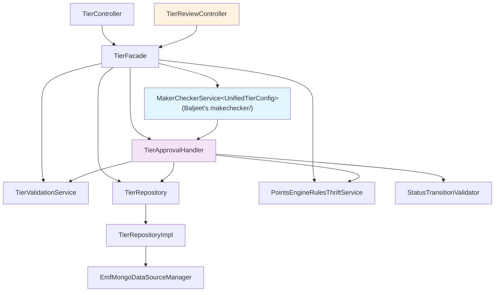

# Low-Level Design -- Tiers CRUD + Generic Maker-Checker

> Phase 7: LLD (Designer)
> Date: 2026-04-11
> Source: 01-architect.md, code-analysis-intouch-api-v3.md

---

## 1. Package Structure

```
com.capillary.intouchapiv3/
  resources/
    TierController.java                    -- REST endpoints for /v3/tiers
    TierReviewController.java              -- REST endpoints for /v3/tiers/{tierId}/submit, /approve, /v3/tiers/approvals
  tier/
    UnifiedTierConfig.java                 -- MongoDB @Document; implements ApprovableEntity
    TierFacade.java                        -- Business logic orchestrator
    TierRepository.java                    -- MongoRepository interface
    TierRepositoryCustom.java              -- Custom query interface
    TierRepositoryImpl.java                -- Sharded MongoDB implementation
    TierApprovalHandler.java               -- ApprovableEntityHandler<UnifiedTierConfig> impl
    TierValidationService.java             -- Field-level validation
    dto/
      TierCreateRequest.java               -- POST request body
      TierUpdateRequest.java               -- PUT request body
      TierListResponse.java                -- GET response wrapper
      KpiSummary.java                      -- KPI stats in listing response
    model/
      BasicDetails.java                    -- name, desc, color, serial, startDate, endDate
      TierEligibilityConfig.java           -- kpiType (String), threshold, upgradeType, conditions
      TierCondition.java                   -- type (String), value, trackerName
      TierValidityConfig.java              -- periodType (String), periodValue, startDate, endDate, renewal
      TierRenewalConfig.java               -- criteriaType (String), expressionRelation, conditions, schedule
      TierDowngradeConfig.java             -- target (String), reevaluateOnReturn, dailyEnabled, conditions
      TierNudgesConfig.java                -- upgradeNotification, renewalReminder, expiryWarning, downgradeConfirmation
      MemberStats.java                     -- cached member count
      EngineConfig.java                    -- hidden engine configs for round-trip
      TierMetadata.java                    -- created/updated by, sqlSlabId
    enums/
      TierStatus.java                      -- DRAFT, PENDING_APPROVAL, ACTIVE, DELETED, SNAPSHOT

com.capillary.intouchapiv3.makechecker/  -- Baljeet's generic maker-checker package (existing)
  -- Framework interfaces and implementation:
  MakerCheckerService<T>                   -- Generic state machine for ApprovableEntity types
  ApprovableEntity                         -- Interface: getStatus(), setStatus(), getVersion(), setVersion(), transitionToPending(), transitionToRejected(String)
  ApprovableEntityHandler<T>               -- Strategy interface: validateForSubmission(), preApprove(), publish(), postApprove(), onPublishFailure(), postReject()
  PublishResult                            -- Result of publish(): carries externalId (sqlSlabId for tiers), other metadata
```

---

## 2. Key Interface Contracts

### 2.1 ApprovableEntityHandler (Generic Strategy)

```java
package com.capillary.makechecker;  // Baljeet's package

/**
 * Strategy interface for domain-specific approval workflow on ApprovableEntity types.
 * Each entity type (UnifiedTierConfig, Benefit, etc.) provides its own implementation.
 *
 * @param <T> The entity document type (implements ApprovableEntity)
 */
public interface ApprovableEntityHandler<T extends ApprovableEntity> {

    /**
     * Validate entity before submission to PENDING_APPROVAL.
     * Called by MakerCheckerService when submitForApproval() is invoked.
     *
     * @param entity The entity to validate
     * @throws ValidationException if validation fails (submit request rejected)
     */
    void validateForSubmission(T entity);

    /**
     * Re-validate before approval (e.g., check uniqueness, external state).
     * Called by MakerCheckerService after loading entity and before publish().
     *
     * @param entity The entity to re-validate
     * @throws ValidationException if validation fails (approval rejected)
     */
    void preApprove(T entity);

    /**
     * Publish entity to external system (e.g., Thrift, SQL).
     * Performs SAGA phase 1: sync to backend. On error, MakerCheckerService calls onPublishFailure().
     *
     * @param entity The entity to publish
     * @return PublishResult carrying externalId and other metadata
     * @throws Exception if publish fails (triggers onPublishFailure + rethrow)
     */
    PublishResult publish(T entity);

    /**
     * Post-approval hook after successful publish.
     * SAGA phase 2: update entity status to ACTIVE, store externalId, archive old versions, etc.
     *
     * @param entity The entity (status now PENDING_APPROVAL, external ID available)
     * @param publishResult The result from publish()
     */
    void postApprove(T entity, PublishResult publishResult);

    /**
     * Error handler if publish fails.
     * SAGA phase 1 failure: log error, do NOT change status (entity stays PENDING_APPROVAL).
     *
     * @param entity The entity (status still PENDING_APPROVAL)
     * @param exception The publish exception
     */
    void onPublishFailure(T entity, Exception exception);

    /**
     * Post-rejection hook.
     * Revert entity to DRAFT and store rejection comment if needed.
     *
     * @param entity The entity (status will be set to DRAFT)
     * @param comment Rejection reason (e.g., "Invalid KPI threshold")
     */
    void postReject(T entity, String comment);
}
```

### 2.2 MakerCheckerService (Generic Framework)

```java
package com.capillary.makechecker;  // Baljeet's package

/**
 * Generic state machine for ApprovableEntity approval workflows.
 * Handles DRAFT -> PENDING_APPROVAL -> ACTIVE/REJECTED transitions.
 *
 * @param <T> The entity type (must implement ApprovableEntity)
 */
public interface MakerCheckerService<T extends ApprovableEntity> {

    /**
     * Submit entity for approval (DRAFT -> PENDING_APPROVAL).
     * Calls handler.validateForSubmission(), transitionToPending(), saves entity.
     *
     * @param entity The entity to submit
     * @param handler The approval workflow strategy
     * @param save Callback to persist entity (e.g., repository::save)
     * @throws ValidationException if validation fails
     */
    void submitForApproval(T entity, ApprovableEntityHandler<T> handler, Consumer<T> save);

    /**
     * Approve entity (PENDING_APPROVAL -> ACTIVE).
     * SAGA: calls handler.preApprove() -> handler.publish() -> handler.postApprove().
     * On publish failure: calls handler.onPublishFailure() and rethrows exception.
     *
     * @param entity The entity to approve
     * @param comment Approval comment
     * @param reviewedBy User ID of reviewer
     * @param handler The approval workflow strategy
     * @param save Callback to persist entity
     * @throws Exception if publish fails (entity stays PENDING_APPROVAL)
     */
    void approve(T entity, String comment, String reviewedBy, ApprovableEntityHandler<T> handler, Consumer<T> save);

    /**
     * Reject entity (PENDING_APPROVAL -> DRAFT).
     * Calls handler.postReject() to revert and store comment.
     *
     * @param entity The entity to reject
     * @param comment Rejection reason
     * @param reviewedBy User ID of reviewer
     * @param handler The approval workflow strategy
     * @param save Callback to persist entity
     */
    void reject(T entity, String comment, String reviewedBy, ApprovableEntityHandler<T> handler, Consumer<T> save);
}
```

### 2.3 TierFacade

```java
package com.capillary.intouchapiv3.tier;

@Component
public class TierFacade {

    // Dependencies (all @Autowired)
    private TierRepository tierRepository;
    private TierValidationService validationService;
    private MakerCheckerService<UnifiedTierConfig> makerCheckerService;
    private TierApprovalHandler tierApprovalHandler;
    private StatusTransitionValidator statusTransitionValidator;
    private PointsEngineRulesThriftService thriftService;

    /** List all tiers for a program with KPI summary and member stats */
    public TierListResponse listTiers(long orgId, int programId, List<TierStatus> statusFilter);

    /** Create a new tier. Always DRAFT (always goes through MC flow). */
    public UnifiedTierConfig createTier(long orgId, TierCreateRequest request, String userId);

    /** Edit a tier. DRAFT: in-place. ACTIVE: versioned (new DRAFT with parentId). */
    public UnifiedTierConfig updateTier(long orgId, String tierId, TierUpdateRequest request, String userId);

    /** Delete a DRAFT tier (set DELETED). DRAFT only — 409 if not DRAFT. No MC flow. */
    public void deleteTier(long orgId, String tierId, String userId);

    /** Submit tier for approval (DRAFT -> PENDING_APPROVAL). Delegates to makerCheckerService. */
    public UnifiedTierConfig submitForApproval(long orgId, String tierId, String userId);

    /** Approve tier (PENDING_APPROVAL -> ACTIVE via SAGA). Delegates to makerCheckerService. */
    public UnifiedTierConfig handleApproval(long orgId, String tierId, String action, 
                                            String comment, String reviewedBy);

    /** List all pending approvals for an org/program. Queries tiers with PENDING_APPROVAL status. */
    public List<UnifiedTierConfig> listPendingApprovals(long orgId, Integer programId);
}
```

### 2.4 TierApprovalHandler

```java
package com.capillary.intouchapiv3.tier;

@Component
@Slf4j
public class TierApprovalHandler implements ApprovableEntityHandler<UnifiedTierConfig> {

    private PointsEngineRulesThriftService thriftService;
    private TierRepository tierRepository;
    private TierValidationService validationService;

    @Override
    public void validateForSubmission(UnifiedTierConfig entity) {
        // 1. Validate basicDetails (name, serialNumber, etc.)
        // 2. Throws ValidationException if validation fails
        validationService.validateBasicDetails(entity.getBasicDetails());
    }

    @Override
    public void preApprove(UnifiedTierConfig entity) {
        // 1. Re-check name uniqueness (may have changed since submission)
        // 2. Excludes entity itself and parent version (if versioned edit)
        validationService.validateNameUniquenessExcluding(
            entity.getOrgId(), entity.getProgramId(), entity.getBasicDetails().getName(), entity.getId()
        );
    }

    /**
     * Sync tier from MongoDB to SQL via Thrift (SAGA phase 1).
     * Uses @Lockable to prevent concurrent syncs for same program.
     * Returns PublishResult with externalId = sqlSlabId for later postApprove() use.
     */
    @Lockable(key = "'lock_tier_sync_' + #entity.orgId + '_' + #entity.programId", ttl = 300000, acquireTime = 5000)
    @Override
    public PublishResult publish(UnifiedTierConfig entity) {
        // 1. Build SlabInfo from entity.basicDetails
        // 2. Fetch current strategies, build SLAB_UPGRADE + SLAB_DOWNGRADE StrategyInfos
        // 3. Call createOrUpdateSlab (Thrift) -> returns SlabInfo with id = sqlSlabId
        // 4. Return PublishResult(externalId = sqlSlabId)
        // 5. For versioned edits: sqlSlabId carried from parent via metadata
    }

    @Override
    public void postApprove(UnifiedTierConfig entity, PublishResult publishResult) {
        // 1. Set entity status to ACTIVE
        // 2. Store sqlSlabId in metadata from publishResult.externalId
        // 3. If entity.parentId exists: fetch parent (ACTIVE), set to SNAPSHOT, save
        // 4. Save entity to MongoDB
        entity.setStatus(TierStatus.ACTIVE);
        entity.getMetadata().setSqlSlabId(publishResult.getExternalId());
        // Archive parent if versioned edit
        if (entity.getParentId() != null) {
            UnifiedTierConfig parent = tierRepository.findById(entity.getParentId()).orElse(null);
            if (parent != null && parent.getStatus() == TierStatus.ACTIVE) {
                parent.setStatus(TierStatus.SNAPSHOT);
                tierRepository.save(parent);
            }
        }
        tierRepository.save(entity);
    }

    @Override
    public void onPublishFailure(UnifiedTierConfig entity, Exception e) {
        // Log error. Do NOT change status — entity stays PENDING_APPROVAL.
        log.error("Failed to publish tier {} to Thrift", entity.getId(), e);
    }

    @Override
    public void postReject(UnifiedTierConfig entity, String comment) {
        // 1. Set entity status to DRAFT
        // 2. Store rejection comment in metadata
        // 3. Save entity
        entity.setStatus(TierStatus.DRAFT);
        if (entity.getMetadata() == null) {
            entity.setMetadata(new TierMetadata());
        }
        entity.getMetadata().setRejectionComment(comment);
        tierRepository.save(entity);
    }
}
```

---

## 3. MongoDB Document Classes

### 3.1 UnifiedTierConfig

```java
@Data @Builder @NoArgsConstructor @AllArgsConstructor
@Document(collection = "unified_tier_configs")
public class UnifiedTierConfig implements ApprovableEntity {
    @Id
    private String objectId;

    @JsonProperty(access = JsonProperty.Access.READ_ONLY)
    private String unifiedTierId;      // immutable across versions

    @NotNull private Long orgId;
    @NotNull private Integer programId;
    @NotNull private TierStatus status;  // implements ApprovableEntity.getStatus/setStatus

    private String parentId;            // ObjectId of ACTIVE when editing
    private Integer version;             // implements ApprovableEntity.getVersion/setVersion

    @Valid @NotNull private BasicDetails basicDetails;
    @Valid private TierEligibilityConfig eligibility;
    @Valid private TierValidityConfig validity;
    @Valid private TierDowngradeConfig downgrade;
    @Valid private TierNudgesConfig nudges;

    private List<String> benefitIds;
    private MemberStats memberStats;
    private EngineConfig engineConfig;
    private TierMetadata metadata;

    // ApprovableEntity interface methods (delegates to TierStatus enum)
    @Override
    public Object getStatus() { return this.status; }

    @Override
    public void setStatus(Object status) { this.status = (TierStatus) status; }

    @Override
    public Long getVersion() { return this.version != null ? this.version.longValue() : null; }

    @Override
    public void setVersion(Long version) { this.version = version != null ? version.intValue() : null; }

    @Override
    public void transitionToPending() { this.status = TierStatus.PENDING_APPROVAL; }

    @Override
    public void transitionToRejected(String comment) { 
        this.status = TierStatus.DRAFT;  // reverts to DRAFT on rejection
        if (this.metadata == null) { this.metadata = new TierMetadata(); }
        this.metadata.setRejectionComment(comment);
    }
}
```

---

## 4. Enum Definitions

```java
public enum TierStatus {
    DRAFT,              // Initial state (MC-enabled creation), reversion state (rejected, reverted from ACTIVE)
    PENDING_APPROVAL,   // Submitted for approval, awaiting reviewer action
    ACTIVE,             // Approved and published to Thrift/SQL
    DELETED,            // Soft-deleted (DRAFT tier deleted by creator — audit trail preserved)
    SNAPSHOT            // Archived (parent of versioned edit — replaced by new ACTIVE version)
    // NOTE (Rework #2): Removed PAUSED, STOPPED states. Tier retirement deferred to future epic.
}

// NOTE (Rework #4 — engine realignment): CriteriaType, ActivityRelation,
// DowngradeSchedule, DowngradeTargetType enums REMOVED.
// Replaced by String fields in TierEligibilityConfig, TierDowngradeConfig, etc.
// to match the prototype pattern (flexible for UI, validated at request level).

// NOTE (Migration): Removed EntityType, ChangeType, ChangeStatus enums (custom makerchecker/ package).
// These are now part of Baljeet's generic makechecker/ package, used internally by MakerCheckerService<T>.
// Tier code only works with UnifiedTierConfig (implements ApprovableEntity) and TierStatus (status field).
```

---

## 5. Status Transition Rules

```java
// StatusTransitionValidator (validates action-based transitions)
// Rework #2: Removed PAUSED, STOPPED, PAUSE, RESUME, STOP actions
private static final Map<TierStatus, Set<TierAction>> VALID_TRANSITIONS = Map.of(
    TierStatus.DRAFT,              Set.of(TierAction.SUBMIT_FOR_APPROVAL, TierAction.DELETE),
    TierStatus.PENDING_APPROVAL,   Set.of(TierAction.APPROVE, TierAction.REJECT),
    TierStatus.ACTIVE,             Set.of(TierAction.EDIT),  // No STOP or PAUSE — tier retirement deferred
    TierStatus.SNAPSHOT,           Set.of(),  // terminal (archived)
    TierStatus.DELETED,            Set.of()   // terminal (DRAFT soft-delete, audit trail preserved)
);

// MakerCheckerService handles state machine transitions:
// - submitForApproval(): DRAFT -> PENDING_APPROVAL (calls entity.transitionToPending())
// - approve(): PENDING_APPROVAL -> ACTIVE (TierApprovalHandler.postApprove() sets status)
// - reject(): PENDING_APPROVAL -> DRAFT (calls entity.transitionToRejected(comment))
```

---

## 6. Thrift Wrapper Methods (add to PointsEngineRulesThriftService)

```java
// Wrapper methods for TierApprovalHandler.publish() (SAGA phase 1):

public SlabInfo createOrUpdateSlab(SlabInfo slabInfo, int orgId,
        int lastModifiedBy, long lastModifiedOn) throws Exception {
    String serverReqId = CapRequestIdUtil.getRequestId();
    return getClient().createOrUpdateSlab(
            slabInfo, orgId, lastModifiedBy, lastModifiedOn, serverReqId);
}

// Optional (if strategy updates needed):
public SlabInfo createSlabAndUpdateStrategies(int programId, int orgId,
        SlabInfo slabInfo, List<StrategyInfo> strategyInfos,
        int lastModifiedBy, long lastModifiedOn) throws Exception {
    String serverReqId = CapRequestIdUtil.getRequestId();
    return getClient().createSlabAndUpdateStrategies(
            programId, orgId, slabInfo, strategyInfos,
            lastModifiedBy, lastModifiedOn, serverReqId);
}

public List<SlabInfo> getAllSlabs(int programId, int orgId) throws Exception {
    String serverReqId = CapRequestIdUtil.getRequestId();
    return getClient().getAllSlabs(programId, orgId, serverReqId);
}
```

---

## 7. REST Endpoints (TierReviewController)

```java
package com.capillary.intouchapiv3.resources;

@RestController
@RequestMapping("/v3/tiers")
public class TierReviewController {

    private TierFacade tierFacade;

    /**
     * Submit a DRAFT tier for approval (DRAFT -> PENDING_APPROVAL).
     * POST /v3/tiers/{tierId}/submit
     * 
     * @param tierId The tier MongoDB ObjectId
     * @return The tier (now PENDING_APPROVAL)
     * @throws 404 if tier not found or not DRAFT
     * @throws 409 if tier not in DRAFT status
     */
    @PostMapping("/{tierId}/submit")
    public ResponseEntity<UnifiedTierConfig> submitForApproval(
            @PathVariable String tierId,
            @AuthenticationPrincipal User user) {
        long orgId = user.getOrgId();
        String userId = user.getId();
        UnifiedTierConfig tier = tierFacade.submitForApproval(orgId, tierId, userId);
        return ResponseEntity.ok(tier);
    }

    /**
     * Approve or reject a PENDING_APPROVAL tier.
     * POST /v3/tiers/{tierId}/approve
     * 
     * Body: {
     *   "approvalStatus": "APPROVE" | "REJECT",
     *   "comment": "Optional comment"
     * }
     * 
     * - APPROVE: PENDING_APPROVAL -> ACTIVE (via SAGA: preApprove -> publish -> postApprove)
     * - REJECT: PENDING_APPROVAL -> DRAFT (via postReject)
     * 
     * @return The tier (now ACTIVE or DRAFT)
     * @throws 404 if tier not found or not PENDING_APPROVAL
     * @throws 409 if tier not in PENDING_APPROVAL status
     * @throws 500 if publish to Thrift fails (entity stays PENDING_APPROVAL)
     */
    @PostMapping("/{tierId}/approve")
    public ResponseEntity<UnifiedTierConfig> handleApproval(
            @PathVariable String tierId,
            @RequestBody ApprovalRequest request,
            @AuthenticationPrincipal User user) {
        long orgId = user.getOrgId();
        String userId = user.getId();
        UnifiedTierConfig tier = tierFacade.handleApproval(orgId, tierId, 
                                    request.getApprovalStatus(), 
                                    request.getComment(), 
                                    userId);
        return ResponseEntity.ok(tier);
    }

    /**
     * List all pending approvals for a program.
     * GET /v3/tiers/approvals?programId=N
     * 
     * @param programId Filter by program (optional; if omitted, return all for org)
     * @return List of tiers with PENDING_APPROVAL status
     */
    @GetMapping("/approvals")
    public ResponseEntity<List<UnifiedTierConfig>> listPendingApprovals(
            @RequestParam(required = false) Integer programId,
            @AuthenticationPrincipal User user) {
        long orgId = user.getOrgId();
        List<UnifiedTierConfig> pending = tierFacade.listPendingApprovals(orgId, programId);
        return ResponseEntity.ok(pending);
    }
}
```

---

## 8. emf-parent Changes

> **Rework #3**: ProgramSlab status field and findActiveByProgram() REMOVED from scope.
> Rationale: SQL only contains ACTIVE tiers (synced via Thrift on approval). No ACTIVE tier
> can be deleted (DRAFT-only deletion). No PAUSED/STOPPED states exist. Therefore every row
> in program_slabs is always active — a status column has zero use.
> SlabInfo Thrift struct also has no status field.
> Deferred to future tier retirement epic when ACTIVE tier stopping is implemented.

**No changes to ProgramSlab.java or PeProgramSlabDao.java in current scope.**

---

## 9. Dependency Graph



---

## 10. Migration Summary: Custom Makerchecker → Baljeet's Generic Makechecker

This LLD reflects the completed migration from a custom `com.capillary.intouchapiv3.makerchecker/` package to Baljeet's generic `com.capillary.makechecker/` framework.

### Deleted (Custom Package)
| Item | Replacement |
|------|-------------|
| `MakerCheckerService` (interface) | `MakerCheckerService<T extends ApprovableEntity>` (Baljeet's generic) |
| `MakerCheckerServiceImpl` | Baljeet's implementation in `makechecker/` package |
| `MakerCheckerFacade` | Logic merged into `TierFacade` (submitForApproval, handleApproval, listPendingApprovals methods) |
| `MakerCheckerController` | `TierReviewController` (domain-specific endpoints) |
| `ChangeApplier<T>` (interface) | `ApprovableEntityHandler<T>` (Baljeet's strategy interface) |
| `TierChangeApplier` | `TierApprovalHandler implements ApprovableEntityHandler<UnifiedTierConfig>` |
| `PendingChange` (MongoDB document) | Status now lives on entity itself (`UnifiedTierConfig` implements `ApprovableEntity`) |
| `PendingChangeRepository` | Not needed (no separate collection) |
| `MakerCheckerConfig` / `isMakerCheckerEnabled()` | Removed — Tiers always go through MC flow (always DRAFT at creation) |
| `NotificationHandler` / `NoOpNotificationHandler` | No longer used in tier context |
| EntityType, ChangeType, ChangeStatus enums | Now internal to Baljeet's `makechecker/` package |

### Key Changes

1. **Status on entity**: `UnifiedTierConfig` implements `ApprovableEntity` with status field (TierStatus) and transition methods.
2. **Handler pattern**: `TierApprovalHandler` replaces `TierChangeApplier` with extended methods (validateForSubmission, preApprove, publish, postApprove, onPublishFailure, postReject).
3. **SAGA approval**: `MakerCheckerService.approve()` implements SAGA: preApprove → publish (Thrift) → postApprove. On publish failure: onPublishFailure + rethrow.
4. **No MC configuration**: Tiers no longer have a config flag. All tiers created as DRAFT, all go through MC flow.
5. **No external pending collection**: Status transitions persist directly on `UnifiedTierConfig`.
6. **REST endpoints**: Consolidated into `TierReviewController` (/v3/tiers/{tierId}/submit, /approve, /approvals).

### Benefits
- Decoupling tier domain from generic MC framework
- Consistent approval pattern across all entity types (tiers, benefits, subscriptions) via Baljeet's framework
- Simpler status model (no PENDING_CHANGE collection to sync)
- SAGA guarantees at framework level (preApprove → publish → postApprove atomic semantics)
- Reduced custom code, increased testability
