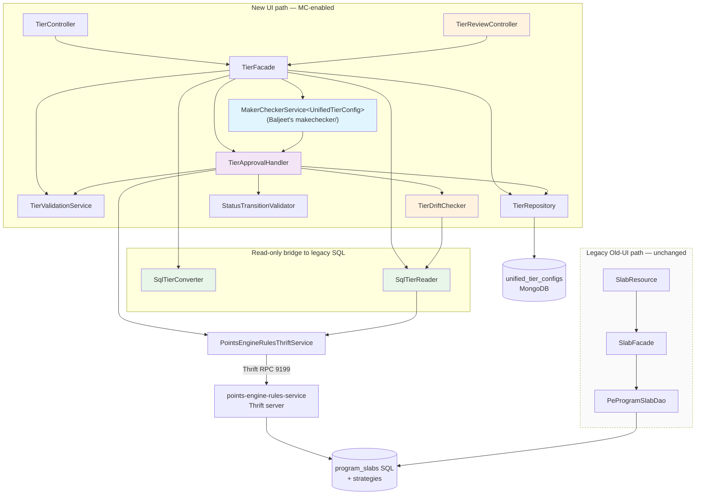

# Low-Level Design -- Tiers CRUD + Generic Maker-Checker

> Phase 7: LLD (Designer)
> Date: 2026-04-11 (updated 2026-04-17 — Rework #5 cascade)
> Source: 01-architect.md, code-analysis-intouch-api-v3.md, rework-5-scope.md
>
> **Rework trail**: #1 (MC-always), #2 (tier-retirement deferred), #3 (status removal),
> #4 (engine data-model alignment), #5 (unified read surface, dual write paths, schema cleanup).
>
> **Rework #5 summary**: LLD now reflects a *unified* read surface that serves BOTH legacy
> SQL-origin tiers AND new-UI-origin tiers via an envelope `{live, pendingDraft}` response.
> Writes split into two paths: the old UI keeps its legacy direct-SQL route (no MC), the new
> UI flows through Mongo `DRAFT` → MC → Thrift → SQL. `UnifiedTierConfig` schema is flattened
> (wrappers removed), several fields dropped, `sqlSlabId` → `slabId`, `unifiedTierId` →
> `tierUniqueId`. A new `meta.basisSqlSnapshot` enables drift detection at approval.

---

## 1. Package Structure

```
com.capillary.intouchapiv3/
  resources/
    TierController.java                    -- REST endpoints: GET /v3/tiers, GET /v3/tiers/{slabId}, POST, PUT, DELETE
    TierReviewController.java              -- REST endpoints: POST /v3/tiers/{tierId}/submit, /approve, /reject, GET /v3/tiers/approvals
  tier/
    UnifiedTierConfig.java                 -- MongoDB @Document; implements ApprovableEntity
                                           -- (Rework #5) Hoisted schema: all fields live at root; no basicDetails/metadata wrappers
    TierFacade.java                        -- Business logic orchestrator (new-UI writes only)
    TierRepository.java                    -- MongoRepository interface
    TierRepositoryCustom.java              -- Custom query interface
    TierRepositoryImpl.java                -- Sharded MongoDB implementation
    TierApprovalHandler.java               -- ApprovableEntityHandler<UnifiedTierConfig> impl (drift-check in preApprove)
    TierValidationService.java             -- Field-level validation + uniqueness + single-active-DRAFT
    SqlTierConverter.java                  -- (NEW, Rework #5) Read-only bridge: ProgramSlab → TierEnvelope for legacy tiers
    SqlTierReader.java                     -- (NEW, Rework #5) Thrift/SQL reader for LIVE tiers — calls getAllSlabs
    TierDriftChecker.java                  -- (NEW, Rework #5) Compares UnifiedTierConfig.meta.basisSqlSnapshot vs current SQL
    dto/
      TierCreateRequest.java               -- POST request body
      TierUpdateRequest.java               -- PUT request body
      TierEnvelope.java                    -- (NEW, Rework #5) {live: TierView, pendingDraft: TierView | null, hasPendingDraft: bool}
      TierView.java                        -- (NEW, Rework #5) Flat projection of a tier (fields + slabId + origin: LEGACY|NEW_UI)
      TierListResponse.java                -- GET list response wrapper: List<TierEnvelope> + KpiSummary
      KpiSummary.java                      -- KPI stats in listing response
      ApprovalRequest.java                 -- Body for /approve (approvalStatus, comment)
      RejectRequest.java                   -- (NEW, Rework #5) Body for /reject (comment)
    model/
      -- (Rework #5) DROPPED: BasicDetails.java (hoisted to root), TierMetadata.java (hoisted to root), TierNudgesConfig.java (tier no longer owns nudges)
      TierEligibilityConfig.java           -- kpiType (String), threshold, upgradeType, conditions
      TierCondition.java                   -- type (String), value, trackerName
      TierValidityConfig.java              -- periodType (String), periodValue, startDate, endDate, renewal
      TierRenewalConfig.java               -- criteriaType (String), expressionRelation, conditions, schedule
      TierDowngradeConfig.java             -- target (String), reevaluateOnReturn, dailyEnabled, conditions
      MemberStats.java                     -- cached member count
      EngineConfig.java                    -- hidden engine configs for round-trip
      TierMeta.java                        -- (NEW, Rework #5) Contains basisSqlSnapshot + audit (createdBy, updatedBy, approvedBy, approvedAt, rejectionComment)
      BasisSqlSnapshot.java                -- (NEW, Rework #5) {slabFields: Map<String,Object>, strategyFields: Map<String,Object>, capturedAt: Instant, capturedFromSlabId: Long|null}
    enums/
      TierStatus.java                      -- DRAFT, PENDING_APPROVAL, ACTIVE, DELETED, SNAPSHOT
                                           -- (Rework #5 note) ACTIVE is retained for back-compat but is NEVER held by a Mongo doc
                                           --                   post-Rework #5. Mongo lifecycle: PENDING_APPROVAL → SNAPSHOT direct.
      TierOrigin.java                      -- (NEW, Rework #5) LEGACY | NEW_UI — for TierView.origin

com.capillary.intouchapiv3.makechecker/  -- Baljeet's generic maker-checker package (existing — unchanged)
  MakerCheckerService<T>                   -- Generic state machine for ApprovableEntity types
  ApprovableEntity                         -- Interface: getStatus(), setStatus(), getVersion(), setVersion(), transitionToPending(), transitionToRejected(String)
  ApprovableEntityHandler<T>               -- Strategy interface: validateForSubmission(), preApprove(), publish(), postApprove(), onPublishFailure(), postReject()
  PublishResult                            -- Result of publish(): carries externalId (slabId for tiers), other metadata

-- (Rework #5) UNCHANGED (old UI legacy path — not owned by this module):
-- com.capillary.intouchapiv3.slab.* — legacy SlabResource / SlabFacade / PeProgramSlabDao direct-SQL writes. No MC, no Mongo.
-- Kept as-is; this module only reads from program_slabs via SqlTierReader.
```

---

## 2. Key Interface Contracts

### 2.1 ApprovableEntityHandler (Generic Strategy)

```java
package com.capillary.makechecker;  // Baljeet's package

/**
 * Strategy interface for domain-specific approval workflow on ApprovableEntity types.
 * Each entity type (UnifiedTierConfig, Benefit, etc.) provides its own implementation.
 *
 * @param <T> The entity document type (implements ApprovableEntity)
 */
public interface ApprovableEntityHandler<T extends ApprovableEntity> {

    /**
     * Validate entity before submission to PENDING_APPROVAL.
     * Called by MakerCheckerService when submitForApproval() is invoked.
     *
     * @param entity The entity to validate
     * @throws ValidationException if validation fails (submit request rejected)
     */
    void validateForSubmission(T entity);

    /**
     * Re-validate before approval (e.g., check uniqueness, external state).
     * Called by MakerCheckerService after loading entity and before publish().
     *
     * @param entity The entity to re-validate
     * @throws ValidationException if validation fails (approval rejected)
     */
    void preApprove(T entity);

    /**
     * Publish entity to external system (e.g., Thrift, SQL).
     * Performs SAGA phase 1: sync to backend. On error, MakerCheckerService calls onPublishFailure().
     *
     * @param entity The entity to publish
     * @return PublishResult carrying externalId and other metadata
     * @throws Exception if publish fails (triggers onPublishFailure + rethrow)
     */
    PublishResult publish(T entity);

    /**
     * Post-approval hook after successful publish.
     * SAGA phase 2: update entity status to ACTIVE, store externalId, archive old versions, etc.
     *
     * @param entity The entity (status now PENDING_APPROVAL, external ID available)
     * @param publishResult The result from publish()
     */
    void postApprove(T entity, PublishResult publishResult);

    /**
     * Error handler if publish fails.
     * SAGA phase 1 failure: log error, do NOT change status (entity stays PENDING_APPROVAL).
     *
     * @param entity The entity (status still PENDING_APPROVAL)
     * @param exception The publish exception
     */
    void onPublishFailure(T entity, Exception exception);

    /**
     * Post-rejection hook.
     * Revert entity to DRAFT and store rejection comment if needed.
     *
     * @param entity The entity (status will be set to DRAFT)
     * @param comment Rejection reason (e.g., "Invalid KPI threshold")
     */
    void postReject(T entity, String comment);
}
```

### 2.2 MakerCheckerService (Generic Framework)

```java
package com.capillary.makechecker;  // Baljeet's package

/**
 * Generic state machine for ApprovableEntity approval workflows.
 * Handles DRAFT -> PENDING_APPROVAL -> ACTIVE/REJECTED transitions.
 *
 * @param <T> The entity type (must implement ApprovableEntity)
 */
public interface MakerCheckerService<T extends ApprovableEntity> {

    /**
     * Submit entity for approval (DRAFT -> PENDING_APPROVAL).
     * Calls handler.validateForSubmission(), transitionToPending(), saves entity.
     *
     * @param entity The entity to submit
     * @param handler The approval workflow strategy
     * @param save Callback to persist entity (e.g., repository::save)
     * @throws ValidationException if validation fails
     */
    void submitForApproval(T entity, ApprovableEntityHandler<T> handler, Consumer<T> save);

    /**
     * Approve entity (PENDING_APPROVAL -> ACTIVE).
     * SAGA: calls handler.preApprove() -> handler.publish() -> handler.postApprove().
     * On publish failure: calls handler.onPublishFailure() and rethrows exception.
     *
     * @param entity The entity to approve
     * @param comment Approval comment
     * @param reviewedBy User ID of reviewer
     * @param handler The approval workflow strategy
     * @param save Callback to persist entity
     * @throws Exception if publish fails (entity stays PENDING_APPROVAL)
     */
    void approve(T entity, String comment, String reviewedBy, ApprovableEntityHandler<T> handler, Consumer<T> save);

    /**
     * Reject entity (PENDING_APPROVAL -> DRAFT).
     * Calls handler.postReject() to revert and store comment.
     *
     * @param entity The entity to reject
     * @param comment Rejection reason
     * @param reviewedBy User ID of reviewer
     * @param handler The approval workflow strategy
     * @param save Callback to persist entity
     */
    void reject(T entity, String comment, String reviewedBy, ApprovableEntityHandler<T> handler, Consumer<T> save);
}
```

### 2.3 TierFacade

> **Rework #5 note**: TierFacade owns the NEW-UI write path and the UNIFIED read path.
> Old-UI writes continue to flow through the pre-existing legacy `SlabFacade` → `PeProgramSlabDao`
> path (direct SQL, no MC, no Mongo). This facade does NOT touch that path.

```java
package com.capillary.intouchapiv3.tier;

@Component
public class TierFacade {

    // Dependencies (all @Autowired)
    private TierRepository tierRepository;
    private TierValidationService validationService;
    private MakerCheckerService<UnifiedTierConfig> makerCheckerService;
    private TierApprovalHandler tierApprovalHandler;
    private StatusTransitionValidator statusTransitionValidator;
    private PointsEngineRulesThriftService thriftService;
    private SqlTierReader sqlTierReader;              // (NEW, Rework #5) reads program_slabs via Thrift/SQL
    private SqlTierConverter sqlTierConverter;        // (NEW, Rework #5) ProgramSlab → TierView
    private TierDriftChecker tierDriftChecker;        // (NEW, Rework #5) captures + compares basisSqlSnapshot

    // --------------------------------------------------------------------
    // READ PATH (unified — serves both legacy and new-UI tiers)
    // --------------------------------------------------------------------

    /**
     * List all tiers for a program, envelope-shaped.
     * Rework #5 algorithm:
     *   1. Fetch LIVE tiers from SQL (getAllSlabs via Thrift) → Map<slabId, ProgramSlab>.
     *   2. Fetch Mongo docs for this (orgId, programId) with status IN (DRAFT, PENDING_APPROVAL).
     *   3. For each SQL slab: live = SqlTierConverter.toView(slab); attach matching Mongo draft by slabId.
     *   4. For each Mongo DRAFT of a NEW tier (slabId == null): emit envelope with live=null, pendingDraft=<view>.
     *   5. Compose {live, pendingDraft, hasPendingDraft} envelopes.
     * No N+1: two DB hits regardless of list size.
     */
    public TierListResponse listTiers(long orgId, int programId, List<TierStatus> statusFilter);

    /**
     * Get one tier by slabId (envelope-shaped).
     * Rework #5: preferred identifier is SQL slabId. For NEW tiers not yet approved
     * (no slabId), use tierUniqueId via a separate endpoint.
     */
    public TierEnvelope getTier(long orgId, int programId, long slabId);

    /**
     * Get one tier by tierUniqueId (for NEW tiers that only exist in Mongo DRAFT).
     */
    public TierEnvelope getTierByTierUniqueId(long orgId, int programId, String tierUniqueId);

    // --------------------------------------------------------------------
    // WRITE PATH (new-UI only — always goes through MC)
    // --------------------------------------------------------------------

    /**
     * Create a new tier (NEW UI). Always DRAFT.
     * - Enforces UNIQUE(orgId, programId, name) across LIVE tiers (SQL) AND existing DRAFT/PENDING (Mongo).
     * - Captures basisSqlSnapshot=null at this stage (no basis — brand-new tier).
     */
    public UnifiedTierConfig createTier(long orgId, TierCreateRequest request, String userId);

    /**
     * Edit a tier (NEW UI). Rework #5 cases:
     *   A) Mongo DRAFT exists — in-place update (no new Mongo doc, no basis re-capture).
     *   B) LIVE tier only (no Mongo doc, or doc in SNAPSHOT) — creates a NEW Mongo DRAFT with
     *      parentId = LIVE SNAPSHOT objectId (or null if new), slabId = existing SQL slab id,
     *      meta.basisSqlSnapshot = current SQL+strategy snapshot at DRAFT creation time.
     *   C) PENDING_APPROVAL exists — 409 Conflict (single-active-draft).
     * All cases enforced by TierValidationService.enforceSingleActiveDraft().
     */
    public UnifiedTierConfig updateTier(long orgId, int programId, String tierId,
                                        TierUpdateRequest request, String userId);

    /**
     * Delete a DRAFT tier (set status=DELETED). DRAFT only — 409 if not DRAFT.
     * Does NOT delete the LIVE SQL tier. LIVE tier deletion is out-of-scope (future tier retirement epic).
     */
    public void deleteTier(long orgId, String tierId, String userId);

    // --------------------------------------------------------------------
    // APPROVAL FLOW (DRAFT → PENDING_APPROVAL → SNAPSHOT + SQL write)
    // --------------------------------------------------------------------

    /** Submit tier for approval (DRAFT -> PENDING_APPROVAL). Delegates to makerCheckerService. */
    public UnifiedTierConfig submitForApproval(long orgId, String tierId, String userId);

    /** Approve tier (PENDING_APPROVAL -> SNAPSHOT + SQL write via SAGA).
     *  On publish success postApprove() writes approvedBy/approvedAt to SQL audit columns
     *  and sets Mongo doc to SNAPSHOT (Rework #5 — no ACTIVE intermediate). */
    public UnifiedTierConfig approve(long orgId, String tierId, String comment, String reviewedBy);

    /** Reject tier (PENDING_APPROVAL -> DRAFT). basisSqlSnapshot is retained for next submission cycle. */
    public UnifiedTierConfig reject(long orgId, String tierId, String comment, String reviewedBy);

    /** List all pending approvals for an org/program. Queries tiers with PENDING_APPROVAL status. */
    public List<UnifiedTierConfig> listPendingApprovals(long orgId, Integer programId);
}
```

### 2.4 TierApprovalHandler

> **Rework #5 changes**: (a) `preApprove` now performs drift-check against `meta.basisSqlSnapshot`;
> (b) `preApprove` re-checks name uniqueness as Layer 2 of the 3-layer name-collision defense
> (Layer 1 = DRAFT creation, Layer 3 = SQL `UNIQUE(program_id, name)`); (c) `preApprove` re-checks
> single-active-DRAFT; (d) `postApprove` writes SQL audit columns and transitions Mongo doc
> DIRECTLY to `SNAPSHOT` (no ACTIVE intermediate — the prior-version Mongo doc that held `SNAPSHOT`,
> if any, stays `SNAPSHOT`; the newly-approved doc is also `SNAPSHOT`, i.e. multiple SNAPSHOTs
> across history but only one LIVE in SQL).

```java
package com.capillary.intouchapiv3.tier;

@Component
@Slf4j
public class TierApprovalHandler implements ApprovableEntityHandler<UnifiedTierConfig> {

    private PointsEngineRulesThriftService thriftService;
    private TierRepository tierRepository;
    private TierValidationService validationService;
    private TierDriftChecker tierDriftChecker;          // (NEW, Rework #5)
    private SqlTierReader sqlTierReader;                // (NEW, Rework #5)

    @Override
    public void validateForSubmission(UnifiedTierConfig entity) {
        // 1. Validate hoisted fields (name, serialNumber, color, etc. — now at root)
        // 2. Validate eligibility, validity, downgrade sub-configs
        // 3. Throws ValidationException if validation fails
        validationService.validateTierFields(entity);
    }

    /**
     * preApprove runs BEFORE publish() in the SAGA. This is where we gate approval.
     * Rework #5 adds three gates in order:
     *   (G1) Drift check — reject approval if SQL state has diverged from basisSqlSnapshot.
     *   (G2) Name uniqueness re-check — Layer 2 of name-collision defense.
     *   (G3) Single-active-draft re-check — reject if another DRAFT/PENDING for same slabId
     *         slipped in (Layer 2, with Mongo partial unique index as Layer 3 backstop).
     * All gates throw domain exceptions that translate to HTTP 409 (ApprovalBlocked).
     */
    @Override
    public void preApprove(UnifiedTierConfig entity) {
        // G1 — Drift check (Rework #5 Q-2a)
        // Applies only to edits of existing LIVE tiers (slabId != null AND basisSqlSnapshot != null).
        // Brand-new tiers skip drift check (no basis to compare).
        if (entity.getSlabId() != null && entity.getMeta() != null
                && entity.getMeta().getBasisSqlSnapshot() != null) {
            BasisSqlSnapshot basis = entity.getMeta().getBasisSqlSnapshot();
            DriftResult drift = tierDriftChecker.checkDrift(
                entity.getOrgId(), entity.getProgramId(), entity.getSlabId(), basis
            );
            if (drift.hasDrift()) {
                throw new ApprovalBlockedException(
                    "APPROVAL_BLOCKED_DRIFT",
                    "LIVE tier was modified after this draft was created. Fields changed: "
                        + drift.getChangedFieldsSummary()
                        + ". Cancel this draft and re-create against current live state."
                );
            }
        }

        // G2 — Name uniqueness re-check (Layer 2 of 3-layer defense, Rework #5 Q-1b sub-part)
        // Excludes entity itself and its parent (if this is a versioned edit).
        // Checks BOTH SQL (LIVE) and Mongo (DRAFT/PENDING for other tiers in same program).
        validationService.validateNameUniquenessUnified(
            entity.getOrgId(), entity.getProgramId(),
            entity.getName(), entity.getId(), entity.getParentId()
        );

        // G3 — Single-active-draft re-check (Rework #5 Q-9a/b)
        // For edits: ensure no OTHER DRAFT or PENDING_APPROVAL doc exists for the same slabId.
        if (entity.getSlabId() != null) {
            validationService.enforceSingleActiveDraft(
                entity.getOrgId(), entity.getProgramId(), entity.getSlabId(), entity.getId()
            );
        }
    }

    /**
     * Sync tier from MongoDB to SQL via Thrift (SAGA phase 1).
     * Uses @Lockable to prevent concurrent syncs for same program.
     * Returns PublishResult with externalId = slabId for later postApprove() use.
     * Rework #5: field name changed sqlSlabId → slabId; lives at root of UnifiedTierConfig.
     */
    @Lockable(key = "'lock_tier_sync_' + #entity.orgId + '_' + #entity.programId", ttl = 300000, acquireTime = 5000)
    @Override
    public PublishResult publish(UnifiedTierConfig entity) {
        // 1. Build SlabInfo from entity's hoisted fields (name, color, serial, threshold, etc.)
        // 2. Fetch current strategies, build SLAB_UPGRADE + SLAB_DOWNGRADE StrategyInfos
        // 3. Call createOrUpdateSlab (Thrift) -> returns SlabInfo with id = slabId
        // 4. Return PublishResult(externalId = slabId, auditCols: approvedBy, approvedAt, updatedBy)
        //    Thrift server side persists the audit columns (Rework #5 — SQL audit cols added via Flyway).
        // 5. For versioned edits: slabId carried from entity.slabId (already set at DRAFT creation).
    }

    @Override
    public void postApprove(UnifiedTierConfig entity, PublishResult publishResult) {
        // Rework #5: Mongo doc transitions directly to SNAPSHOT (no ACTIVE intermediate).
        // 1. Set slabId on the newly-approved doc (if it was a brand-new tier, SQL just assigned this id)
        entity.setSlabId(publishResult.getExternalId());

        // 2. Audit trail — approvedBy/approvedAt on the Mongo doc
        if (entity.getMeta() == null) entity.setMeta(new TierMeta());
        entity.getMeta().setApprovedBy(publishResult.getReviewedBy());
        entity.getMeta().setApprovedAt(Instant.now());

        // 3. Transition Mongo doc: PENDING_APPROVAL → SNAPSHOT (audit-only; LIVE state is in SQL)
        entity.setStatus(TierStatus.SNAPSHOT);

        // 4. Clear basisSqlSnapshot once approved — this snapshot was the basis for THIS submission
        //    and is no longer relevant (future edits will capture a fresh basis at DRAFT creation).
        entity.getMeta().setBasisSqlSnapshot(null);

        // 5. No parent archival needed — parent was already SNAPSHOT (or didn't exist for brand-new tiers).
        //    Rework #5: all approved docs are SNAPSHOT, so the "parent" concept collapses to version history.

        tierRepository.save(entity);
    }

    @Override
    public void onPublishFailure(UnifiedTierConfig entity, Exception e) {
        // Log error. Do NOT change status — entity stays PENDING_APPROVAL.
        // Approver can retry /approve after external system recovers.
        log.error("Failed to publish tier {} to Thrift", entity.getId(), e);
    }

    @Override
    public void postReject(UnifiedTierConfig entity, String comment) {
        // 1. Set entity status to DRAFT (basisSqlSnapshot RETAINED so approver can fix + re-submit)
        // 2. Store rejection comment in meta
        // 3. Save entity
        entity.setStatus(TierStatus.DRAFT);
        if (entity.getMeta() == null) entity.setMeta(new TierMeta());
        entity.getMeta().setRejectionComment(comment);
        tierRepository.save(entity);
    }
}
```

### 2.5 TierDriftChecker (NEW — Rework #5)

```java
package com.capillary.intouchapiv3.tier;

/**
 * Compares a DRAFT's captured basisSqlSnapshot against the current SQL state for drift.
 * Used by TierApprovalHandler.preApprove() to block approvals when a legacy edit has
 * landed in SQL after the new-UI DRAFT was created.
 *
 * Rework #5 Q-2a: conservative policy — ANY field diff blocks approval.
 * Granularity: full-tier comparison (all slab fields + strategy fields). Not field-by-field
 * selective; either the basis matches OR it does not.
 */
@Component
public class TierDriftChecker {

    private SqlTierReader sqlTierReader;

    /**
     * @return DriftResult with hasDrift=false if basis still matches current SQL, true otherwise.
     *         Changed-fields summary is populated only when hasDrift=true (for the error message).
     */
    public DriftResult checkDrift(long orgId, int programId, long slabId, BasisSqlSnapshot basis) {
        ProgramSlabSnapshot current = sqlTierReader.readSlabSnapshot(orgId, programId, slabId);
        // Field-by-field compare of slabFields and strategyFields (stored as String-keyed maps)
        Map<String, Pair<Object,Object>> diffs = new LinkedHashMap<>();
        compareMaps(basis.getSlabFields(), current.getSlabFields(), diffs, "slab");
        compareMaps(basis.getStrategyFields(), current.getStrategyFields(), diffs, "strategy");
        return new DriftResult(!diffs.isEmpty(), diffs);
    }
}
```

### 2.6 SqlTierConverter (NEW — Rework #5)

```java
package com.capillary.intouchapiv3.tier;

/**
 * Read-only bridge: converts a SQL ProgramSlab (+ its strategies) into the unified TierView DTO.
 * Used by TierFacade.listTiers() and TierFacade.getTier() to make legacy SQL-origin tiers
 * appear in the new API's envelope response.
 *
 * No writes, no mutations. Pure projection.
 */
@Component
public class SqlTierConverter {

    /**
     * @return TierView with origin=LEGACY for tiers that exist only in SQL (never had a Mongo doc),
     *         or origin=NEW_UI for tiers that have a current-or-historical Mongo trail.
     *         Caller determines origin by checking whether any Mongo doc exists for this slabId.
     */
    public TierView toView(ProgramSlab slab, List<Strategy> strategies, TierOrigin origin);
}
```

---

## 3. MongoDB Document Classes

### 3.1 UnifiedTierConfig (Rework #5 — hoisted schema)

> **Rework #5 schema changes**:
> - `basicDetails` wrapper REMOVED — `name`, `description`, `color`, `serialNumber` hoisted to root
> - `basicDetails.startDate` / `basicDetails.endDate` DROPPED (Q-7d — duplicated `validity.startDate/endDate`)
> - `metadata` wrapper REMOVED — renamed to `meta` (flat, no ambiguity with future `@Metadata`)
> - `nudges` field DROPPED (Q-7a — tier no longer owns nudges; standalone `Nudges` entity stays)
> - `benefitIds` DROPPED (Q-7b — tiers have no knowledge of benefits)
> - `updatedViaNewUI` flag DROPPED (Q-7c — origin derived from existence-of-Mongo-doc)
> - `unifiedTierId` RENAMED → `tierUniqueId` (Q-7e — pure rename, format unchanged e.g. `ut-977-004`)
> - `metadata.sqlSlabId` RENAMED → `slabId` AND hoisted to root (Q-8)
> - NEW field `meta.basisSqlSnapshot` for drift detection (Q-2a)
> - NEW audit fields on `meta`: `approvedBy`, `approvedAt`

```java
@Data @Builder @NoArgsConstructor @AllArgsConstructor
@Document(collection = "unified_tier_configs")
public class UnifiedTierConfig implements ApprovableEntity {
    @Id
    private String objectId;                        // Mongo ObjectId

    @JsonProperty(access = JsonProperty.Access.READ_ONLY)
    private String tierUniqueId;                    // (RENAMED from unifiedTierId) — immutable across versions, e.g. "ut-977-004"

    @NotNull private Long orgId;
    @NotNull private Integer programId;
    @NotNull private TierStatus status;             // implements ApprovableEntity.getStatus/setStatus

    /** Parent's slabId when this DRAFT is an edit of a LIVE tier (Rework #5 Q-6 — parentId stores slabId, not ObjectId).
     *  Null for brand-new tiers (no parent). Parent MUST be LIVE (not another DRAFT). */
    private Long parentId;

    private Integer version;                        // implements ApprovableEntity.getVersion/setVersion

    /** SQL slab id — populated post-approval (publish returns it). Null for DRAFT of a brand-new tier. */
    private Long slabId;                            // (RENAMED from metadata.sqlSlabId, HOISTED to root — Rework #5 Q-8)

    // ---- Hoisted basicDetails fields (Rework #5 Q-7d) — no wrapper object ----
    @NotBlank @Size(max = 255) private String name;
    @Size(max = 1000)          private String description;
    @Pattern(regexp = "^#[0-9A-Fa-f]{6}$") private String color;
    @NotNull @Min(1)           private Integer serialNumber;

    // ---- Config sub-objects (unchanged from Rework #4) ----
    @Valid private TierEligibilityConfig eligibility;
    @Valid private TierValidityConfig validity;
    @Valid private TierDowngradeConfig downgrade;

    // ---- Runtime/display ----
    private MemberStats memberStats;                // cached member count
    private EngineConfig engineConfig;              // hidden engine configs for round-trip (notificationConfig, etc.)

    // ---- Meta (Rework #5 — renamed from metadata, now includes basisSqlSnapshot + audit + rejection) ----
    private TierMeta meta;

    // ApprovableEntity interface methods (delegates to TierStatus enum)
    @Override
    public Object getStatus() { return this.status; }

    @Override
    public void setStatus(Object status) { this.status = (TierStatus) status; }

    @Override
    public Long getVersion() { return this.version != null ? this.version.longValue() : null; }

    @Override
    public void setVersion(Long version) { this.version = version != null ? version.intValue() : null; }

    @Override
    public void transitionToPending() { this.status = TierStatus.PENDING_APPROVAL; }

    @Override
    public void transitionToRejected(String comment) {
        this.status = TierStatus.DRAFT;             // reverts to DRAFT on rejection
        if (this.meta == null) this.meta = new TierMeta();
        this.meta.setRejectionComment(comment);
        // NOTE: basisSqlSnapshot is RETAINED on rejection so approver can fix issues and
        // re-submit against the same basis. If SQL drifts between rejection and re-submission,
        // preApprove's drift-check will block the re-submission at that point.
    }
}
```

### 3.2 TierMeta (NEW structure — Rework #5)

```java
@Data @Builder @NoArgsConstructor @AllArgsConstructor
public class TierMeta {
    /** User ID that created this tier (the original DRAFT creator for this version chain). */
    private String createdBy;
    /** User ID of the last user to modify this DRAFT (may differ from createdBy). */
    private String updatedBy;
    /** User ID of the reviewer who approved this version (set in postApprove). Null until approved. */
    private String approvedBy;
    /** Timestamp of approval (set in postApprove). Null until approved. */
    private Instant approvedAt;
    /** Populated by transitionToRejected(); cleared on next edit. */
    private String rejectionComment;

    /**
     * Captured at DRAFT creation for existing LIVE tiers. Null for brand-new tiers (no basis).
     * Used in preApprove to detect drift — if SQL has changed vs this snapshot, approval blocks.
     * Cleared in postApprove once the DRAFT successfully publishes.
     */
    private BasisSqlSnapshot basisSqlSnapshot;
}
```

### 3.3 BasisSqlSnapshot (NEW — Rework #5 drift-detection contract)

```java
@Data @Builder @NoArgsConstructor @AllArgsConstructor
public class BasisSqlSnapshot {
    /**
     * Key-value projection of the SQL `program_slabs` row at DRAFT creation time.
     * Keys: column names (name, serialNumber, color, threshold, etc.). Values: the cell values.
     * A Map keeps the snapshot resilient to future column additions without schema migrations.
     */
    private Map<String, Object> slabFields;

    /**
     * Key-value projection of the associated SLAB_UPGRADE / SLAB_DOWNGRADE strategy rows at
     * DRAFT creation time. Flattened (e.g. upgrade.threshold, downgrade.gracePeriodDays).
     * Empty map if strategies absent (brand-new tier path — skipped; basisSqlSnapshot is null).
     */
    private Map<String, Object> strategyFields;

    /** When the snapshot was captured (for observability — stale-basis alarms if age > SLA). */
    private Instant capturedAt;

    /** The SQL slab id the snapshot was taken from (for sanity checks). */
    private Long capturedFromSlabId;
}
```

### 3.4 TierView + TierEnvelope (NEW — Rework #5 envelope response)

```java
@Data @Builder
public class TierView {
    // Identity
    private Long slabId;                        // SQL id (null if DRAFT of brand-new tier)
    private String tierUniqueId;                // Mongo tierUniqueId (null if purely legacy SQL tier with no Mongo trail)
    private TierStatus status;                  // DRAFT, PENDING_APPROVAL, SNAPSHOT, DELETED — OR synthetic LIVE for SQL projection
    private TierOrigin origin;                  // LEGACY | NEW_UI

    // Flat tier fields (mirrors UnifiedTierConfig hoisted schema)
    private String name;
    private String description;
    private String color;
    private Integer serialNumber;
    private TierEligibilityConfig eligibility;
    private TierValidityConfig validity;
    private TierDowngradeConfig downgrade;
    private MemberStats memberStats;

    // Audit (only populated for NEW_UI origin)
    private String createdBy;
    private String updatedBy;
    private String approvedBy;
    private Instant approvedAt;
}

@Data @Builder
public class TierEnvelope {
    private TierView live;                      // From SQL (null only for DRAFTs of brand-new tiers)
    private TierView pendingDraft;              // From Mongo (null if no DRAFT/PENDING for this tier)
    private boolean hasPendingDraft;            // Convenience flag for UI — equivalent to pendingDraft != null
}
```

### 3.5 TierOrigin enum (NEW — Rework #5)

```java
public enum TierOrigin {
    LEGACY,     // Originated via old UI (SQL-only; may or may not have a current Mongo DRAFT)
    NEW_UI      // Originated via new UI (has Mongo trail from creation onward)
}
```

---

## 4. Enum Definitions

```java
public enum TierStatus {
    DRAFT,              // Initial state (new-UI creation), reversion state (rejected from PENDING_APPROVAL)
    PENDING_APPROVAL,   // Submitted for approval, awaiting reviewer action
    ACTIVE,             // (Rework #5 deprecation) Retained for enum stability & back-compat with any
                        //   historical Mongo docs, but no NEW Mongo doc will hold ACTIVE. LIVE state
                        //   lives in SQL (program_slabs); Mongo docs go PENDING_APPROVAL → SNAPSHOT.
    DELETED,            // Soft-deleted (DRAFT tier deleted by creator — audit trail preserved)
    SNAPSHOT            // Approval audit record. Current & historical approvals both labeled SNAPSHOT.
                        //   History UI distinguishes them by approvedAt + drift flag.
    // NOTE (Rework #2): Removed PAUSED, STOPPED states. Tier retirement deferred to future epic.
    // NOTE (Rework #5): Mongo lifecycle is DRAFT → PENDING_APPROVAL → SNAPSHOT (direct). ACTIVE
    //                   intermediate removed. This keeps the invariant "LIVE = SQL, Mongo = audit/draft".
}

// NOTE (Rework #4 — engine realignment): CriteriaType, ActivityRelation,
// DowngradeSchedule, DowngradeTargetType enums REMOVED.
// Replaced by String fields in TierEligibilityConfig, TierDowngradeConfig, etc.
// to match the prototype pattern (flexible for UI, validated at request level).

// NOTE (Migration): Removed EntityType, ChangeType, ChangeStatus enums (custom makerchecker/ package).
// These are now part of Baljeet's generic makechecker/ package, used internally by MakerCheckerService<T>.
// Tier code only works with UnifiedTierConfig (implements ApprovableEntity) and TierStatus (status field).
```

---

## 5. Status Transition Rules

```java
// StatusTransitionValidator (validates action-based transitions for Mongo docs)
// Rework #2: Removed PAUSED, STOPPED, PAUSE, RESUME, STOP actions.
// Rework #5: ACTIVE removed from transition graph (no new Mongo doc enters ACTIVE).
//            EDIT on LIVE SQL tier creates a NEW Mongo DRAFT (not a Mongo-side transition).
private static final Map<TierStatus, Set<TierAction>> VALID_TRANSITIONS = Map.of(
    TierStatus.DRAFT,              Set.of(TierAction.SUBMIT_FOR_APPROVAL, TierAction.DELETE, TierAction.EDIT),
    TierStatus.PENDING_APPROVAL,   Set.of(TierAction.APPROVE, TierAction.REJECT),
    TierStatus.SNAPSHOT,           Set.of(),  // terminal (approval audit record)
    TierStatus.DELETED,            Set.of(),  // terminal (DRAFT soft-delete, audit trail preserved)
    TierStatus.ACTIVE,             Set.of()   // (Rework #5) no new docs enter ACTIVE; retained for back-compat only
);

// MakerCheckerService handles state machine transitions:
// - submitForApproval(): DRAFT -> PENDING_APPROVAL (calls entity.transitionToPending())
// - approve(): PENDING_APPROVAL -> SNAPSHOT (Rework #5 — TierApprovalHandler.postApprove() sets status)
// - reject(): PENDING_APPROVAL -> DRAFT (calls entity.transitionToRejected(comment))
//
// NOTE (Rework #5): "Editing a LIVE tier" is NOT a Mongo status transition. It is a CREATE of a
// new Mongo DRAFT doc with parentId = LIVE slabId. The LIVE SQL row is untouched until approval.
```

---

## 6. Thrift Wrapper Methods (add to PointsEngineRulesThriftService)

```java
// Wrapper methods for TierApprovalHandler.publish() (SAGA phase 1):

public SlabInfo createOrUpdateSlab(SlabInfo slabInfo, int orgId,
        int lastModifiedBy, long lastModifiedOn) throws Exception {
    String serverReqId = CapRequestIdUtil.getRequestId();
    return getClient().createOrUpdateSlab(
            slabInfo, orgId, lastModifiedBy, lastModifiedOn, serverReqId);
}

// Optional (if strategy updates needed):
public SlabInfo createSlabAndUpdateStrategies(int programId, int orgId,
        SlabInfo slabInfo, List<StrategyInfo> strategyInfos,
        int lastModifiedBy, long lastModifiedOn) throws Exception {
    String serverReqId = CapRequestIdUtil.getRequestId();
    return getClient().createSlabAndUpdateStrategies(
            programId, orgId, slabInfo, strategyInfos,
            lastModifiedBy, lastModifiedOn, serverReqId);
}

public List<SlabInfo> getAllSlabs(int programId, int orgId) throws Exception {
    String serverReqId = CapRequestIdUtil.getRequestId();
    return getClient().getAllSlabs(programId, orgId, serverReqId);
}
```

---

## 7. REST Endpoints

> **Rework #5** added GET endpoints (envelope response), split `/approve` from `/reject`, and introduced
> a clear separation between "tier CRUD" (TierController) and "tier review" (TierReviewController).
> The legacy Old-UI endpoints on `SlabResource` / `SlabController` are UNCHANGED and are intentionally
> not listed here — they continue to write directly to SQL with no MC and no Mongo.

### 7.1 TierController (unified read + new-UI write CRUD)

```java
package com.capillary.intouchapiv3.resources;

@RestController
@RequestMapping("/v3/tiers")
public class TierController {

    private TierFacade tierFacade;

    /**
     * List all tiers for a program — envelope-shaped.
     * GET /v3/tiers?programId=N[&status=DRAFT,PENDING_APPROVAL]
     *
     * Response (Rework #5):
     * {
     *   "tiers": [
     *     {
     *       "live": { slabId, name, ..., origin: "LEGACY" },
     *       "pendingDraft": null,
     *       "hasPendingDraft": false
     *     },
     *     {
     *       "live": { slabId, name, ..., origin: "NEW_UI" },
     *       "pendingDraft": { tierUniqueId, name, ..., status: "DRAFT" },
     *       "hasPendingDraft": true
     *     },
     *     {
     *       "live": null,
     *       "pendingDraft": { tierUniqueId, name, ..., status: "DRAFT", origin: "NEW_UI" },
     *       "hasPendingDraft": true
     *     }
     *   ],
     *   "kpiSummary": { ... }
     * }
     */
    @GetMapping
    public ResponseEntity<TierListResponse> listTiers(
            @RequestParam Integer programId,
            @RequestParam(required = false) List<TierStatus> status,
            @AuthenticationPrincipal User user) {
        long orgId = user.getOrgId();
        return ResponseEntity.ok(tierFacade.listTiers(orgId, programId, status));
    }

    /**
     * Get one tier by SQL slabId (envelope-shaped).
     * GET /v3/tiers/{slabId}?programId=N
     * Preferred identifier for any tier that has reached SQL (legacy OR approved new-UI).
     */
    @GetMapping("/{slabId}")
    public ResponseEntity<TierEnvelope> getTier(
            @PathVariable long slabId,
            @RequestParam Integer programId,
            @AuthenticationPrincipal User user) {
        return ResponseEntity.ok(tierFacade.getTier(user.getOrgId(), programId, slabId));
    }

    /**
     * Get one tier by tierUniqueId (for NEW-UI drafts of brand-new tiers that have no SQL row yet).
     * GET /v3/tiers/by-unique-id/{tierUniqueId}?programId=N
     */
    @GetMapping("/by-unique-id/{tierUniqueId}")
    public ResponseEntity<TierEnvelope> getTierByTierUniqueId(
            @PathVariable String tierUniqueId,
            @RequestParam Integer programId,
            @AuthenticationPrincipal User user) {
        return ResponseEntity.ok(tierFacade.getTierByTierUniqueId(user.getOrgId(), programId, tierUniqueId));
    }

    /**
     * Create a new tier (NEW UI path — always DRAFT, always enters MC flow).
     * POST /v3/tiers
     * @throws 409 CONFLICT_NAME — name already used by a LIVE or DRAFT/PENDING tier in this program
     */
    @PostMapping
    public ResponseEntity<UnifiedTierConfig> createTier(
            @Valid @RequestBody TierCreateRequest request,
            @AuthenticationPrincipal User user) {
        return ResponseEntity.ok(tierFacade.createTier(user.getOrgId(), request, user.getId()));
    }

    /**
     * Edit a tier (NEW UI path). Rework #5 cases:
     *   - DRAFT exists → in-place update (same Mongo doc).
     *   - LIVE only → creates a NEW Mongo DRAFT with parentId=slabId and basisSqlSnapshot captured.
     *   - PENDING_APPROVAL exists → 409 SINGLE_ACTIVE_DRAFT.
     * PUT /v3/tiers/{tierId}?programId=N
     * tierId = Mongo objectId for DRAFT, or SQL slabId if editing a LIVE legacy tier.
     */
    @PutMapping("/{tierId}")
    public ResponseEntity<UnifiedTierConfig> updateTier(
            @PathVariable String tierId,
            @RequestParam Integer programId,
            @Valid @RequestBody TierUpdateRequest request,
            @AuthenticationPrincipal User user) {
        return ResponseEntity.ok(
            tierFacade.updateTier(user.getOrgId(), programId, tierId, request, user.getId())
        );
    }

    /**
     * Delete a DRAFT tier (soft — sets status=DELETED). DRAFT only.
     * DELETE /v3/tiers/{tierId}
     * @throws 409 NOT_DRAFT if tier is not in DRAFT status (PENDING, SNAPSHOT, legacy LIVE all rejected)
     */
    @DeleteMapping("/{tierId}")
    public ResponseEntity<Void> deleteTier(
            @PathVariable String tierId,
            @AuthenticationPrincipal User user) {
        tierFacade.deleteTier(user.getOrgId(), tierId, user.getId());
        return ResponseEntity.noContent().build();
    }
}
```

### 7.2 TierReviewController (submit/approve/reject/list-pending)

```java
package com.capillary.intouchapiv3.resources;

@RestController
@RequestMapping("/v3/tiers")
public class TierReviewController {

    private TierFacade tierFacade;

    /**
     * Submit a DRAFT tier for approval (DRAFT -> PENDING_APPROVAL).
     * POST /v3/tiers/{tierId}/submit
     *
     * @throws 404 NOT_FOUND if tier not found
     * @throws 409 INVALID_STATE if tier not in DRAFT status
     * @throws 409 CONFLICT_NAME if name now collides (re-check vs SQL + Mongo at submission)
     */
    @PostMapping("/{tierId}/submit")
    public ResponseEntity<UnifiedTierConfig> submitForApproval(
            @PathVariable String tierId,
            @AuthenticationPrincipal User user) {
        return ResponseEntity.ok(tierFacade.submitForApproval(user.getOrgId(), tierId, user.getId()));
    }

    /**
     * Approve a PENDING_APPROVAL tier.
     * POST /v3/tiers/{tierId}/approve
     * Body: { "comment": "..." }
     *
     * SAGA: preApprove (drift + name + single-active gates) → publish (Thrift write to SQL) → postApprove.
     * On publish failure: entity stays PENDING_APPROVAL (approver can retry).
     *
     * @throws 409 INVALID_STATE if not in PENDING_APPROVAL
     * @throws 409 APPROVAL_BLOCKED_DRIFT if SQL has drifted from basisSqlSnapshot
     * @throws 409 APPROVAL_BLOCKED_NAME_CONFLICT if name collides at approval time
     * @throws 409 APPROVAL_BLOCKED_SINGLE_ACTIVE if another DRAFT/PENDING exists for same slabId
     * @throws 500 PUBLISH_FAILED if Thrift call fails
     */
    @PostMapping("/{tierId}/approve")
    public ResponseEntity<UnifiedTierConfig> approve(
            @PathVariable String tierId,
            @RequestBody ApprovalRequest request,
            @AuthenticationPrincipal User user) {
        return ResponseEntity.ok(
            tierFacade.approve(user.getOrgId(), tierId, request.getComment(), user.getId())
        );
    }

    /**
     * Reject a PENDING_APPROVAL tier (Rework #5 — split from /approve for cleaner semantics).
     * POST /v3/tiers/{tierId}/reject
     * Body: { "comment": "reason" }
     * Transitions: PENDING_APPROVAL -> DRAFT (via postReject). basisSqlSnapshot retained.
     */
    @PostMapping("/{tierId}/reject")
    public ResponseEntity<UnifiedTierConfig> reject(
            @PathVariable String tierId,
            @RequestBody RejectRequest request,
            @AuthenticationPrincipal User user) {
        return ResponseEntity.ok(
            tierFacade.reject(user.getOrgId(), tierId, request.getComment(), user.getId())
        );
    }

    /**
     * List all pending approvals for a program.
     * GET /v3/tiers/approvals?programId=N
     */
    @GetMapping("/approvals")
    public ResponseEntity<List<UnifiedTierConfig>> listPendingApprovals(
            @RequestParam(required = false) Integer programId,
            @AuthenticationPrincipal User user) {
        return ResponseEntity.ok(tierFacade.listPendingApprovals(user.getOrgId(), programId));
    }
}
```

### 7.3 Error codes (Rework #5)

| HTTP | Code | Source | Meaning |
|------|------|--------|---------|
| 409 | `CONFLICT_NAME` | create / update | Layer 1 app-level check — name collides with LIVE or DRAFT/PENDING |
| 409 | `SINGLE_ACTIVE_DRAFT` | update | Layer 1 app-level check — another DRAFT or PENDING exists for this slabId |
| 409 | `NOT_DRAFT` | delete | Only DRAFT tiers can be deleted |
| 409 | `INVALID_STATE` | submit / approve / reject | Status doesn't permit the requested transition |
| 409 | `APPROVAL_BLOCKED_DRIFT` | approve (preApprove G1) | basisSqlSnapshot diverged from current SQL — cancel + recreate |
| 409 | `APPROVAL_BLOCKED_NAME_CONFLICT` | approve (preApprove G2) | Name collision detected at approval time (Layer 2) |
| 409 | `APPROVAL_BLOCKED_SINGLE_ACTIVE` | approve (preApprove G3) | Another DRAFT/PENDING exists for same slabId at approval time (Layer 2) |
| 500 | `PUBLISH_FAILED` | approve (SAGA publish) | Thrift call failed — entity stays PENDING_APPROVAL; retry-safe |

---

## 8. emf-parent Changes

> **Rework #3**: ProgramSlab status field and findActiveByProgram() REMOVED from scope
> (deferred to future tier-retirement epic).
>
> **Rework #5** (this cascade): ADDITIVE change only — audit columns on `program_slabs` table
> via Flyway migration. `ProgramSlab.java` entity gains three fields; DAO/repository unchanged
> for reads. Writes populated by both legacy path (old UI, `SlabFacade.updatedBy` already exists)
> and new path (Thrift `createOrUpdateSlab` carries `approvedBy`, `approvedAt`, `updatedBy` from
> MC context — server side writes them into the row).

### 8.1 ProgramSlab.java — new fields (additive)

```java
// Existing fields unchanged. Three new audit columns added (Rework #5):
@Column(name = "updated_by")
private String updatedBy;       // Last user to modify (applies to old-UI direct writes and new-UI approvals)

@Column(name = "approved_by")
private String approvedBy;      // Reviewer ID who approved this slab's current LIVE state (NEW-UI path only)

@Column(name = "approved_at")
private Instant approvedAt;     // Timestamp of approval (NEW-UI path only)

// NOT ADDED (per Rework #5 Q-7 / scope doc):
// - createdBy — creation audit lives in Mongo for NEW-UI tiers; legacy tiers pre-date the capability
```

### 8.2 Flyway migration (see 01b-migrator.md — Rework #5 additions)

```sql
-- V20260417__rework_5_program_slabs_audit.sql
ALTER TABLE program_slabs
    ADD COLUMN updated_by   VARCHAR(255) NULL,
    ADD COLUMN approved_by  VARCHAR(255) NULL,
    ADD COLUMN approved_at  TIMESTAMP NULL;

-- Idempotent: ALTER TABLE ADD COLUMN with NULL defaults backfills existing rows as NULL.
-- Rollback: ALTER TABLE program_slabs DROP COLUMN ... (expand-then-contract per G-05.4).
```

### 8.3 MongoDB index creation (Rework #5 Q-3c + Q-9b)

```javascript
// Index 1 — read path (envelope listing + status filtering)
db.unified_tier_configs.createIndex(
  { orgId: 1, programId: 1, status: 1 },
  { name: "idx_tier_org_prog_status", background: true }
);

// Index 2 — single-active-DRAFT enforcement (partial unique)
db.unified_tier_configs.createIndex(
  { orgId: 1, programId: 1, slabId: 1 },
  {
    name: "uq_tier_one_active_draft_per_slab",
    unique: true,
    partialFilterExpression: {
      status: { $in: ["DRAFT", "PENDING_APPROVAL"] }
    },
    background: true
  }
);

// NOTE: slabId is null for DRAFTs of brand-new tiers (pre-approval). Mongo unique indexes
// treat null as a value, so multiple DRAFTs with slabId=null would collide. Mitigation:
// partialFilterExpression combined with a server-side default that assigns a placeholder
// unique value at DRAFT creation for brand-new tiers, OR use a sparse+unique index that
// only indexes docs where slabId is present. Designer note: prefer the partial filter with
// an ADDITIONAL clause "slabId exists" — see 01b-migrator.md for final script.
```

---

## 9. Dependency Graph (Rework #5 — unified read + dual write paths)



**Key edges introduced by Rework #5:**
- `TF → SqlTierReader + SqlTierConverter` — unified read blends SQL LIVE + Mongo DRAFT
- `TAH → TierDriftChecker → SqlTierReader` — preApprove drift gate reads current SQL
- `PERTS → PERS` — cross-repo call (intouch-api-v3 → points-engine-rules-service) explicit
- Legacy `SR/SF/PSDAO → PS` subgraph shown to document that the old path is **unchanged** and NOT touched by this module

---

## 10. Migration Summary: Custom Makerchecker → Baljeet's Generic Makechecker

This LLD reflects the completed migration from a custom `com.capillary.intouchapiv3.makerchecker/` package to Baljeet's generic `com.capillary.makechecker/` framework.

### Deleted (Custom Package)
| Item | Replacement |
|------|-------------|
| `MakerCheckerService` (interface) | `MakerCheckerService<T extends ApprovableEntity>` (Baljeet's generic) |
| `MakerCheckerServiceImpl` | Baljeet's implementation in `makechecker/` package |
| `MakerCheckerFacade` | Logic merged into `TierFacade` (submitForApproval, handleApproval, listPendingApprovals methods) |
| `MakerCheckerController` | `TierReviewController` (domain-specific endpoints) |
| `ChangeApplier<T>` (interface) | `ApprovableEntityHandler<T>` (Baljeet's strategy interface) |
| `TierChangeApplier` | `TierApprovalHandler implements ApprovableEntityHandler<UnifiedTierConfig>` |
| `PendingChange` (MongoDB document) | Status now lives on entity itself (`UnifiedTierConfig` implements `ApprovableEntity`) |
| `PendingChangeRepository` | Not needed (no separate collection) |
| `MakerCheckerConfig` / `isMakerCheckerEnabled()` | Removed — Tiers always go through MC flow (always DRAFT at creation) |
| `NotificationHandler` / `NoOpNotificationHandler` | No longer used in tier context |
| EntityType, ChangeType, ChangeStatus enums | Now internal to Baljeet's `makechecker/` package |

### Key Changes

1. **Status on entity**: `UnifiedTierConfig` implements `ApprovableEntity` with status field (TierStatus) and transition methods.
2. **Handler pattern**: `TierApprovalHandler` replaces `TierChangeApplier` with extended methods (validateForSubmission, preApprove, publish, postApprove, onPublishFailure, postReject).
3. **SAGA approval**: `MakerCheckerService.approve()` implements SAGA: preApprove → publish (Thrift) → postApprove. On publish failure: onPublishFailure + rethrow.
4. **No MC configuration**: Tiers no longer have a config flag. All tiers created as DRAFT, all go through MC flow.
5. **No external pending collection**: Status transitions persist directly on `UnifiedTierConfig`.
6. **REST endpoints**: Consolidated into `TierReviewController` (/v3/tiers/{tierId}/submit, /approve, /approvals).

### Benefits
- Decoupling tier domain from generic MC framework
- Consistent approval pattern across all entity types (tiers, benefits, subscriptions) via Baljeet's framework
- Simpler status model (no PENDING_CHANGE collection to sync)
- SAGA guarantees at framework level (preApprove → publish → postApprove atomic semantics)
- Reduced custom code, increased testability

---

## 11. Rework #5 Schema Migration Summary (LLD-specific)

> **Purpose**: capture *only* the LLD-visible deltas from Rework #5. Full scope is in
> `rework-5-scope.md`; HLD changes are in `01-architect.md` §9 ADR-06R..ADR-16R.

### 11.1 Dropped classes & fields

| Item | Kind | Rationale |
|------|------|-----------|
| `BasicDetails.java` | Model class | Hoisted to `UnifiedTierConfig` root — no wrapper |
| `TierMetadata.java` | Model class | Replaced by `TierMeta.java` with basisSqlSnapshot + audit fields |
| `TierNudgesConfig.java` | Model class | Tier no longer owns nudges (standalone Nudges entity stays) |
| `UnifiedTierConfig.nudges` | Field | Dropped — see above |
| `UnifiedTierConfig.benefitIds` | Field | Tiers have no knowledge of benefits |
| `UnifiedTierConfig.updatedViaNewUI` | Field | Origin derived from Mongo-doc-existence, not a flag |
| `basicDetails.startDate` | Field | Duplicated `validity.startDate` — dropped at UI + schema |
| `basicDetails.endDate` | Field | Duplicated `validity.endDate` — dropped at UI + schema |

### 11.2 Renamed fields

| Old name | New name | Location |
|----------|----------|----------|
| `unifiedTierId` | `tierUniqueId` | `UnifiedTierConfig` root (format unchanged, e.g. `"ut-977-004"`) |
| `metadata.sqlSlabId` | `slabId` | Hoisted to `UnifiedTierConfig` root |
| `metadata` | `meta` | Root field rename (clearer, shorter) |

### 11.3 New classes

| Class | Purpose |
|-------|---------|
| `SqlTierConverter` | Read-only bridge — `ProgramSlab + List<Strategy>` → `TierView` (origin = LEGACY or NEW_UI) |
| `SqlTierReader` | Thrift/SQL reader for LIVE tiers; used by both unified-read and drift-check |
| `TierDriftChecker` | Compares `basisSqlSnapshot` vs current SQL — returns DriftResult |
| `TierMeta` | Replaces TierMetadata; adds `basisSqlSnapshot`, `approvedBy`, `approvedAt` |
| `BasisSqlSnapshot` | Map-based snapshot of SQL state at DRAFT creation |
| `TierView` | Flat projection used in envelope response (origin field distinguishes LEGACY vs NEW_UI) |
| `TierEnvelope` | `{live, pendingDraft, hasPendingDraft}` — the unified read response per tier |
| `TierOrigin` | Enum: `LEGACY` \| `NEW_UI` |
| `RejectRequest` | Body for split `/reject` endpoint |

### 11.4 New SQL columns (via Flyway — see `01b-migrator.md` V20260417)

| Column | Type | Populated by |
|--------|------|--------------|
| `program_slabs.updated_by` | VARCHAR(255) | Old-UI legacy writes + New-UI Thrift approvals |
| `program_slabs.approved_by` | VARCHAR(255) | New-UI approvals only (null for legacy-only tiers) |
| `program_slabs.approved_at` | TIMESTAMP | New-UI approvals only |

### 11.5 New MongoDB indexes

| Index | Fields | Type | Purpose |
|-------|--------|------|---------|
| `idx_tier_org_prog_status` | `(orgId, programId, status)` | Regular | Envelope listing + status filters |
| `uq_tier_one_active_draft_per_slab` | `(orgId, programId, slabId)` | Partial unique | DB backstop for single-active-draft (filter: `status IN (DRAFT, PENDING_APPROVAL)` AND `slabId exists`) |

### 11.6 Deferred to implementation

These items are deliberately underspecified in LLD and must be settled during Developer phase with evidence-backed decisions:

- **Drift-detection granularity** — current spec says "full-tier, any diff blocks". Designer recommendation stands; Developer may refine if over-blocking causes friction (requires a new BTG + ADR if relaxed).
- **`parentId` cycle prevention** — Rework #5 Q-6 locks parent-must-be-LIVE (DRAFTs can't be parents). Since LIVE tiers never parent each other (edits create a new DRAFT, not a new LIVE), cycles are structurally impossible under current invariants. If future epics allow LIVE→LIVE parentage, add cycle check.
- **Mongo partial unique index for brand-new DRAFTs** — when `slabId` is null (brand-new tier pre-approval), the partial filter must use `slabId: { $exists: true }` to prevent null-collision. Exact script form finalised in `01b-migrator.md`.
