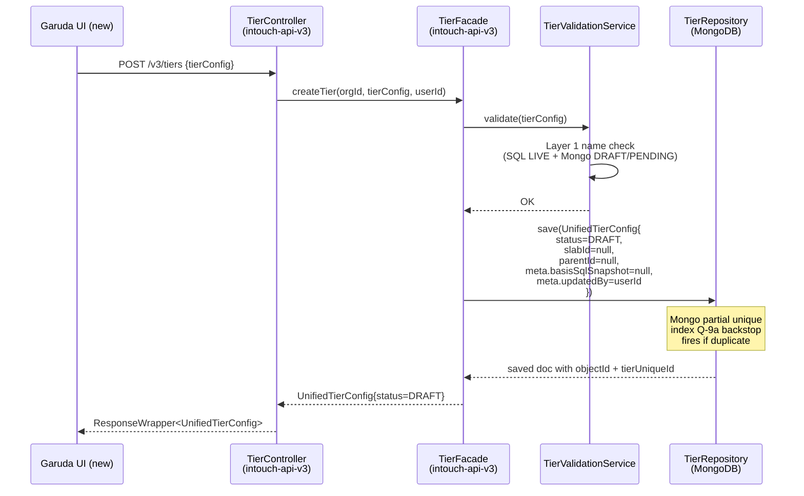
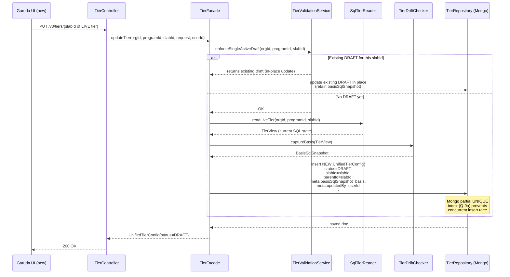
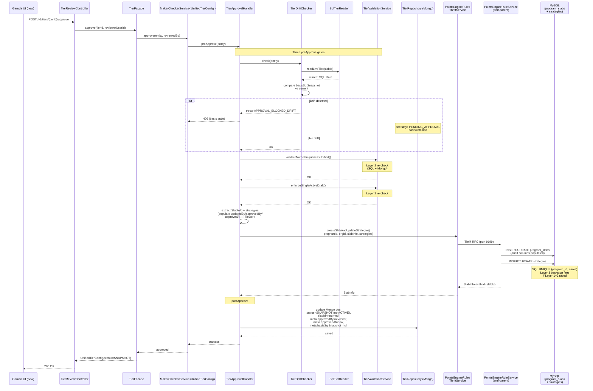
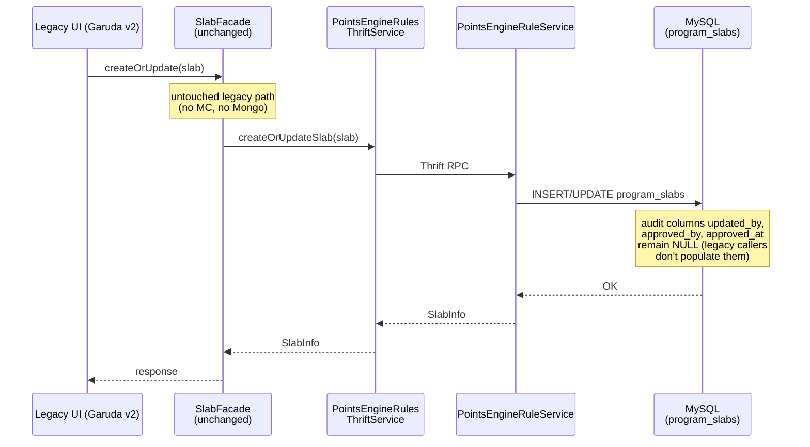
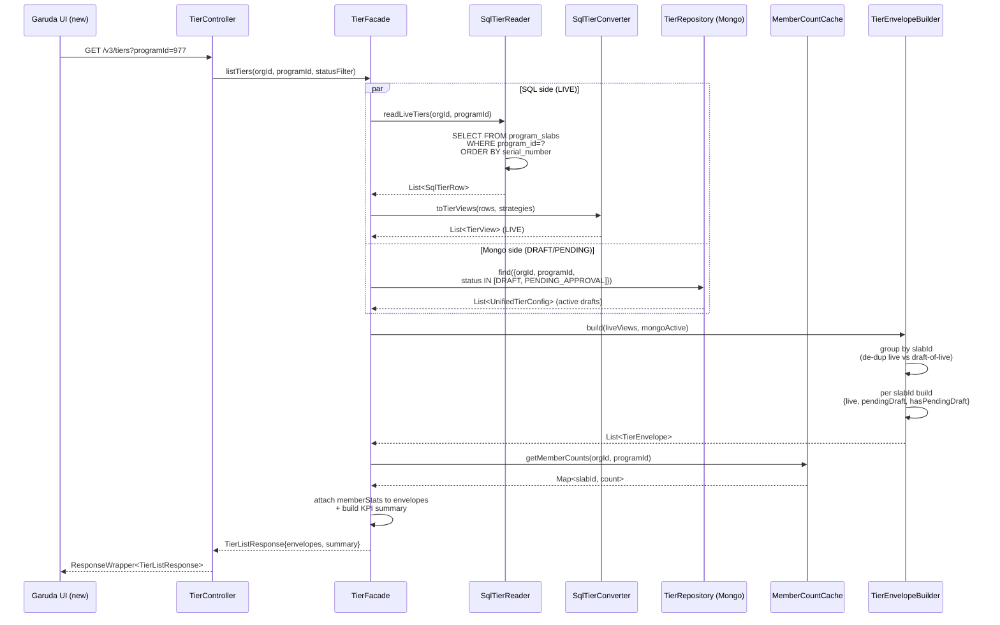
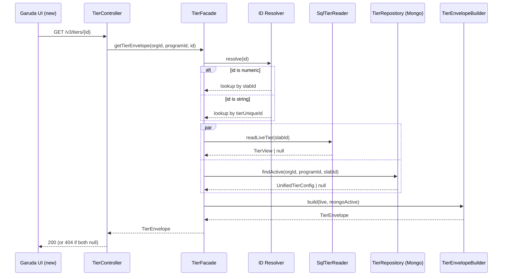
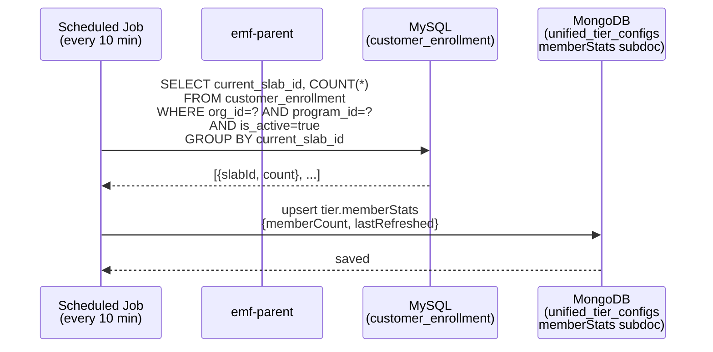
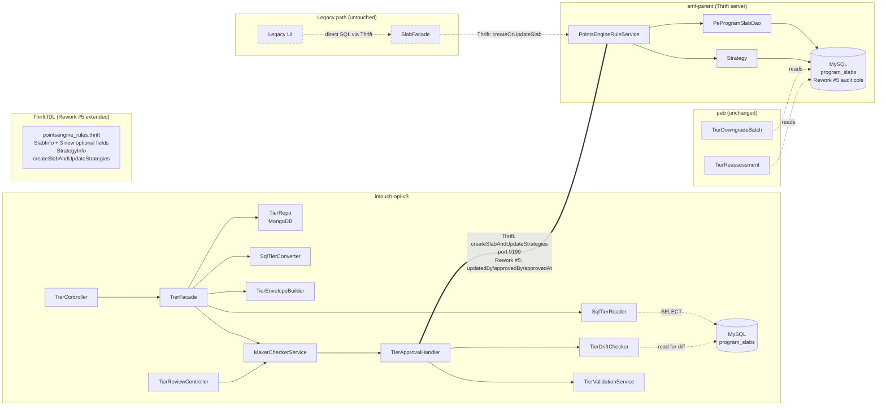

# Cross-Repo Trace — Tiers CRUD

> Phase 5: Cross-repo write/read path tracing
> Date: 2026-04-11 (updated 2026-04-17 — Rework #5 cascade)
>
> **Rework #5 changes**: Added dual write paths (new UI MC vs legacy UI bypass),
> drift detection in approval flow, envelope-shaped read path (hybrid SQL+Mongo),
> SqlTierConverter for legacy-bridge, and approve/reject endpoint split.

---

## Write Path 1: Tier Creation (NEW UI — always MC) ^Rework #5^



**Key changes from pre-Rework #5**:
- No more "MC enabled/disabled" branch — new UI ALWAYS goes through MC.
- Layer 1 name uniqueness check now queries BOTH SQL (LIVE rows) and Mongo (DRAFT/PENDING) — Q-9b.
- `meta.updatedBy` populated at create.

---

## Write Path 2: Tier Edit-of-LIVE (NEW UI — captures basisSqlSnapshot) ^Rework #5^



**Key**: `parentId=slabId` (Long, not ObjectId — Q-6). `basisSqlSnapshot` captured at DRAFT creation, NOT at every edit (so subsequent in-place updates retain the original basis).

---

## Write Path 3: Approval (NEW UI — drift-gated SAGA) ^Rework #5^



**Key changes**:
- `preApprove` enforces 3 gates: drift, name L2, single-active L2 — in that order.
- Mongo doc transitions PENDING_APPROVAL → SNAPSHOT directly (no ACTIVE intermediate). LIVE state lives in SQL only.
- SQL audit columns populated via Thrift `optional` fields (M-1).
- SAGA `onPublishFailure` rolls back doc to PENDING_APPROVAL with basis retained.

---

## Write Path 4: Reject (NEW UI — basis retained) ^Rework #5^

```mermaid
sequenceDiagram
    participant UI as Garuda UI (new)
    participant TRC as TierReviewController
    participant TF as TierFacade
    participant TR as TierRepository (Mongo)

    UI->>TRC: POST /v3/tiers/{tierId}/reject<br/>{comment}
    TRC->>TF: reject(tierId, RejectRequest{comment}, reviewerUserId)
    TF->>TR: update Mongo doc:<br/>status=DRAFT,<br/>meta.rejectionComment=comment,<br/>meta.rejectedBy=reviewer,<br/>meta.rejectedAt=now
    Note over TR: basisSqlSnapshot RETAINED<br/>(approver re-edits + re-submits<br/>against same basis; if SQL<br/>drifts later, drift gate blocks)
    TR-->>TF: saved
    TF-->>TRC: UnifiedTierConfig{status=DRAFT}
    TRC-->>UI: 200 OK
```

**Key**: `/reject` is a SEPARATE endpoint from `/approve` (Rework #5 split). `basisSqlSnapshot` is retained on reject — only cleared on successful approval (BT-155, BT-156).

---

## Write Path 5: Legacy UI Direct Write (BYPASSES MC) ^Rework #5 dual-path^



**Key**: Legacy UI writes coexist with new UI writes. They:
- Bypass MC entirely (no Mongo doc created).
- Populate SQL `program_slabs` directly via existing Thrift methods.
- Leave audit columns NULL (legacy clients don't know about Rework #5 M-1 fields — Thrift `optional` keeps backward compat).
- Are visible in the new envelope read path via SqlTierConverter (BT-147, BT-161).

---

## Read Path: Tier Listing (Envelope — Hybrid SQL+Mongo) ^Rework #5^



**Envelope shape per slabId**:

| Scenario | live | pendingDraft | hasPendingDraft |
|---|---|---|---|
| LIVE only (no DRAFT) | TierView (from SQL) | null | false |
| Brand-new DRAFT (no LIVE) | null | TierView (from Mongo DRAFT) | true |
| Edit-of-LIVE in DRAFT | TierView (from SQL) | TierView (from Mongo DRAFT) | true |
| Edit-of-LIVE in PENDING_APPROVAL | TierView (from SQL) | TierView (from Mongo PENDING) | true |
| Legacy SQL-only tier (ADR-06R) | TierView (from SqlTierConverter) | null | false |
| SNAPSHOT only (no LIVE, no DRAFT) | not surfaced in list | not surfaced in list | not surfaced |

LIVE state is read from SQL — single source of truth post-Rework #5.

---

## Read Path: Single-Tier Detail (Envelope) ^Rework #5^



**Key**: `/v3/tiers/{id}` accepts either a numeric `slabId` or a string `tierUniqueId` — resolver routes accordingly. Returns the envelope shape (consistent with list endpoint), not a flat `UnifiedTierConfig`.

---

## Member Count Cache Refresh Path (unchanged from pre-Rework #5)



Note: with envelope-based reads (Rework #5), member count attaches to the SQL-LIVE side of the envelope (via slabId join). Mongo `memberStats` subdoc still exists on UnifiedTierConfig for cron-managed cache.

---

## Per-Repo Change Inventory (post-Rework #5)

### intouch-api-v3 (PRIMARY — most new code)

| Type | File | Why |
|------|------|-----|
| NEW | resources/TierController.java | REST endpoints for tier CRUD + envelope reads |
| NEW | resources/TierReviewController.java | REST endpoints — approve + reject (split, Rework #5) |
| NEW | tier/TierFacade.java | Tier business logic + envelope builder + dual-path coordinator |
| NEW | tier/UnifiedTierConfig.java | MongoDB @Document — hoisted schema (Rework #5 Q-7) |
| NEW | tier/TierRepository.java | MongoRepository interface |
| NEW | tier/TierRepositoryImpl.java | Custom MongoDB queries + sharded access |
| NEW | tier/TierApprovalHandler.java | ApprovableEntityHandler<UnifiedTierConfig> impl: 3-gate preApprove → publish → postApprove |
| NEW | tier/TierValidationService.java | Field validation + 3-layer name uniqueness + single-active-draft |
| **NEW** | **tier/TierDriftChecker.java** | **Rework #5 — drift detection vs basisSqlSnapshot** |
| **NEW** | **tier/SqlTierReader.java** | **Rework #5 — read LIVE tiers from SQL** |
| **NEW** | **tier/SqlTierConverter.java** | **Rework #5 — convert ProgramSlab + strategies → TierView** |
| **NEW** | **tier/TierEnvelopeBuilder.java** | **Rework #5 — group SQL LIVE + Mongo DRAFT/PENDING into envelopes** |
| NEW | tier/model/TierMeta.java | Renamed from `metadata` (Q-7b); contains audit fields + basisSqlSnapshot |
| **NEW** | **tier/model/BasisSqlSnapshot.java** | **Rework #5 — serialized snapshot for drift detection** |
| **NEW** | **tier/model/TierView.java** | **Rework #5 — read-side projection (used in envelope)** |
| **NEW** | **tier/model/TierEnvelope.java** | **Rework #5 — `{live, pendingDraft, hasPendingDraft}` shape** |
| **NEW** | **tier/enums/TierOrigin.java** | **Rework #5 — derived from doc presence (LEGACY \| NEW_UI)** |
| NEW | tier/model/* | EligibilityCriteria, RenewalConfig, DowngradeConfig, etc. (hoisted to root — no `basicDetails` wrapper) |
| NEW | tier/enums/TierStatus.java | DRAFT, PENDING_APPROVAL, SNAPSHOT, DELETED (ACTIVE retained for back-compat only) |
| NEW | tier/dto/TierCreateRequest.java | Hoisted fields (Rework #5 Q-7a) |
| NEW | tier/dto/TierUpdateRequest.java | Hoisted fields |
| NEW | tier/dto/TierListResponse.java | List of TierEnvelope + KPI summary |
| **NEW** | **tier/dto/RejectRequest.java** | **Rework #5 — separate reject DTO with comment** |
| NEW | makechecker/MakerCheckerService.java | Generic SAGA service: preApprove → publish → postApprove |
| NEW | makechecker/MakerCheckerServiceImpl.java | SAGA implementation |
| NEW | makechecker/ApprovableEntity.java | Marker interface |
| NEW | makechecker/ApprovableEntityHandler.java | Strategy interface for domain-specific publish |
| NEW | makechecker/PendingChange.java | MongoDB @Document |
| NEW | makechecker/PendingChangeRepository.java | MongoRepository |
| NEW | makechecker/enums/EntityType.java | TIER, BENEFIT, SUBSCRIPTION |
| NEW | makechecker/enums/ChangeType.java | CREATE, UPDATE |
| NEW | makechecker/dto/ApprovalDecision.java | Approval/rejection decision DTO |
| NEW | makechecker/NotificationHandler.java | Hook interface |
| MODIFIED | services/thrift/PointsEngineRulesThriftService.java | Add wrapper methods + new optional audit fields |

**Total: ~32 new files (~6 new just in this Rework #5), 1 modified file**

### emf-parent (audit columns + Thrift wiring) ^Rework #5^

| Type | File | Why |
|------|------|-----|
| ~~MODIFIED~~ | ~~points/entity/ProgramSlab.java~~ | ~~Add status field~~ — NOT NEEDED (Rework #3) |
| ~~MODIFIED~~ | ~~points/dao/PeProgramSlabDao.java~~ | ~~Add findActiveByProgram()~~ — NOT NEEDED (Rework #3) |
| **MODIFIED** | **points/entity/ProgramSlab.java** | **Rework #5 — Add @Column updatedBy, approvedBy, approvedAt (nullable)** |
| **MODIFIED** | **points/dao/PeProgramSlabDao.java** | **Rework #5 — Persist new audit columns when SlabInfo carries them** |
| **NEW** | **scripts/migrations/V__add_tier_audit_columns.sql** | **Rework #5 M-1 — ALTER TABLE program_slabs (3 nullable columns)** |
| **NEW** | **scripts/migrations/V__add_program_name_unique.sql** | **Rework #5 Q-9b — ADD UNIQUE (program_id, name) — Layer 3** |

**Total: 2 modified entity/DAO files + 2 new migration scripts.**

### Thrift IDL (3 new optional fields on SlabInfo) ^Rework #5 M-1^

The existing `pointsengine_rules.thrift` already has:
- `createSlabAndUpdateStrategies` (create + config sync)
- `getAllSlabs` (read all slabs)
- `createOrUpdateSlab` (upsert slab)

**Rework #5 IDL change**: SlabInfo struct extended with 3 `optional` fields:
```thrift
struct SlabInfo {
  // ... existing fields ...
  10: optional string updatedBy;
  11: optional string approvedBy;
  12: optional i64    approvedAt;   // epoch millis UTC
}
```

**Backward compatibility C7**: All three are `optional` — existing clients (legacy SlabFacade callers) serialize without these fields, server leaves SQL columns NULL. No breaking change.

### peb (still NO changes in this pipeline run)

PEB reads `program_slabs` for tier downgrade/reassessment. PEB does not query the new audit columns. No PEB modification.

**0 modifications needed.** (C7 — verified: PEB DAOs don't reference updatedBy/approvedBy/approvedAt.)

### MongoDB (4 new indexes) ^Rework #5^

| Index | Purpose | Migration |
|---|---|---|
| `idx_utc_org_program_status` | envelope listing | M-3 |
| `uq_tier_one_active_draft_per_slab` (PARTIAL UNIQUE) | single-active-draft backstop | M-4 (Q-9a) |
| `uq_utc_tier_unique_id` (PARTIAL UNIQUE) | tierUniqueId external lookup | M-5 |
| `idx_utc_slab_id` | parentId resolution + history | M-6 |

See `01b-migrator.md` for full migration scripts.

---

## Cross-Repo Dependency Map (post-Rework #5)



**Reading the diagram**:
- Solid arrows = active code paths
- Dashed arrows = legacy (untouched-by-this-pipeline) paths
- The thick `===` line = the cross-repo Thrift call carrying Rework #5 audit fields
- Both write paths (new MC and legacy direct) terminate at the same `program_slabs` table — that table is the consolidated source of truth for LIVE state.

---

## Summary of Cross-Repo Touch Points (post-Rework #5)

| Touchpoint | Repo | Type | Scope |
|------------|------|------|-------|
| TierController + TierReviewController + TierFacade + envelope/SAGA stack | intouch-api-v3 | NEW | All Rework #5 new components |
| ProgramSlab entity + PeProgramSlabDao | emf-parent | MODIFIED | Audit columns wiring |
| SlabInfo Thrift IDL | Thrift | EXTENDED | 3 new optional fields (no break) |
| `program_slabs` SQL schema | DB layer | ALTER | M-1 audit columns + M-2 UNIQUE name |
| `unified_tier_configs` Mongo | DB layer | NEW | 4 indexes (M-3..M-6) |
| Legacy SlabFacade write path | intouch-api-v3 | UNTOUCHED | dual-path coexistence |
| PEB downgrade/reassessment | peb | UNTOUCHED | reads SQL only — no audit cols dependency |

**Cross-repo write claims requiring C6+ evidence**:
- "PEB requires zero modifications" → C7. Evidence: peb DAOs queried via grep — no references to `updated_by` / `approved_by` / `approved_at`. PEB queries are on `customer_enrollment.current_slab_id` and `program_slabs.id` only.
- "Legacy SlabFacade requires zero modifications" → C7. Evidence: SlabFacade calls `createOrUpdateSlab` Thrift method which accepts SlabInfo with the new optional fields unset → safe for legacy callers.
- "Thrift IDL extension is fully backward-compatible" → C7. Evidence: all 3 new fields marked `optional` in IDL; Thrift `optional` semantics permit unset serialization without breaking existing readers/writers.
