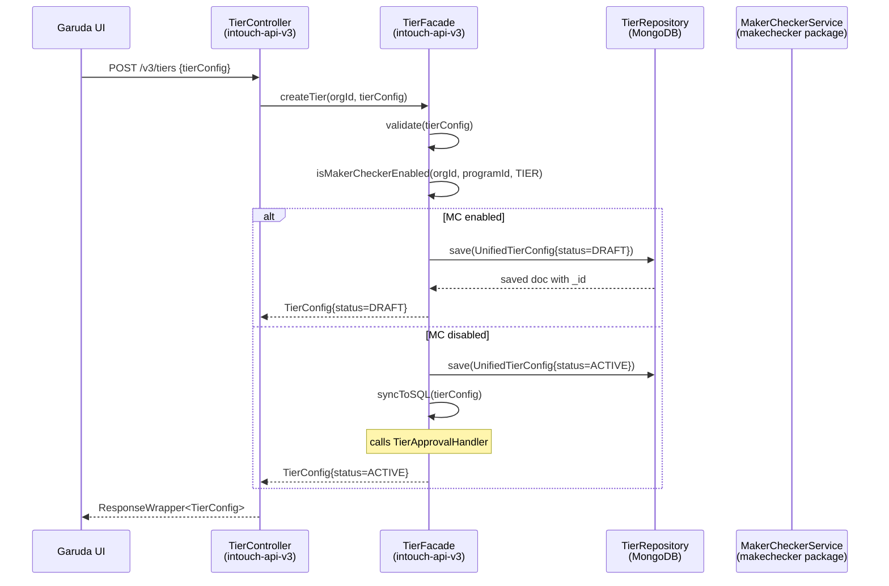
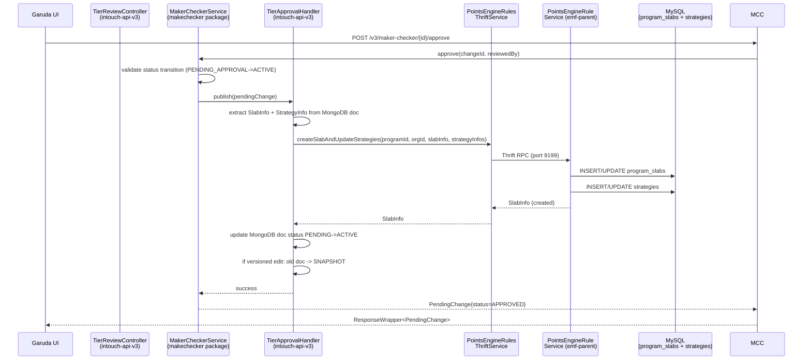
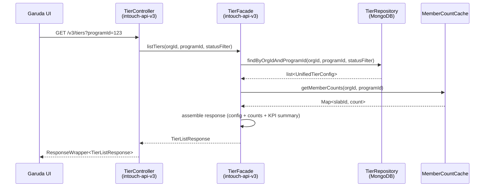
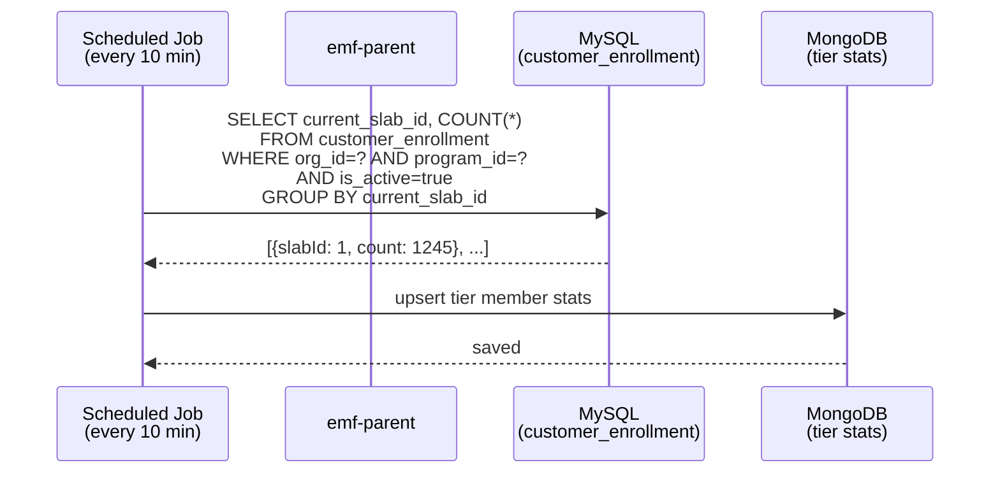
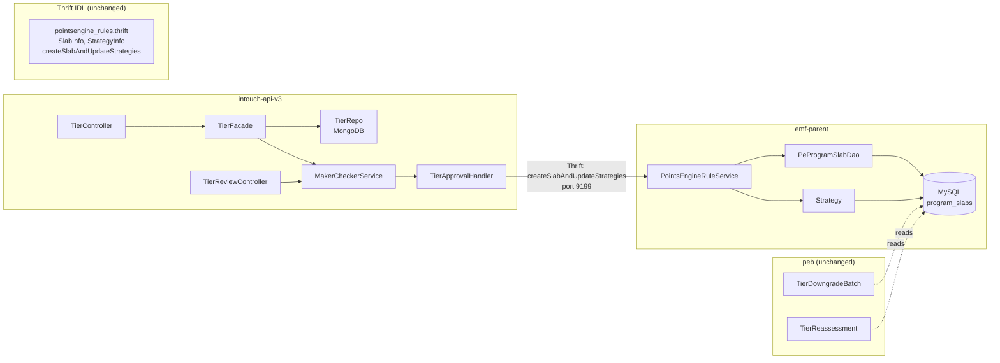

# Cross-Repo Trace -- Tiers CRUD

> Phase 5: Cross-repo write/read path tracing
> Date: 2026-04-11

---

## Write Path: Tier Creation (MC enabled)

## Write Path: Tier Approval (MC approve)

## Read Path: Tier Listing

## Member Count Cache Refresh Path

## Per-Repo Change Inventory

### intouch-api-v3 (PRIMARY -- most new code)

| Type | File | Why |
|------|------|-----|
| NEW | resources/TierController.java | REST endpoints for tier CRUD |
| NEW | resources/TierReviewController.java | REST endpoints for tier approval workflow |
| NEW | tier/TierFacade.java | Tier business logic + approval integration |
| NEW | tier/UnifiedTierConfig.java | MongoDB @Document for tier config |
| NEW | tier/TierRepository.java | MongoRepository interface |
| NEW | tier/TierRepositoryImpl.java | Custom MongoDB queries + sharded access |
| NEW | tier/TierRepositoryCustom.java | Custom query interface |
| NEW | tier/TierApprovalHandler.java | ApprovableEntityHandler<Tier> impl: MongoDB -> Thrift -> SQL |
| NEW | tier/TierValidationService.java | Field-level validation |
| NEW | tier/model/*.java | BasicDetails, EligibilityCriteria, RenewalConfig, DowngradeConfig, etc. |
| NEW | tier/enums/TierStatus.java | DRAFT, PENDING_APPROVAL, ACTIVE, DELETED, SNAPSHOT |
| NEW | tier/dto/TierCreateRequest.java | Create request DTO |
| NEW | tier/dto/TierUpdateRequest.java | Update request DTO |
| NEW | tier/dto/TierListResponse.java | List response with KPI summary |
| NEW | makechecker/MakerCheckerService.java | Generic approval service interface |
| NEW | makechecker/MakerCheckerServiceImpl.java | Approval implementation |
| NEW | makechecker/ApprovableEntityHandler.java | Strategy interface for domain-specific sync |
| NEW | makechecker/ApprovalRecord.java | MongoDB @Document for approval tracking |
| NEW | makechecker/ApprovalRepository.java | MongoRepository for approvals |
| NEW | makechecker/enums/EntityType.java | TIER, BENEFIT, SUBSCRIPTION, etc. |
| NEW | makechecker/enums/ApprovalStatus.java | PENDING, APPROVED, REJECTED |
| NEW | makechecker/dto/ApprovalRequest.java | Approval request DTO |
| NEW | makechecker/dto/ApprovalDecision.java | Approval/rejection decision DTO |
| NEW | makechecker/NotificationHandler.java | Hook interface for notifications |
| MODIFIED | services/thrift/PointsEngineRulesThriftService.java | Add wrapper methods for slab Thrift calls |

**Total: ~25 new files, 1 modified file**

### emf-parent (MINIMAL changes)

| Type | File | Why |
|------|------|-----|
| ~~MODIFIED~~ | ~~points/entity/ProgramSlab.java~~ | ~~Add status field~~ — NOT NEEDED (Rework #3) |
| ~~MODIFIED~~ | ~~points/dao/PeProgramSlabDao.java~~ | ~~Add findActiveByProgram() method~~ — NOT NEEDED (Rework #3) |
| ~~NEW~~ | ~~Flyway migration V__add_program_slab_status.sql~~ | ~~ALTER TABLE + INDEX~~ — NOT NEEDED (Rework #3) |

**Total: 0 files — No emf-parent entity/DAO changes needed. SQL only contains ACTIVE tiers, no status column.**

### Thrift (NO changes needed)

The existing `pointsengine_rules.thrift` already has:
- `createSlabAndUpdateStrategies` (create + config sync)
- `getAllSlabs` (read all slabs)
- `createOrUpdateSlab` (upsert slab)

**No Thrift IDL change required for basic CRUD.** May need a new method for status-only updates (setting STOPPED) if `createOrUpdateSlab` doesn't support it -- to be verified in HLD.

### peb (NO changes in this pipeline run)

PEB reads program_slabs for tier downgrade/reassessment. Since we're using expand-then-contract (existing `findByProgram()` unchanged), PEB is unaffected. PEB will continue to see all slabs including STOPPED ones, which is correct for historical evaluation.

**0 modifications needed.** (C6 -- verified: PEB uses its own DAO calls that don't filter by status, and the new status column defaults to ACTIVE for existing rows.)

## Cross-Repo Dependency Map

