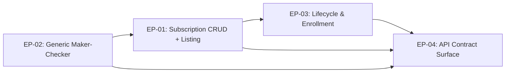
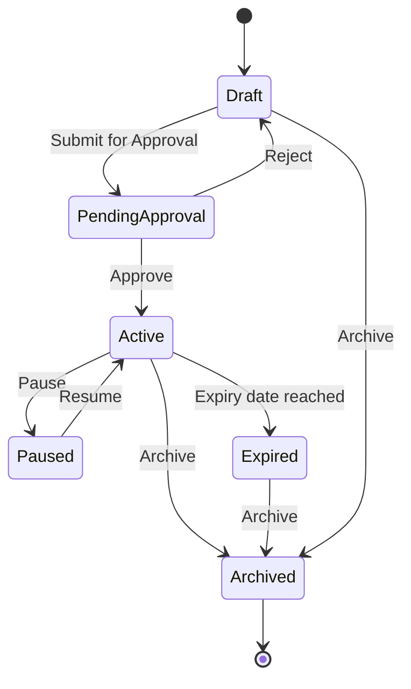
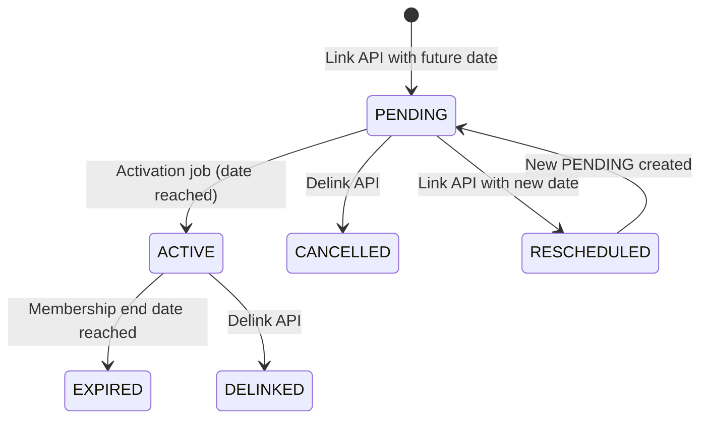

# PRD -- Subscription Program Revamp (E3)

> Feature: subscription-program-revamp
> Ticket: aidlc/subscription_v1
> Generated from: 00-ba.md, 00-ba-machine.md
> Date: 2026-04-14

---

## 1. Epics Overview

| Epic | Name | User Stories | Confidence | Est. Complexity |
|------|------|-------------|------------|-----------------|
| EP-01 | Subscription CRUD + Listing | US-01, US-02 | C5 | High |
| EP-02 | Generic Maker-Checker | US-03 | C4 | High |
| EP-03 | Lifecycle & Enrollment | US-04 | C4 | High |
| EP-04 | API Contract Surface | US-05 | C5 | Medium |

**Dependency ordering**: EP-02 (Maker-Checker) must be built first as a shared package. EP-01 (CRUD) depends on EP-02 for the approval flow. EP-03 (Lifecycle) depends on EP-01 for the subscription entity. EP-04 (API) wraps EP-01 + EP-02 + EP-03.

---

## 2. Epic 1: Subscription CRUD + Listing (EP-01)

### US-01: Subscription Listing View

**Summary**: GET API that returns all subscription programs for a loyalty program with stats, filtering, sorting, and search.

**Acceptance Criteria**:
- [ ] Paginated response with total count
- [ ] Header stats: Total Subscriptions, Active, Scheduled, Total Subscribers
- [ ] Multi-select status filter (Active, Draft, Scheduled, Paused, Expired)
- [ ] Case-insensitive search on name + description
- [ ] Sorting on: Subscribers (desc default), Last Modified, Name
- [ ] Grouped view by group_tag
- [ ] Benefits sub-query: linked benefits with tier indicator for tier-based subscriptions
- [ ] Subscriber count derived from supplementary_partner_program_enrollment

**API**: `GET /v3/subscriptions?programId={id}&status=ACTIVE,DRAFT&search=premium&sort=subscribers&groupBy=tag&page=0&size=20`

### US-02: Subscription Create & Edit

**Summary**: POST/PUT APIs for full subscription program CRUD with 5-step configuration form data, end-to-end validation, and maker-checker integration.

**Acceptance Criteria**:
- [ ] Create: POST /v3/subscriptions -- validates required fields (name, duration), saves to MongoDB as DRAFT
- [ ] Edit DRAFT: PUT /v3/subscriptions/{id} -- updates existing DRAFT document
- [ ] Edit ACTIVE (maker-checker): PUT /v3/subscriptions/{id} -- creates new DRAFT with parentId + version increment. ACTIVE stays live.
- [ ] Structured validation errors: field-level, human-readable (not 500s)
- [ ] Tier-based validation: if subscriptionType=TIER_BASED, linkedTierId is required
- [ ] Downgrade validation: if tierDowngradeOnExit=true, downgradeTargetTierId is required
- [ ] Duplicate: POST with cloned data, name + "(Copy)", status = DRAFT
- [ ] Custom fields: 3 levels (META, LINK, DELINK) stored in MongoDB document
- [ ] Reminders: up to 5, stored in MongoDB, synced to MySQL on approval

---

## 3. Epic 2: Generic Maker-Checker (EP-02)

### US-03: Generic Maker-Checker

**Summary**: A reusable maker-checker flow that subscriptions plug into, and tiers/benefits can plug into later.

**Design Philosophy**: The maker-checker is a flow/logic, not a separate entity or collection. It provides:
1. A shared state machine (DRAFT -> PENDING_APPROVAL -> ACTIVE)
2. The parentId/version versioning pattern for edit-of-active
3. Pluggable hooks for entity-specific pre/post transition logic
4. A publish-on-approve callback that entities implement to sync from MongoDB to MySQL

**Implementation**: Clean-room in a new `makechecker` package within intouch-api-v3. Does NOT modify or depend on UnifiedPromotion code.

**Acceptance Criteria**:
- [ ] `MakerCheckerEntity` interface: status, parentId, version, getId(), getOrgId()
- [ ] `MakerCheckerHooks<T>` interface: onPreApprove(T entity), onPostApprove(T entity), onPreReject(T entity), onPostReject(T entity), onPublish(T entity) -- entity implements to sync to MySQL
- [ ] `GenericMakerCheckerService<T extends MakerCheckerEntity>`: submitForApproval(T), approve(id, orgId, comment), reject(id, orgId, comment), listPending(orgId)
- [ ] State transition validation: only valid transitions allowed
- [ ] Edit-of-active: creates versioned DRAFT, preserves ACTIVE
- [ ] On approve: calls entity's onPublish hook (subscription writes to MySQL)
- [ ] On reject: reverts to DRAFT, preserves comments
- [ ] Concurrent modification protection (@Lockable or equivalent)

**API Endpoints (consumed through subscription routes)**:
- `PUT /v3/subscriptions/{id}/status` -- submit for approval, pause, resume, archive
- `GET /v3/subscriptions/approvals` -- list pending approvals
- `POST /v3/subscriptions/approvals` -- approve or reject

---

## 4. Epic 3: Lifecycle & Enrollment (EP-03)

### US-04: Lifecycle Management

**Summary**: Full state machine for subscription lifecycle with future-dated enrollment support.

**State Machine**:

**Scheduled State**: When a subscription is approved but has a future start date, it enters Scheduled state. A nightly activation job transitions Scheduled -> Active.

**Future-Dated Enrollment**:

**Acceptance Criteria**:
- [ ] State transitions enforce valid paths only (see diagram)
- [ ] Pause: blocks new enrollments, existing retain benefits
- [ ] Resume: re-enables enrollments
- [ ] Archive: permanent, read-only
- [ ] Future-dated enrollment: PENDING state, not activated until date
- [ ] Nightly activation job: PENDING -> ACTIVE transition
- [ ] Reschedule: atomic cancel-old + create-new PENDING
- [ ] Tier downgrade on exit: TIER_DOWNGRADE event on subscription expiry/cancellation for tier-based subscriptions

---

## 5. Epic 4: API Contract Surface (EP-04)

### US-05: API Contract

**Configuration APIs** (intouch-api-v3, new):

| # | Method | Endpoint | Request | Response | Notes |
|---|--------|----------|---------|----------|-------|
| 1 | GET | /v3/subscriptions | programId, status[], search, sort, groupBy, page, size | Page<SubscriptionProgramResponse> | Listing with stats |
| 2 | POST | /v3/subscriptions | SubscriptionProgramRequest | SubscriptionProgramResponse | Create. Returns validation errors or saved DRAFT. |
| 3 | GET | /v3/subscriptions/{id} | - | SubscriptionProgramResponse | Full config with benefits, reminders, custom fields |
| 4 | PUT | /v3/subscriptions/{id} | SubscriptionProgramRequest | SubscriptionProgramResponse | Edit. If ACTIVE + maker-checker, creates pending version. |
| 5 | PUT | /v3/subscriptions/{id}/status | StatusChangeRequest | SubscriptionProgramResponse | Pause, resume, archive, submit for approval |
| 6 | GET | /v3/subscriptions/{id}/benefits | - | List<BenefitReference> | Benefits linked to subscription |
| 7 | POST | /v3/subscriptions/{id}/benefits | BenefitLinkRequest | SubscriptionProgramResponse | Link benefits |
| 8 | GET | /v3/subscriptions/approvals | orgId | List<SubscriptionProgramResponse> | Pending approvals |
| 9 | POST | /v3/subscriptions/approvals | ReviewRequest (approvalStatus, comment) | SubscriptionProgramResponse | Approve or reject |

**Enrollment APIs** (api/prototype, existing -- extended):

| # | Method | Endpoint | Purpose | Extension |
|---|--------|----------|---------|-----------|
| 10 | POST | v2/partnerProgram/linkCustomer | Enroll member | Support future membershipStartDate (PENDING state) |
| 11 | POST | v2/partnerProgram/deLinkCustomer | Unenroll member | Support PENDING + ACTIVE target via updateType |
| 12 | POST | v2/partnerProgram/customerPartnerProgramUpdate | Lifecycle actions | Pause/resume support |
| 13 | GET | v2/partnerProgram/customerActivityHistories | History | Subscription lifecycle events |

---

## 6. Non-Functional Requirements

| # | Requirement | Target |
|---|------------|--------|
| NFR-01 | Listing API response time | < 500ms at p95 for 100 subscriptions |
| NFR-02 | Create/Edit API response time | < 1s at p95 |
| NFR-03 | Approval API response time (includes MySQL publish) | < 2s at p95 |
| NFR-04 | Concurrent modification safety | @Lockable or optimistic versioning on status changes |
| NFR-05 | Multi-tenant isolation | All queries filtered by orgId. No cross-org data leakage. |
| NFR-06 | Backward compatibility | Existing partner program APIs (v2) continue to work unchanged |

---

## 7. Grooming Questions (For Phase 4 -- Blocker Resolution)

| # | Question | Category | Priority |
|---|----------|----------|----------|
| GQ-01 | Maker-checker scope: Is it per-program (some programs have it, some don't) or global? How is it toggled? | SCOPE | BLOCKER |
| GQ-02 | Benefit linkage: Can the same benefit be linked to multiple subscriptions? Or is it exclusive? | SCOPE | BLOCKER |
| GQ-03 | Extended Fields EntityType: Who owns the api/prototype repo? Can we add a SUBSCRIPTION EntityType, or do we need a different approach for price? | FEASIBILITY | BLOCKER |
| GQ-04 | Archived subscriptions with active enrollments: Do active enrollments complete their cycle, or are they immediately terminated? | SCOPE | HIGH |
| GQ-05 | supplementary_membership_history: Does the action enum need new values for PAUSED, RESUMED, ARCHIVED? Who manages the Flyway migration for this? | FEASIBILITY | HIGH |
| GQ-06 | backup_partner_program_id vs migrate_on_expiry: Are these the same concept? Can we reuse the existing column? | SCOPE | MEDIUM |
| GQ-07 | Nightly activation job: Does infrastructure exist for scheduled PENDING -> ACTIVE transitions, or do we need a new cron? | FEASIBILITY | HIGH |
| GQ-08 | Subscriber count in listing: Is this a live query against enrollment table, or a cached/materialized count? What is the acceptable staleness? | FEASIBILITY | MEDIUM |

---

## 8. Out of Scope (Explicit)

| Item | Rationale |
|------|-----------|
| aiRa-Assisted Subscription Creation (E3-US3) | Future scope -- requires AI/ML service layer |
| Impact Simulation | Future scope -- complex member distribution forecasting |
| Auditing / Change Log | Future scope -- requires audit infrastructure |
| Maker-checker authorization per user level | UI concern, not backend |
| Price as first-class subscription field | Extended Field per brand decision |
| E1 (Tier Intelligence), E2 (Benefits as Product), E4 (Benefit Categories) | Separate pipeline runs |
| Custom fields for Promotions | Tracked as separate workstream |
| Real-time member streaming | Daily snapshots sufficient for Phase 1 |
