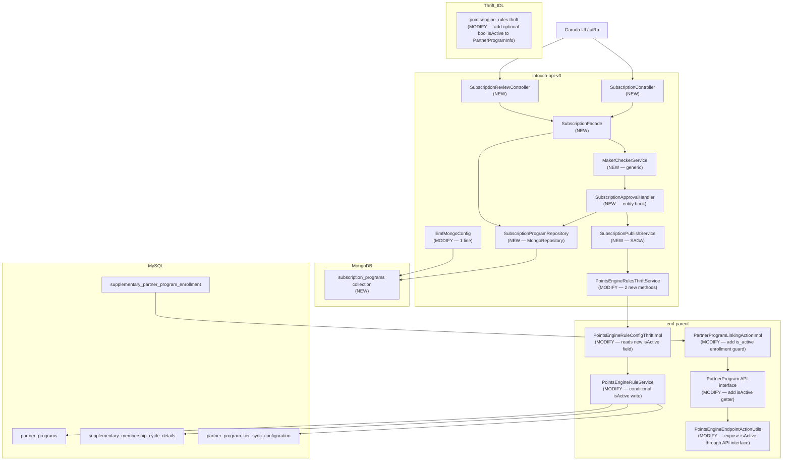

# HLD — Subscription Program Revamp (E3)
> Date: 2026-04-14 | Phase: 6 (Architect — rework 2026-04-15)
> Ticket: aidlc/subscription_v1
> Author: Architect Agent (Claude Sonnet 4.6)
> Rework: 11 critical gaps from UI validation document cross-check incorporated (ADR-08 through ADR-17)

---

## 1. Problem Statement

Subscription programs exist in Capillary today as "supplementary partner programs" but are exposed through a fragmented, low-fidelity interface with no unified listing, no maker-checker approval workflow, no benefit linkage visibility, and no lifecycle management beyond basic expiry. This epic rebuilds the subscription configuration surface as a first-class module in the Garuda platform.

**Key pain points addressed:**
- No single view of all subscription programs with status, pricing, subscribers, and benefits
- No native approval workflow (maker-checker) for config changes
- Benefits linked to subscriptions are invisible at setup time
- State transitions (pause, resume, archive) are not surface-level operations
- No structured custom fields for enrollment/delink actions

**Scope of this HLD:** E3 only (Subscription Programs). E1 (Tier Intelligence), E2 (Benefits as Product), E4 (Benefit Categories) are explicitly out of scope.

---

## 2. Scope (In / Out)

### In Scope

| User Story | Summary |
|-----------|---------|
| E3-US1 | Subscription Listing with header stats, filters, search, grouped view, benefits modal |
| E3-US2 | Create & Edit Flow — 5-step form with DRAFT/PENDING_APPROVAL maker-checker |
| E3-US4 | Lifecycle Management — DRAFT/PENDING_APPROVAL/ACTIVE/PAUSED/ARCHIVED state machine, PAUSE/RESUME/ARCHIVE actions |
| E3-US5 | Full REST API surface — CRUD, lifecycle, benefits linkage, approval endpoints |
| Cross-Cutting | Generic Maker-Checker (clean-room), Publish-on-Approve SAGA, MongoDB subscription doc, 3-level custom fields, reminders (MongoDB-only) |

### Out of Scope

| Item | Rationale |
|------|-----------|
| E1 Tier Intelligence, E2 Benefits as Product, E4 Benefit Categories | Separate pipeline runs |
| E3-US3 aiRa-Assisted Creation | Future scope |
| Auditing / Change Log | Future scope (KD-15) |
| Maker-checker per-user authorization | UI concern only (KD-09, KD-29) |
| Price as first-class field | Extended Field per brand (KD-16, KD-28) |
| Nightly scheduler / activation job | No SCHEDULED state; PENDING→ACTIVE is manual (KD-26, KD-34) |
| New MySQL tables or columns (Flyway) | MongoDB absorbs all new fields (KD-17, KD-18, KD-19) |

---

## 3. Current State Summary

All findings below are at C7 (verified from primary source) unless noted. Sources: `02-analyst.md` (V-01 through V-12), `05-cross-repo-trace.md` (V-1 through V-9), `session-memory.md` (KD-01 through KD-44).

### 3.1 Existing Infrastructure (Reused)

| Component | Location | Behaviour |
|-----------|----------|-----------|
| `partner_programs` MySQL table | `cc-stack-crm/schema/dbmaster/warehouse/partner_programs.sql` | id, org_id, loyalty_program_id, type (EXTERNAL/SUPPLEMENTARY), name, description, is_active, is_tier_based, partner_program_identifier (NOT NULL, auto-generated), expiry_date, backup_partner_program_id. UNIQUE KEY (org_id, name) spans ALL program types. |
| `supplementary_membership_cycle_details` | MySQL | cycle_type enum('DAYS','MONTHS'), cycle_value — no YEARS |
| `partner_program_tier_sync_configuration` | MySQL | Maps partner_program_slab_id ↔ loyalty_program_slab_id |
| `supplementary_partner_program_expiry_reminder` | MySQL | days_in_expiry_reminder, communication_property_values. Hard-capped at 2 per program by PointsEngineRuleService (line 1642). |
| `createOrUpdatePartnerProgram` Thrift | `PointsEngineRuleConfigThriftImpl.java:252` | Writes 3 MySQL tables: partner_programs, supplementary_membership_cycle_details, partner_program_tier_sync_configuration. Pure MySQL — no MongoDB reads/writes. |
| `PartnerProgramInfo` Thrift struct | `pointsengine_rules.thrift:402-417` | 14 fields. No `isActive` field (critical gap). No YEARS in `PartnerProgramCycleType` enum. |
| `UnifiedPromotion` MongoDB document | `intouch-api-v3/unified/promotion/` | `@Document(collection="unified_promotions")`. Uses parentId+version for edit-of-ACTIVE. DRAFT→PENDING_APPROVAL→ACTIVE state machine. Best-effort SAGA on approval (lines 905–951, 1119–1176). |
| `EmfMongoConfig` | `intouch-api-v3/config/EmfMongoConfig.java:27-33` | `includeFilters` lists only `UnifiedPromotionRepository.class`. New `SubscriptionProgramRepository` MUST be explicitly added. |
| Enrollment path | `PartnerProgramLinkingActionImpl.evaluateActionforSupplementaryLinking:172-253` | Checks expiry date only via `validatePartnerProgramExpiry`. Does NOT check `is_active`. Setting `is_active=false` does NOT block new enrollments today. |

### 3.2 Key Gaps (From Analysis)

| Gap | Evidence | Resolution |
|-----|----------|-----------|
| `PartnerProgramInfo` has no `isActive` field — PAUSE/ARCHIVE cannot use existing Thrift method | V-4, V-7 (C7) | KD-42: Add `optional bool isActive` to IDL |
| Enrollment path ignores `is_active` | V-4, Analyst V-06 (C6) | KD-37 + RF-2: New guard in `PartnerProgramLinkingActionImpl` |
| No `YEARS` cycle type in Thrift or MySQL | V-3, Analyst V-03 (C7) | KD-38: MongoDB stores YEARS; convert to MONTHS×12 on publish |
| Reminder hard-cap of 2 in PointsEngineRuleService | Analyst V-05 (C7) | KD-39: Reminders MongoDB-only; bypass Thrift reminder service |
| No `createOrUpdatePartnerProgram` wrapper in intouch-api-v3 | Cross-Repo Tracer (C6) | New wrapper method in `PointsEngineRulesThriftService` |
| `EmfMongoConfig.includeFilters` only has `UnifiedPromotionRepository` | Analyst V-01 (C7) | KD-41: Add `SubscriptionProgramRepository.class` to array |
| UNIQUE(org_id, name) spans all program types | Analyst (C7) | KD-40/RF-5: Pre-validate name uniqueness via Thrift before CREATE |

### 3.3 UnifiedPromotion SAGA Reference (V-1, C7)

`handleNewPromotionApproval()` (lines 1119–1176) → `EntityOrchestrator.orchestrate(PUBLISH_FLOW)` → `PromotionTransformerImpl.transform()` → Thrift call. On Thrift failure: sets `PUBLISH_FAILED` in MongoDB. On MongoDB update failure after Thrift success: Thrift-side is already committed (MySQL record exists). No distributed transaction. This is the **reference pattern** for the subscription SAGA.

---

## 4. Pattern Evaluation

### 4.1 SAGA Approach

| Pattern | Description | Fit for Subscription | Tradeoffs |
|---------|-------------|---------------------|-----------|
| **Best-effort SAGA (chosen)** | Sequential steps with compensation on failure. Step 1: Thrift/MySQL write. Step 2: MongoDB status update. On Thrift failure: abort, leave PENDING_APPROVAL. On MongoDB failure: retry (idempotent). | HIGH — matches UnifiedPromotion pattern already in production. Thrift call is atomic within MySQL. MongoDB retry is safe because `createOrUpdatePartnerProgram` is idempotent (UPDATE if `partnerProgramId > 0`). | No guaranteed consistency if MongoDB is persistently unavailable after Thrift success. Acceptable — MySQL is the operational source; MongoDB retry will converge. |
| Outbox Pattern | Append event to transactional outbox, async worker picks up and writes to secondary store. | LOW — adds async infrastructure (Kafka/RabbitMQ consumer) for a config operation where synchronous feedback is required. Overkill for a low-frequency CRUD operation. | Complex, adds broker dependency, harder to surface errors to caller. |
| Two-Phase Commit (2PC) | Distributed transaction manager across MySQL + MongoDB. | LOW — requires XA transaction manager. Spring/JPA does not natively support cross-store XA without heavyweight infrastructure. Not used elsewhere in Capillary. | High operational complexity, JTA overhead, not supported by standard MongoDB driver in multi-doc writes without transactions. |
| Saga Choreography (events) | Each step emits domain events; downstream consumers react. | LOW — event-driven for a synchronous API request adds latency and complexity. User expects immediate feedback on approval. | Adds Kafka topics, consumer groups, dead-letter handling. Not appropriate for sync user-facing operations. |

**Recommendation: Best-effort SAGA** — mirrors UnifiedPromotion, synchronous feedback to caller, idempotent on retry. **Confidence: C6.**

### 4.2 Generic Maker-Checker Design

| Pattern | Description | Fit | Tradeoffs |
|---------|-------------|-----|-----------|
| **Interface + Composition (chosen)** | Generic `MakerCheckerService<T extends ApprovableEntity>` with pluggable hooks via `ApprovableEntityHandler<T>` interface. State machine logic centralized. Entity-specific validation/publish as `Handler` implementations. | HIGH — clean separation of generic state machine from entity concerns. Subscriptions implement `SubscriptionApprovalHandler`. Future Tiers/Benefits provide their own handlers. No shared base class makes handlers independently testable. | Slightly more interface-wiring boilerplate than abstract base class. |
| Abstract Base Class | `AbstractMakerCheckerFacade` extended by `SubscriptionFacade`. Common methods inherited. | MEDIUM — simpler for single entity but creates tight coupling via inheritance. Java's single inheritance means future tiers/benefits compete for the same base class slot. Harder to test in isolation. | Coupling through inheritance; refactoring base class risks all subclasses. |
| Strategy Pattern (standalone) | `MakerCheckerStateMachine` as a strategy injected into each entity's facade. | MEDIUM — equivalent to Interface+Composition but with an explicit Strategy holder object. Functionally identical; the chosen approach already embodies this at interface level. | Naming/structural difference only. |
| Promotion Extraction (rejected) | Refactor `UnifiedPromotionFacade` to extract a reusable base. | LOW — UnifiedPromotionFacade has 6+ promotion-specific hooks woven into every transition (V-1, V-2, KD-22). Extraction would require touching 500+ lines of live production code, risking regression. KD-22 explicitly forbids this. | High risk, high regression surface. Rejected per KD-22. |

**Recommendation: Interface + Composition** — matches KD-22 clean-room mandate, testable, future-extensible. **Confidence: C6.**

### 4.3 MongoDB Document Versioning

| Pattern | Description | Fit | Tradeoffs |
|---------|-------------|-----|-----------|
| **parentId + version (chosen)** | New DRAFT created with `parentId=ACTIVE.objectId`, `version=existing+1`. Both docs exist simultaneously. On APPROVE: old ACTIVE transitions to history, DRAFT becomes ACTIVE. On REJECT: DRAFT stays as DRAFT. | HIGH — directly matches UnifiedPromotion pattern (C7 evidence). ACTIVE subscription stays live during edit review. Fully reversible. | Two docs in flight during edit review. Listing query must filter for latest version only. |
| Event Sourcing | Reconstruct state from event log. No mutable documents. | LOW — no event store infrastructure in Capillary. Heavy lift for a config entity that has at most single-digit edits per lifecycle. Overkill. | Requires new infrastructure, complex rebuilds. |
| Single document with embedded history | One doc, `editHistory[]` array for previous versions. | LOW — MongoDB document size limit (16MB) concern for long-lived subscriptions; concurrent update conflicts harder to manage; ACTIVE doc must be mutated which violates the "ACTIVE stays live" invariant. | Mutation of ACTIVE doc is a regression risk. |

**Recommendation: parentId + version (UnifiedPromotion pattern).** **Confidence: C7.**

### 4.4 Optimistic Locking Strategy for DRAFT Documents

MongoDB DRAFT documents are modified by a single user (the creator) during the DRAFT phase. Concurrent edit collisions are unlikely but possible. The `version` field already exists for the parentId pattern. Reuse it as an optimistic lock: include `version` in every `save()` call to MongoDB's repository with a `@Version`-style assertion. Designer will define the exact MongoDB optimistic locking mechanism (Spring Data MongoDB `@Version` annotation on the `version` field).

---

## 5. Proposed Architecture

### 5.1 Module Structure (intouch-api-v3)

**Package root**: `com.capillary.intouchapiv3`

New packages follow the existing `unified/promotion` sub-package convention observed in the codebase. The subscription module is placed at a sibling level:

```
com.capillary.intouchapiv3
├── unified/
│   ├── promotion/          (existing — DO NOT TOUCH)
│   └── subscription/       (NEW — main subscription module)
│       ├── SubscriptionProgram.java              (MongoDB @Document)
│       ├── SubscriptionProgramRepository.java    (MongoRepository)
│       ├── SubscriptionFacade.java               (orchestration layer)
│       ├── SubscriptionPublishService.java       (SAGA publish logic)
│       ├── SubscriptionStatusValidator.java      (state transition guard)
│       ├── SubscriptionMapper.java               (doc ↔ DTO mapper)
│       ├── dto/
│       │   ├── SubscriptionRequest.java
│       │   ├── SubscriptionResponse.java
│       │   ├── SubscriptionListResponse.java
│       │   ├── ApprovalRequest.java
│       │   └── StatusChangeRequest.java          (NEW — subscription-specific, NOT reuse of promotion's)
│       ├── enums/
│       │   ├── SubscriptionStatus.java           (DRAFT/PENDING_APPROVAL/ACTIVE/PAUSED/ARCHIVED)
│       │   └── SubscriptionAction.java           (SUBMIT_FOR_APPROVAL/PAUSE/RESUME/ARCHIVE/DUPLICATE)
│       ├── exception/
│       │   ├── SubscriptionNotFoundException.java
│       │   ├── InvalidSubscriptionStateException.java
│       │   └── SubscriptionNameConflictException.java
│       └── validation/
│           └── SubscriptionValidator.java
│
├── makechecker/            (NEW — generic maker-checker core)
│   ├── ApprovableEntity.java                     (marker interface — any entity with status+parentId+version)
│   ├── ApprovableEntityHandler.java              (pluggable hook interface)
│   │   // Methods: validate(T), preApprove(T), postApprove(T), preReject(T), postReject(T)
│   ├── MakerCheckerService.java                  (generic state machine)
│   ├── ApprovalStatus.java                       (APPROVE / REJECT enum)
│   └── ApprovalResult.java                       (outcome DTO)
│
└── resources/              (existing controllers package)
    ├── SubscriptionController.java               (NEW — CRUD + lifecycle endpoints)
    └── SubscriptionReviewController.java         (NEW — approval endpoints)
```

**Modified files (intouch-api-v3):**

| File | Location | Change |
|------|----------|--------|
| `EmfMongoConfig.java` | `config/EmfMongoConfig.java:32` | Add `SubscriptionProgramRepository.class` to `includeFilters` array (1-line change, KD-41) |
| `PointsEngineRulesThriftService.java` | `services/` | Add two new methods: (1) `createOrUpdatePartnerProgram()` wrapper; (2) `setPartnerProgramIsActive()` wrapper for new Thrift method |

---

### 5.2 MongoDB Document Schema

**Collection**: `subscription_programs`
**Document class**: `SubscriptionProgram` annotated with `@Document(collection = "subscription_programs")`

```json
{
  "_id": "ObjectId (auto-generated by MongoDB)",
  "subscriptionProgramId": "String — immutable UUID assigned at creation (like unifiedPromotionId)",
  "orgId": "Long — tenant identifier (G-07: every query includes this filter)",
  "programId": "Integer — loyalty_program_id (1:1 mapping per KD-13)",
  "status": "SubscriptionStatus enum: DRAFT | PENDING_APPROVAL | ACTIVE | PAUSED | ARCHIVED",
  "version": "Integer — starts at 1, increments on each edit-of-ACTIVE. Also serves as optimistic lock.",
  "parentId": "String (nullable) — ObjectId of the ACTIVE doc this DRAFT was forked from. Null for first-time creations.",
  "mysqlPartnerProgramId": "Integer (nullable) — populated post-approval with MySQL partner_programs.id",

  "name": "String (required) — max 50 chars, regex ^[a-zA-Z0-9_\\-: ]*$, case-insensitively unique per orgId across ALL partner program types (ADR-08, ADR-11)",
  "description": "String (required, NOT NULL) — max 100 chars, regex ^[a-zA-Z0-9_\\-: ,.\\s]*$ (ADR-09)",
  "subscriptionType": "SubscriptionType enum: TIER_BASED | NON_TIER",
  "programType": "String (required) — ProgramType enum: SUPPLEMENTARY | EXTERNAL (ADR-14)",
  "pointsExchangeRatio": "Double (required, positive) — programToPartnerProgramPointsRatio wired to Thrift field 6 (ADR-12)",
  "syncWithLoyaltyTierOnDowngrade": "Boolean (required) — direct user-set field; true when loyaltySyncTiers is non-empty; wired to Thrift field 10 (ADR-13)",

  "duration": {
    "cycleType": "CycleType enum: DAYS | MONTHS ONLY — YEARS rejected at API boundary (ADR-10). Internal note: ADR-07 (YEARS→MONTHS×12 publish conversion) is superseded for API input; MongoDB now stores only DAYS or MONTHS.",
    "cycleValue": "Integer (positive, required) — only present when programType=SUPPLEMENTARY; forbidden for EXTERNAL (ADR-14)"
  },

  "expiry": {
    "programExpiryDate": "Instant (nullable, UTC — G-01.1) — overrides individual enrollment duration when set",
    "migrateOnExpiry": "MigrateOnExpiry enum: NONE | MIGRATE_TO_PROGRAM",
    "migrationTargetProgramId": "Integer (nullable) — MySQL partner_program_id of fallback program (maps to backup_partner_program_id on publish)"
  },

  "settings": {
    "restrictToOneActivePerMember": "Boolean — powered by EMF ENABLE_PARTNER_PROGRAM_LINKING setting"
  },

  "tierConfig": {
    "linkedTierId": "Integer (nullable) — loyalty slab id; required when subscriptionType=TIER_BASED",
    "tierDowngradeOnExit": "Boolean",
    "downgradeTargetTierId": "Integer (nullable) — required when tierDowngradeOnExit=true",
    "tiers": [
      {
        "tierNumber": "Integer — serial_number in partner_program_slabs; wired to Thrift field 5 partnerProgramTiers (ADR-16)",
        "tierName": "String — name in partner_program_slabs; non-empty when subscriptionType=TIER_BASED"
      }
    ],
    "loyaltySyncTiers": "Map<String, String> — partnerTierName → loyaltyTierName; wired to Thrift field 11 loyaltySyncTiers when syncWithLoyaltyTierOnDowngrade=true (ADR-17)"
  },

  "benefits": [
    {
      "benefitId": "Long",
      "addedOn": "Instant (UTC — G-01.1)"
    }
  ],

  "reminders": [
    {
      "daysBeforeExpiry": "Integer — must be > 0 (strictly positive, validated per ADR-17-supplement / KD-39 rework). Renamed from daysBeforeExpiry: matches UI field daysBeforeExpiryReminder.",
      "channel": "ReminderChannel enum: SMS | EMAIL | PUSH",
      "communicationProperties": "Map<String, String>"
    }
  ],

  "customFields": {
    "meta": [{ "extendedFieldId": "Long", "name": "String" }],
    "link": [{ "extendedFieldId": "Long", "name": "String" }],
    "delink": [{ "extendedFieldId": "Long", "name": "String" }]
  },

  "groupTag": "String (optional) — for grouped view in listing",

  "workflowMetadata": {
    "submittedBy": "String (userId)",
    "submittedAt": "Instant (UTC)",
    "reviewedBy": "String (nullable)",
    "reviewedAt": "Instant (nullable, UTC)"
  },

  "comments": "String (nullable) — rejection comment; also used for approval notes",

  "createdBy": "String",
  "createdAt": "Instant (UTC — G-01.1)",
  "updatedBy": "String",
  "updatedAt": "Instant (UTC — G-01.1)"
}
```

**MongoDB Index Strategy (to be finalized by Designer):**

| Index | Fields | Type | Rationale |
|-------|--------|------|-----------|
| Primary lookup | `(orgId, programId, status)` | Compound | All list queries filter by org+program+status |
| Single fetch | `(subscriptionProgramId, orgId)` | Compound unique | GET by subscriptionProgramId |
| Edit-of-active lookup | `(parentId)` | Single | Find pending edits by parent |
| Search | `(orgId, name)` | Text index | Free-text search (AC-04) |
| Group listing | `(orgId, programId, groupTag)` | Compound | Grouped view (AC-06) |

---

### 5.3 Generic Maker-Checker Design

#### 5.3.1 Core Interfaces

**`ApprovableEntity` marker interface** (package: `makechecker`):
- Defines contract: `getStatus()`, `getParentId()`, `getVersion()`, `setStatus()`, `setComments()`
- `SubscriptionProgram` implements this interface

**`ApprovableEntityHandler<T extends ApprovableEntity>` interface** (package: `makechecker`):

| Method | Purpose | Called When |
|--------|---------|-------------|
| `validateForSubmission(T entity)` | Entity-specific pre-submission checks (required fields, business rules) | Before DRAFT→PENDING_APPROVAL |
| `preApprove(T entity)` | Last-minute validation before approval (e.g., name uniqueness re-check) | Before PENDING_APPROVAL→ACTIVE |
| `publish(T entity)` | Performs the side effect (e.g., Thrift/MySQL write for subscriptions) | During approval SAGA |
| `postApprove(T entity, PublishResult result)` | Post-publish updates (e.g., store mysqlPartnerProgramId, set ACTIVE) | After successful publish |
| `onPublishFailure(T entity, Exception e)` | Compensation: update status, log, surface error | When publish() throws |
| `preReject(T entity)` | Optional: validate rejection is allowed | Before rejection |
| `postReject(T entity, String comment)` | Set status=DRAFT, store comment | After rejection |

**`MakerCheckerService<T extends ApprovableEntity>`** (package: `makechecker`):
- Holds the generic state machine transitions
- Delegates to `ApprovableEntityHandler` for entity-specific logic
- State machine:

```
DRAFT ──────────────────────────────────────────────────→ ARCHIVED (direct archive of un-submitted draft)
  │
  │ submitForApproval() [validateForSubmission passes]
  ▼
PENDING_APPROVAL ──────────────────────────────────────→ DRAFT (reject: sets comment, no delete)
  │
  │ approve() [preApprove passes → publish() → postApprove]
  ▼
ACTIVE ─────→ PAUSED ─────→ ACTIVE (resume)
  │
  └──────────────────────────────────────────────────────→ ARCHIVED

PAUSED ───────────────────────────────────────────────→ ARCHIVED
```

#### 5.3.2 Allowed State Transitions

| From | To | Trigger | Guard |
|------|----|---------|-------|
| DRAFT | PENDING_APPROVAL | `submitForApproval()` | Required fields present, name uniqueness |
| DRAFT | ARCHIVED | `archive()` | Direct archive without approval (no MySQL write) |
| PENDING_APPROVAL | ACTIVE | `approve()` | preApprove passes, publish succeeds |
| PENDING_APPROVAL | DRAFT | `reject(comment)` | Always allowed |
| ACTIVE | PAUSED | `pause()` | Current status must be ACTIVE |
| ACTIVE | ARCHIVED | `archive()` | Current status must be ACTIVE or PAUSED |
| PAUSED | ACTIVE | `resume()` | Current status must be PAUSED |
| PAUSED | ARCHIVED | `archive()` | Current status must be PAUSED |

All other transitions are invalid and throw `InvalidSubscriptionStateException`.

#### 5.3.3 Edit-of-ACTIVE Flow

When a PUT /subscriptions/{id} is called on an ACTIVE subscription:
1. Fetch ACTIVE document from MongoDB
2. Create a new `SubscriptionProgram` document:
   - `subscriptionProgramId` = **copied from ACTIVE document** (NOT a new UUID — see ADR-18)
   - `parentId` = ACTIVE document's `_id` (ObjectId string)
   - `version` = ACTIVE document's `version` + 1
   - `status` = DRAFT
   - All other fields copied from request body (the edit)
3. Save new DRAFT doc; ACTIVE doc remains unchanged and live
4. Return the new DRAFT document

On APPROVE of versioned edit:
1. DRAFT doc transitions to ACTIVE (via normal SAGA)
2. Old ACTIVE doc's status updated to `ARCHIVED` (it becomes historical)
3. `mysqlPartnerProgramId` from old ACTIVE is carried to the new ACTIVE doc
4. MySQL is updated via `createOrUpdatePartnerProgram` using the existing `partnerProgramId`

---

### 5.4 SAGA — Publish-on-Approve

This is the most complex operation. It implements a **best-effort SAGA** mirroring `handleNewPromotionApproval()` in `UnifiedPromotionFacade.java` (lines 1119–1176, C7 evidence).

#### SAGA Steps

| Step | Component | Action | Compensation on Failure |
|------|-----------|--------|------------------------|
| 1 | `SubscriptionFacade` | Fetch PENDING_APPROVAL doc from MongoDB by subscriptionProgramId + orgId | Abort — return 404/conflict |
| 2 | `SubscriptionFacade` | Validate state is PENDING_APPROVAL; call `ApprovableEntityHandler.preApprove()` — re-check name uniqueness against MySQL | Return 409/422 — remain PENDING_APPROVAL |
| 3 | `SubscriptionPublishService` | Build `PartnerProgramInfo` Thrift struct from MongoDB doc using complete 15-field mapping (see PartnerProgramInfo Field Mapping table below) | N/A |
| 4 | `SubscriptionPublishService` | ~~Map cycleType YEARS→MONTHS×12 (KD-38)~~ REMOVED: ADR-10 rejects YEARS at API boundary; cycleType in MongoDB is already DAYS or MONTHS. No conversion needed. | N/A |
| 5 | `PointsEngineRulesThriftService` | Call `createOrUpdatePartnerProgram(PartnerProgramInfo, programId, orgId)` via Thrift | SAGA COMPENSATION: if Thrift throws → do NOT update MongoDB; log error with orgId+subscriptionProgramId (G-08); return 502 to caller; MongoDB remains PENDING_APPROVAL |
| 6 | `SubscriptionPublishService` | Receive `partnerProgramId` from Thrift response | N/A |
| 7 | `SubscriptionPublishService` | DO NOT call `createOrUpdateExpiryReminderForPartnerProgram` — reminders stay in MongoDB only (KD-39) | N/A |
| 8 | `SubscriptionFacade` | Update MongoDB doc: `status=ACTIVE`, `mysqlPartnerProgramId=<returned partnerProgramId>`, `workflowMetadata.reviewedBy`, `workflowMetadata.reviewedAt=Instant.now()`, `comments=approvalComment` | RETRY: if MongoDB save fails after Thrift success → retry MongoDB save up to 3 times (idempotent — UPDATE by subscriptionProgramId). If retry exhausted: log CRITICAL alert (MySQL has record but MongoDB is stale); return success to caller but flag for monitoring. |

#### PartnerProgramInfo Field Mapping (Complete — All 15 Thrift Fields)

> This table is authoritative. Every field in `PartnerProgramInfo` Thrift struct is accounted for. Fields marked "was wrong" indicate corrections from the UI validation gap analysis (rework 2026-04-15). Confidence: C7.

| Thrift Field # | Field Name | Source in SubscriptionProgram | Implementation in buildPartnerProgramInfo() | Notes |
|---|---|---|---|---|
| 1 | `partnerProgramId` | `mysqlPartnerProgramId` | `0` for new programs (CREATE); existing `mysqlPartnerProgramId` for updates (UPDATE semantics — emf-parent uses `partnerProgramId > 0` as UPDATE signal) | KD-43: auto-generated by EMFUtils inside emf-parent on CREATE |
| 2 | `partnerProgramName` | `name` | `info.setPartnerProgramName(program.getName())` | Direct mapping |
| 3 | `description` | `description` | `info.setDescription(program.getDescription())` | Now required field (ADR-09); no null default needed |
| 4 | `isTierBased` | `subscriptionType == TIER_BASED` | `info.setIsTierBased(program.getSubscriptionType() == TIER_BASED)` | Boolean derivation |
| 5 | `partnerProgramTiers` | `tierConfig.tiers` (List<ProgramTier>) | `info.setPartnerProgramTiers(mapTiers(program.getTierConfig().getTiers()))` when TIER_BASED; `Collections.emptyList()` when NON_TIER | **Was never wired (GAP-9/ADR-16).** ProgramTier has `{tierNumber, tierName}`. Stored in MySQL as `partner_program_slabs (serial_number, name)`. |
| 6 | `programToPartnerProgramPointsRatio` | `pointsExchangeRatio` | `info.setProgramToPartnerProgramPointsRatio(program.getPointsExchangeRatio())` | **Was hardcoded 1.0 (GAP-5/ADR-12).** Now required field from MongoDB document. |
| 7 | `partnerProgramUniqueIdentifier` | N/A — not set by intouch-api-v3 | Do NOT set. Left null/unset. | Auto-generated by `EMFUtils.generatePartnerProgramIdentifier()` inside `saveSupplementaryPartnerProgramEntity` (KD-43). |
| 8 | `partnerProgramType` | `programType` (SUPPLEMENTARY / EXTERNAL) | `info.setPartnerProgramType(PartnerProgramType.valueOf(program.getProgramType().name()))` | **Was hardcoded SUPPLEMENTARY (GAP-7/ADR-14).** Now from model field. |
| 9 | `partnerProgramMembershipCycle` | `duration` (cycleType + cycleValue) | When `programType=SUPPLEMENTARY`: `cycle.setCycleType(...)` + `cycle.setCycleValue(...)`. When `programType=EXTERNAL`: do NOT set this field (null / empty struct). | Duration conditional on programType (ADR-14). No YEARS conversion needed post-ADR-10. |
| 10 | `isSyncWithLoyaltyTierOnDowngrade` | `syncWithLoyaltyTierOnDowngrade` | `info.setIsSyncWithLoyaltyTierOnDowngrade(program.isSyncWithLoyaltyTierOnDowngrade())` | **Was wrongly derived as `TIER_BASED && tierDowngradeOnExit==true` (GAP-6/ADR-13).** Now direct user-set field from MongoDB. |
| 11 | `loyaltySyncTiers` | `tierConfig.loyaltySyncTiers` (Map<String,String>) | When `syncWithLoyaltyTierOnDowngrade=true`: `info.setLoyaltySyncTiers(program.getTierConfig().getLoyaltySyncTiers())`. Else: do NOT set (null / empty map). | **Was never wired (GAP-10/ADR-17).** MySQL storage: `partner_program_tier_sync_configuration` — PointsEngineRuleService maps names to IDs via slab lookup. |
| 12 | `updatedViaNewUI` | Hardcoded `true` | `info.setUpdatedViaNewUI(true)` | Always true for new UI flows |
| 13 | `expiryDate` | `expiry.programExpiryDate` | `info.setExpiryDate(program.getExpiry().getProgramExpiryDate().toEpochMilli())` | Null if no expiry. i64 UTC epoch millis (G-01.1). |
| 14 | `backupProgramId` | `expiry.migrationTargetProgramId` | `info.setBackupProgramId(program.getExpiry().getMigrationTargetProgramId())` | Null if no migration (KD-33). |
| 15 | `isActive` | Lifecycle action (PAUSE/RESUME/ARCHIVE) | On PAUSE/ARCHIVE: `info.setIsActive(false)`. On RESUME: `info.setIsActive(true)`. On CREATE/UPDATE approve: `info.setIsActive(true)`. | KD-42, ADR-05. Optional field — not set on normal CREATE/UPDATE (preserves existing emf-parent is_active copy behaviour). |

#### SAGA Idempotency (RF-6)

If MongoDB update at step 8 fails after Thrift success, a retry of the approval endpoint will re-enter the SAGA at step 1. The doc is still PENDING_APPROVAL (correct). Step 5 (Thrift call) will call `createOrUpdatePartnerProgram` again — this is **idempotent** because the existing emf-parent code (`saveSupplementaryPartnerProgramEntity`, line 1857) uses the existing entity if `partnerProgramId > 0` (UPDATE semantics). Idempotency key: `mysqlPartnerProgramId` stored in MongoDB after first successful Thrift call; if already set, skip Thrift call on retry (check in step 3).

---

### 5.5 PAUSE / ARCHIVE / RESUME Flow

Based on KD-42: PAUSE/ARCHIVE/RESUME use the **existing** `createOrUpdatePartnerProgram` Thrift method with the newly added `optional bool isActive` field in `PartnerProgramInfo`.

#### Thrift IDL Change (thrift-ifaces-pointsengine-rules)

```thrift
struct PartnerProgramInfo {
  // ... existing fields 1-14 unchanged ...
  15: optional bool isActive   // NEW — KD-42. When set: overrides existing isActive in saveSupplementaryPartnerProgramEntity
}
```

Field number 15 is the next available. This is backward-compatible (optional, not required).

#### emf-parent Change (PointsEngineRuleService.java)

In `saveSupplementaryPartnerProgramEntity` (lines 1855–1868), after line 1858 (`setActive(oldPartnerProgram.isActive())`), add:

```java
// KD-42: If isActive is explicitly set in the incoming Thrift struct, use that value
if (partnerProgramThrift.isSetIsActive()) {
    partnerProgram.setActive(partnerProgramThrift.isIsActive());
}
```

This preserves the existing UPDATE semantics (copy from old entity) as the default, while allowing explicit override.

#### PAUSE Flow

1. Validate MongoDB status is ACTIVE
2. Build `PartnerProgramInfo` with full entity fields + `isActive=false` (new field 15)
3. Call `createOrUpdatePartnerProgram` via Thrift
4. On Thrift success: update MongoDB `status=PAUSED`
5. On Thrift failure: remain ACTIVE, return error

#### RESUME Flow

1. Validate MongoDB status is PAUSED
2. Build `PartnerProgramInfo` with full entity fields + `isActive=true`
3. Call `createOrUpdatePartnerProgram` via Thrift
4. On Thrift success: update MongoDB `status=ACTIVE`
5. On Thrift failure: remain PAUSED, return error

#### ARCHIVE Flow

1. Validate MongoDB status is ACTIVE or PAUSED
2. Build `PartnerProgramInfo` with full entity fields + `isActive=false`
3. Call `createOrUpdatePartnerProgram` via Thrift
4. On Thrift success: update MongoDB `status=ARCHIVED`
5. Existing enrollments: NOT terminated (KD-30). They continue to natural expiry.
6. New enrollment guard (Layer 1, emf-parent): `PartnerProgramLinkingActionImpl` now checks `is_active`. New enrollments after ARCHIVE are blocked.
7. New enrollment guard (Layer 2, intouch-api-v3): `SubscriptionFacade` checks MongoDB status before forwarding enrollment request.

#### Enrollment Guard in emf-parent (RF-2)

`PartnerProgramLinkingActionImpl.evaluateActionforSupplementaryLinking()` (line 172+):
- After existing `isCustomerLinkedToPartnerProgram` check, add:
  ```java
  // KD-37/RF-2: Block new enrollments if partner program is inactive (PAUSED or ARCHIVED)
  if (!partnerProgram.isActive()) {
      throw new PartnerProgramInactiveException(partnerProgram.getId());
  }
  ```
- `PartnerProgram` API interface must expose `isActive()` (currently only in the entity, not the interface — V-06 Analyst finding).

---

### 5.6 API Design Approach

All endpoints under version prefix. New module is independent of `RequestManagementController` (V-6, KD-22 — no SUBSCRIPTION added to orchestration/EntityType).

**Base path**: `/v3/subscriptions` (versioned from day one — G-06.5)

#### 5.6.1 Subscription CRUD

| Method | Path | Purpose | Notes |
|--------|------|---------|-------|
| POST | `/v3/subscriptions` | Create subscription (DRAFT) | MongoDB-only. Name uniqueness check against MySQL. Returns 201 + subscription doc. |
| GET | `/v3/subscriptions/{subscriptionProgramId}` | Get single subscription | Read from MongoDB. |
| PUT | `/v3/subscriptions/{subscriptionProgramId}` | Edit subscription | If DRAFT/PENDING_APPROVAL: in-place update. If ACTIVE: creates new DRAFT with parentId. |
| GET | `/v3/subscriptions` | List subscriptions (paginated) | MongoDB query + separate subscriber count from emf-parent. Query params: `status[]`, `groupTag`, `search`, `sort`, `page`, `size`. |

#### 5.6.2 Lifecycle Status Transitions

| Method | Path | Purpose | Body |
|--------|------|---------|------|
| PUT | `/v3/subscriptions/{id}/status` | Change lifecycle status | `{ "action": "SUBMIT_FOR_APPROVAL" \| "PAUSE" \| "RESUME" \| "ARCHIVE", "comment": "optional" }` |

#### 5.6.3 Approval Workflow

| Method | Path | Purpose | Body |
|--------|------|---------|------|
| GET | `/v3/subscriptions/approvals` | List PENDING_APPROVAL subscriptions | Query params: `orgId`, `page`, `size` |
| POST | `/v3/subscriptions/{id}/approve` | Approve or reject a PENDING_APPROVAL subscription | `{ "approvalStatus": "APPROVE" \| "REJECT", "comment": "optional" }` |

#### 5.6.4 Benefit Linkage

| Method | Path | Purpose | Notes |
|--------|------|---------|-------|
| GET | `/v3/subscriptions/{id}/benefits` | List benefits linked to subscription | Read from MongoDB benefits[] array |
| POST | `/v3/subscriptions/{id}/benefits` | Link benefit to subscription | Body: `{ "benefitId": long }`. Validates benefit exists. MongoDB-only. |
| DELETE | `/v3/subscriptions/{id}/benefits/{benefitId}` | Delink benefit | Remove from MongoDB benefits[] array. |

#### 5.6.5 Listing Header Stats

Header stats (AC-02) are served as part of the GET /subscriptions response. Two queries:
1. MongoDB aggregate: count by status (DRAFT, PENDING_APPROVAL, ACTIVE, PAUSED, ARCHIVED)
2. emf-parent Thrift call (or dedicated read service): subscriber counts per program from `supplementary_partner_program_enrollment`

**Subscriber count strategy (KD-44, RF-4):** Dedicated listing service coordinates both. Subscriber counts are fetched in bulk (all programIds for the org in one call — G-04.1 eliminate N+1). Counts are cached per orgId with a short TTL (e.g., 60 seconds Caffeine cache — G-04.6) to avoid repeated MySQL queries per listing page load.

#### 5.6.6 Enrollment APIs (Existing — Extended)

Enrollment via `api/prototype` POST v2/partnerProgram/linkCustomer is unchanged. The dual-layer guard (Layer 2 in intouch-api-v3, Layer 1 in emf-parent) operates at the enrollment forwarding level, not by modifying the enrollment API signature.

---

### 5.7 Business Rules & Validation

#### 5.7.1 Create / Edit Rules

| Rule | Validation Point | Error |
|------|-----------------|-------|
| `name` is required, max 50 chars, regex `^[a-zA-Z0-9_\-: ]*$` | DTO validation (`@NotBlank`, `@Size(max=50)`, `@Pattern`) — ADR-08 | 422 |
| `description` is required (NOT NULL), max 100 chars, regex `^[a-zA-Z0-9_\-: ,.\s]*$` | DTO validation (`@NotBlank`, `@Size(max=100)`, `@Pattern`) — ADR-09 | 422 |
| `programType` is required (SUPPLEMENTARY or EXTERNAL) | DTO validation (`@NotNull`) — ADR-14 | 422 |
| `pointsExchangeRatio` is required, must be positive | DTO validation (`@NotNull`, `@Positive`) — ADR-12 | 422 |
| `duration.cycleValue` must be positive | DTO validation (`@Positive`) | 422 |
| `duration.cycleType` must be DAYS or MONTHS only — YEARS rejected at API boundary | Enum validation (`@Pattern` or custom validator) — ADR-10 | 422 |
| `duration` is required when `programType=SUPPLEMENTARY`; must be null/absent when `programType=EXTERNAL` | Cross-field validator in `SubscriptionApprovalHandler.validateForSubmission()` — ADR-14 | 422 |
| Name uniqueness: case-insensitive `UNIQUE(orgId, name)` across ALL partner program types | `findActiveByOrgIdAndName` with `$regex` + `$options:'i'` before save — ADR-11 | 409 SUBSCRIPTION_NAME_CONFLICT |
| `subscriptionType=TIER_BASED` requires `linkedTierId` AND non-empty `tierConfig.tiers` | Business validation in `SubscriptionApprovalHandler.validateForSubmission()` | 422 |
| `subscriptionType=NON_TIER` requires empty `tierConfig.tiers` | Business validation in `SubscriptionApprovalHandler.validateForSubmission()` | 422 |
| `tierDowngradeOnExit=true` requires `downgradeTargetTierId` | Business validation in Facade | 422 |
| `syncWithLoyaltyTierOnDowngrade=true` requires non-empty `tierConfig.loyaltySyncTiers` | Business validation in `SubscriptionApprovalHandler.validateForSubmission()` — ADR-13 | 422 |
| When `migrateOnExpiry != NONE` AND `programExpiryDate` is set: `migrationTargetProgramId` must be > 0 | Cross-field validator in `SubscriptionApprovalHandler.validateForSubmission()` — ADR-15 | 422 |
| Each reminder's `daysBeforeExpiry` must be > 0 | DTO validation (`@Positive` per element) — GAP-11/KD-39 confirmation | 422 |
| `reminders` array max length = 5 (KD-39) | DTO validation (`@Size(max=5)`) + Facade check | 422 |
| `benefits[]` — each benefitId must refer to an existing benefit | Facade validates against benefits store before appending | 404 BENEFIT_NOT_FOUND |
| All timestamps stored and accepted as UTC ISO-8601 (G-01.1, G-01.6) | Serializer config (Jackson ISO-8601) | 422 |

#### 5.7.2 State Transition Rules

| From State | Allowed Transitions | Blocked Transitions |
|-----------|---------------------|---------------------|
| DRAFT | → PENDING_APPROVAL (submit), → ARCHIVED (direct archive) | → ACTIVE, → PAUSED, → RESUMED |
| PENDING_APPROVAL | → ACTIVE (approve), → DRAFT (reject) | All others |
| ACTIVE | → PAUSED, → ARCHIVED, → PENDING_APPROVAL (via edit-of-active that creates new DRAFT) | → DRAFT directly |
| PAUSED | → ACTIVE (resume), → ARCHIVED | → DRAFT, → PENDING_APPROVAL |
| ARCHIVED | None | All transitions — terminal state |

#### 5.7.3 CycleType Restriction — DAYS/MONTHS Only at API Boundary (ADR-10, supersedes KD-38 storage decision)

**ADR-10 supersedes KD-38 YEARS storage** for all external API callers. YEARS is now rejected at the API input layer with a 400 error.

```
API accepts:  { cycleType: "DAYS" | "MONTHS", cycleValue: N }
API rejects:  { cycleType: "YEARS", ... }  → HTTP 422, error code INVALID_CYCLE_TYPE
MongoDB stores: DAYS or MONTHS (as received — no internal conversion needed)
Thrift receives: DAYS or MONTHS directly from MongoDB
```

Rationale: No downstream system (Thrift enum `PartnerProgramCycleType`, MySQL enum `supplementary_membership_cycle_details.cycle_type`) understands YEARS. The original KD-38 decision to store YEARS internally and convert at publish time was a workaround introduced before the UI validation schema was reviewed. The UI validation document (`createOrUpdatePartnerProgram.schema.js`) confirms YEARS is not a valid user-facing choice — the UI only offers DAYS and MONTHS. Removing YEARS from the supported API types eliminates the conversion logic from `SubscriptionPublishService` entirely and removes the inconsistency between MongoDB values and Thrift/MySQL values.

**Note on ADR-07**: ADR-07 is SUPERSEDED by ADR-10 in so far as it applies to API input. ADR-07's rationale about MySQL/Thrift constraints is correct, but the solution (store YEARS internally, convert on publish) is replaced by: reject YEARS at the API boundary. ADR-07 is retained in this document as a record of the prior decision and the analysis that informed ADR-10.

#### 5.7.4 PAUSED / ARCHIVED Enrollment Block (Dual-Layer)

**Layer 1 (emf-parent):** New `is_active` check in `PartnerProgramLinkingActionImpl.evaluateActionforSupplementaryLinking()`. Throws `PartnerProgramInactiveException` if `partner_programs.is_active = false`. This blocks any API path — even direct emf-parent callers.

**Layer 2 (intouch-api-v3):** `SubscriptionFacade` checks MongoDB `status` before forwarding any enrollment request. If `status = PAUSED` or `ARCHIVED`, returns 400 `SUBSCRIPTION_INACTIVE` before making any Thrift call.

#### 5.7.5 Benefit Update Propagation (CRIT-08)

Benefits are stored as `benefitIds[]` (references) in the subscription doc. The subscription stores a pointer to the benefit, not a snapshot. If the underlying benefit is updated, the subscription's effective benefit behavior changes immediately. This is **live reference semantics** — intentional for the E3 scope. Snapshot semantics (copy benefit config on link) are deferred to future scope when benefit versioning is defined (E2 pipeline run).

#### 5.7.6 ARCHIVED Enrollments

Existing enrollments (active or pending) continue to natural expiry when a subscription is ARCHIVED (KD-30). The `is_active=false` in MySQL blocks new enrollment API calls at the emf-parent level. The expiry job (`PartnerProgramExpiry` mechanism) continues to run and will handle migration to `backupPartnerProgramId` per existing logic.

#### 5.7.7 Renewal Lifecycle (CRIT-10)

Renewal is out of scope for E3. The existing emf-parent renewal mechanism (`SUPPLEMENTARY_MEMBERSHIP_RENEWED` action in `supplementary_membership_history`) handles renewals triggered by enrollment events. The subscription configuration (cycleType/cycleValue) governs enrollment duration; renewal is an enrollment-layer concern, not a subscription-config concern.

---

### 5.8 Component Interaction Diagram (Mermaid)



---

## 6. ADRs

### ADR-01: MongoDB as Draft Store + MySQL as Published Store

**Status**: Accepted
**Date**: 2026-04-14
**References**: KD-11, KD-25, KD-27, KD-32, KD-34

**Context**: Subscription programs have a multi-stage lifecycle before going live (DRAFT → PENDING_APPROVAL → ACTIVE). During DRAFT/PENDING phases, the data is malleable and not yet authoritative. MySQL tables (`partner_programs` etc.) are the operational source of truth consumed by the enrollment engine (emf-parent). MongoDB is already used for UnifiedPromotion with this exact pattern.

**Decision**: MongoDB is the authoritative store during the full DRAFT lifecycle. MySQL is written **only on APPROVE** via the SAGA. Post-approval, MongoDB retains supplementary fields (reminders, custom fields, group_tag, parentId/version history) that have no MySQL column equivalents. MySQL is the operational source for enrollment execution; MongoDB is the config source for the Garuda UI.

**Alternatives Considered**:
- MySQL-only: Would require new tables/columns for all new fields (reminders, group_tag, custom fields, parentId, version). Violates KD-19 (no Flyway migrations). Lacks flexible schema for future field additions.
- Event sourcing: No infrastructure. Overkill for low-frequency config operations.

**Consequences**:
- No Flyway migrations required (KD-19 satisfied).
- Listing API reads MongoDB; subscriber counts require a secondary Thrift call to MySQL (KD-44).
- Post-approval, MongoDB and MySQL must stay in sync. If PAUSE/ARCHIVE is applied, both are updated atomically within the SAGA (best-effort).
- `EmfMongoConfig` must include `SubscriptionProgramRepository` (KD-41).

---

### ADR-02: Clean-Room Generic Maker-Checker

**Status**: Accepted
**Date**: 2026-04-14
**References**: KD-10, KD-21, KD-22, V-8, V-9

**Context**: Maker-checker (approval workflow) is required for subscriptions and will be needed for Tiers and Benefits in future pipeline runs. The existing `UnifiedPromotion` maker-checker is deeply coupled to promotions: `journeyEditHandler`, `communicationApprovalStatus`, `PromotionDataReconstructor`, `@Lockable` with promotion-specific keys, promotion-specific validators — 6+ hooks woven into every state transition across 500+ lines of `UnifiedPromotionFacade`. Extraction would require refactoring live production code.

**Decision**: Implement a clean-room generic maker-checker in a new `makechecker` package. The generic `MakerCheckerService<T>` holds the state machine. Entity-specific logic is plugged in via `ApprovableEntityHandler<T>`. Subscriptions are the first consumer via `SubscriptionApprovalHandler`. This package will be the foundation for Tier and Benefit approval flows in future runs. `UnifiedPromotion` code is NOT modified.

**Alternatives Considered**:
- Refactoring UnifiedPromotion: Rejected due to regression risk on live promotions. High risk, no benefit for this sprint.
- Reusing `StatusChangeRequest` DTO: Rejected. Field is named `promotionStatus`, regex hardcodes promotion actions. Would require modification of a live promotion contract.
- Plugging into `RequestManagementController` / `orchestration/EntityType`: Rejected. This router is promotion-orchestration-specific, not a generic maker-checker (V-6, C7).

**Consequences**:
- New package `makechecker` in `intouch-api-v3`. ~4 files.
- `UnifiedPromotion` code is zero-touched (C-11 satisfied).
- Future entities (Tiers, Benefits) implement `ApprovableEntityHandler` and gain approval workflow for free.

---

### ADR-03: Best-Effort SAGA for Publish-on-Approve

**Status**: Accepted
**Date**: 2026-04-14
**References**: KD-35, V-1 (UnifiedPromotion SAGA reference, C7)

**Context**: Approval triggers a dual write: Thrift call to emf-parent (MySQL) + MongoDB status update. These two stores cannot participate in a single distributed transaction. The same problem exists and is solved in `UnifiedPromotionFacade` with a best-effort SAGA.

**Decision**: SAGA with 2 steps and defined compensation:
1. **Step 1 (Thrift/MySQL)**: `createOrUpdatePartnerProgram`. If it fails → abort, leave PENDING_APPROVAL, return error. No compensation needed (MySQL was not written).
2. **Step 2 (MongoDB)**: Update status=ACTIVE + store mysqlPartnerProgramId. If it fails → retry up to 3 times (idempotent). If retry exhausted → flag for monitoring; return success to caller (MySQL record is authoritative for enrollment operations).

No rollback of MySQL on SAGA abort. MySQL write in step 1 is atomic within emf-parent via `@Transactional` over the 3-table write. Idempotency: if `mysqlPartnerProgramId` is already set in MongoDB (partial retry scenario), skip Thrift call and proceed to MongoDB update only.

**Alternatives Considered**:
- Two-Phase Commit: Requires XA transaction manager. Not used in Capillary. Heavy infrastructure for a low-frequency config operation.
- Outbox pattern: Adds async worker, broker. Breaks synchronous feedback loop required by UI approval flow.

**Consequences**:
- In the failure window between Thrift success and MongoDB update failure, MySQL has the record but MongoDB shows PENDING_APPROVAL. Retry resolves this. Window is milliseconds under normal conditions.
- Monitoring alert needed for repeated MongoDB retry failures (G-08 observability).

---

### ADR-04: Benefit Linkage MongoDB-Only, M:N via Array

**Status**: Accepted
**Date**: 2026-04-14
**References**: KD-31, KD-36, KD-19

**Context**: Subscription-Benefit cardinality is M:N (a benefit can be linked to multiple subscriptions; a subscription can have multiple benefits). A relational approach would require a new MySQL junction table. KD-19 prohibits new MySQL tables.

**Decision**: Benefits are stored as a `benefitIds[]` array inside the MongoDB subscription document. No MySQL junction table. Benefits must exist before being linked (validated by a lookup call during link operation). On approval (SAGA), benefit IDs are NOT written to MySQL — they remain MongoDB-only permanently. Benefit references are live (pointer semantics, not snapshot).

**Alternatives Considered**:
- New MySQL junction table: Violates KD-19. Requires Flyway migration.
- Separate MongoDB benefits collection with subscription reference: Adds cross-collection join. MongoDB benefits store is E2 scope, not E3.

**Consequences**:
- Benefit lookup at link time is a required validation step. If the benefit is deleted after being linked, the subscriptionProgram document will contain a dangling reference. Dangling reference cleanup is deferred to E2 (Benefits as Product pipeline run).
- Benefit update propagation is live (live reference semantics — see Business Rule 5.7.5).

---

### ADR-05: PAUSE/ARCHIVE via Existing Thrift + New Optional `isActive` Field

**Status**: Accepted
**Date**: 2026-04-14
**References**: KD-37, KD-42, V-4, V-7 (C7)

**Context**: `PartnerProgramInfo` Thrift struct has no `isActive` field (verified V-4, V-7). Initial analysis (KD-37) assumed a new Thrift method `setPartnerProgramActive()`. Phase 5 (Cross-Repo Tracer) resolved this (KD-42): adding `optional bool isActive` to `PartnerProgramInfo` (as field 15) is the minimal, backward-compatible change. `saveSupplementaryPartnerProgramEntity` already has the conditional pattern for optional fields.

**Decision**: Add `optional bool isActive` as field 15 to `PartnerProgramInfo` in `pointsengine_rules.thrift`. Add conditional in `saveSupplementaryPartnerProgramEntity` (PointsEngineRuleService.java ~line 1858): if `isSetIsActive()` → use incoming value; else → copy from existing entity (preserve existing behaviour for all current callers). PAUSE calls `createOrUpdatePartnerProgram` with `isActive=false`. RESUME calls with `isActive=true`. ARCHIVE calls with `isActive=false`.

**Alternatives Considered**:
- New Thrift service method `setPartnerProgramActive()`: More changes to IDL + impl. No advantage over an optional field addition. Adds a new RPC call instead of reusing existing one.
- Direct DAO write from intouch-api-v3 (bypass Thrift): Violates the architectural principle that MySQL is written only through emf-parent Thrift. Creates a second write path, dual ownership of `partner_programs`.

**Consequences**:
- All existing callers of `createOrUpdatePartnerProgram` are unaffected (optional field defaults to not-set → existing copy-from-old-entity behaviour preserved — G-09 backward compatibility).
- Thrift IDL regeneration and redeployment required across all consumers. KD-02 (carry-over modifications on `aidlc-demo-v2` branch) must be reconciled before merging this IDL change.

---

### ADR-06: Reminders MongoDB-Only, Bypass Thrift Reminder Service

**Status**: Accepted
**Date**: 2026-04-14
**References**: KD-39, KD-24 (superseded), Analyst V-05 (C7)

**Context**: The BA spec requires up to 5 reminders (AC-22). The existing Thrift reminder service (`createOrUpdateExpiryReminderForPartnerProgram` in `PointsEngineRuleService`) hard-caps at 2 reminders (line 1642, C7). Writing through Thrift would require changing emf-parent's cap logic and adding a separate Thrift call per reminder. KD-24 originally planned MySQL write on approval for reminders — KD-39 supersedes this.

**Decision**: Reminders are stored ONLY in the MongoDB subscription document. They are NOT written to `supplementary_partner_program_expiry_reminder` on approval. The reminder service (emf-parent Thrift) is bypassed entirely for subscription reminders. Reminders are served from MongoDB at runtime.

**Alternatives Considered**:
- Raise cap in PointsEngineRuleService and write via Thrift: Would require modifying emf-parent business logic (changing the hard cap), adding 5 Thrift calls per approval. Higher risk for a feature that has its own MongoDB runtime.
- Direct DAO write to `supplementary_partner_program_expiry_reminder` bypassing Thrift: Violates the Thrift-mediated write principle. Creates dual-write paths.

**Consequences**:
- Reminder delivery (the actual SMS/Email/Push dispatch) must read from MongoDB, not MySQL. This means the existing reminder delivery job that reads `supplementary_partner_program_expiry_reminder` will NOT fire for subscription reminders. **Open question for Designer**: Where does runtime reminder dispatch read from? Is a new reminder dispatch service needed, or is MongoDB the source for a new notification path? This is flagged as OQ-13.
- `supplementary_partner_program_expiry_reminder` remains untouched for legacy flows.

---

### ADR-07: YEARS Cycle Type — Store in MongoDB, Convert on Publish

**Status**: SUPERSEDED by ADR-10
**Date**: 2026-04-14
**Superseded on**: 2026-04-15 by ADR-10 (rework cycle)
**References**: KD-38, V-3 (C7)

**Context**: BA spec accepts YEARS as a cycle type (AC-09). MySQL enum `supplementary_membership_cycle_details.cycle_type` supports only DAYS/MONTHS. Thrift `PartnerProgramCycleType` enum supports only DAYS/MONTHS. Adding YEARS would require: (a) Flyway migration (violates KD-19), AND (b) new Thrift IDL enum value + emf-parent handling for YEARS in `getMembershipEndDateDate()`. emf-parent enrollment code (`PartnerProgramLinkingActionImpl.getMembershipEndDateDate()`, lines 256–278) handles only DAYS and MONTHS — a YEARS value would fall through with null.

**Decision**: MongoDB stores `cycleType=YEARS, cycleValue=N` exactly as configured. `SubscriptionPublishService.buildPartnerProgramInfo()` converts: `cycleType → MONTHS, cycleValue → N × 12`. Thrift and MySQL receive MONTHS. YEARS is fully supported at the API/config layer; conversion is an implementation detail invisible to the product.

**Alternatives Considered**:
- Add YEARS to MySQL enum + Thrift IDL: Requires Flyway migration (violates KD-19), new Thrift IDL enum (requires regeneration across all consumers), new case in `getMembershipEndDateDate()`. Three files changed for no functional gain — the product definition of "1 year = 12 months" is universally accepted.
- Reject YEARS at API layer (validation error): Degrades product UX unnecessarily. The BRD explicitly lists YEARS (AC-09).

**Consequences**:
- `cycleType=YEARS` in MongoDB GET responses vs `cycleType=MONTHS` in MySQL. The UI reads from MongoDB — users see YEARS as they configured it. The backend operates in MONTHS. No user-visible inconsistency.
- Boundary case: if a user configures `cycleType=YEARS, cycleValue=1` and later re-edits after approval, they see YEARS=1 in MongoDB. The MySQL record has MONTHS=12. Consistent from the user's perspective.

---

---

### ADR-08: Name Validation — Max 50 Characters + Restricted Character Set

**Status**: Accepted
**Date**: 2026-04-15
**References**: GAP-1, UI schema `createOrUpdatePartnerProgram.schema.js`, MySQL `partner_programs.name` varchar(200), KD-40

**Context**: The original HLD specified `@Size(max=255)` for `name`, matching the MySQL column width. The UI validation schema enforces a stricter limit of 50 characters and a restricted character set `^[a-zA-Z0-9_\-: ]*$`. If the API accepts names up to 255 chars or with special characters, those names will never be creatable via the UI, leading to API/UI divergence. Additionally, the MySQL UNIQUE constraint is case-insensitive by default, so names that differ only in case must be treated as equivalent.

**Decision**: Validate `name` at the API layer (both POST and PUT) with:
- `@NotBlank` — required field
- `@Size(max=50)` — max 50 characters (UI enforced limit; more restrictive than MySQL's varchar(200))
- `@Pattern(regexp="^[a-zA-Z0-9_\\-: ]*$")` — allowed chars: alphanumeric, underscore, hyphen, colon, space
- Applied to `SubscriptionRequest.name` via Jakarta Bean Validation

Any name exceeding 50 characters or containing characters outside the allowed set is rejected with HTTP 422 at the DTO validation layer, before any business logic or database interaction.

**Alternatives Considered**:
- Allow full 200-char names (match MySQL column): Creates API/UI divergence. The UI is the primary consumer and enforces 50. Backend enforcing looser constraints is misleading.
- No character restriction: Allows SQL injection-risky characters and names that the UI cannot input, creating orphaned backend-only records.

**Consequences**:
- `SubscriptionRequest.name` field gets two annotations: `@Size(max=50)` replaces `@Size(max=255)`, plus `@Pattern`.
- Existing records in MongoDB with names > 50 chars (if any exist from testing) must be cleaned up before going live.
- This does NOT change the MySQL column width (no Flyway migration needed — KD-19 satisfied).

---

### ADR-09: Description Validation — Required + Max 100 Characters + Restricted Character Set

**Status**: Accepted
**Date**: 2026-04-15
**References**: GAP-2, UI schema, MySQL `partner_programs.description` NOT NULL

**Context**: The original HLD specified `description` as optional (`@Size(max=1000)`). MySQL `partner_programs.description` is `NOT NULL`. If the API allows null/blank descriptions, any approved subscription will fail the MySQL NOT NULL constraint during the Thrift write, causing a SAGA failure on approval. The UI validation schema enforces: required, max 100 characters, regex `^[a-zA-Z0-9_\-: ,.\s]*$`.

**Decision**: `description` is mandatory at the API layer:
- `@NotBlank` — required, not null, not whitespace-only
- `@Size(max=100)` — max 100 characters
- `@Pattern(regexp="^[a-zA-Z0-9_\\-: ,.\\s]*$")` — allowed chars: alphanumeric, underscore, hyphen, colon, space, comma, period, and whitespace
- Applied to `SubscriptionRequest.description`

**Alternatives Considered**:
- Keep optional in API, default to empty string on Thrift write: Hides the required nature from callers. API consumers who omit description would get a valid response but the MySQL write would receive an empty string, which passes NOT NULL but is semantically empty. Misleading.

**Consequences**:
- `description` field in `SubscriptionProgram` MongoDB document is effectively required. Existing DRAFT documents without description may fail submission.
- The MongoDB schema comment is updated from "optional" to "required".

---

### ADR-10: CycleType Restricted to DAYS/MONTHS at API Boundary — YEARS Rejected

**Status**: Accepted (SUPERSEDES ADR-07)
**Date**: 2026-04-15
**References**: GAP-3, `pointsengine_rules.thrift` PartnerProgramCycleType enum (DAYS/MONTHS only, C7), MySQL `supplementary_membership_cycle_details.cycle_type` enum (DAYS/MONTHS only, C7), UI schema

**Context**: ADR-07 decided to accept YEARS at the API, store it in MongoDB, and convert YEARS→MONTHS×12 in `SubscriptionPublishService` before the Thrift call. Cross-checking the UI validation schema reveals that YEARS is not a valid user-facing cycle type — the UI schema only presents DAYS and MONTHS as options. The YEARS conversion was an internal workaround with no external caller that would ever send YEARS. Downstream: Thrift enum `PartnerProgramCycleType` has only DAYS/MONTHS; MySQL `supplementary_membership_cycle_details.cycle_type` is `enum('DAYS','MONTHS')`; `PartnerProgramLinkingActionImpl.getMembershipEndDateDate()` handles only DAYS and MONTHS — a stored YEARS value that reached any of these would cause failures or silently fall through.

**Decision**: YEARS is rejected at the API input boundary with HTTP 422. Only DAYS and MONTHS are valid values for `duration.cycleType`. The internal YEARS storage (ADR-07) is no longer needed. `SubscriptionPublishService.buildPartnerProgramInfo()` does NOT need a YEARS→MONTHS conversion — it maps cycleType directly.

Implementation: `SubscriptionRequest.Duration.cycleType` enum contains only `DAYS` and `MONTHS`. Any unknown enum value (including YEARS if sent as a string) results in Jackson deserialization failure → HTTP 422 automatically. Alternatively, add explicit `@Pattern` if a plain String field is used.

**Alternatives Considered**:
- Keep ADR-07 (store YEARS, convert on publish): Valid workaround but adds hidden complexity, creates a MongoDB/MySQL inconsistency (YEARS in MongoDB, MONTHS in MySQL), and solves a problem no external caller actually has. The simpler solution is to match the UI constraints.
- Add YEARS to Thrift IDL and MySQL enum: Requires Flyway migration (violates KD-19) and emf-parent code changes for YEARS handling in `getMembershipEndDateDate()`. Disproportionate complexity.

**Consequences**:
- `SubscriptionPublishService` YEARS→MONTHS conversion code is NOT needed. Simpler implementation.
- MongoDB documents will always contain DAYS or MONTHS, matching MySQL exactly. No GET-vs-MySQL inconsistency.
- ADR-07 is marked SUPERSEDED. KD-38 (YEARS storage decision) is superseded by this ADR.

---

### ADR-11: Case-Insensitive Name Uniqueness via MongoDB $regex Query

**Status**: Accepted
**Date**: 2026-04-15
**References**: GAP-4, MySQL UNIQUE KEY `(org_id, name)` case-insensitive by default (utf8mb4_general_ci collation, C7)

**Context**: The existing `findActiveByOrgIdAndName` query uses exact string matching (`@Query("{'orgId': ?0, 'name': ?1, ...}")`). MongoDB string comparison is case-sensitive by default. If MongoDB allows "Gold Plan" and "gold plan" as two distinct names, and both are approved, the second MySQL write will fail with a UNIQUE constraint violation because MySQL treats them as equal (case-insensitive collation). The SAGA would then be in a partially-committed state.

**Decision**: The `findActiveByOrgIdAndName` repository query must use case-insensitive matching via MongoDB `$regex` with the `i` option:

```java
@Query("{'orgId': ?0, 'name': {$regex: ?1, $options: 'i'}, 'status': {$in: ['DRAFT','PENDING_APPROVAL','ACTIVE','PAUSED']}}")
Optional<SubscriptionProgram> findActiveByOrgIdAndName(Long orgId, String name);
```

The `name` parameter is passed as a literal string (not a regex pattern from user input — must be escaped via `Pattern.quote()` to prevent regex injection before passing to the query).

**Alternatives Considered**:
- MongoDB collation at index level (case-insensitive index): More performant for high-volume lookups, but requires index creation with collation settings. The $regex approach is simpler and sufficient for the frequency of this operation (name uniqueness check on each create/update).
- Normalize names to lowercase before storage: Loses the original casing for display. The UI shows names as entered — normalization would change the displayed name, which is unacceptable.

**Consequences**:
- `findActiveByOrgIdAndName` query updated with `$regex` + `$options: 'i'`.
- `name` parameter must be escaped with `Pattern.quote(name)` before passing to the query to prevent regex injection.
- The status filter covers DRAFT, PENDING_APPROVAL, ACTIVE, and PAUSED (not ARCHIVED — archived programs' names can be reused per product intent).

---

### ADR-12: `pointsExchangeRatio` Is a Required API Field — Hardcoded Default Removed

**Status**: Accepted
**Date**: 2026-04-15
**References**: GAP-5, `PartnerProgramInfo` Thrift field 6 `required double programToPartnerProgramPointsRatio` (C7)

**Context**: `SubscriptionPublishService` had `DEFAULT_POINTS_RATIO = 1.0` hardcoded and used it unconditionally for Thrift field 6. The `SubscriptionProgram` MongoDB document had no `pointsExchangeRatio` field. This meant all subscription programs were published with a 1.0 ratio regardless of the actual configured ratio. The UI presents `pointsExchangeRatio` as a user-configurable field. Thrift field 6 is `required double` — it must be explicitly set.

**Decision**: Add `pointsExchangeRatio` as a required field to:
1. `SubscriptionRequest` DTO: `@NotNull @Positive Double pointsExchangeRatio`
2. `SubscriptionProgram` MongoDB document: `private Double pointsExchangeRatio` (required)
3. `SubscriptionPublishService.buildPartnerProgramInfo()`: `info.setProgramToPartnerProgramPointsRatio(program.getPointsExchangeRatio())`

Remove `DEFAULT_POINTS_RATIO` constant and any hardcoded 1.0 assignment.

**Alternatives Considered**:
- Keep hardcoded 1.0: Functionally acceptable for supplementary programs where points ratio is always 1:1, but hides a configurable field from operators and creates incorrect published data for any program where a non-1.0 ratio is intended.
- Make optional with 1.0 default: A compromise, but the UI marks it as required. Allowing blank from the API while the UI requires it creates an API/UI contract divergence.

**Consequences**:
- `SubscriptionRequest` has new required field. All callers (UI and direct API users) must provide `pointsExchangeRatio`.
- OQ-18 (previously suggested hardcoded 1.0 default) is superseded by this decision.

---

### ADR-13: `isSyncWithLoyaltyTierOnDowngrade` Is an Explicit User Field — Not Derived

**Status**: Accepted
**Date**: 2026-04-15
**References**: GAP-6, `PartnerProgramInfo` Thrift field 10 `required bool isSyncWithLoyaltyTierOnDowngrade` (C7)

**Context**: The original HLD and Designer phase incorrectly derived `isSyncWithLoyaltyTierOnDowngrade` as `(subscriptionType == TIER_BASED && tierConfig.tierDowngradeOnExit == true)`. This is wrong in two ways: (1) The UI sends `isSyncWithLoyaltyTierOnDowngrade` as a direct boolean field the user sets explicitly. (2) The correct semantic is: this field is true when the `loyaltySyncTiers` map is non-null and non-empty — meaning the user has explicitly mapped partner tiers to loyalty tiers for sync.

**Decision**: Add `syncWithLoyaltyTierOnDowngrade` boolean field to `SubscriptionProgram` MongoDB document. Set directly from the API request:
- `SubscriptionRequest`: `private Boolean syncWithLoyaltyTierOnDowngrade` (required when `subscriptionType=TIER_BASED`)
- `SubscriptionProgram`: `private Boolean syncWithLoyaltyTierOnDowngrade`
- `SubscriptionPublishService.buildPartnerProgramInfo()`: `info.setIsSyncWithLoyaltyTierOnDowngrade(program.isSyncWithLoyaltyTierOnDowngrade())`

Business rule: When `syncWithLoyaltyTierOnDowngrade=true`, `tierConfig.loyaltySyncTiers` must be non-empty (cross-field validation in `SubscriptionApprovalHandler.validateForSubmission()`).

**Alternatives Considered**:
- Derive from tier settings: Already in HLD — rejected because it does not match the UI contract or the actual Thrift field semantics.

**Consequences**:
- Previous derivation logic in `SubscriptionPublishService` is removed.
- New boolean field on `SubscriptionProgram` and `SubscriptionRequest`.
- `tierConfig.tierDowngradeOnExit` remains as a separate configuration flag with its own meaning.

---

### ADR-14: `programType` (SUPPLEMENTARY/EXTERNAL) Is a Required API Field — Not Hardcoded

**Status**: Accepted
**Date**: 2026-04-15
**References**: GAP-7, `PartnerProgramInfo` Thrift field 8 `partnerProgramType`, `PointsEngineRuleConfigThriftImpl.java` lines 1968 (EXTERNAL path) and 2051 (SUPPLEMENTARY path)

**Context**: `SubscriptionPublishService` always set `PartnerProgramType.SUPPLEMENTARY`. `SubscriptionProgram` had no `programType` field. The Thrift implementation (`PointsEngineRuleConfigThriftImpl`) has SEPARATE code paths for EXTERNAL (line 1968) and SUPPLEMENTARY (line 2051) — meaning EXTERNAL programs CAN be created via the existing Thrift method, we were simply never sending that type. The UI supports both SUPPLEMENTARY and EXTERNAL program types.

**Decision**: Add `programType` as a required field:
1. `ProgramType` enum: `SUPPLEMENTARY | EXTERNAL`
2. `SubscriptionRequest`: `@NotNull ProgramType programType`
3. `SubscriptionProgram`: `private String programType` (stored as string)
4. `SubscriptionPublishService.buildPartnerProgramInfo()`: `info.setPartnerProgramType(PartnerProgramType.valueOf(program.getProgramType()))`

**Duration conditionality** (critical cross-field rule derived from this ADR):
- When `programType=SUPPLEMENTARY`: `duration` is REQUIRED (cycleType + cycleValue must be present)
- When `programType=EXTERNAL`: `duration` must be null/absent; `partnerProgramMembershipCycle` Thrift field must NOT be set (empty/null struct)

Cross-field validation enforced in `SubscriptionApprovalHandler.validateForSubmission()`.

**Alternatives Considered**:
- Keep hardcoded SUPPLEMENTARY: Blocks all EXTERNAL program creation through the new API. The Thrift and MySQL infrastructure already supports EXTERNAL — there is no technical reason to block it.

**Consequences**:
- Both SUPPLEMENTARY and EXTERNAL subscription programs are supported end-to-end.
- `SubscriptionRequest` now has a required `programType` field.
- `duration` conditional on `programType` — validators must enforce this cross-field rule.
- OQ-18 framing around "always SUPPLEMENTARY" is superseded.

---

### ADR-15: Cross-Field Validation — Migration Target Required When Migration Enabled

**Status**: Accepted
**Date**: 2026-04-15
**References**: GAP-8, UI validation: "INVALID when backupProgramId <= 0" when expiry enabled + migration turned on

**Context**: `SubscriptionApprovalHandler.validateForSubmission()` did not check the cross-field constraint: when migration is enabled (`expiry.migrateOnExpiry != NONE`) AND an expiry date is set (`expiry.programExpiryDate != null`), then `migrationTargetProgramId` must be a valid positive integer (> 0). Without this check, a program can be submitted for approval with migration enabled but no target program, causing a runtime failure when the expiry job runs and tries to migrate members to a null program ID.

**Decision**: Add cross-field validation in `SubscriptionApprovalHandler.validateForSubmission()`:

```java
if (entity.getExpiry() != null
    && entity.getExpiry().getMigrateOnExpiry() != MigrateOnExpiry.NONE
    && entity.getExpiry().getProgramExpiryDate() != null) {
    Integer targetId = entity.getExpiry().getMigrationTargetProgramId();
    if (targetId == null || targetId <= 0) {
        throw new InvalidSubscriptionStateException(
            "migrationTargetProgramId must be > 0 when migration is enabled");
    }
}
```

This validation runs at SUBMIT_FOR_APPROVAL time (DRAFT → PENDING_APPROVAL). It does NOT run at DRAFT save time (allowing partial saves during form completion).

**Alternatives Considered**:
- DTO-level @Valid constraint: Cross-field constraints cannot be expressed with standard Jakarta Bean Validation annotations without a custom `@Constraint` class. The `validateForSubmission()` method is the correct place for business-level cross-field checks.

**Consequences**:
- Programs with migration enabled but no target program cannot be submitted for approval.
- `validateForSubmission()` in `SubscriptionApprovalHandler` gets this new guard.

---

### ADR-16: `partnerProgramTiers` List Wired to Thrift Field 5

**Status**: Accepted
**Date**: 2026-04-15
**References**: GAP-9, `PartnerProgramInfo` Thrift field 5 `list<PartnerProgramTier> partnerProgramTiers` (C7), MySQL `partner_program_slabs (serial_number, name)`

**Context**: `SubscriptionPublishService.buildPartnerProgramInfo()` never set Thrift field 5 (`partnerProgramTiers`). `SubscriptionProgram.TierConfig` had only `linkedTierId` and `downgradeTargetTierId` — no `List<ProgramTier>` with `{tierNumber, tierName}`. For TIER_BASED subscriptions, the tier list is essential: emf-parent's `PointsEngineRuleService` uses the `partnerProgramTiers` list to create `partner_program_slabs` rows, which are then referenced by `partner_program_tier_sync_configuration`.

**Decision**: Add `List<ProgramTier> tiers` to `SubscriptionProgram.TierConfig` embedded document:
```java
@Data
public static class ProgramTier {
    private int tierNumber;   // maps to partner_program_slabs.serial_number
    private String tierName;  // maps to partner_program_slabs.name
}
```
Wire in `SubscriptionPublishService.buildPartnerProgramInfo()`:
- When `subscriptionType=TIER_BASED`: `info.setPartnerProgramTiers(mapToProgramTierList(program.getTierConfig().getTiers()))`
- When `subscriptionType=NON_TIER`: `info.setPartnerProgramTiers(Collections.emptyList())`

Cross-field validation in `validateForSubmission()`: when TIER_BASED, `tierConfig.tiers` must be non-empty.

**Consequences**:
- `SubscriptionRequest` must include `tierConfig.tiers` when `subscriptionType=TIER_BASED`.
- `TierConfig` embedded class gets a new `List<ProgramTier> tiers` field.
- MySQL `partner_program_slabs` rows are populated by emf-parent via the Thrift `partnerProgramTiers` list — no direct DAO write needed from intouch-api-v3.

---

### ADR-17: `loyaltySyncTiers` Map Wired to Thrift Field 11

**Status**: Accepted
**Date**: 2026-04-15
**References**: GAP-10, `PartnerProgramInfo` Thrift field 11 `map<string,string> loyaltySyncTiers` (C7), MySQL `partner_program_tier_sync_configuration`

**Context**: `SubscriptionPublishService.buildPartnerProgramInfo()` never set Thrift field 11 (`loyaltySyncTiers`). `SubscriptionProgram.TierConfig` had no `Map<String, String> loyaltySyncTiers`. For tier-based subscriptions where `isSyncWithLoyaltyTierOnDowngrade=true`, this map is required to tell emf-parent how to link subscription tier downgrade events to loyalty tier changes. Without it, the sync behaviour is silently skipped at MySQL write time.

**Decision**: Add `Map<String, String> loyaltySyncTiers` to `SubscriptionProgram.TierConfig`:
- Key: partner tier name (partnerTierName)
- Value: loyalty tier name (loyaltyTierName)
- Maps to MySQL `partner_program_tier_sync_configuration (partner_program_slab_id → loyalty_program_slab_id)`. emf-parent's `PointsEngineRuleService` performs the name-to-ID translation using slab lookups.

Wire in `SubscriptionPublishService.buildPartnerProgramInfo()`:
- When `syncWithLoyaltyTierOnDowngrade=true`: `info.setLoyaltySyncTiers(program.getTierConfig().getLoyaltySyncTiers())`
- When `syncWithLoyaltyTierOnDowngrade=false`: do NOT set field 11 (null / empty map)

Cross-field validation in `validateForSubmission()`: when `syncWithLoyaltyTierOnDowngrade=true`, `tierConfig.loyaltySyncTiers` must not be null or empty.

**Consequences**:
- `TierConfig` embedded class gets a new `Map<String, String> loyaltySyncTiers` field.
- `SubscriptionRequest.TierConfig` includes this map when sync is enabled.
- The map keys must correspond to valid tier names in `tierConfig.tiers` — optional validation (flag if mismatch).

---

### ADR-18: `subscriptionProgramId` Lifecycle — Stable Across All Versions

**Status**: Accepted
**Date**: 2026-04-15
**References**: `UnifiedPromotionFacade.java` lines 309, 744, 803 (C7 evidence — identical pattern confirmed); `SubscriptionProgram.java` lines 44-47 (incorrect comment to be fixed); OQ-16 (resolved by this ADR)

**Context**: `subscriptionProgramId` is a UUID string stored on the `SubscriptionProgram` MongoDB document alongside the auto-generated MongoDB ObjectId (`_id`). All REST API paths (`GET /subscriptions/{subscriptionProgramId}`, approval endpoints, lifecycle endpoints) use `subscriptionProgramId` as the primary business key. The document's MongoDB ObjectId changes every time a new DRAFT document is created (e.g., on edit-of-ACTIVE). If `subscriptionProgramId` also changed across versions, every external reference — UI bookmarks, audit logs, inter-service calls, links shared between users — would break when an edit cycle completes. Section 5.3.3 previously (incorrectly) stated that edit-of-ACTIVE generates a new UUID. ADR-18 corrects this.

**Decision**: `subscriptionProgramId` is a backend-generated UUID assigned ONCE at creation and NEVER regenerated for any subsequent version of the same subscription program. The three cases are:

| Action | `subscriptionProgramId` behaviour |
|--------|-----------------------------------|
| **CREATE** (POST new subscription) | `UUID.randomUUID().toString()` — new UUID, no dashes for compactness. Assigned in `SubscriptionFacade.createSubscription()`. |
| **EDIT of DRAFT** (PUT on an existing DRAFT doc) | The saved document keeps its **existing** `subscriptionProgramId` unchanged. `SubscriptionFacade.updateSubscription()` must NOT regenerate it. |
| **EDIT of ACTIVE** (fork new DRAFT from an ACTIVE doc) | The new DRAFT **copies** `subscriptionProgramId` from the ACTIVE parent: `draft.setSubscriptionProgramId(active.getSubscriptionProgramId())`. `parentId = active.objectId`, `objectId = null` (new doc), `version = active.version + 1`. |
| **DUPLICATE** (explicit duplicate action) | Generates a **NEW** `subscriptionProgramId` — this is a wholly distinct program. |

This mirrors the `UnifiedPromotion.unifiedPromotionId` pattern exactly (C7 — verified in `UnifiedPromotionFacade.java` lines 309, 744, 803).

**Consequences**:
- Section 5.3.3 comment "subscriptionProgramId = new UUID" for edit-of-ACTIVE is incorrect and has been corrected in-place to "copied from ACTIVE document (NOT a new UUID — see ADR-18)".
- `SubscriptionProgram.java` lines 44-47 contain an incorrect Javadoc comment stating *"Edits-of-ACTIVE produce a new UUID for the draft."* Developer must replace this with: *"Immutable business identifier (UUID). Generated at creation. Copied to all subsequent versions (DRAFT edits, edit-of-ACTIVE). Matches UnifiedPromotion.unifiedPromotionId pattern."*
- `SubscriptionFacade.updateSubscription()` (edit of DRAFT) — must NOT regenerate `subscriptionProgramId`. Must update the same MongoDB document in place.
- `SubscriptionFacade.editActiveSubscription()` (fork new DRAFT from ACTIVE) — must copy `subscriptionProgramId` from the ACTIVE parent. Must set `parentId = active.objectId`, `objectId = null`, `version = active.version + 1`.
- These two methods are **missing implementations** and are Developer phase deliverables called out by this ADR.

---

## 6b. API Validation Architecture

This section documents the three-layer validation strategy for the subscription API, from the outermost DTO layer through business logic and pre-Thrift checks.

### Layer 1 — Jakarta Bean Validation (SubscriptionRequest DTO)

Applied via `@Valid` on the controller method parameter. Fires before any service or facade logic.

| Field | Constraints | ADR Reference |
|-------|------------|---------------|
| `name` | `@NotBlank` + `@Size(max=50)` + `@Pattern(regexp="^[a-zA-Z0-9_\\-: ]*$")` | ADR-08 |
| `description` | `@NotBlank` + `@Size(max=100)` + `@Pattern(regexp="^[a-zA-Z0-9_\\-: ,.\\s]*$")` | ADR-09 |
| `programType` | `@NotNull` (enum: SUPPLEMENTARY \| EXTERNAL) | ADR-14 |
| `subscriptionType` | `@NotNull` (enum: TIER_BASED \| NON_TIER) | existing |
| `pointsExchangeRatio` | `@NotNull` + `@Positive` | ADR-12 |
| `syncWithLoyaltyTierOnDowngrade` | `@NotNull` (Boolean) | ADR-13 |
| `duration.cycleType` | Enum accepts only DAYS, MONTHS (YEARS not in enum — automatic rejection) | ADR-10 |
| `duration.cycleValue` | `@Positive` | existing |
| `reminders[*].daysBeforeExpiry` | `@Positive` (must be > 0 per element) | GAP-11 / KD-39 |
| `reminders` | `@Size(max=5)` | KD-39 |

**Constraint violation response**: HTTP 422 with structured error body listing each field violation (G-06.3). `MethodArgumentNotValidException` is caught by the global exception handler and serialized to the standard error format.

### Layer 2 — Cross-Field Validation (SubscriptionApprovalHandler.validateForSubmission)

Runs at SUBMIT_FOR_APPROVAL time (DRAFT → PENDING_APPROVAL transition). Allows partial saves during DRAFT phase while enforcing completeness before approval.

| Rule | Check | Error |
|------|-------|-------|
| SUPPLEMENTARY requires duration | `programType=SUPPLEMENTARY` → `duration` must not be null | DURATION_REQUIRED_FOR_SUPPLEMENTARY |
| EXTERNAL forbids duration | `programType=EXTERNAL` → `duration` must be null/absent | DURATION_FORBIDDEN_FOR_EXTERNAL |
| TIER_BASED requires tiers list | `subscriptionType=TIER_BASED` → `tierConfig.tiers` must be non-empty | TIERS_REQUIRED_FOR_TIER_BASED |
| NON_TIER forbids tiers list | `subscriptionType=NON_TIER` → `tierConfig.tiers` must be empty | TIERS_FORBIDDEN_FOR_NON_TIER |
| Sync requires loyaltySyncTiers | `syncWithLoyaltyTierOnDowngrade=true` → `tierConfig.loyaltySyncTiers` must not be empty | LOYALTY_SYNC_TIERS_REQUIRED |
| Migration requires target program | `migrateOnExpiry != NONE` AND `programExpiryDate != null` → `migrationTargetProgramId` must be > 0 | MIGRATION_TARGET_REQUIRED (ADR-15) |
| Name uniqueness (case-insensitive) | `findActiveByOrgIdAndName(orgId, Pattern.quote(name))` with `$regex/$options:'i'` must return empty | SUBSCRIPTION_NAME_CONFLICT (ADR-11) |

### Layer 3 — Business Validation (Pre-Thrift, in SubscriptionPublishService)

Runs inside the SAGA, after Layer 2 passes. Validates references against live data before committing to MySQL via Thrift.

| Rule | Check | Error |
|------|-------|-------|
| Migration target exists | If `migrationTargetProgramId > 0`: verify the referenced program exists and is ACTIVE in MongoDB. (Optional — Thrift will fail anyway, but early check gives better error message.) | MIGRATION_TARGET_NOT_FOUND |
| Loyalty tier names valid | If `loyaltySyncTiers` is set: keys must match tier names in `tierConfig.tiers`. Log warning if mismatch (do not block — emf-parent's slab lookup handles resolution). | LOG_WARN only |

---

## 7. Per-Repo Change Summary

| Repo | New Files | Modified Files | Confidence |
|------|-----------|----------------|-----------|
| **intouch-api-v3** | `SubscriptionProgram.java` (updated schema: +`programType`, +`pointsExchangeRatio`, +`syncWithLoyaltyTierOnDowngrade`, +`TierConfig.tiers`, +`TierConfig.loyaltySyncTiers`), `SubscriptionProgramRepository.java` (updated `findActiveByOrgIdAndName` query with `$regex`/`$options:'i'`), `SubscriptionFacade.java`, `SubscriptionPublishService.java` (complete 15-field Thrift mapping, no YEARS conversion), `SubscriptionStatusValidator.java`, `SubscriptionMapper.java`, `SubscriptionController.java` (**NOTE: currently a skeleton — all 8 endpoints throw UnsupportedOperationException; full implementation is Developer phase deliverable**), `SubscriptionReviewController.java`, `SubscriptionValidator.java`, `ApprovableEntity.java`, `ApprovableEntityHandler.java`, `MakerCheckerService.java`, `ApprovalStatus.java`, `ApprovalResult.java`, `SubscriptionApprovalHandler.java` (+cross-field validations per ADR-15 + tier/sync guards), `SubscriptionRequest.java` (updated: +`programType`, +`pointsExchangeRatio`, +`syncWithLoyaltyTierOnDowngrade`, +`TierConfig.tiers`, +`TierConfig.loyaltySyncTiers`; fixed: `name` @Size(max=50)+@Pattern, `description` @NotBlank+@Size(max=100)+@Pattern, `cycleType` YEARS removed), `SubscriptionResponse.java`, `SubscriptionListResponse.java`, `ApprovalRequest.java`, `SubscriptionAction.java` (DTO/enum), `SubscriptionStatus.java`, `SubscriptionNotFoundException.java`, `InvalidSubscriptionStateException.java`, `SubscriptionNameConflictException.java`, `ProgramType.java` (NEW enum: SUPPLEMENTARY\|EXTERNAL) | `EmfMongoConfig.java` (1 line — add SubscriptionProgramRepository to includeFilters), `PointsEngineRulesThriftService.java` (2 new wrapper methods) | C5 (file count estimated; exact class names subject to Designer) |
| **emf-parent** | None | `PointsEngineRuleService.java` (conditional isActive write, ~3 lines), `PointsEngineRuleConfigThriftImpl.java` (reads new isActive field from Thrift struct), `PartnerProgramLinkingActionImpl.java` (new is_active enrollment guard), `PointsEngineEndpointActionUtils.java` (new validation check), `PartnerProgram API interface` (add isActive() getter) | C6 |
| **thrift-ifaces-pointsengine-rules** | None | `pointsengine_rules.thrift` (add `15: optional bool isActive` to `PartnerProgramInfo` struct) | C7 (exact field addition, backward-compatible optional) |
| **thrift-ifaces-emf** | None | None | C6 (no subscription lifecycle events needed in emf.thrift — existing enrollment events sufficient) |
| **cc-stack-crm** | None | None | C7 (no new MySQL tables or columns — KD-19 enforced throughout) |

> **SubscriptionController skeleton note**: As of the rework cycle (2026-04-15), `SubscriptionController.java` is confirmed to still be a skeleton — all 8 endpoints throw `UnsupportedOperationException`. This is a known gap. Full controller implementation is the **Developer phase deliverable**. No new ADR required; this is a standard TDD RED-phase starting condition.

---

## 8. Open Questions for Designer

| # | Question | Context | Urgency |
|---|----------|---------|---------|
| OQ-13 | **Reminder dispatch runtime path** (ADR-06 consequence): Reminders are MongoDB-only. The existing reminder dispatch job reads `supplementary_partner_program_expiry_reminder` (MySQL). Does a new notification dispatch path need to be built that reads MongoDB reminders? Or is runtime dispatch out of scope for E3 (reminders only stored, not dispatched)? | KD-39, ADR-06 | HIGH — must resolve before Designer to know if a new service/job is needed |
| OQ-14 | **MongoDB optimistic locking**: Designer must specify the exact mechanism for concurrent edit protection on DRAFT documents. Options: (a) Spring Data MongoDB `@Version` annotation on `version` field; (b) manual `findAndModify` with version check; (c) optimistic locking via MongoRepository `save()` with version assertion. | Section 5.2 | MEDIUM |
| OQ-15 | **Subscriber count API in emf-parent**: How does `PointsEngineRulesThriftService` get subscriber counts per program? Does an existing Thrift method return counts from `supplementary_partner_program_enrollment`? Or does Designer need to define a new Thrift query method? | KD-44, RF-4 | HIGH — needed for listing API |
| OQ-16 | **`SubscriptionProgram` document ID vs `subscriptionProgramId`**: Should `subscriptionProgramId` (UUID string) be the primary `@Id` field in MongoDB, or use MongoDB's auto-generated ObjectId `_id` with `subscriptionProgramId` as a secondary indexed field? Impact: ObjectId-as-Id means MongoDB paginates naturally; UUID-as-Id means consistent external reference. UnifiedPromotion uses auto ObjectId with a separate `unifiedPromotionId` string field. | Section 5.2 | MEDIUM |
| OQ-17 | **Duplicate action** (AC-12): Create subscription from existing (copy). Designer should define: does Duplicate produce a new DRAFT immediately (MongoDB-only), or does it go through the full creation API? What fields are reset (name appended "(Copy)", `status=DRAFT`, `version=1`, `parentId=null`)? | 00-ba.md AC-12 | MEDIUM |
| OQ-18 | **`PartnerProgramInfo.programToPartnerProgramPointsRatio`** is a required field. Subscriptions have no ratio concept. Designer must define the default value to use (1.0 recommended) and whether this should be a configurable field surfaced in the UI or always defaulted. | Section 5.4 PartnerProgramInfo mapping | LOW |
| OQ-19 | **Error response format**: Designer should define the structured error response format for subscription errors, following G-06.3. Should it follow the existing `ErrorResponse` pattern in intouch-api-v3 or define a new subscription-specific structure? | GUARDRAILS G-06.3 | LOW |
| OQ-20 | **MongoDB index finalization**: Section 5.2 proposes index strategy but exact index definitions (compound sort order, partial filters, TTL indexes for archived docs) must be finalized in Designer's LLD. | Section 5.2 | LOW |
| OQ-21 | **Thrift IDL field number for `isActive`**: Confirm that field 15 is the correct next available number in `PartnerProgramInfo`. KD-02 notes carry-over modifications on `aidlc-demo-v2` branch — verify no field 15 already claimed before Thrift IDL change. | KD-02, ADR-05 | HIGH — must verify before Thrift change |

---

## Guardrail Compliance Check

| Guardrail | Status | Notes |
|-----------|--------|-------|
| G-01 Timezone | REQUIRED — all `Instant` fields in MongoDB document; ISO-8601 in API | Designer must enforce `Instant.now()`, never `new Date()` |
| G-02 Null Safety | REQUIRED — `@NotNull` on required fields, `Optional<>` for single returns. Updated: `description` now `@NotBlank` (was optional), `programType`/`pointsExchangeRatio`/`syncWithLoyaltyTierOnDowngrade` all `@NotNull` per rework ADRs. | ADR-09, ADR-12, ADR-13, ADR-14 |
| G-03 Security | All endpoints authenticated via existing intouch-api-v3 auth token mechanism. No SUBSCRIPTION added to unrestricted paths. | KD-29: no approver role enforcement — by design |
| G-04 Performance | Subscriber count N+1 avoided via bulk Thrift call + Caffeine cache (Section 5.6.5); all list endpoints paginated. Name uniqueness `$regex` query is bounded by `orgId` filter — acceptable for config-frequency operation. | G-04.1, G-04.2 satisfied |
| G-05 Data Integrity | SAGA step 1 (MySQL) is transactional within emf-parent via `@Transactional`. MongoDB is best-effort with retry. Cross-field validation (ADR-15) prevents malformed migration configs from reaching MySQL. | Documented in ADR-03 |
| G-06 API Design | All endpoints versioned (`/v3/`), structured errors (G-06.3), ISO-8601 dates. Three-layer validation architecture documented in Section 6b. | Idempotency for POST (G-06.1) — Designer defines idempotency key strategy |
| G-07 Multi-Tenancy | Every MongoDB query includes `orgId` filter (verified in listing/CRUD design). Case-insensitive name check scoped to `orgId`. Every MySQL write includes `org_id`. | CRITICAL |
| G-08 Observability | SAGA failure logging with orgId+subscriptionProgramId context. | Developer to add structured logs |
| G-09 Backward Compat | `optional bool isActive` field addition to Thrift struct is backward-compatible. EmfMongoConfig change is additive. New SubscriptionRequest fields (programType, pointsExchangeRatio) are new API — no existing callers to break. | ADR-05 |
| G-12 AI-Specific | Existing UnifiedPromotion patterns followed. No new dependencies introduced. `StatusChangeRequest` not reused (promotion-specific). | KD-22 satisfied |

---

## Extended Fields Integration — Architect Addendum (April 2026)

> **Scope**: EPIC 3 US1 — replaces the earlier `CustomFields` design (OQ-20, closed in Designer Phase 7).
> **Trigger**: New product decision — Extended Fields replace Custom Fields entirely in the Subscription CREATE/UPDATE flow.
> **No dedicated EF CRUD APIs**: EF data is accepted/returned exclusively through the existing Subscription POST/PUT/GET endpoints.

---

### Current State (LSP-verified C7)

| Finding | Evidence | Confidence |
|---|---|---|
| `customFields` field on `SubscriptionProgram` (line 133): holds inner class `CustomFields{meta, link, delink}` of `CustomFieldRef{extendedFieldId, name}` — reference metadata only, no actual values stored | `SubscriptionProgram.java:133, 291–304` | C7 |
| `SubscriptionFacade.java` references `customFields` at exactly 4 lines: 85 (create), 271 (update), 325 (edit-of-active fork), 367 (duplicate) — all are pass-through, zero logic | LSP references + grep | C7 |
| `SubscriptionPublishService` does NOT reference `customFields` — never passed to Thrift | grep across subscription package | C7 |
| Zero subscription test files reference `customFields` | grep over `src/test/java` subscription path | C7 |
| No `ExtendedFieldType` enum exists anywhere in intouch-api-v3 | `find + grep` — 0 results | C7 |
| `CustomFieldMapping.Type` in emf-parent uses `TXN_EXT_FIELDS` and `CUSTOMER_EXTENDED_FIELDS` as canonical type names for evaluation | `CustomFieldMapping.java:14–16` | C7 |
| `getRawValue()` uses `field.getMappedToValue()` as the lookup key against payload — key IS the extended field name | `CustomFieldMappingHelper.java:122–163` | C7 |

---

### Pattern Evaluation

| Option | Structure | Fit | Tradeoffs | Decision |
|---|---|---|---|---|
| **A — Typed List** `List<ExtendedField>` where `ExtendedField = {type, key, value}` | Matches `CustomFieldMapping{type, mappedToValue, value}` in emf-parent | **HIGH** — mirrors evaluation engine model; extensible to 3rd type by enum addition only | Iteration-based lookup — acceptable at config-level cardinality | ✅ CHOSEN |
| B — Two separate maps (`Map<String,String>` per type) | Flat map per type | MEDIUM | Adding a 3rd type requires a new field + MongoDB migration; duplicate-key semantics prevent multi-entry per key | Rejected |
| C — Nested map (`Map<String, Map<String,String>>`) | Type-keyed nested map | LOW | Jackson `Map<Enum, Map<...>>` deserialization fragility; hard to validate with Bean Validation | Rejected |

---

### ADR-19 — Extended Fields replaces Custom Fields (MongoDB-only, Typed List)

**Status**: Accepted — 2026-04-20

**Context**:
The earlier `CustomFields` design (OQ-20, Designer Phase 7) stored only reference metadata (`extendedFieldId`, `name`) and was never wired to actual values or passed to any downstream system. EPIC 3 US1 requires storing actual extended field key-value pairs on the subscription program for use by the evaluation engine at rule execution time.

**Decision**:
Replace `SubscriptionProgram.CustomFields` and `CustomFieldRef` with a new `ExtendedField` inner class structured as `{type: ExtendedFieldType, key: String, value: String}`, stored as `List<ExtendedField> extendedFields` on `SubscriptionProgram`. Introduce a new `ExtendedFieldType` enum with values `CUSTOMER_EXTENDED_FIELD` and `TXN_EXTENDED_FIELD`.

**Data model (MongoDB embedded)**:
```json
{
  "extendedFields": [
    { "type": "CUSTOMER_EXTENDED_FIELD", "key": "price",       "value": "100"   },
    { "type": "TXN_EXTENDED_FIELD",      "key": "order_value", "value": "500.0" },
    { "type": "CUSTOMER_EXTENDED_FIELD", "key": "tier",        "value": "Gold"  }
  ]
}
```

**Consequences**:
- Values stored as strings. Type identification at runtime in emf-parent via `CustomFieldMappingHelper.getRawValue()` (`TXN_EXT_FIELDS`, `CUSTOMER_EXTENDED_FIELDS` type routing). No type coercion in intouch-api-v3.
- Keys are pre-populated by UI (no free-text user key entry). No key validation needed in this scope — deferred to evaluation phase.
- A subscription may have zero or more `ExtendedField` entries. Multiple entries of the same type are supported.
- Storage: embedded in `subscription_programs` MongoDB document. No separate collection, no MySQL write, no Thrift change. [Per user decision, 2026-04-20]
- Type mapping for future evaluation: `CUSTOMER_EXTENDED_FIELD` → `CustomFieldMapping.Type.CUSTOMER_EXTENDED_FIELDS`; `TXN_EXTENDED_FIELD` → `CustomFieldMapping.Type.TXN_EXT_FIELDS`. Translation is the evaluation layer's concern.

**Alternatives rejected**:
- Separate `extended_field_values` MongoDB collection (HLD proposed): over-engineered for intouch-api-v3 scope; no cross-entity reuse needed for subscriptions.
- MySQL `Extended_Field_Config` table validation: deferred to evaluation phase — keys are pre-populated by UI, no server-side catalog lookup needed now.
- Retaining `CustomFields{meta/link/delink}` structure: the meta/link/delink lifecycle was never implemented and the concept is replaced entirely.

**Per G-02 (Null Safety)**: `extendedFields` field defaults to `new ArrayList<>()`, never null.
**Per G-07 (Multi-Tenancy)**: No new MongoDB query introduced; data is embedded in the existing tenant-scoped `subscription_programs` document.
**Per G-09 (Backward Compat)**: Feature is in development — no production documents exist with `customFields`. Safe to rename field with no migration needed [C6].

---

### File-Level Impact (Complete — C7)

| File | Change | Type |
|---|---|---|
| `SubscriptionProgram.java` | Remove `CustomFields` inner class (lines 291–298), `CustomFieldRef` inner class (301–304), `private CustomFields customFields` field (line 133). Add `private List<ExtendedField> extendedFields` (with `@Builder.Default`, `@Valid`). Add `ExtendedField` inner class. | Modify |
| `enums/ExtendedFieldType.java` | New enum: `CUSTOMER_EXTENDED_FIELD`, `TXN_EXTENDED_FIELD` | New file |
| `SubscriptionFacade.java` | Lines 85, 271, 325, 367: rename `.customFields(...)` → `.extendedFields(...)` | Modify (4 lines) |
| `SubscriptionPublishService.java` | No change — `customFields` was never referenced here | None |
| Test files | No subscription test files reference `customFields` — zero rework | None |

**Total blast radius: 2 files modified, 1 file added.**

---

### Open Questions

| # | Question | Priority |
|---|---|---|
| EF-OQ-01 | At evaluation time, what is the mapping strategy from `CUSTOMER_EXTENDED_FIELD`/`TXN_EXTENDED_FIELD` → `CustomFieldMapping.Type.CUSTOMER_EXTENDED_FIELDS`/`TXN_EXT_FIELDS`? Does the evaluation engine read from MongoDB directly or receive the EF list via a new Thrift field? | DEFERRED — evaluation phase out of scope |
| EF-OQ-02 | Max cardinality of `extendedFields` list per subscription? No cap specified. Consider adding `@Size(max = N)` in Designer phase. | LOW |
