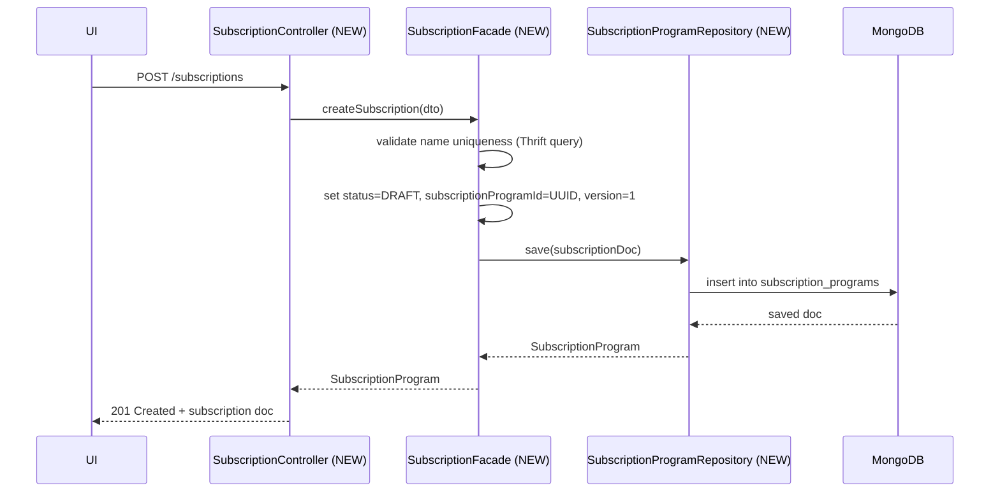
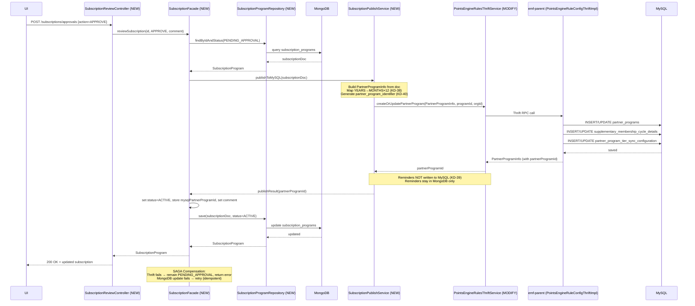
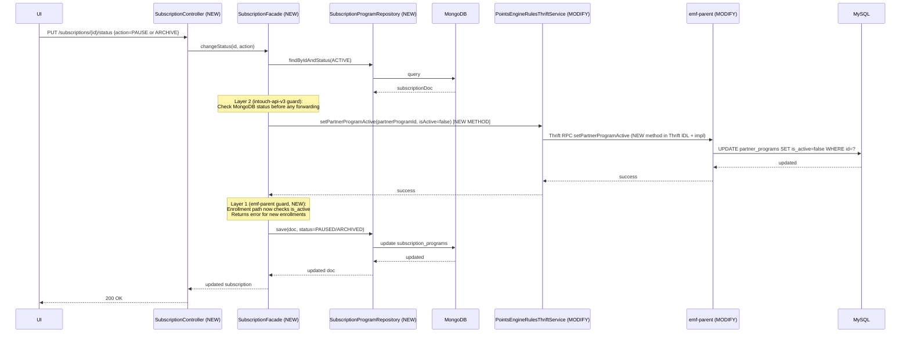

# Cross-Repo Trace — Subscription Program Revamp (E3)
> Date: 2026-04-14
> Phase: 5 (Cross-Repo Tracer)
> Ticket: aidlc/subscription_v1

---

## Write Paths

### WP-1: CREATE Subscription (DRAFT)
**Operation**: UI → POST /subscriptions → intouch-api-v3 → MongoDB

| Step | Repo | File | Method | Change |
|------|------|------|--------|--------|
| 1 | intouch-api-v3 | `SubscriptionController.java` (NEW) | `createSubscription()` | Accept `SubscriptionProgram` body, resolve org/program from auth token |
| 2 | intouch-api-v3 | `SubscriptionFacade.java` (NEW) | `createSubscription()` | Validate name uniqueness against MySQL via Thrift query (KD-40), set `status=DRAFT`, set `subscriptionProgramId=UUID`, set `version=1` |
| 3 | intouch-api-v3 | `SubscriptionProgramRepository.java` (NEW) | `save()` | Write new `SubscriptionProgram` document to `subscription_programs` MongoDB collection |
| 4 | intouch-api-v3 | `EmfMongoConfig.java` (MODIFY) | `includeFilters` | Add `SubscriptionProgramRepository.class` to the filter list (KD-41) |

**No MySQL writes. No Thrift calls. MongoDB only.**

---

### WP-2: UPDATE Subscription (DRAFT or PENDING_APPROVAL)
**Operation**: UI → PUT /subscriptions/{id} → intouch-api-v3 → MongoDB

| Step | Repo | File | Method | Change |
|------|------|------|--------|--------|
| 1 | intouch-api-v3 | `SubscriptionController.java` (NEW) | `updateSubscription()` | Validate status is DRAFT or PENDING_APPROVAL |
| 2 | intouch-api-v3 | `SubscriptionFacade.java` (NEW) | `updateSubscription()` | If ACTIVE and maker-checker enabled: create new DRAFT doc with `parentId=ACTIVE.objectId`, `version+1`. If DRAFT/PENDING_APPROVAL: update in-place |
| 3 | intouch-api-v3 | `SubscriptionProgramRepository.java` (NEW) | `save()` | Write updated document back to MongoDB |

**No MySQL writes. No Thrift calls.**

---

### WP-3: SUBMIT for Approval (DRAFT → PENDING_APPROVAL)
**Operation**: UI → PUT /subscriptions/{id}/status → intouch-api-v3 → MongoDB

| Step | Repo | File | Method | Change |
|------|------|------|--------|--------|
| 1 | intouch-api-v3 | `SubscriptionController.java` (NEW) | `changeStatus()` | Accept `action=SUBMIT_FOR_APPROVAL` |
| 2 | intouch-api-v3 | `SubscriptionFacade.java` (NEW) | `submitForApproval()` | Validate current status is DRAFT. Validate required fields (name, duration). Set `status=PENDING_APPROVAL` |
| 3 | intouch-api-v3 | `SubscriptionProgramRepository.java` (NEW) | `save()` | Update MongoDB document status to `PENDING_APPROVAL` |

**No MySQL writes. No Thrift calls. MongoDB status field update only.**

---

### WP-4: APPROVE (PENDING_APPROVAL → ACTIVE) — SAGA
**Operation**: UI → POST /subscriptions/approvals → intouch-api-v3 → Thrift → emf-parent → MySQL + MongoDB update

This is the most complex operation (SAGA). Reference pattern: `handleNewPromotionApproval()` in `UnifiedPromotionFacade.java`.

| Step | Repo | File | Method | Change |
|------|------|------|--------|--------|
| 1 | intouch-api-v3 | `SubscriptionReviewController.java` (NEW) | `reviewSubscription()` | Validate `ApprovalStatus` enum (APPROVE/REJECT). No approver identity check (KD-29/V-9) |
| 2 | intouch-api-v3 | `SubscriptionFacade.java` (NEW) | `handleApproval()` | Fetch PENDING_APPROVAL doc from MongoDB. Validate. |
| 3 | intouch-api-v3 | `SubscriptionPublishService.java` (NEW) | `publishToMySQL()` — SAGA Step 1 | Build `PartnerProgramInfo` Thrift struct from MongoDB doc. Map YEARS→MONTHS×12 (KD-38). Generate `partnerProgramUniqueIdentifier` if new program (KD-40). |
| 4 | intouch-api-v3 | `PointsEngineRulesThriftService.java` (MODIFY) | `createOrUpdatePartnerProgram()` | **New method** wrapping Thrift `createOrUpdatePartnerProgram(PartnerProgramInfo, programId, orgId, ...)`. Receives back MySQL `partnerProgramId`. |
| 5 | emf-parent | `PointsEngineRuleConfigThriftImpl.java` | `createOrUpdatePartnerProgram()` | Existing — builds entity and calls service. No change. |
| 6 | emf-parent | `PointsEngineRuleService.java` | `createOrUpdateSupplementaryPartnerProgram()` | Existing — writes to MySQL: `partner_programs`, `supplementary_membership_cycle_details`, `partner_program_tier_sync_configuration` |
| 7 | intouch-api-v3 | `SubscriptionPublishService.java` (NEW) | SAGA Step 2 — Compensation defined | If step 4 fails: abort, leave MongoDB at PENDING_APPROVAL, surface error to caller. If step 4 succeeds: proceed. |
| 8 | intouch-api-v3 | `SubscriptionProgramRepository.java` (NEW) | `save()` | Update MongoDB doc: `status=ACTIVE`, store `mysqlPartnerProgramId` returned by Thrift |

**NOTE on Reminders (KD-39)**: Reminders are MongoDB-only. Do NOT call `createOrUpdateExpiryReminderForPartnerProgram` via Thrift. Reminders stay in MongoDB and are served from there at runtime.

**SAGA Compensation**:
- If Thrift call fails → do NOT update MongoDB status. Remain PENDING_APPROVAL. Log error, return failure response.
- If MongoDB status update fails after successful Thrift → retry MongoDB update (idempotent). MySQL record is the ground truth for the live partner program.
- No distributed transaction. Best-effort with retry on MongoDB side.

---

### WP-5: REJECT (PENDING_APPROVAL → DRAFT)
**Operation**: UI → POST /subscriptions/approvals → intouch-api-v3 → MongoDB

Reference: `handlePromotionRejection()` in `UnifiedPromotionFacade.java` line 1181–1184. Sets `status=DRAFT`.

| Step | Repo | File | Method | Change |
|------|------|------|--------|--------|
| 1 | intouch-api-v3 | `SubscriptionReviewController.java` (NEW) | `reviewSubscription()` | action=REJECT |
| 2 | intouch-api-v3 | `SubscriptionFacade.java` (NEW) | `handleRejection()` | Fetch PENDING_APPROVAL doc. Set `status=DRAFT`. Store rejection comment in `comments` field. |
| 3 | intouch-api-v3 | `SubscriptionProgramRepository.java` (NEW) | `save()` | Write MongoDB update: status=DRAFT, comments preserved |

**Rejection state**: Status reverts to DRAFT (not REJECTED — same as UnifiedPromotion pattern, line 1184). Comments preserved. No MySQL writes. No Thrift calls.

---

### WP-6: PAUSE (ACTIVE → PAUSED)
**Operation**: UI → PUT /subscriptions/{id}/status → intouch-api-v3 → MySQL (direct DAO) + MongoDB

**CRITICAL FINDING**: KD-37 states "call Thrift to set is_active=false" but `PartnerProgramInfo` struct in the Thrift IDL has NO `isActive` field (verified in pointsengine_rules.thrift lines 402–417). The Thrift `createOrUpdatePartnerProgram` cannot set `is_active`. The PAUSE/ARCHIVE operation MUST write `is_active=false` directly to MySQL via a new Thrift method OR via a new endpoint in emf-parent.

| Step | Repo | File | Method | Change |
|------|------|------|--------|--------|
| 1 | intouch-api-v3 | `SubscriptionController.java` (NEW) | `changeStatus(action=PAUSE)` | Validate status is ACTIVE |
| 2 | intouch-api-v3 | `SubscriptionFacade.java` (NEW) | `pauseSubscription()` | Set MongoDB `status=PAUSED`. Call Thrift to update `is_active=false` in MySQL |
| 3 | thrift-ifaces-pointsengine-rules | `pointsengine_rules.thrift` (MODIFY) | Add `setPartnerProgramActive(partnerProgramId, isActive, orgId, ...)` | New Thrift method for toggling `is_active` without full struct update |
| 4 | emf-parent | `PointsEngineRuleConfigThriftImpl.java` (MODIFY) | `setPartnerProgramActive()` | New Thrift impl: fetch entity, `setActive(false)`, `saveAndFlush` |
| 5 | emf-parent | `PointsEngineRuleService.java` (MODIFY) | `setPartnerProgramActive()` | JPA: fetch from `PePartnerProgramDao`, call `setActive(false)`, save |
| 6 | intouch-api-v3 | `SubscriptionProgramRepository.java` (NEW) | `save()` | Update MongoDB status=PAUSED |

**Alternative approach** (lower risk): Use `createOrUpdatePartnerProgram` with the full entity populated and add `isActive` as a new optional field to `PartnerProgramInfo`. This requires Thrift IDL change regardless.

---

### WP-7: RESUME (PAUSED → ACTIVE)
**Operation**: UI → PUT /subscriptions/{id}/status → intouch-api-v3 → MySQL (is_active=true) + MongoDB

| Step | Repo | File | Method | Change |
|------|------|------|--------|--------|
| 1 | intouch-api-v3 | `SubscriptionController.java` (NEW) | `changeStatus(action=RESUME)` | Validate status is PAUSED |
| 2 | intouch-api-v3 | `SubscriptionFacade.java` (NEW) | `resumeSubscription()` | Call Thrift `setPartnerProgramActive(true)`. Update MongoDB `status=ACTIVE` |
| 3 | emf-parent | `PointsEngineRuleConfigThriftImpl.java` (MODIFY) | `setPartnerProgramActive()` | Same new method as WP-6, with `isActive=true` |
| 4 | intouch-api-v3 | `SubscriptionProgramRepository.java` (NEW) | `save()` | Update MongoDB status=ACTIVE |

---

### WP-8: ARCHIVE (ACTIVE → ARCHIVED)
**Operation**: UI → PUT /subscriptions/{id}/status → intouch-api-v3 → MySQL (is_active=false) + MongoDB

| Step | Repo | File | Method | Change |
|------|------|------|--------|--------|
| 1 | intouch-api-v3 | `SubscriptionController.java` (NEW) | `changeStatus(action=ARCHIVE)` | Validate status is ACTIVE or PAUSED |
| 2 | intouch-api-v3 | `SubscriptionFacade.java` (NEW) | `archiveSubscription()` | Call Thrift `setPartnerProgramActive(false)`. Update MongoDB `status=ARCHIVED` |
| 3 | intouch-api-v3 | Enrollment interception (NEW) | Check subscription status before forwarding enrollment | Layer 2 guard: if `status=ARCHIVED`, reject enrollment with 400 |
| 4 | emf-parent | Enrollment path (MODIFY) — enrollment guard | `validatePartnerProgramActive()` (NEW check) | Layer 1 guard: if `is_active=false`, throw `PartnerProgramInactiveException` or similar. **New code needed** — verified in V-4 that current path does NOT check `is_active` |
| 5 | intouch-api-v3 | `SubscriptionProgramRepository.java` (NEW) | `save()` | Update MongoDB status=ARCHIVED. Existing enrollments unaffected (continue to natural expiry per KD-30) |

---

### WP-9: LINK Benefit to Subscription
**Operation**: UI → POST /subscriptions/{id}/benefits → intouch-api-v3 → MongoDB only (KD-36)

| Step | Repo | File | Method | Change |
|------|------|------|--------|--------|
| 1 | intouch-api-v3 | `SubscriptionController.java` (NEW) | `linkBenefit()` | Accept `benefitId`, validate subscription exists and is DRAFT/ACTIVE |
| 2 | intouch-api-v3 | `SubscriptionFacade.java` (NEW) | `linkBenefit()` | Validate benefit exists (query benefits store). Check (subscriptionId, benefitId) not already linked. Append to `benefits[]` array |
| 3 | intouch-api-v3 | `SubscriptionProgramRepository.java` (NEW) | `save()` | Update MongoDB document: add benefitId to benefits array |

**No MySQL writes. No Thrift calls. MongoDB only (KD-36).**

---

### WP-10: DELINK Benefit from Subscription
**Operation**: UI → DELETE /subscriptions/{id}/benefits/{benefitId} → intouch-api-v3 → MongoDB only

| Step | Repo | File | Method | Change |
|------|------|------|--------|--------|
| 1 | intouch-api-v3 | `SubscriptionController.java` (NEW) | `delinkBenefit()` | Accept `benefitId` |
| 2 | intouch-api-v3 | `SubscriptionFacade.java` (NEW) | `delinkBenefit()` | Remove benefitId from `benefits[]` array |
| 3 | intouch-api-v3 | `SubscriptionProgramRepository.java` (NEW) | `save()` | Update MongoDB document: remove benefitId from benefits array |

**No MySQL writes. No Thrift calls. MongoDB only.**

---

## Read Paths

### RP-11: LIST Subscriptions (paginated)
**Operation**: UI → GET /subscriptions → intouch-api-v3 → MongoDB

| Step | Repo | File | Method | Change |
|------|------|------|--------|--------|
| 1 | intouch-api-v3 | `SubscriptionController.java` (NEW) | `listSubscriptions()` | Accept query params: status[], groupTag, search, sort, page, size |
| 2 | intouch-api-v3 | `SubscriptionFacade.java` (NEW) | `listSubscriptions()` | Build MongoDB query with filters |
| 3 | intouch-api-v3 | `SubscriptionProgramRepository.java` (NEW) | `findByOrgIdAndFilters()` | Paginated MongoDB query: filter by orgId, programId, status, search |

**Header stats** (AC-02): separate aggregate query on MongoDB for total count, ACTIVE count, PENDING_APPROVAL count, subscriber totals (subscriber count sourced from MySQL `supplementary_partner_program_enrollment` via a Thrift or JDBC call — separate read).

---

### RP-12: GET Subscription (single)
**Operation**: UI → GET /subscriptions/{id} → intouch-api-v3 → MongoDB

| Step | Repo | File | Method | Change |
|------|------|------|--------|--------|
| 1 | intouch-api-v3 | `SubscriptionController.java` (NEW) | `getSubscription()` | Accept `subscriptionId` |
| 2 | intouch-api-v3 | `SubscriptionFacade.java` (NEW) | `getSubscription()` | Fetch from MongoDB by subscriptionProgramId + orgId |
| 3 | intouch-api-v3 | `SubscriptionProgramRepository.java` (NEW) | `findBySubscriptionProgramIdAndOrgId()` | Single MongoDB read |

**Benefits data**: Benefits metadata served from MongoDB `benefits[]` array. If benefit details needed, secondary fetch from benefits store (separate call).

---

### RP-13: GET Enrollment Status
**Operation**: UI/caller → GET /subscriptions/{id}/enrollment → intouch-api-v3 → emf-parent Thrift OR MongoDB

Two sub-cases:
1. **Program-level status**: Read from MongoDB `status` field (ACTIVE/PAUSED/ARCHIVED) — pure MongoDB read via `SubscriptionProgramRepository`.
2. **Member enrollment status**: Call emf-parent Thrift `getSupplementaryEnrollmentForCustomer` (existing method) → reads from MySQL `supplementary_partner_program_enrollment`.

| Step | Repo | File | Method | Change |
|------|------|------|--------|--------|
| 1 | intouch-api-v3 | `SubscriptionController.java` (NEW) | `getEnrollmentStatus()` | Route to appropriate sub-call based on query type |
| 2 | intouch-api-v3 | `PointsEngineRulesThriftService.java` (MODIFY — if needed) | `getSupplementaryEnrollment()` | Existing Thrift method if it exists; otherwise new wrapper |
| 3 | emf-parent | Existing enrollment view service | `getCustomerSupplementaryEnrollment()` | Reads from MySQL `supplementary_partner_program_enrollment` — no change |

---

## Sequence Diagrams

### Diagram 1: CREATE Subscription (DRAFT)



### Diagram 2: APPROVE (Publish-on-Approve SAGA)



### Diagram 3: PAUSE / ARCHIVE (Dual-Layer Enforcement)



---

## Specific Verifications (V-1 through V-9)

### V-1: UnifiedPromotion SAGA / Approval Flow Reference (KD-35)

**Evidence**:
- `UnifiedPromotionFacade.java` `reviewUnifiedPromotion()` (lines 1379–1439):
  1. Fetches `PENDING_APPROVAL` doc from MongoDB
  2. Validates `ApprovalStatus` enum
  3. Calls `handlePromotionApproval()` → routes to `handleNewPromotionApproval()` or `handleEditingScenarioApproval()`
  4. `handleNewPromotionApproval()` (lines 1119–1176): calls `EntityOrchestrator.orchestrate(PUBLISH_FLOW)` → `PromotionTransformerImpl.transform()` → `pointsEngineRulesThriftService.createOrUpdatePromotionV3()` → saves `promotionRepository.save()`
  5. `PromotionTransformerImpl` (lines 905–951): on Thrift success: calls `publishPeConfiguration()`. On Thrift failure: marks promotion as `PUBLISH_FAILED` in MongoDB and returns error.
- **SAGA pattern**: This is a best-effort SAGA, NOT `@Transactional`. If Thrift call fails, MongoDB status is set to `PUBLISH_FAILED` (not reverted to PENDING_APPROVAL — this differs from what a pure SAGA would do). If MongoDB update fails after Thrift success, the Thrift side is already committed (MySQL record exists).
- **Compensation**: UnifiedPromotion uses `RollbackManager` with `EditChangeRecord` entries for rollback of promotion creation in the edit-of-active path. For new promotion approval, on Thrift failure, status is set to `PUBLISH_FAILED` in MongoDB.

**Verdict**: CONFIRMED — The pattern is a best-effort SAGA with partial compensation. For subscriptions, the recommended approach mirrors this: on Thrift failure, do NOT update MongoDB status (remain PENDING_APPROVAL); log error and surface to caller.
**Confidence**: C7 (direct code read, lines 905–951)

**Subscription design guidance**: The `SubscriptionPublishService` (new) mirrors the `PromotionTransformerImpl` pattern. Steps:
1. Build `PartnerProgramInfo` from MongoDB doc
2. Call Thrift `createOrUpdatePartnerProgram`
3. On success: update MongoDB status to ACTIVE
4. On Thrift failure: remain PENDING_APPROVAL, return error (do not set PUBLISH_FAILED — simpler for subscriptions since there are fewer downstream entities)

---

### V-2: UnifiedPromotion REJECT Flow (CRIT-09)

**Evidence**:
- `handlePromotionRejection()` (lines 1179–1185):
  ```java
  metadata.setStatus(PromotionStatus.DRAFT);
  ```
- Comment on line 1183: "Journey rejection is deferred — will only happen when DRAFT → PENDING_APPROVAL with audience changes"
- After rejection, `reviewUnifiedPromotion()` saves the comment (if provided) to `promotion.setComments()` (line 1427)
- `promotionRepository.save(promotion)` commits the DRAFT status + comment (line 1431)

**Verdict**: CONFIRMED — REJECT sets status to DRAFT (not REJECTED). Rejection reason stored in `comments` field. The document is NOT deleted. No new state `REJECTED` exists.
**Confidence**: C7 (direct code read, lines 1181–1431)

**Subscription design guidance**: Same pattern. On REJECT: `status=DRAFT`, store comment in `comments` field. No special REJECTED state needed.

---

### V-3: YEARS Cycle Type in emf-parent (KD-38)

**Evidence**:
- `PartnerProgramCycleType` enum in `pointsengine_rules.thrift` (lines 387–390): `DAYS`, `MONTHS` only. No YEARS.
- `PointsEngineRuleConfigThriftImpl.getSupplementaryPartnerProgramEntity()` (lines 1980–1995): switch on `cycleType` handles `DAYS` and `MONTHS` only. YEARS would fall through with `cycleType=null`.
- `PartnerProgramLinkingActionImpl.getMembershipEndDateDate()` (lines 256–278): switch handles `DAYS` (plusDays) and `MONTHS` (plusMonths) only. No YEARS case.
- `supplementary_membership_cycle_details` DDL: `cycle_type enum('DAYS','MONTHS')` (confirmed Phase 2).
- No YEARS equivalent utility anywhere in emf-parent.

**Verdict**: CONFIRMED — YEARS is not handled anywhere in emf-parent. KD-38 conversion layer (YEARS→MONTHS×12) is entirely in intouch-api-v3 publish path, before the Thrift call. The Thrift call receives `MONTHS` with `cycleValue = originalYears × 12`. No emf-parent changes needed for YEARS handling.
**Confidence**: C7

---

### V-4: Enrollment Blocking on ARCHIVE (KD-37 / G-04)

**Evidence**:
- `PartnerProgramLinkingActionImpl.evaluateActionforSupplementaryLinking()` (lines 172–253): checks customer loyalty enrollment, linked status, one-scheme policy, then calls `validatePartnerProgramExpiry()`. Does NOT check `is_active`.
- `validatePartnerProgramExpiry()` in `PointsEngineEndpointActionUtils.java` (lines 1556–1577): only checks `partnerProgramExpiryDate` and `membershipEndDate`. No `is_active` check.
- `PartnerProgram` entity has `isActive` field (line 74: `@Column(name = "is_active", nullable = false) private boolean isActive`), and `isActive()` getter, but the API interface used by `PartnerProgramLinkingActionImpl` does not expose `isActive()`.
- `PePartnerProgramDao.java` has `findActiveByLoyaltyProgram()` which filters `is_active=true`, but this is not called in the enrollment path.

**CRITICAL NEW FINDING FOR WP-6/WP-8**: `PartnerProgramInfo` Thrift struct (lines 402–417) has NO `isActive` field. Therefore, KD-37's "call Thrift to set is_active=false" cannot be implemented using the existing `createOrUpdatePartnerProgram` Thrift method. A NEW Thrift method is required: `setPartnerProgramActive(partnerProgramId, isActive, orgId, ...)`.

**New code needed in emf-parent**:
- `PointsEngineEndpointActionUtils.java` (MODIFY): Add `is_active` check in `evaluateActionforSupplementaryLinking` before calling `validatePartnerProgramExpiry`. If `partnerProgram.isActive() == false`, throw `PartnerProgramInactiveException`.
- `PartnerProgram` API interface (MODIFY): Expose `isActive()` method.
- `PointsEngineRuleConfigThriftImpl.java` (MODIFY): Implement new `setPartnerProgramActive()` Thrift method.
- `PointsEngineRuleService.java` (MODIFY): Add `setPartnerProgramActive()` method using `PePartnerProgramDao.saveAndFlush()`.

**Verdict**: CONTRADICTED — KD-37 cannot be implemented as described. Thrift IDL change (new method) is mandatory. emf-parent enrollment path needs a new `is_active` check.
**Confidence**: C7 (direct code verification of Thrift struct + enrollment path)

---

### V-5: backup_partner_program_id Usage (KD-33)

**Evidence**:
- `PointsEngineRuleService.saveSupplementaryPartnerProgramEntity()` (lines 1841–1869): sets `backupPartnerProgramId` from the input entity (line 1852: `.setBackupPartnerProgramId(partnerProgram.getBackupPartnerProgramId())`).
- `updateBulkSPPExpiryJobStatus()` (line 1780–1791): reads `newPartnerProgram.getBackupPartnerProgramId()` and stores it in `PartnerProgramExpiry` MongoDB model.
- `PartnerProgramExpiry` model tracks expiry job status; when a program expires, the expiry job reads `backupPartnerProgramId` to migrate members to the fallback program.
- Thrift struct has `backupProgramId` field (field 14, `optional i32`): `getSupplementaryPartnerProgramEntity()` line 2056: `.setBackupPartnerProgramId(partnerProgramThrift.isSetBackupProgramId() ? partnerProgramThrift.getBackupProgramId() : null)`.

**Verdict**: CONFIRMED — `backup_partner_program_id` is actively used via the expiry job mechanism. MongoDB `migrate_on_expiry` target program ID must be mapped to Thrift `backupProgramId` field (i32) during publish-on-approve. The Thrift struct supports this (field 14). No new fields needed.
**Confidence**: C6

---

### V-6: Generic EntityType Routing in intouch-api-v3 (Anti-Pattern Check)

**Evidence**:
- `RequestManagementController.java` (line 38–48): uses `@PathVariable EntityType entityType` from `orchestration/EntityType.java`.
- `orchestration/EntityType.java`: enum values are `PROMOTION, TARGET_GROUP, STREAK, LIMIT, LIABILITY_OWNER_SPLIT, WORKFLOW, JOURNEY, BROADCAST_PROMOTION`. No `SUBSCRIPTION` value.
- `RequestManagementFacade.java` (lines 40–47): `if (entityType == EntityType.PROMOTION)` → delegates to `UnifiedPromotionFacade`. Otherwise throws `InvalidInputException("TARGET_LOYALTY.UNSUPPORTED_TYPE_FOR_STATUS_CHANGE")`.
- This `EntityType` enum is promotion-orchestration-specific, NOT a general maker-checker router. It routes the `PUT /v3/requests/{entityType}/{entityId}/status` endpoint.

**FINDING**: The subscription maker-checker does NOT need to plug into this `EntityType` enum or the `RequestManagementController`. Subscription status changes will have their own dedicated endpoint (`PUT /subscriptions/{id}/status`) and their own facade, independent of `RequestManagementFacade`. KD-22 (clean-room) prevents any coupling.

**Verdict**: CONFIRMED — No `SUBSCRIPTION` value needed in `orchestration/EntityType.java`. No modification to `RequestManagementFacade`. The existing enum/routing is promotion-specific and is NOT a shared maker-checker infrastructure.
**Confidence**: C7 (direct code read, RequestManagementController + EntityType enum)

---

### V-7: Thrift IDL — PartnerProgramInfo Contents (KD-27)

**Evidence** (pointsengine_rules.thrift lines 402–417):

```thrift
struct PartnerProgramInfo {
  1: required i32 partnerProgramId
  2: required string partnerProgramName
  3: required string description
  4: required bool isTierBased
  5: optional list<PartnerProgramTier> partnerProgramTiers
  6: required double programToPartnerProgramPointsRatio
  7: optional string partnerProgramUniqueIdentifier
  8: required PartnerProgramType partnerProgramType   (EXTERNAL|SUPPLEMENTARY)
  9: optional PartnerProgramMembershipCycle partnerProgramMembershipCycle  (DAYS|MONTHS + value)
  10: required bool isSyncWithLoyaltyTierOnDowngrade
  11: optional map<string,string> loyaltySyncTiers
  12: optional bool updatedViaNewUI
  13: optional i64 expiryDate
  14: optional i32 backupProgramId
}
```

**MySQL `partner_programs` column mapping**:
| Thrift Field | MySQL Column | Coverage |
|---|---|---|
| `partnerProgramName` | `name` | ✅ |
| `description` | `description` | ✅ |
| `isTierBased` | `is_tier_based` | ✅ |
| `partnerProgramType` | `type` | ✅ |
| `partnerProgramMembershipCycle` | `supplementary_membership_cycle_details` (separate table) | ✅ |
| `expiryDate` | `expiry_date` | ✅ |
| `backupProgramId` | `backup_partner_program_id` | ✅ |
| `loyaltySyncTiers` | `partner_program_tier_sync_configuration` | ✅ |
| `partnerProgramUniqueIdentifier` | `partner_program_identifier` | ✅ |
| **MISSING** | `is_active` | ❌ Not in struct |
| **MISSING** | `loyalty_program_id` | ❌ Passed as `programId` param separately |
| **MISSING** | `points_exchange_ratio` | ✅ `programToPartnerProgramPointsRatio` |

**Key gap**: `is_active` is NOT in `PartnerProgramInfo`. This confirms V-4 finding — PAUSE/ARCHIVE cannot use `createOrUpdatePartnerProgram`. New Thrift method required.

**Verdict**: CONFIRMED — Thrift struct covers all needed fields for publish-on-approve. `is_active` is the only field NOT covered.
**Confidence**: C7

---

### V-8: EmfMongoConfig Patch (KD-41)

**Evidence** (`EmfMongoConfig.java` lines 27–34):
```java
@EnableMongoRepositories(
    basePackages = "com.capillary.intouchapiv3",
    mongoTemplateRef = "emfMongoTemplate",
    includeFilters = @ComponentScan.Filter(
        type = FilterType.ASSIGNABLE_TYPE,
        classes = {UnifiedPromotionRepository.class}  // Route to EMF MongoDB
    )
)
```

**The 2-line change** (in `classes = {}`):
```java
// BEFORE:
classes = {UnifiedPromotionRepository.class}
// AFTER:
classes = {UnifiedPromotionRepository.class, SubscriptionProgramRepository.class}
```

This is literally 1 line of code change (adding `, SubscriptionProgramRepository.class` to the array). The class comment (line 22–24) should also be updated to mention `SubscriptionProgramRepository`.

**Verdict**: CONFIRMED — Exact change identified. File: `EmfMongoConfig.java` line 32.
**Confidence**: C7

---

### V-9: Maker-Checker Approver Authorization in UnifiedPromotion (KD-29)

**Evidence**:
- `UnifiedPromotionController.java` `reviewUnifiedPromotion()` (lines 178–193): only checks authentication token for `orgId`. No role/approver check.
- `UnifiedPromotionFacade.java` `reviewUnifiedPromotion()` (lines 1379–1439): validates only that `ApprovalStatus` enum value is valid (`APPROVE`/`REJECT`). No `@PreAuthorize`, no `@Secured`, no `SecurityContext.hasRole()`, no approver identity checks anywhere in the review/approval path.
- `RequestManagementController.java`: same pattern — only checks `user.getOrgId()` from auth token.

**Verdict**: CONFIRMED — No approver identity/role enforcement in backend. UI-only concern. The subscription review endpoint follows the same pattern.
**Confidence**: C6 (code reviewed, no security annotations found; C6 not C7 because full Spring Security filter chain not exhaustively traced)

---

## Per-Repo Change Inventory

| Repo | New Files | Modified Files | Key Changes | Confidence |
|------|-----------|----------------|-------------|------------|
| **intouch-api-v3** | `SubscriptionProgram.java` (MongoDB doc), `SubscriptionProgramRepository.java`, `SubscriptionController.java`, `SubscriptionReviewController.java`, `SubscriptionFacade.java`, `SubscriptionPublishService.java`, `SubscriptionStatusValidator.java`, `SubscriptionMapper.java`, `GenericMakerCheckerService.java` (new package) | `EmfMongoConfig.java` (1 line), `PointsEngineRulesThriftService.java` (new method wrapper) | 9 new files + 2 file modifications. New MongoDB collection `subscription_programs`. New Thrift method wrapper for `createOrUpdatePartnerProgram`. New Thrift method wrapper for `setPartnerProgramActive` (new). | C5 (file count estimated; names/packages subject to Designer phase) |
| **emf-parent** | None | `PointsEngineRuleConfigThriftImpl.java`, `PointsEngineRuleService.java`, `PartnerProgramLinkingActionImpl.java`, `PointsEngineEndpointActionUtils.java`, PartnerProgram API interface | 5 file modifications: (1) new `setPartnerProgramActive()` Thrift impl + service method, (2) new `is_active` check in enrollment path | C6 |
| **thrift-ifaces-pointsengine-rules** | None | `pointsengine_rules.thrift` | Add new Thrift service method: `setPartnerProgramActive(partnerProgramId, isActive, orgId, lastModifiedBy, lastModifiedOn, serverReqId)`. Add optional `isActive` to `PartnerProgramInfo` OR create separate method. | C6 |
| **thrift-ifaces-emf** | None | None (0 modifications needed) | `emf.thrift` covers enrollment events (partnerProgramLinkingEvent etc.) — no new event types needed for subscription lifecycle. Existing events sufficient. | C6 (read emf.thrift, no subscription-config events needed) |
| **cc-stack-crm** | None | None (0 modifications needed) | No new MySQL tables or columns. All subscription config metadata stays in MongoDB (KD-17/18/19). Existing tables reused on publish-on-approve. | C7 (Analyst Phase 2 confirmed; KD-19 enforced) |

---

## Red Flags

### RF-1: PAUSE/ARCHIVE Thrift Gap (BLOCKER — was CRIT-04, now elevated)
**Finding**: `PartnerProgramInfo` Thrift struct has no `isActive` field (V-4, V-7). KD-37 says "call Thrift to set is_active=false" but this is architecturally impossible with the current IDL. A new Thrift service method `setPartnerProgramActive()` is mandatory. This affects: `thrift-ifaces-pointsengine-rules` (IDL change), `emf-parent` (new impl), `intouch-api-v3` (new Thrift wrapper). Adding an `isActive` field to `PartnerProgramInfo` is an alternative but would change the semantics of `createOrUpdatePartnerProgram` globally.
**Risk**: Medium — well-bounded, but requires Thrift IDL compilation and deployment across all consumers.
**Status**: OPEN — must be resolved in Architect phase.

### RF-2: Enrollment is_active Guard Missing (emf-parent)
**Finding**: V-4 confirmed that `PartnerProgramLinkingActionImpl` does NOT check `is_active`. A PAUSED/ARCHIVED subscription (with `is_active=false` in MySQL) would still accept new enrollments unless the new enrollment guard is added. KD-37 dual-layer (intouch-api-v3 interception + emf-parent guard) requires NEW code in emf-parent's enrollment path.
**Risk**: High — if this guard is not added, any API caller bypassing intouch-api-v3 can enroll members into a paused/archived subscription.
**Status**: OPEN — emf-parent enrollment path must be modified (new active status check).

### RF-3: Thrift IDL Carry-Over Modifications (KD-02)
**Finding**: Session memory KD-02 notes `thrift-ifaces-pointsengine-rules` has carry-over modifications from `aidlc-demo-v2` branch. Any new Thrift IDL additions must merge cleanly with these. Pre-merge review needed before Architect finalizes IDL changes.
**Risk**: Low-Medium — depends on what the carry-over changes are.
**Status**: OPEN — verify before Thrift IDL changes.

### RF-4: Subscriber Count in Listing Header (AC-02)
**Finding**: AC-02 requires "Total Subscribers" aggregate count in listing header. This count lives in MySQL `supplementary_partner_program_enrollment` (not MongoDB). The listing path (RP-11) reads MongoDB but subscriber counts require a MySQL query. This may require a separate Thrift call or JDBC query per listing request.
**Risk**: Medium — performance concern for large orgs. Needs caching strategy or denormalization.
**Status**: OPEN — Architect must define subscriber count strategy.

### RF-5: Name Uniqueness Validation Scope (KD-40 / G-06)
**Finding**: `partner_programs` has `UNIQUE KEY (org_id, name)` spanning ALL program types (EXTERNAL + SUPPLEMENTARY). Name uniqueness validation at CREATE must check against all partner programs for the org, not just subscriptions. Current MongoDB doc has no visibility into existing MySQL `partner_programs` names. Validation requires a Thrift call to `getAllPartnerPrograms(programId, orgId)` during CREATE.
**Risk**: Medium — if not validated, the publish-on-approve step will fail with a MySQL unique constraint violation after all validation has already passed.
**Status**: OPEN — must be included in `SubscriptionFacade.createSubscription()` validation flow.

### RF-6: SAGA Idempotency on Retry
**Finding**: If publish-on-approve succeeds at Thrift/MySQL but fails at MongoDB update, a retry of the approval will try to call `createOrUpdatePartnerProgram` again. The existing Thrift path is idempotent (UPDATE if `partnerProgramId > 0`). However, the `subscriptionProgramId` stored in MongoDB and the MySQL `partner_program_identifier` must be matched on retry to avoid creating a duplicate MySQL row.
**Risk**: Low-Medium — the `partnerProgramId` returned by Thrift on first call must be stored alongside the MongoDB status update in an atomic-as-possible manner.
**Status**: OPEN — Architect must define idempotency strategy for the publish step.

### RF-7: KD-02 Carry-Over Thrift Modifications
**Finding**: `thrift-ifaces-pointsengine-rules` and its `pom.xml` have pre-existing modifications from prior work (KD-02). Before adding the new `setPartnerProgramActive` Thrift method, these carry-over changes must be reviewed for conflicts.
**Risk**: Low — procedural issue, not architectural.
**Status**: OPEN — pre-merge check required before Thrift IDL changes committed.

---

## Session Memory Updates

The following entries should be appended to `session-memory.md` after this phase:

**New Codebase Behaviours**:
- `reviewUnifiedPromotion()` in `UnifiedPromotionFacade.java` (lines 1379–1439) is a best-effort SAGA: Thrift success → MongoDB update. Thrift failure → set PUBLISH_FAILED in MongoDB. No distributed transaction. _(Cross-Repo Tracer Phase 5)_
- `handlePromotionRejection()` sets status to DRAFT (line 1184). Comment stored in `promotion.comments`. No REJECTED state exists. _(Cross-Repo Tracer Phase 5)_
- `RequestManagementController` uses `orchestration/EntityType` enum (PROMOTION, TARGET_GROUP, etc.) to route status changes. This is promotion-orchestration-specific, NOT a generic maker-checker router. Subscription does not plug into this. _(Cross-Repo Tracer Phase 5)_
- `PartnerProgramInfo` Thrift struct has NO `isActive` field (confirmed V-7). PAUSE/ARCHIVE via Thrift `createOrUpdatePartnerProgram` is NOT possible. New Thrift method required. _(Cross-Repo Tracer Phase 5)_
- `saveSupplementaryPartnerProgramEntity()` line 1858: for existing programs, preserves `oldPartnerProgram.isActive()`. Line 1863: new programs default to `isActive=true`. Both via `PePartnerProgramDao.saveAndFlush()`. _(Cross-Repo Tracer Phase 5)_
- `EmfMongoConfig.java` 1-line change required: add `SubscriptionProgramRepository.class` to `classes = {}` array in `@EnableMongoRepositories.includeFilters`. _(Cross-Repo Tracer Phase 5)_
- `PartnerProgramLinkingActionImpl.getMembershipEndDateDate()` switch handles DAYS (plusDays) and MONTHS (plusMonths) only. No YEARS handler. KD-38 conversion must happen in intouch-api-v3 BEFORE Thrift call. _(Cross-Repo Tracer Phase 5)_
- `PePartnerProgramDao` extends `GenericDao` with `saveAndFlush`. Has `findActiveByLoyaltyProgram()` filter (is_active=true). No `setActive` native query. Active state update requires JPA entity save. _(Cross-Repo Tracer Phase 5)_
- `emf.thrift` has `partnerProgramLinkingEvent`, `partnerProgramUpdateEvent`, `partnerProgramDeLinkingEvent` methods — no subscription lifecycle events in emf.thrift. No emf.thrift changes needed. _(Cross-Repo Tracer Phase 5)_

**New Risks**:
- [RF-1] `PartnerProgramInfo` Thrift struct missing `isActive` field — PAUSE/ARCHIVE requires new Thrift method `setPartnerProgramActive` _(Cross-Repo Tracer Phase 5)_ — Status: OPEN (Architect to resolve)
- [RF-2] emf-parent enrollment path (`PartnerProgramLinkingActionImpl`) does not check `is_active` — new guard required for ARCHIVE dual-layer enforcement _(Cross-Repo Tracer Phase 5)_ — Status: OPEN
- [RF-4] Subscriber count in listing header requires MySQL query outside MongoDB read path — performance/caching strategy needed _(Cross-Repo Tracer Phase 5)_ — Status: OPEN
- [RF-5] Name uniqueness must be validated against ALL partner programs (MySQL) not just subscriptions — Thrift call needed during CREATE _(Cross-Repo Tracer Phase 5)_ — Status: OPEN
- [RF-6] SAGA idempotency on retry if MongoDB update fails after Thrift success _(Cross-Repo Tracer Phase 5)_ — Status: OPEN

**Closed Questions**:
- CRIT-09 (rejection state): CLOSED — REJECT sets status=DRAFT. Comment stored in `comments` field. Confirmed from `handlePromotionRejection()`. _(Cross-Repo Tracer Phase 5)_
- V-6 (EntityType enum routing): CLOSED — subscription maker-checker does NOT use `RequestManagementController`/`orchestration/EntityType`. Clean-room subscription controller is correct. _(Cross-Repo Tracer Phase 5)_
- KD-37 partial re-open: KD-37 mechanism ("call Thrift to set is_active=false") requires NEW Thrift method. The KD is correct in intent but the implementation mechanism was wrong. _(Cross-Repo Tracer Phase 5)_

---

*Phase 5 complete. Total repos requiring modification: 3 (intouch-api-v3, emf-parent, thrift-ifaces-pointsengine-rules). Zero changes to cc-stack-crm (schema ref) or thrift-ifaces-emf.*
