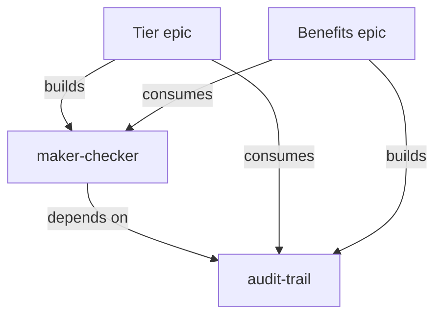

# Multi-Developer Epic Coordination — Design Spec

**Date:** 2026-04-08  
**Status:** 12th Draft
**Author:** Ritwik + Claude
**EFFORT:** 4 days


---

## Table of Contents

1. [The Problem](#1-the-problem)
2. [The Core Philosophy: Minimize Dependencies, Maximize Ownership](#2-the-core-philosophy-minimize-dependencies-maximize-ownership)
2b. [The Solution (One Page)](#2b-the-solution-one-page)
3. [Goals & Non-Goals](#3-goals--non-goals)
4. [Architecture](#4-architecture)
5. [The Registry](#5-the-registry)
6. [The Decomposer Agent](#6-the-decomposer-agent)
7. [The Coordinator Agent](#7-the-coordinator-agent)
8. [Feature Tracker](#8-feature-tracker)
9. [Pipeline Integration](#9-pipeline-integration)
10. [Two Modes](#10-two-modes)
11. [Handling Conflicts & Claims](#11-handling-conflicts--claims)
12. [Cross-Machine Validation & Staleness](#12-cross-machine-validation--staleness)
13. [Industry Patterns Applied](#13-industry-patterns-applied)
14. [Design Review Fixes (Round 1)](#14-design-review-fixes-round-1)
15. [Design Review Fixes (Round 2)](#15-design-review-fixes-round-2)
16. [v1 vs v2 Scope](#16-v1-vs-v2-scope)
17. [Risks](#17-risks)
18. [What to Build — Deliverables](#18-what-to-build--deliverables)
19. [References](#19-references)

---

## 1. The Problem

A team gets a BRD with multiple epics. Each developer picks one epic and runs the AI pipeline independently. They work on separate branches with no visibility into each other's work.

**What goes wrong:** Two developers both need the same shared functionality. Without coordination, both build their own version. At merge time — one overwrites the other, or both coexist creating confusion. The integration cost exceeds building it once.

> **Example:** A loyalty platform BRD has 4 epics: *Tier Management*, *Benefits*, *Campaigns*, and *Rewards*. Both Tier and Benefits need a **maker-checker** workflow (approve/reject changes before they go live). Dev A builds `TierMakerChecker`. Dev B builds `BenefitApprovalService`. Same logic, different names, incompatible interfaces. Merge day is a disaster.

**What we want instead:**

| Without Coordination | With Coordination |
|---------------------|-------------------|
| Each dev discovers shared needs alone | Shared modules identified upfront or detected early |
| Duplicate implementations | One implementation, multiple consumers |
| Conflicts found at merge time | Conflicts prevented or caught at design time |
| No visibility across epics | Real-time registry of who builds what |

---

## 2. The Core Philosophy: Minimize Dependencies, Maximize Ownership

Before jumping to the solution, the most important principle:

**Treat AI agents like developers. The same coordination problems exist — so the best strategy is the same: keep dependencies minimal while tasking.**

Traditional development splits a BRD into epics and assigns one developer per epic. Each developer is bottlenecked by their own speed — so you need many developers, which creates many coordination points. More people = more communication overhead = more duplicate work.

**AI agents change this equation.** When an AI pipeline can do in hours what takes a human developer days, a single developer+agent pair can pick up and deliver an entire epic end-to-end — including its shared modules. This means:

```
Traditional (5 devs, lots of coordination):
  Dev A: Tier epic       ──┐
  Dev B: Benefits epic   ──┼── All need maker-checker → WHO BUILDS IT?
  Dev C: Campaigns epic  ──┘
  Dev D: Maker-checker (shared) ← dedicated dev, bottleneck
  Dev E: Audit trail (shared)   ← another dedicated dev

With AI agents (fewer entities, less coordination):
  Dev A + Agent: Tier epic + maker-checker (builds the shared module too)
  Dev B + Agent: Benefits epic + audit-trail (builds the shared module too)
  Dev C + Agent: Campaigns epic (consumes both, starts after A & B)
```

**The insight:** When each entity can deliver more, you need fewer entities. Fewer entities = fewer coordination points = fewer conflicts. Instead of 5 developers needing a complex registry, you have 2-3 developer+agent pairs with minimal overlap.

**So our coordination system is designed with this in mind:**

1. **Decompose to minimize overlap** — The decomposer doesn't just identify shared modules; it assigns them to epics so each epic is as self-contained as possible. The goal is zero-dependency epics where possible.
2. **When overlap is unavoidable, sequence > parallelize** — If two epics both need maker-checker, don't build it in parallel. Assign it to one epic. The other epic starts after the shared module is merged. With AI speed, the wait is hours, not weeks.
3. **The registry is a safety net, not the primary mechanism** — The primary mechanism is good decomposition that minimizes dependencies. The registry catches what decomposition missed.

> **Example:** Instead of 4 developers building 4 epics in parallel (with constant coordination overhead), the decomposer identifies that *maker-checker* and *audit-trail* are shared. It sequences the work:
>
> - **Week 1:** Dev A + Agent builds Tier epic including maker-checker (the shared module). Dev B + Agent builds Benefits epic including audit-trail (the other shared module). No overlap.
> - **Week 2:** Both shared modules are merged. Dev C + Agent builds Campaigns (consumes both). Dev D + Agent builds Rewards. Zero coordination needed — everything they depend on exists.
>
> With AI agents, "Week 1" might actually be "Day 1" and "Week 2" might be "Day 2."

**This philosophy directly addresses the parallel development problem.** You don't solve parallel conflicts by building a better conflict detector. You solve them by restructuring work so conflicts don't arise. AI agents make this practical because the cost of sequencing (waiting) drops dramatically.

> **Important caveat:** This system is designed for AI-speed development (hours-to-days per epic). The sequencing strategy assumes Dev B waits hours, not weeks, for Dev A's shared module to merge. If your pipeline takes weeks per epic (heavy human oversight, complex review cycles), sequencing 4 epics means months of serial work. In that case, parallel development with heavier coordination (full Mode 1 decomposition + contract tests + feature flags) may be more practical than pure sequencing.

---

## 2b. The Solution (One Page)

For the cases where dependencies can't be fully eliminated, three components provide the safety net:

```
  REGISTRY (GitHub repo)          — Source of truth. Tracks shared modules,
  |                                  interfaces, ownership, and status.
  |
  |--- DECOMPOSER (agent)         — Architect runs ONCE before devs start.
  |     Reads full BRD, identifies    Identifies shared modules, designs
  |     shared concerns, assigns      interfaces, sequences work to
  |     ownership, minimizes overlap.  MINIMIZE parallel dependencies.
  |
  |--- COORDINATOR (subagent)      — Runs AUTOMATICALLY inside each dev's
        pipeline at 4 checkpoints.    Scans registry, blocks duplicates,
        Claims modules, syncs status.  manages claims, validates health.
```

**Two modes of operation:**
- **Guided** — Architect decomposes BRD first, sequences work, devs follow packages. Best for large teams.
- **Autonomous** — No architect. Pipeline self-coordinates via registry. Best for small teams with informal communication.

**Key design decisions:**
- **Sequencing over parallelizing** when shared modules exist. AI speed makes the wait small.
- **Fewer, bigger ownership scopes** instead of many small ones. One dev+agent owns an epic AND its shared modules.
- **Registry as safety net**, not primary coordination mechanism. Good decomposition is the primary mechanism.

---

## 3. Goals & Non-Goals

**Goals:**
- Zero duplicate implementations of shared modules
- Real-time visibility: who is building what, in which repo, on which branch
- Works with the existing 14-phase feature pipeline (extend, don't replace)
- Supports multi-repo projects (Thrift IDL, core services, API gateways)
- Machine-parseable interface contracts (enables mocks and contract testing)

**Non-Goals:**
- Building a full developer portal (Backstage/Port) — too heavy
- Replacing pipeline phases — we add checkpoints, not new phases
- Real-time chat between developers — out of scope
- Enforcing a single branching strategy

---

## 4. Architecture

```
                    +-------------------------+
                    |      Decomposer         |  <-- Architect runs once (Mode 1)
                    |      (new agent)        |
                    +-----------+-------------+
                                | populates
                                v
                    +-------------------------+
                    |       Registry          |  <-- GitHub repo (source of truth)
                    |  modules/ interfaces/   |
                    |  feature.json           |
                    +-----------+-------------+
                                ^
                                | reads/writes at checkpoints
                                |
                +---------------+----------------+
                |       Feature Pipeline         |
                |                                |
                |  Phase 1  --> Coordinator       |
                |  Phase 6  --> Coordinator       |
                |  Phase 9  --> Coordinator       |
                |  Phase 11 --> Coordinator       |
                +--------------------------------+
```

| Component | What it is | Who runs it | When |
|-----------|-----------|-------------|------|
| **Registry** | GitHub repo with YAML module files, interface contracts, feature tracker | Agents read/write via `gh api` | Always available |
| **Decomposer** | New agent (`.claude/agents/epic-decomposer.md`) | Architect, manually | Once, before devs start (Mode 1 only) |
| **Coordinator** | New agent (`.claude/agents/epic-coordinator.md`) | Feature pipeline, as subagent | Automatically at 4 checkpoints |

---

## 5. The Registry

A dedicated GitHub repo that every developer's pipeline reads from and writes to.

### Structure

```
shared-modules-registry/
|-- feature.json              # Progress tracker (JSON, machine-generated)
|-- repo-map.yml              # Repos and their roles
|-- .github/
|   +-- CODEOWNERS            # Dynamic merge-time protection for shared modules
|
|-- modules/                  # One YAML per shared module (THE source of truth)
|   |-- maker-checker.yml     #   includes: rationale, decisions, interface summary
|   +-- audit-trail.yml       #   (replaces separate RFCs and ADRs)
|
|-- interfaces/               # Only actual IDL/schema files (machine-parsed)
|   |-- maker-checker/
|   |   +-- MakerCheckerService.thrift
|   +-- audit-trail/
|       +-- AuditTrailService.thrift
|
|-- epics/                    # One YAML per epic
|   |-- tier-management.yml
|   +-- benefits-management.yml
|
|-- intents/                  # Intent declarations for race prevention (Mode 2)
|   +-- .gitkeep
+-- epic-packages/            # Scoped instructions per epic (Mode 1)
    +-- .gitkeep
```

> **Post-review change:** Slimmed from ~8 files per module to 2 (module YAML + interface IDL). RFCs and ADRs are now embedded in the module YAML as `rationale:` and `decisions:` fields. Mock stubs are generated at build time from IDL, never stored. Static `collision-hotspots.yml` replaced by dynamic branch-diff detection + CODEOWNERS. See [Section 14.7](#147--fix-documentation-explosion-8-files-per-module) for details.

### Module File

Each shared module is described in a YAML file. This is the core coordination unit.

```yaml
name: maker-checker                     # Module identity
description: Generic approve/reject workflow for any entity type
status: designed | claimed | in-progress | ready-for-review | merged

# Ownership
owner: ritwik                           # Who is building it
epic: tier-management                   # Which epic owns it
created: 2026-04-08
updated: 2026-04-08

# Classification (DDD)
ddd_type: shared-kernel                 # shared-kernel | bounded-context-internal
kernel_note: >
  Keep minimal. Only core request/approve/reject flow.
  Epic-specific extensions stay in each epic's own code.

# Where does this module live? (multi-repo)
repos:
  thrift:
    repo: capillary/thrift
    branch: feature/tier-maker-checker-idl
    status: merged
    artifacts: [MakerCheckerService.thrift]
    notes: "IDL merged FIRST — all repos depend on generated stubs"

  emf-parent:
    repo: capillary/emf-parent
    branch: feature/tier-maker-checker
    status: in-progress
    artifacts: [MakerCheckerServiceImpl.java, MakerCheckerDAO.java]

  intouch-api-v3:
    repo: capillary/intouch-api-v3
    branch: feature/tier-maker-checker-api
    status: not-started
    depends_on_repos: [thrift, emf-parent]

# Build order across repos
build_order:
  1: thrift            # IDL first (generates stubs)
  2: emf-parent        # Core logic
  3: intouch-api-v3    # REST layer

# Interface summary (full contract in interfaces/ folder)
interface:
  service: MakerCheckerService
  methods:
    - "createRequest(entityType, entityId, action, payload) -> RequestId"
    - "approve(requestId, approverId) -> Result"
    - "reject(requestId, rejecterId, reason) -> Result"

# Who needs this
consumers: [tier-management, benefits-management]
depends_on: [audit-trail]

# Health tracking
consumer_count: 2
service_extraction_threshold: 5   # Flag when consumers exceed this
mock_stubs_generated: true
```

> **Why YAML?** Module files are human-edited — developers update status, add notes, review in PRs. YAML supports comments (`# why this decision`) and clean diffs. JSON is used only for `feature.json` which is machine-generated.

### Epic File

```yaml
epic: tier-management
owner: ritwik
branch: feature/tier-management
status: in-progress

building: [maker-checker]              # Shared modules this epic builds
consuming: [audit-trail]               # Shared modules this epic uses
```

### Collision Hotspot Map

Files that only ONE epic should touch. Prevents the #1 cause of merge conflicts.

```yaml
hotspots:
  - file: emf-parent/src/main/resources/application.yml
    owner_epic: tier-management
    reason: "Shared config — coordinate changes"

  - file: thrift/services/PointsEngineService.thrift
    owner_epic: tier-management
    reason: "Adding methods to existing service must be serialized"
```

### How the Pipeline Reads the Registry

Always from remote — never trust a local clone:

```bash
# Fetch a module
gh api repos/{org}/shared-modules-registry/contents/modules/maker-checker.yml \
  --jq '.content' | base64 -d

# Claim a module (auto-PR)
gh pr create --repo {org}/shared-modules-registry \
  --title "Claim: maker-checker (tier-management)" \
  --body "Auto-claimed by feature-pipeline during Phase 1"
```

---

## 6. The Decomposer Agent

**What:** An architect runs this ONCE on the full BRD to identify shared modules before any developer starts.

**When:** Mode 1 (Guided) only. Skip this for Mode 2 (Autonomous).

```bash
claude --agent epic-decomposer
```

### Phases

```
D1: Input Collection
    Full BRD, all repo paths, epic names, registry repo URL

D2: BA Scan (/ba skill in analysis mode)
    Parse all epics. Find nouns/verbs appearing across multiple epics.
    Output: candidate shared modules.

D3: Codebase Scan (/cross-repo-tracer skill)
    For each candidate: does it already exist in code?
    Identify collision hotspots (configs, routing files, build files).

D4: Interface Design (/architect + /designer skills)
    For each shared module:
      - Thrift IDL (.thrift files)
      - REST contracts (OpenAPI .yml)
      - DB schema (.sql)
      - Mock stubs for consumers
      - DDD classification (shared-kernel vs bounded-context-internal)

D5: RFC Generation
    Lightweight proposal per shared module:
      - Why shared? Which epics need it? Who should build it?

D6: Epic Package Generation
    Per-epic folder with: scope, dependencies, build order, warnings.

D7: Registry Publish
    Commit everything. Tag: decompose/{brd-name}/v1
```

> **Example:** The decomposer reads the Loyalty Platform BRD and identifies 3 shared modules: *maker-checker* (needed by Tier + Benefits), *audit-trail* (needed by all 4 epics), and *notification-engine* (needed by Campaigns + Rewards). It generates Thrift IDL for each, creates mock stubs, and publishes epic packages: "Tier team — you build maker-checker, consume audit-trail. Benefits team — you build audit-trail, consume maker-checker."

### Dependency Graph (auto-generated)



---

## 7. The Coordinator Agent

**What:** A subagent invoked automatically by the feature pipeline at 4 checkpoints. Not run standalone.

**Purpose:** Scan registry, detect conflicts, manage claims, validate health.

### The 4 Checkpoints

#### Checkpoint 1 — Registry Scan (after Phase 1: BA)

> "What shared modules does my epic need? Do any already exist?"

```
For each functionality the epic needs:
  MATCH in registry + status:merged     --> CONSUME (use real code)
  MATCH in registry + status:in-progress --> CONSUME (use mock stubs)
  MATCH in registry + status:designed    --> Prompt: CLAIM or CONSUME?
  NO MATCH in registry                   --> Prompt: NEW MODULE — claim it?
```

> **Example:** Dev B starts the Benefits epic. Coordinator finds *maker-checker* already claimed by Dev A (status: in-progress). It loads the mock stubs into session memory: "DO NOT REBUILD. Code against this interface."

#### Checkpoint 2 — Interface Check (after Phase 6: Architect)

> "Is my HLD accidentally designing something that already exists?"

- BLOCK if HLD module matches a registry module
- For new modules: publish interface + mock stubs to registry
- Generate ADR for the decision

> **Example:** Dev B's architect phase designs an "ApprovalWorkflowService." Coordinator detects overlap with *maker-checker*: "CONFLICT — this already exists. Use the interface at `interfaces/maker-checker/`."

#### Checkpoint 3 — Final Sync (before Phase 9: Developer)

> "Has anything changed since I designed my solution?"

- If a dependency moved from `in-progress` to `merged` → switch from mocks to real code
- If still in-progress → keep coding against mocks
- After building a shared module → update registry status

> **Example:** Dev A merged maker-checker to main yesterday. Dev B's coordinator detects the status change and replaces mock stubs with the real implementation before coding begins.

#### Checkpoint 4 — Duplication Check (after Phase 11: Reviewer)

> "Did I accidentally build something that duplicates a shared module?"

- Scan implementation for class names, Thrift services, DB tables matching registry
- Check consumer count thresholds
- Verify expand-contract compliance for interface changes

---

## 8. Feature Tracker

Progress is tracked in **per-epic JSON files** — one per developer. Each developer writes only their own file. Zero write contention.

```
shared-modules-registry/
+-- progress/
    |-- tier-management.json       # Dev A writes this
    |-- benefits-management.json   # Dev B writes this
    +-- campaigns.json             # Dev C writes this
```

### Per-Epic Progress File (`progress/tier-management.json`)

```json
{
  "epic": "tier-management",
  "owner": "ritwik",
  "status": "in-progress",
  "phase": "phase-9",
  "last_updated": "2026-04-08T14:30:00Z",
  "builds_modules": ["maker-checker"],
  "consumes_modules": ["audit-trail"],
  "features": [
    {
      "id": "TIER-001",
      "name": "Tier configuration CRUD",
      "status": "merged",
      "pr": "capillary/emf-parent#342"
    },
    {
      "id": "TIER-002",
      "name": "Maker-checker for tier changes",
      "status": "in-progress",
      "shared_module": "maker-checker"
    }
  ],
  "timeline": [
    {"timestamp": "2026-04-08T10:30:00Z", "event": "module_claimed", "module": "maker-checker"}
  ]
}
```

Shared module health is already in the module YAML files — no need to duplicate it in a tracker.

**Quick CLI queries:**

```bash
# What's blocking my epic?
for f in progress/*.json; do jq '{epic: .epic, phase: .phase, blocked_by: .consumes_modules}' "$f"; done

# Overall progress?
for f in progress/*.json; do jq '{epic: .epic, phase: .phase, status: .status}' "$f"; done
```

> **Why per-epic files?** A single `feature.json` written by every developer is a write hotspot — 5 devs × 4 checkpoints = 20 writes per cycle, all to the same file = merge conflicts. Per-epic files eliminate this. Developers write their own file; a GitHub Actions workflow aggregates everything into a read-only `feature.json`.

### Aggregated View (`feature.json`)

A **read-only** file auto-generated by GitHub Actions. No developer or agent writes to it directly — it's assembled from `progress/*.json` + `modules/*.yml`.

```yaml
# .github/workflows/aggregate-progress.yml
name: Aggregate Progress
on:
  push:
    paths: ['progress/**', 'modules/**']

jobs:
  aggregate:
    runs-on: ubuntu-latest
    steps:
      - uses: actions/checkout@v4
      - name: Build feature.json
        run: |
          jq -s '{
            registry_version: "1.0",
            last_updated: (now | todate),
            generated_by: "aggregate-progress workflow (read-only)",
            epics: (map({(.epic): .}) | add),
            shared_modules: (
              [inputs | .[] | select(.shared_module)] | 
              group_by(.shared_module) | map({(.[0].shared_module): {consumers: map(.epic)}}) | add // {}
            )
          }' progress/*.json > feature.json
          
          git config user.name "registry-bot"
          git add feature.json
          git commit -m "auto: aggregate feature.json" || true
          git push
```

**Result: `feature.json`**

```json
{
  "registry_version": "1.0",
  "last_updated": "2026-04-08T15:00:00Z",
  "generated_by": "aggregate-progress workflow (read-only)",

  "epics": {
    "tier-management": {
      "owner": "ritwik",
      "status": "in-progress",
      "phase": "phase-9",
      "builds_modules": ["maker-checker"],
      "consumes_modules": ["audit-trail"],
      "features": [
        {"id": "TIER-001", "name": "Tier configuration CRUD", "status": "merged"},
        {"id": "TIER-002", "name": "Maker-checker for tier changes", "status": "in-progress"}
      ]
    },
    "benefits-management": {
      "owner": "dev-b",
      "status": "in-progress",
      "phase": "phase-6",
      "builds_modules": ["audit-trail"],
      "consumes_modules": ["maker-checker"],
      "features": [
        {"id": "BEN-001", "name": "Benefit rules engine", "status": "in-progress"}
      ]
    }
  },

  "shared_modules": {
    "maker-checker": {
      "status": "in-progress",
      "owner": "ritwik",
      "epic": "tier-management",
      "consumers": ["tier-management", "benefits-management"]
    },
    "audit-trail": {
      "status": "claimed",
      "owner": "dev-b",
      "epic": "benefits-management",
      "consumers": ["tier-management", "benefits-management", "campaigns"]
    }
  }
}
```

**The rule: developers write `progress/{epic}.json`. Nobody writes `feature.json`. GitHub Actions assembles it.** Zero contention, single combined view always available.

**Quick CLI queries against the combined file:**

```bash
# Bird's-eye view of all epics
jq '.epics | to_entries[] | {epic: .key, phase: .value.phase, status: .value.status}' feature.json

# All shared modules and their status
jq '.shared_modules | to_entries[] | {module: .key, status: .value.status, owner: .value.owner}' feature.json

# What's blocking benefits-management?
jq '.epics["benefits-management"].consumes_modules as $deps |
    .shared_modules | to_entries[] |
    select(.key as $k | $deps | index($k)) |
    {module: .key, status: .value.status}' feature.json
```

---

## 9. Pipeline Integration

Changes to the existing feature pipeline are minimal — 1 new input question + 4 subagent calls.

### New Input (Phase 0)

```
Step 1: Pre-flight check
  ✓ gh auth status                    — GitHub CLI authenticated?
  ✓ gh api repos/{org}/registry       — Registry repo accessible?
  ✓ git ls-remote {registry} HEAD     — Git access works?
  Any fail → offer standalone mode.

Step 2: Multi-epic question
  Are you working as part of a multi-epic team?
    [1] Yes — provide registry repo URL + epic name
    [2] No — standalone (skip coordination)

Step 3 (if [1]): Auto-declare intent
  Coordinator automatically pushes intent to registry:
    intents/{epic-name}.yml → git push (atomic)
  If push fails (non-fast-forward) → pull first → see other devs' intents.
  No separate step for the developer to remember.
```

If `[2]`, coordinator never fires. Zero overhead.

### Checkpoint Injection

| After Phase | Coordinator Checkpoint | What Happens |
|-------------|----------------------|--------------|
| Phase 1 (BA) | `registry-scan` | Detect shared modules, prompt claims, inject constraints |
| Phase 6 (Architect) | `interface-check` | Block duplicates, publish new interfaces |
| Phase 9 (Developer) | `final-sync` | Sync dependency status, swap mocks for real code |
| Phase 11 (Reviewer) | `duplication-check` | Flag accidental overlap, check consumer thresholds |

---

## 10. Two Modes

### Mode 1: Guided (Architect-Led)

```bash
claude --agent epic-decomposer     # Architect runs first
# ... then each developer:
claude --agent feature-pipeline    # Auto-loads epic package
```

Best for: 3+ epics, many shared modules, architect available.

**Flow:** Architect decomposes → registry populated → devs follow packages.

### Mode 2: Autonomous (No Architect)

```bash
claude --agent feature-pipeline    # Everyone starts immediately
```

Best for: 2-3 epics, small team, no architect, fast start.

**Flow:** Each dev starts independently → coordinator detects overlaps → first claimer defines interface → others consume.

### Comparison

| | Guided | Autonomous |
|-|--------|-----------|
| **Startup** | Slower (architect first) | Immediate |
| **Discovery** | All shared modules found upfront | Incremental, as devs hit Phase 1 |
| **Interfaces** | Defined before anyone codes | First claimer defines them |
| **Mock stubs** | Available Day 1 | Available after first claimer's Phase 6 |
| **Duplication risk** | Very low | Low (coordinator blocks it) |
| **Race conditions** | None (architect assigns) | Possible (PR-based resolution) |

---

## 11. Handling Conflicts & Claims

### Normal Claim

```
Dev's pipeline discovers need for shared module
  --> Coordinator checks registry
  --> Not found --> "Claim it? [Y/n]"
  --> Y --> Auto-creates PR to registry
  --> PR merged --> module claimed
```

### Two Devs Claim the Same Module

```
Both create claim PRs simultaneously
  --> First PR merged --> module claimed
  --> Second dev's coordinator detects conflict:
      "maker-checker was claimed by @ritwik 20 minutes ago.
       Closing your claim. Switching to CONSUMER mode."
```

### True Simultaneous Claims

```
Neither PR merged yet --> Coordinator adds negotiation comment:
  "CONFLICT: Both @dev-a and @dev-b want to build maker-checker.
   Suggestion: @dev-a's epic has fewer dependencies --> recommended owner.
   Please resolve — merge one PR, close the other."
```

### Extending a Shared Module

> **Example:** Dev B needs `bulkApprove()` on maker-checker, which Dev A owns.

```
Options:
  [1] PR to the module file requesting the extension
  [2] Build it in your own epic's code (adapter pattern)
  [3] Wait for Dev A to finish, then contribute via InnerSource PR
```

### Status Lifecycle

```
designed --> claimed --> in-progress --> ready-for-review --> merged
    |                                                          |
    Interface defined,                               All repos merged,
    no owner yet                                    consumers can use real code
```

---

## 12. Cross-Machine Validation & Staleness

Developers work on different machines with different local paths and git states. The coordinator validates everything at **every checkpoint** using remote checks.

### What Can Go Wrong

| Scenario | Response |
|----------|----------|
| Branch in registry doesn't exist on remote | **BLOCK** — prompt: re-claim, skip, or wait |
| Branch exists but no commits in >7 days | **WARN** — "Is the owner still working on this?" |
| Interface in registry doesn't match code on branch | **BLOCK** — "Interface mismatch detected" |
| Module marked `merged` but PR was reverted | **BLOCK** — "PR was reverted, module not available" |
| Repo not cloned on your machine | **INFO** — "Clone: `git clone git@github.com:org/repo.git`" |
| Local path differs from registry | **AUTO-FIX** — maps to your local path silently |
| Registry local clone is stale | **N/A** — always reads from remote via `gh api` |

### Graduated Severity

```
BLOCK    — Must fix before proceeding. Pipeline stops.
WARN     — Developer decides: proceed, wait, or re-claim.
INFO     — Informational. No action needed.
AUTO-FIX — Coordinator fixes it silently.
```

### Staleness Lifecycle

```
active        (commits within 7 days)
  --> stale        (7-14 days, no commits)  --> WARN owner
  --> abandoned    (14-30 days)             --> GitHub issue to owner
  --> auto-released (>30 days)              --> Status reverts to "designed"
                                                Anyone can re-claim
```

> **Example:** Dev A claimed *maker-checker* 3 weeks ago but switched to another project. No commits in 18 days. The coordinator flags it as "abandoned" and opens a GitHub issue: "@ritwik — maker-checker has had no activity in 18 days. Are you still working on this?" After 30 days with no response, the claim auto-releases. Dev B can now re-claim it.

### Auto-Healing

The coordinator fixes these without asking:

| Issue | Auto-Fix |
|-------|----------|
| Registry says `claimed`, branch has commits | Update to `in-progress` |
| Registry says `in-progress`, PR is merged | Update to `merged` |
| Consumer count changed | Update `feature.json` |
| Module stale >30 days | Release claim, notify owner |

### Validation Flow (every checkpoint)

```
1. Fetch fresh registry from remote (gh api) — never local clone
2. For each dependency:
   - Branch exists? Last commit date? Interface matches code?
   - If merged: PR actually merged? Not reverted?
3. For local repos:
   - Cloned? Auto-map path. Missing? Provide clone command.
4. For collision hotspots:
   - Modified by this epic but owned by another? WARN.
5. Update feature.json with health data
6. Result: ALL CLEAR / WARNINGS / BLOCKS
```

> **Example:** Dev B's coordinator runs at Phase 9. It checks maker-checker: branch exists on remote? Yes. Last commit? 2 days ago (active). Thrift IDL in registry matches branch code? Yes. All clear — proceed with real code instead of mocks.

---

## 13. Industry Patterns Applied

| # | Enhancement | Source | What It Does |
|---|-------------|--------|-------------|
| 1 | **Dynamic collision detection** | Augment Code, CODEOWNERS | Branch-to-branch file overlap detection + CODEOWNERS for merge-time protection. Replaces static hotspot YAML. |
| 2 | **IDL-driven mock generation** | DiDi thrift-mock, Buf | Mocks generated FROM `.thrift` IDL, not separately. Structural drift caught at compile time. |
| 3 | **Consumer-driven contract tests** | Pact Framework | Each consumer writes tests. Producer validates against ALL consumers in CI via Pact Broker. |
| 4 | **Expand-contract for evolution** | Martin Fowler | Safe interface changes: add new → migrate consumers → remove old. Enables rollback. |
| 5 | **IDL compatibility gate** | `buf breaking`, Kleppmann | Automated breaking-change detection in CI. Non-breaking changes need no coordination. |
| 6 | **DDD Shared Kernel labeling** | DDD Context Mapping | Marks modules as "keep minimal." Prevents shared code from growing unbounded. |
| 7 | **Embedded ADRs** | e-adr, Backstage | Decisions embedded in module YAML or code annotations. No separate files. |
| 8 | **ETag-based registry caching** | GitHub API Best Practices | Conditional requests — unchanged files cost zero rate limit. |
| 9 | **Intent declaration for race prevention** | Terraform locking, Kleppmann | Lightweight `git push` as atomic claim. Loser gets fast-forward error immediately. |

---

## 14. Design Review Fixes (Round 1)

A Staff+ architect review identified critical flaws, weaknesses, and hidden assumptions. Each is addressed below with a researched fix.

### 14.1 🔴 Fix: Registry is a Single Point of Failure

**Problem:** Every coordination mechanism depends on GitHub API. Rate limits (5000 req/hr) + API outages = pipeline stalls.

**Fix: Sparse checkout + ETag caching (zero-API-call reads)**

Instead of calling `gh api` for every file read, the coordinator uses a **sparse checkout** of just the `modules/` folder. All reads become local filesystem operations.

```bash
# One-time setup (runs at Phase 0)
git clone --filter=blob:none --sparse \
  https://github.com/{org}/shared-modules-registry.git /tmp/registry
cd /tmp/registry
git sparse-checkout set modules/ interfaces/ feature.json

# At each checkpoint: pull latest (1 git operation, not N API calls)
git fetch origin main && git checkout origin/main -- modules/ interfaces/ feature.json
```

For writes (claims, status updates), use `gh api` with **ETag caching**:

```bash
# Conditional request — free if unchanged (304 Not Modified, no rate limit hit)
curl -H "If-None-Match: \"${CACHED_ETAG}\"" \
  https://api.github.com/repos/{org}/shared-modules-registry/contents/modules/maker-checker.yml
```

**Fallback when GitHub is unreachable:**
```
WARN: "Cannot reach shared-modules-registry. Using cached state from 5 minutes ago.
       Proceeding with last known module statuses. Claims and updates will be queued."
```

Not BLOCK. WARN + proceed with cached data. Queue writes for when API recovers.

**Source:** [GitHub API Best Practices — ETags](https://docs.github.com/rest/guides/best-practices-for-using-the-rest-api), [Git sparse-checkout docs](https://git-scm.com/docs/git-sparse-checkout)

### 14.2 🔴 Fix: Mock Stubs Will Diverge from Real Code

**Problem:** Mocks generated once at Phase D4 will drift as implementation evolves.

**Fix: Generate mocks FROM Thrift IDL — drift is a compile error, not a runtime surprise**

Use [DiDi's thrift-mock](https://github.com/didi/thrift-mock) library. Mocks use the Java classes generated from `.thrift` IDL. If the IDL changes, the generated classes change, and any mock returning an incompatible type **fails to compile**.

```xml
<!-- Consumer's pom.xml -->
<dependency>
  <groupId>com.didiglobal.thriftmock</groupId>
  <artifactId>thrift-mock-server4junit</artifactId>
</dependency>
```

**The chain:** `.thrift` IDL → `thrift --gen java` → Java classes → thrift-mock uses those classes → **structural drift is impossible**.

For **behavioral drift** (method returns 200 but real service now returns 404), layer [PactFlow Bi-Directional Contract Testing](https://pactflow.io/bi-directional-contract-testing/):
1. Consumer generates `.pact` file from mock interactions
2. Provider publishes actual behavior (OAS generated from code, not hand-written)
3. PactFlow compares — breaks CI if behavior drifted

**Key rule: Never store mock stubs in the registry.** Store only the `.thrift` IDL. Mocks are generated at build time from the IDL. This eliminates an entire category of staleness.

### 14.3 🔴 Fix: No Rollback Story

**Problem:** When a merged shared module gets reverted, consumers who already integrated the real code are broken with no recovery path.

**Fix: Expand-contract + feature flags + keep IDL history**

**Step 1 — Expand-contract by default.** Every shared module interface change follows:
```
v1.0: MakerCheckerService { approve(requestId, approverId) }
v1.1: MakerCheckerService { approve(requestId, approverId); approveWithMetadata(requestId, approverId, metadata) }
      ^-- EXPAND: new method added, old method still works
v1.2: MakerCheckerService { approveWithMetadata(requestId, approverId, metadata) }
      ^-- CONTRACT: old method removed ONLY after all consumers migrated
```

If v1.1 is reverted to v1.0, consumers still using `approve()` are unaffected. Only consumers who adopted `approveWithMetadata()` break — and the registry knows exactly who they are (from `consumers` field).

**Step 2 — Feature flags wrapping new dependencies.** Consumers adopt new shared module versions behind a flag:
```java
if (featureFlags.isEnabled("use-maker-checker-v1.1")) {
    makerCheckerService.approveWithMetadata(id, approverId, metadata);
} else {
    makerCheckerService.approve(id, approverId); // old path still works
}
```
If the module is reverted, disable the flag. No rebuild, no redeploy.

**Step 3 — Registry tracks version history.** Add `version` and `previous_versions` to module YAML:
```yaml
version: "1.1"
previous_versions:
  - version: "1.0"
    interface_snapshot: interfaces/maker-checker/v1.0/MakerCheckerService.thrift
    status: available  # Still works, consumers can fall back to this
```

**New status: `reverted`.** Coordinator detects reversion (checks PR state), updates status, and notifies consumers:
```
BLOCK: "maker-checker was reverted (PR #342 reverted by PR #345).
        Your code uses v1.1 features.
        Options:
        [1] Switch to feature flag fallback (v1.0 path)
        [2] Wait for module owner to re-merge
        [3] Re-implement locally (last resort)"
```

**Source:** [Martin Fowler — Expand-Contract](https://martinfowler.com/bliki/ParallelChange.html), [Feature Flags for Rollback](https://martinfowler.com/articles/feature-toggles.html)

### 14.4 ⚠️ Fix: Decomposer's Shared Module Detection is NLP Guesswork

**Problem:** Phase D2 says "find nouns/verbs appearing across multiple epics." A BRD saying "approval process" in one epic and "sign-off workflow" in another — same concept, zero lexical overlap.

**Fix: Structured checklist + semantic matching**

Don't rely solely on text analysis. Add a **pattern checklist** to Phase D2:

```
After BRD analysis, the decomposer asks:
  "Does any epic need these common patterns?"
  [ ] Approval/maker-checker workflow
  [ ] Audit trail / change logging
  [ ] Notification engine (email, SMS, push)
  [ ] Role-based access control
  [ ] Import/export (CSV, bulk operations)
  [ ] Scheduler / cron jobs
  [ ] Search / filtering
  [ ] Report generation
  [ ] Rate limiting / throttling
  [ ] Caching layer
```

The architect reviews the checklist. If two epics check the same box, it's a shared module candidate. This catches semantic overlap that text analysis misses.

### 14.5 ⚠️ Fix: Static Collision Hotspot Map

**Problem:** `collision-hotspots.yml` is populated once. New hotspots emerge during development.

**Fix: Dynamic detection via branch diff + CODEOWNERS for protection**

Replace static YAML with a **CI script** that detects collisions dynamically:

```bash
#!/bin/bash
# collision-detect.sh: Find files modified in both branches
BASE=${1:-main}
BRANCH_A=$2
BRANCH_B=$3

files_a=$(git diff --name-only "$BASE"..."$BRANCH_A")
files_b=$(git diff --name-only "$BASE"..."$BRANCH_B")

overlap=$(comm -12 <(echo "$files_a" | sort) <(echo "$files_b" | sort))

if [ -n "$overlap" ]; then
  echo "COLLISION WARNING: Both branches modify:"
  echo "$overlap"
fi
```

The coordinator runs this at every checkpoint, comparing the current epic's branch against all other epic branches (fetched from `epics/*.yml` in the registry).

For merge-time protection, use **CODEOWNERS**:
```
# .github/CODEOWNERS in each code repo
/shared/maker-checker/     @ritwik        # Module owner
/thrift/MakerChecker*.thrift  @ritwik @platform-team
```

This doesn't block development — it gates integration. The right people must approve changes to shared modules.

**Source:** [GitHub CODEOWNERS](https://docs.github.com/en/repositories/managing-your-repositorys-settings-and-features/customizing-your-repository/about-code-owners)

### 14.6 ⚠️ Fix: Mode 2 Race Window

**Problem:** Two developers starting simultaneously both see an empty registry.

**Fix: Atomic intent declaration via `git push`**

Before running the full pipeline, each developer runs a 10-second intent step:

```bash
# Built into Phase 0 of feature-pipeline
mkdir -p intents
cat > "intents/${EPIC_NAME}.yml" << EOF
developer: $(git config user.name)
epic: ${EPIC_NAME}
started: $(date -u +%Y-%m-%dT%H:%M:%SZ)
needs: [to be determined after Phase 1]
EOF
git add "intents/${EPIC_NAME}.yml"
git commit -m "intent: ${DEVELOPER} starting ${EPIC_NAME}"
git push origin main
```

`git push` is the atomic operation. If two developers push simultaneously, one gets a non-fast-forward error and must pull first — at which point they see the other developer's intent.

After Phase 1 (BA), the intent file is updated with actual shared module needs:
```yaml
needs: [maker-checker, audit-trail]
```

Other developers' coordinators check intents at Checkpoint 1:
```
INFO: "@dev-a is also working on tier-management (started 2 hours ago).
       Their epic may need similar shared modules.
       Coordinate before claiming."
```

**No locking. No blocking. Just visibility.** Combined with the collision detection script, this catches real conflicts while keeping false positives low.

**Source:** [Kleppmann — Distributed Locking](https://martin.kleppmann.com/2016/02/08/how-to-do-distributed-locking.html)

### 14.7 ⚠️ Fix: Documentation Explosion (8 files per module)

**Problem:** One shared module creates: module YAML + 4 interface files + RFC + ADR + feature.json entry = too many files.

**Fix: Single `module.yaml` with embedded sections (Backstage pattern)**

Replace 8 files with 2:

1. **`module.yaml`** — Everything about the module: identity, ownership, interface summary, rationale (replaces RFC), decisions (replaces ADR), health.
2. **`interface.thrift`** — The actual IDL file. Only this needs to be separate because it's machine-parsed by compilers.

```yaml
name: maker-checker
description: Generic approve/reject workflow for any entity type
status: in-progress
version: "1.1"

# Ownership
owner: ritwik
epic: tier-management

# Interface (pointer to the IDL — the only separate file)
interface_file: interfaces/maker-checker/MakerCheckerService.thrift

# Rationale (replaces rfcs/001-maker-checker.md)
rationale: >
  Both Tier and Benefits epics need approval workflows.
  Building once as a shared module saves ~3 days of duplicate work.
  Assigned to Tier epic because it has fewer upstream dependencies.

# Decisions (replaces adrs/001-maker-checker.md)
decisions:
  - date: 2026-04-08
    decision: "Use Thrift RPC, not REST, for internal calls"
    reason: "Consistent with existing emf-parent services"
  - date: 2026-04-09
    decision: "Generic entityType parameter, not separate methods per entity"
    reason: "Avoids interface explosion as new entities adopt maker-checker"

# Multi-repo footprint (unchanged)
repos:
  thrift: { repo: capillary/thrift, branch: feature/tier-mc-idl, status: merged }
  emf-parent: { repo: capillary/emf-parent, branch: feature/tier-mc, status: in-progress }

build_order: [thrift, emf-parent, intouch-api-v3]
consumers: [tier-management, benefits-management]
depends_on: [audit-trail]
ddd_type: shared-kernel
```

**What's eliminated:**
- `rfcs/` folder → `rationale:` field in module YAML
- `adrs/` folder → `decisions:` array in module YAML
- `mock-stubs/` folder → generated at build time from IDL, never stored
- Separate epic-packages → embedded in epic YAML + session memory injection

**Updated registry structure:**

```
shared-modules-registry/
|-- feature.json              # Progress tracker (JSON, machine-generated)
|-- repo-map.yml              # Repos and their roles
|-- modules/                  # One YAML per shared module (THE source of truth)
|   |-- maker-checker.yml
|   +-- audit-trail.yml
|-- interfaces/               # Only actual IDL/schema files (machine-parsed)
|   |-- maker-checker/
|   |   +-- MakerCheckerService.thrift
|   +-- audit-trail/
|       +-- AuditTrailService.thrift
|-- epics/                    # One YAML per epic
|   |-- tier-management.yml
|   +-- benefits-management.yml
|-- intents/                  # Intent declarations (Mode 2 race prevention)
|   +-- .gitkeep
+-- epic-packages/            # Scoped instructions (Mode 1 only)
    +-- .gitkeep
```

**From ~8 files per module → 2 files** (module YAML + interface IDL).

**Source:** [Backstage Descriptor Format](https://backstage.io/docs/features/software-catalog/descriptor-format/), [e-adr Embedded ADRs](https://github.com/adr/e-adr)

### 14.8 ⚠️ Fix: Interface Evolution During Implementation

**Problem:** Interfaces designed upfront in Phase D4 will change during development. The spec treats initial interfaces as immutable.

**Fix: `buf breaking` as CI gate — allow non-breaking changes freely, gate breaking changes**

```yaml
# CI check on every push to a branch with .thrift changes
- name: Check IDL compatibility
  run: buf breaking --against 'origin/main'
```

**Rules:**
- **Non-breaking changes** (add new method, add optional field): No coordination needed. Developer pushes, CI passes, consumers unaffected.
- **Breaking changes** (remove method, change field type): CI blocks. Requires `breaking-ok` label on PR + review from all consumers listed in module YAML.

This means developers can evolve interfaces freely during implementation as long as they only ADD. The constraint is on REMOVING or CHANGING — which is when coordination actually matters.

**Source:** [buf breaking docs](https://buf.build/docs/breaking/), [Kleppmann — Schema Evolution](https://martin.kleppmann.com/2012/12/05/schema-evolution-in-avro-protocol-buffers-thrift.html)

### 14.9 ⚠️ Fix: Registry Schema Versioning

**Problem:** What happens when we need to add a new field to the module YAML format?

**Fix:** Add `schema_version` to every module file. Coordinator handles migration:

```yaml
schema_version: 2    # Current schema version
name: maker-checker
# ... rest of fields
```

When coordinator reads a file with `schema_version: 1`, it auto-migrates:
```
INFO: "Module maker-checker uses schema v1. Upgrading to v2.
       Added fields: version, decisions, rationale (with defaults)."
```

Auto-commit the upgraded file via PR.

### 14.10 Hidden Assumption Addressed: GitHub API Access

**Problem:** Enterprise environments may have proxy issues, SSO, restricted API access.

**Fix:** Phase 0 validates access before anything else:

```
Phase 0: Pre-flight check
  1. Run: gh auth status
     FAIL --> "GitHub CLI not authenticated. Run 'gh auth login' first."
  2. Run: gh api repos/{org}/shared-modules-registry --silent
     FAIL --> "Cannot access registry repo. Check permissions/VPN."
  3. Run: git ls-remote {registry_repo} HEAD
     FAIL --> "Cannot reach registry via git. Check network/proxy."
  
  All pass --> proceed with coordination.
  Any fail --> offer standalone mode (no coordination).
```

---

## 15. Design Review Fixes (Round 2)

A second Staff+ review on the post-fix spec found remaining gaps. Each is addressed below.

### 15.1 Fix: `feature.json` Write Contention

**Problem:** Single `feature.json` = write hotspot. 5 devs × 4 checkpoints = 20 writes/cycle to one file. Guaranteed merge conflicts.

**Fix:** Split into per-epic files. See [Section 8](#8-feature-tracker) — now uses `progress/{epic-name}.json`. Each dev writes only their own file. Zero contention. A GitHub Actions workflow can aggregate for dashboards.

### 15.2 Fix: Ownership Handoff Protocol

**Problem:** Dev A leaves mid-epic. Dev B re-claims. But how does Dev B get context? The module YAML has rationale and decisions, but no picture of implementation progress.

**Fix:** When a module is re-claimed, coordinator auto-generates a handoff briefing:

```
Module 'maker-checker' re-claimed by @dev-b (previously @dev-a).

HANDOFF BRIEFING:
  Branch: feature/tier-mc (47 commits since claim)
  Status: in-progress
  
  Implementation progress (from branch analysis):
    thrift repo: DONE (IDL merged to main, PR #88)
    emf-parent:  PARTIAL (23 files changed, 3 TODOs in code)
    intouch-api: NOT STARTED
  
  Decisions made (from module YAML):
    1. Use Thrift RPC, not REST (2026-04-08)
    2. Generic entityType parameter (2026-04-09)
  
  Open issues on this branch: 2
    - #45: "MakerCheckerDAO — missing rollback on approve failure"
    - #47: "Need to handle concurrent approve/reject race"
  
  Last 5 commits:
    abc1234 Add approve/reject workflow core
    def5678 Add MakerCheckerDAO with MySQL persistence
    ...

Loading full context into your session memory.
```

The coordinator generates this by:
1. Reading module YAML (rationale, decisions)
2. Running `git log` on the branch (commit count, last activity)
3. Running `git diff --stat main...{branch}` per repo (files changed)
4. Searching for `TODO`/`FIXME` in the branch diff
5. Checking GitHub issues linked to the branch

### 15.3 Fix: Scheduled Staleness Checker

**Problem:** Staleness detection only runs when a developer's coordinator triggers. If nobody runs a pipeline for 30 days, stale modules sit forever.

**Fix:** A GitHub Actions cron job in the registry repo:

```yaml
# .github/workflows/staleness-check.yml
name: Weekly Staleness Check
on:
  schedule:
    - cron: '0 9 * * 1'  # Every Monday 9am

jobs:
  check-staleness:
    runs-on: ubuntu-latest
    steps:
      - uses: actions/checkout@v4
      
      - name: Check all modules for staleness
        run: |
          for module_file in modules/*.yml; do
            module=$(basename "$module_file" .yml)
            status=$(yq '.status' "$module_file")
            owner=$(yq '.owner' "$module_file")
            
            # Skip designed/merged modules
            [ "$status" = "designed" ] || [ "$status" = "merged" ] && continue
            
            # Check each repo's branch for last commit
            for repo in $(yq '.repos | keys | .[]' "$module_file"); do
              branch=$(yq ".repos.$repo.branch" "$module_file")
              repo_url=$(yq ".repos.$repo.repo" "$module_file")
              [ "$branch" = "null" ] && continue
              
              last_commit=$(gh api "repos/$repo_url/branches/$branch" \
                --jq '.commit.commit.committer.date' 2>/dev/null || echo "NOT_FOUND")
              
              if [ "$last_commit" = "NOT_FOUND" ]; then
                echo "::warning::Module $module: branch $branch not found in $repo_url"
              else
                days_ago=$(( ($(date +%s) - $(date -d "$last_commit" +%s)) / 86400 ))
                if [ "$days_ago" -gt 14 ]; then
                  echo "::warning::Module $module: abandoned ($days_ago days, owner: $owner)"
                  # Create issue if one doesn't exist
                  gh issue create --repo "$GITHUB_REPOSITORY" \
                    --title "Stale module: $module ($days_ago days inactive)" \
                    --body "Module **$module** owned by @$owner has had no commits in $days_ago days on branch \`$branch\`." \
                    --label "staleness" 2>/dev/null || true
                elif [ "$days_ago" -gt 7 ]; then
                  echo "::notice::Module $module: stale ($days_ago days, owner: $owner)"
                fi
              fi
            done
          done
        env:
          GH_TOKEN: ${{ secrets.GITHUB_TOKEN }}
```

Staleness is no longer dependent on developer pipelines running.

### 15.4 Fix: `buf` Doesn't Support Thrift Natively

**Problem:** The spec cites `buf breaking` for IDL compatibility, but `buf` is a Protobuf tool. Our stack uses Thrift.

**Fix:** Build a lightweight Thrift compatibility checker. Thrift's wire format is simpler than Protobuf — the rules are:

```bash
#!/bin/bash
# thrift-compat-check.sh: Check for breaking changes between two .thrift files
OLD=$1  # from main
NEW=$2  # from branch

# Rule 1: No removed methods (service methods)
old_methods=$(grep -oP 'void|string|i32|i64|bool|list|map|set|struct)\s+\w+\(' "$OLD" | sort)
new_methods=$(grep -oP 'void|string|i32|i64|bool|map|set|struct)\s+\w+\(' "$NEW" | sort)
removed=$(comm -23 <(echo "$old_methods") <(echo "$new_methods"))
if [ -n "$removed" ]; then
  echo "BREAKING: Removed methods: $removed"
  exit 1
fi

# Rule 2: No changed field IDs (struct fields)
old_fields=$(grep -oP '\d+:\s*(required|optional)?\s*\w+\s+\w+' "$OLD" | sort)
new_fields=$(grep -oP '\d+:\s*(required|optional)?\s*\w+\s+\w+' "$NEW" | sort)
removed_fields=$(comm -23 <(echo "$old_fields") <(echo "$new_fields"))
if [ -n "$removed_fields" ]; then
  echo "BREAKING: Removed or changed fields: $removed_fields"
  exit 1
fi

# Rule 3: No new 'required' fields (breaks old clients)
new_required=$(diff <(grep 'required' "$OLD" | sort) <(grep 'required' "$NEW" | sort) | grep '^>' || true)
if [ -n "$new_required" ]; then
  echo "BREAKING: New required fields: $new_required"
  exit 1
fi

echo "OK: No breaking changes detected."
```

Add to CI in each code repo:
```yaml
- name: Thrift compatibility check
  run: |
    git show origin/main:path/to/Service.thrift > /tmp/old.thrift
    ./scripts/thrift-compat-check.sh /tmp/old.thrift path/to/Service.thrift
```

This is simpler than `buf` and Thrift-native. Upgrade to a formal tool when the need arises.

### 15.5 Fix: Feature Flag Infrastructure Dependency

**Problem:** Fix 14.3 (rollback) assumes feature flag infrastructure (LaunchDarkly/Flagsmith) exists. Many codebases don't have this.

**Fix:** Make feature flags optional in the rollback strategy. Three tiers:

```
Tier 1 (always available): Expand-contract
  - Never remove methods, only add
  - Old consumers always work
  - This alone handles 80% of rollback scenarios

Tier 2 (if feature flags exist): Flag-wrapped adoption
  - New shared module versions behind a flag
  - Revert = disable flag, no rebuild
  - Check for flag infrastructure in Phase 0: "Does your project use feature flags? [Y/n]"

Tier 3 (if neither): Branch-based rollback
  - Consumer's branch still works against the old interface (expand phase)
  - If module is reverted, consumer's code still compiles against v1.0 methods
  - Re-run consumer's pipeline with updated session memory: "maker-checker reverted to v1.0"
```

The coordinator checks which tier is available and adapts its rollback guidance.

### 15.6 Fix: Partial Implementation Handoff

**Problem:** Module is `in-progress` with 60% done. Dev leaves. New dev re-claims. How do they assess what's left?

**Fix:** Add `implementation_checklist` to module YAML. Auto-generated from the interface:

```yaml
implementation_checklist:
  - method: createRequest
    status: done        # Has implementation + test
    repo: emf-parent
  - method: approve
    status: done
    repo: emf-parent
  - method: reject
    status: in-progress  # Implementation exists, test missing
    repo: emf-parent
  - method: getRequestStatus
    status: not-started
    repo: emf-parent
  - method: getPendingRequests
    status: not-started
    repo: emf-parent
  
  thrift_idl: done       # IDL merged
  db_schema: done        # Migration merged
  rest_api: not-started  # intouch-api-v3 work
  
  estimated_progress: 60%  # (3 done + 1 in-progress) / (5 methods + 3 infra items)
```

The coordinator updates this at Checkpoint 3 (final-sync) by:
1. Checking if each interface method has a corresponding implementation (grep for method name in branch diff)
2. Checking if tests exist for each method
3. Checking per-repo status from the module YAML

On re-claim, the handoff briefing (Fix 15.2) includes this checklist.

### 15.7 Fix: Intent Declaration Made Automatic

**Problem:** Separate `--declare-intent` step. Developers will forget.

**Fix:** Merged into Phase 0. See [Section 9](#9-pipeline-integration) — now automatic when developer answers `[1] Yes`. No separate step to remember.

---

## 16. v1 vs v2 Scope

Not everything needs to ship at once. Here's what goes in v1 (ship now) vs v2 (add when you feel the pain).

### v1 — Ship Now

| Component | Why v1 |
|-----------|--------|
| Registry repo with `modules/`, `interfaces/`, `epics/`, `progress/` | Core coordination. Everything depends on this. |
| Module YAML with embedded rationale + decisions | Single source of truth per module. |
| Interface IDL files (`.thrift`) | Machine-parseable contracts. |
| Per-epic progress JSON files | Zero-contention tracking. |
| Decomposer agent (Mode 1) | High-value for 3+ epic teams. |
| Coordinator agent with 4 checkpoints | The automation layer. |
| `/coordinate` skill | Used by both agents. |
| Sparse checkout for reads | Eliminates API dependency for reads. |
| Dynamic collision detection (branch diff script) | Replaces static hotspots. |
| Thrift compatibility checker (shell script) | Simple, Thrift-native. |
| CODEOWNERS in code repos | Merge-time protection. |
| Scheduled staleness checker (GitHub Actions) | Doesn't depend on developer pipelines. |
| Handoff briefing on re-claim | Critical for team resilience. |
| Auto intent declaration in Phase 0 | Race prevention without extra steps. |

### v2 — Add When You Feel the Pain

| Component | When to add |
|-----------|-------------|
| ETag caching for API writes | When you actually hit rate limits |
| `schema_version` + auto-migration | When you change the module YAML format |
| Consumer count threshold (Netflix pattern) | When a module actually has >5 consumers |
| PactFlow bi-directional contract testing | When IDL-driven mocks aren't catching behavioral drift |
| Feature flag integration in rollback | When expand-contract alone isn't sufficient |
| `/decompose` as separate skill | When decomposition logic grows complex enough to warrant extraction from the agent |
| `implementation_checklist` in module YAML | When handoffs actually happen and the briefing isn't enough |
| Dashboard aggregator (GitHub Actions) | When per-epic JSON files need a unified view |
| Registry sharding by domain | When >3 active BRDs create registry contention |

---

## 17. Risks (Final)

| Risk | Impact | Mitigation | Fix |
|------|--------|------------|-----|
| GitHub API unreachable | Pipeline stalls | Sparse checkout for reads. WARN + cached data on failure. | 14.1 |
| Mock stubs diverge | Integration failures | IDL-driven mocks at build time. Never stored. | 14.2 |
| Merged module reverted | Consumers broken | Expand-contract (always) + feature flags (if available). Tiered rollback. | 14.3, 15.5 |
| Decomposer misses shared module | Duplicate work | Pattern checklist + coordinator fallback. | 14.4 |
| New collision hotspots | Merge conflicts | Dynamic branch-diff + CODEOWNERS. | 14.5 |
| Two devs start simultaneously | Race condition | Auto intent declaration in Phase 0. | 14.6, 15.7 |
| Documentation explosion | Developer fatigue | 2 files per module. Embedded rationale/decisions. | 14.7 |
| Interface changes break consumers | Compile errors | Thrift compatibility checker in CI. Non-breaking = free. | 14.8, 15.4 |
| `feature.json` write contention | Merge conflicts | Per-epic progress files. Each dev writes only theirs. | 15.1 |
| Developer leaves mid-epic | Context lost | Handoff briefing + implementation checklist. | 15.2, 15.6 |
| Staleness undetected | Zombie modules | Scheduled GitHub Actions cron + coordinator checks. | 15.3 |
| `buf` doesn't work with Thrift | No compat checks | Custom Thrift-native shell script in CI. | 15.4 |
| No feature flag infrastructure | Rollback limited | Tiered: expand-contract works without flags. | 15.5 |
| GitHub CLI unavailable | System unusable | Phase 0 pre-flight. Graceful fallback to standalone. | 14.10 |
| AI pipeline slower than expected | Sequencing impractical | Acknowledged in spec. Switch to parallel + heavy coordination. | Sec 2 |
| Overhead for small projects | Annoyance | `[2] No` skips everything. v1 scope is lean. | Sec 16 |

---

## 18. What to Build — Deliverables

Everything this spec describes needs to be implemented as concrete files in the kalpavriksha repo + a new GitHub registry repo. Here's the full inventory.

### New Agents (2)

| Agent | File | Purpose | Invoked By |
|-------|------|---------|------------|
| **epic-decomposer** | `.claude/agents/epic-decomposer.md` | Architect-led BRD decomposition. Runs phases D1-D7: identify shared modules, design interfaces, generate mock stubs, publish epic packages. | Architect runs manually: `claude --agent epic-decomposer` |
| **epic-coordinator** | `.claude/agents/epic-coordinator.md` | Registry scan, claim management, conflict detection, health validation. 4 checkpoints. | Feature pipeline invokes as subagent (never run standalone) |

### New Skills (1)

| Skill | File | Purpose | Invoked By |
|-------|------|---------|------------|
| `/coordinate` | `.claude/skills/coordinate/SKILL.md` | Core coordination logic: sparse checkout reads, validate branches/interfaces/staleness, manage claims via PR, generate health reports, auto-heal stale entries, handoff briefings. Used by coordinator agent at all 4 checkpoints. | `epic-coordinator` agent (called by `feature-pipeline`) |

> **Note:** `/decompose` was merged into the `epic-decomposer` agent definition for v1 (it's only used by one agent). Extract to a separate skill in v2 if decomposition logic grows complex.

### Existing Files to Update (3)

| File | Change | Why |
|------|--------|-----|
| `.claude/agents/feature-pipeline.md` | Add Phase 0 multi-epic question + 4 coordinator checkpoint invocations (after Phase 1, 6, 9, 11) | Pipeline integration — coordinator runs as subagent at these points |
| `.claude/CLAUDE.md` | Add section documenting `epic-decomposer`, `epic-coordinator`, `/decompose`, `/coordinate` in the skills table + update "For New Teammates" instructions | Discoverability — new teammates need to know these exist |
| `.claude/skills/README.md` | Add `/decompose` and `/coordinate` to the skills index | Completeness |

### New GitHub Repo (1)

| Repo | Purpose | Initial Contents |
|------|---------|-----------------|
| `{org}/shared-modules-registry` | Source of truth for shared modules, interfaces, epic coordination | Template repo with starter structure (see below) |

#### Registry Repo Template (initial scaffold)

```
shared-modules-registry/
|-- README.md                     # How to use the registry
|-- repo-map.yml                  # Empty template — fill with your repos
|-- .github/
|   |-- CODEOWNERS                # Merge-time protection for shared modules
|   +-- workflows/
|       +-- staleness-check.yml   # Weekly cron job for staleness detection
|-- scripts/
|   +-- thrift-compat-check.sh    # Thrift IDL compatibility checker
|-- modules/                      # Empty — populated by decomposer or coordinator
|   +-- .gitkeep
|-- interfaces/                   # Empty — populated when modules are designed
|   +-- .gitkeep
|-- epics/                        # Empty — populated when developers start
|   +-- .gitkeep
|-- progress/                     # Per-epic progress JSON files
|   +-- .gitkeep
|-- intents/                      # Intent declarations (auto from Phase 0)
|   +-- .gitkeep
+-- epic-packages/                # Scoped instructions (Mode 1)
    +-- .gitkeep
```

### Deliverable Summary

```
CREATE:
  .claude/agents/epic-decomposer.md        # New agent (includes decompose logic)
  .claude/agents/epic-coordinator.md        # New agent
  .claude/skills/coordinate/SKILL.md        # New skill
  {org}/shared-modules-registry/            # New GitHub repo (template)
    +-- .github/workflows/staleness-check.yml
    +-- scripts/thrift-compat-check.sh

UPDATE:
  .claude/agents/feature-pipeline.md        # Add Phase 0 (preflight + intent) + 4 checkpoints
  .claude/CLAUDE.md                         # Document new agents/skills
  .claude/skills/README.md                  # Add to skills index
```

### Build Order

The deliverables have dependencies. Build in this order:

```
Step 1: Create registry repo template (GitHub)
        No dependencies. Other components need this to exist.

Step 2: Create /coordinate skill
        Depends on: registry repo structure (needs to know YAML format)
        Core logic: gh api calls, validation, claim PRs, health checks.

Step 3: Create /decompose skill
        Depends on: registry repo structure + /coordinate (reuses validation)
        Core logic: BRD parsing, shared module detection, interface design.

Step 4: Create epic-coordinator agent
        Depends on: /coordinate skill
        Wires the skill to 4 checkpoint modes.

Step 5: Create epic-decomposer agent
        Depends on: /decompose skill + /coordinate skill
        Wires phases D1-D7 using existing /ba, /architect, /designer skills.

Step 6: Update feature-pipeline
        Depends on: epic-coordinator agent
        Add Phase 0 question + 4 subagent invocations.

Step 7: Update CLAUDE.md + skills README
        Depends on: all above complete
        Document everything for new teammates.
```

### How Skills Map to Agents

```
epic-decomposer agent
  |-- /ba (existing)                — Phase D2: BRD analysis
  |-- /cross-repo-tracer (existing) — Phase D3: codebase scan
  |-- /architect (existing)         — Phase D4: interface design
  |-- /designer (existing)          — Phase D4: contract signatures
  |-- /coordinate (NEW)             — Phase D7: registry publish + validation
  +-- (decompose logic inline)      — Phase D2-D3: shared module identification

epic-coordinator agent
  +-- /coordinate (NEW)             — All 4 checkpoints + handoff briefings

feature-pipeline agent
  |-- (all existing skills unchanged)
  +-- epic-coordinator (NEW)        — Invoked as subagent at 4 phase boundaries
```

---

## 19. References

### Ritwik Provided Docs

1. **[The Code Agent Orchestra — Addy Osmani](https://addyosmani.com/blog/code-agent-orchestra/)**
   How multiple AI coding agents coordinate work. Clear diagrams, practical patterns.

2. **[Agentic Drift — Helge Sverre](https://dev.to/helgesverre/agentic-drift-its-hard-to-be-multiple-developers-at-once-4872)**
   A developer's real story of parallel AI agents building duplicate code. The exact problem we solve.

3. **[Team Topologies — Key Concepts](https://teamtopologies.com/key-concepts)**
   How to organize teams around shared code. Platform Team + X-as-a-Service model.

### All Sources

- [Salesforce InnerSource](https://engineering.salesforce.com/stronger-together-an-inner-sourcing-case-study-b616ff5c1923/)
- [Martin Fowler — Feature Toggles](https://martinfowler.com/articles/feature-toggles.html)
- [Martin Fowler — Conway's Law](https://martinfowler.com/bliki/ConwaysLaw.html)
- [Martin Fowler — Expand-Contract](https://martinfowler.com/bliki/ParallelChange.html)
- [Martin Kleppmann — Schema Evolution](https://martin.kleppmann.com/2012/12/05/schema-evolution-in-avro-protocol-buffers-thrift.html)
- [Pact — Consumer-Driven Contracts](https://docs.pact.io/)
- [Contract-First Development](https://openpracticelibrary.com/practice/contract-first-development/)
- [Buf Schema Registry](https://buf.build/product/bsr)
- [Backstage Software Catalog](https://backstage.io/docs/features/software-catalog/)
- [DDD Context Mapping](https://www.oreilly.com/library/view/what-is-domain-driven/9781492057802/ch04.html)
- [InnerSource Commons — RFC Pattern](https://patterns.innersourcecommons.org/p/transparent-cross-team-decision-making-using-rfcs)
- [Spotify — ADRs](https://engineering.atspotify.com/2020/04/when-should-i-write-an-architecture-decision-record)
- [Netflix — Library vs Service](https://engineeringatscale.substack.com/p/library-vs-service-architecture-netflix-case-study)
- [Augment Code — Multi-Agent Systems](https://www.augmentcode.com/guides/multi-agent-ai-system-code-development)
- [Claude Code Agent Coordination](https://medium.com/@ilyas.ibrahim/how-i-made-claude-code-agents-coordinate-100-and-solved-context-amnesia-5938890ea825)
- [McKinsey — Agentic Workflows](https://medium.com/quantumblack/agentic-workflows-for-software-development-dc8e64f4a79d)
- [Clash — Conflict Detection](https://clash.sh/)
- [GitHub Merge Queue](https://docs.github.com/en/repositories/configuring-branches-and-merges-in-your-repository/configuring-pull-request-merges/managing-a-merge-queue)
- [Scrum.org — Eliminate Dependencies](https://www.scrum.org/resources/blog/eliminate-dependencies-dont-manage-them)

### Design Review Fix Sources

- [GitHub API Best Practices — ETags](https://docs.github.com/rest/guides/best-practices-for-using-the-rest-api)
- [Git Sparse Checkout](https://git-scm.com/docs/git-sparse-checkout)
- [DiDi thrift-mock](https://github.com/didi/thrift-mock)
- [PactFlow Bi-Directional Contract Testing](https://pactflow.io/bi-directional-contract-testing/)
- [PactFlow Drift — Schemas as Contracts](https://pactflow.io/blog/schemas-can-be-contracts/)
- [Pact Broker — can-i-deploy](https://docs.pact.io/pact_broker/can_i_deploy)
- [buf breaking — Change Detection](https://buf.build/docs/breaking/)
- [Backstage Descriptor Format](https://backstage.io/docs/features/software-catalog/descriptor-format/)
- [e-adr — Embedded ADRs](https://github.com/adr/e-adr)
- [GitHub CODEOWNERS](https://docs.github.com/en/repositories/managing-your-repositorys-settings-and-features/customizing-your-repository/about-code-owners)
- [Kleppmann — Distributed Locking](https://martin.kleppmann.com/2016/02/08/how-to-do-distributed-locking.html)
- [Terraform State Locking](https://developer.hashicorp.com/terraform/language/state/locking)
- [Nx Affected — Dependency-Aware Detection](https://nx.dev/docs/features/ci-features/affected)
- [Prisma — Expand and Contract Guide](https://www.prisma.io/dataguide/types/relational/expand-and-contract-pattern)
- [Pete Hodgson — Expand/Contract](https://blog.thepete.net/blog/2023/12/05/expand/contract-making-a-breaking-change-without-a-big-bang/)
